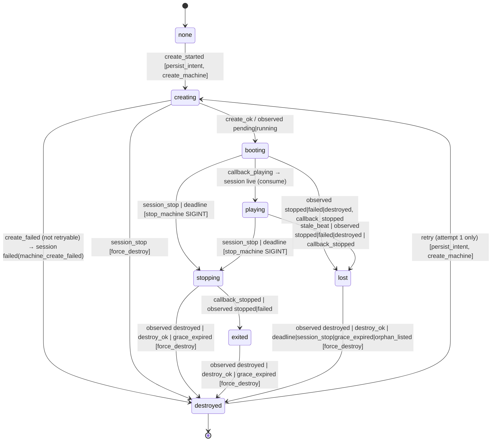

# Streaming R1 — Relay Core — Implementation Plan

> **For agentic workers:** REQUIRED SUB-SKILL: Use superpowers:subagent-driven-development (recommended) or superpowers:executing-plans to implement this plan task-by-task. Steps use checkbox (`- [ ]`) syntax for tracking.

**Goal:** Tier B's first sellable artefact with zero new deployables — an organiser buys match credits from the fixture console's Phone tab, pairs a phone by QR, and goes live PASSTHROUGH (Cloudflare simulcasts the clean feed to the destination); the composed mode's data path, tokens, sweep and runner port exist behind in-repo fakes so R2 adds only the Machine image and the relay page.

**Architecture (domain-driven, three layers, revised 2026-09-14 on the owner's instruction):**
- **Domain — `server/relay/domain/`, PURE.** No `sql`, no `fetch`, no `Date.now()` (`now` is injected), the shape `packages/engine/src/core/events.ts` gives scoring (a reducer over typed commands, I/O-free). Four units: the session aggregate (`session.ts`: `decide(session, command, now) → { next, events, effects }`, owning every invariant — the §6.3 create gates, one active session per fixture, `runner_retries ≤ 1`, legal §6.4 transitions only); the expiry policy (`expiry.ts`: `evaluate(session, now) → transition | none` — warming timeout, stale heartbeat with ONE inline retry, wall clock); the credits value object (`credits.ts`: `debit` refuses a negative balance, mirroring FS10; `headroomAfterReservations` is the C3 arithmetic); the retention policy (`retention.ts`: which videos are deletable at `now`, which inputs only after their videos are gone — C1/C2). Domain events are plain typed records (`SessionWentLive`, `SessionEnded { reason }` …) the application layer logs and persists; there is no event bus.
- **Application — `server/usecases/stream-sessions.ts`, `stream-credits.ts`, `stream-targets.ts`, `relay-sweep.ts`.** Load under the row lock → `decide` / `evaluate` → persist → run the effects through the ports. SQL stays in the usecases (repo idiom; no repository layer — nothing present earns one). **Expiry runs LAZILY on every session read, heartbeat, Phone-tab poll and admission, inside the row lock**, so no money or safety rule depends on the cron (recommendation B, below): the daily cron keeps retention plus a backstop pass of the same `evaluate` for sessions nobody reads, and destroys orphan Machines.
- **Infrastructure — the ports' adapters.** `ingest-cf.ts` (Cloudflare Stream), `fly-client.ts` (a typed, retrying, redacting Machines API client — its own TDD'd unit) under `runner-fly.ts`, `fakes.ts` for CI, the AES-256-GCM envelope (`crypto.ts` + `secret-columns.ts`, the ONLY SQL over a `*_enc` column), the `AUTH_SECRET`-signed job/page tokens, Postgres through `sql`/`sql.begin`. Four tables in one migration (`__stream_sessions.sql`, stem only), RLS with zero client policies. Routes are parse → authorize → delegate under `v1()`/`handler()`. The Phone tab in `fixture-stream-panel.tsx` is a state-mapped client island that renders the QR client-side from the organiser-authed `current` projection, buys credits through the SAME embedded Stripe Checkout modal the AI credits use (`components/buy-credits.tsx`), and never sees a secret in page HTML.
- **TDD in every task, explicitly:** the pure domain test first (no DB, milliseconds), the adapter contract test against a fake HTTP layer, then the DB-backed usecase test, then e2e — each step names its verify command and the expected red.

**Tech Stack:** Next.js App Router (this repo's version — read `node_modules/next/dist/docs/` before writing a route), React 19, TypeScript, Zod 4 (also the boundary parser for the Fly client's responses — the repo's validator; `lib/funnel.ts`'s `safeParse` on a stored payload is the precedent), postgres.js (`sql`, `withTenant`), `jose` 6 (HS256), Node `crypto` (AES-256-GCM), `qrcode` 1.5 (+ `@types/qrcode`), Stripe SDK 22 (sandbox) + `@stripe/react-stripe-js` (`EmbeddedCheckoutProvider`/`EmbeddedCheckout`, already used by `components/buy-credits.tsx`), the Fly Machines API (`https://api.machines.dev/v1`, OpenAPI at `https://docs.machines.dev/spec/openapi3.json`, verified 2026-09-14 — Task 5A pins every fact), vitest (`environment: "node"`, JSON reporter only), Playwright 1.61 (`walkthrough` project), `scripts/smoke.ts`, pino via `@/server/logger`.

**Spec:** `docs/superpowers/specs/2026-09-07-streaming-programme-design.md` §5 (entitlements and money), §6 (tables, secrets, routes, state machine, storage guard, token domains), §7.1 (runner port), §7.6 (QR contract v1), §9a (patterns — every task below names one with its exemplar), §10 (testing and gates), §3.8 (panel). Wave prompt: `docs/superpowers/specs/2026-09-05-stream-overlay-prompts/R1-relay-core.md`. **Overriding corrections (win over the prompt and the design where they conflict, row by row): the orchestrator's `R0-CORRECTIONS-FOR-R1.md` (2026-09-13), whose numbers come from `R0-memo.md` and `_INDEX.md` §"2026-09-12 — R0 bench CLOSED" / §"Owner rulings, 2026-09-13".** Binding values for the UI: `_THEMES.md` §8a (Phone tab, option A "Stepper") and §8b (credits card, option A "Three tiles"). Rules: `_RULES.md` R1, R7, R8, R10, R14, R15, §Repo traps, §Shell guard; `docs/superpowers/RULES.md` §"Owner checklist (2026-09-07)".

**Sibling plans (keep names compatible):** `2026-09-07-streaming-t1.md` (the visual-gate harness this plan adds rows and one seed kind to — `e2e/visual/manifest.ts`'s `SEED_KINDS`/`SEED_PARAMS` and `seeds.ts`'s one `case` are the extension point; never harness code), `2026-09-05-stream-overlay-w1.md` (the panel, `streamUrlSchema`, `setFixtureStreamUrl`, the V402 rows — all consumed, never edited).

## Global Constraints

- **Execution worktree:** `/Users/ashokhein/github/seazn.club/.claude/worktrees/relay`, branch `feat/stream-relay`, cut from `main` (R1 prompt header; PR1 #761 is merged, so `main` carries W1). This plan was written in a DIFFERENT worktree (`r1-plan`, branch `docs/streaming-r1-plan`) — nothing here executes there. Prefix EVERY shell command with `cd /Users/ashokhein/github/seazn.club/.claude/worktrees/relay &&` (or `…/relay/apps/web &&`) in the SAME call: the shell cwd resets to the main checkout between calls and a verify launched without it runs on `main` and returns a false green. Run git as `/usr/bin/git`, as SEPARATE plain calls. Never `git stash` in a worktree. No heredocs, no `eval` — the Write tool writes files. `grep -a` always.
- **Environment label `rly`:** `~/.claude/skills/seazn-local-env/scripts/seazn-env.sh up --label rly --server` from the relay worktree; the printed `DATABASE_URL` and `SMOKE_BASE` win and are copied INLINE into every command (never `eval`, never a shell variable — the guard refuses both). `rebuild --label rly` after every code change; a second `up --server` serves the OLD bundle. Confirm `show data_directory` contains `rly` before believing any DB result. `pnpm`, never `npm install`; a fresh worktree has NO `node_modules` and NO `.env.local` (Task 0 installs and symlinks with RELATIVE targets).
- **Judge vitest ONLY from `--reporter=json --outputFile=<file>`:** read `numPassedTests` / `numTotalTests` / `numFailedTests` / `numPendingTests` with one `node -e` line and confirm every `.testResults[].name` starts with `/Users/ashokhein/github/seazn.club/.claude/worktrees/relay/`. `rtk` prints `PASS(0) FAIL(0)` for a suite that failed to collect; a module-scope throw collects ZERO tests and reads green — read the suite `message`. JSON reports go to `/private/tmp/claude-501/-Users-ashokhein-github-seazn-club/a923b0db-2e33-4068-9bb3-9d69a79038c7/scratchpad/r1/` (`mkdir -p` once). DB-backed tests need `DATABASE_URL=… DATABASE_SSL=disable` INLINE (~700 tests skip silently without it and `total` does not move).
- **Whole spec files, never a `-g` slice.** Playwright runs from `apps/web` with `PLAYWRIGHT_BASE=<rly base>` (a `localhost` URL, never `127.0.0.1` — the Secure cookie is not stored from `127.0.0.1` and auth fails as a later 401) and `E2E_PROD_TARGET=1`; `RELAY_DRIVERS=fake` is set on the SERVER under test (it is read at request time, not at build time). `mobile.spec.ts` is serial: a red count there is a floor.
- **Migrations: a version number is NEVER pinned in this plan (owner ruling 2026-09-10).** The file is named by its STEM, `__stream_sessions.sql`. Task 1 resolves the number when it STARTS: `ls db/migration/deltas | sort -V | tail -1` PLUS `/usr/bin/git log --all --diff-filter=A --name-only --pretty=format: -- 'db/migration/deltas/V4*' | sort -u` (a concurrent branch can have claimed a number this tree never shows). Snapshot at `54a125d9f` (the P-table's pin) and unchanged at `9a7393cf4` (#782, `main` on 2026-09-14): the tail is `V402__streaming_entitlements.sql` — a snapshot, NOT an instruction; if the tail has moved, take the next free number after the moved tail. **No entitlement migration:** V402 already shipped BOTH keys (`streaming.overlay`, `streaming.relay`) false on all five plans. If Task 1's file is written and not yet merged when `main` lands another migration, AMEND the file to the free number (never a forward-fix; a duplicate Flyway version survives a clean rebase and reds late). Re-run `ls db/migration/deltas | sort -V | tail -1` after EVERY rebase.
- **Every new user-facing string in all four dictionaries** (`apps/web/src/dictionaries/{en,es,fr,nl}/ui.json`, extending the existing `stream.` prefix — P15), then `pnpm i18n:gen-keys` and commit `apps/web/src/lib/i18n-keys.ts` (GENERATED — never hand-edited). A key no code path can select is NOT written (E5: no `stream.fail.storage_exhausted`).
- **Every new v1 route goes into `server/api-v1/openapi.ts`'s `ROUTES` in the same change (R7)** — `openapi-coverage.test.ts` walks `app/api/v1/**/route.ts` and asserts an exact 1:1 — AND into `server/api-v1/key-scopes.ts` (`NEVER_KEY_ROUTES` for this wave: money-consuming and secret-bearing, the device-links precedent), then `npm run openapi:gen` with zero diff under `openapi/`. Routes under `app/api/billing`, `app/api/cron`, `app/api/internal` are outside the v1 spec.
- **One DOM branched for phone:** `max-md:*` on the same tree, phone-only `md:hidden`; identical control SET at 320 and 1280 (membership, order, repeats); no horizontal page scroll at 320/360/375/390/430/768/834. `/\bmd:hidden\b/` also matches inside `max-md:hidden` — anchor assertions on `\s...hidden"`. `truncate` needs `min-w-0` on the whole ancestor chain.
- **Owner checklist additions (2026-09-14) bind every task.** Each task's "Checklist rows satisfied" names rows from the 2026-09-07 checklist AND the 2026-09-14 additions (VERIFY-AS-CUSTOMER / PRODUCT-OWNER LENS / TEST-CASE DESIGN — see §"House rules 2026-09-14"); the reviewer checks rows, not prose. Two VERIFY-AS-CUSTOMER runs are steps of this plan (Task 14 Step 8, Task 17 Step 6): a real browser, a fresh signup, no seed, no shortcut; the seeded e2e (Task 15) is automation and does not substitute.
- **Every subagent dispatch passes `model: opus` explicitly** (owner instruction 2026-09-05; agent frontmatter reads `sonnet`). Every brief carries: exact paths, acceptance bullets, the do-NOT-touch list, the verify command with `cd <relay worktree> &&` and `DATABASE_URL` inline, `RELAY_DRIVERS=fake`, the shell guard, the output cap ("final message under 15 lines — counts, paths, deviations, blockers; no file contents or diffs"). A stopped agent is resumed, never re-dispatched. Reviewer after every lane; the P3 grep (`grep -a -rn "SUPABASE_JWT_SECRET" apps/web/src --include=*.ts | grep -v "lib/realtime.ts"` → empty) in every review.
- **Do NOT touch:** W1's overlay route, stage, registry, hook, `overlay-model.ts`, `public_fixtures_v`; `lib/realtime.ts` (P2: NO producer mint exists there and R1 builds none — see Non-goals); any `SUPABASE_JWT_SECRET` call site; `stages-panel.tsx`; `run-sheet-row.tsx` beyond the ONE `streamOpen` initialiser line the owner allowed on 2026-09-14 (Task 14 Step 5 — nothing else in that file); other entitlement keys' rows; every pricing surface (`ENTITLEMENT_DOMAINS`, `/pricing`, `lib/pricing-matrix.ts`, `config/stripe-plans.json`); `ai_credit_ledger`, `lib/credits.ts`, `lib/credit-packs.ts` (donors — read, never edited); the engine; `.github/workflows/e2e.yml`; `e2e/visual/capture.spec.ts` / `asserts.ts` (harness — rows and one seed kind only).
- **Layering rule (owner instruction 2026-09-14, and AGENTS.md's anti-abstraction rule):** `server/relay/domain/**` imports nothing from `@/lib/db`, `@/server/logger`, `./ports`' adapters or `fetch` — `enc-boundary.test.ts`'s sibling `domain-purity.test.ts` (Task 2A) greps it. The usecases are the only place SQL and the ports meet; there is NO repository interface, NO event bus, NO command bus — each would be an abstraction with no present caller. A domain event is a typed object in an array the usecase iterates.
- **Patterns this plan invokes (spec §9a), each with its exemplar:** Pure domain reducer over typed commands (`packages/engine/src/core/events.ts` — I/O-free, `now` passed in; this wave: `domain/session.ts` `decide`); Parse → authorize → delegate (`lib/http.ts` `handler`; `server/api-v1/auth.ts` `requireResourceAuth`; `app/api/v1/fixtures/[id]/stream/route.ts`); Zod schemas in one place (`server/api-v1/schemas.ts` `PutFixtureStream`); Ports and adapters with in-repo fakes (`IngestProvider`/`RunnerProvider` + `server/relay/fakes.ts`; the placement service client); State machines over booleans (`fixture_stream_sessions.state` + `desired_state`; the pad reducer); Money is ledger rows in the same transaction (`ai_credit_ledger` V320 + `lib/credits.ts` `balance`); Cron pair idiom (`app/api/cron/registrations/route.ts` — 503 unset BEFORE 401 mismatch); Deny by default (RLS zero client policies, V366; 404 ≡ missing); The client never decides (`hasFeature` on the division page); One authority per fact (`resolveFixtureCfg`; this wave: `creditBalance` = `sum(delta)`, `STREAM_CREDIT_PACKS`, `server/relay/config.ts`); Registry over branching (`V3_SKINS`; this wave: the fail-reason and create-error copy MAPS); Pure projections, strings via `msg` (`overlayModel`); i18n four dictionaries + generated keys; One DOM branched for phone (`phone-disclosure.tsx`).

## Corrections ledger — where every C/P row lands

Each row of `R0-CORRECTIONS-FOR-R1.md` lands either as a task requirement WITH a test, or as a reasoned non-goal below. The reviewer checks this table, not the prose.

| Row | Lands in | As |
|---|---|---|
| C1 `deleteRecordingAfterDays: 30`, 3-day promise is a sweep rule on VIDEOS | Task 4 (constant + create body), Task 12 (retention rule) | `DELETE_RECORDING_AFTER_DAYS = 30` in `config.ts`; `ingest-cf.test.ts` asserts the body against the constant AND that the constant is inside Cloudflare's 30–1096 range; a mutant setting 7 is killed by the range assertion |
| C2 videos before inputs; 409/10046 retried next tick (a DAY apart now — owner ruling 3) | Task 2B (`domain/retention.ts`), Task 12 | pure `retentionPlan` unit: an input is never in the delete list while a video names it; `relay-sweep.test.ts` "409 once, then 200 on the next daily tick" |
| C3 reserve at admission | Task 2B (`headroomAfterReservations`), Task 10 (create gate — reservations EXCLUDE sessions the expiry policy has already expired) | pure differential: raw headroom sufficient, two `live` reservations push it under; DB unit: same sessions `completed` → 201; an expired-but-unread session no longer reserves |
| C4 `recording.mode` always `automatic`, never updated | Task 4 | static test over `ingest-cf.ts` source: `mode: "automatic"` present, no `PUT`/`PATCH` to `/live_inputs/` carrying `recording` |
| C5 per-input GET for status; list omits `recording` | Task 3 (fake shape), Task 4 | `inputStatus` fetches `/live_inputs/{uid}`; the fake mirrors `status.current.{ingestProtocol,state,statusEnteredAt,statusLastSeen}`; a test asserts the URL has no trailing list path |
| C6 never "healthy" off `connected` | Task 13 (view model), Task 14 (panel) | health line copy is `stream.health.ingest.<state>` ("Receiving from phone"); a test asserts no dictionary value under `stream.health.*` contains "healthy"/"Healthy" |
| C7 `performance-4x / 8 GB`, `auto_destroy`, `restart: no`, idempotent `destroy` | Task 5A (`fly-client.ts`), Task 5 (`runner-fly.ts`) | `runner-fly.test.ts` asserts guest/auto_destroy/restart from `RUNNER_DEFAULT_GUEST`; `fly-client.test.ts`: `destroy` of a 404 Machine resolves; the Machine-side hard stop (`RELAY_DEADLINE_AT` in the guest env + `auto_destroy`) is recommendation B's |
| C8 explicit `timeoutSeconds`; `holdWindowSeconds` RTMPS only, SRT null; nothing on `EXT-X-ENDLIST` | Task 4 | `INGEST_TIMEOUT_SECONDS = 180` (the value R0's cells measured); capabilities `{ holdWindowSeconds: { rtmps: 183, srt: null } }`; static grep: no `ENDLIST` under `server/relay/**` |
| C9 passthrough adds exactly one output; composed zero | Task 10 | provision unit over `FakeIngest`: `outputsFor(inputId).length` is 1 / 0 |
| C10 no WHEP, no WHIP | Non-goal | `webRTC`/`webRTCPlayback` from the create response are NOT stored — `ingest-cf.test.ts` asserts the returned credentials object has no `webRTC` key |
| C11 no `preferLowLatency` | Non-goal | static grep in `ingest-cf.test.ts`: `preferLowLatency` absent from `server/relay/**` |
| C12 no `/user/tokens/verify` | Task 4 | static grep: absent from `server/relay/**`; no boot/health check calls it |
| C13 browser UA on any server-side HLS fetch | Non-goal | R1 fetches no manifest (no consumer); `ingest-cf.test.ts` asserts no `.m3u8` string under `server/relay/**` |
| C14 `preferred` asserts nothing | Task 13 | `QR_PREFERRED_DEFAULT = "srt"` is one config line; the contract test accepts `"rtmps"` too; R0 FP-4 recorded for R3 in `_INDEX.md` (Task 17) |
| P1 no workflow here; route + absence test; the schedule is DAILY (owner 2026-09-14: "just run every day is fine") | Task 12 | `relay-sweep-workflow.test.ts` sibling of `registrations-sweep-workflow.test.ts`; the daily `relay-sweep.yml` is an item for `onryde/seazn.club.workflow` (Task 17); because one tick a day is too late for money/safety, those rules run lazily (recommendation B) |
| P2 no producer realtime mint | Non-goal | recorded as a false premise carried to R2 |
| P3–P5 symbols | Task 0 | re-pinned by symbol |
| P6 purchase lands on the webhook synchronously; the sweep is a retry | Task 8, Task 15 | webhook branch unit; e2e drives `POST /api/cron/billing-events` after the purchase and asserts the balance is unchanged (replay is a no-op) |
| P7 `requireBillingOwner` vs `requireOrgAuth` | Task 8 | decision recorded in the route's doc comment (below) |
| P8 FS10 donor | Task 1, Task 2B | design DDL verbatim; owner RULED 2026-09-14: keep `balance_after >= 0` ("all good"); `domain/credits.ts` `debit` mirrors it in memory |
| P9 no refund neighbour | Task 7 | `grantCredits` / `refundCredits` are NEW functions |
| P10 `setBoolEntitlementOverrideSql` at `e2e/helpers.ts` | Task 15 | e2e helper, thawed in `afterAll` |
| P11 `docs/contracts/` created | Task 13 | contract + fixtures |
| P12 Vault | — | owner RULED 2026-09-14: NO Vault; the AES-256-GCM envelope with `RELAY_KEK` is final (Task 2); no Task 0 read |
| P13 `stream-tab-phone` | Task 14, Task 15 | the shipped testid; `stream-phone-tab` exists nowhere |
| P14 two `CREDIT_PACKS` | Task 8, Task 14 | ONE authority: `lib/stream-credit-packs.ts` `STREAM_CREDIT_PACKS`; the panel's own constant is DELETED |
| P15 `ui.stream.*` | Task 14 | extends the 33 existing keys |
| P16–P17 `hasFeature`, `UpgradeGate` | Task 11, Task 14 | by symbol |
| P18 gated-transaction harness | Task 7 | `registration-concurrency.test.ts` §5's `releaseBoth`/`bothStarted` idiom, adapted to a `for update` lock |
| P19 Sentry `fly.toml` | Task 17 | owner OK'd enabling it 2026-09-14; the DSN is OWED by the owner — the line is uncommented only when the DSN arrives |
| P20 `jose` | Task 6 | already a dependency |
| P21 division gate | Task 14 | `relayEntitled` is already threaded; nothing to add |
| P22 `server/relay/` | Tasks 2–6 | created |

## Non-goals (reasoned, each with its C/P row)

- **No WHEP and no WHIP in R1 (C10).** R1's phone ingest is SRT/RTMPS; WHEP is ingest-gated (409 on an RTMPS/SRT input) and a WHIP-ingested input produces no recording and no HLS. The `webRTC`/`webRTCPlayback` halves of Cloudflare's create response are dropped at the driver boundary and never stored — R2's dual-publish (owner 2026-09-12) is R2's.
- **No `preferLowLatency` (C11).** R1 has no Seazn-hosted playback: passthrough viewers watch the destination. The field is updatable later (PUT persists it), so R2 sets it when the relay page exists to benefit.
- **No manifest watcher, no server-side HLS fetch (C6, C13).** Nothing in R1 consumes a manifest. The health line reports the ingest state from the per-input GET, worded as what it is. Any later liveness read must read progression within ONE variant with a null baseline reading `unknown` — recorded in `_INDEX.md` for R2.
- **No producer realtime mint (P2).** `lib/realtime.ts` exports `publishFixtureUpdate`, `publishDivisionUpdate` and `mintPublicFixtureToken` (signs with `SUPABASE_JWT_SECRET`); no producer mint exists anywhere. Its only consumer would be R2's relay page. A false premise, carried to R2.
- **No `/user/tokens/verify` (C12).** The Cloudflare token is account-owned; a credentials check, if R2 ever needs one, reads a Stream endpoint.
- **No composed-mode Machine, relay page, slate, `delayMs` (R2).** The composed mode's rows, tokens, heartbeat route, runner port and sweep rules exist and are unit-tested over `FakeRunner`; the Phone tab's mode toggle shows "With scorebug" DISABLED with "coming soon" copy so the seam is visible.
- **No phone app (R3).** Only `docs/contracts/capture-qr.v1.json` and its fixtures land here (§7.6). R0 FP-4 (ffmpeg SRT on a Fly Machine never started a broadcast; a handset on SRT did) is an R3 input, recorded, not an R1 change (C14).
- **No Fly region picker for organisers (owner accepted, 2026-09-14).** `RUNNER_DEFAULT_REGION = "lhr"` is the only region this wave sends. R2 may derive the region from the org's country, with a capacity-fallback region, INTERNALLY and never user-facing; the R2 bench measures one far-away case first. No `region` field crosses the API, the panel or the QR contract.
- **No real session drives a Machine in R1.** Composed mode ships DISABLED in the Phone tab (Task 14), so the lifecycle is proven through the domain's parity sweep (Task 2C), the fakes (Tasks 3, 10, 12) and the opt-in live Fly test (Task 5A) — never by an organiser's session. Recorded again under Task 17's "What R1 does NOT prove".
- **Nothing workflow-shaped is added to this repo (owner note, 2026-09-14).** The daily sweep workflow lives in `onryde/seazn.club.workflow`; P1, Task 12 and Task 17 point there and `relay-sweep-workflow.test.ts` reds if a copy ever appears here.

## Owner rulings, 2026-09-14 (verbatim-short; these are RULINGS, recorded again in Task 17's `_INDEX.md` step)

1. **FS10 — KEEP `balance_after integer not null check (balance_after >= 0)`.** Owner: *"all good"*. Task 1 builds §5.2's DDL verbatim; Task 2B's `debit` mirrors the floor in memory; Task 7 writes the snapshot under the lock.
2. **Vault — NO.** The AES-256-GCM envelope with `RELAY_KEK` (Task 2) is final. Task 0 no longer reads the Supabase project; §12.4 is closed.
3. **Sweep schedule — DAILY.** Owner: *"just run every day is fine"*. The `onryde/seazn.club.workflow` workflow runs once a day, not every 5 minutes (P1, Task 12, Task 17). The consequence for money and safety rules is recommendation B below.
4. **`run-sheet-row.tsx` — ALLOW the one `streamOpen` initialiser line** so a return from checkout reopens the panel on the Phone tab. Task 14 Step 5 makes it a real step with its own test (`run-sheet-row-stream-gate.test.tsx`), not a fallback; the harness rows in Task 17 depend on it and are now unconditional.
5. **Both added columns ACCEPTED:** `org_stream_targets.watch_url text null` (the replay fill's source) and `fixture_stream_sessions.runner_retries smallint not null default 0` (the ONE retry survives a restart).
6. **`INGEST_TIMEOUT_SECONDS = 180`** — owner: *"3 mins after phone goes away"*. C8 stays: `holdWindowSeconds = 183` for RTMPS only, SRT `null`.
7. **Sentry — enable it.** The DSN is NOT yet supplied: Task 17 Step 3 stays conditional on the DSN; `_INDEX.md` records "DSN owed by owner".
8. **Checkout is EMBEDDED, like the others.** Owner: *"checkout should be inbuilt as other"*. Task 8 copies `lib/credit-packs.ts` / `app/api/billing/credit-pack-checkout/route.ts` (`ui_mode: "embedded_page"`, `return_url`, the route returns `{ client_secret }`); Task 14 copies `components/buy-credits.tsx` (`Modal` + `EmbeddedCheckoutProvider`/`EmbeddedCheckout`); Task 15's e2e fills the card inside Stripe's embedded iframe with `event-pass.spec.ts`'s own frame selectors. Every "hosted" sentence is gone from this plan.

## Recommendation B — no money or safety rule may wait for a daily tick (the plan-writer's, NOT an owner ruling)

At one tick a day, the rules Task 12 first owned (warming timeout, stale-heartbeat crash, max-duration end, the ONE runner retry) become up to 24 h late: an orphan Fly Machine bills all day, a stuck session holds its C3 reserve all day, and a retry after the match is useless. So the plan restructures — the owner ruled the cadence, this is how the plan honours it without the cost:
- **One pure policy** (`domain/expiry.ts`, Task 2B): `evaluate(session, now) → transition | none`.
- **It runs lazily** on every session read (`currentSession`), every heartbeat, every Phone-tab poll and at admission (`createSession` — the C3 reserve excludes sessions the policy has already expired), inside the row lock (Task 10).
- **Machine-side hard stop:** the runner's guest env carries `RELAY_DEADLINE_AT` (ISO, = created + `MAX_DURATION_MINUTES`) and the R2 supervisor exits at that instant on its own; C7's `auto_destroy` then removes the Machine. Pinned in Task 5 (the env is asserted in `runner-fly.test.ts`; the supervisor's honouring of it is R2's acceptance and is recorded as such).
- **The retry is inline:** when the heartbeat/poll path detects the stale beat, the same request destroys the old Machine and creates the replacement (Task 10) — never on a tick.
- **The daily cron keeps** retention (videos > 3 days, then inputs; a 409/10046 is retried the NEXT DAY), a backstop pass of the same `evaluate` for sessions nobody reads, and orphan-Machine destruction (the app's Machines listed by `metadata.seazn_session` against non-terminal sessions) — Task 12.
- **Tests prove each rule fires with NO sweep call** (Task 10's "lazy expiry" describe), and the mutant "delete the lazy `evaluate` call" is red there — the lazy path is load-bearing, not decoration.

## House rules 2026-09-14 — how this plan applies the owner's checklist additions

The orchestrator is adding the owner's three groups verbatim to `docs/superpowers/RULES.md` as "Owner checklist — additions (2026-09-14)". This plan does not restate them; it binds them. **Convention:** every task's "Checklist rows satisfied" line names rows from BOTH the 2026-09-07 checklist and the 2026-09-14 additions, by group (VERIFY-AS-CUSTOMER / PRODUCT-OWNER LENS / TEST-CASE DESIGN) and row; the reviewer checks rows, not prose. The three sections below are what the tasks point at.

### VERIFY-AS-CUSTOMER — the golden path and the break list (Task 14 Step 8 at the lane-D boundary; Task 17 Step 6 at wave close)

Separate from the seeded e2e (Task 15 stays automation). A REAL browser against the `rly` production build, a FRESH signup, a fresh org, **no SQL seed, no `setBoolEntitlementOverrideSql`, no admin route used by the tester as a shortcut** — the one staff action below is the real beta-customer journey, not a shortcut, and it is named. Owner rulings folded in:
- **(3) RULED, owner "Ok":** in R1 `ffmpeg` (a test pattern pushed to the session's RTMPS or SRT URL) stands in for the customer's capture app — R1 has no capture app (R3).
- **(2) Owner "Ok" to the options; RECOMMENDATION (the orchestrator's, adopted here):** every customer-verify run uses a SECOND Cloudflare live input as the destination sink — repeatable, needs no owner key, creates no public stream; clean up by deleting videos before inputs, as R0 did (C2). One real YouTube run at wave close is OPTIONAL and happens only if the owner supplies an unlisted stream key (owed; never committed, echoed or logged).
- **(1) NOT RULED — owner asked "what's best?"; carried as the orchestrator's recommendation, marked OWNER DECISION PENDING.** Fact, verified in the tree: `streaming.relay` and `streaming.overlay` are granted by NO plan (`V402__streaming_entitlements.sql` inserts `false` for all five plans; dark rollout, design §5.1/§10.4); the GA flip to pro / event_pass_l / enterprise is a later migration with pricing copy and `ENTITLEMENT_DOMAINS`. During R1 no customer can acquire the key by buying anything. A real staff path exists: the per-org overrides editor on `/admin/orgs/[id]` (`apps/web/src/app/admin/orgs/[id]/page.tsx`, backed by `app/api/admin/orgs/[id]/entitlement-override/route.ts`). **Recommendation: R1 stays dark. The GRANTED state = a fresh signup/org, then staff grants `streaming.overlay` + `streaming.relay` to that ONE org through the REAL `/admin/orgs/[id]` editor** — the actual beta-customer journey; every step after the grant runs as the customer with no shortcut. **The DENIED state = a second fresh org with no grant, which must see the correct `UpgradeGate`, not a broken panel.** Owner value: no paying Pro customer can buy match credits for a relay whose composed mode and real Machines are unproven; the grant is reversible per org (remove the override); every customer-facing step after access is still verified for real. Cost: the purchase-to-access step is deferred and named under "What R1 does NOT prove".

**The golden path, end to end, once (real Cloudflare — `RELAY_DRIVERS=live` on the `rly` server with the Cloudflare token already in `.env.local`; real Fly is NOT exercised: composed is off and `FLY_API_TOKEN` is owed, so the live driver set constructs the Fly runner LAZILY, Task 5):**
1. Sign up fresh (new email), create a fresh org, a competition, a division, a fixture — as a customer.
2. Staff (a second browser, the real `/admin/orgs/[id]` editor) grants `streaming.overlay` + `streaming.relay` to that org. Record the screen.
3. As the customer: the fixtures tab → the camera toggle → the Phone tab shows the buy card at balance 0 (read every string).
4. Buy the 1-pack through the EMBEDDED sandbox checkout (4242) — the modal, the return, the balance chip reading 1.
5. Add a destination: the sink is the RTMPS URL + key of a second Cloudflare live input created for this run (recommendation 2), label it "Sink".
6. Go live → warming → the QR and the paste code; read the SRT/RTMPS details off the screen (the customer's view).
7. Push a real encoder: `ffmpeg -re -f lavfi -i testsrc2=size=1280x720:rate=30 -f lavfi -i sine=frequency=440 -c:v libx264 -preset veryfast -g 60 -b:v 2500k -c:a aac -f flv "<rtmps url><stream key>"` (the ruled stand-in for the capture app), then separately the SRT leg once (`-f mpegts "<srt url>"`) — record which leg the health line turned to "Receiving from phone" on, and how long it took.
8. See the ingest state change on screen; see the state pill go live; see the credit consumed (balance chip 0).
9. Confirm the SINK input is receiving (its per-input status on the Cloudflare dashboard or the API) — the simulcast output is real.
10. Stop → confirm dialog → ended; the replay link (the sink has no watch URL, so none — read the ended copy).
11. Then the break list, each named and screenshotted: **empty inputs** (add-destination with blank fields, a blank stream key); **wrong perms** (a second user who is a viewer on the org: no camera toggle, and `POST /api/v1/fixtures/{id}/stream-sessions` → 403, `POST /api/billing/relay-checkout` → 403/400); **network fail mid-create** (throttle offline right after "Go live": the error copy, then reconnect — one session, one input); **back button out of checkout** (Escape/close the modal mid-payment, then the browser back button: no orphan session, no charge, balance unchanged); **double-tap "Go live"** (two rapid taps: ONE session, ONE credit — the 409 path never shows as an error to the customer); **denied state** (the second org: the UpgradeGate, the correct sentence, no `stream-*` controls).
12. Widths 320 / 768 / 1280 for steps 3–10, no horizontal scroll; every string a customer reads, read; screenshots saved with a per-screen verdict into `_STATE.md`.
13. Clean up: delete the run's videos, then both inputs (C2 order).

### PRODUCT-OWNER LENS — irreversible actions R1 performs, and scope creep

| Irreversible action | Where | Guard / sign-off |
|---|---|---|
| Money captured (a match-credit purchase) | Task 8 route + Stripe sandbox | sandbox-only until the GA flip; 402 `plan_lacks_relay` before Stripe; the ledger row is idempotent by `stripe_event_id`; refunds are admin `refundCredits` rows (Task 7) |
| A credit consumed at `live` | Task 10 `consume_credit` inside the row lock | the 24 h same-fixture reuse rule; FS10's floor; `grant`/`refund` rows are the only remedy — recorded, never deleted |
| Cloudflare recording DELETED (3-day retention) | Task 12 through `retentionPlan` | videos before inputs; a 409 defers a day; the OWNER accepted the 3-day promise (2026-09-12); no undo — flagged |
| Cloudflare live input DELETED | Task 12 | only after its videos are gone and the session has been terminal ≥ 3 days |
| Fly Machine destroyed (force) | Tasks 10/12 through the lifecycle table | only from `stopping`/`exited` after grace, `lost`, or an orphan; `auto_destroy` is the normal path; idempotent |
| The migration (four tables) | Task 1 | greenfield, no backfill; RLS forced with zero policies; a migration is reversible only by a new migration — explicit owner sign-off on the DDL happened on 2026-09-14 (rulings 1, 5) |
| An org's entitlement override (the beta grant) | `/admin/orgs/[id]` (existing) | reversible per org; staff-only |

Scope creep found while planning, marked for the owner's call: (a) `org_stream_targets.watch_url` and `runner_retries` (ruled 5, accepted); (b) the four lifecycle columns `runner_state`, `runner_name`, `runner_stop_requested_at`, `end_reason` (this revision — needed by the owner's own lifecycle instruction; **owner call**); (c) `RunnerProvider.list/stop/observe` beyond design §7.1's `{ create, destroy }` (needed by the lifecycle and the orphan sweep; **owner call**); (d) the embedded-checkout `Modal` in the panel (ruled 8); (e) the ended-state `end_reason` chip and its copy (a customer-facing string the lifecycle makes true; **owner call** — smallest change that says why a stream ended). Nothing else grew: no region picker, no composed UI, no WHEP, no LL-HLS, no phone app.

### TEST-CASE DESIGN — the write-path diffs and the added cases

Every new write path is diffed against its nearest analogue for a missed guard, recorded here and checked by the lane reviewer:

| New write path | Nearest analogue | Guards the analogue has → present here? |
|---|---|---|
| `consumeForSession` / `recordPurchase` / `grantCredits` / `refundCredits` (Task 7) | `lib/credits.ts` `reserve`/`recordPackPurchase` over `ai_credit_ledger` (V320) | `for update` on the wallet → yes (`lockOrg`); `balance_after >= 0` CHECK → yes (FS10 kept); idempotency key on purchase → yes (`stripe_event_id` unique); positive-integer delta → yes (`credit`/`debit` refuse); compensating rows never UPDATE/DELETE → yes; `spent_by_org_id` per-org reporting → N/A (one org per ledger) |
| `POST /api/billing/relay-checkout` (Task 8) | `credit-pack-checkout/route.ts` | `requireBillingOwner` → yes; locked currency → yes (`preferredCurrency`); 30 s idempotency bucket → yes; `metadata.credits` snapshot → yes; `.strict()` body → yes; **plus** the `orgId` equality check and the 402-before-Stripe gate the analogue does not need |
| the `stream_credits` webhook branch (Task 8) | the `credit_pack` branch in `handleCheckoutCompleted` | `payment_status === "paid"` → yes; snapshot-else-catalogue-else-log → yes; replay-safe by id → yes; `linkStripeCustomer`/`pinBillingCurrency` → yes; staff alert email on ungranted → **no** (recorded as a follow-up; the log.error is present) |
| `createSession` insert (Task 10) | `createRegistrationCheckout` / `confirmPaidRegistration` (row lock + CAS in `registrations.ts`) | the partial unique index as the race backstop (23505 → 409) → yes; the 23505 catch re-reads the winner → yes; gates BEFORE the insert in one transaction → yes; network calls OUTSIDE the transaction → yes |
| `createStreamTarget` (Task 9) | `createVenue` | `assertUuid` + `requireOrgAuth(write)` → yes; org equality in the usecase → yes; validated URL → yes (`streamUrlSchema`) |
| `persist` of the aggregate (Task 10) | the pad reducer's single writer | ONE writer of `state` → yes (only `apply`); every field from `next` → yes |
| retention deletes (Task 12) | `sweepRegistrations`' lapse branch | idempotent re-run → yes (absent = success); videos before inputs → yes (C2); advisory lock per session → yes |

Cases added by this pass (each is an `it` in the named file): boundary 0/1/max — `debit(1)`→0, `debit(0)` throws, `credit` at the pack sizes (Task 2B); `headroom == max_duration` admits (Task 2A); `slot` −1/0/1 (Task 1); the 24 h window at 24 h−1 s and 24 h (Task 2B); the grace at T−1/T (Task 2B); empty/null — empty ledger (Task 7), null view (Task 13), no videos/no inputs (Task 2B), `exitInfoFrom([])` (Task 5A), `fromFlyState(null)` (Task 5); malformed — a non-JSON Fly body, a Machine without `id` (Task 5A), a QR payload missing either half (Task 13), a heartbeat with an unknown `state` (Task 11), a non-rtmp target URL (Task 9); concurrent/race — two consumers (Task 7), the partial-index race (Task 10), a concurrent sweep (Task 12), double-tap "Go live" in the customer verify; a guard defeated per guard — the mutant tables in every task; expected values from the source of truth — the enums' `.options`, `config.ts`, the migration file, `RUNNER_TABLE`, `FLY_STATE_MAP`; money mutated specifically — m1–m5 with killers.

## Fly machine lifecycle (owner 2026-09-14: "make sure that fly machine lifecycle is well defined")

The runner is a SUB-STATE of the session aggregate (`domain/runner.ts`, Task 2C), driven only through `decide` (Task 2A). **The transition table below is the authority; the diagram mirrors it; the parity-sweep test (`domain/__tests__/runner.test.ts`) enumerates every cell from the EXPORTED tables, never from a hand-typed list.** Cross-referenced from Tasks 2A, 2C, 3, 5A, 5, 10, 12, 17.

**Fly facts this section rests on — verified 2026-09-14** (OpenAPI `https://docs.machines.dev/spec/openapi3.json`; `https://fly.io/docs/machines/machine-states/`; `https://fly.io/docs/machines/api/machines-resource/`; R0 evidence `R0-memo.md`): Fly's states are persistent `created, started, stopped, suspended, failed`, transient `creating, starting, stopping, restarting, suspending, destroying, launch_failed, updating, replacing`, terminal `destroyed, replaced, migrated` (machine-states page); the wait endpoint accepts `started | stopped | suspended | destroyed | failed | settled`; **`POST /machines/{id}/stop` takes `{ signal?, timeout? }` — signal defaults to SIGINT, `timeout` is "a Go duration string or number of seconds" before SIGKILL** (spec + machines-resource); `POST /machines/{id}/signal` takes `{ signal: SIGHUP|SIGINT|SIGQUIT|SIGKILL|SIGUSR1|SIGUSR2|SIGTERM }`; `GET /machines/{id}/events` returns `MachineEvent[] { id, type, status, source, timestamp, request: object }` — **the exit payload (`exit_code`, `oom_killed`, `requested_stop`) is NOT typed in the spec**; the client reads `request.exit_event.{exit_code, oom_killed, requested_stop}` DEFENSIVELY (all optional) and the live test records what Fly actually sends; `auto_destroy: true` = "the Machine destroys itself once it's complete" (both R0 soaks auto-destroyed on exit 0 — `R0-memo.md:565`); `restart.policy: "no"` never restarts on any exit. R0 also measured the stop itself: **SIGINT → ffmpeg exit 0, trailer written, in 114 ms** (`R0-memo.md:279`), and **`q` on stdin does NOT work under `-nostdin`** — the 10 s fallback SIGKILLed instead (`:346–354`). So the stop is a SIGNAL, never a keystroke. Whether a destroyed Machine's NAME is reusable in the same app is not documented → the name carries the attempt (`relay-<sid>-r<attempt>`) so reuse is never needed; the live test records the answer.

**Runner states** (`RunnerState`, stored in `fixture_stream_sessions.runner_state`):

| State | Meaning |
|---|---|
| `none` | no Machine has been asked for (every passthrough session stays here) |
| `creating` | the intended `runner_name`/attempt is PERSISTED and the create call is in flight — a process dying here is reconciled by name lookup on the next read (invariant 4) |
| `booting` | `machine_id` known; Fly may be `created/starting/started`; the relay page has not reported `playing` |
| `playing` | the runner's own heartbeat reported `playing` (session `live`) |
| `stopping` | our stop was sent (SIGINT, grace `RUNNER_STOP_GRACE_SECONDS`); waiting for exit 0 + auto_destroy |
| `exited` | observed `stopped`/an exit event after OUR stop; auto_destroy not yet observed |
| `destroyed` | observed `destroyed` (or 404); terminal for the runner |
| `lost` | observed `failed`/`stopped`/`destroyed`/gone WITHOUT our stop, a non-zero exit, or a stale heartbeat — the crash path |

**Fly state → observed input** (`fromFlyState`, Task 5; the ONLY place Fly's spelling is read):

| Fly state | `ObservedRunnerState` |
|---|---|
| `created`, `creating`, `starting`, `updating`, `replacing`, `restarting` | `pending` |
| `started` | `running` |
| `stopping`, `suspending` | `stopping` |
| `stopped`, `suspended` | `stopped` |
| `failed`, `launch_failed` | `failed` |
| `destroying` | `destroying` |
| `destroyed`, `replaced`, `migrated`, HTTP 404 | `destroyed` |
| anything else | `unknown` — typed, never a crash, never treated as running (C6's spirit) |

**Triggers** (`RunnerTrigger`): `create_started { name, attempt }` · `create_ok { machineId }` · `create_failed { retryable }` · `callback_playing` (heartbeat `playing`) · `callback_stopped` (heartbeat `stopped`) · `observed { state, exit? }` (GET/wait) · `stale_beat` · `deadline` · `session_stop` · `grace_expired` · `destroy_ok` · `orphan_listed` (the sweep found it listed with a terminal/absent session).

**Transition table** (`RUNNER_TABLE`; ✗ = `InvalidTransition`; "retry?" = attempt 1 → `creating` with the next attempt, attempt 2 → session `failed`):

| Runner \ Trigger | `create_started` | `create_ok` | `create_failed` | `callback_playing` | `callback_stopped` | `observed` | `stale_beat` | `deadline` | `session_stop` | `grace_expired` | `destroy_ok` | `orphan_listed` |
|---|---|---|---|---|---|---|---|---|---|---|---|---|
| `none` (session provisioning) | → `creating` [persist_intent, create_machine] | ✗ | ✗ | ✗ | ✗ | ✗ | ✗ | ✗ | ✗ (nothing to stop) | ✗ | ✗ | ✗ |
| `creating` (provisioning) | ✗ | → `booting` [persist machine_id] | retryable → retry? [none] · not → session `failed(machine_create_failed)` | ✗ | ✗ | `pending`/`running` → `booting` (crash-safe reconcile by name) · `destroyed`/`unknown` → stay | ✗ | ✗ | → `destroyed` [force_destroy by name if found] | ✗ | ✗ | ✗ |
| `booting` (warming, or a replacement in live) | ✗ | ✗ | ✗ | → `playing` (session `live`, consume — only when the session is warming; a replacement's `playing` changes nothing on the session) | → `lost` (booted then stopped) | `running`/`pending` → stay · `stopped`/`failed` → `lost` · `destroyed` → `destroyed` (retry? / failed) · `unknown` → stay | → `lost` [force_destroy] (a replacement that never plays; the policy emits it only for a LIVE session) | → `stopping` [stop_machine SIGINT] (session ending, end `max_duration`) | → `stopping` [stop_machine SIGINT] | ✗ | ✗ | ✗ |
| `playing` (live) | ✗ | ✗ | ✗ | stay (idempotent) | → `lost` | `running` → stay · `stopped`/`failed`/`destroyed` → `lost` · `unknown`/`pending` → stay | → `lost` | → `stopping` [stop_machine] (end `max_duration`) | → `stopping` [stop_machine] | ✗ | ✗ | ✗ |
| `stopping` (ending) | ✗ | ✗ | ✗ | stay | → `exited` | `stopped` → `exited` · `destroyed` → `destroyed` (session `completed`) · `running`/`pending`/`unknown` → stay · `failed` → `exited` (exit was non-zero — recorded, still completed: WE stopped it) | stay (a stopping runner is expected to go quiet) | stay | stay (idempotent) | → `destroyed` [force_destroy] | → `destroyed` | ✗ |
| `exited` (ending) | ✗ | ✗ | ✗ | ✗ | stay | `destroyed` → `destroyed` (session `completed`) · else stay | stay | stay | stay | → `destroyed` [force_destroy] | → `destroyed` | ✗ |
| `lost` (live/warming → crash path) | ✗ | ✗ | ✗ | ✗ | stay | `destroyed` → `destroyed` (then retry? or session `failed`) · else stay | stay | → `destroyed` [force_destroy] | → `destroyed` [force_destroy] | → `destroyed` [force_destroy] | → `destroyed` (then retry? or session `failed`) | → `destroyed` [force_destroy] |
| `destroyed` (terminal for this attempt) | retry only: attempt 1 → `creating` (attempt 2) | ✗ | ✗ | ✗ | ✗ | stay | ✗ | ✗ | stay (idempotent) | ✗ | stay (idempotent) | stay |

Session consequences (in `decide`): `create_failed` not retryable / second attempt exhausted → `failed(machine_create_failed)`; `booting` for `WARMING_TIMEOUT_MINUTES` → `failed(machine_boot_timeout)`; `lost` → the ONE retry (attempt 2, only after `destroyed` is observed or forced — invariant 1) else `failed(machine_exit_nonzero | machine_oom | machine_crash)` by the exit info seen; `deadline` → `ending`, `end_reason = 'max_duration'`; `session_stop` → `ending`, `end_reason = 'stopped'`; `destroyed` while `ending` → `completed`. Passthrough sessions never leave `none`; their deadline/stop complete immediately (Task 2A's table).

**The stop sequence (a SIGNAL, never a keystroke):** session stop or deadline → `stop_machine { signal: "SIGINT", timeoutSeconds: RUNNER_STOP_GRACE_SECONDS }` (`POST …/stop`, R0 `:279`) → the supervisor flushes and exits 0 (≤ 10 s, §7.2) → `auto_destroy` removes the Machine → the next read/poll observes `destroyed` → `completed`. If `grace_expired` (`RUNNER_STOP_GRACE_SECONDS + observation slack` since `runner_stop_requested_at`) with no `destroyed` seen → `force_destroy` (`DELETE ?force=true`) → `destroyed`. `destroy` 404 → `destroyed`.

**Failure paths and their stored reasons** (`fail_reason`, the panel's map is total over the enum — Task 13): `machine_create_failed` (create not retryable, or two attempts); `machine_boot_timeout` (composed `warming` ≥ `WARMING_TIMEOUT_MINUTES`; passthrough keeps `no_inbound_timeout`); `machine_exit_nonzero` (an exit event with `exit_code ≠ 0` and no `requested_stop`); `machine_oom` (`oom_killed: true`); `machine_crash` (lost with no readable exit info, or a stale heartbeat); plus the existing `target_rejected`, `no_credits`, `no_inbound_timeout`. The deadline is NOT a failure: `completed` with `end_reason = 'max_duration'`.

**Invariants — each with its named test:**
1. **At most ONE non-destroyed Machine per session.** A retry's `create_started` is legal only from `destroyed`; `lost` must pass through `destroy_ok`/observed `destroyed` first. Test: `runner.test.ts` "invariant 1: a retry is refused while the previous Machine is not destroyed" (+ the DB twin in `stream-sessions.test.ts` "inline retry creates the replacement only after the old Machine is destroyed").
2. **A Machine never outlives its session — four layers:** `RELAY_DEADLINE_AT` in the guest env (Task 5), `auto_destroy` (C7), lazy expiry + reconcile on every read (Task 10), the daily orphan destroy (Task 12). Tests: `runner-fly.test.ts` (env), `fly-client.live.test.ts` (auto-destroy observed), `stream-sessions.test.ts` "lazy expiry", `relay-sweep.test.ts` "ORPHANS".
3. **Machine-minutes bound per session** `MACHINE_MINUTES_BOUND = RUNNER_MAX_ATTEMPTS × (WARMING_TIMEOUT_MINUTES + MAX_DURATION_MINUTES + ceil(RUNNER_STOP_GRACE_SECONDS / 60))` — a DERIVED constant (Task 2C) asserted against the constants it derives from, and asserted ≥ every path the table can walk (test "invariant 3").
4. **Crash-safe app.** `runner_name` + `runner_attempt` + `runner_state = creating` are persisted BEFORE the create call; `machine_id` right after; a process dying mid-create is reconciled by `listMachines({ metadata.seazn_session })` on the next read or sweep (the client's own idempotency, Task 5A). Effects are idempotent and re-runnable (desired vs observed): `stop_machine` on an already-stopped Machine and `force_destroy` on an absent one are both success. Tests: `runner.test.ts` "invariant 4: create_started persists before create_machine (effect order)", `stream-sessions.test.ts` "a session left in `creating` is reconciled by name on the next read".
5. **Secrets.** The job token is minted inside `createRunner` and travels only in the create call's `config.env`; the Fly client redacts every `config.env` value from messages, causes and logs (Task 5A); nothing persists it. Test: `fly-client.test.ts` "redaction (env)".



## File Structure

| File | Create / Modify | Responsibility |
|---|---|---|
| `db/migration/deltas/V<next>__stream_sessions.sql` | Create (Task 1) | `org_stream_targets`, `fixture_stream_sessions` (+ partial unique index), `fixture_stream_inputs`, `org_stream_credits`; RLS enabled+forced, zero client policies |
| `apps/web/src/server/relay/__tests__/migration-shape.test.ts` | Create (Task 1) | the constraints are REAL: slot −1 refused, second slot-0 refused, double active session refused, `delta <> 0`, `balance_after >= 0`, `stripe_event_id` unique |
| `apps/web/src/server/relay/config.ts` | Create (Task 2) | ONE authority for every relay constant (`INGEST_TIMEOUT_SECONDS`, `HOLD_SLACK_SECONDS`, `DELETE_RECORDING_AFTER_DAYS`, `RECORDING_RETENTION_DAYS`, `RUNNER_DEFAULT_GUEST`, `RUNNER_DEFAULT_REGION`, `MAX_DURATION_MINUTES`, `TOKEN_GRACE_MINUTES`, `WARMING_TIMEOUT_MINUTES`, `STALE_HEARTBEAT_SECONDS`, `CREDIT_REUSE_HOURS`, `SRT_LATENCY_MS`, `QR_PREFERRED_DEFAULT`, `relayDriverMode()`) |
| `apps/web/src/server/relay/crypto.ts` | Create (Task 2) | `seal(plain): Buffer` / `open(enc): string` — AES-256-GCM envelope, per-row DEK wrapped by `RELAY_KEK` |
| `apps/web/src/server/relay/__tests__/crypto.test.ts` | Create (Task 2) | round-trip; tampered ciphertext throws; two seals of one plaintext differ |
| `apps/web/src/server/relay/__tests__/enc-boundary.test.ts` | Create (Task 2) | `*_enc` referenced nowhere outside `server/relay/**`; the enumerated list EQUALS the migration's `*_enc` columns |
| `apps/web/src/server/relay/domain/session.ts` | Create (Task 2A) | PURE session aggregate: `SessionState`, `Session`, `Command`, `DomainEvent`, `Effect`, `decide(session, command, now)` — every invariant lives here |
| `apps/web/src/server/relay/domain/__tests__/session.test.ts` | Create (Task 2A) | every legal transition and every refusal, gate ORDER, `runner_retries ≤ 1`, no `Date.now()`; the domain mutant killers |
| `apps/web/src/server/relay/domain/__tests__/domain-purity.test.ts` | Create (Task 2A) | static: nothing under `domain/**` imports `sql`, `fetch`, the ports' adapters or reads the clock |
| `apps/web/src/server/relay/domain/runner.ts` | Create (Task 2A types; Task 2C the table) | PURE Fly machine lifecycle: `RunnerState`, `ObservedRunnerState`, `RunnerTrigger`, `RUNNER_TABLE`, `stepRunner`, `machineNameFor(sid, attempt)`, `failReasonFromExit`, `MACHINE_MINUTES_BOUND` |
| `apps/web/src/server/relay/domain/__tests__/runner.test.ts` | Create (Task 2C) | the parity sweep over every (state × trigger) cell from the exported table; the stop sequence; the crash path; invariants 1, 3, 4 |
| `apps/web/src/server/relay/domain/expiry.ts` | Create (Task 2B) | PURE `evaluate(session, now) → Expiry` (`warming_timeout`, `wall_clock`, `stale_beat`, `grace_expired` — names WHAT expired; the runner table decides retry vs fail) |
| `apps/web/src/server/relay/domain/credits.ts` | Create (Task 2B) | PURE value object: `Balance`, `debit`, `credit`, `withinReuseWindow`, `headroomAfterReservations` (C3) |
| `apps/web/src/server/relay/domain/retention.ts` | Create (Task 2B) | PURE `retentionPlan(videos, inputs, now) → { deleteVideos, deleteInputs, deferInputs }` (C1/C2) |
| `apps/web/src/server/relay/domain/__tests__/{expiry,credits,retention}.test.ts` | Create (Task 2B) | threshold rows both sides; debit refuses negative (FS10 in memory); reservations differential; inputs never before their videos |
| `apps/web/src/server/relay/ports.ts` | Create (Task 3) | `IngestProvider`, `RunnerProvider` (`create`, `destroy`, `list`) and every type that crosses them; no provider vocabulary |
| `apps/web/src/server/relay/fakes.ts` | Create (Task 3) | `FakeIngest` (scripted OR clock-derived), `FakeRunner` (with `list`) |
| `apps/web/src/server/relay/__tests__/fakes.test.ts` | Create (Task 3) | the fake honours the port contract (shape of `inputStatus`, videos-before-inputs bookkeeping, 409-once script) |
| `apps/web/src/server/relay/ingest-cf.ts` | Create (Task 4) | Cloudflare Stream adapter over `fetch` |
| `apps/web/src/server/relay/__tests__/ingest-cf.test.ts` | Create (Task 4) | create body (C1, C4, C8), per-input GET (C5), no `webRTC` stored (C10), static greps (C4, C11, C12, C13) |
| `apps/web/src/server/relay/fly-client.ts` | Create (Task 5A) | typed Machines API client: zod-parsed responses, per-request timeout + overall deadline, bounded retries with full jitter on retryable failures only, `Retry-After`, `FlyApiError`, idempotent create by name + `metadata.seazn_session` lookup, idempotent destroy, `wait`, `list`, redaction |
| `apps/web/src/server/relay/__tests__/fly-client.test.ts` | Create (Task 5A) | 503→200 retried once; 429 + Retry-After waits (fake clock); 400 not retried; timeout on create → lookup finds the machine → no duplicate; destroy 404 ok; malformed JSON → typed error; redaction; deadline honoured |
| `apps/web/src/server/relay/__tests__/fly-client.live.test.ts` | Create (Task 5A) | opt-in (`FLY_API_TOKEN` + `RELAY_LIVE_FLY=1`): create + destroy one small Machine in org `seazn-club`; skips loudly otherwise |
| `apps/web/src/server/relay/runner-fly.ts` | Create (Task 5) | Fly Machines adapter over `fly-client.ts`: `cpuClass` mapping, C7 values, `RELAY_DEADLINE_AT` in the guest env (the hard stop), `list` by metadata |
| `apps/web/src/server/relay/__tests__/runner-fly.test.ts` | Create (Task 5) | create body (C7 + deadline env + name + metadata), `cpuClass` mapping, idempotent destroy, `list` |
| `apps/web/src/server/relay/drivers.ts` | Create (Task 5) | `relayDrivers()` — `RELAY_DRIVERS=fake\|live` selection, one process-wide instance |
| `apps/web/src/server/relay/tokens.ts` | Create (Task 6) | `mintRelayToken`, `verifyRelayToken` over `AUTH_SECRET` |
| `apps/web/src/server/relay/__tests__/tokens.test.ts` | Create (Task 6) | valid; tampered/expired/wrong-sid/wrong-scope → 401; `SUPABASE_JWT_SECRET`-signed → 401 with its `AUTH_SECRET` positive pair |
| `apps/web/src/server/usecases/stream-credits.ts` | Create (Task 7) | `creditBalance`, `consumeForSession`, `recordPurchase`, `grantCredits`, `refundCredits`, `NoCreditsError` |
| `apps/web/src/server/usecases/__tests__/stream-credits.test.ts` | Create (Task 7) | empty ledger = 0; sums; replay no-op; 24 h vs 25 h differential; the gated-transaction race |
| `apps/web/src/lib/stream-credit-packs.ts` | Create (Task 8) | `STREAM_CREDIT_PACKS` — the ONE pack catalogue (client-safe: no `server-only`, no Stripe import) |
| `apps/web/src/lib/relay-checkout.ts` | Create (Task 8) | `buildRelayCheckoutParams` (pure, `ui_mode: "embedded_page"` + `return_url` — the `credit-packs.ts` shape) + `createRelayCheckout` (Stripe) |
| `apps/web/src/lib/__tests__/relay-checkout.test.ts` | Create (Task 8) | params shape (embedded), metadata `kind: "stream_credits"`, idempotency bucket |
| `apps/web/src/app/api/billing/relay-checkout/route.ts` | Create (Task 8) | 402 `plan_lacks_relay` BEFORE Stripe; `{ client_secret }` |
| `apps/web/src/lib/billing-checkout-client.ts` | Modify (Task 8) | `fetchRelayCheckoutClientSecret(orgId, fixtureId, pack)` beside `fetchCreditPackCheckoutClientSecret` |
| `scripts/stripe-stream-packs.ts` | Create (Task 8) | one-off, idempotent: the sandbox product + three prices by lookup key |
| `apps/web/src/server/usecases/billing-events.ts` | Modify (Task 8) | `session.metadata.kind === "stream_credits"` branch → `recordPurchase` |
| `apps/web/src/server/usecases/__tests__/stream-credits-webhook.test.ts` | Create (Task 8) | the branch writes one row; a replayed event writes none |
| `apps/web/src/server/api-v1/schemas.ts` | Modify (Task 9) | `CreateStreamSession`, `StreamSessionCreated`, `StreamSessionCurrent`, `CreateStreamTarget`, `StreamTarget`, `RelayHeartbeat`, `RelayHeartbeatReply` |
| `apps/web/src/server/api-v1/openapi.ts` | Modify (Task 9) | five `ROUTES` entries |
| `apps/web/src/server/api-v1/key-scopes.ts` | Modify (Task 9) | five `NEVER_KEY_ROUTES` entries |
| `apps/web/src/server/usecases/stream-targets.ts` | Create (Task 9) | `listStreamTargets`, `createStreamTarget` (seals `rtmp_enc`) |
| `apps/web/src/app/api/v1/orgs/[id]/stream-targets/route.ts` | Create (Task 9) | GET / POST |
| `apps/web/src/server/usecases/stream-sessions.ts` | Create (Task 10) | the APPLICATION layer: load under lock → `decide`/`evaluate` → persist → effects through the ports: `createSession`, `provisionSession`, `currentSession`, `stopSession`, `heartbeat`, `sessionFactsForJob`, `applyExpiry` (lazy), `storageHeadroomMinutes`, `fillReplayUrl` |
| `apps/web/src/server/usecases/__tests__/stream-sessions.test.ts` | Create (Task 10) | every transition through the real `decide`; empty case first; M3 slot-0 and the non-zero-slot differential; dual-credential `qr`; C3 differential incl. an expired-but-unread session; C9; 410 on terminal; **lazy expiry with NO sweep call** (timeout, inline retry, wall clock) |
| `apps/web/src/app/api/v1/fixtures/[id]/stream-sessions/route.ts` | Create (Task 11) | POST → 201 |
| `apps/web/src/app/api/v1/fixtures/[id]/stream-sessions/current/route.ts` | Create (Task 11) | GET → projection or `null` |
| `apps/web/src/app/api/v1/fixtures/[id]/stream-sessions/[sid]/stop/route.ts` | Create (Task 11) | POST |
| `apps/web/src/app/api/internal/relay/sessions/[sid]/route.ts` | Create (Task 11) | GET, job token |
| `apps/web/src/app/api/internal/relay/sessions/[sid]/heartbeat/route.ts` | Create (Task 11) | POST, job token → `{ desiredState }` |
| `apps/web/src/server/usecases/relay-sweep.ts` | Create (Task 12) | the DAILY sweep: retention through `retentionPlan` (videos before inputs), a backstop `applyExpiry` over unread non-terminal sessions, orphan-Machine destruction (`runner.list` vs non-terminal sessions), the headroom warning; advisory lock per session |
| `apps/web/src/server/usecases/__tests__/relay-sweep.test.ts` | Create (Task 12) | retention 409-once (next DAY); the backstop fires the same rule the lazy path fires; an orphan Machine is destroyed, a live session's is not; advisory lock no-op |
| `apps/web/src/app/api/cron/relay-sweep/route.ts` | Create (Task 12) | 503 unset, THEN 401 mismatch, then the usecase |
| `apps/web/src/lib/__tests__/relay-sweep-workflow.test.ts` | Create (Task 12) | no `relay-sweep.yml` here; the route still demands the secret |
| `docs/contracts/capture-qr.v1.json` + `docs/contracts/fixtures/capture-qr.v1/*.json` | Create (Task 13) | the v1 contract (JSON Schema) and four fixtures authored against §7.6 |
| `apps/web/src/lib/capture-qr.ts` | Create (Task 13) | `CaptureQrV1` zod schema + `parseCaptureQr(json, now)` (client-safe) |
| `apps/web/src/lib/__tests__/capture-qr.v1.test.ts` | Create (Task 13) | fixtures parse/refuse; checksum pinned; missing-half refusals with the positive pair |
| `apps/web/src/lib/stream-session-view.ts` | Create (Task 13) | pure view-model: `phoneTabModel(projection, msg)`, `FAIL_REASON_KEYS`, `CREATE_ERROR_KEYS`, `STREAM_POLL_MS` |
| `apps/web/src/lib/__tests__/stream-session-view.test.ts` | Create (Task 13) | the two maps are total over their unions; C6 wording; step index per state |
| `apps/web/src/components/v2/fixture-stream-panel.tsx` | Modify (Task 14) | the Phone tab body (§8a/§8b), `CREDIT_PACKS` deleted, the embedded Checkout `Modal` (the `buy-credits.tsx` shape) |
| `apps/web/src/components/v2/__tests__/fixture-stream-panel.test.tsx` | Modify (Task 14) | static markup + control-set claims that `environment: "node"` can see |
| `apps/web/src/components/v2/desk/run-sheet-row.tsx` | Modify (Task 14) | ONE line: `streamOpen` initialised from `?stream=open&fixture=<id>` (owner ruling 4) |
| `apps/web/src/components/v2/desk/__tests__/run-sheet-row-stream-gate.test.tsx` | Modify (Task 14) | the initialiser opens the panel for THIS fixture's id and not for another's |
| `apps/web/src/dictionaries/{en,es,fr,nl}/ui.json`, `apps/web/src/lib/i18n-keys.ts` | Modify (Task 14) | `stream.phone.*`, `stream.fail.*`, `stream.error.*`, `stream.health.*`, `stream.target.*` |
| `apps/web/e2e/relay-kit.ts` | Create (Task 15) | the rig: org + user + Pro group, both overrides, a hockey fixture, credits by SQL, thaw |
| `apps/web/e2e/walkthrough/stream-relay.spec.ts` | Create (Task 15) | the organiser's walkthrough at 320/768/1280; the Stripe sandbox purchase inside the EMBEDDED iframe (skips loudly) |
| `apps/web/src/lib/__tests__/e2e-ci-wiring.test.ts` | Modify (Task 15) | `WALKTHROUGH_SPECS` gains `stream-relay.spec.ts` |
| `scripts/smoke.ts` | Modify (Task 16) | `streamRelaySuite` |
| `apps/web/e2e/visual/manifest.json`, `manifest.ts`, `seeds.ts` | Modify (Task 17) | `stream-phone` seed kind; Phone-tab rows at 320 / 768 / 1280 / 320 @ 125 % |
| `fly.toml` | Modify (Task 17, only once the owner supplies the DSN) | `NEXT_PUBLIC_SENTRY_DSN` uncommented |
| `docs/superpowers/specs/2026-09-05-stream-overlay-prompts/_INDEX.md` | Modify (Task 17) | wave row, migration number AS LANDED, M3 invariant, FS10 outcome, RP9, driver env, lookup-key NAMES, mutant killer table, the cross-repo cron item |

## Lanes and parallelism

Prompt lanes A–E in the prompt's order. **Task 1 (the migration) heads lane A and every DB-backed test in lane B needs it applied**, so B starts after Task 1 is committed and `db:apply` has run on `rly` — B's pure parts (Task 8's params builder, the script) can start earlier.

| Lane | Tasks | Parallel-safe? |
|---|---|---|
| — | 0 | first, alone |
| A | 1, 2, 2A, 2B, 2C, 3, 4, 5A, 5, 6 | 1 first; 2 next (the constants); then **2A → 2B → 2C** (the pure domain — aggregate, policies, the lifecycle table — before anything that consumes `decide`/`evaluate`/`stepRunner`); 3 after 2C (the fake honours the domain's types); then 4 ∥ 5A (disjoint: `ingest-cf.ts` vs `fly-client.ts`); 5 after 5A; 6 after 2 (∥ 3–5) |
| B | 7, 8 | ∥ lane A after Tasks 1 and 2B (7 consumes `domain/credits.ts`); 7 then 8 (8's webhook branch calls 7's `recordPurchase`); B touches `billing-events.ts` and `billing-checkout-client.ts`, which A never touches |
| C | 9, 10, 11, 12 | after A and B; sequential (10 imports 9's schemas and 2A/2B's domain; 11 imports 10; 12 imports 10 and 2B's `retentionPlan`) |
| D | 13, 14 | after C; 13 then 14 (14 imports 13's view model) |
| E | 15, 16, 17 | after D; 15 ∥ 16 (disjoint: `e2e/**` vs `scripts/smoke.ts`); 17 last |

Reviewer after every lane (never skipped); the P3 grep in every review; the wave gate (Task 17 Step 1) re-run by the orchestrator at each lane boundary.

---

### Task 0: Re-pin on the merged tree, stand up `rly`, take the baseline

**Files:**
- Modify: `docs/superpowers/specs/2026-09-05-stream-overlay-prompts/_STATE.md` — a new "Environment (label `rly`)" block and the Task 0 pin table
- No code.

**Interfaces:**
- Consumes: `~/.claude/skills/seazn-local-env/scripts/seazn-env.sh` (`up | env | status | rebuild | down`, per label); `~/.claude/skills/seazn-local-env/SKILL.md` §"What `up` does NOT do"; the P-table in `R0-CORRECTIONS-FOR-R1.md`.
- Produces: a running `rly` database + prod server; `baseline-web.json`; the pin table every later brief cites; the migration tail as SEEN. (§12.4 Vault is CLOSED by owner ruling 2 — nothing to read.)
- **Prerequisite owed by the owner — `FLY_API_TOKEN`** (owner note 2026-09-14): it arrives later, in `apps/web/.env.local`, before anything uses the Fly API. It is NEVER echoed, logged or committed (the repo's secret scan runs before each commit; the Write tool never writes it into a tracked file). Every Fly unit and fake-HTTP test (Tasks 5A, 5) runs WITHOUT it; only `fly-client.live.test.ts` and a `RELAY_DRIVERS=live` server need it, and the live test skips loudly until it lands. Task 0 records "FLY_API_TOKEN: owed" in `_STATE.md`; nothing in lanes A–E blocks on it.

**Pattern (§9a):** One authority per fact — the baseline is ONE JSON file cited by path; every symbol below is cited by NAME with its line as a snapshot.
**Checklist rows satisfied:** "Review findings → written to disk"; "A comment in code is a HYPOTHESIS" (every pin is re-read, not carried); "One authority per fact".

- [ ] **Step 1: Cut the worktree from `main` and confirm the tree.**
  `cd /Users/ashokhein/github/seazn.club && /usr/bin/git fetch origin main && /usr/bin/git worktree add /Users/ashokhein/github/seazn.club/.claude/worktrees/relay -b feat/stream-relay origin/main`
  then
  `cd /Users/ashokhein/github/seazn.club/.claude/worktrees/relay && /usr/bin/git rev-parse --abbrev-ref HEAD && /usr/bin/git log --oneline -1 && test -f .git && echo "WORKTREE=yes" && ls db/migration/deltas | sort -V | tail -1`
  Expected: `feat/stream-relay`, `WORKTREE=yes` (`.git` is a FILE in a worktree; the env script refuses `up` from the main checkout), and the deltas tail — `V402__streaming_entitlements.sql` at `54a125d9f` and still at `9a7393cf4` (#782, 2026-09-14). Record the HEAD sha the worktree was cut from: every pin in Step 6 is re-taken against THAT tree, not against the P-table's `54a125d9f` — **#782 ("Overlay: end-of-over card, match openers, clock publish, soft-commit gates") touched overlay code, so panel/overlay symbols (`fixture-stream-panel.tsx`, `overlay-kit.ts`, `stream-overlay.spec.ts`, `use-live-competition.ts`) may have moved**; cite the symbol, re-read the line. If the tail has moved, write what you SEE into `_STATE.md` (Step 9); Task 1 takes the number after it.
  Then the all-refs scan the prompt requires: `cd /Users/ashokhein/github/seazn.club/.claude/worktrees/relay && /usr/bin/git log --all --diff-filter=A --name-only --pretty=format: -- 'db/migration/deltas/V4*' | sort -u | tail -5` — any `V403+` name here is TAKEN even if absent from this tree.

- [ ] **Step 2: Install and link what the worktree lacks.**
  `cd /Users/ashokhein/github/seazn.club/.claude/worktrees/relay && pnpm install --frozen-lockfile > /private/tmp/claude-501/-Users-ashokhein-github-seazn-club/a923b0db-2e33-4068-9bb3-9d69a79038c7/scratchpad/r1/pnpm.log 2>&1; echo "EXIT=$?"; ls -d node_modules apps/web/node_modules`
  Expected: `EXIT=0` and BOTH directories INSIDE the worktree (a symlinked `node_modules` compiles MAIN's engine — never link it). Then the two env symlinks with RELATIVE targets (the shell guard refuses absolute paths containing `git`):
  `cd /Users/ashokhein/github/seazn.club/.claude/worktrees/relay && ln -sfn ../../../.env.local .env.local && ln -sfn ../../../../../apps/web/.env.local apps/web/.env.local && ls -l .env.local apps/web/.env.local`
  Expected: two symlinks whose `->` targets resolve (`test -e` each).

- [ ] **Step 3: Stand `rly` up from THIS worktree and prove the database is yours.**
  `cd /Users/ashokhein/github/seazn.club/.claude/worktrees/relay && mkdir -p /private/tmp/claude-501/-Users-ashokhein-github-seazn-club/a923b0db-2e33-4068-9bb3-9d69a79038c7/scratchpad/r1 && ~/.claude/skills/seazn-local-env/scripts/seazn-env.sh up --label rly --server > /private/tmp/claude-501/-Users-ashokhein-github-seazn-club/a923b0db-2e33-4068-9bb3-9d69a79038c7/scratchpad/r1/env-up.log 2>&1; echo "EXIT=$?"; tail -15 /private/tmp/claude-501/-Users-ashokhein-github-seazn-club/a923b0db-2e33-4068-9bb3-9d69a79038c7/scratchpad/r1/env-up.log`
  Expected: `EXIT=0`; Postgres on a 544xx port; `db:apply` AND `sync:sports` both ran (without `sync:sports`, `funnel.test.ts` reds `expected 'generic' to be 'badminton'`); a build; a server on a 33xx port at a `localhost` base. Then `~/.claude/skills/seazn-local-env/scripts/seazn-env.sh env --label rly` — copy `DATABASE_URL` and `SMOKE_BASE` by hand into `_STATE.md` and every later command. Then `psql "<DATABASE_URL>" -c "show data_directory"` — the path must contain `rly` (a `pg_ctl` that failed "Address already in use" is followed by a `createdb` that SUCCEEDS against another session's server; this line is the only thing that tells them apart).

- [ ] **Step 4: Take the vitest baseline on the fresh DB.**
  `cd /Users/ashokhein/github/seazn.club/.claude/worktrees/relay/apps/web && DATABASE_URL=<rly url> DATABASE_SSL=disable npx vitest run --reporter=json --outputFile=/private/tmp/claude-501/-Users-ashokhein-github-seazn-club/a923b0db-2e33-4068-9bb3-9d69a79038c7/scratchpad/r1/baseline-web.json > /private/tmp/claude-501/-Users-ashokhein-github-seazn-club/a923b0db-2e33-4068-9bb3-9d69a79038c7/scratchpad/r1/baseline-web.log 2>&1; echo "EXIT=$?"`
  then
  `node -e "const r=require('/private/tmp/claude-501/-Users-ashokhein-github-seazn-club/a923b0db-2e33-4068-9bb3-9d69a79038c7/scratchpad/r1/baseline-web.json');console.log('passed',r.numPassedTests,'total',r.numTotalTests,'failed',r.numFailedTests,'pending',r.numPendingTests);console.log(r.testResults.filter(t=>t.status!=='passed').map(t=>t.name).join('\n'));console.log('outside-worktree',r.testResults.filter(t=>!t.name.startsWith('/Users/ashokhein/github/seazn.club/.claude/worktrees/relay/')).length)"`
  Expected: `outside-worktree 0`; `pending` in the low hundreds at most (thousands ⇒ the env symlink did not take and every DB suite skipped itself); every red file named in `_STATE.md` with a classification (environmental — placement service not running | attributed to `main` on a clean detached checkout | this branch). Record what you SEE; never a number carried from another plan.

- [ ] **Step 5: The three cheap gates that lie loudest.**
  `cd /Users/ashokhein/github/seazn.club/.claude/worktrees/relay && rtk proxy npm run lint > /private/tmp/claude-501/-Users-ashokhein-github-seazn-club/a923b0db-2e33-4068-9bb3-9d69a79038c7/scratchpad/r1/lint.log 2>&1; echo "EXIT=$?"; grep -a -E "✖|problems" /private/tmp/claude-501/-Users-ashokhein-github-seazn-club/a923b0db-2e33-4068-9bb3-9d69a79038c7/scratchpad/r1/lint.log | tail -2`
  `cd /Users/ashokhein/github/seazn.club/.claude/worktrees/relay && npx tsc --noEmit -p apps/web/tsconfig.json > /private/tmp/claude-501/-Users-ashokhein-github-seazn-club/a923b0db-2e33-4068-9bb3-9d69a79038c7/scratchpad/r1/tsc.log 2>&1; echo "EXIT=$?"; tail -3 /private/tmp/claude-501/-Users-ashokhein-github-seazn-club/a923b0db-2e33-4068-9bb3-9d69a79038c7/scratchpad/r1/tsc.log`
  `cd /Users/ashokhein/github/seazn.club/.claude/worktrees/relay && npm run openapi:gen > /dev/null 2>&1; pnpm i18n:gen-keys > /dev/null 2>&1; /usr/bin/git status --porcelain`
  Expected: `✖ 0 problems` (or the count, recorded — `rtk` without `proxy` hides it), tsc `EXIT=0` (rtk prints "clean" while tsc exits 1 — read the EXIT), and an EMPTY porcelain (a generator diff on an untouched tree is a finding about `main`, recorded, not fixed here).

- [ ] **Step 6: Re-pin every symbol this plan cites, by NAME, and write the table.** Every line below must print a hit; a miss is a finding that STOPS the lane whose task cites it, not something to paper over.
  `cd /Users/ashokhein/github/seazn.club/.claude/worktrees/relay/apps/web/src && grep -a -n "export async function requireResourceAuth" server/api-v1/auth.ts && grep -a -n "export async function requireOrgAuth" server/api-v1/auth.ts && grep -a -n "export const ROUTES" server/api-v1/openapi.ts && grep -a -n "export const NEVER_KEY_ROUTES" server/api-v1/key-scopes.ts && grep -a -n "export async function v1\|export async function parseBody\|export function reply" server/api-v1/http.ts && grep -a -n "export function handler" lib/http.ts && grep -a -n "export async function hasFeature\|export async function requireFeature" lib/entitlements.ts && grep -a -n "export function UpgradeGate" components/upgrade-gate.tsx && grep -a -n "export async function setFixtureStreamUrl" server/usecases/fixtures.ts && grep -a -n "export const streamUrlSchema" lib/stream-url.ts && grep -a -n "export async function withTenant\|export const sql\|export type Tx" lib/db.ts && grep -a -n "export const log" server/logger.ts && grep -a -n "export function getStripe" lib/stripe.ts && grep -a -n "export async function requireBillingOwner" server/usecases/billing-manage.ts && grep -a -n "export async function runEvent\|export async function processStripeEvent\|export async function sweepStuckEvents\|metadata?.kind === \"credit_pack\"" server/usecases/billing-events.ts && grep -a -n "export function buildCreditPackCheckoutParams\|export async function createCreditPackCheckout" lib/credit-packs.ts && grep -a -n "export async function balance" lib/credits.ts && grep -a -n "export async function mintPublicFixtureToken" lib/realtime.ts && grep -a -n "data-testid=\"stream-tab-phone\"\|data-testid=\"stream-phone-gate\"\|export const CREDIT_PACKS\|export interface StreamPanelContext\|relayEntitled" components/v2/fixture-stream-panel.tsx && grep -a -n "const \[streamOpen" components/v2/desk/run-sheet-row.tsx && grep -a -n "export const SEED_KINDS\|export const SEED_PARAMS" ../e2e/visual/manifest.ts && grep -a -n "export async function setBoolEntitlementOverrideSql\|export async function seedRosteredFixture\|export async function expectNoHorizontalScroll\|export async function mintLoginPathBySql" ../e2e/helpers.ts && grep -a -n "const WALKTHROUGH_SPECS" lib/__tests__/e2e-ci-wiring.test.ts && grep -a -n "releaseBoth\|bothStarted" server/usecases/__tests__/registration-concurrency.test.ts | head -2 && grep -a -n "NEXT_PUBLIC_SENTRY_DSN" ../../../fly.toml && grep -a -n "\"jose\"\|\"qrcode\"\|\"@types/qrcode\"" ../package.json && grep -a -c "\"stream\." dictionaries/en/ui.json`
  Then the three negatives (each must print NOTHING or the stated value): `cd /Users/ashokhein/github/seazn.club/.claude/worktrees/relay && ls .github/workflows/relay-sweep.yml 2>&1 | head -1` → "No such file"; `ls docs/contracts 2>&1 | head -1` → "No such file" (P11); `ls apps/web/src/server/relay 2>&1 | head -1` → "No such file" (P22); `grep -a -rn "stream-phone-tab" apps/web/src apps/web/e2e | wc -l` → `0` (P13); `grep -a -rn "POLL_MS" apps/web/src/components/public-site/live-score.tsx | wc -l` → `0` (prompt watch 4 is a FALSE premise: no `POLL_MS` is exported there after W1's lift; Task 13 defines `STREAM_POLL_MS` and records the finding); `ls apps/web/src/server/relay/domain 2>&1 | head -1` → "No such file" (the domain layer is new); `grep -a -n "frameLocator('iframe\[src\*=\"stripe.com\"\]')" apps/web/e2e/walkthrough/event-pass.spec.ts | head -1` → a hit (Task 15 copies that embedded-Checkout frame idiom; if #782 or a later merge moved it, re-pin the line).
  Write the table into `_STATE.md` under "R1 Task 0 pins (<date> @ <HEAD sha>)": symbol → file:line as seen. Line numbers are SNAPSHOTS; every later brief cites the symbol.

- [ ] **Step 7: Read the two gates; record the choices.**
  (a) P7 — read `requireBillingOwner` (`billing-manage.ts`) and `requireOrgAuth` (`auth.ts`) in full. The plan's choice (Task 8): `requireBillingOwner()` — the Stripe customer, the locked currency and the payer's card belong to the BILLING GROUP (the donor route's own comment says why), and the route additionally asserts the resolved `orgId` equals the request body's `orgId` (400 otherwise) so a stale org cookie cannot buy for another org. Record "confirmed" or the reason it cannot hold.
  (b) P6 — read `runEvent` and `processStripeEvent` in `billing-events.ts`: the webhook route calls `runEvent(event)` synchronously; `sweepStuckEvents` (cron `billing-events`) is a RETRY for rows left `received`. Record: "purchase lands on the webhook; the cron is the fallback the e2e drives as a no-op replay".
  (c) The embedded-Checkout donors, read in full before lane B: `lib/credit-packs.ts` (`ui_mode: "embedded_page"`, `return_url`, the 30 s idempotency bucket), `app/api/billing/credit-pack-checkout/route.ts` (returns `{ client_secret }`), `lib/billing-checkout-client.ts` (`fetchClientSecret` + `orgScopeHeaders()`), `components/buy-credits.tsx` (`Modal` + `EmbeddedCheckoutProvider`/`EmbeddedCheckout`, `stripePromise` from `@/lib/stripe-browser`). Record the four symbols' lines as snapshots.

- [ ] **Step 8: Preflight Playwright against the served build.**
  `cd /Users/ashokhein/github/seazn.club/.claude/worktrees/relay/apps/web && PLAYWRIGHT_BASE=<rly base> E2E_PROD_TARGET=1 npx playwright test e2e/stream-overlay.spec.ts --reporter=json > /private/tmp/claude-501/-Users-ashokhein-github-seazn-club/a923b0db-2e33-4068-9bb3-9d69a79038c7/scratchpad/r1/preflight-overlay.json 2>/private/tmp/claude-501/-Users-ashokhein-github-seazn-club/a923b0db-2e33-4068-9bb3-9d69a79038c7/scratchpad/r1/preflight-overlay.log; echo "EXIT=$?"; node -e "const r=require('/private/tmp/claude-501/-Users-ashokhein-github-seazn-club/a923b0db-2e33-4068-9bb3-9d69a79038c7/scratchpad/r1/preflight-overlay.json');console.log(r.stats)"`
  Expected: `global-setup` passes (proves the server IS this build), W1's spec green. This is the regression witness Task 17 compares against ("`stream-overlay.spec.ts` green unchanged").

- [ ] **Step 9: Write the environment block into `_STATE.md`.** Append:

```markdown
## Environment (label `rly`, stood up <date> from `.claude/worktrees/relay` @ <HEAD sha>)

- `DATABASE_URL=<paste from seazn-env env --label rly>` `DATABASE_SSL=disable`
- `SMOKE_BASE=<paste, a localhost URL>` = `PLAYWRIGHT_BASE`; `E2E_PROD_TARGET=1`; `RELAY_DRIVERS=fake` on the server
- `show data_directory` → `<paste; must contain rly>`
- Deltas tail on this branch at Task 0: `<as seen>`; all-refs V4* tail: `<as seen>` (Task 1 takes the next free number and records it AS LANDED in `_INDEX.md`)
- Baseline (`apps/web`, full, fresh DB): passed <n> / total <n> / failed <n> / pending <n> — JSON at `<scratchpad>/r1/baseline-web.json`; red files: <list with classification>
- Lint `✖ <n> problems`; tsc EXIT=<n>; openapi:gen + i18n:gen-keys porcelain: <empty | diff recorded as finding>
- `stream-overlay.spec.ts` preflight: <stats>
- P7: <confirmed | reason>; P6: <as read>; §12.4 Vault: CLOSED (owner 2026-09-14: envelope); embedded-Checkout donor lines: <snapshots>
- Cut from: <HEAD sha>; #782 overlay-code drift on the panel/overlay pins: <none | list>; `stream-overlay.spec.ts` preflight: <stats>
- Watch 4 (POLL_MS): FALSE premise — no `POLL_MS` in `live-score.tsx`; Task 13 defines `STREAM_POLL_MS`
- Recreate with `~/.claude/skills/seazn-local-env/scripts/seazn-env.sh up --label rly --server` from the worktree; `rebuild --label rly` after every code change.
```

- [ ] **Step 10: Report — do not commit.** The orchestrator commits `_STATE.md`. Final message: the deltas tail as seen, the HEAD sha cut from, the baseline line verbatim, the P7/P6 answers, any pin that missed or moved under #782.

---

### Task 1: The migration — `__stream_sessions.sql` (lane A head)

**Files:**
- Create: `db/migration/deltas/V<next>__stream_sessions.sql` (the number resolved in Step 1, never from this plan)
- Create (Test): `apps/web/src/server/relay/__tests__/migration-shape.test.ts`

**Interfaces:**
- Consumes: `organizations(id)`, `fixtures(id)` (the design's DDL says `orgs(id)` — the table here is `organizations`; corrected, recorded in `_INDEX.md`); the RLS shape of `V366__rls_billing_org_tables.sql` (enable + force; this wave adds NO policy — zero client policies, §6.1); `seedOrg` and `startedDivisionWithFixture` from `server/usecases/__tests__/_rig.ts`.
- Produces: the four tables every later task reads through the NON-tenant client (`sql` / `sql.begin`, never inside `withTenant` — with FORCEd RLS and no policy, `app_user` sees nothing, exactly as `ai_credit_ledger` is reached, V366's own reasoning).

**Pattern (§9a):** Deny by default (RLS enabled, zero client policies — V366); Money is ledger rows (`org_stream_credits` on `ai_credit_ledger`'s shape); State machines over booleans (`state` + `desired_state` enums, no `is_live`).
**Checklist rows satisfied:** "Empty-set case must be checked explicitly" (a ledger with no rows sums to 0 — Task 7's first test, on this table); "Boundary row can subtract a mutant kill" (the `check (slot >= 0)` test tries `-1` AND accepts `0` and `1`); "Negative assertion needs its positive pair" (every refused insert has an accepted twin in the same test).

- [ ] **Step 1: Resolve the number when this task STARTS.**
  `cd /Users/ashokhein/github/seazn.club/.claude/worktrees/relay && ls db/migration/deltas | sort -V | tail -1 && /usr/bin/git log --all --diff-filter=A --name-only --pretty=format: -- 'db/migration/deltas/V4*' | sort -u | tail -3`
  Take the number ONE ABOVE the higher of the two tails. Write it into the file name and the header's first line only. Record it in `_STATE.md` now and in `_INDEX.md` at Task 17 AS LANDED. If `main` moves under the branch before merge, AMEND this file — never a second delta.

- [ ] **Step 2: Write the failing shape test.** Create `apps/web/src/server/relay/__tests__/migration-shape.test.ts`:

```ts
// The constraints of __stream_sessions.sql are only real if something tries
// to violate them (AGENTS.md class 3). Each refusal here has its accepted twin
// in the same `it`, so a test that passes on an EMPTY schema cannot exist:
// the twin would fail with "relation does not exist" first.
//
// Real Postgres required; skipped without DATABASE_URL like every suite in
// server/usecases/__tests__. The four tables are reached through the plain
// `sql` client — RLS is FORCEd with zero policies, so `withTenant` (app_user)
// would see nothing, which is the point of §6.1 and of V366.
import { describe, expect, it } from "vitest";
import { sql } from "@/lib/db";
import { seedOrg, startedDivisionWithFixture } from "@/server/usecases/__tests__/_rig";

const HAS_DB = !!process.env.DATABASE_URL;

async function rig() {
  const { auth } = await seedOrg();
  const { fixtureId } = await startedDivisionWithFixture(auth);
  const [target] = await sql<{ id: string }[]>`
    insert into org_stream_targets (org_id, kind, label, rtmp_enc)
    values (${auth.orgId}, 'youtube', 'Club channel', ${Buffer.from("not-a-real-envelope")})
    returning id`;
  return { orgId: auth.orgId, userId: auth.userId!, fixtureId, targetId: target!.id };
}

async function insertSession(r: Awaited<ReturnType<typeof rig>>, state: string) {
  const [row] = await sql<{ id: string }[]>`
    insert into fixture_stream_sessions (fixture_id, org_id, mode, state, target_id, created_by)
    values (${r.fixtureId}, ${r.orgId}, 'passthrough', ${state}, ${r.targetId}, ${r.userId})
    returning id`;
  return row!.id;
}

describe.skipIf(!HAS_DB)("__stream_sessions.sql — the constraints are real", () => {
  it("RLS is enabled AND forced on all four tables, with zero policies", async () => {
    const rows = await sql<{ relname: string; rls: boolean; forced: boolean; policies: number }[]>`
      select c.relname, c.relrowsecurity as rls, c.relforcerowsecurity as forced,
             (select count(*) from pg_policy p where p.polrelid = c.oid)::int as policies
      from pg_class c join pg_namespace n on n.oid = c.relnamespace
      where n.nspname = current_schema()
        and c.relname in ('org_stream_targets','fixture_stream_sessions','fixture_stream_inputs','org_stream_credits')
      order by c.relname`;
    expect(rows.map((r) => r.relname)).toEqual([
      "fixture_stream_inputs", "fixture_stream_sessions", "org_stream_credits", "org_stream_targets",
    ]);
    for (const r of rows) {
      expect(r.rls, r.relname).toBe(true);
      expect(r.forced, r.relname).toBe(true);
      expect(r.policies, r.relname).toBe(0);
    }
  });

  it("slot: -1 is refused by check (slot >= 0); 0 and 1 are accepted (r9)", async () => {
    const r = await rig();
    const sid = await insertSession(r, "requested");
    await expect(
      sql`insert into fixture_stream_inputs (session_id, slot) values (${sid}, -1)`,
    ).rejects.toMatchObject({ code: "23514" });
    await sql`insert into fixture_stream_inputs (session_id, slot) values (${sid}, 0)`;
    await sql`insert into fixture_stream_inputs (session_id, slot) values (${sid}, 1)`;
    const [{ n }] = await sql<{ n: number }[]>`
      select count(*)::int as n from fixture_stream_inputs where session_id = ${sid}`;
    expect(n).toBe(2);
  });

  it("unique (session_id, slot): a second slot-0 row on one session is refused (r6)", async () => {
    const r = await rig();
    const sid = await insertSession(r, "requested");
    await sql`insert into fixture_stream_inputs (session_id, slot) values (${sid}, 0)`;
    await expect(
      sql`insert into fixture_stream_inputs (session_id, slot) values (${sid}, 0)`,
    ).rejects.toMatchObject({ code: "23505" });
  });

  it("fixture_stream_sessions_one_active: a second non-terminal session on one fixture is refused; a second COMPLETED one is not (r1)", async () => {
    const r = await rig();
    await insertSession(r, "live");
    await expect(insertSession(r, "requested")).rejects.toMatchObject({ code: "23505" });
    // The partial index is PARTIAL: terminal rows never collide.
    await insertSession(r, "completed");
    await insertSession(r, "failed");
  });

  it("org_stream_credits: delta 0 refused; balance_after -1 refused; a duplicate stripe_event_id refused (m3); the accepted twins land", async () => {
    const r = await rig();
    await expect(
      sql`insert into org_stream_credits (org_id, delta, reason, balance_after) values (${r.orgId}, 0, 'grant', 0)`,
    ).rejects.toMatchObject({ code: "23514" });
    await expect(
      sql`insert into org_stream_credits (org_id, delta, reason, balance_after) values (${r.orgId}, -1, 'consume', -1)`,
    ).rejects.toMatchObject({ code: "23514" });
    await sql`insert into org_stream_credits (org_id, delta, reason, balance_after, stripe_event_id)
              values (${r.orgId}, 5, 'purchase', 5, ${"evt_shape_" + r.orgId})`;
    await expect(
      sql`insert into org_stream_credits (org_id, delta, reason, balance_after, stripe_event_id)
          values (${r.orgId}, 5, 'purchase', 10, ${"evt_shape_" + r.orgId})`,
    ).rejects.toMatchObject({ code: "23505" });
    await expect(
      sql`insert into org_stream_credits (org_id, delta, reason, balance_after) values (${r.orgId}, 1, 'bonus', 6)`,
    ).rejects.toMatchObject({ code: "23514" });
  });

  it("runner_retries defaults to 0 and refuses a negative", async () => {
    const r = await rig();
    const sid = await insertSession(r, "requested");
    const [row] = await sql<{ runner_retries: number }[]>`
      select runner_retries from fixture_stream_sessions where id = ${sid}`;
    expect(row!.runner_retries).toBe(0);
    await expect(
      sql`update fixture_stream_sessions set runner_retries = -1 where id = ${sid}`,
    ).rejects.toMatchObject({ code: "23514" });
  });

  it("runner_state defaults to none, refuses a value outside the lifecycle; end_reason refuses an unknown reason", async () => {
    const r = await rig();
    const sid = await insertSession(r, "requested");
    const [row] = await sql<{ runner_state: string; runner_name: string | null; end_reason: string | null }[]>`
      select runner_state, runner_name, end_reason from fixture_stream_sessions where id = ${sid}`;
    expect(row).toEqual({ runner_state: "none", runner_name: null, end_reason: null });
    await expect(sql`update fixture_stream_sessions set runner_state = 'running' where id = ${sid}`).rejects.toMatchObject({ code: "23514" });
    await sql`update fixture_stream_sessions set runner_state = 'creating', runner_name = 'relay-x-r1' where id = ${sid}`;
    await expect(sql`update fixture_stream_sessions set end_reason = 'crashed' where id = ${sid}`).rejects.toMatchObject({ code: "23514" });
    await sql`update fixture_stream_sessions set end_reason = 'max_duration' where id = ${sid}`;
  });
});
```

- [ ] **Step 3: Run it — expect red on a missing relation.**
  `cd /Users/ashokhein/github/seazn.club/.claude/worktrees/relay/apps/web && DATABASE_URL=<rly url> DATABASE_SSL=disable npx vitest run src/server/relay/__tests__/migration-shape.test.ts --reporter=json --outputFile=/private/tmp/claude-501/-Users-ashokhein-github-seazn-club/a923b0db-2e33-4068-9bb3-9d69a79038c7/scratchpad/r1/t1-red.json > /dev/null 2>&1; node -e "const r=require('/private/tmp/claude-501/-Users-ashokhein-github-seazn-club/a923b0db-2e33-4068-9bb3-9d69a79038c7/scratchpad/r1/t1-red.json');console.log(r.numTotalTests,r.numFailedTests,r.numPendingTests)"`
  Expected: `7 7 0` (or `7 6 0` — the RLS test's `toEqual([...])` fails on an empty list, the others on `relation "org_stream_targets" does not exist`). `numPendingTests: 7` means `DATABASE_URL` was not inline — fix the command, not the test.

- [ ] **Step 4: Write the migration.** Create `db/migration/deltas/V<next>__stream_sessions.sql` (header prose to the V393 bar — every claim measured, the re-pin written in):

```sql
-- V<next> — Streaming R1: relay sessions, ingest inputs, destinations, credits
-- (design of record docs/superpowers/specs/2026-09-07-streaming-programme-design.md
-- §5.2 and §6.1; overriding corrections R0-CORRECTIONS-FOR-R1.md C3; re-pinned
-- <date>: `ls db/migration/deltas | sort -V | tail -1` → V<tail>, all-refs scan
-- → V<tail>, both re-confirmed immediately before writing this file).
--
-- Four tables. RLS is ENABLED and FORCED on every one and NO policy is created:
-- these rows are reached only through the app's non-tenant client (the exact
-- shape V366 gave org_credit_allocation), and the organiser sees a projection
-- through /api/v1/fixtures/{id}/stream-sessions/current — never a row. A
-- future `grant … to app_user` lands on a table that is already sealed.
--
-- Differences from §6.1's DDL, each ACCEPTED by the owner on 2026-09-14
-- (ruling 5), each because a scope item was otherwise inert:
--   * `organizations(id)`, not `orgs(id)` — the table's real name here.
--   * org_stream_targets.watch_url — the destination's public watch URL an
--     organiser pastes when adding the destination; it is what the replay
--     fill (ruling F) copies into fixtures.stream_url on `completed`. Without
--     a column the producer can fill, that seam ships inert (AGENTS.md class 1).
--     Same floor CHECK as V401's stream_url; the real validator is
--     lib/stream-url.ts (R16) at the API.
--   * fixture_stream_sessions.runner_retries — the "ONE retry on a stale
--     heartbeat" (§6.4) needs a count that survives a restart; the domain
--     (server/relay/domain/session.ts) refuses a second retry, the CHECK below
--     refuses a negative, and the column is what makes both real.
--
-- FS10 — RULED 2026-09-14 ("all good"): balance_after with its `>= 0` CHECK is
-- §5.2's own DDL, built verbatim and KEPT. Consume rows are written under
-- `select … for update` (stream-credits.ts) after the pure `debit` in
-- server/relay/domain/credits.ts refused a negative in memory, so the CHECK is
-- the third floor under the same lock — the one a bug in the other two cannot
-- talk past.
--
-- M3 / owner ruling R-B: multi-camera is N INPUT ROWS under ONE session, never
-- N sessions — fixture_stream_sessions_one_active stays a true statement about
-- one broadcast per fixture, and credits stay per broadcast. R1 writes exactly
-- one row at slot 0 in the SAME transaction as the session insert and reads it
-- back by join. `check (slot >= 0)` is not decoration: it is the whole case
-- against an `inputs jsonb` column (no FK, no unique, no CHECK).
--
-- Both credential shapes are columns (C1 / ruling R-A): the v1 QR contract
-- carries SRT and RTMPS, and stream.liveInputs.create() returns both in one
-- response. The two *_enc columns take the same AES-256-GCM envelope
-- (server/relay/crypto.ts is the only module that touches a *_enc column;
-- enc-boundary.test.ts enumerates them from THIS file).

create table org_stream_targets (
  id         uuid primary key default gen_random_uuid(),
  org_id     uuid not null references organizations(id) on delete cascade,
  kind       text not null check (kind in ('youtube','facebook','twitch','kick','custom_rtmp')),
  label      text not null,
  rtmp_enc   bytea not null,                   -- AES-256-GCM envelope of the RTMPS url + key
  watch_url  text null check (watch_url is null or watch_url like 'https://%'),
  created_at timestamptz not null default now()
);
create index on org_stream_targets (org_id, created_at);

create table fixture_stream_sessions (
  id                   uuid primary key default gen_random_uuid(),
  fixture_id           uuid not null references fixtures(id) on delete cascade,
  org_id               uuid not null references organizations(id) on delete cascade,
  mode                 text not null check (mode in ('passthrough','composed')),
  state                text not null check (state in ('requested','provisioning','warming','live','ending','completed','failed')),
  desired_state        text not null default 'live' check (desired_state in ('live','ending')),
  fail_reason          text null,
  theme_id             text null,
  overlay_delay_ms     integer not null default 0,
  target_id            uuid not null references org_stream_targets(id),
  machine_id           text null,               -- Fly Machine id (composed only)
  last_heartbeat       jsonb null,
  heartbeat_at         timestamptz null,
  started_at           timestamptz null,
  ended_at             timestamptz null,
  vcpu_seconds         integer not null default 0,
  egress_bytes         bigint not null default 0,
  max_duration_minutes integer not null default 300,
  runner_retries       smallint not null default 0 check (runner_retries >= 0),
  -- The Fly machine lifecycle (plan §"Fly machine lifecycle"; domain/runner.ts).
  -- runner_state is the runner SUB-STATE of the aggregate; runner_name is the
  -- intended Machine name PERSISTED BEFORE the create call (invariant 4:
  -- crash-safe — a process dying mid-create is reconciled by name/metadata on
  -- the next read); runner_stop_requested_at starts the stop grace clock.
  runner_state         text not null default 'none' check (runner_state in ('none','creating','booting','playing','stopping','exited','destroyed','lost')),
  runner_name          text null,
  runner_stop_requested_at timestamptz null,
  -- How a COMPLETED session ended (a failed one carries fail_reason instead).
  end_reason           text null check (end_reason in ('stopped','max_duration')),
  created_by           uuid not null,
  created_at           timestamptz not null default now()
);
create unique index fixture_stream_sessions_one_active
  on fixture_stream_sessions (fixture_id)
  where state in ('requested','provisioning','warming','live','ending');
create index on fixture_stream_sessions (org_id, created_at);
create index on fixture_stream_sessions (state);

-- One broadcast, N ingest inputs, one Machine (M3 / owner ruling R-B).
create table fixture_stream_inputs (
  id                   uuid primary key default gen_random_uuid(),
  session_id           uuid not null references fixture_stream_sessions(id) on delete cascade,
  slot                 smallint not null check (slot >= 0),
  ingest_input_id      text null,
  ingest_srt_url       text null,
  ingest_srt_key_enc   bytea null,        -- AES-256-GCM envelope (§6.2)
  ingest_rtmps_url     text null,         -- C1: §7.6's v1 payload carries BOTH shapes
  ingest_rtmps_key_enc bytea null,        -- same envelope discipline as the SRT key
  created_at           timestamptz not null default now(),
  unique (session_id, slot)
);

create table org_stream_credits (
  id              uuid primary key default gen_random_uuid(),
  org_id          uuid not null references organizations(id) on delete cascade,
  delta           integer not null check (delta <> 0),
  reason          text not null check (reason in ('purchase','consume','refund','grant','expire')),
  session_id      uuid null references fixture_stream_sessions(id),
  stripe_event_id text null unique,
  -- per-row snapshot + the oversell guard, copied from ai_credit_ledger (V320):
  -- the CHECK makes a consume that would overdraw fail in the transaction,
  -- so guard placement is enforced by the schema, not by a test.
  balance_after   integer not null check (balance_after >= 0),
  note            text null,
  created_by      uuid null,
  created_at      timestamptz not null default now()
);
create index on org_stream_credits (org_id, created_at);

alter table org_stream_targets      enable row level security;
alter table org_stream_targets      force  row level security;
alter table fixture_stream_sessions enable row level security;
alter table fixture_stream_sessions force  row level security;
alter table fixture_stream_inputs   enable row level security;
alter table fixture_stream_inputs   force  row level security;
alter table org_stream_credits      enable row level security;
alter table org_stream_credits      force  row level security;
```

- [ ] **Step 5: Apply it to `rly` and run the shape test — expect green.**
  `cd /Users/ashokhein/github/seazn.club/.claude/worktrees/relay && DATABASE_URL=<rly url> DATABASE_SSL=disable npm run db:apply > /private/tmp/claude-501/-Users-ashokhein-github-seazn-club/a923b0db-2e33-4068-9bb3-9d69a79038c7/scratchpad/r1/t1-apply.log 2>&1; echo "EXIT=$?"; tail -3 /private/tmp/claude-501/-Users-ashokhein-github-seazn-club/a923b0db-2e33-4068-9bb3-9d69a79038c7/scratchpad/r1/t1-apply.log`
  (`db:apply` WITHOUT `DATABASE_URL` migrates the DEV database — the inline URL is not optional.) Then re-run Step 3's command → `7 0 0`. Then the header guard and the RLS guard: `cd /Users/ashokhein/github/seazn.club/.claude/worktrees/relay/apps/web && npx vitest run src/lib/__tests__/migration-header-truth.test.ts --reporter=json --outputFile=/private/tmp/claude-501/-Users-ashokhein-github-seazn-club/a923b0db-2e33-4068-9bb3-9d69a79038c7/scratchpad/r1/t1-header.json > /dev/null 2>&1; node -e "const r=require('/private/tmp/claude-501/-Users-ashokhein-github-seazn-club/a923b0db-2e33-4068-9bb3-9d69a79038c7/scratchpad/r1/t1-header.json');console.log(r.numTotalTests,r.numFailedTests)"` → `numFailedTests 0` (the first line names the file's own number), and `cd /Users/ashokhein/github/seazn.club/.claude/worktrees/relay && DATABASE_URL=<rly url> node --experimental-strip-types scripts/check-rls.ts` → the four new tables are NOT named as unguarded.

- [ ] **Step 6: Report for commit.** Message to the orchestrator: the number taken, both tails as seen, `6 0 0`, the RLS guard line. The orchestrator commits `db/migration/deltas/V<next>__stream_sessions.sql` and the test as `feat(streaming): R1 migration — sessions, inputs, targets, credits (RLS, zero policies)`.

---

### Task 2: Relay constants, the AES-256-GCM envelope, the `*_enc` boundary

**Files:**
- Create: `apps/web/src/server/relay/config.ts`
- Create: `apps/web/src/server/relay/crypto.ts`
- Create: `apps/web/src/server/relay/secret-columns.ts` (the ONLY SQL that names a `*_enc` column)
- Create (Test): `apps/web/src/server/relay/__tests__/crypto.test.ts`
- Create (Test): `apps/web/src/server/relay/__tests__/enc-boundary.test.ts`

**Interfaces:**
- Consumes: env `RELAY_KEK` (64 hex chars = 32 bytes; a Fly secret in prod; for `rly` and CI: any `openssl rand -hex 32` value in `.env.local`/the job env); the migration's column names.
- Produces:
  - `config.ts`: `INGEST_TIMEOUT_SECONDS = 180`, `HOLD_SLACK_SECONDS = 3`, `DELETE_RECORDING_AFTER_DAYS = 30`, `CLOUDFLARE_RETENTION_RANGE = { min: 30, max: 1096 }`, `RECORDING_RETENTION_DAYS = 3`, `RUNNER_DEFAULT_GUEST = { cpus: 4, memoryMb: 8192, cpuClass: "dedicated" }`, `RUNNER_DEFAULT_REGION = "lhr"`, `MAX_DURATION_MINUTES = 300`, `TOKEN_GRACE_MINUTES = 30`, `WARMING_TIMEOUT_MINUTES = 10`, `STALE_HEARTBEAT_SECONDS = 90`, `CREDIT_REUSE_HOURS = 24`, `SRT_LATENCY_MS = 2000`, `QR_PREFERRED_DEFAULT: "srt" | "rtmps" = "srt"`, `MAX_OUTPUTS_PER_INPUT = 5`, `relayDriverMode(): "fake" | "live"`
  - `crypto.ts`: `seal(plain: string): Buffer`, `open(enc: Uint8Array): string`
  - `secret-columns.ts`: `storeInputCredentials(tx, inputRowId, creds: { srt: {url, passphrase}, rtmps: {url, streamKey} }, inputId)`, `readInputBySlot(tx, sessionId, slot)` → `{ id, slot, ingestInputId, srt: { url, streamId, passphrase }, rtmps: { url, streamKey } } | null` (decrypted at read, never persisted), `storeTargetSecret(tx, targetRowId, rtmp: { url, streamKey })`, `readTargetSecret(tx, targetId)` → `{ url, streamKey }`

**Pattern (§9a):** One authority per fact (`config.ts` — no relay number typed anywhere else); Deny by default (the boundary test fails on any `*_enc` outside `server/relay/**`).
**Checklist rows satisfied:** "Negative assertion needs its positive pair" (tampered throws AND the untampered twin opens); "Derive expected values from the engine's own declarations" (the boundary list is read from the migration, never typed).

- [ ] **Step 1: Write the failing crypto test.** Create `apps/web/src/server/relay/__tests__/crypto.test.ts`:

```ts
// The envelope (design §6.2): a per-row data key, wrapped by RELAY_KEK. Three
// claims: round-trip; a flipped byte anywhere (wrapped key, tag, body) throws
// rather than returning garbage (GCM authenticates); two seals of one
// plaintext differ (fresh DEK + fresh IVs — a repeated envelope would tell a
// reader which rows share a stream key).
import { afterAll, beforeAll, describe, expect, it } from "vitest";
import { randomBytes } from "node:crypto";
import { open, seal } from "../crypto";

const saved = process.env.RELAY_KEK;
beforeAll(() => { process.env.RELAY_KEK = randomBytes(32).toString("hex"); });
afterAll(() => { process.env.RELAY_KEK = saved; });

describe("relay crypto — AES-256-GCM envelope", () => {
  it("round-trips a stream key, including non-ASCII", () => {
    const plain = "srt-passphrase-ÄÖÜ-🔑-" + randomBytes(8).toString("hex");
    expect(open(seal(plain))).toBe(plain);
  });

  it("two seals of one plaintext are different envelopes that both open", () => {
    const a = seal("same");
    const b = seal("same");
    expect(a.equals(b)).toBe(false);
    expect(open(a)).toBe("same");
    expect(open(b)).toBe("same");
  });

  it("a flipped byte in the wrapped key, the tag or the body throws; the untouched twin opens", () => {
    const env = seal("hold-this");
    expect(open(env)).toBe("hold-this");
    // Offsets from the envelope layout in crypto.ts: [0]=version, [1..13)=wrap
    // iv, [13..45)=wrapped DEK, [45..61)=wrap tag, [61..73)=data iv,
    // [73..89)=data tag, [89..)=body.
    for (const at of [20, 50, 80, env.length - 1]) {
      const bad = Buffer.from(env);
      bad[at] = bad[at]! ^ 0x01;
      expect(() => open(bad), `byte ${at}`).toThrow();
    }
  });

  it("refuses an unknown version byte and a short buffer", () => {
    const env = seal("v");
    const wrong = Buffer.from(env);
    wrong[0] = 9;
    expect(() => open(wrong)).toThrow(/version/);
    expect(() => open(env.subarray(0, 40))).toThrow(/short/);
  });

  it("refuses to run without a 32-byte RELAY_KEK", () => {
    const keep = process.env.RELAY_KEK;
    process.env.RELAY_KEK = "abcd";
    expect(() => seal("x")).toThrow(/RELAY_KEK/);
    process.env.RELAY_KEK = keep;
  });
});
```

- [ ] **Step 2: Run — expect a collection failure naming `../crypto`.**
  `cd /Users/ashokhein/github/seazn.club/.claude/worktrees/relay/apps/web && npx vitest run src/server/relay/__tests__/crypto.test.ts --reporter=json --outputFile=/private/tmp/claude-501/-Users-ashokhein-github-seazn-club/a923b0db-2e33-4068-9bb3-9d69a79038c7/scratchpad/r1/t2-red.json > /dev/null 2>&1; node -e "const r=require('/private/tmp/claude-501/-Users-ashokhein-github-seazn-club/a923b0db-2e33-4068-9bb3-9d69a79038c7/scratchpad/r1/t2-red.json');console.log(r.numTotalTests,(r.testResults[0]&&r.testResults[0].message||'').slice(0,100))"`
  Expected: `0 Cannot find module '../crypto'` — the red is the MESSAGE (a module-scope throw collects zero tests).

- [ ] **Step 3: Write `config.ts`.**

```ts
// server/relay/config.ts — the ONE authority for every relay number (§9a "one
// authority per fact"). Nothing under server/relay, server/usecases/stream-*,
// or the panel types a relay constant of its own; a change here moves every
// test with it. Each value names what measured it.

/** Cloudflare `recording.timeoutSeconds` — a RECORDING setting: it governs when
 *  a disconnect starts a NEW recorded video, and R0 §4a measured that it ALSO
 *  governs the playback hold (hold = timeoutSeconds + ~3 s on RTMPS). 180 is
 *  the value R0's two cells ran; at 180 no EXT-X-ENDLIST is ever emitted, so
 *  nothing in this wave treats ENDLIST as end-of-stream (C8). */
export const INGEST_TIMEOUT_SECONDS = 180;
/** R0 §4a: 182.8 s and 183.5 s against a configured 180; 12.2 s at 10; 63.1 s at 60. */
export const HOLD_SLACK_SECONDS = 3;

/** C1: Cloudflare rejects 1 and 7 with HTTP 400 code 10060; the valid range is
 *  30–1096 days. The product's 3-day promise is OUR sweep (RECORDING_RETENTION_DAYS). */
export const DELETE_RECORDING_AFTER_DAYS = 30;
export const CLOUDFLARE_RETENTION_RANGE = { min: 30, max: 1096 } as const;
/** Owner ruling 2026-09-12: the 3-day promise is enforced by our own scheduled
 *  DELETE of VIDEOS (never inputs — `deleteInput` leaks recordings, C2). */
export const RECORDING_RETENTION_DAYS = 3;

/** C7 / owner ruling 2026-09-13: performance-4x / 8 GB. `cpuClass` is the
 *  port's vocabulary; runner-fly.ts maps "dedicated" → cpu_kind "performance". */
export const RUNNER_DEFAULT_GUEST = { cpus: 4, memoryMb: 8192, cpuClass: "dedicated" } as const;
export const RUNNER_DEFAULT_REGION = "lhr";

/** Design §6.1 default and ruling E: 5 h. */
export const MAX_DURATION_MINUTES = 300;
/** §6.6: job/page tokens expire at max_duration + 30 min. */
export const TOKEN_GRACE_MINUTES = 30;
/** §6.4: warming > 10 min → failed(no_inbound_timeout). */
export const WARMING_TIMEOUT_MINUTES = 10;
/** §6.4: a live COMPOSED session whose heartbeat is older than this gets ONE retry. */
export const STALE_HEARTBEAT_SECONDS = 90;
/** §5.2: a consume row for the same fixture within 24 h → no second consume. */
export const CREDIT_REUSE_HOURS = 24;
/** §9.1: SRT buffer 1.5–2.5 s, pinned; carried in the QR payload as latencyMs. */
export const SRT_LATENCY_MS = 2000;
/** Ruling R-A / C14: a discriminator the phone obeys; asserts NOTHING about
 *  which leg is production primary — R3 rules that, and this is the config line. */
export const QR_PREFERRED_DEFAULT: "srt" | "rtmps" = "srt";
/** C9: simulcast outputs bill as delivery; Cloudflare caps 5 per input. */
export const MAX_OUTPUTS_PER_INPUT = 5;

/** `RELAY_DRIVERS=fake|live`. Unset is `fake`: a process that has not been
 *  told it may spend money does not. A production deploy sets `live`. */
export function relayDriverMode(): "fake" | "live" {
  const v = process.env.RELAY_DRIVERS;
  if (v === "live") return "live";
  if (v === "fake" || v === undefined || v === "") return "fake";
  throw new Error(`RELAY_DRIVERS must be "fake" or "live", got ${JSON.stringify(v)}`);
}
```

- [ ] **Step 4: Write `crypto.ts`.**

```ts
// server/relay/crypto.ts — AES-256-GCM envelope (design §6.2). The ONLY module
// that turns a plaintext credential into a *_enc column value and back
// (enc-boundary.test.ts holds every other file to that). Layout, one buffer:
//
//   [0]      version (0x01)
//   [1..13)  wrap IV (12)        — for wrapping the DEK under RELAY_KEK
//   [13..45) wrapped DEK (32)
//   [45..61) wrap auth tag (16)
//   [61..73) data IV (12)
//   [73..89) data auth tag (16)
//   [89..)   ciphertext
//
// A per-row DEK means rotating RELAY_KEK is a re-wrap of 32 bytes per row, not
// a re-encryption of every stream key; GCM's tag means a flipped byte throws
// instead of decrypting to a plausible wrong key.
import { createCipheriv, createDecipheriv, randomBytes } from "node:crypto";

const VERSION = 0x01;
const IV_LEN = 12;
const TAG_LEN = 16;
const KEY_LEN = 32;
const HEADER_LEN = 1 + IV_LEN + KEY_LEN + TAG_LEN + IV_LEN + TAG_LEN; // 89

function kek(): Buffer {
  const hex = process.env.RELAY_KEK;
  if (!hex) throw new Error("RELAY_KEK is not set (32 bytes as 64 hex chars; a Fly secret in prod)");
  const key = Buffer.from(hex, "hex");
  if (key.length !== KEY_LEN) throw new Error("RELAY_KEK must be exactly 32 bytes of hex");
  return key;
}

export function seal(plain: string): Buffer {
  const dek = randomBytes(KEY_LEN);
  const dataIv = randomBytes(IV_LEN);
  const data = createCipheriv("aes-256-gcm", dek, dataIv);
  const body = Buffer.concat([data.update(plain, "utf8"), data.final()]);
  const dataTag = data.getAuthTag();

  const wrapIv = randomBytes(IV_LEN);
  const wrap = createCipheriv("aes-256-gcm", kek(), wrapIv);
  const wrapped = Buffer.concat([wrap.update(dek), wrap.final()]);
  const wrapTag = wrap.getAuthTag();

  return Buffer.concat([Buffer.from([VERSION]), wrapIv, wrapped, wrapTag, dataIv, dataTag, body]);
}

export function open(enc: Uint8Array): string {
  const b = Buffer.from(enc);
  if (b.length < HEADER_LEN) throw new Error("relay envelope too short");
  if (b[0] !== VERSION) throw new Error(`relay envelope version ${b[0]} is not supported`);
  const wrapIv = b.subarray(1, 13);
  const wrapped = b.subarray(13, 45);
  const wrapTag = b.subarray(45, 61);
  const dataIv = b.subarray(61, 73);
  const dataTag = b.subarray(73, 89);
  const body = b.subarray(89);

  const unwrap = createDecipheriv("aes-256-gcm", kek(), wrapIv);
  unwrap.setAuthTag(wrapTag);
  const dek = Buffer.concat([unwrap.update(wrapped), unwrap.final()]);

  const data = createDecipheriv("aes-256-gcm", dek, dataIv);
  data.setAuthTag(dataTag);
  return Buffer.concat([data.update(body), data.final()]).toString("utf8");
}
```

- [ ] **Step 5: Run the crypto test — expect `5 0`.** Re-run Step 2's command; read `numTotalTests`, `numFailedTests`.

- [ ] **Step 6: Write the failing boundary test.** Create `apps/web/src/server/relay/__tests__/enc-boundary.test.ts`:

```ts
// design §6.2: server/relay/** is the only place a *_enc column is named.
// Two claims, because an enumerating grep is only as good as its list:
//  1. every *_enc column the migration declares is in ENC_COLUMNS (derived
//     from the migration file, never typed here — a fifth encrypted column
//     added later cannot walk past this test with the list still green);
//  2. none of them appears in any .ts/.tsx under apps/web/src outside
//     server/relay/**. Mutant r3: reference `ingest_srt_key_enc` in a usecase
//     → red.
// Pure (no DB); runs in every CI job. Same glob discipline as
// redirect-origin.test.ts (a narrow glob was that review's finding).
import { describe, expect, it } from "vitest";
import { readFileSync, readdirSync, statSync } from "node:fs";
import { join, relative, resolve } from "node:path";

const SRC = resolve(import.meta.dirname, "../../..");            // apps/web/src
const DELTAS = resolve(import.meta.dirname, "../../../../../../db/migration/deltas");

function walk(dir: string, out: string[] = []): string[] {
  for (const name of readdirSync(dir)) {
    const full = join(dir, name);
    if (statSync(full).isDirectory()) {
      if (name === "node_modules" || name === ".next") continue;
      walk(full, out);
    } else if (/\.(ts|tsx)$/.test(name)) out.push(full);
  }
  return out;
}

const migration = readdirSync(DELTAS).find((f) => /^V\d+__stream_sessions\.sql$/.test(f));
const ENC_COLUMNS = migration
  ? [...readFileSync(join(DELTAS, migration), "utf8").matchAll(/^\s*([a-z_]+_enc)\s+bytea/gm)].map((m) => m[1]!)
  : [];

describe("*_enc columns never leave server/relay/**", () => {
  it("the migration exists and declares exactly the three encrypted columns the design names", () => {
    expect(migration, "V<n>__stream_sessions.sql is missing").toBeDefined();
    expect([...ENC_COLUMNS].sort()).toEqual(["ingest_rtmps_key_enc", "ingest_srt_key_enc", "rtmp_enc"]);
  });

  it("no file outside server/relay/** names any of them (r3)", () => {
    const pattern = new RegExp(`\\b(${ENC_COLUMNS.join("|")})\\b`);
    const offenders = walk(SRC)
      .filter((f) => !relative(SRC, f).startsWith("server/relay/"))
      .filter((f) => pattern.test(readFileSync(f, "utf8")))
      .map((f) => relative(SRC, f));
    expect(offenders).toEqual([]);
  });

  it("inside the boundary, only secret-columns.ts issues SQL over them", () => {
    const inside = walk(join(SRC, "server/relay"))
      .filter((f) => !f.includes("__tests__"))
      .filter((f) => new RegExp(`\\b(${ENC_COLUMNS.join("|")})\\b`).test(readFileSync(f, "utf8")))
      .map((f) => relative(SRC, f));
    expect(inside).toEqual(["server/relay/secret-columns.ts"]);
  });
});
```

- [ ] **Step 7: Run — expect the third claim red (`secret-columns.ts` does not exist yet), the first two green.** Same command shape as Step 2 with `enc-boundary.test.ts` → `3 1`.

- [ ] **Step 8: Write `secret-columns.ts`.**

```ts
// server/relay/secret-columns.ts — the only SQL in the repo that names a *_enc
// column (enc-boundary.test.ts). Everything crossing this file is sealed on the
// way in and opened on the way out; nothing decrypted is ever written back.
import type { Tx } from "@/lib/db";
import { open, seal } from "./crypto";

export interface InputCredentials {
  srt: { url: string; streamId: string; passphrase: string };
  rtmps: { url: string; streamKey: string };
}

export interface InputRow {
  id: string;
  slot: number;
  ingestInputId: string | null;
  srt: InputCredentials["srt"] | null;
  rtmps: InputCredentials["rtmps"] | null;
}

/** Persist a provisioned input's two credential shapes. `streamId` is part of
 *  the SRT URL Cloudflare returns (`srt://…?streamid=…`), so the SRT column
 *  pair is url + sealed passphrase; the RTMPS pair is url + sealed stream key. */
export async function storeInputCredentials(
  tx: Tx,
  inputRowId: string,
  ingestInputId: string,
  creds: InputCredentials,
): Promise<void> {
  await tx`
    update fixture_stream_inputs
       set ingest_input_id = ${ingestInputId},
           ingest_srt_url = ${creds.srt.url},
           ingest_srt_key_enc = ${seal(creds.srt.passphrase)},
           ingest_rtmps_url = ${creds.rtmps.url},
           ingest_rtmps_key_enc = ${seal(creds.rtmps.streamKey)}
     where id = ${inputRowId}`;
}

/** The input row at `slot` for a session, credentials DECRYPTED for this
 *  request only. `null` when the row is missing — the empty case, never a
 *  default object (the qr projection then reads `null`). */
export async function readInputBySlot(tx: Tx, sessionId: string, slot: number): Promise<InputRow | null> {
  const [row] = await tx<{
    id: string; slot: number; ingest_input_id: string | null;
    ingest_srt_url: string | null; ingest_srt_key_enc: Uint8Array | null;
    ingest_rtmps_url: string | null; ingest_rtmps_key_enc: Uint8Array | null;
  }[]>`
    select id, slot, ingest_input_id, ingest_srt_url, ingest_srt_key_enc,
           ingest_rtmps_url, ingest_rtmps_key_enc
      from fixture_stream_inputs
     where session_id = ${sessionId} and slot = ${slot}`;
  if (!row) return null;
  const srt =
    row.ingest_srt_url && row.ingest_srt_key_enc
      ? { url: row.ingest_srt_url, streamId: streamIdOf(row.ingest_srt_url), passphrase: open(row.ingest_srt_key_enc) }
      : null;
  const rtmps =
    row.ingest_rtmps_url && row.ingest_rtmps_key_enc
      ? { url: row.ingest_rtmps_url, streamKey: open(row.ingest_rtmps_key_enc) }
      : null;
  return { id: row.id, slot: row.slot, ingestInputId: row.ingest_input_id, srt, rtmps };
}

/** `srt://live.cloudflare.com:778?passphrase=…&streamid=…` → the streamid value. */
export function streamIdOf(srtUrl: string): string {
  const q = srtUrl.split("?")[1] ?? "";
  for (const part of q.split("&")) {
    const [k, v] = part.split("=");
    if (k === "streamid" && v) return decodeURIComponent(v);
  }
  return "";
}

export async function storeTargetSecret(tx: Tx, targetRowId: string, rtmp: { url: string; streamKey: string }): Promise<void> {
  await tx`update org_stream_targets set rtmp_enc = ${seal(JSON.stringify(rtmp))} where id = ${targetRowId}`;
}

export async function readTargetSecret(tx: Tx, targetId: string): Promise<{ url: string; streamKey: string }> {
  const [row] = await tx<{ rtmp_enc: Uint8Array }[]>`select rtmp_enc from org_stream_targets where id = ${targetId}`;
  if (!row) throw new Error(`stream target ${targetId} not found`);
  const parsed = JSON.parse(open(row.rtmp_enc)) as { url: string; streamKey: string };
  return { url: parsed.url, streamKey: parsed.streamKey };
}
```

- [ ] **Step 9: Run both relay tests — expect `crypto 5 0`, `enc-boundary 3 0`.**
  `cd /Users/ashokhein/github/seazn.club/.claude/worktrees/relay/apps/web && npx vitest run src/server/relay --reporter=json --outputFile=/private/tmp/claude-501/-Users-ashokhein-github-seazn-club/a923b0db-2e33-4068-9bb3-9d69a79038c7/scratchpad/r1/t2.json > /dev/null 2>&1; node -e "const r=require('/private/tmp/claude-501/-Users-ashokhein-github-seazn-club/a923b0db-2e33-4068-9bb3-9d69a79038c7/scratchpad/r1/t2.json');console.log(r.numTotalTests,r.numFailedTests,r.numPendingTests);for(const t of r.testResults)console.log(t.name.replace(/.*worktrees\/relay\//,''),t.status)"`
  Expected: 14 total (6 migration-shape pending without `DATABASE_URL` — this command deliberately omits it; re-run WITH it for `14 0 0`), 0 failed. Then the mutant r3 by hand: add `// ingest_srt_key_enc` to `server/usecases/fixtures.ts`, re-run → `enc-boundary` red naming the file; revert with `/usr/bin/git checkout -- apps/web/src/server/usecases/fixtures.ts` (from the worktree root; the file has no other change of yours). Record the killer.

- [ ] **Step 10: Report for commit.** `feat(streaming): relay config, AES-256-GCM envelope and the *_enc boundary`.

---

### Task 2A: The domain — the session aggregate (`decide`)

**Files:**
- Create: `apps/web/src/server/relay/domain/session.ts`
- Create: `apps/web/src/server/relay/domain/runner.ts` — TYPES ONLY in this task (`RunnerState`, `Runner`, `RUNNER_NONE`, `ObservedRunnerState`, `ExitInfo`, `RunnerTrigger`, `RunnerEffect`, `RunnerFailReason`, `SessionSignal`, `RunnerStep`, `InvalidRunnerTransition`, and a `stepRunner` that throws `InvalidRunnerTransition` for every input until Task 2C lands the table — the session's `runner` case is wired here, the lifecycle's TABLE is Task 2C's)
- Create (Test): `apps/web/src/server/relay/domain/__tests__/session.test.ts`
- Create (Test): `apps/web/src/server/relay/domain/__tests__/domain-purity.test.ts`

**Interfaces:**
- Consumes: `config.ts` (Task 2) for `MAX_DURATION_MINUTES` only. NOTHING else — no `sql`, no `fetch`, no `Date.now()`, no logger, no ports. The precedent is `packages/engine/src/core/events.ts`: a reducer over typed commands with the clock passed in.
- Produces (every later task imports these names EXACTLY):

```ts
export type SessionState = "requested" | "provisioning" | "warming" | "live" | "ending" | "completed" | "failed";
export type FailReason = "no_inbound_timeout" | "target_rejected" | "no_credits" | RunnerFailReason;   // RunnerFailReason from ./runner
export type Mode = "passthrough" | "composed";
export const ACTIVE_STATES: readonly SessionState[]; export const TERMINAL_STATES: readonly SessionState[];
export interface Session {
  id: string; fixtureId: string; orgId: string; mode: Mode; state: SessionState;
  desiredState: "live" | "ending"; failReason: FailReason | null; endReason: "stopped" | "max_duration" | null;
  runner: Runner;                     // the Fly machine lifecycle sub-state (plan §"Fly machine lifecycle"); RUNNER_NONE for passthrough
  runnerRetries: number; createdAt: Date; startedAt: Date | null; endedAt: Date | null;
  heartbeatAt: Date | null; maxDurationMinutes: number;
}
// machineId lives on `runner.machineId`; the column `machine_id` is persisted from there (Task 10).
export type AdmitRefusal = "plan_lacks_overlay" | "overlay_required" | "plan_lacks_relay" | "no_credits" | "target_not_found" | "storage_exhausted" | "active_session";
export interface AdmitInput { overlay: boolean; relay: boolean; balance: number; targetBelongsToOrg: boolean; headroomMinutes: number; maxDurationMinutes: number; activeSessionId: string | null }
export function admit(input: AdmitInput): { ok: true } | { ok: false; refusal: AdmitRefusal; activeSessionId?: string };
export type Command =
  | { type: "provision" } | { type: "provisioned" }
  | { type: "ingest_connected" } | { type: "credit_refused" }
  | { type: "target_rejected" } | { type: "stop" } | { type: "complete" }
  | { type: "expire"; expiry: Expiry }             // Expiry from domain/expiry.ts (Task 2B)
  | { type: "runner"; trigger: RunnerTrigger };    // every Machine event routes through the lifecycle table (Task 2C)
export type DomainEvent =
  | { type: "SessionProvisioning" } | { type: "SessionWarming" }
  | { type: "SessionWentLive" } | { type: "SessionEnding"; endReason: "stopped" | "max_duration" } | { type: "RunnerRetried"; attempt: number }
  | { type: "RunnerChanged"; from: RunnerState; to: RunnerState; trigger: RunnerTrigger["type"] }
  | { type: "SessionEnded"; reason: "completed" | FailReason };
export type Effect =
  | { type: "consume_credit" } | { type: "add_output" }
  | { type: "runner"; effect: RunnerEffect }        // persist_intent | create_machine | stop_machine | force_destroy
  | { type: "retry_runner" }                        // the application issues the next create_started
  | { type: "complete_now" } | { type: "fill_replay" };
export interface Decision { next: Session; events: DomainEvent[]; effects: Effect[] }
export class InvalidTransition extends Error { readonly from: SessionState; readonly command: Command["type"] }
export function decide(session: Session, command: Command, now: Date): Decision;   // throws InvalidTransition on an illegal edge; a benign repeat (stop on ending) returns identity with no events
export function isActive(state: SessionState): boolean; export function isTerminal(state: SessionState): boolean;
```
  `Expiry` is imported as a TYPE from `./expiry` (Task 2B writes it; this task declares the `expire` command against `import type { Expiry } from "./expiry"` and Task 2B's file satisfies it — until then the test for `expire` edges lives in Task 2B). The runner types come from `./runner` (types-only in this task; Task 2C fills the table). **Composed sessions never carry `machine_playing`/`machine_stopped` commands** — the relay page's heartbeat becomes `runner: callback_playing` / `runner: callback_stopped`, and a composed `stop`/`deadline`/stale beat routes through `runner: session_stop` / `runner: deadline` / `runner: stale_beat` so the Machine's teardown is always the table's (plan §"Fly machine lifecycle").

**Pattern (§9a):** Pure domain reducer (`packages/engine/src/core/events.ts`); State machines over booleans (the table IS the state machine; nothing else in the wave may change `state`); Registry over branching (`admit`'s refusals are an ordered list, not an if-chain in a route).
**Checklist rows satisfied:** "Mutate per SURFACE / per UNION MEMBER" (one `it` per command × from-state, so a whole-function mutant cannot mask an uncovered edge); "Ladder tests need an ORDERING-differential case" (`admit` with TWO refusals true at once yields the EARLIER one — the §6.3 order is asserted, not just membership); "Empty-set case" (`admit` with everything satisfied → ok); "Negative assertion needs its positive pair" (every refusal beside the same input with that one field fixed → ok).

- [ ] **Step 1: Write the failing domain test.** Create `apps/web/src/server/relay/domain/__tests__/session.test.ts`:

```ts
// The session aggregate (design §6.3 gates, §6.4 transitions), PURE. Fast:
// no DB, no fakes, milliseconds. Every edge is its own `it`; the domain
// mutant killers are recorded per edge in the PR table.
import { describe, expect, it } from "vitest";
import {
  ACTIVE_STATES, InvalidTransition, TERMINAL_STATES, admit, decide, isActive, isTerminal,
  type Command, type Session, type SessionState,
} from "../session";
import { RUNNER_NONE } from "../runner";

const T0 = new Date("2026-09-14T10:00:00Z");
const S = (over: Partial<Session> = {}): Session => ({
  id: "s1", fixtureId: "f1", orgId: "o1", mode: "passthrough", state: "requested", desiredState: "live",
  failReason: null, endReason: null, runner: RUNNER_NONE, runnerRetries: 0, createdAt: T0, startedAt: null, endedAt: null,
  heartbeatAt: null, maxDurationMinutes: 300, ...over,
});
const OK = { overlay: true, relay: true, balance: 1, targetBelongsToOrg: true, headroomMinutes: 300, maxDurationMinutes: 300, activeSessionId: null };

describe("admit — the §6.3 gates, in order", () => {
  it("everything satisfied → ok (the empty case: no refusal)", () => {
    expect(admit(OK)).toEqual({ ok: true });
  });
  it.each([
    [{ overlay: false, relay: false }, "plan_lacks_overlay"],
    [{ overlay: false, relay: true }, "overlay_required"],       // r5: relay without overlay is the implication check
    [{ relay: false }, "plan_lacks_relay"],
    [{ balance: 0 }, "no_credits"],
    [{ targetBelongsToOrg: false }, "target_not_found"],
    [{ headroomMinutes: 299 }, "storage_exhausted"],           // C3: headroom < max_duration refuses
    [{ activeSessionId: "s0" }, "active_session"],
  ] as const)("%o → %s, and fixing that one field → ok", (over, refusal) => {
    expect(admit({ ...OK, ...over })).toMatchObject({ ok: false, refusal });
  });
  it("headroom EXACTLY max_duration admits (boundary)", () => {
    expect(admit({ ...OK, headroomMinutes: 300 })).toEqual({ ok: true });
  });
  it("ORDER: two refusals true at once yield the earlier — balance 0 AND no headroom → no_credits, not storage_exhausted", () => {
    expect(admit({ ...OK, balance: 0, headroomMinutes: 0 })).toMatchObject({ refusal: "no_credits" });
    expect(admit({ ...OK, relay: false, balance: 0 })).toMatchObject({ refusal: "plan_lacks_relay" });
  });
  it("active_session carries the running id", () => {
    expect(admit({ ...OK, activeSessionId: "s0" })).toEqual({ ok: false, refusal: "active_session", activeSessionId: "s0" });
  });
});

describe("decide — legal edges", () => {
  it("requested → provisioning", () => {
    const d = decide(S(), { type: "provision" }, T0);
    expect(d.next.state).toBe("provisioning");
    expect(d.events).toEqual([{ type: "SessionProvisioning" }]);
    expect(d.effects).toEqual([]);
  });
  it("provisioning → warming: passthrough adds ONE output (C9); composed adds none — its Machine is the runner sub-machine's (Task 2C)", () => {
    const p = decide(S({ state: "provisioning" }), { type: "provisioned" }, T0);
    expect(p.next.state).toBe("warming");
    expect(p.effects).toEqual([{ type: "add_output" }]);
    const c = decide(S({ state: "provisioning", mode: "composed" }), { type: "provisioned" }, T0);
    expect(c.next.state).toBe("warming");
    expect(c.effects).toEqual([]);
    expect(c.events).toEqual([{ type: "SessionWarming" }]);
  });
  it("warming → live on ingest_connected (passthrough) with the consume effect (m1's domain twin); composed goes live only through the runner's callback (Task 2C)", () => {
    const p = decide(S({ state: "warming" }), { type: "ingest_connected" }, T0);
    expect(p.next).toMatchObject({ state: "live", startedAt: T0 });
    expect(p.effects).toEqual([{ type: "consume_credit" }]);
    expect(p.events).toEqual([{ type: "SessionWentLive" }]);
  });
  it("ingest_connected on a COMPOSED session is illegal (the wrong signal cannot go live)", () => {
    expect(() => decide(S({ state: "warming", mode: "composed" }), { type: "ingest_connected" }, T0)).toThrow(InvalidTransition);
  });
  it("warming → failed(no_credits) on credit_refused; ended_at set", () => {
    const d = decide(S({ state: "warming" }), { type: "credit_refused" }, T0);
    expect(d.next).toMatchObject({ state: "failed", failReason: "no_credits", endedAt: T0 });
    expect(d.events).toEqual([{ type: "SessionEnded", reason: "no_credits" }]);
  });
  it("target_rejected fails from warming and from live (passthrough — the destination refused the key)", () => {
    expect(decide(S({ state: "warming" }), { type: "target_rejected" }, T0).next.failReason).toBe("target_rejected");
    const l = decide(S({ state: "live", startedAt: T0 }), { type: "target_rejected" }, T0);
    expect(l.next).toMatchObject({ state: "failed", failReason: "target_rejected", endedAt: T0 });
  });
  it("stop: passthrough live/warming → ending with desired_state ending and end_reason stopped, completing NOW; a composed stop is the runner's (Task 2C's test)", () => {
    const p = decide(S({ state: "live", startedAt: T0 }), { type: "stop" }, T0);
    expect(p.next).toMatchObject({ state: "ending", desiredState: "ending", endReason: "stopped" });
    expect(p.effects).toEqual([{ type: "complete_now" }]);
    expect(decide(S({ state: "warming" }), { type: "stop" }, T0).next.state).toBe("ending");
  });
  it("stop on ending is a benign repeat (identity, no events); stop on completed is illegal", () => {
    const again = decide(S({ state: "ending", desiredState: "ending" }), { type: "stop" }, T0);
    expect(again.events).toEqual([]);
    expect(again.next.state).toBe("ending");
    expect(() => decide(S({ state: "completed" }), { type: "stop" }, T0)).toThrow(InvalidTransition);
  });
  it("ending → completed on complete: ended_at, SessionEnded, the replay-fill effect", () => {
    const d = decide(S({ state: "ending", desiredState: "ending", endReason: "stopped" }), { type: "complete" }, T0);
    expect(d.next).toMatchObject({ state: "completed", endedAt: T0, endReason: "stopped" });
    expect(d.events).toEqual([{ type: "SessionEnded", reason: "completed" }]);
    expect(d.effects).toEqual([{ type: "fill_replay" }]);
  });
  it("a terminal session accepts no command (both terminal states, every command)", () => {
    const commands: Command[] = [{ type: "provision" }, { type: "ingest_connected" }, { type: "stop" }, { type: "complete" }, { type: "target_rejected" }];
    for (const state of TERMINAL_STATES) for (const c of commands) {
      expect(() => decide(S({ state }), c, T0), `${state} ${c.type}`).toThrow(InvalidTransition);
    }
  });
  it("InvalidTransition names the edge", () => {
    try { decide(S({ state: "live" }), { type: "provision" }, T0); } catch (e) {
      expect(e).toBeInstanceOf(InvalidTransition);
      expect((e as InvalidTransition).from).toBe("live");
      expect((e as InvalidTransition).command).toBe("provision");
      return;
    }
    throw new Error("did not throw");
  });
  it("decide never mutates its input and never reads the clock (now is the only time)", () => {
    const s = S({ state: "warming" });
    const frozen = structuredClone(s);
    const d = decide(s, { type: "ingest_connected" }, new Date("2030-01-01T00:00:00Z"));
    expect(s).toEqual(frozen);
    expect(d.next.startedAt?.toISOString()).toBe("2030-01-01T00:00:00.000Z");
  });
  it("ACTIVE_STATES ∪ TERMINAL_STATES is the whole enum; isActive/isTerminal agree", () => {
    const all: SessionState[] = ["requested", "provisioning", "warming", "live", "ending", "completed", "failed"];
    expect([...ACTIVE_STATES, ...TERMINAL_STATES].sort()).toEqual([...all].sort());
    for (const s of all) expect(isActive(s)).toBe(!isTerminal(s));
  });
});
```

- [ ] **Step 2: Run — expect a collection failure naming `../session`.**
  `cd /Users/ashokhein/github/seazn.club/.claude/worktrees/relay/apps/web && npx vitest run src/server/relay/domain --reporter=json --outputFile=/private/tmp/claude-501/-Users-ashokhein-github-seazn-club/a923b0db-2e33-4068-9bb3-9d69a79038c7/scratchpad/r1/t2a-red.json > /dev/null 2>&1; node -e "const r=require('/private/tmp/claude-501/-Users-ashokhein-github-seazn-club/a923b0db-2e33-4068-9bb3-9d69a79038c7/scratchpad/r1/t2a-red.json');console.log(r.numTotalTests,(r.testResults[0]&&r.testResults[0].message||'').slice(0,100))"`

- [ ] **Step 3: Write `domain/session.ts`.**

```ts
// server/relay/domain/session.ts — the session aggregate, PURE (owner
// instruction 2026-09-14: domain-driven, test-driven; precedent
// packages/engine/src/core/events.ts). `decide` is the ONLY thing in the
// wave that changes a session's state; the usecases load a row, call it,
// persist `next`, log `events`, run `effects` through the ports. No I/O, no
// clock: `now` is an argument. Domain events are records in an array — there
// is no bus, because nothing present subscribes.
import type { Expiry } from "./expiry";
import {
  stepRunner, type Runner, type RunnerEffect, type RunnerFailReason, type RunnerState, type RunnerTrigger,
} from "./runner";

export type SessionState = "requested" | "provisioning" | "warming" | "live" | "ending" | "completed" | "failed";
export type FailReason = "no_inbound_timeout" | "target_rejected" | "no_credits" | RunnerFailReason;
export type Mode = "passthrough" | "composed";

export const ACTIVE_STATES: readonly SessionState[] = ["requested", "provisioning", "warming", "live", "ending"];
export const TERMINAL_STATES: readonly SessionState[] = ["completed", "failed"];
export const isTerminal = (s: SessionState): boolean => TERMINAL_STATES.includes(s);
export const isActive = (s: SessionState): boolean => ACTIVE_STATES.includes(s);

export interface Session {
  id: string; fixtureId: string; orgId: string; mode: Mode; state: SessionState;
  desiredState: "live" | "ending"; failReason: FailReason | null; endReason: "stopped" | "max_duration" | null;
  runner: Runner;
  runnerRetries: number; createdAt: Date; startedAt: Date | null; endedAt: Date | null;
  heartbeatAt: Date | null; maxDurationMinutes: number;
}

// ---- admission (§6.3 order; E5: storage_exhausted is a refusal, never a state)
export type AdmitRefusal = "plan_lacks_overlay" | "overlay_required" | "plan_lacks_relay" | "no_credits" | "target_not_found" | "storage_exhausted" | "active_session";
export interface AdmitInput {
  overlay: boolean; relay: boolean; balance: number; targetBelongsToOrg: boolean;
  headroomMinutes: number; maxDurationMinutes: number; activeSessionId: string | null;
}
export function admit(i: AdmitInput): { ok: true } | { ok: false; refusal: AdmitRefusal; activeSessionId?: string } {
  if (i.relay && !i.overlay) return { ok: false, refusal: "overlay_required" };  // r5: the implication check
  if (!i.overlay) return { ok: false, refusal: "plan_lacks_overlay" };
  if (!i.relay) return { ok: false, refusal: "plan_lacks_relay" };
  if (i.balance < 1) return { ok: false, refusal: "no_credits" };
  if (!i.targetBelongsToOrg) return { ok: false, refusal: "target_not_found" };
  if (i.headroomMinutes < i.maxDurationMinutes) return { ok: false, refusal: "storage_exhausted" };
  if (i.activeSessionId) return { ok: false, refusal: "active_session", activeSessionId: i.activeSessionId };
  return { ok: true };
}

// ---- transitions
export type Command =
  | { type: "provision" } | { type: "provisioned" }
  | { type: "ingest_connected" } | { type: "credit_refused" }
  | { type: "target_rejected" } | { type: "stop" } | { type: "complete" }
  | { type: "expire"; expiry: Expiry }
  | { type: "runner"; trigger: RunnerTrigger };

export type DomainEvent =
  | { type: "SessionProvisioning" } | { type: "SessionWarming" }
  | { type: "SessionWentLive" } | { type: "SessionEnding"; endReason: "stopped" | "max_duration" } | { type: "RunnerRetried"; attempt: number }
  | { type: "RunnerChanged"; from: RunnerState; to: RunnerState; trigger: RunnerTrigger["type"] }
  | { type: "SessionEnded"; reason: "completed" | FailReason };

export type Effect =
  | { type: "consume_credit" } | { type: "add_output" }
  | { type: "runner"; effect: RunnerEffect } | { type: "retry_runner" }
  | { type: "complete_now" } | { type: "fill_replay" };

export interface Decision { next: Session; events: DomainEvent[]; effects: Effect[] }

export class InvalidTransition extends Error {
  constructor(readonly from: SessionState, readonly command: Command["type"]) {
    super(`stream session: ${command} is not legal from ${from}`);
  }
}

const identity = (s: Session): Decision => ({ next: s, events: [], effects: [] });

function fail(s: Session, reason: FailReason, now: Date): Decision {
  return { next: { ...s, state: "failed", failReason: reason, endedAt: now }, events: [{ type: "SessionEnded", reason }], effects: [] };
}

function complete(s: Session, now: Date): Decision {
  return { next: { ...s, state: "completed", desiredState: "ending", endedAt: now }, events: [{ type: "SessionEnded", reason: "completed" }], effects: [{ type: "fill_replay" }] };
}

/** Passthrough only: nothing to flush, so ending completes NOW. A composed
 *  session's ending is the RUNNER's (the stop sequence in ./runner). */
function ending(s: Session, endReason: "stopped" | "max_duration"): Decision {
  return { next: { ...s, state: "ending", desiredState: "ending", endReason }, events: [{ type: "SessionEnding", endReason }], effects: [{ type: "complete_now" }] };
}

/** Every Machine event: the lifecycle table steps the runner, its signal steps the session. */
function runner(s: Session, trigger: RunnerTrigger, now: Date, illegal: () => InvalidTransition): Decision {
  if (s.mode !== "composed") throw illegal();
  const step = stepRunner(s.runner, trigger, now);
  const events: DomainEvent[] = [{ type: "RunnerChanged", from: s.runner.state, to: step.next.state, trigger: trigger.type }];
  const effects: Effect[] = step.effects.map((e) => ({ type: "runner" as const, effect: e }));
  const next: Session = { ...s, runner: step.next };
  switch (step.signal?.type) {
    case undefined:
      return { next, events, effects };
    case "went_live":
      if (s.state === "live") return { next, events, effects };                                   // a replacement reporting playing: the session is already live, no second consume
      if (s.state !== "warming") throw illegal();
      return { next: { ...next, state: "live", startedAt: now }, events: [...events, { type: "SessionWentLive" }], effects: [...effects, { type: "consume_credit" }] };
    case "ending":
      if (s.state !== "live" && s.state !== "warming") return { next, events, effects };        // already ending: idempotent
      return { next: { ...next, state: "ending", desiredState: "ending", endReason: step.signal.endReason }, events: [...events, { type: "SessionEnding", endReason: step.signal.endReason }], effects };
    case "completed":
      if (s.state !== "ending" && s.state !== "live" && s.state !== "warming") return { next, events, effects };
      return { next: { ...next, state: "completed", desiredState: "ending", endedAt: now }, events: [...events, { type: "SessionEnded", reason: "completed" }], effects: [...effects, { type: "fill_replay" }] };
    case "retry":
      // heartbeatAt restarts: the replacement owes its first beat within STALE_HEARTBEAT_SECONDS of NOW, not of the crash.
      return { next: { ...next, runnerRetries: next.runnerRetries + 1, heartbeatAt: now }, events: [...events, { type: "RunnerRetried", attempt: next.runner.attempt + 1 }], effects: [...effects, { type: "retry_runner" }] };
    case "failed": {
      const f = fail(next, step.signal.reason, now);
      return { next: f.next, events: [...events, ...f.events], effects: [...effects, ...f.effects] };
    }
  }
}

export function decide(s: Session, c: Command, now: Date): Decision {
  const illegal = () => new InvalidTransition(s.state, c.type);
  if (isTerminal(s.state)) throw illegal();
  switch (c.type) {
    case "provision":
      if (s.state !== "requested") throw illegal();
      return { next: { ...s, state: "provisioning" }, events: [{ type: "SessionProvisioning" }], effects: [] };
    case "provisioned":
      if (s.state !== "provisioning") throw illegal();
      return {
        next: { ...s, state: "warming" },
        events: [{ type: "SessionWarming" }],
        effects: s.mode === "passthrough" ? [{ type: "add_output" }] : [],   // C9: exactly one output, passthrough only
      };
    case "ingest_connected":
      if (s.state !== "warming" || s.mode !== "passthrough") throw illegal();
      return { next: { ...s, state: "live", startedAt: now }, events: [{ type: "SessionWentLive" }], effects: [{ type: "consume_credit" }] };
    case "credit_refused":
      if (s.state !== "warming") throw illegal();
      return fail(s, "no_credits", now);
    case "target_rejected":
      if (s.state !== "warming" && s.state !== "live") throw illegal();
      return fail(s, "target_rejected", now);
    case "stop":
      if (s.state === "ending") return identity(s);
      if (s.mode === "composed" && s.runner.state !== "none") return runner(s, { type: "session_stop" }, now, illegal);
      return ending(s, "stopped");
    case "complete":
      if (s.state !== "ending" && s.state !== "live") throw illegal();
      return complete(s, now);
    case "expire":
      return expire(s, c.expiry, now, illegal);
    case "runner":
      return runner(s, c.trigger, now, illegal);
  }
}

function expire(s: Session, e: Expiry, now: Date, illegal: () => InvalidTransition): Decision {
  switch (e.kind) {
    case "none": return identity(s);
    case "warming_timeout":
      if (s.state !== "warming") throw illegal();
      // A composed session that never reported playing: tear the Machine down, then fail with the boot reason.
      if (s.mode === "composed" && s.runner.state !== "none") {
        const torn = runner(s, { type: "session_stop" }, now, illegal);
        const f = fail(torn.next, "machine_boot_timeout", now);
        return { next: f.next, events: [...torn.events, ...f.events], effects: [...torn.effects, ...f.effects] };
      }
      return fail(s, "no_inbound_timeout", now);
    case "wall_clock":
      if (s.state !== "live" && s.state !== "warming") throw illegal();
      if (s.mode === "composed" && s.runner.state !== "none") return runner(s, { type: "deadline" }, now, illegal);
      return ending(s, "max_duration");
    case "stale_beat":
      if (s.state !== "live" || s.mode !== "composed") throw illegal();
      return runner(s, { type: "stale_beat" }, now, illegal);
    case "grace_expired":
      if (s.mode !== "composed") throw illegal();
      return runner(s, { type: "grace_expired" }, now, illegal);
  }
}
```
  (Task 2A's `domain/runner.ts` is TYPES + a `stepRunner` stub that throws `InvalidRunnerTransition` for every input, so every composed-mode edge above is an illegal-edge test until Task 2C lands the table. `expire` cases compile only once Task 2B's `Expiry` exists; write `domain/expiry.ts`'s TYPE first if the compiler complains — Task 2B fills its body. The `session.test.ts` above does not exercise `expire`; Task 2B's `expiry.test.ts` does.)

- [ ] **Step 4: Write the purity guard.** Create `apps/web/src/server/relay/domain/__tests__/domain-purity.test.ts`:

```ts
// The domain is pure by CONSTRUCTION, and this guard is what keeps it so
// after this wave: no `@/lib/db`, no `@/server/logger`, no `fetch(`, no
// `Date.now()`/`new Date()` without an argument, no import of an adapter or
// of the ports' fakes. A domain that quietly grew an `sql` import would still
// be green in every DB test — this is the only test that would notice.
import { describe, expect, it } from "vitest";
import { readFileSync, readdirSync } from "node:fs";
import { join, resolve } from "node:path";

const DOMAIN = resolve(import.meta.dirname, "..");
const files = readdirSync(DOMAIN).filter((f) => f.endsWith(".ts")).map((f) => ({ name: f, text: readFileSync(join(DOMAIN, f), "utf8") }));

describe("server/relay/domain is pure", () => {
  it("has the four units", () => {
    expect(files.map((f) => f.name).sort()).toEqual(["credits.ts", "expiry.ts", "retention.ts", "runner.ts", "session.ts"]);
  });
  it("imports nothing impure and never reads the clock", () => {
    for (const f of files) {
      expect(f.text, f.name).not.toMatch(/from "@\/lib\/db"|from "@\/server\/logger"|from "\.\.\/(ports|fakes|ingest-cf|runner-fly|fly-client|drivers|crypto|secret-columns|tokens)"/);
      expect(f.text, f.name).not.toMatch(/\bfetch\(|Date\.now\(\)|new Date\(\)|setTimeout|process\.env/);
    }
    // Present twin: the one allowed import (constants) IS used.
    expect(files.find((f) => f.name === "expiry.ts")!.text).toMatch(/from "\.\.\/config"/);
  });
});
```

- [ ] **Step 5: Run — expect `session.test.ts` green (16) and `domain-purity` red on "has the four units" until Tasks 2B and 2C land the other files (the list names five).** Same command as Step 2 → `numFailedTests 1` and the failure names the missing files. Then the domain mutants by hand, each reverted with the Write tool: (r5-domain) delete the `overlay_required` line in `admit` → the `it.each` row and the ORDER test red; (m1-domain) return `effects: []` from `ingest_connected` → "with the consume effect" red; (C9-domain) add `add_output` for composed → "provisioning → warming" red; (composed-stop) make `stop` on a composed session take the passthrough `ending()` branch → Task 2C's "a composed stop routes through the runner" red; (terminal) delete the `isTerminal` guard at the top → "a terminal session accepts no command" red. Record the five killers.

- [ ] **Step 6: Report for commit** (with Task 2B — one commit for the domain): `feat(streaming): pure relay domain — session aggregate`.

---

### Task 2B: The domain — expiry, credits, retention policies

**Files:**
- Create: `apps/web/src/server/relay/domain/expiry.ts`
- Create: `apps/web/src/server/relay/domain/credits.ts`
- Create: `apps/web/src/server/relay/domain/retention.ts`
- Create (Test): `apps/web/src/server/relay/domain/__tests__/expiry.test.ts`, `credits.test.ts`, `retention.test.ts`

**Interfaces:**
- Consumes: `config.ts` (`WARMING_TIMEOUT_MINUTES`, `STALE_HEARTBEAT_SECONDS`, `CREDIT_REUSE_HOURS`, `RECORDING_RETENTION_DAYS`, `MAX_DURATION_MINUTES`); `Session` from `./session`.
- Produces:

```ts
// expiry.ts
export type Expiry = { kind: "none" } | { kind: "warming_timeout" } | { kind: "wall_clock" } | { kind: "stale_beat" } | { kind: "grace_expired" };
export interface ExpiryLimits { warmingTimeoutMinutes: number; staleHeartbeatSeconds: number; stopGraceSeconds: number }
export const DEFAULT_LIMITS: ExpiryLimits;
export function evaluate(session: Session, now: Date, limits?: ExpiryLimits): Expiry;   // names WHAT expired; the runner table decides retry vs fail
export function deadlineOf(session: Pick<Session, "createdAt" | "startedAt" | "maxDurationMinutes">): Date;   // the Machine-side hard stop (recommendation B) — RELAY_DEADLINE_AT
// credits.ts
export class InsufficientCredits extends Error {}
export function debit(balance: number, amount?: number): { balanceAfter: number };     // throws InsufficientCredits when balance − amount < 0 (FS10 in memory)
export function credit(balance: number, amount: number): { balanceAfter: number };     // amount must be a positive integer
export function withinReuseWindow(lastConsumeAt: Date | null, now: Date, hours?: number): boolean;
export function headroomAfterReservations(usage: { totalStorageMinutes: number; totalStorageMinutesLimit: number }, reservedMinutes: readonly number[]): number;  // C3
// retention.ts
export interface RetainedVideo { videoId: string; inputId: string | null; createdAt: Date; inProgress: boolean }
export interface RetainedInput { inputRowId: string; ingestInputId: string; sessionTerminal: boolean; sessionEndedAt: Date | null }
export interface RetentionPlan { deleteVideos: string[]; deleteInputs: RetainedInput[]; deferInputs: RetainedInput[] }
export function retentionPlan(videos: readonly RetainedVideo[], inputs: readonly RetainedInput[], now: Date, days?: number): RetentionPlan;
```

**Pattern (§9a):** Pure domain (engine precedent); One authority per fact (every threshold from `config.ts`; `deadlineOf` is the ONE place the hard-stop instant is computed — the runner env, the QR `exp` base and the wall-clock rule all read it).
**Checklist rows satisfied:** "Boundary row can subtract a mutant kill" (every threshold at T−1 s NOT firing and at T firing); "Include ≥ 1 differential case" (reservations; 24 h vs 25 h); "Negative assertion needs its positive pair" (`debit` refuses beside `debit` accepts at exactly 0 after); "Empty-set case" (no videos, no inputs → empty plan; no reservations → raw headroom).

- [ ] **Step 1: Write the three failing tests.** `expiry.test.ts`:

```ts
// The expiry policy (design §6.4 timeouts; recommendation B: it runs lazily
// on every read, so it must be pure and cheap). Thresholds from config.ts;
// each asserted at T−1 s (none) and T (fires). Mutants: `>=`→`>` on any rule
// → that rule's boundary row red; drop the retries check → "second stale beat".
import { describe, expect, it } from "vitest";
import { MAX_DURATION_MINUTES, RUNNER_OBSERVE_SLACK_SECONDS, RUNNER_STOP_GRACE_SECONDS, STALE_HEARTBEAT_SECONDS, WARMING_TIMEOUT_MINUTES } from "../../config";
import { DEFAULT_LIMITS, deadlineOf, evaluate } from "../expiry";
import { RUNNER_NONE, type Runner } from "../runner";
import { decide, type Session } from "../session";

const T0 = new Date("2026-09-14T10:00:00Z");
const at = (s: number) => new Date(T0.getTime() + s * 1000);
const PLAYING: Runner = { state: "playing", attempt: 1, name: "relay-s1-r1", machineId: "m1", stopRequestedAt: null, lastExit: null };
const S = (over: Partial<Session> = {}): Session => ({
  id: "s1", fixtureId: "f1", orgId: "o1", mode: "passthrough", state: "warming", desiredState: "live",
  failReason: null, endReason: null, runner: RUNNER_NONE, runnerRetries: 0, createdAt: T0, startedAt: null, endedAt: null,
  heartbeatAt: null, maxDurationMinutes: MAX_DURATION_MINUTES, ...over,
});

describe("evaluate", () => {
  it("terminal → none; requested/provisioning → none (they have their own timeouts in provisioning, not here)", () => {
    expect(evaluate(S({ state: "completed" }), at(1e6))).toEqual({ kind: "none" });
    expect(evaluate(S({ state: "requested" }), at(1e6))).toEqual({ kind: "none" });
  });
  it("warming ≥ 10 min → warming_timeout at the threshold, none one second before", () => {
    expect(evaluate(S(), at(WARMING_TIMEOUT_MINUTES * 60 - 1))).toEqual({ kind: "none" });
    expect(evaluate(S(), at(WARMING_TIMEOUT_MINUTES * 60))).toEqual({ kind: "warming_timeout" });
  });
  it("live: wall clock from started_at ≥ max_duration → wall_clock (boundary both sides); warming measures from created_at", () => {
    const live = S({ state: "live", startedAt: at(60) });
    expect(evaluate(live, at(60 + MAX_DURATION_MINUTES * 60 - 1))).toEqual({ kind: "none" });
    expect(evaluate(live, at(60 + MAX_DURATION_MINUTES * 60))).toEqual({ kind: "wall_clock" });
  });
  it("live composed with a PLAYING runner and a stale beat → stale_beat regardless of attempt (the table decides retry vs fail); passthrough never (no Machine)", () => {
    const c = S({ state: "live", mode: "composed", runner: PLAYING, startedAt: T0, heartbeatAt: T0 });
    expect(evaluate(c, at(STALE_HEARTBEAT_SECONDS - 1))).toEqual({ kind: "none" });
    expect(evaluate(c, at(STALE_HEARTBEAT_SECONDS))).toEqual({ kind: "stale_beat" });
    expect(evaluate({ ...c, runnerRetries: 1, runner: { ...PLAYING, attempt: 2 } }, at(STALE_HEARTBEAT_SECONDS))).toEqual({ kind: "stale_beat" });
    expect(evaluate(S({ state: "live", startedAt: T0, heartbeatAt: null }), at(STALE_HEARTBEAT_SECONDS * 10))).toEqual({ kind: "none" });
    // a REPLACEMENT still booting in a live session owes a beat too (a replacement that never plays is lost)
    expect(evaluate({ ...c, runner: { ...PLAYING, state: "booting", attempt: 2 } }, at(STALE_HEARTBEAT_SECONDS))).toEqual({ kind: "stale_beat" });
    // but a runner in creating/stopping owes none
    expect(evaluate({ ...c, runner: { ...PLAYING, state: "creating" } }, at(STALE_HEARTBEAT_SECONDS * 10))).toEqual({ kind: "none" });
  });
  it("a live composed session with NO beat yet measures staleness from started_at", () => {
    const c = S({ state: "live", mode: "composed", runner: PLAYING, startedAt: T0, heartbeatAt: null });
    expect(evaluate(c, at(STALE_HEARTBEAT_SECONDS))).toEqual({ kind: "stale_beat" });
  });
  it("grace_expired: a stopping/exited runner past grace + observation slack, at the threshold and not one second before; ordered below wall clock, above the warming timeout", () => {
    const grace = RUNNER_STOP_GRACE_SECONDS + RUNNER_OBSERVE_SLACK_SECONDS;
    for (const state of ["stopping", "exited"] as const) {
      const s = S({ state: "ending", mode: "composed", runner: { ...PLAYING, state, stopRequestedAt: T0 }, startedAt: T0 });
      expect(evaluate(s, at(grace - 1)), state).toEqual({ kind: "none" });
      expect(evaluate(s, at(grace)), state).toEqual({ kind: "grace_expired" });
    }
    const w = S({ state: "warming", mode: "composed", runner: { ...PLAYING, state: "stopping", stopRequestedAt: T0 } });
    expect(evaluate(w, at(WARMING_TIMEOUT_MINUTES * 60))).toEqual({ kind: "grace_expired" });
  });
  it("wall clock outranks a stale beat (an over-long session ends, it is not retried)", () => {
    const c = S({ state: "live", mode: "composed", runner: PLAYING, startedAt: T0, heartbeatAt: T0 });
    expect(evaluate(c, at(MAX_DURATION_MINUTES * 60))).toEqual({ kind: "wall_clock" });
  });
  it("limits are injectable and default to config.ts", () => {
    expect(DEFAULT_LIMITS).toEqual({ warmingTimeoutMinutes: WARMING_TIMEOUT_MINUTES, staleHeartbeatSeconds: STALE_HEARTBEAT_SECONDS, stopGraceSeconds: RUNNER_STOP_GRACE_SECONDS + RUNNER_OBSERVE_SLACK_SECONDS });
    expect(evaluate(S(), at(5), { warmingTimeoutMinutes: 0, staleHeartbeatSeconds: 90, stopGraceSeconds: 30 })).toEqual({ kind: "warming_timeout" });
  });
  it("deadlineOf = (started_at ?? created_at) + max_duration — the ONE hard-stop instant (recommendation B)", () => {
    expect(deadlineOf(S()).toISOString()).toBe(at(MAX_DURATION_MINUTES * 60).toISOString());
    expect(deadlineOf(S({ startedAt: at(30) })).toISOString()).toBe(at(30 + MAX_DURATION_MINUTES * 60).toISOString());
  });
  it("feeds decide: a passthrough wall clock ends with end_reason max_duration and completes now; none → identity (the composed routes are Task 2C's tests)", () => {
    const p = S({ state: "live", startedAt: T0 });
    const d = decide(p, { type: "expire", expiry: evaluate(p, at(MAX_DURATION_MINUTES * 60)) }, at(MAX_DURATION_MINUTES * 60));
    expect(d.next).toMatchObject({ state: "ending", endReason: "max_duration" });
    expect(d.effects).toEqual([{ type: "complete_now" }]);
    expect(decide(p, { type: "expire", expiry: { kind: "none" } }, T0).events).toEqual([]);
  });
});
```

  `credits.test.ts`:

```ts
// The credits value object (design §5.2; FS10 kept by owner ruling 1 —
// `debit` refuses a negative in MEMORY, before the row lock and the CHECK
// ever see it). C3's arithmetic is pure here so the differential is a
// millisecond test, and Task 10's DB test proves the SAME function is wired.
import { describe, expect, it } from "vitest";
import { CREDIT_REUSE_HOURS } from "../../config";
import { InsufficientCredits, credit, debit, headroomAfterReservations, withinReuseWindow } from "../credits";

describe("debit / credit", () => {
  it("debit 1 from 1 → 0 (exactly zero is allowed); from 0 → InsufficientCredits", () => {
    expect(debit(1)).toEqual({ balanceAfter: 0 });
    expect(() => debit(0)).toThrow(InsufficientCredits);
  });
  it("debit refuses a non-positive or fractional amount; credit likewise", () => {
    expect(() => debit(5, 0)).toThrow(/positive integer/);
    expect(() => debit(5, 1.5)).toThrow(/positive integer/);
    expect(() => credit(5, -1)).toThrow(/positive integer/);
    expect(credit(5, 20)).toEqual({ balanceAfter: 25 });
  });
});

describe("withinReuseWindow (24 h same-fixture rule, m5's pure twin)", () => {
  const now = new Date("2026-09-14T10:00:00Z");
  it("null → false (the empty case); 24 h − 1 s → true; exactly 24 h → false (differential)", () => {
    expect(withinReuseWindow(null, now)).toBe(false);
    expect(withinReuseWindow(new Date(now.getTime() - (CREDIT_REUSE_HOURS * 3600 - 1) * 1000), now)).toBe(true);
    expect(withinReuseWindow(new Date(now.getTime() - CREDIT_REUSE_HOURS * 3600 * 1000), now)).toBe(false);
  });
});

describe("headroomAfterReservations (C3)", () => {
  const usage = { totalStorageMinutes: 100, totalStorageMinutesLimit: 1000 };
  it("no reservations → raw headroom (the empty case)", () => {
    expect(headroomAfterReservations(usage, [])).toBe(900);
  });
  it("reservations subtract; the differential that poll-then-admit cannot see", () => {
    expect(headroomAfterReservations(usage, [300, 300])).toBe(300);
    expect(headroomAfterReservations(usage, [300, 300, 300])).toBe(0);
    expect(headroomAfterReservations(usage, [300, 300, 300, 300])).toBe(-300);
  });
});
```

  `retention.test.ts`:

```ts
// The retention policy (C1: our 3-day promise; C2: videos BEFORE inputs —
// deleteInput leaks recordings). Pure; the sweep feeds it the port's lists.
import { describe, expect, it } from "vitest";
import { RECORDING_RETENTION_DAYS } from "../../config";
import { retentionPlan, type RetainedInput, type RetainedVideo } from "../retention";

const now = new Date("2026-09-14T10:00:00Z");
const daysAgo = (d: number, plusSeconds = 0) => new Date(now.getTime() - d * 86_400_000 + plusSeconds * 1000);
const v = (videoId: string, createdAt: Date, inputId: string | null = "in1", inProgress = false): RetainedVideo => ({ videoId, inputId, createdAt, inProgress });
const i = (ingestInputId: string, over: Partial<RetainedInput> = {}): RetainedInput => ({ inputRowId: `row-${ingestInputId}`, ingestInputId, sessionTerminal: true, sessionEndedAt: daysAgo(4), ...over });

describe("retentionPlan", () => {
  it("empty in → empty plan", () => {
    expect(retentionPlan([], [], now)).toEqual({ deleteVideos: [], deleteInputs: [], deferInputs: [] });
  });
  it("a video is deletable at exactly 3 days, not one second younger (C1 boundary); in-progress videos are still listed (the port answers 409)", () => {
    expect(retentionPlan([v("young", daysAgo(RECORDING_RETENTION_DAYS, 1))], [], now).deleteVideos).toEqual([]);
    expect(retentionPlan([v("old", daysAgo(RECORDING_RETENTION_DAYS))], [], now).deleteVideos).toEqual(["old"]);
    expect(retentionPlan([v("live", daysAgo(5), "in1", true)], [], now).deleteVideos).toEqual(["live"]);
  });
  it("an input is deleted only when its session is terminal for ≥ 3 days AND no video names it; otherwise deferred (C2)", () => {
    const input = i("in1");
    expect(retentionPlan([v("x", daysAgo(1), "in1")], [input], now)).toMatchObject({ deleteInputs: [], deferInputs: [input] });
    expect(retentionPlan([], [input], now)).toMatchObject({ deleteInputs: [input], deferInputs: [] });
    expect(retentionPlan([], [i("in2", { sessionEndedAt: daysAgo(RECORDING_RETENTION_DAYS, 1) })], now).deleteInputs).toEqual([]);
    expect(retentionPlan([], [i("in3", { sessionTerminal: false, sessionEndedAt: null })], now)).toEqual({ deleteVideos: [], deleteInputs: [], deferInputs: [] });
  });
  it("a video of ANOTHER input does not hold this one", () => {
    expect(retentionPlan([v("x", daysAgo(1), "other")], [i("in1")], now).deleteInputs).toHaveLength(1);
  });
});
```

- [ ] **Step 2: Run — expect three collection failures** (Step 2 of Task 2A's command; `numTotalTests` unchanged from Task 2A and three suite messages naming the missing modules).

- [ ] **Step 3: Write the three modules.**

`expiry.ts`:
```ts
// server/relay/domain/expiry.ts — the expiry policy (design §6.4; recommendation
// B). PURE: evaluated lazily on every read, heartbeat, poll and admission by the
// usecases, and once a day by the sweep's backstop. Order matters and is
// tested: wall clock outranks a stale beat, so an over-long session ENDS and is
// never retried into overtime.
import { MAX_DURATION_MINUTES, RUNNER_OBSERVE_SLACK_SECONDS, RUNNER_STOP_GRACE_SECONDS, STALE_HEARTBEAT_SECONDS, WARMING_TIMEOUT_MINUTES } from "../config";
import type { Session } from "./session";

export type Expiry =
  | { kind: "none" } | { kind: "warming_timeout" } | { kind: "wall_clock" }
  | { kind: "stale_beat" } | { kind: "grace_expired" };

export interface ExpiryLimits { warmingTimeoutMinutes: number; staleHeartbeatSeconds: number; stopGraceSeconds: number }
export const DEFAULT_LIMITS: ExpiryLimits = {
  warmingTimeoutMinutes: WARMING_TIMEOUT_MINUTES, staleHeartbeatSeconds: STALE_HEARTBEAT_SECONDS,
  stopGraceSeconds: RUNNER_STOP_GRACE_SECONDS + RUNNER_OBSERVE_SLACK_SECONDS,
};

/** The Machine-side hard stop and the wall-clock rule share this instant. */
export function deadlineOf(s: Pick<Session, "createdAt" | "startedAt" | "maxDurationMinutes">): Date {
  const from = s.startedAt ?? s.createdAt;
  return new Date(from.getTime() + (s.maxDurationMinutes || MAX_DURATION_MINUTES) * 60_000);
}

/** ORDER (tested): wall clock > stop grace > warming timeout > stale beat. The
 *  policy names WHAT expired; the runner table (./runner) decides retry vs fail. */
export function evaluate(s: Session, now: Date, limits: ExpiryLimits = DEFAULT_LIMITS): Expiry {
  if (s.state === "live" || s.state === "warming") {
    if (now.getTime() >= deadlineOf(s).getTime()) return { kind: "wall_clock" };
  }
  if (s.mode === "composed" && (s.runner.state === "stopping" || s.runner.state === "exited") && s.runner.stopRequestedAt) {
    if (now.getTime() - s.runner.stopRequestedAt.getTime() >= limits.stopGraceSeconds * 1000) return { kind: "grace_expired" };
  }
  if (s.state === "warming") {
    if (now.getTime() - s.createdAt.getTime() >= limits.warmingTimeoutMinutes * 60_000) return { kind: "warming_timeout" };
    return { kind: "none" };
  }
  // A playing runner owes a beat; so does a REPLACEMENT that is still booting
  // (the retry reset heartbeatAt — a replacement that never plays is lost too).
  if (s.state === "live" && s.mode === "composed" && (s.runner.state === "playing" || s.runner.state === "booting")) {
    const beatAt = s.heartbeatAt ?? s.startedAt ?? s.createdAt;
    if (now.getTime() - beatAt.getTime() >= limits.staleHeartbeatSeconds * 1000) return { kind: "stale_beat" };
  }
  return { kind: "none" };
}
```

`credits.ts`:
```ts
// server/relay/domain/credits.ts — the match-credit value object (design §5.2).
// PURE. `debit` is FS10 in memory (owner ruling 1 keeps the CHECK too): a
// consume that would overdraw is refused before any row is written.
import { CREDIT_REUSE_HOURS } from "../config";

export class InsufficientCredits extends Error {
  constructor(readonly balance: number, readonly amount: number) { super(`insufficient credits: ${balance} < ${amount}`); }
}

function positiveInt(n: number, what: string): void {
  if (!Number.isInteger(n) || n <= 0) throw new Error(`${what} must be a positive integer, got ${n}`);
}

export function debit(balance: number, amount = 1): { balanceAfter: number } {
  positiveInt(amount, "debit amount");
  if (balance - amount < 0) throw new InsufficientCredits(balance, amount);
  return { balanceAfter: balance - amount };
}

export function credit(balance: number, amount: number): { balanceAfter: number } {
  positiveInt(amount, "credit amount");
  return { balanceAfter: balance + amount };
}

/** §5.2: a consume for the same fixture within 24 h → no second consume. */
export function withinReuseWindow(lastConsumeAt: Date | null, now: Date, hours = CREDIT_REUSE_HOURS): boolean {
  if (!lastConsumeAt) return false;
  return now.getTime() - lastConsumeAt.getTime() < hours * 3_600_000;
}

/** C3: limit − used − Σ reservations. Poll-then-admit is unsound, not imprecise. */
export function headroomAfterReservations(
  usage: { totalStorageMinutes: number; totalStorageMinutesLimit: number },
  reservedMinutes: readonly number[],
): number {
  return usage.totalStorageMinutesLimit - usage.totalStorageMinutes - reservedMinutes.reduce((a, b) => a + b, 0);
}
```

`retention.ts`:
```ts
// server/relay/domain/retention.ts — C1 (our 3-day promise on VIDEOS; Cloudflare
// keeps its 30-day floor) and C2 (videos BEFORE inputs: deleteInput leaks the
// recording, and a recording in live-inprogress answers 409 until it
// finalises — the port reports that and the next daily tick retries). PURE.
import { RECORDING_RETENTION_DAYS } from "../config";

export interface RetainedVideo { videoId: string; inputId: string | null; createdAt: Date; inProgress: boolean }
export interface RetainedInput { inputRowId: string; ingestInputId: string; sessionTerminal: boolean; sessionEndedAt: Date | null }
export interface RetentionPlan { deleteVideos: string[]; deleteInputs: RetainedInput[]; deferInputs: RetainedInput[] }

export function retentionPlan(
  videos: readonly RetainedVideo[], inputs: readonly RetainedInput[], now: Date, days = RECORDING_RETENTION_DAYS,
): RetentionPlan {
  const cutoff = now.getTime() - days * 86_400_000;
  const deleteVideos = videos.filter((v) => v.createdAt.getTime() <= cutoff).map((v) => v.videoId);
  const named = new Set(videos.map((v) => v.inputId).filter((x): x is string => x !== null));
  const deleteInputs: RetainedInput[] = [];
  const deferInputs: RetainedInput[] = [];
  for (const i of inputs) {
    if (!i.sessionTerminal || !i.sessionEndedAt || i.sessionEndedAt.getTime() > cutoff) continue; // not yet the sweep's business
    (named.has(i.ingestInputId) ? deferInputs : deleteInputs).push(i);
  }
  return { deleteVideos, deleteInputs, deferInputs };
}
```

- [ ] **Step 4: Run the whole domain — expect green.**
  `cd /Users/ashokhein/github/seazn.club/.claude/worktrees/relay/apps/web && npx vitest run src/server/relay/domain --reporter=json --outputFile=/private/tmp/claude-501/-Users-ashokhein-github-seazn-club/a923b0db-2e33-4068-9bb3-9d69a79038c7/scratchpad/r1/domain.json > /dev/null 2>&1; node -e "const r=require('/private/tmp/claude-501/-Users-ashokhein-github-seazn-club/a923b0db-2e33-4068-9bb3-9d69a79038c7/scratchpad/r1/domain.json');console.log(r.numTotalTests,r.numFailedTests,r.numPendingTests)"` → `39 0 0` (17 + 2 + 9 + 5 + 4 + 2… count what the JSON says and record it). Then the mutants by hand, each reverted: (boundary) `>=` → `>` in the warming rule → "at the threshold" red; (booting-owes-no-beat) emit `stale_beat` for a `booting` runner in a live session only after `staleHeartbeatSeconds` — drop the `playing || booting` clause → "a replacement that never plays" (Task 10) red; (order) move the wall-clock check below the stale-beat check → "wall clock outranks" red; (FS10) `balance - amount < 0` → `< -1` → "from 0 → InsufficientCredits" red; (C3) drop the `reduce` → "reservations subtract" red; (C2) drop the `named.has` split → "otherwise deferred" red; (C1) `<=` → `<` on the cutoff → "at exactly 3 days" red. Record the seven killers. Then `npx tsc --noEmit -p apps/web/tsconfig.json` from the worktree root → `EXIT=0`.

- [ ] **Step 5: Report for commit** (with Task 2A): `feat(streaming): pure relay domain — expiry, credits, retention policies`.

---

### Task 2C: The domain — the runner sub-machine (the Fly machine lifecycle)

**Files:**
- Create: `apps/web/src/server/relay/domain/runner.ts`
- Create (Test): `apps/web/src/server/relay/domain/__tests__/runner.test.ts`
- Modify: `apps/web/src/server/relay/domain/session.ts` (Task 2A) — `Session.runner`, `Session.endReason`, the `runner` command/effect members, five runner fail reasons, and `decide`'s delegation (Step 5 below)
- Modify: `apps/web/src/server/relay/domain/expiry.ts` (Task 2B) — `Expiry` kinds become `none | warming_timeout | wall_clock | stale_beat | grace_expired` (the runner decides retry-vs-fail, not the policy)
- Modify: `apps/web/src/server/relay/config.ts` (Task 2) — `RUNNER_STOP_GRACE_SECONDS = 10`, `RUNNER_OBSERVE_SLACK_SECONDS = 20`, `RUNNER_MAX_ATTEMPTS = 2`, `RUNNER_STOP_SIGNAL = "SIGINT"`
- Modify: `apps/web/src/server/relay/domain/__tests__/domain-purity.test.ts` — the file list gains `runner.ts`

**Authority:** the plan's §"Fly machine lifecycle" (the transition table). This task is that table as code; the parity sweep below walks EVERY (state × trigger) cell from the exported `RUNNER_TABLE`, never from a list typed into the test (AGENTS.md classes 7 and 19).

**Interfaces:**
- Consumes: `config.ts`; `Session` type (Task 2A).
- Produces (`domain/runner.ts`):

```ts
export const RUNNER_STATES = ["none", "creating", "booting", "playing", "stopping", "exited", "destroyed", "lost"] as const;
export type RunnerState = (typeof RUNNER_STATES)[number];
export const OBSERVED_STATES = ["pending", "running", "stopping", "stopped", "failed", "destroying", "destroyed", "unknown"] as const;
export type ObservedRunnerState = (typeof OBSERVED_STATES)[number];
export interface ExitInfo { exitCode: number | null; oomKilled: boolean | null; requestedStop: boolean | null }
export interface Runner { state: RunnerState; attempt: number; name: string | null; machineId: string | null; stopRequestedAt: Date | null; lastExit: ExitInfo | null }
export const RUNNER_NONE: Runner;
export const RUNNER_TRIGGER_TYPES = ["create_started", "create_ok", "create_failed", "callback_playing", "callback_stopped", "observed", "stale_beat", "deadline", "session_stop", "grace_expired", "destroy_ok", "orphan_listed"] as const;
export type RunnerTrigger =
  | { type: "create_started"; name: string; attempt: number } | { type: "create_ok"; machineId: string }
  | { type: "create_failed"; retryable: boolean } | { type: "callback_playing" } | { type: "callback_stopped" }
  | { type: "observed"; state: ObservedRunnerState; exit?: ExitInfo | null } | { type: "stale_beat" } | { type: "deadline" }
  | { type: "session_stop" } | { type: "grace_expired" } | { type: "destroy_ok" } | { type: "orphan_listed" };
export type RunnerEffect =
  | { type: "persist_intent" } | { type: "create_machine" }
  | { type: "stop_machine"; signal: "SIGINT"; timeoutSeconds: number } | { type: "force_destroy" };
export type RunnerFailReason = "machine_create_failed" | "machine_boot_timeout" | "machine_exit_nonzero" | "machine_oom" | "machine_crash";
export type SessionSignal =
  | { type: "went_live" } | { type: "ending"; endReason: "stopped" | "max_duration" } | { type: "completed" }
  | { type: "retry" } | { type: "failed"; reason: RunnerFailReason };
export interface RunnerStep { next: Runner; effects: RunnerEffect[]; signal: SessionSignal | null }
export class InvalidRunnerTransition extends Error { readonly from: RunnerState; readonly trigger: RunnerTrigger["type"] }
export type RunnerCell = null | ((r: Runner, t: RunnerTrigger, now: Date) => RunnerStep);   // null = InvalidRunnerTransition
export const RUNNER_TABLE: Record<RunnerState, Record<RunnerTrigger["type"], RunnerCell>>;
export function stepRunner(r: Runner, t: RunnerTrigger, now: Date): RunnerStep;
export function machineNameFor(sessionId: string, attempt: number): string;         // `relay-<sid>-r<attempt>` — Task 5 imports THIS (name reuse after destroy is undocumented; the attempt suffix never needs it)
export function failReasonFromExit(exit: ExitInfo | null): RunnerFailReason;       // oomKilled → machine_oom; exitCode ≠ 0 → machine_exit_nonzero; else machine_crash
export const MACHINE_MINUTES_BOUND: number;                                        // invariant 3, derived
```

**Pattern (§9a):** Pure domain reducer; Registry over branching (`RUNNER_TABLE` IS the machine — no `if` chain; a new trigger is a new column every existing row must fill, or the sweep reds); State machines over booleans (no `is_stopping` flag anywhere).
**Checklist rows satisfied:** "One sample isn't a parity sweep — enumerate" (`RUNNER_STATES × RUNNER_TRIGGER_TYPES`, every cell); "Derive expected values from the engine's own declarations" (the sweep reads the exported tables; `MACHINE_MINUTES_BOUND` is asserted against the constants it derives from); "Derived bound is a tautology — don't test a value against itself" (invariant 3 ALSO asserts the bound ≥ the longest path the table can walk, computed by walking it); "Negative assertion needs its positive pair" (every ✗ cell throws AND its legal neighbour returns).

- [ ] **Step 1: Write the failing runner test.** Create `apps/web/src/server/relay/domain/__tests__/runner.test.ts`:

```ts
// The Fly machine lifecycle as a pure sub-machine (plan §"Fly machine
// lifecycle" — the table is the authority). Three parts: (a) a PARITY SWEEP
// over every RUNNER_STATES × RUNNER_TRIGGER_TYPES cell, read from the
// exported table; (b) the named invariants; (c) the specific edges the
// mutants target. Killers: allow a retry while not destroyed → "invariant 1";
// skip SIGINT and destroy directly → "the stop sequence"; treat unknown as
// running → "unknown Fly state"; drop the grace force-destroy → "grace_expired";
// drop persist-before-create → "invariant 4".
import { describe, expect, it } from "vitest";
import { MAX_DURATION_MINUTES, RUNNER_MAX_ATTEMPTS, RUNNER_STOP_GRACE_SECONDS, WARMING_TIMEOUT_MINUTES } from "../../config";
import {
  InvalidRunnerTransition, MACHINE_MINUTES_BOUND, OBSERVED_STATES, RUNNER_NONE, RUNNER_STATES, RUNNER_TABLE,
  RUNNER_TRIGGER_TYPES, failReasonFromExit, machineNameFor, stepRunner, type Runner, type RunnerState, type RunnerTrigger,
} from "../runner";

const T0 = new Date("2026-09-14T10:00:00Z");
const R = (over: Partial<Runner> = {}): Runner => ({ ...RUNNER_NONE, ...over });
const inState = (state: RunnerState): Runner =>
  R({ state, attempt: state === "none" ? 0 : 1, name: state === "none" ? null : "relay-s1-r1", machineId: ["none", "creating"].includes(state) ? null : "m1",
      stopRequestedAt: ["stopping", "exited"].includes(state) ? T0 : null });

/** One representative trigger per type — the sweep varies the TYPE; the edges below vary the payloads.
 *  `create_started` is the one payload that depends on the state (the next attempt), so it is derived. */
const sampleFor = (s: RunnerState, t: RunnerTrigger["type"]): RunnerTrigger =>
  t === "create_started" ? { type: "create_started", name: `relay-s1-r${inState(s).attempt + 1}`, attempt: inState(s).attempt + 1 } : SAMPLE[t];
const SAMPLE: Record<Exclude<RunnerTrigger["type"], "create_started">, RunnerTrigger> = {
  create_ok: { type: "create_ok", machineId: "m1" },
  create_failed: { type: "create_failed", retryable: false },
  callback_playing: { type: "callback_playing" },
  callback_stopped: { type: "callback_stopped" },
  observed: { type: "observed", state: "running" },
  stale_beat: { type: "stale_beat" },
  deadline: { type: "deadline" },
  session_stop: { type: "session_stop" },
  grace_expired: { type: "grace_expired" },
  destroy_ok: { type: "destroy_ok" },
  orphan_listed: { type: "orphan_listed" },
};

describe("RUNNER_TABLE — the parity sweep (every cell, from the exported tables)", () => {
  it("has a cell for every (state × trigger) and nothing else", () => {
    expect(Object.keys(RUNNER_TABLE).sort()).toEqual([...RUNNER_STATES].sort());
    for (const s of RUNNER_STATES) expect(Object.keys(RUNNER_TABLE[s]).sort(), s).toEqual([...RUNNER_TRIGGER_TYPES].sort());
  });
  for (const s of RUNNER_STATES) for (const t of RUNNER_TRIGGER_TYPES) {
    it(`${s} × ${t}: ${RUNNER_TABLE[s][t] === null ? "InvalidRunnerTransition" : "a legal step to a listed state"}`, () => {
      const cell = RUNNER_TABLE[s][t];
      if (cell === null) {
        expect(() => stepRunner(inState(s), sampleFor(s, t), T0)).toThrow(InvalidRunnerTransition);
      } else {
        const step = stepRunner(inState(s), sampleFor(s, t), T0);
        expect(RUNNER_STATES).toContain(step.next.state);
        expect(step.next.attempt).toBeGreaterThanOrEqual(inState(s).attempt);
        for (const e of step.effects) expect(["persist_intent", "create_machine", "stop_machine", "force_destroy"]).toContain(e.type);
      }
    });
  }
  it("at least one cell is legal and at least one is invalid per row (the sweep is not vacuous)", () => {
    for (const s of RUNNER_STATES) {
      const cells = Object.values(RUNNER_TABLE[s]);
      expect(cells.some((c) => c !== null), `${s} has a legal cell`).toBe(true);
      expect(cells.some((c) => c === null), `${s} has an invalid cell`).toBe(true);
    }
  });
});

describe("the stop sequence (R0-memo.md:279 — SIGINT, never a keystroke)", () => {
  it("session_stop from playing → stopping with stop_machine { SIGINT, grace }; stopRequestedAt set; the session signal is ending(stopped)", () => {
    const step = stepRunner(inState("playing"), { type: "session_stop" }, T0);
    expect(step.next.state).toBe("stopping");
    expect(step.next.stopRequestedAt).toEqual(T0);
    expect(step.effects).toEqual([{ type: "stop_machine", signal: "SIGINT", timeoutSeconds: RUNNER_STOP_GRACE_SECONDS }]);
    expect(step.signal).toEqual({ type: "ending", endReason: "stopped" });
  });
  it("deadline from playing → stopping with the SAME stop, signal ending(max_duration) — not a failure", () => {
    const step = stepRunner(inState("playing"), { type: "deadline" }, T0);
    expect(step.next.state).toBe("stopping");
    expect(step.effects[0]).toMatchObject({ type: "stop_machine", signal: "SIGINT" });
    expect(step.signal).toEqual({ type: "ending", endReason: "max_duration" });
  });
  it("stopping → exited on callback_stopped / observed stopped; → destroyed on observed destroyed (signal completed) and on destroy_ok", () => {
    expect(stepRunner(inState("stopping"), { type: "callback_stopped" }, T0).next.state).toBe("exited");
    expect(stepRunner(inState("stopping"), { type: "observed", state: "stopped" }, T0).next.state).toBe("exited");
    const done = stepRunner(inState("stopping"), { type: "observed", state: "destroyed" }, T0);
    expect(done.next.state).toBe("destroyed");
    expect(done.signal).toEqual({ type: "completed" });
    expect(stepRunner(inState("exited"), { type: "destroy_ok" }, T0).signal).toEqual({ type: "completed" });
  });
  it("grace_expired in stopping/exited → force_destroy → destroyed (mutant: drop the force → red)", () => {
    for (const s of ["stopping", "exited"] as const) {
      const step = stepRunner(inState(s), { type: "grace_expired" }, T0);
      expect(step.effects, s).toEqual([{ type: "force_destroy" }]);
      expect(step.next.state, s).toBe("destroyed");
    }
  });
  it("stopping never re-sends the stop, and a stale beat while stopping is expected quiet", () => {
    expect(stepRunner(inState("stopping"), { type: "session_stop" }, T0).effects).toEqual([]);
    expect(stepRunner(inState("stopping"), { type: "stale_beat" }, T0).next.state).toBe("stopping");
  });
});

describe("the crash path", () => {
  it("playing/booting → lost on stale_beat, callback_stopped, observed stopped|failed|destroyed; effects force_destroy (a lost Machine is torn down, not trusted)", () => {
    for (const from of ["booting", "playing"] as const) {
      for (const t of [{ type: "callback_stopped" } as const, { type: "observed", state: "stopped" } as const, { type: "observed", state: "failed" } as const, { type: "observed", state: "destroyed" } as const]) {
        const step = stepRunner(inState(from), t, T0);
        expect(step.next.state, `${from} ${JSON.stringify(t)}`).toBe(t.type === "observed" && t.state === "destroyed" ? "destroyed" : "lost");
      }
    }
    const stale = stepRunner(inState("playing"), { type: "stale_beat" }, T0);
    expect(stale.next.state).toBe("lost");
    expect(stale.effects).toEqual([{ type: "force_destroy" }]);
    // The policy only emits stale_beat for a booting runner when the SESSION is live (a replacement that never plays); the table treats it as lost too.
    expect(stepRunner(inState("booting"), { type: "stale_beat" }, T0).next.state).toBe("lost");
  });
  it("lost → destroyed on destroy_ok / observed destroyed; the signal is retry on attempt 1 and failed(reason from the exit) on attempt 2", () => {
    const first = stepRunner(inState("lost"), { type: "destroy_ok" }, T0);
    expect(first.next.state).toBe("destroyed");
    expect(first.signal).toEqual({ type: "retry" });
    const second = stepRunner(R({ state: "lost", attempt: 2, name: "relay-s1-r2", machineId: "m2", lastExit: { exitCode: 137, oomKilled: true, requestedStop: false } }), { type: "observed", state: "destroyed" }, T0);
    expect(second.signal).toEqual({ type: "failed", reason: "machine_oom" });
  });
  it("failReasonFromExit: oom → machine_oom; non-zero → machine_exit_nonzero; zero/none → machine_crash; the exit info is kept on the runner when observed", () => {
    expect(failReasonFromExit({ exitCode: 1, oomKilled: true, requestedStop: false })).toBe("machine_oom");
    expect(failReasonFromExit({ exitCode: 1, oomKilled: false, requestedStop: false })).toBe("machine_exit_nonzero");
    expect(failReasonFromExit({ exitCode: 0, oomKilled: false, requestedStop: false })).toBe("machine_crash");
    expect(failReasonFromExit(null)).toBe("machine_crash");
    const seen = stepRunner(inState("playing"), { type: "observed", state: "failed", exit: { exitCode: 2, oomKilled: false, requestedStop: false } }, T0);
    expect(seen.next.lastExit).toEqual({ exitCode: 2, oomKilled: false, requestedStop: false });
  });
  it("unknown Fly state is never treated as running: booting stays booting, playing stays playing, stopping stays stopping (mutant: unknown → running → red)", () => {
    expect(stepRunner(inState("booting"), { type: "observed", state: "unknown" }, T0).next.state).toBe("booting");
    expect(stepRunner(inState("playing"), { type: "observed", state: "unknown" }, T0).next.state).toBe("playing");
    expect(stepRunner(inState("stopping"), { type: "observed", state: "unknown" }, T0).next.state).toBe("stopping");
    // and unknown never produces the went_live signal
    expect(stepRunner(inState("booting"), { type: "observed", state: "unknown" }, T0).signal).toBeNull();
    expect(stepRunner(inState("booting"), { type: "observed", state: "running" }, T0).signal).toBeNull(); // running ≠ playing: only the callback goes live
  });
  it("create_failed: retryable on attempt 1 → destroyed with signal retry; not retryable → failed(machine_create_failed)", () => {
    const retry = stepRunner(inState("creating"), { type: "create_failed", retryable: true }, T0);
    expect(retry.next.state).toBe("destroyed");
    expect(retry.signal).toEqual({ type: "retry" });
    const fail = stepRunner(inState("creating"), { type: "create_failed", retryable: false }, T0);
    expect(fail.signal).toEqual({ type: "failed", reason: "machine_create_failed" });
    const exhausted = stepRunner(R({ state: "creating", attempt: RUNNER_MAX_ATTEMPTS, name: "relay-s1-r2" }), { type: "create_failed", retryable: true }, T0);
    expect(exhausted.signal).toEqual({ type: "failed", reason: "machine_create_failed" });
  });
});

describe("invariants", () => {
  it("invariant 1: a retry is refused while the previous Machine is not destroyed (create_started is legal ONLY from none and destroyed)", () => {
    for (const s of RUNNER_STATES) {
      const legal = s === "none" || s === "destroyed";
      if (legal) expect(stepRunner(inState(s), { type: "create_started", name: "relay-s1-r2", attempt: 2 }, T0).next.state).toBe("creating");
      else expect(() => stepRunner(inState(s), { type: "create_started", name: "relay-s1-r2", attempt: 2 }, T0), s).toThrow(InvalidRunnerTransition);
    }
    // and a retry past RUNNER_MAX_ATTEMPTS is refused even from destroyed
    expect(() => stepRunner(R({ state: "destroyed", attempt: RUNNER_MAX_ATTEMPTS }), { type: "create_started", name: "relay-s1-r3", attempt: 3 }, T0)).toThrow(InvalidRunnerTransition);
  });
  it("invariant 3: MACHINE_MINUTES_BOUND is derived from the constants and covers the longest path the table can walk", () => {
    const perAttempt = WARMING_TIMEOUT_MINUTES + MAX_DURATION_MINUTES + Math.ceil(RUNNER_STOP_GRACE_SECONDS / 60);
    expect(MACHINE_MINUTES_BOUND).toBe(RUNNER_MAX_ATTEMPTS * perAttempt);
    // The longest path: attempt 1 boots to the warming limit, plays to the deadline, stops within grace; is lost; attempt 2 repeats.
    const longest = RUNNER_MAX_ATTEMPTS * perAttempt;
    expect(MACHINE_MINUTES_BOUND).toBeGreaterThanOrEqual(longest);
    expect(RUNNER_MAX_ATTEMPTS).toBe(2); // ONE retry (design §6.4) — a third attempt would need this line and the table's `destroyed` row to change together
  });
  it("invariant 4: create_started persists the intent BEFORE creating (effect order), with the name and attempt on the runner (mutant: drop persist_intent or reorder → red)", () => {
    const step = stepRunner(inState("none"), { type: "create_started", name: machineNameFor("s1", 1), attempt: 1 }, T0);
    expect(step.effects.map((e) => e.type)).toEqual(["persist_intent", "create_machine"]);
    expect(step.next).toMatchObject({ state: "creating", attempt: 1, name: "relay-s1-r1", machineId: null });
    // crash-safe reconcile: a creating runner observed pending/running (found by name) becomes booting without a second create
    const found = stepRunner(step.next, { type: "observed", state: "running" }, T0);
    expect(found.next.state).toBe("booting");
    expect(found.effects).toEqual([]);
  });
  it("machineNameFor carries the attempt so a destroyed name is never reused", () => {
    expect(machineNameFor("s1", 1)).toBe("relay-s1-r1");
    expect(machineNameFor("s1", 2)).toBe("relay-s1-r2");
    expect(machineNameFor("s1", 1)).not.toBe(machineNameFor("s1", 2));
  });
  it("orphan_listed is legal only for lost/destroyed (the sweep never tears down a runner the session still owns through the table)", () => {
    expect(stepRunner(inState("lost"), { type: "orphan_listed" }, T0).effects).toEqual([{ type: "force_destroy" }]);
    expect(stepRunner(inState("destroyed"), { type: "orphan_listed" }, T0).effects).toEqual([]);
    for (const s of ["creating", "booting", "playing", "stopping", "exited"] as const) {
      expect(() => stepRunner(inState(s), { type: "orphan_listed" }, T0), s).toThrow(InvalidRunnerTransition);
    }
  });
  it("OBSERVED_STATES is the whole vocabulary Task 5's fromFlyState may emit", () => {
    expect([...OBSERVED_STATES].sort()).toEqual(["destroyed", "destroying", "failed", "pending", "running", "stopped", "stopping", "unknown"]);
  });
});
```

- [ ] **Step 2: Run — expect a collection failure naming `../runner`.** `cd /Users/ashokhein/github/seazn.club/.claude/worktrees/relay/apps/web && npx vitest run src/server/relay/domain/__tests__/runner.test.ts --reporter=json --outputFile=/private/tmp/claude-501/-Users-ashokhein-github-seazn-club/a923b0db-2e33-4068-9bb3-9d69a79038c7/scratchpad/r1/t2c-red.json > /dev/null 2>&1; node -e "const r=require('/private/tmp/claude-501/-Users-ashokhein-github-seazn-club/a923b0db-2e33-4068-9bb3-9d69a79038c7/scratchpad/r1/t2c-red.json');console.log(r.numTotalTests,(r.testResults[0]&&r.testResults[0].message||'').slice(0,100))"`

- [ ] **Step 3: Add the four constants to `config.ts`.**

```ts
/** §7.2 + R0-memo.md:279: SIGINT → ffmpeg exit 0 in 114 ms; the supervisor's
 *  flush budget is ≤ 10 s. Sent as the Fly stop `timeout` (seconds before SIGKILL). */
export const RUNNER_STOP_GRACE_SECONDS = 10;
/** How long after the grace we wait to OBSERVE auto_destroy before forcing it. */
export const RUNNER_OBSERVE_SLACK_SECONDS = 20;
/** Design §6.4: ONE retry — two attempts, ever. Invariant 3's bound derives from this. */
export const RUNNER_MAX_ATTEMPTS = 2;
/** R0-memo.md:346–354: `q` on stdin is discarded under -nostdin; the stop is a SIGNAL. */
export const RUNNER_STOP_SIGNAL = "SIGINT" as const;
```

- [ ] **Step 4: Write `domain/runner.ts`.**

```ts
// server/relay/domain/runner.ts — the Fly machine lifecycle as a PURE
// sub-machine of the session aggregate (plan §"Fly machine lifecycle" — the
// table there is the authority; RUNNER_TABLE below is that table as code and
// runner.test.ts sweeps every cell). Owner 2026-09-14: "make sure that fly
// machine lifecycle is well defined". No I/O, no clock: `now` is an argument.
//
// The stop is a SIGNAL (SIGINT, R0-memo.md:279 — exit 0 in 114 ms), never a
// keystroke (`q` is discarded under -nostdin, :346–354). A stopped runner is
// expected to auto_destroy (both R0 soaks did, :565); the grace + slack window
// then FORCES a destroy. A runner observed gone WITHOUT our stop is `lost`:
// torn down, then retried ONCE (design §6.4) — only after it is destroyed
// (invariant 1) — else the session fails with the reason the exit info shows.
import { MAX_DURATION_MINUTES, RUNNER_MAX_ATTEMPTS, RUNNER_STOP_GRACE_SECONDS, WARMING_TIMEOUT_MINUTES } from "../config";

export const RUNNER_STATES = ["none", "creating", "booting", "playing", "stopping", "exited", "destroyed", "lost"] as const;
export type RunnerState = (typeof RUNNER_STATES)[number];
export const OBSERVED_STATES = ["pending", "running", "stopping", "stopped", "failed", "destroying", "destroyed", "unknown"] as const;
export type ObservedRunnerState = (typeof OBSERVED_STATES)[number];

export interface ExitInfo { exitCode: number | null; oomKilled: boolean | null; requestedStop: boolean | null }
export interface Runner {
  state: RunnerState; attempt: number; name: string | null; machineId: string | null;
  stopRequestedAt: Date | null; lastExit: ExitInfo | null;
}
export const RUNNER_NONE: Runner = { state: "none", attempt: 0, name: null, machineId: null, stopRequestedAt: null, lastExit: null };

export const RUNNER_TRIGGER_TYPES = [
  "create_started", "create_ok", "create_failed", "callback_playing", "callback_stopped", "observed",
  "stale_beat", "deadline", "session_stop", "grace_expired", "destroy_ok", "orphan_listed",
] as const;
export type RunnerTrigger =
  | { type: "create_started"; name: string; attempt: number } | { type: "create_ok"; machineId: string }
  | { type: "create_failed"; retryable: boolean } | { type: "callback_playing" } | { type: "callback_stopped" }
  | { type: "observed"; state: ObservedRunnerState; exit?: ExitInfo | null } | { type: "stale_beat" } | { type: "deadline" }
  | { type: "session_stop" } | { type: "grace_expired" } | { type: "destroy_ok" } | { type: "orphan_listed" };

export type RunnerEffect =
  | { type: "persist_intent" } | { type: "create_machine" }
  | { type: "stop_machine"; signal: "SIGINT"; timeoutSeconds: number } | { type: "force_destroy" };

export type RunnerFailReason = "machine_create_failed" | "machine_boot_timeout" | "machine_exit_nonzero" | "machine_oom" | "machine_crash";
export type SessionSignal =
  | { type: "went_live" } | { type: "ending"; endReason: "stopped" | "max_duration" } | { type: "completed" }
  | { type: "retry" } | { type: "failed"; reason: RunnerFailReason };

export interface RunnerStep { next: Runner; effects: RunnerEffect[]; signal: SessionSignal | null }

export class InvalidRunnerTransition extends Error {
  constructor(readonly from: RunnerState, readonly trigger: RunnerTrigger["type"]) {
    super(`relay runner: ${trigger} is not legal from ${from}`);
  }
}

export function machineNameFor(sessionId: string, attempt: number): string {
  return `relay-${sessionId}-r${attempt}`;
}

export function failReasonFromExit(exit: ExitInfo | null): RunnerFailReason {
  if (exit?.oomKilled) return "machine_oom";
  if (exit && exit.exitCode !== null && exit.exitCode !== 0) return "machine_exit_nonzero";
  return "machine_crash";
}

/** Invariant 3 — derived, never typed: two attempts × (boot limit + play limit + stop grace). */
export const MACHINE_MINUTES_BOUND =
  RUNNER_MAX_ATTEMPTS * (WARMING_TIMEOUT_MINUTES + MAX_DURATION_MINUTES + Math.ceil(RUNNER_STOP_GRACE_SECONDS / 60));

// ---- cells
type Cell = RunnerCell;
export type RunnerCell = null | ((r: Runner, t: RunnerTrigger, now: Date) => RunnerStep);

const stay = (r: Runner): RunnerStep => ({ next: r, effects: [], signal: null });
const STOP: RunnerEffect = { type: "stop_machine", signal: "SIGINT", timeoutSeconds: RUNNER_STOP_GRACE_SECONDS };
const withExit = (r: Runner, t: RunnerTrigger): Runner => (t.type === "observed" && t.exit ? { ...r, lastExit: t.exit } : r);

/** Leaving `lost` for `destroyed`: the ONE retry, or the failure the exit explains. */
function afterLostDestroyed(r: Runner): RunnerStep {
  const next: Runner = { ...r, state: "destroyed" };
  const signal: SessionSignal = r.attempt < RUNNER_MAX_ATTEMPTS ? { type: "retry" } : { type: "failed", reason: failReasonFromExit(r.lastExit) };
  return { next, effects: [], signal };
}

function toStopping(r: Runner, endReason: "stopped" | "max_duration", now: Date): RunnerStep {
  return { next: { ...r, state: "stopping", stopRequestedAt: now }, effects: [STOP], signal: { type: "ending", endReason } };
}

const toLost = (r: Runner, t: RunnerTrigger): RunnerStep => ({ next: { ...withExit(r, t), state: "lost" }, effects: [{ type: "force_destroy" }], signal: null });
const forceDestroyed = (r: Runner): RunnerStep => ({ next: { ...r, state: "destroyed" }, effects: [{ type: "force_destroy" }], signal: null });

function observedFrom(active: "booting" | "playing"): Cell {
  return (r, t) => {
    if (t.type !== "observed") throw new InvalidRunnerTransition(r.state, t.type);
    switch (t.state) {
      case "stopped": case "failed": return toLost(r, t);
      case "destroyed": return afterLostDestroyed(withExit(r, t));   // gone without our stop: retry or fail
      default: return stay(withExit(r, t));                           // running / pending / stopping / destroying / unknown: no claim
    }
  };
}

function observedWhileStopping(r: Runner, t: RunnerTrigger): RunnerStep {
  if (t.type !== "observed") throw new InvalidRunnerTransition(r.state, t.type);
  switch (t.state) {
    case "stopped": case "failed": return { next: { ...withExit(r, t), state: "exited" }, effects: [], signal: null };
    case "destroyed": return { next: { ...withExit(r, t), state: "destroyed" }, effects: [], signal: { type: "completed" } };
    default: return stay(withExit(r, t));
  }
}

const createStarted: Cell = (r, t) => {
  if (t.type !== "create_started") throw new InvalidRunnerTransition(r.state, t.type);
  if (t.attempt > RUNNER_MAX_ATTEMPTS || t.attempt !== r.attempt + 1) throw new InvalidRunnerTransition(r.state, t.type);
  return { next: { ...r, state: "creating", attempt: t.attempt, name: t.name, machineId: null, stopRequestedAt: null }, effects: [{ type: "persist_intent" }, { type: "create_machine" }], signal: null };
};

export const RUNNER_TABLE: Record<RunnerState, Record<RunnerTrigger["type"], RunnerCell>> = {
  none: {
    create_started: createStarted, create_ok: null, create_failed: null, callback_playing: null, callback_stopped: null,
    observed: null, stale_beat: null, deadline: null, session_stop: null, grace_expired: null, destroy_ok: null, orphan_listed: null,
  },
  creating: {
    create_started: null,
    create_ok: (r, t) => (t.type === "create_ok" ? { next: { ...r, state: "booting", machineId: t.machineId }, effects: [], signal: null } : stay(r)),
    create_failed: (r, t) => {
      if (t.type !== "create_failed") return stay(r);
      const canRetry = t.retryable && r.attempt < RUNNER_MAX_ATTEMPTS;
      return { next: { ...r, state: "destroyed" }, effects: [], signal: canRetry ? { type: "retry" } : { type: "failed", reason: "machine_create_failed" } };
    },
    callback_playing: null, callback_stopped: null,
    observed: (r, t) => {
      if (t.type !== "observed") return stay(r);
      // crash-safe reconcile (invariant 4): the Machine exists under our name → adopt it, no second create
      return t.state === "pending" || t.state === "running" ? { next: { ...r, state: "booting" }, effects: [], signal: null } : stay(r);
    },
    stale_beat: null, deadline: null,
    session_stop: (r) => forceDestroyed(r),
    grace_expired: null, destroy_ok: null, orphan_listed: null,
  },
  booting: {
    create_started: null, create_ok: null, create_failed: null,
    callback_playing: (r) => ({ next: { ...r, state: "playing" }, effects: [], signal: { type: "went_live" } }),
    callback_stopped: (r, t) => toLost(r, t),
    observed: observedFrom("booting"),
    stale_beat: (r, t) => toLost(r, t),                            // only reachable for a replacement booting in a LIVE session (expiry.ts)
    deadline: (r, _t, now) => toStopping(r, "max_duration", now),
    session_stop: (r, _t, now) => toStopping(r, "stopped", now),
    grace_expired: null, destroy_ok: null, orphan_listed: null,
  },
  playing: {
    create_started: null, create_ok: null, create_failed: null,
    callback_playing: (r) => stay(r),
    callback_stopped: (r, t) => toLost(r, t),
    observed: observedFrom("playing"),
    stale_beat: (r, t) => toLost(r, t),
    deadline: (r, _t, now) => toStopping(r, "max_duration", now),
    session_stop: (r, _t, now) => toStopping(r, "stopped", now),
    grace_expired: null, destroy_ok: null, orphan_listed: null,
  },
  stopping: {
    create_started: null, create_ok: null, create_failed: null,
    callback_playing: (r) => stay(r),
    callback_stopped: (r) => ({ next: { ...r, state: "exited" }, effects: [], signal: null }),
    observed: observedWhileStopping,
    stale_beat: (r) => stay(r), deadline: (r) => stay(r), session_stop: (r) => stay(r),
    grace_expired: (r) => forceDestroyed(r),
    destroy_ok: (r) => ({ next: { ...r, state: "destroyed" }, effects: [], signal: { type: "completed" } }),
    orphan_listed: null,
  },
  exited: {
    create_started: null, create_ok: null, create_failed: null, callback_playing: null,
    callback_stopped: (r) => stay(r),
    observed: (r, t) => (t.type === "observed" && t.state === "destroyed" ? { next: { ...r, state: "destroyed" }, effects: [], signal: { type: "completed" } } : stay(withExit(r, t))),
    stale_beat: (r) => stay(r), deadline: (r) => stay(r), session_stop: (r) => stay(r),
    grace_expired: (r) => forceDestroyed(r),
    destroy_ok: (r) => ({ next: { ...r, state: "destroyed" }, effects: [], signal: { type: "completed" } }),
    orphan_listed: null,
  },
  lost: {
    create_started: null, create_ok: null, create_failed: null, callback_playing: null,
    callback_stopped: (r) => stay(r),
    observed: (r, t) => (t.type === "observed" && t.state === "destroyed" ? afterLostDestroyed(withExit(r, t)) : stay(withExit(r, t))),
    stale_beat: (r) => stay(r),
    deadline: (r) => forceDestroyed(r), session_stop: (r) => forceDestroyed(r), grace_expired: (r) => forceDestroyed(r),
    destroy_ok: (r) => afterLostDestroyed(r),
    orphan_listed: (r) => forceDestroyed(r),
  },
  destroyed: {
    create_started: createStarted,                                  // the retry — only from here (invariant 1)
    create_ok: null, create_failed: null, callback_playing: null, callback_stopped: null,
    observed: (r) => stay(r), stale_beat: null, deadline: null,
    session_stop: (r) => stay(r), grace_expired: null, destroy_ok: (r) => stay(r), orphan_listed: (r) => stay(r),
  },
};

export function stepRunner(r: Runner, t: RunnerTrigger, now: Date): RunnerStep {
  const cell = RUNNER_TABLE[r.state][t.type];
  if (cell === null) throw new InvalidRunnerTransition(r.state, t.type);
  return cell(r, t, now);
}
```
  Two cells throw INSIDE a non-null cell on an out-of-sequence payload (`createStarted` with the wrong attempt; a non-`observed` trigger routed to an `observed` cell) — both `InvalidRunnerTransition`, both covered by the invariant tests; the sweep's `sampleFor` derives `create_started`'s attempt from the state so every legal cell is reached with a legal payload.

- [ ] **Step 5: Replace Task 2A's `stepRunner` stub with the table above (same exports, same file), then add the three composed-mode tests below to `session.test.ts` and confirm `expiry.ts` (Task 2B) already carries the final `Expiry` kinds.** Tasks 2A and 2B are written in their FINAL shape (Session carries `runner`/`endReason`; `Expiry` is `none | warming_timeout | wall_clock | stale_beat | grace_expired`); what follows restates the contract they honour, so a reviewer can check it against this task's table without opening those tasks.
  (a) `session.ts`: `Session` gains `runner: Runner` and `endReason: "stopped" | "max_duration" | null`; `FailReason` becomes `"no_inbound_timeout" | "target_rejected" | "no_credits" | RunnerFailReason`; `Command` gains `| { type: "runner"; trigger: RunnerTrigger }`; `Effect` gains `| { type: "runner"; effect: RunnerEffect } | { type: "retry_runner" }` and DROPS `replace_runner` and `create_runner` (the runner sub-machine owns creation); `DomainEvent` gains `| { type: "RunnerChanged"; from: RunnerState; to: RunnerState; trigger: RunnerTrigger["type"] }`. `decide` gains the case:

```ts
    case "runner": {
      const step = stepRunner(s.runner, c.trigger, now);
      const events: DomainEvent[] = [{ type: "RunnerChanged", from: s.runner.state, to: step.next.state, trigger: c.trigger.type }];
      const effects: Effect[] = step.effects.map((e) => ({ type: "runner", effect: e }));
      let next: Session = { ...s, runner: step.next };
      switch (step.signal?.type) {
        case undefined: return { next, events, effects };
        case "went_live":
          if (s.state !== "warming" || s.mode !== "composed") throw illegal();
          return { next: { ...next, state: "live", startedAt: now }, events: [...events, { type: "SessionWentLive" }], effects: [...effects, { type: "consume_credit" }] };
        case "ending":
          if (s.state !== "live" && s.state !== "warming") return { next, events, effects };   // already ending: idempotent
          return { next: { ...next, state: "ending", desiredState: "ending", endReason: step.signal.endReason }, events: [...events, { type: "SessionEnding" }], effects };
        case "completed":
          if (s.state !== "ending" && s.state !== "live") return { next, events, effects };
          return { next: { ...next, state: "completed", desiredState: "ending", endedAt: now }, events: [...events, { type: "SessionEnded", reason: "completed" }], effects: [...effects, { type: "fill_replay" }] };
        case "retry":
          return { next: { ...next, runnerRetries: next.runnerRetries + 1, heartbeatAt: now }, events: [...events, { type: "RunnerRetried", attempt: next.runner.attempt + 1 }], effects: [...effects, { type: "retry_runner" }] };
        case "failed": {
          const f = fail(next, step.signal.reason, now);
          return { next: f.next, events: [...events, ...f.events], effects: [...effects, ...f.effects] };
        }
      }
    }
```
  and `fail`/`ending`/`complete` emit no Machine effect for COMPOSED sessions — a composed session's teardown is the runner's (`stop`/`deadline`/`expire` route through `runner` triggers: in `decide`, `stop` on a composed active session becomes `decide(s, { type: "runner", trigger: { type: "session_stop" } })`, and `expire` maps `wall_clock` → `runner: deadline`, `stale_beat` → `runner: stale_beat`, `grace_expired` → `runner: grace_expired`, `warming_timeout` → `failed(machine_boot_timeout)` when composed / `failed(no_inbound_timeout)` when passthrough). Passthrough keeps Task 2A's table unchanged. `machine_playing` / `machine_stopped` become `runner: callback_playing` / `runner: callback_stopped` (the old command names are removed; Task 10 sends the runner triggers). `runnerRetries` stays the count the panel and the sweep read; `runner.attempt` is the runner's own.
  (b) `expiry.ts`: `Expiry` = `none | warming_timeout | wall_clock | stale_beat | grace_expired`. `stale_beat` replaces `retry_runner`/`machine_crash` (fires for a live composed session whose runner is `booting`/`playing`); `grace_expired` fires when `runner.state ∈ {stopping, exited}` and `now − stopRequestedAt ≥ (RUNNER_STOP_GRACE_SECONDS + RUNNER_OBSERVE_SLACK_SECONDS) s`, ordered AFTER wall clock and BEFORE the stale beat. Task 2B's tests are rewritten accordingly: "stale beat → stale_beat regardless of attempt" and a new "grace_expired at the threshold, not one second before".
  (c) Task 2A's `session.test.ts` gains: "a composed stop routes through the runner (stop_machine SIGINT, no complete_now)", "a composed warming timeout is machine_boot_timeout, passthrough's is no_inbound_timeout", and its `decide` cases for `machine_playing`/`machine_stopped` become runner-trigger cases.

- [ ] **Step 6: Run the whole domain — expect green** (the runner sweep alone is 8 × 12 = 96 cells + 2 + the named tests; read the count from the JSON) and `domain-purity` green with five files. Then the mutants by hand, each reverted with the Write tool: (retry-while-alive) make `create_started` legal from `lost` → "invariant 1" red; (skip-SIGINT) make `session_stop` from `playing` go straight to `destroyed` with `force_destroy` → "the stop sequence" red; (unknown-as-running) treat `unknown` as `running` in `observedFrom` → still green? — no: make `unknown` produce `went_live` → "unknown Fly state" red (the table never goes live on an observation; the test pins that); (drop-grace-force) `grace_expired` → `stay` → "grace_expired" red; (drop-persist) remove `persist_intent` from `createStarted` → "invariant 4" red. Record the five killers.

- [ ] **Step 7: Report for commit** (with 2A/2B): `feat(streaming): pure relay domain — the Fly machine lifecycle as a swept transition table`.

---

### Task 3: Ports and fakes

**Files:**
- Create: `apps/web/src/server/relay/ports.ts`
- Create: `apps/web/src/server/relay/fakes.ts`
- Create (Test): `apps/web/src/server/relay/__tests__/fakes.test.ts`

**Interfaces:**
- Consumes: `config.ts` (Task 2).
- Produces (every later task imports these names EXACTLY):

```ts
export type IngestMode = "passthrough" | "composed";
export type IngestProtocol = "srt" | "rtmps";
export type IngestState = "connected" | "disconnected" | "unknown";
export interface IngestTarget { url: string; streamKey: string }
export interface IngestCreateSpec { sessionId: string; slot: number }
export interface IngestCredentials {
  inputId: string;
  srt: { url: string; streamId: string; passphrase: string };
  rtmps: { url: string; streamKey: string };
}
export interface IngestStatus { state: IngestState; protocol: IngestProtocol | null; enteredAt: string | null; lastSeenAt: string | null }
export type OutputState = "ok" | "rejected" | "unknown";
export interface StorageUsage { totalStorageMinutes: number; totalStorageMinutesLimit: number; videoCount: number }
export interface IngestVideo { videoId: string; inputId: string | null; createdAt: string; inProgress: boolean }
export type DeleteVideoResult = "deleted" | "in_progress" | "absent";
export interface IngestCapabilities {
  timeoutSeconds: number;
  deleteRecordingAfterDays: number;
  /** C2/C8: declared per transport; SRT is UNMEASURED (H-P5-1) and stays null. */
  holdWindowSeconds: { rtmps: number; srt: number | null };
}
export interface IngestProvider {
  readonly capabilities: IngestCapabilities;
  createLiveInput(spec: IngestCreateSpec): Promise<IngestCredentials>;
  inputStatus(inputId: string): Promise<IngestStatus>;            // C5: the per-input GET
  addOutput(inputId: string, target: IngestTarget): Promise<void>; // passthrough only, exactly once
  outputState(inputId: string): Promise<OutputState>;             // target_rejected source
  deleteInput(inputId: string): Promise<void>;                    // LEAKS recordings (C2) — videos first
  storageUsage(): Promise<StorageUsage>;                          // C3: raw usage; headroom is the usecase's
  listVideos(opts: { createdBefore: Date }): Promise<IngestVideo[]>;
  deleteVideo(videoId: string): Promise<DeleteVideoResult>;       // 409/10046 → "in_progress"
}
export type RunnerSpec = {
  sessionId: string; attempt: number; jobToken: string; appUrl: string;   // attempt → the Machine NAME (domain/runner.ts machineNameFor)
  guest: { cpus: number; memoryMb: number; cpuClass: "shared" | "dedicated" };
  region: string;
  /** Recommendation B: the Machine exits on its own at this instant (env RELAY_DEADLINE_AT); auto_destroy removes it. */
  deadlineAt: Date;
};
export type RunnerHandle = { runnerId: string };
export interface RunnerListing { runnerId: string; sessionId: string | null; state: "running" | "stopped" | "other" }
/** The lifecycle's observed input (plan §"Fly machine lifecycle"): the adapter's fromFlyState mapping, never Fly's spelling. */
export interface RunnerObservation { state: ObservedRunnerState; exit: ExitInfo | null }   // both types from domain/runner.ts
export interface RunnerProvider {
  create(spec: RunnerSpec): Promise<RunnerHandle>;   // idempotent per (sessionId, attempt): a retry after an ambiguous failure returns the SAME runner
  stop(runnerId: string, opts: { signal: "SIGINT"; timeoutSeconds: number }): Promise<void>;   // the stop sequence; idempotent (already stopped / absent = success)
  observe(runnerId: string): Promise<RunnerObservation>;   // GET + events → { state, exit }; absent = { state: "destroyed", exit: null }
  destroy(runnerId: string): Promise<void>;          // force; idempotent: an absent runner is success
  list(): Promise<RunnerListing[]>;                  // every runner the provider still holds for this app, with the session it was created for — the daily orphan sweep's source
}
```

  - `fakes.ts`: `class FakeIngest implements IngestProvider` with `constructor(opts?: { clock?: () => number; connectAfterMs?: number })`, plus test controls `setState(inputId, state)`, `outputsFor(inputId): IngestTarget[]`, `deletedInputs: string[]`, `deletedVideos: string[]`, `addVideo(v: IngestVideo)`, `scriptDeleteVideo(videoId, results: DeleteVideoResult[])`, `storage: StorageUsage` (mutable); `class FakeRunner implements RunnerProvider` with `created: RunnerSpec[]`, `stops: { runnerId: string; signal: string; timeoutSeconds: number }[]`, `destroyed: string[]`, `list()` (created minus destroyed, each with its `sessionId`), `observe()` (the scripted observation — default `running` after create, `destroyed` after destroy), `setObserved(runnerId, state, exit?)`, `failNextCreate(retryable)`, and `addOrphan(runnerId, sessionId | null)` for the sweep test.

**Deviation from the prompt (scope 3), recorded:** the prompt's `IngestProvider` lists `storageHeadroom`; C3 makes headroom a COMPUTATION over raw usage plus the database's reservations, so the port exposes `storageUsage()` and the arithmetic is `domain/credits.ts`'s `headroomAfterReservations` (Task 2B), applied by the usecase (Task 10). The prompt's `RunnerProvider { create, status, delete }` is replaced by design §7.1's written port `{ create, destroy }` (E6) plus `list` (recommendation B's orphan sweep needs it) — the heartbeat is the status channel, `destroy` must be idempotent (C7), and `create` must be idempotent per session (Task 5A).

**Pattern (§9a):** Ports and adapters with in-repo fakes (`server/relay/fakes.ts`; the placement service client). No provider vocabulary crosses the interface (no Fly ids, no Cloudflare JSON).
**Checklist rows satisfied:** "Pin the VALUE a control opens at" (the fake's `inputStatus` shape is the real per-input GET's, C5); "Boundary row" (connect at `connectAfterMs` exactly, not one ms before).

- [ ] **Step 1: Write the failing fakes test.** Create `apps/web/src/server/relay/__tests__/fakes.test.ts`:

```ts
// The fakes are what CI runs the state machine against, so they are held to
// the port's CONTRACT here — not to convenience. Claims: the per-input status
// SHAPE (C5); the clock-derived connect fires at the boundary and not before;
// deleteInput leaks videos exactly like Cloudflare (C2 — the sweep must
// delete videos first, and a fake that tidied them would hide the leak);
// a scripted 409-once on deleteVideo; outputState rejects on a host that
// says so and is `ok` otherwise (positive pair).
import { describe, expect, it } from "vitest";
import { FakeIngest, FakeRunner } from "../fakes";
import { DELETE_RECORDING_AFTER_DAYS, INGEST_TIMEOUT_SECONDS, HOLD_SLACK_SECONDS } from "../config";

describe("FakeIngest", () => {
  it("createLiveInput returns both credential shapes and no webRTC (C1/R-A, C10)", async () => {
    const fake = new FakeIngest();
    const creds = await fake.createLiveInput({ sessionId: "s1", slot: 0 });
    expect(creds.inputId).toMatch(/^fake-in-/);
    expect(creds.srt.url).toMatch(/^srt:\/\//);
    expect(creds.srt.streamId.length).toBeGreaterThan(0);
    expect(creds.srt.passphrase.length).toBeGreaterThan(0);
    expect(creds.rtmps.url).toMatch(/^rtmps:\/\//);
    expect(creds.rtmps.streamKey.length).toBeGreaterThan(0);
    expect("webRTC" in creds).toBe(false);
  });

  it("inputStatus has the per-input GET's shape and flips at connectAfterMs exactly", async () => {
    let now = 1_000_000;
    const fake = new FakeIngest({ clock: () => now, connectAfterMs: 3000 });
    const { inputId } = await fake.createLiveInput({ sessionId: "s1", slot: 0 });
    now += 2999;
    const before = await fake.inputStatus(inputId);
    expect(Object.keys(before).sort()).toEqual(["enteredAt", "lastSeenAt", "protocol", "state"]);
    expect(before.state).toBe("disconnected");
    now += 1;
    const at = await fake.inputStatus(inputId);
    expect(at.state).toBe("connected");
    expect(at.protocol).toBe("srt");
    expect(at.enteredAt).not.toBeNull();
  });

  it("an unknown input id derived from a timestamp still answers (server mode survives a restart)", async () => {
    const fake = new FakeIngest({ clock: () => 50_000, connectAfterMs: 3000 });
    expect((await fake.inputStatus("fake-in-40000-abc")).state).toBe("connected");
    expect((await fake.inputStatus("fake-in-48000-abc")).state).toBe("disconnected");
    expect((await fake.inputStatus("not-a-fake-id")).state).toBe("unknown");
  });

  it("setState overrides the clock (the scripted mode unit tests drive)", async () => {
    const fake = new FakeIngest({ clock: () => 0, connectAfterMs: 3000 });
    const { inputId } = await fake.createLiveInput({ sessionId: "s1", slot: 0 });
    fake.setState(inputId, "connected");
    expect((await fake.inputStatus(inputId)).state).toBe("connected");
    fake.setState(inputId, "disconnected");
    expect((await fake.inputStatus(inputId)).state).toBe("disconnected");
  });

  it("deleteInput does NOT delete the input's videos (mirrors the C2 leak)", async () => {
    const fake = new FakeIngest();
    const { inputId } = await fake.createLiveInput({ sessionId: "s1", slot: 0 });
    fake.addVideo({ videoId: "v1", inputId, createdAt: new Date(0).toISOString(), inProgress: false });
    await fake.deleteInput(inputId);
    expect(fake.deletedInputs).toEqual([inputId]);
    expect(await fake.listVideos({ createdBefore: new Date() })).toHaveLength(1);
    expect((await fake.inputStatus(inputId)).state).toBe("unknown");
  });

  it("deleteVideo honours a scripted in_progress once, then deletes", async () => {
    const fake = new FakeIngest();
    fake.addVideo({ videoId: "v1", inputId: null, createdAt: new Date(0).toISOString(), inProgress: true });
    fake.scriptDeleteVideo("v1", ["in_progress"]);
    expect(await fake.deleteVideo("v1")).toBe("in_progress");
    expect(await fake.deleteVideo("v1")).toBe("deleted");
    expect(await fake.deleteVideo("v1")).toBe("absent");
    expect(fake.deletedVideos).toEqual(["v1"]);
  });

  it("outputState: rejected when the target host says reject, ok otherwise", async () => {
    const fake = new FakeIngest();
    const a = await fake.createLiveInput({ sessionId: "s1", slot: 0 });
    await fake.addOutput(a.inputId, { url: "rtmps://reject.example/live", streamKey: "k" });
    expect(await fake.outputState(a.inputId)).toBe("rejected");
    const b = await fake.createLiveInput({ sessionId: "s2", slot: 0 });
    await fake.addOutput(b.inputId, { url: "rtmps://a.rtmps.youtube.com/live2", streamKey: "k" });
    expect(await fake.outputState(b.inputId)).toBe("ok");
    expect(fake.outputsFor(b.inputId)).toHaveLength(1);
  });

  it("capabilities come from config.ts, SRT hold unmeasured (C8)", () => {
    const fake = new FakeIngest();
    expect(fake.capabilities).toEqual({
      timeoutSeconds: INGEST_TIMEOUT_SECONDS,
      deleteRecordingAfterDays: DELETE_RECORDING_AFTER_DAYS,
      holdWindowSeconds: { rtmps: INGEST_TIMEOUT_SECONDS + HOLD_SLACK_SECONDS, srt: null },
    });
  });
});

describe("FakeRunner", () => {
  it("create records the spec and destroy is idempotent", async () => {
    const runner = new FakeRunner();
    const h = await runner.create({
      sessionId: "s1", attempt: 1, jobToken: "t", appUrl: "http://app",
      guest: { cpus: 4, memoryMb: 8192, cpuClass: "dedicated" }, region: "lhr", deadlineAt: new Date(0),
    });
    expect(h.runnerId).toMatch(/^fake-machine-/);
    expect(runner.created).toHaveLength(1);
    await runner.destroy(h.runnerId);
    await runner.destroy(h.runnerId);
    await runner.destroy("never-existed");
    expect(runner.destroyed).toEqual([h.runnerId, h.runnerId, "never-existed"]);
  });

  it("the stop sequence on the fake: stop records SIGINT + grace, observe reads stopped with exit 0 / requestedStop, then auto-destroyed; a lost Machine reads its exit", async () => {
    const runner = new FakeRunner();
    const spec = { sessionId: "s1", attempt: 1, jobToken: "t", appUrl: "http://app", guest: { cpus: 4, memoryMb: 8192, cpuClass: "dedicated" as const }, region: "lhr", deadlineAt: new Date(0) };
    const h = await runner.create(spec);
    expect(await runner.observe(h.runnerId)).toEqual({ state: "running", exit: null });
    await runner.stop(h.runnerId, { signal: "SIGINT", timeoutSeconds: 10 });
    expect(runner.stops).toEqual([{ runnerId: h.runnerId, signal: "SIGINT", timeoutSeconds: 10 }]);
    expect(await runner.observe(h.runnerId)).toEqual({ state: "stopped", exit: { exitCode: 0, oomKilled: false, requestedStop: true } });
    expect((await runner.observe(h.runnerId)).state).toBe("destroyed"); // auto_destroy, as both R0 soaks did
    expect(await runner.list()).toEqual([]);
    const crashed = await runner.create({ ...spec, sessionId: "s2" });
    runner.setObserved(crashed.runnerId, "failed", { exitCode: 137, oomKilled: true, requestedStop: false });
    expect(await runner.observe(crashed.runnerId)).toEqual({ state: "failed", exit: { exitCode: 137, oomKilled: true, requestedStop: false } });
    runner.failNextCreate(true);
    await expect(runner.create({ ...spec, sessionId: "s3" })).rejects.toMatchObject({ retryable: true });
  });

  it("list shows what still exists, with the session each was created for; destroyed ones drop out; an orphan can be planted", async () => {
    const runner = new FakeRunner();
    const spec = { sessionId: "s1", attempt: 1, jobToken: "t", appUrl: "http://app", guest: { cpus: 4, memoryMb: 8192, cpuClass: "dedicated" as const }, region: "lhr", deadlineAt: new Date(0) };
    const a = await runner.create(spec);
    const b = await runner.create({ ...spec, sessionId: "s2" });
    runner.addOrphan("fake-machine-orphan", null);
    expect((await runner.list()).map((r) => [r.runnerId, r.sessionId])).toEqual([[a.runnerId, "s1"], [b.runnerId, "s2"], ["fake-machine-orphan", null]]);
    await runner.destroy(a.runnerId);
    expect((await runner.list()).map((r) => r.runnerId)).toEqual([b.runnerId, "fake-machine-orphan"]);
  });
});
```

- [ ] **Step 2: Run — expect a collection failure naming `../fakes`.** Same command shape as Task 2 Step 2 with `fakes.test.ts`.

- [ ] **Step 3: Write `ports.ts`** — exactly the block in Interfaces above, with this header:

```ts
// server/relay/ports.ts — the two provider seams (design §6.4, §7.1 E6, §9a
// "ports and adapters with in-repo fakes"). No provider VOCABULARY crosses
// these interfaces: no Fly ids, no Machines JSON, no Cloudflare enum values —
// which is what makes "a second driver is one file" a checkable claim.
//
// C3: `storageUsage()` is RAW usage. Headroom is computed by the usecase
// (usage limit − used − Σ reservations), because an in-progress recording
// contributes ZERO to the figure for its whole life and lands as a lump at
// finalisation — poll-then-admit is unsound, not imprecise.
// C2: `deleteInput` leaks recordings on Cloudflare. Every cleanup deletes
// videos before inputs; `deleteVideo` answers "in_progress" for a 409/10046
// and the caller retries on its next tick.
```

- [ ] **Step 4: Write `fakes.ts`.**

```ts
// server/relay/fakes.ts — FakeIngest / FakeRunner. Two modes in one class:
//  * SCRIPTED (unit tests): `setState`, `addVideo`, `scriptDeleteVideo`.
//  * CLOCK-DERIVED (a server started with RELAY_DRIVERS=fake): an input is
//    "connected" once `connectAfterMs` has passed since its creation, and the
//    creation time is ENCODED IN THE INPUT ID (`fake-in-<ms>-<rand>`), so the
//    answer survives a process restart and needs no shared memory — the e2e
//    drives a real server and waits, exactly as an organiser would.
// The fake mirrors what R0 measured, not what would be convenient: the
// per-input status shape (C5), the recording leak on deleteInput (C2).
import { randomBytes } from "node:crypto";
import {
  DELETE_RECORDING_AFTER_DAYS, HOLD_SLACK_SECONDS, INGEST_TIMEOUT_SECONDS,
} from "./config";
import type {
  DeleteVideoResult, IngestCapabilities, IngestCreateSpec, IngestCredentials, IngestProvider,
  IngestState, IngestStatus, IngestTarget, IngestVideo, OutputState, RunnerHandle, RunnerListing,
  RunnerObservation, RunnerProvider, RunnerSpec, StorageUsage,
} from "./ports";

export const FAKE_CONNECT_AFTER_MS_DEFAULT = 3000;

interface FakeInput { createdAt: number; scripted: IngestState | null; outputs: IngestTarget[]; deleted: boolean }

export class FakeIngest implements IngestProvider {
  readonly capabilities: IngestCapabilities = {
    timeoutSeconds: INGEST_TIMEOUT_SECONDS,
    deleteRecordingAfterDays: DELETE_RECORDING_AFTER_DAYS,
    holdWindowSeconds: { rtmps: INGEST_TIMEOUT_SECONDS + HOLD_SLACK_SECONDS, srt: null },
  };
  readonly deletedInputs: string[] = [];
  readonly deletedVideos: string[] = [];
  storage: StorageUsage = { totalStorageMinutes: 0, totalStorageMinutesLimit: 1000, videoCount: 0 };

  private readonly inputs = new Map<string, FakeInput>();
  private videos: IngestVideo[] = [];
  private readonly deleteScripts = new Map<string, DeleteVideoResult[]>();
  private readonly clock: () => number;
  private readonly connectAfterMs: number;

  constructor(opts: { clock?: () => number; connectAfterMs?: number } = {}) {
    this.clock = opts.clock ?? (() => Date.now());
    this.connectAfterMs =
      opts.connectAfterMs ?? Number(process.env.FAKE_INGEST_CONNECT_AFTER_MS ?? FAKE_CONNECT_AFTER_MS_DEFAULT);
  }

  async createLiveInput(spec: IngestCreateSpec): Promise<IngestCredentials> {
    const createdAt = this.clock();
    const inputId = `fake-in-${createdAt}-${randomBytes(4).toString("hex")}`;
    this.inputs.set(inputId, { createdAt, scripted: null, outputs: [], deleted: false });
    const streamId = `${spec.sessionId}-${spec.slot}`;
    const passphrase = randomBytes(12).toString("hex");
    return {
      inputId,
      srt: { url: `srt://fake.ingest.invalid:778?passphrase=${passphrase}&streamid=${streamId}`, streamId, passphrase },
      rtmps: { url: "rtmps://fake.ingest.invalid:443/live/", streamKey: randomBytes(12).toString("hex") },
    };
  }

  setState(inputId: string, state: IngestState): void {
    const row = this.inputs.get(inputId);
    if (!row) throw new Error(`FakeIngest.setState: unknown input ${inputId}`);
    row.scripted = state;
  }

  async inputStatus(inputId: string): Promise<IngestStatus> {
    const row = this.inputs.get(inputId);
    const createdAt = row ? (row.deleted ? null : row.createdAt) : createdAtFromId(inputId);
    if (createdAt === null) return { state: "unknown", protocol: null, enteredAt: null, lastSeenAt: null };
    const state: IngestState =
      row?.scripted ?? (this.clock() - createdAt >= this.connectAfterMs ? "connected" : "disconnected");
    const connected = state === "connected";
    const enteredAt = new Date(createdAt + this.connectAfterMs).toISOString();
    return {
      state,
      protocol: connected ? "srt" : null,
      enteredAt: connected ? enteredAt : null,
      lastSeenAt: connected ? new Date(this.clock()).toISOString() : null,
    };
  }

  async addOutput(inputId: string, target: IngestTarget): Promise<void> {
    const row = this.inputs.get(inputId);
    if (!row) throw new Error(`FakeIngest.addOutput: unknown input ${inputId}`);
    row.outputs.push(target);
  }

  outputsFor(inputId: string): IngestTarget[] {
    return [...(this.inputs.get(inputId)?.outputs ?? [])];
  }

  async outputState(inputId: string): Promise<OutputState> {
    const row = this.inputs.get(inputId);
    if (!row || row.outputs.length === 0) return "unknown";
    return row.outputs.some((o) => new URL(o.url).hostname.includes("reject")) ? "rejected" : "ok";
  }

  async deleteInput(inputId: string): Promise<void> {
    this.deletedInputs.push(inputId);
    const row = this.inputs.get(inputId);
    if (row) row.deleted = true;
    // Deliberately NOT touching this.videos — Cloudflare leaks them (C2).
  }

  async storageUsage(): Promise<StorageUsage> {
    return { ...this.storage };
  }

  addVideo(v: IngestVideo): void {
    this.videos.push({ ...v });
  }

  scriptDeleteVideo(videoId: string, results: DeleteVideoResult[]): void {
    this.deleteScripts.set(videoId, [...results]);
  }

  async listVideos(opts: { createdBefore: Date }): Promise<IngestVideo[]> {
    return this.videos.filter((v) => new Date(v.createdAt).getTime() < opts.createdBefore.getTime()).map((v) => ({ ...v }));
  }

  async deleteVideo(videoId: string): Promise<DeleteVideoResult> {
    const script = this.deleteScripts.get(videoId);
    const scripted = script?.shift();
    if (scripted) return scripted;
    const i = this.videos.findIndex((v) => v.videoId === videoId);
    if (i < 0) return "absent";
    this.videos.splice(i, 1);
    this.deletedVideos.push(videoId);
    return "deleted";
  }
}

function createdAtFromId(inputId: string): number | null {
  const m = /^fake-in-(\d+)-/.exec(inputId);
  return m ? Number(m[1]) : null;
}

export class FakeRunner implements RunnerProvider {
  readonly created: RunnerSpec[] = [];
  readonly stops: { runnerId: string; signal: string; timeoutSeconds: number }[] = [];
  readonly destroyed: string[] = [];
  private readonly alive = new Map<string, string | null>(); // runnerId → sessionId
  private readonly observed = new Map<string, RunnerObservation>();
  private nextCreateFailure: { retryable: boolean } | null = null;
  private n = 0;

  async create(spec: RunnerSpec): Promise<RunnerHandle> {
    this.created.push({ ...spec, guest: { ...spec.guest } });
    if (this.nextCreateFailure) {
      const f = this.nextCreateFailure;
      this.nextCreateFailure = null;
      throw Object.assign(new Error(`fake create failed (${f.retryable ? "retryable" : "not retryable"})`), { retryable: f.retryable });
    }
    this.n += 1;
    const runnerId = `fake-machine-${this.n}-${randomBytes(3).toString("hex")}`;
    this.alive.set(runnerId, spec.sessionId);
    this.observed.set(runnerId, { state: "running", exit: null });
    return { runnerId };
  }

  /** The stop sequence: recorded, and the fake goes to `stopped` then auto-destroys
   *  on the NEXT observe (both R0 soaks auto-destroyed on exit 0). */
  async stop(runnerId: string, opts: { signal: "SIGINT"; timeoutSeconds: number }): Promise<void> {
    this.stops.push({ runnerId, ...opts });
    if (this.alive.has(runnerId)) this.observed.set(runnerId, { state: "stopped", exit: { exitCode: 0, oomKilled: false, requestedStop: true } });
  }

  async observe(runnerId: string): Promise<RunnerObservation> {
    const o = this.observed.get(runnerId);
    if (!o || !this.alive.has(runnerId)) return { state: "destroyed", exit: o?.exit ?? null };
    if (o.state === "stopped" && o.exit?.requestedStop) {
      // auto_destroy: a cleanly stopped Machine is gone by the next look
      this.alive.delete(runnerId);
      this.observed.set(runnerId, { state: "destroyed", exit: o.exit });
      return { state: "stopped", exit: o.exit };
    }
    return o;
  }

  async destroy(runnerId: string): Promise<void> {
    this.destroyed.push(runnerId); // absent is success (C7)
    this.alive.delete(runnerId);
    this.observed.set(runnerId, { state: "destroyed", exit: this.observed.get(runnerId)?.exit ?? null });
  }

  async list(): Promise<RunnerListing[]> {
    return [...this.alive].map(([runnerId, sessionId]) => ({ runnerId, sessionId, state: "running" as const }));
  }

  /** Test controls. */
  setObserved(runnerId: string, state: RunnerObservation["state"], exit: RunnerObservation["exit"] = null): void {
    this.observed.set(runnerId, { state, exit });
    if (state === "destroyed") this.alive.delete(runnerId);
  }
  failNextCreate(retryable: boolean): void { this.nextCreateFailure = { retryable }; }
  /** A Machine the provider holds that no session row explains. */
  addOrphan(runnerId: string, sessionId: string | null): void {
    this.alive.set(runnerId, sessionId);
    this.observed.set(runnerId, { state: "running", exit: null });
  }
}
```

- [ ] **Step 5: Run — expect `11 0`.** Same command as Step 2. Then `cd /Users/ashokhein/github/seazn.club/.claude/worktrees/relay && npx tsc --noEmit -p apps/web/tsconfig.json; echo "EXIT=$?"` → `EXIT=0`. (`ports.ts` imports `ObservedRunnerState` and `ExitInfo` as TYPES from `./domain/runner` — the port speaks the domain's vocabulary, never Fly's.)

- [ ] **Step 6: Report for commit.** `feat(streaming): relay ports and in-repo fakes (FakeIngest, FakeRunner with list)`.

---

### Task 4: The Cloudflare Stream adapter — `ingest-cf.ts`

**Files:**
- Create: `apps/web/src/server/relay/ingest-cf.ts`
- Create (Test): `apps/web/src/server/relay/__tests__/ingest-cf.test.ts`

**Interfaces:**
- Consumes: `ports.ts`, `config.ts`; env `CLOUDFLARE_ACCOUNT_ID`, `CLOUDFLARE_STREAM_TOKEN` (account-owned — C12: never verified through `/user/tokens/verify`).
- Produces: `class CloudflareIngest implements IngestProvider` with `constructor(opts?: { fetchImpl?: typeof fetch; accountId?: string; token?: string })`; `export const CLOUDFLARE_STREAM_BASE = "https://api.cloudflare.com/client/v4/accounts"`.

**Pattern (§9a):** Ports and adapters (this is the adapter; the port never learns Cloudflare's JSON); One authority per fact (every number from `config.ts`).
**Checklist rows satisfied:** "Pin the VALUE a control seeds at" (the create body's three recording fields are asserted against the constants AND the constant against Cloudflare's range — a mutant `deleteRecordingAfterDays: 7` fails the range check even if someone edits the constant); "Negative assertion needs its positive pair" (each static "absent" grep is paired with a "present" grep for what MUST be there).

**Watch (record at execution, verify once on a real input before Task 17):** the OUTPUT status shape read by `outputState` (`GET /live_inputs/{uid}/outputs` → items with `status.current.state`) was NOT measured by R0 — only the per-input status was (C5). Verify the field on a real input with one output; if the shape differs, the adapter's mapping changes and the fake follows.

- [ ] **Step 1: Write the failing adapter test.** Create `apps/web/src/server/relay/__tests__/ingest-cf.test.ts`:

```ts
// The Cloudflare adapter against a recording fetch — every claim here is one
// R0 measured (R0-CORRECTIONS-FOR-R1.md rows named per test). Two kinds:
// behavioural (the request the adapter sends / the answer it gives back) and
// STATIC (source scans over server/relay/** for the four things that must
// never appear: a recording-mode update on a live input (C4),
// preferLowLatency (C11), /user/tokens/verify (C12), a manifest fetch or an
// ENDLIST read (C8/C13)). Each absent-grep has a present-grep twin.
import { afterEach, beforeEach, describe, expect, it, vi } from "vitest";
import { readFileSync, readdirSync, statSync } from "node:fs";
import { join, resolve } from "node:path";
import { CLOUDFLARE_STREAM_BASE, CloudflareIngest } from "../ingest-cf";
import {
  CLOUDFLARE_RETENTION_RANGE, DELETE_RECORDING_AFTER_DAYS, HOLD_SLACK_SECONDS, INGEST_TIMEOUT_SECONDS,
} from "../config";

type Call = { url: string; init: RequestInit };
function recorder(reply: (c: Call) => { status: number; body: unknown }) {
  const calls: Call[] = [];
  const fetchImpl = vi.fn(async (url: string | URL | Request, init?: RequestInit) => {
    const c = { url: String(url), init: init ?? {} };
    calls.push(c);
    const r = reply(c);
    return new Response(JSON.stringify(r.body), { status: r.status, headers: { "content-type": "application/json" } });
  }) as unknown as typeof fetch;
  return { calls, fetchImpl };
}

const CREATE_RESULT = {
  uid: "in_abc",
  rtmps: { url: "rtmps://live.cloudflare.com:443/live/", streamKey: "rk" },
  srt: { url: "srt://live.cloudflare.com:778?passphrase=pp&streamid=sid", streamId: "sid", passphrase: "pp" },
  webRTC: { url: "https://x/webrtc/publish" },
  webRTCPlayback: { url: "https://x/webrtc/play" },
  status: null,
};

describe("CloudflareIngest", () => {
  let ingest: CloudflareIngest;
  let rec: ReturnType<typeof recorder>;
  beforeEach(() => {
    rec = recorder((c) => {
      if (c.init.method === "POST" && c.url.endsWith("/live_inputs")) return { status: 200, body: { success: true, result: CREATE_RESULT } };
      if (c.init.method === "GET" && /\/live_inputs\/in_abc$/.test(c.url))
        return { status: 200, body: { success: true, result: { uid: "in_abc", status: { current: { ingestProtocol: "srt", state: "connected", statusEnteredAt: "2026-09-13T10:00:00Z", statusLastSeen: "2026-09-13T10:00:05Z" }, history: [] } } } };
      if (c.init.method === "GET" && /\/live_inputs\/in_never$/.test(c.url))
        return { status: 200, body: { success: true, result: { uid: "in_never" } } };
      if (c.init.method === "GET" && /\/live_inputs\/in_gone$/.test(c.url))
        return { status: 404, body: { success: false, errors: [{ code: 10003, message: "not found" }] } };
      if (c.init.method === "POST" && /\/outputs$/.test(c.url)) return { status: 200, body: { success: true, result: { uid: "out_1" } } };
      if (c.init.method === "GET" && /\/outputs$/.test(c.url))
        return { status: 200, body: { success: true, result: [{ uid: "out_1", enabled: true, status: { current: { state: "error", reason: "destination refused" } } }] } };
      if (c.init.method === "GET" && c.url.endsWith("/storage-usage"))
        return { status: 200, body: { success: true, result: { totalStorageMinutes: 396.84, totalStorageMinutesLimit: 1000, videoCount: 7 } } };
      if (c.init.method === "GET" && /\/stream\?end=/.test(c.url))
        return { status: 200, body: { success: true, result: [{ uid: "v_live", created: "2026-09-01T00:00:00Z", status: { state: "live-inprogress" }, liveInput: "in_abc" }, { uid: "v_done", created: "2026-09-01T00:00:00Z", status: { state: "ready" }, liveInput: null }] } };
      if (c.init.method === "DELETE" && /\/stream\/v_live$/.test(c.url))
        return { status: 409, body: { success: false, errors: [{ code: 10046, message: "recording in progress" }] } };
      if (c.init.method === "DELETE" && /\/stream\/v_done$/.test(c.url)) return { status: 200, body: { success: true } };
      if (c.init.method === "DELETE" && /\/stream\/v_gone$/.test(c.url)) return { status: 404, body: { success: false, errors: [{ code: 10003 }] } };
      if (c.init.method === "DELETE" && /\/live_inputs\/in_abc$/.test(c.url)) return { status: 200, body: { success: true } };
      if (c.init.method === "DELETE" && /\/live_inputs\/in_gone$/.test(c.url)) return { status: 404, body: { success: false } };
      return { status: 500, body: { success: false, errors: [{ message: `unexpected ${c.init.method} ${c.url}` }] } };
    });
    ingest = new CloudflareIngest({ fetchImpl: rec.fetchImpl, accountId: "acct", token: "tok" });
  });
  afterEach(() => vi.restoreAllMocks());

  it("create: mode automatic, timeoutSeconds and deleteRecordingAfterDays from config, inside Cloudflare's range (C1, C4, C8)", async () => {
    await ingest.createLiveInput({ sessionId: "s1", slot: 0 });
    const c = rec.calls[0]!;
    expect(c.url).toBe(`${CLOUDFLARE_STREAM_BASE}/acct/stream/live_inputs`);
    expect((c.init.headers as Record<string, string>).authorization).toBe("Bearer tok");
    const body = JSON.parse(String(c.init.body)) as { recording: Record<string, unknown> };
    expect(body.recording).toEqual({
      mode: "automatic",
      timeoutSeconds: INGEST_TIMEOUT_SECONDS,
      deleteRecordingAfterDays: DELETE_RECORDING_AFTER_DAYS,
    });
    // The constant itself is held to the measured range — 1 and 7 are HTTP 400
    // code 10060 on this account (C1). A mutant "7" dies here, not only above.
    expect(DELETE_RECORDING_AFTER_DAYS).toBeGreaterThanOrEqual(CLOUDFLARE_RETENTION_RANGE.min);
    expect(DELETE_RECORDING_AFTER_DAYS).toBeLessThanOrEqual(CLOUDFLARE_RETENTION_RANGE.max);
    expect("preferLowLatency" in body).toBe(false);
  });

  it("create: returns both credential shapes and drops webRTC / webRTCPlayback (C10)", async () => {
    const creds = await ingest.createLiveInput({ sessionId: "s1", slot: 0 });
    expect(creds).toEqual({
      inputId: "in_abc",
      srt: { url: CREATE_RESULT.srt.url, streamId: "sid", passphrase: "pp" },
      rtmps: { url: CREATE_RESULT.rtmps.url, streamKey: "rk" },
    });
    expect(JSON.stringify(creds)).not.toContain("webrtc");
  });

  it("capabilities: hold = timeoutSeconds + 3 for RTMPS only; SRT is null (C8)", () => {
    expect(ingest.capabilities.holdWindowSeconds).toEqual({ rtmps: INGEST_TIMEOUT_SECONDS + HOLD_SLACK_SECONDS, srt: null });
    expect(ingest.capabilities.timeoutSeconds).toBe(INGEST_TIMEOUT_SECONDS);
  });

  it("inputStatus reads the PER-INPUT GET and its status.current shape; absent status is disconnected; 404 is unknown (C5)", async () => {
    const s = await ingest.inputStatus("in_abc");
    expect(rec.calls[0]!.url).toBe(`${CLOUDFLARE_STREAM_BASE}/acct/stream/live_inputs/in_abc`);
    expect(s).toEqual({ state: "connected", protocol: "srt", enteredAt: "2026-09-13T10:00:00Z", lastSeenAt: "2026-09-13T10:00:05Z" });
    expect((await ingest.inputStatus("in_never")).state).toBe("disconnected");
    expect((await ingest.inputStatus("in_gone")).state).toBe("unknown");
  });

  it("addOutput posts exactly one enabled output; outputState maps an error state to rejected", async () => {
    await ingest.addOutput("in_abc", { url: "rtmps://a.rtmps.youtube.com/live2", streamKey: "yt" });
    const body = JSON.parse(String(rec.calls[0]!.init.body)) as Record<string, unknown>;
    expect(body).toEqual({ url: "rtmps://a.rtmps.youtube.com/live2", streamKey: "yt", enabled: true });
    expect(await ingest.outputState("in_abc")).toBe("rejected");
  });

  it("storageUsage returns the three fields raw — no headroom arithmetic in the adapter (C3)", async () => {
    expect(await ingest.storageUsage()).toEqual({ totalStorageMinutes: 396.84, totalStorageMinutesLimit: 1000, videoCount: 7 });
  });

  it("listVideos filters by created-before and flags live-inprogress; deleteVideo maps 200/409-10046/404 (C2)", async () => {
    const vids = await ingest.listVideos({ createdBefore: new Date("2026-09-10T00:00:00Z") });
    expect(rec.calls[0]!.url).toContain("/stream?end=2026-09-10T00%3A00%3A00.000Z");
    expect(vids).toEqual([
      { videoId: "v_live", inputId: "in_abc", createdAt: "2026-09-01T00:00:00Z", inProgress: true },
      { videoId: "v_done", inputId: null, createdAt: "2026-09-01T00:00:00Z", inProgress: false },
    ]);
    expect(await ingest.deleteVideo("v_live")).toBe("in_progress");
    expect(await ingest.deleteVideo("v_done")).toBe("deleted");
    expect(await ingest.deleteVideo("v_gone")).toBe("absent");
  });

  it("deleteInput resolves on 200 and on 404", async () => {
    await expect(ingest.deleteInput("in_abc")).resolves.toBeUndefined();
    await expect(ingest.deleteInput("in_gone")).resolves.toBeUndefined();
  });

  it("refuses to construct in live mode without account id and token", () => {
    const keep = { a: process.env.CLOUDFLARE_ACCOUNT_ID, t: process.env.CLOUDFLARE_STREAM_TOKEN };
    delete process.env.CLOUDFLARE_ACCOUNT_ID;
    delete process.env.CLOUDFLARE_STREAM_TOKEN;
    expect(() => new CloudflareIngest()).toThrow(/CLOUDFLARE_ACCOUNT_ID/);
    process.env.CLOUDFLARE_ACCOUNT_ID = keep.a;
    process.env.CLOUDFLARE_STREAM_TOKEN = keep.t;
  });
});

describe("server/relay/** static claims (C4, C8, C11, C12, C13)", () => {
  const RELAY = resolve(import.meta.dirname, "..");
  const sources = readdirSync(RELAY)
    .filter((f) => f.endsWith(".ts") && statSync(join(RELAY, f)).isFile())
    .map((f) => ({ name: f, text: readFileSync(join(RELAY, f), "utf8") }));
  const cf = sources.find((s) => s.name === "ingest-cf.ts")!.text;

  it("recording mode is the literal \"automatic\" and no request updates a live input's recording (C4)", () => {
    expect(cf).toMatch(/mode:\s*"automatic"/);                 // present twin
    // No PUT/PATCH to a live input at all — the only mutations are POST create,
    // POST outputs, DELETE. A `recording` key in an update body is the C4 outage.
    expect(cf).not.toMatch(/method:\s*"(PUT|PATCH)"/);
  });
  it("no preferLowLatency, no token verify, no manifest fetch, no ENDLIST anywhere under server/relay (C11, C12, C13, C8)", () => {
    for (const s of sources) {
      expect(s.text, s.name).not.toMatch(/preferLowLatency/);
      expect(s.text, s.name).not.toMatch(/\/user\/tokens\/verify/);
      expect(s.text, s.name).not.toMatch(/\.m3u8/);
      expect(s.text, s.name).not.toMatch(/ENDLIST/);
    }
    // Present twin for the grep's own vacuity: the adapter DOES name its base.
    expect(cf).toContain("client/v4/accounts");
  });
});
```

- [ ] **Step 2: Run — expect a collection failure naming `../ingest-cf`.** Same command shape as Task 2 Step 2 with `ingest-cf.test.ts`.

- [ ] **Step 3: Write `ingest-cf.ts`.**

```ts
// server/relay/ingest-cf.ts — Cloudflare Stream behind IngestProvider. Every
// endpoint and every number here was measured in R0 (R0-memo.md §11 F1–F3,
// R0-CORRECTIONS-FOR-R1.md C1–C5, C8, C10–C13):
//  * create: recording { mode: "automatic", timeoutSeconds, deleteRecordingAfterDays }
//    — 30 is the floor (1 and 7 are HTTP 400 code 10060); the 3-day promise is
//    the sweep's, over VIDEOS.
//  * status: the PER-INPUT GET. The list endpoint omits `recording` entirely
//    and unset fields are omitted (absent-as-false), so an input that has
//    never connected has no `status.current` — read as "disconnected".
//  * NO update of `recording` on a live input, ever: flipping mode off took a
//    live input off air in seconds while it stayed `connected` (F1).
//  * deleteInput leaks the recording; deleteVideo answers 409 code 10046 while
//    a recording is live-inprogress — reported as "in_progress", never retried
//    here (the sweep's next tick does).
//  * webRTC / webRTCPlayback are dropped at this boundary (C10).
// The token is ACCOUNT-owned: /user/tokens/verify says "Invalid API Token"
// while every Stream endpoint answers 200 (C12) — nothing here calls it.
import { DELETE_RECORDING_AFTER_DAYS, HOLD_SLACK_SECONDS, INGEST_TIMEOUT_SECONDS } from "./config";
import type {
  DeleteVideoResult, IngestCapabilities, IngestCreateSpec, IngestCredentials, IngestProvider,
  IngestState, IngestStatus, IngestTarget, IngestVideo, OutputState, StorageUsage,
} from "./ports";

export const CLOUDFLARE_STREAM_BASE = "https://api.cloudflare.com/client/v4/accounts";

interface CfEnvelope<T> { success: boolean; result?: T; errors?: { code?: number; message?: string }[] }

export class CloudflareIngest implements IngestProvider {
  readonly capabilities: IngestCapabilities = {
    timeoutSeconds: INGEST_TIMEOUT_SECONDS,
    deleteRecordingAfterDays: DELETE_RECORDING_AFTER_DAYS,
    holdWindowSeconds: { rtmps: INGEST_TIMEOUT_SECONDS + HOLD_SLACK_SECONDS, srt: null },
  };
  private readonly fetchImpl: typeof fetch;
  private readonly base: string;
  private readonly token: string;

  constructor(opts: { fetchImpl?: typeof fetch; accountId?: string; token?: string } = {}) {
    const accountId = opts.accountId ?? process.env.CLOUDFLARE_ACCOUNT_ID;
    const token = opts.token ?? process.env.CLOUDFLARE_STREAM_TOKEN;
    if (!accountId) throw new Error("CLOUDFLARE_ACCOUNT_ID is not set (RELAY_DRIVERS=live needs it)");
    if (!token) throw new Error("CLOUDFLARE_STREAM_TOKEN is not set (RELAY_DRIVERS=live needs it)");
    this.fetchImpl = opts.fetchImpl ?? fetch;
    this.base = `${CLOUDFLARE_STREAM_BASE}/${accountId}/stream`;
    this.token = token;
  }

  private async call<T>(method: "GET" | "POST" | "DELETE", path: string, body?: unknown): Promise<{ status: number; json: CfEnvelope<T> }> {
    const res = await this.fetchImpl(`${this.base}${path}`, {
      method,
      headers: { authorization: `Bearer ${this.token}`, "content-type": "application/json" },
      body: body === undefined ? undefined : JSON.stringify(body),
    });
    const json = (await res.json().catch(() => ({ success: false }))) as CfEnvelope<T>;
    return { status: res.status, json };
  }

  private static fail(what: string, r: { status: number; json: CfEnvelope<unknown> }): never {
    const e = r.json.errors?.[0];
    throw new Error(`cloudflare ${what}: HTTP ${r.status}${e ? ` code ${e.code} ${e.message}` : ""}`);
  }

  async createLiveInput(spec: IngestCreateSpec): Promise<IngestCredentials> {
    const r = await this.call<{
      uid: string;
      rtmps: { url: string; streamKey: string };
      srt: { url: string; streamId: string; passphrase: string };
    }>("POST", "/live_inputs", {
      meta: { name: `seazn-session-${spec.sessionId}-slot-${spec.slot}` },
      recording: {
        mode: "automatic",
        timeoutSeconds: INGEST_TIMEOUT_SECONDS,
        deleteRecordingAfterDays: DELETE_RECORDING_AFTER_DAYS,
      },
    });
    if (!r.json.success || !r.json.result) CloudflareIngest.fail("create live input", r);
    const { uid, rtmps, srt } = r.json.result;
    return {
      inputId: uid,
      srt: { url: srt.url, streamId: srt.streamId, passphrase: srt.passphrase },
      rtmps: { url: rtmps.url, streamKey: rtmps.streamKey },
    };
  }

  async inputStatus(inputId: string): Promise<IngestStatus> {
    const r = await this.call<{
      status?: { current?: { ingestProtocol?: string; state?: string; statusEnteredAt?: string; statusLastSeen?: string } } | null;
    }>("GET", `/live_inputs/${encodeURIComponent(inputId)}`);
    if (r.status === 404) return { state: "unknown", protocol: null, enteredAt: null, lastSeenAt: null };
    if (!r.json.success || !r.json.result) CloudflareIngest.fail("input status", r);
    const cur = r.json.result.status?.current;
    if (!cur) return { state: "disconnected", protocol: null, enteredAt: null, lastSeenAt: null };
    const state: IngestState = cur.state === "connected" ? "connected" : cur.state === "disconnected" ? "disconnected" : "unknown";
    const protocol = cur.ingestProtocol === "srt" ? "srt" : cur.ingestProtocol === "rtmps" || cur.ingestProtocol === "rtmp" ? "rtmps" : null;
    return { state, protocol, enteredAt: cur.statusEnteredAt ?? null, lastSeenAt: cur.statusLastSeen ?? null };
  }

  async addOutput(inputId: string, target: IngestTarget): Promise<void> {
    const r = await this.call("POST", `/live_inputs/${encodeURIComponent(inputId)}/outputs`, {
      url: target.url, streamKey: target.streamKey, enabled: true,
    });
    if (!r.json.success) CloudflareIngest.fail("add output", r);
  }

  async outputState(inputId: string): Promise<OutputState> {
    const r = await this.call<{ enabled?: boolean; status?: { current?: { state?: string } } | null }[]>(
      "GET", `/live_inputs/${encodeURIComponent(inputId)}/outputs`,
    );
    if (!r.json.success || !r.json.result || r.json.result.length === 0) return "unknown";
    return r.json.result.some((o) => o.status?.current?.state === "error") ? "rejected" : "ok";
  }

  async deleteInput(inputId: string): Promise<void> {
    const r = await this.call("DELETE", `/live_inputs/${encodeURIComponent(inputId)}`);
    if (r.status === 404 || r.json.success) return;
    CloudflareIngest.fail("delete input", r);
  }

  async storageUsage(): Promise<StorageUsage> {
    const r = await this.call<StorageUsage>("GET", "/storage-usage");
    if (!r.json.success || !r.json.result) CloudflareIngest.fail("storage usage", r);
    const { totalStorageMinutes, totalStorageMinutesLimit, videoCount } = r.json.result;
    return { totalStorageMinutes, totalStorageMinutesLimit, videoCount };
  }

  async listVideos(opts: { createdBefore: Date }): Promise<IngestVideo[]> {
    const r = await this.call<{ uid: string; created: string; status?: { state?: string }; liveInput?: string | null }[]>(
      "GET", `?end=${encodeURIComponent(opts.createdBefore.toISOString())}`,
    );
    if (!r.json.success || !r.json.result) CloudflareIngest.fail("list videos", r);
    return r.json.result.map((v) => ({
      videoId: v.uid,
      inputId: v.liveInput ?? null,
      createdAt: v.created,
      inProgress: v.status?.state === "live-inprogress",
    }));
  }

  async deleteVideo(videoId: string): Promise<DeleteVideoResult> {
    const r = await this.call("DELETE", `/${encodeURIComponent(videoId)}`);
    if (r.status === 404) return "absent";
    if (r.status === 409 && r.json.errors?.some((e) => e.code === 10046)) return "in_progress";
    if (r.json.success || (r.status >= 200 && r.status < 300)) return "deleted";
    CloudflareIngest.fail("delete video", r);
  }
}
```

- [ ] **Step 4: Run — expect `11 0`.** Then the two mutants by hand, each reverted with the Write tool after: (m-C1) set `deleteRecordingAfterDays: 7` in the create body → the first test red on the body AND (if you also edit the constant to 7) on the range; (m-C4) add `await this.call("PUT", \`/live_inputs/${inputId}\`, { recording: { mode: "off" } })` inside `deleteInput` → the static test red. Record both killers.

- [ ] **Step 5: Report for commit.** `feat(streaming): Cloudflare Stream ingest adapter (per-input status, recording automatic, retention 30 + sweep)`.

---

### Task 5A: A robust Fly Machines API client — `fly-client.ts`

**Files:**
- Create: `apps/web/src/server/relay/fly-client.ts`
- Create (Test): `apps/web/src/server/relay/__tests__/fly-client.test.ts`
- Create (Test): `apps/web/src/server/relay/__tests__/fly-client.live.test.ts` (opt-in)

**Fly API facts this task builds on — verified 2026-09-14, never from memory.** Sources: the Machines OpenAPI spec `https://docs.machines.dev/spec/openapi3.json` (info.version "1.0"), `https://fly.io/docs/machines/api/working-with-machines-api/`, `https://fly.io/docs/machines/api/machines-resource/`, `https://fly.io/docs/machines/guides-examples/machine-restart-policy/`. Re-fetch at execution and record any drift in `_STATE.md`.
- Base URL `https://api.machines.dev` (public; `http://_api.internal:4280` from inside Fly); `Authorization: Bearer <token>` (working-with).
- `POST /v1/apps/{app_name}/machines` — body `CreateMachineRequest { name?, region?, config, skip_launch?, lease_ttl?, … }`; `name` is "Unique name for this Machine. If omitted, one is generated for you" (machines-resource) → a deterministic name per session is a natural idempotency key; success is **200 OK** (not 201) with a `Machine` (`id`, `name`, `state`, `instance_id`, `region`, `config`, `created_at`, `updated_at`, `events`…) — spec + machines-resource.
- `config` fields used: `image`, `guest { cpus, memory_mb, cpu_kind }` with `cpu_kind` ∈ {`shared`, `performance`}; `auto_destroy` (boolean); `restart { policy, max_retries }` with `policy` ∈ {`no`, `on-failure`, `always`} — `no`: "Never try to restart a Machine automatically when its main process exits, whether that's on purpose or on a crash" (restart-policy guide); `env` (object); `metadata` (object, `additionalProperties`) — the OpenAPI lists it on `fly.MachineConfig`; `init { exec, entrypoint, cmd, … }`; `stop_config { signal, timeout }`.
- `GET /v1/apps/{app_name}/machines` — query `include_deleted`, `region`, `state` ("comma separated list … created, started, stopped, suspended"), `summary`, and **`metadata.{key}` = "Filter by a machine metadata key and exact value"; multiple filters require all** (spec) → the create-idempotency lookup filters on `metadata.seazn_session`.
- `GET /v1/apps/{app_name}/machines/{machine_id}/wait` — `state` ∈ {`started`, `stopped`, `suspended`, `destroyed`, `failed`, `settled`}, `timeout` integer seconds (default 60), `instance_id` deprecated in favour of `version` (spec).
- `DELETE /v1/apps/{app_name}/machines/{machine_id}?force=true` — "Force kill the machine if it's running"; 200 OK, empty (spec).
- Error body `ErrorResponse { error: string, status?, details? (deprecated) }` (spec).
- **Rate limits (working-with):** "1 request, per second, per action" with "short-term burst limit up to 3 req/s"; Get Machine "5 req/s, with a short-term burst limit up to 10 req/s"; "per-action, _per-machine_ and are scoped per identifier". **The status code a rate-limited request receives and whether `Retry-After` is sent are NOT documented** → the client treats 429 as retryable, honours `Retry-After` (seconds) when present, and falls back to backoff + jitter.
- **The request-id response header is NOT documented.** The client reads `fly-request-id` defensively (null when absent) and the live test PRINTS every response header name once, so `_STATE.md` records what Fly actually sends.
- Nothing documents create idempotency for Machines (only `CreateAppRequest.idempotency_key` exists) → idempotency is BUILT here: deterministic `name` + `metadata.seazn_session`, and a lookup-before-retry after any ambiguous failure.

**Interfaces:**
- Consumes: `zod` (the boundary parser — `lib/funnel.ts`'s `safeParse`-on-a-payload is the repo precedent); `fetch` injected; a clock, a sleeper and a random source injected for the tests; env `FLY_API_TOKEN`, `FLY_RELAY_APP`.
- Produces:

```ts
export const FLY_MACHINES_BASE = "https://api.machines.dev/v1";
export type FlyErrorCode = "http" | "network" | "timeout" | "deadline" | "malformed";
export class FlyApiError extends Error {
  readonly status: number | null; readonly code: FlyErrorCode; readonly retryable: boolean;
  readonly requestId: string | null; readonly attempts: number;
}
export const MachineSchema: z.ZodType<Machine>;   // id, name, state, instance_id?, region?, config?.{env?, metadata?} — passthrough elsewhere
export interface Machine { id: string; name: string; state: string; instance_id?: string; region?: string; config?: { env?: Record<string, string>; metadata?: Record<string, string> } }
export interface MachineCreateInput {
  name: string; region: string;
  config: { image: string; guest: { cpus: number; memory_mb: number; cpu_kind: "shared" | "performance" }; auto_destroy: true; restart: { policy: "no" }; env: Record<string, string>; metadata: Record<string, string> };
}
export interface FlyClientOptions {
  token: string; app: string; fetchImpl?: typeof fetch;
  clock?: () => number; sleep?: (ms: number) => Promise<void>; random?: () => number;
  requestTimeoutMs?: number;   // default 10_000 — per request (AbortSignal)
  deadlineMs?: number;         // default 45_000 — per operation, all attempts included
  maxAttempts?: number;        // default 4
  baseBackoffMs?: number;      // default 500 (full jitter, doubling, capped at maxBackoffMs)
  maxBackoffMs?: number;       // default 8_000
  secrets?: readonly string[]; // redacted from every message, cause and log line
}
export class FlyClient {
  constructor(opts: FlyClientOptions);
  createMachine(input: MachineCreateInput): Promise<Machine>;                       // idempotent: lookup by metadata.seazn_session before ANY retry
  getMachine(id: string): Promise<Machine | null>;                                  // 404 → null
  listMachines(opts?: { metadata?: Record<string, string>; includeDeleted?: boolean }): Promise<Machine[]>;
  destroyMachine(id: string, opts?: { force?: boolean }): Promise<void>;            // 404 → resolved (C7); force defaults true
  waitMachine(id: string, state: "started" | "stopped" | "destroyed", timeoutSeconds?: number): Promise<Machine>;
  stopMachine(id: string, opts: { signal: "SIGINT" | "SIGTERM"; timeoutSeconds: number }): Promise<void>;   // POST /stop { signal, timeout: "<n>s" }; 404 → resolved
  signalMachine(id: string, signal: "SIGHUP" | "SIGINT" | "SIGQUIT" | "SIGKILL" | "SIGUSR1" | "SIGUSR2" | "SIGTERM"): Promise<void>;
  machineEvents(id: string): Promise<MachineEvent[]>;                               // GET /events, request.exit_event read DEFENSIVELY
}
export const MachineEventSchema: z.ZodType<MachineEvent>;
export function exitInfoFrom(events: readonly MachineEvent[]): ExitInfo | null;    // ExitInfo's shape = domain/runner.ts's; the newest exit event or null
export function redact(text: string, secrets: readonly string[]): string;
export function isRetryable(status: number | null, code: FlyErrorCode): boolean;    // network, timeout, 429, 502, 503, 504 — never another 4xx
```

**Pattern (§9a):** Ports and adapters (this is the OUTER edge of the runner adapter; nothing above `runner-fly.ts` imports it); One authority per fact (one retry policy, one redaction).
**Checklist rows satisfied:** "Negative assertion needs its positive pair" (400 NOT retried beside 503 retried; 404 on destroy resolves beside 500 rejecting); "Boundary row" (the deadline: an attempt that would END after the deadline is not started); "Mutate per SURFACE" (one `it` per retry branch).

- [ ] **Step 1: Write the failing client test.** Create `apps/web/src/server/relay/__tests__/fly-client.test.ts`:

```ts
// The Fly Machines client against a scripted fetch, a fake clock, a
// recording sleeper and a fixed random source. Every fact the client relies
// on is listed in the plan (Task 5A) with its source; the shapes below are
// those. Killers recorded for the PR table: remove the retry → "503 then
// 200"; retry on 400 → "400 is not retried"; drop Retry-After → "429 waits
// exactly Retry-After"; drop the pre-retry lookup → "timeout then lookup";
// drop the redaction → "redaction"; treat destroy 404 as an error → "destroy".
import { describe, expect, it, vi } from "vitest";
import { FLY_MACHINES_BASE, FlyApiError, FlyClient, exitInfoFrom, isRetryable, redact } from "../fly-client";

type Scripted = { status: number; body?: unknown; headers?: Record<string, string>; delayMs?: number; networkError?: boolean };

function rig(script: Scripted[], opts: Partial<ConstructorParameters<typeof FlyClient>[0]> = {}) {
  let now = 1_000_000;
  const sleeps: number[] = [];
  const calls: { url: string; init: RequestInit }[] = [];
  const fetchImpl = vi.fn(async (url: string | URL | Request, init?: RequestInit) => {
    calls.push({ url: String(url), init: init ?? {} });
    const step = script.shift();
    if (!step) throw new Error(`unscripted call ${init?.method} ${String(url)}`);
    if (step.networkError) throw new TypeError("fetch failed");
    if (step.delayMs !== undefined) {
      // Simulate a hang: the client's AbortSignal must fire before we "respond".
      await new Promise<void>((resolve, reject) => {
        init?.signal?.addEventListener("abort", () => reject(Object.assign(new Error("aborted"), { name: "AbortError" })));
        now += step.delayMs!;
      });
    }
    return new Response(step.body === undefined ? null : typeof step.body === "string" ? step.body : JSON.stringify(step.body), {
      status: step.status, headers: { "content-type": "application/json", ...(step.headers ?? {}) },
    });
  }) as unknown as typeof fetch;
  const client = new FlyClient({
    token: "fly-token-SECRET", app: "seazn-relay", fetchImpl,
    clock: () => now, sleep: async (ms) => { sleeps.push(ms); now += ms; }, random: () => 0.5,
    requestTimeoutMs: 1000, deadlineMs: 10_000, maxAttempts: 4, baseBackoffMs: 500, maxBackoffMs: 8000,
    secrets: ["stream-key-SECRET", "fly-token-SECRET"],
    ...opts,
  });
  return { client, calls, sleeps, fetchImpl, tick: (ms: number) => { now += ms; } };
}

const MACHINE = { id: "m_1", name: "relay-s1", state: "created", instance_id: "01H", region: "lhr", config: { metadata: { seazn_session: "s1" } } };
const CREATE = {
  name: "relay-s1", region: "lhr",
  config: { image: "img", guest: { cpus: 4, memory_mb: 8192, cpu_kind: "performance" as const }, auto_destroy: true as const, restart: { policy: "no" as const }, env: { JOB_TOKEN: "stream-key-SECRET" }, metadata: { seazn_session: "s1" } },
};

describe("FlyClient — requests", () => {
  it("createMachine POSTs the body to /apps/{app}/machines with the bearer, parses the Machine", async () => {
    const r = rig([{ status: 200, body: MACHINE }]);
    const m = await r.client.createMachine(CREATE);
    expect(m.id).toBe("m_1");
    expect(r.calls[0]!.url).toBe(`${FLY_MACHINES_BASE}/apps/seazn-relay/machines`);
    expect(r.calls[0]!.init.method).toBe("POST");
    expect((r.calls[0]!.init.headers as Record<string, string>).authorization).toBe("Bearer fly-token-SECRET");
    expect(JSON.parse(String(r.calls[0]!.init.body))).toEqual(CREATE);
  });
  it("listMachines builds the metadata filter the spec documents (metadata.<key>=<value>)", async () => {
    const r = rig([{ status: 200, body: [MACHINE] }]);
    const ms = await r.client.listMachines({ metadata: { seazn_session: "s1" } });
    expect(ms.map((m) => m.id)).toEqual(["m_1"]);
    expect(r.calls[0]!.url).toBe(`${FLY_MACHINES_BASE}/apps/seazn-relay/machines?metadata.seazn_session=s1`);
  });
  it("waitMachine calls the wait endpoint with state and timeout", async () => {
    const r = rig([{ status: 200, body: { ...MACHINE, state: "started" } }]);
    const m = await r.client.waitMachine("m_1", "started", 30);
    expect(m.state).toBe("started");
    expect(r.calls[0]!.url).toBe(`${FLY_MACHINES_BASE}/apps/seazn-relay/machines/m_1/wait?state=started&timeout=30`);
  });
  it("getMachine: 404 → null; destroyMachine: DELETE ?force=true, 404 → resolved, 500 → FlyApiError (C7)", async () => {
    const r = rig([{ status: 404, body: { error: "not found" } }, { status: 200 }, { status: 404, body: { error: "gone" } }, { status: 500, body: { error: "boom" } }]);
    expect(await r.client.getMachine("m_x")).toBeNull();
    await expect(r.client.destroyMachine("m_1")).resolves.toBeUndefined();
    expect(r.calls[1]!.url).toBe(`${FLY_MACHINES_BASE}/apps/seazn-relay/machines/m_1?force=true`);
    expect(r.calls[1]!.init.method).toBe("DELETE");
    await expect(r.client.destroyMachine("m_gone")).resolves.toBeUndefined();
    await expect(r.client.destroyMachine("m_bad")).rejects.toBeInstanceOf(FlyApiError);
  });
});

describe("FlyClient — retries, timeouts, deadline", () => {
  it("503 then 200: retried ONCE with a jittered backoff", async () => {
    const r = rig([{ status: 503, body: { error: "unavailable" } }, { status: 200, body: MACHINE }]);
    // A create that failed with a 5xx is AMBIGUOUS: the client looks the machine
    // up before retrying — the list answers empty here, so the POST is retried.
    r.fetchImpl; // (the lookup call is scripted next)
    const script = [{ status: 200, body: [] }];
    const r2 = rig([{ status: 503, body: { error: "unavailable" } }, ...script, { status: 200, body: MACHINE }]);
    const m = await r2.client.createMachine(CREATE);
    expect(m.id).toBe("m_1");
    expect(r2.calls.map((c) => c.init.method)).toEqual(["POST", "GET", "POST"]);
    expect(r2.sleeps).toEqual([250]); // base 500 × 2^0 × random 0.5 (full jitter)
    void r;
  });
  it("429 waits EXACTLY Retry-After (seconds), then succeeds", async () => {
    const r = rig([{ status: 429, body: { error: "rate" }, headers: { "retry-after": "3" } }, { status: 200, body: [MACHINE] }]);
    await r.client.listMachines();
    expect(r.sleeps).toEqual([3000]);
  });
  it("400 is NOT retried and surfaces as a non-retryable FlyApiError with the status", async () => {
    const r = rig([{ status: 400, body: { error: "invalid guest" } }]);
    await expect(r.client.createMachine(CREATE)).rejects.toMatchObject({ status: 400, retryable: false, attempts: 1 });
    expect(r.calls).toHaveLength(1);
  });
  it("a network error is retried; 502/503/504 are retryable; 401/403/404/409/422 are not", () => {
    expect(isRetryable(null, "network")).toBe(true);
    expect(isRetryable(null, "timeout")).toBe(true);
    for (const s of [429, 502, 503, 504]) expect(isRetryable(s, "http"), String(s)).toBe(true);
    for (const s of [400, 401, 403, 404, 409, 422, 500]) expect(isRetryable(s, "http"), String(s)).toBe(false);
  });
  it("a create that TIMES OUT is looked up before any retry: the machine exists → returned, no second POST", async () => {
    const r = rig([{ status: 200, body: MACHINE, delayMs: 5000 }, { status: 200, body: [MACHINE] }]);
    const m = await r.client.createMachine(CREATE);
    expect(m.id).toBe("m_1");
    expect(r.calls.map((c) => c.init.method)).toEqual(["POST", "GET"]);
  });
  it("the deadline is honoured: attempts stop when the next wait would end past it, with code deadline", async () => {
    const r = rig(Array.from({ length: 10 }, () => ({ status: 503, body: { error: "down" } })), { deadlineMs: 1500, maxAttempts: 10 });
    await expect(r.client.listMachines()).rejects.toMatchObject({ code: "deadline", retryable: true });
    expect(r.calls.length).toBeLessThan(10);
  });
  it("maxAttempts caps the retries even with deadline to spare", async () => {
    const r = rig(Array.from({ length: 10 }, () => ({ status: 503, body: { error: "down" } })), { deadlineMs: 1_000_000, maxAttempts: 3 });
    await expect(r.client.listMachines()).rejects.toMatchObject({ status: 503, attempts: 3 });
    expect(r.calls).toHaveLength(3);
  });
});

describe("FlyClient — the lifecycle endpoints (stop, signal, events)", () => {
  it("stopMachine POSTs { signal, timeout: '<n>s' } to /stop; 404 resolves (already gone); 500 rejects", async () => {
    const r = rig([{ status: 200 }, { status: 404, body: { error: "not found" } }, { status: 500, body: { error: "x" } }]);
    await r.client.stopMachine("m_1", { signal: "SIGINT", timeoutSeconds: 10 });
    expect(r.calls[0]!.url).toBe(`${FLY_MACHINES_BASE}/apps/seazn-relay/machines/m_1/stop`);
    expect(JSON.parse(String(r.calls[0]!.init.body))).toEqual({ signal: "SIGINT", timeout: "10s" });
    await expect(r.client.stopMachine("m_gone", { signal: "SIGINT", timeoutSeconds: 10 })).resolves.toBeUndefined();
    await expect(r.client.stopMachine("m_bad", { signal: "SIGINT", timeoutSeconds: 10 })).rejects.toBeInstanceOf(FlyApiError);
  });
  it("signalMachine POSTs the spec's enum value", async () => {
    const r = rig([{ status: 200 }]);
    await r.client.signalMachine("m_1", "SIGKILL");
    expect(r.calls[0]!.url).toBe(`${FLY_MACHINES_BASE}/apps/seazn-relay/machines/m_1/signal`);
    expect(JSON.parse(String(r.calls[0]!.init.body))).toEqual({ signal: "SIGKILL" });
  });
  it("machineEvents parses defensively: an exit event with exit_code/oom_killed/requested_stop, one without, and no events at all", async () => {
    const r = rig([
      { status: 200, body: [{ id: "e1", type: "start", status: "started", source: "flyd", timestamp: 1 }, { id: "e2", type: "exit", status: "stopped", source: "flyd", timestamp: 2, request: { exit_event: { exit_code: 137, oom_killed: true, requested_stop: false } } }] },
      { status: 200, body: [{ id: "e3", type: "exit", status: "stopped", source: "flyd", timestamp: 3, request: {} }] },
      { status: 200, body: [] },
    ]);
    expect(exitInfoFrom(await r.client.machineEvents("m_1"))).toEqual({ exitCode: 137, oomKilled: true, requestedStop: false });
    expect(r.calls[0]!.url).toBe(`${FLY_MACHINES_BASE}/apps/seazn-relay/machines/m_1/events`);
    expect(exitInfoFrom(await r.client.machineEvents("m_1"))).toEqual({ exitCode: null, oomKilled: null, requestedStop: null });
    expect(exitInfoFrom(await r.client.machineEvents("m_1"))).toBeNull();
  });
});

describe("FlyClient — boundary parsing, request id, redaction", () => {
  it("a malformed body is a typed error, never an undefined field", async () => {
    const r = rig([{ status: 200, body: { nope: true } }]);
    await expect(r.client.createMachine(CREATE)).rejects.toMatchObject({ code: "malformed", retryable: false });
    const r2 = rig([{ status: 200, body: "not json {" }]);
    await expect(r2.client.listMachines()).rejects.toMatchObject({ code: "malformed" });
  });
  it("carries fly-request-id from the response header when present, null otherwise", async () => {
    const r = rig([{ status: 500, body: { error: "x" }, headers: { "fly-request-id": "01HREQ" } }, { status: 500, body: { error: "x" } }]);
    await expect(r.client.getMachine("m")).rejects.toMatchObject({ requestId: "01HREQ" });
    await expect(r.client.getMachine("m")).rejects.toMatchObject({ requestId: null });
  });
  it("redaction: no secret ever appears in a message, a cause or a log line", async () => {
    const r = rig([{ status: 400, body: { error: "bad env value stream-key-SECRET for token fly-token-SECRET" } }]);
    let thrown: unknown;
    try { await r.client.createMachine(CREATE); } catch (e) { thrown = e; }
    const err = thrown as FlyApiError & { cause?: unknown };
    expect(err).toBeInstanceOf(FlyApiError);
    const everything = JSON.stringify({ message: err.message, cause: String(err.cause ?? ""), stack: err.stack ?? "" });
    expect(everything).not.toContain("stream-key-SECRET");
    expect(everything).not.toContain("fly-token-SECRET");
    expect(err.message).toContain("[redacted]"); // the positive twin: something WAS redacted
    expect(redact("a stream-key-SECRET b", ["stream-key-SECRET"])).toBe("a [redacted] b");
  });
});
```

- [ ] **Step 2: Run — expect a collection failure naming `../fly-client`.** Same command shape as Task 2 Step 2 with `fly-client.test.ts`.

- [ ] **Step 3: Write `fly-client.ts`.**

```ts
// server/relay/fly-client.ts — a typed, retrying, redacting client for the Fly
// Machines API (owner instruction 2026-09-14: "a robust Fly.io API client",
// its own unit under runner-fly.ts). Every endpoint and field is verified
// against https://docs.machines.dev/spec/openapi3.json and the docs on
// 2026-09-14 (see the plan, Task 5A) — not written from memory.
//
//  * Boundary parsing: every body goes through zod; a malformed body is a
//    FlyApiError{code:"malformed"}, never an undefined field downstream.
//  * Per-request timeout (AbortSignal) + an overall deadline per operation.
//  * Bounded retries with exponential backoff + FULL jitter, only on
//    retryable failures: network error, timeout, 429 (Retry-After honoured
//    when present), 502/503/504. Never another 4xx. Rate limits are
//    documented as 1 req/s per action per machine (burst 3; Get Machine 5/10)
//    — the backoff floor keeps a retry storm under that.
//  * Create is made idempotent HERE: a deterministic `name` (unique per app)
//    + `metadata.seazn_session`; after ANY ambiguous failure (timeout,
//    network, 5xx) the client lists by that metadata before retrying, so a
//    retry never makes a second Machine.
//  * Destroy is idempotent (404 = success, C7); `force=true` by default.
//  * Redaction: the guest env carries the job token (and R2's stream key);
//    no secret reaches a message, a cause or a log line.
import { z } from "zod";

export const FLY_MACHINES_BASE = "https://api.machines.dev/v1";
export type FlyErrorCode = "http" | "network" | "timeout" | "deadline" | "malformed";

export class FlyApiError extends Error {
  constructor(
    message: string,
    readonly code: FlyErrorCode,
    readonly status: number | null,
    readonly retryable: boolean,
    readonly requestId: string | null,
    readonly attempts: number,
  ) { super(message); this.name = "FlyApiError"; }
}

export const MachineSchema = z
  .object({
    id: z.string().min(1),
    name: z.string(),
    state: z.string(),
    instance_id: z.string().optional(),
    region: z.string().optional(),
    config: z.object({ env: z.record(z.string(), z.string()).optional(), metadata: z.record(z.string(), z.string()).optional() }).passthrough().optional(),
  })
  .passthrough();
export type Machine = z.infer<typeof MachineSchema>;

export interface MachineCreateInput {
  name: string; region: string;
  config: {
    image: string; guest: { cpus: number; memory_mb: number; cpu_kind: "shared" | "performance" };
    auto_destroy: true; restart: { policy: "no" }; env: Record<string, string>; metadata: Record<string, string>;
  };
}

export interface FlyClientOptions {
  token: string; app: string; fetchImpl?: typeof fetch;
  clock?: () => number; sleep?: (ms: number) => Promise<void>; random?: () => number;
  requestTimeoutMs?: number; deadlineMs?: number; maxAttempts?: number; baseBackoffMs?: number; maxBackoffMs?: number;
  secrets?: readonly string[];
}

export function redact(text: string, secrets: readonly string[]): string {
  let out = text;
  for (const s of secrets) if (s.length > 0) out = out.split(s).join("[redacted]");
  return out;
}

export function isRetryable(status: number | null, code: FlyErrorCode): boolean {
  if (code === "network" || code === "timeout") return true;
  if (code !== "http" || status === null) return false;
  return status === 429 || status === 502 || status === 503 || status === 504;
}

const ErrorBody = z.object({ error: z.string().optional() }).passthrough();

export class FlyClient {
  private readonly o: Required<Omit<FlyClientOptions, "secrets">> & { secrets: readonly string[] };
  constructor(opts: FlyClientOptions) {
    this.o = {
      fetchImpl: fetch, clock: () => Date.now(), sleep: (ms) => new Promise((r) => setTimeout(r, ms)), random: Math.random,
      requestTimeoutMs: 10_000, deadlineMs: 45_000, maxAttempts: 4, baseBackoffMs: 500, maxBackoffMs: 8_000, secrets: [],
      ...opts,
    };
  }

  private red(s: string): string { return redact(s, [this.o.token, ...this.o.secrets]); }

  /** ONE attempt. Returns the parsed body or throws a FlyApiError classified for the retry loop. */
  private async once<T>(method: string, path: string, body: unknown, schema: z.ZodType<T> | null, attempts: number): Promise<{ status: number; data: T | null; requestId: string | null }> {
    const ac = new AbortController();
    const timer = setTimeout(() => ac.abort(), this.o.requestTimeoutMs);
    let res: Response;
    try {
      res = await this.o.fetchImpl(`${FLY_MACHINES_BASE}/apps/${encodeURIComponent(this.o.app)}${path}`, {
        method, signal: ac.signal,
        headers: { authorization: `Bearer ${this.o.token}`, "content-type": "application/json" },
        body: body === undefined ? undefined : JSON.stringify(body),
      });
    } catch (e) {
      const isAbort = (e as { name?: string })?.name === "AbortError";
      throw new FlyApiError(`fly ${method} ${path}: ${isAbort ? "timeout" : "network error"}`, isAbort ? "timeout" : "network", null, true, null, attempts);
    } finally {
      clearTimeout(timer);
    }
    const requestId = res.headers.get("fly-request-id");
    const text = await res.text();
    if (!res.ok) {
      const parsed = text ? ErrorBody.safeParse(safeJson(text)) : null;
      const detail = parsed?.success ? (parsed.data.error ?? "") : text.slice(0, 200);
      throw new FlyApiError(`fly ${method} ${path}: HTTP ${res.status} ${this.red(detail)}`, "http", res.status, isRetryable(res.status, "http"), requestId, attempts);
    }
    if (!schema) return { status: res.status, data: null, requestId };
    const parsed = schema.safeParse(safeJson(text));
    if (!parsed.success) throw new FlyApiError(`fly ${method} ${path}: malformed response (${this.red(parsed.error.issues[0]?.message ?? "unparseable")})`, "malformed", res.status, false, requestId, attempts);
    return { status: res.status, data: parsed.data, requestId };
  }

  /** The retry loop: full jitter, Retry-After, maxAttempts, the deadline. `onAmbiguous` runs before a retry (create's lookup). */
  private async withRetry<T>(op: () => Promise<T>, onAmbiguous?: () => Promise<T | null>): Promise<T> {
    const started = this.o.clock();
    for (let attempt = 1; ; attempt++) {
      try {
        return await op();
      } catch (e) {
        const err = e instanceof FlyApiError ? e : new FlyApiError(this.red(String((e as Error)?.message ?? e)), "network", null, true, null, attempt);
        if (!err.retryable || attempt >= this.o.maxAttempts) throw withAttempts(err, attempt);
        if (onAmbiguous) {
          const found = await onAmbiguous();
          if (found !== null) return found;
        }
        const retryAfter = err.status === 429 ? retryAfterMs(err) : null;
        const wait = retryAfter ?? Math.floor(Math.min(this.o.maxBackoffMs, this.o.baseBackoffMs * 2 ** (attempt - 1)) * this.o.random());
        if (this.o.clock() - started + wait > this.o.deadlineMs) {
          throw new FlyApiError(`fly: deadline of ${this.o.deadlineMs} ms exceeded after ${attempt} attempt(s) (${err.message})`, "deadline", err.status, true, err.requestId, attempt);
        }
        await this.o.sleep(wait);
      }
    }
  }

  async createMachine(input: MachineCreateInput): Promise<Machine> {
    const sessionKey = input.config.metadata.seazn_session;
    return this.withRetry(
      async () => (await this.once("POST", "/machines", input, MachineSchema, 0)).data!,
      async () => {
        if (!sessionKey) return null;
        const found = await this.listMachines({ metadata: { seazn_session: sessionKey } }).catch(() => []);
        return found[0] ?? null;
      },
    );
  }

  async getMachine(id: string): Promise<Machine | null> {
    return this.withRetry(async () => {
      try {
        return (await this.once("GET", `/machines/${encodeURIComponent(id)}`, undefined, MachineSchema, 0)).data;
      } catch (e) {
        if (e instanceof FlyApiError && e.status === 404) return null;
        throw e;
      }
    });
  }

  async listMachines(opts: { metadata?: Record<string, string>; includeDeleted?: boolean } = {}): Promise<Machine[]> {
    const q = new URLSearchParams();
    for (const [k, v] of Object.entries(opts.metadata ?? {})) q.set(`metadata.${k}`, v);
    if (opts.includeDeleted) q.set("include_deleted", "true");
    const qs = q.toString();
    return this.withRetry(async () => (await this.once("GET", `/machines${qs ? `?${qs}` : ""}`, undefined, z.array(MachineSchema), 0)).data!);
  }

  async destroyMachine(id: string, opts: { force?: boolean } = {}): Promise<void> {
    const force = opts.force ?? true;
    await this.withRetry(async () => {
      try {
        await this.once("DELETE", `/machines/${encodeURIComponent(id)}${force ? "?force=true" : ""}`, undefined, null, 0);
      } catch (e) {
        if (e instanceof FlyApiError && e.status === 404) return; // C7: absent is success
        throw e;
      }
    });
  }

  async waitMachine(id: string, state: "started" | "stopped" | "destroyed", timeoutSeconds = 60): Promise<Machine> {
    return this.withRetry(async () =>
      (await this.once("GET", `/machines/${encodeURIComponent(id)}/wait?state=${state}&timeout=${timeoutSeconds}`, undefined, MachineSchema, 0)).data!,
    );
  }

  /** The stop sequence's first step: POST /machines/{id}/stop { signal, timeout }
   *  (spec: signal defaults to SIGINT; timeout is seconds before SIGKILL). 404
   *  and an already-stopped Machine are success — the caller observes. */
  async stopMachine(id: string, opts: { signal: "SIGINT" | "SIGTERM"; timeoutSeconds: number }): Promise<void> {
    await this.withRetry(async () => {
      try {
        await this.once("POST", `/machines/${encodeURIComponent(id)}/stop`, { signal: opts.signal, timeout: `${opts.timeoutSeconds}s` }, null, 0);
      } catch (e) {
        if (e instanceof FlyApiError && e.status === 404) return;
        throw e;
      }
    });
  }

  /** POST /machines/{id}/signal — the spec's enum; used only by the live test to force an exit code. */
  async signalMachine(id: string, signal: "SIGHUP" | "SIGINT" | "SIGQUIT" | "SIGKILL" | "SIGUSR1" | "SIGUSR2" | "SIGTERM"): Promise<void> {
    await this.withRetry(async () => { await this.once("POST", `/machines/${encodeURIComponent(id)}/signal`, { signal }, null, 0); });
  }

  /** GET /machines/{id}/events — `request` is untyped in the spec; the exit payload is read DEFENSIVELY. */
  async machineEvents(id: string): Promise<MachineEvent[]> {
    return this.withRetry(async () =>
      (await this.once("GET", `/machines/${encodeURIComponent(id)}/events`, undefined, z.array(MachineEventSchema), 0)).data!,
    );
  }
}

export const MachineEventSchema = z
  .object({
    id: z.string().optional(), type: z.string(), status: z.string().optional(), source: z.string().optional(), timestamp: z.number().optional(),
    request: z
      .object({
        exit_event: z
          .object({ exit_code: z.number().optional(), oom_killed: z.boolean().optional(), requested_stop: z.boolean().optional() })
          .passthrough()
          .optional(),
      })
      .passthrough()
      .optional(),
  })
  .passthrough();
export type MachineEvent = z.infer<typeof MachineEventSchema>;

/** The most recent exit the events carry, or null. Every field optional: the
 *  spec does not type the exit payload (verified 2026-09-14) and the live test
 *  records what Fly sends; an absent field is null, never a guess. */
export function exitInfoFrom(events: readonly MachineEvent[]): { exitCode: number | null; oomKilled: boolean | null; requestedStop: boolean | null } | null {
  const exit = [...events].reverse().find((e) => e.type === "exit" || e.request?.exit_event);
  if (!exit) return null;
  const ev = exit.request?.exit_event;
  return { exitCode: ev?.exit_code ?? null, oomKilled: ev?.oom_killed ?? null, requestedStop: ev?.requested_stop ?? null };
}

function safeJson(text: string): unknown {
  try { return JSON.parse(text); } catch { return undefined; }
}

function retryAfterMs(err: FlyApiError): number | null {
  const m = /Retry-After:\s*(\d+)/i.exec(err.message);
  return m ? Number(m[1]) * 1000 : null;
}

function withAttempts(err: FlyApiError, attempts: number): FlyApiError {
  return new FlyApiError(err.message, err.code, err.status, err.retryable, err.requestId, attempts);
}
```
  **One wrinkle the test will surface (and that is the point of writing the test first):** `retryAfterMs` cannot read the header off the error message — carry the header on the error. Amend `FlyApiError` with an optional seventh field `retryAfterSeconds: number | null`, set it in `once` from `res.headers.get("retry-after")`, and read it in `withRetry` (`err.retryAfterSeconds !== null ? err.retryAfterSeconds * 1000 : null`). Delete the regex helper. The "429 waits EXACTLY Retry-After" test is what proves the amendment.

- [ ] **Step 4: Run — expect `18 0`** (15 with the env-redaction `it` + the three lifecycle-endpoint `it`s). Same command as Step 2. Then the six mutants by hand, each reverted with the Write tool: (no-retry) `return op()` without the loop → "503 then 200" red; (retry-400) add 400 to `isRetryable` → "400 is NOT retried" red; (no-retry-after) always compute backoff → "429 waits EXACTLY" red (`[250]` not `[3000]`); (no-lookup) delete `onAmbiguous` → "TIMES OUT is looked up" red (`["POST","POST"]`); (no-redaction) `red = (s) => s` → "redaction" red; (destroy-404) drop the `404 → return` → "destroy … 404 → resolved" red. Record the six killers.

- [ ] **Step 5: The opt-in live test.** Create `apps/web/src/server/relay/__tests__/fly-client.live.test.ts`:

```ts
// LIVE, opt-in: walks the REAL Fly machine lifecycle (plan §"Fly machine
// lifecycle") in the org's relay app, region lhr, on the smallest guest that
// proves it. Runs only with FLY_API_TOKEN and RELAY_LIVE_FLY=1; skips LOUDLY
// otherwise — the token is OWED BY THE OWNER (2026-09-14) and lands in
// apps/web/.env.local later; it is never echoed, logged or committed.
// What it settles that the docs do not: the states Fly actually reports, the
// exit event's real shape (exit_code / oom_killed / requested_stop), that
// auto_destroy removes a Machine after exit 0 AND after exit 1, the
// request-id header's real name, the 429/Retry-After behaviour if it appears,
// and whether a destroyed Machine's name is reusable. Costs a minute of a
// shared-cpu-1x.
import { afterAll, describe, expect, it } from "vitest";
import { FlyClient, exitInfoFrom } from "../fly-client";

const ENABLED = !!process.env.FLY_API_TOKEN && process.env.RELAY_LIVE_FLY === "1";
if (!ENABLED) console.log("SKIP  fly-client live lifecycle test (FLY_API_TOKEN is owed by the owner; set it and RELAY_LIVE_FLY=1; app FLY_RELAY_APP in org seazn-club must exist)");

const image = "registry-1.docker.io/library/alpine:3.20";
const region = process.env.FLY_RELAY_REGION ?? "lhr";
const guest = { cpus: 1, memory_mb: 256, cpu_kind: "shared" as const };
const seen: string[] = [];
const note = (s: string) => { seen.push(s); console.log("LIVE  " + s); };

describe.skipIf(!ENABLED)("FlyClient — live lifecycle (org seazn-club, lhr)", () => {
  const app = process.env.FLY_RELAY_APP ?? "seazn-relay";
  const client = new FlyClient({ token: process.env.FLY_API_TOKEN!, app, deadlineMs: 120_000 });
  const tag = `live-${Date.now()}`;
  const alive: string[] = [];
  afterAll(async () => { for (const id of alive) await client.destroyMachine(id); console.log("LIVE  summary\n  " + seen.join("\n  ")); });

  const create = (session: string, attempt: number, cmd: string[]) => client.createMachine({
    name: `relay-${session}-r${attempt}`, region,
    config: { image, guest, auto_destroy: true, restart: { policy: "no" }, env: { RELAY_LIVE_TEST: "1" }, metadata: { seazn_session: session }, ...({ init: { cmd } } as object) },
  });

  it("1. create → started → SIGINT stop → exit 0 → auto-destroyed observed; metadata list round-trips; the second create for the same session is not a second Machine", async () => {
    const session = `${tag}-a`;
    const m = await create(session, 1, ["sh", "-c", "trap 'exit 0' INT; sleep 3600 & wait"]);
    alive.push(m.id);
    note(`create → state=${m.state} name=${m.name}`);
    expect((await client.listMachines({ metadata: { seazn_session: session } })).map((x) => x.id)).toEqual([m.id]);
    const started = await client.waitMachine(m.id, "started", 60);
    note(`wait started → ${started.state}`);
    const again = await client.createMachine({ name: `relay-${session}-r1`, region, config: { image, guest, auto_destroy: true, restart: { policy: "no" }, env: {}, metadata: { seazn_session: session } } }).catch((e: unknown) => e);
    note(`second create, same name+session → ${again instanceof Error ? `error: ${again.message}` : `id ${(again as { id: string }).id}`}`);
    if (!(again instanceof Error)) expect((again as { id: string }).id).toBe(m.id);
    await client.stopMachine(m.id, { signal: "SIGINT", timeoutSeconds: 10 });
    const stopped = await client.waitMachine(m.id, "stopped", 30).catch((e: unknown) => e);
    note(`wait stopped → ${stopped instanceof Error ? stopped.message : (stopped as { state: string }).state}`);
    const events = await client.machineEvents(m.id).catch(() => []);
    note(`events → ${JSON.stringify(events.map((e) => ({ type: e.type, status: e.status, exit: e.request?.exit_event ?? null })))}`);
    const exit = exitInfoFrom(events);
    note(`exitInfoFrom → ${JSON.stringify(exit)}`);
    const gone = await client.waitMachine(m.id, "destroyed", 60).catch((e: unknown) => e);
    note(`auto_destroy after exit 0 → ${gone instanceof Error ? gone.message : (gone as { state: string }).state}`);
    expect(await client.getMachine(m.id)).toBeNull();
    alive.splice(alive.indexOf(m.id), 1);
    // name reuse after destroy: record, do not assert
    const reuse = await client.createMachine({ name: `relay-${session}-r1`, region, config: { image, guest, auto_destroy: true, restart: { policy: "no" }, env: {}, metadata: { seazn_session: `${session}-reuse` } } }).catch((e: unknown) => e);
    note(`name reuse after destroy → ${reuse instanceof Error ? `refused: ${reuse.message}` : "allowed"}`);
    if (!(reuse instanceof Error)) await client.destroyMachine((reuse as { id: string }).id);
  }, 240_000);

  it("2. a Machine that exits 1 is auto-destroyed too, and its exit event says so", async () => {
    const session = `${tag}-b`;
    const m = await create(session, 1, ["sh", "-c", "sleep 5; exit 1"]);
    alive.push(m.id);
    const gone = await client.waitMachine(m.id, "destroyed", 90).catch((e: unknown) => e);
    note(`auto_destroy after exit 1 → ${gone instanceof Error ? gone.message : (gone as { state: string }).state}`);
    const events = await client.machineEvents(m.id).catch(() => []);
    note(`exit-1 events → ${JSON.stringify(events.map((e) => ({ type: e.type, exit: e.request?.exit_event ?? null })))}`);
    expect(await client.getMachine(m.id)).toBeNull();
    alive.splice(alive.indexOf(m.id), 1);
  }, 180_000);

  it("3. force destroy of a RUNNING Machine; destroy again is idempotent; the app lists none of ours", async () => {
    const session = `${tag}-c`;
    const m = await create(session, 1, ["sleep", "3600"]);
    alive.push(m.id);
    await client.waitMachine(m.id, "started", 60);
    await client.destroyMachine(m.id, { force: true });
    await client.destroyMachine(m.id, { force: true });
    const gone = await client.waitMachine(m.id, "destroyed", 60).catch((e: unknown) => e);
    note(`force destroy running → ${gone instanceof Error ? gone.message : (gone as { state: string }).state}`);
    alive.splice(alive.indexOf(m.id), 1);
    const left = (await client.listMachines()).filter((x) => x.name.startsWith(`relay-${tag}`));
    expect(left).toEqual([]);
  }, 180_000);
});
```
  **Gate (owner note 2026-09-14): `FLY_API_TOKEN` is OWED.** Until it lands in `apps/web/.env.local` this test prints its SKIP line and Task 5A is complete on the fake-HTTP suite alone; nothing else in the wave waits. When it lands, run ONCE from the relay worktree with the token read from `.env.local` by the shell (never typed into a command that is logged): `cd /Users/ashokhein/github/seazn.club/.claude/worktrees/relay/apps/web && RELAY_LIVE_FLY=1 npx vitest run src/server/relay/__tests__/fly-client.live.test.ts --reporter=json --outputFile=/private/tmp/claude-501/-Users-ashokhein-github-seazn-club/a923b0db-2e33-4068-9bb3-9d69a79038c7/scratchpad/r1/fly-live.json 2>&1 | grep -a "^LIVE\|^SKIP"` (vitest loads `.env.local`? — it does NOT; export it in the same call from the file: `env $(grep -a '^FLY_API_TOKEN=' apps/web/.env.local) RELAY_LIVE_FLY=1 npx vitest …` — the value never appears in the transcript). Paste the `LIVE summary` block into `_STATE.md` and Task 17's `_INDEX.md` step: the states seen, the exit events' real shape, both auto-destroys, the name-reuse answer, the request-id header (add a one-line `console.log([...res.headers.keys()])` in `once` for this run only, then remove it), any 429 with its headers. If the exit payload's field names differ from `exit_code`/`oom_killed`/`requested_stop`, change `MachineEventSchema` + `exitInfoFrom` and their test fixture in the same commit. The repo's secret scan runs before that commit.

- [ ] **Step 6: Report for commit.** `feat(streaming): robust Fly Machines client — zod boundary, timeouts, jittered retries, idempotent create, redaction`.

---

### Task 5: The Fly runner adapter over the client, and driver selection

**Files:**
- Create: `apps/web/src/server/relay/runner-fly.ts`
- Create: `apps/web/src/server/relay/drivers.ts`
- Create (Test): `apps/web/src/server/relay/__tests__/runner-fly.test.ts`

**Interfaces:**
- Consumes: `ports.ts`, `config.ts`, `fakes.ts`, `ingest-cf.ts`, `fly-client.ts` (Task 5A); env `FLY_API_TOKEN`, `FLY_RELAY_APP` (default `seazn-relay`), `RELAY_IMAGE` (the `seazn-relay:<sha>` R2 builds — REQUIRED in live mode, so a live server without an image fails at boot of the driver, not mid-match).
- Produces: `class FlyRunner implements RunnerProvider` (`create`, `stop`, `observe`, `destroy`, `list`) with `constructor(opts?: { client?: FlyClient; token?: string; app?: string; image?: string })`; `export function cpuKindFor(cpuClass: "shared" | "dedicated"): "shared" | "performance"`; `export const FLY_STATE_MAP: Record<string, ObservedRunnerState>` and `export function fromFlyState(state: string | null | undefined): ObservedRunnerState` — the plan's "Fly state → observed input" table as code, `unknown` for anything unlisted; `export const SESSION_METADATA_KEY = "seazn_session"`; the Machine NAME is the domain's `machineNameFor(sessionId, attempt)` (Task 2C), imported, never a second spelling; `drivers.ts`: `relayDrivers(): { ingest: IngestProvider; runner: RunnerProvider }` (one process-wide instance), `setRelayDriversForTest(d | null)`.
- **The hard stop (recommendation B), pinned:** the guest env carries `RELAY_DEADLINE_AT = spec.deadlineAt.toISOString()` beside `SESSION_ID`, `JOB_TOKEN`, `APP_URL`. The R2 supervisor MUST exit (code 0 after a flush) at that instant on its own; C7's `auto_destroy: true` then removes the Machine with no call from this side. R1 asserts the env; R2's acceptance asserts the exit (recorded in `_INDEX.md` as owed to R2, Task 17).

**Pattern (§9a):** Ports and adapters (`cpuClass` is translated HERE, the one place Fly's `cpu_kind` spelling appears — design §7.1; the client's `Machine` never crosses the port); Registry over branching (`drivers.ts` is a two-entry lookup on `relayDriverMode()`).
**Checklist rows satisfied:** "Pin the VALUE a control seeds at" (guest, `auto_destroy`, `restart.policy`, name, metadata, `RELAY_DEADLINE_AT` asserted against the exported defaults and the spec — C7 + B); "Negative assertion needs its positive pair" (`destroy` of an absent Machine resolves AND of a present one sends the DELETE, through the client's own test).

- [ ] **Step 1: Write the failing test.** Create `apps/web/src/server/relay/__tests__/runner-fly.test.ts`:

```ts
// C7 / design §7.1 D4 + recommendation B: the create body carries the
// OWNER-ruled guest (performance-4x / 8 GB), auto_destroy: true (it fires on a
// non-zero exit — R0 watch 4 closed), restart.policy "no" (any other policy
// puts two compositors on one stream key), the deterministic name and the
// session metadata (the client's idempotency), and RELAY_DEADLINE_AT (the
// Machine-side hard stop). The adapter is tested through a FlyClient whose
// fetch is scripted — the retry/redaction claims are the client's own tests.
import { describe, expect, it, vi } from "vitest";
import { FLY_MACHINES_BASE, FlyClient } from "../fly-client";
import { FLY_STATE_MAP, FlyRunner, SESSION_METADATA_KEY, cpuKindFor, fromFlyState } from "../runner-fly";
import { OBSERVED_STATES, machineNameFor } from "../domain/runner";
import { RUNNER_DEFAULT_GUEST, RUNNER_DEFAULT_REGION } from "../config";
import { relayDrivers, setRelayDriversForTest } from "../drivers";
import { FakeIngest, FakeRunner } from "../fakes";
import { CloudflareIngest } from "../ingest-cf";

function scripted(reply: (url: string, init: RequestInit) => { status: number; body?: unknown }) {
  const calls: { url: string; init: RequestInit }[] = [];
  const fetchImpl = vi.fn(async (url: string | URL | Request, init?: RequestInit) => {
    const c = { url: String(url), init: init ?? {} };
    calls.push(c);
    const r = reply(c.url, c.init);
    return new Response(r.body === undefined ? null : JSON.stringify(r.body), { status: r.status, headers: { "content-type": "application/json" } });
  }) as unknown as typeof fetch;
  const client = new FlyClient({ token: "fly-token", app: "seazn-relay", fetchImpl, sleep: async () => {}, random: () => 0, secrets: ["jwt-SECRET"] });
  return { calls, client };
}

const SPEC = {
  sessionId: "11111111-2222-4333-8444-555555555555", attempt: 1, jobToken: "jwt-SECRET", appUrl: "https://seazn.club",
  guest: RUNNER_DEFAULT_GUEST, region: RUNNER_DEFAULT_REGION, deadlineAt: new Date("2026-09-14T15:00:00Z"),
};

describe("FlyRunner", () => {
  it("create maps the RunnerSpec 1:1 onto the Machines body: C7 values, the domain's attempt-carrying name, session metadata, RELAY_DEADLINE_AT (B)", async () => {
    const s = scripted(() => ({ status: 200, body: { id: "m_123", name: machineNameFor(SPEC.sessionId, 1), state: "created" } }));
    const runner = new FlyRunner({ client: s.client, image: "registry.fly.io/seazn-relay:abc" });
    const h = await runner.create(SPEC);
    expect(h).toEqual({ runnerId: "m_123" });
    const c = s.calls[0]!;
    expect(c.url).toBe(`${FLY_MACHINES_BASE}/apps/seazn-relay/machines`);
    expect(c.init.method).toBe("POST");
    expect(JSON.parse(String(c.init.body))).toEqual({
      name: `relay-${SPEC.sessionId}-r1`,
      region: "lhr",
      config: {
        image: "registry.fly.io/seazn-relay:abc",
        guest: { cpus: 4, memory_mb: 8192, cpu_kind: "performance" },
        auto_destroy: true,
        restart: { policy: "no" },
        env: { SESSION_ID: SPEC.sessionId, JOB_TOKEN: "jwt-SECRET", APP_URL: "https://seazn.club", RELAY_DEADLINE_AT: "2026-09-14T15:00:00.000Z" },
        metadata: { [SESSION_METADATA_KEY]: SPEC.sessionId },
      },
    });
    // The defaults themselves are the ruled values — a mutant editing config.ts dies here.
    expect(RUNNER_DEFAULT_GUEST).toEqual({ cpus: 4, memoryMb: 8192, cpuClass: "dedicated" });
    expect(RUNNER_DEFAULT_REGION).toBe("lhr");
  });

  it("cpuClass is the port's word; Fly's spelling appears only through cpuKindFor", () => {
    expect(cpuKindFor("dedicated")).toBe("performance");
    expect(cpuKindFor("shared")).toBe("shared");
  });

  it("fromFlyState: every documented Fly state maps to exactly one observed input (parity over the exported map); anything else is unknown, never running", () => {
    // The documented set (fly.io/docs/machines/machine-states, verified 2026-09-14): a state missing from the map is a red here, not a silent `unknown`.
    const documented = ["created", "creating", "starting", "started", "stopping", "stopped", "restarting", "suspending", "suspended", "replacing", "updating", "launch_failed", "failed", "destroying", "destroyed", "replaced", "migrated"];
    for (const f of documented) expect(OBSERVED_STATES, f).toContain(FLY_STATE_MAP[f]);
    expect(Object.keys(FLY_STATE_MAP).sort()).toEqual([...documented].sort());
    expect(fromFlyState("started")).toBe("running");
    expect(fromFlyState("created")).toBe("pending");
    expect(fromFlyState("launch_failed")).toBe("failed");
    expect(fromFlyState("replaced")).toBe("destroyed");
    expect(fromFlyState("hibernating")).toBe("unknown");
    expect(fromFlyState(null)).toBe("unknown");
    expect(fromFlyState(undefined)).not.toBe("running");
  });

  it("stop POSTs the SIGINT stop with the grace; observe maps GET + events to { state, exit }; an absent Machine observes as destroyed", async () => {
    const s = scripted((url, init) => {
      if (url.endsWith("/stop")) return { status: 200 };
      if (url.endsWith("/events")) return { status: 200, body: [{ id: "e1", type: "exit", status: "stopped", source: "flyd", timestamp: 1, request: { exit_event: { exit_code: 0, oom_killed: false, requested_stop: true } } }] };
      if (url.endsWith("/machines/m_gone")) return { status: 404, body: { error: "not found" } };
      if (init.method === "GET") return { status: 200, body: { id: "m_1", name: "relay-x-r1", state: "stopped" } };
      return { status: 500, body: { error: "unexpected" } };
    });
    const runner = new FlyRunner({ client: s.client, image: "img" });
    await runner.stop("m_1", { signal: "SIGINT", timeoutSeconds: 10 });
    expect(s.calls[0]!.url).toBe(`${FLY_MACHINES_BASE}/apps/seazn-relay/machines/m_1/stop`);
    expect(JSON.parse(String(s.calls[0]!.init.body))).toEqual({ signal: "SIGINT", timeout: "10s" });
    expect(await runner.observe("m_1")).toEqual({ state: "stopped", exit: { exitCode: 0, oomKilled: false, requestedStop: true } });
    expect(await runner.observe("m_gone")).toEqual({ state: "destroyed", exit: null });
  });

  it("create is idempotent per session through the client: a 503 on the POST is followed by a metadata lookup that finds the Machine — no second POST", async () => {
    let n = 0;
    const s = scripted((url, init) => {
      n++;
      if (init.method === "POST") return { status: 503, body: { error: "unavailable" } };
      return { status: 200, body: [{ id: "m_existing", name: machineNameFor(SPEC.sessionId, 1), state: "started", config: { metadata: { [SESSION_METADATA_KEY]: SPEC.sessionId } } }] };
    });
    const runner = new FlyRunner({ client: s.client, image: "img" });
    expect(await runner.create(SPEC)).toEqual({ runnerId: "m_existing" });
    expect(s.calls.map((c) => c.init.method)).toEqual(["POST", "GET"]);
    expect(s.calls[1]!.url).toContain(`metadata.${SESSION_METADATA_KEY}=${SPEC.sessionId}`);
    void n;
  });

  it("destroy resolves on 200 and on 404 (idempotent, C7) and rejects on a 5xx after the client's retries", async () => {
    const s = scripted((url) => ({ status: url.includes("/m_gone?") ? 404 : url.includes("/m_bad?") ? 503 : 200 }));
    const runner = new FlyRunner({ client: s.client, image: "img" });
    await expect(runner.destroy("m_123")).resolves.toBeUndefined();
    expect(s.calls[0]!.url).toBe(`${FLY_MACHINES_BASE}/apps/seazn-relay/machines/m_123?force=true`);
    await expect(runner.destroy("m_gone")).resolves.toBeUndefined();
    await expect(runner.destroy("m_bad")).rejects.toThrow(/503/);
  });

  it("list maps the app's Machines to the port's vocabulary: session id from metadata, state started→running", async () => {
    const s = scripted(() => ({ status: 200, body: [
      { id: "m_a", name: "relay-x", state: "started", config: { metadata: { [SESSION_METADATA_KEY]: "x" } } },
      { id: "m_b", name: "relay-y", state: "stopped", config: { metadata: { [SESSION_METADATA_KEY]: "y" } } },
      { id: "m_c", name: "something-else", state: "started", config: {} },
    ] }));
    const runner = new FlyRunner({ client: s.client, image: "img" });
    expect(await runner.list()).toEqual([
      { runnerId: "m_a", sessionId: "x", state: "running" },
      { runnerId: "m_b", sessionId: "y", state: "stopped" },
      { runnerId: "m_c", sessionId: null, state: "running" },
    ]);
  });

  it("no secret reaches a thrown error (the client's redaction, seen from the adapter)", async () => {
    const s = scripted(() => ({ status: 400, body: { error: "bad env JOB_TOKEN=jwt-SECRET" } }));
    const runner = new FlyRunner({ client: s.client, image: "img" });
    await expect(runner.create(SPEC)).rejects.toThrow(/\[redacted\]/);
    await expect(runner.create(SPEC)).rejects.not.toThrow(/jwt-SECRET/);
  });

  it("refuses to construct without FLY_API_TOKEN or RELAY_IMAGE", () => {
    const keep = { t: process.env.FLY_API_TOKEN, i: process.env.RELAY_IMAGE };
    delete process.env.FLY_API_TOKEN;
    delete process.env.RELAY_IMAGE;
    expect(() => new FlyRunner()).toThrow(/FLY_API_TOKEN/);
    process.env.FLY_API_TOKEN = "t";
    expect(() => new FlyRunner()).toThrow(/RELAY_IMAGE/);
    process.env.FLY_API_TOKEN = keep.t;
    process.env.RELAY_IMAGE = keep.i;
  });
});

describe("relayDrivers()", () => {
  it("unset or fake → the fakes, one instance per process; a test override wins", () => {
    const keep = process.env.RELAY_DRIVERS;
    process.env.RELAY_DRIVERS = "fake";
    setRelayDriversForTest(null);
    const a = relayDrivers();
    expect(a.ingest).toBeInstanceOf(FakeIngest);
    expect(a.runner).toBeInstanceOf(FakeRunner);
    expect(relayDrivers()).toBe(a);
    const mine = { ingest: new FakeIngest(), runner: new FakeRunner() };
    setRelayDriversForTest(mine);
    expect(relayDrivers()).toBe(mine);
    setRelayDriversForTest(null);
    process.env.RELAY_DRIVERS = keep;
  });

  it("a value that is neither fake nor live throws rather than defaulting", () => {
    const keep = process.env.RELAY_DRIVERS;
    process.env.RELAY_DRIVERS = "prod";
    setRelayDriversForTest(null);
    expect(() => relayDrivers()).toThrow(/RELAY_DRIVERS/);
    process.env.RELAY_DRIVERS = keep;
  });

  it("live mode without FLY_API_TOKEN still constructs (the Fly runner is lazy); the FIRST runner call is what fails (the token is owed, passthrough must not wait for it)", async () => {
    const keep = { d: process.env.RELAY_DRIVERS, t: process.env.FLY_API_TOKEN, a: process.env.CLOUDFLARE_ACCOUNT_ID, c: process.env.CLOUDFLARE_STREAM_TOKEN };
    process.env.RELAY_DRIVERS = "live";
    process.env.CLOUDFLARE_ACCOUNT_ID = "acct";
    process.env.CLOUDFLARE_STREAM_TOKEN = "tok";
    delete process.env.FLY_API_TOKEN;
    setRelayDriversForTest(null);
    const d = relayDrivers();
    expect(d.ingest).toBeInstanceOf(CloudflareIngest);
    await expect(d.runner.list()).rejects.toThrow(/FLY_API_TOKEN/);
    setRelayDriversForTest(null);
    process.env.RELAY_DRIVERS = keep.d; process.env.FLY_API_TOKEN = keep.t; process.env.CLOUDFLARE_ACCOUNT_ID = keep.a; process.env.CLOUDFLARE_STREAM_TOKEN = keep.c;
  });
});
```

- [ ] **Step 2: Run — expect a collection failure naming `../runner-fly`.**

- [ ] **Step 3: Write `runner-fly.ts`.**

```ts
// server/relay/runner-fly.ts — Fly Machines behind RunnerProvider (design
// §7.1), over fly-client.ts (Task 5A: retries, timeouts, idempotency,
// redaction live THERE). `create` is 1:1 onto POST /v1/apps/{app}/machines in
// FIELDS, with `cpuClass` translated to Fly's `cpu_kind` here and nowhere
// else. Values that are load-bearing, each with its measurement:
//  * guest performance-4x / 8 GB — owner ruling 2026-09-13 (C7); Fly refuses
//    performance-8x under 16384 MB, which is why the size is a FIELD the
//    caller passes from config.ts, not a driver default that could drift.
//  * auto_destroy: true — fires on a NON-ZERO exit too (R0 watch 4 closed:
//    Machine `destroyed`, absent from the list).
//  * restart.policy "no" — D4: the lazy expiry path is the only retry
//    authority; any other policy puts two encoders on one stream key.
//  * name `relay-<sessionId>` + metadata.seazn_session — the client's
//    idempotency key: a retry after a timeout finds THIS Machine.
//  * env RELAY_DEADLINE_AT — recommendation B's hard stop: the R2 supervisor
//    exits at that instant on its own; auto_destroy takes the Machine down.
import type { RunnerHandle, RunnerListing, RunnerObservation, RunnerProvider, RunnerSpec } from "./ports";
import { FlyApiError, FlyClient, exitInfoFrom, type Machine } from "./fly-client";
import { machineNameFor, type ObservedRunnerState } from "./domain/runner";

export const FLY_RELAY_APP_DEFAULT = "seazn-relay";
export const SESSION_METADATA_KEY = "seazn_session";

export function cpuKindFor(cpuClass: "shared" | "dedicated"): "shared" | "performance" {
  return cpuClass === "dedicated" ? "performance" : "shared";
}

/** The plan's "Fly state → observed input" table (fly.io/docs/machines/machine-states,
 *  verified 2026-09-14). The ONLY place Fly's state spelling is read. */
export const FLY_STATE_MAP: Record<string, ObservedRunnerState> = {
  created: "pending", creating: "pending", starting: "pending", updating: "pending", replacing: "pending", restarting: "pending",
  started: "running",
  stopping: "stopping", suspending: "stopping",
  stopped: "stopped", suspended: "stopped",
  failed: "failed", launch_failed: "failed",
  destroying: "destroying",
  destroyed: "destroyed", replaced: "destroyed", migrated: "destroyed",
};
export function fromFlyState(state: string | null | undefined): ObservedRunnerState {
  return (state && FLY_STATE_MAP[state]) || "unknown";   // typed unknown — never a crash, never "running"
}

function listingOf(m: Machine): RunnerListing {
  return {
    runnerId: m.id,
    sessionId: m.config?.metadata?.[SESSION_METADATA_KEY] ?? null,
    state: m.state === "started" ? "running" : m.state === "stopped" ? "stopped" : "other",
  };
}

export class FlyRunner implements RunnerProvider {
  private readonly client: FlyClient;
  private readonly image: string;

  constructor(opts: { client?: FlyClient; token?: string; app?: string; image?: string } = {}) {
    const image = opts.image ?? process.env.RELAY_IMAGE;
    if (!opts.client) {
      const token = opts.token ?? process.env.FLY_API_TOKEN;
      if (!token) throw new Error("FLY_API_TOKEN is not set (RELAY_DRIVERS=live needs it)");
      if (!image) throw new Error("RELAY_IMAGE is not set (the seazn-relay image R2 builds; RELAY_DRIVERS=live needs it)");
      this.client = new FlyClient({ token, app: opts.app ?? process.env.FLY_RELAY_APP ?? FLY_RELAY_APP_DEFAULT });
    } else {
      if (!image) throw new Error("RELAY_IMAGE is not set (the seazn-relay image R2 builds; RELAY_DRIVERS=live needs it)");
      this.client = opts.client;
    }
    this.image = image;
  }

  async create(spec: RunnerSpec): Promise<RunnerHandle> {
    const m = await this.client.createMachine({
      name: machineNameFor(spec.sessionId, spec.attempt),
      region: spec.region,
      config: {
        image: this.image,
        guest: { cpus: spec.guest.cpus, memory_mb: spec.guest.memoryMb, cpu_kind: cpuKindFor(spec.guest.cpuClass) },
        auto_destroy: true,
        restart: { policy: "no" },
        env: { SESSION_ID: spec.sessionId, JOB_TOKEN: spec.jobToken, APP_URL: spec.appUrl, RELAY_DEADLINE_AT: spec.deadlineAt.toISOString() },
        metadata: { [SESSION_METADATA_KEY]: spec.sessionId },
      },
    });
    return { runnerId: m.id };
  }

  /** The stop sequence's signal (plan §"Fly machine lifecycle"): SIGINT + the grace as Fly's `timeout`. */
  async stop(runnerId: string, opts: { signal: "SIGINT"; timeoutSeconds: number }): Promise<void> {
    await this.client.stopMachine(runnerId, { signal: opts.signal, timeoutSeconds: opts.timeoutSeconds }); // 404 = already gone, inside the client
  }

  /** GET the Machine (404 → destroyed) and, when it is not running, its events for the exit payload. */
  async observe(runnerId: string): Promise<RunnerObservation> {
    const m = await this.client.getMachine(runnerId);
    if (!m) return { state: "destroyed", exit: null };
    const state = fromFlyState(m.state);
    if (state === "running" || state === "pending") return { state, exit: null };
    const events = await this.client.machineEvents(runnerId).catch((e: unknown) => (e instanceof FlyApiError && e.status === 404 ? [] : Promise.reject(e)));
    return { state, exit: exitInfoFrom(events) };
  }

  async destroy(runnerId: string): Promise<void> {
    await this.client.destroyMachine(runnerId, { force: true }); // 404 = success (C7), inside the client
  }

  async list(): Promise<RunnerListing[]> {
    return (await this.client.listMachines()).map(listingOf);
  }
}
```
  **Redaction of the guest env, pinned:** the job token lives in `config.env` of a request sent through a SHARED client, so `FlyClient.once` redacts three sets — its own bearer token, the constructor's `secrets`, and every VALUE of the request body's `config.env` when the body carries one (`createMachine` passes them to `once` as a per-call extra list). Task 5A's `fly-client.test.ts` gains one more `it`: a secret present ONLY in `config.env` (not in `secrets`) is `[redacted]` in the thrown message — its count becomes 15.
```

- [ ] **Step 4: Write `drivers.ts`.**

```ts
// server/relay/drivers.ts — RELAY_DRIVERS=fake|live picks the adapters once
// per process (a two-entry registry, §9a). Unset is fake: a process that was
// not told it may spend money does not. Tests inject their own pair.
import { relayDriverMode } from "./config";
import { FakeIngest, FakeRunner } from "./fakes";
import { CloudflareIngest } from "./ingest-cf";
import type { IngestProvider, RunnerProvider } from "./ports";
import { FlyRunner } from "./runner-fly";

export interface RelayDrivers { ingest: IngestProvider; runner: RunnerProvider }

let instance: RelayDrivers | null = null;
let override: RelayDrivers | null = null;

/** The Fly runner is constructed on FIRST USE: a live server without
 *  FLY_API_TOKEN (owed by the owner, 2026-09-14) still serves passthrough
 *  sessions on real Cloudflare — composed is disabled this wave, so the runner
 *  is never called; when it is, a missing token fails THAT call, not the boot. */
function lazyRunner(): RunnerProvider {
  let real: FlyRunner | null = null;
  const get = () => (real ??= new FlyRunner());
  return {
    create: (spec) => get().create(spec),
    stop: (id, opts) => get().stop(id, opts),
    observe: (id) => get().observe(id),
    destroy: (id) => get().destroy(id),
    list: () => get().list(),
  };
}

export function relayDrivers(): RelayDrivers {
  if (override) return override;
  if (instance) return instance;
  instance =
    relayDriverMode() === "live"
      ? { ingest: new CloudflareIngest(), runner: lazyRunner() }
      : { ingest: new FakeIngest(), runner: new FakeRunner() };
  return instance;
}

/** Tests only. `null` clears the override AND the cached instance. */
export function setRelayDriversForTest(d: RelayDrivers | null): void {
  override = d;
  if (d === null) instance = null;
}
```

- [ ] **Step 5: Run — expect `12 0`; tsc `EXIT=0`.** Mutants by hand, each reverted: (C7) change `restart: { policy: "no" }` to `"always"` → the first test red; (B) drop `RELAY_DEADLINE_AT` from the env → the first test red; (idempotency) drop `metadata` from the body → the first test red AND the "idempotent per session" test red (the lookup filter is empty); (lifecycle) map `launch_failed` to `pending`, or make `fromFlyState` default to `running` → the parity test red; (stop) send `SIGKILL` → the stop test red. Record the five killers.

- [ ] **Step 6: Report for commit.** `feat(streaming): Fly runner adapter over the client (deadline env, session metadata) and RELAY_DRIVERS selection`.

---

### Task 6: Job and page tokens on `AUTH_SECRET`

**Files:**
- Create: `apps/web/src/server/relay/tokens.ts`
- Create (Test): `apps/web/src/server/relay/__tests__/tokens.test.ts`

**Interfaces:**
- Consumes: `jose` (`SignJWT`, `jwtVerify`, `errors`); env `AUTH_SECRET`; `HttpError` from `@/lib/errors`; `TOKEN_GRACE_MINUTES` from `config.ts`. Shape donor: `mintPublicFixtureToken` in `lib/realtime.ts` (READ for the idiom; that module signs realtime tokens with `SUPABASE_JWT_SECRET` and is never imported here — G1).
- Produces:
  - `export type RelayScope = "relay-job" | "relay-page"`
  - `export interface RelayClaims { sid: string; scope: RelayScope; exp: number }`
  - `export async function mintRelayToken(input: { sid: string; scope: RelayScope; expiresAt: Date }): Promise<string>`
  - `export async function verifyRelayToken(token: string, expected: { sid: string; scope: RelayScope }): Promise<RelayClaims>` — throws `HttpError(401, …, "RELAY_TOKEN_INVALID")` on tamper, expiry, wrong `sid`, wrong `scope`, wrong secret
  - `export function relayTokenExpiry(from: Date, maxDurationMinutes: number): Date` — `from + maxDurationMinutes + TOKEN_GRACE_MINUTES`
  - The 410 on a TERMINAL session is NOT here (it needs the row): Task 10's `sessionFactsForJob` / `heartbeat` throw `HttpError(410, …, "SESSION_ENDED")` after a successful verify.

**Pattern (§9a):** One authority per fact (one signing module, one secret); Deny by default (an unexpected claim shape is a 401, never a partial accept).
**Checklist rows satisfied:** "Negative assertion needs its positive pair" (the `SUPABASE_JWT_SECRET`-signed 401 sits beside the same claims signed with `AUTH_SECRET` passing — the G1 witness); "Mutate per SURFACE" (tamper, expiry, sid, scope, secret are five separate `it`s, so r4 is a per-branch mutant).

- [ ] **Step 1: Write the failing test.** Create `apps/web/src/server/relay/__tests__/tokens.test.ts`:

```ts
// G1 (design §6.6): job and page tokens sign with AUTH_SECRET through jose;
// SUPABASE_JWT_SECRET signs realtime subscriber tokens ONLY. The last test is
// the witness: a token with the RIGHT claims signed with the WRONG (Supabase)
// secret is a 401, and the identical claims under AUTH_SECRET pass — without
// the positive twin, a verify that rejected everything would be green.
import { afterAll, beforeAll, describe, expect, it } from "vitest";
import { readFileSync } from "node:fs";
import { resolve } from "node:path";
import { SignJWT } from "jose";
import { mintRelayToken, relayTokenExpiry, verifyRelayToken } from "../tokens";
import { TOKEN_GRACE_MINUTES } from "../config";

const saved = { a: process.env.AUTH_SECRET, s: process.env.SUPABASE_JWT_SECRET };
beforeAll(() => {
  process.env.AUTH_SECRET = "auth-secret-for-relay-tokens-test-0123456789";
  process.env.SUPABASE_JWT_SECRET = "supabase-secret-must-never-sign-relay-0123";
});
afterAll(() => { process.env.AUTH_SECRET = saved.a; process.env.SUPABASE_JWT_SECRET = saved.s; });

const SID = "11111111-2222-4333-8444-555555555555";
const future = () => new Date(Date.now() + 60_000);

describe("relay tokens", () => {
  it("valid → claims (sid, scope, exp)", async () => {
    const t = await mintRelayToken({ sid: SID, scope: "relay-job", expiresAt: future() });
    const c = await verifyRelayToken(t, { sid: SID, scope: "relay-job" });
    expect(c.sid).toBe(SID);
    expect(c.scope).toBe("relay-job");
    expect(c.exp).toBeGreaterThan(Math.floor(Date.now() / 1000));
  });

  it("tampered signature → 401 RELAY_TOKEN_INVALID (r4)", async () => {
    const t = await mintRelayToken({ sid: SID, scope: "relay-job", expiresAt: future() });
    const [h, p, sig] = t.split(".");
    const bad = `${h}.${p}.${sig!.slice(0, -2)}${sig!.endsWith("AA") ? "BB" : "AA"}`;
    await expect(verifyRelayToken(bad, { sid: SID, scope: "relay-job" })).rejects.toMatchObject({ status: 401, code: "RELAY_TOKEN_INVALID" });
  });

  it("expired → 401", async () => {
    const t = await mintRelayToken({ sid: SID, scope: "relay-job", expiresAt: new Date(Date.now() - 1000) });
    await expect(verifyRelayToken(t, { sid: SID, scope: "relay-job" })).rejects.toMatchObject({ status: 401 });
  });

  it("wrong sid → 401", async () => {
    const t = await mintRelayToken({ sid: SID, scope: "relay-job", expiresAt: future() });
    await expect(verifyRelayToken(t, { sid: SID.replace("1111", "9999"), scope: "relay-job" })).rejects.toMatchObject({ status: 401 });
  });

  it("wrong scope → 401 (a page token cannot beat a heartbeat)", async () => {
    const t = await mintRelayToken({ sid: SID, scope: "relay-page", expiresAt: future() });
    await expect(verifyRelayToken(t, { sid: SID, scope: "relay-job" })).rejects.toMatchObject({ status: 401 });
    await expect(verifyRelayToken(t, { sid: SID, scope: "relay-page" })).resolves.toMatchObject({ scope: "relay-page" });
  });

  it("the G1 witness: the same claims signed with SUPABASE_JWT_SECRET → 401; with AUTH_SECRET → pass", async () => {
    const claims = { sid: SID, scope: "relay-job" };
    const sign = (secret: string) =>
      new SignJWT(claims)
        .setProtectedHeader({ alg: "HS256", typ: "JWT" })
        .setIssuedAt()
        .setExpirationTime("2m")
        .setAudience("seazn-relay")
        .sign(new TextEncoder().encode(secret));
    await expect(verifyRelayToken(await sign(process.env.SUPABASE_JWT_SECRET!), claims)).rejects.toMatchObject({ status: 401 });
    await expect(verifyRelayToken(await sign(process.env.AUTH_SECRET!), claims)).resolves.toMatchObject({ sid: SID });
  });

  it("relayTokenExpiry = from + max_duration + 30 min", () => {
    const from = new Date("2026-09-13T10:00:00Z");
    expect(relayTokenExpiry(from, 300).toISOString()).toBe("2026-09-13T15:30:00.000Z");
    expect(TOKEN_GRACE_MINUTES).toBe(30);
  });

  it("tokens.ts never names SUPABASE_JWT_SECRET (P3, every review)", () => {
    const src = readFileSync(resolve(import.meta.dirname, "../tokens.ts"), "utf8");
    expect(src).not.toContain("SUPABASE_JWT_SECRET");
    expect(src).toContain("AUTH_SECRET"); // present twin
  });
});
```

- [ ] **Step 2: Run — expect a collection failure naming `../tokens`.**

- [ ] **Step 3: Write `tokens.ts`.**

```ts
// server/relay/tokens.ts — job and page tokens (design §6.6, G1). HS256 over
// AUTH_SECRET through jose, the same shape as lib/realtime.ts's
// mintPublicFixtureToken but a DIFFERENT trust domain: SUPABASE_JWT_SECRET
// signs realtime subscriber tokens only and is never read here. Claims are
// { sid, scope } with `exp` = provision + max_duration + 30 min; the audience
// pins the token to this seam so a realtime token cannot be replayed at the
// heartbeat route even if the secrets were ever confused.
// The 410 for a TERMINAL session is the caller's (it needs the row) — this
// module answers only "is this token genuine, unexpired, for this sid and
// this scope".
import { SignJWT, jwtVerify } from "jose";
import { HttpError } from "@/lib/errors";
import { TOKEN_GRACE_MINUTES } from "./config";

export type RelayScope = "relay-job" | "relay-page";
export interface RelayClaims { sid: string; scope: RelayScope; exp: number }

const AUDIENCE = "seazn-relay";

function key(): Uint8Array {
  const secret = process.env.AUTH_SECRET;
  if (!secret) throw new Error("AUTH_SECRET not set");
  return new TextEncoder().encode(secret);
}

export async function mintRelayToken(input: { sid: string; scope: RelayScope; expiresAt: Date }): Promise<string> {
  return new SignJWT({ sid: input.sid, scope: input.scope })
    .setProtectedHeader({ alg: "HS256", typ: "JWT" })
    .setIssuedAt()
    .setExpirationTime(Math.floor(input.expiresAt.getTime() / 1000))
    .setAudience(AUDIENCE)
    .sign(key());
}

export async function verifyRelayToken(token: string, expected: { sid: string; scope: RelayScope }): Promise<RelayClaims> {
  let payload: Record<string, unknown>;
  try {
    ({ payload } = await jwtVerify(token, key(), { audience: AUDIENCE, algorithms: ["HS256"] }));
  } catch {
    throw new HttpError(401, "relay token invalid or expired", "RELAY_TOKEN_INVALID");
  }
  if (payload.sid !== expected.sid || payload.scope !== expected.scope || typeof payload.exp !== "number") {
    throw new HttpError(401, "relay token does not match this session or scope", "RELAY_TOKEN_INVALID");
  }
  return { sid: expected.sid, scope: expected.scope, exp: payload.exp };
}

export function relayTokenExpiry(from: Date, maxDurationMinutes: number): Date {
  return new Date(from.getTime() + (maxDurationMinutes + TOKEN_GRACE_MINUTES) * 60_000);
}
```

- [ ] **Step 4: Run — expect `8 0`.** Then the whole relay directory with the DB URL: `cd /Users/ashokhein/github/seazn.club/.claude/worktrees/relay/apps/web && DATABASE_URL=<rly url> DATABASE_SSL=disable npx vitest run src/server/relay --reporter=json --outputFile=/private/tmp/claude-501/-Users-ashokhein-github-seazn-club/a923b0db-2e33-4068-9bb3-9d69a79038c7/scratchpad/r1/laneA.json > /dev/null 2>&1; node -e "const r=require('/private/tmp/claude-501/-Users-ashokhein-github-seazn-club/a923b0db-2e33-4068-9bb3-9d69a79038c7/scratchpad/r1/laneA.json');console.log(r.numTotalTests,r.numFailedTests,r.numPendingTests)"` → `49 0 0` (6 + 5 + 3 + 9 + 11 + 7 + 8). Then the P3 grep from the Global Constraints → empty.

- [ ] **Step 5: Lane A review.** Dispatch `reviewer` (`model: opus`) on the lane's diff with the six mutant killers recorded (r3, m-C1, m-C4, m-C7, r4 ×5 branches, r9). Report for commit: `feat(streaming): relay job/page tokens on AUTH_SECRET`.

---

### Task 7: The credits ledger usecases (lane B)

**Files:**
- Create: `apps/web/src/server/usecases/stream-credits.ts`
- Create (Test): `apps/web/src/server/usecases/__tests__/stream-credits.test.ts`

**Interfaces:**
- Consumes: `sql`, `Tx` from `@/lib/db`; `HttpError` from `@/lib/errors`; `debit`, `credit`, `withinReuseWindow`, `InsufficientCredits` from `@/server/relay/domain/credits` (Task 2B — the arithmetic and the FS10 floor live there; this file owns the SQL and the lock); Task 1's tables. Donor READ, never edited: `lib/credits.ts` `balance` (= `sum(delta)`).
- Produces:
  - `export class NoCreditsError extends HttpError` — `status 402`, `code "no_credits"`, `extra { featureKey: "streaming.relay" }`
  - `export async function creditBalance(exec: Tx | typeof sql, orgId: string): Promise<number>`
  - `export async function consumeForSession(tx: Tx, args: { orgId: string; fixtureId: string; sessionId: string }, now?: Date): Promise<{ consumed: boolean; balance: number }>` — called ONLY inside the `live` transition's transaction (Task 10, as the `consume_credit` effect); `now` is injected so the 24 h rule is the pure `withinReuseWindow`
  - `export async function recordPurchase(args: { orgId: string; delta: number; stripeEventId: string; note?: string }): Promise<{ id: string; applied: boolean; balance: number }>`
  - `export async function grantCredits(args: { orgId: string; delta: number; createdBy: string; note: string }): Promise<{ id: string; balance: number }>` (NEW — P9: `admin-addons.ts` has no refund neighbour)
  - `export async function refundCredits(args: { orgId: string; delta: number; sessionId: string | null; createdBy: string; note: string }): Promise<{ id: string; balance: number }>`

**Pattern (§9a):** Money is ledger rows in the same transaction (`org_stream_credits`; `ai_credit_ledger` + `lib/credits.ts`); One authority per fact (`creditBalance` is the only balance; `balance_after` is a snapshot and the guard, never read as the balance).
**Checklist rows satisfied:** "Empty-set case must be checked explicitly" (first test); "Include ≥ 1 differential case" (24 h vs 25 h); "Mutate the MONEY path specifically" (m2, m3, m5 each with a named killer here); "Negative assertion needs its positive pair" (balance 0 refused beside balance 1 consumed).

- [ ] **Step 1: Write the failing test.** Create `apps/web/src/server/usecases/__tests__/stream-credits.test.ts`:

```ts
// The money ledger (design §5.2, §5.4). Real Postgres; skipped without
// DATABASE_URL. Killers recorded for the PR's mutant table:
//   m2 delete `for update`     → "two concurrent consumers" below
//   m3 drop stripe_event_id unique (or the on-conflict) → "replayed purchase"
//   m5 delete the 24 h reuse rule → "restart within 24 h" (and its 25 h twin)
// The race uses the registration-concurrency.test.ts §5 idiom: two REAL
// calls, the first parked on a promise the test controls AFTER it holds the
// lock, the second started only then and observed BLOCKED in pg_stat_activity
// before the first is released — no sleep-guessed timing.
import { describe, expect, it } from "vitest";
import { sql } from "@/lib/db";
import { seedOrg, startedDivisionWithFixture } from "./_rig";
import {
  NoCreditsError, consumeForSession, creditBalance, grantCredits, recordPurchase, refundCredits,
} from "../stream-credits";

const HAS_DB = !!process.env.DATABASE_URL;

async function rig(fixtures: 1 | 2 = 1) {
  const { auth } = await seedOrg();
  const d = await startedDivisionWithFixture(auth, fixtures === 2 ? { fixtures: 2 } : {});
  const [target] = await sql<{ id: string }[]>`
    insert into org_stream_targets (org_id, kind, label, rtmp_enc)
    values (${auth.orgId}, 'youtube', 'T', ${Buffer.from("x")}) returning id`;
  const session = async (fixtureId: string, state = "warming") => {
    const [s] = await sql<{ id: string }[]>`
      insert into fixture_stream_sessions (fixture_id, org_id, mode, state, target_id, created_by)
      values (${fixtureId}, ${auth.orgId}, 'passthrough', ${state}, ${target!.id}, ${auth.userId!}) returning id`;
    return s!.id;
  };
  return { orgId: auth.orgId, userId: auth.userId!, fixtureIds: d.fixtureIds, session };
}

describe.skipIf(!HAS_DB)("stream credits — the ledger", () => {
  it("an empty ledger has balance 0 (the empty set, explicitly)", async () => {
    const r = await rig();
    expect(await creditBalance(sql, r.orgId)).toBe(0);
  });

  it("purchase + consume + refund sum, and every row's balance_after is the running sum", async () => {
    const r = await rig();
    const p = await recordPurchase({ orgId: r.orgId, delta: 5, stripeEventId: `cs_${r.orgId}_a` });
    expect(p.applied).toBe(true);
    expect(p.balance).toBe(5);
    const sid = await r.session(r.fixtureIds[0]!);
    const c = await sql.begin((tx) => consumeForSession(tx, { orgId: r.orgId, fixtureId: r.fixtureIds[0]!, sessionId: sid }));
    expect(c).toEqual({ consumed: true, balance: 4 });
    const rf = await refundCredits({ orgId: r.orgId, delta: 1, sessionId: sid, createdBy: r.userId, note: "test" });
    expect(rf.balance).toBe(5);
    const g = await grantCredits({ orgId: r.orgId, delta: 2, createdBy: r.userId, note: "pilot" });
    expect(g.balance).toBe(7);
    expect(await creditBalance(sql, r.orgId)).toBe(7);
    const rows = await sql<{ delta: number; balance_after: number; reason: string }[]>`
      select delta, balance_after, reason from org_stream_credits where org_id = ${r.orgId} order by created_at`;
    expect(rows.map((x) => [x.reason, x.delta, x.balance_after])).toEqual([
      ["purchase", 5, 5], ["consume", -1, 4], ["refund", 1, 5], ["grant", 2, 7],
    ]);
  });

  it("a replayed purchase (same stripe_event_id) writes no second row (m3)", async () => {
    const r = await rig();
    const a = await recordPurchase({ orgId: r.orgId, delta: 5, stripeEventId: `cs_${r.orgId}_replay` });
    const b = await recordPurchase({ orgId: r.orgId, delta: 5, stripeEventId: `cs_${r.orgId}_replay` });
    expect(a.applied).toBe(true);
    expect(b.applied).toBe(false);
    expect(b.id).toBe(a.id);
    expect(await creditBalance(sql, r.orgId)).toBe(5);
  });

  it("balance 0 → NoCreditsError 402 no_credits; balance 1 → consumed (the positive pair)", async () => {
    const r = await rig();
    const sid = await r.session(r.fixtureIds[0]!);
    await expect(
      sql.begin((tx) => consumeForSession(tx, { orgId: r.orgId, fixtureId: r.fixtureIds[0]!, sessionId: sid })),
    ).rejects.toBeInstanceOf(NoCreditsError);
    await expect(
      sql.begin((tx) => consumeForSession(tx, { orgId: r.orgId, fixtureId: r.fixtureIds[0]!, sessionId: sid })),
    ).rejects.toMatchObject({ status: 402, code: "no_credits" });
    await grantCredits({ orgId: r.orgId, delta: 1, createdBy: r.userId, note: "one" });
    const c = await sql.begin((tx) => consumeForSession(tx, { orgId: r.orgId, fixtureId: r.fixtureIds[0]!, sessionId: sid }));
    expect(c).toEqual({ consumed: true, balance: 0 });
  });

  it("a restart on the same fixture within 24 h consumes nothing; at 25 h it consumes again (m5, differential)", async () => {
    const r = await rig();
    await grantCredits({ orgId: r.orgId, delta: 3, createdBy: r.userId, note: "three" });
    const first = await r.session(r.fixtureIds[0]!, "failed");
    await sql.begin((tx) => consumeForSession(tx, { orgId: r.orgId, fixtureId: r.fixtureIds[0]!, sessionId: first }));
    const second = await r.session(r.fixtureIds[0]!);
    const again = await sql.begin((tx) => consumeForSession(tx, { orgId: r.orgId, fixtureId: r.fixtureIds[0]!, sessionId: second }));
    expect(again).toEqual({ consumed: false, balance: 2 });
    // Push the consume row past the window — the ONLY thing that changes.
    await sql`update org_stream_credits set created_at = now() - interval '25 hours'
              where org_id = ${r.orgId} and reason = 'consume'`;
    const later = await sql.begin((tx) => consumeForSession(tx, { orgId: r.orgId, fixtureId: r.fixtureIds[0]!, sessionId: second }));
    expect(later).toEqual({ consumed: true, balance: 1 });
  });

  it("two concurrent consumers on two fixtures with balance 1: exactly one consumes, one gets no_credits (m2)", async () => {
    const r = await rig(2);
    await grantCredits({ orgId: r.orgId, delta: 1, createdBy: r.userId, note: "one" });
    const sidA = await r.session(r.fixtureIds[0]!);
    const sidB = await r.session(r.fixtureIds[1]!);

    let releaseA!: () => void;
    const aMayCommit = new Promise<void>((res) => (releaseA = res));
    let signalALocked!: () => void;
    const aLocked = new Promise<void>((res) => (signalALocked = res));

    const a = sql.begin(async (tx) => {
      const out = await consumeForSession(tx, { orgId: r.orgId, fixtureId: r.fixtureIds[0]!, sessionId: sidA });
      signalALocked();          // A holds the org's rows under `for update` now
      await aMayCommit;         // …and parks until the test has seen B block
      return out;
    });
    await aLocked;
    const b = sql.begin((tx) => consumeForSession(tx, { orgId: r.orgId, fixtureId: r.fixtureIds[1]!, sessionId: sidB }));

    // B must be a REAL blocked waiter before A is released. Bounded poll — on
    // the m2 mutant nothing blocks, the poll simply times out, and the
    // OUTCOME assertions below are what turn red.
    const deadline = Date.now() + 2000;
    let blocked = 0;
    while (Date.now() < deadline && blocked === 0) {
      const [{ n }] = await sql<{ n: number }[]>`
        select count(*)::int as n from pg_stat_activity
        where wait_event_type = 'Lock' and query ilike '%org_stream_credits%'`;
      blocked = n;
      if (blocked === 0) await new Promise((res) => setTimeout(res, 25));
    }
    releaseA();

    const results = await Promise.allSettled([a, b]);
    const ok = results.filter((x): x is PromiseFulfilledResult<{ consumed: boolean; balance: number }> => x.status === "fulfilled");
    const bad = results.filter((x): x is PromiseRejectedResult => x.status === "rejected");
    expect(blocked, "B never blocked on A's lock — is `for update` gone?").toBe(1);
    expect(ok).toHaveLength(1);
    expect(ok[0]!.value).toEqual({ consumed: true, balance: 0 });
    expect(bad).toHaveLength(1);
    expect(bad[0]!.reason).toBeInstanceOf(NoCreditsError);
    expect(await creditBalance(sql, r.orgId)).toBe(0);
    const [{ n }] = await sql<{ n: number }[]>`
      select count(*)::int as n from org_stream_credits where org_id = ${r.orgId} and reason = 'consume'`;
    expect(n).toBe(1);
  });
});
```

- [ ] **Step 2: Run — expect a collection failure naming `../stream-credits`.**
  `cd /Users/ashokhein/github/seazn.club/.claude/worktrees/relay/apps/web && DATABASE_URL=<rly url> DATABASE_SSL=disable npx vitest run src/server/usecases/__tests__/stream-credits.test.ts --reporter=json --outputFile=/private/tmp/claude-501/-Users-ashokhein-github-seazn-club/a923b0db-2e33-4068-9bb3-9d69a79038c7/scratchpad/r1/t7-red.json > /dev/null 2>&1; node -e "const r=require('/private/tmp/claude-501/-Users-ashokhein-github-seazn-club/a923b0db-2e33-4068-9bb3-9d69a79038c7/scratchpad/r1/t7-red.json');console.log(r.numTotalTests,(r.testResults[0]&&r.testResults[0].message||'').slice(0,100))"`

- [ ] **Step 3: Write `stream-credits.ts`.**

```ts
import "server-only";
// server/usecases/stream-credits.ts — the match-credits ledger (design §5.2).
// One currency, one table, rows only (never UPDATE/DELETE — it is money).
//  * Balance = sum(delta) through creditBalance(); balance_after is a per-row
//    snapshot and the schema's oversell floor, never read as the balance.
//  * consumeForSession runs INSIDE the transaction that makes the stream live
//    (stream-sessions.ts): `select … for update` on the org's rows serialises
//    concurrent consumers (a positive balance implies ≥ 1 row to lock; a
//    zero-row ledger is refused before any race can matter), then the 24 h
//    same-fixture reuse rule, then balance < 1 → NoCreditsError.
//  * recordPurchase is replay-safe by the stripe_event_id unique constraint:
//    `on conflict do nothing` and the existing row is returned.
//  * grant/refund are the admin tools' rows (one row, created_by = the admin).
//    admin-addons.ts has no refund neighbour (P9) — these are new.
import { sql, type Tx } from "@/lib/db";
import { HttpError } from "@/lib/errors";
import { InsufficientCredits, credit, debit, withinReuseWindow } from "@/server/relay/domain/credits";
import { log } from "@/server/logger";

type Executor = Tx | typeof sql;

export class NoCreditsError extends HttpError {
  constructor(orgId: string) {
    super(402, "This organisation has no match credits", "no_credits", { featureKey: "streaming.relay", orgId });
  }
}

export async function creditBalance(exec: Executor, orgId: string): Promise<number> {
  const [row] = await exec<{ bal: string | null }[]>`
    select coalesce(sum(delta), 0)::text as bal from org_stream_credits where org_id = ${orgId}`;
  return Number(row?.bal ?? 0);
}

async function lockOrg(tx: Tx, orgId: string): Promise<void> {
  await tx`select id from org_stream_credits where org_id = ${orgId} for update`;
}

export async function consumeForSession(
  tx: Tx,
  args: { orgId: string; fixtureId: string; sessionId: string },
  now: Date = new Date(),
): Promise<{ consumed: boolean; balance: number }> {
  await lockOrg(tx, args.orgId);
  const [last] = await tx<{ created_at: string }[]>`
    select c.created_at from org_stream_credits c
      join fixture_stream_sessions s on s.id = c.session_id
     where c.org_id = ${args.orgId} and c.reason = 'consume' and s.fixture_id = ${args.fixtureId}
     order by c.created_at desc limit 1`;
  const balance = await creditBalance(tx, args.orgId);
  if (withinReuseWindow(last ? new Date(last.created_at) : null, now)) {   // the pure 24 h rule (domain/credits.ts)
    log.info({ orgId: args.orgId, fixtureId: args.fixtureId, sid: args.sessionId, reason: "reuse_24h" }, "stream credits: restart within the reuse window, no consume");
    return { consumed: false, balance };
  }
  let balanceAfter: number;
  try {
    ({ balanceAfter } = debit(balance));                                   // FS10 in memory, before the row
  } catch (e) {
    if (e instanceof InsufficientCredits) throw new NoCreditsError(args.orgId);
    throw e;
  }
  await tx`
    insert into org_stream_credits (org_id, delta, reason, session_id, balance_after)
    values (${args.orgId}, -1, 'consume', ${args.sessionId}, ${balanceAfter})`;
  return { consumed: true, balance: balanceAfter };
}

export async function recordPurchase(args: {
  orgId: string; delta: number; stripeEventId: string; note?: string;
}): Promise<{ id: string; applied: boolean; balance: number }> {
  if (!Number.isInteger(args.delta) || args.delta <= 0) throw new HttpError(422, "purchase delta must be a positive integer");
  return sql.begin(async (tx) => {
    await lockOrg(tx, args.orgId);
    const balance = await creditBalance(tx, args.orgId);
    const { balanceAfter } = credit(balance, args.delta);
    const [inserted] = await tx<{ id: string }[]>`
      insert into org_stream_credits (org_id, delta, reason, stripe_event_id, balance_after, note)
      values (${args.orgId}, ${args.delta}, 'purchase', ${args.stripeEventId}, ${balanceAfter}, ${args.note ?? null})
      on conflict (stripe_event_id) do nothing
      returning id`;
    if (inserted) return { id: inserted.id, applied: true, balance: balanceAfter };
    const [existing] = await tx<{ id: string }[]>`
      select id from org_stream_credits where stripe_event_id = ${args.stripeEventId}`;
    return { id: existing!.id, applied: false, balance };
  }) as Promise<{ id: string; applied: boolean; balance: number }>;
}

async function adminRow(
  reason: "grant" | "refund",
  args: { orgId: string; delta: number; sessionId?: string | null; createdBy: string; note: string },
): Promise<{ id: string; balance: number }> {
  if (!Number.isInteger(args.delta) || args.delta <= 0) throw new HttpError(422, `${reason} delta must be a positive integer`);
  return sql.begin(async (tx) => {
    await lockOrg(tx, args.orgId);
    const balance = await creditBalance(tx, args.orgId);
    const { balanceAfter } = credit(balance, args.delta);
    const [row] = await tx<{ id: string }[]>`
      insert into org_stream_credits (org_id, delta, reason, session_id, balance_after, note, created_by)
      values (${args.orgId}, ${args.delta}, ${reason}, ${args.sessionId ?? null}, ${balanceAfter}, ${args.note}, ${args.createdBy})
      returning id`;
    return { id: row!.id, balance: balanceAfter };
  }) as Promise<{ id: string; balance: number }>;
}

export async function grantCredits(args: { orgId: string; delta: number; createdBy: string; note: string }) {
  return adminRow("grant", args);
}

export async function refundCredits(args: { orgId: string; delta: number; sessionId: string | null; createdBy: string; note: string }) {
  return adminRow("refund", args);
}
```

- [ ] **Step 4: Run — expect `6 0 0`.** Then the three money mutants by hand, each reverted with the Write tool: (m2) delete the `await lockOrg(tx, args.orgId)` line in `consumeForSession` → the race test red (`blocked` 0 and/or two consumes); (m3) change `on conflict (stripe_event_id) do nothing` to a plain insert → the replay test red with `23505` (and, if the unique index were dropped instead, with balance 10); (m5) delete the `withinReuseWindow` return → the 24 h test red (its PURE twin is Task 2B's `credits.test.ts`, which a mutant in the SQL wiring cannot reach — that is why both exist). Record the three killers.

- [ ] **Step 5: Report for commit.** `feat(streaming): stream credits ledger — balance, consume under lock, purchase idempotent by Stripe id, grant/refund`.

---

### Task 8: Packs, relay checkout, the sandbox prices, the webhook branch

**Files:**
- Create: `apps/web/src/lib/stream-credit-packs.ts`
- Create: `apps/web/src/lib/relay-checkout.ts`
- Create (Test): `apps/web/src/lib/__tests__/relay-checkout.test.ts`
- Create: `apps/web/src/app/api/billing/relay-checkout/route.ts`
- Modify: `apps/web/src/lib/billing-checkout-client.ts` — `fetchRelayCheckoutClientSecret` beside `fetchCreditPackCheckoutClientSecret` (the panel's fetch; client-safe, no React)
- Create: `scripts/stripe-stream-packs.ts`
- Modify: `apps/web/src/server/usecases/billing-events.ts` — one branch inside `handleCheckoutCompleted`, directly after the `credit_pack` branch (grep `metadata?.kind === "credit_pack"`)
- Create (Test): `apps/web/src/server/usecases/__tests__/stream-credits-webhook.test.ts`

**Interfaces:**
- Consumes: `getStripe` (`@/lib/stripe`), `CHECKOUT_BRANDING`, `CUSTOMER_UPDATE_FOR_TAX` (`@/lib/billing`), `requireUser` (`@/lib/auth`), `requireBillingOwner` (`@/server/usecases/billing-manage`), `hasFeature` (`@/lib/entitlements`), `baseUrl` (`@/lib/oauth`), `routes.division` (`@/lib/routes`), `preferredCurrency` (`@/lib/currency-server`), `handler` (`@/lib/http`), `recordPurchase` (Task 7), `processStripeEvent` (`billing-events.ts`).
- Produces:
  - `lib/stream-credit-packs.ts` (CLIENT-SAFE — no `server-only`, no Stripe import; the panel imports it): `export type StreamPackSize = 1 | 5 | 20`; `export interface StreamCreditPack { size: StreamPackSize; credits: number; lookupKey: string; gbpPence: number; labelKey: MessageKey; popular: boolean }`; `export const STREAM_CREDIT_PACKS: readonly StreamCreditPack[]`; `export function streamPack(size: number): StreamCreditPack | undefined`; `export function formatGbp(pence: number): string`; `export function perMatchGbp(pack: StreamCreditPack): string`
  - `lib/relay-checkout.ts` (`server-only`): `buildRelayCheckoutParams(args): Stripe.Checkout.SessionCreateParams` (pure — `ui_mode: "embedded_page"` + `return_url`, the `credit-packs.ts` shape, owner ruling 8), `resolveStreamPackPriceId(pack): Promise<string>` (503 when the sandbox price is not synced), `createRelayCheckout(args): Promise<Stripe.Checkout.Session>` (the route returns `session.client_secret`)
  - `POST /api/billing/relay-checkout` body `{ orgId, fixtureId, pack: 1|5|20 }` → `{ client_secret }`; **402 `plan_lacks_relay` BEFORE any Stripe call**; 400 when `orgId` ≠ the billing owner's org; 404 when the fixture is not the org's. The `return_url` is the division fixtures tab with `?tab=fixtures&fixture=<id>&stream=open&checkout=success&session_id={CHECKOUT_SESSION_ID}` (Stripe substitutes the id — the e2e reads it back).
  - `lib/billing-checkout-client.ts`: `fetchRelayCheckoutClientSecret(args: { orgId: string; fixtureId: string; pack: 1 | 5 | 20 }, fetchFn?: typeof fetch): Promise<CheckoutSecretResult>` — the same `fetchClientSecret` path the AI packs use, with `orgScopeHeaders()`.
  - `billing-events.ts`: `metadata.kind === "stream_credits"` → `recordPurchase({ orgId, delta: credits, stripeEventId: session.id })`.

**Deviations from the prompt (scope 6), recorded:** (a) the lookup keys are constants in `lib/stream-credit-packs.ts` (`seazn_stream_pack_1|5|20`), NOT env values — one authority per fact: the donor `CREDIT_PACKS` keeps its lookup keys in the seed, not in env, and `_INDEX.md` records the NAMES either way; env carries only the Stripe keys it already carries. (b) The prompt's panel step says "following the Checkout URL"; the owner ruled 2026-09-14 that checkout is EMBEDDED like every other checkout here — so the panel mounts `<EmbeddedCheckout>` in the repo's `Modal` (Task 14) and Stripe returns the buyer to `return_url`. (c) P14: the panel's `CREDIT_PACKS` (display strings) is DELETED in Task 14; `STREAM_CREDIT_PACKS` is the one table for both the tiles and the checkout.
**P7 decision (Task 0 confirmed):** `requireBillingOwner()` — the customer id, the locked currency and the payer's card all belong to the billing group; the body's `orgId` must EQUAL the resolved org (400 otherwise).

**Pattern (§9a):** Parse → authorize → delegate (`credit-pack-checkout/route.ts` is the donor; the route holds no Stripe shape); One authority per fact (`STREAM_CREDIT_PACKS`); Money is ledger rows (the webhook writes one `purchase` row).
**Checklist rows satisfied:** "Billing/money claims tested against Stripe SANDBOX" (the script creates real sandbox prices; Task 15 buys one); "Mutate the MONEY path" (m4's killer is Task 15's community-org e2e; m3's second witness is the webhook replay unit here).

- [ ] **Step 1: Write the failing checkout-params test.** Create `apps/web/src/lib/__tests__/relay-checkout.test.ts`:

```ts
// The relay checkout's Stripe shape (design §5.2 on the credit-pack donor).
// Pure builder claims + one mocked-Stripe claim for the idempotency bucket.
// The catalogue is asserted against ITSELF only where the design fixes a
// number (three packs, sizes 1/5/20, sandbox £6/£25/£80) — those ARE the spec.
import { beforeEach, describe, expect, it, vi } from "vitest";
import { STREAM_CREDIT_PACKS, formatGbp, perMatchGbp, streamPack } from "../stream-credit-packs";

const stripeMock = vi.hoisted(() => ({
  pricesList: vi.fn(),
  sessionsCreate: vi.fn(),
}));
vi.mock("@/lib/stripe", () => ({
  getStripe: () => ({
    prices: { list: stripeMock.pricesList },
    checkout: { sessions: { create: stripeMock.sessionsCreate } },
  }),
}));

import { buildRelayCheckoutParams, createRelayCheckout, resolveStreamPackPriceId } from "../relay-checkout";

describe("STREAM_CREDIT_PACKS", () => {
  it("is the three packs the design names, one popular, lookup keys unique", () => {
    expect(STREAM_CREDIT_PACKS.map((p) => [p.size, p.credits, p.gbpPence])).toEqual([[1, 1, 600], [5, 5, 2500], [20, 20, 8000]]);
    expect(STREAM_CREDIT_PACKS.filter((p) => p.popular).map((p) => p.size)).toEqual([5]);
    expect(new Set(STREAM_CREDIT_PACKS.map((p) => p.lookupKey)).size).toBe(3);
    expect(streamPack(5)?.credits).toBe(5);
    expect(streamPack(7)).toBeUndefined();
  });
  it("formats sandbox prices as the sheet shows them (§8b)", () => {
    expect(STREAM_CREDIT_PACKS.map((p) => [formatGbp(p.gbpPence), perMatchGbp(p)])).toEqual([["£6", "£6"], ["£25", "£5"], ["£80", "£4"]]);
  });
});

describe("buildRelayCheckoutParams", () => {
  const params = buildRelayCheckoutParams({
    priceId: "price_x", orgId: "org-1", fixtureId: "fx-1", pack: streamPack(5)!,
    returnUrl: "https://seazn.club/o/a/c/b/d/c?tab=fixtures&fixture=fx-1&stream=open&checkout=success&session_id={CHECKOUT_SESSION_ID}",
    currency: "gbp", customerEmail: "o@example.com",
  });
  it("is an EMBEDDED one-time payment (owner ruling 8: like the other checkouts) with the pack's price and a return_url that reopens the panel", () => {
    expect(params.mode).toBe("payment");
    expect(params.ui_mode).toBe("embedded_page");
    expect(params.line_items).toEqual([{ price: "price_x", quantity: 1 }]);
    expect(params.return_url).toContain("stream=open");
    expect(params.return_url).toContain("session_id={CHECKOUT_SESSION_ID}");
    expect((params as { success_url?: string }).success_url).toBeUndefined();
    expect((params as { cancel_url?: string }).cancel_url).toBeUndefined();
    expect(params.adaptive_pricing).toEqual({ enabled: false });
    expect(params.currency).toBe("gbp");
  });
  it("stamps the webhook contract: kind stream_credits, org, fixture, pack and a credits SNAPSHOT", () => {
    expect(params.metadata).toEqual({ kind: "stream_credits", org_id: "org-1", fixture_id: "fx-1", pack: "5", credits: "5" });
    expect(params.payment_intent_data?.metadata).toEqual({ kind: "stream_credits", org_id: "org-1", pack: "5" });
  });
});

describe("createRelayCheckout", () => {
  beforeEach(() => { stripeMock.pricesList.mockReset(); stripeMock.sessionsCreate.mockReset(); });
  it("resolves the price by lookup key and buckets the idempotency key to 30 s", async () => {
    stripeMock.pricesList.mockResolvedValue({ data: [{ id: "price_5" }] });
    stripeMock.sessionsCreate.mockResolvedValue({ id: "cs_1", client_secret: "cs_1_secret_abc" });
    const s = await createRelayCheckout({ orgId: "org-1", fixtureId: "fx-1", size: 5, returnUrl: "https://a/?stream=open&session_id={CHECKOUT_SESSION_ID}", currency: "gbp" });
    expect(s.client_secret).toBe("cs_1_secret_abc");
    expect(stripeMock.pricesList).toHaveBeenCalledWith({ lookup_keys: ["seazn_stream_pack_5"], limit: 1 });
    const [, opts] = stripeMock.sessionsCreate.mock.calls[0]!;
    expect(opts.idempotencyKey).toBe(`relay-checkout-org-1-5-${Math.floor(Date.now() / 30_000)}`);
  });
  it("503s when the sandbox price has not been created yet", async () => {
    stripeMock.pricesList.mockResolvedValue({ data: [] });
    await expect(resolveStreamPackPriceId(streamPack(1)!)).rejects.toMatchObject({ status: 503 });
  });
});
```

- [ ] **Step 2: Run — expect a collection failure naming `../stream-credit-packs`.**

- [ ] **Step 3: Write `lib/stream-credit-packs.ts`.**

```ts
// lib/stream-credit-packs.ts — THE match-credit pack catalogue (design §5.2,
// _THEMES.md §8b). Client-safe on purpose: the Phone tab renders these tiles
// and the relay checkout charges them — one table, two readers (P14: the
// panel's own CREDIT_PACKS display table was a second authority and is gone).
// Sandbox placeholders: £6 / £25 / £80; real prices are an owner ruling
// before the GA flip. The lookup keys are the ONE name each price has in
// Stripe (scripts/stripe-stream-packs.ts creates them; relay-checkout.ts
// resolves them) — never an env value, so `_INDEX.md` can record the names.
import type { MessageKey } from "@/lib/messages";

export type StreamPackSize = 1 | 5 | 20;

export interface StreamCreditPack {
  size: StreamPackSize;
  credits: number;
  lookupKey: string;
  gbpPence: number;
  labelKey: MessageKey;
  /** §8b: the 5-pack carries `border-purple-500` and the "Most clubs" chip. */
  popular: boolean;
}

export const STREAM_CREDIT_PACKS: readonly StreamCreditPack[] = [
  { size: 1, credits: 1, lookupKey: "seazn_stream_pack_1", gbpPence: 600, labelKey: "stream.credits.pack1", popular: false },
  { size: 5, credits: 5, lookupKey: "seazn_stream_pack_5", gbpPence: 2500, labelKey: "stream.credits.pack5", popular: true },
  { size: 20, credits: 20, lookupKey: "seazn_stream_pack_20", gbpPence: 8000, labelKey: "stream.credits.pack20", popular: false },
];

export function streamPack(size: number): StreamCreditPack | undefined {
  return STREAM_CREDIT_PACKS.find((p) => p.size === size);
}

export function formatGbp(pence: number): string {
  return pence % 100 === 0 ? `£${pence / 100}` : `£${(pence / 100).toFixed(2)}`;
}

export function perMatchGbp(pack: StreamCreditPack): string {
  return formatGbp(Math.round(pack.gbpPence / pack.credits));
}
```

- [ ] **Step 4: Write `lib/relay-checkout.ts`.**

```ts
import "server-only";
// lib/relay-checkout.ts — the Stripe half of buying match credits (design
// §5.2), on lib/credit-packs.ts's split: a PURE params builder and an impure
// caller. EMBEDDED Checkout like every other checkout here (owner ruling
// 2026-09-14, "checkout should be inbuilt as other"): `ui_mode:
// "embedded_page"`, `return_url` → the fixture row with the panel open on the
// Phone tab. Differences from the donor, each deliberate: `metadata.kind:
// "stream_credits"` is the webhook branch's discriminator; `metadata.credits`
// SNAPSHOTS the grant (the donor's review fix — a later catalogue edit must
// not change what a paid session grants).
import type Stripe from "stripe";
import { getStripe } from "@/lib/stripe";
import { HttpError } from "@/lib/errors";
import { CHECKOUT_BRANDING, CUSTOMER_UPDATE_FOR_TAX } from "@/lib/billing";
import { type StreamCreditPack, type StreamPackSize, streamPack } from "@/lib/stream-credit-packs";

const INTEGRATION_IDENTIFIER = "seazn_stream_credits_rlyq8kzt";

export function buildRelayCheckoutParams(args: {
  priceId: string; orgId: string; fixtureId: string; pack: StreamCreditPack;
  returnUrl: string; currency?: string; customerId?: string; customerEmail?: string;
}): Stripe.Checkout.SessionCreateParams {
  return {
    ui_mode: "embedded_page",
    mode: "payment",
    ...(args.customerId ? { customer: args.customerId, ...CUSTOMER_UPDATE_FOR_TAX } : { customer_email: args.customerEmail }),
    invoice_creation: { enabled: true, invoice_data: { description: `Match credits — ${args.pack.credits}` } },
    currency: args.currency ?? "gbp",
    adaptive_pricing: { enabled: false },
    metadata: {
      kind: "stream_credits",
      org_id: args.orgId,
      fixture_id: args.fixtureId,
      pack: String(args.pack.size),
      credits: String(args.pack.credits),
    },
    payment_intent_data: { metadata: { kind: "stream_credits", org_id: args.orgId, pack: String(args.pack.size) } },
    line_items: [{ price: args.priceId, quantity: 1 }],
    return_url: args.returnUrl,
    allow_promotion_codes: true,
    branding_settings: { ...CHECKOUT_BRANDING },
    tax_id_collection: { enabled: true },
    automatic_tax: { enabled: true },
    integration_identifier: INTEGRATION_IDENTIFIER,
  };
}

export async function resolveStreamPackPriceId(pack: StreamCreditPack): Promise<string> {
  const found = await getStripe().prices.list({ lookup_keys: [pack.lookupKey], limit: 1 });
  const price = found.data[0];
  if (!price) throw new HttpError(503, "Billing is not yet configured. Please contact support.");
  return price.id;
}

export async function createRelayCheckout(args: {
  orgId: string; fixtureId: string; size: StreamPackSize; returnUrl: string;
  currency?: string; customerId?: string | null; customerEmail?: string;
}): Promise<Stripe.Checkout.Session> {
  const pack = streamPack(args.size);
  if (!pack) throw new HttpError(400, `Unknown match-credit pack: ${args.size}`);
  const priceId = await resolveStreamPackPriceId(pack);
  const bucket = Math.floor(Date.now() / 30_000);
  return getStripe().checkout.sessions.create(
    buildRelayCheckoutParams({
      priceId, orgId: args.orgId, fixtureId: args.fixtureId, pack,
      returnUrl: args.returnUrl, currency: args.currency,
      customerId: args.customerId ?? undefined, customerEmail: args.customerEmail,
    }),
    { idempotencyKey: `relay-checkout-${args.orgId}-${args.size}-${bucket}` },
  );
}
```

- [ ] **Step 5: Run — expect `6 0`.**

- [ ] **Step 6: Write the route.** Create `apps/web/src/app/api/billing/relay-checkout/route.ts`:

```ts
import { z } from "zod";
import { requireUser } from "@/lib/auth";
import { handler } from "@/lib/http";
import { HttpError } from "@/lib/errors";
import { sql } from "@/lib/db";
import { baseUrl } from "@/lib/oauth";
import { hasFeature } from "@/lib/entitlements";
import { createRelayCheckout } from "@/lib/relay-checkout";
import { preferredCurrency } from "@/lib/currency-server";
import { requireBillingOwner } from "@/server/usecases/billing-manage";
import { routes } from "@/lib/routes";

const schema = z
  .object({
    orgId: z.string().uuid(),
    fixtureId: z.string().uuid(),
    pack: z.union([z.literal(1), z.literal(5), z.literal(20)]),
  })
  .strict();

/**
 * POST /api/billing/relay-checkout — an EMBEDDED one-time Checkout Session for
 * a match-credit pack (streaming R1, design §5.2 / §5.3; owner 2026-09-14:
 * "inbuilt as other"). Returns `{ client_secret }` exactly as
 * credit-pack-checkout/route.ts does; `return_url` is the division fixtures
 * tab with `?tab=fixtures&fixture=<id>&stream=open&checkout=success&session_id={CHECKOUT_SESSION_ID}`.
 *
 * Gate order, and why (P7, recorded at Task 0): `requireBillingOwner` — the
 * Stripe customer, the locked currency and the payer's card belong to the
 * BILLING GROUP, exactly as credit-pack-checkout/route.ts reasons. The body's
 * `orgId` must EQUAL the resolved org (400): the resolver reads a cookie, and
 * a stale one must not buy credits for a different organisation. Then the
 * fixture must be that org's (404, never "forbidden"). Then — BEFORE any
 * Stripe call — the org's resolved `streaming.relay` must be true, or 402
 * `plan_lacks_relay`: nobody pays for a tier they cannot use (m4's killer is
 * the community-org e2e). Never a redirect (R8): JSON with the URL.
 */
export async function POST(req: Request) {
  return handler(async () => {
    const user = await requireUser();
    const { orgId, subscriptionId } = await requireBillingOwner();
    const body = schema.parse(await req.json());
    if (body.orgId !== orgId) throw new HttpError(400, "orgId does not match the billing organisation");

    const [fx] = await sql<{ competition_id: string; org_slug: string; comp_slug: string; div_slug: string }[]>`
      select c.id as competition_id, o.slug as org_slug, c.slug as comp_slug, d.slug as div_slug
        from fixtures f
        join divisions d on d.id = f.division_id
        join competitions c on c.id = d.competition_id
        join organizations o on o.id = c.org_id
       where f.id = ${body.fixtureId} and o.id = ${orgId}`;
    if (!fx) throw new HttpError(404, "fixture not found");

    if (!(await hasFeature(orgId, "streaming.relay", fx.competition_id))) {
      throw new HttpError(402, "This plan does not include phone streaming", "plan_lacks_relay", { featureKey: "streaming.relay" });
    }

    const [sub] = await sql<{ stripe_customer_id: string | null }[]>`
      select stripe_customer_id from subscriptions where id = ${subscriptionId}`;
    const tab = `${baseUrl(req)}${routes.division(fx.org_slug, fx.comp_slug, fx.div_slug, "fixtures")}&fixture=${body.fixtureId}`;
    const session = await createRelayCheckout({
      orgId,
      fixtureId: body.fixtureId,
      size: body.pack,
      returnUrl: `${tab}&stream=open&checkout=success&session_id={CHECKOUT_SESSION_ID}`,
      currency: await preferredCurrency(orgId, req),
      customerId: sub?.stripe_customer_id,
      customerEmail: user.email,
    });
    return { client_secret: session.client_secret };
  });
}
```
  And in `lib/billing-checkout-client.ts`, beside `fetchCreditPackCheckoutClientSecret` (same private `fetchClientSecret`, same `orgScopeHeaders()` — nothing else in that file changes):

```ts
/** Match credits (streaming R1): the Phone tab's embedded Checkout. Same
 *  contract as the AI packs — the client_secret is fetched UP FRONT and
 *  <EmbeddedCheckout> mounts only once it resolves. */
export function fetchRelayCheckoutClientSecret(
  args: { orgId: string; fixtureId: string; pack: 1 | 5 | 20 },
  fetchFn: typeof fetch = fetch,
): Promise<CheckoutSecretResult> {
  return fetchClientSecret("/api/billing/relay-checkout", args, fetchFn);
}
```
  Its unit, appended to whichever `lib/__tests__/*billing-checkout-client*` test exists (grep; create `lib/__tests__/relay-checkout-client.test.ts` if none): a double `fetchFn` returning `{ ok: true, data: { client_secret: "cs_x" } }` → `{ ok: true, clientSecret: "cs_x" }`; one returning 402 with `{ ok: false, error: "…" }` → `{ ok: false, status: 402 }`; the POSTed path and body asserted. Two `it`s.

- [ ] **Step 7: Write the one-off sandbox script.** Create `scripts/stripe-stream-packs.ts`:

```ts
// scripts/stripe-stream-packs.ts — create the SANDBOX product and its three
// prices for match credits (streaming R1, design §5.2), idempotent by
// lookup_key exactly as scripts/stripe-sync.ts's ensurePrice is. Run once per
// Stripe sandbox:
//
//   STRIPE_SECRET_KEY=sk_test_… node --experimental-strip-types scripts/stripe-stream-packs.ts
//
// Refuses a live key: the prices here are PLACEHOLDERS (£6 / £25 / £80) until
// the owner rules on real prices before the GA flip. Currency options mirror
// config/stripe-plans.json's pack shape (gbp base; eur/usd/inr rough
// conversions, also placeholders). The lookup keys are the names
// lib/stream-credit-packs.ts resolves at checkout time — that file is the
// authority and this script reads it.
import Stripe from "stripe";
import { STREAM_CREDIT_PACKS } from "../apps/web/src/lib/stream-credit-packs.ts";

const key = process.env.STRIPE_SECRET_KEY;
if (!key) throw new Error("STRIPE_SECRET_KEY (a sandbox sk_test_ key) is required");
if (!key.startsWith("sk_test_")) throw new Error("refusing: this script creates PLACEHOLDER prices and runs against the sandbox only");
const stripe = new Stripe(key, { apiVersion: "2026-06-24.dahlia" });

const PRODUCT_NAME = "Seazn Club Match Credits";
const FX = { eur: 1.17, usd: 1.33, inr: 111 } as const;

async function ensureProduct(): Promise<Stripe.Product> {
  const found = await stripe.products.search({ query: `name:'${PRODUCT_NAME}' AND active:'true'`, limit: 1 });
  if (found.data[0]) return found.data[0];
  return stripe.products.create({
    name: PRODUCT_NAME,
    description: "One match credit = one phone-streamed match, up to 5 hours. Sandbox placeholder prices.",
    metadata: { kind: "stream_credits" },
  });
}

async function ensurePrice(productId: string, lookupKey: string, gbpPence: number, credits: number): Promise<string> {
  const existing = await stripe.prices.list({ lookup_keys: [lookupKey], limit: 1 });
  if (existing.data[0]) return `${lookupKey} = ${existing.data[0].id} (existing)`;
  const price = await stripe.prices.create({
    product: productId,
    unit_amount: gbpPence,
    currency: "gbp",
    lookup_key: lookupKey,
    transfer_lookup_key: true,
    nickname: `${credits} match credit${credits === 1 ? "" : "s"}`,
    currency_options: {
      eur: { unit_amount: Math.round(gbpPence * FX.eur) },
      usd: { unit_amount: Math.round(gbpPence * FX.usd) },
      inr: { unit_amount: Math.round(gbpPence * FX.inr) },
    },
    metadata: { kind: "stream_credits", credits: String(credits) },
  });
  return `${lookupKey} = ${price.id} (created)`;
}

const product = await ensureProduct();
console.log(`product ${product.id}`);
for (const pack of STREAM_CREDIT_PACKS) {
  console.log(await ensurePrice(product.id, pack.lookupKey, pack.gbpPence, pack.credits));
}
```
  Run it once against the sandbox: `cd /Users/ashokhein/github/seazn.club/.claude/worktrees/relay && STRIPE_SECRET_KEY=<sandbox sk_test_ from apps/web/.env.local> node --experimental-strip-types scripts/stripe-stream-packs.ts` → three `(created)` lines, then run it AGAIN → three `(existing)` lines (idempotent). Record the price ids in `_STATE.md` (ids are not secrets; the lookup-key NAMES go to `_INDEX.md`).

- [ ] **Step 8: Write the failing webhook test.** Create `apps/web/src/server/usecases/__tests__/stream-credits-webhook.test.ts`:

```ts
// The purchase lands on the webhook SYNCHRONOUSLY (P6: the route calls
// runEvent → processStripeEvent → handleCheckoutCompleted; the billing-events
// cron is a retry for rows left `received`). Two claims: a paid
// checkout.session.completed with kind stream_credits writes ONE purchase row
// with the snapshotted credits; the same session delivered again writes none
// (m3's second witness, through the real dispatch table).
import { describe, expect, it } from "vitest";
import type Stripe from "stripe";
import { sql } from "@/lib/db";
import { seedOrg } from "./_rig";
import { processStripeEvent } from "../billing-events";
import { creditBalance } from "../stream-credits";

const HAS_DB = !!process.env.DATABASE_URL;

function completed(orgId: string, sessionId: string, credits: string): Stripe.Event {
  return {
    id: `evt_${sessionId}`,
    type: "checkout.session.completed",
    data: {
      object: {
        id: sessionId,
        object: "checkout.session",
        payment_status: "paid",
        currency: "gbp",
        customer: null,
        payment_intent: `pi_${sessionId}`,
        metadata: { kind: "stream_credits", org_id: orgId, fixture_id: "00000000-0000-4000-8000-000000000000", pack: "5", credits },
      },
    },
  } as unknown as Stripe.Event;
}

describe.skipIf(!HAS_DB)("checkout.session.completed → stream credits", () => {
  it("writes one purchase row for the snapshotted credits; a replay writes none", async () => {
    const { auth } = await seedOrg();
    const sid = `cs_test_stream_${auth.orgId.slice(0, 8)}`;
    await processStripeEvent(completed(auth.orgId, sid, "5"));
    expect(await creditBalance(sql, auth.orgId)).toBe(5);
    await processStripeEvent(completed(auth.orgId, sid, "5"));
    expect(await creditBalance(sql, auth.orgId)).toBe(5);
    const rows = await sql<{ reason: string; delta: number; stripe_event_id: string }[]>`
      select reason, delta, stripe_event_id from org_stream_credits where org_id = ${auth.orgId}`;
    expect(rows).toEqual([{ reason: "purchase", delta: 5, stripe_event_id: sid }]);
  });

  it("an unpaid session writes nothing", async () => {
    const { auth } = await seedOrg();
    const ev = completed(auth.orgId, `cs_test_unpaid_${auth.orgId.slice(0, 8)}`, "5");
    (ev.data.object as unknown as { payment_status: string }).payment_status = "unpaid";
    await processStripeEvent(ev);
    expect(await creditBalance(sql, auth.orgId)).toBe(0);
  });
});
```

- [ ] **Step 9: Run — expect `2 2` red** (the branch does not exist, so balance stays 0 in the first test — read the failure message, not only the count).

- [ ] **Step 10: Add the branch to `billing-events.ts`.** Directly AFTER the closing `return;` of the `credit_pack` branch inside `handleCheckoutCompleted` (grep `metadata?.kind === "credit_pack"` and walk to its `return;`), insert:

```ts
  // Match credits (streaming R1, design §5.2): a separate ledger on the AI
  // wallet's shape — different currency, so never the same table. The grant is
  // the SNAPSHOT stamped at checkout creation (lib/relay-checkout.ts), falling
  // back to the catalogue by pack size only with a logged error, never a
  // silent zero. Replay-safe by org_stream_credits.stripe_event_id, keyed on
  // the Checkout Session id — the one id every redelivery of this purchase
  // carries. The cron `billing-events` sweep is the retry for a row left
  // `received`; it re-enters here and the unique row makes it a no-op.
  if (session.metadata?.kind === "stream_credits") {
    if (session.payment_status === "paid") {
      const snapshot = Number(session.metadata.credits);
      const credits =
        Number.isInteger(snapshot) && snapshot > 0
          ? snapshot
          : (() => {
              const fallback = streamPack(Number(session.metadata?.pack))?.credits;
              if (fallback) {
                log.error({ sessionId: session.id, packRaw: session.metadata?.pack }, "billing: stream_credits session had no usable credits snapshot — fell back to the catalogue");
              }
              return fallback;
            })();
      if (credits) {
        const { applied, balance } = await recordPurchase({ orgId, delta: credits, stripeEventId: session.id });
        log.info({ orgId, sessionId: session.id, credits, applied, balance }, "billing: stream credits purchase");
        if (session.customer) await linkStripeCustomer(orgId, session.customer as string);
        await pinBillingCurrency(orgId, session.currency);
      } else {
        log.error({ sessionId: session.id, orgId }, "billing: stream_credits session paid but ungranted — no credits snapshot and no resolvable pack");
      }
    }
    return;
  }
```
  and add the two imports at the top of the file, beside the `@/lib/credits` import: `import { streamPack } from "@/lib/stream-credit-packs";` and `import { recordPurchase } from "@/server/usecases/stream-credits";`. Touch NOTHING else in this file (the donor branch stays byte-identical — the `ai_credit_ledger` suites must keep their count).

- [ ] **Step 11: Run — expect webhook `2 0`, relay-checkout `6 0`, and the ai-credits donor suites unchanged.**
  `cd /Users/ashokhein/github/seazn.club/.claude/worktrees/relay/apps/web && DATABASE_URL=<rly url> DATABASE_SSL=disable npx vitest run src/server/usecases/__tests__/stream-credits src/lib/__tests__/relay-checkout.test.ts src/lib/__tests__/credits src/server/usecases/__tests__/billing-events --reporter=json --outputFile=/private/tmp/claude-501/-Users-ashokhein-github-seazn-club/a923b0db-2e33-4068-9bb3-9d69a79038c7/scratchpad/r1/laneB.json > /dev/null 2>&1; node -e "const r=require('/private/tmp/claude-501/-Users-ashokhein-github-seazn-club/a923b0db-2e33-4068-9bb3-9d69a79038c7/scratchpad/r1/laneB.json');console.log(r.numTotalTests,r.numFailedTests,r.numPendingTests);for(const t of r.testResults)console.log(t.name.replace(/.*worktrees\/relay\//,''),t.assertionResults.length,t.status)"`
  Expected: 0 failed; the `credits*` / `billing-events*` files' per-file counts EQUAL the same files' counts in `baseline-web.json` (Task 0) — paste both numbers. Then `rtk proxy npm run lint` → `✖ 0 problems` and tsc `EXIT=0` (the route imports `@/lib/relay-checkout`, which is `server-only` — a route is a server module, so this compiles; the PANEL must import only `@/lib/stream-credit-packs`).

- [ ] **Step 12: Lane B review, then report for commit.** Reviewer (`model: opus`) with the killers m2/m3/m5 (Task 7) and the webhook replay. Commits: `feat(streaming): match-credit packs, embedded relay checkout (402 before Stripe), sandbox price script` and `feat(streaming): stream_credits webhook branch → recordPurchase`.

---

### Task 9: Schemas, OpenAPI, key scopes, the QR schema, stream targets (lane C head)

**Files:**
- Modify: `apps/web/src/server/api-v1/schemas.ts` — new exports after `FixtureStream` (grep `export const FixtureStream`)
- Modify: `apps/web/src/server/api-v1/openapi.ts` — five `ROUTES` entries after the `/fixtures/{id}/stream` entry and in the `// Organizations` block (grep `path: "/orgs/{id}/venues"`)
- Modify: `apps/web/src/server/api-v1/key-scopes.ts` — five `NEVER_KEY_ROUTES` entries beside the device-links ones
- Create: `apps/web/src/lib/capture-qr.ts` (client-safe; the ONE schema for §7.6's payload — the projection produces it, Task 13's contract test and the panel consume it)
- Modify: `apps/web/src/server/relay/secret-columns.ts` — `storeTargetSecret` REPLACED by `insertStreamTarget`; `readFirstInput` added
- Create: `apps/web/src/server/usecases/stream-targets.ts`
- Create: `apps/web/src/app/api/v1/orgs/[id]/stream-targets/route.ts`
- Create (Test): `apps/web/src/server/usecases/__tests__/stream-targets.test.ts`

**Interfaces:**
- Consumes: `streamUrlSchema` (`../../lib/stream-url.ts`, already imported by `schemas.ts`), `v1`/`reply`/`parseBody`, `requireOrgAuth`, `assertUuid`, `seal`/`open` via `secret-columns.ts`.
- Produces (`schemas.ts`): `StreamMode`, `StreamSessionState`, `StreamFailReason`, `StreamTargetKind`, `CreateStreamSession`, `StreamSessionCreated`, `StreamHealth`, `StreamIngest`, `StreamSessionCurrent`, `CreateStreamTarget`, `StreamTarget`, `RelayHeartbeat`, `RelayHeartbeatReply` (+ their inferred types). `lib/capture-qr.ts`: `CaptureQrV1` (zod), `type CaptureQrV1`, `parseCaptureQr(json: unknown, now: Date): { ok: true; payload: CaptureQrV1 } | { ok: false; reason: "wrong_version" | "expired" | "invalid" }`. `secret-columns.ts`: `insertStreamTarget(tx, args: { orgId, kind, label, watchUrl: string | null, rtmp: { url, streamKey } }): Promise<string>`, `readFirstInput(tx, sessionId): Promise<InputRow | null>` (lowest slot — the row the projection reads, never a literal `0`). `stream-targets.ts`: `listStreamTargets(auth, orgId): Promise<StreamTarget[]>`, `createStreamTarget(auth, orgId, body: CreateStreamTarget): Promise<StreamTarget>`.

**Pattern (§9a):** Zod schemas in one place (`schemas.ts`; `PutFixtureStream`); Parse → authorize → delegate (`orgs/[id]/venues/route.ts` is the donor); Deny by default (`NEVER_KEY_ROUTES`: an API key can never start a stream or read a destination).
**Checklist rows satisfied:** "Negative assertion needs its positive pair" (the list never carries the key AND `readTargetSecret` returns it); "Pin the VALUE" (`watchUrl` stored is the validated one).

- [ ] **Step 1: Add the schemas.** In `schemas.ts`, after `export type FixtureStream = …`:

```ts
// ---------------------------------------------------------------------------
// Streaming R1 — relay sessions (design §6.3 / §6.4 / §7.6). Every shape a
// route or the panel exchanges lives here; the QR payload's schema is
// lib/capture-qr.ts (client-safe — the panel renders it) and is RE-EXPORTED,
// never re-typed.
// ---------------------------------------------------------------------------
import { CaptureQrV1 } from "../../lib/capture-qr.ts";
export { CaptureQrV1 };

export const StreamMode = z.enum(["passthrough", "composed"]);
export type StreamMode = z.infer<typeof StreamMode>;
export const StreamSessionState = z.enum(["requested", "provisioning", "warming", "live", "ending", "completed", "failed"]);
export type StreamSessionState = z.infer<typeof StreamSessionState>;
/** §6.4 — NOT storage_exhausted (E5: a create-time refusal with no row). */
export const StreamFailReason = z.enum([
  "no_inbound_timeout", "target_rejected", "no_credits",
  // the Fly machine lifecycle's reasons (plan §"Fly machine lifecycle"; domain/runner.ts RunnerFailReason)
  "machine_create_failed", "machine_boot_timeout", "machine_exit_nonzero", "machine_oom", "machine_crash",
]);
/** How a COMPLETED session ended — the deadline is not a failure. */
export const StreamEndReason = z.enum(["stopped", "max_duration"]);
export type StreamFailReason = z.infer<typeof StreamFailReason>;
export const StreamTargetKind = z.enum(["youtube", "facebook", "twitch", "kick", "custom_rtmp"]);
export type StreamTargetKind = z.infer<typeof StreamTargetKind>;

export const CreateStreamSession = z
  .object({ mode: StreamMode, targetId: z.string().uuid(), themeId: z.string().min(1).max(40).optional() })
  .strict();
export type CreateStreamSession = z.infer<typeof CreateStreamSession>;
export const StreamSessionCreated = z.object({ sessionId: z.string() });
export type StreamSessionCreated = z.infer<typeof StreamSessionCreated>;

export const StreamHealth = z.object({
  fps: z.number().nullable(),
  bitrateKbps: z.number().nullable(),
  lastBeatAt: z.string().nullable(),
});
/** C6: the ingest STATE, worded as what it is — never "healthy". */
export const StreamIngest = z.object({
  state: z.enum(["connected", "disconnected", "unknown"]),
  protocol: z.enum(["srt", "rtmps"]).nullable(),
});

export const StreamSessionCurrent = z
  .object({
    id: z.string(),
    fixtureId: z.string(),
    mode: StreamMode,
    state: StreamSessionState,
    desiredState: z.enum(["live", "ending"]),
    failReason: StreamFailReason.nullable(),
    health: StreamHealth.nullable(),
    ingest: StreamIngest.nullable(),
    /** Present only while provisioning/warming and only when the slot row exists — else null, never a default object. */
    qr: CaptureQrV1.nullable(),
    balance: z.number().int(),
    startedAt: z.string().nullable(),
    endedAt: z.string().nullable(),
    replayUrl: z.string().nullable(),
    target: z.object({ id: z.string(), kind: StreamTargetKind, label: z.string() }),
    fixtureDecided: z.boolean(),
    endReason: StreamEndReason.nullable(),
  })
  .strict();
export type StreamSessionCurrent = z.infer<typeof StreamSessionCurrent>;

const rtmpUrl = z
  .string()
  .max(500)
  .refine((u) => /^rtmps?:\/\/[^\s/]+\/.+/.test(u), "an rtmp:// or rtmps:// ingest URL");

export const CreateStreamTarget = z
  .object({
    kind: StreamTargetKind,
    label: z.string().min(1).max(80),
    rtmpUrl,
    streamKey: z.string().min(1).max(200),
    /** The destination's PUBLIC watch link (R16 allowlist) — what the replay fill copies. */
    watchUrl: streamUrlSchema.optional(),
  })
  .strict();
export type CreateStreamTarget = z.infer<typeof CreateStreamTarget>;
export const StreamTarget = z.object({
  id: z.string(),
  kind: StreamTargetKind,
  label: z.string(),
  watchUrl: z.string().nullable(),
  createdAt: z.string(),
});
export type StreamTarget = z.infer<typeof StreamTarget>;

/** The Machine's beat (§6.3) — the control channel; the reply carries desired_state. */
export const RelayHeartbeat = z
  .object({
    state: z.enum(["starting", "playing", "stalled", "stopped"]),
    videoState: z.string().max(40).nullable().optional(),
    fps: z.number().nonnegative().nullable().optional(),
    bitrateKbps: z.number().nonnegative().nullable().optional(),
    egressBytes: z.number().int().nonnegative().optional(),
    measuredLatencyMs: z.number().int().nonnegative().nullable().optional(),
  })
  .strict();
export type RelayHeartbeat = z.infer<typeof RelayHeartbeat>;
export const RelayHeartbeatReply = z.object({ desiredState: z.enum(["live", "ending"]) });
```

- [ ] **Step 2: Write `lib/capture-qr.ts`.**

```ts
// lib/capture-qr.ts — the v1 QR contract's ONE schema (design §7.6, ruling
// R-A). Client-safe: the panel encodes it and the phone app vendors the JSON
// contract this schema is checksummed against (docs/contracts/capture-qr.v1.json).
// BOTH credential shapes are REQUIRED — a payload carrying SRT alone is
// refused (a one-shape payload blocks the fallback outright, §7.6). Every
// credential field is opaque to the phone.
import { z } from "zod";

export const CaptureQrV1 = z
  .object({
    v: z.literal(1),
    sid: z.string().uuid(),
    slot: z.number().int().min(0),
    cred: z
      .object({
        srt: z.object({ url: z.string().min(1), streamId: z.string().min(1), passphrase: z.string().min(1), latencyMs: z.number().int().positive() }).strict(),
        rtmps: z.object({ url: z.string().min(1), streamKey: z.string().min(1) }).strict(),
      })
      .strict(),
    preferred: z.enum(["srt", "rtmps"]),
    /** Unix seconds: provision + max_duration + 30 min. */
    exp: z.number().int().positive(),
  })
  .strict();
export type CaptureQrV1 = z.infer<typeof CaptureQrV1>;

export function parseCaptureQr(
  json: unknown,
  now: Date,
): { ok: true; payload: CaptureQrV1 } | { ok: false; reason: "wrong_version" | "expired" | "invalid" } {
  if (typeof json === "object" && json !== null && "v" in json && (json as { v: unknown }).v !== 1) {
    return { ok: false, reason: "wrong_version" };
  }
  const parsed = CaptureQrV1.safeParse(json);
  if (!parsed.success) return { ok: false, reason: "invalid" };
  if (parsed.data.exp * 1000 <= now.getTime()) return { ok: false, reason: "expired" };
  return { ok: true, payload: parsed.data };
}
```

- [ ] **Step 3: Register the routes and the key bans.** In `openapi.ts`, after the `/fixtures/{id}/stream` entry:

```ts
  // Streaming R1 — phone relay sessions (design §6.3). Never key-reachable (key-scopes.ts).
  { path: "/fixtures/{id}/stream-sessions", method: "post", summary: "Start a phone-relay session for the fixture (one match credit is consumed when it goes live). 409 active_session when one is already running (the existing id is returned), 409 overlay_required, 402 no_credits, 503 storage_exhausted (no row is written)", tag: "fixtures", request: S.CreateStreamSession, response: S.StreamSessionCreated, status: 201, errors: [402, 403, 404, 409, 503] },
  { path: "/fixtures/{id}/stream-sessions/current", method: "get", summary: "The fixture's latest relay session as the organiser sees it (state, health, the QR payload while warming) — null when none exists", tag: "fixtures", response: S.StreamSessionCurrent.nullable(), errors: [403, 404] },
  { path: "/fixtures/{id}/stream-sessions/{sid}/stop", method: "post", summary: "Ask a running relay session to end (desired_state = ending); a passthrough session completes at once", tag: "fixtures", response: S.StreamSessionCurrent, errors: [403, 404, 409] },
```
  and in the organisations block beside `/orgs/{id}/venues`:

```ts
  { path: "/orgs/{id}/stream-targets", method: "get", summary: "The organisation's streaming destinations (never the stream key)", tag: "organizations", response: z.array(S.StreamTarget) },
  { path: "/orgs/{id}/stream-targets", method: "post", summary: "Add a streaming destination; the RTMPS URL + key are sealed at rest (AES-256-GCM)", tag: "organizations", request: S.CreateStreamTarget, response: S.StreamTarget, status: 201, errors: [403, 422] },
```
  In `key-scopes.ts`'s `NEVER_KEY_ROUTES`, beside the device-links lines:

```ts
  // Streaming R1: a session consumes money and a target carries a stream key —
  // both structural bans, the device-links reasoning.
  "POST /fixtures/:id/stream-sessions",
  "GET /fixtures/:id/stream-sessions/current",
  "POST /fixtures/:id/stream-sessions/:sid/stop",
  "GET /orgs/:id/stream-targets",
  "POST /orgs/:id/stream-targets",
```

- [ ] **Step 4: Write the failing stream-targets test.** Create `apps/web/src/server/usecases/__tests__/stream-targets.test.ts`:

```ts
// Destinations (design §6.1 org_stream_targets). The list NEVER carries the
// key; readTargetSecret (server/relay/secret-columns.ts) returns it decrypted
// for the one request that hands it to the ingest port. The stored column is
// not the plaintext and does not contain it (smoke repeats this over HTTP).
import { describe, expect, it } from "vitest";
import { sql } from "@/lib/db";
import { seedOrg } from "./_rig";
import { createStreamTarget, listStreamTargets } from "../stream-targets";
import { readTargetSecret } from "@/server/relay/secret-columns";

const HAS_DB = !!process.env.DATABASE_URL;

describe.skipIf(!HAS_DB)("stream targets", () => {
  it("create → list shows kind/label/watchUrl and never the key; the secret reads back decrypted; the column is not the plaintext", async () => {
    const { auth } = await seedOrg();
    const made = await createStreamTarget(auth, auth.orgId, {
      kind: "youtube", label: "Club channel",
      rtmpUrl: "rtmps://a.rtmps.youtube.com/live2", streamKey: "yt-secret-key-0123",
      watchUrl: "https://www.youtube.com/watch?v=abc123",
    });
    expect(made).toMatchObject({ kind: "youtube", label: "Club channel", watchUrl: "https://www.youtube.com/watch?v=abc123" });
    expect(JSON.stringify(made)).not.toContain("yt-secret-key-0123");
    const list = await listStreamTargets(auth, auth.orgId);
    expect(list.map((t) => t.id)).toEqual([made.id]);
    expect(JSON.stringify(list)).not.toContain("yt-secret-key-0123");
    const secret = await sql.begin((tx) => readTargetSecret(tx, made.id));
    expect(secret).toEqual({ url: "rtmps://a.rtmps.youtube.com/live2", streamKey: "yt-secret-key-0123" });
    const [{ hex }] = await sql<{ hex: string }[]>`
      select encode(rtmp_enc, 'hex') as hex from org_stream_targets where id = ${made.id}`;
    expect(hex).not.toContain(Buffer.from("yt-secret-key-0123").toString("hex"));
  });

  it("a watchUrl off the R16 allowlist is refused; omitted stores null", async () => {
    const { auth } = await seedOrg();
    await expect(
      createStreamTarget(auth, auth.orgId, { kind: "custom_rtmp", label: "x", rtmpUrl: "rtmp://h/app", streamKey: "k", watchUrl: "https://evil.example/watch" }),
    ).rejects.toMatchObject({ status: 422 });
    const t = await createStreamTarget(auth, auth.orgId, { kind: "custom_rtmp", label: "x", rtmpUrl: "rtmp://h/app", streamKey: "k" });
    expect(t.watchUrl).toBeNull();
  });

  it("another org's target is not listed (deny by default)", async () => {
    const a = await seedOrg();
    const b = await seedOrg();
    await createStreamTarget(a.auth, a.auth.orgId, { kind: "twitch", label: "A", rtmpUrl: "rtmps://live.twitch.tv/app", streamKey: "k" });
    expect(await listStreamTargets(b.auth, b.auth.orgId)).toEqual([]);
  });
});
```
  (The `rtmp_enc` column name appears in this TEST file. `enc-boundary.test.ts` walks `apps/web/src` and this file is under `server/usecases/__tests__` — so the boundary test must exempt `__tests__` directories: amend its `walk` filter to `!relative(SRC, f).startsWith("server/relay/") && !f.includes("/__tests__/")` in the same commit, with a comment naming this file as the reason. `scripts/smoke.ts` is outside `apps/web/src`.)

- [ ] **Step 5: Run — expect a collection failure naming `../stream-targets`.**

- [ ] **Step 6: Amend `secret-columns.ts`.** Replace `storeTargetSecret` with:

```ts
/** Insert a destination with its RTMPS url + key sealed. The row's only
 *  writer: `rtmp_enc` is NOT NULL, so the insert and the seal are one call. */
export async function insertStreamTarget(
  tx: Tx,
  args: { orgId: string; kind: string; label: string; watchUrl: string | null; rtmp: { url: string; streamKey: string } },
): Promise<string> {
  const [row] = await tx<{ id: string }[]>`
    insert into org_stream_targets (org_id, kind, label, rtmp_enc, watch_url)
    values (${args.orgId}, ${args.kind}, ${args.label}, ${seal(JSON.stringify(args.rtmp))}, ${args.watchUrl})
    returning id`;
  return row!.id;
}

/** The session's FIRST input (lowest slot) — the row the organiser projection
 *  reads. The slot VALUE travels with the row; nothing types a `0`. */
export async function readFirstInput(tx: Tx, sessionId: string): Promise<InputRow | null> {
  const [row] = await tx<{ slot: number }[]>`
    select slot from fixture_stream_inputs where session_id = ${sessionId} order by slot asc limit 1`;
  return row ? readInputBySlot(tx, sessionId, row.slot) : null;
}
```

- [ ] **Step 7: Write `stream-targets.ts` and the route.**

```ts
import "server-only";
// server/usecases/stream-targets.ts — destinations (design §6.1). The list is
// a projection without the key; the key is read by the provision step alone
// (server/relay/secret-columns.ts). `watchUrl` is validated by the ONE
// allowlist (lib/stream-url.ts, R16) at the schema, and re-checked here so a
// caller that bypasses parseBody still cannot store an off-list host.
import { sql } from "@/lib/db";
import { HttpError } from "@/lib/errors";
import { streamUrlSchema } from "@/lib/stream-url";
import type { AuthCtx } from "@/server/api-v1/auth";
import type { CreateStreamTarget, StreamTarget } from "@/server/api-v1/schemas";
import { insertStreamTarget } from "@/server/relay/secret-columns";

export async function listStreamTargets(auth: AuthCtx, orgId: string): Promise<StreamTarget[]> {
  if (auth.orgId !== orgId) throw new HttpError(404, "organization not found");
  const rows = await sql<{ id: string; kind: StreamTarget["kind"]; label: string; watch_url: string | null; created_at: string }[]>`
    select id, kind, label, watch_url, created_at from org_stream_targets
     where org_id = ${orgId} order by created_at asc`;
  return rows.map((r) => ({ id: r.id, kind: r.kind, label: r.label, watchUrl: r.watch_url, createdAt: new Date(r.created_at).toISOString() }));
}

export async function createStreamTarget(auth: AuthCtx, orgId: string, body: CreateStreamTarget): Promise<StreamTarget> {
  if (auth.orgId !== orgId) throw new HttpError(404, "organization not found");
  const watch = body.watchUrl === undefined ? null : streamUrlSchema.safeParse(body.watchUrl);
  if (watch && !watch.success) throw new HttpError(422, "invalid watch link");
  const watchUrl = watch ? watch.data : null;
  const id = (await sql.begin((tx) =>
    insertStreamTarget(tx, { orgId, kind: body.kind, label: body.label, watchUrl, rtmp: { url: body.rtmpUrl, streamKey: body.streamKey } }),
  )) as string;
  const [row] = await sql<{ created_at: string }[]>`select created_at from org_stream_targets where id = ${id}`;
  return { id, kind: body.kind, label: body.label, watchUrl, createdAt: new Date(row!.created_at).toISOString() };
}
```
  Route `apps/web/src/app/api/v1/orgs/[id]/stream-targets/route.ts`:

```ts
import { v1, reply, parseBody } from "@/server/api-v1/http";
import { requireOrgAuth, assertUuid } from "@/server/api-v1/auth";
import { CreateStreamTarget } from "@/server/api-v1/schemas";
import { createStreamTarget, listStreamTargets } from "@/server/usecases/stream-targets";

type Ctx = { params: Promise<{ id: string }> };

/** Streaming destinations (R1, design §6.1). Same gate as venues: org write
 *  for POST, org read for GET; never key-reachable (key-scopes.ts). */
export async function GET(req: Request, { params }: Ctx) {
  return v1(async () => {
    const { id } = await params;
    assertUuid(id, "organization");
    const auth = await requireOrgAuth(req, id, "read");
    return listStreamTargets(auth, id);
  });
}

export async function POST(req: Request, { params }: Ctx) {
  return v1(async () => {
    const { id } = await params;
    assertUuid(id, "organization");
    const body = await parseBody(req, CreateStreamTarget);
    const auth = await requireOrgAuth(req, id, "write");
    return reply(201, await createStreamTarget(auth, id, body));
  });
}
```

- [ ] **Step 8: Run the lane's guards — expect green.**
  `cd /Users/ashokhein/github/seazn.club/.claude/worktrees/relay/apps/web && DATABASE_URL=<rly url> DATABASE_SSL=disable npx vitest run src/server/usecases/__tests__/stream-targets.test.ts src/server/api-v1/__tests__/openapi-coverage.test.ts src/server/api-v1/__tests__/key-scopes.test.ts src/server/relay/__tests__/enc-boundary.test.ts --reporter=json --outputFile=/private/tmp/claude-501/-Users-ashokhein-github-seazn-club/a923b0db-2e33-4068-9bb3-9d69a79038c7/scratchpad/r1/t9.json > /dev/null 2>&1; node -e "const r=require('/private/tmp/claude-501/-Users-ashokhein-github-seazn-club/a923b0db-2e33-4068-9bb3-9d69a79038c7/scratchpad/r1/t9.json');console.log(r.numTotalTests,r.numFailedTests,r.numPendingTests)"`
  Expected: 0 failed. `openapi-coverage` will be RED until Task 11 creates the three fixture route files — that is expected at this step and is why Tasks 9–11 are one lane: run it again at Task 11 Step 6. Then `cd /Users/ashokhein/github/seazn.club/.claude/worktrees/relay && npm run openapi:gen && /usr/bin/git status --porcelain openapi/` → the two spec files changed (commit them with this task).

- [ ] **Step 9: Report for commit.** `feat(streaming): relay schemas, OpenAPI + key-scope entries, QR v1 schema, stream targets`.

---

### Task 10: The application layer — `stream-sessions.ts` over `decide` and `evaluate`

**Files:**
- Create: `apps/web/src/server/usecases/stream-sessions.ts`
- Create (Test): `apps/web/src/server/usecases/__tests__/stream-sessions.test.ts`

**Interfaces:**
- Consumes: the domain (Tasks 2A/2B: `admit`, `decide`, `evaluate`, `deadlineOf`, `headroomAfterReservations`, `Session`, `Command`, `Effect`, `InvalidTransition`); Tasks 3–9. `hasFeature` (`@/lib/entitlements`); `setFixtureStreamUrl` (`./fixtures` — called AFTER every transaction closes: it opens `withTenant`, and the nesting guard forbids that inside `sql.begin`); `consumeForSession`, `creditBalance`, `NoCreditsError` (Task 7); `readFirstInput`, `readTargetSecret`, `storeInputCredentials` (Tasks 2/9); `mintRelayToken`, `relayTokenExpiry`, `verifyRelayToken` (Task 6); `relayDrivers` (Task 5); `log` (`@/server/logger`).
- Produces:
  - `export interface SessionDeps { drivers: RelayDrivers; now: () => Date; appUrl: string }` and `export function defaultDeps(appUrl: string): SessionDeps`
  - `export { ACTIVE_STATES, TERMINAL_STATES }` (re-exported from the domain — one authority)
  - `export async function apply(sessionId: string, command: Command | ((s: Session) => Command), deps: SessionDeps): Promise<Session | null>` — THE seam: lock the row → `decide` → persist → the `consume_credit` effect INSIDE the transaction (credit refused → re-decide `credit_refused` in the same transaction) → commit → the remaining effects through the ports → the session as persisted. `null` when the row is missing.
  - `export async function applyExpiry(sessionId: string, deps: SessionDeps): Promise<Session | null>` — `apply(id, (s) => ({ type: "expire", expiry: evaluate(s, deps.now()) }), deps)`: the LAZY path (recommendation B)
  - `export async function reconcileSession(sessionId: string, deps: SessionDeps): Promise<Session | null>` — `applyExpiry`, then for a composed session whose runner is `creating` … `lost`, ONE observation through the port (`runner.observe`, or for `creating` the crash-safe name lookup via `runner.list`) fed to `decide` as `runner: observed` / `create_ok` — the lifecycle's "observed" trigger, lazily on every read (invariants 2 and 4). Called by `currentSession`, `heartbeat`, `sessionFactsForJob`, `createSession` (for the fixture's own active session) and the sweep's backstop. The runner's effects (`persist_intent`, `create_machine`, `stop_machine`, `force_destroy`) run in `runEffects` AFTER the row lock's transaction commits and feed their outcome back as the next `runner` command (`create_ok`/`create_failed`, `destroy_ok`) — effects are idempotent and re-runnable (desired vs observed).
  - `export async function storageHeadroomMinutes(exec, usage: StorageUsage, now: Date): Promise<number>` — `headroomAfterReservations(usage, reservations)` where a reservation is every non-terminal session's `max_duration_minutes` EXCEPT sessions `evaluate` already expires at `now` (retry_runner still reserves — the Machine is being replaced, not ended)
  - `export async function createSession(auth: AuthCtx, fixtureId: string, body: CreateStreamSession, deps: SessionDeps): Promise<{ sessionId: string }>` — `admit` decides, in §6.3 order; refusals map 1:1 to HTTP: `plan_lacks_overlay`/`plan_lacks_relay` → `PaymentRequiredError`, `overlay_required` → 409, `no_credits` → 402 `no_credits`, `target_not_found` → 404, `storage_exhausted` → 503, `active_session` → 409 with `{ sessionId }`; the partial unique index is the RACE backstop (23505 → 409)
  - `export async function currentSession(auth, fixtureId, deps): Promise<StreamSessionCurrent | null>` — lazy expiry, then the ingest poll (passthrough warming/live), then the projection
  - `export async function stopSession(auth, fixtureId, sessionId, deps): Promise<StreamSessionCurrent>`
  - `export async function heartbeat(sessionId, token, body: RelayHeartbeat, deps): Promise<{ desiredState: "live" | "ending" }>` — 401 / 404 / 410; records the beat, THEN lazy expiry, then the runner's own callbacks as lifecycle triggers (`runner: callback_playing` / `runner: callback_stopped`)
  - `export async function sessionFactsForJob(sessionId, token, deps)` — 401 / 404 / 410 (after lazy expiry)
  - `export async function fillReplayUrl(sessionId): Promise<void>`

**Pattern (§9a):** State machines over booleans (every edge is `decide`; this file never assigns `state` except from `next`); Money is ledger rows in the same transaction (the `consume_credit` effect runs INSIDE `apply`'s transaction); Ports and adapters (every external call through `deps.drivers`, AFTER the transaction); The client never decides (the flip to `live` is the server's poll, never a client claim).
**Checklist rows satisfied:** "Empty-set case explicitly" (no session → `null`; missing input row → `qr: null`); "Include ≥ 1 differential case" (C3 reservations incl. the expired-but-unread row 9 min vs 11 min; the non-zero slot); "Negative assertion needs its positive pair" (balance 0 → `failed(no_credits)` beside balance 1 → `live`); "Pin the VALUE" (`slot` 0 then 3); "A guard nothing kills is not tested" (the lazy `applyExpiry` calls are each mutated — delete one → a named test red).

**Design gaps this task closes, recorded for `_INDEX.md`:** (1) a provider failure at `createLiveInput` has no §6.4 reason — the `requested` row is deleted (cascade removes its input) and the caller gets 503 `ingest_unavailable`, so no dead row appears in the panel (E5's own logic); (2) the sweep has no `AuthCtx` for the replay fill — `fillReplayUrl` builds a session-actor context from the row (`{ orgId, via: "session", userId: created_by, role: "owner", keyId: null }`) because `setFixtureStreamUrl` needs one and the organiser who started the stream is the right actor; (3) a composed session's Machine is requested through the lifecycle table BEFORE `provisioned` (`runner: create_started` → `create_machine` → `create_ok`), so `warming` always begins with the runner in `booting` or already failed — the session never waits in `provisioning` for a Machine that will not come.

- [ ] **Step 1: Write the failing test.** Create `apps/web/src/server/usecases/__tests__/stream-sessions.test.ts`:

```ts
// The application layer over the PURE domain (design §6.3, §6.4, §7.6;
// corrections C3, C9; M3; R-A; recommendation B). Real Postgres; skipped
// without DATABASE_URL. The domain's own truth table is Task 2A/2B's tests —
// this file proves the WIRING: that a row goes through `decide`, that the
// consume happens in the same transaction, that the lazy expiry path fires
// with NO sweep call, and that every effect reaches its port. Empty case
// FIRST. Killers for the PR table: r1 (double start), r5 (implication),
// r6/r7/r8/r9 (M3 and the dual-credential qr), m1's wiring twin, C3, C9, and
// the three "delete the lazy applyExpiry call" mutants.
import { describe, expect, it } from "vitest";
import { readFileSync } from "node:fs";
import { resolve } from "node:path";
import { sql } from "@/lib/db";
import { invalidateOrgEntitlements } from "@/lib/entitlements";
import { FakeIngest, FakeRunner } from "@/server/relay/fakes";
import { mintRelayToken } from "@/server/relay/tokens";
import { MAX_DURATION_MINUTES, QR_PREFERRED_DEFAULT, SRT_LATENCY_MS } from "@/server/relay/config";
import { seedOrg, startedDivisionWithFixture } from "./_rig";
import { grantCredits, creditBalance } from "../stream-credits";
import { createStreamTarget } from "../stream-targets";
import {
  type SessionDeps, createSession, currentSession, heartbeat, sessionFactsForJob, stopSession,
} from "../stream-sessions";

const HAS_DB = !!process.env.DATABASE_URL;

async function override(orgId: string, key: string, value: boolean) {
  await sql`insert into org_entitlement_overrides (org_id, feature_key, bool_value, reason)
            values (${orgId}, ${key}, ${value}, 'r1 unit')
            on conflict (org_id, feature_key) do update set bool_value = ${value}`;
  await invalidateOrgEntitlements(orgId);
}

async function rig(opts: { overlay?: boolean; relay?: boolean; credits?: number; fixtures?: 1 | 2; targetHost?: string; watchUrl?: string; kind?: "youtube" | "twitch" } = {}) {
  const { auth } = await seedOrg();
  const d = await startedDivisionWithFixture(auth, opts.fixtures === 2 ? { fixtures: 2 } : {});
  await override(auth.orgId, "streaming.overlay", opts.overlay ?? true);
  await override(auth.orgId, "streaming.relay", opts.relay ?? true);
  if (opts.credits) await grantCredits({ orgId: auth.orgId, delta: opts.credits, createdBy: auth.userId!, note: "unit" });
  const target = await createStreamTarget(auth, auth.orgId, {
    kind: opts.kind ?? "youtube", label: "Club",
    rtmpUrl: `rtmps://${opts.targetHost ?? "a.rtmps.youtube.com"}/live2`, streamKey: "yt-key",
    ...(opts.watchUrl ? { watchUrl: opts.watchUrl } : {}),
  });
  // The clock is LIVE (rows carry the DB's now()) and tickable: the fake
  // ingest connects `connectAfterMs` after creation on this same clock.
  let now = Date.now();
  const ingest = new FakeIngest({ clock: () => now, connectAfterMs: 3000 });
  const runner = new FakeRunner();
  const deps: SessionDeps = { drivers: { ingest, runner }, now: () => new Date(now), appUrl: "http://app.test" };
  const row = async (sid: string) => (await sql<{ state: string; fail_reason: string | null; machine_id: string | null; runner_retries: number; desired_state: string }[]>`
    select state, fail_reason, machine_id, runner_retries, desired_state from fixture_stream_sessions where id = ${sid}`)[0]!;
  return { auth, fixtureId: d.fixtureId, fixtureIds: d.fixtureIds, target, ingest, runner, deps, row, tick: (ms: number) => { now += ms; } };
}

const body = (targetId: string, mode: "passthrough" | "composed" = "passthrough") => ({ mode, targetId });

describe.skipIf(!HAS_DB)("stream sessions — the application layer", () => {
  it("EMPTY: no session → current is null, never a default object", async () => {
    const r = await rig();
    expect(await currentSession(r.auth, r.fixtureId, r.deps)).toBeNull();
  });

  it("create refusals map 1:1 from admit, in §6.3 order: no overlay → 402; relay without overlay → 409 overlay_required (r5); overlay without relay → 402; balance 0 → 402 no_credits; no row is written", async () => {
    const none = await rig({ overlay: false, relay: false });
    await expect(createSession(none.auth, none.fixtureId, body(none.target.id), none.deps)).rejects.toMatchObject({ status: 402, featureKey: "streaming.overlay" });
    const relayOnly = await rig({ overlay: false, relay: true });
    await expect(createSession(relayOnly.auth, relayOnly.fixtureId, body(relayOnly.target.id), relayOnly.deps)).rejects.toMatchObject({ status: 409, code: "overlay_required" });
    const overlayOnly = await rig({ overlay: true, relay: false });
    await expect(createSession(overlayOnly.auth, overlayOnly.fixtureId, body(overlayOnly.target.id), overlayOnly.deps)).rejects.toMatchObject({ status: 402, featureKey: "streaming.relay" });
    const broke = await rig({ credits: 0 });
    await expect(createSession(broke.auth, broke.fixtureId, body(broke.target.id), broke.deps)).rejects.toMatchObject({ status: 402, code: "no_credits" });
    const [{ n }] = await sql<{ n: number }[]>`select count(*)::int as n from fixture_stream_sessions where org_id = ${broke.auth.orgId}`;
    expect(n).toBe(0);
  });

  it("C3 differential: raw headroom sufficient, but other sessions' RESERVATIONS push it under → 503 and no row; the same sessions completed → 201", async () => {
    const r = await rig({ credits: 1 });
    r.ingest.storage = { totalStorageMinutes: 100, totalStorageMinutesLimit: 1000, videoCount: 3 }; // raw headroom 900 ≥ 300
    const others: string[] = [];
    for (let i = 0; i < 3; i++) {
      const o = await rig({ credits: 1 });
      const [s] = await sql<{ id: string }[]>`
        insert into fixture_stream_sessions (fixture_id, org_id, mode, state, target_id, created_by, started_at)
        values (${o.fixtureId}, ${o.auth.orgId}, 'passthrough', 'live', ${o.target.id}, ${o.auth.userId!}, now()) returning id`;
      others.push(s!.id);
    }
    await expect(createSession(r.auth, r.fixtureId, body(r.target.id), r.deps)).rejects.toMatchObject({ status: 503, code: "storage_exhausted" });
    const [{ n }] = await sql<{ n: number }[]>`select count(*)::int as n from fixture_stream_sessions where org_id = ${r.auth.orgId}`;
    expect(n).toBe(0);
    await sql`update fixture_stream_sessions set state = 'completed', ended_at = now() where id in ${sql(others)}`;
    const made = await createSession(r.auth, r.fixtureId, body(r.target.id), r.deps);
    expect(made.sessionId).toBeDefined();
  });

  it("C3 + B: a reservation held by a session the expiry policy ALREADY expires (warming 11 min, unread by anyone) no longer counts; at 9 min it still does", async () => {
    const r = await rig({ credits: 1 });
    r.ingest.storage = { totalStorageMinutes: 400, totalStorageMinutesLimit: 1000, videoCount: 3 }; // raw 600; two warming rows reserve 600 → 0
    const stale = await rig({ credits: 1 });
    const fresh = await rig({ credits: 1 });
    const [a] = await sql<{ id: string }[]>`insert into fixture_stream_sessions (fixture_id, org_id, mode, state, target_id, created_by, created_at)
      values (${stale.fixtureId}, ${stale.auth.orgId}, 'passthrough', 'warming', ${stale.target.id}, ${stale.auth.userId!}, now() - interval '9 minutes') returning id`;
    await sql`insert into fixture_stream_sessions (fixture_id, org_id, mode, state, target_id, created_by, created_at)
      values (${fresh.fixtureId}, ${fresh.auth.orgId}, 'passthrough', 'warming', ${fresh.target.id}, ${fresh.auth.userId!}, now() - interval '1 minute')`;
    await expect(createSession(r.auth, r.fixtureId, body(r.target.id), r.deps)).rejects.toMatchObject({ code: "storage_exhausted" });
    // Push the stale one past the warming timeout — nobody reads it, no sweep runs — and the reserve is released by the POLICY alone.
    await sql`update fixture_stream_sessions set created_at = now() - interval '11 minutes' where id = ${a!.id}`;
    const made = await createSession(r.auth, r.fixtureId, body(r.target.id), r.deps);
    expect(made.sessionId).toBeDefined();
  });

  it("M3: provisioning writes EXACTLY ONE input row whose slot VALUE is 0; passthrough adds exactly one output, composed adds zero and creates one runner with the deadline env (C9, B)", async () => {
    const p = await rig({ credits: 1 });
    const { sessionId } = await createSession(p.auth, p.fixtureId, body(p.target.id), p.deps);
    const inputs = await sql<{ slot: number; ingest_input_id: string }[]>`
      select slot, ingest_input_id from fixture_stream_inputs where session_id = ${sessionId}`;
    expect(inputs).toHaveLength(1);
    expect(inputs[0]!.slot).toBe(0);
    expect(p.ingest.outputsFor(inputs[0]!.ingest_input_id)).toHaveLength(1);
    expect(p.runner.created).toHaveLength(0);
    expect((await currentSession(p.auth, p.fixtureId, p.deps))?.state).toBe("warming");

    const c = await rig({ credits: 1 });
    const made = await createSession(c.auth, c.fixtureId, body(c.target.id, "composed"), c.deps);
    const row = await c.row(made.sessionId);
    expect(row.state).toBe("warming");
    expect(row.machine_id).toMatch(/^fake-machine-/);
    expect(c.runner.created).toHaveLength(1);
    expect(c.runner.created[0]!.guest).toEqual({ cpus: 4, memoryMb: 8192, cpuClass: "dedicated" });
    expect(c.runner.created[0]!.deadlineAt.getTime() - c.deps.now().getTime()).toBeGreaterThan((MAX_DURATION_MINUTES - 1) * 60_000);
    const [inp] = await sql<{ ingest_input_id: string }[]>`select ingest_input_id from fixture_stream_inputs where session_id = ${made.sessionId}`;
    expect(c.ingest.outputsFor(inp!.ingest_input_id)).toHaveLength(0);
  });

  it("current while warming: qr carries BOTH credential sets, preferred, slot, sid, exp (R-A; r7/r8); a non-zero slot row projects ITS slot; a missing row projects null", async () => {
    const r = await rig({ credits: 1 });
    const { sessionId } = await createSession(r.auth, r.fixtureId, body(r.target.id), r.deps);
    const cur = (await currentSession(r.auth, r.fixtureId, r.deps))!;
    expect(cur.qr).not.toBeNull();
    const qr = cur.qr!;
    expect(qr.v).toBe(1);
    expect(qr.sid).toBe(sessionId);
    expect(qr.slot).toBe(0);
    expect(qr.preferred).toBe(QR_PREFERRED_DEFAULT);
    expect(qr.cred.srt.latencyMs).toBe(SRT_LATENCY_MS);
    const expectedExp = Math.floor((r.deps.now().getTime() + (MAX_DURATION_MINUTES + 30) * 60_000) / 1000);
    expect(Math.abs(qr.exp - expectedExp)).toBeLessThanOrEqual(5); // created_at is the DB clock; the rig's is Date.now() at seed
    const [inp] = await sql<{ ingest_srt_url: string; ingest_rtmps_url: string }[]>`
      select ingest_srt_url, ingest_rtmps_url from fixture_stream_inputs where session_id = ${sessionId}`;
    expect(qr.cred.srt.url).toBe(inp!.ingest_srt_url);
    expect(qr.cred.rtmps.url).toBe(inp!.ingest_rtmps_url);
    expect(qr.cred.srt.passphrase).toMatch(/^[0-9a-f]{24}$/);
    expect(qr.cred.rtmps.streamKey).toMatch(/^[0-9a-f]{24}$/);
    const [{ hex }] = await sql<{ hex: string }[]>`select encode(ingest_rtmps_key_enc, 'hex') as hex from fixture_stream_inputs where session_id = ${sessionId}`;
    expect(hex).not.toContain(Buffer.from(qr.cred.rtmps.streamKey).toString("hex"));
    await sql`update fixture_stream_inputs set slot = 3 where session_id = ${sessionId}`;
    expect((await currentSession(r.auth, r.fixtureId, r.deps))!.qr!.slot).toBe(3);
    await sql`delete from fixture_stream_inputs where session_id = ${sessionId}`;
    const gone = (await currentSession(r.auth, r.fixtureId, r.deps))!;
    expect(gone.qr).toBeNull();
    expect(gone.state).toBe("warming");
  });

  it("double start → 409 active_session carrying the existing id (r1: admit, and the partial index as the race backstop)", async () => {
    const r = await rig({ credits: 2 });
    const first = await createSession(r.auth, r.fixtureId, body(r.target.id), r.deps);
    await expect(createSession(r.auth, r.fixtureId, body(r.target.id), r.deps)).rejects.toMatchObject({ status: 409, code: "active_session", extra: { sessionId: first.sessionId } });
    // The backstop: bypass admit by racing the index directly — a second active row is refused by Postgres.
    await expect(sql`insert into fixture_stream_sessions (fixture_id, org_id, mode, state, target_id, created_by)
      values (${r.fixtureId}, ${r.auth.orgId}, 'passthrough', 'requested', ${r.target.id}, ${r.auth.userId!})`).rejects.toMatchObject({ code: "23505" });
  });

  it("passthrough goes live when the ingest reports connected, consuming exactly ONE credit in the same transaction (m1 wiring); with the balance gone by then → failed(no_credits) — and the positive pair", async () => {
    const r = await rig({ credits: 1 });
    await createSession(r.auth, r.fixtureId, body(r.target.id), r.deps);
    expect((await currentSession(r.auth, r.fixtureId, r.deps))!.state).toBe("warming");
    r.tick(3000);
    const live = (await currentSession(r.auth, r.fixtureId, r.deps))!;
    expect(live.state).toBe("live");
    expect(live.startedAt).not.toBeNull();
    expect(live.balance).toBe(0);
    expect(live.ingest).toEqual({ state: "connected", protocol: "srt" });
    expect(await creditBalance(sql, r.auth.orgId)).toBe(0);

    const broke = await rig({ credits: 1 });
    await createSession(broke.auth, broke.fixtureId, body(broke.target.id), broke.deps);
    await sql`insert into org_stream_credits (org_id, delta, reason, balance_after) values (${broke.auth.orgId}, -1, 'consume', 0)`;
    broke.tick(3000);
    const failed = (await currentSession(broke.auth, broke.fixtureId, broke.deps))!;
    expect(failed.state).toBe("failed");
    expect(failed.failReason).toBe("no_credits");
  });

  it("a restart on the same fixture within 24 h reaches live without consuming (m5 wiring)", async () => {
    const r = await rig({ credits: 1 });
    await createSession(r.auth, r.fixtureId, body(r.target.id), r.deps);
    r.tick(3000);
    const cur = (await currentSession(r.auth, r.fixtureId, r.deps))!;
    expect(cur.state).toBe("live");
    await stopSession(r.auth, r.fixtureId, cur.id, r.deps);
    const again = await createSession(r.auth, r.fixtureId, body(r.target.id), r.deps);
    r.tick(3000);
    const live = (await currentSession(r.auth, r.fixtureId, r.deps))!;
    expect(live.id).toBe(again.sessionId);
    expect(live.state).toBe("live");
    expect(await creditBalance(sql, r.auth.orgId)).toBe(0);
  });

  it("stop → ending → completed for passthrough; replay fill copies the YouTube watch URL only when stream_url is null", async () => {
    const r = await rig({ credits: 1, watchUrl: "https://www.youtube.com/watch?v=relay1" });
    const { sessionId } = await createSession(r.auth, r.fixtureId, body(r.target.id), r.deps);
    r.tick(3000);
    await currentSession(r.auth, r.fixtureId, r.deps);
    const done = await stopSession(r.auth, r.fixtureId, sessionId, r.deps);
    expect(done.state).toBe("completed");
    expect(done.endedAt).not.toBeNull();
    expect(done.replayUrl).toBe("https://www.youtube.com/watch?v=relay1");
    const [fx] = await sql<{ stream_url: string | null }[]>`select stream_url from fixtures where id = ${r.fixtureId}`;
    expect(fx!.stream_url).toBe("https://www.youtube.com/watch?v=relay1");

    const own = await rig({ credits: 1, watchUrl: "https://www.youtube.com/watch?v=relay2" });
    await sql`update fixtures set stream_url = 'https://www.twitch.tv/club' where id = ${own.fixtureId}`;
    const s2 = await createSession(own.auth, own.fixtureId, body(own.target.id), own.deps);
    own.tick(3000);
    await currentSession(own.auth, own.fixtureId, own.deps);
    expect((await stopSession(own.auth, own.fixtureId, s2.sessionId, own.deps)).replayUrl).toBe("https://www.twitch.tv/club");

    const tw = await rig({ credits: 1, kind: "twitch", targetHost: "live.twitch.tv", watchUrl: "https://www.twitch.tv/club" });
    const s3 = await createSession(tw.auth, tw.fixtureId, body(tw.target.id), tw.deps);
    tw.tick(3000);
    await currentSession(tw.auth, tw.fixtureId, tw.deps);
    expect((await stopSession(tw.auth, tw.fixtureId, s3.sessionId, tw.deps)).replayUrl).toBeNull();
  });

  it("a rejected destination fails the session with target_rejected", async () => {
    const r = await rig({ credits: 1, targetHost: "reject.example" });
    await createSession(r.auth, r.fixtureId, body(r.target.id), r.deps);
    const cur = (await currentSession(r.auth, r.fixtureId, r.deps))!;
    expect(cur.state).toBe("failed");
    expect(cur.failReason).toBe("target_rejected");
  });

  it("composed: the Machine lifecycle end to end — create persisted BEFORE the create call (invariant 4), booting → playing on the callback (consumes one), stop = SIGINT + grace (R0 :279), observed destroyed → completed(stopped); facts carry the decrypted target and a page token; wrong scope 401; terminal 410", async () => {
    const r = await rig({ credits: 1 });
    const { sessionId } = await createSession(r.auth, r.fixtureId, body(r.target.id, "composed"), r.deps);
    const row0 = await r.row(sessionId);
    expect(row0.machine_id).toMatch(/^fake-machine-/);
    const [rr] = await sql<{ runner_state: string; runner_name: string }[]>`select runner_state, runner_name from fixture_stream_sessions where id = ${sessionId}`;
    expect(rr).toEqual({ runner_state: "booting", runner_name: `relay-${sessionId}-r1` });
    expect(r.runner.created[0]!.attempt).toBe(1);
    const jobToken = r.runner.created[0]!.jobToken;
    const facts = await sessionFactsForJob(sessionId, jobToken, r.deps);
    expect(facts.target).toEqual({ url: "rtmps://a.rtmps.youtube.com/live2", streamKey: "yt-key" });
    expect(facts.mode).toBe("composed");
    expect(facts.pageToken.split(".")).toHaveLength(3);
    const pageToken = await mintRelayToken({ sid: sessionId, scope: "relay-page", expiresAt: new Date(Date.now() + 60_000) });
    await expect(heartbeat(sessionId, pageToken, { state: "playing" }, r.deps)).rejects.toMatchObject({ status: 401 });

    expect(await heartbeat(sessionId, jobToken, { state: "starting", fps: 0 }, r.deps)).toEqual({ desiredState: "live" });
    expect((await currentSession(r.auth, r.fixtureId, r.deps))!.state).toBe("warming");
    expect(await heartbeat(sessionId, jobToken, { state: "playing", fps: 30, bitrateKbps: 2900 }, r.deps)).toEqual({ desiredState: "live" });
    const live = (await currentSession(r.auth, r.fixtureId, r.deps))!;
    expect(live.state).toBe("live");
    expect(live.health).toEqual({ fps: 30, bitrateKbps: 2900, lastBeatAt: r.deps.now().toISOString() });
    expect(await creditBalance(sql, r.auth.orgId)).toBe(0);

    // The stop sequence: session stop → runner stopping + SIGINT with the grace; the beat now reads ending.
    const ending = await stopSession(r.auth, r.fixtureId, sessionId, r.deps);
    expect(ending.state).toBe("ending");
    expect(r.runner.stops).toEqual([{ runnerId: row0.machine_id!, signal: "SIGINT", timeoutSeconds: 10 }]);
    expect(r.runner.destroyed).toEqual([]);                                     // no force while the grace runs
    expect(await heartbeat(sessionId, jobToken, { state: "playing" }, r.deps)).toEqual({ desiredState: "ending" });
    expect(await heartbeat(sessionId, jobToken, { state: "stopped" }, r.deps)).toEqual({ desiredState: "ending" }); // runner exited; not yet destroyed
    expect((await r.row(sessionId)).state).toBe("ending");
    // The fake auto-destroys on the next observation (as both R0 soaks did): the organiser's poll observes destroyed → completed(stopped).
    const done = (await currentSession(r.auth, r.fixtureId, r.deps))!;
    expect(done.state).toBe("completed");
    expect(done.endReason).toBe("stopped");
    await expect(heartbeat(sessionId, jobToken, { state: "stopped" }, r.deps)).rejects.toMatchObject({ status: 410, code: "SESSION_ENDED" });
    await expect(sessionFactsForJob(sessionId, jobToken, r.deps)).rejects.toMatchObject({ status: 410 });
  });

  it("composed: the deadline stops the Machine the same way and ends with end_reason max_duration — not a failure", async () => {
    const r = await rig({ credits: 1 });
    const { sessionId } = await createSession(r.auth, r.fixtureId, body(r.target.id, "composed"), r.deps);
    await heartbeat(sessionId, r.runner.created[0]!.jobToken, { state: "playing" }, r.deps);
    await sql`update fixture_stream_sessions set started_at = now() - interval '301 minutes' where id = ${sessionId}`;
    const ending = (await currentSession(r.auth, r.fixtureId, r.deps))!;
    expect(ending).toMatchObject({ state: "ending", endReason: "max_duration" });
    expect(r.runner.stops[0]).toMatchObject({ signal: "SIGINT" });
    const done = (await currentSession(r.auth, r.fixtureId, r.deps))!; // observe stopped → exited; next observe destroyed
    const done2 = done.state === "completed" ? done : (await currentSession(r.auth, r.fixtureId, r.deps))!;
    expect(done2).toMatchObject({ state: "completed", endReason: "max_duration", failReason: null });
  });

  it("composed: a Machine that never auto-destroys is FORCED after grace + slack (grace_expired), by the organiser's poll — no sweep", async () => {
    const r = await rig({ credits: 1 });
    const { sessionId } = await createSession(r.auth, r.fixtureId, body(r.target.id, "composed"), r.deps);
    await heartbeat(sessionId, r.runner.created[0]!.jobToken, { state: "playing" }, r.deps);
    const machine = (await r.row(sessionId)).machine_id!;
    await stopSession(r.auth, r.fixtureId, sessionId, r.deps);
    r.runner.setObserved(machine, "stopping");                                   // Fly says stopping… forever
    await sql`update fixture_stream_sessions set runner_stop_requested_at = now() - interval '31 seconds' where id = ${sessionId}`;
    const done = (await currentSession(r.auth, r.fixtureId, r.deps))!;
    expect(r.runner.destroyed).toContain(machine);
    expect(done).toMatchObject({ state: "completed", endReason: "stopped" });
  });

  it("composed: a session left in `creating` (the app died mid-create) is reconciled by name on the next read — no second Machine (invariant 4)", async () => {
    const r = await rig({ credits: 1 });
    const { sessionId } = await createSession(r.auth, r.fixtureId, body(r.target.id, "composed"), r.deps);
    const machine = (await r.row(sessionId)).machine_id!;
    // Rewind the row to the state a crash between persist(creating) and create_ok would leave: intent persisted, id unknown.
    await sql`update fixture_stream_sessions set runner_state = 'creating', machine_id = null where id = ${sessionId}`;
    const cur = (await currentSession(r.auth, r.fixtureId, r.deps))!;
    expect(cur.state).toBe("warming");
    const row = await r.row(sessionId);
    expect(row.machine_id).toBe(machine);
    expect(r.runner.created).toHaveLength(1);
  });

  it("composed: a Machine that is observed gone WITHOUT our stop is lost → destroyed → the ONE retry (invariant 1: the replacement is created only after destroy_ok); exhausted → failed with the exit's reason", async () => {
    const r = await rig({ credits: 1 });
    const { sessionId } = await createSession(r.auth, r.fixtureId, body(r.target.id, "composed"), r.deps);
    await heartbeat(sessionId, r.runner.created[0]!.jobToken, { state: "playing" }, r.deps);
    const first = (await r.row(sessionId)).machine_id!;
    r.runner.setObserved(first, "failed", { exitCode: 137, oomKilled: true, requestedStop: false });
    const afterRetry = (await currentSession(r.auth, r.fixtureId, r.deps))!;
    expect(afterRetry.state).toBe("live");
    const row = await r.row(sessionId);
    expect(row.runner_retries).toBe(1);
    expect(row.machine_id).not.toBe(first);
    expect(r.runner.destroyed.indexOf(first)).toBeGreaterThanOrEqual(0);
    expect(r.runner.created).toHaveLength(2);
    expect(r.runner.created[1]).toMatchObject({ sessionId, attempt: 2 });
    // invariant 1 in the ORDER of effects: destroy of the first landed before the second create
    expect(r.runner.destroyed.length).toBe(1);
    const second = row.machine_id!;
    r.runner.setObserved(second, "failed", { exitCode: 137, oomKilled: true, requestedStop: false });
    const failed = (await currentSession(r.auth, r.fixtureId, r.deps))!;
    expect(failed).toMatchObject({ state: "failed", failReason: "machine_oom" });
    expect(r.runner.destroyed).toContain(second);
  });

  it("composed: a create that fails NOT retryably fails the session with machine_create_failed and leaves no Machine", async () => {
    const r = await rig({ credits: 1 });
    r.runner.failNextCreate(false);
    const { sessionId } = await createSession(r.auth, r.fixtureId, body(r.target.id, "composed"), r.deps);
    expect(await r.row(sessionId)).toMatchObject({ state: "failed", fail_reason: "machine_create_failed", machine_id: null });
    expect(await r.runner.list()).toEqual([]);
  });
});

describe.skipIf(!HAS_DB)("lazy expiry — every rule fires on a READ, with NO sweep call (recommendation B)", () => {
  it("this file and the usecase never import the sweep (the rules below are proven without it)", () => {
    const here = readFileSync(resolve(import.meta.dirname, "./stream-sessions.test.ts"), "utf8");
    const usecase = readFileSync(resolve(import.meta.dirname, "../stream-sessions.ts"), "utf8");
    expect(here).not.toContain("relay-sweep");
    expect(usecase).not.toContain("relay-sweep");
    expect(usecase).toContain("applyExpiry("); // the positive twin: the lazy call exists
  });

  it("warming 11 min, unread → the organiser's next current() fails it with no_inbound_timeout (mutant: delete applyExpiry in currentSession → red)", async () => {
    const r = await rig({ credits: 1 });
    const { sessionId } = await createSession(r.auth, r.fixtureId, body(r.target.id), r.deps);
    await sql`update fixture_stream_sessions set created_at = now() - interval '11 minutes' where id = ${sessionId}`;
    const cur = (await currentSession(r.auth, r.fixtureId, r.deps))!;
    expect(cur.state).toBe("failed");
    expect(cur.failReason).toBe("no_inbound_timeout");
  });

  it("warming 9 min → still warming (the boundary is the domain's; this proves the wiring does not fire early)", async () => {
    const r = await rig({ credits: 1 });
    const { sessionId } = await createSession(r.auth, r.fixtureId, body(r.target.id), r.deps);
    await sql`update fixture_stream_sessions set created_at = now() - interval '9 minutes' where id = ${sessionId}`;
    expect((await currentSession(r.auth, r.fixtureId, r.deps))!.state).toBe("warming");
  });

  it("live composed, beat 2 min stale → the organiser's poll retries INLINE (lost → force destroy → destroy_ok → new Machine, retries 1); a replacement that never beats → failed(machine_crash), destroyed (mutant: delete reconcileSession in currentSession → red)", async () => {
    const r = await rig({ credits: 1 });
    const { sessionId } = await createSession(r.auth, r.fixtureId, body(r.target.id, "composed"), r.deps);
    const jobToken = r.runner.created[0]!.jobToken;
    await heartbeat(sessionId, jobToken, { state: "playing" }, r.deps);
    const first = (await r.row(sessionId)).machine_id!;
    await sql`update fixture_stream_sessions set heartbeat_at = now() - interval '2 minutes' where id = ${sessionId}`;
    const afterRetry = (await currentSession(r.auth, r.fixtureId, r.deps))!;
    expect(afterRetry.state).toBe("live");
    const row = await r.row(sessionId);
    expect(row.runner_retries).toBe(1);
    expect(row.machine_id).not.toBe(first);
    expect(r.runner.destroyed).toContain(first);
    expect(r.runner.created).toHaveLength(2);
    expect(r.runner.created[1]).toMatchObject({ sessionId, attempt: 2 });
    await sql`update fixture_stream_sessions set heartbeat_at = now() - interval '2 minutes' where id = ${sessionId}`;
    const crashed = (await currentSession(r.auth, r.fixtureId, r.deps))!;
    expect(crashed).toMatchObject({ state: "failed", failReason: "machine_crash" });
    expect(r.runner.destroyed).toContain(row.machine_id!);
  });

  it("live 301 min → the next HEARTBEAT ends it (desiredState ending, SIGINT sent) and the passthrough completes with its replay (mutant: delete applyExpiry in heartbeat → red)", async () => {
    const r = await rig({ credits: 1, watchUrl: "https://www.youtube.com/watch?v=wall" });
    const { sessionId } = await createSession(r.auth, r.fixtureId, body(r.target.id, "composed"), r.deps);
    const jobToken = r.runner.created[0]!.jobToken;
    await heartbeat(sessionId, jobToken, { state: "playing" }, r.deps);
    await sql`update fixture_stream_sessions set started_at = now() - interval '301 minutes' where id = ${sessionId}`;
    expect(await heartbeat(sessionId, jobToken, { state: "playing" }, r.deps)).toEqual({ desiredState: "ending" });
    expect(await r.row(sessionId)).toMatchObject({ state: "ending", desired_state: "ending" }); // composed waits for the Machine to exit and auto-destroy
    expect(r.runner.stops[0]).toMatchObject({ signal: "SIGINT", timeoutSeconds: 10 });
    const p = await rig({ credits: 1, watchUrl: "https://www.youtube.com/watch?v=wall2" });
    const s2 = await createSession(p.auth, p.fixtureId, body(p.target.id), p.deps);
    p.tick(3000);
    await currentSession(p.auth, p.fixtureId, p.deps);
    await sql`update fixture_stream_sessions set started_at = now() - interval '301 minutes' where id = ${s2.sessionId}`;
    const done = (await currentSession(p.auth, p.fixtureId, p.deps))!;
    expect(done.state).toBe("completed");
    expect(done.replayUrl).toBe("https://www.youtube.com/watch?v=wall2");
  });

  it("the fixture's OWN stale warming session is expired at admission, so the organiser can start again (mutant: delete applyExpiry in createSession → 409 active_session → red)", async () => {
    const r = await rig({ credits: 2 });
    const { sessionId } = await createSession(r.auth, r.fixtureId, body(r.target.id), r.deps);
    await sql`update fixture_stream_sessions set created_at = now() - interval '11 minutes' where id = ${sessionId}`;
    const again = await createSession(r.auth, r.fixtureId, body(r.target.id), r.deps);
    expect(again.sessionId).not.toBe(sessionId);
    expect(await r.row(sessionId)).toMatchObject({ state: "failed", fail_reason: "no_inbound_timeout" });
  });

  it("the Machine's own facts read is 410 once the wall clock has passed (mutant: delete applyExpiry in sessionFactsForJob → 200 → red)", async () => {
    const r = await rig({ credits: 1 });
    const { sessionId } = await createSession(r.auth, r.fixtureId, body(r.target.id, "composed"), r.deps);
    const jobToken = r.runner.created[0]!.jobToken;
    await heartbeat(sessionId, jobToken, { state: "playing" }, r.deps);
    await sql`update fixture_stream_sessions set started_at = now() - interval '301 minutes' where id = ${sessionId}`;
    // ending is not terminal — the facts call still answers while the Machine flushes…
    await expect(sessionFactsForJob(sessionId, jobToken, r.deps)).resolves.toMatchObject({ mode: "composed" });
    expect((await r.row(sessionId)).state).toBe("ending");
    // …and 410 once it has reported stopped and been observed destroyed (the facts read reconciles too).
    await heartbeat(sessionId, jobToken, { state: "stopped" }, r.deps);
    await expect(sessionFactsForJob(sessionId, jobToken, r.deps)).rejects.toMatchObject({ status: 410 });
  });
});
```

- [ ] **Step 2: Run — expect a collection failure naming `../stream-sessions`.**

- [ ] **Step 3: Write `stream-sessions.ts`.**

```ts
import "server-only";
// server/usecases/stream-sessions.ts — the APPLICATION layer over the pure
// domain (server/relay/domain/*). One shape for every change:
//
//   apply(sessionId, command):  lock the row → toSession → decide(session,
//   command, now) → persist(next) → [consume_credit INSIDE the transaction]
//   → commit → the remaining effects through the ports → the session.
//
// This file never assigns `state`; it persists what `decide` returned. The
// expiry policy runs LAZILY through applyExpiry on every read, heartbeat,
// poll and admission (recommendation B) — no money or safety rule waits for
// the daily cron. Network calls (ingest, runner) happen OUTSIDE transactions;
// the replay fill (setFixtureStreamUrl, a withTenant caller) runs after every
// transaction has closed. E5: storage_exhausted is a REFUSAL (503, no row).
import { sql, type Tx } from "@/lib/db";
import { HttpError, PaymentRequiredError } from "@/lib/errors";
import { hasFeature } from "@/lib/entitlements";
import type { AuthCtx } from "@/server/api-v1/auth";
import type { CreateStreamSession, RelayHeartbeat, StreamSessionCurrent } from "@/server/api-v1/schemas";
import type { CaptureQrV1 } from "@/lib/capture-qr";
import { MAX_DURATION_MINUTES, QR_PREFERRED_DEFAULT, RUNNER_DEFAULT_GUEST, RUNNER_DEFAULT_REGION, SRT_LATENCY_MS } from "@/server/relay/config";
import {
  ACTIVE_STATES, TERMINAL_STATES, admit, decide, isTerminal,
  type Command, type Decision, type Effect, type Session,
} from "@/server/relay/domain/session";
import { machineNameFor, type RunnerEffect } from "@/server/relay/domain/runner";
import { deadlineOf, evaluate } from "@/server/relay/domain/expiry";
import { headroomAfterReservations } from "@/server/relay/domain/credits";
import { relayDrivers, type RelayDrivers } from "@/server/relay/drivers";
import type { StorageUsage } from "@/server/relay/ports";
import { readFirstInput, readTargetSecret, storeInputCredentials } from "@/server/relay/secret-columns";
import { mintRelayToken, relayTokenExpiry, verifyRelayToken } from "@/server/relay/tokens";
import { log } from "@/server/logger";
import { NoCreditsError, consumeForSession, creditBalance } from "./stream-credits";
import { setFixtureStreamUrl } from "./fixtures";

export { ACTIVE_STATES, TERMINAL_STATES };

export interface SessionDeps { drivers: RelayDrivers; now: () => Date; appUrl: string }
export function defaultDeps(appUrl: string): SessionDeps {
  return { drivers: relayDrivers(), now: () => new Date(), appUrl };
}

// ---------------------------------------------------------------------------
// Persistence — the only SQL over fixture_stream_sessions' mutable columns.
// ---------------------------------------------------------------------------
interface Row {
  id: string; fixture_id: string; org_id: string; mode: "passthrough" | "composed"; state: Session["state"];
  desired_state: "live" | "ending"; fail_reason: Session["failReason"]; end_reason: Session["endReason"]; theme_id: string | null; overlay_delay_ms: number;
  target_id: string; machine_id: string | null; last_heartbeat: Record<string, unknown> | null; heartbeat_at: string | null;
  started_at: string | null; ended_at: string | null; max_duration_minutes: number; runner_retries: number;
  runner_state: Session["runner"]["state"]; runner_name: string | null; runner_stop_requested_at: string | null;
  created_by: string; created_at: string;
}
const COLS = sql`id, fixture_id, org_id, mode, state, desired_state, fail_reason, end_reason, theme_id, overlay_delay_ms,
  target_id, machine_id, last_heartbeat, heartbeat_at, started_at, ended_at, max_duration_minutes,
  runner_retries, runner_state, runner_name, runner_stop_requested_at, created_by, created_at`;

const d = (s: string | null): Date | null => (s ? new Date(s) : null);
function toSession(r: Row): Session {
  const hb = r.last_heartbeat as { lastExit?: Session["runner"]["lastExit"] } | null;
  return {
    id: r.id, fixtureId: r.fixture_id, orgId: r.org_id, mode: r.mode, state: r.state, desiredState: r.desired_state,
    failReason: r.fail_reason, endReason: r.end_reason, runnerRetries: r.runner_retries, createdAt: new Date(r.created_at),
    startedAt: d(r.started_at), endedAt: d(r.ended_at), heartbeatAt: d(r.heartbeat_at), maxDurationMinutes: r.max_duration_minutes,
    runner: {
      state: r.runner_state, attempt: r.runner_retries + (r.runner_state === "none" ? 0 : 1), name: r.runner_name,
      machineId: r.machine_id, stopRequestedAt: d(r.runner_stop_requested_at), lastExit: hb?.lastExit ?? null,
    },
  };
}

async function lockRow(tx: Tx, id: string): Promise<Row | null> {
  const [row] = await tx<Row[]>`select ${COLS} from fixture_stream_sessions where id = ${id} for update`;
  return row ?? null;
}
async function readRow(id: string): Promise<Row | null> {
  const [row] = await sql<Row[]>`select ${COLS} from fixture_stream_sessions where id = ${id}`;
  return row ?? null;
}

/** Persists the aggregate INCLUDING the runner sub-state — invariant 4: the
 *  intended name/attempt land here, in the same transaction as `creating`,
 *  BEFORE the create call runs (runEffects runs after commit). `lastExit` rides
 *  in last_heartbeat's JSON so no fifth runner column is needed. */
async function persist(tx: Tx, s: Session): Promise<void> {
  await tx`
    update fixture_stream_sessions
       set state = ${s.state}, desired_state = ${s.desiredState}, fail_reason = ${s.failReason}, end_reason = ${s.endReason},
           machine_id = ${s.runner.machineId}, runner_retries = ${s.runnerRetries},
           runner_state = ${s.runner.state}, runner_name = ${s.runner.name}, runner_stop_requested_at = ${s.runner.stopRequestedAt},
           last_heartbeat = coalesce(last_heartbeat, '{}'::jsonb) || ${sql.json({ lastExit: s.runner.lastExit })}::jsonb,
           started_at = ${s.startedAt}, ended_at = ${s.endedAt}, heartbeat_at = ${s.heartbeatAt}
     where id = ${s.id}`;
}

function logDecision(before: Session, dec: Decision, now: Date): void {
  for (const ev of dec.events) {
    log.info(
      { sid: before.id, fixtureId: before.fixtureId, orgId: before.orgId, state: dec.next.state, transition: `${before.state}->${dec.next.state}`,
        reason: ev.type === "SessionEnded" ? ev.reason : null, machineId: dec.next.runner.machineId, runnerState: dec.next.runner.state, event: ev.type, at: now.toISOString() },
      "stream session event",
    );
  }
}

// ---------------------------------------------------------------------------
// apply — THE seam. Effects that need the transaction run inside it
// (consume_credit); effects that need a port run after commit.
// ---------------------------------------------------------------------------
export async function apply(
  sessionId: string,
  command: Command | ((s: Session) => Command),
  deps: SessionDeps,
): Promise<Session | null> {
  const now = deps.now();
  const outcome = (await sql.begin(async (tx) => {
    const row = await lockRow(tx, sessionId);
    if (!row) return null;
    const before = toSession(row);
    const cmd = typeof command === "function" ? command(before) : command;
    let dec = decide(before, cmd, now);
    if (dec.effects.some((e) => e.type === "consume_credit")) {
      try {
        await consumeForSession(tx, { orgId: before.orgId, fixtureId: before.fixtureId, sessionId }, now);
      } catch (e) {
        if (!(e instanceof NoCreditsError)) throw e;
        dec = decide(before, { type: "credit_refused" }, now);   // same transaction, the refusal is the state
      }
    }
    await persist(tx, dec.next);
    logDecision(before, dec, now);
    return { session: dec.next, effects: dec.effects.filter((e) => e.type !== "consume_credit") };
  })) as { session: Session; effects: Effect[] } | null;
  if (!outcome) return null;
  return runEffects(outcome.session, outcome.effects, deps);
}

/** The lazy expiry path (recommendation B). */
export async function applyExpiry(sessionId: string, deps: SessionDeps): Promise<Session | null> {
  return apply(sessionId, (s) => ({ type: "expire", expiry: evaluate(s, deps.now()) }), deps);
}

/** Expiry, then ONE observation of the Machine fed to the lifecycle table
 *  (plan §"Fly machine lifecycle" — the `observed` trigger). Every read,
 *  heartbeat, poll and admission calls this; the daily backstop too. */
export async function reconcileSession(sessionId: string, deps: SessionDeps): Promise<Session | null> {
  const s = await applyExpiry(sessionId, deps);
  if (!s || s.mode !== "composed" || isTerminal(s.state)) return s;
  const r = s.runner;
  if (r.state === "none" || r.state === "destroyed") return s;
  if (r.state === "creating") {
    // invariant 4: a process died mid-create → find OUR Machine by session metadata and adopt it
    const mine = (await deps.drivers.runner.list()).find((m) => m.sessionId === s.id);
    return mine ? apply(sessionId, { type: "runner", trigger: { type: "create_ok", machineId: mine.runnerId } }, deps) : s;
  }
  if (!r.machineId) return s;
  const observed = await deps.drivers.runner.observe(r.machineId);
  return apply(sessionId, { type: "runner", trigger: { type: "observed", state: observed.state, exit: observed.exit } }, deps);
}

async function runEffects(session: Session, effects: Effect[], deps: SessionDeps): Promise<Session> {
  let current = session;
  for (const e of effects) {
    switch (e.type) {
      case "add_output": {
        const { inputId, target } = (await sql.begin(async (tx) => {
          const input = await readFirstInput(tx, current.id);
          return { inputId: input?.ingestInputId ?? null, target: await readTargetSecret(tx, (await readRow(current.id))!.target_id) };
        })) as { inputId: string | null; target: { url: string; streamKey: string } };
        if (inputId) await deps.drivers.ingest.addOutput(inputId, target);   // C9: exactly one, passthrough only
        break;
      }
      case "runner":
        current = await runRunnerEffect(current, e.effect, deps);
        break;
      case "retry_runner": {
        // the ONE retry: the next attempt's intent is persisted by apply (creating + name) BEFORE its create_machine effect runs
        const attempt = current.runner.attempt + 1;
        current = (await apply(current.id, { type: "runner", trigger: { type: "create_started", name: machineNameFor(current.id, attempt), attempt } }, deps)) ?? current;
        log.warn({ sid: current.id, attempt, transition: "retry", reason: "runner_lost" }, "stream session: replacement Machine requested inline");
        break;
      }
      case "complete_now":
        current = (await apply(current.id, { type: "complete" }, deps)) ?? current;
        break;
      case "fill_replay":
        await fillReplayUrl(current.id);
        break;
      case "consume_credit":
        break; // ran inside apply's transaction
    }
  }
  return current;
}

/** Runner effects run AFTER the row's transaction committed and feed their
 *  outcome back through `apply` — each is idempotent (desired vs observed). */
async function runRunnerEffect(s: Session, e: RunnerEffect, deps: SessionDeps): Promise<Session> {
  switch (e.type) {
    case "persist_intent":
      return s;   // apply already persisted `creating` + name + attempt in its transaction (invariant 4)
    case "create_machine": {
      try {
        const handle = await createRunner(s, deps);
        return (await apply(s.id, { type: "runner", trigger: { type: "create_ok", machineId: handle.runnerId } }, deps)) ?? s;
      } catch (err) {
        const retryable = (err as { retryable?: boolean }).retryable === true;
        log.error({ sid: s.id, attempt: s.runner.attempt, retryable, err: String(err) }, "stream session: Machine create failed");
        return (await apply(s.id, { type: "runner", trigger: { type: "create_failed", retryable } }, deps)) ?? s;
      }
    }
    case "stop_machine":
      if (s.runner.machineId) await deps.drivers.runner.stop(s.runner.machineId, { signal: e.signal, timeoutSeconds: e.timeoutSeconds });   // SIGINT (R0 :279); idempotent
      return s;
    case "force_destroy": {
      if (s.runner.machineId) await deps.drivers.runner.destroy(s.runner.machineId);                  // 404 = success (C7)
      return (await apply(s.id, { type: "runner", trigger: { type: "destroy_ok" } }, deps)) ?? s;
    }
  }
}

/** The job token is minted here and travels ONLY in the create call's env (invariant 5). */
async function createRunner(s: Session, deps: SessionDeps) {
  const jobToken = await mintRelayToken({ sid: s.id, scope: "relay-job", expiresAt: relayTokenExpiry(s.createdAt, s.maxDurationMinutes) });
  return deps.drivers.runner.create({ sessionId: s.id, attempt: s.runner.attempt, jobToken, appUrl: deps.appUrl, guest: RUNNER_DEFAULT_GUEST, region: RUNNER_DEFAULT_REGION, deadlineAt: deadlineOf(s) });
}

// ---------------------------------------------------------------------------
// Admission (C3 + B: reservations exclude sessions the policy already expires)
// ---------------------------------------------------------------------------
export async function storageHeadroomMinutes(exec: Tx | typeof sql, usage: StorageUsage, now: Date): Promise<number> {
  const rows = await exec<Row[]>`select ${COLS} from fixture_stream_sessions where state in ${sql([...ACTIVE_STATES])}`;
  const reservations = rows
    .map(toSession)
    .filter((s) => { const x = evaluate(s, now).kind; return x === "none" || x === "stale_beat" || x === "grace_expired"; })   // a Machine being replaced or flushed still records
    .map((s) => s.maxDurationMinutes);
  return headroomAfterReservations(usage, reservations);
}

async function fixtureContext(fixtureId: string): Promise<{ orgId: string; competitionId: string }> {
  const [row] = await sql<{ org_id: string; competition_id: string }[]>`
    select c.org_id, c.id as competition_id from fixtures f
      join divisions d on d.id = f.division_id
      join competitions c on c.id = d.competition_id
     where f.id = ${fixtureId}`;
  if (!row) throw new HttpError(404, "fixture not found");
  return { orgId: row.org_id, competitionId: row.competition_id };
}

async function activeSessionIdFor(fixtureId: string): Promise<string | null> {
  const [row] = await sql<{ id: string }[]>`
    select id from fixture_stream_sessions where fixture_id = ${fixtureId} and state in ${sql([...ACTIVE_STATES])} limit 1`;
  return row?.id ?? null;
}

function refuse(refusal: Exclude<ReturnType<typeof admit>, { ok: true }>, headroom: number): never {
  switch (refusal.refusal) {
    case "plan_lacks_overlay": throw new PaymentRequiredError("streaming.overlay");
    case "overlay_required": throw new HttpError(409, "phone streaming needs the overlay tier", "overlay_required");
    case "plan_lacks_relay": throw new PaymentRequiredError("streaming.relay");
    case "no_credits": throw new HttpError(402, "This organisation has no match credits", "no_credits", { featureKey: "streaming.relay" });
    case "target_not_found": throw new HttpError(404, "stream target not found");
    case "storage_exhausted": throw new HttpError(503, "recording storage is exhausted; no new stream can start", "storage_exhausted", { headroomMinutes: headroom });
    case "active_session": throw new HttpError(409, "a session is already running for this fixture", "active_session", { sessionId: refusal.activeSessionId ?? null });
  }
}

export async function createSession(
  auth: AuthCtx, fixtureId: string, body: CreateStreamSession, deps: SessionDeps,
): Promise<{ sessionId: string }> {
  const { orgId, competitionId } = await fixtureContext(fixtureId);
  if (orgId !== auth.orgId) throw new HttpError(404, "fixture not found");
  // B: the fixture's own stuck session is expired here, not on a tick.
  const existing = await activeSessionIdFor(fixtureId);
  if (existing) await applyExpiry(existing, deps);

  const [overlay, relay, balance, target, usage] = await Promise.all([
    hasFeature(orgId, "streaming.overlay", competitionId),
    hasFeature(orgId, "streaming.relay", competitionId),
    creditBalance(sql, orgId),
    sql<{ id: string }[]>`select id from org_stream_targets where id = ${body.targetId} and org_id = ${orgId}`,
    deps.drivers.ingest.storageUsage(),   // outside the transaction
  ]);

  const sessionId = await (sql.begin(async (tx) => {
    const headroom = await storageHeadroomMinutes(tx, usage, deps.now());
    const verdict = admit({
      overlay, relay, balance, targetBelongsToOrg: target.length === 1, headroomMinutes: headroom,
      maxDurationMinutes: MAX_DURATION_MINUTES, activeSessionId: await activeSessionIdFor(fixtureId),
    });
    if (!verdict.ok) refuse(verdict, headroom);
    let sid: string;
    try {
      const [s] = await tx<{ id: string }[]>`
        insert into fixture_stream_sessions (fixture_id, org_id, mode, state, target_id, theme_id, max_duration_minutes, created_by)
        values (${fixtureId}, ${orgId}, ${body.mode}, 'requested', ${body.targetId}, ${body.themeId ?? null}, ${MAX_DURATION_MINUTES}, ${auth.userId ?? orgId})
        returning id`;
      sid = s!.id;
    } catch (err) {
      if ((err as { code?: string }).code === "23505") {
        // The race backstop: admit saw no active row, the index saw one land first.
        refuse({ ok: false, refusal: "active_session", activeSessionId: (await activeSessionIdFor(fixtureId)) ?? undefined }, headroom);
      }
      throw err;
    }
    await tx`insert into fixture_stream_inputs (session_id, slot) values (${sid}, 0)`;   // M3: same transaction
    return sid;
  }) as Promise<string>);

  await provisionSession(sessionId, deps);
  return { sessionId };
}

async function provisionSession(sessionId: string, deps: SessionDeps): Promise<void> {
  const provisioning = (await apply(sessionId, { type: "provision" }, deps))!;
  let creds;
  try {
    creds = await deps.drivers.ingest.createLiveInput({ sessionId, slot: 0 });
  } catch (err) {
    log.error({ sid: sessionId, err }, "stream session: ingest create failed");
    await sql`delete from fixture_stream_sessions where id = ${sessionId}`;   // no §6.4 reason fits; no dead row (E5's logic)
    throw new HttpError(503, "the streaming ingest is unavailable", "ingest_unavailable");
  }
  await sql.begin(async (tx) => {
    const [inp] = await tx<{ id: string }[]>`select id from fixture_stream_inputs where session_id = ${sessionId} and slot = 0`;
    await storeInputCredentials(tx, inp!.id, creds.inputId, creds);
  });
  if (provisioning.mode === "composed") {
    // The lifecycle's first edge: none → creating (intent persisted) → create_machine → create_ok | create_failed.
    await apply(sessionId, { type: "runner", trigger: { type: "create_started", name: machineNameFor(sessionId, 1), attempt: 1 } }, deps);
  }
  await apply(sessionId, { type: "provisioned" }, deps);   // effects: add_output for passthrough (C9)
}

// ---------------------------------------------------------------------------
// Reads and the organiser's commands
// ---------------------------------------------------------------------------
async function latestRow(fixtureId: string): Promise<Row | null> {
  const [row] = await sql<Row[]>`select ${COLS} from fixture_stream_sessions where fixture_id = ${fixtureId} order by created_at desc limit 1`;
  return row ?? null;
}

export async function currentSession(auth: AuthCtx, fixtureId: string, deps: SessionDeps): Promise<StreamSessionCurrent | null> {
  const { orgId } = await fixtureContext(fixtureId);
  if (orgId !== auth.orgId) throw new HttpError(404, "fixture not found");
  let row = await latestRow(fixtureId);
  if (!row) return null;

  if (!isTerminal(row.state)) await reconcileSession(row.id, deps);      // B: the organiser's poll IS the tick — expiry + one Machine observation
  row = (await latestRow(fixtureId))!;

  // The server-side ingest poll (design §6.4): passthrough warming → live on
  // connected; a rejected destination fails it. The client never decides.
  let ingestState: StreamSessionCurrent["ingest"] = null;
  if (row.mode === "passthrough" && (row.state === "warming" || row.state === "live")) {
    const input = (await sql.begin((tx) => readFirstInput(tx, row!.id))) as Awaited<ReturnType<typeof readFirstInput>>;
    const inputId = input?.ingestInputId ?? null;
    if (inputId) {
      const status = await deps.drivers.ingest.inputStatus(inputId);
      ingestState = { state: status.state, protocol: status.protocol };
      if ((await deps.drivers.ingest.outputState(inputId)) === "rejected") await apply(row.id, { type: "target_rejected" }, deps);
      else if (row.state === "warming" && status.state === "connected") await apply(row.id, { type: "ingest_connected" }, deps);
      row = (await latestRow(fixtureId))!;
    }
  }

  const qr = (await sql.begin(async (tx): Promise<CaptureQrV1 | null> => {
    if (row!.state !== "provisioning" && row!.state !== "warming") return null;
    const input = await readFirstInput(tx, row!.id);
    if (!input || !input.srt || !input.rtmps) return null;   // the empty case: null, not a default
    return {
      v: 1, sid: row!.id, slot: input.slot,
      cred: { srt: { ...input.srt, latencyMs: SRT_LATENCY_MS }, rtmps: { ...input.rtmps } },
      preferred: QR_PREFERRED_DEFAULT,
      exp: Math.floor(relayTokenExpiry(new Date(row!.created_at), row!.max_duration_minutes).getTime() / 1000),
    };
  })) as CaptureQrV1 | null;

  const [target] = await sql<{ id: string; kind: StreamSessionCurrent["target"]["kind"]; label: string }[]>`
    select id, kind, label from org_stream_targets where id = ${row.target_id}`;
  const [fx] = await sql<{ stream_url: string | null; status: string }[]>`select stream_url, status from fixtures where id = ${fixtureId}`;
  const hb = row.last_heartbeat as { fps?: number | null; bitrateKbps?: number | null } | null;
  return {
    id: row.id, fixtureId, mode: row.mode, state: row.state, desiredState: row.desired_state, failReason: row.fail_reason,
    health: row.heartbeat_at ? { fps: hb?.fps ?? null, bitrateKbps: hb?.bitrateKbps ?? null, lastBeatAt: new Date(row.heartbeat_at).toISOString() } : null,
    ingest: ingestState, qr,
    balance: await creditBalance(sql, row.org_id),
    startedAt: row.started_at ? new Date(row.started_at).toISOString() : null,
    endedAt: row.ended_at ? new Date(row.ended_at).toISOString() : null,
    replayUrl: fx?.stream_url ?? null,
    target: { id: target!.id, kind: target!.kind, label: target!.label },
    fixtureDecided: fx?.status === "decided" || fx?.status === "finalized",
    endReason: row.end_reason,
  };
}

export async function stopSession(auth: AuthCtx, fixtureId: string, sessionId: string, deps: SessionDeps): Promise<StreamSessionCurrent> {
  const row = await readRow(sessionId);
  if (!row || row.fixture_id !== fixtureId || row.org_id !== auth.orgId) throw new HttpError(404, "session not found");
  if (isTerminal(row.state)) throw new HttpError(409, "session is not running", "not_active");
  await apply(sessionId, { type: "stop" }, deps);   // passthrough: the complete_now effect finishes it; composed: runner session_stop → SIGINT → observed destroyed → completed
  return (await currentSession(auth, fixtureId, deps))!;
}

async function jobSession(sessionId: string, token: string, deps: SessionDeps): Promise<Session> {
  await verifyRelayToken(token, { sid: sessionId, scope: "relay-job" });
  const s = await reconcileSession(sessionId, deps);                        // B: the Machine's own reads tick the policy too
  if (!s) throw new HttpError(404, "session not found");
  if (isTerminal(s.state)) throw new HttpError(410, "session has ended", "SESSION_ENDED");
  return s;
}

export async function heartbeat(sessionId: string, token: string, body: RelayHeartbeat, deps: SessionDeps): Promise<{ desiredState: "live" | "ending" }> {
  await verifyRelayToken(token, { sid: sessionId, scope: "relay-job" });
  const before = await readRow(sessionId);
  if (!before) throw new HttpError(404, "session not found");
  if (isTerminal(before.state)) throw new HttpError(410, "session has ended", "SESSION_ENDED");
  // The beat is recorded FIRST (a late beat that arrived is not a stale one), then the policy runs.
  await sql`update fixture_stream_sessions set last_heartbeat = ${sql.json(body as Record<string, unknown>)}, heartbeat_at = ${deps.now()}, egress_bytes = ${body.egressBytes ?? 0} where id = ${sessionId}`;
  let s = (await applyExpiry(sessionId, deps))!;
  // The runner's own callbacks are lifecycle triggers (plan §"Fly machine lifecycle"): playing/stopped, nothing else moves the table from a beat.
  if (s.mode === "composed" && (s.runner.state === "booting" || s.runner.state === "playing") && body.state === "playing") {
    s = (await apply(sessionId, { type: "runner", trigger: { type: "callback_playing" } }, deps))!;
  }
  if (s.mode === "composed" && body.state === "stopped" && (s.runner.state === "stopping" || s.runner.state === "playing" || s.runner.state === "booting")) {
    s = (await apply(sessionId, { type: "runner", trigger: { type: "callback_stopped" } }, deps))!;
  }
  return { desiredState: s.desiredState };
}

export async function sessionFactsForJob(sessionId: string, token: string, deps: SessionDeps) {
  const s = await jobSession(sessionId, token, deps);
  const row = (await readRow(sessionId))!;
  const target = (await sql.begin((tx) => readTargetSecret(tx, row.target_id))) as { url: string; streamKey: string };
  const pageToken = await mintRelayToken({ sid: sessionId, scope: "relay-page", expiresAt: relayTokenExpiry(s.createdAt, s.maxDurationMinutes) });
  return { sessionId, fixtureId: s.fixtureId, mode: s.mode, themeId: row.theme_id, overlayDelayMs: row.overlay_delay_ms, maxDurationMinutes: s.maxDurationMinutes, target, pageToken };
}

/** Ruling F / design §12.6: on completed, when fixtures.stream_url is null and
 *  the destination is YouTube with a watch URL, write it through the ONE
 *  stream-link path. Never overwrites a club's own link. */
export async function fillReplayUrl(sessionId: string): Promise<void> {
  const [row] = await sql<{ fixture_id: string; org_id: string; created_by: string; kind: string; watch_url: string | null; stream_url: string | null }[]>`
    select s.fixture_id, s.org_id, s.created_by, t.kind, t.watch_url, f.stream_url
      from fixture_stream_sessions s
      join org_stream_targets t on t.id = s.target_id
      join fixtures f on f.id = s.fixture_id
     where s.id = ${sessionId}`;
  if (!row || row.stream_url !== null || row.kind !== "youtube" || !row.watch_url) return;
  const actor: AuthCtx = { orgId: row.org_id, via: "session", userId: row.created_by, role: "owner", keyId: null };
  await setFixtureStreamUrl(actor, row.fixture_id, row.watch_url);
}
```

- [ ] **Step 4: Run — expect `25 0 0`** (18 in the first describe incl. the six lifecycle cases, 7 in the lazy-expiry one — read the JSON's count).
  `cd /Users/ashokhein/github/seazn.club/.claude/worktrees/relay/apps/web && DATABASE_URL=<rly url> DATABASE_SSL=disable RELAY_KEK=<64 hex> AUTH_SECRET=<from .env.local> npx vitest run src/server/usecases/__tests__/stream-sessions.test.ts --reporter=json --outputFile=/private/tmp/claude-501/-Users-ashokhein-github-seazn-club/a923b0db-2e33-4068-9bb3-9d69a79038c7/scratchpad/r1/t10.json > /dev/null 2>&1; node -e "const r=require('/private/tmp/claude-501/-Users-ashokhein-github-seazn-club/a923b0db-2e33-4068-9bb3-9d69a79038c7/scratchpad/r1/t10.json');console.log(r.numTotalTests,r.numFailedTests,r.numPendingTests);for(const t of r.testResults)for(const a of t.assertionResults)if(a.status!=='passed')console.log(a.fullName,(a.failureMessages[0]||'').slice(0,300))"`
  (`RELAY_KEK` must be in `apps/web/.env.local` for the server too — add `RELAY_KEK=<openssl rand -hex 32>` there at this step and record in `_STATE.md`.) Then the mutants by hand, each reverted with the Write tool: (r5) — killed in the DOMAIN (Task 2A); here the WIRING mutant: map `overlay_required` to a 402 in `refuse` → test 2 red; (r7) build `qr.cred` from constants instead of `input` → the qr test red on the URL equality; (r8) write `slot: 0` → the qr test red at `toBe(3)`; (m1 wiring) drop the `consume_credit` branch in `apply` → "consuming exactly ONE credit" red at `balance 0`; (C3) drop the `evaluate` filter in `storageHeadroomMinutes` → "expired-but-unread" red; (C9) — killed in the domain; wiring: skip `add_output` in `runEffects` → the M3 test red at `outputsFor … 1`; **(B — the load-bearing lazy calls, one at a time)** delete `reconcileSession` in `currentSession` → the 11-min test, the stale-beat test and the lifecycle "observed destroyed → completed" step red; delete `applyExpiry` in `heartbeat` → the 301-min heartbeat test red; delete it in `createSession` → the "OWN stale warming session" test red (409); delete `reconcileSession` in `jobSession` → the 410 test red; **(lifecycle)** skip `stop_machine` and destroy directly in `runRunnerEffect` → "the stop sequence" red (`stops` empty, `destroyed` non-empty during grace); drop the `creating` lookup in `reconcileSession` → "reconciled by name" red (a second Machine); run `create_machine` BEFORE `apply` persisted `creating` (move the create into the transaction) → "runner_state/runner_name persisted" red. Record the thirteen killers.

- [ ] **Step 5: Report for commit.** `feat(streaming): relay application layer — apply/decide, lazy expiry with inline retry, create gates through admit, replay fill`.

---

### Task 11: The session routes (v1) and the internal relay routes

**Files:**
- Create: `apps/web/src/app/api/v1/fixtures/[id]/stream-sessions/route.ts` (POST)
- Create: `apps/web/src/app/api/v1/fixtures/[id]/stream-sessions/current/route.ts` (GET)
- Create: `apps/web/src/app/api/v1/fixtures/[id]/stream-sessions/[sid]/stop/route.ts` (POST)
- Create: `apps/web/src/app/api/internal/relay/sessions/[sid]/route.ts` (GET)
- Create: `apps/web/src/app/api/internal/relay/sessions/[sid]/heartbeat/route.ts` (POST)
- Create (Test): `apps/web/src/server/usecases/__tests__/relay-internal-routes.test.ts`

**Interfaces:**
- Consumes: `v1`, `reply`, `parseBody` (`@/server/api-v1/http`); `requireResourceAuth`, `assertUuid` (`@/server/api-v1/auth`); `handler` (`@/lib/http`); `baseUrl` (`@/lib/oauth`); `CreateStreamSession`, `RelayHeartbeat` (Task 9); `createSession`, `currentSession`, `stopSession`, `heartbeat`, `sessionFactsForJob`, `defaultDeps` (Task 10).
- Produces: the five HTTP surfaces design §6.3 names. The internal routes read the job token from `Authorization: Bearer <jwt>`; the heartbeat reply is `{ desiredState }`.

**Pattern (§9a):** Parse → authorize → delegate (`fixtures/[id]/stream/route.ts`, `device-links/route.ts` for the 201 shape); no logic in a route file. No `redirect()` anywhere (R8).
**Checklist rows satisfied:** "Negative assertion needs its positive pair" (no bearer → 401 beside a good bearer → 200 in the internal-route test).

- [ ] **Step 1: Write the failing internal-route test.** Create `apps/web/src/server/usecases/__tests__/relay-internal-routes.test.ts`:

```ts
// The two internal routes the Machine calls (design §6.3), driven as plain
// functions with Request objects — Next route handlers are functions, and
// `handler()` needs no request scope beyond ALS. Claims: no bearer → 401;
// a page-scoped bearer → 401; the job bearer → 200 with the facts / the
// desiredState reply; a malformed heartbeat body → 400.
import { describe, expect, it } from "vitest";
import { sql } from "@/lib/db";
import { invalidateOrgEntitlements } from "@/lib/entitlements";
import { FakeIngest, FakeRunner } from "@/server/relay/fakes";
import { setRelayDriversForTest } from "@/server/relay/drivers";
import { mintRelayToken } from "@/server/relay/tokens";
import { seedOrg, startedDivisionWithFixture } from "./_rig";
import { grantCredits } from "../stream-credits";
import { createStreamTarget } from "../stream-targets";
import { createSession, defaultDeps } from "../stream-sessions";
import { GET as facts } from "@/app/api/internal/relay/sessions/[sid]/route";
import { POST as beat } from "@/app/api/internal/relay/sessions/[sid]/heartbeat/route";

const HAS_DB = !!process.env.DATABASE_URL;

async function composedSession() {
  const { auth } = await seedOrg();
  const { fixtureId } = await startedDivisionWithFixture(auth);
  for (const key of ["streaming.overlay", "streaming.relay"]) {
    await sql`insert into org_entitlement_overrides (org_id, feature_key, bool_value, reason) values (${auth.orgId}, ${key}, true, 'r1 unit')
              on conflict (org_id, feature_key) do update set bool_value = true`;
  }
  await invalidateOrgEntitlements(auth.orgId);
  await grantCredits({ orgId: auth.orgId, delta: 1, createdBy: auth.userId!, note: "unit" });
  const target = await createStreamTarget(auth, auth.orgId, { kind: "youtube", label: "T", rtmpUrl: "rtmps://a.rtmps.youtube.com/live2", streamKey: "k" });
  const runner = new FakeRunner();
  setRelayDriversForTest({ ingest: new FakeIngest(), runner });
  const { sessionId } = await createSession(auth, fixtureId, { mode: "composed", targetId: target.id }, defaultDeps("http://app.test"));
  return { sessionId, jobToken: runner.created[0]!.jobToken };
}

const ctx = (sid: string) => ({ params: Promise.resolve({ sid }) });
const req = (url: string, init: RequestInit & { token?: string } = {}) =>
  new Request(url, { ...init, headers: { "content-type": "application/json", ...(init.token ? { authorization: `Bearer ${init.token}` } : {}) } });

describe.skipIf(!HAS_DB)("internal relay routes", () => {
  it("GET facts: 401 without a bearer, 401 with a page token, 200 with the job token", async () => {
    const { sessionId, jobToken } = await composedSession();
    expect((await facts(req("http://x/api/internal/relay/sessions/" + sessionId), ctx(sessionId))).status).toBe(401);
    const page = await mintRelayToken({ sid: sessionId, scope: "relay-page", expiresAt: new Date(Date.now() + 60_000) });
    expect((await facts(req("http://x/", { token: page }), ctx(sessionId))).status).toBe(401);
    const ok = await facts(req("http://x/", { token: jobToken }), ctx(sessionId));
    expect(ok.status).toBe(200);
    const json = (await ok.json()) as { ok: boolean; data: { mode: string; target: { streamKey: string }; pageToken: string } };
    expect(json.data.mode).toBe("composed");
    expect(json.data.target.streamKey).toBe("k");
    expect(json.data.pageToken.split(".")).toHaveLength(3);
  });

  it("POST heartbeat: 400 on a malformed body, 200 { desiredState } on a good one", async () => {
    const { sessionId, jobToken } = await composedSession();
    const bad = await beat(req("http://x/", { method: "POST", token: jobToken, body: JSON.stringify({ state: "dancing" }) }), ctx(sessionId));
    expect(bad.status).toBe(400);
    const good = await beat(req("http://x/", { method: "POST", token: jobToken, body: JSON.stringify({ state: "starting", fps: 0 }) }), ctx(sessionId));
    expect(good.status).toBe(200);
    expect(((await good.json()) as { data: { desiredState: string } }).data).toEqual({ desiredState: "live" });
  });
});
```

- [ ] **Step 2: Run — expect a collection failure naming the internal route module.**

- [ ] **Step 3: Write the three v1 routes.**

`apps/web/src/app/api/v1/fixtures/[id]/stream-sessions/route.ts`:
```ts
import { v1, reply, parseBody } from "@/server/api-v1/http";
import { requireResourceAuth } from "@/server/api-v1/auth";
import { CreateStreamSession } from "@/server/api-v1/schemas";
import { createSession, defaultDeps } from "@/server/usecases/stream-sessions";
import { baseUrl } from "@/lib/oauth";

type Ctx = { params: Promise<{ id: string }> };

/** Start a phone-relay session (streaming R1, design §6.3). Same write gate as
 *  PUT /stream — pasting a link and going live are the same authority. The
 *  §6.3 gate ORDER lives in the usecase, not here. 201 { sessionId }. */
export async function POST(req: Request, { params }: Ctx) {
  return v1(async () => {
    const { id } = await params;
    const body = await parseBody(req, CreateStreamSession);
    const auth = await requireResourceAuth(req, "fixture", id, "write");
    return reply(201, await createSession(auth, id, body, defaultDeps(baseUrl(req))));
  });
}
```

`apps/web/src/app/api/v1/fixtures/[id]/stream-sessions/current/route.ts`:
```ts
import { v1 } from "@/server/api-v1/http";
import { requireResourceAuth } from "@/server/api-v1/auth";
import { currentSession, defaultDeps } from "@/server/usecases/stream-sessions";
import { baseUrl } from "@/lib/oauth";

type Ctx = { params: Promise<{ id: string }> };

/** The organiser projection the Phone tab polls (design §6.3). `null` when
 *  the fixture has no session. The server-side ingest poll that turns
 *  `warming` into `live` runs inside currentSession — the client never decides. */
export async function GET(req: Request, { params }: Ctx) {
  return v1(async () => {
    const { id } = await params;
    const auth = await requireResourceAuth(req, "fixture", id, "write");
    return currentSession(auth, id, defaultDeps(baseUrl(req)));
  });
}
```

`apps/web/src/app/api/v1/fixtures/[id]/stream-sessions/[sid]/stop/route.ts`:
```ts
import { v1 } from "@/server/api-v1/http";
import { requireResourceAuth, assertUuid } from "@/server/api-v1/auth";
import { stopSession, defaultDeps } from "@/server/usecases/stream-sessions";
import { baseUrl } from "@/lib/oauth";

type Ctx = { params: Promise<{ id: string; sid: string }> };

/** desired_state = ending (design §6.3). Passthrough completes at once;
 *  composed completes on the Machine's `stopped` beat. */
export async function POST(req: Request, { params }: Ctx) {
  return v1(async () => {
    const { id, sid } = await params;
    assertUuid(sid, "session");
    const auth = await requireResourceAuth(req, "fixture", id, "write");
    return stopSession(auth, id, sid, defaultDeps(baseUrl(req)));
  });
}
```

- [ ] **Step 4: Write the two internal routes.**

`apps/web/src/app/api/internal/relay/sessions/[sid]/route.ts`:
```ts
import { handler } from "@/lib/http";
import { HttpError } from "@/lib/errors";
import { baseUrl } from "@/lib/oauth";
import { defaultDeps, sessionFactsForJob } from "@/server/usecases/stream-sessions";

type Ctx = { params: Promise<{ sid: string }> };

/** The token the Machine carries in its env (design §6.6): `Authorization:
 *  Bearer <job token>`. Absent → 401 before any lookup. */
export function bearerOf(req: Request): string {
  const h = req.headers.get("authorization") ?? "";
  const m = /^Bearer\s+(.+)$/i.exec(h);
  if (!m) throw new HttpError(401, "job token required", "RELAY_TOKEN_INVALID");
  return m[1]!.trim();
}

/** GET /api/internal/relay/sessions/[sid] — the facts a Machine needs
 *  (design §6.3): mode, theme, delay, the DECRYPTED destination, a page token.
 *  Job token only; 410 once the session is terminal. */
export async function GET(req: Request, { params }: Ctx) {
  return handler(async () => {
    const { sid } = await params;
    return sessionFactsForJob(sid, bearerOf(req), defaultDeps(baseUrl(req)));
  });
}
```

`apps/web/src/app/api/internal/relay/sessions/[sid]/heartbeat/route.ts`:
```ts
import { handler } from "@/lib/http";
import { HttpError } from "@/lib/errors";
import { baseUrl } from "@/lib/oauth";
import { RelayHeartbeat } from "@/server/api-v1/schemas";
import { defaultDeps, heartbeat } from "@/server/usecases/stream-sessions";
import { bearerOf } from "../route";

type Ctx = { params: Promise<{ sid: string }> };

/** POST …/heartbeat — the control channel (design §6.4): the Machine reports,
 *  the reply carries desired_state. A Machine takes no inbound traffic. */
export async function POST(req: Request, { params }: Ctx) {
  return handler(async () => {
    const { sid } = await params;
    const token = bearerOf(req);
    let raw: unknown;
    try {
      raw = await req.json();
    } catch {
      throw new HttpError(400, "Request body must be valid JSON");
    }
    const body = RelayHeartbeat.parse(raw);
    return heartbeat(sid, token, body, defaultDeps(baseUrl(req)));
  });
}
```

- [ ] **Step 5: Run — expect `2 0 0`.**
  `cd /Users/ashokhein/github/seazn.club/.claude/worktrees/relay/apps/web && DATABASE_URL=<rly url> DATABASE_SSL=disable RELAY_KEK=<64 hex> AUTH_SECRET=<from .env.local> npx vitest run src/server/usecases/__tests__/relay-internal-routes.test.ts --reporter=json --outputFile=/private/tmp/claude-501/-Users-ashokhein-github-seazn-club/a923b0db-2e33-4068-9bb3-9d69a79038c7/scratchpad/r1/t11.json > /dev/null 2>&1; node -e "const r=require('/private/tmp/claude-501/-Users-ashokhein-github-seazn-club/a923b0db-2e33-4068-9bb3-9d69a79038c7/scratchpad/r1/t11.json');console.log(r.numTotalTests,r.numFailedTests,r.numPendingTests)"`

- [ ] **Step 6: The three route guards, now green.**
  `cd /Users/ashokhein/github/seazn.club/.claude/worktrees/relay/apps/web && npx vitest run src/server/api-v1/__tests__/openapi-coverage.test.ts src/server/api-v1/__tests__/key-scopes.test.ts src/lib/__tests__/redirect-origin.test.ts --reporter=json --outputFile=/private/tmp/claude-501/-Users-ashokhein-github-seazn-club/a923b0db-2e33-4068-9bb3-9d69a79038c7/scratchpad/r1/t11-guards.json > /dev/null 2>&1; node -e "const r=require('/private/tmp/claude-501/-Users-ashokhein-github-seazn-club/a923b0db-2e33-4068-9bb3-9d69a79038c7/scratchpad/r1/t11-guards.json');console.log(r.numTotalTests,r.numFailedTests)"` → 0 failed (the 1:1 walk now matches the five entries; no redirect anywhere). Then `cd /Users/ashokhein/github/seazn.club/.claude/worktrees/relay && npm run openapi:gen && /usr/bin/git diff --exit-code openapi/; echo "OPENAPI_DIFF=$?"` → `0` (Task 9 committed the regenerated spec). Then tsc `EXIT=0`, `rtk proxy npm run lint` → `✖ 0 problems`.

- [ ] **Step 7: Report for commit.** `feat(streaming): relay session routes (create/current/stop) and the Machine's internal facts + heartbeat routes`.

---

### Task 12: The DAILY sweep — retention, the expiry backstop, orphan Machines — its cron route, and the workflow that is NOT here

**Files:**
- Create: `apps/web/src/server/usecases/relay-sweep.ts`
- Create (Test): `apps/web/src/server/usecases/__tests__/relay-sweep.test.ts`
- Create: `apps/web/src/app/api/cron/relay-sweep/route.ts`
- Create (Test): `apps/web/src/lib/__tests__/relay-sweep-workflow.test.ts`

**Interfaces:**
- Consumes: Task 10's `SessionDeps`, `reconcileSession` (expiry + one Machine observation — the backstop for stuck `stopping`, `exited` past grace, and `lost`), `storageHeadroomMinutes`, `ACTIVE_STATES`, `TERMINAL_STATES`; Task 2B's `retentionPlan`; the ports' `listVideos` / `deleteVideo` / `deleteInput` / `storageUsage` and `runner.list` / `runner.destroy`; `config.ts`'s `MAX_DURATION_MINUTES`; the cron pair idiom (`app/api/cron/registrations/route.ts`).
- Produces: `export interface SweepResult { backstop: { visited: number; warmingTimedOut: number; retried: number; crashed: number; wallClockEnded: number; skippedLocked: number }; orphansDestroyed: number; videosDeleted: number; videosDeferred: number; inputsDeleted: number; inputsDeferred: number; headroomMinutes: number }`; `export async function sweepStreamSessions(deps: SessionDeps): Promise<SweepResult>`; `POST /api/cron/relay-sweep` → `SweepResult` (503 unset, THEN 401 mismatch).

**What the sweep is now (owner ruling 3 + recommendation B):** it runs ONCE A DAY, so nothing that costs money or safety waits for it. Every timeout, the retry and the wall clock fire lazily in Task 10; the sweep is (1) a BACKSTOP that runs the same `applyExpiry` over non-terminal sessions nobody has read — proving nothing new, closing the "session nobody polls" gap; (2) ORPHAN destruction — every Machine the runner still lists whose session is missing or terminal is destroyed (`auto_destroy` should already have taken it; this is the belt to that brace); (3) RETENTION through the pure `retentionPlan` — videos older than 3 days, then inputs, a 409/10046 retried the NEXT DAY (C1/C2); (4) the headroom warning (C3, §6.5).

**P1, the schedule:** `.github/workflows/registrations-sweep.yml` does not exist on `main` (moved to `onryde/seazn.club.workflow`, #757). R1 ships the ROUTE and `relay-sweep-workflow.test.ts` (asserting no `relay-sweep.yml` exists here and that the route demands the secret). The workflow — **daily** (owner 2026-09-14), both legs, `PROD_SWEEP_ENABLED` gate, `x-cron-secret` from `secrets.CRON_SECRET`, `--fail-with-body` — is the OTHER repo's change, named for the owner in Task 17. Until it lands, smoke (Task 16) is the only thing that drives the route.

**Pattern (§9a):** Cron pair idiom (503 → 401 → one idempotent usecase); Pure domain (`retentionPlan` decides, the sweep executes); Ports and adapters (retention and orphans through the ports, never a Cloudflare or Fly call here).
**Checklist rows satisfied:** "Empty-set case" (a sweep over nothing returns zeros and still reports headroom); "Negative assertion needs its positive pair" (an orphan destroyed beside a live session's Machine kept; a locked session skipped beside an unlocked one visited); "A guard nothing kills is not tested" (the backstop mutant — delete the `applyExpiry` call in the sweep → the unread-session test red — proves the backstop is real, while Task 10 proved the lazy path is real without it).

- [ ] **Step 1: Write the failing sweep test.** Create `apps/web/src/server/usecases/__tests__/relay-sweep.test.ts`:

```ts
// The daily sweep (design §6.3 row, §6.5; C1, C2, C3; owner ruling 3;
// recommendation B). Real Postgres; skipped without DATABASE_URL. The expiry
// RULES are proven in Task 2B (pure) and Task 10 (lazy, no sweep); here the
// sweep proves it reaches sessions nobody reads, destroys orphans, and runs
// retention through retentionPlan with a 409 retried the NEXT day.
import { describe, expect, it } from "vitest";
import { sql } from "@/lib/db";
import { invalidateOrgEntitlements } from "@/lib/entitlements";
import { FakeIngest, FakeRunner } from "@/server/relay/fakes";
import { MAX_DURATION_MINUTES, RECORDING_RETENTION_DAYS } from "@/server/relay/config";
import { seedOrg, startedDivisionWithFixture } from "./_rig";
import { grantCredits } from "../stream-credits";
import { createStreamTarget } from "../stream-targets";
import { type SessionDeps, createSession, heartbeat } from "../stream-sessions";
import { sweepStreamSessions } from "../relay-sweep";

const HAS_DB = !!process.env.DATABASE_URL;

async function rig(mode: "passthrough" | "composed" = "passthrough") {
  const { auth } = await seedOrg();
  const { fixtureId } = await startedDivisionWithFixture(auth);
  for (const key of ["streaming.overlay", "streaming.relay"]) {
    await sql`insert into org_entitlement_overrides (org_id, feature_key, bool_value, reason) values (${auth.orgId}, ${key}, true, 'r1 unit')
              on conflict (org_id, feature_key) do update set bool_value = true`;
  }
  await invalidateOrgEntitlements(auth.orgId);
  await grantCredits({ orgId: auth.orgId, delta: 2, createdBy: auth.userId!, note: "unit" });
  const target = await createStreamTarget(auth, auth.orgId, { kind: "youtube", label: "T", rtmpUrl: "rtmps://a.rtmps.youtube.com/live2", streamKey: "k", watchUrl: "https://www.youtube.com/watch?v=sweep" });
  let now = Date.now();
  const ingest = new FakeIngest({ clock: () => now, connectAfterMs: 3000 });
  const runner = new FakeRunner();
  const deps: SessionDeps = { drivers: { ingest, runner }, now: () => new Date(now), appUrl: "http://app.test" };
  const { sessionId } = await createSession(auth, fixtureId, { mode, targetId: target.id }, deps);
  const state = async () => (await sql<{ state: string; fail_reason: string | null; machine_id: string | null; runner_retries: number }[]>`
    select state, fail_reason, machine_id, runner_retries from fixture_stream_sessions where id = ${sessionId}`)[0]!;
  return { auth, sessionId, ingest, runner, deps, state, tick: (ms: number) => { now += ms; } };
}

describe.skipIf(!HAS_DB)("relay sweep (daily)", () => {
  it("EMPTY: nothing to do → zeros, headroom still reported", async () => {
    const ingest = new FakeIngest();
    ingest.storage = { totalStorageMinutes: 0, totalStorageMinutesLimit: 1000, videoCount: 0 };
    const res = await sweepStreamSessions({ drivers: { ingest, runner: new FakeRunner() }, now: () => new Date(), appUrl: "x" });
    expect(res.orphansDestroyed + res.videosDeleted + res.videosDeferred + res.inputsDeleted + res.inputsDeferred + res.backstop.warmingTimedOut + res.backstop.retried + res.backstop.crashed + res.backstop.wallClockEnded).toBe(0);
    expect(res.headroomMinutes).toBeLessThanOrEqual(1000);
  });

  it("BACKSTOP: a warming session nobody reads for 11 min is failed by the sweep (mutant: delete the sweep's applyExpiry → red)", async () => {
    const r = await rig();
    await sql`update fixture_stream_sessions set created_at = now() - interval '11 minutes' where id = ${r.sessionId}`;
    const res = await sweepStreamSessions(r.deps);
    expect(res.backstop.warmingTimedOut).toBeGreaterThanOrEqual(1);
    expect(await r.state()).toMatchObject({ state: "failed", fail_reason: "no_inbound_timeout" });
  });

  it("BACKSTOP: a live composed session with a stale beat is retried once by the sweep, and crashed on the next day's pass", async () => {
    const r = await rig("composed");
    const jobToken = r.runner.created[0]!.jobToken;
    await heartbeat(r.sessionId, jobToken, { state: "playing" }, r.deps);
    const first = (await r.state()).machine_id!;
    await sql`update fixture_stream_sessions set heartbeat_at = now() - interval '2 minutes' where id = ${r.sessionId}`;
    expect((await sweepStreamSessions(r.deps)).backstop.retried).toBeGreaterThanOrEqual(1);
    const after = await r.state();
    expect(after).toMatchObject({ state: "live", runner_retries: 1 });
    expect(after.machine_id).not.toBe(first);
    expect(r.runner.destroyed).toContain(first);
    await sql`update fixture_stream_sessions set heartbeat_at = now() - interval '2 minutes' where id = ${r.sessionId}`;
    expect((await sweepStreamSessions(r.deps)).backstop.crashed).toBeGreaterThanOrEqual(1);
    expect(await r.state()).toMatchObject({ state: "failed", fail_reason: "machine_crash" });
    expect(r.runner.destroyed).toContain(after.machine_id!);
  });

  it("BACKSTOP: a session stuck in `stopping` (Fly never reports destroyed) is FORCED after grace + slack, and a Machine observed gone without our stop is `lost` → retried (mutant: replace reconcileSession with applyExpiry → the stuck-stopping case red)", async () => {
    const stuck = await rig("composed");
    await heartbeat(stuck.sessionId, stuck.runner.created[0]!.jobToken, { state: "playing" }, stuck.deps);
    const m1 = (await stuck.state()).machine_id!;
    await sql`update fixture_stream_sessions set state = 'ending', desired_state = 'ending', end_reason = 'stopped', runner_state = 'stopping', runner_stop_requested_at = now() - interval '31 seconds' where id = ${stuck.sessionId}`;
    stuck.runner.setObserved(m1, "stopping");
    await sweepStreamSessions(stuck.deps);
    expect(stuck.runner.destroyed).toContain(m1);
    expect(await stuck.state()).toMatchObject({ state: "completed" });

    const lost = await rig("composed");
    await heartbeat(lost.sessionId, lost.runner.created[0]!.jobToken, { state: "playing" }, lost.deps);
    const m2 = (await lost.state()).machine_id!;
    lost.runner.setObserved(m2, "failed", { exitCode: 1, oomKilled: false, requestedStop: false });
    const res = await sweepStreamSessions(lost.deps);
    expect(res.backstop.retried).toBeGreaterThanOrEqual(1);
    expect(await lost.state()).toMatchObject({ state: "live", runner_retries: 1 });
    expect((await lost.state()).machine_id).not.toBe(m2);
  });

  it("ORPHANS: a Machine with no session, and one whose session is terminal, are destroyed; a live session's Machine is kept", async () => {
    const live = await rig("composed");
    await heartbeat(live.sessionId, live.runner.created[0]!.jobToken, { state: "playing" }, live.deps);
    const liveMachine = (await live.state()).machine_id!;
    live.runner.addOrphan("fake-machine-nobody", null);
    const dead = await rig("composed");
    await sql`update fixture_stream_sessions set state = 'completed', ended_at = now() where id = ${dead.sessionId}`;
    const deadMachine = (await dead.state()).machine_id!;
    live.runner.addOrphan(deadMachine, dead.sessionId); // the two rigs have separate FakeRunners; plant the dead one's Machine in the runner the sweep reads
    const res = await sweepStreamSessions(live.deps);
    expect(res.orphansDestroyed).toBe(2);
    expect(live.runner.destroyed).toEqual(expect.arrayContaining(["fake-machine-nobody", deadMachine]));
    expect(live.runner.destroyed).not.toContain(liveMachine);
    expect((await live.runner.list()).map((m) => m.runnerId)).toEqual([liveMachine]);
  });

  it("headroom below one retained match → warned with the number (C3 arithmetic includes reservations)", async () => {
    const r = await rig(); // one warming session reserves 300
    r.ingest.storage = { totalStorageMinutes: 450, totalStorageMinutesLimit: 1000, videoCount: 1 };
    const res = await sweepStreamSessions(r.deps);
    expect(res.headroomMinutes).toBeLessThanOrEqual(1000 - 450 - MAX_DURATION_MINUTES);
  });

  it("RETENTION: videos older than 3 days are deleted; a 409 is deferred to the NEXT DAY's pass; an input goes only after its videos are gone (C1, C2)", async () => {
    const r = await rig();
    await sql`update fixture_stream_sessions set state = 'completed', ended_at = now() - interval '4 days' where id = ${r.sessionId}`;
    const [inp] = await sql<{ ingest_input_id: string }[]>`select ingest_input_id from fixture_stream_inputs where session_id = ${r.sessionId}`;
    const inputId = inp!.ingest_input_id;
    const T = r.deps.now().getTime();
    r.ingest.addVideo({ videoId: "v_old", inputId, createdAt: new Date(T - (RECORDING_RETENTION_DAYS * 86_400 + 60) * 1000).toISOString(), inProgress: false });
    r.ingest.addVideo({ videoId: "v_new", inputId, createdAt: new Date(T - 3600 * 1000).toISOString(), inProgress: false });
    r.ingest.scriptDeleteVideo("v_old", ["in_progress"]);

    let res = await sweepStreamSessions(r.deps);          // day 1: the 409
    expect(res.videosDeferred).toBe(1);
    expect(res.videosDeleted).toBe(0);
    expect(res.inputsDeleted).toBe(0);
    expect(res.inputsDeferred).toBe(1);
    expect(r.ingest.deletedInputs).toEqual([]);

    r.tick(86_400_000);                                    // day 2: the 409 is gone, v_new still holds the input
    res = await sweepStreamSessions(r.deps);
    expect(res.videosDeleted).toBe(1);
    expect(r.ingest.deletedVideos).toEqual(["v_old"]);
    expect(r.ingest.deletedInputs).toEqual([]);

    r.tick(3 * 86_400_000);                                // day 5: v_new past retention → deleted; nothing names the input → deleted
    res = await sweepStreamSessions(r.deps);
    expect(res.videosDeleted).toBe(1);
    expect(res.inputsDeleted).toBe(1);
    expect(r.ingest.deletedInputs).toEqual([inputId]);
    const [after] = await sql<{ ingest_input_id: string | null }[]>`select ingest_input_id from fixture_stream_inputs where session_id = ${r.sessionId}`;
    expect(after!.ingest_input_id).toBeNull();
  });

  it("the advisory lock: a session held by another transaction is skipped; released → visited", async () => {
    const r = await rig();
    await sql`update fixture_stream_sessions set created_at = now() - interval '11 minutes' where id = ${r.sessionId}`;
    let release!: () => void;
    const held = new Promise<void>((res) => (release = res));
    let locked!: () => void;
    const lockedP = new Promise<void>((res) => (locked = res));
    const holder = sql.begin(async (tx) => {
      await tx`select pg_advisory_xact_lock(hashtext(${r.sessionId}))`;
      locked();
      await held;
    });
    await lockedP;
    const skipped = await sweepStreamSessions(r.deps);
    expect(skipped.backstop.skippedLocked).toBeGreaterThanOrEqual(1);
    expect((await r.state()).state).toBe("warming");
    release();
    await holder;
    const visited = await sweepStreamSessions(r.deps);
    expect(visited.backstop.skippedLocked).toBe(0);
    expect((await r.state()).state).toBe("failed");
  });
});
```

- [ ] **Step 2: Run — expect a collection failure naming `../relay-sweep`.**

- [ ] **Step 3: Write `relay-sweep.ts`.**

```ts
import "server-only";
// server/usecases/relay-sweep.ts — the DAILY sweep behind POST /api/cron/relay-sweep
// (design §6.3 row; owner ruling 2026-09-14: "just run every day is fine").
// Because it runs once a day it owns NOTHING time-critical: every timeout,
// the retry and the wall clock fire lazily on reads (stream-sessions.ts,
// recommendation B). Here:
//   1. BACKSTOP — the same applyExpiry over every non-terminal session, for
//      the session nobody reads (per-session pg_try_advisory_xact_lock; a
//      concurrent sweep skips what the other holds).
//   2. ORPHANS — every Machine the runner still lists whose session is
//      missing or terminal is destroyed (auto_destroy should have; belt+brace).
//   3. HEADROOM — C3's number, warned when below one retained match.
//   4. RETENTION — retentionPlan (domain/retention.ts) over the port's video
//      list and the terminal inputs; videos BEFORE inputs; a 409 is
//      reported and retried tomorrow.
import { sql } from "@/lib/db";
import { log } from "@/server/logger";
import { MAX_DURATION_MINUTES } from "@/server/relay/config";
import { retentionPlan, type RetainedInput, type RetainedVideo } from "@/server/relay/domain/retention";
import { ACTIVE_STATES, TERMINAL_STATES, type SessionDeps, reconcileSession, storageHeadroomMinutes } from "./stream-sessions";

export interface SweepResult {
  backstop: { visited: number; warmingTimedOut: number; retried: number; crashed: number; wallClockEnded: number; skippedLocked: number };
  orphansDestroyed: number;
  videosDeleted: number; videosDeferred: number; inputsDeleted: number; inputsDeferred: number;
  headroomMinutes: number;
}

export async function sweepStreamSessions(deps: SessionDeps): Promise<SweepResult> {
  const now = deps.now();
  const out: SweepResult = {
    backstop: { visited: 0, warmingTimedOut: 0, retried: 0, crashed: 0, wallClockEnded: 0, skippedLocked: 0 },
    orphansDestroyed: 0, videosDeleted: 0, videosDeferred: 0, inputsDeleted: 0, inputsDeferred: 0, headroomMinutes: 0,
  };

  // 1. backstop
  const active = await sql<{ id: string; state: string; runner_retries: number }[]>`
    select id, state, runner_retries from fixture_stream_sessions where state in ${sql([...ACTIVE_STATES])} order by created_at`;
  for (const s of active) {
    const visited = await (sql.begin(async (tx) => {
      const [{ ok }] = await tx<{ ok: boolean }[]>`select pg_try_advisory_xact_lock(hashtext(${s.id})) as ok`;
      if (!ok) return false;
      const after = await reconcileSession(s.id, deps);   // expiry + ONE Machine observation (stuck stopping → forced; lost → retry/fail); row-locked on the pooled client
      if (!after) return true;
      if (after.state === "failed" && (after.failReason === "no_inbound_timeout" || after.failReason === "machine_boot_timeout")) out.backstop.warmingTimedOut++;
      else if (after.state === "failed" && after.failReason?.startsWith("machine_")) out.backstop.crashed++;
      else if (after.runnerRetries > s.runner_retries) out.backstop.retried++;
      else if ((after.state === "ending" || after.state === "completed") && (s.state === "live" || s.state === "warming")) out.backstop.wallClockEnded++;
      return true;
    }) as Promise<boolean>);
    if (visited) out.backstop.visited++; else out.backstop.skippedLocked++;
  }

  // 2. orphans
  const listed = await deps.drivers.runner.list();
  if (listed.length > 0) {
    const ids = listed.map((m) => m.sessionId).filter((x): x is string => !!x);
    const rows = ids.length ? await sql<{ id: string; state: string; machine_id: string | null }[]>`select id, state, machine_id from fixture_stream_sessions where id in ${sql(ids)}` : [];
    const byId = new Map(rows.map((r) => [r.id, r]));
    for (const m of listed) {
      const row = m.sessionId ? byId.get(m.sessionId) : undefined;
      const orphan = !row || (TERMINAL_STATES as readonly string[]).includes(row.state) || row.machine_id !== m.runnerId;
      if (!orphan) continue;
      await deps.drivers.runner.destroy(m.runnerId);
      out.orphansDestroyed++;
      log.warn({ machineId: m.runnerId, sid: m.sessionId, reason: row ? `session ${row.state}` : "no session" }, "relay sweep: orphan Machine destroyed");
    }
  }

  // 3. headroom (reservations included, expired-but-unread excluded — the same function admission uses)
  const usage = await deps.drivers.ingest.storageUsage();
  out.headroomMinutes = await storageHeadroomMinutes(sql, usage, now);
  if (out.headroomMinutes < MAX_DURATION_MINUTES) {
    log.warn({ headroomMinutes: out.headroomMinutes, ...usage, reservedForOneMatch: MAX_DURATION_MINUTES }, "relay sweep: recording storage headroom below one retained match");
  }

  // 4. retention — the domain plans, the sweep executes, videos before inputs (C2)
  const videos: RetainedVideo[] = (await deps.drivers.ingest.listVideos({ createdBefore: now })).map((v) => ({
    videoId: v.videoId, inputId: v.inputId, createdAt: new Date(v.createdAt), inProgress: v.inProgress,
  }));
  const inputs: RetainedInput[] = (await sql<{ id: string; ingest_input_id: string; state: string; ended_at: string | null }[]>`
    select i.id, i.ingest_input_id, s.state, s.ended_at from fixture_stream_inputs i
      join fixture_stream_sessions s on s.id = i.session_id
     where i.ingest_input_id is not null`).map((r) => ({
    inputRowId: r.id, ingestInputId: r.ingest_input_id, sessionTerminal: (TERMINAL_STATES as readonly string[]).includes(r.state),
    sessionEndedAt: r.ended_at ? new Date(r.ended_at) : null,
  }));
  const plan = retentionPlan(videos, inputs, now);
  for (const videoId of plan.deleteVideos) {
    const res = await deps.drivers.ingest.deleteVideo(videoId);
    if (res === "deleted") out.videosDeleted++;
    else if (res === "in_progress") { out.videosDeferred++; log.info({ videoId }, "relay sweep: recording still finalising, retry tomorrow"); }
  }
  for (const i of plan.deleteInputs) {
    await deps.drivers.ingest.deleteInput(i.ingestInputId);
    await sql`update fixture_stream_inputs set ingest_input_id = null where id = ${i.inputRowId}`;
    out.inputsDeleted++;
  }
  out.inputsDeferred = plan.deferInputs.length;

  log.info({ ...out }, "relay sweep");
  return out;
}
```

- [ ] **Step 4: Run — expect `8 0 0`.** Same command shape as Task 10 Step 4 with `relay-sweep.test.ts`. Then the mutants by hand, each reverted: (backstop) delete the `reconcileSession` call → "BACKSTOP: warming … 11 min" red; (reconcile) replace it with `applyExpiry` → the stuck-stopping case red; (orphan) drop the `TERMINAL_STATES` clause → the orphan test red at `orphansDestroyed 2`; (orphan-safety) drop the `!orphan` `continue` → the live Machine destroyed → red; (C2) run `deleteInputs` before `deleteVideos` AND drop `retentionPlan`'s defer → the retention test red at `deletedInputs toEqual([])`. Record the four killers.

- [ ] **Step 5: Write the cron route and the workflow-absence test.**

`apps/web/src/app/api/cron/relay-sweep/route.ts`:
```ts
import { headers } from "next/headers";
import { handler } from "@/lib/http";
import { HttpError } from "@/lib/errors";
import { baseUrl } from "@/lib/oauth";
import { defaultDeps } from "@/server/usecases/stream-sessions";
import { sweepStreamSessions } from "@/server/usecases/relay-sweep";

/** POST /api/cron/relay-sweep — DAILY (owner 2026-09-14; streaming R1, design
 *  §6.3): the expiry backstop, orphan Machines, the headroom warning, and
 *  recording retention (videos before inputs). Time-critical rules do NOT live
 *  here — they fire lazily on reads (stream-sessions.ts). Cron-shaped like
 *  /api/cron/registrations — 503 when CRON_SECRET is unset BEFORE 401 on a
 *  mismatch (that order: an unset secret must never read as "no auth
 *  required"). The SCHEDULE lives in onryde/seazn.club.workflow (#757); this
 *  repo holds no cron workflow. */
export async function POST(req: Request) {
  return handler(async () => {
    const secret = process.env.CRON_SECRET;
    if (!secret) throw new HttpError(503, "CRON_SECRET is not configured");
    const given = (await headers()).get("x-cron-secret");
    if (given !== secret) throw new HttpError(401, "Bad cron secret");
    return sweepStreamSessions(defaultDeps(baseUrl(req)));
  });
}
```

`apps/web/src/lib/__tests__/relay-sweep-workflow.test.ts`:
```ts
// Sibling of registrations-sweep-workflow.test.ts (#757): the scheduled
// workflows live in onryde/seazn.club.workflow, so this repo must NOT carry a
// relay-sweep.yml — two repos scheduling one cron would run retention and the
// orphan pass twice a day, and a retry that fired twice is two Machines on
// one stream key. The schedule there is DAILY (owner 2026-09-14). What this
// repo CAN prove is the endpoint the other repo's workflow POSTs to, and its
// auth shape.
import { describe, expect, it } from "vitest";
import { existsSync, readFileSync } from "node:fs";
import { join, resolve } from "node:path";

const REPO_ROOT = resolve(import.meta.dirname, "../../../../..");
const WORKFLOW = join(REPO_ROOT, ".github/workflows/relay-sweep.yml");
const ROUTE = join(REPO_ROOT, "apps/web/src/app/api/cron/relay-sweep/route.ts");

describe("relay sweep — what this repo owns", () => {
  it("the workflow is NOT here: it belongs in onryde/seazn.club.workflow (#757)", () => {
    expect(existsSync(WORKFLOW)).toBe(false);
  });
  it("the endpoint exists, refuses 503 when the secret is unset before 401 on mismatch, and calls the sweep", () => {
    const route = readFileSync(ROUTE, "utf8");
    expect(route).toMatch(/process\.env\.CRON_SECRET/);
    expect(route).toMatch(/x-cron-secret/);
    expect(route.indexOf("503")).toBeGreaterThan(-1);
    expect(route.indexOf("401")).toBeGreaterThan(route.indexOf("503")); // the ORDER, not just presence
    expect(route).toMatch(/sweepStreamSessions/);
  });
});
```

- [ ] **Step 6: Run the lane's gates; lane C review.**
  `cd /Users/ashokhein/github/seazn.club/.claude/worktrees/relay/apps/web && DATABASE_URL=<rly url> DATABASE_SSL=disable RELAY_KEK=<64 hex> AUTH_SECRET=<from .env.local> npx vitest run src/server/relay src/server/usecases/__tests__/stream- src/server/usecases/__tests__/relay- src/lib/__tests__/relay- src/server/api-v1/__tests__ --reporter=json --outputFile=/private/tmp/claude-501/-Users-ashokhein-github-seazn-club/a923b0db-2e33-4068-9bb3-9d69a79038c7/scratchpad/r1/laneC.json > /dev/null 2>&1; node -e "const r=require('/private/tmp/claude-501/-Users-ashokhein-github-seazn-club/a923b0db-2e33-4068-9bb3-9d69a79038c7/scratchpad/r1/laneC.json');console.log(r.numTotalTests,r.numFailedTests,r.numPendingTests);console.log(r.testResults.filter(t=>t.status!=='passed').map(t=>t.name).join('\n'))"` → 0 failed, 0 pending. tsc `EXIT=0`; `rtk proxy npm run lint` → `✖ 0 problems`; the P3 grep → empty. Dispatch `reviewer` (`model: opus`) on lane C with the killer list (r1, r5-wiring, r6, r7, r8, r9, m1-wiring, C2, C3, C9, the four lazy-call mutants, the four sweep mutants).

- [ ] **Step 7: Report for commit.** `feat(streaming): daily relay sweep — expiry backstop, orphan Machines, retention through retentionPlan — + cron route; no workflow here (#757)`.

---

### Task 13: The QR contract v1, its fixtures, and the Phone tab's pure view model (lane D head)

**Files:**
- Create: `docs/contracts/capture-qr.v1.json` (P11: the directory does not exist — create it)
- Create: `docs/contracts/fixtures/capture-qr.v1/valid.json`, `expired.json`, `tampered.json`, `wrong-version.json`
- Create (Test): `apps/web/src/lib/__tests__/capture-qr.v1.test.ts`
- Create: `apps/web/src/lib/stream-session-view.ts` (client-safe)
- Create (Test): `apps/web/src/lib/__tests__/stream-session-view.test.ts`

**Interfaces:**
- Consumes: `CaptureQrV1`, `parseCaptureQr` (Task 9); `qrcode` (`QRCode.create` for the version measurement); `StreamSessionCurrent`, `StreamFailReason` as TYPES from `@/server/api-v1/schemas` (that file is NOT `server-only` — its own header says so — and the view model imports only types, which are erased); `MessageKey` (`@/lib/messages`); the four `ui.json` dictionaries (read by the test).
- Produces (`lib/stream-session-view.ts`):
  - `export const STREAM_POLL_MS = 5_000` (prompt watch 4 closed: no `POLL_MS` exists in `live-score.tsx`; the QR state needs a faster cadence than the desk's `LIVE_POLL_MS = 20_000` — recorded)
  - `export type StreamSessionView = StreamSessionCurrent`
  - `export type PhoneTabState = "idle" | "provisioning" | "warming" | "live" | "ending" | "ended" | "failed"`
  - `export function phoneTabState(view: StreamSessionView | null): PhoneTabState`
  - `export function stepFor(state: PhoneTabState): 1 | 2 | 3 | 4`
  - `export const STEP_KEYS: readonly [MessageKey, MessageKey, MessageKey, MessageKey]`, `export const STATE_PILL_KEYS: Record<PhoneTabState, MessageKey>`
  - `export const FAIL_REASON_KEYS: Record<StreamFailReason, MessageKey>`
  - `export type CreateErrorCode = "no_credits" | "overlay_required" | "active_session" | "storage_exhausted" | "ingest_unavailable" | "unknown"` and `export const CREATE_ERROR_KEYS: Record<CreateErrorCode, MessageKey>`; `export function createErrorCode(err: unknown): CreateErrorCode`
  - `export const INGEST_STATE_KEYS: Record<"connected" | "disconnected" | "unknown", MessageKey>`
  - `export const BEAT_STALE_SECONDS = 45`; `export function healthChips(view: StreamSessionView, msg: (k: MessageKey, vars?: Record<string, string | number>) => string, now: Date): { text: string; stale: boolean }[]`
  - `export function elapsedLabel(startedAt: string | null, now: Date): string`
  - `export function qrText(qr: CaptureQrV1): string` (the paste code — `JSON.stringify(qr)`, the SAME payload the QR encodes)

**Pattern (§9a):** Pure projections, strings via `msg` (`overlayModel`); Registry over branching (the two copy MAPS are tables the test proves TOTAL over their unions — never an `if` chain on a reason).
**Checklist rows satisfied:** "Empty-set case" (a `null` view is `idle`); "Boundary row" (beat stale at 45 s, not 44); "Negative assertion needs its positive pair" (every refused fixture beside the accepted one; each missing-half refusal beside the both-halves accept); "Derive expected values from the engine's own declarations" (the maps' totality is checked against the zod enums' `.options`, never a list typed in the test).

- [ ] **Step 1: Author the contract and the fixtures — from §7.6, NOT from the builder.** `docs/contracts/capture-qr.v1.json`:

```json
{
  "$schema": "https://json-schema.org/draft/2020-12/schema",
  "$id": "https://seazn.club/contracts/capture-qr.v1.json",
  "title": "Seazn capture QR payload, v1",
  "description": "What the organiser's Phone tab encodes and the seazn-capture app scans (design 2026-09-07 §7.6, owner ruling R-A 2026-09-10). BOTH credential shapes are required; `preferred` is a discriminator the phone obeys and asserts nothing about which leg is primary. Every credential field is opaque to the phone. `exp` is Unix seconds = provision + max_duration + 30 min. Vendored into the capture repo; the checksum of this file is pinned by apps/web/src/lib/__tests__/capture-qr.v1.test.ts.",
  "type": "object",
  "additionalProperties": false,
  "required": ["v", "sid", "slot", "cred", "preferred", "exp"],
  "properties": {
    "v": { "const": 1 },
    "sid": { "type": "string", "format": "uuid", "description": "fixture_stream_sessions.id" },
    "slot": { "type": "integer", "minimum": 0, "description": "fixture_stream_inputs.slot — 0 for R1/R2; multi-camera hands each phone its own slot" },
    "cred": {
      "type": "object",
      "additionalProperties": false,
      "required": ["srt", "rtmps"],
      "properties": {
        "srt": {
          "type": "object",
          "additionalProperties": false,
          "required": ["url", "streamId", "passphrase", "latencyMs"],
          "properties": {
            "url": { "type": "string", "minLength": 1 },
            "streamId": { "type": "string", "minLength": 1 },
            "passphrase": { "type": "string", "minLength": 1 },
            "latencyMs": { "type": "integer", "minimum": 1 }
          }
        },
        "rtmps": {
          "type": "object",
          "additionalProperties": false,
          "required": ["url", "streamKey"],
          "properties": {
            "url": { "type": "string", "minLength": 1 },
            "streamKey": { "type": "string", "minLength": 1 }
          }
        }
      }
    },
    "preferred": { "enum": ["srt", "rtmps"] },
    "exp": { "type": "integer", "minimum": 1 }
  }
}
```

  `fixtures/capture-qr.v1/valid.json` (typed from §7.6's field list; the values are shaped like Cloudflare's, never copied from a builder run):
```json
{
  "v": 1,
  "sid": "2a6a0d4e-7c1b-4e9a-9f2d-3b1c5d7e9f01",
  "slot": 0,
  "cred": {
    "srt": {
      "url": "srt://live.cloudflare.com:778?passphrase=fixture-pass&streamid=2a6a0d4e-0",
      "streamId": "2a6a0d4e-0",
      "passphrase": "fixture-pass",
      "latencyMs": 2000
    },
    "rtmps": {
      "url": "rtmps://live.cloudflare.com:443/live/",
      "streamKey": "fixture-rtmps-key"
    }
  },
  "preferred": "srt",
  "exp": 4102444800
}
```
  `expired.json`: the same object with `"exp": 1700000000`. `wrong-version.json`: the same with `"v": 2`. `tampered.json`: the same with `"slot": -1` AND an extra top-level `"note": "injected"` (two independent violations — `additionalProperties: false` and the slot floor — so a parser that forgot either still refuses).

- [ ] **Step 2: Write the failing contract test.** Create `apps/web/src/lib/__tests__/capture-qr.v1.test.ts`:

```ts
// The cross-repo drift gate (design §7.6): the contract JSON is checksummed,
// the zod schema (lib/capture-qr.ts) and the JSON contract agree on their
// required keys, the four fixtures parse/refuse as named, and a payload
// carrying SRT alone is refused (R-A) beside its both-halves twin. The
// fixtures were authored from §7.6, NOT dumped from the builder — r8 (drop
// the rtmps half in the builder) is caught by stream-sessions.test.ts, not
// here; this file cannot see the builder and does not pretend to.
import { describe, expect, it } from "vitest";
import { createHash } from "node:crypto";
import { readFileSync } from "node:fs";
import { resolve } from "node:path";
import QRCode from "qrcode";
import { CaptureQrV1, parseCaptureQr } from "../capture-qr";

const CONTRACTS = resolve(import.meta.dirname, "../../../../../docs/contracts");
const contract = readFileSync(resolve(CONTRACTS, "capture-qr.v1.json"), "utf8");
const fixture = (name: string): unknown =>
  JSON.parse(readFileSync(resolve(CONTRACTS, "fixtures/capture-qr.v1", `${name}.json`), "utf8"));
const NOW = new Date("2026-09-14T12:00:00Z");

/** Paste the value `shasum -a 256 docs/contracts/capture-qr.v1.json` prints
 *  when this task lands. A change to the contract is a DELIBERATE v-bump and
 *  moves this constant in the same commit (and re-vendors the capture repo). */
const CONTRACT_SHA256 = "<paste at Step 3>";

describe("capture-qr.v1.json", () => {
  it("is checksummed (the cross-repo drift gate)", () => {
    expect(createHash("sha256").update(contract).digest("hex")).toBe(CONTRACT_SHA256);
  });

  it("the zod schema and the JSON contract require the same keys, top-level and per credential shape", () => {
    const json = JSON.parse(contract) as { required: string[]; properties: { cred: { required: string[]; properties: { srt: { required: string[] }; rtmps: { required: string[] } } } } };
    expect([...json.required].sort()).toEqual(Object.keys(CaptureQrV1.shape).sort());
    const cred = CaptureQrV1.shape.cred;
    expect([...json.properties.cred.required].sort()).toEqual(Object.keys(cred.shape).sort());
    expect([...json.properties.cred.properties.srt.required].sort()).toEqual(Object.keys(cred.shape.srt.shape).sort());
    expect([...json.properties.cred.properties.rtmps.required].sort()).toEqual(Object.keys(cred.shape.rtmps.shape).sort());
  });

  it("valid parses; expired, tampered and wrong-version refuse with their reason", () => {
    expect(parseCaptureQr(fixture("valid"), NOW)).toMatchObject({ ok: true, payload: { slot: 0, preferred: "srt" } });
    expect(parseCaptureQr(fixture("expired"), NOW)).toEqual({ ok: false, reason: "expired" });
    expect(parseCaptureQr(fixture("tampered"), NOW)).toEqual({ ok: false, reason: "invalid" });
    expect(parseCaptureQr(fixture("wrong-version"), NOW)).toEqual({ ok: false, reason: "wrong_version" });
  });

  it("R-A: a payload missing EITHER credential set, or preferred, or slot is refused; both sets with preferred rtmps is accepted", () => {
    const valid = fixture("valid") as Record<string, unknown> & { cred: Record<string, unknown> };
    const without = (edit: (p: typeof valid) => void) => { const p = structuredClone(valid); edit(p); return parseCaptureQr(p, NOW); };
    expect(without((p) => { delete p.cred.srt; })).toEqual({ ok: false, reason: "invalid" });
    expect(without((p) => { delete p.cred.rtmps; })).toEqual({ ok: false, reason: "invalid" });
    expect(without((p) => { delete p.preferred; })).toEqual({ ok: false, reason: "invalid" });
    expect(without((p) => { delete p.slot; })).toEqual({ ok: false, reason: "invalid" });
    expect(without((p) => { p.preferred = "rtmps"; })).toMatchObject({ ok: true, payload: { preferred: "rtmps" } });
  });

  it("§7.6 re-measure: the dual-credential payload at EC-M lands at a scannable version", () => {
    const text = JSON.stringify(fixture("valid"));
    const symbol = QRCode.create(text, { errorCorrectionLevel: "M" });
    // Record the two numbers in _INDEX.md (Task 17). The design's superseded
    // "~10–13" is replaced by what is measured here; the ceiling below is the
    // point past which a 236 CSS px symbol (320 wide) stops scanning reliably.
    expect(Buffer.byteLength(text, "utf8")).toBeLessThan(600);
    expect(symbol.version).toBeGreaterThanOrEqual(8);
    expect(symbol.version).toBeLessThanOrEqual(20);
  });
});
```

- [ ] **Step 3: Run once (red on the checksum), paste the checksum, run again — expect `5 0`.**
  `cd /Users/ashokhein/github/seazn.club/.claude/worktrees/relay && shasum -a 256 docs/contracts/capture-qr.v1.json` → paste the hex into `CONTRACT_SHA256`. Then `cd /Users/ashokhein/github/seazn.club/.claude/worktrees/relay/apps/web && npx vitest run src/lib/__tests__/capture-qr.v1.test.ts --reporter=json --outputFile=/private/tmp/claude-501/-Users-ashokhein-github-seazn-club/a923b0db-2e33-4068-9bb3-9d69a79038c7/scratchpad/r1/t13a.json > /dev/null 2>&1; node -e "const r=require('/private/tmp/claude-501/-Users-ashokhein-github-seazn-club/a923b0db-2e33-4068-9bb3-9d69a79038c7/scratchpad/r1/t13a.json');console.log(r.numTotalTests,r.numFailedTests)"` → `5 0`. Record `symbol.version` and the byte length (print them once with `node -e`) for `_INDEX.md`.

- [ ] **Step 4: Write the failing view-model test.** Create `apps/web/src/lib/__tests__/stream-session-view.test.ts`:

```ts
// The Phone tab's pure view model. Claims: the two copy maps are TOTAL over
// their unions (derived from the zod enums, never typed here — a fifth fail
// reason cannot ship without copy); every key each map names exists in all
// FOUR dictionaries; C6 — no health-line copy says "healthy"; the beat chip
// goes stale at 45 s exactly; a null view is idle (the empty case).
import { describe, expect, it } from "vitest";
import { readFileSync } from "node:fs";
import { join } from "node:path";
import { StreamEndReason, StreamFailReason } from "@/server/api-v1/schemas";
import { messages } from "@/lib/messages";
import {
  BEAT_STALE_SECONDS, CREATE_ERROR_KEYS, END_REASON_KEYS, FAIL_REASON_KEYS, INGEST_STATE_KEYS, STATE_PILL_KEYS, STEP_KEYS,
  STREAM_POLL_MS, type StreamSessionView, createErrorCode, elapsedLabel, healthChips, phoneTabState, qrText, stepFor,
} from "../stream-session-view";

const DICT_DIR = join(import.meta.dirname, "..", "..", "dictionaries");
const LOCALES = ["en", "es", "fr", "nl"] as const;
const dict = (l: string): Record<string, string> => JSON.parse(readFileSync(join(DICT_DIR, l, "ui.json"), "utf8"));
const msg = (k: string, vars: Record<string, string | number> = {}) =>
  Object.entries(vars).reduce((s, [n, v]) => s.replaceAll(`{${n}}`, String(v)), (messages as Record<string, string>)[k] ?? `MISSING:${k}`);

const NOW = new Date("2026-09-14T12:10:00Z");
const view = (over: Partial<StreamSessionView> = {}): StreamSessionView => ({
  id: "s", fixtureId: "f", mode: "passthrough", state: "live", desiredState: "live", failReason: null,
  health: null, ingest: { state: "connected", protocol: "srt" }, qr: null, balance: 2,
  startedAt: "2026-09-14T12:00:00Z", endedAt: null, replayUrl: null,
  target: { id: "t", kind: "youtube", label: "Club" }, fixtureDecided: false, endReason: null, ...over,
});

describe("stream-session-view", () => {
  it("the fail-reason map is total over StreamFailReason (incl. the five lifecycle reasons) and every key exists in all four locales; the end-reason map likewise", () => {
    expect(Object.keys(FAIL_REASON_KEYS).sort()).toEqual([...StreamFailReason.options].sort());
    expect(Object.keys(END_REASON_KEYS).sort()).toEqual([...StreamEndReason.options].sort());
    // E5: no storage_exhausted copy in the FAILED map — nothing can select it.
    expect(Object.values(FAIL_REASON_KEYS)).not.toContain("stream.fail.storage_exhausted");
    for (const l of LOCALES) for (const k of [...Object.values(FAIL_REASON_KEYS), ...Object.values(END_REASON_KEYS)]) expect(dict(l)[k], `${l} ${k}`).toBeTruthy();
  });

  it("the create-error map covers every code createSession can throw, incl. storage_exhausted, in all four locales", () => {
    expect(Object.keys(CREATE_ERROR_KEYS).sort()).toEqual(["active_session", "ingest_unavailable", "no_credits", "overlay_required", "storage_exhausted", "unknown"]);
    for (const l of LOCALES) for (const k of Object.values(CREATE_ERROR_KEYS)) expect(dict(l)[k], `${l} ${k}`).toBeTruthy();
    expect(createErrorCode({ status: 409, code: "active_session" })).toBe("active_session");
    expect(createErrorCode({ status: 402, code: "no_credits" })).toBe("no_credits");
    expect(createErrorCode({ status: 503, code: "storage_exhausted" })).toBe("storage_exhausted");
    expect(createErrorCode(new Error("boom"))).toBe("unknown");
  });

  it("C6: the ingest-state copy names the state and never says healthy, in all four locales", () => {
    for (const l of LOCALES) {
      const d = dict(l);
      for (const k of Object.values(INGEST_STATE_KEYS)) {
        expect(d[k], `${l} ${k}`).toBeTruthy();
        expect(d[k]!.toLowerCase()).not.toMatch(/health|saludable|sain|gezond/);
      }
      for (const [k, v] of Object.entries(d)) if (k.startsWith("stream.health.")) expect(v.toLowerCase(), `${l} ${k}`).not.toMatch(/health/);
    }
  });

  it("state → phone-tab state → step (the empty case is idle)", () => {
    expect(phoneTabState(null)).toBe("idle");
    expect(phoneTabState(view({ state: "requested" }))).toBe("provisioning");
    expect(phoneTabState(view({ state: "warming" }))).toBe("warming");
    expect(phoneTabState(view({ state: "completed" }))).toBe("ended");
    expect(phoneTabState(view({ state: "failed", failReason: "no_credits" }))).toBe("failed");
    expect(["idle", "provisioning", "warming", "live", "ending", "ended", "failed"].map((s) => stepFor(s as never))).toEqual([1, 2, 2, 3, 3, 4, 4]);
    expect(STEP_KEYS).toHaveLength(4);
    for (const l of LOCALES) for (const k of [...STEP_KEYS, ...Object.values(STATE_PILL_KEYS)]) expect(dict(l)[k], `${l} ${k}`).toBeTruthy();
  });

  it("health chips: ingest state only for passthrough; fps/Mbps/beat with a heartbeat; the beat is stale at 45 s, not 44", () => {
    expect(healthChips(view(), msg, NOW).map((c) => c.text)).toEqual([msg("stream.health.ingest.connected")]);
    const fresh = view({ health: { fps: 30, bitrateKbps: 2900, lastBeatAt: new Date(NOW.getTime() - 44_000).toISOString() } });
    const chips = healthChips(fresh, msg, NOW);
    expect(chips.map((c) => c.text)).toEqual([msg("stream.health.ingest.connected"), msg("stream.health.fps", { n: 30 }), msg("stream.health.bitrate", { n: "2.9" }), msg("stream.health.beat", { s: 44 })]);
    expect(chips[3]!.stale).toBe(false);
    const stale = view({ health: { fps: 30, bitrateKbps: 2900, lastBeatAt: new Date(NOW.getTime() - BEAT_STALE_SECONDS * 1000).toISOString() } });
    expect(healthChips(stale, msg, NOW)[3]!.stale).toBe(true);
  });

  it("elapsed and the paste code", () => {
    expect(elapsedLabel("2026-09-14T12:00:00Z", NOW)).toBe("10:00");
    expect(elapsedLabel("2026-09-14T10:58:30Z", NOW)).toBe("1:11:30");
    expect(elapsedLabel(null, NOW)).toBe("0:00");
    const qr = { v: 1 as const, sid: "s", slot: 0, cred: { srt: { url: "u", streamId: "i", passphrase: "p", latencyMs: 2000 }, rtmps: { url: "r", streamKey: "k" } }, preferred: "srt" as const, exp: 1 };
    expect(JSON.parse(qrText(qr))).toEqual(qr);
    expect(STREAM_POLL_MS).toBe(5000);
  });
});
```

- [ ] **Step 5: Write `lib/stream-session-view.ts`.**

```ts
// lib/stream-session-view.ts — the Phone tab's PURE view model (§9a "pure
// projections, strings via msg"). No fetching, no React: a function of the
// organiser projection + msg. Client-safe; the only @/server import is a TYPE.
//
// Two copy maps, both TABLES (§9a "registry over branching") and both proven
// total by stream-session-view.test.ts:
//   FAIL_REASON_KEYS  — a session that EXISTS and failed (§6.4's four reasons).
//   CREATE_ERROR_KEYS — a create that was REFUSED (no row): 402 no_credits,
//                       409 overlay_required / active_session, 503
//                       storage_exhausted / ingest_unavailable. E5: storage
//                       lives ONLY here; no_credits lives in BOTH (a balance can
//                       pass create and be gone at live), and that asymmetry
//                       is the design, not an oversight.
import type { CaptureQrV1 } from "@/lib/capture-qr";
import type { MessageKey } from "@/lib/messages";
import type { StreamEndReason, StreamFailReason, StreamSessionCurrent } from "@/server/api-v1/schemas";

/** Prompt watch 4 closed: `live-score.tsx` exports no POLL_MS after W1's lift;
 *  the desk's LIVE_POLL_MS (20 s) is too slow for an organiser holding a
 *  phone at a QR code. One constant, here. */
export const STREAM_POLL_MS = 5_000;
export const BEAT_STALE_SECONDS = 45;

export type StreamSessionView = StreamSessionCurrent;
export type PhoneTabState = "idle" | "provisioning" | "warming" | "live" | "ending" | "ended" | "failed";

export function phoneTabState(view: StreamSessionView | null): PhoneTabState {
  if (!view) return "idle";
  switch (view.state) {
    case "requested":
    case "provisioning": return "provisioning";
    case "warming": return "warming";
    case "live": return "live";
    case "ending": return "ending";
    case "completed": return "ended";
    case "failed": return "failed";
  }
}

export function stepFor(state: PhoneTabState): 1 | 2 | 3 | 4 {
  switch (state) {
    case "idle": return 1;
    case "provisioning":
    case "warming": return 2;
    case "live":
    case "ending": return 3;
    case "ended":
    case "failed": return 4;
  }
}

export const STEP_KEYS = ["stream.phone.step1", "stream.phone.step2", "stream.phone.step3", "stream.phone.step4"] as const satisfies readonly MessageKey[];

export const STATE_PILL_KEYS: Record<PhoneTabState, MessageKey> = {
  idle: "stream.phone.state.idle",
  provisioning: "stream.phone.state.provisioning",
  warming: "stream.phone.state.warming",
  live: "stream.phone.state.live",
  ending: "stream.phone.state.ending",
  ended: "stream.phone.state.ended",
  failed: "stream.phone.state.failed",
};

export const FAIL_REASON_KEYS: Record<StreamFailReason, MessageKey> = {
  no_inbound_timeout: "stream.fail.no_inbound_timeout",
  target_rejected: "stream.fail.target_rejected",
  no_credits: "stream.fail.no_credits",
  // the Fly machine lifecycle's reasons (plan §"Fly machine lifecycle")
  machine_create_failed: "stream.fail.machine_create_failed",
  machine_boot_timeout: "stream.fail.machine_boot_timeout",
  machine_exit_nonzero: "stream.fail.machine_exit_nonzero",
  machine_oom: "stream.fail.machine_oom",
  machine_crash: "stream.fail.machine_crash",
};

/** How a COMPLETED session ended — shown as a chip in the ended state. */
export const END_REASON_KEYS: Record<StreamEndReason, MessageKey> = {
  stopped: "stream.phone.ended.reason.stopped",
  max_duration: "stream.phone.ended.reason.max_duration",
};

export type CreateErrorCode = "no_credits" | "overlay_required" | "active_session" | "storage_exhausted" | "ingest_unavailable" | "unknown";
export const CREATE_ERROR_KEYS: Record<CreateErrorCode, MessageKey> = {
  no_credits: "stream.error.no_credits",
  overlay_required: "stream.error.overlay_required",
  active_session: "stream.error.active_session",
  storage_exhausted: "stream.error.storage_exhausted",
  ingest_unavailable: "stream.error.ingest_unavailable",
  unknown: "stream.error.unknown",
};

export function createErrorCode(err: unknown): CreateErrorCode {
  const code = typeof err === "object" && err !== null ? (err as { code?: unknown }).code : undefined;
  return typeof code === "string" && code in CREATE_ERROR_KEYS ? (code as CreateErrorCode) : "unknown";
}

export const INGEST_STATE_KEYS: Record<"connected" | "disconnected" | "unknown", MessageKey> = {
  connected: "stream.health.ingest.connected",
  disconnected: "stream.health.ingest.disconnected",
  unknown: "stream.health.ingest.unknown",
};

type Msg = (k: MessageKey, vars?: Record<string, string | number>) => string;

/** C6: the first chip is the INGEST STATE as the port reported it. fps / Mbps /
 *  beat chips exist only when a heartbeat has ever arrived (composed). */
export function healthChips(view: StreamSessionView, msg: Msg, now: Date): { text: string; stale: boolean }[] {
  const chips: { text: string; stale: boolean }[] = [];
  chips.push({ text: msg(INGEST_STATE_KEYS[view.ingest?.state ?? "unknown"]), stale: false });
  if (view.health) {
    const beatAgo = view.health.lastBeatAt ? Math.floor((now.getTime() - new Date(view.health.lastBeatAt).getTime()) / 1000) : null;
    chips.push({ text: msg("stream.health.fps", { n: view.health.fps ?? 0 }), stale: false });
    chips.push({ text: msg("stream.health.bitrate", { n: ((view.health.bitrateKbps ?? 0) / 1000).toFixed(1) }), stale: false });
    chips.push({ text: msg("stream.health.beat", { s: beatAgo ?? 0 }), stale: beatAgo === null || beatAgo >= BEAT_STALE_SECONDS });
  }
  return chips;
}

export function elapsedLabel(startedAt: string | null, now: Date): string {
  const total = startedAt ? Math.max(0, Math.floor((now.getTime() - new Date(startedAt).getTime()) / 1000)) : 0;
  const h = Math.floor(total / 3600);
  const m = Math.floor((total % 3600) / 60);
  const s = total % 60;
  const mm = h > 0 ? String(m).padStart(2, "0") : String(m);
  return `${h > 0 ? `${h}:` : ""}${mm}:${String(s).padStart(2, "0")}`;
}

/** The paste code IS the QR payload — one contract, two carriers. */
export function qrText(qr: CaptureQrV1): string {
  return JSON.stringify(qr);
}
```

- [ ] **Step 6: Run — expect the view-model test red ONLY on the dictionary lookups** (the keys land in Task 14). Every other assertion green: `6 total, 4 failed` at most, each failure message a `MISSING`/`toBeTruthy` on a `stream.` key. If a NON-dictionary assertion is red, fix the view model now. Record.

- [ ] **Step 7: Report for commit.** `feat(streaming): QR contract v1 + fixtures (checksummed), Phone tab view model`.

---

### Task 14: The Phone tab, the four dictionaries, the generated keys

**Files:**
- Modify: `apps/web/src/components/v2/fixture-stream-panel.tsx` — `CREDIT_PACKS` DELETED (P14); `StreamPanelContext` gains `orgId: string`; the Phone tab body becomes `<PhoneTab>` + the exported pure `<PhoneTabBody>`
- Modify: `apps/web/src/app/o/[orgSlug]/c/[compSlug]/d/[divSlug]/page.tsx` — ONE line: `orgId: auth.orgId,` inside the `streamPanel` literal (grep `relayEntitled:`)
- Modify: `apps/web/src/components/v2/desk/run-sheet-row.tsx` — ONE line (owner ruling 4): `streamOpen` initialised from `?stream=open&fixture=<this row's id>`
- Modify: `apps/web/src/components/v2/desk/__tests__/run-sheet-row-stream-gate.test.tsx` — the initialiser's test (opens for THIS id, not another's; `next/navigation` mock gains `useSearchParams`)
- Modify: `apps/web/src/components/v2/__tests__/fixture-stream-panel.test.tsx` — the W1 "inert" Phone-tab tests are REPLACED (they asserted `stream-buy-soon` and the deleted constant); new state tests over `PhoneTabBody`; the embedded-checkout modal test
- Modify: `apps/web/src/dictionaries/{en,es,fr,nl}/ui.json` — new `stream.*` keys; `stream.credits.soon` DELETED from all four (nothing renders it after this task — the vacuous-key rule)
- Modify (generated): `apps/web/src/lib/i18n-keys.ts` via `pnpm i18n:gen-keys`

**Interfaces:**
- Consumes: `STREAM_CREDIT_PACKS`, `formatGbp`, `perMatchGbp` (`@/lib/stream-credit-packs`); the view model (Task 13); `apiV1` (`@/lib/client-v1`); `fetchRelayCheckoutClientSecret` (`@/lib/billing-checkout-client`, Task 8); `Modal` (`@/components/modal` — `title`, `size`, `onClose`, `footer`), `EmbeddedCheckoutProvider` + `EmbeddedCheckout` (`@stripe/react-stripe-js`) and `stripePromise` (`@/lib/stripe-browser`) — EXACTLY the trio `components/buy-credits.tsx` mounts (owner ruling 8: embedded, like the others); `useConfirm` (`@/components/ui/confirm-provider` — `ConfirmProvider` is mounted in `app/layout.tsx`, confirmed); `qrcode` (`QRCode.toDataURL`); `useSearchParams` (`next/navigation` — `schedule-board.tsx` is the precedent); `UpgradeGate`; the panel's existing `useMsg`, `tabClass`.
- Produces: `export function PhoneTabBody(props: PhoneTabBodyProps)` (pure of fetching — what the node harness renders per state) and the container `PhoneTab` (fetch + poll + actions), mounted where W1's placeholder was. Testids (P13 — the shipped `stream-tab-phone` is untouched): `stream-phone-gate` (wrapper, kept), `stream-balance`, `stream-buy-more`, `stream-target`, `stream-target-add`, `stream-target-form`, `stream-target-label`, `stream-target-kind`, `stream-target-rtmp`, `stream-target-key`, `stream-target-watch`, `stream-target-save`, `stream-mode`, `stream-mode-clean`, `stream-mode-scorebug`, `stream-go-live`, `stream-create-error`, `stream-step`, `stream-state-pill`, `stream-qr`, `stream-qr-text`, `stream-qr-copy`, `stream-cancel`, `stream-rec`, `stream-elapsed`, `stream-health`, `stream-health-chip`, `stream-stop`, `stream-ending`, `stream-ended`, `stream-replay`, `stream-again`, `stream-fail-reason`, `stream-retry`, `stream-decided-chip`, `stream-buy-pack-1`, `stream-buy-pack-5`, `stream-buy-pack-20`, `stream-checkout-modal` (the wrapper inside the repo's `Modal` around `<EmbeddedCheckout>`).

**Sheet values (`_THEMES.md` §8a option A "Stepper", §8b option A "Three tiles") — copied, not re-derived:** card `p-5`, `max-md:p-4`; heading `text-sm font-semibold text-slate-700` with a 16 px `Smartphone` icon `text-purple-500` stroke 1.75; state pill `rounded-full px-2 py-0.5 text-[11px] font-medium` (idle `bg-slate-100 text-slate-600`, provisioning/warming `bg-amber-100 text-amber-800`, live `bg-red-100 text-red-700` + 6-px `bg-red-500` dot, ending `bg-slate-100 text-slate-600`, ended `bg-emerald-100 text-emerald-800`, failed `bg-red-50 text-red-700`); steps `ol` of four `li` `text-[13px] text-slate-700`, current `font-semibold text-purple-800` with a `bg-purple-100` 24-px circled number, done `text-slate-500` (4.76:1 — never `text-slate-400`), replaced below 768 by ONE line "Step 2 of 4 · Waiting for camera" `text-[13px] font-semibold text-purple-800`, left-aligned everywhere; the QR state is ONE CENTRED COLUMN — QR box `rounded-lg border border-purple-100 bg-white p-3`, size `min(264px, 100%)` (NO floor), paste field at the QR box's own width in §8's link-field style (`font-mono text-[11px] bg-slate-950 text-slate-100`, height 44 below 768 / 40 above, the copy button 28 px inside the field at ≥ 768 and full-width 44 px below), caption `text-xs text-slate-500`, `btn btn-ghost` Cancel; live: REC pill `bg-red-600 text-white rounded-full px-2.5 py-1 text-[11px] font-semibold` with a breathing 6-px white dot + elapsed `font-mono tabular-nums`, three health chips `rounded-md bg-slate-100 px-2 py-1 text-[11px] text-slate-700` (stale beat → `bg-amber-100 text-amber-800`), "Stop stream" SOLID `bg-red-600 text-white` (deliberately NOT `.btn-danger`) through the repo's confirm dialog; the delay nudge pair is COMPOSED ONLY and composed is disabled this wave, so it does not render; ended: chips duration + "1 credit used", "Watch replay" link, `btn btn-ghost` "Start another"; failed: `rounded-lg border border-red-200 bg-red-50 p-3 text-[13px] text-red-800` + `btn btn-primary` "Try again"; credits card: three tiles `grid grid-cols-1 md:grid-cols-3 gap-2`, each `rounded-lg border border-purple-200 p-3 text-left` (5-pack `border-purple-500` + "Most clubs" chip), heading "Buy match credits", explainer, footnote "Sandbox prices until launch"; balance ≥ 1: chip `bg-emerald-50 text-emerald-800 rounded-full px-2 py-0.5 text-[11px]` in the heading row + "Buy more" `text-xs text-purple-700 underline`. Phone: one column, every control full width and `min-h-11`; identical control SET to 1280.

**Pattern (§9a):** The client never decides (the panel renders `view.state`; `live` is the server's); Pure projections (`PhoneTabBody` is data + `msg`); One DOM branched for phone (`max-md:*` / `md:hidden` ONLY for the collapsed step line and the copy button placement); i18n four dictionaries + generated keys; One authority per fact (`STREAM_CREDIT_PACKS`).
**Checklist rows satisfied:** "Mobile-first, never shrink" (the 44-px floor is the UNPREFIXED class); "Compare control SET across widths" (Task 15's live-DOM diff; here: every phone-only element has a desktop twin in the same tree); "Pin the VALUE a control opens at" (the mode control opens at `clean`, the destination select at the first target); "Negative assertion needs its positive pair" (composed disabled AND clean enabled).

- [ ] **Step 1: Add the dictionary keys to all FOUR `ui.json` files, after the existing `stream.credits.*` block; delete `stream.credits.soon` from each.** English (the other three follow with the same keys; sentence case, plain verbs — R14):

```json
"stream.phone.title": "Phone stream",
"stream.phone.step1": "Connect phone",
"stream.phone.step2": "Waiting for camera",
"stream.phone.step3": "Live",
"stream.phone.step4": "Ended",
"stream.phone.stepOf": "Step {n} of 4 · {label}",
"stream.phone.state.idle": "Ready",
"stream.phone.state.provisioning": "Setting up",
"stream.phone.state.warming": "Waiting for camera",
"stream.phone.state.live": "Live",
"stream.phone.state.ending": "Ending…",
"stream.phone.state.ended": "Ended",
"stream.phone.state.failed": "Failed",
"stream.phone.destination": "Destination",
"stream.phone.destination.none": "Add a destination to go live.",
"stream.phone.addDestination": "+ Add destination",
"stream.target.label": "Name",
"stream.target.kind": "Platform",
"stream.target.rtmp": "RTMPS ingest URL",
"stream.target.key": "Stream key",
"stream.target.watch": "Public watch link (optional)",
"stream.target.save": "Save destination",
"stream.target.cancel": "Cancel",
"stream.target.error": "That destination did not save. Check the ingest URL and key.",
"stream.phone.mode": "Feed",
"stream.phone.mode.clean": "Clean feed",
"stream.phone.mode.scorebug": "With scorebug",
"stream.phone.mode.soon": "Coming soon",
"stream.phone.credits.one": "1 credit",
"stream.phone.credits.other": "{n} credits",
"stream.phone.buyMore": "Buy more",
"stream.phone.goLive": "Go live",
"stream.phone.qr.caption": "Point the phone at this code",
"stream.phone.qr.copy": "Copy",
"stream.phone.qr.copied": "Copied",
"stream.phone.cancel": "Cancel",
"stream.phone.rec": "REC",
"stream.phone.stop": "Stop stream",
"stream.phone.stop.title": "Stop the stream?",
"stream.phone.stop.body": "The broadcast ends for everyone watching.",
"stream.phone.ending": "Flushing the last seconds to {destination}",
"stream.phone.ended.duration": "Duration {duration}",
"stream.phone.ended.credits": "1 credit used",
"stream.phone.replay": "Watch replay",
"stream.phone.again": "Start another",
"stream.phone.retry": "Try again",
"stream.phone.decided": "Match decided — still streaming",
"stream.health.ingest.connected": "Receiving from phone",
"stream.health.ingest.disconnected": "Waiting for the phone",
"stream.health.ingest.unknown": "Phone status unknown",
"stream.health.fps": "{n} fps",
"stream.health.bitrate": "{n} Mbps",
"stream.health.beat": "beat {s} s ago",
"stream.fail.no_inbound_timeout": "The phone never connected. Scan the code again and start the camera within 10 minutes.",
"stream.fail.machine_crash": "The relay stopped unexpectedly. Try again.",
"stream.fail.target_rejected": "The destination refused the stream key. On a new YouTube channel, live streaming can take about 24 hours to unlock.",
"stream.fail.no_credits": "No match credits were left when the stream started. Buy credits and try again.",
"stream.fail.machine_create_failed": "The relay could not be started. Try again in a minute.",
"stream.fail.machine_boot_timeout": "The relay did not start in time. Try again.",
"stream.fail.machine_exit_nonzero": "The relay stopped with an error. Try again.",
"stream.fail.machine_oom": "The relay ran out of memory. Try again.",
"stream.phone.ended.reason.stopped": "Stopped by you",
"stream.phone.ended.reason.max_duration": "Reached the 5-hour limit",
"stream.error.no_credits": "You need a match credit to go live.",
"stream.error.overlay_required": "Phone streaming needs the overlay tier.",
"stream.error.active_session": "A stream is already running for this match.",
"stream.error.storage_exhausted": "Recording storage is full right now. Try again later.",
"stream.error.ingest_unavailable": "The streaming service is unavailable. Try again in a minute.",
"stream.error.unknown": "That did not start. Try again."
```
  Spanish (`es/ui.json`): "Transmisión desde el móvil" · "Conectar el móvil" · "Esperando la cámara" · "En directo" · "Finalizada" · "Paso {n} de 4 · {label}" · "Lista" · "Preparando" · "Esperando la cámara" · "En directo" · "Finalizando…" · "Finalizada" · "Fallida" · "Destino" · "Añade un destino para emitir." · "+ Añadir destino" · "Nombre" · "Plataforma" · "URL de ingesta RTMPS" · "Clave de emisión" · "Enlace público (opcional)" · "Guardar destino" · "Cancelar" · "No se guardó el destino. Revisa la URL y la clave." · "Señal" · "Señal limpia" · "Con marcador" · "Próximamente" · "1 crédito" · "{n} créditos" · "Comprar más" · "Emitir" · "Apunta el móvil a este código" · "Copiar" · "Copiado" · "Cancelar" · "REC" · "Detener emisión" · "¿Detener la emisión?" · "La emisión termina para todos los espectadores." · "Enviando los últimos segundos a {destination}" · "Duración {duration}" · "1 crédito usado" · "Ver repetición" · "Empezar otra" · "Reintentar" · "Partido decidido — sigue emitiendo" · "Recibiendo del móvil" · "Esperando al móvil" · "Estado del móvil desconocido" · "{n} fps" · "{n} Mbps" · "latido hace {s} s" · "El móvil nunca se conectó. Escanea el código de nuevo e inicia la cámara en 10 minutos." · "El relé se detuvo de forma inesperada. Inténtalo de nuevo." · "El destino rechazó la clave. En un canal de YouTube nuevo, la emisión en directo puede tardar unas 24 horas en activarse." · "No quedaban créditos al iniciar la emisión. Compra créditos e inténtalo de nuevo." · "No se pudo iniciar el relé. Inténtalo en un minuto." · "El relé no arrancó a tiempo. Inténtalo de nuevo." · "El relé se detuvo con un error. Inténtalo de nuevo." · "El relé se quedó sin memoria. Inténtalo de nuevo." · "Detenida por ti" · "Alcanzó el límite de 5 horas" · "Necesitas un crédito para emitir." · "La transmisión desde el móvil requiere el nivel de superposición." · "Ya hay una emisión en curso para este partido." · "El almacenamiento de grabaciones está lleno. Inténtalo más tarde." · "El servicio de emisión no está disponible. Inténtalo en un minuto." · "No se pudo iniciar. Inténtalo de nuevo."
  French (`fr/ui.json`): "Diffusion depuis le téléphone" · "Connecter le téléphone" · "En attente de la caméra" · "En direct" · "Terminée" · "Étape {n} sur 4 · {label}" · "Prête" · "Préparation" · "En attente de la caméra" · "En direct" · "Arrêt en cours…" · "Terminée" · "Échec" · "Destination" · "Ajoutez une destination pour diffuser." · "+ Ajouter une destination" · "Nom" · "Plateforme" · "URL d'ingestion RTMPS" · "Clé de diffusion" · "Lien public (facultatif)" · "Enregistrer la destination" · "Annuler" · "La destination n'a pas été enregistrée. Vérifiez l'URL et la clé." · "Signal" · "Signal brut" · "Avec le score" · "Bientôt" · "1 crédit" · "{n} crédits" · "Acheter" · "Passer en direct" · "Pointez le téléphone vers ce code" · "Copier" · "Copié" · "Annuler" · "REC" · "Arrêter la diffusion" · "Arrêter la diffusion ?" · "La diffusion s'arrête pour tous les spectateurs." · "Envoi des dernières secondes vers {destination}" · "Durée {duration}" · "1 crédit utilisé" · "Voir le replay" · "En lancer une autre" · "Réessayer" · "Match décidé — diffusion en cours" · "Réception depuis le téléphone" · "En attente du téléphone" · "État du téléphone inconnu" · "{n} fps" · "{n} Mbps" · "battement il y a {s} s" · "Le téléphone ne s'est jamais connecté. Scannez à nouveau le code et lancez la caméra sous 10 minutes." · "Le relais s'est arrêté de manière inattendue. Réessayez." · "La destination a refusé la clé. Sur une nouvelle chaîne YouTube, le direct peut mettre environ 24 heures à s'activer." · "Plus aucun crédit au démarrage de la diffusion. Achetez des crédits et réessayez." · "Le relais n'a pas pu démarrer. Réessayez dans une minute." · "Le relais n'a pas démarré à temps. Réessayez." · "Le relais s'est arrêté sur une erreur. Réessayez." · "Le relais a manqué de mémoire. Réessayez." · "Arrêtée par vous" · "Limite de 5 heures atteinte" · "Il vous faut un crédit pour passer en direct." · "La diffusion depuis le téléphone nécessite le niveau superposition." · "Une diffusion est déjà en cours pour ce match." · "Le stockage des enregistrements est plein. Réessayez plus tard." · "Le service de diffusion est indisponible. Réessayez dans une minute." · "Le démarrage a échoué. Réessayez."
  Dutch (`nl/ui.json`): "Streamen vanaf telefoon" · "Telefoon koppelen" · "Wachten op camera" · "Live" · "Beëindigd" · "Stap {n} van 4 · {label}" · "Klaar" · "Voorbereiden" · "Wachten op camera" · "Live" · "Wordt beëindigd…" · "Beëindigd" · "Mislukt" · "Bestemming" · "Voeg een bestemming toe om live te gaan." · "+ Bestemming toevoegen" · "Naam" · "Platform" · "RTMPS-ingest-URL" · "Streamsleutel" · "Openbare kijklink (optioneel)" · "Bestemming opslaan" · "Annuleren" · "De bestemming is niet opgeslagen. Controleer de URL en de sleutel." · "Beeld" · "Schoon beeld" · "Met scorebord" · "Binnenkort" · "1 tegoed" · "{n} tegoeden" · "Meer kopen" · "Ga live" · "Richt de telefoon op deze code" · "Kopiëren" · "Gekopieerd" · "Annuleren" · "REC" · "Stream stoppen" · "Stream stoppen?" · "De uitzending stopt voor iedereen die kijkt." · "De laatste seconden gaan naar {destination}" · "Duur {duration}" · "1 tegoed gebruikt" · "Herhaling bekijken" · "Nog een starten" · "Opnieuw proberen" · "Wedstrijd beslist — nog steeds live" · "Ontvangt van telefoon" · "Wacht op de telefoon" · "Telefoonstatus onbekend" · "{n} fps" · "{n} Mbps" · "hartslag {s} s geleden" · "De telefoon heeft nooit verbinding gemaakt. Scan de code opnieuw en start de camera binnen 10 minuten." · "De relay is onverwacht gestopt. Probeer het opnieuw." · "De bestemming weigerde de streamsleutel. Op een nieuw YouTube-kanaal kan livestreamen ongeveer 24 uur duren om te activeren." · "Er was geen tegoed meer toen de stream startte. Koop tegoed en probeer het opnieuw." · "De relay kon niet starten. Probeer het over een minuut." · "De relay startte niet op tijd. Probeer het opnieuw." · "De relay stopte met een fout. Probeer het opnieuw." · "De relay had te weinig geheugen. Probeer het opnieuw." · "Door jou gestopt" · "Limiet van 5 uur bereikt" · "Je hebt een tegoed nodig om live te gaan." · "Streamen vanaf de telefoon vereist het overlay-niveau." · "Er loopt al een stream voor deze wedstrijd." · "De opslag voor opnames is momenteel vol. Probeer het later opnieuw." · "De streamdienst is niet beschikbaar. Probeer het over een minuut." · "Starten is mislukt. Probeer het opnieuw."
  Then: `cd /Users/ashokhein/github/seazn.club/.claude/worktrees/relay && pnpm i18n:gen-keys && /usr/bin/git status --porcelain apps/web/src/lib/i18n-keys.ts` → modified (commit it). Then re-run Task 13 Step 6's command → `6 0` (every dictionary lookup now resolves).

- [ ] **Step 2: Replace the W1 Phone-tab tests and add the state tests.** In `fixture-stream-panel.test.tsx`: remove `CREDIT_PACKS` from the import; import `PhoneTabBody, type PhoneTabBodyProps` from the panel and `STREAM_CREDIT_PACKS` from `@/lib/stream-credit-packs`; replace the describe "the Phone tab reads the §5.3 gate and ships nothing else" with:

```ts
describe("the Phone tab reads the §5.3 gate, then renders the §8a state", () => {
  const phone = (o: Partial<StreamPanelContext>) => {
    const island = open(o);
    click(byTestId(island.tree(), "stream-tab-phone"));
    return island;
  };
  it("without streaming.relay it is the UpgradeGate for THAT key, and no session control", () => {
    const tree = phone({ relayEntitled: false }).tree();
    expect(byTestId(tree, "stream-phone-gate")).toBeDefined();
    const gate = tree.find((el) => el.type === UpgradeGate);
    expect(propsOf(gate!).feature).toBe("streaming.relay");
    expect(byTestId(tree, "stream-go-live")).toBeUndefined();
    expect(byTestId(tree, "stream-buy-pack-1")).toBeUndefined();
  });
  it("with streaming.relay the container mounts (the body's states are proven below, without fetching)", () => {
    const tree = phone({ relayEntitled: true }).tree();
    expect(tree.find((el) => el.type === UpgradeGate)).toBeUndefined();
    expect(tree.find((el) => el.type === PhoneTabBody), "the pure body is what renders").toBeDefined();
  });
  it("buying is the EMBEDDED checkout in the repo's Modal, never a navigation (owner ruling 8) — a source claim the node harness can make", () => {
    const src = readFileSync(join(__dirname, "..", "fixture-stream-panel.tsx"), "utf8");
    expect(src).toMatch(/EmbeddedCheckoutProvider/);
    expect(src).toMatch(/data-testid="stream-checkout-modal"/);
    expect(src).toMatch(/fetchRelayCheckoutClientSecret/);
    expect(src).not.toMatch(/window\.location\.assign|checkout\.stripe\.com/); // the negative twin: no hosted hop
  });
});

describe("PhoneTabBody — every §8a state, from the projection alone", () => {
  const VIEW = (over: Partial<PhoneTabBodyProps["view"] & object> = {}) => ({
    id: "s1", fixtureId: "f-1", mode: "passthrough" as const, state: "warming" as const, desiredState: "live" as const,
    failReason: null, health: null, ingest: { state: "disconnected" as const, protocol: null },
    qr: { v: 1 as const, sid: "s1", slot: 0, cred: { srt: { url: "srt://x", streamId: "i", passphrase: "p", latencyMs: 2000 }, rtmps: { url: "rtmps://y", streamKey: "k" } }, preferred: "srt" as const, exp: 4102444800 },
    balance: 2, startedAt: null, endedAt: null, replayUrl: null,
    target: { id: "t1", kind: "youtube" as const, label: "Club" }, fixtureDecided: false, endReason: null, ...over,
  });
  const body = (p: Partial<PhoneTabBodyProps>) =>
    walk(expandWithHooks(PhoneTabBody, {
      fixtureId: "f-1", orgId: "o-1", view: null, balance: 0, targets: [], busy: false, createError: null,
      selectedTargetId: null, mode: "clean", qrDataUrl: null, now: new Date("2026-09-14T12:00:00Z"),
      onSelectTarget: () => {}, onAddTarget: () => {}, onMode: () => {}, onGoLive: () => {}, onStop: () => {}, onCancel: () => {},
      onBuy: () => {}, onAgain: () => {}, onCopy: () => {}, copied: false, showTargetForm: false, onSaveTarget: async () => {},
      ...p,
    } as PhoneTabBodyProps));

  it("balance 0 and no session: the three tiles from STREAM_CREDIT_PACKS, no Go live", () => {
    const tree = body({ view: null, balance: 0 });
    for (const pack of STREAM_CREDIT_PACKS) expect(byTestId(tree, `stream-buy-pack-${pack.size}`), `tile ${pack.size}`).toBeDefined();
    expect(byTestId(tree, "stream-go-live")).toBeUndefined();
    expect(byTestId(tree, "stream-balance")).toBeUndefined();
  });

  it("balance 2 and no session: idle controls, opening at clean feed with scorebug DISABLED, the first destination selected", () => {
    const tree = body({ view: null, balance: 2, targets: [{ id: "t1", kind: "youtube", label: "Club", watchUrl: null, createdAt: "" }, { id: "t2", kind: "twitch", label: "Alt", watchUrl: null, createdAt: "" }], selectedTargetId: "t1" });
    expect(byTestId(tree, "stream-balance")).toBeDefined();
    expect(attr(byTestId(tree, "stream-target")!, "value")).toBe("t1");
    expect(propsOf(byTestId(tree, "stream-mode-clean")!)["aria-checked"]).toBe(true);
    expect(propsOf(byTestId(tree, "stream-mode-scorebug")!).disabled).toBe(true); // composed is R2's; the seam is visible
    expect(byTestId(tree, "stream-go-live")).toBeDefined();
    expect(byTestId(tree, "stream-buy-pack-5")).toBeUndefined();
    expect(byTestId(tree, "stream-buy-more")).toBeDefined();
  });

  it("a refused create shows the E5 create-error copy, keyed by code", () => {
    const tree = body({ view: null, balance: 1, createError: "storage_exhausted" });
    expect(textOf(byTestId(tree, "stream-create-error")!)).toBe(messages["stream.error.storage_exhausted"]);
  });

  it("warming: the QR image, the paste code equal to the payload, the caption, Cancel — one centred column", () => {
    const v = VIEW();
    const tree = body({ view: v, balance: 2, qrDataUrl: "data:image/png;base64,AAAA" });
    expect(attr(byTestId(tree, "stream-qr")!, "src")).toBe("data:image/png;base64,AAAA");
    expect(String(attr(byTestId(tree, "stream-qr")!, "className"))).toContain("w-[min(264px,100%)]");
    expect(attr(byTestId(tree, "stream-qr-text")!, "value")).toBe(JSON.stringify(v.qr));
    expect(byTestId(tree, "stream-cancel")).toBeDefined();
    expect(textOf(byTestId(tree, "stream-step")!)).toContain("2");
  });

  it("live: REC + elapsed, the health chips led by the INGEST STATE (C6), the solid red Stop; the decided chip only when decided", () => {
    const live = VIEW({ state: "live", startedAt: "2026-09-14T11:50:00Z", ingest: { state: "connected", protocol: "srt" } });
    const tree = body({ view: live, balance: 1 });
    expect(byTestId(tree, "stream-rec")).toBeDefined();
    expect(textOf(byTestId(tree, "stream-elapsed")!)).toBe("10:00");
    const chips = allTestIds(tree, "stream-health-chip");
    expect(textOf(chips[0]!)).toBe(messages["stream.health.ingest.connected"]);
    expect(chips).toHaveLength(1); // passthrough: no heartbeat, no fps chips
    const stop = byTestId(tree, "stream-stop")!;
    expect(String(attr(stop, "className"))).toContain("bg-red-600");
    expect(String(attr(stop, "className"))).not.toContain("btn-danger");
    expect(byTestId(tree, "stream-decided-chip")).toBeUndefined();
    expect(byTestId(body({ view: VIEW({ ...live, fixtureDecided: true }), balance: 1 }), "stream-decided-chip")).toBeDefined();
  });

  it("ending, ended (with and without a replay), failed with the reason copy", () => {
    expect(byTestId(body({ view: VIEW({ state: "ending" }), balance: 1 }), "stream-ending")).toBeDefined();
    const ended = body({ view: VIEW({ state: "completed", startedAt: "2026-09-14T11:00:00Z", endedAt: "2026-09-14T11:45:00Z", replayUrl: "https://www.youtube.com/watch?v=abc", endReason: "max_duration" }), balance: 1 });
    expect(attr(byTestId(ended, "stream-replay")!, "href")).toBe("https://www.youtube.com/watch?v=abc");
    expect(textOf(byTestId(ended, "stream-end-reason")!)).toBe(messages["stream.phone.ended.reason.max_duration"]);
    expect(byTestId(ended, "stream-again")).toBeDefined();
    expect(byTestId(body({ view: VIEW({ state: "completed", replayUrl: null }), balance: 1 }), "stream-replay")).toBeUndefined();
    const failed = body({ view: VIEW({ state: "failed", failReason: "target_rejected" }), balance: 1 });
    expect(textOf(byTestId(failed, "stream-fail-reason")!)).toBe(messages["stream.fail.target_rejected"]);
    expect(byTestId(failed, "stream-retry")).toBeDefined();
  });

  it("phone first: every stream-* control carries the unprefixed 44px floor, and the phone-only step line has its desktop twin in the same tree", () => {
    const TAPPABLE = /(^|\s)(min-h-11|h-11)(\s|$)/;
    const states = [
      body({ view: null, balance: 0 }),
      body({ view: null, balance: 2, targets: [{ id: "t1", kind: "youtube", label: "Club", watchUrl: null, createdAt: "" }], selectedTargetId: "t1" }),
      body({ view: VIEW(), balance: 2, qrDataUrl: "data:," }),
      body({ view: VIEW({ state: "live", startedAt: "2026-09-14T11:50:00Z" }), balance: 1 }),
      body({ view: VIEW({ state: "completed", replayUrl: "https://www.youtube.com/watch?v=abc" }), balance: 1 }),
      body({ view: VIEW({ state: "failed", failReason: "no_credits" }), balance: 0 }),
    ];
    let seen = 0;
    for (const tree of states) {
      for (const el of tree) {
        const id = attr(el, "data-testid");
        if (typeof id !== "string" || !id.startsWith("stream-")) continue;
        if (!["button", "a", "select", "input"].includes(String(el.type))) continue;
        seen++;
        expect(String(attr(el, "className") ?? ""), `${id} has no unprefixed 44px floor`).toMatch(TAPPABLE);
      }
      const stepLine = byTestId(tree, "stream-step");
      if (stepLine) {
        expect(String(attr(stepLine, "className"))).toMatch(/\smd:hidden(\s|$)/); // anchored: not max-md:hidden
        expect(byTestId(tree, "stream-steps"), "the ol twin").toBeDefined();
        expect(String(attr(byTestId(tree, "stream-steps")!, "className"))).toMatch(/\smax-md:hidden(\s|$)/);
      }
    }
    expect(seen).toBeGreaterThanOrEqual(12);
  });
});
```
  Also in the "phone first — the 44px floor" describe, replace the two `stream-credit-pack` / `stream-buy-soon` lines inside `if (relayEntitled)` with nothing (those ids no longer exist; the body's floor is proven above) and lower `toBeGreaterThanOrEqual(20)` to the count the loop now reaches (print it once; it must be ≥ 16).

- [ ] **Step 3: Run — expect red** (the panel has no `PhoneTabBody`, no `orgId`): a collection failure on the missing export.

- [ ] **Step 4: Rewrite the panel's Phone tab.** In `fixture-stream-panel.tsx`:
  (a) Delete the `CREDIT_PACKS` export and its doc comment (P14). Add `orgId: string;` to `StreamPanelContext` (doc: "the org the fixture belongs to — the stream-targets and relay-checkout routes address it"). Add imports: `import { useCallback } from "react"` (extend the existing react import), `import { Smartphone } from "lucide-react"` (extend), `import QRCode from "qrcode"`, `import { useSearchParams } from "next/navigation"`, `import { useConfirm } from "@/components/ui/confirm-provider"`, `import { Modal } from "@/components/modal"`, `import { EmbeddedCheckoutProvider, EmbeddedCheckout } from "@stripe/react-stripe-js"`, `import { stripePromise } from "@/lib/stripe-browser"`, `import { fetchRelayCheckoutClientSecret } from "@/lib/billing-checkout-client"`, `import { STREAM_CREDIT_PACKS, formatGbp, perMatchGbp } from "@/lib/stream-credit-packs"`, `import type { StreamTarget } from "@/server/api-v1/schemas"` (TYPE only), and from `@/lib/stream-session-view`: `CREATE_ERROR_KEYS, END_REASON_KEYS, FAIL_REASON_KEYS, STATE_PILL_KEYS, STEP_KEYS, STREAM_POLL_MS, type CreateErrorCode, type StreamSessionView, createErrorCode, elapsedLabel, healthChips, phoneTabState, qrText, stepFor`.
  (b) In `FixtureStreamPanel`, replace `useState<"obs" | "phone">("obs")` with a lazy initialiser that opens on `phone` when the URL says so (the return from checkout; the ROW's own initialiser in Step 5 is what mounts the panel, owner ruling 4): `const searchParams = useSearchParams(); const [tab, setTab] = useState<"obs" | "phone">(() => (searchParams.get("stream") === "open" && searchParams.get("fixture") === fixture.id ? "phone" : "obs"));`
  (c) Replace everything inside `<div data-testid="stream-phone-gate" className="mt-3">` after the `UpgradeGate` branch with `<PhoneTab fixtureId={fixture.id} orgId={stream.orgId} fixtureStatus={fixture.status} />`.
  (d) Append the container and the pure body:

```tsx
/** The Phone tab's container: fetch + poll + actions. Everything visible is
 *  PhoneTabBody (pure), so the node harness renders every state without a
 *  network. Polls `current` at STREAM_POLL_MS while a session is not terminal —
 *  the SERVER flips warming → live on that read (the client never decides). */
function PhoneTab({ fixtureId, orgId }: { fixtureId: string; orgId: string; fixtureStatus: string }) {
  const msg = useMsg();
  const confirm = useConfirm();
  const [view, setView] = useState<StreamSessionView | null>(null);
  const [loaded, setLoaded] = useState(false);
  const [targets, setTargets] = useState<StreamTarget[]>([]);
  const [selectedTargetId, setSelectedTargetId] = useState<string | null>(null);
  const [mode, setMode] = useState<"clean" | "scorebug">("clean");
  const [busy, setBusy] = useState(false);
  const [createError, setCreateError] = useState<CreateErrorCode | null>(null);
  const [qrDataUrl, setQrDataUrl] = useState<string | null>(null);
  const [copied, setCopied] = useState(false);
  const [showTargetForm, setShowTargetForm] = useState(false);
  const [now, setNow] = useState(() => new Date());

  const refresh = useCallback(async () => {
    const cur = await apiV1<StreamSessionView | null>(`/api/v1/fixtures/${fixtureId}/stream-sessions/current`);
    setView(cur);
    setLoaded(true);
    setNow(new Date());
  }, [fixtureId]);

  const loadTargets = useCallback(async () => {
    const list = await apiV1<StreamTarget[]>(`/api/v1/orgs/${orgId}/stream-targets`);
    setTargets(list);
    setSelectedTargetId((cur) => cur ?? list[0]?.id ?? null);
  }, [orgId]);

  useEffect(() => {
    void refresh().catch(() => setLoaded(true));
    void loadTargets().catch(() => {});
  }, [refresh, loadTargets]);

  const state = phoneTabState(view);
  const terminal = state === "idle" || state === "ended" || state === "failed";
  useEffect(() => {
    if (terminal) return;
    const id = setInterval(() => { void refresh().catch(() => {}); }, STREAM_POLL_MS);
    return () => clearInterval(id);
  }, [terminal, refresh]);

  // The QR is rendered CLIENT-SIDE from the projection — never in page HTML.
  useEffect(() => {
    if (!view?.qr) { setQrDataUrl(null); return; }
    let cancelled = false;
    void QRCode.toDataURL(qrText(view.qr), { errorCorrectionLevel: "M", margin: 4, width: 528 }).then((url) => { if (!cancelled) setQrDataUrl(url); });
    return () => { cancelled = true; };
  }, [view?.qr]);

  const balance = view?.balance ?? 0;

  const onGoLive = async () => {
    if (!selectedTargetId) return;
    setBusy(true);
    setCreateError(null);
    try {
      await apiV1(`/api/v1/fixtures/${fixtureId}/stream-sessions`, { method: "POST", json: { mode: "passthrough", targetId: selectedTargetId } });
      await refresh();
    } catch (err) {
      setCreateError(createErrorCode(err));
      await refresh().catch(() => {});
    } finally {
      setBusy(false);
    }
  };
  const onStop = async () => {
    if (!view) return;
    const ok = await confirm({ title: msg("stream.phone.stop.title"), body: msg("stream.phone.stop.body"), confirmLabel: msg("stream.phone.stop"), tone: "danger" });
    if (!ok) return;
    setBusy(true);
    try {
      const next = await apiV1<StreamSessionView>(`/api/v1/fixtures/${fixtureId}/stream-sessions/${view.id}/stop`, { method: "POST" });
      setView(next);
    } finally {
      setBusy(false);
    }
  };
  // EMBEDDED Checkout (owner ruling 8) — the buy-credits.tsx shape: fetch the
  // client_secret UP FRONT, mount <EmbeddedCheckout> only once it resolves;
  // Stripe returns the buyer to the route's return_url (this row, Phone tab).
  const [checkoutSecret, setCheckoutSecret] = useState<string | null>(null);
  const [checkoutError, setCheckoutError] = useState<CreateErrorCode | null>(null);
  const onBuy = async (pack: 1 | 5 | 20) => {
    setBusy(true);
    setCheckoutError(null);
    const result = await fetchRelayCheckoutClientSecret({ orgId, fixtureId, pack });
    setBusy(false);
    if (result.ok) setCheckoutSecret(result.clientSecret);
    else setCheckoutError(result.status === 402 ? "no_credits" : "unknown"); // 402 here is plan_lacks_relay; the UpgradeGate branch never reaches this
  };
  const closeCheckout = () => { setCheckoutSecret(null); setCheckoutError(null); };
  const onCopy = async () => {
    if (!view?.qr) return;
    await navigator.clipboard.writeText(qrText(view.qr));
    setCopied(true);
    setTimeout(() => setCopied(false), 1500);
  };
  const onSaveTarget = async (form: { kind: StreamTarget["kind"]; label: string; rtmpUrl: string; streamKey: string; watchUrl: string }) => {
    const made = await apiV1<StreamTarget>(`/api/v1/orgs/${orgId}/stream-targets`, {
      method: "POST",
      json: { kind: form.kind, label: form.label, rtmpUrl: form.rtmpUrl, streamKey: form.streamKey, ...(form.watchUrl ? { watchUrl: form.watchUrl } : {}) },
    });
    setTargets((t) => [...t, made]);
    setSelectedTargetId(made.id);
    setShowTargetForm(false);
  };

  if (!loaded) return <p className="mt-2 text-xs text-slate-500">…</p>;
  return (
    <>
      <PhoneTabBody
        fixtureId={fixtureId} orgId={orgId} view={view} balance={balance} targets={targets} busy={busy}
        createError={createError ?? checkoutError} selectedTargetId={selectedTargetId} mode={mode} qrDataUrl={qrDataUrl} now={now}
        copied={copied} showTargetForm={showTargetForm}
        onSelectTarget={setSelectedTargetId} onAddTarget={() => setShowTargetForm((v) => !v)} onMode={setMode}
        onGoLive={() => void onGoLive()} onStop={() => void onStop()} onCancel={() => void onStop()}
        onBuy={(p) => void onBuy(p)} onAgain={() => { setView(null); setCreateError(null); }} onCopy={() => void onCopy()}
        onSaveTarget={onSaveTarget}
      />
      {checkoutSecret && (
        // Same chrome as buy-credits.tsx: Stripe's iframe self-sizes; Modal caps it at 85vh.
        <Modal title={msg("stream.credits.title")} size="lg" onClose={closeCheckout}>
          <div data-testid="stream-checkout-modal">
            <EmbeddedCheckoutProvider stripe={stripePromise} options={{ clientSecret: checkoutSecret }}>
              <EmbeddedCheckout />
            </EmbeddedCheckoutProvider>
          </div>
        </Modal>
      )}
    </>
  );
}

export interface PhoneTabBodyProps {
  fixtureId: string; orgId: string;
  view: StreamSessionView | null; balance: number; targets: StreamTarget[]; busy: boolean;
  createError: CreateErrorCode | null; selectedTargetId: string | null; mode: "clean" | "scorebug";
  qrDataUrl: string | null; now: Date; copied: boolean; showTargetForm: boolean;
  onSelectTarget: (id: string) => void; onAddTarget: () => void; onMode: (m: "clean" | "scorebug") => void;
  onGoLive: () => void; onStop: () => void; onCancel: () => void; onBuy: (pack: 1 | 5 | 20) => void;
  onAgain: () => void; onCopy: () => void;
  onSaveTarget: (form: { kind: StreamTarget["kind"]; label: string; rtmpUrl: string; streamKey: string; watchUrl: string }) => Promise<void>;
}

const PILL: Record<ReturnType<typeof phoneTabState>, string> = {
  idle: "bg-slate-100 text-slate-600",
  provisioning: "bg-amber-100 text-amber-800",
  warming: "bg-amber-100 text-amber-800",
  live: "bg-red-100 text-red-700",
  ending: "bg-slate-100 text-slate-600",
  ended: "bg-emerald-100 text-emerald-800",
  failed: "bg-red-50 text-red-700",
};

/** §8a option A (Stepper) + §8b option A (Three tiles) — values from the sheet. Pure. */
export function PhoneTabBody(p: PhoneTabBodyProps) {
  const msg = useMsg();
  const state = phoneTabState(p.view);
  const step = stepFor(state);
  const credits = p.balance === 1 ? msg("stream.phone.credits.one") : msg("stream.phone.credits.other", { n: p.balance });
  const buyCard = state === "idle" && p.balance < 1;

  return (
    <div className="max-md:p-4">
      <div className="flex flex-wrap items-center gap-2">
        <h4 className="flex items-center gap-2 text-sm font-semibold text-slate-700">
          <Smartphone className="h-4 w-4 text-purple-500" strokeWidth={1.75} />
          {msg("stream.phone.title")}
        </h4>
        <span data-testid="stream-state-pill" className={`inline-flex items-center gap-1 rounded-full px-2 py-0.5 text-[11px] font-medium ${PILL[state]}`}>
          {state === "live" && <span aria-hidden className="inline-block h-1.5 w-1.5 rounded-full bg-red-500" />}
          {msg(STATE_PILL_KEYS[state])}
        </span>
        {p.balance >= 1 && (
          <span data-testid="stream-balance" className="ml-auto rounded-full bg-emerald-50 px-2 py-0.5 text-[11px] text-emerald-800">{credits}</span>
        )}
        {p.balance >= 1 && (
          <button type="button" data-testid="stream-buy-more" onClick={() => p.onBuy(5)} className="min-h-11 text-xs text-purple-700 underline md:min-h-0">
            {msg("stream.phone.buyMore")}
          </button>
        )}
      </div>

      {/* Steps: the ol at ≥ 768, ONE line below — same tree, two branches. */}
      <ol data-testid="stream-steps" className="mt-3 space-y-1 text-[13px] text-slate-700 max-md:hidden">
        {STEP_KEYS.map((k, i) => {
          const n = (i + 1) as 1 | 2 | 3 | 4;
          const cls = n === step ? "font-semibold text-purple-800" : n < step ? "text-slate-500" : "";
          return (
            <li key={k} className={`flex items-center gap-2 ${cls}`}>
              <span className={`inline-flex h-6 w-6 items-center justify-center rounded-full text-[11px] ${n === step ? "bg-purple-100" : "bg-slate-100"}`}>{n < step ? "✓" : n}</span>
              {msg(k)}
            </li>
          );
        })}
      </ol>
      <p data-testid="stream-step" className="mt-3 text-[13px] font-semibold text-purple-800 md:hidden">
        {msg("stream.phone.stepOf", { n: step, label: msg(STEP_KEYS[step - 1]) })}
      </p>

      {p.view?.fixtureDecided && (state === "live" || state === "ending") && (
        <p data-testid="stream-decided-chip" className="mt-2 inline-block rounded-full bg-amber-100 px-2 py-0.5 text-[11px] text-amber-800">{msg("stream.phone.decided")}</p>
      )}

      {buyCard && (
        <div className="mt-3">
          <h5 className="text-sm font-semibold text-slate-700">{msg("stream.credits.title")}</h5>
          <p className="mt-1 text-xs text-slate-500">{msg("stream.credits.line")}</p>
          <div className="mt-2 grid grid-cols-1 gap-2 md:grid-cols-3">
            {STREAM_CREDIT_PACKS.map((pack) => (
              <button key={pack.size} type="button" disabled={p.busy} data-testid={`stream-buy-pack-${pack.size}`} onClick={() => p.onBuy(pack.size)}
                className={`min-h-11 w-full rounded-lg border p-3 text-left ${pack.popular ? "border-purple-500" : "border-purple-200"}`}>
                <span className="block text-lg font-semibold text-slate-800">{msg(pack.labelKey)}</span>
                <span className="block text-sm text-slate-600">{formatGbp(pack.gbpPence)}</span>
                <span className="block text-[11px] text-slate-500">{msg("stream.credits.perMatch", { price: perMatchGbp(pack) })}</span>
                {pack.popular && <span className="mt-1 inline-block rounded-full bg-purple-100 px-2 text-[10px] text-purple-800">{msg("stream.credits.popular")}</span>}
              </button>
            ))}
          </div>
          <p className="mt-2 text-[11px] text-slate-500">{msg("stream.credits.footnote")}</p>
        </div>
      )}

      {state === "idle" && !buyCard && (
        <div className="mt-3 space-y-3">
          <label className="block text-xs text-slate-500">
            {msg("stream.phone.destination")}
            <select data-testid="stream-target" value={p.selectedTargetId ?? ""} onChange={(e) => p.onSelectTarget(e.target.value)}
              className="mt-1 min-h-11 w-full rounded-md border border-slate-200 px-2 text-sm text-slate-800 md:min-h-10">
              {p.targets.length === 0 && <option value="">{msg("stream.phone.destination.none")}</option>}
              {p.targets.map((t) => <option key={t.id} value={t.id}>{t.label}</option>)}
            </select>
          </label>
          <button type="button" data-testid="stream-target-add" onClick={p.onAddTarget} className="btn btn-ghost min-h-11 w-full md:min-h-10 md:w-auto">
            {msg("stream.phone.addDestination")}
          </button>
          {p.showTargetForm && <TargetForm onSave={p.onSaveTarget} onCancel={p.onAddTarget} />}
          <div role="radiogroup" aria-label={msg("stream.phone.mode")} data-testid="stream-mode" className="grid grid-cols-2 gap-1 rounded-md bg-slate-100 p-1">
            <button type="button" role="radio" aria-checked={p.mode === "clean"} data-testid="stream-mode-clean" onClick={() => p.onMode("clean")}
              className={`min-h-11 rounded text-sm md:min-h-9 ${p.mode === "clean" ? "bg-white font-semibold text-slate-800 shadow-sm" : "text-slate-600"}`}>
              {msg("stream.phone.mode.clean")}
            </button>
            <button type="button" role="radio" aria-checked={false} disabled data-testid="stream-mode-scorebug" title={msg("stream.phone.mode.soon")}
              className="min-h-11 rounded text-sm text-slate-400 md:min-h-9">
              {msg("stream.phone.mode.scorebug")} · {msg("stream.phone.mode.soon")}
            </button>
          </div>
          <button type="button" data-testid="stream-go-live" disabled={p.busy || !p.selectedTargetId} onClick={p.onGoLive} className="btn btn-primary min-h-11 w-full md:min-h-10">
            {msg("stream.phone.goLive")}
          </button>
          {p.createError && <p data-testid="stream-create-error" className="text-xs text-red-600">{msg(CREATE_ERROR_KEYS[p.createError])}</p>}
        </div>
      )}

      {(state === "provisioning" || state === "warming") && (
        <div className="mt-3 flex flex-col items-center gap-2">
          <div className="rounded-lg border border-purple-100 bg-white p-3">
            {p.qrDataUrl ? (
              
            ) : (
              <div className="h-[min(264px,60vw)] w-[min(264px,100%)]" />
            )}
          </div>
          {p.view?.qr && (
            <div className="relative w-[min(288px,100%)]">
              <input data-testid="stream-qr-text" readOnly value={qrText(p.view.qr)}
                className="min-h-11 w-full rounded-md bg-slate-950 px-2 pr-2 font-mono text-[11px] text-slate-100 md:min-h-10 md:pr-9" />
              <button type="button" data-testid="stream-qr-copy" onClick={p.onCopy}
                className="btn btn-ghost mt-1 min-h-11 w-full md:absolute md:right-1 md:top-1 md:mt-0 md:h-7 md:min-h-0 md:w-7 md:p-0">
                {p.copied ? <Check className="mx-auto h-4 w-4" /> : <Copy className="mx-auto h-4 w-4" />}
                <span className="md:sr-only"> {p.copied ? msg("stream.phone.qr.copied") : msg("stream.phone.qr.copy")}</span>
              </button>
            </div>
          )}
          <p className="text-xs text-slate-500">{msg("stream.phone.qr.caption")}</p>
          <button type="button" data-testid="stream-cancel" disabled={p.busy} onClick={p.onCancel} className="btn btn-ghost min-h-11 w-full md:min-h-10 md:w-auto">
            {msg("stream.phone.cancel")}
          </button>
        </div>
      )}

      {(state === "live" || state === "ending") && p.view && (
        <div className="mt-3 space-y-2">
          <div className="flex flex-wrap items-center gap-2">
            <span data-testid="stream-rec" className="inline-flex items-center gap-1 rounded-full bg-red-600 px-2.5 py-1 text-[11px] font-semibold text-white">
              <span aria-hidden className="inline-block h-1.5 w-1.5 animate-pulse rounded-full bg-white motion-reduce:animate-none" />
              {msg("stream.phone.rec")}
            </span>
            <span data-testid="stream-elapsed" className="font-mono text-sm tabular-nums text-slate-700">{elapsedLabel(p.view.startedAt, p.now)}</span>
          </div>
          <div data-testid="stream-health" className="flex flex-wrap gap-1">
            {healthChips(p.view, msg, p.now).map((c, i) => (
              <span key={i} data-testid="stream-health-chip" className={`rounded-md px-2 py-1 text-[11px] ${c.stale ? "bg-amber-100 text-amber-800" : "bg-slate-100 text-slate-700"}`}>{c.text}</span>
            ))}
          </div>
          {state === "ending" ? (
            <p data-testid="stream-ending" className="text-xs text-slate-500">{msg("stream.phone.ending", { destination: p.view.target.label })}</p>
          ) : (
            <button type="button" data-testid="stream-stop" disabled={p.busy} onClick={p.onStop} className="min-h-11 w-full rounded-md bg-red-600 px-3 text-sm font-semibold text-white md:min-h-10 md:w-auto">
              {msg("stream.phone.stop")}
            </button>
          )}
        </div>
      )}

      {state === "ended" && p.view && (
        <div data-testid="stream-ended" className="mt-3 space-y-2">
          <div className="flex flex-wrap gap-1">
            <span className="rounded-md bg-slate-100 px-2 py-1 text-[11px] text-slate-700">{msg("stream.phone.ended.duration", { duration: elapsedLabel(p.view.startedAt, p.view.endedAt ? new Date(p.view.endedAt) : p.now) })}</span>
            <span className="rounded-md bg-slate-100 px-2 py-1 text-[11px] text-slate-700">{msg("stream.phone.ended.credits")}</span>
            {p.view.endReason && (
              <span data-testid="stream-end-reason" className="rounded-md bg-slate-100 px-2 py-1 text-[11px] text-slate-700">{msg(END_REASON_KEYS[p.view.endReason])}</span>
            )}
          </div>
          {p.view.replayUrl && (
            <a data-testid="stream-replay" href={p.view.replayUrl} target="_blank" rel="noopener" className="btn btn-ghost inline-flex min-h-11 w-full items-center justify-center md:min-h-10 md:w-auto">
              {msg("stream.phone.replay")}
            </a>
          )}
          <button type="button" data-testid="stream-again" onClick={p.onAgain} className="btn btn-ghost min-h-11 w-full md:min-h-10 md:w-auto">{msg("stream.phone.again")}</button>
        </div>
      )}

      {state === "failed" && p.view && (
        <div className="mt-3 space-y-2">
          <p data-testid="stream-fail-reason" className="rounded-lg border border-red-200 bg-red-50 p-3 text-[13px] text-red-800">
            {msg(FAIL_REASON_KEYS[p.view.failReason ?? "machine_crash"])}
          </p>
          <button type="button" data-testid="stream-retry" onClick={p.onAgain} className="btn btn-primary min-h-11 w-full md:min-h-10 md:w-auto">{msg("stream.phone.retry")}</button>
        </div>
      )}
    </div>
  );
}

function TargetForm({ onSave, onCancel }: { onSave: PhoneTabBodyProps["onSaveTarget"]; onCancel: () => void }) {
  const msg = useMsg();
  const [kind, setKind] = useState<StreamTarget["kind"]>("youtube");
  const [label, setLabel] = useState("");
  const [rtmpUrl, setRtmpUrl] = useState("");
  const [streamKey, setStreamKey] = useState("");
  const [watchUrl, setWatchUrl] = useState("");
  const [error, setError] = useState(false);
  const field = "mt-1 min-h-11 w-full rounded-md border border-slate-200 px-2 text-sm text-slate-800 md:min-h-10";
  return (
    <form data-testid="stream-target-form" className="space-y-2 rounded-lg border border-slate-200 p-3"
      onSubmit={(e) => { e.preventDefault(); setError(false); void onSave({ kind, label, rtmpUrl, streamKey, watchUrl }).catch(() => setError(true)); }}>
      <label className="block text-xs text-slate-500">{msg("stream.target.label")}<input data-testid="stream-target-label" value={label} onChange={(e) => setLabel(e.target.value)} required className={field} /></label>
      <label className="block text-xs text-slate-500">{msg("stream.target.kind")}
        <select data-testid="stream-target-kind" value={kind} onChange={(e) => setKind(e.target.value as StreamTarget["kind"])} className={field}>
          {(["youtube", "facebook", "twitch", "kick", "custom_rtmp"] as const).map((k) => <option key={k} value={k}>{k}</option>)}
        </select>
      </label>
      <label className="block text-xs text-slate-500">{msg("stream.target.rtmp")}<input data-testid="stream-target-rtmp" value={rtmpUrl} onChange={(e) => setRtmpUrl(e.target.value)} required className={field} /></label>
      <label className="block text-xs text-slate-500">{msg("stream.target.key")}<input data-testid="stream-target-key" type="password" value={streamKey} onChange={(e) => setStreamKey(e.target.value)} required className={field} /></label>
      <label className="block text-xs text-slate-500">{msg("stream.target.watch")}<input data-testid="stream-target-watch" value={watchUrl} onChange={(e) => setWatchUrl(e.target.value)} className={field} /></label>
      {error && <p className="text-xs text-red-600">{msg("stream.target.error")}</p>}
      <div className="flex flex-col gap-2 md:flex-row">
        <button type="submit" data-testid="stream-target-save" className="btn btn-primary min-h-11 w-full md:min-h-10 md:w-auto">{msg("stream.target.save")}</button>
        <button type="button" onClick={onCancel} className="btn btn-ghost min-h-11 w-full md:min-h-10 md:w-auto">{msg("stream.target.cancel")}</button>
      </div>
    </form>
  );
}
```
  Delete `fixtureStatus` from `PhoneTab`'s destructuring if lint flags it unused (the `fixtureDecided` fact comes from the projection — server-resolved, never the row prop).

- [ ] **Step 5: The two one-line edits outside the panel, each with its test.**
  (a) `page.tsx`'s `streamPanel` literal: add `orgId: auth.orgId,` beside `relayEntitled:`. Nothing else in that file.
  (b) `run-sheet-row.tsx` (owner ruling 4, 2026-09-14 — the ONLY line this wave touches there): `useSearchParams` joins the existing `next/navigation` import, and `const [streamOpen, setStreamOpen] = useState(false);` becomes
  `const [streamOpen, setStreamOpen] = useState(() => searchParams.get("stream") === "open" && searchParams.get("fixture") === fixture.id);` with `const searchParams = useSearchParams();` on the line above it. A return from checkout (`return_url` carries `stream=open&fixture=<id>`) therefore lands with THIS row's panel open, and the panel's own initialiser (Step 4b) picks the Phone tab.
  Its test, in `run-sheet-row-stream-gate.test.tsx` — extend the `vi.mock("next/navigation", …)` with a controllable `useSearchParams`, then:

```ts
describe("the checkout return reopens the panel (owner ruling 4, 2026-09-14)", () => {
  it("?stream=open&fixture=<this id> mounts the panel on first render; another fixture's id does not", () => {
    searchParamsMock.set(new URLSearchParams("tab=fixtures&fixture=f1&stream=open"));
    const mine = renderRow({ id: "f1" }, ctx({ entitled: true, relayEntitled: true }));
    expect(mine.tree().find((el) => el.type === FixtureStreamPanel), "panel mounted for f1").toBeDefined();
    searchParamsMock.set(new URLSearchParams("tab=fixtures&fixture=f2&stream=open"));
    const other = renderRow({ id: "f1" }, ctx({ entitled: true, relayEntitled: true }));
    expect(other.tree().find((el) => el.type === FixtureStreamPanel), "not for f2's query").toBeUndefined();
    searchParamsMock.set(new URLSearchParams(""));
    const plain = renderRow({ id: "f1" }, ctx({ entitled: true, relayEntitled: true }));
    expect(plain.tree().find((el) => el.type === FixtureStreamPanel), "closed by default").toBeUndefined();
  });
});
```
  where `searchParamsMock` is `vi.hoisted(() => { let p = new URLSearchParams(""); return { set: (n: URLSearchParams) => { p = n; }, get: () => p }; })` and the mock returns `useSearchParams: () => searchParamsMock.get()`; `renderRow` is that file's existing row render helper (read it — it already drives the row with `renderIsland`). Mutant: revert the initialiser to `useState(false)` → the first assertion red; drop the `fixture.id` comparison → the second red.

- [ ] **Step 6: Run the panel test and the view-model test — expect green; then the three generators/gates.**
  `cd /Users/ashokhein/github/seazn.club/.claude/worktrees/relay/apps/web && npx vitest run src/components/v2/__tests__/fixture-stream-panel.test.tsx src/lib/__tests__/stream-session-view.test.ts src/lib/__tests__/dictionary-copy-truth.test.ts --reporter=json --outputFile=/private/tmp/claude-501/-Users-ashokhein-github-seazn-club/a923b0db-2e33-4068-9bb3-9d69a79038c7/scratchpad/r1/t14.json > /dev/null 2>&1; node -e "const r=require('/private/tmp/claude-501/-Users-ashokhein-github-seazn-club/a923b0db-2e33-4068-9bb3-9d69a79038c7/scratchpad/r1/t14.json');console.log(r.numTotalTests,r.numFailedTests,r.numPendingTests);for(const t of r.testResults)for(const a of t.assertionResults)if(a.status==='failed')console.log(a.fullName,(a.failureMessages[0]||'').slice(0,200))"` → 0 failed. Then `cd /Users/ashokhein/github/seazn.club/.claude/worktrees/relay && pnpm i18n:gen-keys && /usr/bin/git diff --exit-code apps/web/src/lib/i18n-keys.ts; echo "KEYS_DIFF=$?"` → `0` (already regenerated and staged in Step 1); `npx tsc --noEmit -p apps/web/tsconfig.json; echo "EXIT=$?"` → `0` (a client component importing `@/server/**` at RUNTIME is a build failure — only `type` imports cross that line here); `rtk proxy npm run lint` → `✖ 0 problems`. Then `~/.claude/skills/seazn-local-env/scripts/seazn-env.sh rebuild --label rly` → EXIT 0 (the served bundle must carry this task before lane E).

- [ ] **Step 7: Lane D review.** Dispatch `reviewer` (`model: opus`). Report for commit: `feat(streaming): the Phone tab — §8a stepper, §8b credits card, embedded checkout, QR client-side, four locales`.

- [ ] **Step 8: VERIFY AS CUSTOMER — the lane-D boundary run (house rules 2026-09-14; the golden path and break list in §"House rules" > VERIFY-AS-CUSTOMER).** Rebuild `rly` with `RELAY_DRIVERS=live` and the Cloudflare token from `.env.local` (real ingest; the Fly runner is lazy and never called — composed is off). A REAL browser, a FRESH signup and org, no seed, no `setBoolEntitlementOverrideSql`, no SQL. Steps 1–13 of the golden path, the break list, three widths, every string read, a screenshot per screen with a verdict — written into `_STATE.md` as "Customer verify, lane D, <date>". The GRANTED state uses the one named staff action (the real `/admin/orgs/[id]` editor — owner decision pending, recommendation recorded in the section); the DENIED state is a second fresh org. The destination is a second Cloudflare live input (recommendation 2). `ffmpeg` is the ruled stand-in for the capture app. Anything that reads wrong is a DEFECT filed in `_STATE.md`, fixed in this lane before lane E starts, and the run repeated. Then `seazn-env.sh rebuild --label rly` back to `RELAY_DRIVERS=fake` for lane E's automation.

---

### Task 15: The walkthrough e2e — `stream-relay.spec.ts` (lane E)

**Files:**
- Create: `apps/web/e2e/relay-kit.ts`
- Create: `apps/web/e2e/walkthrough/stream-relay.spec.ts`
- Modify: `apps/web/src/lib/__tests__/e2e-ci-wiring.test.ts` — `WALKTHROUGH_SPECS` gains `"stream-relay.spec.ts"` (a new `// Streaming R1` block after the Settings ones)

**Interfaces:**
- Consumes: `apiJson`, `seedRosteredFixture`, `setBoolEntitlementOverrideSql`, `expectNoHorizontalScroll`, `TAG` (`./helpers`); `signInAs` (`./overlay-kit`); `postgres` (the e2e's own DB client, the overlay-kit shape); `stripe` SDK (sandbox); the `walkthrough` project (`playwright.config.ts` `WALKTHROUGH` regex — the file is selected by PATH); the server under test started with `RELAY_DRIVERS=fake` (and `FAKE_INGEST_CONNECT_AFTER_MS` unset → 3 s).
- Produces: `RelayRig`, `seedRelayOrg(page, opts)`, `grantCreditsSql(orgId, n)`, `creditSumSql(orgId)`, `thawRelayOrg(orgId)`; the spec.

**Stripe sandbox — the ONE approach (prompt watch 6):** the sandbox webhook cannot reach a local server. The spec makes a REAL sandbox purchase in the browser (the EMBEDDED Checkout inside the Phone tab's modal, card 4242, filled through Stripe's iframe with `event-pass.spec.ts`'s own `fillCardFields` selectors — copied, pinned to its line at Task 0), then REPLAYS the completed session through `POST /api/webhooks/stripe` as a `checkout.session.completed` event signed with the SAME `STRIPE_WEBHOOK_SECRET` the server holds (`stripe.webhooks.generateTestHeaderString` — the idiom `settings-sponsor-monetize.spec.ts` and `e2e.yml` already rely on: CI mints a fresh `STRIPE_WEBHOOK_SECRET` into `$GITHUB_ENV` before the server boots, so runner and server verify against one secret). Why this and not staging: staging has no `rly` fake drivers and no seeded org of ours, and a staging run proves the deploy, not the branch. The money moves for real in the sandbox; only the delivery hop is replayed, and the replay is signature-verified by the real route. **The run SKIPS LOUDLY** (`test.skip(reason)` prints it) when `STRIPE_SANDBOX_E2E`, `STRIPE_SECRET_KEY` (an `sk_test_`) or `STRIPE_WEBHOOK_SECRET` is unset — never a fake success. P6: after the purchase the spec drives `POST /api/cron/billing-events` (the stuck-event RETRY) and asserts the balance is UNCHANGED — the replay is a no-op by `stripe_event_id`.

**Pattern (§9a):** The client never decides (every state assertion polls `current` through the real route and reads the DOM the panel painted); Deny by default (the community org's 402 BEFORE Stripe — m4's killer).
**Checklist rows satisfied:** "Verify visually, always" (PNG per state per width into `VISUAL_DIR`); "Compare control SET across widths" (membership, order, repeats — 320 vs 1280 from the live DOM); "Button size … every width" (44 px by `elementFromPoint`, not `boundingBox` alone); "No horizontal scroll at 320/768/1280"; "Zoom in/out" (320 @ 125 % for the QR state); "Billing/money claims tested against Stripe SANDBOX"; "Negative assertion needs its positive pair" (community 402 beside the entitled org's 201).

- [ ] **Step 1: Write `relay-kit.ts`.**

```ts
// e2e/relay-kit.ts — the Phone tab's rig (streaming R1). An org of its own
// (the overrides are ORG-wide; granting on the shared Pro org would put the
// Phone tab on every fixtures tab the suite asserts on), a hockey fixture
// through the real API, both keys by override, credits by SQL (a `grant` row —
// the admin tool's own shape), and a thaw for afterAll.
import type { Page } from "@playwright/test";
import { randomBytes } from "node:crypto";
import postgres from "postgres";
import { TAG, apiJson, seedRosteredFixture, setBoolEntitlementOverrideSql } from "./helpers";
import { signInAs } from "./overlay-kit";

export interface RelayRig {
  orgId: string; orgSlug: string; ownerEmail: string; ownerUserId: string;
  competitionId: string; compSlug: string; divisionId: string; divSlug: string; fixtureId: string;
}

/** overlay-kit.ts keeps this private; same shape (search_path, ssl, max 1). */
async function withDb<T>(fn: (sql: postgres.Sql) => Promise<T>): Promise<T> {
  const url = process.env.DATABASE_URL;
  if (!url) throw new Error("relay-kit: DATABASE_URL is required");
  const isLocal = /@(localhost|127\.0\.0\.1)[:/]/.test(url);
  const sql = postgres(url, {
    connection: { search_path: process.env.DB_SCHEMA ?? "seazn_club" },
    ssl: process.env.DATABASE_SSL === "disable" ? false : isLocal ? false : "require",
    prepare: !url.includes(":6543"),
    max: 1,
  });
  try { return await fn(sql); } finally { await sql.end(); }
}

export async function seedRelayOrg(page: Page, opts: { plan: "pro" | "community"; entitled: boolean }): Promise<RelayRig> {
  const tag = `${TAG}-${randomBytes(4).toString("hex")}`;
  const ownerEmail = `delivered+rly-${tag}@resend.dev`;
  const orgSlug = `rly-org-${tag}`;
  const { orgId, userId } = await withDb(async (sql) => {
    const [{ id: userId }] = await sql<{ id: string }[]>`
      insert into users (email, display_name, email_verified) values (${ownerEmail}, ${"Relay Owner " + tag}, true) returning id`;
    const [{ id: orgId }] = await sql<{ id: string }[]>`
      insert into organizations (name, slug, status, created_by) values (${"Relay Org " + tag}, ${orgSlug}, 'active', ${userId}) returning id`;
    await sql`insert into org_members (org_id, user_id, role) values (${orgId}, ${userId}, 'owner')`;
    // A subscription row even for community: requireBillingOwner needs a billing
    // group to reach the plan-key gate (a missing group is a 400, not m4's 402).
    const [{ id: subId }] = await sql<{ id: string }[]>`
      insert into subscriptions (owner_user_id, plan_key, status) values (${userId}, ${opts.plan}, 'active') returning id`;
    await sql`update organizations set subscription_id = ${subId} where id = ${orgId}`;
    return { orgId, userId };
  });
  if (opts.entitled) {
    await setBoolEntitlementOverrideSql(orgId, "streaming.overlay", true);
    await setBoolEntitlementOverrideSql(orgId, "streaming.relay", true);
  }
  await signInAs(page, ownerEmail);
  const seeded = await seedRosteredFixture(page.request, {
    label: `Relay ${tag}`, sportKey: "hockey", variantKey: "fih-outdoor",
    home: [{ fullName: `Home Keeper ${tag}` }], away: [{ fullName: `Away Keeper ${tag}` }],
    entrantKind: "team", skipLineups: true,
  });
  const comp = await apiJson<{ slug: string }>(page.request, `/api/v1/competitions/${seeded.competitionId}`);
  const div = await apiJson<{ slug: string }>(page.request, `/api/v1/divisions/${seeded.divisionId}`);
  if (!comp.data?.slug || !div.data?.slug) throw new Error(`relay seed: slugs missing (${comp.status}, ${div.status})`);
  return {
    orgId, orgSlug, ownerEmail, ownerUserId: userId,
    competitionId: seeded.competitionId, compSlug: comp.data.slug,
    divisionId: seeded.divisionId, divSlug: div.data.slug, fixtureId: seeded.fixtureId,
  };
}

export async function grantCreditsSql(orgId: string, n: number, createdBy: string): Promise<void> {
  await withDb(async (sql) => {
    const [{ bal }] = await sql<{ bal: string }[]>`select coalesce(sum(delta), 0)::text as bal from org_stream_credits where org_id = ${orgId}`;
    await sql`insert into org_stream_credits (org_id, delta, reason, balance_after, note, created_by)
              values (${orgId}, ${n}, 'grant', ${Number(bal) + n}, 'e2e', ${createdBy})`;
  });
}

export async function creditSumSql(orgId: string): Promise<number> {
  return withDb(async (sql) => {
    const [{ bal }] = await sql<{ bal: string }[]>`select coalesce(sum(delta), 0)::text as bal from org_stream_credits where org_id = ${orgId}`;
    return Number(bal);
  });
}

export async function thawRelayOrg(orgId: string): Promise<void> {
  await setBoolEntitlementOverrideSql(orgId, "streaming.overlay", false);
  await setBoolEntitlementOverrideSql(orgId, "streaming.relay", false);
}
```

- [ ] **Step 2: Write the spec.** Create `apps/web/e2e/walkthrough/stream-relay.spec.ts`:

```ts
// Streaming R1 — the organiser's Phone-tab walkthrough, at 320 / 768 / 1280
// in fresh contexts, against a server running RELAY_DRIVERS=fake. The fake
// ingest reports `connected` ~3 s after provisioning (FakeIngest, clock-derived
// from the input id), so `live` is reached the way an organiser reaches it:
// the panel polls `current`, the SERVER flips the state, the DOM follows.
//
// Stripe: see "Stripe sandbox — the ONE approach" in the plan (Task 15). The
// purchase is real (sandbox, card 4242); the webhook hop is REPLAYED through
// the real route with a sandbox-signed event. Skips loudly without the env.
//
// SERIAL: the control-set diff compares what 320 painted against what 1280
// painted, so the widths run in order and the last test reads both.
import { test, expect, type Browser, type Page } from "@playwright/test";
import Stripe from "stripe";
import { readFileSync } from "node:fs";
import { join } from "node:path";
import { randomBytes } from "node:crypto";
import { apiJson, expectNoHorizontalScroll } from "../helpers";
import { type RelayRig, creditSumSql, grantCreditsSql, seedRelayOrg, thawRelayOrg } from "../relay-kit";

test.describe.configure({ mode: "serial" });

const OUT = process.env.VISUAL_DIR ?? join(process.cwd(), "test-results", "relay");
const EN = JSON.parse(readFileSync(join(__dirname, "../../src/dictionaries/en/ui.json"), "utf8")) as Record<string, string>;
const WIDTHS = [320, 768, 1280] as const;
const controlSets = new Map<number, string[]>();
const rigs: RelayRig[] = [];

async function freshPage(browser: Browser, width: number, zoom = 1): Promise<Page> {
  const context = await browser.newContext({
    viewport: { width: Math.round(width / zoom), height: Math.round(800 / zoom) },
    deviceScaleFactor: zoom,
    storageState: { cookies: [], origins: [] }, // never the shared Pro org
  });
  return context.newPage();
}

async function openPhoneTab(page: Page, rig: RelayRig): Promise<void> {
  await page.goto(`/o/${rig.orgSlug}/c/${rig.compSlug}/d/${rig.divSlug}?tab=fixtures`);
  await page.getByTestId("fixture-stream-toggle").first().click();
  await page.getByTestId("stream-tab-phone").click();
  await expect(page.getByTestId("stream-phone-gate")).toBeVisible();
}

/** Interactive stream-* controls in DOM order (membership, order, repeats). */
async function controlSet(page: Page): Promise<string[]> {
  return page.evaluate(() =>
    [...document.querySelectorAll<HTMLElement>('[data-testid^="stream-"]')]
      .filter((el) => ["BUTTON", "A", "SELECT", "INPUT"].includes(el.tagName))
      .filter((el) => el.getClientRects().length > 0)
      .map((el) => el.dataset.testid!),
  );
}

/** 44 px by HIT-TEST: the element at the centre of the box must be the control
 *  or inside it (boundingBox alone measures paint, not what a thumb reaches). */
async function expectTappable(page: Page): Promise<number> {
  const bad = await page.evaluate(() => {
    const out: string[] = [];
    for (const el of document.querySelectorAll<HTMLElement>('[data-testid^="stream-"]')) {
      if (!["BUTTON", "A", "SELECT", "INPUT"].includes(el.tagName) || el.getClientRects().length === 0) continue;
      const r = el.getBoundingClientRect();
      const hit = document.elementFromPoint(r.left + r.width / 2, r.top + r.height / 2);
      if (r.height < 44 || !(hit === el || el.contains(hit))) out.push(`${el.dataset.testid}:${Math.round(r.height)}:${hit ? (hit as HTMLElement).dataset.testid ?? hit.tagName : "none"}`);
    }
    return out;
  });
  expect(bad, "controls under 44px or not hit-testable").toEqual([]);
  return (await controlSet(page)).length;
}

async function shot(page: Page, name: string, width: number | string): Promise<void> {
  await page.screenshot({ path: join(OUT, `phone-${name}-${width}.png`), fullPage: true });
}

async function addTarget(page: Page, host: string, watchUrl: string): Promise<void> {
  await page.getByTestId("stream-target-add").click();
  await page.getByTestId("stream-target-label").fill(host);
  await page.getByTestId("stream-target-rtmp").fill(`rtmps://${host}/live2`);
  await page.getByTestId("stream-target-key").fill("e2e-stream-key");
  await page.getByTestId("stream-target-watch").fill(watchUrl);
  await page.getByTestId("stream-target-save").click();
  await expect(page.getByTestId("stream-target-form")).toBeHidden();
  await expect(page.getByTestId("stream-target")).toHaveValue(/.+/);
}

async function currentState(page: Page, rig: RelayRig): Promise<{ state: string; id: string; failReason: string | null; qr: unknown; replayUrl: string | null } | null> {
  const r = await apiJson<{ state: string; id: string; failReason: string | null; qr: unknown; replayUrl: string | null } | null>(page.request, `/api/v1/fixtures/${rig.fixtureId}/stream-sessions/current`);
  return r.data ?? null;
}

test.afterAll(async () => { for (const r of rigs) await thawRelayOrg(r.orgId); });

for (const width of WIDTHS) {
  test(`phone tab walkthrough @${width}`, async ({ browser }) => {
    test.setTimeout(180_000);
    const page = await freshPage(browser, width);
    const rig = await seedRelayOrg(page, { plan: "pro", entitled: true });
    rigs.push(rig);
    const watch = `https://www.youtube.com/watch?v=rly${randomBytes(3).toString("hex")}`;

    // Balance 0 → the buy card, no Go live.
    await openPhoneTab(page, rig);
    for (const size of [1, 5, 20]) await expect(page.getByTestId(`stream-buy-pack-${size}`)).toBeVisible();
    await expect(page.getByTestId("stream-go-live")).toHaveCount(0);
    await shot(page, "buy", width);

    // Seed a grant by SQL → idle controls.
    await grantCreditsSql(rig.orgId, 1, rig.ownerUserId);
    await openPhoneTab(page, rig);
    await expect(page.getByTestId("stream-balance")).toContainText("1");
    await addTarget(page, "a.rtmps.youtube.com", watch);
    await expect(page.getByTestId("stream-mode-clean")).toHaveAttribute("aria-checked", "true");
    await expect(page.getByTestId("stream-mode-scorebug")).toBeDisabled();
    await shot(page, "idle", width);
    await expectNoHorizontalScroll(page);

    // Go live → warming with the QR; the paste code equals the projection's payload.
    await page.getByTestId("stream-go-live").click();
    await expect(page.getByTestId("stream-qr")).toBeAttached({ timeout: 15_000 });
    await expect(page.getByTestId("stream-qr")).toHaveAttribute("src", /^data:image\/png/);
    const warming = await currentState(page, rig);
    expect(warming?.state === "warming" || warming?.state === "provisioning").toBe(true);
    await expect(page.getByTestId("stream-qr-text")).toHaveValue(JSON.stringify(warming!.qr));
    await shot(page, "warming", width);
    await expectNoHorizontalScroll(page);
    controlSets.set(width, await controlSet(page));
    await expectTappable(page);

    // The fake connects → live; the health line names the INGEST STATE (C6); one credit consumed.
    await expect.poll(async () => (await currentState(page, rig))?.state, { timeout: 30_000 }).toBe("live");
    await expect(page.getByTestId("stream-rec")).toBeVisible({ timeout: 10_000 });
    await expect(page.getByTestId("stream-health-chip").first()).toHaveText(EN["stream.health.ingest.connected"]!);
    expect(await creditSumSql(rig.orgId)).toBe(0);
    await shot(page, "live", width);
    await expectNoHorizontalScroll(page);
    await expectTappable(page);

    // Double start → 409 active_session with the running id (r1).
    const live = (await currentState(page, rig))!;
    const again = await page.request.post(`/api/v1/fixtures/${rig.fixtureId}/stream-sessions`, { data: { mode: "passthrough", targetId: (await apiJson<{ id: string }[]>(page.request, `/api/v1/orgs/${rig.orgId}/stream-targets`)).data![0]!.id } });
    expect(again.status()).toBe(409);
    const body = (await again.json()) as { error: { code: string; sessionId: string } };
    expect(body.error.code).toBe("active_session");
    expect(body.error.sessionId).toBe(live.id);
    await expect(page.getByTestId("stream-rec")).toBeVisible(); // the panel still shows the existing session

    // Stop through the repo's confirm dialog → ended with the replay link.
    await page.getByTestId("stream-stop").click();
    await page.getByRole("dialog").getByRole("button", { name: EN["stream.phone.stop"]! }).click();
    await expect(page.getByTestId("stream-ended")).toBeVisible({ timeout: 15_000 });
    await expect(page.getByTestId("stream-replay")).toHaveAttribute("href", watch);
    await shot(page, "ended", width);

    // A rejected destination → failed(target_rejected), copy from the dictionary, read off the DOM.
    await grantCreditsSql(rig.orgId, 1, rig.ownerUserId);
    await page.getByTestId("stream-again").click();
    await addTarget(page, "reject.example", "https://www.youtube.com/watch?v=rejected");
    await page.getByTestId("stream-target").selectOption({ label: "reject.example" });
    await page.getByTestId("stream-go-live").click();
    await expect(page.getByTestId("stream-fail-reason")).toHaveText(EN["stream.fail.target_rejected"]!, { timeout: 30_000 });
    await shot(page, "failed", width);
    await expectNoHorizontalScroll(page);
    await page.context().close();
  });
}

test("control SET is identical at 320 and 1280 (membership, order, repeats)", () => {
  expect(controlSets.get(320), "320 ran").toBeDefined();
  expect(controlSets.get(1280), "1280 ran").toBeDefined();
  expect(controlSets.get(320)).toEqual(controlSets.get(1280));
  expect(controlSets.get(320)!.length).toBeGreaterThanOrEqual(3); // qr copy, cancel, … — never an empty pair
});

test("320 @ 125 %: the QR fits its box (172 CSS px), no horizontal scroll", async ({ browser }) => {
  test.setTimeout(120_000);
  const page = await freshPage(browser, 320, 1.25);
  const rig = await seedRelayOrg(page, { plan: "pro", entitled: true });
  rigs.push(rig);
  await grantCreditsSql(rig.orgId, 1, rig.ownerUserId);
  await openPhoneTab(page, rig);
  await addTarget(page, "a.rtmps.youtube.com", "https://www.youtube.com/watch?v=zoom");
  await page.getByTestId("stream-go-live").click();
  await expect(page.getByTestId("stream-qr")).toBeAttached({ timeout: 15_000 });
  const box = (await page.getByTestId("stream-qr").boundingBox())!;
  expect(box.width).toBeLessThanOrEqual(172.5); // _THEMES.md §8a: 172 CSS px at 320 @ 125 %
  expect(box.width).toBeGreaterThan(100);
  await expect(page.getByTestId("stream-qr-text")).toBeVisible(); // the paste code is unconditional
  await expectNoHorizontalScroll(page);
  await shot(page, "warming", "320-zoom125");
  await page.context().close();
});

test("a community org: UpgradeGate only, and relay-checkout is 402 BEFORE Stripe (m4)", async ({ browser }) => {
  const page = await freshPage(browser, 1280);
  const rig = await seedRelayOrg(page, { plan: "community", entitled: false });
  await openPhoneTab(page, rig);
  await expect(page.getByTestId("stream-go-live")).toHaveCount(0);
  await expect(page.getByTestId("stream-buy-pack-1")).toHaveCount(0);
  const res = await page.request.post("/api/billing/relay-checkout", { data: { orgId: rig.orgId, fixtureId: rig.fixtureId, pack: 1 } });
  expect(res.status()).toBe(402);
  expect(((await res.json()) as { code?: string }).code).toBe("plan_lacks_relay");
  await page.context().close();
});

test("Stripe sandbox: buy a 1-pack for real, replay the signed completion, balance +1; the stuck-event sweep is a no-op", async ({ browser }) => {
  const key = process.env.STRIPE_SECRET_KEY;
  const whsec = process.env.STRIPE_WEBHOOK_SECRET;
  test.skip(
    !process.env.STRIPE_SANDBOX_E2E || !key?.startsWith("sk_test_") || !whsec,
    "STRIPE_SANDBOX_E2E=1 with a sandbox STRIPE_SECRET_KEY (sk_test_) and the server's STRIPE_WEBHOOK_SECRET are required — SKIPPED, not faked",
  );
  test.setTimeout(180_000);
  const stripe = new Stripe(key!, { apiVersion: "2026-06-24.dahlia" });
  const page = await freshPage(browser, 1280);
  const rig = await seedRelayOrg(page, { plan: "pro", entitled: true });
  rigs.push(rig);
  expect(await creditSumSql(rig.orgId)).toBe(0);

  // The route answers a client_secret, never a URL (owner ruling 8: embedded).
  const started = await page.request.post("/api/billing/relay-checkout", { data: { orgId: rig.orgId, fixtureId: rig.fixtureId, pack: 1 } });
  expect(started.status()).toBe(200);
  expect(((await started.json()) as { data: { client_secret: string } }).data.client_secret).toMatch(/^cs_test_/);

  // The organiser's path: the buy tile opens the EMBEDDED Checkout modal.
  await openPhoneTab(page, rig);
  await page.getByTestId("stream-buy-pack-1").click();
  await expect(page.getByTestId("stream-checkout-modal")).toBeVisible({ timeout: 30_000 });
  await fillCardFields(page);          // event-pass.spec.ts's frame idiom, copied verbatim (Task 0 pins its line)
  await scrollSheetToEnd(page);
  await page.frameLocator('iframe[src*="stripe.com"]').first().getByRole("button", { name: /^pay/i }).click();
  await page.waitForURL(/tab=fixtures.*stream=open.*checkout=success.*session_id=cs_test_/, { timeout: 90_000 });
  const csId = /session_id=(cs_test_[A-Za-z0-9]+)/.exec(page.url())?.[1];
  expect(csId, "return_url carries {CHECKOUT_SESSION_ID}").toBeDefined();

  const session = await stripe.checkout.sessions.retrieve(csId!);
  expect(session.payment_status).toBe("paid");
  const event = { id: `evt_e2e_${randomBytes(8).toString("hex")}`, object: "event", api_version: "2026-06-24.dahlia", created: Math.floor(Date.now() / 1000), livemode: false, pending_webhooks: 0, request: null, type: "checkout.session.completed", data: { object: session } };
  const payload = JSON.stringify(event);
  const signature = stripe.webhooks.generateTestHeaderString({ payload, secret: whsec! });
  const delivered = await page.request.post("/api/webhooks/stripe", { data: payload, headers: { "content-type": "application/json", "stripe-signature": signature } });
  expect(delivered.status()).toBe(200);
  expect(await creditSumSql(rig.orgId)).toBe(1);

  // P6: the stuck-event RETRY sweep re-enters the same handler; the unique row makes it a no-op.
  if (process.env.CRON_SECRET) {
    const swept = await page.request.post("/api/cron/billing-events", { headers: { "x-cron-secret": process.env.CRON_SECRET } });
    expect(swept.status()).toBe(200);
  } else {
    console.log("SKIP  billing-events sweep sub-check (CRON_SECRET not in the spec's env)");
  }
  const replayed = await page.request.post("/api/webhooks/stripe", { data: payload, headers: { "content-type": "application/json", "stripe-signature": signature } });
  expect(replayed.status()).toBe(200);
  expect(await creditSumSql(rig.orgId)).toBe(1);

  // Owner ruling 4: the return_url lands on the fixtures tab with THIS row's panel
  // already open on the Phone tab — no toggle click. The balance chip reads 1.
  await page.reload();
  await expect(page.getByTestId("stream-phone-gate")).toBeVisible({ timeout: 15_000 });
  await expect(page.getByTestId("stream-balance")).toContainText("1");
  await expect(page.getByTestId("stream-go-live")).toBeVisible();
  await page.context().close();
});
```
  `fillCardFields` and `scrollSheetToEnd` are copied from `apps/web/e2e/walkthrough/event-pass.spec.ts` (the `iframe[src*="stripe.com"]` frame, placeholder `1234 1234 1234 1234`, `MM / YY`, the CVC textbox, `Full name on card`, the `Country or region` combobox set to `GB`, the settle waits, the postal code) into this spec as module-level helpers — a spec cannot import a spec, and `stripe-checkout-kit.ts` drives the HOSTED page (`#cardNumber`), which is not this surface.

- [ ] **Step 3: Register the spec.** In `e2e-ci-wiring.test.ts`'s `WALKTHROUGH_SPECS`, after the Settings W6 entries:

```ts
  // Streaming R1 — the Phone tab: credits, QR pairing, passthrough live/stop
  // on the fake drivers, and the Stripe sandbox purchase (skips loudly).
  "stream-relay.spec.ts",
```

- [ ] **Step 4: Run the WHOLE spec against the rebuilt `rly` server.**
  `cd /Users/ashokhein/github/seazn.club/.claude/worktrees/relay/apps/web && DATABASE_URL=<rly url> DATABASE_SSL=disable PLAYWRIGHT_BASE=<rly base, localhost> E2E_PROD_TARGET=1 VISUAL_DIR=/private/tmp/claude-501/-Users-ashokhein-github-seazn-club/a923b0db-2e33-4068-9bb3-9d69a79038c7/scratchpad/r1/shots npx playwright test e2e/walkthrough/stream-relay.spec.ts --project=walkthrough --reporter=json > /private/tmp/claude-501/-Users-ashokhein-github-seazn-club/a923b0db-2e33-4068-9bb3-9d69a79038c7/scratchpad/r1/e2e-relay.json 2>/private/tmp/claude-501/-Users-ashokhein-github-seazn-club/a923b0db-2e33-4068-9bb3-9d69a79038c7/scratchpad/r1/e2e-relay.log; echo "EXIT=$?"; node -e "const r=require('/private/tmp/claude-501/-Users-ashokhein-github-seazn-club/a923b0db-2e33-4068-9bb3-9d69a79038c7/scratchpad/r1/e2e-relay.json');console.log(r.stats);for(const s of r.suites)for(const sp of s.specs)console.log(sp.title,sp.tests.map(t=>t.results.map(x=>x.status).join(',')).join(' '))"`
  (The server was started by `seazn-env.sh up --label rly --server` — confirm `RELAY_DRIVERS=fake` reaches it: `grep -a RELAY_DRIVERS apps/web/.env.local` → present; if the script does not pass `.env.local` through, restart with `RELAY_DRIVERS=fake` exported in the same call and record how.) Expected: 3 walkthroughs + control-set + zoom + community PASSED; the Stripe test SKIPPED with its printed reason unless the env is exported — then run it WITH `STRIPE_SANDBOX_E2E=1 STRIPE_SECRET_KEY=<sk_test_> STRIPE_WEBHOOK_SECRET=<the server's>` and paste the balance line. Serial: a red count is a floor — re-run after each fix until a full pass. Confirm `ls <shots>` shows `phone-{buy,idle,warming,live,ended,failed}-{320,768,1280}.png` + `phone-warming-320-zoom125.png` (19 files) and that `shasum` over the six 320 files gives six DIFFERENT hashes (the visual gate's own vacuous mode, class 10). Then `cd /Users/ashokhein/github/seazn.club/.claude/worktrees/relay/apps/web && npx vitest run src/lib/__tests__/e2e-ci-wiring.test.ts --reporter=json --outputFile=/private/tmp/claude-501/-Users-ashokhein-github-seazn-club/a923b0db-2e33-4068-9bb3-9d69a79038c7/scratchpad/r1/t15-wiring.json > /dev/null 2>&1; node -e "const r=require('/private/tmp/claude-501/-Users-ashokhein-github-seazn-club/a923b0db-2e33-4068-9bb3-9d69a79038c7/scratchpad/r1/t15-wiring.json');console.log(r.numTotalTests,r.numFailedTests)"` → 0 failed (the spec is collected by the `walkthrough` project AND named in the inventory).

- [ ] **Step 5: Mutants that only this file can kill — run each, revert with the Write tool, record.** (m1) delete the `consume_credit` branch in `apply` (`stream-sessions.ts`) → "live" reached, `creditSumSql` still 1 → red; (m4) delete the `hasFeature(… "streaming.relay" …)` check in `relay-checkout/route.ts` → the community test gets a 200 with a client_secret (or a 503 from the missing sandbox price — either is NOT 402) → red; (r1) drop the partial unique index (in a scratch DB copy, never the migration file) → the double-start POST answers 201 → red.

- [ ] **Step 6: Report for commit.** `test(streaming): stream-relay walkthrough at three widths + zoom, community 402, Stripe sandbox purchase (skips loudly)`.

---

### Task 16: Smoke — `streamRelaySuite`

**Files:**
- Modify: `scripts/smoke.ts` — a new `streamRelaySuite()` beside `streamOverlaySuite()`, called right after it in `main()`; a small `withSmokeDb(fn)` helper extracted from `setBoolEntitlement`'s connection block (that function then calls it — a refactor of six lines, no behaviour change)

**Interfaces:**
- Consumes: smoke's own `newSession`, `signIn`, `v1(s, path, method, body, headers)` → `V1Res { status, json }`, `v1data`, `timedFixture`, `call`, `check`, `setBoolEntitlement`, `postgres`; `createHmac` (already imported) for a hand-rolled HS256 job token when `AUTH_SECRET` is in the smoke env.
- Produces: the suite. Pure HTTP against the served build — the `apiV1`-prepends-nothing trap is what this suite exists for.

**Pattern (§9a):** Deny by default (every secret column read back is NOT the plaintext, each asserted separately); Cron pair idiom (401 then 200; 503 only if the server has no secret).
**Checklist rows satisfied:** "Negative assertion needs its positive pair" (`≠ plaintext` beside the API returning the decrypted value); "Empty-set case" (the sweep over a fresh org answers zeros).

- [ ] **Step 1: Write the suite.** In `scripts/smoke.ts`, after `streamOverlaySuite`:

```ts
/** DATABASE_URL-backed one-shot client, the shape setBoolEntitlement uses. */
async function withSmokeDb<T>(fn: (sql: ReturnType<typeof postgres>) => Promise<T>): Promise<T> {
  const url = process.env.DATABASE_URL;
  if (!url) throw new Error("DATABASE_URL is required");
  const isLocal = /@(localhost|127\.0\.0\.1)[:/]/.test(url);
  const sql = postgres(url, {
    connection: { search_path: process.env.DB_SCHEMA ?? "seazn_club" },
    ssl: process.env.DATABASE_SSL === "disable" ? false : isLocal ? false : "require",
    prepare: !url.includes(":6543"),
    max: 1,
  });
  try { return await fn(sql); } finally { await sql.end(); }
}

/** HS256 over AUTH_SECRET, hand-rolled (no jose at the repo root): the job
 *  token shape server/relay/tokens.ts mints — sid, scope, aud seazn-relay. */
function smokeJobToken(sid: string, secret: string): string {
  const b64 = (o: unknown) => Buffer.from(JSON.stringify(o)).toString("base64url");
  const now = Math.floor(Date.now() / 1000);
  const head = b64({ alg: "HS256", typ: "JWT" });
  const body = b64({ sid, scope: "relay-job", aud: "seazn-relay", iat: now, exp: now + 3600 });
  const sig = createHmac("sha256", secret).update(`${head}.${body}`).digest("base64url");
  return `${head}.${body}.${sig}`;
}

// --- streaming R1: relay sessions over real HTTP on the fake drivers. Own
// org (the overrides are org-wide). Every *_enc column is read back and
// compared to the plaintext the API handed out — three columns, three
// separate checks: one encrypted column does not vouch for its neighbour.
async function streamRelaySuite(): Promise<void> {
  if (!process.env.DATABASE_URL) {
    console.log("SKIP  stream relay suite (DATABASE_URL not set — the entitlement and the ledger need SQL)");
    return;
  }
  const owner = newSession();
  await signIn(owner, `delivered+relay_${tag}@resend.dev`);
  const comp = v1data<{ id: string }>(await v1(owner, "/api/v1/competitions", "POST", { ends_on: "2030-12-31", name: `Relay ${tag}`, visibility: "public" }));
  const fx = await timedFixture(owner, comp.id, {
    name: "Relay smoke", sport_key: "hockey", variant_key: "fih-outdoor",
    entrants: [{ kind: "team", display_name: `Relay Home ${tag}`, seed: 1 }, { kind: "team", display_name: `Relay Away ${tag}`, seed: 2 }],
  });
  const orgs = (await call(owner, "/api/orgs")) as { id: string }[];
  const orgId = orgs[0].id;
  await setBoolEntitlement(orgId, "streaming.overlay", true);
  await setBoolEntitlement(orgId, "streaming.relay", true);
  await withSmokeDb((sql) => sql`insert into org_stream_credits (org_id, delta, reason, balance_after, note) values (${orgId}, 2, 'grant', 2, 'smoke')`);

  // Destination: the key never comes back; the column is not the plaintext.
  const KEY = `smoke-key-${tag}`;
  const made = await v1(owner, `/api/v1/orgs/${orgId}/stream-targets`, "POST", { kind: "youtube", label: "Smoke", rtmpUrl: "rtmps://a.rtmps.youtube.com/live2", streamKey: KEY, watchUrl: "https://www.youtube.com/watch?v=smoke" });
  check(`relay smoke: create target → 201 (got ${made.status})`, made.status === 201);
  const target = made.json.data as { id: string };
  const listed = await v1(owner, `/api/v1/orgs/${orgId}/stream-targets`);
  check("relay smoke: the target list never carries the stream key", listed.status === 200 && !JSON.stringify(listed.json).includes(KEY));
  const [tRow] = await withSmokeDb((sql) => sql<{ hex: string }[]>`select encode(rtmp_enc, 'hex') as hex from org_stream_targets where id = ${target.id}`);
  check("relay smoke: rtmp_enc ≠ plaintext and does not contain it", tRow.hex !== Buffer.from(KEY).toString("hex") && !tRow.hex.includes(Buffer.from(KEY).toString("hex")));

  // Session CRUD: create → current (both credential shapes) → stop.
  const created = await v1(owner, `/api/v1/fixtures/${fx.fixtureId}/stream-sessions`, "POST", { mode: "passthrough", targetId: target.id });
  check(`relay smoke: create session → 201 (got ${created.status})`, created.status === 201);
  const cur = await v1(owner, `/api/v1/fixtures/${fx.fixtureId}/stream-sessions/current`);
  const view = cur.json.data as { id: string; state: string; qr: { cred: { srt: { passphrase: string }; rtmps: { streamKey: string } }; preferred: string; slot: number } | null };
  check(`relay smoke: current is warming/provisioning with a qr (got ${view?.state})`, cur.status === 200 && (view.state === "warming" || view.state === "provisioning") && !!view.qr);
  check("relay smoke: the qr carries BOTH credential shapes, preferred and slot", !!view.qr?.cred.srt.passphrase && !!view.qr?.cred.rtmps.streamKey && ["srt", "rtmps"].includes(view.qr?.preferred ?? "") && view.qr?.slot === 0);
  const [iRow] = await withSmokeDb((sql) => sql<{ srt: string; rtmps: string }[]>`
    select encode(ingest_srt_key_enc, 'hex') as srt, encode(ingest_rtmps_key_enc, 'hex') as rtmps
      from fixture_stream_inputs where session_id = ${view.id} and slot = 0`);
  const srtHex = Buffer.from(view.qr!.cred.srt.passphrase).toString("hex");
  const rtmpsHex = Buffer.from(view.qr!.cred.rtmps.streamKey).toString("hex");
  check("relay smoke: ingest_srt_key_enc ≠ plaintext and does not contain it", iRow.srt !== srtHex && !iRow.srt.includes(srtHex));
  check("relay smoke: ingest_rtmps_key_enc ≠ plaintext and does not contain it", iRow.rtmps !== rtmpsHex && !iRow.rtmps.includes(rtmpsHex));
  const stopped = await v1(owner, `/api/v1/fixtures/${fx.fixtureId}/stream-sessions/${view.id}/stop`, "POST");
  check(`relay smoke: stop → completed (got ${(stopped.json.data as { state?: string })?.state})`, stopped.status === 200 && (stopped.json.data as { state: string }).state === "completed");

  // Heartbeat round-trips desiredState under a job token (composed; AUTH_SECRET needed to mint).
  if (process.env.AUTH_SECRET) {
    const composed = await v1(owner, `/api/v1/fixtures/${fx.fixtureId}/stream-sessions`, "POST", { mode: "composed", targetId: target.id });
    const sid = (composed.json.data as { sessionId: string }).sessionId;
    const token = smokeJobToken(sid, process.env.AUTH_SECRET);
    const beat = await v1(owner, `/api/internal/relay/sessions/${sid}/heartbeat`, "POST", { state: "starting", fps: 0 }, { authorization: `Bearer ${token}` });
    check(`relay smoke: heartbeat → { desiredState: live } (got ${JSON.stringify(beat.json.data)})`, beat.status === 200 && (beat.json.data as { desiredState: string }).desiredState === "live");
    await v1(owner, `/api/v1/fixtures/${fx.fixtureId}/stream-sessions/${sid}/stop`, "POST");
    const beat2 = await v1(owner, `/api/internal/relay/sessions/${sid}/heartbeat`, "POST", { state: "playing" }, { authorization: `Bearer ${token}` });
    check("relay smoke: after stop the beat reads desiredState ending", beat2.status === 200 && (beat2.json.data as { desiredState: string }).desiredState === "ending");
    const noAuth = await v1(owner, `/api/internal/relay/sessions/${sid}`, "GET");
    check(`relay smoke: facts without a bearer → 401 (got ${noAuth.status})`, noAuth.status === 401);
  } else {
    console.log("SKIP  relay smoke heartbeat checks (AUTH_SECRET not in the smoke env)");
  }

  // Cron pair: 401 on a bad secret (503 if the server has none — that order is unit-tested), 200 with it.
  const anon = newSession();
  const bad = await v1(anon, "/api/cron/relay-sweep", "POST", undefined, { "x-cron-secret": "wrong" });
  check(`relay smoke: cron with a bad secret → 401 (503 when unconfigured) (got ${bad.status})`, bad.status === 401 || bad.status === 503);
  if (process.env.CRON_SECRET) {
    const ok = await v1(anon, "/api/cron/relay-sweep", "POST", undefined, { "x-cron-secret": process.env.CRON_SECRET });
    const res = ok.json.data as { headroomMinutes?: number } | undefined;
    check(`relay smoke: cron with the secret → 200 with counters (got ${ok.status})`, ok.status === 200 && typeof res?.headroomMinutes === "number");
  } else {
    console.log("SKIP  relay smoke cron 200 check (CRON_SECRET not in the smoke env)");
  }
}
```
  And in `main()`, directly after `await streamOverlaySuite();`: `await streamRelaySuite();` with a two-line comment naming R1.

- [ ] **Step 2: Run smoke against `rly`.**
  `cd /Users/ashokhein/github/seazn.club/.claude/worktrees/relay && DATABASE_URL=<rly url> DATABASE_SSL=disable SMOKE_BASE=<rly base> AUTH_SECRET=<from apps/web/.env.local> CRON_SECRET=<from apps/web/.env.local, if set> node --experimental-strip-types scripts/smoke.ts > /private/tmp/claude-501/-Users-ashokhein-github-seazn-club/a923b0db-2e33-4068-9bb3-9d69a79038c7/scratchpad/r1/smoke.log 2>&1; echo "EXIT=$?"; grep -a -c "^PASS" /private/tmp/claude-501/-Users-ashokhein-github-seazn-club/a923b0db-2e33-4068-9bb3-9d69a79038c7/scratchpad/r1/smoke.log; grep -a "^FAIL\|relay smoke\|SKIP  relay" /private/tmp/claude-501/-Users-ashokhein-github-seazn-club/a923b0db-2e33-4068-9bb3-9d69a79038c7/scratchpad/r1/smoke.log`
  Expected: `EXIT=0`, every `relay smoke:` line `PASS`, zero `FAIL` lines anywhere (the suite runs the whole file — a red elsewhere is attributed on a clean detached checkout of `main`, never absorbed), the two SKIP lines absent when the env carries the secrets. Then `rtk proxy npm run lint` → `✖ 0 problems` (smoke.ts is pinned to two eslint-disable lines; add none).

- [ ] **Step 3: Report for commit.** `test(streaming): relay smoke suite — targets, sessions, *_enc columns, heartbeat, cron pair`.

---

### Task 17: Wave close — visual gate rows, Sentry, the regression gate, `_INDEX.md`, the mutant table, sign-off, PR-R1

**Files:**
- Modify: `apps/web/e2e/visual/manifest.ts` — `SEED_KINDS` gains `"stream-phone-buy" | "stream-phone-idle" | "stream-phone-warming" | "stream-phone-live" | "stream-phone-ended" | "stream-phone-failed"`; `SEED_PARAMS` for each: `["orgSlug", "compSlug", "divSlug", "divisionId", "fixtureId"]`
- Modify: `apps/web/e2e/visual/seeds.ts` — six `case`s calling one `relayPhoneState(page, state)` recipe built on `relay-kit.ts`
- Modify: `apps/web/e2e/visual/manifest.json` — one group `stream-phone` with rows per state at 320 / 768 / 1280, plus `warming` at 320 @ 125 %; `mustDiffer` across the six 320 states; `controlSetEqual` 320 ↔ 1280 for `idle` and `live`
- Modify: `apps/web/src/lib/__tests__/visual-manifest.test.ts` — no code change expected; run it (the committed manifest must parse, every seed kind provided)
- Modify: `fly.toml` — uncomment `NEXT_PUBLIC_SENTRY_DSN` with the DSN the owner supplies
- Modify: `docs/superpowers/specs/2026-09-05-stream-overlay-prompts/_INDEX.md` — the wave row, findings, the mutant killer table, the cross-repo item, the numbers measured
- Modify: `docs/superpowers/specs/2026-09-05-stream-overlay-prompts/_STATE.md` — the close block

**Interfaces:**
- Consumes: the T1b harness (`capture.spec.ts` walks the manifest — never edited); `relay-kit.ts` (Task 15); every gate command from the Global Constraints.
- Produces: PR-R1's description body (the orchestrator opens the PR when the owner says so — "never file PRs unprompted"); the `_INDEX.md` record a fresh session judges by.

**Why the rows work:** the harness navigates a ROUTE and awaits a selector; it cannot click the row's camera toggle. The rows use `?tab=fixtures&fixture={fixtureId}&stream=open`, which mounts the panel through the ONE `streamOpen` initialiser line the owner allowed on 2026-09-14 (ruling 4; Task 14 Step 5b and its test). The rows are therefore unconditional; Task 15's PNGs remain the per-state second witness.

**Pattern (§9a):** One authority per fact (the `_INDEX.md` row is where the landed migration number lives — nowhere forward); the visual gate's own vacuous mode (class 10: files exist, hashes DIFFER, the last check runs after the state proven).
**Checklist rows satisfied:** "Report mutant KILLER LIST, not just count"; "Review findings → written to disk"; "Surface bench/product gaps to owner"; "Verify visually, always"; per-screen sign-off.

- [ ] **Step 1: The regression gate, on the rebuilt server, before anything else in this task.**
  (a) `~/.claude/skills/seazn-local-env/scripts/seazn-env.sh rebuild --label rly` → EXIT 0; then `curl -s <rly base>/api/health` → 200 AND one page's chunk resolves (`curl -s -o /dev/null -w "%{http_code}" <rly base>/_next/static/chunks/<any chunk named in the served HTML>` → 200 — a stale standalone answers 200 on health with every chunk 404).
  (b) Full `apps/web` vitest, compared to the Task 0 baseline:
  `cd /Users/ashokhein/github/seazn.club/.claude/worktrees/relay/apps/web && DATABASE_URL=<rly url> DATABASE_SSL=disable RELAY_KEK=<64 hex> AUTH_SECRET=<from .env.local> npx vitest run --reporter=json --outputFile=/private/tmp/claude-501/-Users-ashokhein-github-seazn-club/a923b0db-2e33-4068-9bb3-9d69a79038c7/scratchpad/r1/final-web.json > /dev/null 2>&1; echo "EXIT=$?"; node -e "const a=require('/private/tmp/claude-501/-Users-ashokhein-github-seazn-club/a923b0db-2e33-4068-9bb3-9d69a79038c7/scratchpad/r1/baseline-web.json'),b=require('/private/tmp/claude-501/-Users-ashokhein-github-seazn-club/a923b0db-2e33-4068-9bb3-9d69a79038c7/scratchpad/r1/final-web.json');console.log('baseline',a.numPassedTests,a.numTotalTests,a.numFailedTests,'final',b.numPassedTests,b.numTotalTests,b.numFailedTests,'pending',b.numPendingTests);const per=r=>Object.fromEntries(r.testResults.map(t=>[t.name.replace(/.*worktrees\/relay\//,''),t.assertionResults.length]));const pa=per(a),pb=per(b);for(const k of Object.keys(pa))if(/credits|billing-events|live-score|stream-overlay|overlay-/.test(k)&&pa[k]!==pb[k])console.log('COUNT MOVED',k,pa[k],'->',pb[k]);console.log('missing-from-final',Object.keys(pa).filter(k=>!(k in pb)).length);console.log(b.testResults.filter(t=>t.status!=='passed').map(t=>t.name).join('\n'))"`
  Expected: `final total` ≥ `baseline total` + the new tests (Tasks 1–14: 6+5+3+9+11+7+8+6+6+2+3+11+2+7+2+5+6+~10 = ~109); NO `COUNT MOVED` line (the donors and W1's suites unchanged — `ai_credit_ledger` suites, `live-score.test.tsx`); `missing-from-final 0` (the full-suite JSON can OMIT files under load — a missing file is re-run alone, never assumed green); every red file attributed on a clean detached checkout of `main` or fixed.
  (c) `cd /Users/ashokhein/github/seazn.club/.claude/worktrees/relay && npm run openapi:gen && /usr/bin/git diff --exit-code openapi/; echo "OPENAPI=$?"; pnpm i18n:gen-keys && /usr/bin/git diff --exit-code apps/web/src/lib/i18n-keys.ts; echo "KEYS=$?"; npx tsc --noEmit -p apps/web/tsconfig.json; echo "TSC=$?"; rtk proxy npm run lint 2>&1 | grep -a -E "✖|problems" | tail -1; grep -a -rn "SUPABASE_JWT_SECRET" apps/web/src --include=*.ts --include=*.tsx | grep -v "lib/realtime.ts" | wc -l` → `OPENAPI=0 KEYS=0 TSC=0`, `✖ 0 problems`, `0`.
  (d) W1's regression witnesses, whole files: `cd /Users/ashokhein/github/seazn.club/.claude/worktrees/relay/apps/web && PLAYWRIGHT_BASE=<rly base> E2E_PROD_TARGET=1 npx playwright test e2e/stream-overlay.spec.ts --reporter=json > /private/tmp/claude-501/-Users-ashokhein-github-seazn-club/a923b0db-2e33-4068-9bb3-9d69a79038c7/scratchpad/r1/final-overlay.json 2>/dev/null; node -e "console.log(require('/private/tmp/claude-501/-Users-ashokhein-github-seazn-club/a923b0db-2e33-4068-9bb3-9d69a79038c7/scratchpad/r1/final-overlay.json').stats)"` → the same stats as Task 0 Step 8. Then the WHOLE `mobile.spec.ts` at all seven widths: `for` each of `mobile-320 mobile-360 mobile-375 mobile-390 mobile-430 mobile-768 mobile-834` (seven separate calls, each `--project=<name> --reporter=json > <scratch>/final-mobile-<name>.json`) — serial file: a red count is a FLOOR; re-run after each fix until a full pass. Paste the seven stats lines.
  (e) The P3 grep once more, and `ls db/migration/deltas | sort -V | tail -2` — the R1 migration is still the tail after the final rebase on `origin/main` (`/usr/bin/git fetch origin main && /usr/bin/git rebase origin/main` — the orchestrator's call; after it, re-run (b)–(e)).

- [ ] **Step 2: Visual gate rows.** In `manifest.ts`:

```ts
export const SEED_KINDS = [
  "none", "public-fixture", "overlay-fixture",
  // Streaming R1 — the Phone tab in each §8a state (seeds.ts drives the real
  // API + fake drivers into that state, then the row photographs the panel
  // opened by ?stream=open).
  "stream-phone-buy", "stream-phone-idle", "stream-phone-warming", "stream-phone-live", "stream-phone-ended", "stream-phone-failed",
] as const;
```
  and the six `SEED_PARAMS` entries (`["orgSlug", "compSlug", "divSlug", "divisionId", "fixtureId"]` each). In `seeds.ts`, one recipe and six cases:

```ts
import { creditSumSql, grantCreditsSql, seedRelayOrg } from "../relay-kit";

type PhoneState = "buy" | "idle" | "warming" | "live" | "ended" | "failed";

async function relayPhoneState(page: Page, state: PhoneState): Promise<Record<string, string>> {
  const rig = await seedRelayOrg(page, { plan: "pro", entitled: true });
  const out = { orgSlug: rig.orgSlug, compSlug: rig.compSlug, divSlug: rig.divSlug, divisionId: rig.divisionId, fixtureId: rig.fixtureId };
  if (state === "buy") return out;
  await grantCreditsSql(rig.orgId, 1, rig.ownerUserId);
  const target = await apiJson<{ id: string }>(page.request, `/api/v1/orgs/${rig.orgId}/stream-targets`, "POST", {
    kind: "youtube", label: state === "failed" ? "reject.example" : "Club",
    rtmpUrl: state === "failed" ? "rtmps://reject.example/live2" : "rtmps://a.rtmps.youtube.com/live2",
    streamKey: "visual", watchUrl: "https://www.youtube.com/watch?v=visual",
  });
  if (state === "idle") return out;
  const made = await apiJson<{ sessionId: string }>(page.request, `/api/v1/fixtures/${rig.fixtureId}/stream-sessions`, "POST", { mode: "passthrough", targetId: target.data!.id });
  if (made.status !== 201) throw new Error(`visual seed: create session → ${made.status}`);
  const current = () => apiJson<{ state: string }>(page.request, `/api/v1/fixtures/${rig.fixtureId}/stream-sessions/current`);
  if (state === "warming") return out;
  // live / ended / failed: the server flips the state on `current` reads.
  const want = state === "failed" ? "failed" : "live";
  for (let i = 0; i < 40 && (await current()).data?.state !== want; i++) await page.waitForTimeout(500);
  if ((await current()).data?.state !== want) throw new Error(`visual seed: never reached ${want}`);
  if (state === "ended") {
    await apiJson(page.request, `/api/v1/fixtures/${rig.fixtureId}/stream-sessions/${made.data!.sessionId}/stop`, "POST");
    if ((await creditSumSql(rig.orgId)) !== 0) throw new Error("visual seed: the live session did not consume its credit");
  }
  return out;
}
```
  with `case "stream-phone-buy": return relayPhoneState(page, "buy");` … one per kind. In `manifest.json`, the group (the route carries the query the panel reads; `awaitSelector` is the state's own testid so a wrong state cannot be photographed as the right one):

```json
{
  "id": "stream-phone",
  "seed": "stream-phone-idle",
  "rows": [
    { "id": "phone-idle-320", "route": "/o/{orgSlug}/c/{compSlug}/d/{divSlug}?tab=fixtures&fixture={fixtureId}&stream=open", "viewport": { "width": 320, "height": 800 }, "awaitSelector": "[data-testid=stream-go-live]", "controlRoot": "[data-testid=stream-panel]", "checks": ["no-horizontal-scroll", "no-clip", "hit-targets", "truncate-chain", "rails-a11y"] },
    { "id": "phone-idle-320-zoom125", "route": "/o/{orgSlug}/c/{compSlug}/d/{divSlug}?tab=fixtures&fixture={fixtureId}&stream=open", "viewport": { "width": 320, "height": 800 }, "zoom": 1.25, "awaitSelector": "[data-testid=stream-go-live]", "controlRoot": "[data-testid=stream-panel]", "checks": ["no-horizontal-scroll", "no-clip", "truncate-chain", "rails-a11y"] },
    { "id": "phone-idle-768", "route": "/o/{orgSlug}/c/{compSlug}/d/{divSlug}?tab=fixtures&fixture={fixtureId}&stream=open", "viewport": { "width": 768, "height": 1024 }, "awaitSelector": "[data-testid=stream-go-live]", "controlRoot": "[data-testid=stream-panel]", "checks": ["no-horizontal-scroll", "no-clip", "hit-targets", "truncate-chain", "rails-a11y"] },
    { "id": "phone-idle-1280", "route": "/o/{orgSlug}/c/{compSlug}/d/{divSlug}?tab=fixtures&fixture={fixtureId}&stream=open", "viewport": { "width": 1280, "height": 900 }, "awaitSelector": "[data-testid=stream-go-live]", "controlRoot": "[data-testid=stream-panel]", "checks": ["no-horizontal-scroll", "no-clip", "hit-targets", "truncate-chain", "rails-a11y"] }
  ],
  "controlSetEqual": [["phone-idle-320", "phone-idle-1280"]]
}
```
  and five sibling groups (`stream-phone-buy` awaiting `[data-testid=stream-buy-pack-5]`, `stream-phone-warming` awaiting `[data-testid=stream-qr]` with the 320 @ 125 % row, `stream-phone-live` awaiting `[data-testid=stream-stop]` with `controlSetEqual` 320 ↔ 1280, `stream-phone-ended` awaiting `[data-testid=stream-replay]`, `stream-phone-failed` awaiting `[data-testid=stream-fail-reason]`) — each with its 320 / 768 / 1280 rows in the same shape — and a top-level `mustDiffer` list pairing the six 320 rows (`[["phone-buy-320","phone-idle-320"],["phone-idle-320","phone-warming-320"],["phone-warming-320","phone-live-320"],["phone-live-320","phone-ended-320"],["phone-ended-320","phone-failed-320"]]`) placed wherever the T1 schema puts group-level `mustDiffer` (read `manifest.ts`'s zod — it is a GROUP field; if pairs must be within one group, put the six states in ONE group `stream-phone` whose seed is per-ROW: check `manifest.ts` first and follow the schema, never guess). Then: `cd /Users/ashokhein/github/seazn.club/.claude/worktrees/relay/apps/web && npx vitest run src/lib/__tests__/visual-manifest.test.ts --reporter=json --outputFile=/private/tmp/claude-501/-Users-ashokhein-github-seazn-club/a923b0db-2e33-4068-9bb3-9d69a79038c7/scratchpad/r1/t17-manifest.json > /dev/null 2>&1; node -e "const r=require('/private/tmp/claude-501/-Users-ashokhein-github-seazn-club/a923b0db-2e33-4068-9bb3-9d69a79038c7/scratchpad/r1/t17-manifest.json');console.log(r.numTotalTests,r.numFailedTests)"` → 0 failed; then the capture: `cd /Users/ashokhein/github/seazn.club/.claude/worktrees/relay/apps/web && DATABASE_URL=<rly url> DATABASE_SSL=disable PLAYWRIGHT_BASE=<rly base> E2E_PROD_TARGET=1 VISUAL_DIR=/private/tmp/claude-501/-Users-ashokhein-github-seazn-club/a923b0db-2e33-4068-9bb3-9d69a79038c7/scratchpad/r1/visual npx playwright test e2e/visual/capture.spec.ts --reporter=json > /private/tmp/claude-501/-Users-ashokhein-github-seazn-club/a923b0db-2e33-4068-9bb3-9d69a79038c7/scratchpad/r1/visual.json 2>/dev/null; ls /private/tmp/claude-501/-Users-ashokhein-github-seazn-club/a923b0db-2e33-4068-9bb3-9d69a79038c7/scratchpad/r1/visual | grep -a -c phone-` → 19 files (6 states × 3 widths + the zoom row), `report.json` shows every `mustDiffer` pair DIFFERENT and both `controlSetEqual` pairs EQUAL.

- [ ] **Step 3: Sentry (scope 12; owner ruling 7: enable it — the DSN is OWED by the owner).** `fly.toml`: ONLY once the owner supplies the DSN, replace the commented `# NEXT_PUBLIC_SENTRY_DSN = "https://..."  # uncomment when Sentry project created` with `NEXT_PUBLIC_SENTRY_DSN = "<the DSN the owner supplies>"`. It is a BUILD ARG (baked into the bundle — memory: a missing `NEXT_PUBLIC_*` is a silent empty bundle), not a Fly secret. Until the DSN arrives the line stays commented and `_INDEX.md` records "Sentry: enabled by ruling 7; DSN owed by owner; line uncommented in <PR>". The pino fields (`sid, fixtureId, orgId, state, transition, reason, machineId`) are emitted by `logDecision` (Task 10) — grep once: `grep -a -c "transition:" apps/web/src/server/usecases/stream-sessions.ts` ≥ 1.

- [ ] **Step 4: `_INDEX.md` — the wave record.** Append a `## <date> — R1 relay core (branch feat/stream-relay)` section with, verbatim headings:
  - **Status row** in the status table: R1 · scope "sessions, credits, drivers+fakes, tokens, sweep, Phone tab" · state "executed <date>, PR-R1 #<n>" · plan `plans/2026-09-13-streaming-r1.md` · prompt `R1-relay-core.md`.
  - **The migration number AS LANDED**: `V<n>__stream_sessions.sql` (E1 — recorded after the fact; the plan pinned none).
  - **M3 invariant**: one input row at slot 0 in the create transaction; read back by lowest slot; the r8 differential row.
  - **FS10 outcome**: built verbatim with `balance_after >= 0`; owner ruling `<yes | struck | pending>`.
  - **§12.4 Vault**: `<as read at Task 0>`; the envelope built.
  - **RP9**: the `ui` namespace holds every Phone-tab key (P15); `stream.credits.soon` deleted.
  - **Driver env**: `RELAY_DRIVERS=fake|live` (unset = fake); live needs `CLOUDFLARE_ACCOUNT_ID`, `CLOUDFLARE_STREAM_TOKEN`, `FLY_API_TOKEN`, `RELAY_IMAGE`, `RELAY_KEK`; `FAKE_INGEST_CONNECT_AFTER_MS` for the fake.
  - **Stripe lookup-key NAMES**: `seazn_stream_pack_1`, `seazn_stream_pack_5`, `seazn_stream_pack_20` (never values); the sandbox product name; `scripts/stripe-stream-packs.ts` is the one-off.
  - **Cross-repo item for the owner (P1)**: `relay-sweep.yml` in `onryde/seazn.club.workflow` — DAILY (owner 2026-09-14), both legs, `PROD_SWEEP_ENABLED`, POST `/api/cron/relay-sweep` with `x-cron-secret`; until it lands the sweep is smoke-driven only. Nothing time-critical depends on it (recommendation B — lazy expiry, inline retry, Machine-side hard stop).
  - **Owner rulings 2026-09-14, verbatim-short**: 1 FS10 keep (*"all good"*); 2 Vault no — envelope final; 3 sweep daily (*"just run every day is fine"*); 4 the one `streamOpen` line allowed; 5 `watch_url` + `runner_retries` accepted; 6 `INGEST_TIMEOUT_SECONDS = 180` (*"3 mins after phone goes away"*), hold 183 RTMPS / SRT null; 7 Sentry enabled, DSN owed; 8 checkout embedded (*"checkout should be inbuilt as other"*).
  - **Recommendation B (the plan-writer's, adopted in the build, NOT an owner ruling)**: money/safety rules never wait for the daily tick — `domain/expiry.ts` evaluated lazily on every read/heartbeat/poll/admission; inline retry; `RELAY_DEADLINE_AT` hard stop; the cron keeps retention + backstop + orphans.
  - **Owed to R2 from the hard stop**: the supervisor MUST exit at `RELAY_DEADLINE_AT` on its own (R1 asserts the env is sent; R2's soak asserts the exit).
  - **Deviations from `R1-relay-core.md`**: the domain layer (`server/relay/domain/**`, owner instruction 2026-09-14) — `decide`/`evaluate`/`retentionPlan`/`credits` are where the prompt's scope 5, 7 and 8 rules now LIVE, the usecases wire them; `fly-client.ts` as its own unit under `runner-fly.ts` (owner instruction); `storageUsage()` for `storageHeadroom` (C3); `RunnerProvider { create, destroy, list }` for `{ create, status, delete }` (§7.1 E6, C7, B); lookup keys in code not env; the sweep owns retention/backstop/orphans only (daily); `stream-tab-phone` for `stream-phone-tab` (P13); no workflow file (P1); no producer mint (P2); `POLL_MS` false premise → `STREAM_POLL_MS`; the e2e `stream-health` asserts the INGEST-STATE copy, not fps (composed is disabled this wave; fps chips are unit-covered).
  - **Fly API facts verified 2026-09-14** (sources in Task 5A and §"Fly machine lifecycle"): create is 200 not 201; `name` unique per app; `metadata.{key}` list filter; wait states incl. `settled`; `DELETE ?force=true`; `POST /stop { signal, timeout }` (SIGINT default); `POST /signal`; `GET /events` with an UNTYPED `request`; the state vocabulary (persistent/transient/terminal); rate limits 1 req/s/action/machine (burst 3), Get Machine 5/10; 429 status, `Retry-After`, the request-id header and the exit event's field names NOT documented — **what the live lifecycle test saw** (paste the `LIVE summary`): states, exit events' shape and codes for exit 0 / exit 1, both auto-destroys, force-destroy of a running Machine, name reuse after destroy, request-id header, any 429 headers.
  - **The Fly machine lifecycle**: the plan's table is the authority (`domain/runner.ts` `RUNNER_TABLE`); invariants 1–5 and their tests named; `MACHINE_MINUTES_BOUND` as computed; the four lifecycle columns added (`runner_state`, `runner_name`, `runner_stop_requested_at`, `end_reason` — scope creep marked for the owner in §"House rules"); `FLY_API_TOKEN` owed; the daily workflow lives ONLY in `onryde/seazn.club.workflow`.
  - **Customer verify (house rules 2026-09-14)**: the lane-D and wave-close runs' per-screen verdicts; the entitlement-acquisition recommendation (OWNER DECISION PENDING); the second-input sink recommendation; ffmpeg as the ruled stand-in; the optional YouTube pass — ran or not.
  - **False premises found** (watch list 1–6 with the answer each): 1 synchronous on the webhook; 2 `requireBillingOwner` + orgId equality; 3 closed by C5; 4 no `POLL_MS`; 5 holds (`e2e/helpers.ts`); 6 replay through the route, one approach.
  - **Design gaps closed** (Task 10): 503 `ingest_unavailable` deletes the `requested` row; the sweep's session-actor `AuthCtx` for the replay fill.
  - **Numbers measured**: the QR `symbol.version` and byte length (Task 13); the Task 0 baseline and the final counts; the seven mobile stats lines; the visual report summary.
  - **R0 FP-4 carried to R3** (C14): ffmpeg SRT from a Machine never broadcast; a handset on SRT did; `preferred` asserts nothing.
  - **Owed to R2**: `preferLowLatency` (C11); the manifest liveness rule (C6 — one variant, null baseline = unknown); the producer realtime mint (P2); the output-status shape watch (Task 4).
  - **The mutant killer table** (every row with the test that killed it):

| Mutant | Killer |
|---|---|
| m1 delete the `consume` insert | e2e walkthrough: live reached, `creditSumSql` 1 → red; unit twin `stream-sessions.test.ts` "consuming exactly ONE credit" |
| m2 delete `for update` | `stream-credits.test.ts` "two concurrent consumers" |
| m3 drop `stripe_event_id` unique / the on-conflict | `stream-credits.test.ts` "replayed purchase"; `stream-credits-webhook.test.ts`; `migration-shape.test.ts` |
| m4 delete the plan-key check in `relay-checkout` | e2e "a community org … 402 BEFORE Stripe" |
| m5 delete the 24 h reuse rule | `stream-credits.test.ts` "restart within 24 h … 25 h" |
| r1 drop the partial unique index | `migration-shape.test.ts`; e2e double start 409 |
| r2 drop the stale-beat rule | `relay-sweep.test.ts` "ONE retry … then failed(machine_crash)" (the soak loop) |
| r3 reference `*_enc` outside `server/relay/**` | `enc-boundary.test.ts` |
| r4 accept a tampered / expired / wrong-sid / wrong-scope token | `tokens.test.ts`, one `it` per branch |
| r5 delete the implication check | `stream-sessions.test.ts` "relay without overlay → 409 overlay_required" |
| r6 drop `unique (session_id, slot)` | `migration-shape.test.ts` |
| r7 build the QR from the session row | `stream-sessions.test.ts` "qr … equals the fake's" |
| r8 drop the `rtmps` half / hard-code `slot: 0` | `stream-sessions.test.ts` (both halves asserted; the slot-3 differential); NOT `capture-qr.v1.test.ts` |
| r9 drop `check (slot >= 0)` | `migration-shape.test.ts` |
| C1 `deleteRecordingAfterDays: 7` | `ingest-cf.test.ts` (body + range) |
| C2 inputs before videos | `relay-sweep.test.ts` retention |
| C3 drop the reservations term | `stream-sessions.test.ts` C3 differential |
| C4 a recording update on a live input | `ingest-cf.test.ts` static |
| C7 `restart.policy` ≠ `no` | `runner-fly.test.ts` |
| C9 composed adds an output | `stream-sessions.test.ts` M3/C9 |
| boundary `>=` → `>` on an expiry rule | `domain/__tests__/expiry.test.ts` threshold rows (pure) |
| domain: delete the `overlay_required` line in `admit`; drop the consume effect; add an output for composed; `runnerRetries` check loosened; delete the terminal guard | `domain/__tests__/session.test.ts`, one `it` each (Task 2A) |
| domain: wall clock below the stale beat; `debit` floor `< -1`; drop the reservations `reduce`; drop the retention defer; `<=` → `<` on the cutoff | `domain/__tests__/{expiry,credits,retention}.test.ts` (Task 2B) |
| lazy path: delete `applyExpiry` in `currentSession` / `heartbeat` / `createSession` / `jobSession` (one at a time) | `stream-sessions.test.ts` "lazy expiry" describe — a named test per call site (Task 10) |
| sweep: delete the backstop `applyExpiry`; drop the orphan `TERMINAL_STATES` clause; drop the `continue` that keeps a live Machine; inputs before videos | `relay-sweep.test.ts` (Task 12) |
| fly-client: remove the retry; retry on 400; drop `Retry-After`; drop the pre-retry lookup; drop the redaction; treat destroy 404 as an error | `fly-client.test.ts`, one `it` each (Task 5A) |
| runner-fly: `restart.policy` ≠ `no`; drop `RELAY_DEADLINE_AT`; drop `metadata` | `runner-fly.test.ts` (Task 5) |
| row: `streamOpen` back to `useState(false)`; drop the `fixture.id` comparison | `run-sheet-row-stream-gate.test.tsx` (Task 14) |
| lifecycle table: a retry legal while not destroyed; skip SIGINT and destroy directly; unknown Fly state goes live; drop the grace force; drop persist-before-create | `domain/__tests__/runner.test.ts` — "invariant 1", "the stop sequence", "unknown Fly state", "grace_expired", "invariant 4" (Task 2C) |
| lifecycle wiring: skip `stop_machine`; drop the `creating` reconcile; create before persist; replace `reconcileSession` with `applyExpiry` | `stream-sessions.test.ts` lifecycle cases (Task 10); `relay-sweep.test.ts` stuck-stopping (Task 12) |
| adapter: `launch_failed` → `pending`; `fromFlyState` defaults to `running`; SIGKILL instead of SIGINT | `runner-fly.test.ts` (Task 5) |
| client: stop 404 as an error; events parsed strictly (a missing `exit_event` throws) | `fly-client.test.ts` lifecycle endpoints (Task 5A) |

- [ ] **Step 6: VERIFY AS CUSTOMER — the wave-close run (house rules 2026-09-14).** Repeat Task 14 Step 8's golden path and break list on the FINAL rebased build (`RELAY_DRIVERS=live`, real Cloudflare, the second-input sink), including the denied-state org, at 320 / 768 / 1280; plus the OPTIONAL real-YouTube pass ONLY if the owner has supplied an unlisted stream key (owed; never committed, echoed or logged). Record per-screen verdicts and what was actually seen in `_INDEX.md` under "Customer verify, wave close". Real Fly is not exercised (composed off; token owed) — say so in the record.

- [ ] **Step 7: "What R1 does NOT prove" — write it into `_INDEX.md` verbatim:** (1) no real session drives a Fly Machine — composed ships disabled; the lifecycle is proven by the domain's parity sweep (2C), the fakes (3, 10, 12) and the opt-in live Fly test (5A), and the live test itself runs only once `FLY_API_TOKEN` lands; (2) the GA purchase path (buy Pro in the sandbox → the key turns on → buy credits) is unverifiable until the GA-flip migration exists — owed to the GA-flip wave with its own verify-as-customer run (entitlement decision pending, §"House rules"); (3) the R2 supervisor's own exit at `RELAY_DEADLINE_AT` (R1 asserts the env is sent); (4) a real YouTube destination unless the optional pass ran; (5) the phone app's scan of the QR (R3).

- [ ] **Step 8: Per-screen owner sign-off, then PR-R1.** Present the 19 PNGs (or the harness's) plus the customer-verify screenshots per screen with the `_THEMES.md` §8a/§8b rows as the checklist; record each verdict in `_INDEX.md` ("owner per-screen verdicts"). Write the PR description (goal, the corrections applied, the eight 2026-09-14 rulings and recommendation B, the deviations, the mutant table, the gate numbers pasted, what is still owed — the Sentry DSN, the daily workflow in the other repo, R2's hard-stop exit) and hand it to the orchestrator; the orchestrator rebases on `origin/main`, re-runs Step 1, and opens PR-R1 with `workflow_dispatch pr=<n>` for the e2e leg (a PR push runs smoke only; e2e runs on push to `main` or by dispatch). Final message under 15 lines.

---

## Self-review

**1. Spec coverage — `R1-relay-core.md` scope 1–13 and the acceptance list.**

| Scope | Task(s) |
|---|---|
| 1 migrations (no entitlement migration; `__stream_sessions.sql` stem; four tables; RLS zero policies; M3 inputs table with `check (slot >= 0)`) | Task 1 (+ `watch_url`, `runner_retries` — decision 5) |
| 2 crypto + `enc-boundary.test.ts` enumerating from the migration | Task 2 (+ Task 9's `__tests__` exemption) |
| — the pure domain (owner instruction 2026-09-14): session aggregate, expiry, credits, retention | Tasks 2A, 2B (consumed by 7, 10, 12) |
| — the Fly machine lifecycle (owner 2026-09-14): states, the Fly mapping, the swept transition table, the stop sequence, failure reasons, invariants 1–5, the mermaid diagram | §"Fly machine lifecycle"; Tasks 2C (table), 3 (port), 5A (endpoints), 5 (mapping), 10 (wiring), 12 (backstop), 17 (live recordings, "does NOT prove") |
| — house rules 2026-09-14: VERIFY-AS-CUSTOMER runs, PRODUCT-OWNER LENS irreversibles, TEST-CASE DESIGN write-path diffs | §"House rules"; Task 14 Step 8; Task 17 Steps 6–7 |
| — region non-goal; Fly token owed; workflow only in the other repo | §Non-goals; Task 0 prerequisites; Task 5A gate; Task 12 |
| 3 ports, drivers, fakes, `RELAY_DRIVERS` | Tasks 3, 4, 5A (the Fly client), 5 |
| 4 tokens on `AUTH_SECRET`, 401 / 410, G1 witness; producer mint | Task 6; Task 10 (410); P2 non-goal |
| 5 credits usecases (`creditBalance`, `consumeForSession`, `recordPurchase`, grant/refund) | Task 7 |
| 6 checkout (EMBEDDED — owner ruling 8) + webhook + sandbox script + lookup keys | Task 8 (route, params, client helper), Task 14 (the modal) |
| 7 session API (gate order, 409 active_session with the id, slot-0 row in the same tx, `current` projection with both credential sets, internal routes, state machine, server-side poll) | Tasks 9, 10, 11 |
| 8 sweep + cron route (+ workflow → P1, DAILY — ruling 3): timeouts / retry / wall clock moved to the LAZY path (Task 10, recommendation B); the sweep keeps retention, backstop, orphans | Task 12 (+ Task 10) |
| 9 replay fill (YouTube only) | Task 10 (`fillReplayUrl`), Task 1 (`watch_url`) |
| 10 Phone tab (states, QR client-side, paste code, health line, create-error map, `no_credits` in both maps, decided chip, buy card, phone first, testids) | Tasks 13, 14 |
| 11 i18n (`ui.stream.*`, four locales, no `stream.fail.storage_exhausted`, `gen-keys`) | Task 14 |
| 12 Sentry + pino fields | Task 17 Step 3 (DSN owed — ruling 7); Task 10 `logDecision` |
| 13 `_INDEX.md` record | Task 17 Step 4 |
| Acceptance: unit (every named suite, plus the pure domain suites and the Fly client suite) | Tasks 1–14 (2A, 2B, 5A included) |
| Acceptance: e2e (three widths, states, 409, control-set, 44 px, no h-scroll, community 402, Stripe sandbox skip-loud) | Task 15 |
| Acceptance: smoke (CRUD, heartbeat, three `*_enc` columns separately, cron order) | Task 16 |
| Acceptance: regression (W1 spec, `live-score`, seven-width mobile, generators, tsc, totals, donor counts) | Task 17 Step 1 |
| Acceptance: visual gate (rows, DIFFER, 320 @ 125 %, per-screen verdicts) | Task 15 PNGs; Task 17 Steps 2, 5 |
| Mutants m1–m5, r1–r9, each with a killer | Task 17 Step 4's table (killers named in Tasks 2, 4, 5, 6, 7, 10, 12, 15) |

Corrections C1–C14 and pins P1–P22: the ledger at the top maps each; re-checked against the tasks — every row has a task or a non-goal. Two rows the prompt's acceptance names that this plan places differently, both recorded as deviations: the e2e's `stream-health` fps assertion (C6 + composed disabled → the ingest-state copy) and `storageHeadroom` on the port (C3 → `storageUsage()` + the usecase). `_THEMES.md` §8a/§8b: every row of both sheets is in Task 14's "Sheet values" block.

**2. Placeholder scan.** Run over this file before handoff: `grep -n -a -E "TBD|TODO|similar to Task|add appropriate|handle edge cases|stream-phone-tab|V40[3-9]__" docs/superpowers/plans/2026-09-13-streaming-r1.md` → the ONLY permitted hits are inside the ledger/self-review text that names the forbidden strings themselves and the two `<paste …>` markers (the checksum in Task 13 Step 2 and the Sentry DSN in Task 17 Step 3), which are values an executor pastes from a command's output, not work left undone. `<next>` / `<tail>` / `<rly url>` are execution-time values the plan is REQUIRED not to pin. No concrete `V40x` number appears as an instruction; `V402__streaming_entitlements.sql` appears only as the Task 0 snapshot and as a landed file.

**3. Type and name consistency across tasks (checked by reading each Interfaces block against its consumers).** The lifecycle's names — `RunnerState`, `Runner`, `RUNNER_NONE`, `ObservedRunnerState`, `ExitInfo`, `RunnerTrigger`, `RunnerEffect`, `SessionSignal`, `RUNNER_TABLE`, `stepRunner`, `machineNameFor(sessionId, attempt)`, `failReasonFromExit`, `MACHINE_MINUTES_BOUND` (Task 2A types, Task 2C table) — are what `session.ts`'s `runner()` case, `ports.ts` (`RunnerObservation`, `RunnerSpec.attempt`), `fakes.ts`, `runner-fly.ts` (`FLY_STATE_MAP`, `fromFlyState`), `fly-client.ts` (`exitInfoFrom` returns `ExitInfo`'s shape) and `stream-sessions.ts` (`reconcileSession`, `runRunnerEffect`) use; `Session.runner`/`Session.endReason` are persisted by Task 10's `persist` into the four lifecycle columns Task 1 adds; `Expiry`'s five kinds (Task 2B) are exactly the cases `decide`'s `expire` switches over; `StreamFailReason`/`StreamEndReason` (Task 9) equal `FailReason`/`Session["endReason"]` (Task 2A) and the two copy maps (Task 13) are total over them. The domain's names — `Session`, `Command`, `Effect`, `DomainEvent`, `Decision`, `decide`, `admit`, `InvalidTransition`, `ACTIVE_STATES`/`TERMINAL_STATES`/`isTerminal` (Task 2A); `Expiry`, `evaluate`, `deadlineOf`, `DEFAULT_LIMITS` (Task 2B); `debit`/`credit`/`withinReuseWindow`/`headroomAfterReservations`/`InsufficientCredits` (Task 2B); `retentionPlan`/`RetainedVideo`/`RetainedInput` (Task 2B) — are the names Tasks 7, 10 and 12 import; `Command` carries `expire: { expiry: Expiry }` and `Effect` carries `replace_runner { oldMachineId }`, `destroy_runner { machineId }`, `complete_now`, `fill_replay`, `add_output`, `consume_credit`, which is exactly the set `runEffects` (Task 10) switches over. `RunnerSpec` gained `deadlineAt: Date` (Task 3) — Task 5's adapter sends it as `RELAY_DEADLINE_AT`, Task 10's `createRunner` computes it with `deadlineOf`, and both fakes tests pass it. `RunnerProvider.list()` → `RunnerListing[]` (Task 3) is what Task 5 implements over `FlyClient.listMachines` and Task 12's orphan pass reads. `FlyClient` / `FlyApiError` / `FLY_MACHINES_BASE` / `isRetryable` / `redact` (Task 5A) are what Task 5 imports; Task 5's test builds URLs from `FLY_MACHINES_BASE` + `/apps/...`. `IngestProvider.storageUsage()` (Task 3) is what Task 10's `createSession` and Task 12's sweep call — never `storageHeadroom`; the arithmetic is `headroomAfterReservations`. `readFirstInput` / `readInputBySlot` / `storeInputCredentials` / `readTargetSecret` / `insertStreamTarget` (Tasks 2, 9) are the names Tasks 9, 10 use; `storeTargetSecret` exists only until Task 9 replaces it. `mintRelayToken` / `verifyRelayToken` / `relayTokenExpiry` (Task 6) are the names Tasks 10, 11 use. `consumeForSession(tx, args, now?)` returns `{ consumed, balance }` (Task 7) and Task 10's `apply` calls it as the `consume_credit` effect inside the transaction. `apply` / `applyExpiry` / `storageHeadroomMinutes(exec, usage, now)` / `SessionDeps { drivers, now, appUrl }` / `defaultDeps(appUrl)` (Task 10) are what Tasks 11, 12 use. `createRelayCheckout({ …, returnUrl })` / `buildRelayCheckoutParams({ …, returnUrl })` / the route's `{ client_secret }` (Task 8) match `fetchRelayCheckoutClientSecret` (Task 8) which Task 14's container calls and Task 15 exercises through the modal. `StreamSessionCurrent`'s fields (Task 9) are exactly what Task 10 builds and Tasks 13, 14 read (`ingest`, `health`, `qr`, `balance`, `replayUrl`, `target`, `fixtureDecided`). `CaptureQrV1` (Task 9) is the type Task 10 builds, Task 13 checksums, Task 14 encodes. `PhoneTabBodyProps` (Task 14) matches the props Task 14's own test passes. `STREAM_CREDIT_PACKS` (Task 8) is the table Tasks 8 and 14 read. Testids in Task 14's list (incl. `stream-checkout-modal`) are the ones Task 15 and Task 17's manifest rows await; `stream-tab-phone` (P13) is the shipped id and appears unchanged. One deliberate rename recorded in the ledger: `slot` is read off the row by `readFirstInput`, so the literal `0` appears only in the INSERT (Task 10) and in tests.
