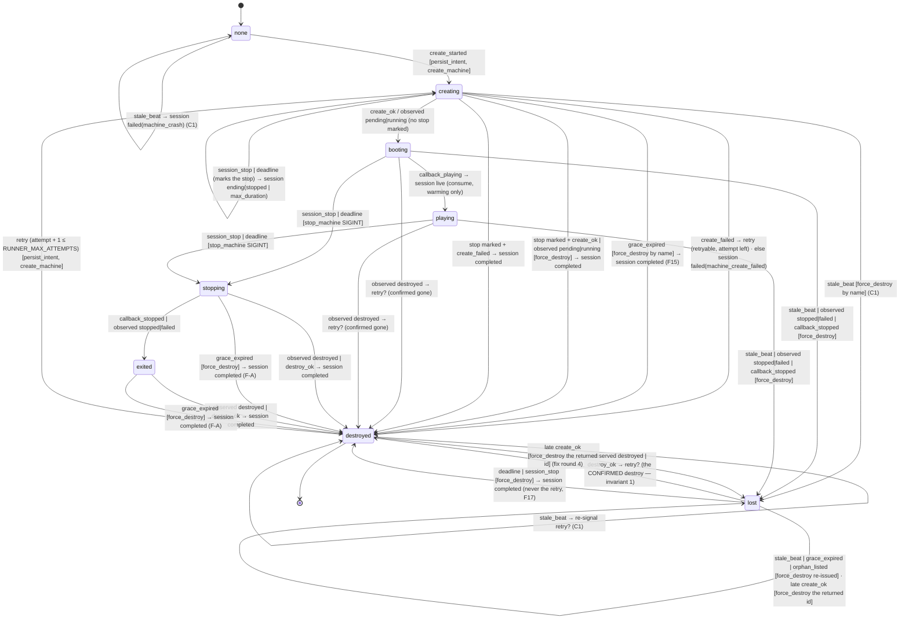

# Streaming R1 — Relay Core — Implementation Plan

> **For agentic workers:** REQUIRED SUB-SKILL: Use superpowers:subagent-driven-development (recommended) or superpowers:executing-plans to implement this plan task-by-task. Steps use checkbox (`- [ ]`) syntax for tracking.

**Goal:** Tier B's first sellable artefact with zero new deployables — an organiser buys match credits from the fixture console's Phone tab, pairs a phone by QR, and goes live PASSTHROUGH (Cloudflare simulcasts the clean feed to the destination); the composed mode's data path, tokens, sweep and runner port exist behind in-repo fakes so R2 adds only the Machine image and the relay page.

**Architecture (domain-driven, three layers, revised 2026-09-14 on the owner's instruction):**
- **Domain — `server/relay/domain/`, PURE.** No `sql`, no `fetch`, no `Date.now()` (`now` is injected), the shape `packages/engine/src/core/events.ts` gives scoring (a reducer over typed commands, I/O-free). Five units: the session aggregate (`session.ts`: `decide(session, command, now) → { next, events, effects }`, owning every invariant — the §6.3 create gates, one active session per fixture, `runner_retries ≤ 1`, legal §6.4 transitions only); the expiry policy (`expiry.ts`: `evaluate(session, now) → transition | none` — warming timeout, stale heartbeat with ONE inline retry, wall clock); the credits value object (`credits.ts`: `debit` refuses a negative balance, mirroring FS10; `headroomAfterReservations` is the C3 arithmetic); the retention policy (`retention.ts`: which videos are deletable at `now`, which inputs only after their videos are gone — C1/C2); the runner sub-machine (`runner.ts`: the Fly machine lifecycle as a swept transition table, `stepRunner` — Task 2C). Domain events are plain typed records (`SessionWentLive`, `SessionEnded { reason }` …) the application layer logs and persists; there is no event bus.
- **Application — `server/usecases/stream-sessions.ts`, `stream-credits.ts`, `stream-targets.ts`, `relay-sweep.ts`.** Load under the row lock → `decide` / `evaluate` → persist → run the effects through the ports. SQL stays in the usecases (repo idiom; no repository layer — nothing present earns one). **Expiry runs LAZILY on every session read, heartbeat, Phone-tab poll and admission, inside the row lock**, so no money or safety rule depends on the cron (recommendation B, below): the daily cron keeps retention plus a backstop pass of the same `evaluate` for sessions nobody reads, and destroys orphan Machines.
- **Infrastructure — the ports' adapters.** `ingest-cf.ts` (Cloudflare Stream), `fly-client.ts` (a typed, retrying, redacting Machines API client — its own TDD'd unit) under `runner-fly.ts`, `fakes.ts` for CI, the AES-256-GCM envelope (`crypto.ts` + `secret-columns.ts`, the ONLY SQL over a `*_enc` column), the `AUTH_SECRET`-signed job/page tokens, Postgres through `sql`/`sql.begin`. Eight tables in one migration (`__stream_sessions.sql` — `V408` after the 2026-09-16 re-read, FT0-1): four of state, four of capture (ruling 13), RLS with zero client policies. Routes are parse → authorize → delegate under `v1()`/`handler()`. The Phone tab in `fixture-stream-panel.tsx` is a state-mapped client island that renders the QR client-side from the organiser-authed `current` projection, buys credits through the SAME embedded Stripe Checkout modal the AI credits use (`components/buy-credits.tsx`), and never sees a secret in page HTML.
- **TDD in every task, explicitly:** the pure domain test first (no DB, milliseconds), the adapter contract test against a fake HTTP layer, then the DB-backed usecase test, then e2e — each step names its verify command and the expected red.

**Tech Stack:** Next.js App Router (this repo's version — read `node_modules/next/dist/docs/` before writing a route), React 19, TypeScript, Zod 4 (also the boundary parser for the Fly client's responses — the repo's validator; `lib/funnel.ts`'s `safeParse` on a stored payload is the precedent), postgres.js (`sql`, `withTenant`), `jose` 6 (HS256), Node `crypto` (AES-256-GCM), `qrcode` 1.5 (+ `@types/qrcode`), Stripe SDK 22 (sandbox) + `@stripe/react-stripe-js` (`EmbeddedCheckoutProvider`/`EmbeddedCheckout`, already used by `components/buy-credits.tsx`), the Fly Machines API (`https://api.machines.dev/v1`, OpenAPI at `https://docs.machines.dev/spec/openapi3.json`, verified 2026-09-14 — Task 5A pins every fact), vitest (`environment: "node"`, JSON reporter only), Playwright 1.61 (`walkthrough` project), `scripts/smoke.ts`, pino via `@/server/logger`.

**Spec:** `docs/superpowers/specs/2026-09-07-streaming-programme-design.md` §5 (entitlements and money), §6 (tables, secrets, routes, state machine, storage guard, token domains), §7.1 (runner port), §7.6 (QR contract v1), §9a (patterns — every task below names one with its exemplar), §10 (testing and gates), §3.8 (panel). Wave prompt: `docs/superpowers/specs/2026-09-05-stream-overlay-prompts/R1-relay-core.md`. **Overriding corrections (win over the prompt and the design where they conflict, row by row): the orchestrator's `R0-CORRECTIONS-FOR-R1.md` (2026-09-13), whose numbers come from `R0-memo.md` and `_INDEX.md` §"2026-09-12 — R0 bench CLOSED" / §"Owner rulings, 2026-09-13".** Binding values for the UI: `_THEMES.md` §8a (Phone tab, option A "Stepper") and §8b (credits card, option A "Three tiles"). Rules: `_RULES.md` R1, R7, R8, R10, R14, R15, §Repo traps, §Shell guard; `docs/superpowers/RULES.md` §"Owner checklist (2026-09-07)".

**Sibling plans (keep names compatible):** `2026-09-07-streaming-t1.md` (the visual-gate harness this plan adds rows and one seed kind to — `e2e/visual/manifest.ts`'s `SEED_KINDS`/`SEED_PARAMS` and `seeds.ts`'s one `case` are the extension point; never harness code), `2026-09-05-stream-overlay-w1.md` (the panel, `streamUrlSchema`, `setFixtureStreamUrl`, the V402 rows — all consumed, never edited).

## Global Constraints

- **Execution worktree:** `/Users/ashokhein/github/seazn.club/.claude/worktrees/relay`, branch `feat/stream-relay`, cut from `main` (R1 prompt header; PR1 #761 is merged, so `main` carries W1). This plan was written in a DIFFERENT worktree (`r1-plan`, branch `docs/streaming-r1-plan`) — nothing here executes there. Prefix EVERY shell command with `cd /Users/ashokhein/github/seazn.club/.claude/worktrees/relay &&` (or `…/relay/apps/web &&`) in the SAME call: the shell cwd resets to the main checkout between calls and a verify launched without it runs on `main` and returns a false green. Run git as `/usr/bin/git`, as SEPARATE plain calls. Never `git stash` in a worktree. No heredocs, no `eval` — the Write tool writes files. `grep -a` always.
- **Environment label `rly`:** `~/.claude/skills/seazn-local-env/scripts/seazn-env.sh up --label rly --server` from the relay worktree; the printed `DATABASE_URL` and `SMOKE_BASE` win and are copied INLINE into every command (never `eval`, never a shell variable — the guard refuses both). `rebuild --label rly` after every code change; a second `up --server` serves the OLD bundle. Confirm `show data_directory` contains `rly` before believing any DB result. `pnpm`, never `npm install`; a fresh worktree has NO `node_modules` and NO `.env.local` (Task 0 installs and symlinks with RELATIVE targets).
- **Judge vitest ONLY from `--reporter=json --outputFile=<file>`:** read `numPassedTests` / `numTotalTests` / `numFailedTests` / `numPendingTests` with one `node -e` line and confirm every `.testResults[].name` starts with `/Users/ashokhein/github/seazn.club/.claude/worktrees/relay/`. `rtk` prints `PASS(0) FAIL(0)` for a suite that failed to collect; a module-scope throw collects ZERO tests and reads green — read the suite `message`. JSON reports go to `<scratchpad>/r1/` (`mkdir -p` once). DB-backed tests need `DATABASE_URL=… DATABASE_SSL=disable` INLINE (~700 tests skip silently without it and `total` does not move).
- **Whole spec files, never a `-g` slice.** Playwright runs from `apps/web` with `PLAYWRIGHT_BASE=<rly base>` (a `localhost` URL, never `127.0.0.1` — the Secure cookie is not stored from `127.0.0.1` and auth fails as a later 401) and `E2E_PROD_TARGET=1`; `RELAY_DRIVERS=fake` is set on the SERVER under test (it is read at request time, not at build time). `mobile.spec.ts` is serial: a red count there is a floor.
- **Migrations: a version number is NEVER pinned in this plan (owner ruling 2026-09-10).** The file is named by its STEM, `__stream_sessions.sql`. Task 1 resolves the number when it STARTS: `ls db/migration/deltas | sort -V | tail -1` PLUS `/usr/bin/git log --all --diff-filter=A --name-only --pretty=format: -- 'db/migration/deltas/V4*' | sort -u` (a concurrent branch can have claimed a number this tree never shows). **Task 0's reading at `453d95cd6` (2026-09-14, FT0-1):** both scans ended at `V403__realtime_fixture_broadcast_policy.sql` (added by #782 — the earlier "V402, unchanged at `9a7393cf4`" was false), so Task 0 reserved V404. **Re-read 2026-09-16: `main` (`ea5b7027a`) has since landed `V404__retire_scorer_role.sql` (#787), and `V405`–`V407` are CLAIMED on the unmerged `origin/feat/chess-lichess-external-play`, so Task 1 creates `V408__stream_sessions.sql`.** The tree tail and the all-refs tail therefore DISAGREE (V404 vs V407) — which is the whole reason both commands are run; the higher one wins. That is exactly why the number is never pinned: this wave has already been overtaken once. Task 1 still re-runs both commands when it starts; if the tail has moved, the next free number after the moved tail wins. **No entitlement migration:** V402 already shipped BOTH keys (`streaming.overlay`, `streaming.relay`) false on all five plans. If Task 1's file is written and not yet merged when `main` lands another migration, AMEND the file to the free number (never a forward-fix; a duplicate Flyway version survives a clean rebase and reds late). Re-run `ls db/migration/deltas | sort -V | tail -1` after EVERY rebase.
- **Every new user-facing string in all four dictionaries** (`apps/web/src/dictionaries/{en,es,fr,nl}/ui.json`, extending the existing `stream.` prefix — P15), then `pnpm i18n:gen-keys` and commit `apps/web/src/lib/i18n-keys.ts` (GENERATED — never hand-edited). A key no code path can select is NOT written (E5: no `stream.fail.storage_exhausted`).
- **Every new v1 route goes into `server/api-v1/openapi.ts`'s `ROUTES` in the same change (R7)** — `openapi-coverage.test.ts` walks `app/api/v1/**/route.ts` and asserts an exact 1:1 — AND into `server/api-v1/key-scopes.ts` (`NEVER_KEY_ROUTES` for this wave: money-consuming and secret-bearing, the device-links precedent), then `npm run openapi:gen` with zero diff under `openapi/`. Routes under `app/api/billing`, `app/api/cron`, `app/api/internal` are outside the v1 spec.
- **One DOM branched for phone:** `max-md:*` on the same tree, phone-only `md:hidden`; identical control SET at 320 and 1280 (membership, order, repeats); no horizontal page scroll at 320/360/375/390/430/768/834. `/\bmd:hidden\b/` also matches inside `max-md:hidden` — anchor assertions on `\s...hidden"`. `truncate` needs `min-w-0` on the whole ancestor chain.
- **Owner checklist additions (2026-09-14) bind every task.** Each task's "Checklist rows satisfied" names rows from the 2026-09-07 checklist AND the 2026-09-14 additions (VERIFY-AS-CUSTOMER / PRODUCT-OWNER LENS / TEST-CASE DESIGN — see §"House rules 2026-09-14"); the reviewer checks rows, not prose. Two VERIFY-AS-CUSTOMER runs are steps of this plan (Task 14 Step 8, Task 17 Step 6): a real browser, a fresh signup, no seed, no shortcut; the seeded e2e (Task 15) is automation and does not substitute.
- **Every subagent dispatch passes `model: opus` explicitly** (owner instruction 2026-09-05; agent frontmatter reads `sonnet`). Every brief carries: exact paths, acceptance bullets, the do-NOT-touch list, the verify command with `cd <relay worktree> &&` and `DATABASE_URL` inline, `RELAY_DRIVERS=fake`, the shell guard, the output cap ("final message under 15 lines — counts, paths, deviations, blockers; no file contents or diffs"). A stopped agent is resumed, never re-dispatched. Reviewer after every lane; **the P3 probe** in every review. It is defined HERE, once, and every later step names it rather than restating it (FT0-2): `cd /Users/ashokhein/github/seazn.club/.claude/worktrees/relay && grep -a -rn "SUPABASE_JWT_SECRET" apps/web/src --include='*.ts' --include='*.tsx' --exclude-dir=__tests__ | grep -v "lib/realtime.ts"` — production code only (tests name the secret by design: `lib/__tests__/realtime-publish.test.ts` from #782, Task 6's `tokens.test.ts`; the globs are quoted because zsh aborts on a bare one). Expected: ZERO lines naming a file this wave adds or edits; any other line must be one `_STATE.md` FT0-2 lists as pre-existing (not R1's). Never `| wc -l` → `0` on the unfiltered grep — it prints 8 lines on a clean tree.
- **Do NOT touch:** W1's overlay route, stage, registry, hook, `overlay-model.ts`, `public_fixtures_v`; `lib/realtime.ts` (P2: NO producer mint exists there and R1 builds none — see Non-goals); any `SUPABASE_JWT_SECRET` call site; `stages-panel.tsx`; `run-sheet-row.tsx` beyond the ONE line the owner allowed on 2026-09-14 — the existing toggle render gaining `fixtureId` (Task 14 Step 5; C19 moved the URL read into the panel module, so the row gains no import and nothing else in that file changes); other entitlement keys' rows; every pricing surface (`ENTITLEMENT_DOMAINS`, `/pricing`, `lib/pricing-matrix.ts`, `config/stripe-plans.json`); `ai_credit_ledger`, `lib/credits.ts`, `lib/credit-packs.ts` (donors — read, never edited); the engine; `.github/workflows/e2e.yml`; `e2e/visual/capture.spec.ts` / `asserts.ts` (harness — rows and one seed kind only).
- **Layering rule (owner instruction 2026-09-14, and AGENTS.md's anti-abstraction rule):** `server/relay/domain/**` imports nothing from `@/lib/db`, `@/server/logger`, `./ports`' adapters or `fetch` — `enc-boundary.test.ts`'s sibling `domain-purity.test.ts` (Task 2A) greps it. The usecases are the only place SQL and the ports meet; there is NO repository interface, NO event bus, NO command bus — each would be an abstraction with no present caller. A domain event is a typed object in an array the usecase iterates.
- **Patterns this plan invokes (spec §9a), each with its exemplar:** Pure domain reducer over typed commands (`packages/engine/src/core/events.ts` — I/O-free, `now` passed in; this wave: `domain/session.ts` `decide`); Parse → authorize → delegate (`lib/http.ts` `handler`; `server/api-v1/auth.ts` `requireResourceAuth`; `app/api/v1/fixtures/[id]/stream/route.ts`); Zod schemas in one place (`server/api-v1/schemas.ts` `PutFixtureStream`); Ports and adapters with in-repo fakes (`IngestProvider`/`RunnerProvider` + `server/relay/fakes.ts`; the placement service client); State machines over booleans (`fixture_stream_sessions.state` + `desired_state`; the pad reducer); Money is ledger rows in the same transaction (`ai_credit_ledger` V320 + `lib/credits.ts` `balance`); Cron pair idiom (`app/api/cron/registrations/route.ts` — 503 unset BEFORE 401 mismatch); Deny by default (RLS zero client policies, V366; 404 ≡ missing); The client never decides (`hasFeature` on the division page); One authority per fact (`resolveFixtureCfg`; this wave: `creditBalance` = `sum(delta)`, `STREAM_CREDIT_PACKS`, `server/relay/config.ts`); Registry over branching (`V3_SKINS`; this wave: the fail-reason and create-error copy MAPS); Pure projections, strings via `msg` (`overlayModel`); i18n four dictionaries + generated keys; One DOM branched for phone (`phone-disclosure.tsx`).

## Corrections ledger — where every C/P row lands

Each row of `R0-CORRECTIONS-FOR-R1.md` lands either as a task requirement WITH a test, or as a reasoned non-goal below. The reviewer checks this table, not the prose.

| Row | Lands in | As |
|---|---|---|
| C1 `deleteRecordingAfterDays: 30`, 3-day promise is a sweep rule on VIDEOS | Task 4 (constant + create body), Task 12 (retention rule) | `DELETE_RECORDING_AFTER_DAYS = 30` in `config.ts`; `ingest-cf.test.ts` asserts the body against the constant AND that the constant is inside Cloudflare's 30–1096 range; a mutant setting 7 is killed by the range assertion |
| C2 videos before inputs; 409/10046 retried next tick (a DAY apart now — owner ruling 3) | Task 2B (`domain/retention.ts`), Task 12 | pure `retentionPlan` unit: an input is never in the delete list while a video names it; `relay-sweep.test.ts` "409 once, then 200 on the next daily tick" |
| C3 reserve at admission | Task 2B (`headroomAfterReservations`), Task 10 (create gate — reservations EXCLUDE sessions the expiry policy has already expired) | pure differential: raw headroom sufficient, two `live` reservations push it under; DB unit: same sessions `completed` → 201; an expired-but-unread session no longer reserves |
| C4 `recording.mode` always `automatic`, never updated | Task 4 | static test over `ingest-cf.ts` source: `mode: "automatic"` present, no `PUT`/`PATCH` to `/live_inputs/` carrying `recording` |
| C5 per-input GET for status; list omits `recording` | Task 3 (fake shape), Task 4 | `inputStatus` fetches `/live_inputs/{uid}`; the fake mirrors `status.current.{ingestProtocol,state,statusEnteredAt,statusLastSeen}`; a test asserts the URL has no trailing list path |
| C6 never "healthy" off `connected` | Task 13 (view model), Task 14 (panel) | health line copy is `stream.health.ingest.<state>` ("Receiving from phone"); a test asserts no dictionary value under `stream.health.*` contains "healthy"/"Healthy" |
| C7 `performance-4x / 8 GB`, `auto_destroy`, `restart: no`, idempotent `destroy` | Task 5A (`fly-client.ts`), Task 5 (`runner-fly.ts`) | `runner-fly.test.ts` asserts guest/auto_destroy/restart from `RUNNER_DEFAULT_GUEST`; `fly-client.test.ts`: `destroy` of a 404 Machine resolves; the Machine-side hard stop (`RELAY_DEADLINE_AT` in the guest env + `auto_destroy`) is recommendation B's |
| C8 explicit `timeoutSeconds`; `holdWindowSeconds` RTMPS only, SRT null; nothing on `EXT-X-ENDLIST` | Task 4 | `INGEST_TIMEOUT_SECONDS = 180` (the value R0's cells measured); capabilities `{ holdWindowSeconds: { rtmps: 183, srt: null } }`; static grep: no `ENDLIST` under `server/relay/**` |
| C9 passthrough adds exactly one output; composed zero | Task 10 | provision unit over `FakeIngest`: `outputsFor(inputId).length` is 1 / 0 |
| C10 no WHEP, no WHIP | Non-goal | `webRTC`/`webRTCPlayback` from the create response are NOT stored — `ingest-cf.test.ts` asserts the returned credentials object has no `webRTC` key |
| C11 no `preferLowLatency` | Non-goal | static grep in `ingest-cf.test.ts`: `preferLowLatency` absent from `server/relay/**` |
| C12 no `/user/tokens/verify` | Task 4 | static grep: absent from `server/relay/**`; no boot/health check calls it |
| C13 browser UA on any server-side HLS fetch | Non-goal | R1 fetches no manifest (no consumer); `ingest-cf.test.ts` asserts no `.m3u8` string under `server/relay/**` |
| C14 `preferred` asserts nothing | Task 13 | `QR_PREFERRED_DEFAULT = "srt"` is one config line; the contract test accepts `"rtmps"` too; R0 FP-4 recorded for R3 in `_INDEX.md` (Task 17) |
| P1 no workflow here; route + absence test; the schedule is DAILY (owner 2026-09-14: "just run every day is fine") | Task 12 | `relay-sweep-workflow.test.ts` sibling of `registrations-sweep-workflow.test.ts`; the daily `relay-sweep.yml` is an item for `onryde/seazn.club.workflow` (Task 17); because one tick a day is too late for money/safety, those rules run lazily (recommendation B) |
| P2 no producer realtime mint | Non-goal | recorded as a false premise carried to R2 |
| P3–P5 symbols | Task 0 | re-pinned by symbol |
| P6 purchase lands on the webhook synchronously; the sweep is a retry | Task 8, Task 15 | webhook branch unit; the replay witness goes through the REAL claim — `runEvent(sameEvent)` → `false` / `replayEvent` → `"already_processed"`, plus a check that exactly ONE ledger row exists. The cron re-entry is NOT a witness (FT0-5: `sweepStuckEvents` selects only `processed_at is null` rows older than 10 minutes, so "drive the cron, balance unchanged" stays green with the `stripe_event_id` dedupe deleted); a drive of `POST /api/cron/billing-events` may remain only as a route smoke, labelled so |
| P7 `requireBillingOwner` vs `requireOrgAuth` | Task 8 | decision recorded in the route's doc comment (below) |
| P8 FS10 donor | Task 1, Task 2B | design DDL verbatim; owner RULED 2026-09-14: keep `balance_after >= 0` ("all good"); `domain/credits.ts` `debit` mirrors it in memory |
| P9 no refund neighbour | Task 7 | `grantCredits` / `refundCredits` are NEW functions |
| P10 `setBoolEntitlementOverrideSql` at `e2e/helpers.ts` | Task 15 | e2e helper, thawed in `afterAll` |
| P11 `docs/contracts/` created | Task 13 | contract + fixtures |
| P12 Vault | — | owner RULED 2026-09-14: NO Vault; the AES-256-GCM envelope with `RELAY_KEK` is final (Task 2); no Task 0 read |
| P13 `stream-tab-phone` | Task 14, Task 15 | the shipped testid; `stream-phone-tab` exists nowhere |
| P14 two `CREDIT_PACKS` | Task 8, Task 14 | ONE authority: `lib/stream-credit-packs.ts` `STREAM_CREDIT_PACKS`; the panel's own constant is DELETED |
| P15 `ui.stream.*` | Task 14 | extends the 31 existing keys (FT0-4: #782 removed `stream.tab.slate` and `stream.preview.slate`; re-counted 31 on 2026-09-16 — main changed no `stream.` key); 30 once Task 14 deletes `stream.credits.soon`. Task 14 recounts before it writes: the base is whatever `en/ui.json` holds that day, and the new fail reasons (`provision_timeout`, `admission_timeout`) add two keys on top |
| P16–P17 `hasFeature`, `UpgradeGate` | Task 11, Task 14 | by symbol |
| P18 gated-transaction harness | Task 7 | `registration-concurrency.test.ts` §5's `releaseBoth`/`bothStarted` idiom, adapted to the org's advisory money lock (Revision 2; waiters read from `pg_locks`, scoped to the holder's pid) |
| P19 Sentry `fly.toml` | Task 17 | owner OK'd enabling it 2026-09-14; the DSN is OWED by the owner — the line is uncommented only when the DSN arrives |
| P20 `jose` | Task 6 | already a dependency |
| P21 division gate | Task 14 | `relayEntitled` is already threaded; nothing to add |
| P22 `server/relay/` | Tasks 2–6 | created |

## Non-goals (reasoned, each with its C/P row)

- **No WHEP and no WHIP in R1 (C10).** R1's phone ingest is SRT/RTMPS; WHEP is ingest-gated (409 on an RTMPS/SRT input) and a WHIP-ingested input produces no recording and no HLS. The `webRTC`/`webRTCPlayback` halves of Cloudflare's create response are dropped at the driver boundary and never stored — R2's dual-publish (owner 2026-09-12) is R2's.
- **No `preferLowLatency` (C11).** R1 has no Seazn-hosted playback: passthrough viewers watch the destination. The field is updatable later (PUT persists it), so R2 sets it when the relay page exists to benefit.
- **No manifest watcher, no server-side HLS fetch (C6, C13).** Nothing in R1 consumes a manifest. The health line reports the ingest state from the per-input GET, worded as what it is. Any later liveness read must read progression within ONE variant with a null baseline reading `unknown` — recorded in `_INDEX.md` for R2.
- **No producer realtime mint (P2).** `lib/realtime.ts` exports FOUR functions (FT0-3): `publishFixtureUpdate`, `publishDivisionUpdate`, `mintPublicFixtureToken` and `resolveRealtimeMintKey` (added by #782 — an asymmetric ES256/RS256 private key preferred, `SUPABASE_JWT_SECRET` only as the HS256 fallback). None is a producer mint, and no producer mint exists anywhere. Its only consumer would be R2's relay page. A false premise, carried to R2.
- **No `/user/tokens/verify` (C12).** The Cloudflare token is account-owned; a credentials check, if R2 ever needs one, reads a Stream endpoint.
- **No composed-mode Machine, relay page, slate, `delayMs` (R2).** The composed mode's rows, tokens, heartbeat route, runner port and sweep rules exist and are unit-tested over `FakeRunner`; the Phone tab's mode toggle shows "With scorebug" DISABLED with "coming soon" copy so the seam is visible.
- **No phone app (R3).** Only `docs/contracts/capture-qr.v1.json` and its fixtures land here (§7.6). R0 FP-4 (ffmpeg SRT on a Fly Machine never started a broadcast; a handset on SRT did) is an R3 input, recorded, not an R1 change (C14).
- **No device GPS (R3).** The owner wants it ("GPS" — `_STATE.md` "Owner data rulings at Task 0"). In R1 the phone streams straight to Cloudflare and no phone→app call exists, so an R1 column would have no writer (an inert seam, G5 of the amendment rulings). Recommendation, not an owner ruling: GPS lands in R3's plan — capture app → our API, behind the OS permission prompt and consent copy — with its four open owner questions recorded in `_STATE.md`: precision, cadence, retention, privacy-policy copy.
- **No Fly region picker for organisers (owner accepted, 2026-09-14).** `RUNNER_DEFAULT_REGION = "lhr"` is the only region this wave sends. R2 may derive the region from the org's country, with a capacity-fallback region, INTERNALLY and never user-facing; the R2 bench measures one far-away case first. No `region` field crosses the API, the panel or the QR contract.
- **No real session drives a Machine in R1.** Composed mode ships DISABLED in the Phone tab (Task 14), so the lifecycle is proven through the domain's parity sweep (Task 2C), the fakes (Tasks 3, 10, 12) and the opt-in live Fly test (Task 5A) — never by an organiser's session. Recorded again under Task 17's "What R1 does NOT prove".
- **Nothing workflow-shaped is added to this repo (owner note, 2026-09-14).** The daily sweep workflow lives in `onryde/seazn.club.workflow`; P1, Task 12 and Task 17 point there and `relay-sweep-workflow.test.ts` reds if a copy ever appears here.

## Owner rulings, 2026-09-14 (verbatim-short; these are RULINGS, recorded again in Task 17's `_INDEX.md` step)

1. **FS10 — KEEP `balance_after integer not null check (balance_after >= 0)`.** Owner: *"all good"*. Task 1 builds §5.2's DDL verbatim; Task 2B's `debit` mirrors the floor in memory; Task 7 writes the snapshot under the lock.
2. **Vault — NO.** The AES-256-GCM envelope with `RELAY_KEK` (Task 2) is final. Task 0 no longer reads the Supabase project; §12.4 is closed.
3. **Sweep schedule — DAILY.** Owner: *"just run every day is fine"*. The `onryde/seazn.club.workflow` workflow runs once a day, not every 5 minutes (P1, Task 12, Task 17). The consequence for money and safety rules is recommendation B below.
4. **`run-sheet-row.tsx` — ALLOW one line** so a return from checkout reopens the panel on the Phone tab. Re-ruled on C19 (owner, 2026-09-16, "apply rec"): the URL read moved INTO the panel module — `FixtureStreamToggle` takes `fixtureId` and fires the open itself — so the row's one line is that prop on an existing render, with no new import. Task 14 Step 5 makes it a real step, not a fallback; its test lives in `fixture-stream-panel.test.tsx` (the row's gate test is untouched, because the row no longer reads the URL); the harness rows in Task 17 depend on it and are now unconditional.
5. **Both added columns ACCEPTED:** `org_stream_targets.watch_url text null` (the replay fill's source) and `fixture_stream_sessions.runner_retries smallint not null default 0` (the ONE retry survives a restart).
6. **`INGEST_TIMEOUT_SECONDS = 180`** — owner: *"3 mins after phone goes away"*. C8 stays: `holdWindowSeconds = 183` for RTMPS only, SRT `null`.
7. **Sentry — enable it.** The DSN is NOT yet supplied: Task 17 Step 3 stays conditional on the DSN; `_INDEX.md` records "DSN owed by owner".
8. **Checkout is EMBEDDED, like the others.** Owner: *"checkout should be inbuilt as other"*. Task 8 copies `lib/credit-packs.ts` / `app/api/billing/credit-pack-checkout/route.ts` (`ui_mode: "embedded_page"`, `return_url`, the route returns `{ client_secret }`); Task 14 copies `components/buy-credits.tsx` (`Modal` + `EmbeddedCheckoutProvider`/`EmbeddedCheckout`); Task 15's e2e fills the card inside Stripe's embedded iframe with `event-pass.spec.ts`'s own frame selectors. Every "hosted" sentence is gone from this plan.
9. **Lifecycle scope — ACCEPTED** (owner *"all good"*, 2026-09-14, second ruling set): `runner_state`, `runner_name`, `runner_stop_requested_at`, `end_reason`; `RunnerProvider`'s `stop`/`observe`/`list`; the end-reason chip on the Phone tab. No longer scope creep.
10. **Customer verification's GRANTED state — RULED:** R1 stays dark; staff grants both keys to a fresh org via the real `/admin/orgs/[id]` overrides editor; the GA purchase path is owed to the GA-flip wave. The DENIED state is a second fresh org.
11. **Recommendation B — RULED:** expiry never waits for the daily tick (the lazy path, the inline retry, the `RELAY_DEADLINE_AT` hard stop; the cron keeps retention, backstop, orphans).
12. **The verify destination — RULED:** a second Cloudflare live input as the sink; a YouTube pass is optional on an owner-supplied unlisted key (owed; never committed or echoed).
13. **Data capture — RULED:** *"no issues in expanding the database, make sure that we capture all data as possible"*. Every fact the relay produces is captured (§"Data captured"); schema growth is PRE-APPROVED. Its two sub-questions are now settled (`_STATE.md` "Owner data rulings at Task 0"): telemetry retention is RULED by the owner ("2 is ok" — raw samples deleted after 90 days); PII is settled by an ORCHESTRATOR ruling, not the owner's (`actor_user_id` stays — §"Data captured"). At Task 0 the owner also ruled the non-personal additions ("all"); the orchestrator narrowed their shapes from a read-only Cloudflare probe, and Task 1's DDL carries them.
14. **`RELAY_KEK` is PRESENT** in both `.env.local` files (64 hex). It is no longer owed: Task 0 CONFIRMS it (a length check, never an echo); every later "add RELAY_KEK" note is retired.
15. **Staff "Match credits" panel — ADD, in R1 (owner, 2026-09-16, "yes").** A staff-only panel on the EXISTING `/admin/orgs/[id]` shows the org's match-credit balance and its recent `org_stream_credits` rows, with grant and refund actions that call Task 7's `grantCredits` / `refundCredits` (Task 7A). The reason: without it those two money functions have no production caller (AGENTS.md class 1), and refunding a failed stream would be a hand-typed SQL write. `/admin` is held to a functional bar. The admin TELEMETRY view stays future scope. *(Not part of the owner's ruling: the orchestrator's Revision 1 rulings on the Task 7A draft, 2026-09-16, add a REVOKE action, a required idempotency key, an in-transaction staff audit row and a linked-refund cap. They are recorded in Task 7A's Revision 1 preamble and implemented in Task 7.)*

## Recommendation B — no money or safety rule may wait for a daily tick (RULED, owner "all good" 2026-09-14 — ruling 11)

At one tick a day, the rules Task 12 first owned (warming timeout, stale-heartbeat crash, max-duration end, the ONE runner retry) become up to 24 h late: an orphan Fly Machine bills all day, a stuck session holds its C3 reserve all day, and a retry after the match is useless. So the plan restructures — the owner ruled the cadence AND accepted this structure:
- **One pure policy** (`domain/expiry.ts`, Task 2B): `evaluate(session, now) → transition | none`.
- **It runs lazily** on every session read (`currentSession`), every heartbeat, every Phone-tab poll and at admission (`createSession` — the C3 reserve excludes sessions the policy has already expired), inside the row lock (Task 10).
- **Machine-side hard stop:** the runner's guest env carries `RELAY_DEADLINE_AT` (ISO, = created + `MAX_DURATION_MINUTES`) and the R2 supervisor exits at that instant on its own; C7's `auto_destroy` then removes the Machine. Pinned in Task 5 (the env is asserted in `runner-fly.test.ts`; the supervisor's honouring of it is R2's acceptance and is recorded as such).
- **The retry is inline:** when the heartbeat/poll path detects the stale beat, the same request destroys the old Machine and creates the replacement (Task 10) — never on a tick.
- **The daily cron keeps** retention (videos > 3 days, then inputs; a 409/10046 is retried the NEXT DAY), a backstop pass of the same `evaluate` for sessions nobody reads, and orphan-Machine destruction (the app's Machines listed by `metadata.seazn_session` against non-terminal sessions) — Task 12.
- **Tests prove each rule fires with NO sweep call** (Task 10's "lazy expiry" describe), and the mutant "delete the lazy `evaluate` call" is red there — the lazy path is load-bearing, not decoration.

## House rules 2026-09-14 — how this plan applies the owner's checklist additions

The orchestrator is adding the owner's three groups verbatim to `docs/superpowers/RULES.md` as "Owner checklist — additions (2026-09-14)". This plan does not restate them; it binds them. **Convention:** every task's "Checklist rows satisfied" line names rows from BOTH the 2026-09-07 checklist and the 2026-09-14 additions, by group (VERIFY-AS-CUSTOMER / PRODUCT-OWNER LENS / TEST-CASE DESIGN) and row; the reviewer checks rows, not prose. The three sections below are what the tasks point at.

### VERIFY-AS-CUSTOMER — the golden path and the break list (Task 14 Step 8 at the lane-D boundary; Task 17 Step 6 at wave close)

Separate from the seeded e2e (Task 15 stays automation). A REAL browser against the `rly` production build, a FRESH signup, a fresh org, **no SQL seed, no `setBoolEntitlementOverrideSql`, no admin route used by the tester as a shortcut** — the one staff action below is the real beta-customer journey, not a shortcut, and it is named. Owner rulings folded in:
- **(3) RULED, owner "Ok":** in R1 `ffmpeg` (a test pattern pushed to the session's RTMPS or SRT URL) stands in for the customer's capture app — R1 has no capture app (R3).
- **(2) RULED (owner "all good", ruling 12):** every customer-verify run uses a SECOND Cloudflare live input as the destination sink — repeatable, needs no owner key, creates no public stream; clean up by deleting videos before inputs, as R0 did (C2). One real YouTube run at wave close is OPTIONAL and happens only if the owner supplies an unlisted stream key (owed; never committed, echoed or logged).
- **(1) RULED (owner "all good", ruling 10) — the recommendation below is now the instruction.** Fact, verified in the tree: `streaming.relay` and `streaming.overlay` are granted by NO plan (`V402__streaming_entitlements.sql` inserts `false` for all five plans; dark rollout, design §5.1/§10.4); the GA flip to pro / event_pass_l / enterprise is a later migration with pricing copy and `ENTITLEMENT_DOMAINS`. During R1 no customer can acquire the key by buying anything. A real staff path exists: the per-org overrides editor on `/admin/orgs/[id]` (`apps/web/src/app/admin/orgs/[id]/page.tsx`, backed by `app/api/admin/orgs/[id]/entitlement-override/route.ts`). **Recommendation: R1 stays dark. The GRANTED state = a fresh signup/org, then staff grants `streaming.overlay` + `streaming.relay` to that ONE org through the REAL `/admin/orgs/[id]` editor** — the actual beta-customer journey; every step after the grant runs as the customer with no shortcut. **The DENIED state = a second fresh org with no grant, which must see the correct `UpgradeGate`, not a broken panel.** Owner value: no paying Pro customer can buy match credits for a relay whose composed mode and real Machines are unproven; the grant is reversible per org (remove the override); every customer-facing step after access is still verified for real. Cost: the purchase-to-access step is deferred and named under "What R1 does NOT prove".

**The golden path, end to end, once (real Cloudflare — `RELAY_DRIVERS=live` on the `rly` server with the Cloudflare token already in `.env.local`; real Fly is NOT exercised: composed is off and `FLY_API_TOKEN` is owed, so the live driver set constructs the Fly runner LAZILY, Task 5):**
1. Sign up fresh (new email), create a fresh org, a competition, a division, a fixture — as a customer.
2. Staff (a second browser, the real `/admin/orgs/[id]` editor) grants `streaming.overlay` + `streaming.relay` to that org. Record the screen.
3. As the customer: the fixtures tab → the camera toggle → the Phone tab shows the buy card at balance 0 (read every string).
4. Buy the 1-pack through the EMBEDDED sandbox checkout (4242) — the modal, the return, the balance chip reading 1.
5. Add a destination: the sink is the RTMPS URL + key of a second Cloudflare live input created for this run (recommendation 2), label it "Sink".
6. Go live → warming → the QR and the paste code; read the SRT/RTMPS details off the screen (the customer's view).
7. Push a real encoder: `ffmpeg -re -f lavfi -i testsrc2=size=1280x720:rate=30 -f lavfi -i sine=frequency=440 -c:v libx264 -preset veryfast -g 60 -b:v 2500k -c:a aac -f flv "<rtmps url><stream key>"` (the ruled stand-in for the capture app), then separately the SRT leg once (`-f mpegts "<srt url>"`) — record which leg the health line turned to "Receiving from phone" on, and how long it took.
8. See the ingest state change on screen; see the state pill go live; see the credit consumed (balance chip 0).
9. Confirm the SINK input is receiving (its per-input status on the Cloudflare dashboard or the API) — the simulcast output is real.
10. Stop → confirm dialog → ended; the replay link (the sink has no watch URL, so none — read the ended copy).
11. Then the break list, each named and screenshotted: **empty inputs** (add-destination with blank fields, a blank stream key); **wrong perms** (a second user who is a viewer on the org: no camera toggle, and `POST /api/v1/fixtures/{id}/stream-sessions` → 403, `POST /api/billing/relay-checkout` → 403/400); **network fail mid-create** (throttle offline right after "Go live": the error copy, then reconnect — one session, one input); **back button out of checkout** (Escape/close the modal mid-payment, then the browser back button: no orphan session, no charge, balance unchanged); **double-tap "Go live"** (two rapid taps: ONE session, ONE credit — the 409 path never shows as an error to the customer); **denied state** (the second org: the UpgradeGate, the correct sentence, no `stream-*` controls).
12. Widths 320 / 768 / 1280 for steps 3–10, no horizontal scroll; every string a customer reads, read; screenshots saved with a per-screen verdict into `_STATE.md`.
13. Clean up: delete the run's videos, then both inputs (C2 order).

### PRODUCT-OWNER LENS — irreversible actions R1 performs, and scope creep

| Irreversible action | Where | Guard / sign-off |
|---|---|---|
| Money captured (a match-credit purchase) | Task 8 route + Stripe sandbox | sandbox-only until the GA flip; 402 `plan_lacks_relay` before Stripe; the ledger row is idempotent by `stripe_event_id`; refunds are staff `refundCredits` rows (Task 7), written through the Task 7A panel |
| A credit consumed at `live` | Task 10 `consume_credit` inside the row lock | the 24 h same-fixture reuse rule; FS10's floor; grant, refund and revoke rows, written by staff through the Task 7A "Match credits" panel on `/admin/orgs/[id]` (`POST /api/admin/orgs/[id]/stream-credits`, idempotency key required, audited in the same transaction), are the only remedy — recorded, never deleted |
| Cloudflare recording DELETED (3-day retention) | Task 12 through `retentionPlan` | videos before inputs; a 409 defers a day; the OWNER accepted the 3-day promise (2026-09-12); no undo — flagged |
| Cloudflare live input DELETED | Task 12 | only after its videos are gone and the session has been terminal ≥ 3 days |
| Fly Machine destroyed (force) | Tasks 10/12 through the lifecycle table | only from `stopping`/`exited` after grace, `lost`, or an orphan; `auto_destroy` is the normal path; idempotent |
| The migration (eight tables) | Task 1 | greenfield, no backfill; RLS forced with zero policies; a migration is reversible only by a new migration — explicit owner sign-off on the DDL happened on 2026-09-14 (rulings 1, 5) |
| An org's entitlement override (the beta grant) | `/admin/orgs/[id]` (existing) | reversible per org; staff-only |

Scope growth, each now RULED: (a) `org_stream_targets.watch_url` and `runner_retries` (ruling 5); (b) the four lifecycle columns `runner_state`, `runner_name`, `runner_stop_requested_at`, `end_reason` (ruling 9); (c) `RunnerProvider.list/stop/observe` beyond design §7.1's `{ create, destroy }` (ruling 9); (d) the embedded-checkout `Modal` in the panel (ruling 8); (e) the ended-state `end_reason` chip and its copy (ruling 9); (f) the data-capture tables and the richer session facts (ruling 13, schema growth pre-approved). **Possible future scope, flagged and NOT built:** an admin telemetry view over the captured tables (`/admin/...`) — no UI beyond the end-reason chip ships in R1. Nothing else grew: no region picker, no composed UI, no WHEP, no LL-HLS, no phone app.

### TEST-CASE DESIGN — the write-path diffs and the added cases

Every new write path is diffed against its nearest analogue for a missed guard, recorded here and checked by the lane reviewer:

| New write path | Nearest analogue | Guards the analogue has → present here? |
|---|---|---|
| `consumeForSession` / `recordPurchase` / `grantCredits` / `refundCredits` / `revokeCredits` (Task 7) | `lib/credits.ts` `reserve`/`recordPackPurchase`/`adminAdjust` over `ai_credit_ledger` (V320) | the wallet's advisory lock first in the transaction (`pg_advisory_xact_lock(hashtext('ai-credit-wallet:' …))`, `lib/credits.ts:1482`) → yes: `lockOrg` takes `pg_advisory_xact_lock(hashtext('stream-credits-org:' || orgId))` first in EVERY ledger write, so the first writes to an EMPTY ledger serialise too; `balance_after >= 0` CHECK → yes (FS10 kept); idempotency key on purchase → yes (`stripe_event_id` unique); the staff idempotency key checked under the lock, table-wide (`V320:37` scope) → yes, before the floor and the cap, plus a DEVIATION: a key reused with a different org/kind/amount/session → 409 `idempotency_key_reused` (the donor silently answers `applied: false`); the audit row in the same transaction → yes (`staff_audit_log`, applied writes only); the revoke floor → yes (422 `insufficient_credits`, the donor's status); the linked-refund cap → 422 `refund_exceeds_consumed` (the donor has no sessions); positive-integer delta → yes (`credit`/`debit` refuse); compensating rows never UPDATE/DELETE → yes; `spent_by_org_id` per-org reporting → N/A (one org per ledger) |
| `POST /api/admin/orgs/[id]/stream-credits` (Task 7A) | `api/admin/orgs/[id]/credits/route.ts` | staff guard before the body is parsed → yes (`requireStaff`, 401); `.strict()` body → yes; required `idempotency_key` 8–200 → yes (the donor's bounds); per-adjustment cap → yes (`STREAM_CREDIT_ADJUST_MAX` 50, every role, no superadmin bypass); refusals → 422 (parity), reused key → 409 (deviation, Task 7); a refund's session must be THIS org's → 404 (the donor has no sessions); the audit row → Task 7's, in the ledger transaction (the route writes no SQL of its own beyond the org and session lookups). Task 7A's own diff table is the source. |
| `POST /api/billing/relay-checkout` (Task 8) | `credit-pack-checkout/route.ts` | `requireBillingOwner` → yes; locked currency → yes (`preferredCurrency`); 30 s idempotency bucket → yes; `metadata.credits` snapshot → yes; `.strict()` body → yes; **plus** the `orgId` equality check and the 402-before-Stripe gate the analogue does not need |
| the `stream_credits` webhook branch (Task 8) | the `credit_pack` branch in `handleCheckoutCompleted` | `payment_status === "paid"` → yes; snapshot-else-catalogue-else-log → yes; replay-safe by id → yes; `linkStripeCustomer`/`pinBillingCurrency` → yes; staff alert email on ungranted → **no** (recorded as a follow-up; the log.error is present) |
| `createSession` insert (Task 10) | `createRegistrationCheckout` / `confirmPaidRegistration` (row lock + CAS in `registrations.ts`) | the partial unique index as the race backstop (23505 → 409) → yes; the 23505 catch re-reads the winner → yes; gates BEFORE the insert in one transaction → yes; network calls OUTSIDE the transaction → yes |
| `createStreamTarget` (Task 9) | `createVenue` | `assertUuid` + `requireOrgAuth(write)` → yes; org equality in the usecase → yes; validated URL → yes (`streamUrlSchema`) |
| `persist` of the aggregate (Task 10) | the pad reducer's single writer | ONE writer of `state` → yes (only `apply`); every field from `next` → yes |
| retention deletes (Task 12) | `sweepRegistrations`' lapse branch | idempotent re-run → yes (absent = success); videos before inputs → yes (C2); advisory lock per session → yes |

Cases added by this pass (each is an `it` in the named file): boundary 0/1/max — `debit(1)`→0, `debit(0)` throws, `credit` at the pack sizes (Task 2B); `headroom == max_duration` admits (Task 2A); `slot` −1/0/1 (Task 1); the 24 h window at 24 h−1 s and 24 h (Task 2B); the grace at T−1/T (Task 2B); empty/null — empty ledger (Task 7), null view (Task 13), no videos/no inputs (Task 2B), `exitInfoFrom([])` (Task 5A), `fromFlyState(null)` (Task 5); malformed — a non-JSON Fly body, a Machine without `id` (Task 5A), a QR payload missing either half (Task 13), a heartbeat with an unknown `state` (Task 11), a non-rtmp target URL (Task 9); concurrent/race — two consumers (Task 7), the partial-index race (Task 10), a concurrent sweep (Task 12), double-tap "Go live" in the customer verify; a guard defeated per guard — the mutant tables in every task; expected values from the source of truth — the enums' `.options`, `config.ts`, the migration file, `RUNNER_TABLE`, `FLY_STATE_MAP`; money mutated specifically — m1–m5 with killers.

## Data captured (owner ruling 13, 2026-09-14: "capture all data as possible"; schema growth pre-approved)

The session row (`fixture_stream_sessions`) stays the ONE authority for current state. Everything below is HISTORY and TELEMETRY beside it — written in the same transaction as the state it records where a state changes, so the history can never disagree with the row. Every new table is RLS-enabled and FORCED with ZERO client grants (design §6.1; `V366` shape), reached only through the non-tenant client, and every payload passes the ALLOWLIST sanitiser (`server/relay/sanitise.ts`, Task 2) — a denylist would miss the next secret.

| Table | What writes it | Row per | Never contains |
|---|---|---|---|
| `fixture_stream_events` (append-only, per SESSION) | Task 10 `apply` (`eventRowsOf` — every session/runner state change and domain event, in the row lock's transaction; the caller's `action` row when an actor is given); Task 10 `recordEffect` (effect results: ok/failed, latency, HTTP status/code, attempt); Task 10 `reconcileSession`/`currentSession` (observed external changes: ingest/output status words, Fly state + exit info via the `observed` trigger); Task 10 `heartbeat` (`samples_capped`, once); Task 12 (the sweep's `orphan_destroy`; its backstop expiries arrive through `apply`; and, where it fills `recording_seconds`, ONE `source 'ingest'` / `kind 'observed'` / `type 'recording_finalised'` row per video once Cloudflare has finalised it, idempotent per `videoUid` — Dd). Every row carries `app_build_sha` (Da, read from `config.ts` inside the writer). Purchases, grants and refunds are NOT events — they are ledger rows with the Stripe link (item 6), the one authority for money | domain event · state transition (session AND runner, from/to) · observed external change · effect result · client/sweep action | stream keys, SRT passphrases, tokens, credential-bearing URLs (the sanitiser allowlists fields; a URL field is stored cut at its `?`) |
| `fixture_stream_samples` (time series) | Task 10 `heartbeat` (every beat, through Task 11's route) and Task 10 `currentSession` (every organiser poll's ingest observation) | heartbeat / poll, capped per session (`SAMPLES_PER_SESSION_CAP`); each row carries `app_build_sha` (Da) and Cloudflare's `status.current.reason` as `ingest_reason` (Dh); raw rows are deleted after `SAMPLE_RETENTION_DAYS = 90` (RULED — owner at Task 0, "2 is ok") by the daily sweep, only for sessions whose `sample_summary` is written; the summary is kept regardless (Task 12) | secrets (typed columns only + a sanitised raw jsonb) |
| `stream_provider_calls` | the recorder port (Task 3) written by the Cloudflare adapter (Task 4) and the Fly client (Task 5A) — every call, every attempt | API call attempt | URLs with ids or keys (a PATH TEMPLATE like `/live_inputs/{uid}/outputs`), tokens, bodies |
| `stream_storage_snapshots` | Task 12 (each sweep run) and Task 10 `createSession` (each admission check) | sweep run / admission | — |
| `fixture_stream_sessions` (richer facts, ruling 13 item 4) | Task 10 (timestamps, protocol, uid, region, guest, attempts, machine seconds, admission numbers, ledger link; at admission the snapshot `sport_key`, `competition_id`, `division_id`, `fixture_scheduled_at`, `venue_id`, `venue_address`, `org_timezone` (Db) and `entitlement_via_override` (Dc); `output_uid` (Dg); `est_cost_minor` / `est_cost_currency` once at the terminal transition (Df)); Task 11's QR / paste-code route carrying `?reveal=1`, through the Task 10 usecase that does the writing (`qr_issued_first_at`, `credentials_revealed_first_at`, `credentials_reveal_count` — De; a poll without the flag writes nothing); Task 12 (video uids seen, `recording_seconds`, `recording_bytes` — Dd) | (the one row) | keys (still `*_enc` only via `secret-columns.ts`) |
| `org_stream_credits` (purchase link, item 6) | Task 8's webhook branch via Task 7 `recordPurchase` | (the ledger row) | card data (Stripe ids only) |

**Guards, each with a test and a defeating case (named in the tasks):** redaction — `telemetry.test.ts` "a known secret pushed through EVERY writer is absent from EVERY row of EVERY relay table" (+ `sanitise.test.ts` "no allowed key names a credential") (mutant: bypass the sanitiser → red); atomicity — `stream-sessions.test.ts` "a failing event insert rolls the state change back" (mutant: write the event after commit → red); parity — `session.test.ts` / `runner.test.ts` "every legal cell emits exactly one state-change event" derived from the exported tables; cost — `samples.test.ts` "the per-session cap holds at cap and cap+1", plus the index plan in Task 1; RLS — `migration-shape.test.ts` names all EIGHT relay tables.

**The data decisions, settled at Task 0 (2026-09-14; `_STATE.md` "Owner data rulings at Task 0"):**
- **PII — an ORCHESTRATOR ruling, not the owner's.** `actor_user_id` stays: user ids are already stored as `created_by` on sessions and credit rows, so it adds no new class of personal data. Still never stored: raw IP addresses, user agents, device ids, precise location, credentials. The Machine's `fly-request-id` and Cloudflare's `cf-ray` are provider ids, not PII, and are kept. Cost if wrong: drop one column, two writers, one test, one kit field.
- **Telemetry retention — RULED by the owner ("2 is ok").** `fixture_stream_events` and `stream_provider_calls` are kept indefinitely (one row per transition/call, ~200 rows per 3 h session). RAW `fixture_stream_samples` are deleted after `SAMPLE_RETENTION_DAYS = 90` (one constant, `config.ts`) by the daily sweep, and only for sessions whose `sample_summary` is already written (C15); the per-session aggregate (min/avg/max fps and bitrate, stall count, sample count) is kept regardless. (The priced alternative the owner declined — keep all samples — was ≈ 1 MB per 3 h session, ≈ 12 GB/year at 1,000 sessions/month.)
- **Non-personal additions — RULED by the owner ("all"); shapes narrowed by the ORCHESTRATOR** from a read-only Cloudflare probe (field shapes only, no values). Facts an existing column already carries are REUSED, never duplicated: `recording_seconds`, `machine_seconds`, `runner_attempts`, `video_uids`, `ingest_input_uid`, `destination_kind`, `guest_*`. Added: (a) `app_build_sha` on every event and sample — the tag of `FLY_IMAGE_REF` when it is exactly 40 lowercase hex, else null; (b) the admission snapshot on the session — sport, competition, division, scheduled start, venue (through the fixture's court; null with no court), venue address, org timezone — with no foreign keys; (c) `entitlement_via_override`, "granted by override: yes/no" through the existing `overrideRow` (the resolver returns no source; in R1 every granted org is an override); (d) recording facts once a video is no longer `live-inprogress` (Cloudflare reads -1/0 until then): one `recording_finalised` event per video carrying size, duration, width, height, state and error reason code (no codec field exists), plus `recording_bytes` beside `recording_seconds`; (e) `qr_issued_first_at`, `credentials_revealed_first_at`, `credentials_reveal_count`; (f) `est_cost_minor` / `est_cost_currency`, written once at the terminal transition from `config.ts`'s rate constants; (g) `output_uid` — output error codes are DROPPED (Cloudflare's output object carries only `uid, url, streamKey, enabled`); (h) the ingest edge location is DROPPED (`GET /live_inputs/{uid}` returns no location field) and `ingest_reason` (`status.current.reason`) is captured instead. Device GPS is a non-goal (R3, §"Non-goals").

## Fly machine lifecycle (owner 2026-09-14: "make sure that fly machine lifecycle is well defined")

The runner is a SUB-STATE of the session aggregate (`domain/runner.ts`, Task 2C), driven only through `decide` (Task 2A). **The transition table below is the authority; the diagram mirrors it; the parity-sweep test (`domain/__tests__/runner.test.ts`) enumerates every cell from the EXPORTED tables, never from a hand-typed list.** Cross-referenced from Tasks 2A, 2C, 3, 5A, 5, 10, 12, 17.

**Fly facts this section rests on — verified 2026-09-14** (OpenAPI `https://docs.machines.dev/spec/openapi3.json`; `https://fly.io/docs/machines/machine-states/`; `https://fly.io/docs/machines/api/machines-resource/`; R0 evidence `R0-memo.md`): Fly's states are persistent `created, started, stopped, suspended, failed`, transient `creating, starting, stopping, restarting, suspending, destroying, launch_failed, updating, replacing`, terminal `destroyed, replaced, migrated` (machine-states page); the wait endpoint accepts `started | stopped | suspended | destroyed | failed | settled`; **`POST /machines/{id}/stop` takes `{ signal?, timeout? }` — signal defaults to SIGINT, `timeout` is "a Go duration string or number of seconds" before SIGKILL** (spec + machines-resource); `POST /machines/{id}/signal` takes `{ signal: SIGHUP|SIGINT|SIGQUIT|SIGKILL|SIGUSR1|SIGUSR2|SIGTERM }`; `GET /machines/{id}/events` returns `MachineEvent[] { id, type, status, source, timestamp, request: object }` — **the exit payload (`exit_code`, `oom_killed`, `requested_stop`) is NOT typed in the spec**; the client reads `request.exit_event.{exit_code, oom_killed, requested_stop}` DEFENSIVELY (all optional) and the live test records what Fly actually sends; `auto_destroy: true` = "the Machine destroys itself once it's complete" (both R0 soaks auto-destroyed on exit 0 — `R0-memo.md:565`); `restart.policy: "no"` never restarts on any exit. R0 also measured the stop itself: **SIGINT → ffmpeg exit 0, trailer written, in 114 ms** (`R0-memo.md:279`), and **`q` on stdin does NOT work under `-nostdin`** — the 10 s fallback SIGKILLed instead (`:346–354`). So the stop is a SIGNAL, never a keystroke. Whether a destroyed Machine's NAME is reusable in the same app is not documented → the name carries the attempt (`relay-<sid>-r<attempt>`) so reuse is never needed; the live test records the answer.

**Runner states** (`RunnerState`, stored in `fixture_stream_sessions.runner_state`):

| State | Meaning |
|---|---|
| `none` | no Machine has been asked for (every passthrough session stays here) |
| `creating` | the intended `runner_name`/attempt is PERSISTED and the create call is in flight — a process dying here is reconciled by name lookup on the next read (invariant 4). An organiser stop or the deadline here only MARKS `runner_stop_requested_at` (the first mark is kept); the call's return is torn down at once (P1-F-a), and the mark starts the F15 grace clock — `evaluate` reads it in `creating` as well as `stopping`/`exited`, so a call that never returns is force-destroyed by name on a lazy read. An `ending_timeout` over an UNMARKED `creating` (or a `lost`) runner routes through `session_stop` rather than completing over it (C5, Task 2C review M2) |
| `booting` | `machine_id` known; Fly may be `created/starting/started`; the relay page has not reported `playing` |
| `playing` | the runner's own heartbeat reported `playing` (session `live`) |
| `stopping` | our stop was sent (SIGINT, grace `RUNNER_STOP_GRACE_SECONDS`); waiting for exit 0 + auto_destroy |
| `exited` | observed `stopped`/an exit event after OUR stop; auto_destroy not yet observed |
| `destroyed` | observed `destroyed` (or 404), a confirmed/forced destroy, or a create that made nothing; terminal for THIS attempt — the ONE retry's `create_started` is legal only from here (invariant 1) |
| `lost` | observed `failed`/`stopped` or `callback_stopped` WITHOUT our stop, a stale heartbeat, or a create that returned after the runner moved on — the crash path. A Machine may still exist: `lost` is left for `destroyed` only on a CONFIRMED destroy (`destroy_ok` / observed `destroyed`), or by the F17 teardown cells that complete the session. (Observed `destroyed` straight from `booting`/`playing` skips `lost` — the Machine is already confirmed gone.) |

**Fly state → observed input** (`fromFlyState`, Task 5; the ONLY place Fly's spelling is read):

| Fly state | `ObservedRunnerState` |
|---|---|
| `created`, `creating`, `starting`, `updating`, `replacing`, `restarting` | `pending` |
| `started` | `running` |
| `stopping`, `suspending` | `stopping` |
| `stopped`, `suspended` | `stopped` |
| `failed`, `launch_failed` | `failed` |
| `destroying` | `destroying` |
| `destroyed`, `replaced`, `migrated`, HTTP 404 | `destroyed` |
| anything else | `unknown` — typed, never a crash, never treated as running (C6's spirit) |

**Triggers** (`RunnerTrigger`): `create_started { name, attempt }` · `create_ok { machineId }` · `create_failed { retryable }` · `callback_playing` (heartbeat `playing`) · `callback_stopped` (heartbeat `stopped`) · `observed { state, exit? }` (GET/wait) · `stale_beat` · `deadline` · `session_stop` · `grace_expired` · `destroy_ok` · `orphan_listed` (the sweep found it listed with a terminal/absent session).

**Transition table** (`RUNNER_TABLE` in `domain/runner.ts` — this table says what that code does, cell for cell, as of Task 2C's close at `30560cf9a` plus Task 2C-post's ruling F-A at `b98e5f22e` (the two grace-force cells now signal `completed`); ✗ = `InvalidRunnerTransition`; "retry?" = the ONE-retry decision `afterLostDestroyed` makes: `attempt < RUNNER_MAX_ATTEMPTS` → signal `retry` (the session's `retry_runner` effect then sends `create_started` with `attempt + 1`), else signal `failed(<reason from lastExit>)`; an ENDING session completes instead on either signal, with its own end reason — F17 for `retry`, fix round 5 for `failed`):

| Runner \ Trigger | `create_started` | `create_ok` | `create_failed` | `callback_playing` | `callback_stopped` | `observed` | `stale_beat` | `deadline` | `session_stop` | `grace_expired` | `destroy_ok` | `orphan_listed` |
|---|---|---|---|---|---|---|---|---|---|---|---|---|
| `none` (session provisioning) | → `creating` [persist_intent, create_machine] | ✗ | ✗ | ✗ | ✗ | ✗ | stay, session `failed(machine_crash)` (C1: a live composed row with no runner is corrupt; a throw would 500 every lazy read of it, and there is no name to tear down) | ✗ | ✗ (nothing to stop — `decide` completes the session itself, P1-F-a) | ✗ | ✗ | ✗ |
| `creating` (provisioning, or a replacement's create in warming/live) | ✗ | stop marked → `destroyed` [force_destroy the returned id] (session `completed`, P1-F-a) · else → `booting` [persist machine_id] | stop marked → `destroyed` [none] (session `completed` — no retry, no failure, P1-F-a) · retryable and `attempt < RUNNER_MAX_ATTEMPTS` → `destroyed`, signal `retry` · else → `destroyed`, session `failed(machine_create_failed)` | ✗ | ✗ | `pending`/`running`: stop marked → `destroyed` [force_destroy] (session `completed`, P1-F-a) · else → `booting` (crash-safe adopt by name) · any other observed state → stay | → `lost` [force_destroy by name] (C1: a replacement's create that hangs past the beat window may still make a Machine — the retry waits for a CONFIRMED destroy, and a late `create_ok` is `lost`'s to destroy) | → stay `creating`, stop marked (the first mark is kept) [none] (session `ending(max_duration)`, F14) | → stay `creating`, stop marked (`runner_stop_requested_at`, the first mark is kept) [none] (session `ending(stopped)`, P1-F-a) | → `destroyed` [force_destroy by name] (session `completed` — the call never came back, F15) | ✗ | ✗ |
| `booting` (warming, or a replacement in warming/live) | ✗ | ✗ | ✗ | → `playing`, signal `went_live` (session `live` + consume only when the session is WARMING; any other session state ignores it, F16) | → `lost` [force_destroy] | `stopped`/`failed` → `lost` [force_destroy] (exit recorded) · `destroyed` → `destroyed` (retry?) · `pending`/`running`/`stopping`/`destroying`/`unknown` → stay (exit recorded) | → `lost` [force_destroy] (a replacement that never plays; the policy emits it only for a LIVE session) | → `stopping` [stop_machine SIGINT] (session ending, end `max_duration`) | → `stopping` [stop_machine SIGINT] (session ending, end `stopped`) | ✗ | ✗ | ✗ |
| `playing` (live) | ✗ | ✗ | ✗ | stay, re-signalling `went_live` (idempotent on a live session; it takes a WARMING one live, so a beat the session had to ignore before `provisioned` is recovered — F16) | → `lost` [force_destroy] | `stopped`/`failed` → `lost` [force_destroy] (exit recorded) · `destroyed` → `destroyed` (retry?) · `pending`/`running`/`stopping`/`destroying`/`unknown` → stay (exit recorded) | → `lost` [force_destroy] | → `stopping` [stop_machine SIGINT] (end `max_duration`) | → `stopping` [stop_machine SIGINT] (end `stopped`) | ✗ | ✗ | ✗ |
| `stopping` (ending) | ✗ | ✗ | ✗ | stay | → `exited` | `stopped`/`failed` → `exited` (exit recorded — a non-zero exit is still a completion: WE stopped it) · `destroyed` → `destroyed` (session `completed`) · any other → stay | stay (a stopping runner is expected to go quiet) | stay | stay (idempotent) | → `destroyed` [force_destroy] (session `completed` — F-A: our stop's grace ran out with no destroy seen; the signal carries no end reason, so the session keeps the one it stored when ending began) | → `destroyed` (session `completed`) | ✗ |
| `exited` (ending) | ✗ | ✗ | ✗ | ✗ | stay | `destroyed` → `destroyed` (session `completed`) · else stay (exit recorded) | stay | stay | stay | → `destroyed` [force_destroy] (session `completed`, F-A — as `stopping`) | → `destroyed` (session `completed`) | ✗ |
| `lost` (the crash path — a Machine may still exist) | ✗ | → stay `lost`, `machine_id` := the returned id [force_destroy] (a create call that returns after C1 declared it lost — never a throw on a call we started) | stay | ✗ | stay | `destroyed` → `destroyed` (retry?) · any other → stay (exit recorded) | stay + RE-ISSUE [force_destroy] — NEVER a retry signal; bounded to once per `STALE_HEARTBEAT_SECONDS` by the session's `beatWindowAt` (persisted `beat_window_at`, Task 7 Step 0c / Task 10), because no beat arrives from a lost runner to move the window | → `destroyed` [force_destroy] (session `completed`, end `max_duration` — never the retry, F17) | → `destroyed` [force_destroy] (session `completed`, end `stopped` — F17; a session already ENDING keeps its own end reason, M2) | stay + RE-ISSUE [force_destroy] (our own teardown timing out is NOT a confirmation — fix round 3) | → `destroyed` (retry?) | stay + RE-ISSUE [force_destroy] (the sweep finding it listed is NOT a confirmation — fix round 3) |
| `destroyed` (terminal for this attempt) | the retry only: `attempt + 1 ≤ RUNNER_MAX_ATTEMPTS` → `creating` [persist_intent, create_machine] | → `lost`, `machine_id` := the returned id [force_destroy] (a create that came back after we gave up — F15 — is a Machine whose destroy is NOT confirmed; fix round 4) | stay | ✗ | ✗ | stay | stay, RE-SIGNAL (retry?) (C1: destroyed and still wanted live — the process died before `retry_runner` ran; `runnerRetries` stays `runner.attempt`, so the re-signal never counts twice) | ✗ | stay (idempotent; an organiser stop never steps it — `decide` completes the session, P1-F-a) | ✗ | stay (idempotent) | stay |

Session consequences (in `decide`): `create_failed` not retryable / second attempt exhausted → `failed(machine_create_failed)`; `booting` for `WARMING_TIMEOUT_MINUTES` → `failed(machine_boot_timeout)`; `lost` → the ONE retry (attempt 2, only after the destroy is CONFIRMED — `destroy_ok` or observed `destroyed`; a force that was merely issued never leads to it — invariant 1) else `failed(machine_exit_nonzero | machine_oom | machine_crash)` by the exit info seen; `deadline` → `ending`, `end_reason = 'max_duration'`; `session_stop` → `ending`, `end_reason = 'stopped'`; `destroyed` while `ending` → `completed` when the step signals it (`destroy_ok` / observed `destroyed` / `grace_expired` from `stopping`/`exited`). **A stop whose Machine never auto-destroys completes at grace + slack (Task 2C-post, ruling F-A):** `stopping`/`exited` × `grace_expired` forces the destroy AND signals `completed` (`forceDestroyed`), so an organiser stop or a deadline completes on the lazy read that forces it — `RUNNER_STOP_GRACE_SECONDS + RUNNER_OBSERVE_SLACK_SECONDS` after `runner_stop_requested_at`, not `ENDING_TIMEOUT_SECONDS` after `ending_at` — with the session's OWN stored end reason (`stopped` / `max_duration`; the signal carries none, and the `completed` arm keeps `s.endReason ?? signal.endReason`) and the replay-fill rule. The destroy's confirmation (`destroy_ok`, or an observed `destroyed`) then lands on the COMPLETED row: `destroyed × destroy_ok` stays and C27 accepts it, so nothing throws and nothing on the session moves. Safe past invariant 1: a `stopping`/`exited` runner exists only after an `ending` signal, so this signal reaches an ending session (it completes) or a terminal one (C27 drops it) — nothing after it can retry. The completion does NOT wait for the destroy to be confirmed, so the fixture's one-active index releases before it is; Task 10's admission teardown (2C-post m5) keeps a new session on that fixture from starting beside a Machine the provider still lists. **The retry count (Task 2C I1):** the retry arm sets `runnerRetries = runner.attempt` — idempotent, so `destroyed × stale_beat`'s re-signal never counts twice; `runner_attempts` stays the ONE authority for the attempt (C3). **The beat window (Task 2C I4, ruling A):** `heartbeatAt` is the last beat RECEIVED — only the beat route writes it, and the panel serves it as `lastBeatAt`; `beatWindowAt` is the stale-beat window's anchor, written by the stale-beat arm and the retry arm and persisted as `beat_window_at`; `evaluate` times the beat from the LATER of the two, so a stale-beat decision is bounded to once per `STALE_HEARTBEAT_SECONDS` without ever freshening the organiser's beat chip. **A runner failure on a session already ENDING (fix round 5, re-review 2 I1)** COMPLETES the session with its own end reason and the replay-fill rule, never `failed(machine_*)`, exactly as the retry arm does (F17). Since F-A no planned caller reaches that position — an `ending` session no longer holds a `destroyed` or `lost` runner, because the grace completes it first and a late `create_ok` now lands on the COMPLETED row, where C27 drops the signal — so this guard and the retry arm's ending guard are defence in depth, witnessed only by SEEDED positions (`session.test.ts` I1, "R4, liveness — ENDING", F17, F20). **An organiser stop on a PROVISIONING session whose runner is `lost`** (reachable per F16: create_ok, then an observation, before `provisioned`) completes it `stopped` with `[force_destroy]` — the `completed` arm accepts `provisioning` (re-review 2 G1); only `requested` still ignores the signal. **An organiser stop with no running Machine (P1-F-a):** runner `none` or `destroyed` → the session goes straight to `completed`, `end_reason = 'stopped'` (`decide` itself, no runner step); runner `creating` → `ending(stopped)` with the stop marked on the runner, and whatever the create call returns — `create_ok` / found by name → `force_destroy`, `create_failed` → nothing — lands `destroyed` with the session `completed`: no boot wait, no retry, no `machine_boot_timeout`. **The deadline takes the same shape (F14):** no live Machine → `completed` with `end_reason = 'max_duration'`; runner `creating` → `ending(max_duration)` with the stop marked; `booting`/`playing` keep the SIGINT stop. Neither ever throws. **A marked create that never returns (F15)** is ended by the LAZY expiry — `evaluate` reads `runner_stop_requested_at` in `creating` as well as `stopping`/`exited`, so the next READ (never the daily sweep) force-destroys by name and `completed`s the session; a call that comes back afterwards destroys what it made — the runner is `lost` until that destroy is confirmed (fix round 4) — and changes nothing on the session (C27). If that destroy call fails, nothing LAZY re-issues it: `evaluate` answers `none` on a terminal row, and the reconcile's observation keeps `lost × observed running` where it is — so Task 12's daily backstop re-issues it through the lifecycle, by name (2C-post m1; the provider-side twin is Task 12's orphan pass and Task 10's admission teardown). **A heartbeat that arrives before `provisioned` (F16)** is recorded as a sample and IGNORED rather than thrown — its carrier is a route the Machine retries — and `playing`'s own `callback_playing` re-signals `went_live`, so the next beat takes the session live with exactly one credit consumed. **A deadline or a stop reaching a LOST runner (F17)** destroys it and COMPLETES the session, carrying `max_duration` / `stopped` on the `completed` signal itself: the retry the crash path still owes belongs only to a session that wants to be live, and `runner()`'s retry arm refuses it outright once the session is ending, so no replacement Machine is ever booted past the wall clock. Passthrough sessions never leave `none`; their deadline/stop complete immediately (Task 2A's table).

**The stop sequence (a SIGNAL, never a keystroke):** session stop or deadline → `stop_machine { signal: "SIGINT", timeoutSeconds: RUNNER_STOP_GRACE_SECONDS }` (`POST …/stop`, R0 `:279`) → the supervisor flushes and exits 0 (≤ 10 s, §7.2) → `auto_destroy` removes the Machine → the next read/poll observes `destroyed` → `completed`. If `grace_expired` (`RUNNER_STOP_GRACE_SECONDS + observation slack` since `runner_stop_requested_at`) with no `destroyed` seen → `force_destroy` (`DELETE ?force=true`) → `destroyed`, and the session `completed` on that same decision (F-A — the confirmation that follows is accepted on the completed row). `destroy` 404 → `destroyed`.

**Failure paths and their stored reasons** (`fail_reason`, the panel's map is total over the enum — Task 13): `machine_create_failed` (create not retryable, or two attempts); `machine_boot_timeout` (composed `warming` ≥ `WARMING_TIMEOUT_MINUTES`; passthrough keeps `no_inbound_timeout`); `machine_exit_nonzero` (an exit event with `exit_code ≠ 0` and no `requested_stop`); `machine_oom` (`oom_killed: true`); `machine_crash` (lost with no readable exit info, or a stale heartbeat); `provision_timeout` (`provisioning` ≥ `PROVISION_TIMEOUT_SECONDS`, F16); `admission_timeout` (`requested` ≥ `REQUESTED_TIMEOUT_SECONDS` — inserted and never admitted, F18); plus the existing `target_rejected`, `no_credits`, `no_inbound_timeout`. **Every non-terminal state owns a timed exit** (F16 / F18 / F19), and `expiry.test.ts` walks `ACTIVE_STATES` to prove no state is left untimed; an `ending` that lost its completion COMPLETES (it is not a failure), timed from `ending_at` — when ending BEGAN, written in the same statement as the transition — never from the wall clock (F22). The deadline is NOT a failure: `completed` with `end_reason = 'max_duration'`. **A `failed` session carries NO `end_reason` (P1-F-b):** `fail_reason` carries the cause; `end_reason` belongs to completed sessions (set when ending begins, carried to `completed`). `fail()` nulls it, so a composed boot timeout that tore its Machine down through `session_stop` does not keep that step's `stopped`.

**Invariants — each with its named test:**
1. **At most ONE non-destroyed Machine per session: no retry create before the prior Machine's destroy is CONFIRMED.** A retry's `create_started` is legal only from `destroyed`; `lost` leaves for `destroyed` only on `destroy_ok` / observed `destroyed` (plus F17's session-ending teardown cells, which complete the session and so owe no retry); a `force_destroy` that was only ISSUED (`lost × grace_expired`, `lost × orphan_listed`, `lost × stale_beat`) keeps the runner `lost`; a late `create_ok` into `destroyed` makes it `lost` again; a marked `creating` runner's force-only `destroyed` is followed by no retry; a grace-forced `destroyed` from `stopping`/`exited` completes the session on the same decision (F-A), so no retry follows it either. At the APPLICATION layer the confirmation of a force is fed back only while the locked row still names that attempt's Machine (Task 10's `force_destroy` gate, ruling F-B), so a destroy confirmed late never lands on the next attempt's runner. Proven by a FULL-DEPTH walk, not a one-step check (fix rounds 2–4 found two-step paths a one-step rule passed). Tests, `runner.test.ts`: "invariant 1: a retry is refused while the previous Machine is not destroyed (create_started is legal ONLY from none and destroyed)", "invariant 1, the LOST half (derived): …" and "invariant 1, the TWO-STEP half (walked from none): every path that reaches a retry signal passes a confirmed destroy, or a create that made nothing, since its attempt began"; `session.test.ts`: "R4: a marked creating runner's force-only destroyed can never be followed by retry_runner — walked through decide from every session that can mark a create", "F-A: a grace-forced destroy is never followed by retry_runner — walked through decide from every session that can stop a Machine; …", "R3 (a), safety: …", "R4, safety: …" (+ the DB twins in `stream-sessions.test.ts`: "composed: a Machine that is observed gone WITHOUT our stop is lost → destroyed → the ONE retry (invariant 1: the replacement is created only after destroy_ok); …" and "F-B: a force_destroy whose confirmation lands after ANOTHER request's retry moved the runner on …").
2. **A Machine never outlives its session — four layers:** `RELAY_DEADLINE_AT` in the guest env (Task 5), `auto_destroy` (C7), lazy expiry + reconcile on every read (Task 10), the daily orphan destroy (Task 12). Tests: `runner-fly.test.ts` (env), `fly-client.live.test.ts` (auto-destroy observed), `stream-sessions.test.ts` "lazy expiry", `relay-sweep.test.ts` "ORPHANS".
3. **Machine-minutes bound per session** `MACHINE_MINUTES_BOUND = RUNNER_MAX_ATTEMPTS × (WARMING_TIMEOUT_MINUTES + MAX_DURATION_MINUTES + ceil(RUNNER_STOP_GRACE_SECONDS / 60))` — a DERIVED constant (Task 2C), asserted ≥ the longest timed path found by WALKING `RUNNER_TABLE` (test "invariant 3") — never re-computed in the test from its own formula, which would be a tautology (C12).
4. **Crash-safe app.** `runner_name` + `runner_attempts` (the create-call count — the ONE authority `Runner.attempt` is loaded from, C3) + `runner_state = creating` are persisted BEFORE the create call; `machine_id` right after; a process dying mid-create is reconciled by `listMachines({ metadata.seazn_session })` on the next read or sweep (the client's own idempotency, Task 5A). Effects are idempotent and re-runnable (desired vs observed): `stop_machine` on an already-stopped Machine and `force_destroy` on an absent one are both success. Tests: `runner.test.ts` "invariant 4: create_started persists before create_machine (effect order)", `stream-sessions.test.ts` "a session left in `creating` is reconciled by name on the next read".
5. **Secrets.** The job token is minted inside `createRunner` and travels only in the create call's `config.env`; the Fly client redacts every `config.env` value from messages, causes and logs (Task 5A); nothing persists it. Test: `fly-client.test.ts` "redaction (env)".



## File Structure

| File | Create / Modify | Responsibility |
|---|---|---|
| `db/migration/deltas/V408__stream_sessions.sql` | Create (Task 1; `V408` is the 2026-09-16 re-read: V404 on main, V405–V407 claimed on an unmerged branch, FT0-1 — Task 1 Step 1 re-resolves) | EIGHT tables: `org_stream_targets`, `fixture_stream_sessions` (+ partial unique index, the lifecycle columns, the ruling-13 facts, the Task 0 data columns Db–Dg), `fixture_stream_inputs`, `org_stream_credits` (+ the purchase link); `fixture_stream_events` (append-only by trigger; `app_build_sha`), `fixture_stream_samples` (`app_build_sha`, `ingest_reason`), `stream_provider_calls`, `stream_storage_snapshots`; RLS enabled+forced on all eight, zero client policies |
| `apps/web/src/server/relay/__tests__/_stream-migration.ts` | Create (Task 1) | NOT a test file (no `.test` — the `_rig.ts` precedent): `MIGRATION` (the file's text, `""` when absent) and `STREAM_TABLES` (derived from it), imported by `migration-shape.test.ts`, `rls-static.test.ts` and `telemetry.test.ts` — importing a TEST file would re-register its tests in every importer (C20) |
| `apps/web/src/server/relay/__tests__/migration-shape.test.ts` | Create (Task 1) | the constraints are REAL: slot −1 refused, second slot-0 refused, double active session refused, `delta <> 0`, `balance_after >= 0`, `stripe_event_id` unique; events append-only + unique seq; provider-call path is a template; snapshot arithmetic; purchase link CHECKs; the Task 0 session facts (snapshot not-nulls, `entitlement_via_override` with no default, the counter/cost CHECKs, no FK on the snapshot) |
| `apps/web/src/server/relay/sanitise.ts` | Create (Task 2) | PURE allowlist sanitiser (`ALLOWED_KEYS`, `sanitise`, `pathTemplate`) — the one gate before any capture table |
| `apps/web/src/server/relay/telemetry.ts` | Create (Task 2) | the ONLY writer of the capture tables: `recordEvent(tx, …)` (seq under the caller's lock), `recordSample` (capped), `recordProviderCall` (templated path), `recordStorageSnapshot` |
| `apps/web/src/server/relay/__tests__/{sanitise,telemetry,rls-static}.test.ts` | Create (Task 2) | allowlist + `pathTemplate` (pure); the redaction scan over every table, the seq, the cap, session-less calls, `app_build_sha` + `ingest_reason` written (DB); every `create table` has enable + force and no policy (static) |
| `apps/web/src/server/relay/__tests__/config.test.ts` | Create (Task 2) | `buildShaOf` (Da): a sha tag → the sha; a `deployment-…` tag → null; unset → null (pure) |
| `apps/web/src/server/relay/config.ts` | Create (Task 2; Task 2B adds `RUNNER_STOP_GRACE_SECONDS`, `RUNNER_OBSERVE_SLACK_SECONDS`; Task 2C adds `RUNNER_MAX_ATTEMPTS`, `RUNNER_STOP_SIGNAL`) | ONE authority for every relay constant (`INGEST_TIMEOUT_SECONDS`, `HOLD_SLACK_SECONDS`, `DELETE_RECORDING_AFTER_DAYS`, `CLOUDFLARE_RETENTION_RANGE`, `RECORDING_RETENTION_DAYS`, `RUNNER_DEFAULT_GUEST`, `RUNNER_DEFAULT_REGION`, `MAX_DURATION_MINUTES`, `TOKEN_GRACE_MINUTES`, `WARMING_TIMEOUT_MINUTES`, `PROVISION_TIMEOUT_SECONDS`, `REQUESTED_TIMEOUT_SECONDS`, `ENDING_TIMEOUT_SECONDS`, `STALE_HEARTBEAT_SECONDS`, `CREDIT_REUSE_HOURS`, `SRT_LATENCY_MS`, `QR_PREFERRED_DEFAULT`, `MAX_OUTPUTS_PER_INPUT`; ruling 13's `SAMPLES_PER_SESSION_CAP`, `SAMPLE_RETENTION_DAYS = 90`, `EVENT_PAYLOAD_MAX_STRING`; Da's `buildShaOf` / `APP_BUILD_SHA`; Df's `EST_COST_CURRENCY` and rate constants, each naming its pricing page; `relayDriverMode()`) |
| `apps/web/src/server/relay/secret-columns.ts` | Create (Task 2) | the ONLY SQL that names a `*_enc` column: `storeInputCredentials`, `readInputBySlot`, `streamIdOf`, `storeTargetSecret` (until Task 9's `insertStreamTarget`), `readTargetSecret` |
| `apps/web/src/server/relay/crypto.ts` | Create (Task 2) | `seal(plain): Buffer` / `open(enc): string` — AES-256-GCM envelope, per-row DEK wrapped by `RELAY_KEK` |
| `apps/web/src/server/relay/__tests__/crypto.test.ts` | Create (Task 2) | round-trip; tampered ciphertext throws; two seals of one plaintext differ |
| `apps/web/src/server/relay/__tests__/enc-boundary.test.ts` | Create (Task 2) | `*_enc` referenced nowhere outside `server/relay/**`; the enumerated list EQUALS the migration's `*_enc` columns |
| `apps/web/src/server/relay/domain/session.ts` | Create (Task 2A) | PURE session aggregate: `SessionState`, `Session`, `Command`, `DomainEvent`, `Effect`, `decide(session, command, now)` — every invariant lives here |
| `apps/web/src/server/relay/domain/__tests__/session.test.ts` | Create (Task 2A) | every legal transition and every refusal, gate ORDER, `runner_retries ≤ 1`, no `Date.now()`; the domain mutant killers |
| `apps/web/src/server/relay/domain/__tests__/domain-purity.test.ts` | Create (Task 2A) | static: nothing under `domain/**` imports `sql`, `fetch`, the ports' adapters or reads the clock |
| `apps/web/src/server/relay/domain/runner.ts` | Create (Task 2A types; Task 2C the table) | PURE Fly machine lifecycle: `RunnerState`, `ObservedRunnerState`, `RunnerTrigger`, `RUNNER_TABLE`, `stepRunner`, `machineNameFor(sid, attempt)`, `failReasonFromExit`, `MACHINE_MINUTES_BOUND` |
| `apps/web/src/server/relay/domain/__tests__/runner.test.ts` | Create (Task 2C) | the parity sweep over every (state × trigger) cell from the exported table; the stop sequence; the crash path; invariants 1, 3, 4 |
| `apps/web/src/server/relay/domain/expiry.ts` | Create (Task 2B) | PURE `evaluate(session, now) → Expiry` (`requested_timeout`, `provision_timeout`, `warming_timeout`, `wall_clock`, `stale_beat`, `grace_expired`, `ending_timeout` — names WHAT expired; the runner table decides retry vs fail; EVERY non-terminal state owns one, swept from `ACTIVE_STATES` — F16 / F18 / F19) |
| `apps/web/src/server/relay/domain/credits.ts` | Create (Task 2B) | PURE value object: `Balance`, `debit`, `credit`, `withinReuseWindow`, `headroomAfterReservations` (C3) |
| `apps/web/src/server/relay/domain/retention.ts` | Create (Task 2B) | PURE `retentionPlan(videos, inputs, now) → { deleteVideos, deleteInputs, deferInputs }` (C1/C2) |
| `apps/web/src/server/relay/domain/__tests__/{expiry,credits,retention}.test.ts` | Create (Task 2B) | threshold rows both sides; debit refuses negative (FS10 in memory); reservations differential; inputs never before their videos |
| `apps/web/src/server/relay/ports.ts` | Create (Task 3) | `IngestProvider`, `RunnerProvider` (`create`, `stop`, `observe`, `destroy`, `list`), `ProviderCallRecorder` (+ `NOOP_RECORDER`) and every type that crosses them; no provider vocabulary |
| `apps/web/src/server/relay/fakes.ts` | Create (Task 3) | `FakeIngest` (scripted OR clock-derived), `FakeRunner` (with `list`), `FakeRecorder`; every fake method records through the injected recorder |
| `apps/web/src/server/relay/__tests__/fakes.test.ts` | Create (Task 3) | the fake honours the port contract (shape of `inputStatus`, videos-before-inputs bookkeeping, 409-once script) |
| `apps/web/src/server/relay/ingest-cf.ts` | Create (Task 4) | Cloudflare Stream adapter over `fetch` |
| `apps/web/src/server/relay/__tests__/ingest-cf.test.ts` | Create (Task 4) | create body (C1, C4, C8), per-input GET (C5), no `webRTC` stored (C10), static greps (C4, C11, C12, C13) |
| `apps/web/src/server/relay/fly-client.ts` | Create (Task 5A) | typed Machines API client: zod-parsed responses, per-request timeout + overall deadline, bounded retries with full jitter on retryable failures only, `Retry-After`, `FlyApiError`, idempotent create by name + `metadata.seazn_session` lookup, idempotent destroy, `wait`, `list`, redaction |
| `apps/web/src/server/relay/__tests__/fly-client.test.ts` | Create (Task 5A) | 503→200 retried once; 429 + Retry-After waits (fake clock); 400 not retried; timeout on create → lookup finds the machine → no duplicate; the lookup matches by NAME (T5-a) and runs before a retryable give-up too, a failed lookup → not retryable (T5-b); destroy 404 ok; malformed JSON → typed error; redaction; deadline honoured |
| `apps/web/src/server/relay/__tests__/fly-client.live.test.ts` | Create (Task 5A) | opt-in (`FLY_API_TOKEN` + `RELAY_LIVE_FLY=1`): create + destroy one small Machine in org `seazn-club`; skips loudly otherwise |
| `apps/web/src/server/relay/runner-fly.ts` | Create (Task 5) | Fly Machines adapter over `fly-client.ts`: `cpuClass` mapping, C7 values, `RELAY_DEADLINE_AT` in the guest env (the hard stop), `list` by metadata |
| `apps/web/src/server/relay/__tests__/runner-fly.test.ts` | Create (Task 5) | create body (C7 + deadline env + name + metadata), `cpuClass` mapping, idempotent destroy, `list` |
| `apps/web/src/server/relay/drivers.ts` | Create (Task 5) | `relayDrivers()` — `RELAY_DRIVERS=fake\|live` selection, one process-wide instance; `dbRecorder` bound to BOTH adapters in BOTH modes (the one place the recorder meets `sql`) |
| `apps/web/src/server/relay/tokens.ts` | Create (Task 6) | `mintRelayToken`, `verifyRelayToken` over `AUTH_SECRET` |
| `apps/web/src/server/relay/__tests__/tokens.test.ts` | Create (Task 6) | valid; tampered/expired/wrong-sid/wrong-scope → 401; `SUPABASE_JWT_SECRET`-signed → 401 with its `AUTH_SECRET` positive pair |
| `db/migration/deltas/V408__stream_sessions.sql` | Modify (Task 7 Step 0c — an AMEND of the unmerged migration, never a forward delta) | `org_stream_credits` gains `idempotency_key text null` + the TABLE-wide unique index `(idempotency_key) where idempotency_key is not null` (the donor's `V320:37` scope); its reason CHECK gains `'revoke'`; the FS10 header comment (`V408:67-72`) is rewritten to the org advisory money lock in the SAME amend; `fixture_stream_sessions.max_duration_minutes` gains `check (max_duration_minutes > 0)` (`V408:122`; `expiry.ts` `deadlineOf` reads a 0 as 300); `fixture_stream_sessions` gains `beat_window_at timestamptz null` directly after `heartbeat_at` (`V408:113`) — the stale-beat WINDOW anchor `Session.beatWindowAt` (Task 2C review I4, ruling A; re-review 1 G1), written on a stale-beat decision and on a retry, while `heartbeat_at` stays "last beat received". Flyway's checksum refuses an amended applied migration, so `rly` is dropped and recreated (Step 0c's STOP gate) |
| `apps/web/src/server/relay/__tests__/migration-shape.test.ts` | Modify (Task 7 Step 0a) | 13 → 17: `'revoke'` accepted / an unknown reason refused (23514); a duplicate key refused (23505) in the same org AND in another org / a different key and two NULL keys accepted; `max_duration_minutes` 0 refused (23514) / 1 accepted, default 300; `beat_window_at` a nullable `timestamptz` with no default, null on a new row, and written without moving `heartbeat_at` |
| `apps/web/src/server/usecases/stream-credits.ts` | Create (Task 7) | `creditBalance`, `consumeForSession`, `recordPurchase`, `STREAM_CREDIT_AUDIT_ACTIONS`, `StaffCreditArgs` / `StaffCreditResult`, `grantCredits`, `refundCredits` (session cap, 422), `revokeCredits` (floor, 422), `NoCreditsError`, `lockOrg` / `orgMoneyLockKey` (the org advisory money lock every ledger write takes first); `consumeForSession` takes `fixtureId: string | null`; the staff writers check the idempotency key under the lock (an exact replay → `applied: false`, a different adjustment → 409 `idempotency_key_reused`) and write their `staff_audit_log` row in the same transaction |
| `apps/web/src/server/usecases/__tests__/stream-credits.test.ts` | Create (Task 7) | 15: empty ledger = 0; sums; purchase replay no-op; no credits 402 / 1 consumed; 24 h vs 25 h differential; the gated-transaction race on the money lock (scoped `pg_locks` probe); an exact staff replay (1 row, 1 audit row); a reused key → 409 (delta, kind, session, org) with the exact replay's pair; first-ever writes on an empty ledger serialise (purchase + same-key grant pair, the hold taken through the upper-case id: one lock key per org); the same key on two orgs at once → 409, not a 23505 (a `transactionid` waiter); a fixture-less session consumes every time; revoke 1 of 1 / 1 of 0 → 422; the linked-refund cap (1 of 1, a second → 422, unlinked OK); a replayed linked refund → `applied: false`, not 422; the purchase's Stripe link |
| `apps/web/src/server/relay/__tests__/_session-rig.ts` | Create (Task 7; moved from 7A in Revision 1) | `rigUser()` (a real users row) and `streamRig({ fixtures?, createdBy? })` → `{ orgId, createdBy, fixtureIds, session(fixtureId, state?) }` — a non-test module inside the enc boundary (the target's `rtmp_enc` column name may not leave `server/relay/**`) |
| `apps/web/src/server/usecases/admin-adjustments-log.ts` | Modify (Task 7) | `ADJUSTMENT_ACTIONS` spreads `STREAM_CREDIT_AUDIT_ACTIONS` (the `PASS_CREDIT_RESOLVE_ACTION` precedent), with category `"credits"` and reversibility grant/refund true, revoke false |
| `apps/web/src/app/admin/orgs/[id]/adjustment-labels.ts` | Modify (Task 7) | "Match credits granted" / "Match credits refunded" / "Match credits revoked" (English-only, per the file's header) |
| `apps/web/src/server/usecases/admin-stream-credits.ts` | Create (Task 7A) | `streamCreditsForOrg` — the staff panel's read (balance via `creditBalance`, the newest `STREAM_CREDIT_LEDGER_LIMIT` rows); `STREAM_CREDIT_ADJUST_MAX` |
| `apps/web/src/server/usecases/__tests__/admin-stream-credits.test.ts` | Create (Task 7A) | 5: empty set; every field + null author + a signed revoke row; org scope; newest-N with the balance over ALL rows; balance ≠ snapshot |
| `apps/web/src/app/api/admin/orgs/[id]/stream-credits/route.ts` | Create (Task 7A) | staff `POST` grant / refund / revoke with a REQUIRED `idempotency_key` (8–200) → Task 7's writers; their 422 refusals and 409 `idempotency_key_reused` forwarded with their codes; outside the v1 OpenAPI spec |
| `apps/web/src/app/api/admin/orgs/[id]/stream-credits/__tests__/route.test.ts` | Create (Task 7A) | 13, DB-backed: non-staff 401 before parse; staff grant + its audit row; support may grant; note required (×3 kinds); delta bounds; strict body; key bounds; exact replay (1 row, 1 audit) and a reused key with a different amount → 409 with its code; org 404, and an UPPER-case URL id of a real org writes under the org's stored id; unlinked refund adds; own consumed session 200 / foreign 404 / second 422; nonexistent session 404; revoke 1 of 1 / 1 of 0 → 422 |
| `apps/web/src/components/admin-stream-credits-panel.tsx` | Create (Task 7A) | the staff "Match credits" panel (English-only `/admin`): balance, grant + refund + revoke cards, one idempotency key per submission kept across a failed attempt and dropped (card reset, page re-read, explained) on a 409 `idempotency_key_reused`, the replay notice, the ledger rail with the author's email or id |
| `apps/web/src/components/__tests__/admin-stream-credits-panel.test.tsx` | Create (Task 7A) | 4: empty set; rows (the author falls back to the user id); controls' opening values + disabled gate (×3 kinds); the rail's tabindex/role/name |
| `apps/web/src/app/admin/orgs/[id]/page.tsx` | Modify (Task 7A) | one read + one mount under `AdminCreditsPanel`; nothing else on the page |
| `apps/web/e2e/walkthrough/stream-credits-admin.spec.ts` | Create (Task 7A) | 5: a grant the server applied but the browser lost, retried by double-click (same key, one row, replay notice) → a refund the server applied but the browser lost, EDITED and resubmitted (409 reused key: card reset, page re-read, explained) → a new refund under a new key → revoke 1 → revoke 5 refused (422) on screen; bodies + keys pinned; rows + audit rows + the page's Adjustments log; 320/768/1280 no-scroll; non-staff refused |
| `apps/web/src/lib/stream-credit-packs.ts` | Create (Task 8) | `STREAM_CREDIT_PACKS` — the ONE pack catalogue (client-safe: no `server-only`, no Stripe import) |
| `apps/web/src/lib/relay-checkout.ts` | Create (Task 8) | `buildRelayCheckoutParams` (pure, `ui_mode: "embedded_page"` + `return_url` — the `credit-packs.ts` shape) + `createRelayCheckout` (Stripe) |
| `apps/web/src/lib/__tests__/relay-checkout.test.ts` | Create (Task 8) | params shape (embedded), metadata `kind: "stream_credits"`, idempotency bucket |
| `apps/web/src/app/api/billing/relay-checkout/route.ts` | Create (Task 8) | 402 `plan_lacks_relay` BEFORE Stripe; `{ client_secret }` |
| `apps/web/src/lib/billing-checkout-client.ts` | Modify (Task 8) | `fetchRelayCheckoutClientSecret(orgId, fixtureId, pack)` beside `fetchCreditPackCheckoutClientSecret` |
| `apps/web/src/lib/__tests__/billing-checkout-client.test.ts` | Modify (Task 8) | the relay helper's unit, appended to the EXISTING client test (present at `453d95cd6`): the result type `{ ok: true, clientSecret } \| { ok: false, status, code }` over a double `fetchFn` |
| `scripts/stripe-stream-packs.ts` | Create (Task 8) | one-off, idempotent: the sandbox product + three prices by lookup key |
| `apps/web/src/server/usecases/billing-events.ts` | Modify (Task 8) | `session.metadata.kind === "stream_credits"` branch → `recordPurchase` |
| `apps/web/src/server/usecases/__tests__/stream-credits-webhook.test.ts` | Create (Task 8) | the branch writes one row; a replayed event writes none |
| `apps/web/src/server/api-v1/schemas.ts` | Modify (Task 9) | `CreateStreamSession`, `StreamSessionCreated`, `StreamSessionCurrent`, `CreateStreamTarget`, `StreamTarget`, `RelayHeartbeat`, `RelayHeartbeatReply` |
| `apps/web/src/server/api-v1/openapi.ts` | Modify (Task 9) | five `ROUTES` entries |
| `apps/web/src/server/api-v1/key-scopes.ts` | Modify (Task 9) | five `NEVER_KEY_ROUTES` entries |
| `apps/web/src/server/usecases/stream-targets.ts` | Create (Task 9) | `listStreamTargets`, `createStreamTarget` (seals `rtmp_enc`) |
| `apps/web/src/app/api/v1/orgs/[id]/stream-targets/route.ts` | Create (Task 9) | GET / POST |
| `apps/web/src/server/usecases/stream-sessions.ts` | Create (Task 10) | the APPLICATION layer: load under lock → `decide`/`evaluate` → persist + facts + event rows (ONE transaction) → effects through the ports, each effect's result a row (`recordEffect`): `createSession`, `provisionSession`, `currentSession` (poll → sample + observed event), `stopSession` (actor), `heartbeat` (sample, capped), `sessionFactsForJob`, `applyExpiry` (lazy; `none` is the null command — the domain refuses it on a terminal row), `storageHeadroomMinutes`, `fillReplayUrl`; post-2C-post sync: `force_destroy`'s confirmation gated on the row still naming its Machine (F-B), and `createSession`'s admission teardown of a previous session's still-listed Machine (`tearDownPriorMachines`, m5); the Task 0 data producers — the admission snapshot (Db), `entitlement_via_override` (Dc), `output_uid` (Dg), `ingest_reason` on every sample (Dh), the cost estimate at the terminal transition (Df) |
| `apps/web/src/server/usecases/__tests__/stream-sessions.test.ts` | Create (Task 10) | every transition through the real `decide`; empty case first; M3 slot-0 and the non-zero-slot differential; dual-credential `qr`; C3 differential incl. an expired-but-unread session; C9; 410 on terminal; **lazy expiry with NO sweep call** (timeout, inline retry, wall clock); **data captured**: atomicity, the ordered ledger, the facts, samples + snapshots, composed facts, M2 machine_seconds re-entry; post-2C sync: G1 `beat_window_at` round-trip, T10-b heartbeat guard, T10-c `lastExit` provenance, M1 `retryRunner` race, T5-a the name gate; post-2C-post sync: F-B a destroy confirmation after another request's retry, 2C-post m5 the admission teardown of an unconfirmed forced destroy (56 its) |
| `apps/web/src/app/api/v1/fixtures/[id]/stream-sessions/route.ts` | Create (Task 11) | POST → 201 |
| `apps/web/src/app/api/v1/fixtures/[id]/stream-sessions/current/route.ts` | Create (Task 11) | GET → projection or `null` |
| `apps/web/src/app/api/v1/fixtures/[id]/stream-sessions/[sid]/stop/route.ts` | Create (Task 11) | POST |
| `apps/web/src/server/relay/bearer.ts` | Create (Task 11) | `bearerOf(req)` — the job token off `Authorization: Bearer …`, imported by both internal relay routes (C21: a `route.ts` exports handlers only) |
| `apps/web/src/app/api/internal/relay/sessions/[sid]/route.ts` | Create (Task 11) | GET, job token |
| `apps/web/src/app/api/internal/relay/sessions/[sid]/heartbeat/route.ts` | Create (Task 11) | POST, job token → `{ desiredState }` |
| `apps/web/src/server/usecases/relay-sweep.ts` | Create (Task 12) | the DAILY sweep: retention through `retentionPlan` (videos before inputs), a backstop `reconcileSession` over unread non-terminal sessions, orphan-Machine destruction (`runner.list` vs non-terminal sessions), the headroom warning; post-2C-post sync: a terminal row's `lost` runner gets its force_destroy re-issued (`expire grace_expired`, m1) and a grace-forced completion is counted as `graceForced`, not `endingTimedOut` (m2); advisory lock per session; ruling 13: video facts (`video_uids`, `recording_seconds`, `recording_bytes`, one `recording_finalised` event per finalised video — Dd), per-session `sample_summary` once, raw-sample retention after `SAMPLE_RETENTION_DAYS = 90` (RULED) for summarised sessions only, one storage snapshot per run |
| `apps/web/src/server/usecases/__tests__/relay-sweep.test.ts` | Create (Task 12) | retention 409-once (next DAY); the backstop fires the same rule the lazy path fires; an orphan Machine is destroyed, a live session's is not; advisory lock no-op; one snapshot per run; summary once; the ruled 90-day default with NO explicit option (constant ± 1 day); an unsummarised session keeps its samples (C15); video facts, listed ONCE; `recording_finalised` once per `videoUid` and again for a NEW one; post-2C-post sync: a terminal session's `lost` runner re-issued and settled (m1), a grace-forced completion in its own `graceForced` bucket (m2) (19 its) |
| `apps/web/src/app/api/cron/relay-sweep/route.ts` | Create (Task 12) | 503 unset, THEN 401 mismatch, then the usecase |
| `apps/web/src/lib/__tests__/relay-sweep-workflow.test.ts` | Create (Task 12) | no `relay-sweep.yml` here; the route still demands the secret |
| `docs/contracts/capture-qr.v1.json` + `docs/contracts/fixtures/capture-qr.v1/*.json` | Create (Task 13) | the v1 contract (JSON Schema) and four fixtures authored against §7.6 |
| `apps/web/src/lib/capture-qr.ts` | Create (Task 13) | `CaptureQrV1` zod schema + `parseCaptureQr(json, now)` (client-safe) |
| `apps/web/src/lib/__tests__/capture-qr.v1.test.ts` | Create (Task 13) | fixtures parse/refuse; checksum pinned; missing-half refusals with the positive pair |
| `apps/web/src/lib/stream-session-view.ts` | Create (Task 13) | pure view-model: `phoneTabModel(projection, msg)`, `FAIL_REASON_KEYS`, `CREATE_ERROR_KEYS`, `STREAM_POLL_MS` |
| `apps/web/src/lib/__tests__/stream-session-view.test.ts` | Create (Task 13) | the two maps are total over their unions; C6 wording; step index per state |
| `apps/web/src/components/v2/fixture-stream-panel.tsx` | Modify (Task 14) | the Phone tab body (§8a/§8b), `CREDIT_PACKS` deleted, the embedded Checkout `Modal` (the `buy-credits.tsx` shape) |
| `apps/web/src/components/v2/__tests__/fixture-stream-panel.test.tsx` | Modify (Task 14) | static markup + control-set claims that `environment: "node"` can see |
| `apps/web/src/components/v2/desk/run-sheet-row.tsx` | Modify (Task 14) | ONE line: the existing `<FixtureStreamToggle …>` render gains `fixtureId={fixture.id}` (owner ruling 4, as re-ruled on C19 — the URL read lives in the panel module, so the row gains no import and no second line) |
| `apps/web/src/components/v2/desk/__tests__/run-sheet-row-stream-gate.test.tsx` | NOT modified (C19) | the row no longer reads the URL; the ruling-4 test lives in `fixture-stream-panel.test.tsx`, where the toggle opens the panel for THIS fixture's id and not for another's |
| `apps/web/src/dictionaries/{en,es,fr,nl}/ui.json`, `apps/web/src/lib/i18n-keys.ts` | Modify (Task 14) | `stream.phone.*`, `stream.fail.*`, `stream.error.*`, `stream.health.*`, `stream.target.*` |
| `apps/web/e2e/relay-kit.ts` | Create (Task 15) | the rig: org + user + Pro group, both overrides, a hockey fixture, credits by SQL, thaw; `eventsSql(sid)` (the `fixture_stream_events` rows of a session — the walkthrough reads the `stop` action row with the signed-in user id) |
| `apps/web/e2e/walkthrough/stream-relay.spec.ts` | Create (Task 15) | the organiser's walkthrough at 320/768/1280; the Stripe sandbox purchase inside the EMBEDDED iframe (skips loudly) |
| `apps/web/src/lib/__tests__/e2e-ci-wiring.test.ts` | Modify (Task 7A; Task 15) | `WALKTHROUGH_SPECS` gains `stream-credits-admin.spec.ts` (7A) and `stream-relay.spec.ts` (15), in one `// Streaming R1` block APPENDED at the END of the literal (wave order, class 18) |
| `scripts/smoke.ts` | Modify (Task 7A; Task 16) | `streamCreditsAdminSuite` (7A, after `platformRevenueSuite`); `streamRelaySuite` (16) |
| `apps/web/e2e/visual/manifest.json`, `manifest.ts`, `seeds.ts` | Modify (Task 17) | `stream-phone` seed kind; Phone-tab rows at 320 / 768 / 1280 / 320 @ 125 % |
| `fly.toml` | Modify (Task 17, only once the owner supplies the DSN) | `NEXT_PUBLIC_SENTRY_DSN` uncommented |
| `docs/superpowers/specs/2026-09-05-stream-overlay-prompts/_INDEX.md` | Modify (Task 17) | wave row, migration number AS LANDED, M3 invariant, FS10 outcome, RP9, driver env, lookup-key NAMES, mutant killer table, the cross-repo cron item, the data inventory + the Task 0 data decisions as settled — retention RULED by the owner, PII an ORCHESTRATOR ruling, never relabelled (Step 4b) |

## Lanes and parallelism

Prompt lanes A–E in the prompt's order. **Task 1 (the migration) heads lane A and every DB-backed test in lane B needs it applied**, so B starts after Task 1 is committed and `db:apply` has run on `rly` — B's pure parts (Task 8's params builder, the script) can start earlier.

| Lane | Tasks | Parallel-safe? |
|---|---|---|
| — | 0 | first, alone |
| A | 1, 2, 2A, 2B, 2C, 3, 4, 5A, 5, 6 | 1 first; 2 next (the constants); then **2A → 2B → 2C** (the pure domain — aggregate, policies, the lifecycle table — before anything that consumes `decide`/`evaluate`/`stepRunner`); 3 after 2C (the fake honours the domain's types); then 4 ∥ 5A (disjoint: `ingest-cf.ts` vs `fly-client.ts`); 5 after 5A; 6 after 2 (∥ 3–5) |
| B | 7 → 7A → 8 | ∥ lane A after Tasks 1 and 2B (7 consumes `domain/credits.ts`); **sequential within the lane: 7, then 7A, then 8** (orchestrator ruling on review I1, 2026-09-16: 8's webhook branch calls 7's `recordPurchase`, and the lane-B review at the END of Task 8 must see 7A landed). The file-disjointness recorded below still holds; it is no longer used to run 7A beside 8. **Task 7 (Revision 1) also AMENDS two lane-A files, `V408__stream_sessions.sql` and `migration-shape.test.ts`, and recreates the `rly` database** (Flyway's checksum refuses an amended applied migration): it therefore runs only after Task 1 is committed AND at a lane-A quiet point the orchestrator confirms at Task 7 Step 0c's STOP gate, because a drop under a running lane-A suite reds that suite for an environmental reason. Task 7 also owns `relay/__tests__/_session-rig.ts`, `admin-adjustments-log.ts` and `adjustment-labels.ts`. **7A after 7** (it calls `creditBalance` / `grantCredits` / `refundCredits` / `revokeCredits` and needs the amended schema) **and BEFORE 8 (Revision 2; formerly ∥ 8). The two are file-disjoint**: 7A owns the `api/admin/orgs/[id]/stream-credits/**` route + test, `admin-stream-credits.ts` + test, the panel + test, `admin/orgs/[id]/page.tsx`, `walkthrough/stream-credits-admin.spec.ts`, `e2e-ci-wiring.test.ts` and `scripts/smoke.ts`; 8 owns the pack catalogue, relay checkout, its billing route, `billing-checkout-client.ts`, `billing-events.ts`, the Stripe script and their tests (`relay-checkout.test.ts`, `billing-checkout-client.test.ts`, `stream-credits-webhook.test.ts`) — no shared path. 7A's e2e/smoke steps rebuild `rly`, which 8's steps do not use, so the two do not share a running server either; 7A's two shared-literal files (`e2e-ci-wiring.test.ts`, `smoke.ts`) are next touched by 15/16, which run lanes later. B touches `billing-events.ts` and `billing-checkout-client.ts`, which A never touches |
| C | 9, 10, 11, 12 | after A and B; sequential (10 imports 9's schemas and 2A/2B's domain; 11 imports 10; 12 imports 10 and 2B's `retentionPlan`) |
| D | 13, 14 | after C; 13 then 14 (14 imports 13's view model) |
| E | 15, 16, 17 | after D; 15 ∥ 16 (disjoint: `e2e/**` vs `scripts/smoke.ts`); 17 last |

Reviewer after every lane (never skipped); the P3 probe (§Global Constraints) in every review; the wave gate (Task 17 Step 1) re-run by the orchestrator at each lane boundary.

---

### Task 0: Re-pin on the merged tree, stand up `rly`, take the baseline

**Files:**
- Modify: `docs/superpowers/specs/2026-09-05-stream-overlay-prompts/_STATE.md` — a new "Environment (label `rly`)" block and the Task 0 pin table
- No code.

**Interfaces:**
- Consumes: `~/.claude/skills/seazn-local-env/scripts/seazn-env.sh` (`up | env | status | rebuild | down`, per label); `~/.claude/skills/seazn-local-env/SKILL.md` §"What `up` does NOT do"; the P-table in `R0-CORRECTIONS-FOR-R1.md`.
- Produces: a running `rly` database + prod server; `baseline-web.json`; the pin table every later brief cites; the migration tail as SEEN. (§12.4 Vault is CLOSED by owner ruling 2 — nothing to read.)
- **`RELAY_KEK` is present (ruling 14) — CONFIRM, never echo:** `cd /Users/ashokhein/github/seazn.club/.claude/worktrees/relay && grep -a -c '^RELAY_KEK=[0-9a-f]\{64\}$' .env.local apps/web/.env.local` → `1` for each file (a length check on the pattern; the value never reaches the transcript). A `0` is a STOP: the owner said it is there.
- **Prerequisite owed by the owner — `FLY_API_TOKEN`** (owner note 2026-09-14): it arrives later, in `apps/web/.env.local`, before anything uses the Fly API. It is NEVER echoed, logged or committed (the repo's secret scan runs before each commit; the Write tool never writes it into a tracked file). Every Fly unit and fake-HTTP test (Tasks 5A, 5) runs WITHOUT it; only `fly-client.live.test.ts` and a `RELAY_DRIVERS=live` server need it, and the live test skips loudly until it lands. Task 0 records "FLY_API_TOKEN: owed" in `_STATE.md`; nothing in lanes A–E blocks on it.

**Pattern (§9a):** One authority per fact — the baseline is ONE JSON file cited by path; every symbol below is cited by NAME with its line as a snapshot.
**Checklist rows satisfied:** "Review findings → written to disk"; "A comment in code is a HYPOTHESIS" (every pin is re-read, not carried); "One authority per fact".

- [ ] **Step 1: Cut the worktree from `main` and confirm the tree.**
  `cd /Users/ashokhein/github/seazn.club && /usr/bin/git fetch origin main && /usr/bin/git worktree add /Users/ashokhein/github/seazn.club/.claude/worktrees/relay -b feat/stream-relay origin/main`
  then
  `cd /Users/ashokhein/github/seazn.club/.claude/worktrees/relay && /usr/bin/git rev-parse --abbrev-ref HEAD && /usr/bin/git log --oneline -1 && test -f .git && echo "WORKTREE=yes" && ls db/migration/deltas | sort -V | tail -1`
  Expected: `feat/stream-relay`, `WORKTREE=yes` (`.git` is a FILE in a worktree; the env script refuses `up` from the main checkout), and the deltas tail — `V403__realtime_fixture_broadcast_policy.sql` at `453d95cd6` (Task 0's reading, FT0-1; #782 added it, so the plan's earlier "V402, unchanged at `9a7393cf4`" was false). Record the HEAD sha the worktree was cut from: every pin in Step 6 is re-taken against THAT tree, not against the P-table's `54a125d9f` — **#782 ("Overlay: end-of-over card, match openers, clock publish, soft-commit gates") touched overlay code, so panel/overlay symbols (`fixture-stream-panel.tsx`, `overlay-kit.ts`, `stream-overlay.spec.ts`, `use-live-competition.ts`) may have moved**; cite the symbol, re-read the line. If the tail has moved, write what you SEE into `_STATE.md` (Step 9); Task 1 takes the number after it.
  Then the all-refs scan the prompt requires: `cd /Users/ashokhein/github/seazn.club/.claude/worktrees/relay && /usr/bin/git log --all --diff-filter=A --name-only --pretty=format: -- 'db/migration/deltas/V4*' | sort -u | tail -5` — any name above `V403` here is TAKEN even if absent from this tree (at `453d95cd6` there was none; the 2026-09-16 re-read shows V404 on main and V405–V407 claimed on an unmerged branch, so Task 1 takes V408).

- [ ] **Step 2: Install and link what the worktree lacks.**
  `cd /Users/ashokhein/github/seazn.club/.claude/worktrees/relay && pnpm install --frozen-lockfile > <scratchpad>/r1/pnpm.log 2>&1; echo "EXIT=$?"; ls -d node_modules apps/web/node_modules`
  Expected: `EXIT=0` and BOTH directories INSIDE the worktree (a symlinked `node_modules` compiles MAIN's engine — never link it). Then the two env symlinks with RELATIVE targets (the shell guard refuses absolute paths containing `git`):
  `cd /Users/ashokhein/github/seazn.club/.claude/worktrees/relay && ln -sfn ../../../.env.local .env.local && ln -sfn ../../../../../apps/web/.env.local apps/web/.env.local && ls -l .env.local apps/web/.env.local`
  Expected: two symlinks whose `->` targets resolve (`test -e` each).

- [ ] **Step 3: Stand `rly` up from THIS worktree and prove the database is yours.**
  `cd /Users/ashokhein/github/seazn.club/.claude/worktrees/relay && mkdir -p <scratchpad>/r1 && ~/.claude/skills/seazn-local-env/scripts/seazn-env.sh up --label rly --server > <scratchpad>/r1/env-up.log 2>&1; echo "EXIT=$?"; tail -15 <scratchpad>/r1/env-up.log`
  Expected: `EXIT=0`; Postgres on a 544xx port; `db:apply` AND `sync:sports` both ran (without `sync:sports`, `funnel.test.ts` reds `expected 'generic' to be 'badminton'`); a build; a server on a 33xx port at a `localhost` base. Then `~/.claude/skills/seazn-local-env/scripts/seazn-env.sh env --label rly` — copy `DATABASE_URL` and `SMOKE_BASE` by hand into `_STATE.md` and every later command. Then `psql "<DATABASE_URL>" -c "show data_directory"` — the path must contain `rly` (a `pg_ctl` that failed "Address already in use" is followed by a `createdb` that SUCCEEDS against another session's server; this line is the only thing that tells them apart).

- [ ] **Step 4: Take the vitest baseline on the fresh DB.**
  `cd /Users/ashokhein/github/seazn.club/.claude/worktrees/relay/apps/web && DATABASE_URL=<rly url> DATABASE_SSL=disable npx vitest run --reporter=json --outputFile=<scratchpad>/r1/baseline-web.json > <scratchpad>/r1/baseline-web.log 2>&1; echo "EXIT=$?"`
  then
  `node -e "const r=require('<scratchpad>/r1/baseline-web.json');console.log('passed',r.numPassedTests,'total',r.numTotalTests,'failed',r.numFailedTests,'pending',r.numPendingTests);console.log(r.testResults.filter(t=>t.status!=='passed').map(t=>t.name).join('\n'));console.log('outside-worktree',r.testResults.filter(t=>!t.name.startsWith('/Users/ashokhein/github/seazn.club/.claude/worktrees/relay/')).length)"`
  Expected: `outside-worktree 0`; `pending` in the low hundreds at most (thousands ⇒ the env symlink did not take and every DB suite skipped itself); every red file named in `_STATE.md` with a classification (environmental — placement service not running | attributed to `main` on a clean detached checkout | this branch). Record what you SEE; never a number carried from another plan.

- [ ] **Step 5: The three cheap gates that lie loudest.**
  `cd /Users/ashokhein/github/seazn.club/.claude/worktrees/relay && rtk proxy npm run lint > <scratchpad>/r1/lint.log 2>&1; echo "EXIT=$?"; grep -a -E "✖|problems" <scratchpad>/r1/lint.log | tail -2`
  `cd /Users/ashokhein/github/seazn.club/.claude/worktrees/relay && npx tsc --noEmit -p apps/web/tsconfig.json > <scratchpad>/r1/tsc.log 2>&1; echo "EXIT=$?"; tail -3 <scratchpad>/r1/tsc.log`
  `cd /Users/ashokhein/github/seazn.club/.claude/worktrees/relay && npm run openapi:gen > /dev/null 2>&1; pnpm i18n:gen-keys > /dev/null 2>&1; /usr/bin/git status --porcelain`
  Expected: `✖ 0 problems` (or the count, recorded — `rtk` without `proxy` hides it), tsc `EXIT=0` (rtk prints "clean" while tsc exits 1 — read the EXIT), and an EMPTY porcelain (a generator diff on an untouched tree is a finding about `main`, recorded, not fixed here).

- [ ] **Step 6: Re-pin every symbol this plan cites, by NAME, and write the table.** Every line below must print a hit; a miss is a finding that STOPS the lane whose task cites it, not something to paper over.
  `cd /Users/ashokhein/github/seazn.club/.claude/worktrees/relay/apps/web/src && grep -a -n "export async function requireResourceAuth" server/api-v1/auth.ts && grep -a -n "export async function requireOrgAuth" server/api-v1/auth.ts && grep -a -n "export const ROUTES" server/api-v1/openapi.ts && grep -a -n "export const NEVER_KEY_ROUTES" server/api-v1/key-scopes.ts && grep -a -n "export async function v1\|export async function parseBody\|export function reply" server/api-v1/http.ts && grep -a -n "export function handler" lib/http.ts && grep -a -n "export async function hasFeature\|export async function requireFeature" lib/entitlements.ts && grep -a -n "export function UpgradeGate" components/upgrade-gate.tsx && grep -a -n "export async function setFixtureStreamUrl" server/usecases/fixtures.ts && grep -a -n "export const streamUrlSchema" lib/stream-url.ts && grep -a -n "export async function withTenant\|export const sql\|export type Tx" lib/db.ts && grep -a -n "export const log" server/logger.ts && grep -a -n "export function getStripe" lib/stripe.ts && grep -a -n "export async function requireBillingOwner" server/usecases/billing-manage.ts && grep -a -n "export async function runEvent\|export async function processStripeEvent\|export async function sweepStuckEvents\|metadata?.kind === \"credit_pack\"" server/usecases/billing-events.ts && grep -a -n "export function buildCreditPackCheckoutParams\|export async function createCreditPackCheckout" lib/credit-packs.ts && grep -a -n "export async function balance" lib/credits.ts && grep -a -n "export async function mintPublicFixtureToken" lib/realtime.ts && grep -a -n "data-testid=\"stream-tab-phone\"\|data-testid=\"stream-phone-gate\"\|export const CREDIT_PACKS\|export interface StreamPanelContext\|relayEntitled" components/v2/fixture-stream-panel.tsx && grep -a -n "const \[streamOpen" components/v2/desk/run-sheet-row.tsx && grep -a -n "export const SEED_KINDS\|export const SEED_PARAMS" ../e2e/visual/manifest.ts && grep -a -n "export async function setBoolEntitlementOverrideSql\|export async function seedRosteredFixture\|export async function expectNoHorizontalScroll\|export async function mintLoginPathBySql" ../e2e/helpers.ts && grep -a -n "const WALKTHROUGH_SPECS" lib/__tests__/e2e-ci-wiring.test.ts && grep -a -n "releaseBoth\|bothStarted" server/usecases/__tests__/registration-concurrency.test.ts | head -2 && grep -a -n "NEXT_PUBLIC_SENTRY_DSN" ../../../fly.toml && grep -a -n "\"jose\"\|\"qrcode\"\|\"@types/qrcode\"" ../package.json && grep -a -c "\"stream\." dictionaries/en/ui.json`
  The last command prints `31` (FT0-4 — #782 removed `stream.tab.slate` and `stream.preview.slate`; any other count is a finding recorded in `_STATE.md`, and P15's "31 existing keys" moves with it).
  Then the three negatives (each must print NOTHING or the stated value): `cd /Users/ashokhein/github/seazn.club/.claude/worktrees/relay && ls .github/workflows/relay-sweep.yml 2>&1 | head -1` → "No such file"; `ls docs/contracts 2>&1 | head -1` → "No such file" (P11); `ls apps/web/src/server/relay 2>&1 | head -1` → "No such file" (P22); `grep -a -rn "stream-phone-tab" apps/web/src apps/web/e2e | wc -l` → `0` (P13); `grep -a -rn "POLL_MS" apps/web/src/components/public-site/live-score.tsx | wc -l` → `0` (prompt watch 4 is a FALSE premise: no `POLL_MS` is exported there after W1's lift; Task 13 defines `STREAM_POLL_MS` and records the finding); `ls apps/web/src/server/relay/domain 2>&1 | head -1` → "No such file" (the domain layer is new); `grep -a -n "frameLocator('iframe\[src\*=\"stripe.com\"\]')" apps/web/e2e/walkthrough/event-pass.spec.ts | head -1` → a hit (Task 15 copies that embedded-Checkout frame idiom; if #782 or a later merge moved it, re-pin the line).
  Write the table into `_STATE.md` under "R1 Task 0 pins (<date> @ <HEAD sha>)": symbol → file:line as seen. Line numbers are SNAPSHOTS; every later brief cites the symbol.

- [ ] **Step 7: Read the two gates; record the choices.**
  (a) P7 — read `requireBillingOwner` (`billing-manage.ts`) and `requireOrgAuth` (`auth.ts`) in full. The plan's choice (Task 8): `requireBillingOwner()` — the Stripe customer, the locked currency and the payer's card belong to the BILLING GROUP (the donor route's own comment says why), and the route additionally asserts the resolved `orgId` equals the request body's `orgId` (400 otherwise) so a stale org cookie cannot buy for another org. Record "confirmed" or the reason it cannot hold.
  (b) P6 — read `runEvent` and `processStripeEvent` in `billing-events.ts`: the webhook route calls `runEvent(event)` synchronously; `sweepStuckEvents` (cron `billing-events`) is a RETRY for rows left `received`. Record: "purchase lands on the webhook; the cron is the fallback for UNPROCESSED rows". **The cron cannot witness a replay (FT0-5):** `sweepStuckEvents` selects only `processed_at is null and received_at < now() - 10 minutes`, so a purchase the webhook already processed is never selected, and "drive the cron, the balance is unchanged" stays green with the `stripe_event_id` dedupe deleted. The replay witness Tasks 8 and 15 build goes through the real claim — `runEvent(sameEvent)` → `false`, or `replayEvent` → `"already_processed"` — plus a check that exactly ONE ledger row exists; a cron drive may remain only as a route smoke, labelled so.
  (c) The embedded-Checkout donors, read in full before lane B: `lib/credit-packs.ts` (`ui_mode: "embedded_page"`, `return_url`, the 30 s idempotency bucket), `app/api/billing/credit-pack-checkout/route.ts` (returns `{ client_secret }`), `lib/billing-checkout-client.ts` (`fetchClientSecret` + `orgScopeHeaders()`), `components/buy-credits.tsx` (`Modal` + `EmbeddedCheckoutProvider`/`EmbeddedCheckout`, `stripePromise` from `@/lib/stripe-browser`). Record the four symbols' lines as snapshots.

- [ ] **Step 8: Preflight Playwright against the served build.**
  `cd /Users/ashokhein/github/seazn.club/.claude/worktrees/relay/apps/web && PLAYWRIGHT_BASE=<rly base> E2E_PROD_TARGET=1 npx playwright test e2e/stream-overlay.spec.ts --reporter=json > <scratchpad>/r1/preflight-overlay.json 2><scratchpad>/r1/preflight-overlay.log; echo "EXIT=$?"; node -e "const r=require('<scratchpad>/r1/preflight-overlay.json');console.log(r.stats)"`
  Expected: `global-setup` passes (proves the server IS this build), W1's spec green. This is the regression witness Task 17 compares against ("`stream-overlay.spec.ts` green unchanged").

- [ ] **Step 9: Write the environment block into `_STATE.md`.** Append:

```markdown
## Environment (label `rly`, stood up <date> from `.claude/worktrees/relay` @ <HEAD sha>)

- `DATABASE_URL=<paste from seazn-env env --label rly>` `DATABASE_SSL=disable`
- `SMOKE_BASE=<paste, a localhost URL>` = `PLAYWRIGHT_BASE`; `E2E_PROD_TARGET=1`; `RELAY_DRIVERS=fake` on the server
- `show data_directory` → `<paste; must contain rly>`
- Deltas tail on this branch at Task 0: `<as seen>`; all-refs V4* tail: `<as seen>` (Task 1 takes the next free number and records it AS LANDED in `_INDEX.md`)
- Baseline (`apps/web`, full, fresh DB): passed <n> / total <n> / failed <n> / pending <n> — JSON at `<scratchpad>/r1/baseline-web.json`; red files: <list with classification>
- Lint `✖ <n> problems`; tsc EXIT=<n>; openapi:gen + i18n:gen-keys porcelain: <empty | diff recorded as finding>
- `stream-overlay.spec.ts` preflight: <stats>
- P7: <confirmed | reason>; P6: <as read>; §12.4 Vault: CLOSED (owner 2026-09-14: envelope); embedded-Checkout donor lines: <snapshots>
- Cut from: <HEAD sha>; #782 overlay-code drift on the panel/overlay pins: <none | list>; `stream-overlay.spec.ts` preflight: <stats>
- Watch 4 (POLL_MS): FALSE premise — no `POLL_MS` in `live-score.tsx`; Task 13 defines `STREAM_POLL_MS`
- Recreate with `~/.claude/skills/seazn-local-env/scripts/seazn-env.sh up --label rly --server` from the worktree; `rebuild --label rly` after every code change.
```

- [ ] **Step 10: Report — do not commit.** The orchestrator commits `_STATE.md`. Final message: the deltas tail as seen, the HEAD sha cut from, the baseline line verbatim, the P7/P6 answers, any pin that missed or moved under #782.

---

### Task 1: The migration — `__stream_sessions.sql` (lane A head)

**Files:**
- Create: `db/migration/deltas/V408__stream_sessions.sql` (`V408` is the 2026-09-16 re-read: V404 on main, V405–V407 claimed on an unmerged branch, FT0-1; Step 1 re-resolves it and a moved tail wins)
- Create (Test support): `apps/web/src/server/relay/__tests__/_stream-migration.ts` (NOT a test file — C20)
- Create (Test): `apps/web/src/server/relay/__tests__/migration-shape.test.ts`

**Interfaces:**
- Consumes: `organizations(id)`, `fixtures(id)` (the design's DDL says `orgs(id)` — the table here is `organizations`; corrected, recorded in `_INDEX.md`); the RLS shape of `V366__rls_billing_org_tables.sql` (enable + force; this wave adds NO policy — zero client policies, §6.1); `seedOrg` and `startedDivisionWithFixture` from `server/usecases/__tests__/_rig.ts`; the admission snapshot's SOURCE columns, read by Task 10 and referenced here by no foreign key — `fixtures.division_id` (not null) / `scheduled_at` (null) in `V214__fixtures.sql`, `divisions.competition_id` / `sport_key` (both not null) in `V209__divisions.sql`, `fixtures.court_id` (null) / `courts.venue_id` (not null) / `venues.address` (null) in `V367__venues_and_courts.sql`, `organizations.timezone` (null) in `V305__org_timezone.sql` (the first two under `db/migration/v2-engine/tables/`, the last two under `deltas/`; no later delta drops or renames any of them).
- Produces: the EIGHT tables every later task reads through the NON-tenant client (`sql` / `sql.begin`, never inside `withTenant` — with FORCEd RLS and no policy, `app_user` sees nothing, exactly as `ai_credit_ledger` is reached, V366's own reasoning): the four state tables (`org_stream_targets`, `fixture_stream_sessions`, `fixture_stream_inputs`, `org_stream_credits`) and the four capture tables of ruling 13 (`fixture_stream_events`, `fixture_stream_samples`, `stream_provider_calls`, `stream_storage_snapshots` — plan §"Data captured").

**Pattern (§9a):** Deny by default (RLS enabled, zero client policies — V366); Money is ledger rows (`org_stream_credits` on `ai_credit_ledger`'s shape); State machines over booleans (`state` + `desired_state` enums, no `is_live`); History is append-only rows (`fixture_stream_events` refuses UPDATE and direct DELETE by trigger — a bug cannot rewrite what happened).
**Data captured (ruling 13):** this task is where every capture table and every richer session fact is born; the writers arrive in Tasks 2 (`telemetry.ts`), 3–5 (recorder port and adapters), 7/8 (purchase link), 10 (events in the row-lock transaction), 11 (samples), 12 (snapshots). The Task 0 data rulings land here as columns (Da–Dh, §"Data captured"), each with a named producer: Task 2's writers (`app_build_sha` on events and samples, `ingest_reason` passed through `recordSample`), Task 10 (the admission snapshot, `entitlement_via_override`, `output_uid`, the cost estimate, `ingest_reason`'s source), Task 11 (the reveal counters), Task 12 (`recording_bytes` and the `recording_finalised` events). The two settled decisions change no DDL: PII is an ORCHESTRATOR ruling that keeps `actor_user_id` (a user id already stored as `created_by`), and retention is a sweep constant (`SAMPLE_RETENTION_DAYS = 90`, RULED by the owner).
**Checklist rows satisfied:** "Empty-set case must be checked explicitly" (a ledger with no rows sums to 0 — Task 7's first test, on this table); "Boundary row can subtract a mutant kill" (the `check (slot >= 0)` test tries `-1` AND accepts `0` and `1`); "Negative assertion needs its positive pair" (every refused insert has an accepted twin in the same test).

- [ ] **Step 1: Resolve the number when this task STARTS.**
  `cd /Users/ashokhein/github/seazn.club/.claude/worktrees/relay && ls db/migration/deltas | sort -V | tail -1 && /usr/bin/git log --all --diff-filter=A --name-only --pretty=format: -- 'db/migration/deltas/V4*' | sort -u | tail -3`
  Expected (re-read 2026-09-16, FT0-1): the tree tail is `V404__retire_scorer_role.sql` (main, #787) while the all-refs tail is `V407__lichess_lobby_ready.sql` (claimed on the unmerged `origin/feat/chess-lichess-external-play`) → `V408`. The two commands DISAGREEING is the normal case, not an error: a number claimed on another branch is taken even though no file exists here. Take the number ONE ABOVE the higher of the two tails (so a moved tail wins over `V408` too). Write it into the file name and the header's first line only. Record it in `_STATE.md` now and in `_INDEX.md` at Task 17 AS LANDED. If `main` moves under the branch before merge, AMEND this file — never a second delta.

- [ ] **Step 2: Write the shared migration module, then the failing shape test.** First `apps/web/src/server/relay/__tests__/_stream-migration.ts` — a plain module, NOT a test file (vitest collects `*.test.ts` only; `server/usecases/__tests__/_rig.ts` is the precedent). It exists because `rls-static.test.ts` and `telemetry.test.ts` (Task 2) need the same two values, and importing them from `migration-shape.test.ts` would re-register that file's tests inside each importer and inflate every count (C20):

```ts
// The migration's text and table list, DERIVED from the file (never typed), shared by
// migration-shape.test.ts, rls-static.test.ts and telemetry.test.ts. A missing file reads as
// "" and [] — never a module-scope throw — so a red run before the migration exists still
// COLLECTS and fails on its assertions (a module-scope throw collects zero tests and reads green).
import { readFileSync, readdirSync } from "node:fs";
import { join, resolve } from "node:path";

const DELTAS = resolve(import.meta.dirname, "../../../../../../db/migration/deltas");
const file = readdirSync(DELTAS).find((f) => /^V\d+__stream_sessions\.sql$/.test(f));

export const MIGRATION: string = file ? readFileSync(join(DELTAS, file), "utf8") : "";
export const STREAM_TABLES: string[] = [...MIGRATION.matchAll(/^create table (\w+)/gm)].map((m) => m[1]!);
```

  Then create `apps/web/src/server/relay/__tests__/migration-shape.test.ts`:

```ts
// The constraints of __stream_sessions.sql are only real if something tries
// to violate them (AGENTS.md class 3). Each refusal here has its accepted twin
// in the same `it`, so a test that passes on an EMPTY schema cannot exist:
// the twin would fail with "relation does not exist" first.
//
// Real Postgres required; skipped without DATABASE_URL like every suite in
// server/usecases/__tests__. The eight tables are reached through the plain
// `sql` client — RLS is FORCEd with zero policies, so `withTenant` (app_user)
// would see nothing, which is the point of §6.1 and of V366.
import { describe, expect, it } from "vitest";
import { sql } from "@/lib/db";
import { seedOrg, startedDivisionWithFixture } from "@/server/usecases/__tests__/_rig";
import { STREAM_TABLES } from "./_stream-migration";

const HAS_DB = !!process.env.DATABASE_URL;

async function rig() {
  const { auth } = await seedOrg();
  const { fixtureId } = await startedDivisionWithFixture(auth);
  const [target] = await sql<{ id: string }[]>`
    insert into org_stream_targets (org_id, kind, label, rtmp_enc)
    values (${auth.orgId}, 'youtube', 'Club channel', ${Buffer.from("not-a-real-envelope")})
    returning id`;
  // The session's NOT NULL snapshot facts, read from their SOURCE rows (Task 0 data rulings, Db) — never typed.
  const [src] = await sql<{ division_id: string; competition_id: string; sport_key: string }[]>`
    select f.division_id, d.competition_id, d.sport_key
      from fixtures f join divisions d on d.id = f.division_id
     where f.id = ${fixtureId}`;
  return {
    orgId: auth.orgId, userId: auth.userId!, fixtureId, targetId: target!.id,
    divisionId: src!.division_id, competitionId: src!.competition_id, sportKey: src!.sport_key,
  };
}

async function insertSession(r: Awaited<ReturnType<typeof rig>>, state: string) {
  const [row] = await sql<{ id: string }[]>`
    insert into fixture_stream_sessions (fixture_id, org_id, mode, state, target_id, created_by,
                                         sport_key, competition_id, division_id, entitlement_via_override)
    values (${r.fixtureId}, ${r.orgId}, 'passthrough', ${state}, ${r.targetId}, ${r.userId},
            ${r.sportKey}, ${r.competitionId}, ${r.divisionId}, true)
    returning id`;
  return row!.id;
}

describe.skipIf(!HAS_DB)("__stream_sessions.sql — the constraints are real", () => {
  it("RLS is enabled AND forced on all EIGHT tables, with zero policies", async () => {
    // The list is read from the migration file itself (`create table (\w+)`), so a
    // ninth table added later is guarded the day it lands, not the day someone
    // remembers this test. STREAM_TABLES comes from _stream-migration.ts, which
    // rls-static.test.ts and telemetry.test.ts (Task 2) import too.
    const rows = await sql<{ relname: string; rls: boolean; forced: boolean; policies: number }[]>`
      select c.relname, c.relrowsecurity as rls, c.relforcerowsecurity as forced,
             (select count(*) from pg_policy p where p.polrelid = c.oid)::int as policies
      from pg_class c join pg_namespace n on n.oid = c.relnamespace
      where n.nspname = current_schema()
        and c.relname = any(${STREAM_TABLES})
      order by c.relname`;
    expect(STREAM_TABLES.length).toBe(8);
    expect(rows.map((r) => r.relname)).toEqual([...STREAM_TABLES].sort());
    for (const r of rows) {
      expect(r.rls, r.relname).toBe(true);
      expect(r.forced, r.relname).toBe(true);
      expect(r.policies, r.relname).toBe(0);
    }
  });

  it("slot: -1 is refused by check (slot >= 0); 0 and 1 are accepted (r9)", async () => {
    const r = await rig();
    const sid = await insertSession(r, "requested");
    await expect(
      sql`insert into fixture_stream_inputs (session_id, slot) values (${sid}, -1)`,
    ).rejects.toMatchObject({ code: "23514" });
    await sql`insert into fixture_stream_inputs (session_id, slot) values (${sid}, 0)`;
    await sql`insert into fixture_stream_inputs (session_id, slot) values (${sid}, 1)`;
    const [{ n }] = await sql<{ n: number }[]>`
      select count(*)::int as n from fixture_stream_inputs where session_id = ${sid}`;
    expect(n).toBe(2);
  });

  it("unique (session_id, slot): a second slot-0 row on one session is refused (r6)", async () => {
    const r = await rig();
    const sid = await insertSession(r, "requested");
    await sql`insert into fixture_stream_inputs (session_id, slot) values (${sid}, 0)`;
    await expect(
      sql`insert into fixture_stream_inputs (session_id, slot) values (${sid}, 0)`,
    ).rejects.toMatchObject({ code: "23505" });
  });

  it("fixture_stream_sessions_one_active: a second non-terminal session on one fixture is refused; a second COMPLETED one is not (r1)", async () => {
    const r = await rig();
    await insertSession(r, "live");
    await expect(insertSession(r, "requested")).rejects.toMatchObject({ code: "23505" });
    // The partial index is PARTIAL: terminal rows never collide.
    await insertSession(r, "completed");
    await insertSession(r, "failed");
  });

  it("org_stream_credits: delta 0 refused; balance_after -1 refused; a duplicate stripe_event_id refused (m3); the accepted twins land", async () => {
    const r = await rig();
    await expect(
      sql`insert into org_stream_credits (org_id, delta, reason, balance_after) values (${r.orgId}, 0, 'grant', 0)`,
    ).rejects.toMatchObject({ code: "23514" });
    await expect(
      sql`insert into org_stream_credits (org_id, delta, reason, balance_after) values (${r.orgId}, -1, 'consume', -1)`,
    ).rejects.toMatchObject({ code: "23514" });
    await sql`insert into org_stream_credits (org_id, delta, reason, balance_after, stripe_event_id)
              values (${r.orgId}, 5, 'purchase', 5, ${"evt_shape_" + r.orgId})`;
    await expect(
      sql`insert into org_stream_credits (org_id, delta, reason, balance_after, stripe_event_id)
          values (${r.orgId}, 5, 'purchase', 10, ${"evt_shape_" + r.orgId})`,
    ).rejects.toMatchObject({ code: "23505" });
    await expect(
      sql`insert into org_stream_credits (org_id, delta, reason, balance_after) values (${r.orgId}, 1, 'bonus', 6)`,
    ).rejects.toMatchObject({ code: "23514" });
  });

  it("runner_retries defaults to 0 and refuses a negative", async () => {
    const r = await rig();
    const sid = await insertSession(r, "requested");
    const [row] = await sql<{ runner_retries: number }[]>`
      select runner_retries from fixture_stream_sessions where id = ${sid}`;
    expect(row!.runner_retries).toBe(0);
    await expect(
      sql`update fixture_stream_sessions set runner_retries = -1 where id = ${sid}`,
    ).rejects.toMatchObject({ code: "23514" });
  });

  it("runner_state defaults to none, refuses a value outside the lifecycle; end_reason refuses an unknown reason, and refuses ANY reason unless the session is ending or completed (P1-F-b)", async () => {
    const r = await rig();
    const sid = await insertSession(r, "requested");
    const [row] = await sql<{ runner_state: string; runner_name: string | null; end_reason: string | null }[]>`
      select runner_state, runner_name, end_reason from fixture_stream_sessions where id = ${sid}`;
    expect(row).toEqual({ runner_state: "none", runner_name: null, end_reason: null });
    await expect(sql`update fixture_stream_sessions set runner_state = 'running' where id = ${sid}`).rejects.toMatchObject({ code: "23514" });
    await sql`update fixture_stream_sessions set runner_state = 'creating', runner_name = 'relay-x-r1' where id = ${sid}`;
    await expect(sql`update fixture_stream_sessions set end_reason = 'crashed' where id = ${sid}`).rejects.toMatchObject({ code: "23514" });
    // REFUSED by the state check: a reason while the row is still `requested`, and a reason on a FAILED session.
    await expect(sql`update fixture_stream_sessions set end_reason = 'stopped' where id = ${sid}`).rejects.toMatchObject({ code: "23514" });
    await expect(
      sql`update fixture_stream_sessions set state = 'failed', fail_reason = 'machine_boot_timeout', end_reason = 'stopped' where id = ${sid}`,
    ).rejects.toMatchObject({ code: "23514" });
    // ACCEPTED: the same reason once the session is ending, and it survives the move to completed.
    await sql`update fixture_stream_sessions set state = 'ending', end_reason = 'max_duration' where id = ${sid}`;
    await sql`update fixture_stream_sessions set state = 'completed' where id = ${sid}`;
    // ACCEPTED: a failed session with NO end reason — fail_reason carries the cause. (Inserted after the row
    // above left the active set, or the one-active partial index would refuse the second session.)
    const sid2 = await insertSession(r, "requested");
    await sql`update fixture_stream_sessions set state = 'failed', fail_reason = 'machine_boot_timeout' where id = ${sid2}`;
  });

  // ---- ruling 13: the capture tables -------------------------------------

  it("fixture_stream_events is append-only: UPDATE and direct DELETE are refused; (session_id, seq) is unique; the fixture cascade still works", async () => {
    const r = await rig();
    const sid = await insertSession(r, "requested");
    const insert = (seq: number) => sql`
      insert into fixture_stream_events (session_id, org_id, seq, source, kind, type, from_state, to_state)
      values (${sid}, ${r.orgId}, ${seq}, 'domain', 'state', 'admitted', 'requested', 'provisioning')`;
    await insert(1);
    await expect(insert(1)).rejects.toMatchObject({ code: "23505" });
    await insert(2);
    await expect(sql`update fixture_stream_events set to_state = 'live' where session_id = ${sid}`).rejects.toMatchObject({ code: "23001" });
    await expect(sql`delete from fixture_stream_events where session_id = ${sid}`).rejects.toMatchObject({ code: "23001" });
    await expect(sql`insert into fixture_stream_events (session_id, org_id, seq, source, kind, type) values (${sid}, ${r.orgId}, 3, 'ufo', 'state', 'x')`).rejects.toMatchObject({ code: "23514" });
    // The positive pair: history goes with its fixture (the FK cascade is not a direct delete).
    await sql`delete from fixtures where id = ${r.fixtureId}`;
    const [{ n }] = await sql<{ n: number }[]>`select count(*)::int as n from fixture_stream_events where session_id = ${sid}`;
    expect(n).toBe(0);
  });

  it("stream_provider_calls: a path with a query string, a raw uuid or a raw machine/input id is refused (a template, never a URL); attempt 0 and a negative latency are refused; the twin lands", async () => {
    const r = await rig();
    const sid = await insertSession(r, "requested");
    const ok = sql`insert into stream_provider_calls (session_id, provider, operation, subject_id, method, path_template, status, latency_ms, attempt, request_id)
                  values (${sid}, 'cloudflare', 'createLiveInput', 'in-uid-1', 'POST', '/accounts/{id}/stream/live_inputs', 200, 143, 1, 'cf-ray-shape')`;
    await ok;
    await expect(sql`insert into stream_provider_calls (session_id, provider, operation, method, path_template, latency_ms)
                     values (${sid}, 'fly', 'x', 'GET', '/apps/{id}/machines/3d8d9e4b1234ab', 1)`).rejects.toMatchObject({ code: "23514" });
    await expect(sql`insert into stream_provider_calls (session_id, provider, operation, method, path_template, latency_ms)
                     values (${sid}, 'cloudflare', 'x', 'GET', '/stream/live_inputs?key=abc', 1)`).rejects.toMatchObject({ code: "23514" });
    await expect(sql`insert into stream_provider_calls (session_id, provider, operation, method, path_template, latency_ms)
                     values (${sid}, 'fly', 'x', 'GET', ${"/apps/relay/machines/" + sid}, 1)`).rejects.toMatchObject({ code: "23514" });
    await expect(sql`insert into stream_provider_calls (session_id, provider, operation, method, path_template, latency_ms, attempt)
                     values (${sid}, 'fly', 'x', 'GET', '/apps/{app}/machines/{id}', 1, 0)`).rejects.toMatchObject({ code: "23514" });
    await expect(sql`insert into stream_provider_calls (session_id, provider, operation, method, path_template, latency_ms)
                     values (${sid}, 'fly', 'x', 'GET', '/apps/{app}/machines/{id}', -1)`).rejects.toMatchObject({ code: "23514" });
  });

  it("fixture_stream_samples and stream_storage_snapshots: the enums hold; a snapshot's headroom is used-vs-limit arithmetic the CHECK enforces", async () => {
    const r = await rig();
    const sid = await insertSession(r, "requested");
    await sql`insert into fixture_stream_samples (session_id, source, ingest_state, bitrate_kbps, fps) values (${sid}, 'heartbeat', 'connected', 4500, 29.97)`;
    await expect(sql`insert into fixture_stream_samples (session_id, source) values (${sid}, 'guess')`).rejects.toMatchObject({ code: "23514" });
    await sql`insert into stream_storage_snapshots (source, session_id, used_minutes, limit_minutes, reserved_minutes, headroom_minutes)
              values ('admission', ${sid}, 900, 1000, 40, 60)`;
    await expect(sql`insert into stream_storage_snapshots (source, used_minutes, limit_minutes, reserved_minutes, headroom_minutes)
                     values ('sweep', 900, 1000, 40, 99)`).rejects.toMatchObject({ code: "23514" });
  });

  it("org_stream_credits purchase link: a negative amount_minor and a 2-letter currency are refused; the full Stripe link lands (item 6)", async () => {
    const r = await rig();
    await expect(sql`insert into org_stream_credits (org_id, delta, reason, balance_after, amount_minor) values (${r.orgId}, 5, 'purchase', 5, -1)`).rejects.toMatchObject({ code: "23514" });
    await expect(sql`insert into org_stream_credits (org_id, delta, reason, balance_after, currency) values (${r.orgId}, 5, 'purchase', 5, 'gb')`).rejects.toMatchObject({ code: "23514" });
    await sql`insert into org_stream_credits (org_id, delta, reason, balance_after, stripe_event_id, stripe_checkout_session_id, stripe_payment_intent_id, pack_key, amount_minor, currency)
              values (${r.orgId}, 5, 'purchase', 5, ${"evt_link_" + r.orgId}, ${"cs_test_" + r.orgId}, ${"pi_" + r.orgId}, 'seazn_stream_pack_5', 4900, 'gbp')`;
  });

  // ---- Task 0 data rulings (2026-09-14): the session facts ----------------

  it("session facts: the snapshot's not-null columns refuse null; entitlement_via_override has NO default; recording_bytes, credentials_reveal_count and est_cost_minor refuse a negative; est_cost_currency refuses 'GBP' and 'gb'; the accepted twin lands every fact, with a venue id no row has (no FK)", async () => {
    const r = await rig();
    // No default: an insert that omits entitlement_via_override is refused — a default would hide a missing producer (Task 10).
    await expect(sql`
      insert into fixture_stream_sessions (fixture_id, org_id, mode, state, target_id, created_by, sport_key, competition_id, division_id)
      values (${r.fixtureId}, ${r.orgId}, 'passthrough', 'requested', ${r.targetId}, ${r.userId}, ${r.sportKey}, ${r.competitionId}, ${r.divisionId})`,
    ).rejects.toMatchObject({ code: "23502" });
    const sid = await insertSession(r, "requested");
    // NOT NULL only where the SOURCE is not null — one mutant ("drop not null") per column.
    for (const col of ["sport_key", "competition_id", "division_id", "entitlement_via_override"]) {
      await expect(sql`update fixture_stream_sessions set ${sql(col)} = null where id = ${sid}`, col).rejects.toMatchObject({ code: "23502" });
    }
    // The two counters start at the sum of nothing.
    const [zero] = await sql<{ recording_bytes: number; credentials_reveal_count: number }[]>`
      select recording_bytes::int as recording_bytes, credentials_reveal_count from fixture_stream_sessions where id = ${sid}`;
    expect(zero).toEqual({ recording_bytes: 0, credentials_reveal_count: 0 });
    for (const [col, bad] of [["recording_bytes", -1], ["credentials_reveal_count", -1], ["est_cost_minor", -1], ["est_cost_currency", "GBP"], ["est_cost_currency", "gb"]] as const) {
      await expect(sql`update fixture_stream_sessions set ${sql(col)} = ${bad} where id = ${sid}`, `${col} = ${bad}`).rejects.toMatchObject({ code: "23514" });
    }
    // The accepted twin: every Task 0 fact lands; the nullable snapshot columns take null (no court, no schedule,
    // an org with no timezone) and venue_id takes an id no venue has — a snapshot, not a reference.
    await sql`
      update fixture_stream_sessions
         set recording_bytes = 734003200, credentials_reveal_count = 2, qr_issued_first_at = now(), credentials_revealed_first_at = now(),
             est_cost_minor = 0, est_cost_currency = 'usd', output_uid = 'out-uid-1',
             fixture_scheduled_at = null, venue_id = gen_random_uuid(), venue_address = null, org_timezone = null
       where id = ${sid}`;
  });
});
```

- [ ] **Step 3: Run it — expect red on a missing relation.**
  `cd /Users/ashokhein/github/seazn.club/.claude/worktrees/relay/apps/web && DATABASE_URL=<rly url> DATABASE_SSL=disable npx vitest run src/server/relay/__tests__/migration-shape.test.ts --reporter=json --outputFile=<scratchpad>/r1/t1-red.json > /dev/null 2>&1; node -e "const r=require('<scratchpad>/r1/t1-red.json');console.log(r.numTotalTests,r.numFailedTests,r.numPendingTests)"`
  Expected: `12 12 0`. The suite COLLECTS — `_stream-migration.ts` reads the missing file as `""` instead of throwing at module scope — so the RLS test fails on `STREAM_TABLES.length` being `0` and the other eleven on `relation "org_stream_targets" does not exist`. `numTotalTests: 0` means a module-scope throw came back (read the suite `message`); `numPendingTests: 12` means `DATABASE_URL` was not inline — fix the command, not the test.

- [ ] **Step 4: Write the migration.** Create `db/migration/deltas/V408__stream_sessions.sql` — or the number Step 1 resolved, if the tail moved (header prose to the V393 bar — every claim measured, the re-pin written in):

```sql
-- V408 — Streaming R1: relay sessions, ingest inputs, destinations, credits
-- (design of record docs/superpowers/specs/2026-09-07-streaming-programme-design.md
-- §5.2 and §6.1; overriding corrections R0-CORRECTIONS-FOR-R1.md C3; re-pinned
-- <date>: `ls db/migration/deltas | sort -V | tail -1` → <tail>, all-refs scan
-- → <tail>, both re-confirmed immediately before writing this file).
--
-- Eight tables — four of STATE, four of CAPTURE (owner ruling 13, 2026-09-14:
-- "capture all data as possible"; schema growth pre-approved). RLS is ENABLED
-- and FORCED on every one and NO policy is created:
-- these rows are reached only through the app's non-tenant client (the exact
-- shape V366 gave org_credit_allocation), and the organiser sees a projection
-- through /api/v1/fixtures/{id}/stream-sessions/current — never a row. A
-- future `grant … to app_user` lands on a table that is already sealed.
--
-- Differences from §6.1's DDL, each ACCEPTED by the owner on 2026-09-14
-- (ruling 5), each because a scope item was otherwise inert:
--   * `organizations(id)`, not `orgs(id)` — the table's real name here.
--   * org_stream_targets.watch_url — the destination's public watch URL an
--     organiser pastes when adding the destination; it is what the replay
--     fill (ruling F) copies into fixtures.stream_url on `completed`. Without
--     a column the producer can fill, that seam ships inert (AGENTS.md class 1).
--     Same floor CHECK as V401's stream_url; the real validator is
--     lib/stream-url.ts (R16) at the API.
--   * fixture_stream_sessions.runner_retries — the "ONE retry on a stale
--     heartbeat" (§6.4) needs a count that survives a restart; the domain
--     (server/relay/domain/session.ts) refuses a second retry, the CHECK below
--     refuses a negative, and the column is what makes both real.
--
-- Task 0 data rulings (2026-09-14; _STATE.md "Owner data rulings at Task 0"):
-- the owner ruled telemetry retention ("2 is ok") and the non-personal
-- additions ("all"); the orchestrator — not the owner — narrowed their shapes
-- from a read-only Cloudflare probe and ruled PII. Every added column has a
-- named producer (plan §"Data captured"); a fact with no producer was dropped,
-- not left inert. Facts an existing column carries are reused, never copied.
-- The admission snapshot has NO foreign keys (it records what was true at
-- admission; fixture_id already joins the live rows) and is NOT NULL only where
-- its source is: divisions.sport_key and divisions.competition_id (not null,
-- V209__divisions.sql), fixtures.division_id (not null) and fixtures.scheduled_at
-- (null, V214__fixtures.sql), fixtures.court_id (null), courts.venue_id (not
-- null) and venues.address (null, V367__venues_and_courts.sql),
-- organizations.timezone (null, V305__org_timezone.sql).
--
-- FS10 — RULED 2026-09-14 ("all good"): balance_after with its `>= 0` CHECK is
-- §5.2's own DDL, built verbatim and KEPT. Consume rows are written under
-- `select … for update` (stream-credits.ts) after the pure `debit` in
-- server/relay/domain/credits.ts refused a negative in memory, so the CHECK is
-- the third floor under the same lock — the one a bug in the other two cannot
-- talk past.
--
-- M3 / owner ruling R-B: multi-camera is N INPUT ROWS under ONE session, never
-- N sessions — fixture_stream_sessions_one_active stays a true statement about
-- one broadcast per fixture, and credits stay per broadcast. R1 writes exactly
-- one row at slot 0 in the SAME transaction as the session insert and reads it
-- back by join. `check (slot >= 0)` is not decoration: it is the whole case
-- against an `inputs jsonb` column (no FK, no unique, no CHECK).
--
-- Both credential shapes are columns (C1 / ruling R-A): the v1 QR contract
-- carries SRT and RTMPS, and stream.liveInputs.create() returns both in one
-- response. The two *_enc columns take the same AES-256-GCM envelope
-- (server/relay/crypto.ts is the only module that touches a *_enc column;
-- enc-boundary.test.ts enumerates them from THIS file).

create table org_stream_targets (
  id         uuid primary key default gen_random_uuid(),
  org_id     uuid not null references organizations(id) on delete cascade,
  kind       text not null check (kind in ('youtube','facebook','twitch','kick','custom_rtmp')),
  label      text not null,
  rtmp_enc   bytea not null,                   -- AES-256-GCM envelope of the RTMPS url + key
  watch_url  text null check (watch_url is null or watch_url like 'https://%'),
  created_at timestamptz not null default now()
);
create index on org_stream_targets (org_id, created_at);

create table fixture_stream_sessions (
  id                   uuid primary key default gen_random_uuid(),
  fixture_id           uuid not null references fixtures(id) on delete cascade,
  org_id               uuid not null references organizations(id) on delete cascade,
  mode                 text not null check (mode in ('passthrough','composed')),
  state                text not null check (state in ('requested','provisioning','warming','live','ending','completed','failed')),
  desired_state        text not null default 'live' check (desired_state in ('live','ending')),
  fail_reason          text null,
  theme_id             text null,
  overlay_delay_ms     integer not null default 0,
  target_id            uuid not null references org_stream_targets(id),
  machine_id           text null,               -- Fly Machine id (composed only)
  last_heartbeat       jsonb null,
  heartbeat_at         timestamptz null,
  started_at           timestamptz null,
  ended_at             timestamptz null,
  -- F22: when ENDING began. The ending backstop (domain/expiry.ts) measures from HERE, never from the
  -- wall clock: a session stopped at minute 5 of a 300-minute booking must not wait out its original
  -- deadline, which is the very stranding that backstop exists to end. Written in the SAME statement as
  -- the transition into 'ending' (Task 10's persist), exactly like state and end_reason.
  ending_at            timestamptz null,
  vcpu_seconds         integer not null default 0,
  egress_bytes         bigint not null default 0,
  max_duration_minutes integer not null default 300,
  runner_retries       smallint not null default 0 check (runner_retries >= 0),
  -- The Fly machine lifecycle (plan §"Fly machine lifecycle"; domain/runner.ts).
  -- runner_state is the runner SUB-STATE of the aggregate; runner_name is the
  -- intended Machine name PERSISTED BEFORE the create call (invariant 4:
  -- crash-safe — a process dying mid-create is reconciled by name/metadata on
  -- the next read); runner_stop_requested_at starts the stop grace clock.
  runner_state         text not null default 'none' check (runner_state in ('none','creating','booting','playing','stopping','exited','destroyed','lost')),
  runner_name          text null,
  runner_stop_requested_at timestamptz null,
  -- How a COMPLETED session ended (a failed one carries fail_reason instead).
  end_reason           text null check (end_reason in ('stopped','max_duration')),
  -- Session FACTS (ruling 13, item 4). Set once by the usecase that learns them;
  -- the history of HOW they changed is fixture_stream_events. Every one is a
  -- fact the relay already holds in memory at some point and used to drop.
  provisioned_at       timestamptz null,       -- inputs created, QR issuable
  first_ingest_at      timestamptz null,       -- first 'connected' observation
  live_at              timestamptz null,       -- state -> live
  stop_requested_at    timestamptz null,       -- the ORGANISER's stop (runner_stop_requested_at is the Machine's grace clock)
  ingest_protocol      text null check (ingest_protocol in ('srt','rtmps')),
  destination_kind     text null,              -- copied from org_stream_targets.kind at admission (the target row may be edited later)
  ingest_input_uid     text null,              -- Cloudflare live input uid of slot 0 (non-secret; the keys stay *_enc on the input row)
  video_uids           text[] not null default '{}',   -- every recording uid Cloudflare produced for the input
  machine_region       text null,
  guest_cpus           smallint null,
  guest_memory_mb      integer null,
  guest_cpu_class      text null check (guest_cpu_class is null or guest_cpu_class in ('shared','dedicated')),   -- the PORT's vocabulary (RunnerSpec.guest.cpuClass); Fly's cpu_kind spelling stays in runner-fly.ts
  runner_attempts      smallint not null default 0 check (runner_attempts >= 0),  -- create calls made: the ONE authority Runner.attempt is loaded from (C3); runner_retries counts the RETRIES
  machine_seconds      integer not null default 0 check (machine_seconds >= 0),   -- wall seconds the Machine existed (created -> destroyed), summed over attempts
  recording_seconds    integer not null default 0 check (recording_seconds >= 0), -- Cloudflare's own duration of the recordings, summed
  storage_minutes_at_admission integer null,   -- the number the admission check saw
  reserved_minutes     integer null,            -- what this session reserved (C3)
  credit_ledger_id     uuid null,               -- the consume row (FK added after org_stream_credits below); the Stripe ids live on THAT row's purchase ancestor — one authority per fact
  sample_summary       jsonb null,              -- per-session aggregate written at the end (min/avg/max fps + bitrate, stall count, sample count) — survives sample retention (§"Data captured")
  -- Task 0 data rulings. The admission snapshot (Db; Task 10 createSession), no FKs:
  sport_key            text not null,          -- divisions.sport_key
  competition_id       uuid not null,          -- divisions.competition_id
  division_id          uuid not null,          -- fixtures.division_id
  fixture_scheduled_at timestamptz null,       -- fixtures.scheduled_at
  venue_id             uuid null,              -- courts.venue_id through fixtures.court_id; null when the fixture has no court
  venue_address        text null,              -- venues.address
  org_timezone         text null,              -- organizations.timezone
  -- Dc: `streaming.relay` granted by a live org_entitlement_overrides row at admission (overrideRow). NO default:
  -- a default would let a missing producer write a plausible value.
  entitlement_via_override boolean not null,
  -- Dd: Cloudflare's own byte size of the recordings, summed beside recording_seconds (0 = the sum of zero videos);
  -- the per-video facts are `recording_finalised` rows in fixture_stream_events.
  recording_bytes      bigint not null default 0 check (recording_bytes >= 0),
  -- De: the QR / paste code served (Task 11), first-at and count, under the session row lock.
  qr_issued_first_at   timestamptz null,
  credentials_revealed_first_at timestamptz null,
  credentials_reveal_count integer not null default 0 check (credentials_reveal_count >= 0),
  -- Df: the provider cost ESTIMATE, written once at the terminal transition from config.ts's rates.
  est_cost_minor       integer null check (est_cost_minor is null or est_cost_minor >= 0),
  est_cost_currency    text null check (est_cost_currency is null or est_cost_currency ~ '^[a-z]{3}$'),
  -- Dg: the slot-0 destination output's Cloudflare uid, beside ingest_input_uid (not a secret).
  output_uid           text null,
  created_by           uuid not null,
  created_at           timestamptz not null default now(),
  -- P1-F-b as a DATABASE fact: an end reason belongs to a session that is ending or
  -- already completed. A FAILED session carries fail_reason instead (domain `fail()`
  -- nulls endReason). Task 10's persist writes state and end_reason in ONE update, so
  -- the check only ever sees the finished row.
  constraint fixture_stream_sessions_end_reason_state
    check (end_reason is null or state in ('ending','completed'))
);
create unique index fixture_stream_sessions_one_active
  on fixture_stream_sessions (fixture_id)
  where state in ('requested','provisioning','warming','live','ending');
create index on fixture_stream_sessions (org_id, created_at);
create index on fixture_stream_sessions (state);

-- One broadcast, N ingest inputs, one Machine (M3 / owner ruling R-B).
create table fixture_stream_inputs (
  id                   uuid primary key default gen_random_uuid(),
  session_id           uuid not null references fixture_stream_sessions(id) on delete cascade,
  slot                 smallint not null check (slot >= 0),
  ingest_input_id      text null,
  ingest_srt_url       text null,
  ingest_srt_key_enc   bytea null,        -- AES-256-GCM envelope (§6.2)
  ingest_rtmps_url     text null,         -- C1: §7.6's v1 payload carries BOTH shapes
  ingest_rtmps_key_enc bytea null,        -- same envelope discipline as the SRT key
  created_at           timestamptz not null default now(),
  unique (session_id, slot)
);

create table org_stream_credits (
  id              uuid primary key default gen_random_uuid(),
  org_id          uuid not null references organizations(id) on delete cascade,
  delta           integer not null check (delta <> 0),
  reason          text not null check (reason in ('purchase','consume','refund','grant','expire')),
  session_id      uuid null references fixture_stream_sessions(id),
  stripe_event_id text null unique,
  -- per-row snapshot + the oversell guard, copied from ai_credit_ledger (V320):
  -- the CHECK makes a consume that would overdraw fail in the transaction,
  -- so guard placement is enforced by the schema, not by a test.
  balance_after   integer not null check (balance_after >= 0),
  -- Purchase link (ruling 13, item 6): which checkout, which payment, which
  -- pack, how much — on the purchase row only; consume rows leave them null.
  stripe_checkout_session_id text null,
  stripe_payment_intent_id   text null,
  pack_key        text null,
  amount_minor    integer null check (amount_minor is null or amount_minor >= 0),
  currency        text null check (currency is null or currency ~ '^[a-z]{3}$'),
  note            text null,
  created_by      uuid null,
  created_at      timestamptz not null default now()
);
create index on org_stream_credits (org_id, created_at);
create index on org_stream_credits (stripe_checkout_session_id) where stripe_checkout_session_id is not null;
alter table fixture_stream_sessions
  add constraint fixture_stream_sessions_credit_ledger_fk
  foreign key (credit_ledger_id) references org_stream_credits(id);

-- ---------------------------------------------------------------------------
-- CAPTURE (ruling 13). Written beside the state, never instead of it.
-- ---------------------------------------------------------------------------

-- Every domain event, every state transition (session AND runner), every
-- observed external change, every effect result, every admin/webhook/client
-- action — one row each, in the SAME transaction as the state it records
-- (stream-sessions.ts `apply`), so this table can never disagree with the
-- session row. payload is ALLOWLIST-sanitised (server/relay/sanitise.ts)
-- before it is written; telemetry.test.ts pushes a known secret through every
-- writer and scans every row of every table here for it.
create table fixture_stream_events (
  id                  bigint generated always as identity primary key,
  session_id          uuid not null references fixture_stream_sessions(id) on delete cascade,
  org_id              uuid not null references organizations(id) on delete cascade,
  seq                 integer not null check (seq >= 1),   -- per session, assigned under the row lock
  occurred_at         timestamptz not null default now(),
  source              text not null check (source in ('domain','runner','ingest','output','sweep','webhook','admin','client')),
  kind                text not null check (kind in ('event','transition','runner_transition','observed','effect','action')),
  type                text not null,          -- the event / trigger / effect / action name, as the domain spells it
  from_state          text null,
  to_state            text null,
  result              text null check (result is null or result in ('ok','failed')),
  http_status         smallint null,
  latency_ms          integer null check (latency_ms is null or latency_ms >= 0),
  attempt             smallint null,
  provider_request_id text null,              -- fly-request-id / cf-ray: provider ids, not PII
  actor_user_id       uuid null,              -- a user id already stored (created_by on sessions and credits); NEVER an IP, user agent, device id or location (ORCH ruling at Task 0, not the owner's — §"Data captured")
  app_build_sha       text null,              -- Da: config.ts APP_BUILD_SHA (the FLY_IMAGE_REF tag when it is a 40-hex sha, else null)
  payload             jsonb not null default '{}'::jsonb,
  unique (session_id, seq)
);
create index on fixture_stream_events (session_id, occurred_at);
create index on fixture_stream_events (org_id, occurred_at);
-- Append-only. A direct UPDATE or DELETE raises; the FK cascade from a deleted
-- fixture is the one delete allowed (it runs inside the RI trigger, depth > 1).
create function fixture_stream_events_immutable() returns trigger language plpgsql as $$
begin
  if tg_op = 'DELETE' and pg_trigger_depth() > 1 then return old; end if;
  raise exception 'fixture_stream_events is append-only' using errcode = '23001';
end $$;
create trigger fixture_stream_events_immutable
  before update or delete on fixture_stream_events
  for each row execute function fixture_stream_events_immutable();

-- One row per heartbeat and per organiser poll: what the ingest, the output
-- and the runner looked like at that instant. Typed where the shape is known
-- (§7.6's heartbeat), raw jsonb for the rest — sanitised like payload above.
-- Capped per session in the writer (config.ts SAMPLES_PER_SESSION_CAP), never
-- here: a CHECK cannot count. Retention is RULED (owner at Task 0, "2 is
-- ok"): the daily sweep deletes raw rows older than config.ts
-- SAMPLE_RETENTION_DAYS (90), only for sessions whose sample_summary is written.
create table fixture_stream_samples (
  id                bigint generated always as identity primary key,
  session_id        uuid not null references fixture_stream_sessions(id) on delete cascade,
  sampled_at        timestamptz not null default now(),
  source            text not null check (source in ('heartbeat','poll')),
  ingest_state      text null,                -- Cloudflare's live input status word, verbatim
  bitrate_kbps      integer null,
  fps               real null,
  dropped_frames    integer null,
  duplicated_frames integer null,
  output_state      text null,                -- the destination output's status word, verbatim
  runner_cpu_pct    real null,
  runner_mem_mb     integer null,
  encoder_speed     real null,                -- ffmpeg's speed= (1.0 = real time)
  ingest_reason     text null,                -- Dh: Cloudflare's status.current.reason, verbatim
  app_build_sha     text null,                -- Da: config.ts APP_BUILD_SHA
  raw               jsonb not null default '{}'::jsonb
);
create index on fixture_stream_samples (session_id, sampled_at);

-- Every outbound provider call, every attempt: Cloudflare (Task 4), Fly
-- (Task 5A), Stripe (Task 8's checkout create). path_template carries `{uid}`
-- placeholders, never an id, never a query string — the two CHECKs below are
-- the floor under the recorder's own redaction.
create table stream_provider_calls (
  id                  bigint generated always as identity primary key,
  session_id          uuid null references fixture_stream_sessions(id) on delete set null,
  provider            text not null check (provider in ('cloudflare','fly','stripe')),
  operation           text not null,          -- the adapter method name (createLiveInput, createMachine, ...)
  subject_id          text null,              -- the input uid / machine id the call was ABOUT (a provider id, joinable to fixture_stream_sessions.ingest_input_uid / machine_id)
  method              text not null check (method in ('GET','POST','PUT','PATCH','DELETE')),
  path_template       text not null check (path_template not like '%?%' and path_template !~ '[0-9a-f]{8}-[0-9a-f]{4}-' and path_template !~ '/[0-9a-f]{12,}(/|$)'),
  status              smallint null,          -- null = no response (timeout / network)
  latency_ms          integer not null check (latency_ms >= 0),
  attempt             smallint not null default 1 check (attempt >= 1),
  retry_reason        text null,              -- 'status_429' | 'status_5xx' | 'timeout' | 'network' | null
  retry_after_seconds integer null,
  request_id          text null,              -- fly-request-id / cf-ray / stripe request-id
  error_code          text null,              -- the provider's own error code, never its message body
  called_at           timestamptz not null default now()
);
create index on stream_provider_calls (session_id, called_at);
create index on stream_provider_calls (provider, called_at);

-- What the storage picture looked like each time anyone measured it: every
-- daily sweep run and every admission check (C3's reservation arithmetic).
create table stream_storage_snapshots (
  id               bigint generated always as identity primary key,
  taken_at         timestamptz not null default now(),
  source           text not null check (source in ('sweep','admission')),
  session_id       uuid null references fixture_stream_sessions(id) on delete set null,   -- admission only
  used_minutes     integer not null check (used_minutes >= 0),
  limit_minutes    integer not null check (limit_minutes >= 0),
  reserved_minutes integer not null check (reserved_minutes >= 0),
  headroom_minutes integer not null check (headroom_minutes = limit_minutes - used_minutes - reserved_minutes),
  videos_deleted   integer not null default 0 check (videos_deleted >= 0),
  inputs_deleted   integer not null default 0 check (inputs_deleted >= 0),
  deferred         integer not null default 0 check (deferred >= 0)   -- kept because still inside CLOUDFLARE_RETENTION_RANGE.min / referenced by a live session
);
create index on stream_storage_snapshots (taken_at);

alter table org_stream_targets        enable row level security;
alter table org_stream_targets        force  row level security;
alter table fixture_stream_sessions   enable row level security;
alter table fixture_stream_sessions   force  row level security;
alter table fixture_stream_inputs     enable row level security;
alter table fixture_stream_inputs     force  row level security;
alter table org_stream_credits        enable row level security;
alter table org_stream_credits        force  row level security;
alter table fixture_stream_events     enable row level security;
alter table fixture_stream_events     force  row level security;
alter table fixture_stream_samples    enable row level security;
alter table fixture_stream_samples    force  row level security;
alter table stream_provider_calls     enable row level security;
alter table stream_provider_calls     force  row level security;
alter table stream_storage_snapshots  enable row level security;
alter table stream_storage_snapshots  force  row level security;
```

  The `pg_trigger_depth() > 1` clause is a HYPOTHESIS about how the RI cascade fires (the RI action is itself a trigger, so the row trigger it causes runs at depth 2); the shape test's "fixture cascade still works" case is what decides it. If it reds, replace the clause with `current_setting('seazn.cascade', true) = '1'` set by the one deleting usecase — never by dropping the guard.

- [ ] **Step 5: Apply it to `rly` and run the shape test — expect green.**
  `cd /Users/ashokhein/github/seazn.club/.claude/worktrees/relay && DATABASE_URL=<rly url> DATABASE_SSL=disable npm run db:apply > <scratchpad>/r1/t1-apply.log 2>&1; echo "EXIT=$?"; tail -3 <scratchpad>/r1/t1-apply.log`
  (`db:apply` WITHOUT `DATABASE_URL` migrates the DEV database — the inline URL is not optional.) Then re-run Step 3's command → `12 0 0`. Then the header guard and the RLS guard: `cd /Users/ashokhein/github/seazn.club/.claude/worktrees/relay/apps/web && npx vitest run src/lib/__tests__/migration-header-truth.test.ts --reporter=json --outputFile=<scratchpad>/r1/t1-header.json > /dev/null 2>&1; node -e "const r=require('<scratchpad>/r1/t1-header.json');console.log(r.numTotalTests,r.numFailedTests)"` → `numFailedTests 0` (the first line names the file's own number), and `cd /Users/ashokhein/github/seazn.club/.claude/worktrees/relay && DATABASE_URL=<rly url> node --experimental-strip-types scripts/check-rls.ts` → none of the eight new tables is named as unguarded.

- [ ] **Step 6: Report for commit.** Message to the orchestrator: the number taken, both tails as seen, `12 0 0`, the RLS guard line, whether the `pg_trigger_depth` hypothesis held. The orchestrator commits `db/migration/deltas/V408__stream_sessions.sql` (or the number taken), `_stream-migration.ts` and the test as `feat(streaming): R1 migration — sessions, inputs, targets, credits + events, samples, provider calls, storage snapshots (RLS, zero policies)`.

---

### Task 2: Relay constants, the AES-256-GCM envelope, the `*_enc` boundary

**Files:**
- Create: `apps/web/src/server/relay/config.ts`
- Create (Test): `apps/web/src/server/relay/__tests__/config.test.ts` (pure; Da's `buildShaOf`)
- Create: `apps/web/src/server/relay/crypto.ts`
- Create: `apps/web/src/server/relay/secret-columns.ts` (the ONLY SQL that names a `*_enc` column)
- Create (Test): `apps/web/src/server/relay/__tests__/crypto.test.ts`
- Create (Test): `apps/web/src/server/relay/__tests__/enc-boundary.test.ts`
- Create: `apps/web/src/server/relay/sanitise.ts` (PURE allowlist sanitiser — the only way a payload reaches a capture table)
- Create: `apps/web/src/server/relay/telemetry.ts` (`recordEvent`, `recordSample`, `recordProviderCall`, `recordStorageSnapshot` — the only SQL that writes a capture table)
- Create (Test): `apps/web/src/server/relay/__tests__/sanitise.test.ts` (pure)
- Create (Test): `apps/web/src/server/relay/__tests__/telemetry.test.ts` (DB; the redaction scan and the sample cap)
- Create (Test): `apps/web/src/server/relay/__tests__/rls-static.test.ts` (no DB; every `create table` in the migration has enable + force and no policy)

**Interfaces:**
- Consumes: env `RELAY_KEK` (64 hex chars = 32 bytes; a Fly secret in prod; PRESENT in both `.env.local` files — ruling 14, confirmed at Task 0, never echoed; CI: the job env); env `FLY_IMAGE_REF` (set by Fly on every Machine; unset locally and in CI, where `APP_BUILD_SHA` is `null`); the migration's text and table list (`MIGRATION` / `STREAM_TABLES` from `__tests__/_stream-migration.ts`, Task 1 — C20).
- Produces:
  - `config.ts`: `INGEST_TIMEOUT_SECONDS = 180`, `HOLD_SLACK_SECONDS = 3`, `DELETE_RECORDING_AFTER_DAYS = 30`, `CLOUDFLARE_RETENTION_RANGE = { min: 30, max: 1096 }`, `RECORDING_RETENTION_DAYS = 3`, `RUNNER_DEFAULT_GUEST = { cpus: 4, memoryMb: 8192, cpuClass: "dedicated" }`, `RUNNER_DEFAULT_REGION = "lhr"`, `MAX_DURATION_MINUTES = 300`, `TOKEN_GRACE_MINUTES = 30`, `WARMING_TIMEOUT_MINUTES = 10`, `PROVISION_TIMEOUT_SECONDS = 120`, `REQUESTED_TIMEOUT_SECONDS = 60`, `ENDING_TIMEOUT_SECONDS = 300`, `STALE_HEARTBEAT_SECONDS = 90`, `CREDIT_REUSE_HOURS = 24`, `SRT_LATENCY_MS = 2000`, `QR_PREFERRED_DEFAULT: "srt" | "rtmps" = "srt"`, `MAX_OUTPUTS_PER_INPUT = 5`, `relayDriverMode(): "fake" | "live"`
  - `crypto.ts`: `seal(plain: string): Buffer`, `open(enc: Uint8Array): string`
  - `secret-columns.ts`: `storeInputCredentials(tx, inputRowId, ingestInputId, creds: { srt: { url, streamId, passphrase }, rtmps: { url, streamKey } })` (A4/A5 — the code's order and shape), `readInputBySlot(tx, sessionId, slot)` → `{ id, slot, ingestInputId, srt: { url, streamId, passphrase }, rtmps: { url, streamKey } } | null` (decrypted at read, never persisted), `storeTargetSecret(tx, targetRowId, rtmp: { url, streamKey })`, `readTargetSecret(tx, targetId)` → `{ url, streamKey }`
  - `config.ts` (ruling 13): `SAMPLES_PER_SESSION_CAP = 8000` (5 h at one heartbeat AND one poll per 5 s = 7,200; the cap is the ceiling above that, not a budget), `SAMPLE_RETENTION_DAYS = 90` (RULED — owner at Task 0, "2 is ok"; the sweep deletes raw samples past it only for summarised sessions), `EVENT_PAYLOAD_MAX_STRING = 200`
  - `config.ts` (Task 0 data rulings): `buildShaOf(imageRef: string | undefined): string | null` and `APP_BUILD_SHA` (Da); `EST_COST_CURRENCY = "usd"`, `CLOUDFLARE_STORED_MICROS_PER_MINUTE`, `CLOUDFLARE_DELIVERED_MICROS_PER_MINUTE`, `FLY_PERFORMANCE_CPU_MICROS_PER_MONTH`, `FLY_RAM_MICROS_PER_GB_MONTH`, `FLY_BILLING_SECONDS_PER_MONTH` (Df — each rate comment names its pricing page; Task 10 computes the estimate from them)
  - `sanitise.ts`: `ALLOWED_KEYS: ReadonlySet<string>`, `sanitise(input: unknown): Record<string, unknown>` (allowlisted keys only, recursive to depth 4, every string cut at its first `?` and at `EVENT_PAYLOAD_MAX_STRING`, arrays capped at 50), `pathTemplate(url: string, ids: readonly string[]): string` (origin dropped, query dropped, each id → `{id}`, any residual uuid → `{uuid}`)
  - `telemetry.ts`: `recordEvent(tx: Tx, e: EventInput): Promise<number>` (the seq; MUST be called inside the caller's row-lock transaction — it takes `Tx`, never `Sql`), `recordSample(exec, s: SampleInput): Promise<"written" | "capped">`, `recordProviderCall(exec, c: ProviderCallInput): Promise<void>`, `recordStorageSnapshot(exec, s: StorageSnapshotInput): Promise<void>`; the `EventInput`/`SampleInput`/`ProviderCallInput`/`StorageSnapshotInput` types (camelCase mirrors of the columns; `payload`/`raw` typed `unknown` and sanitised INSIDE — a caller cannot pre-sanitise and cannot skip it); `recordEvent` and `recordSample` stamp `app_build_sha = APP_BUILD_SHA` themselves (Da — a caller cannot forget it); `SampleInput.ingestReason` → `ingest_reason` (Dh — Task 10 passes Cloudflare's `status.current.reason`)

**Pattern (§9a):** One authority per fact (`config.ts` — no relay number typed anywhere else); Deny by default (the boundary test fails on any `*_enc` outside `server/relay/**`).
**Checklist rows satisfied:** "Negative assertion needs its positive pair" (tampered throws AND the untampered twin opens); "Derive expected values from the engine's own declarations" (the boundary list is read from the migration, never typed).

- [ ] **Step 1: Write the failing crypto test.** Create `apps/web/src/server/relay/__tests__/crypto.test.ts`:

```ts
// The envelope (design §6.2): a per-row data key, wrapped by RELAY_KEK. Three
// claims: round-trip; a flipped byte anywhere (wrapped key, tag, body) throws
// rather than returning garbage (GCM authenticates); two seals of one
// plaintext differ (fresh DEK + fresh IVs — a repeated envelope would tell a
// reader which rows share a stream key).
import { afterAll, beforeAll, describe, expect, it } from "vitest";
import { randomBytes } from "node:crypto";
import { open, seal } from "../crypto";

const saved = process.env.RELAY_KEK;
beforeAll(() => { process.env.RELAY_KEK = randomBytes(32).toString("hex"); });
afterAll(() => { process.env.RELAY_KEK = saved; });

describe("relay crypto — AES-256-GCM envelope", () => {
  it("round-trips a stream key, including non-ASCII", () => {
    const plain = "srt-passphrase-ÄÖÜ-🔑-" + randomBytes(8).toString("hex");
    expect(open(seal(plain))).toBe(plain);
  });

  it("two seals of one plaintext are different envelopes that both open", () => {
    const a = seal("same");
    const b = seal("same");
    expect(a.equals(b)).toBe(false);
    expect(open(a)).toBe("same");
    expect(open(b)).toBe("same");
  });

  it("a flipped byte in the wrapped key, the tag or the body throws; the untouched twin opens", () => {
    const env = seal("hold-this");
    expect(open(env)).toBe("hold-this");
    // Offsets from the envelope layout in crypto.ts: [0]=version, [1..13)=wrap
    // iv, [13..45)=wrapped DEK, [45..61)=wrap tag, [61..73)=data iv,
    // [73..89)=data tag, [89..)=body.
    for (const at of [20, 50, 80, env.length - 1]) {
      const bad = Buffer.from(env);
      bad[at] = bad[at]! ^ 0x01;
      expect(() => open(bad), `byte ${at}`).toThrow();
    }
  });

  it("refuses an unknown version byte and a short buffer", () => {
    const env = seal("v");
    const wrong = Buffer.from(env);
    wrong[0] = 9;
    expect(() => open(wrong)).toThrow(/version/);
    expect(() => open(env.subarray(0, 40))).toThrow(/short/);
  });

  it("refuses to run without a 32-byte RELAY_KEK", () => {
    const keep = process.env.RELAY_KEK;
    process.env.RELAY_KEK = "abcd";
    expect(() => seal("x")).toThrow(/RELAY_KEK/);
    process.env.RELAY_KEK = keep;
  });
});
```

- [ ] **Step 2: Run — expect a collection failure naming `../crypto`.**
  `cd /Users/ashokhein/github/seazn.club/.claude/worktrees/relay/apps/web && npx vitest run src/server/relay/__tests__/crypto.test.ts --reporter=json --outputFile=<scratchpad>/r1/t2-red.json > /dev/null 2>&1; node -e "const r=require('<scratchpad>/r1/t2-red.json');console.log(r.numTotalTests,(r.testResults[0]&&r.testResults[0].message||'').slice(0,100))"`
  Expected: `0 Cannot find module '../crypto'` — the red is the MESSAGE (a module-scope throw collects zero tests).

- [ ] **Step 3: Write the failing `config.test.ts`, then `config.ts`.** Create `apps/web/src/server/relay/__tests__/config.test.ts`:

```ts
// Da: the build sha is PARSED out of Fly's image ref, never trusted whole. Pure.
import { describe, expect, it } from "vitest";
import { buildShaOf } from "../config";

describe("buildShaOf (Da)", () => {
  it("a 40-hex tag → the sha; a deployment-… tag → null; unset → null", () => {
    const sha = "0123456789abcdef0123456789abcdef01234567";
    expect(buildShaOf(`registry.fly.io/seazn-club:${sha}`)).toBe(sha);
    expect(buildShaOf("registry.fly.io/seazn-club:deployment-01HZX5Y8K2M3N4P5Q6R7S8T9V0")).toBeNull();
    expect(buildShaOf(undefined)).toBeNull();
  });
});
```

  Run it with Step 2's command shape (`config.test.ts`) → `0 Cannot find module '../config'`. Then write `config.ts` and re-run → `1 0`:

```ts
// server/relay/config.ts — the ONE authority for every relay number (§9a "one
// authority per fact"). Nothing under server/relay, server/usecases/stream-*,
// or the panel types a relay constant of its own; a change here moves every
// test with it. Each value names what measured it.

/** Cloudflare `recording.timeoutSeconds` — a RECORDING setting: it governs when
 *  a disconnect starts a NEW recorded video, and R0 §4a measured that it ALSO
 *  governs the playback hold (hold = timeoutSeconds + ~3 s on RTMPS). 180 is
 *  the value R0's two cells ran; at 180 no EXT-X-ENDLIST is ever emitted, so
 *  nothing in this wave treats ENDLIST as end-of-stream (C8). */
export const INGEST_TIMEOUT_SECONDS = 180;
/** R0 §4a: 182.8 s and 183.5 s against a configured 180; 12.2 s at 10; 63.1 s at 60. */
export const HOLD_SLACK_SECONDS = 3;

/** C1: Cloudflare rejects 1 and 7 with HTTP 400 code 10060; the valid range is
 *  30–1096 days. The product's 3-day promise is OUR sweep (RECORDING_RETENTION_DAYS). */
export const DELETE_RECORDING_AFTER_DAYS = 30;
export const CLOUDFLARE_RETENTION_RANGE = { min: 30, max: 1096 } as const;
/** Owner ruling 2026-09-12: the 3-day promise is enforced by our own scheduled
 *  DELETE of VIDEOS (never inputs — `deleteInput` leaks recordings, C2). */
export const RECORDING_RETENTION_DAYS = 3;

/** C7 / owner ruling 2026-09-13: performance-4x / 8 GB. `cpuClass` is the
 *  port's vocabulary; runner-fly.ts maps "dedicated" → cpu_kind "performance". */
export const RUNNER_DEFAULT_GUEST = { cpus: 4, memoryMb: 8192, cpuClass: "dedicated" } as const;
export const RUNNER_DEFAULT_REGION = "lhr";

/** Design §6.1 default and ruling E: 5 h. */
export const MAX_DURATION_MINUTES = 300;
/** §6.6: job/page tokens expire at max_duration + 30 min. */
export const TOKEN_GRACE_MINUTES = 30;
/** §6.4: warming > 10 min → failed(no_inbound_timeout). */
export const WARMING_TIMEOUT_MINUTES = 10;
/** Every non-terminal state owes a timed exit (F16): a session stranded in `provisioning` — a process that
 *  died between the create call returning and `provisioned` being applied — has no other way out, and its
 *  Machine retries the internal heartbeat route forever. Sized ABOVE Task 5A's create budget (client
 *  timeout + jittered retries), so a slow-but-working create is never failed, and far below the warming
 *  timeout it hands over to.
 *  PROVISIONAL — 120 is a judgement, not a measurement. Task 5A measures the real create budget (client
 *  timeout × attempts + backoff); this constant is retuned THERE, and never deleted to make a slow create
 *  pass. */
export const PROVISION_TIMEOUT_SECONDS = 120;
/** F18, the same rule at the other end: a session that was inserted and never admitted. Nothing has been
 *  asked of any provider yet, so the exit is a plain failure and the window only has to outlast the
 *  admission transaction. PROVISIONAL, like the two beside it. */
export const REQUESTED_TIMEOUT_SECONDS = 60;
/** F19: an `ending` session whose completion was lost — a passthrough whose `complete_now` effect never ran,
 *  or a composed one whose runner carries no stop mark (the stop grace only times a MARKED runner). Measured
 *  from `ending_at` (F22 — the instant ending BEGAN), falling back to `deadlineOf` when that write was lost,
 *  so an early stop is timed from the stop and not from its original booking. Well above RUNNER_STOP_GRACE_SECONDS +
 *  RUNNER_OBSERVE_SLACK_SECONDS so it never pre-empts the ordinary teardown. PROVISIONAL. */
export const ENDING_TIMEOUT_SECONDS = 300;
/** §6.4: a live COMPOSED session whose heartbeat is older than this gets ONE retry. */
export const STALE_HEARTBEAT_SECONDS = 90;
/** §5.2: a consume row for the same fixture within 24 h → no second consume. */
export const CREDIT_REUSE_HOURS = 24;
/** §9.1: SRT buffer 1.5–2.5 s, pinned; carried in the QR payload as latencyMs. */
export const SRT_LATENCY_MS = 2000;
/** Ruling R-A / C14: a discriminator the phone obeys; asserts NOTHING about
 *  which leg is production primary — R3 rules that, and this is the config line. */
export const QR_PREFERRED_DEFAULT: "srt" | "rtmps" = "srt";
/** C9: simulcast outputs bill as delivery; Cloudflare caps 5 per input. */
export const MAX_OUTPUTS_PER_INPUT = 5;

/** Ruling 13 (capture everything) has one cost line: fixture_stream_samples.
 *  5 h (MAX_DURATION_MINUTES) at one heartbeat AND one poll every 5 s is 7,200
 *  rows; the cap sits above that so a legitimate session never hits it, and a
 *  runaway client (a poll loop at 100 ms) cannot write 180,000. The writer
 *  returns "capped" and the usecase records ONE `samples_capped` event. */
export const SAMPLES_PER_SESSION_CAP = 8000;
/** RULED by the owner at Task 0 ("2 is ok"; plan §"Data captured"): the daily
 *  sweep (Task 12) deletes raw samples older than this, and ONLY for sessions
 *  whose `sample_summary` is already written — an unsummarised session keeps
 *  every sample (C15). The aggregate on the session row is kept regardless. */
export const SAMPLE_RETENTION_DAYS = 90;
/** Longest string a sanitised payload keeps; longer values are cut, so a
 *  pasted body or a stack trace cannot become a row. */
export const EVENT_PAYLOAD_MAX_STRING = 200;

/** Da (Task 0 data ruling): the build that wrote a capture row. Fly sets
 *  FLY_IMAGE_REF on every Machine (its runtime-environment docs list it), and
 *  prod.yml / stg.yml deploy `--image registry.fly.io/<app>:${{ github.sha }}`,
 *  so the tag IS the commit. Any other tag (a `deployment-01H…` build id) or an
 *  unset var (local, CI) is null — never a guess. */
export function buildShaOf(imageRef: string | undefined): string | null {
  if (!imageRef) return null;
  const tag = imageRef.slice(imageRef.lastIndexOf(":") + 1);
  return /^[0-9a-f]{40}$/.test(tag) ? tag : null;
}
/** Read ONCE at module load; telemetry.ts stamps it on every event and sample row. */
export const APP_BUILD_SHA: string | null = buildShaOf(process.env.FLY_IMAGE_REF);

/** Df (Task 0 data ruling): list-price rates for the provider cost ESTIMATE
 *  Task 10 writes once at a session's terminal transition (`est_cost_minor`, in
 *  minor units of EST_COST_CURRENCY) from the session's own `recording_seconds`,
 *  `machine_seconds` and guest. An estimate, never an invoice. Rates are integer
 *  MICRO-units (1e-6 of the currency) so the arithmetic stays exact until the
 *  one final round to cents. Task 2's implementer OPENS each pricing page before
 *  writing its number: the values below are the snapshot this plan was written
 *  from, and a page that disagrees wins. */
export const EST_COST_CURRENCY = "usd";
/** https://developers.cloudflare.com/stream/pricing/ — $5 per 1,000 minutes
 *  stored (snapshot: the programme design's cost table, "prepaid"). */
export const CLOUDFLARE_STORED_MICROS_PER_MINUTE = 5_000;
/** https://developers.cloudflare.com/stream/pricing/ — $1 per 1,000 minutes
 *  delivered (snapshot: the same table). */
export const CLOUDFLARE_DELIVERED_MICROS_PER_MINUTE = 1_000;
/** https://fly.io/docs/about/pricing/ — performance vCPU $31.00/month and RAM
 *  $5.34/GB/month, billed per second (snapshot: R0-memo.md; its $0.0000317/s
 *  for performance-2x/4 GB reproduces only with a 730-hour month). These rates
 *  exist for RUNNER_DEFAULT_GUEST's class ("dedicated" → performance) ONLY: a
 *  guest of any other class gets est_cost_minor null, never a borrowed rate. */
export const FLY_PERFORMANCE_CPU_MICROS_PER_MONTH = 31_000_000;
export const FLY_RAM_MICROS_PER_GB_MONTH = 5_340_000;
export const FLY_BILLING_SECONDS_PER_MONTH = 730 * 3600;

/** `RELAY_DRIVERS=fake|live`. Unset is `fake`: a process that has not been
 *  told it may spend money does not. A production deploy sets `live`. */
export function relayDriverMode(): "fake" | "live" {
  const v = process.env.RELAY_DRIVERS;
  if (v === "live") return "live";
  if (v === "fake" || v === undefined || v === "") return "fake";
  throw new Error(`RELAY_DRIVERS must be "fake" or "live", got ${JSON.stringify(v)}`);
}
```

- [ ] **Step 4: Write `crypto.ts`.**

```ts
// server/relay/crypto.ts — AES-256-GCM envelope (design §6.2). The ONLY module
// that turns a plaintext credential into a *_enc column value and back
// (enc-boundary.test.ts holds every other file to that). Layout, one buffer:
//
//   [0]      version (0x01)
//   [1..13)  wrap IV (12)        — for wrapping the DEK under RELAY_KEK
//   [13..45) wrapped DEK (32)
//   [45..61) wrap auth tag (16)
//   [61..73) data IV (12)
//   [73..89) data auth tag (16)
//   [89..)   ciphertext
//
// A per-row DEK means rotating RELAY_KEK is a re-wrap of 32 bytes per row, not
// a re-encryption of every stream key; GCM's tag means a flipped byte throws
// instead of decrypting to a plausible wrong key.
import { createCipheriv, createDecipheriv, randomBytes } from "node:crypto";

const VERSION = 0x01;
const IV_LEN = 12;
const TAG_LEN = 16;
const KEY_LEN = 32;
const HEADER_LEN = 1 + IV_LEN + KEY_LEN + TAG_LEN + IV_LEN + TAG_LEN; // 89

function kek(): Buffer {
  const hex = process.env.RELAY_KEK;
  if (!hex) throw new Error("RELAY_KEK is not set (32 bytes as 64 hex chars; a Fly secret in prod)");
  const key = Buffer.from(hex, "hex");
  if (key.length !== KEY_LEN) throw new Error("RELAY_KEK must be exactly 32 bytes of hex");
  return key;
}

export function seal(plain: string): Buffer {
  const dek = randomBytes(KEY_LEN);
  const dataIv = randomBytes(IV_LEN);
  const data = createCipheriv("aes-256-gcm", dek, dataIv);
  const body = Buffer.concat([data.update(plain, "utf8"), data.final()]);
  const dataTag = data.getAuthTag();

  const wrapIv = randomBytes(IV_LEN);
  const wrap = createCipheriv("aes-256-gcm", kek(), wrapIv);
  const wrapped = Buffer.concat([wrap.update(dek), wrap.final()]);
  const wrapTag = wrap.getAuthTag();

  return Buffer.concat([Buffer.from([VERSION]), wrapIv, wrapped, wrapTag, dataIv, dataTag, body]);
}

export function open(enc: Uint8Array): string {
  const b = Buffer.from(enc);
  if (b.length < HEADER_LEN) throw new Error("relay envelope too short");
  if (b[0] !== VERSION) throw new Error(`relay envelope version ${b[0]} is not supported`);
  const wrapIv = b.subarray(1, 13);
  const wrapped = b.subarray(13, 45);
  const wrapTag = b.subarray(45, 61);
  const dataIv = b.subarray(61, 73);
  const dataTag = b.subarray(73, 89);
  const body = b.subarray(89);

  const unwrap = createDecipheriv("aes-256-gcm", kek(), wrapIv);
  unwrap.setAuthTag(wrapTag);
  const dek = Buffer.concat([unwrap.update(wrapped), unwrap.final()]);

  const data = createDecipheriv("aes-256-gcm", dek, dataIv);
  data.setAuthTag(dataTag);
  return Buffer.concat([data.update(body), data.final()]).toString("utf8");
}
```

- [ ] **Step 5: Run the crypto test — expect `5 0`.** Re-run Step 2's command; read `numTotalTests`, `numFailedTests`.

- [ ] **Step 6: Write the failing boundary test.** Create `apps/web/src/server/relay/__tests__/enc-boundary.test.ts`:

```ts
// design §6.2: server/relay/** is the only place a *_enc column is named.
// Two claims, because an enumerating grep is only as good as its list:
//  1. every *_enc column the migration declares is in ENC_COLUMNS (derived
//     from the migration file, never typed here — a fifth encrypted column
//     added later cannot walk past this test with the list still green);
//  2. none of them appears in any .ts/.tsx under apps/web/src outside
//     server/relay/**. Mutant r3: reference `ingest_srt_key_enc` in a usecase
//     → red.
// Pure (no DB); runs in every CI job. Same glob discipline as
// redirect-origin.test.ts (a narrow glob was that review's finding).
import { describe, expect, it } from "vitest";
import { readFileSync, readdirSync, statSync } from "node:fs";
import { join, relative, resolve } from "node:path";

const SRC = resolve(import.meta.dirname, "../../..");            // apps/web/src
const DELTAS = resolve(import.meta.dirname, "../../../../../../db/migration/deltas");

function walk(dir: string, out: string[] = []): string[] {
  for (const name of readdirSync(dir)) {
    const full = join(dir, name);
    if (statSync(full).isDirectory()) {
      if (name === "node_modules" || name === ".next") continue;
      walk(full, out);
    } else if (/\.(ts|tsx)$/.test(name)) out.push(full);
  }
  return out;
}

const migration = readdirSync(DELTAS).find((f) => /^V\d+__stream_sessions\.sql$/.test(f));
const ENC_COLUMNS = migration
  ? [...readFileSync(join(DELTAS, migration), "utf8").matchAll(/^\s*([a-z_]+_enc)\s+bytea/gm)].map((m) => m[1]!)
  : [];

describe("*_enc columns never leave server/relay/**", () => {
  it("the migration exists and declares exactly the three encrypted columns the design names", () => {
    expect(migration, "V<n>__stream_sessions.sql is missing").toBeDefined();
    expect([...ENC_COLUMNS].sort()).toEqual(["ingest_rtmps_key_enc", "ingest_srt_key_enc", "rtmp_enc"]);
  });

  it("no file outside server/relay/** names any of them (r3)", () => {
    const pattern = new RegExp(`\\b(${ENC_COLUMNS.join("|")})\\b`);
    const offenders = walk(SRC)
      .filter((f) => !relative(SRC, f).startsWith("server/relay/"))
      .filter((f) => pattern.test(readFileSync(f, "utf8")))
      .map((f) => relative(SRC, f));
    expect(offenders).toEqual([]);
  });

  it("inside the boundary, only secret-columns.ts issues SQL over them", () => {
    const inside = walk(join(SRC, "server/relay"))
      .filter((f) => !f.includes("__tests__"))
      .filter((f) => new RegExp(`\\b(${ENC_COLUMNS.join("|")})\\b`).test(readFileSync(f, "utf8")))
      .map((f) => relative(SRC, f));
    expect(inside).toEqual(["server/relay/secret-columns.ts"]);
  });
});
```

- [ ] **Step 7: Run — expect the third claim red (`secret-columns.ts` does not exist yet), the first two green.** Same command shape as Step 2 with `enc-boundary.test.ts` → `3 1`.

- [ ] **Step 8: Write `secret-columns.ts`.**

```ts
// server/relay/secret-columns.ts — the only SQL in the repo that names a *_enc
// column (enc-boundary.test.ts). Everything crossing this file is sealed on the
// way in and opened on the way out; nothing decrypted is ever written back.
import type { Tx } from "@/lib/db";
import { open, seal } from "./crypto";

export interface InputCredentials {
  srt: { url: string; streamId: string; passphrase: string };
  rtmps: { url: string; streamKey: string };
}

export interface InputRow {
  id: string;
  slot: number;
  ingestInputId: string | null;
  srt: InputCredentials["srt"] | null;
  rtmps: InputCredentials["rtmps"] | null;
}

/** Persist a provisioned input's two credential shapes. `streamId` is part of
 *  the SRT URL Cloudflare returns (`srt://…?streamid=…`), so the SRT column
 *  pair is url + sealed passphrase; the RTMPS pair is url + sealed stream key. */
export async function storeInputCredentials(
  tx: Tx,
  inputRowId: string,
  ingestInputId: string,
  creds: InputCredentials,
): Promise<void> {
  await tx`
    update fixture_stream_inputs
       set ingest_input_id = ${ingestInputId},
           ingest_srt_url = ${creds.srt.url},
           ingest_srt_key_enc = ${seal(creds.srt.passphrase)},
           ingest_rtmps_url = ${creds.rtmps.url},
           ingest_rtmps_key_enc = ${seal(creds.rtmps.streamKey)}
     where id = ${inputRowId}`;
}

/** The input row at `slot` for a session, credentials DECRYPTED for this
 *  request only. `null` when the row is missing — the empty case, never a
 *  default object (the qr projection then reads `null`). */
export async function readInputBySlot(tx: Tx, sessionId: string, slot: number): Promise<InputRow | null> {
  const [row] = await tx<{
    id: string; slot: number; ingest_input_id: string | null;
    ingest_srt_url: string | null; ingest_srt_key_enc: Uint8Array | null;
    ingest_rtmps_url: string | null; ingest_rtmps_key_enc: Uint8Array | null;
  }[]>`
    select id, slot, ingest_input_id, ingest_srt_url, ingest_srt_key_enc,
           ingest_rtmps_url, ingest_rtmps_key_enc
      from fixture_stream_inputs
     where session_id = ${sessionId} and slot = ${slot}`;
  if (!row) return null;
  const srt =
    row.ingest_srt_url && row.ingest_srt_key_enc
      ? { url: row.ingest_srt_url, streamId: streamIdOf(row.ingest_srt_url), passphrase: open(row.ingest_srt_key_enc) }
      : null;
  const rtmps =
    row.ingest_rtmps_url && row.ingest_rtmps_key_enc
      ? { url: row.ingest_rtmps_url, streamKey: open(row.ingest_rtmps_key_enc) }
      : null;
  return { id: row.id, slot: row.slot, ingestInputId: row.ingest_input_id, srt, rtmps };
}

/** `srt://live.cloudflare.com:778?passphrase=…&streamid=…` → the streamid value. */
export function streamIdOf(srtUrl: string): string {
  const q = srtUrl.split("?")[1] ?? "";
  for (const part of q.split("&")) {
    const [k, v] = part.split("=");
    if (k === "streamid" && v) return decodeURIComponent(v);
  }
  return "";
}

export async function storeTargetSecret(tx: Tx, targetRowId: string, rtmp: { url: string; streamKey: string }): Promise<void> {
  await tx`update org_stream_targets set rtmp_enc = ${seal(JSON.stringify(rtmp))} where id = ${targetRowId}`;
}

export async function readTargetSecret(tx: Tx, targetId: string): Promise<{ url: string; streamKey: string }> {
  const [row] = await tx<{ rtmp_enc: Uint8Array }[]>`select rtmp_enc from org_stream_targets where id = ${targetId}`;
  if (!row) throw new Error(`stream target ${targetId} not found`);
  const parsed = JSON.parse(open(row.rtmp_enc)) as { url: string; streamKey: string };
  return { url: parsed.url, streamKey: parsed.streamKey };
}
```

- [ ] **Step 8a: Write the failing sanitiser test.** Create `apps/web/src/server/relay/__tests__/sanitise.test.ts`:

```ts
// The sanitiser is an ALLOWLIST: a key it has not heard of does not survive,
// whatever its value. A denylist ("drop anything called password") misses the
// next secret; this misses nothing it was not told to keep. Pure — no DB.
import { describe, expect, it } from "vitest";
import { EVENT_PAYLOAD_MAX_STRING } from "../config";
import { ALLOWED_KEYS, pathTemplate, sanitise } from "../sanitise";

const SECRET = "sekrit-9f3a1c";

describe("sanitise — allowlist", () => {
  it("keeps an allowed key and drops an unknown one, whatever it holds", () => {
    expect(sanitise({ state: "live", passphrase: SECRET, streamKey: SECRET, token: SECRET })).toEqual({ state: "live" });
  });
  it("recurses into nested objects and arrays, with the same list", () => {
    const out = sanitise({ exit: { exitCode: 0, oomKilled: false, env: { RELAY_KEK: SECRET } }, outputs: [{ uid: "o1", streamKey: SECRET }] });
    expect(out).toEqual({ exit: { exitCode: 0, oomKilled: false }, outputs: [{ uid: "o1" }] });
    expect(JSON.stringify(out)).not.toContain(SECRET);
  });
  it("cuts every string at its first `?` — a URL keeps its path, never its query", () => {
    expect(sanitise({ url: `https://live.cloudflare.com/x/y?passphrase=${SECRET}&streamid=abc` })).toEqual({ url: "https://live.cloudflare.com/x/y" });
    expect(sanitise({ reason: `q?${SECRET}` })).toEqual({ reason: "q" });
  });
  it("caps a string at EVENT_PAYLOAD_MAX_STRING and an array at 50 (a stack trace cannot become a row)", () => {
    const long = "x".repeat(EVENT_PAYLOAD_MAX_STRING + 1);
    expect((sanitise({ reason: long }).reason as string).length).toBe(EVENT_PAYLOAD_MAX_STRING);
    expect((sanitise({ outputs: Array.from({ length: 60 }, () => ({ uid: "o" })) }).outputs as unknown[]).length).toBe(50);
  });
  it("stops at depth 4 and returns {} for a non-object (null, a string, a number)", () => {
    const deep = { exit: { exit: { exit: { exit: { exit: { exitCode: 1 } } } } } };
    expect(JSON.stringify(sanitise(deep))).not.toContain("exitCode");
    expect(sanitise(null)).toEqual({});
    expect(sanitise(SECRET)).toEqual({});
    expect(sanitise(42)).toEqual({});
  });
  it("the allowlist holds no key that names a credential (the list is the guard; this pins it)", () => {
    for (const k of ALLOWED_KEYS) expect(k).not.toMatch(/key|secret|pass|token|auth|cookie|env/i);
  });
});

describe("pathTemplate — a template, never a URL", () => {
  it("drops origin and query, replaces each given id with {id}, any residual uuid with {uuid}, any residual long-hex segment (a Fly machine id, a Cloudflare uid) with {id}", () => {
    const sid = "6f1b2c3d-4e5f-4a6b-8c7d-9e0f1a2b3c4d";
    expect(pathTemplate(`https://api.machines.dev/v1/apps/relay/machines/abc123?x=${SECRET}`, ["abc123"])).toBe("/v1/apps/relay/machines/{id}");
    expect(pathTemplate(`/accounts/acct9/stream/live_inputs/in77/outputs`, ["acct9", "in77"])).toBe("/accounts/{id}/stream/live_inputs/{id}/outputs");
    expect(pathTemplate(`/x/${sid}/y`, [])).toBe("/x/{uuid}/y");
    expect(pathTemplate(`/v1/apps/relay/machines/3d8d9e4b1234ab/stop`, [])).toBe("/v1/apps/relay/machines/{id}/stop");
    expect(pathTemplate(`/stream/live_inputs/0123456789abcdef0123456789abcdef`, [])).toBe("/stream/live_inputs/{id}");
    // A short word that happens to be hex is NOT an id (the empty/short case): "cafe" stays.
    expect(pathTemplate(`/apps/cafe/machines`, [])).toBe("/apps/cafe/machines");
  });
  it("an empty id never matches (the empty case: '' would replace every position)", () => {
    expect(pathTemplate("/a/b", [""])).toBe("/a/b");
  });
});
```

- [ ] **Step 8b: Run — expect a collection failure naming `../sanitise`.** Same command shape as Step 2 with `sanitise.test.ts`.

- [ ] **Step 8c: Write `sanitise.ts`.**

```ts
// server/relay/sanitise.ts — PURE (no sql, no fetch, no Date). The one gate a
// payload passes before a capture table. ALLOWLIST: add a key here when a new
// fact is worth keeping; nothing else survives. sanitise.test.ts pins that no
// allowed key names a credential.
import { EVENT_PAYLOAD_MAX_STRING } from "./config";

const MAX_DEPTH = 4;
const MAX_ARRAY = 50;

export const ALLOWED_KEYS: ReadonlySet<string> = new Set([
  // domain
  "state", "from", "to", "trigger", "effect", "event", "reason", "endReason", "failReason", "desiredState",
  "mode", "slot", "attempt", "attempts", "retries", "expiry", "deadlineAt", "at", "seconds", "minutes",
  // runner / Fly (config.env VALUES are never here — only ids and states)
  "runnerState", "observed", "machineId", "machineName", "region", "cpus", "memoryMb", "cpuKind", "instanceId",
  "exit", "exitCode", "oomKilled", "requestedStop", "signal", "timeoutSeconds", "flyState", "eventType", "status",
  // ingest / output / storage (uids are not secrets; keys and passphrases never appear under these names)
  "uid", "inputUid", "videoUid", "outputUid", "ingestState", "outputState", "protocol", "connected", "live",
  // Dd: the `recording_finalised` event's per-video facts (Cloudflare's own size/duration/dimensions/status)
  "sizeBytes", "durationSeconds", "width", "height", "videoState", "errorReasonCode",
  "bitrateKbps", "fps", "droppedFrames", "duplicatedFrames", "cpuPct", "memMb", "encoderSpeed",
  "usedMinutes", "limitMinutes", "reservedMinutes", "headroomMinutes", "deleted", "deferred", "count",
  // effects / http
  "ok", "result", "httpStatus", "latencyMs", "retryAfterSeconds", "requestId", "errorCode", "operation", "provider", "method", "pathTemplate",
  // money (amounts and ids, never card data)
  "delta", "balanceAfter", "pack", "credits", "amountMinor", "currency", "checkoutSessionId", "paymentIntentId", "ledgerId",
  // client / admin actions
  "action", "actorUserId", "orgId", "sessionId", "fixtureId", "targetId", "destinationKind", "url", "watchUrl",
  // nesting containers
  "outputs", "inputs", "samples", "summary",
]);

function cutString(s: string): string {
  const q = s.indexOf("?");
  const noQuery = q === -1 ? s : s.slice(0, q);
  return noQuery.length > EVENT_PAYLOAD_MAX_STRING ? noQuery.slice(0, EVENT_PAYLOAD_MAX_STRING) : noQuery;
}

function walk(v: unknown, depth: number): unknown {
  if (depth > MAX_DEPTH) return undefined;
  if (v === null || v === undefined) return v;
  if (typeof v === "string") return cutString(v);
  if (typeof v === "number" || typeof v === "boolean") return v;
  if (Array.isArray(v)) return v.slice(0, MAX_ARRAY).map((x) => walk(x, depth + 1)).filter((x) => x !== undefined);
  if (typeof v === "object") {
    const out: Record<string, unknown> = {};
    for (const [k, val] of Object.entries(v as Record<string, unknown>)) {
      if (!ALLOWED_KEYS.has(k)) continue;
      const w = walk(val, depth + 1);
      if (w !== undefined) out[k] = w;
    }
    return out;
  }
  return undefined; // functions, symbols, bigints: not data
}

/** Allowlisted keys only; strings cut at `?` and at EVENT_PAYLOAD_MAX_STRING;
 *  depth ≤ 4; arrays ≤ 50. A non-object input is the empty payload. */
export function sanitise(input: unknown): Record<string, unknown> {
  if (input === null || typeof input !== "object" || Array.isArray(input)) return {};
  return walk(input, 0) as Record<string, unknown>;
}

const UUID = /[0-9a-f]{8}-[0-9a-f]{4}-[0-9a-f]{4}-[0-9a-f]{4}-[0-9a-f]{12}/gi;
const LONG_HEX_SEGMENT = /\/[0-9a-f]{12,}(?=\/|$)/gi;   // Fly machine ids (14 hex), Cloudflare uids (32 hex)

/** `https://host/v1/apps/relay/machines/abc?x=1` + ["abc"] → `/v1/apps/relay/machines/{id}`.
 *  Origin dropped, query dropped, each non-empty id → `{id}`, any residual uuid
 *  → `{uuid}`, any residual ≥12-hex path segment → `{id}`. The DDL CHECK on
 *  stream_provider_calls.path_template is the floor under this function. */
export function pathTemplate(url: string, ids: readonly string[]): string {
  let path = url.replace(/^[a-z]+:\/\/[^/]+/i, "");
  const q = path.indexOf("?");
  if (q !== -1) path = path.slice(0, q);
  for (const id of ids) {
    if (!id) continue;
    path = path.split(`/${id}/`).join("/{id}/");
    if (path.endsWith(`/${id}`)) path = path.slice(0, -id.length) + "{id}";
  }
  return path.replace(UUID, "{uuid}").replace(LONG_HEX_SEGMENT, "/{id}");
}
```

- [ ] **Step 8d: Run — expect `sanitise 8 0`.** Same command shape as Step 2.

- [ ] **Step 8e: Write the failing telemetry + RLS-static tests.** Create `apps/web/src/server/relay/__tests__/telemetry.test.ts`:

```ts
// The four writers, the redaction scan, the sample cap. Real Postgres. Every
// write path here is the one production uses (telemetry.ts is the only SQL
// that names a capture table — enc-boundary.test.ts's sibling claim below).
import { randomUUID } from "node:crypto";
import { afterAll, describe, expect, it, vi } from "vitest";
import { sql } from "@/lib/db";
import { seedOrg, startedDivisionWithFixture } from "@/server/usecases/__tests__/_rig";
import { APP_BUILD_SHA, SAMPLES_PER_SESSION_CAP } from "../config";
import { recordEvent, recordProviderCall, recordSample, recordStorageSnapshot } from "../telemetry";
import { STREAM_TABLES } from "./_stream-migration";

// Da: FLY_IMAGE_REF must be set BEFORE config.ts loads (APP_BUILD_SHA is read once, at import).
// vi.hoisted runs above every import; without it APP_BUILD_SHA is null and the build-sha test is vacuous.
const BUILD = vi.hoisted(() => {
  const sha = "0123456789abcdef0123456789abcdef01234567";
  const saved = process.env.FLY_IMAGE_REF;
  process.env.FLY_IMAGE_REF = `registry.fly.io/seazn-club:${sha}`;
  return { sha, saved };
});
afterAll(() => {
  if (BUILD.saved === undefined) delete process.env.FLY_IMAGE_REF;
  else process.env.FLY_IMAGE_REF = BUILD.saved;
});

const HAS_DB = !!process.env.DATABASE_URL;

async function session() {
  const { auth } = await seedOrg();
  const { fixtureId } = await startedDivisionWithFixture(auth);
  const [t] = await sql<{ id: string }[]>`insert into org_stream_targets (org_id, kind, label, rtmp_enc) values (${auth.orgId}, 'youtube', 'x', ${Buffer.from("e")}) returning id`;
  // The Task 0 snapshot's NOT NULL columns, read from the fixture's own rows (Task 1's DDL has no default for them).
  const [s] = await sql<{ id: string }[]>`
    insert into fixture_stream_sessions (fixture_id, org_id, mode, state, target_id, created_by, sport_key, competition_id, division_id, entitlement_via_override)
    select f.id, ${auth.orgId}, 'passthrough', 'requested', ${t!.id}, ${auth.userId!}, d.sport_key, d.competition_id, f.division_id, true
      from fixtures f join divisions d on d.id = f.division_id
     where f.id = ${fixtureId}
    returning id`;
  return { orgId: auth.orgId, sid: s!.id, userId: auth.userId! };
}

describe.skipIf(!HAS_DB)("telemetry — the writers", () => {
  it("recordEvent assigns seq 1, 2, 3 per session under the caller's transaction and returns it", async () => {
    const { orgId, sid, userId } = await session();
    const seqs = await sql.begin(async (tx) => [
      await recordEvent(tx, { sessionId: sid, orgId, source: "domain", kind: "transition", type: "admit", from: "requested", to: "provisioning" }),
      await recordEvent(tx, { sessionId: sid, orgId, source: "runner", kind: "effect", type: "create_machine", result: "ok", httpStatus: 200, latencyMs: 412, attempt: 1, providerRequestId: "fly-req-1" }),
      await recordEvent(tx, { sessionId: sid, orgId, source: "client", kind: "action", type: "stop", actorUserId: userId }),
    ]);
    expect(seqs).toEqual([1, 2, 3]);
    const rows = await sql<{ seq: number; type: string }[]>`select seq, type from fixture_stream_events where session_id = ${sid} order by seq`;
    expect(rows.map((r) => r.type)).toEqual(["admit", "create_machine", "stop"]);
  });

  it("a known secret pushed through EVERY writer is absent from EVERY row of EVERY relay table (the redaction scan)", async () => {
    const { orgId, sid } = await session();
    const SECRET = "sekrit-" + randomUUID().replace(/-/g, "");
    const dirty = { passphrase: SECRET, url: `srt://live.cloudflare.com:778?passphrase=${SECRET}&streamid=s`, exit: { env: { RELAY_KEK: SECRET } }, reason: `ok?${SECRET}` };
    await sql.begin(async (tx) => {
      await recordEvent(tx, { sessionId: sid, orgId, source: "ingest", kind: "observed", type: "connected", payload: dirty });
    });
    await recordSample(sql, { sessionId: sid, source: "heartbeat", ingestState: "connected", raw: dirty });
    await recordProviderCall(sql, { sessionId: sid, provider: "cloudflare", operation: "createLiveInput", method: "POST",
      url: `https://api.cloudflare.com/client/v4/accounts/acc1/stream/live_inputs?key=${SECRET}`, ids: ["acc1"], status: 200, latencyMs: 90, attempt: 1, requestId: "cf-ray-1" });
    await recordStorageSnapshot(sql, { source: "admission", sessionId: sid, usedMinutes: 1, limitMinutes: 10, reservedMinutes: 2, headroomMinutes: 7 });
    for (const table of STREAM_TABLES) {
      const [{ n }] = await sql<{ n: number }[]>`select count(*)::int as n from ${sql(table)} t where t::text like ${"%" + SECRET + "%"}`;
      expect(n, table).toBe(0);
    }
    // The positive pair: the non-secret facts DID land.
    const [call] = await sql<{ path_template: string }[]>`select path_template from stream_provider_calls where session_id = ${sid}`;
    expect(call!.path_template).toBe("/client/v4/accounts/{id}/stream/live_inputs");
    const [ev] = await sql<{ payload: { url?: string } }[]>`select payload from fixture_stream_events where session_id = ${sid}`;
    expect(ev!.payload.url).toBe("srt://live.cloudflare.com:778");
  });

  it("recordSample writes up to SAMPLES_PER_SESSION_CAP and returns 'capped' at cap + 1 without a row", async () => {
    const { sid } = await session();
    // Seed cap - 1 rows directly (the writer is O(1) per call; 8,000 calls is a slow test for no extra proof).
    await sql`insert into fixture_stream_samples (session_id, source) select ${sid}, 'poll' from generate_series(1, ${SAMPLES_PER_SESSION_CAP - 1})`;
    expect(await recordSample(sql, { sessionId: sid, source: "heartbeat" })).toBe("written");
    expect(await recordSample(sql, { sessionId: sid, source: "heartbeat" })).toBe("capped");
    const [{ n }] = await sql<{ n: number }[]>`select count(*)::int as n from fixture_stream_samples where session_id = ${sid}`;
    expect(n).toBe(SAMPLES_PER_SESSION_CAP);
  });

  it("recordProviderCall without a session (a sweep's list call) lands with session_id null", async () => {
    await recordProviderCall(sql, { provider: "fly", operation: "listMachines", method: "GET", url: "https://api.machines.dev/v1/apps/relay/machines", ids: [], status: 200, latencyMs: 30, attempt: 1 });
    const [row] = await sql<{ session_id: string | null }[]>`select session_id from stream_provider_calls where operation = 'listMachines' order by id desc limit 1`;
    expect(row!.session_id).toBeNull();
  });

  it("Da + Dh: recordEvent and recordSample stamp app_build_sha from config.ts; recordSample writes ingest_reason verbatim", async () => {
    // The env reached config.ts before its import — a null here would make both column assertions vacuous.
    expect(APP_BUILD_SHA).toBe(BUILD.sha);
    const { orgId, sid } = await session();
    await sql.begin(async (tx) => {
      await recordEvent(tx, { sessionId: sid, orgId, source: "domain", kind: "transition", type: "admit", from: "requested", to: "provisioning" });
    });
    await recordSample(sql, { sessionId: sid, source: "poll", ingestState: "connected", ingestReason: "x" });
    const [ev] = await sql<{ app_build_sha: string | null }[]>`select app_build_sha from fixture_stream_events where session_id = ${sid}`;
    const [sm] = await sql<{ app_build_sha: string | null; ingest_reason: string | null }[]>`
      select app_build_sha, ingest_reason from fixture_stream_samples where session_id = ${sid}`;
    expect(ev!.app_build_sha).toBe(BUILD.sha);
    expect(sm).toEqual({ app_build_sha: BUILD.sha, ingest_reason: "x" });
  });
});
```

Create `apps/web/src/server/relay/__tests__/rls-static.test.ts`:

```ts
// No DB: the migration FILE says enable + force for every table it creates and
// creates no policy. migration-shape.test.ts proves the same against a live
// schema; this one runs in every process, so a ninth table without its two
// alter lines reds the unit gate before anything is applied anywhere.
import { describe, expect, it } from "vitest";
import { MIGRATION, STREAM_TABLES } from "./_stream-migration";

describe("__stream_sessions.sql — RLS is static text, not a runtime hope", () => {
  it("every created table has `enable row level security` AND `force row level security`", () => {
    expect(STREAM_TABLES.length).toBeGreaterThanOrEqual(8);
    for (const t of STREAM_TABLES) {
      expect(MIGRATION, t).toMatch(new RegExp(`alter table ${t}\\s+enable\\s+row level security;`));
      expect(MIGRATION, t).toMatch(new RegExp(`alter table ${t}\\s+force\\s+row level security;`));
    }
  });
  it("creates no policy and no grant to app_user", () => {
    expect(MIGRATION).not.toMatch(/create policy/i);
    expect(MIGRATION).not.toMatch(/grant .* to app_user/i);
  });
});
```

(`MIGRATION` and `STREAM_TABLES` both come from `_stream-migration.ts`, Task 1 — never from a test file, C20.) Append the fourth claim to `enc-boundary.test.ts` (C14 — the allowlist names the three production writers: this task's `telemetry.ts`, Task 12's `relay-sweep.ts` for the retention DELETE and the summary UPDATE, Task 10's `stream-sessions.ts`):

```ts
// Claim 4 (ruling 13, C14): only the named writers name a capture table. Comments are
// stripped first — config.ts's sample-cap note names fixture_stream_samples in prose, and
// prose is not SQL. (Claims 1–3 do NOT strip: a comment naming an *_enc column is still a leak.)
const CAPTURE_TABLES = /\b(fixture_stream_events|fixture_stream_samples|stream_provider_calls|stream_storage_snapshots)\b/;
const CAPTURE_WRITERS = ["server/relay/telemetry.ts", "server/usecases/relay-sweep.ts", "server/usecases/stream-sessions.ts"];
const stripComments = (src: string): string =>
  src.replace(/\/\*[\s\S]*?\*\//g, "").replace(/(^|[^:"'`])\/\/.*$/gm, "$1");

describe("capture tables are named only by their writers (claim 4)", () => {
  it("outside __tests__, only telemetry.ts, relay-sweep.ts and stream-sessions.ts name a capture table — and telemetry.ts does (C14)", () => {
    const naming = walk(SRC)
      .map((f) => relative(SRC, f))
      .filter((f) => !f.split("/").includes("__tests__"))
      .filter((f) => CAPTURE_TABLES.test(stripComments(readFileSync(join(SRC, f), "utf8"))));
    // The positive pair: the scan sees the one writer that must match (an empty scan would pass the next line).
    expect(naming).toContain("server/relay/telemetry.ts");
    expect(naming.filter((f) => !CAPTURE_WRITERS.includes(f))).toEqual([]);
  });
});
```

- [ ] **Step 8f: Run — expect `telemetry` red on collection (`../telemetry` missing), `rls-static 2 0`, `enc-boundary 4 1` (claim 4 red on `toContain` — `telemetry.ts` does not exist yet).**

- [ ] **Step 8g: Write `telemetry.ts`.**

```ts
// server/relay/telemetry.ts — the only SQL that WRITES a capture table
// (enc-boundary.test.ts claim 4). Every payload passes sanitise() HERE, so a
// caller cannot skip it. recordEvent takes a Tx on purpose: an event is part of
// the state change that caused it, and stream-sessions.ts calls it inside the
// row-lock transaction — a failure here rolls the state back (atomicity test,
// Task 10).
import type { Sql, Tx } from "@/lib/db";
import { APP_BUILD_SHA, SAMPLES_PER_SESSION_CAP } from "./config";
import { pathTemplate, sanitise } from "./sanitise";

type Exec = Sql | Tx;

export type EventSource = "domain" | "runner" | "ingest" | "output" | "sweep" | "webhook" | "admin" | "client";
export type EventKind = "event" | "transition" | "runner_transition" | "observed" | "effect" | "action";

export interface EventInput {
  sessionId: string;
  orgId: string;
  source: EventSource;
  kind: EventKind;
  type: string;
  from?: string | null;
  to?: string | null;
  result?: "ok" | "failed" | null;
  httpStatus?: number | null;
  latencyMs?: number | null;
  attempt?: number | null;
  providerRequestId?: string | null;
  actorUserId?: string | null;
  payload?: unknown;
  occurredAt?: Date;
}

/** Appends one row and returns its seq. The seq is `max + 1` under the
 *  caller's row lock on fixture_stream_sessions — two writers on one session
 *  cannot race because they cannot both hold the lock. */
export async function recordEvent(tx: Tx, e: EventInput): Promise<number> {
  const [row] = await tx<{ seq: number }[]>`
    insert into fixture_stream_events
      (session_id, org_id, seq, occurred_at, source, kind, type, from_state, to_state, result,
       http_status, latency_ms, attempt, provider_request_id, actor_user_id, app_build_sha, payload)
    select ${e.sessionId}, ${e.orgId}, coalesce(max(seq), 0) + 1, ${e.occurredAt ?? new Date()},
           ${e.source}, ${e.kind}, ${e.type}, ${e.from ?? null}, ${e.to ?? null}, ${e.result ?? null},
           ${e.httpStatus ?? null}, ${e.latencyMs ?? null}, ${e.attempt ?? null}, ${e.providerRequestId ?? null},
           ${e.actorUserId ?? null}, ${APP_BUILD_SHA}, ${tx.json(sanitise(e.payload))}
      from fixture_stream_events where session_id = ${e.sessionId}
    returning seq`;
  return row!.seq;
}

export interface SampleInput {
  sessionId: string;
  source: "heartbeat" | "poll";
  ingestState?: string | null;
  bitrateKbps?: number | null;
  fps?: number | null;
  droppedFrames?: number | null;
  duplicatedFrames?: number | null;
  outputState?: string | null;
  runnerCpuPct?: number | null;
  runnerMemMb?: number | null;
  encoderSpeed?: number | null;
  /** Dh: Cloudflare's `status.current.reason`, verbatim (Task 10 passes it from the ingest status read). */
  ingestReason?: string | null;
  raw?: unknown;
  sampledAt?: Date;
}

/** One row per beat/poll, capped per session. The cap is checked in the same
 *  statement as the insert (`where (select count(*) …) < cap`), so two
 *  concurrent beats at the boundary cannot both land. */
export async function recordSample(exec: Exec, s: SampleInput): Promise<"written" | "capped"> {
  const rows = await exec<{ id: number }[]>`
    insert into fixture_stream_samples
      (session_id, sampled_at, source, ingest_state, bitrate_kbps, fps, dropped_frames, duplicated_frames,
       output_state, runner_cpu_pct, runner_mem_mb, encoder_speed, ingest_reason, app_build_sha, raw)
    select ${s.sessionId}, ${s.sampledAt ?? new Date()}, ${s.source}, ${s.ingestState ?? null}, ${s.bitrateKbps ?? null},
           ${s.fps ?? null}, ${s.droppedFrames ?? null}, ${s.duplicatedFrames ?? null}, ${s.outputState ?? null},
           ${s.runnerCpuPct ?? null}, ${s.runnerMemMb ?? null}, ${s.encoderSpeed ?? null}, ${s.ingestReason ?? null},
           ${APP_BUILD_SHA}, ${exec.json(sanitise(s.raw))}
     where (select count(*) from fixture_stream_samples where session_id = ${s.sessionId}) < ${SAMPLES_PER_SESSION_CAP}
    returning id`;
  return rows.length === 1 ? "written" : "capped";
}

export interface ProviderCallInput {
  sessionId?: string | null;
  provider: "cloudflare" | "fly" | "stripe";
  operation: string;
  /** The input uid / machine id the call was about — a provider id, never a secret. */
  subjectId?: string | null;
  method: "GET" | "POST" | "PUT" | "PATCH" | "DELETE";
  /** The URL as called; reduced to a template here — the raw URL never reaches SQL. */
  url: string;
  /** Every id the adapter interpolated into the URL, so each becomes `{id}`. */
  ids: readonly string[];
  status?: number | null;
  latencyMs: number;
  attempt: number;
  retryReason?: string | null;
  retryAfterSeconds?: number | null;
  requestId?: string | null;
  errorCode?: string | null;
  calledAt?: Date;
}

export async function recordProviderCall(exec: Exec, c: ProviderCallInput): Promise<void> {
  await exec`
    insert into stream_provider_calls
      (session_id, provider, operation, subject_id, method, path_template, status, latency_ms, attempt,
       retry_reason, retry_after_seconds, request_id, error_code, called_at)
    values (${c.sessionId ?? null}, ${c.provider}, ${c.operation}, ${c.subjectId ?? null}, ${c.method}, ${pathTemplate(c.url, c.ids)},
            ${c.status ?? null}, ${Math.max(0, Math.round(c.latencyMs))}, ${Math.max(1, c.attempt)},
            ${c.retryReason ?? null}, ${c.retryAfterSeconds ?? null}, ${c.requestId ?? null}, ${c.errorCode ?? null},
            ${c.calledAt ?? new Date()})`;
}

export interface StorageSnapshotInput {
  source: "sweep" | "admission";
  sessionId?: string | null;
  usedMinutes: number;
  limitMinutes: number;
  reservedMinutes: number;
  headroomMinutes: number;
  videosDeleted?: number;
  inputsDeleted?: number;
  deferred?: number;
  takenAt?: Date;
}

export async function recordStorageSnapshot(exec: Exec, s: StorageSnapshotInput): Promise<void> {
  await exec`
    insert into stream_storage_snapshots
      (taken_at, source, session_id, used_minutes, limit_minutes, reserved_minutes, headroom_minutes,
       videos_deleted, inputs_deleted, deferred)
    values (${s.takenAt ?? new Date()}, ${s.source}, ${s.sessionId ?? null}, ${s.usedMinutes}, ${s.limitMinutes},
            ${s.reservedMinutes}, ${s.headroomMinutes}, ${s.videosDeleted ?? 0}, ${s.inputsDeleted ?? 0}, ${s.deferred ?? 0})`;
}
```

  `exec.json` / `tx.json`: postgres.js exposes `sql.json` on the root client and on a transaction's `sql` (the `Tx` type in `@/lib/db` — confirm at Task 0's re-pin that `Tx` is the transaction `sql`, not a narrower wrapper; if it is narrower, import `sql` from `@/lib/db` for `.json` only — the WRITE still goes through `exec`).

- [ ] **Step 8h: Run — expect `telemetry 5 0` (with `DATABASE_URL` inline), `enc-boundary 4 0`.** Then the mutants by hand. Before EACH one, `cp` the file to the scratchpad; after it, `cp` the backup back. Never `/usr/bin/git checkout -- <file>`: these files are uncommitted, so checkout either refuses (untracked) and leaves the mutant in place, or restores the index and deletes the implementation under test. (a) in `telemetry.ts` `recordEvent` replace `sanitise(e.payload)` with `e.payload` → the redaction scan reds on `fixture_stream_events` (the killer); (b) in `recordSample` delete the `where (select count(*) …) < cap` clause → the cap test reds at cap + 1; (c) in `recordProviderCall` replace `pathTemplate(c.url, c.ids)` with `c.url` → the scan reds AND the DDL CHECK refuses the `?` (two floors, mutated one at a time — comment out the CHECK's `not like '%?%'` in a scratch copy of the DDL and confirm the scan alone still reds, so neither guard is decoration); (d) in `sanitise.ts` add `"passphrase"` to `ALLOWED_KEYS` → `sanitise.test.ts` "no key names a credential" reds; (e) in `recordEvent` write `null` for `app_build_sha` → "Da + Dh" reds on the event row; (f) in `recordSample` write `null` for `ingest_reason` → "Da + Dh" reds on the sample row; (g) create `apps/web/src/server/usecases/_capture-probe.ts` holding `export const probe = "select 1 from fixture_stream_samples";` → claim 4 reds naming the probe; change its body to the comment `// fixture_stream_samples` → green (the strip is real); `rm` the probe. Record all seven killers.

- [ ] **Step 9: Run the relay tests — expect `crypto 5 0`, `enc-boundary 4 0`, `sanitise 8 0`, `rls-static 2 0`, `config 1 0`, `telemetry 5 0` (DB).**
  `cd /Users/ashokhein/github/seazn.club/.claude/worktrees/relay/apps/web && npx vitest run src/server/relay --reporter=json --outputFile=<scratchpad>/r1/t2.json > /dev/null 2>&1; node -e "const r=require('<scratchpad>/r1/t2.json');console.log(r.numTotalTests,r.numFailedTests,r.numPendingTests);for(const t of r.testResults)console.log(t.name.replace(/.*worktrees\/relay\//,''),t.status)"`
  Expected: 37 total — crypto 5 + enc-boundary 4 + sanitise 8 + rls-static 2 + config 1 + telemetry 5 + migration-shape 12 (`_stream-migration.ts` is not a test file and adds none); `17` pending without `DATABASE_URL` (12 migration-shape + 5 telemetry — this command deliberately omits it; re-run WITH it for `37 0 0`), 0 failed. Then the mutant r3 by hand, on a scratch file rather than W1's `server/usecases/fixtures.ts` (consumed, never edited — §"Sibling plans"): create `apps/web/src/server/usecases/_enc-probe.ts` holding `// ingest_srt_key_enc`, re-run → `enc-boundary` red naming `server/usecases/_enc-probe.ts`; `rm` the probe and re-run → `37 0 0`. Record the killer.

- [ ] **Step 10: Report for commit.** `feat(streaming): relay config, AES-256-GCM envelope, the *_enc boundary, the capture sanitiser and telemetry writers`.

---

### Task 2A: The domain — the session aggregate (`decide`)

**Files:**
- Create: `apps/web/src/server/relay/domain/session.ts`
- Create: `apps/web/src/server/relay/domain/runner.ts` — TYPES ONLY in this task (`RunnerState`, `Runner`, `RUNNER_NONE`, `ObservedRunnerState`, `ExitInfo`, `RunnerTrigger`, `RunnerEffect`, `RunnerFailReason`, `SessionSignal`, `RunnerStep`, `InvalidRunnerTransition`, and a `stepRunner` that throws `InvalidRunnerTransition` for every input until Task 2C lands the table — the session's `runner` case is wired here, the lifecycle's TABLE is Task 2C's)
- Create (Test): `apps/web/src/server/relay/domain/__tests__/session.test.ts`
- Create (Test): `apps/web/src/server/relay/domain/__tests__/domain-purity.test.ts`

**Interfaces:**
- Consumes: NOTHING from `config.ts` — `session.ts` imports only `./expiry` (a type) and `./runner` (the session's `maxDurationMinutes` is a field, filled by Task 10 from `MAX_DURATION_MINUTES`). Nothing else either — no `sql`, no `fetch`, no `Date.now()`, no logger, no ports. The precedent is `packages/engine/src/core/events.ts`: a reducer over typed commands with the clock passed in.
- Produces (every later task imports these names EXACTLY):

```ts
export type SessionState = "requested" | "provisioning" | "warming" | "live" | "ending" | "completed" | "failed";
export type FailReason = "no_inbound_timeout" | "provision_timeout" | "admission_timeout" | "target_rejected" | "no_credits" | RunnerFailReason;   // RunnerFailReason from ./runner
export type Mode = "passthrough" | "composed";
export const ACTIVE_STATES: readonly SessionState[]; export const TERMINAL_STATES: readonly SessionState[];
export interface Session {
  id: string; fixtureId: string; orgId: string; mode: Mode; state: SessionState;
  desiredState: "live" | "ending"; failReason: FailReason | null; endReason: "stopped" | "max_duration" | null;
  runner: Runner;                     // the Fly machine lifecycle sub-state (plan §"Fly machine lifecycle"); RUNNER_NONE for passthrough
  runnerRetries: number; createdAt: Date; startedAt: Date | null; endedAt: Date | null;
  heartbeatAt: Date | null; endingAt: Date | null; maxDurationMinutes: number;   // endingAt: when ending BEGAN — the ending backstop's anchor (F22), persisted as ending_at
}
// machineId lives on `runner.machineId`; the column `machine_id` is persisted from there (Task 10).
export type AdmitRefusal = "plan_lacks_overlay" | "overlay_required" | "plan_lacks_relay" | "no_credits" | "target_not_found" | "storage_exhausted" | "active_session";
export interface AdmitInput { overlay: boolean; relay: boolean; balance: number; targetBelongsToOrg: boolean; headroomMinutes: number; maxDurationMinutes: number; activeSessionId: string | null }
export function admit(input: AdmitInput): { ok: true } | { ok: false; refusal: AdmitRefusal; activeSessionId?: string };
export type Command =
  | { type: "provision" } | { type: "provisioned" }
  | { type: "ingest_connected" } | { type: "credit_refused" }
  | { type: "target_rejected" } | { type: "stop" } | { type: "complete" }
  | { type: "expire"; expiry: Expiry }             // Expiry from domain/expiry.ts (Task 2B)
  | { type: "runner"; trigger: RunnerTrigger };    // every Machine event routes through the lifecycle table (Task 2C)
export type DomainEvent =
  | { type: "SessionProvisioning" } | { type: "SessionWarming" }
  | { type: "SessionWentLive" } | { type: "SessionEnding"; endReason: "stopped" | "max_duration" } | { type: "RunnerRetried"; attempt: number }
  | { type: "RunnerChanged"; from: RunnerState; to: RunnerState; trigger: RunnerTrigger["type"] }
  | { type: "SessionEnded"; reason: "completed" | FailReason };
export type Effect =
  | { type: "consume_credit" } | { type: "add_output" }
  | { type: "runner"; effect: RunnerEffect }        // persist_intent | create_machine | stop_machine | force_destroy
  | { type: "retry_runner" }                        // the application issues the next create_started
  | { type: "complete_now" } | { type: "fill_replay" };
export interface Decision { next: Session; events: DomainEvent[]; effects: Effect[] }
/** Ruling 13: the event-table shape of a decision, computed HERE (pure) so the
 *  application layer only persists. One `transition` row per session state
 *  change, one `runner_transition` row per RunnerChanged, one `event` row per
 *  other DomainEvent — the parity tests walk both tables against this. */
export interface EventRow { source: "domain" | "runner"; kind: "transition" | "runner_transition" | "event"; type: string; from: string | null; to: string | null; payload: Record<string, unknown> }
export function eventRowsOf(before: Session, d: Decision, command: Command): EventRow[];
export class InvalidTransition extends Error { readonly from: SessionState; readonly command: Command["type"] }
export function decide(session: Session, command: Command, now: Date): Decision;   // throws InvalidTransition on an illegal edge; a benign repeat (stop on ending) returns identity with no events
export function isActive(state: SessionState): boolean; export function isTerminal(state: SessionState): boolean;
```
  `Expiry` is imported as a TYPE from `./expiry` (Task 2B writes it; this task declares the `expire` command against `import type { Expiry } from "./expiry"` and Task 2B's file satisfies it — until then the test for `expire` edges lives in Task 2B). The runner types come from `./runner` (types-only in this task; Task 2C fills the table). **Composed sessions never carry `machine_playing`/`machine_stopped` commands** — the relay page's heartbeat becomes `runner: callback_playing` / `runner: callback_stopped`, and a composed `stop`/`deadline`/stale beat routes through `runner: session_stop` / `runner: deadline` / `runner: stale_beat` so the Machine's teardown is always the table's (plan §"Fly machine lifecycle").

**Pattern (§9a):** Pure domain reducer (`packages/engine/src/core/events.ts`); State machines over booleans (the table IS the state machine; nothing else in the wave may change `state`); Registry over branching (`admit`'s refusals are an ordered list, not an if-chain in a route).
**Checklist rows satisfied:** "Mutate per SURFACE / per UNION MEMBER" (one `it` per command × from-state, so a whole-function mutant cannot mask an uncovered edge); "Ladder tests need an ORDERING-differential case" (`admit` with TWO refusals true at once yields the EARLIER one — the §6.3 order is asserted, not just membership); "Empty-set case" (`admit` with everything satisfied → ok); "Negative assertion needs its positive pair" (every refusal beside the same input with that one field fixed → ok).

- [ ] **Step 1: Write the failing domain test.** Create `apps/web/src/server/relay/domain/__tests__/session.test.ts`:

```ts
// The session aggregate (design §6.3 gates, §6.4 transitions), PURE. Fast:
// no DB, no fakes, milliseconds. Every edge is its own `it`; the domain
// mutant killers are recorded per edge in the PR table.
import { describe, expect, it } from "vitest";
import {
  ACTIVE_STATES, InvalidTransition, TERMINAL_STATES, admit, decide, isActive, isTerminal,
  type Command, type Session, type SessionState,
} from "../session";
import { RUNNER_NONE } from "../runner";

const T0 = new Date("2026-09-14T10:00:00Z");
const S = (over: Partial<Session> = {}): Session => ({
  id: "s1", fixtureId: "f1", orgId: "o1", mode: "passthrough", state: "requested", desiredState: "live",
  failReason: null, endReason: null, runner: RUNNER_NONE, runnerRetries: 0, createdAt: T0, startedAt: null, endedAt: null,
  heartbeatAt: null, endingAt: null, maxDurationMinutes: 300, ...over,
});
const OK = { overlay: true, relay: true, balance: 1, targetBelongsToOrg: true, headroomMinutes: 300, maxDurationMinutes: 300, activeSessionId: null };

describe("admit — the §6.3 gates, in order", () => {
  it("everything satisfied → ok (the empty case: no refusal)", () => {
    expect(admit(OK)).toEqual({ ok: true });
  });
  it.each([
    [{ overlay: false, relay: false }, "plan_lacks_overlay"],
    [{ overlay: false, relay: true }, "overlay_required"],       // r5: relay without overlay is the implication check
    [{ relay: false }, "plan_lacks_relay"],
    [{ balance: 0 }, "no_credits"],
    [{ targetBelongsToOrg: false }, "target_not_found"],
    [{ headroomMinutes: 299 }, "storage_exhausted"],           // C3: headroom < max_duration refuses
    [{ activeSessionId: "s0" }, "active_session"],
  ] as const)("%o → %s, and fixing that one field → ok", (over, refusal) => {
    expect(admit({ ...OK, ...over })).toMatchObject({ ok: false, refusal });
    // The positive pair (C24): restore exactly the row's fields from OK — nothing else — and the refusal is gone.
    const fixed = Object.fromEntries(Object.keys(over).map((k) => [k, OK[k as keyof typeof OK]]));
    expect(admit({ ...OK, ...over, ...fixed })).toEqual({ ok: true });
  });
  it("headroom EXACTLY max_duration admits (boundary)", () => {
    expect(admit({ ...OK, headroomMinutes: 300 })).toEqual({ ok: true });
  });
  it("ORDER: two refusals true at once yield the earlier — balance 0 AND no headroom → no_credits, not storage_exhausted", () => {
    expect(admit({ ...OK, balance: 0, headroomMinutes: 0 })).toMatchObject({ refusal: "no_credits" });
    expect(admit({ ...OK, relay: false, balance: 0 })).toMatchObject({ refusal: "plan_lacks_relay" });
  });
  it("active_session carries the running id", () => {
    expect(admit({ ...OK, activeSessionId: "s0" })).toEqual({ ok: false, refusal: "active_session", activeSessionId: "s0" });
  });
});

describe("decide — legal edges", () => {
  it("requested → provisioning", () => {
    const d = decide(S(), { type: "provision" }, T0);
    expect(d.next.state).toBe("provisioning");
    expect(d.events).toEqual([{ type: "SessionProvisioning" }]);
    expect(d.effects).toEqual([]);
  });
  it("provisioning → warming: passthrough adds ONE output (C9); composed adds none — its Machine is the runner sub-machine's (Task 2C)", () => {
    const p = decide(S({ state: "provisioning" }), { type: "provisioned" }, T0);
    expect(p.next.state).toBe("warming");
    expect(p.effects).toEqual([{ type: "add_output" }]);
    const c = decide(S({ state: "provisioning", mode: "composed" }), { type: "provisioned" }, T0);
    expect(c.next.state).toBe("warming");
    expect(c.effects).toEqual([]);
    expect(c.events).toEqual([{ type: "SessionWarming" }]);
  });
  it("warming → live on ingest_connected (passthrough) with the consume effect (m1's domain twin); composed goes live only through the runner's callback (Task 2C)", () => {
    const p = decide(S({ state: "warming" }), { type: "ingest_connected" }, T0);
    expect(p.next).toMatchObject({ state: "live", startedAt: T0 });
    expect(p.effects).toEqual([{ type: "consume_credit" }]);
    expect(p.events).toEqual([{ type: "SessionWentLive" }]);
  });
  it("ingest_connected on a COMPOSED session is illegal (the wrong signal cannot go live)", () => {
    expect(() => decide(S({ state: "warming", mode: "composed" }), { type: "ingest_connected" }, T0)).toThrow(InvalidTransition);
  });
  it("warming → failed(no_credits) on credit_refused; ended_at set", () => {
    const d = decide(S({ state: "warming" }), { type: "credit_refused" }, T0);
    expect(d.next).toMatchObject({ state: "failed", failReason: "no_credits", endedAt: T0 });
    expect(d.events).toEqual([{ type: "SessionEnded", reason: "no_credits" }]);
  });
  it("target_rejected fails from warming and from live (passthrough — the destination refused the key)", () => {
    expect(decide(S({ state: "warming" }), { type: "target_rejected" }, T0).next.failReason).toBe("target_rejected");
    const l = decide(S({ state: "live", startedAt: T0 }), { type: "target_rejected" }, T0);
    expect(l.next).toMatchObject({ state: "failed", failReason: "target_rejected", endedAt: T0 });
  });
  it("stop: passthrough live/warming → ending with desired_state ending and end_reason stopped, completing NOW; a composed stop WITH a Machine is the runner's (Task 2C's tests)", () => {
    const p = decide(S({ state: "live", startedAt: T0 }), { type: "stop" }, T0);
    expect(p.next).toMatchObject({ state: "ending", desiredState: "ending", endReason: "stopped" });
    expect(p.effects).toEqual([{ type: "complete_now" }]);
    expect(decide(S({ state: "warming" }), { type: "stop" }, T0).next.state).toBe("ending");
  });
  it("stop: a composed session with NO live Machine — runner none (stopped before any create) or destroyed (between attempts) — completes NOW with end_reason stopped, no runner step (P1-F-a; mutant: delete the no-Machine branch → red)", () => {
    const cases: [string, Session][] = [
      ["none", S({ state: "provisioning", mode: "composed" })],
      ["destroyed", S({ state: "live", mode: "composed", startedAt: T0, runner: { ...RUNNER_NONE, state: "destroyed", attempt: 1, name: "relay-s1-r1", machineId: "m1" } })],
    ];
    for (const [label, s] of cases) {
      const d = decide(s, { type: "stop" }, T0);
      expect(d.next, label).toMatchObject({ state: "completed", desiredState: "ending", endReason: "stopped", failReason: null, endedAt: T0, runner: { state: s.runner.state } });
      expect(d.events, label).toEqual([{ type: "SessionEnded", reason: "completed" }]);
      expect(d.effects, label).toEqual([{ type: "fill_replay" }]);
    }
  });
  it("stop on ending is a benign repeat (identity, no events); stop on completed is illegal", () => {
    const again = decide(S({ state: "ending", desiredState: "ending" }), { type: "stop" }, T0);
    expect(again.events).toEqual([]);
    expect(again.next.state).toBe("ending");
    expect(() => decide(S({ state: "completed" }), { type: "stop" }, T0)).toThrow(InvalidTransition);
  });
  it("ending → completed on complete: ended_at, SessionEnded, the replay-fill effect", () => {
    const d = decide(S({ state: "ending", desiredState: "ending", endReason: "stopped" }), { type: "complete" }, T0);
    expect(d.next).toMatchObject({ state: "completed", endedAt: T0, endReason: "stopped" });
    expect(d.events).toEqual([{ type: "SessionEnded", reason: "completed" }]);
    expect(d.effects).toEqual([{ type: "fill_replay" }]);
  });
  it("a terminal session accepts no command (both terminal states, every command)", () => {
    const commands: Command[] = [{ type: "provision" }, { type: "ingest_connected" }, { type: "stop" }, { type: "complete" }, { type: "target_rejected" }];
    for (const state of TERMINAL_STATES) for (const c of commands) {
      expect(() => decide(S({ state }), c, T0), `${state} ${c.type}`).toThrow(InvalidTransition);
    }
  });
  it("InvalidTransition names the edge", () => {
    try { decide(S({ state: "live" }), { type: "provision" }, T0); } catch (e) {
      expect(e).toBeInstanceOf(InvalidTransition);
      expect((e as InvalidTransition).from).toBe("live");
      expect((e as InvalidTransition).command).toBe("provision");
      return;
    }
    throw new Error("did not throw");
  });
  it("decide never mutates its input and never reads the clock (now is the only time)", () => {
    const s = S({ state: "warming" });
    const frozen = structuredClone(s);
    const d = decide(s, { type: "ingest_connected" }, new Date("2030-01-01T00:00:00Z"));
    expect(s).toEqual(frozen);
    expect(d.next.startedAt?.toISOString()).toBe("2030-01-01T00:00:00.000Z");
  });
  it("ACTIVE_STATES ∪ TERMINAL_STATES is the whole enum; isActive/isTerminal agree", () => {
    const all: SessionState[] = ["requested", "provisioning", "warming", "live", "ending", "completed", "failed"];
    expect([...ACTIVE_STATES, ...TERMINAL_STATES].sort()).toEqual([...all].sort());
    for (const s of all) expect(isActive(s)).toBe(!isTerminal(s));
  });
});
```

- [ ] **Step 2: Run — expect a collection failure naming `../session`.**
  `cd /Users/ashokhein/github/seazn.club/.claude/worktrees/relay/apps/web && npx vitest run src/server/relay/domain --reporter=json --outputFile=<scratchpad>/r1/t2a-red.json > /dev/null 2>&1; node -e "const r=require('<scratchpad>/r1/t2a-red.json');console.log(r.numTotalTests,(r.testResults[0]&&r.testResults[0].message||'').slice(0,100))"`

- [ ] **Step 3: Write `domain/session.ts`.**

```ts
// server/relay/domain/session.ts — the session aggregate, PURE (owner
// instruction 2026-09-14: domain-driven, test-driven; precedent
// packages/engine/src/core/events.ts). `decide` is the ONLY thing in the
// wave that changes a session's state; the usecases load a row, call it,
// persist `next`, log `events`, run `effects` through the ports. No I/O, no
// clock: `now` is an argument. Domain events are records in an array — there
// is no bus, because nothing present subscribes.
import type { Expiry } from "./expiry";
import {
  stepRunner, type Runner, type RunnerEffect, type RunnerFailReason, type RunnerState, type RunnerTrigger,
} from "./runner";

export type SessionState = "requested" | "provisioning" | "warming" | "live" | "ending" | "completed" | "failed";
export type FailReason = "no_inbound_timeout" | "provision_timeout" | "admission_timeout" | "target_rejected" | "no_credits" | RunnerFailReason;
export type Mode = "passthrough" | "composed";

export const ACTIVE_STATES: readonly SessionState[] = ["requested", "provisioning", "warming", "live", "ending"];
export const TERMINAL_STATES: readonly SessionState[] = ["completed", "failed"];
export const isTerminal = (s: SessionState): boolean => TERMINAL_STATES.includes(s);
export const isActive = (s: SessionState): boolean => ACTIVE_STATES.includes(s);

export interface Session {
  id: string; fixtureId: string; orgId: string; mode: Mode; state: SessionState;
  desiredState: "live" | "ending"; failReason: FailReason | null; endReason: "stopped" | "max_duration" | null;
  runner: Runner;
  runnerRetries: number; createdAt: Date; startedAt: Date | null; endedAt: Date | null;
  heartbeatAt: Date | null; endingAt: Date | null; maxDurationMinutes: number;   // endingAt: when ending BEGAN — the ending backstop's anchor (F22), persisted as ending_at
}

// ---- admission (§6.3 order; E5: storage_exhausted is a refusal, never a state)
export type AdmitRefusal = "plan_lacks_overlay" | "overlay_required" | "plan_lacks_relay" | "no_credits" | "target_not_found" | "storage_exhausted" | "active_session";
export interface AdmitInput {
  overlay: boolean; relay: boolean; balance: number; targetBelongsToOrg: boolean;
  headroomMinutes: number; maxDurationMinutes: number; activeSessionId: string | null;
}
export function admit(i: AdmitInput): { ok: true } | { ok: false; refusal: AdmitRefusal; activeSessionId?: string } {
  if (i.relay && !i.overlay) return { ok: false, refusal: "overlay_required" };  // r5: the implication check
  if (!i.overlay) return { ok: false, refusal: "plan_lacks_overlay" };
  if (!i.relay) return { ok: false, refusal: "plan_lacks_relay" };
  if (i.balance < 1) return { ok: false, refusal: "no_credits" };
  if (!i.targetBelongsToOrg) return { ok: false, refusal: "target_not_found" };
  if (i.headroomMinutes < i.maxDurationMinutes) return { ok: false, refusal: "storage_exhausted" };
  if (i.activeSessionId) return { ok: false, refusal: "active_session", activeSessionId: i.activeSessionId };
  return { ok: true };
}

// ---- transitions
export type Command =
  | { type: "provision" } | { type: "provisioned" }
  | { type: "ingest_connected" } | { type: "credit_refused" }
  | { type: "target_rejected" } | { type: "stop" } | { type: "complete" }
  | { type: "expire"; expiry: Expiry }
  | { type: "runner"; trigger: RunnerTrigger };

export type DomainEvent =
  | { type: "SessionProvisioning" } | { type: "SessionWarming" }
  | { type: "SessionWentLive" } | { type: "SessionEnding"; endReason: "stopped" | "max_duration" } | { type: "RunnerRetried"; attempt: number }
  | { type: "RunnerChanged"; from: RunnerState; to: RunnerState; trigger: RunnerTrigger["type"] }
  | { type: "SessionEnded"; reason: "completed" | FailReason };

export type Effect =
  | { type: "consume_credit" } | { type: "add_output" }
  | { type: "runner"; effect: RunnerEffect } | { type: "retry_runner" }
  | { type: "complete_now" } | { type: "fill_replay" };

export interface Decision { next: Session; events: DomainEvent[]; effects: Effect[] }

// ---- ruling 13: the capture shape of a decision (pure; Task 10 persists it verbatim)
export interface EventRow {
  source: "domain" | "runner";
  kind: "transition" | "runner_transition" | "event";
  type: string;
  from: string | null;
  to: string | null;
  payload: Record<string, unknown>;
}

/** Exactly one `transition` row when the session state changed (type = the
 *  command that changed it), exactly one `runner_transition` per RunnerChanged
 *  (type = the trigger), and one `event` row per remaining DomainEvent. A
 *  decision that changed nothing yields []. The payload carries the command's
 *  own data (expiry kind, trigger payload) — allowlisted again in telemetry.ts. */
export function eventRowsOf(before: Session, d: Decision, command: Command): EventRow[] {
  const rows: EventRow[] = [];
  if (d.next.state !== before.state) {
    rows.push({
      source: "domain", kind: "transition", type: command.type, from: before.state, to: d.next.state,
      payload: {
        ...(command.type === "expire" ? { expiry: command.expiry.kind } : {}),
        ...(d.next.failReason ? { failReason: d.next.failReason } : {}),
        ...(d.next.endReason && d.next.endReason !== before.endReason ? { endReason: d.next.endReason } : {}),
      },
    });
  }
  for (const e of d.events) {
    if (e.type === "RunnerChanged") {
      rows.push({ source: "runner", kind: "runner_transition", type: e.trigger, from: e.from, to: e.to,
        payload: { attempt: d.next.runner.attempt, machineId: d.next.runner.machineId, machineName: d.next.runner.name, ...(command.type === "runner" && command.trigger.type === "observed" ? { observed: command.trigger.state, exit: command.trigger.exit ?? null } : {}) } });
    } else if (e.type === "RunnerRetried") {
      rows.push({ source: "runner", kind: "event", type: e.type, from: null, to: null, payload: { attempt: e.attempt } });
    } else if (e.type === "SessionEnding") {
      rows.push({ source: "domain", kind: "event", type: e.type, from: null, to: null, payload: { endReason: e.endReason } });
    } else if (e.type === "SessionEnded") {
      rows.push({ source: "domain", kind: "event", type: e.type, from: null, to: null, payload: { reason: e.reason } });
    } else {
      rows.push({ source: "domain", kind: "event", type: e.type, from: null, to: null, payload: {} });
    }
  }
  return rows;
}

export class InvalidTransition extends Error {
  constructor(readonly from: SessionState, readonly command: Command["type"]) {
    super(`stream session: ${command} is not legal from ${from}`);
  }
}

const identity = (s: Session): Decision => ({ next: s, events: [], effects: [] });

/** P1-F-b: a FAILED session carries its cause in failReason and NO endReason —
 *  end_reason belongs to completed sessions (the DDL's stopped | max_duration). */
function fail(s: Session, reason: FailReason, now: Date): Decision {
  return { next: { ...s, state: "failed", failReason: reason, endReason: null, endedAt: now }, events: [{ type: "SessionEnded", reason }], effects: [] };
}

function complete(s: Session, now: Date): Decision {
  return { next: { ...s, state: "completed", desiredState: "ending", endedAt: now }, events: [{ type: "SessionEnded", reason: "completed" }], effects: [{ type: "fill_replay" }] };
}

/** Passthrough only: nothing to flush, so ending completes NOW. A composed
 *  session's ending is the RUNNER's (the stop sequence in ./runner). */
function ending(s: Session, endReason: "stopped" | "max_duration", now: Date): Decision {
  return { next: { ...s, state: "ending", desiredState: "ending", endReason, endingAt: now }, events: [{ type: "SessionEnding", endReason }], effects: [{ type: "complete_now" }] };
}

/** Every Machine event: the lifecycle table steps the runner, its signal steps the session. */
function runner(s: Session, trigger: RunnerTrigger, now: Date, illegal: () => InvalidTransition): Decision {
  if (s.mode !== "composed") throw illegal();
  const step = stepRunner(s.runner, trigger, now);
  const events: DomainEvent[] = [{ type: "RunnerChanged", from: s.runner.state, to: step.next.state, trigger: trigger.type }];
  const effects: Effect[] = step.effects.map((e) => ({ type: "runner" as const, effect: e }));
  const next: Session = { ...s, runner: step.next };
  switch (step.signal?.type) {
    case undefined:
      return { next, events, effects };
    case "went_live":
      if (s.state === "live") return { next, events, effects };                                   // a replacement reporting playing: the session is already live, no second consume
      // F16: the beat can land BEFORE `provisioned` (a process dying between create_ok and provisioned
      // strands the session in provisioning, and `evaluate` has no timer for that state). The carrier is an
      // INTERNAL route the Machine retries, so a throw would 500-loop: record the sample (Task 10 does, before
      // this call) and IGNORE the trigger. The runner still advances, and `playing`'s own callback_playing
      // re-signals went_live, so the next beat takes the session live with exactly one consume.
      if (s.state !== "warming") return { next, events, effects };
      return { next: { ...next, state: "live", startedAt: now }, events: [...events, { type: "SessionWentLive" }], effects: [...effects, { type: "consume_credit" }] };
    case "ending":
      // provisioning: a stop while the FIRST create is in flight (P1-F-a); already ending: idempotent
      if (s.state !== "live" && s.state !== "warming" && s.state !== "provisioning") return { next, events, effects };
      return { next: { ...next, state: "ending", desiredState: "ending", endReason: step.signal.endReason, endingAt: now }, events: [...events, { type: "SessionEnding", endReason: step.signal.endReason }], effects };
    case "completed": {
      if (s.state !== "ending" && s.state !== "live" && s.state !== "warming") return { next, events, effects };
      // F17: when the completion IS the ending, the signal carries the reason; P1-F-a's mid-create teardown
      // leaves it out and the session keeps the one its `ending` step already stored.
      const endReason = step.signal.endReason ?? s.endReason;
      return { next: { ...next, state: "completed", desiredState: "ending", endReason, endedAt: now }, events: [...events, { type: "SessionEnded", reason: "completed" }], effects: [...effects, { type: "fill_replay" }] };
    }
    case "retry": {
      // F17: a retry belongs ONLY to a session that still wants to be live. Once the session is ending — its
      // deadline or the organiser's stop reached the runner first — the Machine just destroyed is the LAST
      // one: complete instead of booting a replacement into overtime. A TERMINAL session never reaches here
      // (C27's early return is above), and the wall-clock arm is the TABLE's: `lost`'s `deadline` and
      // `session_stop` cells complete the session themselves rather than leaving a retryable runner behind.
      if (s.state === "ending" || s.desiredState === "ending") {
        const c = complete(next, now);
        return { next: c.next, events: [...events, ...c.events], effects: [...effects, ...c.effects] };
      }
      // heartbeatAt restarts: the replacement owes its first beat within STALE_HEARTBEAT_SECONDS of NOW, not of the crash.
      return { next: { ...next, runnerRetries: next.runnerRetries + 1, heartbeatAt: now }, events: [...events, { type: "RunnerRetried", attempt: next.runner.attempt + 1 }], effects: [...effects, { type: "retry_runner" }] };
    }
    case "failed": {
      const f = fail(next, step.signal.reason, now);
      return { next: f.next, events: [...events, ...f.events], effects: [...effects, ...f.effects] };
    }
  }
}

export function decide(s: Session, c: Command, now: Date): Decision {
  const illegal = () => new InvalidTransition(s.state, c.type);
  if (isTerminal(s.state)) throw illegal();
  switch (c.type) {
    case "provision":
      if (s.state !== "requested") throw illegal();
      return { next: { ...s, state: "provisioning" }, events: [{ type: "SessionProvisioning" }], effects: [] };
    case "provisioned":
      if (s.state !== "provisioning") throw illegal();
      return {
        next: { ...s, state: "warming" },
        events: [{ type: "SessionWarming" }],
        effects: s.mode === "passthrough" ? [{ type: "add_output" }] : [],   // C9: exactly one output, passthrough only
      };
    case "ingest_connected":
      if (s.state !== "warming" || s.mode !== "passthrough") throw illegal();
      return { next: { ...s, state: "live", startedAt: now }, events: [{ type: "SessionWentLive" }], effects: [{ type: "consume_credit" }] };
    case "credit_refused":
      if (s.state !== "warming") throw illegal();
      return fail(s, "no_credits", now);
    case "target_rejected":
      if (s.state !== "warming" && s.state !== "live") throw illegal();
      return fail(s, "target_rejected", now);
    case "stop":
      if (s.state === "ending") return identity(s);
      if (s.mode === "passthrough") return ending(s, "stopped", now);
      // P1-F-a — composed with NO live Machine (none: never asked for; destroyed: between attempts): nothing to flush, complete NOW.
      if (s.runner.state === "none" || s.runner.state === "destroyed") return complete({ ...s, endReason: "stopped" }, now);
      // creating: the table marks the stop and the session goes ending; booting/playing: SIGINT; stopping/exited/lost: the table.
      return runner(s, { type: "session_stop" }, now, illegal);
    case "complete":
      if (s.state !== "ending" && s.state !== "live") throw illegal();
      return complete(s, now);
    case "expire":
      return expire(s, c.expiry, now, illegal);
    case "runner":
      return runner(s, c.trigger, now, illegal);
  }
}

function expire(s: Session, e: Expiry, now: Date, illegal: () => InvalidTransition): Decision {
  switch (e.kind) {
    case "none": return identity(s);
    case "warming_timeout":
      if (s.state !== "warming") throw illegal();
      // A composed session that never reported playing: tear the Machine down, then fail with the boot reason.
      if (s.mode === "composed" && s.runner.state !== "none") {
        const torn = runner(s, { type: "session_stop" }, now, illegal);
        const f = fail(torn.next, "machine_boot_timeout", now);   // fail() nulls the endReason the stop step set (P1-F-b)
        // P1-F-b: the stop step's SessionEnding is dropped — a failed session never reports an end reason, in its row or its events.
        return { next: f.next, events: [...torn.events.filter((e) => e.type !== "SessionEnding"), ...f.events], effects: [...torn.effects, ...f.effects] };
      }
      return fail(s, "no_inbound_timeout", now);
    case "requested_timeout":
      if (s.state !== "requested") throw illegal();
      // F18: admitted by nobody. No provider was ever called, so there is nothing to tear down.
      return fail(s, "admission_timeout", now);
    case "provision_timeout":
      if (s.state !== "provisioning") throw illegal();
      // Every non-terminal state owes a timed exit — F16 found `provisioning` with none, and a session
      // stranded there 500-loops the internal route its own Machine calls. Same shape as the warming
      // timeout: if the create got as far as a Machine, tear it down first, then fail — and drop the stop
      // step's SessionEnding, because a failed session reports no end reason (P1-F-b).
      if (s.mode === "composed" && s.runner.state !== "none") {
        const torn = runner(s, { type: "session_stop" }, now, illegal);
        const f = fail(torn.next, "provision_timeout", now);
        return { next: f.next, events: [...torn.events.filter((e) => e.type !== "SessionEnding"), ...f.events], effects: [...torn.effects, ...f.effects] };
      }
      return fail(s, "provision_timeout", now);
    case "wall_clock":
      if (s.state !== "live" && s.state !== "warming") throw illegal();
      if (s.mode === "passthrough") return ending(s, "max_duration", now);
      // F14 — the deadline takes the stop's shape (P1-F-a): no live Machine completes NOW; a create in
      // flight is marked and the session ends; booting/playing take the SIGINT stop. It never throws.
      if (s.runner.state === "none" || s.runner.state === "destroyed") return complete({ ...s, endReason: "max_duration" }, now);
      return runner(s, { type: "deadline" }, now, illegal);
    case "stale_beat":
      if (s.state !== "live" || s.mode !== "composed") throw illegal();
      return runner(s, { type: "stale_beat" }, now, illegal);
    case "grace_expired":
      if (s.mode !== "composed") throw illegal();
      return runner(s, { type: "grace_expired" }, now, illegal);
    case "ending_timeout":
      if (s.state !== "ending") throw illegal();
      // F19: the completion was lost. If a Machine is still stoppable, send the stop — that marks the runner
      // and the grace finishes it; otherwise there is nothing left to flush and the session completes.
      if (s.mode === "composed" && (s.runner.state === "booting" || s.runner.state === "playing")) return runner(s, { type: "session_stop" }, now, illegal);
      return complete(s, now);
  }
}
```
  (Task 2A's `domain/runner.ts` is TYPES + a `stepRunner` stub that throws `InvalidRunnerTransition` for every input, so every composed-mode edge above is an illegal-edge test until Task 2C lands the table — except the no-Machine `stop` (runner `none`/`destroyed` → `completed`, P1-F-a), which never calls `stepRunner` and is tested here. `expire` cases compile only once Task 2B's `Expiry` exists; write `domain/expiry.ts`'s TYPE first if the compiler complains — Task 2B fills its body. The `session.test.ts` above does not exercise `expire`; Task 2B's `expiry.test.ts` does.)

- [ ] **Step 3a: The session parity sweep (ruling 13).** Append to `session.test.ts` — every (state × passthrough command) cell, derived from the exported lists, never typed:

```ts
import { eventRowsOf } from "../session";

const PASSTHROUGH_COMMANDS: Command[] = [
  { type: "provision" }, { type: "provisioned" }, { type: "ingest_connected" }, { type: "credit_refused" },
  { type: "target_rejected" }, { type: "stop" }, { type: "complete" },
];
const ALL_STATES: SessionState[] = [...ACTIVE_STATES, ...TERMINAL_STATES];

describe("eventRowsOf — parity with the session table (every state × every passthrough command)", () => {
  it("every legal cell that changes state yields EXACTLY ONE transition row with from/to = the cell; a legal no-op yields none; an illegal cell throws before any row exists", () => {
    let legal = 0, changed = 0, illegal = 0;
    for (const state of ALL_STATES) {
      for (const c of PASSTHROUGH_COMMANDS) {
        const before = S({ state });
        let d;
        try { d = decide(before, c, T0); } catch (e) { expect(e).toBeInstanceOf(InvalidTransition); illegal++; continue; }
        legal++;
        const rows = eventRowsOf(before, d, c);
        const transitions = rows.filter((r) => r.kind === "transition");
        if (d.next.state !== state) {
          changed++;
          expect(transitions, `${state} × ${c.type}`).toHaveLength(1);
          expect(transitions[0]).toMatchObject({ source: "domain", type: c.type, from: state, to: d.next.state });
        } else {
          expect(transitions, `${state} × ${c.type}`).toHaveLength(0);
        }
        // Every DomainEvent that is not a state change is an `event` row, one each; nothing is dropped.
        expect(rows.filter((r) => r.kind === "event")).toHaveLength(d.events.filter((e) => !["RunnerChanged"].includes(e.type)).length);
        expect(rows.some((r) => r.kind === "runner_transition")).toBe(false);   // passthrough never touches the runner
      }
    }
    // The sweep is not vacuous: the table has legal cells, changed cells and illegal cells.
    expect(legal).toBeGreaterThan(0); expect(changed).toBeGreaterThan(0); expect(illegal).toBeGreaterThan(0);
    expect(legal + illegal).toBe(ALL_STATES.length * PASSTHROUGH_COMMANDS.length);
  });
  it("a terminal-state payload carries WHY: failReason on failed, endReason on ending (the chip and the inventory read these)", () => {
    const f = decide(S({ state: "warming" }), { type: "credit_refused" }, T0);
    expect(eventRowsOf(S({ state: "warming" }), f, { type: "credit_refused" })[0]!.payload).toEqual({ failReason: "no_credits" });
    const e = decide(S({ state: "live" }), { type: "stop" }, T0);
    expect(eventRowsOf(S({ state: "live" }), e, { type: "stop" })[0]!.payload).toEqual({ endReason: "stopped" });
  });
});
```

  (Task 2C's runner parity sweep does the composed half from `RUNNER_TABLE`.) Mutant: in `eventRowsOf` drop the `if (d.next.state !== before.state)` guard (always push) → the no-op cells red; make it push two rows → red on `toHaveLength(1)`. Record both killers.

- [ ] **Step 4: Write the purity guard.** Create `apps/web/src/server/relay/domain/__tests__/domain-purity.test.ts`:

```ts
// The domain is pure by CONSTRUCTION, and this guard is what keeps it so
// after this wave: no `@/lib/db`, no `@/server/logger`, no `fetch(`, no
// `Date.now()`/`new Date()` without an argument, no import of an adapter or
// of the ports' fakes. A domain that quietly grew an `sql` import would still
// be green in every DB test — this is the only test that would notice.
import { describe, expect, it } from "vitest";
import { readFileSync, readdirSync } from "node:fs";
import { join, resolve } from "node:path";

const DOMAIN = resolve(import.meta.dirname, "..");
const files = readdirSync(DOMAIN).filter((f) => f.endsWith(".ts")).map((f) => ({ name: f, text: readFileSync(join(DOMAIN, f), "utf8") }));

describe("server/relay/domain is pure", () => {
  it("has the five units", () => {
    expect(files.map((f) => f.name).sort()).toEqual(["credits.ts", "expiry.ts", "retention.ts", "runner.ts", "session.ts"]);
  });
  it("imports nothing impure and never reads the clock", () => {
    for (const f of files) {
      expect(f.text, f.name).not.toMatch(/from "@\/lib\/db"|from "@\/server\/logger"|from "\.\.\/(ports|fakes|ingest-cf|runner-fly|fly-client|drivers|crypto|secret-columns|tokens)"/);
      expect(f.text, f.name).not.toMatch(/\bfetch\(|Date\.now\(\)|new Date\(\)|setTimeout|process\.env/);
    }
    // Present twin: the one allowed import (constants) IS used.
    expect(files.find((f) => f.name === "expiry.ts")!.text).toMatch(/from "\.\.\/config"/);
  });
});
```

- [ ] **Step 5: Run — expect `session.test.ts` green (27: admit 11, decide 14, eventRowsOf 2) and `domain-purity` red on BOTH its tests until Task 2B lands `expiry.ts`, `credits.ts` and `retention.ts` (`runner.ts` and `session.ts` are this task's): "has the five units" names the missing files, and the present twin fails because `expiry.ts` is absent or types-only (no `from "../config"`).** Same command as Step 2 → `numTotalTests 29`, `numFailedTests 2`. Then the domain mutants by hand, each reverted with the Write tool: (r5-domain) delete the `overlay_required` line in `admit` → the `it.each` row `{ overlay: false, relay: true } → overlay_required` red (it now reads `plan_lacks_overlay`) — that row is the killer; the ORDER test has no overlay case and stays green (C13); (m1-domain) return `effects: []` from `ingest_connected` → "with the consume effect" red; (C9-domain) add `add_output` for composed → "provisioning → warming" red; (terminal) delete the `isTerminal` guard at the top → "a terminal session accepts no command" red; (no-Machine stop, P1-F-a) delete the `s.runner.state === "none" || s.runner.state === "destroyed"` line in `decide`'s `stop` → "stop: a composed session with NO live Machine" red on both rows (at Task 2A both reach the stub `stepRunner`, which throws; at Task 2C `none`'s `session_stop` cell is null and `destroyed`'s stays, leaving the session `live`). Record the five killers. The (composed-stop) mutant — replace the `runner(s, { type: "session_stop" }, …)` line with the passthrough `ending()` — has no killer until Task 2C writes "a composed stop routes through the runner"; run it at Task 2C Step 6.

- [ ] **Step 6: Report for commit** (with Task 2B — one commit for the domain): `feat(streaming): pure relay domain — session aggregate`.

---

### Task 2B: The domain — expiry, credits, retention policies

**Files:**
- Create: `apps/web/src/server/relay/domain/expiry.ts`
- Create: `apps/web/src/server/relay/domain/credits.ts`
- Create: `apps/web/src/server/relay/domain/retention.ts`
- Create (Test): `apps/web/src/server/relay/domain/__tests__/expiry.test.ts`, `credits.test.ts`, `retention.test.ts`
- Modify: `apps/web/src/server/relay/config.ts` (Task 2) — `RUNNER_STOP_GRACE_SECONDS = 10`, `RUNNER_OBSERVE_SLACK_SECONDS = 20` (C26: `expiry.ts` reads both and lands before Task 2C, which consumes them)

**Interfaces:**
- Consumes: `config.ts` (`WARMING_TIMEOUT_MINUTES`, `PROVISION_TIMEOUT_SECONDS`, `REQUESTED_TIMEOUT_SECONDS`, `ENDING_TIMEOUT_SECONDS`, `STALE_HEARTBEAT_SECONDS`, `CREDIT_REUSE_HOURS`, `RECORDING_RETENTION_DAYS`, `MAX_DURATION_MINUTES`, and this task's `RUNNER_STOP_GRACE_SECONDS` / `RUNNER_OBSERVE_SLACK_SECONDS`); `Session` from `./session`; `RUNNER_NONE` / `Runner` from `./runner` (Task 2A's types, in the tests).
- Produces:

```ts
// expiry.ts
export type Expiry = { kind: "none" } | { kind: "requested_timeout" } | { kind: "provision_timeout" } | { kind: "warming_timeout" } | { kind: "wall_clock" } | { kind: "stale_beat" } | { kind: "grace_expired" } | { kind: "ending_timeout" };
export interface ExpiryLimits { warmingTimeoutMinutes: number; staleHeartbeatSeconds: number; stopGraceSeconds: number; provisionTimeoutSeconds: number; requestedTimeoutSeconds: number; endingTimeoutSeconds: number }
export const DEFAULT_LIMITS: ExpiryLimits;
export function evaluate(session: Session, now: Date, limits?: ExpiryLimits): Expiry;   // names WHAT expired; the runner table decides retry vs fail
export function deadlineOf(session: Pick<Session, "createdAt" | "startedAt" | "maxDurationMinutes">): Date;   // the Machine-side hard stop (recommendation B) — RELAY_DEADLINE_AT
// credits.ts
export class InsufficientCredits extends Error {}
export function debit(balance: number, amount?: number): { balanceAfter: number };     // throws InsufficientCredits when balance − amount < 0 (FS10 in memory)
export function credit(balance: number, amount: number): { balanceAfter: number };     // amount must be a positive integer
export function withinReuseWindow(lastConsumeAt: Date | null, now: Date, hours?: number): boolean;
export function headroomAfterReservations(usage: { totalStorageMinutes: number; totalStorageMinutesLimit: number }, reservedMinutes: readonly number[]): number;  // C3
// retention.ts
export interface RetainedVideo { videoId: string; inputId: string | null; createdAt: Date; inProgress: boolean }
export interface RetainedInput { inputRowId: string; ingestInputId: string; sessionTerminal: boolean; sessionEndedAt: Date | null }
export interface RetentionPlan { deleteVideos: string[]; deleteInputs: RetainedInput[]; deferInputs: RetainedInput[] }
export function retentionPlan(videos: readonly RetainedVideo[], inputs: readonly RetainedInput[], now: Date, days?: number): RetentionPlan;
```

**Pattern (§9a):** Pure domain (engine precedent); One authority per fact (every threshold from `config.ts`; `deadlineOf` is the ONE place the hard-stop instant is computed — the runner env, the QR `exp` base and the wall-clock rule all read it).
**Checklist rows satisfied:** "Boundary row can subtract a mutant kill" (every threshold at T−1 s NOT firing and at T firing); "Include ≥ 1 differential case" (reservations; 24 h vs 25 h); "Negative assertion needs its positive pair" (`debit` refuses beside `debit` accepts at exactly 0 after); "Empty-set case" (no videos, no inputs → empty plan; no reservations → raw headroom).

- [ ] **Step 1: Write the three failing tests.** `expiry.test.ts`:

```ts
// The expiry policy (design §6.4 timeouts; recommendation B: it runs lazily
// on every read, so it must be pure and cheap). Thresholds from config.ts;
// each asserted at T−1 s (none) and T (fires). Mutants: `>=`→`>` on any rule
// → that rule's boundary row red; drop the retries check → "second stale beat".
import { describe, expect, it } from "vitest";
import { ENDING_TIMEOUT_SECONDS, MAX_DURATION_MINUTES, PROVISION_TIMEOUT_SECONDS, REQUESTED_TIMEOUT_SECONDS, RUNNER_OBSERVE_SLACK_SECONDS, RUNNER_STOP_GRACE_SECONDS, STALE_HEARTBEAT_SECONDS, WARMING_TIMEOUT_MINUTES } from "../../config";
import { ACTIVE_STATES } from "../session";
import { DEFAULT_LIMITS, deadlineOf, evaluate } from "../expiry";
import { RUNNER_NONE, type Runner } from "../runner";
import { decide, type Session } from "../session";

const T0 = new Date("2026-09-14T10:00:00Z");
const at = (s: number) => new Date(T0.getTime() + s * 1000);
const PLAYING: Runner = { state: "playing", attempt: 1, name: "relay-s1-r1", machineId: "m1", stopRequestedAt: null, lastExit: null };
const S = (over: Partial<Session> = {}): Session => ({
  id: "s1", fixtureId: "f1", orgId: "o1", mode: "passthrough", state: "warming", desiredState: "live",
  failReason: null, endReason: null, runner: RUNNER_NONE, runnerRetries: 0, createdAt: T0, startedAt: null, endedAt: null,
  heartbeatAt: null, endingAt: null, maxDurationMinutes: MAX_DURATION_MINUTES, ...over,
});

describe("evaluate", () => {
  it("terminal → none: a finished session owns no timer, completed and failed alike", () => {
    expect(evaluate(S({ state: "completed" }), at(1e6))).toEqual({ kind: "none" });
    expect(evaluate(S({ state: "failed" }), at(1e6))).toEqual({ kind: "none" });
  });
  it("every NON-terminal state owns a timed exit — walked from ACTIVE_STATES, never a typed list (F16 / F18 / F19)", () => {
    const far = at(MAX_DURATION_MINUTES * 60 + ENDING_TIMEOUT_SECONDS + 1);
    for (const state of ACTIVE_STATES) {
      const early = state === "requested" || state === "provisioning";
      const s = S({ state, startedAt: early ? null : T0, endReason: state === "ending" ? "stopped" : null });
      expect(evaluate(s, far).kind, state).not.toBe("none");
    }
    expect(ACTIVE_STATES.length).toBeGreaterThanOrEqual(5);   // requested, provisioning, warming, live, ending — not vacuous
  });
  it("requested ≥ REQUESTED_TIMEOUT_SECONDS → requested_timeout at the threshold, none one second before; it feeds decide as failed(admission_timeout) with no end reason (F18)", () => {
    const r = S({ state: "requested" });
    expect(evaluate(r, at(REQUESTED_TIMEOUT_SECONDS - 1))).toEqual({ kind: "none" });
    expect(evaluate(r, at(REQUESTED_TIMEOUT_SECONDS))).toEqual({ kind: "requested_timeout" });
    const d = decide(r, { type: "expire", expiry: { kind: "requested_timeout" } }, at(REQUESTED_TIMEOUT_SECONDS));
    expect(d.next).toMatchObject({ state: "failed", failReason: "admission_timeout", endReason: null });
    expect(d.effects).toEqual([]);                            // no provider was ever called
    // it is THAT state's rule, not a clock on every session: a warming one of the same age is untouched
    expect(evaluate(S({ state: "warming" }), at(REQUESTED_TIMEOUT_SECONDS))).toEqual({ kind: "none" });
  });
  it("the ending timer runs from ending_at, NOT the wall clock — a session stopped EARLY is swept ENDING_TIMEOUT_SECONDS after ending began (F22)", () => {
    // Stopped at minute 5 of a 300-minute booking: the original deadline is hours away.
    const early = S({ state: "ending", desiredState: "ending", endReason: "stopped", startedAt: T0, endingAt: at(300) });
    expect(evaluate(early, at(300 + ENDING_TIMEOUT_SECONDS - 1))).toEqual({ kind: "none" });
    expect(evaluate(early, at(300 + ENDING_TIMEOUT_SECONDS))).toEqual({ kind: "ending_timeout" });
    // …and that instant is FAR before the wall clock the rule must not be reading.
    expect(at(300 + ENDING_TIMEOUT_SECONDS).getTime()).toBeLessThan(deadlineOf(early).getTime());
    // the stop mark still outranks it
    const marked = S({ state: "ending", mode: "composed", startedAt: T0, endingAt: at(300), runner: { ...PLAYING, state: "stopping", stopRequestedAt: at(300) } });
    expect(evaluate(marked, at(300 + ENDING_TIMEOUT_SECONDS))).toEqual({ kind: "grace_expired" });
  });
  it("ending past deadlineOf + ENDING_TIMEOUT_SECONDS → ending_timeout, and decide COMPLETES it — a lost complete_now cannot strand a passthrough session (F19)", () => {
    // These rows carry NO ending_at (a row whose transition write lost it): the deadlineOf fallback bounds them.
    const bound = MAX_DURATION_MINUTES * 60 + ENDING_TIMEOUT_SECONDS;
    const e = S({ state: "ending", desiredState: "ending", endReason: "stopped", startedAt: T0 });
    expect(evaluate(e, at(bound - 1))).toEqual({ kind: "none" });
    expect(evaluate(e, at(bound))).toEqual({ kind: "ending_timeout" });
    const d = decide(e, { type: "expire", expiry: { kind: "ending_timeout" } }, at(bound));
    expect(d.next).toMatchObject({ state: "completed", endReason: "stopped", endedAt: at(bound) });
    expect(d.effects).toEqual([{ type: "fill_replay" }]);
    // a MARKED runner stays the stop grace's business, and that fires first
    const marked = S({ state: "ending", mode: "composed", runner: { ...PLAYING, state: "stopping", stopRequestedAt: T0 }, startedAt: T0 });
    expect(evaluate(marked, at(bound))).toEqual({ kind: "grace_expired" });
    // and a composed session still holding a stoppable Machine sends the stop rather than completing blind
    const stoppable = S({ state: "ending", desiredState: "ending", endReason: "stopped", mode: "composed", runner: PLAYING, startedAt: T0 });
    const t = decide(stoppable, { type: "expire", expiry: { kind: "ending_timeout" } }, at(bound));
    expect(t.next).toMatchObject({ state: "ending", runner: { state: "stopping", stopRequestedAt: at(bound) } });
    expect(t.effects).toEqual([{ type: "runner", effect: { type: "stop_machine", signal: "SIGINT", timeoutSeconds: RUNNER_STOP_GRACE_SECONDS } }]);
  });
  it("provisioning ≥ PROVISION_TIMEOUT_SECONDS → provision_timeout at the threshold, none one second before; it feeds decide as failed(provision_timeout) with NO end reason (P1-F-b)", () => {
    const p = S({ state: "provisioning" });
    expect(evaluate(p, at(PROVISION_TIMEOUT_SECONDS - 1))).toEqual({ kind: "none" });
    expect(evaluate(p, at(PROVISION_TIMEOUT_SECONDS))).toEqual({ kind: "provision_timeout" });
    // F16's stranded session: the create returned, `provisioned` never landed, and the Machine beats forever.
    const c = S({ state: "provisioning", mode: "composed", runner: { ...PLAYING, state: "booting" } });
    const d = decide(c, { type: "expire", expiry: evaluate(c, at(PROVISION_TIMEOUT_SECONDS)) }, at(PROVISION_TIMEOUT_SECONDS));
    expect(d.next).toMatchObject({ state: "failed", failReason: "provision_timeout", endReason: null });
    expect(d.effects).toEqual([{ type: "runner", effect: { type: "stop_machine", signal: "SIGINT", timeoutSeconds: RUNNER_STOP_GRACE_SECONDS } }]);
    // a passthrough session in provisioning has no Machine to tear down
    expect(decide(p, { type: "expire", expiry: { kind: "provision_timeout" } }, at(PROVISION_TIMEOUT_SECONDS)).effects).toEqual([]);
    // and a MARKED create outranks it — F15's grace keeps its own end reason
    const marked = S({ state: "provisioning", mode: "composed", runner: { ...PLAYING, state: "creating", machineId: null, stopRequestedAt: T0 } });
    expect(evaluate(marked, at(PROVISION_TIMEOUT_SECONDS))).toEqual({ kind: "grace_expired" });
  });
  it("warming ≥ 10 min → warming_timeout at the threshold, none one second before", () => {
    expect(evaluate(S(), at(WARMING_TIMEOUT_MINUTES * 60 - 1))).toEqual({ kind: "none" });
    expect(evaluate(S(), at(WARMING_TIMEOUT_MINUTES * 60))).toEqual({ kind: "warming_timeout" });
  });
  it("live: wall clock from started_at ≥ max_duration → wall_clock (boundary both sides); warming measures from created_at", () => {
    const live = S({ state: "live", startedAt: at(60) });
    expect(evaluate(live, at(60 + MAX_DURATION_MINUTES * 60 - 1))).toEqual({ kind: "none" });
    expect(evaluate(live, at(60 + MAX_DURATION_MINUTES * 60))).toEqual({ kind: "wall_clock" });
  });
  it("live composed with a PLAYING runner and a stale beat → stale_beat regardless of attempt (the table decides retry vs fail); passthrough never (no Machine)", () => {
    const c = S({ state: "live", mode: "composed", runner: PLAYING, startedAt: T0, heartbeatAt: T0 });
    expect(evaluate(c, at(STALE_HEARTBEAT_SECONDS - 1))).toEqual({ kind: "none" });
    expect(evaluate(c, at(STALE_HEARTBEAT_SECONDS))).toEqual({ kind: "stale_beat" });
    expect(evaluate({ ...c, runnerRetries: 1, runner: { ...PLAYING, attempt: 2 } }, at(STALE_HEARTBEAT_SECONDS))).toEqual({ kind: "stale_beat" });
    expect(evaluate(S({ state: "live", startedAt: T0, heartbeatAt: null }), at(STALE_HEARTBEAT_SECONDS * 10))).toEqual({ kind: "none" });
    // a REPLACEMENT still booting in a live session owes a beat too (a replacement that never plays is lost)
    expect(evaluate({ ...c, runner: { ...PLAYING, state: "booting", attempt: 2 } }, at(STALE_HEARTBEAT_SECONDS))).toEqual({ kind: "stale_beat" });
    // but a runner in creating/stopping owes none
    expect(evaluate({ ...c, runner: { ...PLAYING, state: "creating" } }, at(STALE_HEARTBEAT_SECONDS * 10))).toEqual({ kind: "none" });
  });
  it("a live composed session with NO beat yet measures staleness from started_at", () => {
    const c = S({ state: "live", mode: "composed", runner: PLAYING, startedAt: T0, heartbeatAt: null });
    expect(evaluate(c, at(STALE_HEARTBEAT_SECONDS))).toEqual({ kind: "stale_beat" });
  });
  it("grace_expired: a stopping/exited runner — and a CREATING one whose stop was marked (F15) — past grace + observation slack, at the threshold and not one second before; ordered below wall clock, above the warming timeout", () => {
    const grace = RUNNER_STOP_GRACE_SECONDS + RUNNER_OBSERVE_SLACK_SECONDS;
    // `creating` is the F15 case: the process died between marking the stop and the Fly call returning.
    for (const state of ["stopping", "exited", "creating"] as const) {
      const s = S({ state: "ending", mode: "composed", runner: { ...PLAYING, state, stopRequestedAt: T0 }, startedAt: T0 });
      expect(evaluate(s, at(grace - 1)), state).toEqual({ kind: "none" });
      expect(evaluate(s, at(grace)), state).toEqual({ kind: "grace_expired" });
    }
    const w = S({ state: "warming", mode: "composed", runner: { ...PLAYING, state: "stopping", stopRequestedAt: T0 } });
    expect(evaluate(w, at(WARMING_TIMEOUT_MINUTES * 60))).toEqual({ kind: "grace_expired" });
    // The mark is what starts the clock: an UNMARKED creating runner owes nothing, however long the create takes.
    const unmarked = S({ state: "ending", mode: "composed", runner: { ...PLAYING, state: "creating", machineId: null, stopRequestedAt: null } });
    expect(evaluate(unmarked, at(1e6))).toEqual({ kind: "none" });
  });
  it("wall clock outranks a stale beat (an over-long session ends, it is not retried)", () => {
    const c = S({ state: "live", mode: "composed", runner: PLAYING, startedAt: T0, heartbeatAt: T0 });
    expect(evaluate(c, at(MAX_DURATION_MINUTES * 60))).toEqual({ kind: "wall_clock" });
  });
  it("limits are injectable and default to config.ts", () => {
    const SHORT = { warmingTimeoutMinutes: 0, staleHeartbeatSeconds: 90, stopGraceSeconds: 30, provisionTimeoutSeconds: 1, requestedTimeoutSeconds: 1, endingTimeoutSeconds: 1 };
    expect(DEFAULT_LIMITS).toEqual({ warmingTimeoutMinutes: WARMING_TIMEOUT_MINUTES, staleHeartbeatSeconds: STALE_HEARTBEAT_SECONDS, stopGraceSeconds: RUNNER_STOP_GRACE_SECONDS + RUNNER_OBSERVE_SLACK_SECONDS, provisionTimeoutSeconds: PROVISION_TIMEOUT_SECONDS, requestedTimeoutSeconds: REQUESTED_TIMEOUT_SECONDS, endingTimeoutSeconds: ENDING_TIMEOUT_SECONDS });
    expect(evaluate(S(), at(5), SHORT)).toEqual({ kind: "warming_timeout" });
    expect(evaluate(S({ state: "provisioning" }), at(5), SHORT)).toEqual({ kind: "provision_timeout" });
    expect(evaluate(S({ state: "requested" }), at(5), SHORT)).toEqual({ kind: "requested_timeout" });
  });
  it("deadlineOf = (started_at ?? created_at) + max_duration — the ONE hard-stop instant (recommendation B)", () => {
    expect(deadlineOf(S()).toISOString()).toBe(at(MAX_DURATION_MINUTES * 60).toISOString());
    expect(deadlineOf(S({ startedAt: at(30) })).toISOString()).toBe(at(30 + MAX_DURATION_MINUTES * 60).toISOString());
  });
  it("feeds decide: a passthrough wall clock ends with end_reason max_duration and completes now; none → identity (the composed routes are Task 2C's tests)", () => {
    const p = S({ state: "live", startedAt: T0 });
    const d = decide(p, { type: "expire", expiry: evaluate(p, at(MAX_DURATION_MINUTES * 60)) }, at(MAX_DURATION_MINUTES * 60));
    expect(d.next).toMatchObject({ state: "ending", endReason: "max_duration" });
    expect(d.effects).toEqual([{ type: "complete_now" }]);
    expect(decide(p, { type: "expire", expiry: { kind: "none" } }, T0).events).toEqual([]);
  });
});
```

  `credits.test.ts`:

```ts
// The credits value object (design §5.2; FS10 kept by owner ruling 1 —
// `debit` refuses a negative in MEMORY, before the row lock and the CHECK
// ever see it). C3's arithmetic is pure here so the differential is a
// millisecond test, and Task 10's DB test proves the SAME function is wired.
import { describe, expect, it } from "vitest";
import { CREDIT_REUSE_HOURS } from "../../config";
import { InsufficientCredits, credit, debit, headroomAfterReservations, withinReuseWindow } from "../credits";

describe("debit / credit", () => {
  it("debit 1 from 1 → 0 (exactly zero is allowed); from 0 → InsufficientCredits", () => {
    expect(debit(1)).toEqual({ balanceAfter: 0 });
    expect(() => debit(0)).toThrow(InsufficientCredits);
  });
  it("debit refuses a non-positive or fractional amount; credit likewise", () => {
    expect(() => debit(5, 0)).toThrow(/positive integer/);
    expect(() => debit(5, 1.5)).toThrow(/positive integer/);
    expect(() => credit(5, -1)).toThrow(/positive integer/);
    expect(credit(5, 20)).toEqual({ balanceAfter: 25 });
  });
});

describe("withinReuseWindow (24 h same-fixture rule, m5's pure twin)", () => {
  const now = new Date("2026-09-14T10:00:00Z");
  it("null → false (the empty case); 24 h − 1 s → true; exactly 24 h → false (differential)", () => {
    expect(withinReuseWindow(null, now)).toBe(false);
    expect(withinReuseWindow(new Date(now.getTime() - (CREDIT_REUSE_HOURS * 3600 - 1) * 1000), now)).toBe(true);
    expect(withinReuseWindow(new Date(now.getTime() - CREDIT_REUSE_HOURS * 3600 * 1000), now)).toBe(false);
  });
});

describe("headroomAfterReservations (C3)", () => {
  const usage = { totalStorageMinutes: 100, totalStorageMinutesLimit: 1000 };
  it("no reservations → raw headroom (the empty case)", () => {
    expect(headroomAfterReservations(usage, [])).toBe(900);
  });
  it("reservations subtract; the differential that poll-then-admit cannot see", () => {
    expect(headroomAfterReservations(usage, [300, 300])).toBe(300);
    expect(headroomAfterReservations(usage, [300, 300, 300])).toBe(0);
    expect(headroomAfterReservations(usage, [300, 300, 300, 300])).toBe(-300);
  });
});
```

  `retention.test.ts`:

```ts
// The retention policy (C1: our 3-day promise; C2: videos BEFORE inputs —
// deleteInput leaks recordings). Pure; the sweep feeds it the port's lists.
import { describe, expect, it } from "vitest";
import { RECORDING_RETENTION_DAYS } from "../../config";
import { retentionPlan, type RetainedInput, type RetainedVideo } from "../retention";

const now = new Date("2026-09-14T10:00:00Z");
const daysAgo = (d: number, plusSeconds = 0) => new Date(now.getTime() - d * 86_400_000 + plusSeconds * 1000);
const v = (videoId: string, createdAt: Date, inputId: string | null = "in1", inProgress = false): RetainedVideo => ({ videoId, inputId, createdAt, inProgress });
const i = (ingestInputId: string, over: Partial<RetainedInput> = {}): RetainedInput => ({ inputRowId: `row-${ingestInputId}`, ingestInputId, sessionTerminal: true, sessionEndedAt: daysAgo(4), ...over });

describe("retentionPlan", () => {
  it("empty in → empty plan", () => {
    expect(retentionPlan([], [], now)).toEqual({ deleteVideos: [], deleteInputs: [], deferInputs: [] });
  });
  it("a video is deletable at exactly 3 days, not one second younger (C1 boundary); in-progress videos are still listed (the port answers 409)", () => {
    expect(retentionPlan([v("young", daysAgo(RECORDING_RETENTION_DAYS, 1))], [], now).deleteVideos).toEqual([]);
    expect(retentionPlan([v("old", daysAgo(RECORDING_RETENTION_DAYS))], [], now).deleteVideos).toEqual(["old"]);
    expect(retentionPlan([v("live", daysAgo(5), "in1", true)], [], now).deleteVideos).toEqual(["live"]);
  });
  it("an input is deleted only when its session is terminal for ≥ 3 days AND no video names it; otherwise deferred (C2)", () => {
    const input = i("in1");
    expect(retentionPlan([v("x", daysAgo(1), "in1")], [input], now)).toMatchObject({ deleteInputs: [], deferInputs: [input] });
    expect(retentionPlan([], [input], now)).toMatchObject({ deleteInputs: [input], deferInputs: [] });
    expect(retentionPlan([], [i("in2", { sessionEndedAt: daysAgo(RECORDING_RETENTION_DAYS, 1) })], now).deleteInputs).toEqual([]);
    expect(retentionPlan([], [i("in3", { sessionTerminal: false, sessionEndedAt: null })], now)).toEqual({ deleteVideos: [], deleteInputs: [], deferInputs: [] });
  });
  it("a video of ANOTHER input does not hold this one", () => {
    expect(retentionPlan([v("x", daysAgo(1), "other")], [i("in1")], now).deleteInputs).toHaveLength(1);
  });
});
```

- [ ] **Step 2: Run — expect three collection failures** (Step 2 of Task 2A's command; `numTotalTests` unchanged from Task 2A's `29` — `domain-purity` still 2 red — and three suite messages naming the missing modules).

- [ ] **Step 3: Add the two stop-window constants to `config.ts`, then write the three modules.** The constants land HERE because `expiry.ts` reads them and Task 2B is committed before Task 2C (C26 / A9); Task 2C consumes them.

```ts
/** §7.2 + R0-memo.md:279: SIGINT → ffmpeg exit 0 in 114 ms; the supervisor's
 *  flush budget is ≤ 10 s. Sent as the Fly stop `timeout` (seconds before SIGKILL). */
export const RUNNER_STOP_GRACE_SECONDS = 10;
/** How long after the grace we wait to OBSERVE auto_destroy before forcing it. */
export const RUNNER_OBSERVE_SLACK_SECONDS = 20;
```

`expiry.ts`:
```ts
// server/relay/domain/expiry.ts — the expiry policy (design §6.4; recommendation
// B). PURE: evaluated lazily on every read, heartbeat, poll and admission by the
// usecases, and once a day by the sweep's backstop. Order matters and is
// tested: wall clock outranks a stale beat, so an over-long session ENDS and is
// never retried into overtime.
import { ENDING_TIMEOUT_SECONDS, MAX_DURATION_MINUTES, PROVISION_TIMEOUT_SECONDS, REQUESTED_TIMEOUT_SECONDS, RUNNER_OBSERVE_SLACK_SECONDS, RUNNER_STOP_GRACE_SECONDS, STALE_HEARTBEAT_SECONDS, WARMING_TIMEOUT_MINUTES } from "../config";
import type { Session } from "./session";

// EVERY non-terminal state owns a kind here, and the sweep in expiry.test.ts walks ACTIVE_STATES to prove it.
export type Expiry =
  | { kind: "none" } | { kind: "requested_timeout" } | { kind: "provision_timeout" } | { kind: "warming_timeout" }
  | { kind: "wall_clock" } | { kind: "stale_beat" } | { kind: "grace_expired" } | { kind: "ending_timeout" };

export interface ExpiryLimits {
  warmingTimeoutMinutes: number; staleHeartbeatSeconds: number; stopGraceSeconds: number;
  provisionTimeoutSeconds: number; requestedTimeoutSeconds: number; endingTimeoutSeconds: number;
}
export const DEFAULT_LIMITS: ExpiryLimits = {
  warmingTimeoutMinutes: WARMING_TIMEOUT_MINUTES, staleHeartbeatSeconds: STALE_HEARTBEAT_SECONDS,
  stopGraceSeconds: RUNNER_STOP_GRACE_SECONDS + RUNNER_OBSERVE_SLACK_SECONDS,
  provisionTimeoutSeconds: PROVISION_TIMEOUT_SECONDS, requestedTimeoutSeconds: REQUESTED_TIMEOUT_SECONDS,
  endingTimeoutSeconds: ENDING_TIMEOUT_SECONDS,
};

/** The Machine-side hard stop and the wall-clock rule share this instant. */
export function deadlineOf(s: Pick<Session, "createdAt" | "startedAt" | "maxDurationMinutes">): Date {
  const from = s.startedAt ?? s.createdAt;
  return new Date(from.getTime() + (s.maxDurationMinutes || MAX_DURATION_MINUTES) * 60_000);
}

/** ORDER (tested): wall clock > stop grace > warming timeout > stale beat. The
 *  policy names WHAT expired; the runner table (./runner) decides retry vs fail. */
export function evaluate(s: Session, now: Date, limits: ExpiryLimits = DEFAULT_LIMITS): Expiry {
  if (s.state === "live" || s.state === "warming") {
    if (now.getTime() >= deadlineOf(s).getTime()) return { kind: "wall_clock" };
  }
  // stopping/exited: our SIGINT is inside its grace window. creating (F15): a stop or a deadline was MARKED
  // while the create call was in flight and nothing came back — this LAZY read is the witness, never the
  // daily sweep (recommendation B: no safety rule waits for a daily tick).
  if (s.mode === "composed" && (s.runner.state === "stopping" || s.runner.state === "exited" || s.runner.state === "creating") && s.runner.stopRequestedAt) {
    if (now.getTime() - s.runner.stopRequestedAt.getTime() >= limits.stopGraceSeconds * 1000) return { kind: "grace_expired" };
  }
  // F18 — a row that was inserted and never admitted. Nothing has been asked of any provider, so the exit
  // is a plain failure.
  if (s.state === "requested") {
    if (now.getTime() - s.createdAt.getTime() >= limits.requestedTimeoutSeconds * 1000) return { kind: "requested_timeout" };
    return { kind: "none" };
  }
  // F19 — an ending session whose completion was LOST: a passthrough whose `complete_now` never ran, or a
  // composed one whose runner carries no stop mark (the grace clause above only times a MARKED runner, which
  // is why this sits below it). F22: measured from `endingAt` — when ending BEGAN — never from the wall
  // clock, or a session stopped at minute 5 of a 300-minute booking would wait out its original deadline.
  // `deadlineOf` is the fallback for a row whose ending_at never landed, so the state stays bounded either way.
  if (s.state === "ending") {
    const since = s.endingAt ?? deadlineOf(s);
    if (now.getTime() - since.getTime() >= limits.endingTimeoutSeconds * 1000) return { kind: "ending_timeout" };
    return { kind: "none" };
  }
  // Every non-terminal state owes a timed exit (F16): a session stranded in `provisioning` — the create
  // returned but `provisioned` was never applied — has no other way out, and the Machine it did make
  // retries the internal heartbeat route forever. Below the grace clause on purpose: a stop already
  // MARKED on a creating runner (F15) is the stronger claim and keeps its own end reason.
  if (s.state === "provisioning") {
    if (now.getTime() - s.createdAt.getTime() >= limits.provisionTimeoutSeconds * 1000) return { kind: "provision_timeout" };
    return { kind: "none" };
  }
  if (s.state === "warming") {
    if (now.getTime() - s.createdAt.getTime() >= limits.warmingTimeoutMinutes * 60_000) return { kind: "warming_timeout" };
    return { kind: "none" };
  }
  // A playing runner owes a beat; so does a REPLACEMENT that is still booting
  // (the retry reset heartbeatAt — a replacement that never plays is lost too).
  if (s.state === "live" && s.mode === "composed" && (s.runner.state === "playing" || s.runner.state === "booting")) {
    const beatAt = s.heartbeatAt ?? s.startedAt ?? s.createdAt;
    if (now.getTime() - beatAt.getTime() >= limits.staleHeartbeatSeconds * 1000) return { kind: "stale_beat" };
  }
  return { kind: "none" };
}
```

`credits.ts`:
```ts
// server/relay/domain/credits.ts — the match-credit value object (design §5.2).
// PURE. `debit` is FS10 in memory (owner ruling 1 keeps the CHECK too): a
// consume that would overdraw is refused before any row is written.
import { CREDIT_REUSE_HOURS } from "../config";

export class InsufficientCredits extends Error {
  constructor(readonly balance: number, readonly amount: number) { super(`insufficient credits: ${balance} < ${amount}`); }
}

function positiveInt(n: number, what: string): void {
  if (!Number.isInteger(n) || n <= 0) throw new Error(`${what} must be a positive integer, got ${n}`);
}

export function debit(balance: number, amount = 1): { balanceAfter: number } {
  positiveInt(amount, "debit amount");
  if (balance - amount < 0) throw new InsufficientCredits(balance, amount);
  return { balanceAfter: balance - amount };
}

export function credit(balance: number, amount: number): { balanceAfter: number } {
  positiveInt(amount, "credit amount");
  return { balanceAfter: balance + amount };
}

/** §5.2: a consume for the same fixture within 24 h → no second consume. */
export function withinReuseWindow(lastConsumeAt: Date | null, now: Date, hours = CREDIT_REUSE_HOURS): boolean {
  if (!lastConsumeAt) return false;
  return now.getTime() - lastConsumeAt.getTime() < hours * 3_600_000;
}

/** C3: limit − used − Σ reservations. Poll-then-admit is unsound, not imprecise. */
export function headroomAfterReservations(
  usage: { totalStorageMinutes: number; totalStorageMinutesLimit: number },
  reservedMinutes: readonly number[],
): number {
  return usage.totalStorageMinutesLimit - usage.totalStorageMinutes - reservedMinutes.reduce((a, b) => a + b, 0);
}
```

`retention.ts`:
```ts
// server/relay/domain/retention.ts — C1 (our 3-day promise on VIDEOS; Cloudflare
// keeps its 30-day floor) and C2 (videos BEFORE inputs: deleteInput leaks the
// recording, and a recording in live-inprogress answers 409 until it
// finalises — the port reports that and the next daily tick retries). PURE.
import { RECORDING_RETENTION_DAYS } from "../config";

export interface RetainedVideo { videoId: string; inputId: string | null; createdAt: Date; inProgress: boolean }
export interface RetainedInput { inputRowId: string; ingestInputId: string; sessionTerminal: boolean; sessionEndedAt: Date | null }
export interface RetentionPlan { deleteVideos: string[]; deleteInputs: RetainedInput[]; deferInputs: RetainedInput[] }

export function retentionPlan(
  videos: readonly RetainedVideo[], inputs: readonly RetainedInput[], now: Date, days = RECORDING_RETENTION_DAYS,
): RetentionPlan {
  const cutoff = now.getTime() - days * 86_400_000;
  const deleteVideos = videos.filter((v) => v.createdAt.getTime() <= cutoff).map((v) => v.videoId);
  const named = new Set(videos.map((v) => v.inputId).filter((x): x is string => x !== null));
  const deleteInputs: RetainedInput[] = [];
  const deferInputs: RetainedInput[] = [];
  for (const i of inputs) {
    if (!i.sessionTerminal || !i.sessionEndedAt || i.sessionEndedAt.getTime() > cutoff) continue; // not yet the sweep's business
    (named.has(i.ingestInputId) ? deferInputs : deleteInputs).push(i);
  }
  return { deleteVideos, deleteInputs, deferInputs };
}
```

- [ ] **Step 4: Run the whole domain — expect green.**
  `cd /Users/ashokhein/github/seazn.club/.claude/worktrees/relay/apps/web && npx vitest run src/server/relay/domain --reporter=json --outputFile=<scratchpad>/r1/domain.json > /dev/null 2>&1; node -e "const r=require('<scratchpad>/r1/domain.json');console.log(r.numTotalTests,r.numFailedTests,r.numPendingTests)"` → `53 0 0`: `session.test.ts` 27 + `domain-purity` 2 (green now — the five files exist and `expiry.ts` imports `../config`) + `expiry` 15 + `credits` 5 + `retention` 4. Then the mutants by hand, each reverted: (boundary) `>=` → `>` in the warming rule → "at the threshold" red; (booting-owes-no-beat) narrow the stale-beat clause to `s.runner.state === "playing"` → `expiry.test.ts` "live composed with a PLAYING runner and a stale beat" red on its "a REPLACEMENT still booting in a live session owes a beat too" assertion — that assertion is the killer (Task 10's reconcile test is the DB twin, not this mutant's killer); (order) move the wall-clock check below the stale-beat check → "wall clock outranks" red; (FS10) `balance - amount < 0` → `< -1` → "from 0 → InsufficientCredits" red; (C3) drop the `reduce` → "reservations subtract" red; (C2) drop the `named.has` split → "otherwise deferred" red; (C1) `<=` → `<` on the cutoff → "at exactly 3 days" red; (F15 grace states) drop `|| s.runner.state === "creating"` from the grace clause → "grace_expired: a stopping/exited runner — and a CREATING one…" red on its `creating` row (the `stopping`/`exited` rows stay green, so that row is the killer); (provision-timeout) delete the `s.state === "provisioning"` block from `evaluate` → "provisioning ≥ PROVISION_TIMEOUT_SECONDS" red at its threshold row (it reads `none`), and its `decide` half red too — and move the block ABOVE the grace clause → the same test red on its LAST row (a marked create reads `provision_timeout`, losing F15's end reason); (requested-timeout) delete the `s.state === "requested"` block → "requested ≥ REQUESTED_TIMEOUT_SECONDS" red at its threshold row AND the ACTIVE_STATES sweep red on `requested`; (ending-timeout) delete the `s.state === "ending"` block → "ending past deadlineOf" red and the sweep red on `ending` — then instead MOVE it above the grace clause → the same test red on its `marked` row (a stopping runner reads `ending_timeout`, and the teardown never force-destroys); (ending-anchor, F22) replace `s.endingAt ?? deadlineOf(s)` with `deadlineOf(s)` → "the ending timer runs from ending_at" red at its firing row (an early stop reads `none` until its original deadline), with the F19 test still green — that test's rows carry no `ending_at`, which is exactly why both exist. Record the twelve killers. Then `npx tsc --noEmit -p apps/web/tsconfig.json` from the worktree root → `EXIT=0`.

- [ ] **Step 5: Report for commit** (with Task 2A): `feat(streaming): pure relay domain — expiry, credits, retention policies`.

---

### Task 2C: The domain — the runner sub-machine (the Fly machine lifecycle)

**Files:**
- Modify: `apps/web/src/server/relay/domain/runner.ts` (Task 2A's types + `stepRunner` stub) — the table, `stepRunner`, `machineNameFor`, `failReasonFromExit` and `MACHINE_MINUTES_BOUND` replace the stub in place (A11)
- Create (Test): `apps/web/src/server/relay/domain/__tests__/runner.test.ts`
- Modify: `apps/web/src/server/relay/domain/session.ts` (Task 2A) — ONE edit, the C27 terminal cleanup (`RUNNER_CLEANUP_TRIGGERS`; Step 5's before/after). Task 2A's `runner()` case is otherwise the authority (A10)
- Modify (Test): `apps/web/src/server/relay/domain/__tests__/session.test.ts` (Task 2A) — ten composed-mode tests (Step 5; incl. P1-F-a's stop-while-creating edge, P1-F-b's end-reason-null assertions, and F14 / F15 / F16 / F17 / F20)
- Modify: `apps/web/src/server/relay/config.ts` (Task 2) — `RUNNER_MAX_ATTEMPTS = 2`, `RUNNER_STOP_SIGNAL = "SIGINT"` (the grace and slack constants are Task 2B's — C26)

`expiry.ts` (Task 2B) is already final and `domain-purity.test.ts` (Task 2A) already lists `runner.ts` — neither changes here.

**Authority:** the plan's §"Fly machine lifecycle" (the transition table). This task is that table as code; the parity sweep below walks EVERY (state × trigger) cell from the exported `RUNNER_TABLE`, never from a list typed into the test (AGENTS.md classes 7 and 19).

**Interfaces:**
- Consumes: `config.ts` (`WARMING_TIMEOUT_MINUTES`, `MAX_DURATION_MINUTES` from Task 2; `RUNNER_STOP_GRACE_SECONDS` / `RUNNER_OBSERVE_SLACK_SECONDS` from Task 2B; this task's `RUNNER_MAX_ATTEMPTS`); `Session` and `decide` (Task 2A).
- Produces (`domain/session.ts`, C27): `RUNNER_CLEANUP_TRIGGERS: readonly RunnerTrigger["type"][]` — `create_ok`, `create_failed` (P1-F-a: a create call returning after the stop was marked), `callback_stopped`, `observed`, `destroy_ok`, `grace_expired`: the only commands a TERMINAL session accepts (with `expire` of kind `grace_expired`); the runner steps, the session state does not.
- Produces (`domain/runner.ts`):

```ts
export const RUNNER_STATES = ["none", "creating", "booting", "playing", "stopping", "exited", "destroyed", "lost"] as const;
export type RunnerState = (typeof RUNNER_STATES)[number];
export const OBSERVED_STATES = ["pending", "running", "stopping", "stopped", "failed", "destroying", "destroyed", "unknown"] as const;
export type ObservedRunnerState = (typeof OBSERVED_STATES)[number];
export interface ExitInfo { exitCode: number | null; oomKilled: boolean | null; requestedStop: boolean | null }
export interface Runner { state: RunnerState; attempt: number /* create calls made — Task 10 loads it from the persisted runner_attempts, the ONE authority (C3) */; name: string | null; machineId: string | null; stopRequestedAt: Date | null; lastExit: ExitInfo | null }
export const RUNNER_NONE: Runner;
export const RUNNER_TRIGGER_TYPES = ["create_started", "create_ok", "create_failed", "callback_playing", "callback_stopped", "observed", "stale_beat", "deadline", "session_stop", "grace_expired", "destroy_ok", "orphan_listed"] as const;
export type RunnerTrigger =
  | { type: "create_started"; name: string; attempt: number } | { type: "create_ok"; machineId: string }
  | { type: "create_failed"; retryable: boolean } | { type: "callback_playing" } | { type: "callback_stopped" }
  | { type: "observed"; state: ObservedRunnerState; exit?: ExitInfo | null } | { type: "stale_beat" } | { type: "deadline" }
  | { type: "session_stop" } | { type: "grace_expired" } | { type: "destroy_ok" } | { type: "orphan_listed" };
export type RunnerEffect =
  | { type: "persist_intent" } | { type: "create_machine" }
  | { type: "stop_machine"; signal: "SIGINT"; timeoutSeconds: number } | { type: "force_destroy" };
export type RunnerFailReason = "machine_create_failed" | "machine_boot_timeout" | "machine_exit_nonzero" | "machine_oom" | "machine_crash";
export type SessionSignal =
  | { type: "went_live" } | { type: "ending"; endReason: "stopped" | "max_duration" }
  | { type: "completed"; endReason?: "stopped" | "max_duration" }   // F17 carries it when the completion IS the ending (a lost runner torn down by the deadline or the stop)
  | { type: "retry" } | { type: "failed"; reason: RunnerFailReason };
export interface RunnerStep { next: Runner; effects: RunnerEffect[]; signal: SessionSignal | null }
export class InvalidRunnerTransition extends Error { readonly from: RunnerState; readonly trigger: RunnerTrigger["type"] }
export type RunnerCell = null | ((r: Runner, t: RunnerTrigger, now: Date) => RunnerStep);   // null = InvalidRunnerTransition
export const RUNNER_TABLE: Record<RunnerState, Record<RunnerTrigger["type"], RunnerCell>>;
export function stepRunner(r: Runner, t: RunnerTrigger, now: Date): RunnerStep;
export function machineNameFor(sessionId: string, attempt: number): string;         // `relay-<sid>-r<attempt>` — Task 5 imports THIS (name reuse after destroy is undocumented; the attempt suffix never needs it)
export function failReasonFromExit(exit: ExitInfo | null): RunnerFailReason;       // oomKilled → machine_oom; exitCode ≠ 0 → machine_exit_nonzero; else machine_crash
export const MACHINE_MINUTES_BOUND: number;                                        // invariant 3, derived
```

**Pattern (§9a):** Pure domain reducer; Registry over branching (`RUNNER_TABLE` IS the machine — no `if` chain; a new trigger is a new column every existing row must fill, or the sweep reds); State machines over booleans (no `is_stopping` flag anywhere).
**Checklist rows satisfied:** "One sample isn't a parity sweep — enumerate" (`RUNNER_STATES × RUNNER_TRIGGER_TYPES`, every cell); "Derive expected values from the engine's own declarations" (the sweep reads the exported tables); "Derived bound is a tautology — don't test a value against itself" (invariant 3 asserts `MACHINE_MINUTES_BOUND` ≥ the longest timed path it finds by WALKING `RUNNER_TABLE` — it never re-computes the production formula, C12); "Negative assertion needs its positive pair" (every ✗ cell throws AND its legal neighbour returns).

- [ ] **Step 1: Write the failing runner test.** Create `apps/web/src/server/relay/domain/__tests__/runner.test.ts`:

```ts
// The Fly machine lifecycle as a pure sub-machine (plan §"Fly machine
// lifecycle" — the table is the authority). Three parts: (a) a PARITY SWEEP
// over every RUNNER_STATES × RUNNER_TRIGGER_TYPES cell, read from the
// exported table; (b) the named invariants; (c) the specific edges the
// mutants target. Killers: allow a retry while not destroyed → "invariant 1";
// skip SIGINT and destroy directly → "the stop sequence"; treat unknown as
// running → "unknown Fly state"; drop the grace force-destroy → "grace_expired";
// drop persist-before-create → "invariant 4".
import { describe, expect, it } from "vitest";
import { MAX_DURATION_MINUTES, RUNNER_MAX_ATTEMPTS, RUNNER_OBSERVE_SLACK_SECONDS, RUNNER_STOP_GRACE_SECONDS, WARMING_TIMEOUT_MINUTES } from "../../config";
import {
  InvalidRunnerTransition, MACHINE_MINUTES_BOUND, OBSERVED_STATES, RUNNER_NONE, RUNNER_STATES, RUNNER_TABLE,
  RUNNER_TRIGGER_TYPES, failReasonFromExit, machineNameFor, stepRunner, type Runner, type RunnerState, type RunnerTrigger,
} from "../runner";

const T0 = new Date("2026-09-14T10:00:00Z");
const R = (over: Partial<Runner> = {}): Runner => ({ ...RUNNER_NONE, ...over });
const inState = (state: RunnerState): Runner =>
  R({ state, attempt: state === "none" ? 0 : 1, name: state === "none" ? null : "relay-s1-r1", machineId: ["none", "creating"].includes(state) ? null : "m1",
      stopRequestedAt: ["stopping", "exited"].includes(state) ? T0 : null });

/** One representative trigger per type — the sweep varies the TYPE; the edges below vary the payloads.
 *  `create_started` is the one payload that depends on the state (the next attempt), so it is derived. */
const sampleFor = (s: RunnerState, t: RunnerTrigger["type"]): RunnerTrigger =>
  t === "create_started" ? { type: "create_started", name: `relay-s1-r${inState(s).attempt + 1}`, attempt: inState(s).attempt + 1 } : SAMPLE[t];
const SAMPLE: Record<Exclude<RunnerTrigger["type"], "create_started">, RunnerTrigger> = {
  create_ok: { type: "create_ok", machineId: "m1" },
  create_failed: { type: "create_failed", retryable: false },
  callback_playing: { type: "callback_playing" },
  callback_stopped: { type: "callback_stopped" },
  observed: { type: "observed", state: "running" },
  stale_beat: { type: "stale_beat" },
  deadline: { type: "deadline" },
  session_stop: { type: "session_stop" },
  grace_expired: { type: "grace_expired" },
  destroy_ok: { type: "destroy_ok" },
  orphan_listed: { type: "orphan_listed" },
};

describe("RUNNER_TABLE — the parity sweep (every cell, from the exported tables)", () => {
  it("has a cell for every (state × trigger) and nothing else", () => {
    expect(Object.keys(RUNNER_TABLE).sort()).toEqual([...RUNNER_STATES].sort());
    for (const s of RUNNER_STATES) expect(Object.keys(RUNNER_TABLE[s]).sort(), s).toEqual([...RUNNER_TRIGGER_TYPES].sort());
  });
  for (const s of RUNNER_STATES) for (const t of RUNNER_TRIGGER_TYPES) {
    it(`${s} × ${t}: ${RUNNER_TABLE[s][t] === null ? "InvalidRunnerTransition" : "a legal step to a listed state"}`, () => {
      const cell = RUNNER_TABLE[s][t];
      if (cell === null) {
        expect(() => stepRunner(inState(s), sampleFor(s, t), T0)).toThrow(InvalidRunnerTransition);
      } else {
        const step = stepRunner(inState(s), sampleFor(s, t), T0);
        expect(RUNNER_STATES).toContain(step.next.state);
        expect(step.next.attempt).toBeGreaterThanOrEqual(inState(s).attempt);
        for (const e of step.effects) expect(["persist_intent", "create_machine", "stop_machine", "force_destroy"]).toContain(e.type);
      }
    });
  }
  it("at least one cell is legal and at least one is invalid per row (the sweep is not vacuous)", () => {
    for (const s of RUNNER_STATES) {
      const cells = Object.values(RUNNER_TABLE[s]);
      expect(cells.some((c) => c !== null), `${s} has a legal cell`).toBe(true);
      expect(cells.some((c) => c === null), `${s} has an invalid cell`).toBe(true);
    }
  });
});

describe("the stop sequence (R0-memo.md:279 — SIGINT, never a keystroke)", () => {
  it("session_stop from playing → stopping with stop_machine { SIGINT, grace }; stopRequestedAt set; the session signal is ending(stopped)", () => {
    const step = stepRunner(inState("playing"), { type: "session_stop" }, T0);
    expect(step.next.state).toBe("stopping");
    expect(step.next.stopRequestedAt).toEqual(T0);
    expect(step.effects).toEqual([{ type: "stop_machine", signal: "SIGINT", timeoutSeconds: RUNNER_STOP_GRACE_SECONDS }]);
    expect(step.signal).toEqual({ type: "ending", endReason: "stopped" });
  });
  it("deadline from playing → stopping with the SAME stop, signal ending(max_duration) — not a failure", () => {
    const step = stepRunner(inState("playing"), { type: "deadline" }, T0);
    expect(step.next.state).toBe("stopping");
    expect(step.effects[0]).toMatchObject({ type: "stop_machine", signal: "SIGINT" });
    expect(step.signal).toEqual({ type: "ending", endReason: "max_duration" });
  });
  it("stopping → exited on callback_stopped / observed stopped; → destroyed on observed destroyed (signal completed) and on destroy_ok", () => {
    expect(stepRunner(inState("stopping"), { type: "callback_stopped" }, T0).next.state).toBe("exited");
    expect(stepRunner(inState("stopping"), { type: "observed", state: "stopped" }, T0).next.state).toBe("exited");
    const done = stepRunner(inState("stopping"), { type: "observed", state: "destroyed" }, T0);
    expect(done.next.state).toBe("destroyed");
    expect(done.signal).toEqual({ type: "completed" });
    expect(stepRunner(inState("exited"), { type: "destroy_ok" }, T0).signal).toEqual({ type: "completed" });
  });
  it("grace_expired in stopping/exited → force_destroy → destroyed (mutant: drop the force → red)", () => {
    for (const s of ["stopping", "exited"] as const) {
      const step = stepRunner(inState(s), { type: "grace_expired" }, T0);
      expect(step.effects, s).toEqual([{ type: "force_destroy" }]);
      expect(step.next.state, s).toBe("destroyed");
    }
  });
  it("stopping never re-sends the stop, and a stale beat while stopping is expected quiet", () => {
    expect(stepRunner(inState("stopping"), { type: "session_stop" }, T0).effects).toEqual([]);
    expect(stepRunner(inState("stopping"), { type: "stale_beat" }, T0).next.state).toBe("stopping");
  });
});

describe("the crash path", () => {
  it("playing/booting → lost on stale_beat, callback_stopped, observed stopped|failed|destroyed; effects force_destroy (a lost Machine is torn down, not trusted)", () => {
    for (const from of ["booting", "playing"] as const) {
      for (const t of [{ type: "callback_stopped" } as const, { type: "observed", state: "stopped" } as const, { type: "observed", state: "failed" } as const, { type: "observed", state: "destroyed" } as const]) {
        const step = stepRunner(inState(from), t, T0);
        expect(step.next.state, `${from} ${JSON.stringify(t)}`).toBe(t.type === "observed" && t.state === "destroyed" ? "destroyed" : "lost");
      }
    }
    const stale = stepRunner(inState("playing"), { type: "stale_beat" }, T0);
    expect(stale.next.state).toBe("lost");
    expect(stale.effects).toEqual([{ type: "force_destroy" }]);
    // The policy only emits stale_beat for a booting runner when the SESSION is live (a replacement that never plays); the table treats it as lost too.
    expect(stepRunner(inState("booting"), { type: "stale_beat" }, T0).next.state).toBe("lost");
  });
  it("lost → destroyed on destroy_ok / observed destroyed; the signal is retry on attempt 1 and failed(reason from the exit) on attempt 2", () => {
    const first = stepRunner(inState("lost"), { type: "destroy_ok" }, T0);
    expect(first.next.state).toBe("destroyed");
    expect(first.signal).toEqual({ type: "retry" });
    const second = stepRunner(R({ state: "lost", attempt: 2, name: "relay-s1-r2", machineId: "m2", lastExit: { exitCode: 137, oomKilled: true, requestedStop: false } }), { type: "observed", state: "destroyed" }, T0);
    expect(second.signal).toEqual({ type: "failed", reason: "machine_oom" });
  });
  it("failReasonFromExit: oom → machine_oom; non-zero → machine_exit_nonzero; zero/none → machine_crash; the exit info is kept on the runner when observed", () => {
    expect(failReasonFromExit({ exitCode: 1, oomKilled: true, requestedStop: false })).toBe("machine_oom");
    expect(failReasonFromExit({ exitCode: 1, oomKilled: false, requestedStop: false })).toBe("machine_exit_nonzero");
    expect(failReasonFromExit({ exitCode: 0, oomKilled: false, requestedStop: false })).toBe("machine_crash");
    expect(failReasonFromExit(null)).toBe("machine_crash");
    const seen = stepRunner(inState("playing"), { type: "observed", state: "failed", exit: { exitCode: 2, oomKilled: false, requestedStop: false } }, T0);
    expect(seen.next.lastExit).toEqual({ exitCode: 2, oomKilled: false, requestedStop: false });
  });
  it("unknown Fly state is never treated as running: booting stays booting, playing stays playing, stopping stays stopping (mutant: unknown → running → red)", () => {
    expect(stepRunner(inState("booting"), { type: "observed", state: "unknown" }, T0).next.state).toBe("booting");
    expect(stepRunner(inState("playing"), { type: "observed", state: "unknown" }, T0).next.state).toBe("playing");
    expect(stepRunner(inState("stopping"), { type: "observed", state: "unknown" }, T0).next.state).toBe("stopping");
    // and unknown never produces the went_live signal
    expect(stepRunner(inState("booting"), { type: "observed", state: "unknown" }, T0).signal).toBeNull();
    expect(stepRunner(inState("booting"), { type: "observed", state: "running" }, T0).signal).toBeNull(); // running ≠ playing: only the callback goes live
  });
  it("create_failed: retryable on attempt 1 → destroyed with signal retry; not retryable → failed(machine_create_failed)", () => {
    const retry = stepRunner(inState("creating"), { type: "create_failed", retryable: true }, T0);
    expect(retry.next.state).toBe("destroyed");
    expect(retry.signal).toEqual({ type: "retry" });
    const fail = stepRunner(inState("creating"), { type: "create_failed", retryable: false }, T0);
    expect(fail.signal).toEqual({ type: "failed", reason: "machine_create_failed" });
    const exhausted = stepRunner(R({ state: "creating", attempt: RUNNER_MAX_ATTEMPTS, name: "relay-s1-r2" }), { type: "create_failed", retryable: true }, T0);
    expect(exhausted.signal).toEqual({ type: "failed", reason: "machine_create_failed" });
  });
});

describe("invariants", () => {
  it("invariant 1: a retry is refused while the previous Machine is not destroyed (create_started is legal ONLY from none and destroyed)", () => {
    for (const s of RUNNER_STATES) {
      const legal = s === "none" || s === "destroyed";
      // The NEXT attempt for that state — 1 from none, 2 from destroyed: attempt counts create calls made (C3).
      const t = sampleFor(s, "create_started");
      if (legal) expect(stepRunner(inState(s), t, T0).next, s).toMatchObject({ state: "creating", attempt: (t as { attempt: number }).attempt });
      else expect(() => stepRunner(inState(s), t, T0), s).toThrow(InvalidRunnerTransition);
    }
    // The attempt is the persisted count + 1, never a guess: skipping one is refused (C3).
    expect(() => stepRunner(inState("none"), { type: "create_started", name: "relay-s1-r2", attempt: 2 }, T0)).toThrow(InvalidRunnerTransition);
    // and a retry past RUNNER_MAX_ATTEMPTS is refused even from destroyed
    expect(() => stepRunner(R({ state: "destroyed", attempt: RUNNER_MAX_ATTEMPTS }), { type: "create_started", name: "relay-s1-r3", attempt: 3 }, T0)).toThrow(InvalidRunnerTransition);
  });
  it("invariant 3: MACHINE_MINUTES_BOUND covers the longest timed path the table itself can walk (walked, never re-derived — C12)", () => {
    // Minutes a Machine can sit in each state before a timer forces it out: booting — the warming timeout
    // (a replacement's stale beat is shorter); playing — the deadline; stopping — grace + observation slack
    // (evaluate's grace_expired). exited shares stopping's window (stopRequestedAt is not reset), and so does
    // a MARKED creating (F15) — the walk never re-enters it, since the mark keeps the same (state, attempt); creating,
    // lost and destroyed are left by the call or by the force_destroy their entry issues — no timer, no dwell.
    const DWELL: Record<RunnerState, number> = {
      none: 0, creating: 0, booting: WARMING_TIMEOUT_MINUTES, playing: MAX_DURATION_MINUTES,
      stopping: (RUNNER_STOP_GRACE_SECONDS + RUNNER_OBSERVE_SLACK_SECONDS) / 60, exited: 0, lost: 0, destroyed: 0,
    };
    // Every trigger the table can be fed from a runner: each observed state, both create_failed flavours, the derived create_started.
    const triggersFor = (r: Runner): RunnerTrigger[] => RUNNER_TRIGGER_TYPES.flatMap((t): RunnerTrigger[] =>
      t === "observed" ? OBSERVED_STATES.map((state) => ({ type: "observed" as const, state }))
      : t === "create_failed" ? [{ type: "create_failed", retryable: true }, { type: "create_failed", retryable: false }]
      : t === "create_started" ? [{ type: "create_started", name: machineNameFor("s1", r.attempt + 1), attempt: r.attempt + 1 }]
      : [SAMPLE[t]]);
    // Longest simple path over (state, attempt) nodes; a stay never re-enters a node already on the path.
    const longestFrom = (r: Runner, onPath: ReadonlySet<string>): number => {
      let best = 0;
      for (const t of triggersFor(r)) {
        let next: Runner;
        try { next = stepRunner(r, t, T0).next; } catch (e) { expect(e).toBeInstanceOf(InvalidRunnerTransition); continue; }
        const key = `${next.state}:${next.attempt}`;
        if (onPath.has(key)) continue;
        best = Math.max(best, DWELL[next.state] + longestFrom(next, new Set([...onPath, key])));
      }
      return best;
    };
    const longest = longestFrom(RUNNER_NONE, new Set(["none:0"]));
    expect(longest).toBeGreaterThan(MAX_DURATION_MINUTES);            // not vacuous: the walk reaches playing
    expect(MACHINE_MINUTES_BOUND).toBeGreaterThanOrEqual(longest);
    expect(RUNNER_MAX_ATTEMPTS).toBe(2); // ONE retry (design §6.4) — a third attempt would need this line and the table's `destroyed` row to change together
  });
  it("invariant 4: create_started persists the intent BEFORE creating (effect order), with the name and attempt on the runner (mutant: drop persist_intent or reorder → red)", () => {
    const step = stepRunner(inState("none"), { type: "create_started", name: machineNameFor("s1", 1), attempt: 1 }, T0);
    expect(step.effects.map((e) => e.type)).toEqual(["persist_intent", "create_machine"]);
    expect(step.next).toMatchObject({ state: "creating", attempt: 1, name: "relay-s1-r1", machineId: null });
    // crash-safe reconcile: a creating runner observed pending/running (found by name) becomes booting without a second create
    const found = stepRunner(step.next, { type: "observed", state: "running" }, T0);
    expect(found.next.state).toBe("booting");
    expect(found.effects).toEqual([]);
  });
  it("machineNameFor carries the attempt so a destroyed name is never reused", () => {
    expect(machineNameFor("s1", 1)).toBe("relay-s1-r1");
    expect(machineNameFor("s1", 2)).toBe("relay-s1-r2");
    expect(machineNameFor("s1", 1)).not.toBe(machineNameFor("s1", 2));
  });
  it("orphan_listed is legal only for lost/destroyed (the sweep never tears down a runner the session still owns through the table)", () => {
    expect(stepRunner(inState("lost"), { type: "orphan_listed" }, T0).effects).toEqual([{ type: "force_destroy" }]);
    expect(stepRunner(inState("destroyed"), { type: "orphan_listed" }, T0).effects).toEqual([]);
    for (const s of ["creating", "booting", "playing", "stopping", "exited"] as const) {
      expect(() => stepRunner(inState(s), { type: "orphan_listed" }, T0), s).toThrow(InvalidRunnerTransition);
    }
  });
  it("OBSERVED_STATES is the whole vocabulary Task 5's fromFlyState may emit", () => {
    expect([...OBSERVED_STATES].sort()).toEqual(["destroyed", "destroying", "failed", "pending", "running", "stopped", "stopping", "unknown"]);
  });
});
```

- [ ] **Step 2: Run — expect a collection failure from Task 2A's stub (not a missing module).** `cd /Users/ashokhein/github/seazn.club/.claude/worktrees/relay/apps/web && npx vitest run src/server/relay/domain/__tests__/runner.test.ts --reporter=json --outputFile=<scratchpad>/r1/t2c-red.json > /dev/null 2>&1; node -e "const r=require('<scratchpad>/r1/t2c-red.json');console.log(r.numTotalTests,(r.testResults[0]&&r.testResults[0].message||'').slice(0,100))"`
  Expected: `0` and a message from the describe-time loop — `RUNNER_STATES` / `RUNNER_TABLE` are undefined because Task 2A's stub exports neither (`… is not iterable` or `Cannot read properties of undefined`). NOT `Cannot find module '../runner'`: `runner.ts` has existed since Task 2A. The red is the MESSAGE.

- [ ] **Step 3: Add the two constants to `config.ts`** (`RUNNER_STOP_GRACE_SECONDS` and `RUNNER_OBSERVE_SLACK_SECONDS` are already there — Task 2B, C26).

```ts
/** Design §6.4: ONE retry — two attempts, ever. Invariant 3's bound derives from this. */
export const RUNNER_MAX_ATTEMPTS = 2;
/** R0-memo.md:346–354: `q` on stdin is discarded under -nostdin; the stop is a SIGNAL. */
export const RUNNER_STOP_SIGNAL = "SIGINT" as const;
```

- [ ] **Step 4: Write `domain/runner.ts`.**

```ts
// server/relay/domain/runner.ts — the Fly machine lifecycle as a PURE
// sub-machine of the session aggregate (plan §"Fly machine lifecycle" — the
// table there is the authority; RUNNER_TABLE below is that table as code and
// runner.test.ts sweeps every cell). Owner 2026-09-14: "make sure that fly
// machine lifecycle is well defined". No I/O, no clock: `now` is an argument.
//
// The stop is a SIGNAL (SIGINT, R0-memo.md:279 — exit 0 in 114 ms), never a
// keystroke (`q` is discarded under -nostdin, :346–354). A stopped runner is
// expected to auto_destroy (both R0 soaks did, :565); the grace + slack window
// then FORCES a destroy. A runner observed gone WITHOUT our stop is `lost`:
// torn down, then retried ONCE (design §6.4) — only after it is destroyed
// (invariant 1) — else the session fails with the reason the exit info shows.
import { MAX_DURATION_MINUTES, RUNNER_MAX_ATTEMPTS, RUNNER_STOP_GRACE_SECONDS, WARMING_TIMEOUT_MINUTES } from "../config";

export const RUNNER_STATES = ["none", "creating", "booting", "playing", "stopping", "exited", "destroyed", "lost"] as const;
export type RunnerState = (typeof RUNNER_STATES)[number];
export const OBSERVED_STATES = ["pending", "running", "stopping", "stopped", "failed", "destroying", "destroyed", "unknown"] as const;
export type ObservedRunnerState = (typeof OBSERVED_STATES)[number];

export interface ExitInfo { exitCode: number | null; oomKilled: boolean | null; requestedStop: boolean | null }
export interface Runner {
  state: RunnerState;
  /** Create calls made for this session (0 before any). Task 10 LOADS it from the persisted
   *  `runner_attempts` column — the ONE authority (C3) — and `create_started` must carry exactly `attempt + 1`. */
  attempt: number;
  name: string | null; machineId: string | null;
  stopRequestedAt: Date | null; lastExit: ExitInfo | null;
}
export const RUNNER_NONE: Runner = { state: "none", attempt: 0, name: null, machineId: null, stopRequestedAt: null, lastExit: null };

export const RUNNER_TRIGGER_TYPES = [
  "create_started", "create_ok", "create_failed", "callback_playing", "callback_stopped", "observed",
  "stale_beat", "deadline", "session_stop", "grace_expired", "destroy_ok", "orphan_listed",
] as const;
export type RunnerTrigger =
  | { type: "create_started"; name: string; attempt: number } | { type: "create_ok"; machineId: string }
  | { type: "create_failed"; retryable: boolean } | { type: "callback_playing" } | { type: "callback_stopped" }
  | { type: "observed"; state: ObservedRunnerState; exit?: ExitInfo | null } | { type: "stale_beat" } | { type: "deadline" }
  | { type: "session_stop" } | { type: "grace_expired" } | { type: "destroy_ok" } | { type: "orphan_listed" };

export type RunnerEffect =
  | { type: "persist_intent" } | { type: "create_machine" }
  | { type: "stop_machine"; signal: "SIGINT"; timeoutSeconds: number } | { type: "force_destroy" };

export type RunnerFailReason = "machine_create_failed" | "machine_boot_timeout" | "machine_exit_nonzero" | "machine_oom" | "machine_crash";
export type SessionSignal =
  | { type: "went_live" } | { type: "ending"; endReason: "stopped" | "max_duration" }
  // F17: `completed` carries the reason when the completion IS the ending — a LOST runner the deadline or
  // the organiser's stop tore down never passes through `ending`, so the reason has nowhere else to ride.
  | { type: "completed"; endReason?: "stopped" | "max_duration" }
  | { type: "retry" } | { type: "failed"; reason: RunnerFailReason };

export interface RunnerStep { next: Runner; effects: RunnerEffect[]; signal: SessionSignal | null }

export class InvalidRunnerTransition extends Error {
  constructor(readonly from: RunnerState, readonly trigger: RunnerTrigger["type"]) {
    super(`relay runner: ${trigger} is not legal from ${from}`);
  }
}

export function machineNameFor(sessionId: string, attempt: number): string {
  return `relay-${sessionId}-r${attempt}`;
}

export function failReasonFromExit(exit: ExitInfo | null): RunnerFailReason {
  if (exit?.oomKilled) return "machine_oom";
  if (exit && exit.exitCode !== null && exit.exitCode !== 0) return "machine_exit_nonzero";
  return "machine_crash";
}

/** Invariant 3 — derived, never typed: two attempts × (boot limit + play limit + stop grace).
 *  runner.test.ts WALKS the table for the longest timed path and asserts this covers it (C12). */
export const MACHINE_MINUTES_BOUND =
  RUNNER_MAX_ATTEMPTS * (WARMING_TIMEOUT_MINUTES + MAX_DURATION_MINUTES + Math.ceil(RUNNER_STOP_GRACE_SECONDS / 60));

// ---- cells
type Cell = RunnerCell;
export type RunnerCell = null | ((r: Runner, t: RunnerTrigger, now: Date) => RunnerStep);

const stay = (r: Runner): RunnerStep => ({ next: r, effects: [], signal: null });
const STOP: RunnerEffect = { type: "stop_machine", signal: "SIGINT", timeoutSeconds: RUNNER_STOP_GRACE_SECONDS };
const withExit = (r: Runner, t: RunnerTrigger): Runner => (t.type === "observed" && t.exit ? { ...r, lastExit: t.exit } : r);

/** Leaving `lost` for `destroyed`: the ONE retry, or the failure the exit explains. */
function afterLostDestroyed(r: Runner): RunnerStep {
  const next: Runner = { ...r, state: "destroyed" };
  const signal: SessionSignal = r.attempt < RUNNER_MAX_ATTEMPTS ? { type: "retry" } : { type: "failed", reason: failReasonFromExit(r.lastExit) };
  return { next, effects: [], signal };
}

function toStopping(r: Runner, endReason: "stopped" | "max_duration", now: Date): RunnerStep {
  return { next: { ...r, state: "stopping", stopRequestedAt: now }, effects: [STOP], signal: { type: "ending", endReason } };
}

const toLost = (r: Runner, t: RunnerTrigger): RunnerStep => ({ next: { ...withExit(r, t), state: "lost" }, effects: [{ type: "force_destroy" }], signal: null });
const forceDestroyed = (r: Runner): RunnerStep => ({ next: { ...r, state: "destroyed" }, effects: [{ type: "force_destroy" }], signal: null });

/** F17: the deadline or the organiser's stop reaching a LOST runner. The teardown is the same force_destroy;
 *  what changes is that the SESSION is told, so this destroy COMPLETES it. Without the signal the session
 *  stayed live and the ONE retry `destroy_ok` still owes would boot a replacement past the wall clock —
 *  a retry belongs only to a session that still wants to be live (Task 2A's `runner()` retry arm). */
const lostTornDown = (r: Runner, endReason: "stopped" | "max_duration"): RunnerStep =>
  ({ next: { ...r, state: "destroyed" }, effects: [{ type: "force_destroy" }], signal: { type: "completed", endReason } });

/** P1-F-a: the organiser stopped while the create call was in flight. Whatever the call returns,
 *  the next step is teardown — no boot wait, no retry, no create failure — and the session completes. */
const stoppedDuringCreate = (r: Runner, machineId: string | null, destroy: boolean): RunnerStep =>
  ({ next: { ...r, state: "destroyed", machineId: machineId ?? r.machineId }, effects: destroy ? [{ type: "force_destroy" }] : [], signal: { type: "completed" } });

/** P1-F-a / F14: a stop or a deadline while the create call is in flight. Marking IS the whole step —
 *  no effect can be sent at a Machine we have no id for. The mark also starts the F15 grace clock
 *  (`evaluate` reads `stopRequestedAt` in stopping, exited and creating). */
const markedDuringCreate = (r: Runner, now: Date, endReason: "stopped" | "max_duration"): RunnerStep =>
  ({ next: { ...r, stopRequestedAt: r.stopRequestedAt ?? now }, effects: [], signal: { type: "ending", endReason } });

function observedFrom(active: "booting" | "playing"): Cell {
  return (r, t) => {
    if (t.type !== "observed") throw new InvalidRunnerTransition(r.state, t.type);
    switch (t.state) {
      case "stopped": case "failed": return toLost(r, t);
      case "destroyed": return afterLostDestroyed(withExit(r, t));   // gone without our stop: retry or fail
      default: return stay(withExit(r, t));                           // running / pending / stopping / destroying / unknown: no claim
    }
  };
}

function observedWhileStopping(r: Runner, t: RunnerTrigger): RunnerStep {
  if (t.type !== "observed") throw new InvalidRunnerTransition(r.state, t.type);
  switch (t.state) {
    case "stopped": case "failed": return { next: { ...withExit(r, t), state: "exited" }, effects: [], signal: null };
    case "destroyed": return { next: { ...withExit(r, t), state: "destroyed" }, effects: [], signal: { type: "completed" } };
    default: return stay(withExit(r, t));
  }
}

const createStarted: Cell = (r, t) => {
  if (t.type !== "create_started") throw new InvalidRunnerTransition(r.state, t.type);
  if (t.attempt > RUNNER_MAX_ATTEMPTS || t.attempt !== r.attempt + 1) throw new InvalidRunnerTransition(r.state, t.type);
  return { next: { ...r, state: "creating", attempt: t.attempt, name: t.name, machineId: null, stopRequestedAt: null }, effects: [{ type: "persist_intent" }, { type: "create_machine" }], signal: null };
};

export const RUNNER_TABLE: Record<RunnerState, Record<RunnerTrigger["type"], RunnerCell>> = {
  none: {
    create_started: createStarted, create_ok: null, create_failed: null, callback_playing: null, callback_stopped: null,
    observed: null, stale_beat: null, deadline: null, session_stop: null, grace_expired: null, destroy_ok: null, orphan_listed: null,
  },
  creating: {
    create_started: null,
    create_ok: (r, t) => {
      if (t.type !== "create_ok") return stay(r);
      if (r.stopRequestedAt) return stoppedDuringCreate(r, t.machineId, true);      // P1-F-a: stopped mid-create → destroy the new Machine now
      return { next: { ...r, state: "booting", machineId: t.machineId }, effects: [], signal: null };
    },
    create_failed: (r, t) => {
      if (t.type !== "create_failed") return stay(r);
      if (r.stopRequestedAt) return stoppedDuringCreate(r, null, false);             // P1-F-a: nothing was created, nothing to retry
      const canRetry = t.retryable && r.attempt < RUNNER_MAX_ATTEMPTS;
      return { next: { ...r, state: "destroyed" }, effects: [], signal: canRetry ? { type: "retry" } : { type: "failed", reason: "machine_create_failed" } };
    },
    callback_playing: null, callback_stopped: null,
    observed: (r, t) => {
      if (t.type !== "observed") return stay(r);
      // crash-safe reconcile (invariant 4): the Machine exists under our name → adopt it, no second create
      const found = t.state === "pending" || t.state === "running";
      if (found && r.stopRequestedAt) return stoppedDuringCreate(r, null, true);    // P1-F-a: found after a stop → destroy, never boot
      return found ? { next: { ...r, state: "booting" }, effects: [], signal: null } : stay(r);
    },
    stale_beat: null,
    // The call is in flight: mark and end the session — the call's return tears down (P1-F-a for the stop, F14 for the deadline).
    deadline: (r, _t, now) => markedDuringCreate(r, now, "max_duration"),
    session_stop: (r, _t, now) => markedDuringCreate(r, now, "stopped"),
    // F15: marked, and nothing ever came back. The lazy grace check ends it; force_destroy is the
    // by-name teardown for a Machine the call may still have made (Task 10 resolves the name).
    grace_expired: (r) => stoppedDuringCreate(r, null, true),
    destroy_ok: null, orphan_listed: null,
  },
  booting: {
    create_started: null, create_ok: null, create_failed: null,
    callback_playing: (r) => ({ next: { ...r, state: "playing" }, effects: [], signal: { type: "went_live" } }),
    callback_stopped: (r, t) => toLost(r, t),
    observed: observedFrom("booting"),
    stale_beat: (r, t) => toLost(r, t),                            // only reachable for a replacement booting in a LIVE session (expiry.ts)
    deadline: (r, _t, now) => toStopping(r, "max_duration", now),
    session_stop: (r, _t, now) => toStopping(r, "stopped", now),
    grace_expired: null, destroy_ok: null, orphan_listed: null,
  },
  playing: {
    create_started: null, create_ok: null, create_failed: null,
    // F16: idempotent, and the RECOVERY for a beat the session had to ignore (one that arrived before
    // `provisioned`). went_live is a no-op on a live session and takes a warming one live, once.
    callback_playing: (r) => ({ next: r, effects: [], signal: { type: "went_live" } }),
    callback_stopped: (r, t) => toLost(r, t),
    observed: observedFrom("playing"),
    stale_beat: (r, t) => toLost(r, t),
    deadline: (r, _t, now) => toStopping(r, "max_duration", now),
    session_stop: (r, _t, now) => toStopping(r, "stopped", now),
    grace_expired: null, destroy_ok: null, orphan_listed: null,
  },
  stopping: {
    create_started: null, create_ok: null, create_failed: null,
    callback_playing: (r) => stay(r),
    callback_stopped: (r) => ({ next: { ...r, state: "exited" }, effects: [], signal: null }),
    observed: observedWhileStopping,
    stale_beat: (r) => stay(r), deadline: (r) => stay(r), session_stop: (r) => stay(r),
    grace_expired: (r) => forceDestroyed(r),
    destroy_ok: (r) => ({ next: { ...r, state: "destroyed" }, effects: [], signal: { type: "completed" } }),
    orphan_listed: null,
  },
  exited: {
    create_started: null, create_ok: null, create_failed: null, callback_playing: null,
    callback_stopped: (r) => stay(r),
    observed: (r, t) => (t.type === "observed" && t.state === "destroyed" ? { next: { ...r, state: "destroyed" }, effects: [], signal: { type: "completed" } } : stay(withExit(r, t))),
    stale_beat: (r) => stay(r), deadline: (r) => stay(r), session_stop: (r) => stay(r),
    grace_expired: (r) => forceDestroyed(r),
    destroy_ok: (r) => ({ next: { ...r, state: "destroyed" }, effects: [], signal: { type: "completed" } }),
    orphan_listed: null,
  },
  lost: {
    create_started: null, create_ok: null, create_failed: null, callback_playing: null,
    callback_stopped: (r) => stay(r),
    observed: (r, t) => (t.type === "observed" && t.state === "destroyed" ? afterLostDestroyed(withExit(r, t)) : stay(withExit(r, t))),
    stale_beat: (r) => stay(r),
    // F17 — a deadline or a stop here ENDS the session; only `grace_expired` (our own teardown timing out)
    // leaves it to `destroy_ok`, which is the crash path's ONE retry.
    deadline: (r) => lostTornDown(r, "max_duration"), session_stop: (r) => lostTornDown(r, "stopped"), grace_expired: (r) => forceDestroyed(r),
    destroy_ok: (r) => afterLostDestroyed(r),
    orphan_listed: (r) => forceDestroyed(r),
  },
  destroyed: {
    create_started: createStarted,                                  // the retry — only from here (invariant 1)
    // A create call that returns AFTER we gave up (F15's grace, or a teardown another reader already ran):
    // destroy what it made and tell the session nothing. Never a throw on a call we ourselves started.
    create_ok: (r, t) => (t.type === "create_ok" ? { next: { ...r, machineId: t.machineId }, effects: [{ type: "force_destroy" }], signal: null } : stay(r)),
    create_failed: (r) => stay(r),
    callback_playing: null, callback_stopped: null,
    observed: (r) => stay(r), stale_beat: null, deadline: null,
    session_stop: (r) => stay(r), grace_expired: null, destroy_ok: (r) => stay(r), orphan_listed: (r) => stay(r),
  },
};

export function stepRunner(r: Runner, t: RunnerTrigger, now: Date): RunnerStep {
  const cell = RUNNER_TABLE[r.state][t.type];
  if (cell === null) throw new InvalidRunnerTransition(r.state, t.type);
  return cell(r, t, now);
}
```
  Two cells throw INSIDE a non-null cell on an out-of-sequence payload (`createStarted` with the wrong attempt; a non-`observed` trigger routed to an `observed` cell) — both `InvalidRunnerTransition`, both covered by the invariant tests; the sweep's `sampleFor` derives `create_started`'s attempt from the state so every legal cell is reached with a legal payload.

- [ ] **Step 5: The session side — Task 2A's `runner()` is the authority (A10); this task makes ONE edit to `session.ts` (C27, whose cleanup set includes P1-F-a's create completions) and writes the ten composed-mode tests.** (Task 2A's code already carries P1-F-a's session side — the no-Machine `stop` → `completed`, `provisioning` as a source of `runner()`'s `ending` — and P1-F-b's — `fail()` nulls `endReason`, the composed warming timeout drops the stop step's `SessionEnding`.) Step 4 replaced Task 2A's `stepRunner` stub in place (same file, same exports). Task 2A already wrote everything the table needs on the session side — `Session.runner` / `endReason`, the `runner` command and effect members, `RunnerChanged`, the five runner fail reasons, the composed routing of `stop` and `expire` (`wall_clock` → `runner: deadline`, `stale_beat` → `runner: stale_beat`, `grace_expired` → `runner: grace_expired`, `warming_timeout` → `failed(machine_boot_timeout)` composed / `failed(no_inbound_timeout)` passthrough, `provision_timeout` → `failed(provision_timeout)` after the same composed teardown, `requested_timeout` → `failed(admission_timeout)`, `ending_timeout` → the stop if a Machine is still stoppable, else `completed`) — and Task 2B's `Expiry` is already `none | requested_timeout | provision_timeout | warming_timeout | wall_clock | stale_beat | grace_expired | ending_timeout`, one kind for every non-terminal state. None of it is restated here. An earlier draft of this step restated the `runner` case with four differences from Task 2A's; each resolves to Task 2A's code, as written there:
  - **`went_live` source state:** accepted from `warming` (live, one `consume_credit`) AND from `live` as a no-op — a replacement's `callback_playing` after a retry consumes nothing a second time; any other state throws.
  - **`SessionEnding.endReason`:** the event carries it (the `DomainEvent` type requires it; `eventRowsOf` writes it into the row payload the end-reason chip reads).
  - **`completed` source states:** `ending`, `live` or `warming` — a stop issued while warming must be able to finish as `completed`, consistent with Task 16's pin "stop on a WARMING passthrough → completed".
  - **the composed-mode guard:** at the top of `runner()` (`s.mode !== "composed"` throws before `stepRunner` runs), so a passthrough session never steps a runner.
  The draft's "drops" (`replace_runner` / `create_runner`, `machine_playing` / `machine_stopped`, an `Expiry` of `retry_runner` / `machine_crash`) named members Tasks 2A and 2B never had — there is nothing to delete.

  **The C27 edit.** A composed session reaches `failed` with its Machine still up: `warming_timeout` fails it with the runner `stopping` — or still `creating` with the stop marked (P1-F-a) — (Task 2A's `expire`), and a runner failure can leave it `lost`. Task 2A's terminal guard throws on every command, so the stop confirmation, the destroy observation and the grace force-destroy could never step that runner, and only the daily orphan sweep would end the Machine. In `decide`, before (Task 2A):

```ts
export function decide(s: Session, c: Command, now: Date): Decision {
  const illegal = () => new InvalidTransition(s.state, c.type);
  if (isTerminal(s.state)) throw illegal();
```

  After:

```ts
/** C27: the runner triggers that only TEAR DOWN — the stop confirmed, the Machine
 *  observed, destroyed, or forced by the grace window, or (P1-F-a) the create call
 *  returning after a stop was marked mid-create (a warming timeout can fail the
 *  session first). A terminal session still owns its Machine until one of these lands. */
export const RUNNER_CLEANUP_TRIGGERS: readonly RunnerTrigger["type"][] = ["create_ok", "create_failed", "callback_stopped", "observed", "destroy_ok", "grace_expired"];

export function decide(s: Session, c: Command, now: Date): Decision {
  const illegal = () => new InvalidTransition(s.state, c.type);
  if (isTerminal(s.state)) {
    const cleanup =
      (c.type === "runner" && RUNNER_CLEANUP_TRIGGERS.includes(c.trigger.type)) ||
      (c.type === "expire" && c.expiry.kind === "grace_expired");
    if (!cleanup) throw illegal();
  }
```

  In `runner()`, before (Task 2A):

```ts
  const next: Session = { ...s, runner: step.next };
  switch (step.signal?.type) {
```

  After:

```ts
  const next: Session = { ...s, runner: step.next };
  // C27: on a terminal session the runner advances and the session does not — the step's
  // signal is ignored (no retry, no second SessionEnded, no fill_replay).
  if (isTerminal(s.state)) return { next, events, effects };
  switch (step.signal?.type) {
```

  The table has no edge back to `none`: a cleaned-up runner rests in `destroyed`, which is where C27's "runner none" lands. Then append to `session.test.ts`:

```ts
import { MAX_DURATION_MINUTES, RUNNER_OBSERVE_SLACK_SECONDS, RUNNER_STOP_GRACE_SECONDS } from "../../config";
import { evaluate } from "../expiry";
import { RUNNER_STATES, RUNNER_TRIGGER_TYPES, type Runner, type RunnerTrigger } from "../runner";

describe("decide — a composed session's Machine events go through the runner table (Task 2C)", () => {
  const BOOTING: Runner = { state: "booting", attempt: 1, name: "relay-s1-r1", machineId: "m1", stopRequestedAt: null, lastExit: null };
  const C = (over: Partial<Session> = {}): Session => S({ mode: "composed", state: "warming", runner: BOOTING, ...over });
  const STOP_EFFECT = { type: "runner", effect: { type: "stop_machine", signal: "SIGINT", timeoutSeconds: RUNNER_STOP_GRACE_SECONDS } };

  it("a composed stop routes through the runner: stop_machine SIGINT, ending(stopped), no complete_now", () => {
    const d = decide(C({ state: "live", startedAt: T0, runner: { ...BOOTING, state: "playing" } }), { type: "stop" }, T0);
    expect(d.next).toMatchObject({ state: "ending", desiredState: "ending", endReason: "stopped", runner: { state: "stopping", stopRequestedAt: T0 } });
    expect(d.effects).toEqual([STOP_EFFECT]);
    expect(d.events).toContainEqual({ type: "SessionEnding", endReason: "stopped" });
  });

  it("a composed warming timeout is failed(machine_boot_timeout) with the runner left stopping and NO end reason — in the row or the events (P1-F-b); passthrough's is failed(no_inbound_timeout)", () => {
    const c = decide(C(), { type: "expire", expiry: { kind: "warming_timeout" } }, T0);
    expect(c.next).toMatchObject({ state: "failed", failReason: "machine_boot_timeout", endReason: null, endedAt: T0, runner: { state: "stopping" } });
    expect(c.effects).toEqual([STOP_EFFECT]);
    expect(c.events).toEqual([{ type: "RunnerChanged", from: "booting", to: "stopping", trigger: "session_stop" }, { type: "SessionEnded", reason: "machine_boot_timeout" }]);
    const p = decide(S({ state: "warming" }), { type: "expire", expiry: { kind: "warming_timeout" } }, T0);
    expect(p.next).toMatchObject({ state: "failed", failReason: "no_inbound_timeout", endReason: null, runner: RUNNER_NONE });
    expect(p.effects).toEqual([]);
  });

  it("a composed session goes live ONLY through callback_playing (one consume); a replacement's callback_playing on a LIVE session consumes nothing", () => {
    const d = decide(C(), { type: "runner", trigger: { type: "callback_playing" } }, T0);
    expect(d.next).toMatchObject({ state: "live", startedAt: T0, runner: { state: "playing" } });
    expect(d.effects).toEqual([{ type: "consume_credit" }]);
    expect(d.events).toEqual([{ type: "RunnerChanged", from: "booting", to: "playing", trigger: "callback_playing" }, { type: "SessionWentLive" }]);
    const replacement = decide(C({ state: "live", startedAt: T0, runner: { ...BOOTING, attempt: 2, name: "relay-s1-r2" } }), { type: "runner", trigger: { type: "callback_playing" } }, T0);
    expect(replacement.next).toMatchObject({ state: "live", startedAt: T0, runner: { state: "playing", attempt: 2 } });
    expect(replacement.effects).toEqual([]);
    expect(replacement.events).toEqual([{ type: "RunnerChanged", from: "booting", to: "playing", trigger: "callback_playing" }]);
  });

  it("C27: a TERMINAL composed session still accepts the runner's cleanup triggers — the runner advances, the session stays failed; any other command still throws", () => {
    const failed = decide(C(), { type: "expire", expiry: { kind: "warming_timeout" } }, T0).next;   // failed, runner stopping
    const exited = decide(failed, { type: "runner", trigger: { type: "callback_stopped" } }, T0);
    expect(exited.next).toMatchObject({ state: "failed", failReason: "machine_boot_timeout", runner: { state: "exited" } });
    const gone = decide(exited.next, { type: "runner", trigger: { type: "observed", state: "destroyed" } }, T0);
    expect(gone.next).toMatchObject({ state: "failed", failReason: "machine_boot_timeout", runner: { state: "destroyed" } });
    // The table's `completed` signal is IGNORED here: no second SessionEnded, no replay fill.
    expect(gone.events).toEqual([{ type: "RunnerChanged", from: "exited", to: "destroyed", trigger: "observed" }]);
    expect(gone.effects).toEqual([]);
    // A lost runner destroyed on attempt 1 signals retry — ignored: a failed session is never re-created.
    const lost = decide({ ...failed, runner: { ...BOOTING, state: "lost" } }, { type: "runner", trigger: { type: "destroy_ok" } }, T0);
    expect(lost.next).toMatchObject({ state: "failed", runnerRetries: 0, runner: { state: "destroyed" } });
    expect(lost.effects).toEqual([]);
    // The policy's grace_expired is cleanup too: stopping → force_destroy.
    const forced = decide(failed, { type: "expire", expiry: { kind: "grace_expired" } }, T0);
    expect(forced.next).toMatchObject({ state: "failed", runner: { state: "destroyed" } });
    expect(forced.effects).toEqual([{ type: "runner", effect: { type: "force_destroy" } }]);
    // P1-F-a: a warming timeout while a create is in flight fails the session with the stop MARKED; the create's return is cleanup too.
    const midCreate = decide(C({ runner: { ...BOOTING, state: "creating", machineId: null } }), { type: "expire", expiry: { kind: "warming_timeout" } }, T0).next;
    expect(midCreate).toMatchObject({ state: "failed", failReason: "machine_boot_timeout", endReason: null, runner: { state: "creating", stopRequestedAt: T0 } });
    const late = decide(midCreate, { type: "runner", trigger: { type: "create_ok", machineId: "m9" } }, T0);
    expect(late.next).toMatchObject({ state: "failed", runner: { state: "destroyed", machineId: "m9" } });
    expect(late.effects).toEqual([{ type: "runner", effect: { type: "force_destroy" } }]);   // no fill_replay: the completed signal is ignored
    expect(decide(midCreate, { type: "runner", trigger: { type: "create_failed", retryable: true } }, T0).next).toMatchObject({ state: "failed", runnerRetries: 0, runner: { state: "destroyed" } });
    // The negative pair: a non-cleanup trigger and a session command still throw on a terminal session.
    expect(() => decide(failed, { type: "runner", trigger: { type: "session_stop" } }, T0)).toThrow(InvalidTransition);
    expect(() => decide(failed, { type: "stop" }, T0)).toThrow(InvalidTransition);
  });

  it("P1-F-a: a composed stop while the runner is CREATING → ending(stopped) with the stop marked and no effect; the create's return then tears down at once → completed(stopped), never booting, retried or failed", () => {
    const CREATING: Runner = { ...BOOTING, state: "creating", machineId: null };
    const T1 = new Date(T0.getTime() + 60_000);
    // provisioning: the FIRST create is in flight (Task 10's provisionSession issues create_started before provisioned)
    const stopped = decide(S({ mode: "composed", state: "provisioning", runner: CREATING }), { type: "stop" }, T0);
    expect(stopped.next).toMatchObject({ state: "ending", desiredState: "ending", endReason: "stopped", endedAt: null, runner: { state: "creating", stopRequestedAt: T0 } });
    expect(stopped.effects).toEqual([]);
    expect(stopped.events).toEqual([{ type: "RunnerChanged", from: "creating", to: "creating", trigger: "session_stop" }, { type: "SessionEnding", endReason: "stopped" }]);
    // create_ok: no boot wait — force_destroy the id the call returned; the session completes
    const ok = decide(stopped.next, { type: "runner", trigger: { type: "create_ok", machineId: "m9" } }, T1);
    expect(ok.next).toMatchObject({ state: "completed", endReason: "stopped", failReason: null, endedAt: T1, runner: { state: "destroyed", machineId: "m9" } });
    expect(ok.effects).toEqual([{ type: "runner", effect: { type: "force_destroy" } }, { type: "fill_replay" }]);
    // create_failed, even retryable on attempt 1: no retry, no machine_create_failed — nothing was created
    const refused = decide(stopped.next, { type: "runner", trigger: { type: "create_failed", retryable: true } }, T1);
    expect(refused.next).toMatchObject({ state: "completed", endReason: "stopped", failReason: null, runnerRetries: 0, runner: { state: "destroyed" } });
    expect(refused.effects).toEqual([{ type: "fill_replay" }]);
    // the crash-safe reconcile finds the Machine by name after the stop: destroy it, never boot it
    const found = decide(stopped.next, { type: "runner", trigger: { type: "observed", state: "running" } }, T1);
    expect(found.next).toMatchObject({ state: "completed", endReason: "stopped", runner: { state: "destroyed" } });
    expect(found.effects).toEqual([{ type: "runner", effect: { type: "force_destroy" } }, { type: "fill_replay" }]);
    // a replacement's create in flight in a LIVE session takes the same edge
    expect(decide(C({ state: "live", startedAt: T0, runner: { ...CREATING, attempt: 2, name: "relay-s1-r2" } }), { type: "stop" }, T0).next)
      .toMatchObject({ state: "ending", endReason: "stopped", runner: { state: "creating", stopRequestedAt: T0 } });
  });

  it("F14: the DEADLINE takes the stop's shape — no live Machine completes now with max_duration; a creating runner is marked and ends, and the create's return tears down; booting/playing keep the SIGINT. It never throws", () => {
    const CREATING: Runner = { ...BOOTING, state: "creating", machineId: null };
    const T1 = new Date(T0.getTime() + 60_000);
    const wall = { type: "expire", expiry: { kind: "wall_clock" } } as const;
    for (const runner of [RUNNER_NONE, { ...BOOTING, state: "destroyed" as const }]) {
      const d = decide(C({ state: "live", startedAt: T0, runner }), wall, T1);
      expect(d.next, runner.state).toMatchObject({ state: "completed", desiredState: "ending", endReason: "max_duration", failReason: null, endedAt: T1 });
      expect(d.effects, runner.state).toEqual([{ type: "fill_replay" }]);
    }
    const marked = decide(C({ state: "live", startedAt: T0, runner: CREATING }), wall, T0);
    expect(marked.next).toMatchObject({ state: "ending", desiredState: "ending", endReason: "max_duration", runner: { state: "creating", stopRequestedAt: T0 } });
    expect(marked.effects).toEqual([]);
    const ok = decide(marked.next, { type: "runner", trigger: { type: "create_ok", machineId: "m9" } }, T1);
    expect(ok.next).toMatchObject({ state: "completed", endReason: "max_duration", failReason: null, runner: { state: "destroyed", machineId: "m9" } });
    expect(ok.effects).toEqual([{ type: "runner", effect: { type: "force_destroy" } }, { type: "fill_replay" }]);
    const playing = decide(C({ state: "live", startedAt: T0, runner: { ...BOOTING, state: "playing" } }), wall, T0);
    expect(playing.next).toMatchObject({ state: "ending", endReason: "max_duration", runner: { state: "stopping" } });
    expect(playing.effects).toEqual([STOP_EFFECT]);
  });

  it("F15: a create that never returns after the mark is ended by the LAZY grace check (evaluate on every read, not the daily sweep); a late create_ok still destroys what it made", () => {
    const grace = RUNNER_STOP_GRACE_SECONDS + RUNNER_OBSERVE_SLACK_SECONDS;
    const marked = C({ state: "ending", desiredState: "ending", endReason: "stopped", runner: { ...BOOTING, state: "creating", machineId: null, stopRequestedAt: T0 } });
    const late = new Date(T0.getTime() + grace * 1000);
    expect(evaluate(marked, late)).toEqual({ kind: "grace_expired" });           // the witness is the lazy read
    const done = decide(marked, { type: "expire", expiry: evaluate(marked, late) }, late);
    expect(done.next).toMatchObject({ state: "completed", endReason: "stopped", failReason: null, endedAt: late, runner: { state: "destroyed" } });
    expect(done.effects).toEqual([{ type: "runner", effect: { type: "force_destroy" } }, { type: "fill_replay" }]);
    // The call finally returns on a COMPLETED session: destroy what it made, change nothing else, never throw.
    const stray = decide(done.next, { type: "runner", trigger: { type: "create_ok", machineId: "m9" } }, late);
    expect(stray.next).toMatchObject({ state: "completed", endReason: "stopped", runner: { state: "destroyed", machineId: "m9" } });
    expect(stray.effects).toEqual([{ type: "runner", effect: { type: "force_destroy" } }]);
    expect(() => decide(done.next, { type: "runner", trigger: { type: "create_failed", retryable: true } }, late)).not.toThrow();
  });

  it("F16: a heartbeat landing BEFORE provisioned is ignored, never thrown (its carrier is a route the Machine retries); the next beat takes the session live with exactly one consume", () => {
    const beat = { type: "runner", trigger: { type: "callback_playing" } } as const;
    const ignored = decide(C({ state: "provisioning" }), beat, T0);
    expect(ignored.next).toMatchObject({ state: "provisioning", startedAt: null, runner: { state: "playing" } });
    expect(ignored.effects).toEqual([]);                                         // no consume: the session is not warming
    expect(ignored.events).toEqual([{ type: "RunnerChanged", from: "booting", to: "playing", trigger: "callback_playing" }]);
    const warming = decide(ignored.next, { type: "provisioned" }, T0);           // the ordinary next step still works
    expect(warming.next).toMatchObject({ state: "warming", runner: { state: "playing" } });
    const live = decide(warming.next, beat, T0);                                 // the Machine beats again: NOW it goes live
    expect(live.next).toMatchObject({ state: "live", startedAt: T0, runner: { state: "playing" } });
    expect(live.effects).toEqual([{ type: "consume_credit" }]);
    expect(decide(live.next, beat, T0).effects).toEqual([]);                     // and never a second consume
  });

  it("F17: a LOST runner is retried only while the session still wants to be live — the deadline and the stop destroy it and COMPLETE the session, and an ending one never boots a replacement into overtime", () => {
    const T1 = new Date(T0.getTime() + 60_000);
    const lost = { ...BOOTING, state: "lost" as const, attempt: 1 };
    // LIVE: the crash path's ONE retry is untouched.
    const live = decide(C({ state: "live", startedAt: T0, runner: lost }), { type: "runner", trigger: { type: "destroy_ok" } }, T1);
    expect(live.next).toMatchObject({ state: "live", runnerRetries: 1, heartbeatAt: T1, runner: { state: "destroyed" } });
    expect(live.effects).toEqual([{ type: "retry_runner" }]);
    // The DEADLINE reaching the same runner ends it THERE — it never reaches destroy_ok's retry.
    const dead = decide(C({ state: "live", startedAt: T0, runner: lost }), { type: "expire", expiry: { kind: "wall_clock" } }, T1);
    expect(dead.next).toMatchObject({ state: "completed", endReason: "max_duration", endedAt: T1, runnerRetries: 0, runner: { state: "destroyed" } });
    expect(dead.effects).toEqual([{ type: "runner", effect: { type: "force_destroy" } }, { type: "fill_replay" }]);
    const stopped = decide(C({ state: "live", startedAt: T0, runner: lost }), { type: "stop" }, T1);
    expect(stopped.next).toMatchObject({ state: "completed", endReason: "stopped", runnerRetries: 0 });
    // and a session already ENDING refuses the retry outright, however its lost runner got there: it completes.
    const ending = decide(C({ state: "ending", desiredState: "ending", endReason: "stopped", runner: lost }), { type: "runner", trigger: { type: "destroy_ok" } }, T1);
    expect(ending.next).toMatchObject({ state: "completed", endReason: "stopped", endedAt: T1, runnerRetries: 0 });
    expect(ending.effects).toEqual([{ type: "fill_replay" }]);                   // no retry_runner, and nothing to destroy
    expect(ending.events).toEqual([{ type: "RunnerChanged", from: "lost", to: "destroyed", trigger: "destroy_ok" }, { type: "SessionEnded", reason: "completed" }]);
  });

  it("F20: once the wall clock is APPLIED, no route acquires a replacement runner — every runner state stops wanting to be live, and no trigger then retries", () => {
    const past = new Date(T0.getTime() + (MAX_DURATION_MINUTES + 1) * 60_000);
    const sample = (t: RunnerTrigger["type"]): RunnerTrigger =>
      t === "create_started" ? { type: "create_started", name: "relay-s1-r2", attempt: 2 }
      : t === "create_ok" ? { type: "create_ok", machineId: "m9" }
      : t === "create_failed" ? { type: "create_failed", retryable: true }
      : t === "observed" ? { type: "observed", state: "destroyed" }
      : ({ type: t } as RunnerTrigger);
    let swept = 0;
    for (const rs of RUNNER_STATES) {
      // stopping/exited exist ONLY after a stop, so those rows start where the deadline would have put them.
      const stopped = rs === "stopping" || rs === "exited";
      const before = C({
        state: stopped ? "ending" : "live", desiredState: stopped ? "ending" : "live",
        endReason: stopped ? "stopped" : null, startedAt: T0,
        runner: { ...BOOTING, state: rs, attempt: 1, stopRequestedAt: stopped ? T0 : null },
      });
      const after = stopped ? before : decide(before, { type: "expire", expiry: { kind: "wall_clock" } }, past).next;
      swept++;
      // THIS is what runner()'s retry arm reads: a session past its deadline never wants to be live again.
      expect(after.desiredState, rs).toBe("ending");
      for (const t of RUNNER_TRIGGER_TYPES) {
        let d;
        try { d = decide(after, { type: "runner", trigger: sample(t) }, past); } catch { continue; }
        expect(d.effects, `${rs} × ${t}`).not.toContainEqual({ type: "retry_runner" });
        expect(d.events.map((e) => e.type), `${rs} × ${t}`).not.toContain("RunnerRetried");
      }
    }
    expect(swept).toBe(RUNNER_STATES.length);                                    // not vacuous: every row was walked
  });
});
```

- [ ] **Step 6: Run the whole domain — expect `216 0 0`** (Task 2B Step 4's command). **As CLOSED at `30560cf9a` (five fix rounds) plus Task 2C-post at `b98e5f22e` (ruling F-A) — re-read from a fresh `cd apps/web && DATABASE_URL= npx vitest run src/server/relay/domain --reporter=json --outputFile=…` in the post-2C-post plan sync, 216 total / 216 passed / 0 failed / 0 failed suites, six files, every path under the worktree — the JSON is the gate, never this sentence:** `runner.test.ts` 122 (the parity sweep 98 = the cell-set test 1 + 8 × 12 = 96 cells + the not-vacuous test 1; the `stale_beat` column 4; the stop sequence 5; the crash path 7; the invariants 8), `session.test.ts` 64 (admit 12, legal edges 15, the passthrough cell sweep 1, `eventRowsOf` parity 2, the composed runner-table describe 26, the C1 stale-beat walk 7, fixture deleted 1), `expiry` 19, `credits` 5, `retention` 4, `domain-purity` 2 (green since Task 2B; its five-file list is unchanged — A11). The drafted figure was `177 0 0` (114 / 37 / 15 / 5 / 4 / 2); the review and fix rounds added the C1 column, the invariant-1 LOST and TWO-STEP walks, the R3/R4/I1/G1 session rows and the I4 beat-window rows (212); Task 2C-post (F-A) added four session rows — "F-A: an organiser stop whose Machine never auto-destroys COMPLETES …", "F-A: the DEADLINE's forced destroy completes with max_duration …", "F-A × C27: a composed credit refusal … STAYS failed(no_credits) …" and "F-A: a grace-forced destroy is never followed by retry_runner — walked through decide …" — and rewrote two in place: runner "grace_expired in stopping/exited → force_destroy → destroyed, signalling completed with no end reason of its own …" (a whole-step `toEqual` including the signal) and session "I1: an ENDING session whose late create_ok …" (its ending-guard half now SEEDS the pre-F-A position, and its title says so) (216). Then the mutants by hand, each reverted with the Write tool: (C12 third-attempt) in `createStarted` change `t.attempt > RUNNER_MAX_ATTEMPTS` to `t.attempt > RUNNER_MAX_ATTEMPTS + 1` → "invariant 3" red (the walk reaches a third attempt; longest > `MACHINE_MINUTES_BOUND`) and "invariant 1"'s past-the-max assertion red; (C27 guard) restore Task 2A's bare `if (isTerminal(s.state)) throw illegal();` → "C27" red at the first `callback_stopped`; (C27 signal) delete the terminal early return in `runner()` → "C27" red on the `lost` → `destroy_ok` case (`retry_runner` on a failed session) — since Task 2C-post also F15, "R3 (a), liveness — TERMINAL" and I1 (212/4), while "F-A × C27" stays green: the `completed` arm's state allow-list drops the signal on a failed row too; (composed-stop, deferred from Task 2A Step 5) replace the `runner(s, { type: "session_stop" }, …)` line in `stop` with `return ending(s, "stopped")` → "a composed stop routes through the runner" red (and "P1-F-a: … CREATING" red); (retry-while-alive) make `create_started` legal from `lost` → "invariant 1" red; (skip-SIGINT) make `session_stop` from `playing` go straight to `destroyed` with `force_destroy` → "the stop sequence" red; (unknown-as-running) treat `unknown` as `running` in `observedFrom` → still green? — no: make `unknown` produce `went_live` → "unknown Fly state" red (the table never goes live on an observation; the test pins that); (drop-grace-force) `grace_expired` → `stay` → "grace_expired" red; (drop-persist) remove `persist_intent` from `createStarted` → "invariant 4" red; **P1-F-a** — (stop-while-creating) restore `creating.session_stop` to `(r) => forceDestroyed(r)` → "P1-F-a: a composed stop while the runner is CREATING" red at its first `toMatchObject` (the session stays `provisioning`, the runner `destroyed` with no signal); (stop-then-create_ok), (stop-then-create_failed), (stop-then-found) — one at a time, delete the `r.stopRequestedAt` line in `creating`'s `create_ok` / `create_failed` / `observed` cell → the same test red at `ok` (runner `booting`, session still `ending`) / at `refused` (a retry: `runnerRetries` 1, `retry_runner`) / at `found` (runner `booting`); (ending-from-provisioning) drop `&& s.state !== "provisioning"` from `runner()`'s `ending` case → the same test red at its first `toMatchObject` (the live row at its end alone would stay green); (cleanup-create_ok), (cleanup-create_failed) — one at a time, drop that member from `RUNNER_CLEANUP_TRIGGERS` → "C27" red at `late` / at the `create_failed` line (`InvalidTransition` on the failed session); **P1-F-b** — (end-reason-on-failure) delete `endReason: null` from `fail()` → "a composed warming timeout …" red (`endReason` reads `"stopped"`) and "C27" red at `midCreate`; (SessionEnding-on-failure) drop the `.filter` in `expire`'s `warming_timeout` → "a composed warming timeout …" red on `events`; **F14** — (deadline-no-Machine) delete the `none`/`destroyed` line in `expire`'s `wall_clock` → "F14: the DEADLINE takes the stop's shape" red on both rows (`none` and `destroyed` reach null `deadline` cells and throw); (deadline-while-creating) set `creating`'s `deadline` cell back to `null` → the same test red at `marked` (`InvalidRunnerTransition`); **F15** — (grace-creating) drop `|| s.runner.state === "creating"` from `evaluate`'s grace clause → "F15: a create that never returns …" red at its first `evaluate` (and `expiry.test.ts`'s grace row); (late-create-throws) set `destroyed`'s `create_ok` cell back to `null` → "F15" red at `stray`; **F16** — (F16-throw) restore `throw illegal()` for a non-warming, non-live `went_live` → "F16: a heartbeat landing BEFORE provisioned" red (it throws); (F16-recovery) revert `playing`'s `callback_playing` to `stay(r)` → the same test red at `live` (the session stays `warming`, no consume); **F17** — (retry-into-overtime) restore `lost`'s `deadline` and `session_stop` cells to `forceDestroyed(r)` → "F17: a LOST runner is retried only while…" red at `dead` (the session stays `live` with no end reason); (retry-while-ending) delete the `s.state === "ending" || s.desiredState === "ending"` guard in `runner()`'s `retry` arm → the same test red at `ending` (`retry_runner` and `runnerRetries` 1 on a session that is ending); (completed-end-reason) drop `step.signal.endReason ??` from `runner()`'s `completed` arm → the same test red at `dead` (`endReason` null), with P1-F-a's test still green (its session carries the reason already — the two cases are why the `??` is there). The F20 sweep is a SECOND killer for both of the first two: `retry-into-overtime` reds its `desiredState` assertion on the `lost` row, and `retry-while-ending` reds its inner sweep. **F-A (Task 2C-post; counts are that run's JSON against 216)** — (F-A-stopping) `stopping × grace_expired` signals `null` again → 211/5: runner "grace_expired in stopping/exited …", session I1, "F-A: an organiser stop …", "F-A: the DEADLINE's …" and "F-A: a grace-forced destroy …" (that walk's completion assertion names the path); (F-A-exited) the same on `exited` → 212/4: the runner row, "F-A: an organiser stop …" (exited), "F-A: the DEADLINE's …" (exited), the F-A walk; (F-A-failed) signal `failed(machine_crash)` instead → 215/1, the runner row ONLY — EQUIVALENT through `decide` on every reachable holder of a stopping/exited runner (an ending session's `failed` arm completes it identically; a terminal one's C27 drops it), so the cell row's whole-step `toEqual` is the one killer; (F-A-endReason) signal `completed` carrying `endReason: "stopped"` → 215/1, the runner row ONLY — the session keeps `s.endReason ?? signal.endReason` and every holder already stored its reason, so "the DEADLINE's …" test CANNOT see it (a false premise of the 2C-post brief, correctly reported); (failed-arm ending guard) `runner()`'s `failed` arm's `s.state === "ending" || s.desiredState === "ending"` → `false` → 215/1, I1 (its SEEDED half — no planned caller reaches that position since F-A); (F-A × C27) delete the C27 early return AND drop the `completed` arm's state allow-list together → 211/5, the four C27 killers above plus "F-A × C27" (each guard alone masks the other for that row). Record the thirty-two killers (twenty-seven drafted, five added by Task 2C-post; the C27-signal row gained killers, not a number).

- [ ] **Step 7: Report for commit** (with 2A/2B): `feat(streaming): pure relay domain — the Fly machine lifecycle as a swept transition table`.

---

### Task 3: Ports and fakes

**Files:**
- Create: `apps/web/src/server/relay/ports.ts`
- Create: `apps/web/src/server/relay/fakes.ts`
- Create (Test): `apps/web/src/server/relay/__tests__/fakes.test.ts`

**Interfaces:**
- Consumes: `config.ts` (Task 2); `domain/runner.ts` (Task 2A) for the two lifecycle TYPES the runner port speaks — `ports.ts` opens with `import type { ExitInfo, ObservedRunnerState } from "./domain/runner";`. It is a TYPE-only import on purpose: the port borrows the domain's vocabulary without taking a value dependency on it, which is what keeps `domain-purity.test.ts`'s direction of travel (domain never imports the ports) one-way.
- Produces (every later task imports these names EXACTLY):

```ts
export type IngestMode = "passthrough" | "composed";
export type IngestProtocol = "srt" | "rtmps";
export type IngestState = "connected" | "disconnected" | "unknown";
export interface IngestTarget { url: string; streamKey: string }
export interface IngestCreateSpec { sessionId: string; slot: number }
export interface IngestCredentials {
  inputId: string;
  srt: { url: string; streamId: string; passphrase: string };
  rtmps: { url: string; streamKey: string };
}
export interface IngestStatus {
  state: IngestState; protocol: IngestProtocol | null; enteredAt: string | null; lastSeenAt: string | null;
  /** Dh: Cloudflare's `status.current.reason`, VERBATIM — the sentence that says
   *  WHY the ingest is in this state. Task 10 writes it to every sample's
   *  `ingest_reason`. The edge LOCATION is dropped: GET /live_inputs/{uid}
   *  returns no location field (probe, 2026-09-14). Null when absent. */
  reason: string | null;
}
export type OutputState = "ok" | "rejected" | "unknown";
export interface StorageUsage { totalStorageMinutes: number; totalStorageMinutesLimit: number; videoCount: number }
/** Dd — a recording, with every fact Cloudflare's video object carries.
 *  While `state` is "live-inprogress" the probe (2026-09-14) reads `duration`
 *  −1, `size` −1 and `input.width`/`input.height` 0; the adapter maps each of
 *  those PLACEHOLDERS to null, because a −1 landing in `recording_bytes` is a
 *  lie the sweep cannot tell from a measurement. `state` is what the gate reads
 *  (Task 12 writes one `recording_finalised` event per video only once it is no
 *  longer "live-inprogress"), so the nulls never have to carry that news.
 *  There is NO codec field on the object — it is not omitted here, it does not
 *  exist. */
export interface IngestVideo {
  videoId: string; inputId: string | null; createdAt: string; inProgress: boolean;
  durationSeconds: number | null;   // `duration`  → sessions.recording_seconds
  sizeBytes: number | null;         // `size`      → sessions.recording_bytes
  width: number | null;             // `input.width`
  height: number | null;            // `input.height`
  state: string;                    // `status.state`, verbatim ("live-inprogress" | "ready" | "error" | …)
  errorReasonCode: string | null;   // `status.errorReasonCode`
}
export type DeleteVideoResult = "deleted" | "in_progress" | "absent";
export interface IngestCapabilities {
  timeoutSeconds: number;
  deleteRecordingAfterDays: number;
  /** C2/C8: declared per transport; SRT is UNMEASURED (H-P5-1) and stays null. */
  holdWindowSeconds: { rtmps: number; srt: number | null };
}
export interface IngestProvider {
  readonly capabilities: IngestCapabilities;
  createLiveInput(spec: IngestCreateSpec): Promise<IngestCredentials>;
  inputStatus(inputId: string): Promise<IngestStatus>;            // C5: the per-input GET
  addOutput(inputId: string, target: IngestTarget): Promise<string>; // passthrough only, exactly once; RETURNS the output's uid (Dg → sessions.output_uid). Output ERROR codes are dropped: the output object carries only uid, url, streamKey, enabled (API docs 2026-09-14)
  outputState(inputId: string): Promise<OutputState>;             // target_rejected source
  deleteInput(inputId: string): Promise<void>;                    // LEAKS recordings (C2) — videos first
  storageUsage(): Promise<StorageUsage>;                          // C3: raw usage; headroom is the usecase's
  listVideos(opts: { createdBefore: Date }): Promise<IngestVideo[]>;
  deleteVideo(videoId: string): Promise<DeleteVideoResult>;       // 409/10046 → "in_progress"
}
export type RunnerSpec = {
  sessionId: string; attempt: number; jobToken: string; appUrl: string;   // attempt → the Machine NAME (domain/runner.ts machineNameFor)
  guest: { cpus: number; memoryMb: number; cpuClass: "shared" | "dedicated" };
  region: string;
  /** Recommendation B: the Machine exits on its own at this instant (env RELAY_DEADLINE_AT); auto_destroy removes it. */
  deadlineAt: Date;
};
export type RunnerHandle = { runnerId: string };
/** `name` is the Machine's own name — `machineNameFor(sessionId, attempt)` for ours, so it carries the ATTEMPT (post-2C plan sync,
 *  T5-a: Task 10 adopts and force-destroys by session AND name, so an earlier attempt's Machine is never taken for the current
 *  one). null when the provider holds a Machine with no name. */
export interface RunnerListing { runnerId: string; sessionId: string | null; name: string | null; state: "running" | "stopped" | "other" }
/** The lifecycle's observed input (plan §"Fly machine lifecycle"): the adapter's fromFlyState mapping, never Fly's spelling. */
export interface RunnerObservation { state: ObservedRunnerState; exit: ExitInfo | null }   // both types from domain/runner.ts
export interface RunnerProvider {
  create(spec: RunnerSpec): Promise<RunnerHandle>;   // idempotent per (sessionId, attempt): a retry after an ambiguous failure returns the SAME runner
  stop(runnerId: string, opts: { signal: "SIGINT"; timeoutSeconds: number }): Promise<void>;   // the stop sequence; idempotent (already stopped / absent = success)
  observe(runnerId: string): Promise<RunnerObservation>;   // GET + events → { state, exit }; absent = { state: "destroyed", exit: null }
  destroy(runnerId: string): Promise<void>;          // force; idempotent: an absent runner is success
  list(): Promise<RunnerListing[]>;                  // every runner the provider still holds for this app, with the session it was created for and its name (T5-a) — the daily orphan sweep's source
}
/** Ruling 13: every provider call, every attempt, is a row (stream_provider_calls).
 *  Adapters RECORD through this port and never touch SQL; telemetry.ts's
 *  recordProviderCall is bound behind it in drivers.ts, FakeRecorder in tests.
 *  Best-effort by contract: a recorder that throws never fails the call it
 *  records (the adapter catches and logs ONCE per process) — telemetry must
 *  not take a broadcast down. `url` is the URL as called; the recorder templates
 *  it (sanitise.ts pathTemplate) — the adapter passes the ids it interpolated. */
export interface ProviderCallRecord {
  provider: "cloudflare" | "fly" | "stripe"; operation: string; subjectId?: string | null; sessionId?: string | null;
  method: "GET" | "POST" | "PUT" | "PATCH" | "DELETE"; url: string; ids: readonly string[];
  status: number | null; latencyMs: number; attempt: number;
  retryReason?: string | null; retryAfterSeconds?: number | null; requestId?: string | null; errorCode?: string | null;
}
export interface ProviderCallRecorder { record(c: ProviderCallRecord): void | Promise<void> }
export const NOOP_RECORDER: ProviderCallRecorder;   // the default when nothing is injected — a unit test that does not care
```

  - `fakes.ts`: `class FakeRecorder implements ProviderCallRecorder` with `calls: ProviderCallRecord[]` and `failNext()` (the "recorder throws, call still succeeds" case); `class FakeIngest implements IngestProvider` with `constructor(opts?: { clock?: () => number; connectAfterMs?: number; recorder?: ProviderCallRecorder })` — EVERY method records one call (`provider: "cloudflare"`, the operation name, a `url` shaped like the real adapter's path with the input id interpolated, `status: 200`, `latencyMs: 0`, `attempt: 1`), so an e2e on the fakes still writes `stream_provider_calls` rows and the seam is proven end to end (AGENTS.md class 1); plus test controls `setState(inputId, state)`, `outputsFor(inputId): IngestTarget[]`, `deletedInputs: string[]`, `deletedVideos: string[]`, `addVideo(v: FakeVideoInput)`, `scriptDeleteVideo(videoId, results: DeleteVideoResult[])`, `storage: StorageUsage` (mutable). **`addVideo` takes `type FakeVideoInput = Pick<IngestVideo, "videoId" | "inputId" | "createdAt" | "inProgress"> & Partial<IngestVideo>` and NORMALISES to the probe's shape (Dd): an `inProgress` video comes back with `durationSeconds`/`sizeBytes`/`width`/`height` null and `state: "live-inprogress"` EVEN IF the caller passed numbers, and a finalised one defaults to `state: "ready"`. The fake is therefore structurally unable to hand the sweep a finalised-looking live recording — the exact thing Cloudflare's −1/0 placeholders would cause if they were stored raw. The `Partial` also means a call site that names only the fields it cares about keeps compiling; `class FakeRunner implements RunnerProvider` with `constructor(opts?: { recorder?: ProviderCallRecorder })` (every method records, `provider: "fly"`, `subjectId` = the runnerId, `sessionId` on `create`), `created: RunnerSpec[]`, `stops: { runnerId: string; signal: string; timeoutSeconds: number }[]`, `destroyed: string[]`, `list()` (created minus destroyed, each with its `sessionId`), `observe()` (the scripted observation — default `running` after create, `destroyed` after destroy), `setObserved(runnerId, state, exit?)`, `failNextCreate(retryable)`, and `addOrphan(runnerId, sessionId | null)` for the sweep test.

**Deviation from the prompt (scope 3), recorded:** the prompt's `IngestProvider` lists `storageHeadroom`; C3 makes headroom a COMPUTATION over raw usage plus the database's reservations, so the port exposes `storageUsage()` and the arithmetic is `domain/credits.ts`'s `headroomAfterReservations` (Task 2B), applied by the usecase (Task 10). The prompt's `RunnerProvider { create, status, delete }` is replaced by design §7.1's written port `{ create, destroy }` (E6) plus the three the lifecycle needs — `stop`, `observe` and `list` — so the shipped port is `{ create, stop, observe, destroy, list }` (owner ruling 9, 2026-09-14, which accepted `stop`/`observe`/`list` as scope rather than creep). `stop` and `observe` are the stop sequence and its witness; `list` is what recommendation B's orphan sweep enumerates. The heartbeat remains the LIVE status channel (`observe` is the out-of-band one, for a Machine that has stopped answering), `destroy` must be idempotent (C7), and `create` must be idempotent per session (Task 5A).

**Pattern (§9a):** Ports and adapters with in-repo fakes (`server/relay/fakes.ts`; the placement service client). No provider vocabulary crosses the interface (no Fly ids, no Cloudflare JSON).
**Checklist rows satisfied:** "Pin the VALUE a control opens at" (the fake's `inputStatus` shape is the real per-input GET's, C5); "Boundary row" (connect at `connectAfterMs` exactly, not one ms before).

- [ ] **Step 1: Write the failing fakes test.** Create `apps/web/src/server/relay/__tests__/fakes.test.ts`:

```ts
// The fakes are what CI runs the state machine against, so they are held to
// the port's CONTRACT here — not to convenience. Claims: the per-input status
// SHAPE (C5); the clock-derived connect fires at the boundary and not before;
// deleteInput leaks videos exactly like Cloudflare (C2 — the sweep must
// delete videos first, and a fake that tidied them would hide the leak);
// a scripted 409-once on deleteVideo; outputState rejects on a host that
// says so and is `ok` otherwise (positive pair).
import { describe, expect, it } from "vitest";
import { FakeIngest, FakeRecorder, FakeRunner } from "../fakes";
import { DELETE_RECORDING_AFTER_DAYS, INGEST_TIMEOUT_SECONDS, HOLD_SLACK_SECONDS } from "../config";

describe("FakeIngest", () => {
  it("createLiveInput returns both credential shapes and no webRTC (C1/R-A, C10)", async () => {
    const fake = new FakeIngest();
    const creds = await fake.createLiveInput({ sessionId: "s1", slot: 0 });
    expect(creds.inputId).toMatch(/^fake-in-/);
    expect(creds.srt.url).toMatch(/^srt:\/\//);
    expect(creds.srt.streamId.length).toBeGreaterThan(0);
    expect(creds.srt.passphrase.length).toBeGreaterThan(0);
    expect(creds.rtmps.url).toMatch(/^rtmps:\/\//);
    expect(creds.rtmps.streamKey.length).toBeGreaterThan(0);
    expect("webRTC" in creds).toBe(false);
  });

  it("inputStatus has the per-input GET's shape and flips at connectAfterMs exactly", async () => {
    let now = 1_000_000;
    const fake = new FakeIngest({ clock: () => now, connectAfterMs: 3000 });
    const { inputId } = await fake.createLiveInput({ sessionId: "s1", slot: 0 });
    now += 2999;
    const before = await fake.inputStatus(inputId);
    expect(Object.keys(before).sort()).toEqual(["enteredAt", "lastSeenAt", "protocol", "reason", "state"]);
    expect(before.state).toBe("disconnected");
    expect(before.reason).toBe("waiting_for_input");   // Dh: the field Task 10 writes to every sample's ingest_reason
    now += 1;
    const at = await fake.inputStatus(inputId);
    expect(at.state).toBe("connected");
    expect(at.protocol).toBe("srt");
    expect(at.enteredAt).not.toBeNull();
  });

  it("an unknown input id derived from a timestamp still answers (server mode survives a restart)", async () => {
    const fake = new FakeIngest({ clock: () => 50_000, connectAfterMs: 3000 });
    expect((await fake.inputStatus("fake-in-40000-abc")).state).toBe("connected");
    expect((await fake.inputStatus("fake-in-48000-abc")).state).toBe("disconnected");
    expect((await fake.inputStatus("not-a-fake-id")).state).toBe("unknown");
  });

  it("setState overrides the clock (the scripted mode unit tests drive)", async () => {
    const fake = new FakeIngest({ clock: () => 0, connectAfterMs: 3000 });
    const { inputId } = await fake.createLiveInput({ sessionId: "s1", slot: 0 });
    fake.setState(inputId, "connected");
    expect((await fake.inputStatus(inputId)).state).toBe("connected");
    fake.setState(inputId, "disconnected");
    expect((await fake.inputStatus(inputId)).state).toBe("disconnected");
  });

  it("deleteInput does NOT delete the input's videos (mirrors the C2 leak)", async () => {
    const fake = new FakeIngest();
    const { inputId } = await fake.createLiveInput({ sessionId: "s1", slot: 0 });
    fake.addVideo({ videoId: "v1", inputId, createdAt: new Date(0).toISOString(), inProgress: false });
    await fake.deleteInput(inputId);
    expect(fake.deletedInputs).toEqual([inputId]);
    expect(await fake.listVideos({ createdBefore: new Date() })).toHaveLength(1);
    expect((await fake.inputStatus(inputId)).state).toBe("unknown");
  });

  it("deleteVideo honours a scripted in_progress once, then deletes", async () => {
    const fake = new FakeIngest();
    fake.addVideo({ videoId: "v1", inputId: null, createdAt: new Date(0).toISOString(), inProgress: true });
    fake.scriptDeleteVideo("v1", ["in_progress"]);
    expect(await fake.deleteVideo("v1")).toBe("in_progress");
    expect(await fake.deleteVideo("v1")).toBe("deleted");
    expect(await fake.deleteVideo("v1")).toBe("absent");
    expect(fake.deletedVideos).toEqual(["v1"]);
  });

  it("outputState: rejected when the target host says reject, ok otherwise; addOutput hands back the output uid (Dg)", async () => {
    const fake = new FakeIngest();
    const a = await fake.createLiveInput({ sessionId: "s1", slot: 0 });
    const outA = await fake.addOutput(a.inputId, { url: "rtmps://reject.example/live", streamKey: "k" });
    expect(outA).toMatch(/^fake-out-/);   // Dg: what Task 10 persists as sessions.output_uid
    expect(await fake.outputState(a.inputId)).toBe("rejected");
    const b = await fake.createLiveInput({ sessionId: "s2", slot: 0 });
    const outB = await fake.addOutput(b.inputId, { url: "rtmps://a.rtmps.youtube.com/live2", streamKey: "k" });
    expect(outB).not.toBe(outA);          // one uid per output, not a constant
    expect(await fake.outputState(b.inputId)).toBe("ok");
    expect(fake.outputsFor(b.inputId)).toHaveLength(1);
  });

  it("listVideos carries Cloudflare's recording facts, and a LIVE recording reads unknown — never a finalised-looking zero (Dd)", async () => {
    const fake = new FakeIngest();
    // The live row deliberately PASSES numbers: the fake must drop them. A fake
    // that stored them would hand Task 12 a live video that looks finalised,
    // which is precisely what Cloudflare's -1/0 placeholders do if stored raw.
    fake.addVideo({ videoId: "v-live", inputId: "in-1", createdAt: new Date(0).toISOString(), inProgress: true, durationSeconds: 99, sizeBytes: 99 });
    fake.addVideo({ videoId: "v-done", inputId: "in-1", createdAt: new Date(0).toISOString(), inProgress: false, durationSeconds: 61, sizeBytes: 734_003_200, width: 1280, height: 720 });
    const [live, done] = await fake.listVideos({ createdBefore: new Date(1) });
    expect(live).toEqual({
      videoId: "v-live", inputId: "in-1", createdAt: new Date(0).toISOString(), inProgress: true,
      durationSeconds: null, sizeBytes: null, width: null, height: null, state: "live-inprogress", errorReasonCode: null,
    });
    expect(done).toMatchObject({ durationSeconds: 61, sizeBytes: 734_003_200, width: 1280, height: 720, state: "ready", errorReasonCode: null });
  });

  it("capabilities come from config.ts, SRT hold unmeasured (C8)", () => {
    const fake = new FakeIngest();
    expect(fake.capabilities).toEqual({
      timeoutSeconds: INGEST_TIMEOUT_SECONDS,
      deleteRecordingAfterDays: DELETE_RECORDING_AFTER_DAYS,
      holdWindowSeconds: { rtmps: INGEST_TIMEOUT_SECONDS + HOLD_SLACK_SECONDS, srt: null },
    });
  });
});

describe("FakeRunner", () => {
  it("create records the spec and destroy is idempotent", async () => {
    const runner = new FakeRunner();
    const h = await runner.create({
      sessionId: "s1", attempt: 1, jobToken: "t", appUrl: "http://app",
      guest: { cpus: 4, memoryMb: 8192, cpuClass: "dedicated" }, region: "lhr", deadlineAt: new Date(0),
    });
    expect(h.runnerId).toMatch(/^fake-machine-/);
    expect(runner.created).toHaveLength(1);
    await runner.destroy(h.runnerId);
    await runner.destroy(h.runnerId);
    await runner.destroy("never-existed");
    expect(runner.destroyed).toEqual([h.runnerId, h.runnerId, "never-existed"]);
  });

  it("the stop sequence on the fake: stop records SIGINT + grace, observe reads stopped with exit 0 / requestedStop, then auto-destroyed; a lost Machine reads its exit", async () => {
    const runner = new FakeRunner();
    const spec = { sessionId: "s1", attempt: 1, jobToken: "t", appUrl: "http://app", guest: { cpus: 4, memoryMb: 8192, cpuClass: "dedicated" as const }, region: "lhr", deadlineAt: new Date(0) };
    const h = await runner.create(spec);
    expect(await runner.observe(h.runnerId)).toEqual({ state: "running", exit: null });
    await runner.stop(h.runnerId, { signal: "SIGINT", timeoutSeconds: 10 });
    expect(runner.stops).toEqual([{ runnerId: h.runnerId, signal: "SIGINT", timeoutSeconds: 10 }]);
    expect(await runner.observe(h.runnerId)).toEqual({ state: "stopped", exit: { exitCode: 0, oomKilled: false, requestedStop: true } });
    expect((await runner.observe(h.runnerId)).state).toBe("destroyed"); // auto_destroy, as both R0 soaks did
    expect(await runner.list()).toEqual([]);
    const crashed = await runner.create({ ...spec, sessionId: "s2" });
    runner.setObserved(crashed.runnerId, "failed", { exitCode: 137, oomKilled: true, requestedStop: false });
    expect(await runner.observe(crashed.runnerId)).toEqual({ state: "failed", exit: { exitCode: 137, oomKilled: true, requestedStop: false } });
    runner.failNextCreate(true);
    await expect(runner.create({ ...spec, sessionId: "s3" })).rejects.toMatchObject({ retryable: true });
  });

  it("list shows what still exists, with the session AND the attempt-carrying name each was created with; destroyed ones drop out; an orphan can be planted, nameless", async () => {
    const runner = new FakeRunner();
    const spec = { sessionId: "s1", attempt: 1, jobToken: "t", appUrl: "http://app", guest: { cpus: 4, memoryMb: 8192, cpuClass: "dedicated" as const }, region: "lhr", deadlineAt: new Date(0) };
    const a = await runner.create(spec);
    const b = await runner.create({ ...spec, sessionId: "s2", attempt: 2 });
    runner.addOrphan("fake-machine-orphan", null);
    // T5-a: the NAME is the attempt identity Task 10 matches on — pinned by value (a fake that named every Machine r1 would pass a presence check).
    expect((await runner.list()).map((r) => [r.runnerId, r.sessionId, r.name])).toEqual([[a.runnerId, "s1", "relay-s1-r1"], [b.runnerId, "s2", "relay-s2-r2"], ["fake-machine-orphan", null, null]]);
    await runner.destroy(a.runnerId);
    expect((await runner.list()).map((r) => r.runnerId)).toEqual([b.runnerId, "fake-machine-orphan"]);
  });
});
```

- [ ] **Step 2: Run — expect a collection failure naming `../fakes`.** Same command shape as Task 2 Step 2 with `fakes.test.ts`.

- [ ] **Step 3: Write `ports.ts`** — exactly the block in Interfaces above, with this header:

```ts
// server/relay/ports.ts — the two provider seams (design §6.4, §7.1 E6, §9a
// "ports and adapters with in-repo fakes"). No provider VOCABULARY crosses
// these interfaces: no Fly ids, no Machines JSON, no Cloudflare enum values —
// which is what makes "a second driver is one file" a checkable claim.
//
// C3: `storageUsage()` is RAW usage. Headroom is computed by the usecase
// (usage limit − used − Σ reservations), because an in-progress recording
// contributes ZERO to the figure for its whole life and lands as a lump at
// finalisation — poll-then-admit is unsound, not imprecise.
// C2: `deleteInput` leaks recordings on Cloudflare. Every cleanup deletes
// videos before inputs; `deleteVideo` answers "in_progress" for a 409/10046
// and the caller retries on its next tick.
```

- [ ] **Step 4: Write `fakes.ts`.**

```ts
// server/relay/fakes.ts — FakeIngest / FakeRunner. Two modes in one class:
//  * SCRIPTED (unit tests): `setState`, `addVideo`, `scriptDeleteVideo`.
//  * CLOCK-DERIVED (a server started with RELAY_DRIVERS=fake): an input is
//    "connected" once `connectAfterMs` has passed since its creation, and the
//    creation time is ENCODED IN THE INPUT ID (`fake-in-<ms>-<rand>`), so the
//    answer survives a process restart and needs no shared memory — the e2e
//    drives a real server and waits, exactly as an organiser would.
// The fake mirrors what R0 measured, not what would be convenient: the
// per-input status shape (C5), the recording leak on deleteInput (C2).
import { randomBytes } from "node:crypto";
import {
  DELETE_RECORDING_AFTER_DAYS, HOLD_SLACK_SECONDS, INGEST_TIMEOUT_SECONDS,
} from "./config";
import { machineNameFor } from "./domain/runner";   // T5-a: the fake names a Machine exactly as FlyRunner does
import { NOOP_RECORDER } from "./ports";
import type {
  DeleteVideoResult, IngestCapabilities, IngestCreateSpec, IngestCredentials, IngestProvider,
  IngestState, IngestStatus, IngestTarget, IngestVideo, OutputState, ProviderCallRecord,
  ProviderCallRecorder, RunnerHandle, RunnerListing,
  RunnerObservation, RunnerProvider, RunnerSpec, StorageUsage,
} from "./ports";

export const FAKE_CONNECT_AFTER_MS_DEFAULT = 3000;

/** Dd: a test names the fields it cares about; the fake supplies the rest. */
export type FakeVideoInput = Pick<IngestVideo, "videoId" | "inputId" | "createdAt" | "inProgress"> & Partial<IngestVideo>;

interface FakeInput { createdAt: number; scripted: IngestState | null; outputs: IngestTarget[]; deleted: boolean; outputUids: string[] }

export class FakeIngest implements IngestProvider {
  readonly capabilities: IngestCapabilities = {
    timeoutSeconds: INGEST_TIMEOUT_SECONDS,
    deleteRecordingAfterDays: DELETE_RECORDING_AFTER_DAYS,
    holdWindowSeconds: { rtmps: INGEST_TIMEOUT_SECONDS + HOLD_SLACK_SECONDS, srt: null },
  };
  readonly deletedInputs: string[] = [];
  readonly deletedVideos: string[] = [];
  storage: StorageUsage = { totalStorageMinutes: 0, totalStorageMinutesLimit: 1000, videoCount: 0 };

  private readonly inputs = new Map<string, FakeInput>();
  private videos: IngestVideo[] = [];
  private readonly deleteScripts = new Map<string, DeleteVideoResult[]>();
  private readonly clock: () => number;
  private readonly connectAfterMs: number;

  private readonly rec: ProviderCallRecorder;

  constructor(opts: { clock?: () => number; connectAfterMs?: number; recorder?: ProviderCallRecorder } = {}) {
    this.clock = opts.clock ?? (() => Date.now());
    this.connectAfterMs =
      opts.connectAfterMs ?? Number(process.env.FAKE_INGEST_CONNECT_AFTER_MS ?? FAKE_CONNECT_AFTER_MS_DEFAULT);
    this.rec = opts.recorder ?? NOOP_RECORDER;
  }

  /** Ruling 13: the fake records like the adapter, so the seam to
   *  stream_provider_calls is exercised in every fake-driver run. Best-effort
   *  (the port's contract): a throwing recorder never fails the call. */
  private record(operation: string, method: ProviderCallRecord["method"], path: string, ids: string[], subjectId: string | null, sessionId: string | null = null): void {
    void Promise.resolve()
      .then(() => this.rec.record({ provider: "cloudflare", operation, subjectId, sessionId, method, url: `https://api.cloudflare.com/client/v4/accounts/fake/stream${path}`, ids: ["fake", ...ids], status: 200, latencyMs: 0, attempt: 1 }))
      .catch(() => undefined);
  }

  async createLiveInput(spec: IngestCreateSpec): Promise<IngestCredentials> {
    const createdAt = this.clock();
    const inputId = `fake-in-${createdAt}-${randomBytes(4).toString("hex")}`;
    this.record("createLiveInput", "POST", "/live_inputs", [], inputId, spec.sessionId);
    this.inputs.set(inputId, { createdAt, scripted: null, outputs: [], deleted: false, outputUids: [] });
    const streamId = `${spec.sessionId}-${spec.slot}`;
    const passphrase = randomBytes(12).toString("hex");
    return {
      inputId,
      srt: { url: `srt://fake.ingest.invalid:778?passphrase=${passphrase}&streamid=${streamId}`, streamId, passphrase },
      rtmps: { url: "rtmps://fake.ingest.invalid:443/live/", streamKey: randomBytes(12).toString("hex") },
    };
  }

  setState(inputId: string, state: IngestState): void {
    const row = this.inputs.get(inputId);
    if (!row) throw new Error(`FakeIngest.setState: unknown input ${inputId}`);
    row.scripted = state;
  }

  async inputStatus(inputId: string): Promise<IngestStatus> {
    const row = this.inputs.get(inputId);
    const createdAt = row ? (row.deleted ? null : row.createdAt) : createdAtFromId(inputId);
    if (createdAt === null) return { state: "unknown", protocol: null, enteredAt: null, lastSeenAt: null, reason: null };
    const state: IngestState =
      row?.scripted ?? (this.clock() - createdAt >= this.connectAfterMs ? "connected" : "disconnected");
    const connected = state === "connected";
    const enteredAt = new Date(createdAt + this.connectAfterMs).toISOString();
    return {
      state,
      protocol: connected ? "srt" : null,
      enteredAt: connected ? enteredAt : null,
      lastSeenAt: connected ? new Date(this.clock()).toISOString() : null,
      // Dh: a stable stand-in for Cloudflare's free-text status.current.reason.
      // Non-null on purpose — an all-null fake would let a dropped ingest_reason
      // writer pass every fake-driver run unnoticed.
      reason: connected ? "live_input_connected" : "waiting_for_input",
    };
  }

  async addOutput(inputId: string, target: IngestTarget): Promise<string> {
    const row = this.inputs.get(inputId);
    if (!row) throw new Error(`FakeIngest.addOutput: unknown input ${inputId}`);
    row.outputs.push(target);
    const uid = `fake-out-${row.outputUids.length + 1}-${randomBytes(3).toString("hex")}`;   // Dg
    row.outputUids.push(uid);
    return uid;
  }

  outputsFor(inputId: string): IngestTarget[] {
    return [...(this.inputs.get(inputId)?.outputs ?? [])];
  }

  async outputState(inputId: string): Promise<OutputState> {
    const row = this.inputs.get(inputId);
    if (!row || row.outputs.length === 0) return "unknown";
    return row.outputs.some((o) => new URL(o.url).hostname.includes("reject")) ? "rejected" : "ok";
  }

  async deleteInput(inputId: string): Promise<void> {
    this.deletedInputs.push(inputId);
    const row = this.inputs.get(inputId);
    if (row) row.deleted = true;
    // Deliberately NOT touching this.videos — Cloudflare leaks them (C2).
  }

  async storageUsage(): Promise<StorageUsage> {
    return { ...this.storage };
  }

  /** Dd: normalise to the probe's shape. A live recording reports NOTHING
   *  measurable — Cloudflare reads -1/-1/0/0 there, and the adapter maps those
   *  to null, so the fake must too, whatever the caller passed. */
  addVideo(v: FakeVideoInput): void {
    this.videos.push(
      v.inProgress
        ? { ...v, durationSeconds: null, sizeBytes: null, width: null, height: null, state: "live-inprogress", errorReasonCode: v.errorReasonCode ?? null }
        : {
            ...v,
            durationSeconds: v.durationSeconds ?? null, sizeBytes: v.sizeBytes ?? null,
            width: v.width ?? null, height: v.height ?? null,
            state: v.state ?? "ready", errorReasonCode: v.errorReasonCode ?? null,
          },
    );
  }

  scriptDeleteVideo(videoId: string, results: DeleteVideoResult[]): void {
    this.deleteScripts.set(videoId, [...results]);
  }

  async listVideos(opts: { createdBefore: Date }): Promise<IngestVideo[]> {
    return this.videos.filter((v) => new Date(v.createdAt).getTime() < opts.createdBefore.getTime()).map((v) => ({ ...v }));
  }

  async deleteVideo(videoId: string): Promise<DeleteVideoResult> {
    const script = this.deleteScripts.get(videoId);
    const scripted = script?.shift();
    if (scripted) return scripted;
    const i = this.videos.findIndex((v) => v.videoId === videoId);
    if (i < 0) return "absent";
    this.videos.splice(i, 1);
    this.deletedVideos.push(videoId);
    return "deleted";
  }
}

function createdAtFromId(inputId: string): number | null {
  const m = /^fake-in-(\d+)-/.exec(inputId);
  return m ? Number(m[1]) : null;
}

export class FakeRecorder implements ProviderCallRecorder {
  readonly calls: ProviderCallRecord[] = [];
  private failNextCall = false;
  failNext(): void { this.failNextCall = true; }
  record(c: ProviderCallRecord): void {
    if (this.failNextCall) { this.failNextCall = false; throw new Error("fake recorder failed"); }
    this.calls.push(c);
  }
}

export class FakeRunner implements RunnerProvider {
  readonly created: RunnerSpec[] = [];
  readonly stops: { runnerId: string; signal: string; timeoutSeconds: number }[] = [];
  readonly destroyed: string[] = [];
  private readonly alive = new Map<string, { sessionId: string | null; name: string | null }>(); // runnerId → who it was created for
  private readonly observed = new Map<string, RunnerObservation>();
  private nextCreateFailure: { retryable: boolean } | null = null;
  private n = 0;
  private readonly rec: ProviderCallRecorder;

  constructor(opts: { recorder?: ProviderCallRecorder } = {}) { this.rec = opts.recorder ?? NOOP_RECORDER; }

  private record(operation: string, method: ProviderCallRecord["method"], path: string, subjectId: string | null, sessionId: string | null = null, status = 200): void {
    void Promise.resolve()
      .then(() => this.rec.record({ provider: "fly", operation, subjectId, sessionId, method, url: `https://api.machines.dev/v1/apps/fake-relay${path}`, ids: ["fake-relay", ...(subjectId ? [subjectId] : [])], status, latencyMs: 0, attempt: 1 }))
      .catch(() => undefined);
  }

  async create(spec: RunnerSpec): Promise<RunnerHandle> {
    this.created.push({ ...spec, guest: { ...spec.guest } });
    this.record("createMachine", "POST", "/machines", null, spec.sessionId, this.nextCreateFailure ? 500 : 200);
    if (this.nextCreateFailure) {
      const f = this.nextCreateFailure;
      this.nextCreateFailure = null;
      throw Object.assign(new Error(`fake create failed (${f.retryable ? "retryable" : "not retryable"})`), { retryable: f.retryable });
    }
    this.n += 1;
    const runnerId = `fake-machine-${this.n}-${randomBytes(3).toString("hex")}`;
    this.alive.set(runnerId, { sessionId: spec.sessionId, name: machineNameFor(spec.sessionId, spec.attempt) });
    this.observed.set(runnerId, { state: "running", exit: null });
    return { runnerId };
  }

  /** The stop sequence: recorded, and the fake goes to `stopped` then auto-destroys
   *  on the NEXT observe (both R0 soaks auto-destroyed on exit 0). */
  async stop(runnerId: string, opts: { signal: "SIGINT"; timeoutSeconds: number }): Promise<void> {
    this.stops.push({ runnerId, ...opts });
    this.record("stopMachine", "POST", `/machines/${runnerId}/stop`, runnerId);
    if (this.alive.has(runnerId)) this.observed.set(runnerId, { state: "stopped", exit: { exitCode: 0, oomKilled: false, requestedStop: true } });
  }

  async observe(runnerId: string): Promise<RunnerObservation> {
    this.record("getMachine", "GET", `/machines/${runnerId}`, runnerId);
    const o = this.observed.get(runnerId);
    if (!o || !this.alive.has(runnerId)) return { state: "destroyed", exit: o?.exit ?? null };
    if (o.state === "stopped" && o.exit?.requestedStop) {
      // auto_destroy: a cleanly stopped Machine is gone by the next look
      this.alive.delete(runnerId);
      this.observed.set(runnerId, { state: "destroyed", exit: o.exit });
      return { state: "stopped", exit: o.exit };
    }
    return o;
  }

  async destroy(runnerId: string): Promise<void> {
    this.destroyed.push(runnerId); // absent is success (C7)
    this.record("destroyMachine", "DELETE", `/machines/${runnerId}`, runnerId);
    this.alive.delete(runnerId);
    this.observed.set(runnerId, { state: "destroyed", exit: this.observed.get(runnerId)?.exit ?? null });
  }

  async list(): Promise<RunnerListing[]> {
    this.record("listMachines", "GET", "/machines", null);
    return [...this.alive].map(([runnerId, { sessionId, name }]) => ({ runnerId, sessionId, name, state: "running" as const }));
  }

  /** Test controls. */
  setObserved(runnerId: string, state: RunnerObservation["state"], exit: RunnerObservation["exit"] = null): void {
    this.observed.set(runnerId, { state, exit });
    if (state === "destroyed") this.alive.delete(runnerId);
  }
  failNextCreate(retryable: boolean): void { this.nextCreateFailure = { retryable }; }
  /** A Machine the provider holds that no session row explains. */
  addOrphan(runnerId: string, sessionId: string | null): void {
    this.alive.set(runnerId, { sessionId, name: null });
    this.observed.set(runnerId, { state: "running", exit: null });
  }
}
```

  `FakeIngest`'s other methods record the same way — `inputStatus` (`GET`, `/live_inputs/${inputId}`), `addOutput` (`POST`, `/live_inputs/${inputId}/outputs`), `outputState` (`GET`, same path), `deleteInput` (`DELETE`, `/live_inputs/${inputId}`), `storageUsage` (`GET`, `/storage-usage`), `listVideos` (`GET`, `/videos`), `deleteVideo` (`DELETE`, `/videos/${videoId}`) — one `this.record(...)` line as the first statement of each, `subjectId` the input/video id. `ports.ts` exports `NOOP_RECORDER = { record() {} }`.

  Add to `fakes.test.ts` (ruling 13, the recorder seam):

```ts
  it("every fake call is recorded through the injected recorder with a raw URL the recorder templates, and a throwing recorder never fails the call", async () => {
    const rec = new FakeRecorder();
    const ingest = new FakeIngest({ clock: () => 0, recorder: rec });
    const runner = new FakeRunner({ recorder: rec });
    const creds = await ingest.createLiveInput({ sessionId: "s1", slot: 0 });
    await ingest.inputStatus(creds.inputId);
    const h = await runner.create({ sessionId: "s1", attempt: 1, jobToken: "t", appUrl: "http://localhost", guest: { cpus: 1, memoryMb: 256, cpuClass: "shared" }, region: "lhr", deadlineAt: new Date(0) });
    await runner.stop(h.runnerId, { signal: "SIGINT", timeoutSeconds: 10 });
    await new Promise((r) => setImmediate(r));   // the record is a microtask behind the call
    expect(rec.calls.map((c) => [c.provider, c.operation, c.method])).toEqual([
      ["cloudflare", "createLiveInput", "POST"], ["cloudflare", "inputStatus", "GET"], ["fly", "createMachine", "POST"], ["fly", "stopMachine", "POST"],
    ]);
    expect(rec.calls[1]!.url).toContain(creds.inputId);           // raw here — the recorder (telemetry.ts) templates it
    expect(rec.calls[1]!.ids).toContain(creds.inputId);           // and is told what to template
    expect(rec.calls[2]!.sessionId).toBe("s1");
    expect(rec.calls[3]!.subjectId).toBe(h.runnerId);
    rec.failNext();
    await expect(ingest.inputStatus(creds.inputId)).resolves.toBeTruthy();   // the call survives its recorder
  });
```

- [ ] **Step 5: Run — expect `13 0`** (nine `it`s in `describe("FakeIngest")`, three in `describe("FakeRunner")`, plus the recorder `it` added in Step 4). Same command as Step 2. Then `cd /Users/ashokhein/github/seazn.club/.claude/worktrees/relay && npx tsc --noEmit -p apps/web/tsconfig.json; echo "EXIT=$?"` → `EXIT=0` — and read the tsc OUTPUT, not just the code: the `rtk` hook can rewrite a failing `npx tsc` into a clean-looking verdict while tsc exits 1, so a bare "no errors" line with `EXIT=1` is a RED. (`ports.ts` imports `ObservedRunnerState` and `ExitInfo` as TYPES from `./domain/runner` — the port speaks the domain's vocabulary, never Fly's.) Mutants, each reverted with the Write tool after: (recorder seam) delete the `this.record(...)` line from `FakeIngest.inputStatus` → the recorder test red on the second tuple; (Dd placeholder) make `addVideo` store an `inProgress` video's numbers as passed instead of nulling them → the "LIVE recording reads unknown" test red on `durationSeconds`; (Dg) return a CONSTANT uid from `addOutput` → the outputState test red at `outB).not.toBe(outA)`. Record the three killers.

- [ ] **Step 6: Report for commit.** `feat(streaming): relay ports and in-repo fakes (FakeIngest, FakeRunner with list, the provider-call recorder port)`.

---

### Task 4: The Cloudflare Stream adapter — `ingest-cf.ts`

**Files:**
- Create: `apps/web/src/server/relay/ingest-cf.ts`
- Create (Test): `apps/web/src/server/relay/__tests__/ingest-cf.test.ts`

**Interfaces:**
- Consumes: `ports.ts`, `config.ts`; env `CLOUDFLARE_ACCOUNT_ID`, `CLOUDFLARE_STREAM_TOKEN` (account-owned — C12: never verified through `/user/tokens/verify`).
- Produces: `class CloudflareIngest implements IngestProvider` with `constructor(opts?: { fetchImpl?: typeof fetch; accountId?: string; token?: string; recorder?: ProviderCallRecorder })`; `export const CLOUDFLARE_STREAM_BASE = "https://api.cloudflare.com/client/v4/accounts"`.
- **Ruling 13 — the Task 0 data rulings this adapter is the producer for:** `listVideos` maps Cloudflare's `duration`, `size`, `input.width`, `input.height`, `status.state` and `status.errorReasonCode` onto `IngestVideo` (Dd) — the −1/0 placeholders become null through ONE helper that tests the VALUE, never the state, so a video that errored before it had dimensions cannot leak a −1 into `recording_bytes`; `inputStatus` carries `status.current.reason` through as `IngestStatus.reason` (Dh — Task 10 writes it to every sample's `ingest_reason`); `addOutput` RETURNS the created output's `uid` (Dg — Task 10 persists it as `sessions.output_uid`). Output ERROR codes are not captured: the output object carries only `uid, url, streamKey, enabled` (API docs 2026-09-14), and `outputState` keeps reading the list's `status.current.state`.
- **Ruling 13 — every call recorded:** `call()` times each request and hands the recorder `{ provider: "cloudflare", operation, subjectId, method, url: <the URL as fetched>, ids: [accountId, ...the ids the caller interpolated], status, latencyMs, attempt: 1, requestId: res.headers.get("cf-ray"), errorCode: json.errors?.[0]?.code }` — on a thrown fetch, `status: null`, `errorCode: "network"`. The account id is in `ids`, so it templates to `{id}`; the token is a header and never in the record. The recorder call is `void`-ed and caught (the port's best-effort contract).

**Pattern (§9a):** Ports and adapters (this is the adapter; the port never learns Cloudflare's JSON); One authority per fact (every number from `config.ts`).
**Checklist rows satisfied:** "Pin the VALUE a control seeds at" (the create body's three recording fields are asserted against the constants AND the constant against Cloudflare's range — a mutant `deleteRecordingAfterDays: 7` fails the range check even if someone edits the constant); "Negative assertion needs its positive pair" (each static "absent" grep is paired with a "present" grep for what MUST be there).

**Watch (record at execution, verify once on a real input before Task 17):** the OUTPUT status shape read by `outputState` (`GET /live_inputs/{uid}/outputs` → items with `status.current.state`) was NOT measured by R0 — only the per-input status was (C5). Verify the field on a real input with one output; if the shape differs, the adapter's mapping changes and the fake follows.

- [ ] **Step 1: Write the failing adapter test.** Create `apps/web/src/server/relay/__tests__/ingest-cf.test.ts`:

```ts
// The Cloudflare adapter against a recording fetch — every claim here is one
// R0 measured (R0-CORRECTIONS-FOR-R1.md rows named per test). Two kinds:
// behavioural (the request the adapter sends / the answer it gives back) and
// STATIC (source scans over server/relay/** for the four things that must
// never appear: a recording-mode update on a live input (C4),
// preferLowLatency (C11), /user/tokens/verify (C12), a manifest fetch or an
// ENDLIST read (C8/C13)). Each absent-grep has a present-grep twin.
import { afterEach, beforeEach, describe, expect, it, vi } from "vitest";
import { readFileSync, readdirSync } from "node:fs";
import { join, relative, resolve } from "node:path";
import { CLOUDFLARE_STREAM_BASE, CloudflareIngest } from "../ingest-cf";
import { FakeRecorder } from "../fakes";
import {
  CLOUDFLARE_RETENTION_RANGE, DELETE_RECORDING_AFTER_DAYS, HOLD_SLACK_SECONDS, INGEST_TIMEOUT_SECONDS,
} from "../config";

type Call = { url: string; init: RequestInit };
function recorder(reply: (c: Call) => { status: number; body: unknown }) {
  const calls: Call[] = [];
  const fetchImpl = vi.fn(async (url: string | URL | Request, init?: RequestInit) => {
    const c = { url: String(url), init: init ?? {} };
    calls.push(c);
    const r = reply(c);
    return new Response(JSON.stringify(r.body), { status: r.status, headers: { "content-type": "application/json" } });
  }) as unknown as typeof fetch;
  return { calls, fetchImpl };
}

const CREATE_RESULT = {
  uid: "in_abc",
  rtmps: { url: "rtmps://live.cloudflare.com:443/live/", streamKey: "rk" },
  srt: { url: "srt://live.cloudflare.com:778?passphrase=pp&streamid=sid", streamId: "sid", passphrase: "pp" },
  webRTC: { url: "https://x/webrtc/publish" },
  webRTCPlayback: { url: "https://x/webrtc/play" },
  status: null,
};

describe("CloudflareIngest", () => {
  let ingest: CloudflareIngest;
  let rec: ReturnType<typeof recorder>;
  beforeEach(() => {
    rec = recorder((c) => {
      if (c.init.method === "POST" && c.url.endsWith("/live_inputs")) return { status: 200, body: { success: true, result: CREATE_RESULT } };
      if (c.init.method === "GET" && /\/live_inputs\/in_abc$/.test(c.url))
        return { status: 200, body: { success: true, result: { uid: "in_abc", status: { current: { ingestProtocol: "srt", state: "connected", reason: "connected_to_live_input", statusEnteredAt: "2026-09-13T10:00:00Z", statusLastSeen: "2026-09-13T10:00:05Z" }, history: [] } } } };
      if (c.init.method === "GET" && /\/live_inputs\/in_never$/.test(c.url))
        return { status: 200, body: { success: true, result: { uid: "in_never" } } };
      if (c.init.method === "GET" && /\/live_inputs\/in_gone$/.test(c.url))
        return { status: 404, body: { success: false, errors: [{ code: 10003, message: "not found" }] } };
      if (c.init.method === "POST" && /\/outputs$/.test(c.url)) return { status: 200, body: { success: true, result: { uid: "out_1" } } };
      if (c.init.method === "GET" && /\/outputs$/.test(c.url))
        return { status: 200, body: { success: true, result: [{ uid: "out_1", enabled: true, status: { current: { state: "error", reason: "destination refused" } } }] } };
      if (c.init.method === "GET" && c.url.endsWith("/storage-usage"))
        return { status: 200, body: { success: true, result: { totalStorageMinutes: 396.84, totalStorageMinutesLimit: 1000, videoCount: 7 } } };
      if (c.init.method === "GET" && /\/stream\?end=/.test(c.url))
        // Dd: the -1 / 0 placeholders are what the probe actually returns while
        // a recording is live, AND on one that errored before it had dimensions.
        return { status: 200, body: { success: true, result: [
          { uid: "v_live", created: "2026-09-01T00:00:00Z", status: { state: "live-inprogress" }, liveInput: "in_abc", duration: -1, size: -1, input: { width: 0, height: 0 } },
          { uid: "v_done", created: "2026-09-01T00:00:00Z", status: { state: "ready" }, liveInput: null, duration: 61.5, size: 734003200, input: { width: 1280, height: 720 } },
          { uid: "v_err", created: "2026-09-01T00:00:00Z", status: { state: "error", errorReasonCode: "ERR_NON_VIDEO" }, liveInput: null, duration: -1, size: -1, input: { width: 0, height: 0 } },
        ] } };
      if (c.init.method === "DELETE" && /\/stream\/v_live$/.test(c.url))
        return { status: 409, body: { success: false, errors: [{ code: 10046, message: "recording in progress" }] } };
      if (c.init.method === "DELETE" && /\/stream\/v_done$/.test(c.url)) return { status: 200, body: { success: true } };
      if (c.init.method === "DELETE" && /\/stream\/v_gone$/.test(c.url)) return { status: 404, body: { success: false, errors: [{ code: 10003 }] } };
      if (c.init.method === "DELETE" && /\/live_inputs\/in_abc$/.test(c.url)) return { status: 200, body: { success: true } };
      if (c.init.method === "DELETE" && /\/live_inputs\/in_gone$/.test(c.url)) return { status: 404, body: { success: false } };
      return { status: 500, body: { success: false, errors: [{ message: `unexpected ${c.init.method} ${c.url}` }] } };
    });
    ingest = new CloudflareIngest({ fetchImpl: rec.fetchImpl, accountId: "acct", token: "tok" });
  });
  afterEach(() => vi.restoreAllMocks());

  it("create: mode automatic, timeoutSeconds and deleteRecordingAfterDays from config, inside Cloudflare's range (C1, C4, C8)", async () => {
    await ingest.createLiveInput({ sessionId: "s1", slot: 0 });
    const c = rec.calls[0]!;
    expect(c.url).toBe(`${CLOUDFLARE_STREAM_BASE}/acct/stream/live_inputs`);
    expect((c.init.headers as Record<string, string>).authorization).toBe("Bearer tok");
    const body = JSON.parse(String(c.init.body)) as { recording: Record<string, unknown> };
    expect(body.recording).toEqual({
      mode: "automatic",
      timeoutSeconds: INGEST_TIMEOUT_SECONDS,
      deleteRecordingAfterDays: DELETE_RECORDING_AFTER_DAYS,
    });
    // The constant itself is held to the measured range — 1 and 7 are HTTP 400
    // code 10060 on this account (C1). A mutant "7" dies here, not only above.
    expect(DELETE_RECORDING_AFTER_DAYS).toBeGreaterThanOrEqual(CLOUDFLARE_RETENTION_RANGE.min);
    expect(DELETE_RECORDING_AFTER_DAYS).toBeLessThanOrEqual(CLOUDFLARE_RETENTION_RANGE.max);
    expect("preferLowLatency" in body).toBe(false);
  });

  it("create: returns both credential shapes and drops webRTC / webRTCPlayback (C10)", async () => {
    const creds = await ingest.createLiveInput({ sessionId: "s1", slot: 0 });
    expect(creds).toEqual({
      inputId: "in_abc",
      srt: { url: CREATE_RESULT.srt.url, streamId: "sid", passphrase: "pp" },
      rtmps: { url: CREATE_RESULT.rtmps.url, streamKey: "rk" },
    });
    expect(JSON.stringify(creds)).not.toContain("webrtc");
  });

  it("capabilities: hold = timeoutSeconds + 3 for RTMPS only; SRT is null (C8)", () => {
    expect(ingest.capabilities.holdWindowSeconds).toEqual({ rtmps: INGEST_TIMEOUT_SECONDS + HOLD_SLACK_SECONDS, srt: null });
    expect(ingest.capabilities.timeoutSeconds).toBe(INGEST_TIMEOUT_SECONDS);
  });

  it("inputStatus reads the PER-INPUT GET and its status.current shape, carrying reason through (Dh); absent status is disconnected; 404 is unknown (C5)", async () => {
    const s = await ingest.inputStatus("in_abc");
    expect(rec.calls[0]!.url).toBe(`${CLOUDFLARE_STREAM_BASE}/acct/stream/live_inputs/in_abc`);
    expect(s).toEqual({ state: "connected", protocol: "srt", enteredAt: "2026-09-13T10:00:00Z", lastSeenAt: "2026-09-13T10:00:05Z", reason: "connected_to_live_input" });
    // An input that never connected has no status.current at all, so no reason.
    expect(await ingest.inputStatus("in_never")).toMatchObject({ state: "disconnected", reason: null });
    expect((await ingest.inputStatus("in_gone")).state).toBe("unknown");
  });

  it("addOutput posts exactly one enabled output and returns its uid (Dg); outputState maps an error state to rejected", async () => {
    const outputUid = await ingest.addOutput("in_abc", { url: "rtmps://a.rtmps.youtube.com/live2", streamKey: "yt" });
    const body = JSON.parse(String(rec.calls[0]!.init.body)) as Record<string, unknown>;
    expect(body).toEqual({ url: "rtmps://a.rtmps.youtube.com/live2", streamKey: "yt", enabled: true });
    expect(outputUid).toBe("out_1");   // what Task 10 persists as sessions.output_uid
    expect(await ingest.outputState("in_abc")).toBe("rejected");
  });

  it("storageUsage returns the three fields raw — no headroom arithmetic in the adapter (C3)", async () => {
    expect(await ingest.storageUsage()).toEqual({ totalStorageMinutes: 396.84, totalStorageMinutesLimit: 1000, videoCount: 7 });
  });

  it("listVideos filters by created-before, flags live-inprogress, and maps the recording facts — every -1/0 placeholder to null, on the VALUE not the state (Dd); deleteVideo maps 200/409-10046/404 (C2)", async () => {
    const vids = await ingest.listVideos({ createdBefore: new Date("2026-09-10T00:00:00Z") });
    expect(rec.calls[0]!.url).toContain("/stream?end=2026-09-10T00%3A00%3A00.000Z");
    expect(vids).toEqual([
      { videoId: "v_live", inputId: "in_abc", createdAt: "2026-09-01T00:00:00Z", inProgress: true, durationSeconds: null, sizeBytes: null, width: null, height: null, state: "live-inprogress", errorReasonCode: null },
      { videoId: "v_done", inputId: null, createdAt: "2026-09-01T00:00:00Z", inProgress: false, durationSeconds: 61.5, sizeBytes: 734003200, width: 1280, height: 720, state: "ready", errorReasonCode: null },
      // The differential the "map on the value" rule exists for: this one is
      // NOT live-inprogress, so a state-keyed mapping would pass its -1 straight
      // into recording_bytes.
      { videoId: "v_err", inputId: null, createdAt: "2026-09-01T00:00:00Z", inProgress: false, durationSeconds: null, sizeBytes: null, width: null, height: null, state: "error", errorReasonCode: "ERR_NON_VIDEO" },
    ]);
    expect(await ingest.deleteVideo("v_live")).toBe("in_progress");
    expect(await ingest.deleteVideo("v_done")).toBe("deleted");
    expect(await ingest.deleteVideo("v_gone")).toBe("absent");
  });

  it("deleteInput resolves on 200 and on 404", async () => {
    await expect(ingest.deleteInput("in_abc")).resolves.toBeUndefined();
    await expect(ingest.deleteInput("in_gone")).resolves.toBeUndefined();
  });

  it("refuses to construct in live mode without account id and token", () => {
    const keep = { a: process.env.CLOUDFLARE_ACCOUNT_ID, t: process.env.CLOUDFLARE_STREAM_TOKEN };
    delete process.env.CLOUDFLARE_ACCOUNT_ID;
    delete process.env.CLOUDFLARE_STREAM_TOKEN;
    expect(() => new CloudflareIngest()).toThrow(/CLOUDFLARE_ACCOUNT_ID/);
    process.env.CLOUDFLARE_ACCOUNT_ID = keep.a;
    process.env.CLOUDFLARE_STREAM_TOKEN = keep.t;
  });
});

describe("server/relay/** static claims (C4, C8, C11, C12, C13)", () => {
  const RELAY = resolve(import.meta.dirname, "..");
  // RECURSIVE: the ledger rows say `server/relay/**`, and `domain/` is a
  // subdirectory — a flat readdir silently exempted every file in it.
  // PRODUCTION ONLY: `__tests__` names these banned strings by design (this
  // very file does).
  function walk(dir: string): string[] {
    return readdirSync(dir, { withFileTypes: true }).flatMap((e) => {
      const p = join(dir, e.name);
      if (e.isDirectory()) return e.name === "__tests__" ? [] : walk(p);
      return e.isFile() && e.name.endsWith(".ts") ? [p] : [];
    });
  }
  // COMMENTS STRIPPED before matching (C11). Without this the scan reds on the
  // very sentences that document the bans: ingest-cf.ts's header explains why
  // nothing calls /user/tokens/verify, and config.ts's cites EXT-X-ENDLIST.
  // The `[^:]` guard keeps `https://…` inside a string literal intact.
  // Over-stripping is safe here: it can only make a ban harder to satisfy.
  const stripComments = (s: string) => s.replace(/\/\*[\s\S]*?\*\//g, "").replace(/(^|[^:])\/\/.*$/gm, "$1");
  const sources = walk(RELAY).map((p) => ({ name: relative(RELAY, p), text: stripComments(readFileSync(p, "utf8")) }));
  const cf = sources.find((s) => s.name === "ingest-cf.ts")!.text;

  it("recording mode is the literal \"automatic\" and no request updates a live input's recording (C4)", () => {
    expect(cf).toMatch(/mode:\s*"automatic"/);                 // present twin
    expect(sources.some((s) => s.name.startsWith("domain/")), "the walk is recursive").toBe(true);
    // No PUT/PATCH to a live input at all — the only mutations are POST create,
    // POST outputs, DELETE. A `recording` key in an update body is the C4 outage.
    // BOTH spellings are banned: the object form, and this adapter's own helper
    // `this.call("PUT", …)` — which is the shape the m-C4 mutant uses, so a
    // regex matching only the first reported that mutant killed while it lived.
    expect(cf).not.toMatch(/method:\s*"(PUT|PATCH)"/);
    expect(cf).not.toMatch(/\.call(?:<[^>]*>)?\(\s*"(PUT|PATCH)"/);
  });
  it("no preferLowLatency, no token verify, no manifest fetch, no ENDLIST anywhere under server/relay (C11, C12, C13, C8)", () => {
    for (const s of sources) {
      expect(s.text, s.name).not.toMatch(/preferLowLatency/);
      expect(s.text, s.name).not.toMatch(/\/user\/tokens\/verify/);
      expect(s.text, s.name).not.toMatch(/\.m3u8/);
      expect(s.text, s.name).not.toMatch(/ENDLIST/);
    }
    // Present twin for the grep's own vacuity: the adapter DOES name its base.
    expect(cf).toContain("client/v4/accounts");
  });
});
```

- [ ] **Step 2: Run — expect a collection failure naming `../ingest-cf`.** Same command shape as Task 2 Step 2 with `ingest-cf.test.ts`.

- [ ] **Step 3: Write `ingest-cf.ts`.**

```ts
// server/relay/ingest-cf.ts — Cloudflare Stream behind IngestProvider. Every
// endpoint and every number here was measured in R0 (R0-memo.md §11 F1–F3,
// R0-CORRECTIONS-FOR-R1.md C1–C5, C8, C10–C13):
//  * create: recording { mode: "automatic", timeoutSeconds, deleteRecordingAfterDays }
//    — 30 is the floor (1 and 7 are HTTP 400 code 10060); the 3-day promise is
//    the sweep's, over VIDEOS.
//  * status: the PER-INPUT GET. The list endpoint omits `recording` entirely
//    and unset fields are omitted (absent-as-false), so an input that has
//    never connected has no `status.current` — read as "disconnected".
//  * NO update of `recording` on a live input, ever: flipping mode off took a
//    live input off air in seconds while it stayed `connected` (F1).
//  * deleteInput leaks the recording; deleteVideo answers 409 code 10046 while
//    a recording is live-inprogress — reported as "in_progress", never retried
//    here (the sweep's next tick does).
//  * webRTC / webRTCPlayback are dropped at this boundary (C10).
//  * Ruling 13 (Dd/Dg/Dh): a video's duration/size/width/height/state/error
//    code, an output's uid, and the per-input status `reason` all cross the
//    port. Cloudflare writes -1 (duration, size) and 0 (width, height) for
//    "not known yet" — `measured()` maps those to null on the VALUE, never on
//    the state, because a video that ERRORED is no longer `live-inprogress`
//    and a state-keyed rule would pass its -1 into recording_bytes.
import { DELETE_RECORDING_AFTER_DAYS, HOLD_SLACK_SECONDS, INGEST_TIMEOUT_SECONDS } from "./config";
// The token is ACCOUNT-owned: /user/tokens/verify says "Invalid API Token"
// while every Stream endpoint answers 200 (C12) — nothing here calls it.
// Ruling 13: one stream_provider_calls row per call, through the injected
// recorder. NOOP_RECORDER is a VALUE — the default when nothing is injected —
// so it is a plain import; `ProviderCallRecorder` beside it is a type and is
// erased. The record payload is built inline at the call site, so the
// `ProviderCallRecord` type itself is never named in this file.
import { NOOP_RECORDER } from "./ports";
import type {
  DeleteVideoResult, IngestCapabilities, IngestCreateSpec, IngestCredentials, IngestProvider,
  IngestState, IngestStatus, IngestTarget, IngestVideo, OutputState, ProviderCallRecorder, StorageUsage,
} from "./ports";

export const CLOUDFLARE_STREAM_BASE = "https://api.cloudflare.com/client/v4/accounts";

interface CfEnvelope<T> { success: boolean; result?: T; errors?: { code?: number; message?: string }[] }

/** Dd: -1 (duration, size) and 0 (width, height) are Cloudflare's "not known
 *  yet". Tested on the VALUE, so an errored video's -1 is dropped too; a real
 *  recording is never negative and never 0 px, so nothing true is lost. */
const measured = (n: number | null | undefined): number | null => (typeof n === "number" && n > 0 ? n : null);

export class CloudflareIngest implements IngestProvider {
  readonly capabilities: IngestCapabilities = {
    timeoutSeconds: INGEST_TIMEOUT_SECONDS,
    deleteRecordingAfterDays: DELETE_RECORDING_AFTER_DAYS,
    holdWindowSeconds: { rtmps: INGEST_TIMEOUT_SECONDS + HOLD_SLACK_SECONDS, srt: null },
  };
  private readonly fetchImpl: typeof fetch;
  private readonly base: string;
  private readonly token: string;

  private readonly accountId: string;
  private readonly rec: ProviderCallRecorder;

  constructor(opts: { fetchImpl?: typeof fetch; accountId?: string; token?: string; recorder?: ProviderCallRecorder } = {}) {
    const accountId = opts.accountId ?? process.env.CLOUDFLARE_ACCOUNT_ID;
    const token = opts.token ?? process.env.CLOUDFLARE_STREAM_TOKEN;
    if (!accountId) throw new Error("CLOUDFLARE_ACCOUNT_ID is not set (RELAY_DRIVERS=live needs it)");
    if (!token) throw new Error("CLOUDFLARE_STREAM_TOKEN is not set (RELAY_DRIVERS=live needs it)");
    this.fetchImpl = opts.fetchImpl ?? fetch;
    this.base = `${CLOUDFLARE_STREAM_BASE}/${accountId}/stream`;
    this.token = token;
    this.accountId = accountId;
    this.rec = opts.recorder ?? NOOP_RECORDER;
  }

  /** One request, one record (ruling 13). `meta.ids` are the ids the caller
   *  put in `path`, so the recorder can template them; the account id is
   *  always one of them. The record never fails the call. */
  private async call<T>(
    method: "GET" | "POST" | "PUT" | "DELETE", path: string, body: unknown,
    meta: { operation: string; ids: string[]; subjectId?: string | null; sessionId?: string | null },
  ): Promise<{ status: number; json: CfEnvelope<T> }> {
    const url = `${this.base}${path}`;
    const started = Date.now();
    const record = (status: number | null, requestId: string | null, errorCode: string | null) =>
      void Promise.resolve()
        .then(() => this.rec.record({ provider: "cloudflare", operation: meta.operation, subjectId: meta.subjectId ?? null, sessionId: meta.sessionId ?? null,
          method, url, ids: [this.accountId, ...meta.ids], status, latencyMs: Date.now() - started, attempt: 1, requestId, errorCode }))
        .catch(() => undefined);
    let res: Response;
    try {
      res = await this.fetchImpl(url, {
        method,
        headers: { authorization: `Bearer ${this.token}`, "content-type": "application/json" },
        body: body === undefined ? undefined : JSON.stringify(body),
      });
    } catch (e) {
      record(null, null, "network");
      throw e;
    }
    const json = (await res.json().catch(() => ({ success: false }))) as CfEnvelope<T>;
    record(res.status, res.headers.get("cf-ray"), json.errors?.[0] ? String(json.errors[0].code) : null);
    return { status: res.status, json };
  }

  private static fail(what: string, r: { status: number; json: CfEnvelope<unknown> }): never {
    const e = r.json.errors?.[0];
    throw new Error(`cloudflare ${what}: HTTP ${r.status}${e ? ` code ${e.code} ${e.message}` : ""}`);
  }

  async createLiveInput(spec: IngestCreateSpec): Promise<IngestCredentials> {
    const r = await this.call<{
      uid: string;
      rtmps: { url: string; streamKey: string };
      srt: { url: string; streamId: string; passphrase: string };
    }>("POST", "/live_inputs", {
      meta: { name: `seazn-session-${spec.sessionId}-slot-${spec.slot}` },
      recording: {
        mode: "automatic",
        timeoutSeconds: INGEST_TIMEOUT_SECONDS,
        deleteRecordingAfterDays: DELETE_RECORDING_AFTER_DAYS,
      },
    }, { operation: "createLiveInput", ids: [], sessionId: spec.sessionId });
    if (!r.json.success || !r.json.result) CloudflareIngest.fail("create live input", r);
    const { uid, rtmps, srt } = r.json.result;
    return {
      inputId: uid,
      srt: { url: srt.url, streamId: srt.streamId, passphrase: srt.passphrase },
      rtmps: { url: rtmps.url, streamKey: rtmps.streamKey },
    };
  }

  async inputStatus(inputId: string): Promise<IngestStatus> {
    const r = await this.call<{
      status?: { current?: { ingestProtocol?: string; state?: string; reason?: string | null; statusEnteredAt?: string; statusLastSeen?: string } } | null;
    }>("GET", `/live_inputs/${encodeURIComponent(inputId)}`);
    if (r.status === 404) return { state: "unknown", protocol: null, enteredAt: null, lastSeenAt: null, reason: null };
    if (!r.json.success || !r.json.result) CloudflareIngest.fail("input status", r);
    const cur = r.json.result.status?.current;
    // An input that has never connected has no `status.current` at all
    // (absent-as-false) — so there is no reason to report either.
    if (!cur) return { state: "disconnected", protocol: null, enteredAt: null, lastSeenAt: null, reason: null };
    const state: IngestState = cur.state === "connected" ? "connected" : cur.state === "disconnected" ? "disconnected" : "unknown";
    const protocol = cur.ingestProtocol === "srt" ? "srt" : cur.ingestProtocol === "rtmps" || cur.ingestProtocol === "rtmp" ? "rtmps" : null;
    // Dh: verbatim. It is Cloudflare's sentence, not ours to reword — Task 10
    // writes it straight to fixture_stream_samples.ingest_reason.
    return { state, protocol, enteredAt: cur.statusEnteredAt ?? null, lastSeenAt: cur.statusLastSeen ?? null, reason: cur.reason ?? null };
  }

  /** Dg: returns the created output's uid — Task 10 persists it as
   *  sessions.output_uid. The output object carries only uid/url/streamKey/
   *  enabled, so there is no error code here to capture. */
  async addOutput(inputId: string, target: IngestTarget): Promise<string> {
    const r = await this.call<{ uid: string }>("POST", `/live_inputs/${encodeURIComponent(inputId)}/outputs`, {
      url: target.url, streamKey: target.streamKey, enabled: true,
    });
    if (!r.json.success || !r.json.result) CloudflareIngest.fail("add output", r);
    return r.json.result.uid;
  }

  async outputState(inputId: string): Promise<OutputState> {
    const r = await this.call<{ enabled?: boolean; status?: { current?: { state?: string } } | null }[]>(
      "GET", `/live_inputs/${encodeURIComponent(inputId)}/outputs`,
    );
    if (!r.json.success || !r.json.result || r.json.result.length === 0) return "unknown";
    return r.json.result.some((o) => o.status?.current?.state === "error") ? "rejected" : "ok";
  }

  async deleteInput(inputId: string): Promise<void> {
    const r = await this.call("DELETE", `/live_inputs/${encodeURIComponent(inputId)}`);
    if (r.status === 404 || r.json.success) return;
    CloudflareIngest.fail("delete input", r);
  }

  async storageUsage(): Promise<StorageUsage> {
    const r = await this.call<StorageUsage>("GET", "/storage-usage");
    if (!r.json.success || !r.json.result) CloudflareIngest.fail("storage usage", r);
    const { totalStorageMinutes, totalStorageMinutesLimit, videoCount } = r.json.result;
    return { totalStorageMinutes, totalStorageMinutesLimit, videoCount };
  }

  async listVideos(opts: { createdBefore: Date }): Promise<IngestVideo[]> {
    const r = await this.call<{
      uid: string; created: string; liveInput?: string | null;
      status?: { state?: string; errorReasonCode?: string | null };
      duration?: number; size?: number; input?: { width?: number; height?: number } | null;
    }[]>(
      "GET", `?end=${encodeURIComponent(opts.createdBefore.toISOString())}`,
    );
    if (!r.json.success || !r.json.result) CloudflareIngest.fail("list videos", r);
    return r.json.result.map((v) => ({
      videoId: v.uid,
      inputId: v.liveInput ?? null,
      createdAt: v.created,
      inProgress: v.status?.state === "live-inprogress",
      // Dd — every fact the video object carries. No codec field exists.
      durationSeconds: measured(v.duration),
      sizeBytes: measured(v.size),
      width: measured(v.input?.width),
      height: measured(v.input?.height),
      state: v.status?.state ?? "unknown",
      errorReasonCode: v.status?.errorReasonCode ?? null,
    }));
  }

  async deleteVideo(videoId: string): Promise<DeleteVideoResult> {
    const r = await this.call("DELETE", `/${encodeURIComponent(videoId)}`);
    if (r.status === 404) return "absent";
    if (r.status === 409 && r.json.errors?.some((e) => e.code === 10046)) return "in_progress";
    if (r.json.success || (r.status >= 200 && r.status < 300)) return "deleted";
    CloudflareIngest.fail("delete video", r);
  }
}
```

  Every other `this.call(...)` in the class passes its `meta` the same way: `inputStatus` → `{ operation: "inputStatus", ids: [inputId], subjectId: inputId }`, `addOutput` / `outputState` → `ids: [inputId]`, `deleteInput` → `ids: [inputId]`, `storageUsage` → `ids: []`, `listVideos` → `ids: []`, `deleteVideo` → `ids: [videoId], subjectId: videoId`. (Those imports are in the code block above, not described here. The test's `recorder()` helper keeps its name — it is the FETCH recorder, unrelated to the port.)

  Add to `ingest-cf.test.ts` (ruling 13):

```ts
  it("records every call through the ProviderCallRecorder: raw URL + the ids to template, cf-ray as requestId, the CF error code on a failure, and a thrown fetch as status null", async () => {
    const rec = new FakeRecorder();
    const { fetchImpl } = recorder((c) => c.url.endsWith("/live_inputs") ? { status: 200, body: { success: true, result: CREATE_RESULT } } : { status: 400, body: { success: false, errors: [{ code: 10005, message: "not found" }] } });
    const cf = new CloudflareIngest({ fetchImpl, accountId: "acc1", token: "tok-secret", recorder: rec });
    const creds = await cf.createLiveInput({ sessionId: "s1", slot: 0 });
    await cf.inputStatus("in-missing").catch(() => undefined);
    const dead = new CloudflareIngest({ fetchImpl: vi.fn(async () => { throw new Error("ECONNRESET"); }), accountId: "acc1", token: "tok-secret", recorder: rec });
    await dead.storageUsage().catch(() => undefined);
    await new Promise((r) => setImmediate(r));
    expect(rec.calls.map((c) => [c.operation, c.status, c.errorCode])).toEqual([["createLiveInput", 200, null], ["inputStatus", 400, "10005"], ["storageUsage", null, "network"]]);
    expect(rec.calls[0]!.sessionId).toBe("s1");
    expect(rec.calls[1]!.ids).toEqual(["acc1", "in-missing"]);
    for (const c of rec.calls) { expect(c.url).toContain("acc1"); expect(JSON.stringify(c)).not.toContain("tok-secret"); }
    expect(creds.inputId).toBeTruthy();
  });
```

  (`CREATE_RESULT` is the create fixture the first tests already use — it is the module-level constant at the top of this file, wrapped in the `{ success: true, result }` envelope the adapter unwraps; there is no `okCreate` fixture and none is added. `FakeRecorder` comes from `../fakes`, imported at the top of the file.)

- [ ] **Step 4: Run — expect `12 0`** (nine `it`s in `describe("CloudflareIngest")`, two in the static `describe`, plus the recorder `it` added in Step 3). Then the six mutants by hand, each reverted with the Write tool after: (m-C1) set `deleteRecordingAfterDays: 7` in the create body → the first test red on the body AND (if you also edit the constant to 7) on the range; (m-C4) add `await this.call("PUT", \`/live_inputs/${inputId}\`, { recording: { mode: "off" } }, …)` inside `deleteInput` → the static test red — note this is the `this.call` spelling, which is why the C4 test bans BOTH forms; (m-record) delete the `record(null, null, "network")` line in the catch → the recorder test red on the third tuple; **(m-Dd-state)** key `measured` on the state instead of the value — `v.status?.state === "live-inprogress" ? null : v.duration` → the `listVideos` test red on `v_err`, whose −1 now reaches `durationSeconds` (the `v_live` row alone would NOT catch this: that is what the third fixture row is for); **(m-Dh)** drop `reason` from `inputStatus`'s return → the `inputStatus` test red on the `toEqual`; **(m-Dg)** make `addOutput` return `void` again → tsc red at the port, and the `addOutput` test red at `toBe("out_1")`. Record the six killers.

- [ ] **Step 5: Report for commit.** `feat(streaming): Cloudflare Stream ingest adapter (per-input status, recording automatic, retention 30 + sweep)`.

---

### Task 5A: A robust Fly Machines API client — `fly-client.ts`

**Files:**
- Create: `apps/web/src/server/relay/fly-client.ts`
- Create (Test): `apps/web/src/server/relay/__tests__/fly-client.test.ts`
- Create (Test): `apps/web/src/server/relay/__tests__/fly-client.live.test.ts` (opt-in)
- Modify: `apps/web/src/server/relay/config.ts` — Step 5b retunes the three PROVISIONAL timeout constants against the create budget this client makes measurable, and rewrites their doc comments with the derivation. No other constant in that file is touched.

**Fly API facts this task builds on — verified 2026-09-14, never from memory.** Sources: the Machines OpenAPI spec `https://docs.machines.dev/spec/openapi3.json` (info.version "1.0"), `https://fly.io/docs/machines/api/working-with-machines-api/`, `https://fly.io/docs/machines/api/machines-resource/`, `https://fly.io/docs/machines/guides-examples/machine-restart-policy/`. Re-fetch at execution and record any drift in `_STATE.md`.
- Base URL `https://api.machines.dev` (public; `http://_api.internal:4280` from inside Fly); `Authorization: Bearer <token>` (working-with).
- `POST /v1/apps/{app_name}/machines` — body `CreateMachineRequest { name?, region?, config, skip_launch?, lease_ttl?, … }`; `name` is "Unique name for this Machine. If omitted, one is generated for you" (machines-resource) → a deterministic name per session is a natural idempotency key; success is **200 OK** (not 201) with a `Machine` (`id`, `name`, `state`, `instance_id`, `region`, `config`, `created_at`, `updated_at`, `events`…) — spec + machines-resource.
- `config` fields used: `image`, `guest { cpus, memory_mb, cpu_kind }` with `cpu_kind` ∈ {`shared`, `performance`}; `auto_destroy` (boolean); `restart { policy, max_retries }` with `policy` ∈ {`no`, `on-failure`, `always`} — `no`: "Never try to restart a Machine automatically when its main process exits, whether that's on purpose or on a crash" (restart-policy guide); `env` (object); `metadata` (object, `additionalProperties`) — the OpenAPI lists it on `fly.MachineConfig`; `init { exec, entrypoint, cmd, … }`; `stop_config { signal, timeout }`.
- `GET /v1/apps/{app_name}/machines` — query `include_deleted`, `region`, `state` ("comma separated list … created, started, stopped, suspended"), `summary`, and **`metadata.{key}` = "Filter by a machine metadata key and exact value"; multiple filters require all** (spec) → the create-idempotency lookup filters on `metadata.seazn_session`.
- `GET /v1/apps/{app_name}/machines/{machine_id}/wait` — `state` ∈ {`started`, `stopped`, `suspended`, `destroyed`, `failed`, `settled`}, `timeout` integer seconds (default 60), `instance_id` deprecated in favour of `version` (spec).
- `DELETE /v1/apps/{app_name}/machines/{machine_id}?force=true` — "Force kill the machine if it's running"; 200 OK, empty (spec).
- Error body `ErrorResponse { error: string, status?, details? (deprecated) }` (spec).
- **Rate limits (working-with):** "1 request, per second, per action" with "short-term burst limit up to 3 req/s"; Get Machine "5 req/s, with a short-term burst limit up to 10 req/s"; "per-action, _per-machine_ and are scoped per identifier". **The status code a rate-limited request receives and whether `Retry-After` is sent are NOT documented** → the client treats 429 as retryable, honours `Retry-After` (seconds) when present, and falls back to backoff + jitter.
- **The request-id response header is NOT documented.** The client reads `fly-request-id` defensively (null when absent) and the live test PRINTS every response header name once, so `_STATE.md` records what Fly actually sends.
- Nothing documents create idempotency for Machines (only `CreateAppRequest.idempotency_key` exists) → idempotency is BUILT here: deterministic `name` + `metadata.seazn_session`, and a lookup-before-retry after any ambiguous failure.

**Interfaces:**
- Consumes: `zod` (the boundary parser — `lib/funnel.ts`'s `safeParse`-on-a-payload is the repo precedent); `fetch` injected; a clock, a sleeper and a random source injected for the tests; env `FLY_API_TOKEN`, `FLY_RELAY_APP`.
- Produces:

```ts
export const FLY_MACHINES_BASE = "https://api.machines.dev/v1";
export type FlyErrorCode = "http" | "network" | "timeout" | "deadline" | "malformed";
export class FlyApiError extends Error {
  readonly status: number | null; readonly code: FlyErrorCode; readonly retryable: boolean;
  readonly requestId: string | null; readonly attempts: number;
  /** The `Retry-After` header's SECONDS, carried on the error so the retry loop
   *  can honour it. It is a field, not something parsed back out of `message`. */
  readonly retryAfterSeconds: number | null;
}
export const MachineSchema;                       // z.object(…).passthrough(): id, name, state, instance_id?, region?, config?.{env?, metadata?}
export type Machine = z.infer<typeof MachineSchema>;
/** The metadata key the create-idempotency lookup filters on. Defined HERE,
 *  beside the lookup that uses it; `runner-fly.ts` (Task 5) re-exports it so
 *  the adapter and its tests keep importing it from one place. */
export const SESSION_METADATA_KEY = "seazn_session";
export interface MachineCreateInput {
  name: string; region: string;
  config: { image: string; guest: { cpus: number; memory_mb: number; cpu_kind: "shared" | "performance" }; auto_destroy: true; restart: { policy: "no" }; env: Record<string, string>; metadata: Record<string, string> };
}
export interface FlyClientOptions {
  token: string; app: string; fetchImpl?: typeof fetch;
  clock?: () => number; sleep?: (ms: number) => Promise<void>; random?: () => number;
  requestTimeoutMs?: number;   // default 10_000 — per request (AbortSignal)
  deadlineMs?: number;         // default 45_000 — per operation, all attempts included
  maxAttempts?: number;        // default 4
  baseBackoffMs?: number;      // default 500 (full jitter, doubling, capped at maxBackoffMs)
  maxBackoffMs?: number;       // default 8_000
  secrets?: readonly string[]; // redacted from every message, cause and log line
  recorder?: ProviderCallRecorder;  // ruling 13: ONE stream_provider_calls row per ATTEMPT (telemetry.ts in prod, FakeRecorder in tests)
}
export class FlyClient {
  constructor(opts: FlyClientOptions);
  createMachine(input: MachineCreateInput): Promise<Machine>;                       // idempotent: lookup by metadata.seazn_session, matched by name, before ANY retry AND before a retryable give-up; a failed lookup → retryable false (T5-a/T5-b)
  getMachine(id: string): Promise<Machine | null>;                                  // 404 → null
  listMachines(opts?: { metadata?: Record<string, string>; includeDeleted?: boolean }): Promise<Machine[]>;
  destroyMachine(id: string, opts?: { force?: boolean }): Promise<void>;            // 404 → resolved (C7); force defaults true
  waitMachine(id: string, state: "started" | "stopped" | "destroyed", timeoutSeconds?: number): Promise<Machine>;
  stopMachine(id: string, opts: { signal: "SIGINT" | "SIGTERM"; timeoutSeconds: number }): Promise<void>;   // POST /stop { signal, timeout: "<n>s" }; 404 → resolved
  signalMachine(id: string, signal: "SIGHUP" | "SIGINT" | "SIGQUIT" | "SIGKILL" | "SIGUSR1" | "SIGUSR2" | "SIGTERM"): Promise<void>;
  machineEvents(id: string): Promise<MachineEvent[]>;                               // GET /events, request.exit_event read DEFENSIVELY
}
export const MachineEventSchema: z.ZodType<MachineEvent>;
export function exitInfoFrom(events: readonly MachineEvent[]): ExitInfo | null;    // ExitInfo's shape = domain/runner.ts's; the newest exit event or null
export function redact(text: string, secrets: readonly string[]): string;
export function isRetryable(status: number | null, code: FlyErrorCode): boolean;    // network, timeout, 429, 502, 503, 504 — never another 4xx
```

**Pattern (§9a):** Ports and adapters (this is the OUTER edge of the runner adapter; nothing above `runner-fly.ts` imports it); One authority per fact (one retry policy, one redaction).
**Checklist rows satisfied:** "Negative assertion needs its positive pair" (400 NOT retried beside 503 retried; 404 on destroy resolves beside 500 rejecting); "Boundary row" (the deadline: an attempt that would END after the deadline is not started); "Mutate per SURFACE" (one `it` per retry branch).

- [ ] **Step 1: Write the failing client test.** Create `apps/web/src/server/relay/__tests__/fly-client.test.ts`:

```ts
// The Fly Machines client against a scripted fetch, a fake clock, a
// recording sleeper and a fixed random source. Every fact the client relies
// on is listed in the plan (Task 5A) with its source; the shapes below are
// those. Killers recorded for the PR table: remove the retry → "503 then
// 200"; retry on 400 → "400 is not retried"; drop Retry-After → "429 waits
// exactly Retry-After"; drop the pre-retry lookup → "timeout then lookup";
// drop the redaction → "redaction"; treat destroy 404 as an error → "destroy".
import { describe, expect, it, vi } from "vitest";
import { FLY_MACHINES_BASE, FlyApiError, FlyClient, exitInfoFrom, isRetryable, redact } from "../fly-client";
import { FakeRecorder } from "../fakes";

type Scripted = { status: number; body?: unknown; headers?: Record<string, string>; delayMs?: number; networkError?: boolean };

function rig(script: Scripted[], opts: Partial<ConstructorParameters<typeof FlyClient>[0]> = {}) {
  let now = 1_000_000;
  const sleeps: number[] = [];
  const calls: { url: string; init: RequestInit }[] = [];
  const fetchImpl = vi.fn(async (url: string | URL | Request, init?: RequestInit) => {
    calls.push({ url: String(url), init: init ?? {} });
    const step = script.shift();
    if (!step) throw new Error(`unscripted call ${init?.method} ${String(url)}`);
    if (step.networkError) throw new TypeError("fetch failed");
    if (step.delayMs !== undefined) {
      // Simulate a hang: the client's AbortSignal must fire before we "respond".
      await new Promise<void>((resolve, reject) => {
        init?.signal?.addEventListener("abort", () => reject(Object.assign(new Error("aborted"), { name: "AbortError" })));
        now += step.delayMs!;
      });
    }
    return new Response(step.body === undefined ? null : typeof step.body === "string" ? step.body : JSON.stringify(step.body), {
      status: step.status, headers: { "content-type": "application/json", ...(step.headers ?? {}) },
    });
  }) as unknown as typeof fetch;
  const client = new FlyClient({
    token: "fly-token-SECRET", app: "seazn-relay", fetchImpl,
    clock: () => now, sleep: async (ms) => { sleeps.push(ms); now += ms; }, random: () => 0.5,
    requestTimeoutMs: 1000, deadlineMs: 10_000, maxAttempts: 4, baseBackoffMs: 500, maxBackoffMs: 8000,
    secrets: ["stream-key-SECRET", "fly-token-SECRET"],
    ...opts,
  });
  return { client, calls, sleeps, fetchImpl, tick: (ms: number) => { now += ms; } };
}

const MACHINE = { id: "m_1", name: "relay-s1", state: "created", instance_id: "01H", region: "lhr", config: { metadata: { seazn_session: "s1" } } };
const CREATE = {
  name: "relay-s1", region: "lhr",
  config: { image: "img", guest: { cpus: 4, memory_mb: 8192, cpu_kind: "performance" as const }, auto_destroy: true as const, restart: { policy: "no" as const }, env: { JOB_TOKEN: "stream-key-SECRET" }, metadata: { seazn_session: "s1" } },
};

describe("FlyClient — requests", () => {
  it("createMachine POSTs the body to /apps/{app}/machines with the bearer, parses the Machine", async () => {
    const r = rig([{ status: 200, body: MACHINE }]);
    const m = await r.client.createMachine(CREATE);
    expect(m.id).toBe("m_1");
    expect(r.calls[0]!.url).toBe(`${FLY_MACHINES_BASE}/apps/seazn-relay/machines`);
    expect(r.calls[0]!.init.method).toBe("POST");
    expect((r.calls[0]!.init.headers as Record<string, string>).authorization).toBe("Bearer fly-token-SECRET");
    expect(JSON.parse(String(r.calls[0]!.init.body))).toEqual(CREATE);
  });
  it("listMachines builds the metadata filter the spec documents (metadata.<key>=<value>)", async () => {
    const r = rig([{ status: 200, body: [MACHINE] }]);
    const ms = await r.client.listMachines({ metadata: { seazn_session: "s1" } });
    expect(ms.map((m) => m.id)).toEqual(["m_1"]);
    expect(r.calls[0]!.url).toBe(`${FLY_MACHINES_BASE}/apps/seazn-relay/machines?metadata.seazn_session=s1`);
  });
  it("waitMachine calls the wait endpoint with state and timeout", async () => {
    const r = rig([{ status: 200, body: { ...MACHINE, state: "started" } }]);
    const m = await r.client.waitMachine("m_1", "started", 30);
    expect(m.state).toBe("started");
    expect(r.calls[0]!.url).toBe(`${FLY_MACHINES_BASE}/apps/seazn-relay/machines/m_1/wait?state=started&timeout=30`);
  });
  it("getMachine: 404 → null; destroyMachine: DELETE ?force=true, 404 → resolved, 500 → FlyApiError (C7)", async () => {
    const r = rig([{ status: 404, body: { error: "not found" } }, { status: 200 }, { status: 404, body: { error: "gone" } }, { status: 500, body: { error: "boom" } }]);
    expect(await r.client.getMachine("m_x")).toBeNull();
    await expect(r.client.destroyMachine("m_1")).resolves.toBeUndefined();
    expect(r.calls[1]!.url).toBe(`${FLY_MACHINES_BASE}/apps/seazn-relay/machines/m_1?force=true`);
    expect(r.calls[1]!.init.method).toBe("DELETE");
    await expect(r.client.destroyMachine("m_gone")).resolves.toBeUndefined();
    await expect(r.client.destroyMachine("m_bad")).rejects.toBeInstanceOf(FlyApiError);
  });
});

describe("FlyClient — retries, timeouts, deadline", () => {
  it("503 then 200: retried ONCE with a jittered backoff", async () => {
    // A create that failed with a 5xx is AMBIGUOUS: the client looks the machine
    // up before retrying — the list answers EMPTY here, so the POST is retried.
    const r = rig([{ status: 503, body: { error: "unavailable" } }, { status: 200, body: [] }, { status: 200, body: MACHINE }]);
    const m = await r.client.createMachine(CREATE);
    expect(m.id).toBe("m_1");
    expect(r.calls.map((c) => c.init.method)).toEqual(["POST", "GET", "POST"]);
    expect(r.sleeps).toEqual([250]); // base 500 × 2^0 × random 0.5 (full jitter)
  });
  it("429 waits EXACTLY Retry-After (seconds), then succeeds", async () => {
    const r = rig([{ status: 429, body: { error: "rate" }, headers: { "retry-after": "3" } }, { status: 200, body: [MACHINE] }]);
    await r.client.listMachines();
    expect(r.sleeps).toEqual([3000]);
  });
  it("400 is NOT retried and surfaces as a non-retryable FlyApiError with the status", async () => {
    const r = rig([{ status: 400, body: { error: "invalid guest" } }]);
    await expect(r.client.createMachine(CREATE)).rejects.toMatchObject({ status: 400, retryable: false, attempts: 1 });
    expect(r.calls).toHaveLength(1);
  });
  it("a network error is retried; 502/503/504 are retryable; 401/403/404/409/422 are not", () => {
    expect(isRetryable(null, "network")).toBe(true);
    expect(isRetryable(null, "timeout")).toBe(true);
    for (const s of [429, 502, 503, 504]) expect(isRetryable(s, "http"), String(s)).toBe(true);
    for (const s of [400, 401, 403, 404, 409, 422, 500]) expect(isRetryable(s, "http"), String(s)).toBe(false);
  });
  it("a create that TIMES OUT is looked up before any retry: the machine exists → returned, no second POST", async () => {
    const r = rig([{ status: 200, body: MACHINE, delayMs: 5000 }, { status: 200, body: [MACHINE] }]);
    const m = await r.client.createMachine(CREATE);
    expect(m.id).toBe("m_1");
    expect(r.calls.map((c) => c.init.method)).toEqual(["POST", "GET"]);
  });
  it("the deadline is honoured: attempts stop when the next wait would end past it, with code deadline", async () => {
    const r = rig(Array.from({ length: 10 }, () => ({ status: 503, body: { error: "down" } })), { deadlineMs: 1500, maxAttempts: 10 });
    await expect(r.client.listMachines()).rejects.toMatchObject({ code: "deadline", retryable: true });
    expect(r.calls.length).toBeLessThan(10);
  });
  it("maxAttempts caps the retries even with deadline to spare", async () => {
    const r = rig(Array.from({ length: 10 }, () => ({ status: 503, body: { error: "down" } })), { deadlineMs: 1_000_000, maxAttempts: 3 });
    await expect(r.client.listMachines()).rejects.toMatchObject({ status: 503, attempts: 3 });
    expect(r.calls).toHaveLength(3);
  });
  it("T5-a: the ambiguous-create lookup returns the Machine with THIS create's name — an earlier attempt's Machine listed under the same session is not taken for it", async () => {
    const EARLIER = { ...MACHINE, id: "m_0", name: "relay-s1-earlier", state: "started" };
    const r = rig([{ status: 503, body: { error: "unavailable" } }, { status: 200, body: [EARLIER] }, { status: 200, body: MACHINE }]);
    const m = await r.client.createMachine(CREATE);
    expect(m.id).toBe("m_1");                                          // `found[0]` would have handed back m_0
    expect(r.calls.map((c) => c.init.method)).toEqual(["POST", "GET", "POST"]);
  });
  it("T5-b: a RETRYABLE create failure means Fly holds no Machine under that name — the LAST attempt is looked up too: found → returned; nothing → the retryable error; the lookup itself failing → NOT retryable", async () => {
    const found = rig([{ status: 503, body: { error: "unavailable" } }, { status: 200, body: [MACHINE] }], { maxAttempts: 1 });
    expect((await found.client.createMachine(CREATE)).id).toBe("m_1");
    expect(found.calls.map((c) => c.init.method)).toEqual(["POST", "GET"]);
    const none = rig([{ status: 503, body: { error: "unavailable" } }, { status: 200, body: [] }], { maxAttempts: 1 });
    await expect(none.client.createMachine(CREATE)).rejects.toMatchObject({ status: 503, retryable: true, attempts: 1 });
    expect(none.calls.map((c) => c.init.method)).toEqual(["POST", "GET"]);
    // The domain reads `retryable` as permission to create attempt + 1; a lookup that could not answer must not grant it.
    const blind = rig([{ status: 503, body: { error: "unavailable" } }, { status: 500, body: { error: "list down" } }], { maxAttempts: 1 });
    await expect(blind.client.createMachine(CREATE)).rejects.toMatchObject({ status: 503, retryable: false });
  });
});

describe("FlyClient — the lifecycle endpoints (stop, signal, events)", () => {
  it("stopMachine POSTs { signal, timeout: '<n>s' } to /stop; 404 resolves (already gone); 500 rejects", async () => {
    const r = rig([{ status: 200 }, { status: 404, body: { error: "not found" } }, { status: 500, body: { error: "x" } }]);
    await r.client.stopMachine("m_1", { signal: "SIGINT", timeoutSeconds: 10 });
    expect(r.calls[0]!.url).toBe(`${FLY_MACHINES_BASE}/apps/seazn-relay/machines/m_1/stop`);
    expect(JSON.parse(String(r.calls[0]!.init.body))).toEqual({ signal: "SIGINT", timeout: "10s" });
    await expect(r.client.stopMachine("m_gone", { signal: "SIGINT", timeoutSeconds: 10 })).resolves.toBeUndefined();
    await expect(r.client.stopMachine("m_bad", { signal: "SIGINT", timeoutSeconds: 10 })).rejects.toBeInstanceOf(FlyApiError);
  });
  it("signalMachine POSTs the spec's enum value", async () => {
    const r = rig([{ status: 200 }]);
    await r.client.signalMachine("m_1", "SIGKILL");
    expect(r.calls[0]!.url).toBe(`${FLY_MACHINES_BASE}/apps/seazn-relay/machines/m_1/signal`);
    expect(JSON.parse(String(r.calls[0]!.init.body))).toEqual({ signal: "SIGKILL" });
  });
  it("machineEvents parses defensively: an exit event with exit_code/oom_killed/requested_stop, one without, and no events at all", async () => {
    const r = rig([
      { status: 200, body: [{ id: "e1", type: "start", status: "started", source: "flyd", timestamp: 1 }, { id: "e2", type: "exit", status: "stopped", source: "flyd", timestamp: 2, request: { exit_event: { exit_code: 137, oom_killed: true, requested_stop: false } } }] },
      { status: 200, body: [{ id: "e3", type: "exit", status: "stopped", source: "flyd", timestamp: 3, request: {} }] },
      { status: 200, body: [] },
    ]);
    expect(exitInfoFrom(await r.client.machineEvents("m_1"))).toEqual({ exitCode: 137, oomKilled: true, requestedStop: false });
    expect(r.calls[0]!.url).toBe(`${FLY_MACHINES_BASE}/apps/seazn-relay/machines/m_1/events`);
    expect(exitInfoFrom(await r.client.machineEvents("m_1"))).toEqual({ exitCode: null, oomKilled: null, requestedStop: null });
    expect(exitInfoFrom(await r.client.machineEvents("m_1"))).toBeNull();
  });
});

describe("FlyClient — boundary parsing, request id, redaction", () => {
  it("a malformed body is a typed error, never an undefined field", async () => {
    const r = rig([{ status: 200, body: { nope: true } }]);
    await expect(r.client.createMachine(CREATE)).rejects.toMatchObject({ code: "malformed", retryable: false });
    const r2 = rig([{ status: 200, body: "not json {" }]);
    await expect(r2.client.listMachines()).rejects.toMatchObject({ code: "malformed" });
  });
  it("carries fly-request-id from the response header when present, null otherwise", async () => {
    const r = rig([{ status: 500, body: { error: "x" }, headers: { "fly-request-id": "01HREQ" } }, { status: 500, body: { error: "x" } }]);
    await expect(r.client.getMachine("m")).rejects.toMatchObject({ requestId: "01HREQ" });
    await expect(r.client.getMachine("m")).rejects.toMatchObject({ requestId: null });
  });
  it("redaction: no secret ever appears in a message, a cause or a log line", async () => {
    const r = rig([{ status: 400, body: { error: "bad env value stream-key-SECRET for token fly-token-SECRET" } }]);
    let thrown: unknown;
    try { await r.client.createMachine(CREATE); } catch (e) { thrown = e; }
    const err = thrown as FlyApiError & { cause?: unknown };
    expect(err).toBeInstanceOf(FlyApiError);
    const everything = JSON.stringify({ message: err.message, cause: String(err.cause ?? ""), stack: err.stack ?? "" });
    expect(everything).not.toContain("stream-key-SECRET");
    expect(everything).not.toContain("fly-token-SECRET");
    expect(err.message).toContain("[redacted]"); // the positive twin: something WAS redacted
    expect(redact("a stream-key-SECRET b", ["stream-key-SECRET"])).toBe("a [redacted] b");
  });

  it("a secret carried ONLY in the request's config.env — never declared in `secrets` — is redacted too (C25)", async () => {
    // The job token is minted per session and handed to the Machine through
    // config.env; it can never be in the constructor's `secrets` list. Fly
    // echoes a rejected env value straight back in the error body, so without
    // the per-request redaction this message would print a live job token.
    const r = rig([{ status: 400, body: { error: "rejected env JOB_TOKEN=job-token-ONLY-IN-ENV" } }], { secrets: [] });
    let thrown: unknown;
    try {
      await r.client.createMachine({ ...CREATE, config: { ...CREATE.config, env: { JOB_TOKEN: "job-token-ONLY-IN-ENV" } } });
    } catch (e) { thrown = e; }
    const err = thrown as FlyApiError;
    expect(err.status).toBe(400);
    expect(err.message).not.toContain("job-token-ONLY-IN-ENV");
    expect(err.message).toContain("[redacted]");   // positive twin
  });
});
```

- [ ] **Step 2: Run — expect a collection failure naming `../fly-client`.** Same command shape as Task 2 Step 2 with `fly-client.test.ts`.

- [ ] **Step 3: Write `fly-client.ts`.**

```ts
// server/relay/fly-client.ts — a typed, retrying, redacting client for the Fly
// Machines API (owner instruction 2026-09-14: "a robust Fly.io API client",
// its own unit under runner-fly.ts). Every endpoint and field is verified
// against https://docs.machines.dev/spec/openapi3.json and the docs on
// 2026-09-14 (see the plan, Task 5A) — not written from memory.
//
//  * Boundary parsing: every body goes through zod; a malformed body is a
//    FlyApiError{code:"malformed"}, never an undefined field downstream.
//  * Per-request timeout (AbortSignal) + an overall deadline per operation.
//  * Bounded retries with exponential backoff + FULL jitter, only on
//    retryable failures: network error, timeout, 429 (Retry-After honoured
//    when present), 502/503/504. Never another 4xx. Rate limits are
//    documented as 1 req/s per action per machine (burst 3; Get Machine 5/10)
//    — the backoff floor keeps a retry storm under that.
//  * Create is made idempotent HERE: a deterministic `name` (unique per app)
//    + `metadata.seazn_session`; after ANY ambiguous failure (timeout,
//    network, 5xx) the client lists by that metadata and matches the NAME before
//    retrying — and before giving up on the last attempt — so a retry never makes a
//    second Machine and a RETRYABLE failure means none exists (T5-a, T5-b).
//  * Destroy is idempotent (404 = success, C7); `force=true` by default.
//  * Redaction: the guest env carries the job token (and R2's stream key);
//    no secret reaches a message, a cause or a log line.
//  * Ruling 13: ONE stream_provider_calls row per ATTEMPT, recorded through the
//    injected recorder (telemetry.ts in production, FakeRecorder in tests).
import { z } from "zod";
// NOOP_RECORDER is a VALUE — the default when nothing is injected — so it is a
// plain import; the two names beside it are types and are erased.
import { NOOP_RECORDER } from "./ports";
import type { ProviderCallRecord, ProviderCallRecorder } from "./ports";

export const FLY_MACHINES_BASE = "https://api.machines.dev/v1";
export type FlyErrorCode = "http" | "network" | "timeout" | "deadline" | "malformed";

/** The Machine metadata key this client's idempotency lookup filters on
 *  (`GET /machines?metadata.seazn_session=<sid>`). It lives here, beside the
 *  lookup; `runner-fly.ts` (Task 5) re-exports it rather than spelling it a
 *  second time — two spellings of an idempotency key is two keys. */
export const SESSION_METADATA_KEY = "seazn_session";

export class FlyApiError extends Error {
  constructor(
    message: string,
    readonly code: FlyErrorCode,
    readonly status: number | null,
    readonly retryable: boolean,
    readonly requestId: string | null,
    readonly attempts: number,
    /** Retry-After's seconds. Carried as a FIELD: the first draft of this class
     *  omitted it and `withRetry` dug the number back out of `message` with a
     *  regex, which silently stopped working the moment the message changed.
     *  The "429 waits EXACTLY Retry-After" test is what pins it. */
    readonly retryAfterSeconds: number | null = null,
  ) { super(message); this.name = "FlyApiError"; }
}

export const MachineSchema = z
  .object({
    id: z.string().min(1),
    name: z.string(),
    state: z.string(),
    instance_id: z.string().optional(),
    region: z.string().optional(),
    config: z.object({ env: z.record(z.string(), z.string()).optional(), metadata: z.record(z.string(), z.string()).optional() }).passthrough().optional(),
  })
  .passthrough();
export type Machine = z.infer<typeof MachineSchema>;

export interface MachineCreateInput {
  name: string; region: string;
  config: {
    image: string; guest: { cpus: number; memory_mb: number; cpu_kind: "shared" | "performance" };
    auto_destroy: true; restart: { policy: "no" }; env: Record<string, string>; metadata: Record<string, string>;
  };
}

export interface FlyClientOptions {
  token: string; app: string; fetchImpl?: typeof fetch;
  clock?: () => number; sleep?: (ms: number) => Promise<void>; random?: () => number;
  requestTimeoutMs?: number; deadlineMs?: number; maxAttempts?: number; baseBackoffMs?: number; maxBackoffMs?: number;
  secrets?: readonly string[];
  /** Ruling 13: one stream_provider_calls row per ATTEMPT (telemetry.ts behind it in prod; FakeRecorder in tests). */
  recorder?: ProviderCallRecorder;
}

/** What `once` needs to record an attempt: the method's name, the machine it is about, the ids in the path. */
interface CallMeta { operation: string; subjectId?: string | null; sessionId?: string | null; ids: readonly string[] }

export function redact(text: string, secrets: readonly string[]): string {
  let out = text;
  for (const s of secrets) if (s.length > 0) out = out.split(s).join("[redacted]");
  return out;
}

export function isRetryable(status: number | null, code: FlyErrorCode): boolean {
  if (code === "network" || code === "timeout") return true;
  if (code !== "http" || status === null) return false;
  return status === 429 || status === 502 || status === 503 || status === 504;
}

const ErrorBody = z.object({ error: z.string().optional() }).passthrough();

export class FlyClient {
  private readonly o: Required<Omit<FlyClientOptions, "secrets">> & { secrets: readonly string[] };
  constructor(opts: FlyClientOptions) {
    this.o = {
      fetchImpl: fetch, clock: () => Date.now(), sleep: (ms) => new Promise((r) => setTimeout(r, ms)), random: Math.random,
      requestTimeoutMs: 10_000, deadlineMs: 45_000, maxAttempts: 4, baseBackoffMs: 500, maxBackoffMs: 8_000, secrets: [],
      // Ruling 13: the recorder is bound HERE, which is what makes
      // `this.o.recorder` satisfy the `Required<…>` above. `record()` keeps its
      // `?? NOOP_RECORDER` all the same — the `...opts` spread below overwrites
      // this default when a caller passes an explicit `recorder: undefined`, so
      // that fallback is live, not dead code.
      recorder: NOOP_RECORDER,
      ...opts,
    };
  }

  private red(s: string): string { return redact(s, [this.o.token, ...this.o.secrets]); }

  /** The guest env carries the job token (and, from R2, the stream key). Those
   *  values arrive PER REQUEST and are never in `secrets`, so every attempt
   *  adds the VALUES of the body's `config.env` to its own redaction list —
   *  otherwise Fly echoing back a rejected env value would print the token. */
  private redFor(body: unknown, s: string): string {
    const env = (body as { config?: { env?: Record<string, string> } } | undefined)?.config?.env;
    return redact(this.red(s), env ? Object.values(env) : []);
  }

  /** Ruling 13: one record per attempt, best-effort (never fails the call).
   *  `url` is the URL as fetched; `ids` = [app, ...meta.ids] so the recorder's
   *  pathTemplate turns every id into `{id}` (and a residual machine id into
   *  `{id}` by its long-hex rule). retryReason is what the retry loop will act
   *  on — `status_429`, `status_5xx`, `timeout`, `network` — or null. */
  private record(meta: CallMeta, method: string, url: string, r: { status: number | null; latencyMs: number; attempt: number; requestId: string | null; retryAfterSeconds: number | null; errorCode: string | null; retryable: boolean }): void {
    const retryReason = !r.retryable ? null : r.errorCode === "timeout" || r.errorCode === "network" ? r.errorCode : r.status === 429 ? "status_429" : r.status !== null && r.status >= 500 ? "status_5xx" : null;
    void Promise.resolve()
      .then(() => (this.o.recorder ?? NOOP_RECORDER).record({
        provider: "fly", operation: meta.operation, subjectId: meta.subjectId ?? null, sessionId: meta.sessionId ?? null,
        method: method as ProviderCallRecord["method"], url, ids: [this.o.app, ...meta.ids],
        status: r.status, latencyMs: r.latencyMs, attempt: r.attempt, retryReason, retryAfterSeconds: r.retryAfterSeconds, requestId: r.requestId, errorCode: r.errorCode,
      }))
      .catch(() => undefined);
  }

  /** ONE attempt. Returns the parsed body or throws a FlyApiError classified for the retry loop. */
  private async once<T>(method: string, path: string, body: unknown, schema: z.ZodType<T> | null, attempts: number, meta: CallMeta): Promise<{ status: number; data: T | null; requestId: string | null }> {
    const ac = new AbortController();
    const timer = setTimeout(() => ac.abort(), this.o.requestTimeoutMs);
    const url = `${FLY_MACHINES_BASE}/apps/${encodeURIComponent(this.o.app)}${path}`;
    const started = this.o.clock();
    let res: Response;
    try {
      res = await this.o.fetchImpl(url, {
        method, signal: ac.signal,
        headers: { authorization: `Bearer ${this.o.token}`, "content-type": "application/json" },
        body: body === undefined ? undefined : JSON.stringify(body),
      });
    } catch (e) {
      const isAbort = (e as { name?: string })?.name === "AbortError";
      const code = isAbort ? "timeout" : "network";
      this.record(meta, method, url, { status: null, latencyMs: this.o.clock() - started, attempt: attempts, requestId: null, retryAfterSeconds: null, errorCode: code, retryable: true });
      throw new FlyApiError(`fly ${method} ${path}: ${isAbort ? "timeout" : "network error"}`, code, null, true, null, attempts);
    } finally {
      clearTimeout(timer);
    }
    const requestId = res.headers.get("fly-request-id");
    const retryAfterHeader = res.headers.get("retry-after");
    const retryAfterSeconds = retryAfterHeader !== null && /^\d+$/.test(retryAfterHeader) ? Number(retryAfterHeader) : null;
    const text = await res.text();
    const latencyMs = this.o.clock() - started;
    if (!res.ok) {
      const parsed = text ? ErrorBody.safeParse(safeJson(text)) : null;
      const detail = parsed?.success ? (parsed.data.error ?? "") : text.slice(0, 200);
      const retryable = isRetryable(res.status, "http");
      this.record(meta, method, url, { status: res.status, latencyMs, attempt: attempts, requestId, retryAfterSeconds, errorCode: `http_${res.status}`, retryable });
      throw new FlyApiError(`fly ${method} ${path}: HTTP ${res.status} ${this.redFor(body, detail)}`, "http", res.status, retryable, requestId, attempts, retryAfterSeconds);
    }
    this.record(meta, method, url, { status: res.status, latencyMs, attempt: attempts, requestId, retryAfterSeconds: null, errorCode: null, retryable: false });
    if (!schema) return { status: res.status, data: null, requestId };
    const parsed = schema.safeParse(safeJson(text));
    if (!parsed.success) throw new FlyApiError(`fly ${method} ${path}: malformed response (${this.redFor(body, parsed.error.issues[0]?.message ?? "unparseable")})`, "malformed", res.status, false, requestId, attempts);
    return { status: res.status, data: parsed.data, requestId };
  }

  /** The retry loop: full jitter, Retry-After, maxAttempts, the deadline.
   *  `op` receives the ATTEMPT NUMBER and hands it to `once`, so each
   *  stream_provider_calls row and each error says which attempt it was —
   *  passing a literal 0 there (the first draft) made every row read "0". */
  private async withRetry<T>(op: (attempt: number) => Promise<T>, onAmbiguous?: () => Promise<T | null>): Promise<T> {
    const started = this.o.clock();
    for (let attempt = 1; ; attempt++) {
      try {
        return await op(attempt);
      } catch (e) {
        const err = e instanceof FlyApiError ? e : new FlyApiError(this.red(String((e as Error)?.message ?? e)), "network", null, true, null, attempt);
        if (!err.retryable) throw withAttempts(err, attempt);
        if (onAmbiguous) {
          // T5-b (post-2C plan sync): a RETRYABLE create failure reaches the domain as `create_failed { retryable: true }`, which
          // lets the runner table schedule attempt + 1 (invariant 1) — so it must MEAN "Fly holds no Machine under this name".
          // Every ambiguous failure is looked up, the LAST attempt's included (the first draft threw at maxAttempts before
          // looking, and a create that timed out on its final try reported retryable with its Machine booting); a deadline
          // below is reached only after this lookup found nothing. A lookup that cannot answer makes the failure NOT retryable.
          let found: T | null;
          try {
            found = await onAmbiguous();
          } catch (lookupErr) {
            throw new FlyApiError(`fly: create outcome unknown — the lookup after "${err.message}" failed (${this.red(String((lookupErr as Error)?.message ?? lookupErr))})`, err.code, err.status, false, err.requestId, attempt);
          }
          if (found !== null) return found;
        }
        if (attempt >= this.o.maxAttempts) throw withAttempts(err, attempt);
        const retryAfter = err.status === 429 && err.retryAfterSeconds !== null ? err.retryAfterSeconds * 1000 : null;
        const wait = retryAfter ?? Math.floor(Math.min(this.o.maxBackoffMs, this.o.baseBackoffMs * 2 ** (attempt - 1)) * this.o.random());
        if (this.o.clock() - started + wait > this.o.deadlineMs) {
          throw new FlyApiError(`fly: deadline of ${this.o.deadlineMs} ms exceeded after ${attempt} attempt(s) (${err.message})`, "deadline", err.status, true, err.requestId, attempt);
        }
        await this.o.sleep(wait);
      }
    }
  }

  async createMachine(input: MachineCreateInput): Promise<Machine> {
    const sessionKey = input.config.metadata[SESSION_METADATA_KEY];
    const meta: CallMeta = { operation: "createMachine", ids: [], sessionId: sessionKey ?? null };
    return this.withRetry(
      async (attempt) => (await this.once("POST", "/machines", input, MachineSchema, attempt, meta)).data!,
      async () => {
        if (!sessionKey) return null;
        // T5-a: by NAME — the session's metadata also lists an EARLIER attempt's Machine, and `found[0]` handed that one back
        // as this create's. T5-b: no `.catch(() => [])` — a lookup that failed must never read as "nothing there".
        const found = await this.listMachines({ metadata: { [SESSION_METADATA_KEY]: sessionKey } });
        return found.find((m) => m.name === input.name) ?? null;
      },
    );
  }

  async getMachine(id: string): Promise<Machine | null> {
    const meta: CallMeta = { operation: "getMachine", ids: [id], subjectId: id };
    return this.withRetry(async (attempt) => {
      try {
        return (await this.once("GET", `/machines/${encodeURIComponent(id)}`, undefined, MachineSchema, attempt, meta)).data;
      } catch (e) {
        if (e instanceof FlyApiError && e.status === 404) return null;
        throw e;
      }
    });
  }

  async listMachines(opts: { metadata?: Record<string, string>; includeDeleted?: boolean } = {}): Promise<Machine[]> {
    const q = new URLSearchParams();
    for (const [k, v] of Object.entries(opts.metadata ?? {})) q.set(`metadata.${k}`, v);
    if (opts.includeDeleted) q.set("include_deleted", "true");
    const qs = q.toString();
    const meta: CallMeta = { operation: "listMachines", ids: [] };
    return this.withRetry(async (attempt) => (await this.once("GET", `/machines${qs ? `?${qs}` : ""}`, undefined, z.array(MachineSchema), attempt, meta)).data!);
  }

  async destroyMachine(id: string, opts: { force?: boolean } = {}): Promise<void> {
    const force = opts.force ?? true;
    const meta: CallMeta = { operation: "destroyMachine", ids: [id], subjectId: id };
    await this.withRetry(async (attempt) => {
      try {
        await this.once("DELETE", `/machines/${encodeURIComponent(id)}${force ? "?force=true" : ""}`, undefined, null, attempt, meta);
      } catch (e) {
        if (e instanceof FlyApiError && e.status === 404) return; // C7: absent is success
        throw e;
      }
    });
  }

  async waitMachine(id: string, state: "started" | "stopped" | "destroyed", timeoutSeconds = 60): Promise<Machine> {
    const meta: CallMeta = { operation: "waitMachine", ids: [id], subjectId: id };
    return this.withRetry(async (attempt) =>
      (await this.once("GET", `/machines/${encodeURIComponent(id)}/wait?state=${state}&timeout=${timeoutSeconds}`, undefined, MachineSchema, attempt, meta)).data!,
    );
  }

  /** The stop sequence's first step: POST /machines/{id}/stop { signal, timeout }
   *  (spec: signal defaults to SIGINT; timeout is seconds before SIGKILL). 404
   *  and an already-stopped Machine are success — the caller observes. */
  async stopMachine(id: string, opts: { signal: "SIGINT" | "SIGTERM"; timeoutSeconds: number }): Promise<void> {
    const meta: CallMeta = { operation: "stopMachine", ids: [id], subjectId: id };
    await this.withRetry(async (attempt) => {
      try {
        await this.once("POST", `/machines/${encodeURIComponent(id)}/stop`, { signal: opts.signal, timeout: `${opts.timeoutSeconds}s` }, null, attempt, meta);
      } catch (e) {
        if (e instanceof FlyApiError && e.status === 404) return;
        throw e;
      }
    });
  }

  /** POST /machines/{id}/signal — the spec's enum; used only by the live test to force an exit code. */
  async signalMachine(id: string, signal: "SIGHUP" | "SIGINT" | "SIGQUIT" | "SIGKILL" | "SIGUSR1" | "SIGUSR2" | "SIGTERM"): Promise<void> {
    const meta: CallMeta = { operation: "signalMachine", ids: [id], subjectId: id };
    await this.withRetry(async (attempt) => { await this.once("POST", `/machines/${encodeURIComponent(id)}/signal`, { signal }, null, attempt, meta); });
  }

  /** GET /machines/{id}/events — `request` is untyped in the spec; the exit payload is read DEFENSIVELY. */
  async machineEvents(id: string): Promise<MachineEvent[]> {
    const meta: CallMeta = { operation: "machineEvents", ids: [id], subjectId: id };
    return this.withRetry(async (attempt) =>
      (await this.once("GET", `/machines/${encodeURIComponent(id)}/events`, undefined, z.array(MachineEventSchema), attempt, meta)).data!,
    );
  }
}

export const MachineEventSchema = z
  .object({
    id: z.string().optional(), type: z.string(), status: z.string().optional(), source: z.string().optional(), timestamp: z.number().optional(),
    request: z
      .object({
        exit_event: z
          .object({ exit_code: z.number().optional(), oom_killed: z.boolean().optional(), requested_stop: z.boolean().optional() })
          .passthrough()
          .optional(),
      })
      .passthrough()
      .optional(),
  })
  .passthrough();
export type MachineEvent = z.infer<typeof MachineEventSchema>;

/** The most recent exit the events carry, or null. Every field optional: the
 *  spec does not type the exit payload (verified 2026-09-14) and the live test
 *  records what Fly sends; an absent field is null, never a guess. */
export function exitInfoFrom(events: readonly MachineEvent[]): { exitCode: number | null; oomKilled: boolean | null; requestedStop: boolean | null } | null {
  const exit = [...events].reverse().find((e) => e.type === "exit" || e.request?.exit_event);
  if (!exit) return null;
  const ev = exit.request?.exit_event;
  return { exitCode: ev?.exit_code ?? null, oomKilled: ev?.oom_killed ?? null, requestedStop: ev?.requested_stop ?? null };
}

function safeJson(text: string): unknown {
  try { return JSON.parse(text); } catch { return undefined; }
}

function withAttempts(err: FlyApiError, attempts: number): FlyApiError {
  return new FlyApiError(err.message, err.code, err.status, err.retryable, err.requestId, attempts, err.retryAfterSeconds);
}
```
  **Two things the test drove out, recorded so the next reader does not "simplify" them back:** (1) `Retry-After` is a FIELD on `FlyApiError`, set in `once` from `res.headers.get("retry-after")` and read in `withRetry`. The first draft parsed it back out of `message` with a regex — which passes a test that only asserts "a 429 was retried" and fails the moment the message wording changes. "429 waits EXACTLY Retry-After" (`sleeps` is `[3000]`, not the jitter's `[250]`) is what pins it. (2) `withRetry` hands its `op` the ATTEMPT NUMBER, which `op` passes to `once`; a literal `0` there — the other first-draft bug — makes every `stream_provider_calls` row and every error read attempt 0, and the recorder test's `[…, 1, 429, …], […, 2, 200, …]` tuples are what catch it.

  **Every public method passes its `CallMeta` to `once`** (through `withRetry`'s `op` closure, so the attempt counter reaches it), as the code above shows: `createMachine` → `{ operation: "createMachine", ids: [], sessionId: input.config.metadata[SESSION_METADATA_KEY] ?? null }` (the lookup it performs on an ambiguous failure records as `listMachines`); `getMachine`/`destroyMachine`/`waitMachine`/`stopMachine`/`signalMachine`/`machineEvents` → `{ operation: "<name>", ids: [id], subjectId: id }`; `listMachines` → `{ operation: "listMachines", ids: [] }`.

  Add to `fly-client.test.ts` (ruling 13):

```ts
  it("records one row per ATTEMPT: 429 (Retry-After 3) then 200 → two records, attempt 1 status 429 retryReason status_429 retryAfterSeconds 3, attempt 2 status 200; a timeout records status null / timeout; the token is in no record", async () => {
    const rec = new FakeRecorder();
    const r = rig(
      [
        { status: 429, headers: { "retry-after": "3", "fly-request-id": "req-1" }, body: { error: "rate limited" } },
        { status: 200, headers: { "fly-request-id": "req-2" }, body: { ...MACHINE, state: "started" } },
      ],
      { recorder: rec },
    );
    await r.client.getMachine("m_1");
    await new Promise((res) => setImmediate(res));
    expect(rec.calls.map((c) => [c.operation, c.attempt, c.status, c.retryReason, c.retryAfterSeconds, c.requestId])).toEqual([
      ["getMachine", 1, 429, "status_429", 3, "req-1"], ["getMachine", 2, 200, null, null, "req-2"],
    ]);
    expect(rec.calls[0]!.ids).toEqual(["seazn-relay", "m_1"]);
    expect(rec.calls[0]!.subjectId).toBe("m_1");
    for (const c of rec.calls) expect(JSON.stringify(c)).not.toContain("fly-token-SECRET");
    // A request that never answers: the AbortSignal fires, and the attempt is
    // still recorded — status null, errorCode timeout.
    const t = rig([{ status: 200, body: MACHINE, delayMs: 5000 }], { requestTimeoutMs: 50, maxAttempts: 1, recorder: rec });
    await expect(t.client.getMachine("m_2")).rejects.toMatchObject({ code: "timeout" });
    await new Promise((res) => setImmediate(res));
    expect(rec.calls.at(-1)).toMatchObject({ operation: "getMachine", status: null, errorCode: "timeout", retryReason: "timeout", attempt: 1 });
  });
```

  (It reuses `rig` — the one helper this file defines — rather than a second set of doubles: `rig` already builds the scripted `fetch`, the fake clock, the recording sleeper and the fixed random source, and spreads its second argument over the client's options, so `{ recorder }`, `{ requestTimeoutMs }` and `{ secrets: [] }` all just work. `MACHINE` and `CREATE` are its module-level fixtures. Add `FakeRecorder` to the file's imports from `../fakes`.)

- [ ] **Step 4: Run — expect `21 0`** — 4 in `describe("FlyClient — requests")` + 9 in `describe("… retries, timeouts, deadline")` (7 + the post-2C plan sync's T5-a and T5-b `it`s) + 3 in `describe("… the lifecycle endpoints")` + 4 in `describe("… boundary parsing, request id, redaction")` (the fourth being the C25 env-redaction `it`) + the recorder `it` added above. Same command as Step 2. Then the eight mutants by hand, each reverted with the Write tool: (no-retry) `return op(1)` without the loop → "503 then 200" red; (retry-400) add 400 to `isRetryable` → "400 is NOT retried" red; (no-retry-after) always compute backoff → "429 waits EXACTLY" red (`[250]` not `[3000]`); (no-lookup) delete `onAmbiguous` → "TIMES OUT is looked up" red (`["POST","POST"]`); (no-redaction) `red = (s) => s` → "redaction" red; **(no-env-redaction)** `redFor = (_b, s) => this.red(s)` → the C25 env `it` red, with the plain "redaction" `it` still GREEN — which is exactly why both exist; (destroy-404) drop the `404 → return` → "destroy … 404 → resolved" red; **(post-2C sync)** (T5-a first-listed) `return found[0] ?? null` → "T5-a" red at `m_0`; (T5-b last-attempt) move `attempt >= maxAttempts` back above the lookup → "T5-b" red at the `found` case (a 503 rejection, one call); (T5-b blind) restore `.catch(() => [])` on the lookup → "T5-b" red at the `blind` case (`retryable: true`); (record-success-only) delete the `this.record(...)` in the `!res.ok` branch → the recorder test red (one record, not two). A ninth worth running once, because it is invisible to every assertion above except the recorder's: (attempt-zero) pass a literal `0` to `once` instead of the loop's `attempt` → the recorder test red on both tuples' attempt numbers. Record the killers (eleven, plus the attempt-zero ninth).

- [ ] **Step 5: The opt-in live test.** Create `apps/web/src/server/relay/__tests__/fly-client.live.test.ts`:

```ts
// LIVE, opt-in: walks the REAL Fly machine lifecycle (plan §"Fly machine
// lifecycle") in the org's relay app, region lhr, on the smallest guest that
// proves it. Runs only with FLY_API_TOKEN and RELAY_LIVE_FLY=1; skips LOUDLY
// otherwise — the token is OWED BY THE OWNER (2026-09-14) and lands in
// apps/web/.env.local later; it is never echoed, logged or committed.
// What it settles that the docs do not: the states Fly actually reports, the
// exit event's real shape (exit_code / oom_killed / requested_stop), that
// auto_destroy removes a Machine after exit 0 AND after exit 1, the
// request-id header's real name, the 429/Retry-After behaviour if it appears,
// and whether a destroyed Machine's name is reusable. Costs a minute of a
// shared-cpu-1x.
import { afterAll, describe, expect, it } from "vitest";
import { readFileSync } from "node:fs";
import { resolve } from "node:path";
import { FlyClient, exitInfoFrom } from "../fly-client";

/** The token from the environment, or from `apps/web/.env.local`, which is
 *  where it lands. Reading it HERE is what lets the run command below stay free
 *  of shell substitution (the plan's shell guard forbids `$(...)`), and it
 *  never reaches a transcript: it is not echoed, logged or asserted on. */
function flyToken(): string | undefined {
  if (process.env.FLY_API_TOKEN) return process.env.FLY_API_TOKEN;
  try {
    const line = readFileSync(resolve(import.meta.dirname, "../../../../.env.local"), "utf8")
      .split("\n")
      .find((l) => l.startsWith("FLY_API_TOKEN="));
    return line?.slice("FLY_API_TOKEN=".length).trim().replace(/^["']|["']$/g, "") || undefined;
  } catch {
    return undefined;   // no .env.local in this checkout — the test skips
  }
}

const TOKEN = flyToken();
const ENABLED = !!TOKEN && process.env.RELAY_LIVE_FLY === "1";
if (!ENABLED) console.log("SKIP  fly-client live lifecycle test (FLY_API_TOKEN is owed by the owner; put it in apps/web/.env.local or the environment and set RELAY_LIVE_FLY=1; app FLY_RELAY_APP in org seazn-club must exist)");

const image = "registry-1.docker.io/library/alpine:3.20";
const region = process.env.FLY_RELAY_REGION ?? "lhr";
const guest = { cpus: 1, memory_mb: 256, cpu_kind: "shared" as const };
const seen: string[] = [];
const note = (s: string) => { seen.push(s); console.log("LIVE  " + s); };

describe.skipIf(!ENABLED)("FlyClient — live lifecycle (org seazn-club, lhr)", () => {
  const app = process.env.FLY_RELAY_APP ?? "seazn-relay";
  const client = new FlyClient({ token: TOKEN!, app, deadlineMs: 120_000 });
  const tag = `live-${Date.now()}`;
  const alive: string[] = [];
  afterAll(async () => { for (const id of alive) await client.destroyMachine(id); console.log("LIVE  summary\n  " + seen.join("\n  ")); });

  const create = (session: string, attempt: number, cmd: string[]) => client.createMachine({
    name: `relay-${session}-r${attempt}`, region,
    config: { image, guest, auto_destroy: true, restart: { policy: "no" }, env: { RELAY_LIVE_TEST: "1" }, metadata: { seazn_session: session }, ...({ init: { cmd } } as object) },
  });

  it("1. create → started → SIGINT stop → exit 0 → auto-destroyed observed; metadata list round-trips; the second create for the same session is not a second Machine", async () => {
    const session = `${tag}-a`;
    const m = await create(session, 1, ["sh", "-c", "trap 'exit 0' INT; sleep 3600 & wait"]);
    alive.push(m.id);
    note(`create → state=${m.state} name=${m.name}`);
    expect((await client.listMachines({ metadata: { seazn_session: session } })).map((x) => x.id)).toEqual([m.id]);
    const started = await client.waitMachine(m.id, "started", 60);
    note(`wait started → ${started.state}`);
    const again = await client.createMachine({ name: `relay-${session}-r1`, region, config: { image, guest, auto_destroy: true, restart: { policy: "no" }, env: {}, metadata: { seazn_session: session } } }).catch((e: unknown) => e);
    note(`second create, same name+session → ${again instanceof Error ? `error: ${again.message}` : `id ${(again as { id: string }).id}`}`);
    if (!(again instanceof Error)) expect((again as { id: string }).id).toBe(m.id);
    await client.stopMachine(m.id, { signal: "SIGINT", timeoutSeconds: 10 });
    const stopped = await client.waitMachine(m.id, "stopped", 30).catch((e: unknown) => e);
    note(`wait stopped → ${stopped instanceof Error ? stopped.message : (stopped as { state: string }).state}`);
    const events = await client.machineEvents(m.id).catch(() => []);
    note(`events → ${JSON.stringify(events.map((e) => ({ type: e.type, status: e.status, exit: e.request?.exit_event ?? null })))}`);
    const exit = exitInfoFrom(events);
    note(`exitInfoFrom → ${JSON.stringify(exit)}`);
    const gone = await client.waitMachine(m.id, "destroyed", 60).catch((e: unknown) => e);
    note(`auto_destroy after exit 0 → ${gone instanceof Error ? gone.message : (gone as { state: string }).state}`);
    expect(await client.getMachine(m.id)).toBeNull();
    alive.splice(alive.indexOf(m.id), 1);
    // name reuse after destroy: record, do not assert
    const reuse = await client.createMachine({ name: `relay-${session}-r1`, region, config: { image, guest, auto_destroy: true, restart: { policy: "no" }, env: {}, metadata: { seazn_session: `${session}-reuse` } } }).catch((e: unknown) => e);
    note(`name reuse after destroy → ${reuse instanceof Error ? `refused: ${reuse.message}` : "allowed"}`);
    if (!(reuse instanceof Error)) await client.destroyMachine((reuse as { id: string }).id);
  }, 240_000);

  it("2. a Machine that exits 1 is auto-destroyed too, and its exit event says so", async () => {
    const session = `${tag}-b`;
    const m = await create(session, 1, ["sh", "-c", "sleep 5; exit 1"]);
    alive.push(m.id);
    const gone = await client.waitMachine(m.id, "destroyed", 90).catch((e: unknown) => e);
    note(`auto_destroy after exit 1 → ${gone instanceof Error ? gone.message : (gone as { state: string }).state}`);
    const events = await client.machineEvents(m.id).catch(() => []);
    note(`exit-1 events → ${JSON.stringify(events.map((e) => ({ type: e.type, exit: e.request?.exit_event ?? null })))}`);
    expect(await client.getMachine(m.id)).toBeNull();
    alive.splice(alive.indexOf(m.id), 1);
  }, 180_000);

  it("3. force destroy of a RUNNING Machine; destroy again is idempotent; the app lists none of ours", async () => {
    const session = `${tag}-c`;
    const m = await create(session, 1, ["sleep", "3600"]);
    alive.push(m.id);
    await client.waitMachine(m.id, "started", 60);
    await client.destroyMachine(m.id, { force: true });
    await client.destroyMachine(m.id, { force: true });
    const gone = await client.waitMachine(m.id, "destroyed", 60).catch((e: unknown) => e);
    note(`force destroy running → ${gone instanceof Error ? gone.message : (gone as { state: string }).state}`);
    alive.splice(alive.indexOf(m.id), 1);
    const left = (await client.listMachines()).filter((x) => x.name.startsWith(`relay-${tag}`));
    expect(left).toEqual([]);
  }, 180_000);
});
```
  **Gate (owner note 2026-09-14): `FLY_API_TOKEN` is OWED.** Until it lands in `apps/web/.env.local` this test prints its SKIP line and Task 5A is complete on the fake-HTTP suite alone; nothing else in the wave waits. When it lands, run ONCE — the test reads the token out of `apps/web/.env.local` itself (vitest does NOT load that file), so the command carries no substitution and the value never appears in the transcript: `cd /Users/ashokhein/github/seazn.club/.claude/worktrees/relay/apps/web && RELAY_LIVE_FLY=1 npx vitest run src/server/relay/__tests__/fly-client.live.test.ts --reporter=json --outputFile=<scratchpad>/r1/fly-live.json 2>&1 | grep -a "^LIVE\|^SKIP"`. (`cd …/apps/web` is required — vitest run from the worktree root under-reports and can fail to collect. A `$(...)` form is forbidden by the Global Constraints' shell guard, and sourcing `.env.local` wholesale is worse: it would repoint `DATABASE_URL` at the DEV database for the rest of the shell.) Paste the `LIVE summary` block into `_STATE.md` and Task 17's `_INDEX.md` step: the states seen, the exit events' real shape, both auto-destroys, the name-reuse answer, the request-id header (add a one-line `console.log([...res.headers.keys()])` in `once` for this run only, then remove it), any 429 with its headers. If the exit payload's field names differ from `exit_code`/`oom_killed`/`requested_stop`, change `MachineEventSchema` + `exitInfoFrom` and their test fixture in the same commit. The repo's secret scan runs before that commit.

- [ ] **Step 5b: Retune the three PROVISIONAL timeout constants against the real create budget (rulings §F).** `config.ts` (Task 2) marks `PROVISION_TIMEOUT_SECONDS` (120), `REQUESTED_TIMEOUT_SECONDS` (60) and `ENDING_TIMEOUT_SECONDS` (300) PROVISIONAL, because they were judgements taken before this client existed. This task is the first that KNOWS what a create costs, so it is the one that retunes them. **They are retuned, never deleted.** A guard removed to stop a slow create tripping it is a guard that no longer fires on a create that is genuinely stuck — the failure mode it exists for.
  (a) Derive the worst-case create budget from THIS client's own constants, by name — never a number typed into the plan: `maxAttempts × requestTimeoutMs`, plus the backoff actually slept between attempts. Use the jittered ladder's upper bound, and note that the `Retry-After` path is NOT bounded by that ladder — a 429 carrying a large `retryAfterSeconds` is the real worst case. Write the arithmetic out with the constant names in the commit message, so the next reader can redo it when a constant moves.
  (b) If that worst case can reach or exceed `PROVISION_TIMEOUT_SECONDS`, the constant moves UP — to the worst case plus one whole `requestTimeoutMs` of slack — so the expiry sweep can never fail a create the client is still legitimately retrying. If it cannot, the constant stays at 120 and its comment records that it was checked and why it holds.
  (c) `REQUESTED_TIMEOUT_SECONDS` bounds the admission transaction, which makes no Fly call, so it moves only if this step finds any part of the create budget sitting inside the admission path. `ENDING_TIMEOUT_SECONDS` must exceed `RUNNER_STOP_GRACE_SECONDS + RUNNER_OBSERVE_SLACK_SECONDS` plus a destroy round trip: check it against the same worst case and raise it if the destroy retry ladder can outlast it.
  (d) In all three cases REPLACE the word PROVISIONAL in the doc comment with the derivation — the constant-name arithmetic and the date. **A constant still reading PROVISIONAL after this step is this step not done**, and the next reader cannot tell a measured value from a guess.
  (e) Re-run Task 2B's `expiry.test.ts` (`cd …/apps/web && npx vitest run src/server/relay/domain/__tests__/expiry.test.ts` with the JSON reporter). It reads the constants rather than literals — `at(PROVISION_TIMEOUT_SECONDS - 1)`, `at(REQUESTED_TIMEOUT_SECONDS)` — so a retune must leave it GREEN and its count unchanged. If it reds, a literal has crept into the TEST: fix the test to read the constant. Never move the constant back to satisfy a test. Paste the count. Task 2C's `DEFAULT_LIMITS` equality reads the same constants and must stay green too.

- [ ] **Step 6: Report for commit.** `feat(streaming): robust Fly Machines client — zod boundary, timeouts, jittered retries, idempotent create, redaction`. The retune of Step 5b rides in the same commit; name the three constants and their new values (or "unchanged, checked") in the body.

---

### Task 5: The Fly runner adapter over the client, and driver selection

**Files:**
- Create: `apps/web/src/server/relay/runner-fly.ts`
- Create: `apps/web/src/server/relay/drivers.ts`
- Create (Test): `apps/web/src/server/relay/__tests__/runner-fly.test.ts`

**Interfaces:**
- Consumes: `ports.ts`, `config.ts`, `fakes.ts`, `ingest-cf.ts`, `fly-client.ts` (Task 5A); env `FLY_API_TOKEN`, `FLY_RELAY_APP` (default `seazn-relay`), `RELAY_IMAGE` (the `seazn-relay:<sha>` R2 builds — REQUIRED in live mode, so a live server without an image fails at boot of the driver, not mid-match).
- Produces: `class FlyRunner implements RunnerProvider` (`create`, `stop`, `observe`, `destroy`, `list`) with `constructor(opts?: { client?: FlyClient; token?: string; app?: string; image?: string; recorder?: ProviderCallRecorder })` (the recorder is handed to the `FlyClient` it constructs; a caller-supplied `client` already carries its own); `export function cpuKindFor(cpuClass: "shared" | "dedicated"): "shared" | "performance"`; `export const FLY_STATE_MAP: Record<string, ObservedRunnerState>` and `export function fromFlyState(state: string | null | undefined): ObservedRunnerState` — the plan's "Fly state → observed input" table as code, `unknown` for anything unlisted; `export { SESSION_METADATA_KEY } from "./fly-client"` (Task 5A DEFINES it, beside the lookup that filters on it; this is a re-export so every consumer and test keeps importing it from `../runner-fly`); the Machine NAME is the domain's `machineNameFor(sessionId, attempt)` (Task 2C), imported, never a second spelling; `drivers.ts`: `relayDrivers(): { ingest: IngestProvider; runner: RunnerProvider }` (one process-wide instance), `setRelayDriversForTest(d | null)`.
- **The hard stop (recommendation B), pinned:** the guest env carries `RELAY_DEADLINE_AT = spec.deadlineAt.toISOString()` beside `SESSION_ID`, `JOB_TOKEN`, `APP_URL`. The R2 supervisor MUST exit (code 0 after a flush) at that instant on its own; C7's `auto_destroy: true` then removes the Machine with no call from this side. R1 asserts the env; R2's acceptance asserts the exit (recorded in `_INDEX.md` as owed to R2, Task 17).

**Pattern (§9a):** Ports and adapters (`cpuClass` is translated HERE, the one place Fly's `cpu_kind` spelling appears — design §7.1; the client's `Machine` never crosses the port); Registry over branching (`drivers.ts` is a two-entry lookup on `relayDriverMode()`).
**Checklist rows satisfied:** "Pin the VALUE a control seeds at" (guest, `auto_destroy`, `restart.policy`, name, metadata, `RELAY_DEADLINE_AT` asserted against the exported defaults and the spec — C7 + B); "Negative assertion needs its positive pair" (`destroy` of an absent Machine resolves AND of a present one sends the DELETE, through the client's own test).

- [ ] **Step 1: Write the failing test.** Create `apps/web/src/server/relay/__tests__/runner-fly.test.ts`:

```ts
// C7 / design §7.1 D4 + recommendation B: the create body carries the
// OWNER-ruled guest (performance-4x / 8 GB), auto_destroy: true (it fires on a
// non-zero exit — R0 watch 4 closed), restart.policy "no" (any other policy
// puts two compositors on one stream key), the deterministic name and the
// session metadata (the client's idempotency), and RELAY_DEADLINE_AT (the
// Machine-side hard stop). The adapter is tested through a FlyClient whose
// fetch is scripted — the retry/redaction claims are the client's own tests.
import { describe, expect, it, vi } from "vitest";
import { FLY_MACHINES_BASE, FlyClient } from "../fly-client";
import { FLY_STATE_MAP, FlyRunner, SESSION_METADATA_KEY, cpuKindFor, fromFlyState } from "../runner-fly";
import { OBSERVED_STATES, machineNameFor } from "../domain/runner";
import { RUNNER_DEFAULT_GUEST, RUNNER_DEFAULT_REGION } from "../config";
import { relayDrivers, setRelayDriversForTest } from "../drivers";
import { FakeIngest, FakeRunner } from "../fakes";
import { CloudflareIngest } from "../ingest-cf";

// Ruling 13: `drivers.ts` binds the PRODUCTION recorder into every adapter it
// builds, fake branch included. Mocking the telemetry module lets the last
// `it` below witness that binding with no database. `vi.hoisted` is required —
// a vi.mock factory that closes over an ordinary module const makes the whole
// FILE fail to collect, which reads as "0 tests" rather than as an error.
const telemetry = vi.hoisted(() => ({ recordProviderCall: vi.fn() }));
vi.mock("../telemetry", () => ({ recordProviderCall: telemetry.recordProviderCall }));

function scripted(reply: (url: string, init: RequestInit) => { status: number; body?: unknown }) {
  const calls: { url: string; init: RequestInit }[] = [];
  const fetchImpl = vi.fn(async (url: string | URL | Request, init?: RequestInit) => {
    const c = { url: String(url), init: init ?? {} };
    calls.push(c);
    const r = reply(c.url, c.init);
    return new Response(r.body === undefined ? null : JSON.stringify(r.body), { status: r.status, headers: { "content-type": "application/json" } });
  }) as unknown as typeof fetch;
  const client = new FlyClient({ token: "fly-token", app: "seazn-relay", fetchImpl, sleep: async () => {}, random: () => 0, secrets: ["jwt-SECRET"] });
  return { calls, client };
}

const SPEC = {
  sessionId: "11111111-2222-4333-8444-555555555555", attempt: 1, jobToken: "jwt-SECRET", appUrl: "https://seazn.club",
  guest: RUNNER_DEFAULT_GUEST, region: RUNNER_DEFAULT_REGION, deadlineAt: new Date("2026-09-14T15:00:00Z"),
};

describe("FlyRunner", () => {
  it("create maps the RunnerSpec 1:1 onto the Machines body: C7 values, the domain's attempt-carrying name, session metadata, RELAY_DEADLINE_AT (B)", async () => {
    const s = scripted(() => ({ status: 200, body: { id: "m_123", name: machineNameFor(SPEC.sessionId, 1), state: "created" } }));
    const runner = new FlyRunner({ client: s.client, image: "registry.fly.io/seazn-relay:abc" });
    const h = await runner.create(SPEC);
    expect(h).toEqual({ runnerId: "m_123" });
    const c = s.calls[0]!;
    expect(c.url).toBe(`${FLY_MACHINES_BASE}/apps/seazn-relay/machines`);
    expect(c.init.method).toBe("POST");
    expect(JSON.parse(String(c.init.body))).toEqual({
      name: `relay-${SPEC.sessionId}-r1`,
      region: "lhr",
      config: {
        image: "registry.fly.io/seazn-relay:abc",
        guest: { cpus: 4, memory_mb: 8192, cpu_kind: "performance" },
        auto_destroy: true,
        restart: { policy: "no" },
        env: { SESSION_ID: SPEC.sessionId, JOB_TOKEN: "jwt-SECRET", APP_URL: "https://seazn.club", RELAY_DEADLINE_AT: "2026-09-14T15:00:00.000Z" },
        metadata: { [SESSION_METADATA_KEY]: SPEC.sessionId },
      },
    });
    // The defaults themselves are the ruled values — a mutant editing config.ts dies here.
    expect(RUNNER_DEFAULT_GUEST).toEqual({ cpus: 4, memoryMb: 8192, cpuClass: "dedicated" });
    expect(RUNNER_DEFAULT_REGION).toBe("lhr");
  });

  it("cpuClass is the port's word; Fly's spelling appears only through cpuKindFor", () => {
    expect(cpuKindFor("dedicated")).toBe("performance");
    expect(cpuKindFor("shared")).toBe("shared");
  });

  it("fromFlyState: every documented Fly state maps to exactly one observed input (parity over the exported map); anything else is unknown, never running", () => {
    // The documented set (fly.io/docs/machines/machine-states, verified 2026-09-14): a state missing from the map is a red here, not a silent `unknown`.
    const documented = ["created", "creating", "starting", "started", "stopping", "stopped", "restarting", "suspending", "suspended", "replacing", "updating", "launch_failed", "failed", "destroying", "destroyed", "replaced", "migrated"];
    for (const f of documented) expect(OBSERVED_STATES, f).toContain(FLY_STATE_MAP[f]);
    expect(Object.keys(FLY_STATE_MAP).sort()).toEqual([...documented].sort());
    expect(fromFlyState("started")).toBe("running");
    expect(fromFlyState("created")).toBe("pending");
    expect(fromFlyState("launch_failed")).toBe("failed");
    expect(fromFlyState("replaced")).toBe("destroyed");
    expect(fromFlyState("hibernating")).toBe("unknown");
    expect(fromFlyState(null)).toBe("unknown");
    expect(fromFlyState(undefined)).not.toBe("running");
  });

  it("stop POSTs the SIGINT stop with the grace; observe maps GET + events to { state, exit }; an absent Machine observes as destroyed", async () => {
    const s = scripted((url, init) => {
      if (url.endsWith("/stop")) return { status: 200 };
      if (url.endsWith("/events")) return { status: 200, body: [{ id: "e1", type: "exit", status: "stopped", source: "flyd", timestamp: 1, request: { exit_event: { exit_code: 0, oom_killed: false, requested_stop: true } } }] };
      if (url.endsWith("/machines/m_gone")) return { status: 404, body: { error: "not found" } };
      if (init.method === "GET") return { status: 200, body: { id: "m_1", name: "relay-x-r1", state: "stopped" } };
      return { status: 500, body: { error: "unexpected" } };
    });
    const runner = new FlyRunner({ client: s.client, image: "img" });
    await runner.stop("m_1", { signal: "SIGINT", timeoutSeconds: 10 });
    expect(s.calls[0]!.url).toBe(`${FLY_MACHINES_BASE}/apps/seazn-relay/machines/m_1/stop`);
    expect(JSON.parse(String(s.calls[0]!.init.body))).toEqual({ signal: "SIGINT", timeout: "10s" });
    expect(await runner.observe("m_1")).toEqual({ state: "stopped", exit: { exitCode: 0, oomKilled: false, requestedStop: true } });
    expect(await runner.observe("m_gone")).toEqual({ state: "destroyed", exit: null });
  });

  it("create is idempotent per session through the client: a 503 on the POST is followed by a metadata lookup that finds the Machine — no second POST", async () => {
    let n = 0;
    const s = scripted((url, init) => {
      n++;
      if (init.method === "POST") return { status: 503, body: { error: "unavailable" } };
      return { status: 200, body: [{ id: "m_existing", name: machineNameFor(SPEC.sessionId, 1), state: "started", config: { metadata: { [SESSION_METADATA_KEY]: SPEC.sessionId } } }] };
    });
    const runner = new FlyRunner({ client: s.client, image: "img" });
    expect(await runner.create(SPEC)).toEqual({ runnerId: "m_existing" });
    expect(s.calls.map((c) => c.init.method)).toEqual(["POST", "GET"]);
    expect(s.calls[1]!.url).toContain(`metadata.${SESSION_METADATA_KEY}=${SPEC.sessionId}`);
    void n;
  });

  it("destroy resolves on 200 and on 404 (idempotent, C7) and rejects on a 5xx after the client's retries", async () => {
    const s = scripted((url) => ({ status: url.includes("/m_gone?") ? 404 : url.includes("/m_bad?") ? 503 : 200 }));
    const runner = new FlyRunner({ client: s.client, image: "img" });
    await expect(runner.destroy("m_123")).resolves.toBeUndefined();
    expect(s.calls[0]!.url).toBe(`${FLY_MACHINES_BASE}/apps/seazn-relay/machines/m_123?force=true`);
    await expect(runner.destroy("m_gone")).resolves.toBeUndefined();
    await expect(runner.destroy("m_bad")).rejects.toThrow(/503/);
  });

  it("list maps the app's Machines to the port's vocabulary: session id from metadata, the name (T5-a), state started→running", async () => {
    const s = scripted(() => ({ status: 200, body: [
      { id: "m_a", name: "relay-x", state: "started", config: { metadata: { [SESSION_METADATA_KEY]: "x" } } },
      { id: "m_b", name: "relay-y", state: "stopped", config: { metadata: { [SESSION_METADATA_KEY]: "y" } } },
      { id: "m_c", name: "something-else", state: "started", config: {} },
    ] }));
    const runner = new FlyRunner({ client: s.client, image: "img" });
    expect(await runner.list()).toEqual([
      { runnerId: "m_a", sessionId: "x", name: "relay-x", state: "running" },
      { runnerId: "m_b", sessionId: "y", name: "relay-y", state: "stopped" },
      { runnerId: "m_c", sessionId: null, name: "something-else", state: "running" },
    ]);
  });

  it("no secret reaches a thrown error (the client's redaction, seen from the adapter)", async () => {
    const s = scripted(() => ({ status: 400, body: { error: "bad env JOB_TOKEN=jwt-SECRET" } }));
    const runner = new FlyRunner({ client: s.client, image: "img" });
    await expect(runner.create(SPEC)).rejects.toThrow(/\[redacted\]/);
    await expect(runner.create(SPEC)).rejects.not.toThrow(/jwt-SECRET/);
  });

  it("refuses to construct without FLY_API_TOKEN or RELAY_IMAGE", () => {
    const keep = { t: process.env.FLY_API_TOKEN, i: process.env.RELAY_IMAGE };
    delete process.env.FLY_API_TOKEN;
    delete process.env.RELAY_IMAGE;
    expect(() => new FlyRunner()).toThrow(/FLY_API_TOKEN/);
    process.env.FLY_API_TOKEN = "t";
    expect(() => new FlyRunner()).toThrow(/RELAY_IMAGE/);
    process.env.FLY_API_TOKEN = keep.t;
    process.env.RELAY_IMAGE = keep.i;
  });
});

describe("relayDrivers()", () => {
  it("unset or fake → the fakes, one instance per process; a test override wins", () => {
    const keep = process.env.RELAY_DRIVERS;
    process.env.RELAY_DRIVERS = "fake";
    setRelayDriversForTest(null);
    const a = relayDrivers();
    expect(a.ingest).toBeInstanceOf(FakeIngest);
    expect(a.runner).toBeInstanceOf(FakeRunner);
    expect(relayDrivers()).toBe(a);
    const mine = { ingest: new FakeIngest(), runner: new FakeRunner() };
    setRelayDriversForTest(mine);
    expect(relayDrivers()).toBe(mine);
    setRelayDriversForTest(null);
    process.env.RELAY_DRIVERS = keep;
  });

  it("a value that is neither fake nor live throws rather than defaulting", () => {
    const keep = process.env.RELAY_DRIVERS;
    process.env.RELAY_DRIVERS = "prod";
    setRelayDriversForTest(null);
    expect(() => relayDrivers()).toThrow(/RELAY_DRIVERS/);
    process.env.RELAY_DRIVERS = keep;
  });

  it("live mode without FLY_API_TOKEN still constructs (the Fly runner is lazy); the FIRST runner call is what fails (the token is owed, passthrough must not wait for it)", async () => {
    const keep = { d: process.env.RELAY_DRIVERS, t: process.env.FLY_API_TOKEN, a: process.env.CLOUDFLARE_ACCOUNT_ID, c: process.env.CLOUDFLARE_STREAM_TOKEN };
    process.env.RELAY_DRIVERS = "live";
    process.env.CLOUDFLARE_ACCOUNT_ID = "acct";
    process.env.CLOUDFLARE_STREAM_TOKEN = "tok";
    delete process.env.FLY_API_TOKEN;
    setRelayDriversForTest(null);
    const d = relayDrivers();
    expect(d.ingest).toBeInstanceOf(CloudflareIngest);
    await expect(d.runner.list()).rejects.toThrow(/FLY_API_TOKEN/);
    setRelayDriversForTest(null);
    process.env.RELAY_DRIVERS = keep.d; process.env.FLY_API_TOKEN = keep.t; process.env.CLOUDFLARE_ACCOUNT_ID = keep.a; process.env.CLOUDFLARE_STREAM_TOKEN = keep.c;
  });

  it("binds the production recorder into the adapters it builds — a call through relayDrivers().ingest reaches recordProviderCall (ruling 13)", async () => {
    const keep = process.env.RELAY_DRIVERS;
    process.env.RELAY_DRIVERS = "fake";
    telemetry.recordProviderCall.mockClear();
    setRelayDriversForTest(null);
    await relayDrivers().ingest.inputStatus("in-1");
    // FakeIngest records EVERY method, so one call is enough. Drop
    // `{ recorder: dbRecorder }` from the fake branch and the adapter falls
    // back to NOOP_RECORDER and this reads 0 — the (recorder-binding) killer.
    // The assertion is on the production recorder rather than on a field of
    // the adapter: a binding nothing ever calls is the inert seam this wave
    // keeps producing (AGENTS.md class 1).
    expect(telemetry.recordProviderCall).toHaveBeenCalledTimes(1);
    // ...and it is the CLOUDFLARE adapter's row. Pinning the provider stops a
    // runner-side call from satisfying this on its own. `recordProviderCall`
    // takes (tx, input) — Task 2 — so the payload is the second argument.
    const [, payload] = telemetry.recordProviderCall.mock.calls[0]!;
    expect(payload).toMatchObject({ provider: "cloudflare" });
    setRelayDriversForTest(null);
    process.env.RELAY_DRIVERS = keep;
  });
});
```

- [ ] **Step 2: Run — expect a collection failure naming `../runner-fly`.**

- [ ] **Step 3: Write `runner-fly.ts`.**

```ts
// server/relay/runner-fly.ts — Fly Machines behind RunnerProvider (design
// §7.1), over fly-client.ts (Task 5A: retries, timeouts, idempotency,
// redaction live THERE). `create` is 1:1 onto POST /v1/apps/{app}/machines in
// FIELDS, with `cpuClass` translated to Fly's `cpu_kind` here and nowhere
// else. Values that are load-bearing, each with its measurement:
//  * guest performance-4x / 8 GB — owner ruling 2026-09-13 (C7); Fly refuses
//    performance-8x under 16384 MB, which is why the size is a FIELD the
//    caller passes from config.ts, not a driver default that could drift.
//  * auto_destroy: true — fires on a NON-ZERO exit too (R0 watch 4 closed:
//    Machine `destroyed`, absent from the list).
//  * restart.policy "no" — D4: the lazy expiry path is the only retry
//    authority; any other policy puts two encoders on one stream key.
//  * name `machineNameFor(sessionId, attempt)` — i.e. `relay-<sid>-r<attempt>`,
//    the domain's own spelling (domain/runner.ts), never a second one here —
//    plus metadata.seazn_session: together the client's idempotency key, so a
//    retry after a timeout finds THIS Machine. The attempt is IN the name
//    because a destroyed Machine's name may not be reusable (undocumented;
//    the live test records the answer), so attempt 2 never needs attempt 1's.
//  * env RELAY_DEADLINE_AT — recommendation B's hard stop: the R2 supervisor
//    exits at that instant on its own; auto_destroy takes the Machine down.
import type { ProviderCallRecorder, RunnerHandle, RunnerListing, RunnerObservation, RunnerProvider, RunnerSpec } from "./ports";
import { FlyApiError, FlyClient, SESSION_METADATA_KEY, exitInfoFrom, type Machine } from "./fly-client";
import { machineNameFor, type ObservedRunnerState } from "./domain/runner";

export const FLY_RELAY_APP_DEFAULT = "seazn-relay";
/** Defined in fly-client.ts, beside the metadata lookup that uses it. */
export { SESSION_METADATA_KEY };

export function cpuKindFor(cpuClass: "shared" | "dedicated"): "shared" | "performance" {
  return cpuClass === "dedicated" ? "performance" : "shared";
}

/** The plan's "Fly state → observed input" table (fly.io/docs/machines/machine-states,
 *  verified 2026-09-14). The ONLY place Fly's state spelling is read. */
export const FLY_STATE_MAP: Record<string, ObservedRunnerState> = {
  created: "pending", creating: "pending", starting: "pending", updating: "pending", replacing: "pending", restarting: "pending",
  started: "running",
  stopping: "stopping", suspending: "stopping",
  stopped: "stopped", suspended: "stopped",
  failed: "failed", launch_failed: "failed",
  destroying: "destroying",
  destroyed: "destroyed", replaced: "destroyed", migrated: "destroyed",
};
export function fromFlyState(state: string | null | undefined): ObservedRunnerState {
  return (state && FLY_STATE_MAP[state]) || "unknown";   // typed unknown — never a crash, never "running"
}

function listingOf(m: Machine): RunnerListing {
  return {
    runnerId: m.id,
    sessionId: m.config?.metadata?.[SESSION_METADATA_KEY] ?? null,
    name: m.name || null,   // T5-a: `machineNameFor(sessionId, attempt)` for ours — the attempt identity Task 10 matches on
    state: m.state === "started" ? "running" : m.state === "stopped" ? "stopped" : "other",
  };
}

export class FlyRunner implements RunnerProvider {
  private readonly client: FlyClient;
  private readonly image: string;

  constructor(opts: { client?: FlyClient; token?: string; app?: string; image?: string; recorder?: ProviderCallRecorder } = {}) {
    const image = opts.image ?? process.env.RELAY_IMAGE;
    if (!opts.client) {
      const token = opts.token ?? process.env.FLY_API_TOKEN;
      if (!token) throw new Error("FLY_API_TOKEN is not set (RELAY_DRIVERS=live needs it)");
      if (!image) throw new Error("RELAY_IMAGE is not set (the seazn-relay image R2 builds; RELAY_DRIVERS=live needs it)");
      // Ruling 13: the recorder goes to the client it BUILDS. A caller-supplied
      // client already carries its own, so `opts.recorder` is ignored there.
      this.client = new FlyClient({ token, app: opts.app ?? process.env.FLY_RELAY_APP ?? FLY_RELAY_APP_DEFAULT, recorder: opts.recorder });
    } else {
      if (!image) throw new Error("RELAY_IMAGE is not set (the seazn-relay image R2 builds; RELAY_DRIVERS=live needs it)");
      this.client = opts.client;
    }
    this.image = image;
  }

  async create(spec: RunnerSpec): Promise<RunnerHandle> {
    const m = await this.client.createMachine({
      name: machineNameFor(spec.sessionId, spec.attempt),
      region: spec.region,
      config: {
        image: this.image,
        guest: { cpus: spec.guest.cpus, memory_mb: spec.guest.memoryMb, cpu_kind: cpuKindFor(spec.guest.cpuClass) },
        auto_destroy: true,
        restart: { policy: "no" },
        env: { SESSION_ID: spec.sessionId, JOB_TOKEN: spec.jobToken, APP_URL: spec.appUrl, RELAY_DEADLINE_AT: spec.deadlineAt.toISOString() },
        metadata: { [SESSION_METADATA_KEY]: spec.sessionId },
      },
    });
    return { runnerId: m.id };
  }

  /** The stop sequence's signal (plan §"Fly machine lifecycle"): SIGINT + the grace as Fly's `timeout`. */
  async stop(runnerId: string, opts: { signal: "SIGINT"; timeoutSeconds: number }): Promise<void> {
    await this.client.stopMachine(runnerId, { signal: opts.signal, timeoutSeconds: opts.timeoutSeconds }); // 404 = already gone, inside the client
  }

  /** GET the Machine (404 → destroyed) and, when it is not running, its events for the exit payload. */
  async observe(runnerId: string): Promise<RunnerObservation> {
    const m = await this.client.getMachine(runnerId);
    if (!m) return { state: "destroyed", exit: null };
    const state = fromFlyState(m.state);
    if (state === "running" || state === "pending") return { state, exit: null };
    const events = await this.client.machineEvents(runnerId).catch((e: unknown) => (e instanceof FlyApiError && e.status === 404 ? [] : Promise.reject(e)));
    return { state, exit: exitInfoFrom(events) };
  }

  async destroy(runnerId: string): Promise<void> {
    await this.client.destroyMachine(runnerId, { force: true }); // 404 = success (C7), inside the client
  }

  async list(): Promise<RunnerListing[]> {
    return (await this.client.listMachines()).map(listingOf);
  }
}
```
  **Redaction of the guest env, pinned (the mechanism lives in Task 5A, not here):** the job token travels in `config.env` of a request sent through a SHARED client, so `FlyClient.once` redacts three sets — its own bearer token, the constructor's `secrets`, and every VALUE of the request body's `config.env` (`redFor`, Task 5A Step 3). Its witness is Task 5A's own `it` — "a secret carried ONLY in the request's config.env … is redacted too (C25)" — counted in Task 5A's 19. This task does NOT retrofit a test into 5A's file; the `it` below ("no secret reaches a thrown error") is the adapter-side view of the same guard, and both are needed: 5A's proves the mechanism, this one proves `FlyRunner` actually routes through it.

- [ ] **Step 4: Write `drivers.ts`.**

```ts
// server/relay/drivers.ts — RELAY_DRIVERS=fake|live picks the adapters once
// per process (a two-entry registry, §9a). Unset is fake: a process that was
// not told it may spend money does not. Tests inject their own pair.
import { sql } from "@/lib/db";
import { log } from "@/server/logger";
import { relayDriverMode } from "./config";
import { FakeIngest, FakeRunner } from "./fakes";
import { CloudflareIngest } from "./ingest-cf";
import type { IngestProvider, ProviderCallRecorder, RunnerProvider } from "./ports";
import { FlyRunner } from "./runner-fly";
import { recordProviderCall } from "./telemetry";

export interface RelayDrivers { ingest: IngestProvider; runner: RunnerProvider }

let instance: RelayDrivers | null = null;
let override: RelayDrivers | null = null;

/** Ruling 13: the production recorder — every adapter call (fake OR live)
 *  becomes a stream_provider_calls row through telemetry.ts. Best-effort: a
 *  failing insert is logged once per process and never fails the call. */
let warned = false;
export const dbRecorder: ProviderCallRecorder = {
  record: (c) =>
    recordProviderCall(sql, c).catch((e: unknown) => {
      if (!warned) { warned = true; log.warn({ err: e }, "stream_provider_calls insert failed; telemetry degraded"); }
    }),
};

/** The Fly runner is constructed on FIRST USE: a live server without
 *  FLY_API_TOKEN (owed by the owner, 2026-09-14) still serves passthrough
 *  sessions on real Cloudflare — composed is disabled this wave, so the runner
 *  is never called; when it is, a missing token fails THAT call, not the boot. */
function lazyRunner(): RunnerProvider {
  let real: FlyRunner | null = null;
  const get = () => (real ??= new FlyRunner({ recorder: dbRecorder }));
  return {
    create: (spec) => get().create(spec),
    stop: (id, opts) => get().stop(id, opts),
    observe: (id) => get().observe(id),
    destroy: (id) => get().destroy(id),
    list: () => get().list(),
  };
}

export function relayDrivers(): RelayDrivers {
  if (override) return override;
  if (instance) return instance;
  instance =
    relayDriverMode() === "live"
      ? { ingest: new CloudflareIngest({ recorder: dbRecorder }), runner: lazyRunner() }
      : { ingest: new FakeIngest({ recorder: dbRecorder }), runner: new FakeRunner({ recorder: dbRecorder }) };
  return instance;
}

/** Tests only. `null` clears the override AND the cached instance. */
export function setRelayDriversForTest(d: RelayDrivers | null): void {
  override = d;
  if (d === null) instance = null;
}
```

  (`@/server/logger`'s `log` is the repo's pino instance — re-pin its export name at Task 0; `drivers.ts` is the ONE place the recorder meets `sql`, so `domain-purity.test.ts`'s file list is untouched.) The `it` that witnesses this binding is **already written out** as the last case of `describe("relayDrivers()")` in Step 1's file — do NOT add a second one here, or the suite is 14 against Step 5's stated 13. (Without that `it` the binding is an inert seam: the fakes would record into `NOOP_RECORDER` forever and every `stream_provider_calls` count in the e2e would be zero.)

- [ ] **Step 5: Run — expect `13 0`** — nine `it`s in `describe("FlyRunner")` and four in `describe("relayDrivers()")`, the fourth being the `dbRecorder`-binding `it` that closes Step 1's file. (If `dbRecorder` records fire-and-forget rather than awaiting, that `it` needs one `await Promise.resolve()` before its assertion; a floating recorder promise is itself worth a note in the report.) tsc `EXIT=0` (read the output, not just the exit code — see Task 3 Step 5). Mutants by hand, each reverted: (recorder-binding) drop `{ recorder: dbRecorder }` from the fake branch → the drivers test red; (C7) change `restart: { policy: "no" }` to `"always"` → the first test red; (B) drop `RELAY_DEADLINE_AT` from the env → the first test red; (idempotency) drop `metadata` from the body → the first test red AND the "idempotent per session" test red (the lookup filter is empty); (lifecycle) map `launch_failed` to `pending`, or make `fromFlyState` default to `running` → the parity test red; (stop) send `SIGKILL` → the stop test red. Record the six killers.

- [ ] **Step 6: Report for commit.** `feat(streaming): Fly runner adapter over the client (deadline env, session metadata) and RELAY_DRIVERS selection`.

---

### Task 6: Job and page tokens on `AUTH_SECRET`

**Files:**
- Create: `apps/web/src/server/relay/tokens.ts`
- Create (Test): `apps/web/src/server/relay/__tests__/tokens.test.ts`

**Interfaces:**
- Consumes: `jose` (`SignJWT`, `jwtVerify`, `errors`); env `AUTH_SECRET`; `HttpError` from `@/lib/errors`; `TOKEN_GRACE_MINUTES` from `config.ts`. Shape donor: `mintPublicFixtureToken` in `lib/realtime.ts` (READ for the idiom; that module signs realtime tokens with `SUPABASE_JWT_SECRET` and is never imported here — G1).
- Produces:
  - `export type RelayScope = "relay-job" | "relay-page"`
  - `export interface RelayClaims { sid: string; scope: RelayScope; exp: number }`
  - `export async function mintRelayToken(input: { sid: string; scope: RelayScope; expiresAt: Date }): Promise<string>`
  - `export async function verifyRelayToken(token: string, expected: { sid: string; scope: RelayScope }): Promise<RelayClaims>` — throws `HttpError(401, …, "RELAY_TOKEN_INVALID")` on tamper, expiry, wrong `sid`, wrong `scope`, wrong secret
  - `export function relayTokenExpiry(from: Date, maxDurationMinutes: number): Date` — `from + maxDurationMinutes + TOKEN_GRACE_MINUTES`
  - The 410 on a TERMINAL session is NOT here (it needs the row): Task 10's `sessionFactsForJob` / `heartbeat` throw `HttpError(410, …, "SESSION_ENDED")` after a successful verify.

**Pattern (§9a):** One authority per fact (one signing module, one secret); Deny by default (an unexpected claim shape is a 401, never a partial accept).
**Checklist rows satisfied:** "Negative assertion needs its positive pair" (the `SUPABASE_JWT_SECRET`-signed 401 sits beside the same claims signed with `AUTH_SECRET` passing — the G1 witness); "Mutate per SURFACE" (tamper, expiry, sid, scope, secret are five separate `it`s, so r4 is a per-branch mutant).

- [ ] **Step 1: Write the failing test.** Create `apps/web/src/server/relay/__tests__/tokens.test.ts`:

```ts
// G1 (design §6.6): job and page tokens sign with AUTH_SECRET through jose;
// SUPABASE_JWT_SECRET signs realtime subscriber tokens ONLY. The last test is
// the witness: a token with the RIGHT claims signed with the WRONG (Supabase)
// secret is a 401, and the identical claims under AUTH_SECRET pass — without
// the positive twin, a verify that rejected everything would be green.
import { afterAll, beforeAll, describe, expect, it } from "vitest";
import { readFileSync } from "node:fs";
import { resolve } from "node:path";
import { SignJWT } from "jose";
import { mintRelayToken, relayTokenExpiry, verifyRelayToken } from "../tokens";
import { TOKEN_GRACE_MINUTES } from "../config";

const saved = { a: process.env.AUTH_SECRET, s: process.env.SUPABASE_JWT_SECRET };
beforeAll(() => {
  process.env.AUTH_SECRET = "auth-secret-for-relay-tokens-test-0123456789";
  process.env.SUPABASE_JWT_SECRET = "supabase-secret-must-never-sign-relay-0123";
});
afterAll(() => { process.env.AUTH_SECRET = saved.a; process.env.SUPABASE_JWT_SECRET = saved.s; });

const SID = "11111111-2222-4333-8444-555555555555";
const future = () => new Date(Date.now() + 60_000);

describe("relay tokens", () => {
  it("valid → claims (sid, scope, exp)", async () => {
    const t = await mintRelayToken({ sid: SID, scope: "relay-job", expiresAt: future() });
    const c = await verifyRelayToken(t, { sid: SID, scope: "relay-job" });
    expect(c.sid).toBe(SID);
    expect(c.scope).toBe("relay-job");
    expect(c.exp).toBeGreaterThan(Math.floor(Date.now() / 1000));
  });

  it("tampered signature → 401 RELAY_TOKEN_INVALID (r4)", async () => {
    const t = await mintRelayToken({ sid: SID, scope: "relay-job", expiresAt: future() });
    const [h, p, sig] = t.split(".");
    const bad = `${h}.${p}.${sig!.slice(0, -2)}${sig!.endsWith("AA") ? "BB" : "AA"}`;
    await expect(verifyRelayToken(bad, { sid: SID, scope: "relay-job" })).rejects.toMatchObject({ status: 401, code: "RELAY_TOKEN_INVALID" });
  });

  it("expired → 401", async () => {
    const t = await mintRelayToken({ sid: SID, scope: "relay-job", expiresAt: new Date(Date.now() - 1000) });
    await expect(verifyRelayToken(t, { sid: SID, scope: "relay-job" })).rejects.toMatchObject({ status: 401 });
  });

  it("wrong sid → 401", async () => {
    const t = await mintRelayToken({ sid: SID, scope: "relay-job", expiresAt: future() });
    await expect(verifyRelayToken(t, { sid: SID.replace("1111", "9999"), scope: "relay-job" })).rejects.toMatchObject({ status: 401 });
  });

  it("wrong scope → 401 (a page token cannot beat a heartbeat)", async () => {
    const t = await mintRelayToken({ sid: SID, scope: "relay-page", expiresAt: future() });
    await expect(verifyRelayToken(t, { sid: SID, scope: "relay-job" })).rejects.toMatchObject({ status: 401 });
    await expect(verifyRelayToken(t, { sid: SID, scope: "relay-page" })).resolves.toMatchObject({ scope: "relay-page" });
  });

  it("the G1 witness: the same claims signed with SUPABASE_JWT_SECRET → 401; with AUTH_SECRET → pass", async () => {
    const claims = { sid: SID, scope: "relay-job" };
    const sign = (secret: string) =>
      new SignJWT(claims)
        .setProtectedHeader({ alg: "HS256", typ: "JWT" })
        .setIssuedAt()
        .setExpirationTime("2m")
        .setAudience("seazn-relay")
        .sign(new TextEncoder().encode(secret));
    await expect(verifyRelayToken(await sign(process.env.SUPABASE_JWT_SECRET!), claims)).rejects.toMatchObject({ status: 401 });
    await expect(verifyRelayToken(await sign(process.env.AUTH_SECRET!), claims)).resolves.toMatchObject({ sid: SID });
  });

  it("relayTokenExpiry = from + max_duration + 30 min", () => {
    const from = new Date("2026-09-13T10:00:00Z");
    expect(relayTokenExpiry(from, 300).toISOString()).toBe("2026-09-13T15:30:00.000Z");
    expect(TOKEN_GRACE_MINUTES).toBe(30);
  });

  it("tokens.ts never names SUPABASE_JWT_SECRET (P3, every review)", () => {
    const src = readFileSync(resolve(import.meta.dirname, "../tokens.ts"), "utf8");
    expect(src).not.toContain("SUPABASE_JWT_SECRET");
    expect(src).toContain("AUTH_SECRET"); // present twin
  });
});
```

- [ ] **Step 2: Run — expect a collection failure naming `../tokens`.**

- [ ] **Step 3: Write `tokens.ts`.**

```ts
// server/relay/tokens.ts — job and page tokens (design §6.6, G1). HS256 over
// AUTH_SECRET through jose, the same shape as lib/realtime.ts's
// mintPublicFixtureToken but a DIFFERENT trust domain: the realtime subscriber
// secret signs realtime tokens only, is never read here, and is deliberately
// not NAMED here either — this module is production code, and the P3 review
// probe fails on any production file that names it (its own guard test below
// asserts the same thing about this file). Claims are { sid, scope } with
// `exp` = provision + max_duration + 30 min; the audience pins the token to
// this seam so a realtime token cannot be replayed at the heartbeat route even
// if the secrets were ever confused.
// The 410 for a TERMINAL session is the caller's (it needs the row) — this
// module answers only "is this token genuine, unexpired, for this sid and
// this scope".
import { SignJWT, jwtVerify } from "jose";
import { HttpError } from "@/lib/errors";
import { TOKEN_GRACE_MINUTES } from "./config";

export type RelayScope = "relay-job" | "relay-page";
export interface RelayClaims { sid: string; scope: RelayScope; exp: number }

const AUDIENCE = "seazn-relay";

function key(): Uint8Array {
  const secret = process.env.AUTH_SECRET;
  if (!secret) throw new Error("AUTH_SECRET not set");
  return new TextEncoder().encode(secret);
}

export async function mintRelayToken(input: { sid: string; scope: RelayScope; expiresAt: Date }): Promise<string> {
  return new SignJWT({ sid: input.sid, scope: input.scope })
    .setProtectedHeader({ alg: "HS256", typ: "JWT" })
    .setIssuedAt()
    .setExpirationTime(Math.floor(input.expiresAt.getTime() / 1000))
    .setAudience(AUDIENCE)
    .sign(key());
}

export async function verifyRelayToken(token: string, expected: { sid: string; scope: RelayScope }): Promise<RelayClaims> {
  let payload: Record<string, unknown>;
  try {
    ({ payload } = await jwtVerify(token, key(), { audience: AUDIENCE, algorithms: ["HS256"] }));
  } catch {
    throw new HttpError(401, "relay token invalid or expired", "RELAY_TOKEN_INVALID");
  }
  if (payload.sid !== expected.sid || payload.scope !== expected.scope || typeof payload.exp !== "number") {
    throw new HttpError(401, "relay token does not match this session or scope", "RELAY_TOKEN_INVALID");
  }
  return { sid: expected.sid, scope: expected.scope, exp: payload.exp };
}

export function relayTokenExpiry(from: Date, maxDurationMinutes: number): Date {
  return new Date(from.getTime() + (maxDurationMinutes + TOKEN_GRACE_MINUTES) * 60_000);
}
```

- [ ] **Step 4: Run — expect `8 0`.** Then the whole relay directory with the DB URL: `cd /Users/ashokhein/github/seazn.club/.claude/worktrees/relay/apps/web && DATABASE_URL=<rly url> DATABASE_SSL=disable npx vitest run src/server/relay --reporter=json --outputFile=<scratchpad>/r1/laneA.json > /dev/null 2>&1; node -e "const r=require('<scratchpad>/r1/laneA.json');console.log(r.numTotalTests,r.numFailedTests,r.numPendingTests)"` → **`N 0 3`**: N total, 0 failed, and 3 PENDING — the three `it`s of `fly-client.live.test.ts`, which `describe.skipIf` skips without `RELAY_LIVE_FLY=1`. A pending count of 0 here means that file failed to collect rather than skipping; a total below N means a suite did. **N is baseline + this lane's additions, computed at run time from recorded numbers, never typed here** (Revision 2, review M7): the baseline is the relay tree's total as `_STATE.md` recorded it when Task 2C closed (read it there, or re-run Task 2C's own run step; the T1/T2 fix rounds have already moved it); add this lane's run-step counts, Task 3 `13` + Task 4 `12` + Task 5A `21` (the fake-HTTP file, +2 T5-a/T5-b in the post-2C plan sync; its live file's 3 are ON TOP, and pending) + `3` + Task 5 `13` + Task 6 `8` = **+70**; and add **+4** if Task 7 has landed before this run (its Step 0a takes `migration-shape.test.ts` from 13 to 17, and lanes A and B interleave). Paste the arithmetic with its sources AND the per-file lines, never a bare total. (For scale only: at plan time the baseline was 214, Task 1 `12` + Task 2 `25` + the domain's `177`, so N read 282; the domain CLOSED at `216` (Task 2C Step 6 — 212 at Task 2C's close, +4 from Task 2C-post's F-A rows; post-2C-post plan sync), so the real baseline is higher — read it, never this parenthesis. The domain's count is far above its count of literal `it(` lines, because `runner.test.ts` writes `it(` INSIDE a `for` over the table, so one line yields 96 cell tests; a literal-line census of that file is a floor, not its total.) Then run **the P3 probe as defined once in the Global Constraints** (do not retype its grep here) and apply the expectation stated there: zero lines naming any file this wave adds or edits — `tokens.ts` included, which is what the guard `it` above pins from the other side. Pre-existing hits listed in `_STATE.md` FT0-2 are not R1's and do not fail this step.

- [ ] **Step 5: Lane A review.** Dispatch `reviewer` (`model: opus`) on the lane's diff, handing it every mutant killer this lane recorded rather than a fixed list — by task: Task 2 Step 8h's seven, 2A's five, 2B's twelve, 2C's thirty-two (twenty-seven plus Task 2C-post's five F-A killers), Task 3's three, Task 4's six, Task 5A's eleven (the eight plus the post-2C sync's T5-a first-listed, T5-b last-attempt and T5-b blind; plus the optional attempt-zero ninth), Task 5's six, and Task 6's five `r4` branches (tamper, expiry, sid, scope, secret). Report for commit: `feat(streaming): relay job/page tokens on AUTH_SECRET`.

---

### Task 7: The credits ledger usecases (lane B)

**Revision for Task 7A (the orchestrator's rulings, 2026-09-16, recorded in `progress.md`). This task has not run yet, so its files produce what 7A consumes.**
- **Idempotency and audit: parity with the donor, both REQUIRED.** Staff writes require an `idempotencyKey`. A replay returns `applied: false` and writes no second ledger row and no second audit row. The audit row goes into `staff_audit_log` inside the ledger transaction.
- **Reversal: a new REVOKE action.** It writes a negative row. A revoke larger than the balance is a **422** `insufficient_credits` and writes no row.
- **Double refund: a session-linked refund is capped.** Refunds linked to a session may not exceed that session's consumed count; an over-cap refund is a **422** `refund_exceeds_consumed` and writes no row. An unlinked (goodwill) refund stays allowed.
- **Schema: an AMEND to the unmerged V408, never a forward delta.**

**Revision 2 (the orchestrator's rulings on the plan review, 2026-09-16, `progress.md` "PLAN 7/7A REVIEW"; review `plan-7A-review.md`):**
- **Refusal status 422, matching the donor** (`api/admin/orgs/[id]/credits/route.ts:70-72`, `InsufficientBalanceError` → 422): both `insufficient_credits` and `refund_exceeds_consumed`. 409 is kept for the reused key alone.
- **The MONEY lock.** Every ledger writer here (purchase, consume, grant, refund, revoke) takes `pg_advisory_xact_lock(hashtext('stream-credits-org:' || orgId))` as the first statement of its own work. This is `adminAdjust`'s idiom (`lib/credits.ts:1482`) in a relay namespace. It replaces `select … for update` over the org's rows, which locks NOTHING on an empty ledger, so the empty-ledger gap Revision 1 recorded is CLOSED rather than recorded.
- **A reused key.** A key whose stored row differs from the request in any of (org, reason, signed delta, session) is a **409 `idempotency_key_reused`**, writes no row and reveals nothing about the stored row. Only an EXACT replay answers `applied: false`. The comparison runs under the lock and BEFORE the floor and the cap. **Deliberate deviation from the donor**, which answers `applied: false` to any replay of a key: a silent `applied: false` on a DIFFERENT request hides a staff mistake (a retyped amount reads as "done" when nothing matching was written). For the org to be part of the tuple the key has to be looked up table-wide, so the V408 index is table-wide too, which is the donor's own scope (`ai_credit_ledger.idempotency_key text unique`, `V320__ai_credit_ledger.sql:37`).
- **G2 carry.** `consumeForSession` accepts `fixtureId: string | null` (Task 2A made `Session.fixtureId` nullable; Task 10 passes `before.fixtureId`). A fixture-less session has no reuse window: it consumes every time.

**Files:**
- Modify: `db/migration/deltas/V408__stream_sessions.sql`. This is an AMEND: the migration is committed on `feat/stream-relay` but is merged nowhere (the branch is unpushed, so no shared database holds V408), and a forward delta would be a second migration for one unshipped table. It makes two changes to `org_stream_credits`, two to `fixture_stream_sessions` and one to the header, all in ONE amend (Step 0c), so every environment is recreated once:
  - `fixture_stream_sessions.max_duration_minutes` gains `check (max_duration_minutes > 0)` (Revision 2 addendum; Task 2B review M4: `domain/expiry.ts` `deadlineOf` reads a stored 0 as 300 through `s.maxDurationMinutes || MAX_DURATION_MINUTES`, so a 0 silently becomes a five-hour booking)
  - `fixture_stream_sessions` gains `beat_window_at timestamptz null`, directly after `heartbeat_at` (post-2C plan sync; Task 2C review I4, orchestrator ruling A; re-review 1 G1, IMPORTANT). The committed domain carries `Session.beatWindowAt` — the stale-beat WINDOW anchor, written by `decide`'s stale-beat arm and its retry arm, read by `evaluate` as the later of it and `heartbeatAt` — and `heartbeat_at` stays "the last beat RECEIVED" (the organiser panel's `lastBeatAt`). Without the column Task 10 cannot persist the anchor, the once-per-`STALE_HEARTBEAT_SECONDS` bound on a stale-beat decision collapses to every lazy read (a `force_destroy` / `retry_runner` re-issued on every 5 s poll), and the plan's own retry-then-crash DB tests would green only BECAUSE the anchor is inert (class 1). Task 10 loads, persists and witnesses it.
  - the `reason` CHECK gains `'revoke'`
  - a new `idempotency_key text null` column, with `create unique index org_stream_credits_idempotency_key on org_stream_credits (idempotency_key) where idempotency_key is not null`. It is TABLE-wide, the donor's scope (`V320__ai_credit_ledger.sql:37`), so a key can be compared against its stored org.
  - the header's FS10 paragraph (`V408:67-72`), which says consume rows are written under `select … for update`, is rewritten for the org advisory lock (review I4)
- Modify (Test): `apps/web/src/server/relay/__tests__/migration-shape.test.ts`. It gains four `it`s, each with its accepted and refused twins (or, for `beat_window_at`, its shape and its independence from `heartbeat_at`), taking it from **13 to 17** (13 was read at `56159fc41`, and re-read as 13 at `e32a3a5c2` by the post-2C plan sync; Step 0a re-counts it).
- Create: `apps/web/src/server/relay/__tests__/_session-rig.ts`. This is a NON-test module (the `_stream-migration.ts` precedent, C20). It gives DB tests OUTSIDE `server/relay/**` a real org, a real users row and real sessions: this task's `stream-credits.test.ts`, then Task 7A's tests. It lives inside the boundary because a session needs a target, `org_stream_targets.rtmp_enc` is NOT NULL, and `enc-boundary.test.ts` claim 2 refuses that column NAME in any file outside `server/relay/**`, tests included (`enc-boundary.test.ts:43-50`). That closes carry G2 (`progress.md`: "Task 7's test names `rtmp_enc` before Task 9's `__tests__` exemption"). It also closes this task's `auth.userId!` rows, since `seedOrg`'s `userId` is null (`_rig.ts:37`) and `staff_audit_log.actor_id` is `not null references users(id)` (`V103__admin.sql:16`). It also fills the NOT NULL session snapshot columns the old inline rig omitted.
- Create: `apps/web/src/server/usecases/stream-credits.ts`
- Create (Test): `apps/web/src/server/usecases/__tests__/stream-credits.test.ts`
- Modify: `apps/web/src/server/usecases/admin-adjustments-log.ts`. `ADJUSTMENT_ACTIONS` gains `...STREAM_CREDIT_AUDIT_ACTIONS`, spread the way `PASS_CREDIT_RESOLVE_ACTION` is. `ADJUSTMENT_CATEGORY` gains `"credits"` ×3. `ADJUSTMENT_REVERSIBLE` gains grant `true`, refund `true` (a revoke compensates both) and revoke `false` (the compensating action, like `addon_revoke`). Why it is needed: `adminAdjust` types its audit action as `AdjustmentAction` because "an action outside the /admin allowlist produces an adjustment that is audited and unreadable" (`lib/credits.ts:1466-1474`).
- Modify: `apps/web/src/app/admin/orgs/[id]/adjustment-labels.ts`: three labels, "Match credits granted" / "Match credits refunded" / "Match credits revoked" (English-only, per that file's own header).

**Interfaces:**
- Consumes:
  - `sql` and `Tx` from `@/lib/db`; `HttpError` from `@/lib/errors`.
  - `debit`, `credit`, `withinReuseWindow` and `InsufficientCredits` from `@/server/relay/domain/credits` (Task 2B). The arithmetic and the FS10 floor live there; this file owns the SQL and the lock.
  - Task 1's tables, as amended in Step 0c.
  - `import type { AdjustmentAction }` from `@/server/usecases/admin-adjustments-log`. The import is TYPE-ONLY, which is `lib/credits.ts:29-34`'s reason: a value import from that module would be a runtime cycle, because it spreads this file's constant.
  - Donors are READ and never edited: `lib/credits.ts` `balance` (= `sum(delta)`), and `adminAdjust` (`lib/credits.ts:1457-1544`). From `adminAdjust` this task copies four things: its advisory transaction lock taken first (`:1482`, `pg_advisory_xact_lock(hashtext('ai-credit-wallet:' || walletId))`, here in a `stream-credits-org:` namespace), its idempotency key checked under the lock before anything else (`:1484-1489`, table-wide), its in-transaction audit statement (the closure `auditApplied`, `:1490-1497`), and its "audit only on an applied write" rule. It departs from `adminAdjust` in one respect: a reused key with different values is a 409 (Revision 2).
  - **There is no reusable audit helper.** `auditApplied` is a closure local to `adminAdjust`, and `adminAdjust` itself is bound to `ai_credit_ledger` and a wallet advisory lock, which Global Constraints forbids editing. `logStaffAction` (`lib/admin.ts:95-107`) runs on its own `sql` connection, OUTSIDE any transaction. So this file writes `auditApplied`'s exact statement inside its own `sql.begin`.
- Produces:
  - `export class NoCreditsError extends HttpError` — `status 402`, `code "no_credits"`, `extra { featureKey: "streaming.relay" }`
  - `export async function creditBalance(exec: Tx | typeof sql, orgId: string): Promise<number>`
  - `export function orgMoneyLockKey(orgId: string): string` → `"stream-credits-org:" + orgId.toLowerCase()` (Revision 3, N1: one lock per org whatever the case of the id; `z.uuid()` accepts upper case), and `export async function lockOrg(tx: Tx, orgId: string): Promise<void>` → `select pg_advisory_xact_lock(hashtext(${orgMoneyLockKey(orgId)}))`. Every writer below calls `lockOrg` before any read. Both are exported so the concurrency tests can HOLD the lock and make writers queue. `hashtext` is 32-bit, so two keys can collide; a collision only serialises two unrelated writers, which is safe (N4).
    - **Lock order (Revision 3, N2).** Two locks are taken AFTER the org lock:
      - V111's audit-chain lock (`hashtext('audit_log_chain')`, the `staff_audit_log` insert trigger). Nothing takes it before an org lock.
      - A linked refund's insert takes FOR KEY SHARE on its `fixture_stream_sessions` row (the `session_id` FK). Task 10's live transition takes the OPPOSITE order: it holds that row FOR UPDATE, then `consumeForSession` takes the org lock.
    - **Why that opposite order is safe:** a credit is consumed ONCE, at warming → live (`domain/session.ts` emits `consume_credit` only on that transition, at `:162` and `:210`, and a live session never re-enters warming). A session inside that transaction therefore has no committed consume row, and the refund cap refuses a refund linked to it BEFORE the insert. Moving the cap after the insert, or adding a second consume path, would make it a reachable 40P01. The `staffRow` cap comment says so.
    - `consumeForSession` runs inside Task 10's transaction, whose own earlier statements are Task 10's; within `consumeForSession` the lock precedes every read.
  - `export async function consumeForSession(tx: Tx, args: { orgId: string; fixtureId: string | null; sessionId: string }, now?: Date): Promise<{ consumed: boolean; balance: number; ledgerId: string | null }>`
    - Called ONLY inside the `live` transition's transaction (Task 10, as the `consume_credit` effect).
    - `fixtureId` is NULLABLE (G2): Task 2A's `Session.fixtureId` is `string | null`, because V408's `fixture_stream_sessions.fixture_id` is `on delete set null`, and Task 10 passes `before.fixtureId`. With `null` there is no fixture to reuse a window on, so the 24 h lookup is skipped and the session consumes.
    - `now` is injected so the 24 h rule is the pure `withinReuseWindow`.
    - `ledgerId` is the consume row's id, which Task 10 writes to `fixture_stream_sessions.credit_ledger_id`. It is **null exactly when `consumed` is false**, because the 24 h reuse rule wrote no row.
  - `export async function recordPurchase(args: { orgId: string; delta: number; stripeEventId: string; note?: string; link?: PurchaseLink }): Promise<{ id: string; applied: boolean; balance: number }>` — `link` is ruling 13 item 6's Stripe link (ids and amounts, never card data); Task 8's webhook branch passes it
  - `export interface PurchaseLink { checkoutSessionId: string | null; paymentIntentId: string | null; pack: string | null; amountMinor: number | null; currency: string | null }` — `pack` carries the pack's Stripe **lookup key** and is stored in the `pack_key` column
  - `export const STREAM_CREDIT_AUDIT_ACTIONS = ["stream_credit_grant", "stream_credit_refund", "stream_credit_revoke"] as const` — the `staff_audit_log.action` values, underscored and never dotted (`admin-audit-actor-truth.test.ts` reads a dotted literal beside a direct insert as a customer self-service action)
  - `export interface StaffCreditArgs { orgId: string; delta: number; createdBy: string; note: string; idempotencyKey: string }` — `delta` is a positive integer for all three kinds; `createdBy` is the staff user and becomes BOTH `org_stream_credits.created_by` and `staff_audit_log.actor_id`
  - `export interface StaffCreditResult { id: string; balance: number; applied: boolean }` — on an EXACT replay (the stored row's org, reason, signed delta and session all equal the request's; the note is not compared): the ORIGINAL row's `id`, the current balance, `applied: false`. A key whose stored row differs in any of the four throws `HttpError(409, …, "idempotency_key_reused")`, writes nothing, and the message names nothing about the stored row.
  - `export async function grantCredits(args: StaffCreditArgs): Promise<StaffCreditResult>` (NEW — P9: `admin-addons.ts` has no refund neighbour)
  - `export async function refundCredits(args: StaffCreditArgs & { sessionId: string | null }): Promise<StaffCreditResult>`. With a `sessionId`, the refunds already linked to that session plus `delta` may not exceed the session's consumed count (`-sum(delta)` of its `consume` rows in THIS org), checked under the org lock. Otherwise it throws `HttpError(422, …, "refund_exceeds_consumed")`. With `null`, the refund is uncapped (goodwill).
  - `export async function revokeCredits(args: StaffCreditArgs): Promise<StaffCreditResult>`. Writes `delta = -args.delta` and `reason = 'revoke'`. The floor is `debit` (FS10 in memory), backed by the `balance_after >= 0` CHECK. A revoke above the balance throws `HttpError(422, …, "insufficient_credits")`, and no row is written.
  - **Order inside every staff write:** `lockOrg` → balance → the KEY (exact replay → `applied: false`; different → 409) → the revoke floor or the refund cap (422) → ONE row → ONE audit row. Outside the transaction (Revision 3, N3): a `23505` on `org_stream_credits_idempotency_key` → the same 409 `idempotency_key_reused`. The lock is per org and the index is table-wide, so one key racing on two DIFFERENT orgs is not serialised; its loser reaches the insert and the index refuses it.
  - **Audit, on every applied staff write, inside the ledger transaction:**
    - `insert into staff_audit_log (actor_id, action, target_type, target_id, detail)` with `actor_id = createdBy`, the kind's action, `target_type 'org'` and `target_id = orgId`. `target_id` is TEXT, so a caller passes the org's STORED (lower-case) id — Task 7A's route passes `org.id` from its own lookup, never the URL's spelling (Revision 3, N1).
    - `detail` is `{ delta (signed), reason: note, session_id, ledger_id, balance_after }`. `reason` is the key `adjustmentsForOrg`'s `toEntry` renders as the log's subject.
    - A replay and every refusal write none.
    - **Deviation, recorded:** the functions take NO caller-supplied `audit` object, unlike the donor's optional `opts.audit` (`lib/credits.ts:1474`). The donor needs one because it cannot know `reason_code` or the org behind a group wallet. Here every audit field is already an argument, and a caller-supplied `action` is the one way a grant could be audited as a revoke. The audit is therefore unconditional, which is stricter than "required".

**Pattern (§9a):** Money is ledger rows in the same transaction (`org_stream_credits`; `ai_credit_ledger` + `lib/credits.ts`); One authority per fact (`creditBalance` is the only balance; `balance_after` is a snapshot and the guard, never read as the balance); an advisory transaction lock per money owner, taken first (`lib/credits.ts:1482`); Idempotency key checked under the lock before any guard (`lib/credits.ts` `adminAdjust`).
**Checklist rows satisfied:**
- "Empty-set case must be checked explicitly": the first test, and the first-writes race runs on an EMPTY ledger by construction.
- "Include ≥ 1 differential case": 24 h vs 25 h; a replayed linked refund, where the right answer (`applied: false`) differs from the refused one (422); an exact replay (`applied: false`) beside a reused key (409); a fixture-less session consuming twice where a fixture's second start consumes nothing.
- "Mutate the MONEY path specifically" and "Report mutant KILLER LIST": m2, m3, m5–m22, each with a named killer here.
- "Negative assertion needs its positive pair": balance 0 refused beside balance 1 consumed; revoke 1 of 0 refused beside revoke 1 of 1; a second linked refund refused beside the first accepted and an unlinked one accepted; each reused-key row refused beside the exact replay accepted (and a different NOTE alone is still the same adjustment).
- "Every guard needs a case that DEFEATS it": the lock (per call site: m2, m14, m15), the lock key's case-folding (m21), the key check, each member of the reused-key tuple, the cross-org key race's 23505 → 409 (m22), the floor, the cap and the audit, one mutant each.
- "New write path — diff it against the nearest existing analogous path": `adminAdjust`'s lock-first, key-before-guard order and audit-only-on-applied are copied, and its table-wide (globally unique, `V320:37`) key scope is kept. It deviates in one respect: a reused key with different values is refused.

- [ ] **Step 0a: Write the four failing shape cases.** Re-count first with `cd /Users/ashokhein/github/seazn.club/.claude/worktrees/relay && grep -a -c "^  it(" apps/web/src/server/relay/__tests__/migration-shape.test.ts`, which should print 13. If it prints a different number, every "17" below is that number + 4. Then append inside the `describe`, after the existing `org_stream_credits purchase link` case, using that file's own `rig()`:

```ts
  it("org_stream_credits reason: 'revoke' (a negative staff row) lands; an unknown reason is still refused (the Task 7A amend)", async () => {
    const r = await rig();
    await sql`insert into org_stream_credits (org_id, delta, reason, balance_after) values (${r.orgId}, 3, 'grant', 3)`;
    await sql`insert into org_stream_credits (org_id, delta, reason, balance_after) values (${r.orgId}, -1, 'revoke', 2)`;
    await expect(
      sql`insert into org_stream_credits (org_id, delta, reason, balance_after) values (${r.orgId}, -1, 'reverse', 1)`,
    ).rejects.toMatchObject({ code: "23514" });
  });

  it("org_stream_credits idempotency_key: unique across the TABLE (the donor's V320 scope) — a second row with one key is refused in the same org AND in another org; a different key, and any number of NULL keys, land (the Task 7A amend)", async () => {
    const a = await rig();
    const b = await rig();
    const key = `idem-shape-${a.orgId}`;
    await sql`insert into org_stream_credits (org_id, delta, reason, balance_after, idempotency_key) values (${a.orgId}, 1, 'grant', 1, ${key})`;
    await expect(
      sql`insert into org_stream_credits (org_id, delta, reason, balance_after, idempotency_key) values (${a.orgId}, 1, 'grant', 2, ${key})`,
    ).rejects.toMatchObject({ code: "23505" });
    await expect(
      sql`insert into org_stream_credits (org_id, delta, reason, balance_after, idempotency_key) values (${b.orgId}, 1, 'grant', 1, ${key})`,
    ).rejects.toMatchObject({ code: "23505" });
    await sql`insert into org_stream_credits (org_id, delta, reason, balance_after, idempotency_key) values (${b.orgId}, 1, 'grant', 1, ${key + "-b"})`;
    await sql`insert into org_stream_credits (org_id, delta, reason, balance_after) values (${a.orgId}, 1, 'grant', 2)`;
    await sql`insert into org_stream_credits (org_id, delta, reason, balance_after) values (${a.orgId}, 1, 'grant', 3)`;
  });

  it("max_duration_minutes: 0 is refused by check (max_duration_minutes > 0) — domain/expiry.ts deadlineOf would read a stored 0 as 300; 1 lands, and the default is still 300 (the Task 7 amend, Task 2B review M4)", async () => {
    const r = await rig();
    const sid = await insertSession(r, "requested");
    const minutes = async () =>
      (await sql<{ max_duration_minutes: number }[]>`
        select max_duration_minutes from fixture_stream_sessions where id = ${sid}`)[0]!.max_duration_minutes;
    expect(await minutes()).toBe(300);
    await expect(
      sql`update fixture_stream_sessions set max_duration_minutes = 0 where id = ${sid}`,
    ).rejects.toMatchObject({ code: "23514" });
    expect(await minutes()).toBe(300);
    await sql`update fixture_stream_sessions set max_duration_minutes = 1 where id = ${sid}`;
    expect(await minutes()).toBe(1);
  });

  it("beat_window_at: a NULLABLE timestamptz with NO default, separate from heartbeat_at — a new session reads null in both, and writing the window anchor leaves the last beat received untouched (Task 2C review I4, ruling A; the Task 7 amend)", async () => {
    const r = await rig();
    const sid = await insertSession(r, "requested");
    const beats = async () =>
      (await sql<{ heartbeat_at: Date | null; beat_window_at: Date | null }[]>`
        select heartbeat_at, beat_window_at from fixture_stream_sessions where id = ${sid}`)[0]!;
    expect(await beats()).toEqual({ heartbeat_at: null, beat_window_at: null });
    // The shape itself, pinned: a DEFAULT (now(), say) would read as an anchor on every new row and silently
    // restart every session's first beat window at insert time.
    const [shape] = await sql<{ data_type: string; is_nullable: string; column_default: string | null }[]>`
      select data_type, is_nullable, column_default from information_schema.columns
       where table_schema = current_schema() and table_name = 'fixture_stream_sessions' and column_name = 'beat_window_at'`;
    expect(shape).toEqual({ data_type: "timestamp with time zone", is_nullable: "YES", column_default: null });
    await sql`update fixture_stream_sessions set beat_window_at = '2026-09-16T10:02:00Z' where id = ${sid}`;
    const after = await beats();
    expect(after.beat_window_at?.toISOString()).toBe("2026-09-16T10:02:00.000Z");
    expect(after.heartbeat_at).toBeNull();   // two facts, two columns: the anchor never writes the panel's last beat
  });
```

- [ ] **Step 0b: Run — expect red for the right reasons (on the UN-amended `rly` schema).**
  `cd /Users/ashokhein/github/seazn.club/.claude/worktrees/relay/apps/web && DATABASE_URL=<rly url> DATABASE_SSL=disable npx vitest run src/server/relay/__tests__/migration-shape.test.ts --reporter=json --outputFile=<scratchpad>/r1/t7-shape-red.json > /dev/null 2>&1; node -e "const r=require('<scratchpad>/r1/t7-shape-red.json');console.log(r.numTotalTests,r.numFailedTests,r.numPendingTests);for(const t of r.testResults)for(const a of t.assertionResults)if(a.status==='failed')console.log(a.title.slice(0,60),'|',(a.failureMessages[0]||'').split('\n')[0].slice(0,140))"`
  Expect `17 4 0`:
  - the `reason` case fails on the `'revoke'` insert with `23514` (`org_stream_credits_reason_check`)
  - the `idempotency_key` case fails with `column "idempotency_key" … does not exist` (`42703`)
  - the `max_duration_minutes` case fails at its `rejects.toMatchObject`: the update to 0 RESOLVES, because there is no CHECK yet
  - the `beat_window_at` case fails at its first read with `column "beat_window_at" does not exist` (`42703`)
  
  Any other message, or a total other than 17, means the red is for the wrong reason: stop and read it.

- [ ] **Step 0c: Amend V408, then RECREATE `rly`'s database.** First, in `db/migration/deltas/V408__stream_sessions.sql`'s `create table fixture_stream_sessions`, replace the line `  max_duration_minutes integer not null default 300,` with the lines below. **Why:** `domain/expiry.ts`'s `deadlineOf` computes `s.maxDurationMinutes || MAX_DURATION_MINUTES`, so a stored 0 silently falls back to 300 (a five-hour booking); the column refuses 0 instead (Task 2B review M4, orchestrator ruling 2026-09-16), and it rides this amend so `rly` is recreated once.

```sql
  -- > 0: domain/expiry.ts deadlineOf reads `maxDurationMinutes || MAX_DURATION_MINUTES`,
  -- so a stored 0 would silently become the 300-minute default. Refused here instead.
  max_duration_minutes integer not null default 300 check (max_duration_minutes > 0),
```

  In the same `create table fixture_stream_sessions`, directly AFTER the line `  heartbeat_at         timestamptz null,`, add the lines below. **Why:** the committed domain (`domain/session.ts` `Session.beatWindowAt`, `domain/expiry.ts` `evaluate`) keeps the stale-beat window's anchor apart from the last beat received (Task 2C review I4, orchestrator ruling A), and Task 10 cannot persist a field with no column — the once-per-window bound would collapse to every lazy read (re-review 1 G1). No default: a default would anchor every new row's first window at insert time.

```sql
  -- Task 2C review I4 (orchestrator ruling A — one authority per fact): heartbeat_at is the last
  -- beat RECEIVED (only the beat route writes it; the organiser panel serves it as lastBeatAt).
  -- beat_window_at is the stale-beat WINDOW anchor, written when a decision acts on a missing beat
  -- (domain/session.ts's stale-beat arm) and when a retry boots a replacement (its retry arm).
  -- domain/expiry.ts times the beat from the LATER of the two, so a stale-beat decision is bounded
  -- to once per STALE_HEARTBEAT_SECONDS and never freshens the panel. Null until the first one.
  beat_window_at       timestamptz null,
```

  Then, in the same file's `create table org_stream_credits`:
  - change `check (reason in ('purchase','consume','refund','grant','expire'))` to `check (reason in ('purchase','consume','refund','grant','revoke','expire'))`
  - add, after `created_by      uuid null,`:

```sql
  -- Staff adjustments (Task 7A, orchestrator rulings 2026-09-16 — donor parity with
  -- ai_credit_ledger.idempotency_key): the /admin panel mints one key per submission
  -- and keeps it across retries; stream-credits.ts looks it up under the org's money
  -- lock. An EXACT replay writes nothing; the same key with a different org, reason,
  -- delta or session is refused (409 idempotency_key_reused). Null on purchase
  -- (stripe_event_id is that row's key) and consume rows.
  idempotency_key text null,
```

  and, directly after `create index on org_stream_credits (stripe_checkout_session_id) where stripe_checkout_session_id is not null;`:

```sql
-- One key per TABLE, the donor's scope (V320: ai_credit_ledger.idempotency_key text
-- unique): the writer compares a stored row's org with the request's, which needs the
-- key to name at most one row anywhere. A NULL key (every non-staff row) is outside the index.
create unique index org_stream_credits_idempotency_key
  on org_stream_credits (idempotency_key) where idempotency_key is not null;
```

  and, in the same amend, replace the header's FS10 paragraph (review I4; it names the `for update` lock this revision removes, and a second amend later would force a second recreate everywhere). Replace these six lines:

```sql
-- FS10 — RULED 2026-09-14 ("all good"): balance_after with its `>= 0` CHECK is
-- §5.2's own DDL, built verbatim and KEPT. Consume rows are written under
-- `select … for update` (stream-credits.ts) after the pure `debit` in
-- server/relay/domain/credits.ts refused a negative in memory, so the CHECK is
-- the third floor under the same lock — the one a bug in the other two cannot
-- talk past.
```

  with:

```sql
-- FS10 — RULED 2026-09-14 ("all good"): balance_after with its `>= 0` CHECK is
-- §5.2's own DDL, built verbatim and KEPT. Every org_stream_credits write
-- (purchase, consume, grant, refund, revoke) first takes the org's MONEY lock,
-- pg_advisory_xact_lock(hashtext('stream-credits-org:' || org_id))
-- (stream-credits.ts lockOrg), which also serialises an EMPTY ledger's first
-- writes, where `select … for update` over the org's rows would lock nothing.
-- A debit (consume, revoke) runs the pure `debit` in
-- server/relay/domain/credits.ts, which refuses a negative in memory, so the
-- CHECK is the third floor under the same lock — the one a bug in the other two
-- cannot talk past.
```

  **Why recreate:** Flyway checksums every applied migration, so `db:apply` on a database that already ran the old V408 refuses the edited file. A `flyway repair` would only rewrite the stored checksum and would NOT add the column, so it is not a fix. **STOP gate, before any command:** lane A runs in parallel against `rly`, and dropping its database under a running suite turns that suite red for an environmental reason. Ask the orchestrator to confirm that NO other agent is running a DB-backed command against `rly`, and wait for that confirmation. Then:
  `~/.claude/skills/seazn-local-env/scripts/seazn-env.sh env --label rly` (read the Postgres port out of its `DATABASE_URL`), then `dropdb --force -h 127.0.0.1 -p <rly pg port> -U postgres seazn_rly; echo "EXIT=$?"` → `EXIT=0` (`--force` ends the rly server's pooled connections, which reconnect on next use), then `~/.claude/skills/seazn-local-env/scripts/seazn-env.sh up --label rly --server > <scratchpad>/r1/t7-recreate.log 2>&1; echo "EXIT=$?"; grep -a -E "schema ready|sync:sports|already up" <scratchpad>/r1/t7-recreate.log`
  Expect `EXIT=0`, `schema ready: now at version v408`, the `sync:sports` line, and "postgres already up" (same port, same `DATABASE_URL`). Confirm `show data_directory` still names `rly`. The recreated database holds no rows from earlier tasks, and every DB-backed test here seeds its own.
  Then re-run Step 0b's command to `t7-shape.json` → `17 0 0`. Then run Task 1 Step 5's header guard (`migration-header-truth.test.ts` → `numFailedTests 0`) and `check-rls.ts` (no stream table named as unguarded).

- [ ] **Step 1: Write the rig and the failing test.** Create `apps/web/src/server/relay/__tests__/_session-rig.ts`:

```ts
// server/relay/__tests__/_session-rig.ts — a REAL org, a REAL users row and REAL stream
// sessions for DB-backed tests OUTSIDE server/relay/** (Task 7's stream-credits.test.ts,
// Task 7A's admin read and route tests). NOT a test file (the _stream-migration.ts
// precedent: importing a .test file re-registers its tests, C20).
// Why it lives INSIDE the boundary: a session needs a target, org_stream_targets.rtmp_enc is
// NOT NULL, and enc-boundary.test.ts claim 2 refuses that column's NAME in any file outside
// server/relay/** — tests included. Session shape: migration-shape.test.ts's insertSession —
// the snapshot columns read from the fixture's own rows, never typed.
import { randomUUID } from "node:crypto";
import { sql } from "@/lib/db";
import { seedOrg, startedDivisionWithFixture } from "@/server/usecases/__tests__/_rig";

/** A real users row. staff_audit_log.actor_id is `not null references users(id)` (V103) and
 *  seedOrg's AuthCtx carries userId: null (_rig.ts) — so every staff credit write needs one. */
export async function rigUser(): Promise<string> {
  const [{ id }] = await sql<{ id: string }[]>`
    insert into users (email, display_name, email_verified)
    values (${`stream-rig-${randomUUID().slice(0, 8)}@test.local`}, 'Stream Rig', true)
    returning id`;
  return id;
}

export interface StreamRig {
  orgId: string;
  /** The users row that authors staff writes and sessions. */
  createdBy: string;
  fixtureIds: string[];
  /** A session on `fixtureId` in `state` (default `warming`), returning its id. */
  session(fixtureId: string, state?: string): Promise<string>;
}

export async function streamRig(opts: { fixtures?: 1 | 2; createdBy?: string } = {}): Promise<StreamRig> {
  const { auth } = await seedOrg();
  const { fixtureIds } = await startedDivisionWithFixture(auth, opts.fixtures === 2 ? { fixtures: 2 } : {});
  const createdBy = opts.createdBy ?? (await rigUser());
  const [target] = await sql<{ id: string }[]>`
    insert into org_stream_targets (org_id, kind, label, rtmp_enc)
    values (${auth.orgId}, 'youtube', 'Rig', ${Buffer.from("not-a-real-envelope")}) returning id`;
  const session = async (fixtureId: string, state = "warming") => {
    const [s] = await sql<{ id: string }[]>`
      insert into fixture_stream_sessions (fixture_id, org_id, mode, state, target_id, created_by,
                                           sport_key, competition_id, division_id, entitlement_via_override)
      select f.id, ${auth.orgId}, 'passthrough', ${state}, ${target!.id}, ${createdBy},
             d.sport_key, d.competition_id, f.division_id, true
        from fixtures f join divisions d on d.id = f.division_id
       where f.id = ${fixtureId}
      returning id`;
    return s!.id;
  };
  return { orgId: auth.orgId, createdBy, fixtureIds, session };
}
```

  Then create `apps/web/src/server/usecases/__tests__/stream-credits.test.ts`:

```ts
// The money ledger (design §5.2, §5.4) and the staff writers (Task 7A rulings). Real
// Postgres; skipped without DATABASE_URL. Killers recorded for the PR's mutant table:
//   m2  delete `await lockOrg(tx, args.orgId)` in consumeForSession → "two concurrent consumers"
//   m3  drop stripe_event_id unique (or the on-conflict)      → "a replayed purchase"
//   m5  delete the 24 h reuse rule                            → "a restart on the same fixture within 24 h" (and its 25 h half)
//   m6  delete the whole `if (prior) { … }` block (THE key check) → "a replayed grant" (the unique index's 23505, answered as 409)
//   m7  revoke: `debit(balance, args.delta)` → `{ balanceAfter: balance - args.delta }` → "revoke" (23514, not 422)
//   m8  delete the linked-refund cap `if … throw`             → "a session-linked refund is capped"
//   m9  cap ignores prior refunds: `s!.refunded + args.delta > s!.consumed` → `args.delta > s!.consumed` → the same test
//   m10 move the key lookup and its `if (prior) { … }` BELOW the guard block → "a replayed session-linked refund"
//   m11 delete the staff_audit_log insert                     → "a replayed grant" (audit count) and the read-back in "revoke"
//   m12 write an audit row on the replay path too             → "a replayed grant" (2 audit rows)
//   m13 drop `prior.org_id === args.orgId.toLowerCase() &&` from `same` → "a key reused for a DIFFERENT adjustment" (another org's row answers applied false)
//   m14 delete `await lockOrg(tx, args.orgId)` in staffRow    → "first-ever writes on an EMPTY ledger" (1 waiter, not 3; the same-key pair both miss the key, one rejects)
//   m15 delete `await lockOrg(tx, args.orgId)` in recordPurchase → "first-ever writes on an EMPTY ledger" (2 waiters, not 3)
//   m16 delete `if (!same) throw …` (the reused-key refusal)  → "a key reused for a DIFFERENT adjustment" (every row answers applied false)
//   m17 drop `prior.delta === delta &&` from `same`           → "a key reused for a DIFFERENT adjustment" (the different-delta row)
//   m18 drop `prior.reason === kind &&` from `same`           → "a key reused for a DIFFERENT adjustment" (the different-kind row)
//   m19 drop `&& prior.session_id === sessionId` from `same`  → "a key reused for a DIFFERENT adjustment" (the different-session row)
//   m20 the null-fixture skip → `s.fixture_id is not distinct from ${args.fixtureId}` → "a session whose fixture is GONE"
//   m21 drop `.toLowerCase()` in orgMoneyLockKey             → "first-ever writes on an EMPTY ledger" (the upper/lower key assertion; the upper-case hold queues nobody)
//   m22 delete staffRow's `.catch` (23505 on the key index → 409) → "the same key on two DIFFERENT orgs at once" (a raw 23505)
// The races use the registration-concurrency.test.ts idiom: REAL calls, the lock held by
// a transaction the test controls, and every waiter observed BLOCKED before release —
// here in pg_locks (not granted), scoped to waiters blocked BY the holder's own backend
// pid (pg_blocking_pids), so no parallel worker's lock is ever counted and no sleep
// guesses the timing. The money-lock races wait on an `advisory` lock; the cross-org key
// race waits on the other writer's `transactionid` (a unique-index insert conflict).
import { randomUUID } from "node:crypto";
import { describe, expect, it } from "vitest";
import { sql } from "@/lib/db";
import { streamRig } from "@/server/relay/__tests__/_session-rig";
import { adjustmentsForOrg } from "../admin-adjustments-log";
import {
  NoCreditsError, consumeForSession, creditBalance, grantCredits, lockOrg, orgMoneyLockKey, recordPurchase, refundCredits, revokeCredits,
} from "../stream-credits";

const HAS_DB = !!process.env.DATABASE_URL;

async function rig(fixtures: 1 | 2 = 1) {
  const r = await streamRig({ fixtures });
  return { orgId: r.orgId, userId: r.createdBy, fixtureIds: r.fixtureIds, session: r.session };
}

/** A fresh key per staff write — what the panel mints per submission. */
const key = () => `idem-${randomUUID()}`;

const auditRows = (orgId: string) =>
  sql<{ actor_id: string; action: string; target_type: string; detail: Record<string, unknown> }[]>`
    select actor_id, action, target_type, detail from staff_audit_log where target_id = ${orgId} order by created_at`;

/** Advisory-lock waiters blocked BY one backend (the holder's pid): pg_locks, never
 *  pg_stat_activity's query text (an advisory wait's text names no table). Bounded poll
 *  that returns what it last saw: on a mutant fewer writers queue, the poll times out, and
 *  the caller's exact-count assertion is what goes red. */
async function advisoryWaitersBehind(holderPid: number, want: number, timeoutMs = 5000): Promise<number> {
  const deadline = Date.now() + timeoutMs;
  let seen = 0;
  for (;;) {
    const [row] = await sql<{ n: number }[]>`
      select count(*)::int as n from pg_locks
       where locktype = 'advisory' and not granted and ${holderPid} = any(pg_blocking_pids(pid))`;
    seen = row!.n;
    if (seen >= want || Date.now() >= deadline) return seen;
    await new Promise((res) => setTimeout(res, 25));
  }
}

/** The same bounded poll for a waiter on another transaction's uncommitted row: an insert that
 *  conflicts with an uncommitted unique-index entry waits on that transaction's id
 *  (`locktype = 'transactionid'`), blocked BY the holder's pid. */
async function keyWaitersBehind(holderPid: number, want: number, timeoutMs = 5000): Promise<number> {
  const deadline = Date.now() + timeoutMs;
  let seen = 0;
  for (;;) {
    const [row] = await sql<{ n: number }[]>`
      select count(*)::int as n from pg_locks
       where locktype = 'transactionid' and not granted and ${holderPid} = any(pg_blocking_pids(pid))`;
    seen = row!.n;
    if (seen >= want || Date.now() >= deadline) return seen;
    await new Promise((res) => setTimeout(res, 25));
  }
}

describe.skipIf(!HAS_DB)("stream credits — the ledger", () => {
  it("an empty ledger has balance 0 (the empty set, explicitly)", async () => {
    const r = await rig();
    expect(await creditBalance(sql, r.orgId)).toBe(0);
  });

  it("purchase + consume + refund sum, and every row's balance_after is the running sum", async () => {
    const r = await rig();
    const p = await recordPurchase({ orgId: r.orgId, delta: 5, stripeEventId: `cs_${r.orgId}_a` });
    expect(p.applied).toBe(true);
    expect(p.balance).toBe(5);
    const sid = await r.session(r.fixtureIds[0]!);
    const c = await sql.begin((tx) => consumeForSession(tx, { orgId: r.orgId, fixtureId: r.fixtureIds[0]!, sessionId: sid }));
    expect(c).toEqual({ consumed: true, balance: 4, ledgerId: expect.any(String) });
    const rf = await refundCredits({ orgId: r.orgId, delta: 1, sessionId: sid, createdBy: r.userId, note: "test", idempotencyKey: key() });
    expect(rf).toEqual({ id: expect.any(String), balance: 5, applied: true });
    const g = await grantCredits({ orgId: r.orgId, delta: 2, createdBy: r.userId, note: "pilot", idempotencyKey: key() });
    expect(g).toEqual({ id: expect.any(String), balance: 7, applied: true });
    expect(await creditBalance(sql, r.orgId)).toBe(7);
    const rows = await sql<{ delta: number; balance_after: number; reason: string }[]>`
      select delta, balance_after, reason from org_stream_credits where org_id = ${r.orgId} order by created_at`;
    expect(rows.map((x) => [x.reason, x.delta, x.balance_after])).toEqual([
      ["purchase", 5, 5], ["consume", -1, 4], ["refund", 1, 5], ["grant", 2, 7],
    ]);
  });

  it("a replayed purchase (same stripe_event_id) writes no second row (m3)", async () => {
    const r = await rig();
    const a = await recordPurchase({ orgId: r.orgId, delta: 5, stripeEventId: `cs_${r.orgId}_replay` });
    const b = await recordPurchase({ orgId: r.orgId, delta: 5, stripeEventId: `cs_${r.orgId}_replay` });
    expect(a.applied).toBe(true);
    expect(b.applied).toBe(false);
    expect(b.id).toBe(a.id);
    expect(await creditBalance(sql, r.orgId)).toBe(5);
  });

  it("balance 0 → NoCreditsError 402 no_credits; balance 1 → consumed (the positive pair)", async () => {
    const r = await rig();
    const sid = await r.session(r.fixtureIds[0]!);
    await expect(
      sql.begin((tx) => consumeForSession(tx, { orgId: r.orgId, fixtureId: r.fixtureIds[0]!, sessionId: sid })),
    ).rejects.toBeInstanceOf(NoCreditsError);
    await expect(
      sql.begin((tx) => consumeForSession(tx, { orgId: r.orgId, fixtureId: r.fixtureIds[0]!, sessionId: sid })),
    ).rejects.toMatchObject({ status: 402, code: "no_credits" });
    await grantCredits({ orgId: r.orgId, delta: 1, createdBy: r.userId, note: "one", idempotencyKey: key() });
    const c = await sql.begin((tx) => consumeForSession(tx, { orgId: r.orgId, fixtureId: r.fixtureIds[0]!, sessionId: sid }));
    expect(c).toEqual({ consumed: true, balance: 0, ledgerId: expect.any(String) });
  });

  it("a restart on the same fixture within 24 h consumes nothing; at 25 h it consumes again (m5, differential)", async () => {
    const r = await rig();
    await grantCredits({ orgId: r.orgId, delta: 3, createdBy: r.userId, note: "three", idempotencyKey: key() });
    const first = await r.session(r.fixtureIds[0]!, "failed");
    await sql.begin((tx) => consumeForSession(tx, { orgId: r.orgId, fixtureId: r.fixtureIds[0]!, sessionId: first }));
    const second = await r.session(r.fixtureIds[0]!);
    const again = await sql.begin((tx) => consumeForSession(tx, { orgId: r.orgId, fixtureId: r.fixtureIds[0]!, sessionId: second }));
    expect(again).toEqual({ consumed: false, balance: 2, ledgerId: null });   // nothing was written, so there is no id
    // Push the consume row past the window — the ONLY thing that changes.
    await sql`update org_stream_credits set created_at = now() - interval '25 hours'
              where org_id = ${r.orgId} and reason = 'consume'`;
    const later = await sql.begin((tx) => consumeForSession(tx, { orgId: r.orgId, fixtureId: r.fixtureIds[0]!, sessionId: second }));
    expect(later).toEqual({ consumed: true, balance: 1, ledgerId: expect.any(String) });
  });

  it("two concurrent consumers on two fixtures with balance 1: exactly one consumes, one gets no_credits (m2)", async () => {
    const r = await rig(2);
    await grantCredits({ orgId: r.orgId, delta: 1, createdBy: r.userId, note: "one", idempotencyKey: key() });
    const sidA = await r.session(r.fixtureIds[0]!);
    const sidB = await r.session(r.fixtureIds[1]!);

    let releaseA!: () => void;
    const aMayCommit = new Promise<void>((res) => (releaseA = res));
    let signalALocked!: (pid: number) => void;
    const aLocked = new Promise<number>((res) => (signalALocked = res));

    const a = sql.begin(async (tx) => {
      const out = await consumeForSession(tx, { orgId: r.orgId, fixtureId: r.fixtureIds[0]!, sessionId: sidA });
      const [{ pid }] = await tx<{ pid: number }[]>`select pg_backend_pid() as pid`;
      signalALocked(pid);       // A holds the org's money lock now, on THIS backend
      await aMayCommit;         // …and parks until the test has seen B block
      return out;
    });
    const aPid = await aLocked;
    const b = sql.begin((tx) => consumeForSession(tx, { orgId: r.orgId, fixtureId: r.fixtureIds[1]!, sessionId: sidB }));

    // B must be a REAL waiter blocked by A's backend before A is released (pg_locks, scoped
    // to A's pid). On the m2 mutant nothing blocks, the poll times out at 0, and both this
    // count and the OUTCOME assertions below turn red.
    const blocked = await advisoryWaitersBehind(aPid, 1, 2000);
    releaseA();

    const results = await Promise.allSettled([a, b]);
    const ok = results.filter((x): x is PromiseFulfilledResult<{ consumed: boolean; balance: number; ledgerId: string | null }> => x.status === "fulfilled");
    const bad = results.filter((x): x is PromiseRejectedResult => x.status === "rejected");
    expect(blocked, "B never queued behind A's backend on the org's money lock (pg_locks: advisory, not granted, blocked by A's pid)").toBe(1);
    expect(ok).toHaveLength(1);
    expect(ok[0]!.value).toEqual({ consumed: true, balance: 0, ledgerId: expect.any(String) });
    expect(bad).toHaveLength(1);
    expect(bad[0]!.reason).toBeInstanceOf(NoCreditsError);
    expect(await creditBalance(sql, r.orgId)).toBe(0);
    const [{ n }] = await sql<{ n: number }[]>`
      select count(*)::int as n from org_stream_credits where org_id = ${r.orgId} and reason = 'consume'`;
    expect(n).toBe(1);
  });

  // ---- The staff writers (Task 7A rulings, 2026-09-16) --------------------------------

  it("a replayed grant (same key, same values) writes no second ledger row and no second audit row — the ORIGINAL id, applied false, balance unchanged; a NEW key applies (m6, m11, m12)", async () => {
    const r = await rig();
    const k = key();
    const first = await grantCredits({ orgId: r.orgId, delta: 2, createdBy: r.userId, note: "pilot league", idempotencyKey: k });
    expect(first).toEqual({ id: expect.any(String), balance: 2, applied: true });
    const replay = await grantCredits({ orgId: r.orgId, delta: 2, createdBy: r.userId, note: "pilot league", idempotencyKey: k });
    expect(replay).toEqual({ id: first.id, balance: 2, applied: false });
    const [{ n }] = await sql<{ n: number }[]>`select count(*)::int as n from org_stream_credits where org_id = ${r.orgId}`;
    expect(n).toBe(1);
    expect([...(await auditRows(r.orgId))]).toEqual([
      { actor_id: r.userId, action: "stream_credit_grant", target_type: "org",
        detail: { delta: 2, reason: "pilot league", session_id: null, ledger_id: first.id, balance_after: 2 } },
    ]);
    // The positive pair: a new key is a new submission.
    expect(await grantCredits({ orgId: r.orgId, delta: 1, createdBy: r.userId, note: "second", idempotencyKey: key() }))
      .toMatchObject({ balance: 3, applied: true });
    expect(await auditRows(r.orgId)).toHaveLength(2);
  });

  it("a key reused for a DIFFERENT adjustment → 409 idempotency_key_reused with no row and no audit row anywhere — a different delta, a different kind, a different session, another org — while the EXACT replay (a retyped note included: the note is not in the tuple) answers applied false with the original id (m13, m16–m19)", async () => {
    const r = await rig();
    const other = await rig();
    const sid = await r.session(r.fixtureIds[0]!);
    const k = key();
    const first = await refundCredits({ orgId: r.orgId, delta: 1, sessionId: null, createdBy: r.userId, note: "goodwill", idempotencyKey: k });
    expect(first).toEqual({ id: expect.any(String), balance: 1, applied: true });
    // Each row differs from the stored (org, reason, delta 1, session null) in exactly ONE member,
    // so each member's comparison has its own killer.
    const reused: [string, () => Promise<unknown>][] = [
      ["a different delta (m17)", () => refundCredits({ orgId: r.orgId, delta: 2, sessionId: null, createdBy: r.userId, note: "goodwill", idempotencyKey: k })],
      ["a different kind (m18)", () => grantCredits({ orgId: r.orgId, delta: 1, createdBy: r.userId, note: "goodwill", idempotencyKey: k })],
      ["a different session (m19)", () => refundCredits({ orgId: r.orgId, delta: 1, sessionId: sid, createdBy: r.userId, note: "goodwill", idempotencyKey: k })],
      ["another org (m13)", () => refundCredits({ orgId: other.orgId, delta: 1, sessionId: null, createdBy: other.userId, note: "goodwill", idempotencyKey: k })],
    ];
    for (const [label, call] of reused) {
      await expect(call(), label).rejects.toMatchObject({ status: 409, code: "idempotency_key_reused" });
    }
    // The positive pair: the exact replay, with a retyped note.
    expect(await refundCredits({ orgId: r.orgId, delta: 1, sessionId: null, createdBy: r.userId, note: "goodwill, retyped", idempotencyKey: k }))
      .toEqual({ id: first.id, balance: 1, applied: false });
    const [{ n }] = await sql<{ n: number }[]>`
      select count(*)::int as n from org_stream_credits where org_id in (${r.orgId}, ${other.orgId})`;
    expect(n).toBe(1);
    expect((await auditRows(r.orgId)).map((a) => a.action)).toEqual(["stream_credit_refund"]);
    expect(await auditRows(other.orgId)).toHaveLength(0);
  });

  it("first-ever writes on an EMPTY ledger serialise on the org's money lock: a purchase and a same-key grant pair queue behind the test's own hold (3 waiters), then land with running balance_after snapshots, one grant applied and its twin applied false — never a 23505; the hold is taken with the org id UPPER-cased, and it is still the same lock (m14, m15, m21)", async () => {
    const r = await rig();
    expect(await creditBalance(sql, r.orgId)).toBe(0);   // the empty ledger IS the case: `for update` would lock nothing here
    // N1: ONE key per org whatever the case of the id. The /admin route's URL is z.uuid(), which
    // accepts upper case; Task 10's consume and Task 8's purchase pass the DB's lower-case id.
    expect(orgMoneyLockKey(r.orgId.toUpperCase())).toBe(orgMoneyLockKey(r.orgId));
    const k = key();
    let release!: () => void;
    const released = new Promise<void>((res) => (release = res));
    let signalHeld!: (pid: number) => void;
    const held = new Promise<number>((res) => (signalHeld = res));
    // The TEST holds the org's money lock, so every writer below must queue behind this backend.
    // Held through the UPPER-case spelling: the writers below pass the lower-case id (m21 witness).
    const holder = sql.begin(async (tx) => {
      await lockOrg(tx, r.orgId.toUpperCase());
      const [{ pid }] = await tx<{ pid: number }[]>`select pg_backend_pid() as pid`;
      signalHeld(pid);
      await released;
    });
    const holderPid = await held;
    const writes = [
      recordPurchase({ orgId: r.orgId, delta: 5, stripeEventId: `evt_first_${r.orgId}` }),
      grantCredits({ orgId: r.orgId, delta: 2, createdBy: r.userId, note: "first grant", idempotencyKey: k }),
      grantCredits({ orgId: r.orgId, delta: 2, createdBy: r.userId, note: "first grant", idempotencyKey: k }),
    ];
    const blocked = await advisoryWaitersBehind(holderPid, writes.length);
    release();
    await holder;
    const settled = await Promise.allSettled(writes);

    expect(blocked, "every first writer queues behind the holder's backend (m14: the grants do not; m15: the purchase does not)").toBe(3);
    expect(settled.map((s) => s.status), JSON.stringify(settled.map((s) => (s.status === "rejected" ? String(s.reason) : "")))).toEqual([
      "fulfilled", "fulfilled", "fulfilled",
    ]);
    const [p, g1, g2] = settled.map((s) => (s as PromiseFulfilledResult<{ id: string; applied: boolean; balance: number }>).value);
    expect(p!.applied).toBe(true);
    expect([g1!.applied, g2!.applied].sort()).toEqual([false, true]);
    expect(g1!.id).toBe(g2!.id);
    // Serialised, so each snapshot is the running sum: the second writer read the first one's row.
    const snapshots = (await sql<{ balance_after: number }[]>`
      select balance_after from org_stream_credits where org_id = ${r.orgId}`).map((x) => x.balance_after).sort((a, b) => a - b);
    expect(snapshots).toHaveLength(2);
    expect(snapshots[1]).toBe(7);
    expect([2, 5]).toContain(snapshots[0]);
    expect(await creditBalance(sql, r.orgId)).toBe(7);
  });

  it("the same key on two DIFFERENT orgs at once: the money locks differ, so the second writer misses the first's uncommitted row, waits on it at the TABLE-wide key index, and answers 409 idempotency_key_reused — never a raw 23505 (a 500) — with no row and no audit row; a new key then applies (N3, m22)", async () => {
    const r = await rig();
    const other = await rig();
    const k = key();
    let release!: () => void;
    const released = new Promise<void>((res) => (release = res));
    let signalHeld!: (pid: number) => void;
    const held = new Promise<number>((res) => (signalHeld = res));
    // OTHER's writer parked between its insert and its commit: it holds OTHER's money lock and an
    // UNCOMMITTED row carrying k — where a real grant sits just before sql.begin commits.
    const holder = sql.begin(async (tx) => {
      await lockOrg(tx, other.orgId);
      await tx`insert into org_stream_credits (org_id, delta, reason, balance_after, idempotency_key)
               values (${other.orgId}, 1, 'grant', 1, ${k})`;
      const [{ pid }] = await tx<{ pid: number }[]>`select pg_backend_pid() as pid`;
      signalHeld(pid);
      await released;
    });
    const holderPid = await held;
    // R's grant takes R's lock (a DIFFERENT lock — nothing queues it behind the holder), its key
    // lookup cannot see the uncommitted row, and its insert waits on the holder's transaction.
    const write = grantCredits({ orgId: r.orgId, delta: 2, createdBy: r.userId, note: "same key, other org", idempotencyKey: k })
      .catch((e: unknown) => e);   // settled here, so the rejection is never unhandled while the test polls
    const blocked = await keyWaitersBehind(holderPid, 1);
    release();
    await holder;
    const out = await write;

    expect(blocked, "R's insert never waited on the holder's uncommitted key (pg_locks: transactionid, not granted, blocked by the holder's pid)").toBe(1);
    // m22: the rejection is the raw PostgresError (code 23505, no status), which the route answers 500.
    expect(out, JSON.stringify(out)).toMatchObject({ status: 409, code: "idempotency_key_reused" });
    const [{ n }] = await sql<{ n: number }[]>`select count(*)::int as n from org_stream_credits where org_id = ${r.orgId}`;
    expect(n).toBe(0);
    expect(await auditRows(r.orgId)).toHaveLength(0);
    expect(await creditBalance(sql, other.orgId)).toBe(1);   // the holder's row committed; only R's write was refused
    // The positive pair: R's writer is not wedged — a NEW key applies.
    expect(await grantCredits({ orgId: r.orgId, delta: 2, createdBy: r.userId, note: "new key", idempotencyKey: key() }))
      .toMatchObject({ balance: 2, applied: true });
  });

  it("a session whose fixture is GONE (fixtureId null — V408 `on delete set null`, Task 2A's nullable Session.fixtureId) consumes every time: the 24 h reuse rule is per fixture, and no fixture is never a match (G2, m20)", async () => {
    const r = await rig();
    await grantCredits({ orgId: r.orgId, delta: 2, createdBy: r.userId, note: "two", idempotencyKey: key() });
    const sid = await r.session(r.fixtureIds[0]!, "failed");
    await sql`update fixture_stream_sessions set fixture_id = null where id = ${sid}`;
    const first = await sql.begin((tx) => consumeForSession(tx, { orgId: r.orgId, fixtureId: null, sessionId: sid }));
    const second = await sql.begin((tx) => consumeForSession(tx, { orgId: r.orgId, fixtureId: null, sessionId: sid }));
    expect([first.consumed, first.balance, second.consumed, second.balance]).toEqual([true, 1, true, 0]);
  });

  it("revoke writes a NEGATIVE 'revoke' row: 1 of 1 → balance 0, audited, and readable in the Adjustments log; 1 of 0 → 422 insufficient_credits with no row and no audit row (m7, m11)", async () => {
    const r = await rig();
    await grantCredits({ orgId: r.orgId, delta: 1, createdBy: r.userId, note: "mistaken grant", idempotencyKey: key() });
    expect(await revokeCredits({ orgId: r.orgId, delta: 1, createdBy: r.userId, note: "reverse the mistaken grant", idempotencyKey: key() }))
      .toEqual({ id: expect.any(String), balance: 0, applied: true });
    await expect(
      revokeCredits({ orgId: r.orgId, delta: 1, createdBy: r.userId, note: "nothing left", idempotencyKey: key() }),
    ).rejects.toMatchObject({ status: 422, code: "insufficient_credits" });
    const rows = await sql<{ reason: string; delta: number; balance_after: number; created_by: string }[]>`
      select reason, delta, balance_after, created_by from org_stream_credits where org_id = ${r.orgId} order by created_at`;
    expect(rows.map((x) => [x.reason, x.delta, x.balance_after, x.created_by])).toEqual([
      ["grant", 1, 1, r.userId], ["revoke", -1, 0, r.userId],
    ]);
    // The audit's REAL consumer: the unified Adjustments log an operator reads on /admin/orgs/[id]
    // (newest first). An action missing from ADJUSTMENT_ACTIONS would be absent here.
    expect((await adjustmentsForOrg(r.orgId)).map((e) => [e.action, e.category, e.reason, e.actorId])).toEqual([
      ["stream_credit_revoke", "credits", "reverse the mistaken grant", r.userId],
      ["stream_credit_grant", "credits", "mistaken grant", r.userId],
    ]);
  });

  it("a session-linked refund is capped at what that session consumed: 1 of 1 → applied; a second → 422 refund_exceeds_consumed, no row, no audit row; an UNLINKED (goodwill) refund still applies; a session that consumed nothing refuses any linked refund (m8, m9)", async () => {
    const r = await rig();
    await grantCredits({ orgId: r.orgId, delta: 1, createdBy: r.userId, note: "fund", idempotencyKey: key() });
    const sid = await r.session(r.fixtureIds[0]!);
    await sql.begin((tx) => consumeForSession(tx, { orgId: r.orgId, fixtureId: r.fixtureIds[0]!, sessionId: sid }));
    expect(await refundCredits({ orgId: r.orgId, delta: 1, sessionId: sid, createdBy: r.userId, note: "failed stream", idempotencyKey: key() }))
      .toMatchObject({ balance: 1, applied: true });
    await expect(
      refundCredits({ orgId: r.orgId, delta: 1, sessionId: sid, createdBy: r.userId, note: "again", idempotencyKey: key() }),
    ).rejects.toMatchObject({ status: 422, code: "refund_exceeds_consumed" });
    expect(await refundCredits({ orgId: r.orgId, delta: 1, sessionId: null, createdBy: r.userId, note: "goodwill", idempotencyKey: key() }))
      .toMatchObject({ balance: 2, applied: true });
    const idle = await r.session(r.fixtureIds[0]!, "failed");   // terminal, so the one-active index admits it beside `sid`
    await expect(
      refundCredits({ orgId: r.orgId, delta: 1, sessionId: idle, createdBy: r.userId, note: "never consumed", idempotencyKey: key() }),
    ).rejects.toMatchObject({ status: 422, code: "refund_exceeds_consumed" });
    const rows = await sql<{ reason: string; delta: number; session_id: string | null }[]>`
      select reason, delta, session_id from org_stream_credits where org_id = ${r.orgId} order by created_at`;
    expect(rows.map((x) => [x.reason, x.delta, x.session_id])).toEqual([
      ["grant", 1, null], ["consume", -1, sid], ["refund", 1, sid], ["refund", 1, null],
    ]);
    expect((await auditRows(r.orgId)).map((a) => a.action)).toEqual([
      "stream_credit_grant", "stream_credit_refund", "stream_credit_refund",
    ]);
  });

  it("a REPLAYED session-linked refund answers applied false, not 422 — the key check runs BEFORE the cap the original call used up (m10, the ordering differential)", async () => {
    const r = await rig();
    await grantCredits({ orgId: r.orgId, delta: 1, createdBy: r.userId, note: "fund", idempotencyKey: key() });
    const sid = await r.session(r.fixtureIds[0]!);
    await sql.begin((tx) => consumeForSession(tx, { orgId: r.orgId, fixtureId: r.fixtureIds[0]!, sessionId: sid }));
    const k = key();
    const first = await refundCredits({ orgId: r.orgId, delta: 1, sessionId: sid, createdBy: r.userId, note: "failed stream", idempotencyKey: k });
    expect(await refundCredits({ orgId: r.orgId, delta: 1, sessionId: sid, createdBy: r.userId, note: "failed stream", idempotencyKey: k }))
      .toEqual({ id: first.id, balance: 1, applied: false });
  });
});
```

- [ ] **Step 2: Run — expect a collection failure naming `../stream-credits`.** It must name `stream-credits`, NOT `_session-rig` and NOT `admin-adjustments-log`: both of those exist by now, so a message naming either one is the wrong red.
  `cd /Users/ashokhein/github/seazn.club/.claude/worktrees/relay/apps/web && DATABASE_URL=<rly url> DATABASE_SSL=disable npx vitest run src/server/usecases/__tests__/stream-credits.test.ts --reporter=json --outputFile=<scratchpad>/r1/t7-red.json > /dev/null 2>&1; node -e "const r=require('<scratchpad>/r1/t7-red.json');console.log(r.numTotalTests,(r.testResults[0]&&r.testResults[0].message||'').slice(0,100))"`

- [ ] **Step 3: Write `stream-credits.ts`.**

```ts
import "server-only";
// server/usecases/stream-credits.ts — the match-credits ledger (design §5.2).
// One currency, one table, rows only (never UPDATE/DELETE — it is money).
//  * Balance = sum(delta) through creditBalance(); balance_after is a per-row
//    snapshot and the schema's oversell floor, never read as the balance.
//  * THE MONEY LOCK: every writer here (purchase, consume, grant, refund, revoke) takes
//    lockOrg — pg_advisory_xact_lock on a relay-namespaced org key, adminAdjust's idiom
//    (lib/credits.ts) — before it reads anything. An advisory lock, not `select … for
//    update` over the org's rows: row locks lock NOTHING on an empty ledger, so two
//    first-ever writes to an org would read the same balance and write the same snapshot
//    (and a same-key pair IN THAT ORG would both miss the key and 23505). The lock is per
//    ORG and the key index is TABLE-wide, so the lock cannot stop one key racing on two
//    DIFFERENT orgs: both miss the lookup and the second insert still raises 23505 on
//    org_stream_credits_idempotency_key. staffRow answers that 23505 as the 409 it is.
//  * consumeForSession runs INSIDE the transaction that makes the stream live
//    (stream-sessions.ts): the lock, then the 24 h same-fixture reuse rule (skipped
//    when the session has no fixture), then balance < 1 → NoCreditsError.
//  * recordPurchase is replay-safe by the stripe_event_id unique constraint:
//    `on conflict do nothing` and the existing row is returned.
//  * grant/refund/revoke are the /admin panel's rows (Task 7A). Each is ONE row with
//    created_by = the staff user, an idempotency key checked under the lock BEFORE any
//    guard, and ONE staff_audit_log row in the same transaction (lib/credits.ts adminAdjust's
//    shape, which cannot be called here: it is bound to ai_credit_ledger). An EXACT replay
//    writes neither row; the same key with a different org, reason, delta or session is a
//    409 (a deliberate departure from adminAdjust, which answers applied:false to any replay).
//    Refusals are 422, as the donor route's are. admin-addons.ts has no refund neighbour (P9).
import { sql, type Tx } from "@/lib/db";
import { HttpError } from "@/lib/errors";
import { InsufficientCredits, credit, debit, withinReuseWindow } from "@/server/relay/domain/credits";
import { log } from "@/server/logger";
// TYPE-ONLY, as lib/credits.ts:29-34 does: admin-adjustments-log.ts VALUE-imports
// STREAM_CREDIT_AUDIT_ACTIONS from here, so a value import back would be a runtime cycle.
import type { AdjustmentAction } from "@/server/usecases/admin-adjustments-log";

type Executor = Tx | typeof sql;

export class NoCreditsError extends HttpError {
  constructor(orgId: string) {
    super(402, "This organisation has no match credits", "no_credits", { featureKey: "streaming.relay", orgId });
  }
}

export async function creditBalance(exec: Executor, orgId: string): Promise<number> {
  const [row] = await exec<{ bal: string | null }[]>`
    select coalesce(sum(delta), 0)::text as bal from org_stream_credits where org_id = ${orgId}`;
  return Number(row?.bal ?? 0);
}

/** The org's money-lock key — ONE authority for its spelling. Lower-cased (N1): Postgres
 *  returns uuids lower-case, so Task 10's consume and Task 8's purchase pass a lower-case id,
 *  while z.uuid() accepts an upper-case one in a hand-built /admin URL; without this, the two
 *  spellings of one org would take two DIFFERENT locks and a revoke could race a consume.
 *  Namespaced (`stream-credits-org:`) apart from lib/credits.ts's `ai-credit-wallet:` strings.
 *  hashtext is 32-bit, so two different keys CAN hash equal; a collision only serialises two
 *  unrelated writers (a spurious wait), never lets two writers of one org run together. */
export function orgMoneyLockKey(orgId: string): string {
  return `stream-credits-org:${orgId.toLowerCase()}`;
}

/** Serialise every money write to one org, until the transaction ends. Taken FIRST, before
 *  any read, by every writer in this file. Exported for the concurrency tests, which hold it
 *  from a transaction of their own to make writers queue. */
export async function lockOrg(tx: Tx, orgId: string): Promise<void> {
  await tx`select pg_advisory_xact_lock(hashtext(${orgMoneyLockKey(orgId)}))`;
}

export async function consumeForSession(
  tx: Tx,
  args: { orgId: string; fixtureId: string | null; sessionId: string },
  now: Date = new Date(),
): Promise<{ consumed: boolean; balance: number; ledgerId: string | null }> {
  await lockOrg(tx, args.orgId);
  // The 24 h reuse rule is per FIXTURE. A session whose fixture is gone (fixture_id is
  // `on delete set null`) has none to match, so it has no window and consumes; comparing
  // `= null` would say the same thing by accident, and `is not distinct from` would wrongly
  // make every fixture-less session one fixture.
  const [last] = args.fixtureId === null ? [] : await tx<{ created_at: string }[]>`
    select c.created_at from org_stream_credits c
      join fixture_stream_sessions s on s.id = c.session_id
     where c.org_id = ${args.orgId} and c.reason = 'consume' and s.fixture_id = ${args.fixtureId}
     order by c.created_at desc limit 1`;
  const balance = await creditBalance(tx, args.orgId);
  if (withinReuseWindow(last ? new Date(last.created_at) : null, now)) {   // the pure 24 h rule (domain/credits.ts)
    log.info({ orgId: args.orgId, fixtureId: args.fixtureId, sid: args.sessionId, reason: "reuse_24h" }, "stream credits: restart within the reuse window, no consume");
    return { consumed: false, balance, ledgerId: null };   // no row written, so no id
  }
  let balanceAfter: number;
  try {
    ({ balanceAfter } = debit(balance));                                   // FS10 in memory, before the row
  } catch (e) {
    if (e instanceof InsufficientCredits) throw new NoCreditsError(args.orgId);
    throw e;
  }
  // `returning id` — Task 10 writes it to fixture_stream_sessions.credit_ledger_id,
  // so the session row points at the exact row that paid for it.
  const [row] = await tx<{ id: string }[]>`
    insert into org_stream_credits (org_id, delta, reason, session_id, balance_after)
    values (${args.orgId}, -1, 'consume', ${args.sessionId}, ${balanceAfter})
    returning id`;
  return { consumed: true, balance: balanceAfter, ledgerId: row!.id };
}

/** Ruling 13 item 6: the purchase row carries its Stripe link — which checkout,
 *  which payment, which pack, how much, in what currency. Ids and amounts only;
 *  never card data (Stripe holds that). */
export interface PurchaseLink {
  checkoutSessionId: string | null; paymentIntentId: string | null;
  /** The pack's Stripe lookup key. The field is named `pack` and NOT given the
   *  `…Key` suffix: the sanitiser's allowlist guard refuses any key matching
   *  /key|secret|pass|token|…/, and an allowlist entry needing a hand-written
   *  exemption is one nobody rereads. The COLUMN is still `pack_key` (C10). */
  pack: string | null;
  amountMinor: number | null; currency: string | null;
}

export async function recordPurchase(args: {
  orgId: string; delta: number; stripeEventId: string; note?: string; link?: PurchaseLink;
}): Promise<{ id: string; applied: boolean; balance: number }> {
  if (!Number.isInteger(args.delta) || args.delta <= 0) throw new HttpError(422, "purchase delta must be a positive integer");
  const link = args.link ?? { checkoutSessionId: null, paymentIntentId: null, pack: null, amountMinor: null, currency: null };
  return sql.begin(async (tx) => {
    await lockOrg(tx, args.orgId);
    const balance = await creditBalance(tx, args.orgId);
    const { balanceAfter } = credit(balance, args.delta);
    const [inserted] = await tx<{ id: string }[]>`
      insert into org_stream_credits (org_id, delta, reason, stripe_event_id, balance_after, note,
                                      stripe_checkout_session_id, stripe_payment_intent_id, pack_key, amount_minor, currency)
      values (${args.orgId}, ${args.delta}, 'purchase', ${args.stripeEventId}, ${balanceAfter}, ${args.note ?? null},
              ${link.checkoutSessionId}, ${link.paymentIntentId}, ${link.pack}, ${link.amountMinor}, ${link.currency?.toLowerCase() ?? null})
      on conflict (stripe_event_id) do nothing
      returning id`;
    if (inserted) return { id: inserted.id, applied: true, balance: balanceAfter };
    const [existing] = await tx<{ id: string }[]>`
      select id from org_stream_credits where stripe_event_id = ${args.stripeEventId}`;
    return { id: existing!.id, applied: false, balance };
  }) as Promise<{ id: string; applied: boolean; balance: number }>;
}

/** The staff_audit_log actions of the three staff writers. Spread into admin-adjustments-log.ts's
 *  ADJUSTMENT_ACTIONS (the PASS_CREDIT_RESOLVE_ACTION precedent): an org-targeted action outside
 *  that allowlist is audited and unreadable. Underscored, never dotted — admin-audit-actor-truth
 *  .test.ts reads a dotted literal beside a direct insert as a CUSTOMER self-service action. */
export const STREAM_CREDIT_AUDIT_ACTIONS = ["stream_credit_grant", "stream_credit_refund", "stream_credit_revoke"] as const;

type StaffKind = "grant" | "refund" | "revoke";
const AUDIT_ACTION: Record<StaffKind, AdjustmentAction> = {
  grant: "stream_credit_grant",
  refund: "stream_credit_refund",
  revoke: "stream_credit_revoke",
};

export interface StaffCreditArgs {
  orgId: string;
  /** A positive integer for all three kinds; a revoke writes its negation. */
  delta: number;
  /** The staff user — org_stream_credits.created_by AND staff_audit_log.actor_id. */
  createdBy: string;
  note: string;
  /** One per panel submission, kept across retries (Task 7A). */
  idempotencyKey: string;
}

export interface StaffCreditResult { id: string; balance: number; applied: boolean }

async function staffRow(kind: StaffKind, args: StaffCreditArgs & { sessionId?: string | null }): Promise<StaffCreditResult> {
  if (!Number.isInteger(args.delta) || args.delta <= 0) throw new HttpError(422, `${kind} delta must be a positive integer`);
  // Lower-cased: Postgres returns uuids lower-case, and z.uuid() accepts upper-case, so an exact
  // replay of a pasted upper-case id must still compare equal below.
  const sessionId = args.sessionId ? args.sessionId.toLowerCase() : null;
  const delta = kind === "revoke" ? -args.delta : args.delta;   // the SIGNED delta the row stores
  return sql.begin(async (tx) => {
    await lockOrg(tx, args.orgId);   // FIRST: the money lock (an empty ledger included)
    const balance = await creditBalance(tx, args.orgId);

    // THE KEY CHECK — under the lock and BEFORE every guard (adminAdjust's order). Looked up
    // TABLE-wide (the V408 index is table-wide, the donor's V320 scope) so the stored row's org
    // is part of the comparison. An EXACT replay returns the original row and writes nothing, not
    // a second ledger row, not a second audit row. The SAME key with a different org, reason,
    // signed delta or session is a staff mistake (an amount retyped after a lost response), so
    // it is refused rather than silently answered `applied: false` (adminAdjust does the latter;
    // this is the recorded departure), and the refusal names nothing about the stored row. The
    // check must precede the refund cap and the revoke floor, because the ORIGINAL call has
    // already used them up — a replay that reached them would read as a 422.
    const [prior] = await tx<{ id: string; org_id: string; reason: string; delta: number; session_id: string | null }[]>`
      select id, org_id, reason, delta, session_id from org_stream_credits where idempotency_key = ${args.idempotencyKey}`;
    if (prior) {
      const same =
        prior.org_id === args.orgId.toLowerCase() && prior.reason === kind && prior.delta === delta && prior.session_id === sessionId;
      if (!same) {
        throw new HttpError(409, "That idempotency key was already used for a different adjustment; nothing was written", "idempotency_key_reused");
      }
      return { id: prior.id, balance, applied: false };
    }

    let balanceAfter: number;
    if (kind === "revoke") {
      try {
        ({ balanceAfter } = debit(balance, args.delta));   // FS10 in memory; the balance_after CHECK is the backstop
      } catch (e) {
        if (e instanceof InsufficientCredits) {
          throw new HttpError(422, `Revoking ${args.delta} would take this organisation's match credits (${balance}) below zero`, "insufficient_credits");
        }
        throw e;
      }
    } else {
      if (kind === "refund" && sessionId) {
        // A linked refund returns what THAT session consumed, at most, across every refund linked to it.
        // LOCK ORDER (N2): the insert below takes FOR KEY SHARE on this fixture_stream_sessions row
        // (the session_id FK) AFTER the org lock, while Task 10's live transition holds that row FOR
        // UPDATE BEFORE consumeForSession takes the org lock — the opposite order. It cannot deadlock
        // only because a credit is consumed ONCE, at warming → live, so a session inside that
        // transaction has no committed consume row, and THIS cap refuses its refund BEFORE the insert.
        // Keep the cap ahead of the insert, and keep consume a one-shot, or this becomes a 40P01.
        const [s] = await tx<{ consumed: number; refunded: number }[]>`
          select coalesce(-sum(delta) filter (where reason = 'consume'), 0)::int as consumed,
                 coalesce(sum(delta) filter (where reason = 'refund'), 0)::int as refunded
            from org_stream_credits where org_id = ${args.orgId} and session_id = ${sessionId}`;
        if (s!.refunded + args.delta > s!.consumed) {
          throw new HttpError(422, `That session consumed ${s!.consumed} and has ${s!.refunded} refunded already; refund it unlinked if more is owed`, "refund_exceeds_consumed");
        }
      }
      ({ balanceAfter } = credit(balance, args.delta));
    }

    const [row] = await tx<{ id: string }[]>`
      insert into org_stream_credits (org_id, delta, reason, session_id, balance_after, note, created_by, idempotency_key)
      values (${args.orgId}, ${delta}, ${kind}, ${sessionId}, ${balanceAfter}, ${args.note}, ${args.createdBy}, ${args.idempotencyKey})
      returning id`;
    // The unified staff audit, IN this transaction — adminAdjust's auditApplied statement
    // (lib/credits.ts): target 'org', balance_after in the detail, and `reason` = the note
    // (the key adjustmentsForOrg renders as the log's subject). Applied writes only.
    await tx`
      insert into staff_audit_log (actor_id, action, target_type, target_id, detail)
      values (${args.createdBy}, ${AUDIT_ACTION[kind]}, 'org', ${args.orgId},
              ${tx.json({ delta, reason: args.note, session_id: sessionId, ledger_id: row!.id, balance_after: balanceAfter } as never)})`;
    return { id: row!.id, balance: balanceAfter, applied: true };
  }).catch((err: unknown) => {
    // N3: one key on two DIFFERENT orgs at once holds two different money locks, so both writers
    // miss the lookup and the second insert raises 23505 on the TABLE-wide key index. That is a
    // reused key, not a server error. Caught OUTSIDE sql.begin: postgres.js rethrows a query
    // error even when the transaction callback catches it. The constraint-name check is
    // registration-submit.ts's idiom; any other 23505 stays an error.
    const pg = err as { code?: string; constraint_name?: string };
    if (pg.code === "23505" && pg.constraint_name === "org_stream_credits_idempotency_key") {
      throw new HttpError(409, "That idempotency key was already used for a different adjustment; nothing was written", "idempotency_key_reused");
    }
    throw err;
  }) as Promise<StaffCreditResult>;
}

export async function grantCredits(args: StaffCreditArgs): Promise<StaffCreditResult> {
  return staffRow("grant", args);
}

export async function refundCredits(args: StaffCreditArgs & { sessionId: string | null }): Promise<StaffCreditResult> {
  return staffRow("refund", args);
}

export async function revokeCredits(args: StaffCreditArgs): Promise<StaffCreditResult> {
  return staffRow("revoke", args);
}
```

  Then the allowlist, in `apps/web/src/server/usecases/admin-adjustments-log.ts`:
  - Add `import { STREAM_CREDIT_AUDIT_ACTIONS } from "@/server/usecases/stream-credits";` beside the `PASS_CREDIT_RESOLVE_ACTION` import.
  - In `ADJUSTMENT_ACTIONS`, after `PASS_CREDIT_RESOLVE_ACTION,` add:

```ts
  // Streaming R1 (Task 7 / 7A): the staff match-credit grant, refund and revoke. They move
  // an org's streaming balance, so they belong in the panel an operator reads. Spread from
  // the writer so a new staff kind reaches the maps below as a missing key.
  ...STREAM_CREDIT_AUDIT_ACTIONS,
```

  - In `ADJUSTMENT_CATEGORY`, add `stream_credit_grant: "credits"`, `stream_credit_refund: "credits"` and `stream_credit_revoke: "credits"`.
  - In `ADJUSTMENT_REVERSIBLE`, add `stream_credit_grant: true`, `stream_credit_refund: true` (a revoke compensates either) and `stream_credit_revoke: false` (the compensating action, like `addon_revoke`).
  - In `app/admin/orgs/[id]/adjustment-labels.ts`'s `ADJUSTMENT_LABELS`, add `stream_credit_grant: "Match credits granted"`, `stream_credit_refund: "Match credits refunded"` and `stream_credit_revoke: "Match credits revoked"`.
  
  All three maps are `Record<AdjustmentAction, …>`, so tsc refuses any omission. The label map is additionally guarded by `admin-adjustments-log.test.ts` "has a category, a reversibility and a label", which loops over `ADJUSTMENT_ACTIONS`.

  **Ruling 13 addition, beyond the code above** (the `ledgerId` half is already folded into the signature, the body and every assertion above): add one `it` to `stream-credits.test.ts` for the purchase link —

```ts
  it("recordPurchase stores the Stripe link on the purchase row (checkout, payment intent, pack, amount, currency lower-cased); a consume row carries none; a replay keeps the FIRST link", async () => {
    const r = await rig();
    const link = { checkoutSessionId: "cs_test_1", paymentIntentId: "pi_1", pack: "seazn_stream_pack_5", amountMinor: 4900, currency: "GBP" };
    const first = await recordPurchase({ orgId: r.orgId, delta: 5, stripeEventId: "evt_link_1", link });
    await recordPurchase({ orgId: r.orgId, delta: 5, stripeEventId: "evt_link_1", link: { ...link, amountMinor: 1 } });   // replay: no-op, the row is unchanged
    const [row] = await sql<{ stripe_checkout_session_id: string; stripe_payment_intent_id: string; pack_key: string; amount_minor: number; currency: string }[]>`
      select stripe_checkout_session_id, stripe_payment_intent_id, pack_key, amount_minor, currency from org_stream_credits where id = ${first.id}`;
    expect(row).toEqual({ stripe_checkout_session_id: "cs_test_1", stripe_payment_intent_id: "pi_1", pack_key: "seazn_stream_pack_5", amount_minor: 4900, currency: "gbp" });
    const sid = await r.session(r.fixtureIds[0]!);
    const c = await sql.begin((tx) => consumeForSession(tx, { orgId: r.orgId, fixtureId: r.fixtureIds[0]!, sessionId: sid }));
    expect(c.ledgerId).toBeTruthy();
    const [consume] = await sql<{ pack_key: string | null; amount_minor: number | null }[]>`select pack_key, amount_minor from org_stream_credits where id = ${c.ledgerId}`;
    expect(consume).toEqual({ pack_key: null, amount_minor: null });
  });
```

- [ ] **Step 4: Run — expect `15 0 0`, then the money mutants, then the neighbours.** Use Step 2's command, writing to `t7.json` and printing `r.numTotalTests,r.numFailedTests,r.numPendingTests` → `15 0 0`. Pending MUST be 0: pending means the DB URL did not reach the run. The 15 are the Step 1 file's 14 `it`s (Revision 3 added "the same key on two DIFFERENT orgs at once") plus the ruling-13 purchase-link `it` above, with no loop-generated tests (the reused-key rows are one `it`).

  **Mutation protocol**, the same for every mutant:
  1. Take `cp <file> <scratchpad>/r1/t7-<name>.bak` AFTER the green run.
  2. Apply ONE mutant with the Edit tool.
  3. Re-run and confirm `numTotalTests` is still 15.
  4. Confirm the NAMED test is the one that goes red. For the reused-key members (m13, m17–m19), confirm the failure message carries THAT row's label.
  5. Restore with `cp` (never `git checkout`), then `cmp` the restored file against the backup.

  **The mutants:**
  - (m2) delete the `await lockOrg(tx, args.orgId)` line in `consumeForSession` → "two concurrent consumers" goes red (`blocked` 0, and two consumes).
  - (m3) change `on conflict (stripe_event_id) do nothing` to a plain insert → the replay test goes red with `23505` (and, if the unique index were dropped instead, with balance 10).
  - (m5) delete the `withinReuseWindow` return → the 24 h test goes red. Its PURE twin is Task 2B's `credits.test.ts`, which a mutant in the SQL wiring cannot reach; that is why both exist.
  - (m6) delete the whole `if (prior) { … }` block → "a replayed grant" goes red. The unique index refuses the second insert with `23505`, which staffRow's `.catch` answers as 409 `idempotency_key_reused`, so the test fails on the rejection, before its row count.
  - (m7) in the revoke branch, `({ balanceAfter } = debit(balance, args.delta));` → `({ balanceAfter } = { balanceAfter: balance - args.delta });` → "revoke" goes red. The `balance_after` CHECK answers with `23514`, not the 422.
  - (m8) delete the `if (s!.refunded + args.delta > s!.consumed) { … }` block → "a session-linked refund is capped" goes red (the second refund lands).
  - (m9) `s!.refunded + args.delta > s!.consumed` → `args.delta > s!.consumed` → the same test goes red (1 > 1 is false).
  - (m10) move the `const [prior] = …` lookup and its `if (prior) { … }` block BELOW the whole revoke/refund guard block → "a REPLAYED session-linked refund" goes red (422, not applied false).
  - (m11) delete the `insert into staff_audit_log` statement → "a replayed grant" goes red on the audit rows (`[]`), and so does "revoke" on the Adjustments log read.
  - (m12) an audit row on the replay path. Directly before `return { id: prior.id, balance, applied: false };`, insert `await tx\`insert into staff_audit_log (actor_id, action, target_type, target_id) values (${args.createdBy}, ${AUDIT_ACTION[kind]}, 'org', ${args.orgId})\`;` → "a replayed grant" goes red (two audit rows).
  - (m13) in `same`, delete `prior.org_id === args.orgId.toLowerCase() && ` → "a key reused for a DIFFERENT adjustment" goes red on its `another org (m13)` row (it resolves `applied: false` with the OTHER org's row id).
  - (m14) delete `await lockOrg(tx, args.orgId);` in `staffRow` → "first-ever writes on an EMPTY ledger" goes red: `blocked` is 1, not 3 (and when the unlocked same-key pair both miss the key, one rejects with 409 `idempotency_key_reused`).
  - (m15) delete `await lockOrg(tx, args.orgId);` in `recordPurchase` → "first-ever writes on an EMPTY ledger" goes red: `blocked` is 2, not 3 (the purchase lands while the test still holds the lock).
  - (m16) delete the `if (!same) { throw … }` block → "a key reused for a DIFFERENT adjustment" goes red on its first row (`applied: false`, not 409).
  - (m17) in `same`, delete `prior.delta === delta && ` → "a key reused for a DIFFERENT adjustment" goes red on `a different delta (m17)`.
  - (m18) in `same`, delete `prior.reason === kind && ` → "a key reused for a DIFFERENT adjustment" goes red on `a different kind (m18)`.
  - (m19) in `same`, delete ` && prior.session_id === sessionId` → "a key reused for a DIFFERENT adjustment" goes red on `a different session (m19)`.
  - (m20) in `consumeForSession`, replace `args.fixtureId === null ? [] : await tx<…>` with the bare `await tx<…>` and `s.fixture_id = ${args.fixtureId}` with `s.fixture_id is not distinct from ${args.fixtureId}` → "a session whose fixture is GONE" goes red (the second consume reuses the first's window: `false, 1`).
  - (m21) in `orgMoneyLockKey`, `${orgId.toLowerCase()}` → `${orgId}` → "first-ever writes on an EMPTY ledger" goes red on its first assertion (the upper-case and lower-case keys differ). Its second witness is the hold: taken through the upper-case id, it is a different lock, so `blocked` is 0, not 3.
  - (m22) delete staffRow's `.catch((err: unknown) => { … })` (keep the `as Promise<StaffCreditResult>`) → "the same key on two DIFFERENT orgs at once" goes red: the rejection is the raw PostgresError, code `23505`, with no `status`. `blocked` stays 1: the wait is the index's, not the catch's.

  Record all twenty killers (m2, m3, m5–m22). m1 and m4 are not Task 7's: in Task 17 Step 4's global table, m1 is the consume insert (Task 10) and m4 is the plan-key check in `relay-checkout` (Task 8). Task 7's numbering continues past them and reuses neither.

  Then the neighbours, in ONE run:
  `cd /Users/ashokhein/github/seazn.club/.claude/worktrees/relay/apps/web && DATABASE_URL=<rly url> DATABASE_SSL=disable npx vitest run src/server/usecases/__tests__/stream-credits.test.ts src/server/relay/__tests__/migration-shape.test.ts src/server/relay/__tests__/enc-boundary.test.ts src/server/usecases/__tests__/admin-adjustments-log.test.ts src/lib/__tests__/admin-audit-actor-truth.test.ts src/lib/__tests__/credits-admin-adjust.test.ts --reporter=json --outputFile=<scratchpad>/r1/t7-neighbours.json > /dev/null 2>&1; node -e "const r=require('<scratchpad>/r1/t7-neighbours.json');console.log(r.numTotalTests,r.numFailedTests,r.numPendingTests);for(const t of r.testResults)console.log(t.name.replace(/.*worktrees\/relay\//,''),t.status,t.assertionResults.length)"`
  Expect:
  - six files, all under `…/worktrees/relay/`, with 0 failed and 0 pending
  - `stream-credits` 15 and `migration-shape` 17
  - `enc-boundary` green: `_session-rig.ts` names `rtmp_enc` from inside `server/relay/`, so claim 2 (`enc-boundary.test.ts:40-47`, "no file outside server/relay/**") passes, and it sits in `__tests__`, which claim 3 (`:49-54`, "only secret-columns.ts issues SQL over them") filters out. It is not the only such file: `migration-shape.test.ts`, `secret-columns.test.ts` and `telemetry.test.ts` name the column too.
  - `admin-adjustments-log`, `admin-audit-actor-truth` and `credits-admin-adjust` at their Task 0 baseline counts (`baseline-web.json`) with 0 failed. The per-action loop in `admin-adjustments-log` now also covers the three new actions.
  
  Then `cd /Users/ashokhein/github/seazn.club/.claude/worktrees/relay && npx tsc --noEmit -p apps/web/tsconfig.json > <scratchpad>/r1/t7-tsc.log 2>&1; echo "EXIT=$?"; tail -3 <scratchpad>/r1/t7-tsc.log` → `EXIT=0`, then `rtk proxy npm run lint` → `✖ 0 problems`.
  **Later callers, amended in this plan (Revision 2, ruling 4):** Task 10 (`stream-sessions.test.ts`'s rig), Task 11 and Task 12 call `grantCredits` in their tests. Each now passes `createdBy: await rigUser()` (a REAL users row, from this task's `_session-rig.ts`) and `idempotencyKey: randomUUID()`, because `seedOrg`'s `userId` is null (`_rig.ts:37`) and the audit row's `actor_id` is NOT NULL with an FK to `users` (`V103__admin.sql:16`). A tsc red naming a `grantCredits` call after those tasks land means a call site the amendment missed.

- [ ] **Step 5: Report for commit.** `feat(streaming): stream credits ledger — balance, every write under the org's money lock, purchase idempotent by Stripe id, staff grant/refund/revoke (idempotent, audited, reused key refused)`. The orchestrator commits `V408__stream_sessions.sql` (the amend: the reason CHECK, column, table-wide index, the `max_duration_minutes > 0` CHECK, `beat_window_at`, FS10 header), `migration-shape.test.ts`, `_session-rig.ts`, `stream-credits.ts` and its test, `admin-adjustments-log.ts` and `adjustment-labels.ts`. The report carries the 17 and 15 counts, the twenty killers, and the recreate log's `schema ready` line.

---

### Task 7A: The staff "Match credits" panel on `/admin/orgs/[id]` (lane B, owner ruling 15)

**Why this task exists (owner ruling 15, 2026-09-16, "yes"):** without a caller in production, Task 7's `grantCredits` and `refundCredits` are an inert seam (AGENTS.md class 1), and refunding a failed stream would mean typing SQL into a money ledger by hand. The panel goes on the EXISTING staff page. `/admin` is held to a functional bar, with no design polish (AGENTS.md). The admin TELEMETRY view is future scope, and this task does NOT build it.

**Revision 1: the orchestrator's rulings on the draft's open questions (2026-09-16, `progress.md`).** These are orchestrator rulings, not owner rulings, except where one says otherwise.
1. **Idempotency and audit, at parity with the donor, both REQUIRED.**
   - Every body carries `idempotency_key` (8–200 characters, the donor's bounds at `credits/route.ts:22`).
   - The panel mints one key per form submission and keeps it across retries.
   - A replay returns 200 with `applied: false` and writes no second ledger row and no second audit row.
   - Task 7 writes the `staff_audit_log` row inside the ledger transaction.
2. **Reversal is a new REVOKE action:** a negative row with `reason 'revoke'`. A revoke above the balance returns 422 `insufficient_credits` (Revision 2) and writes no row.
3. **Double refund.** A session-linked refund is capped at what that session consumed, across all refunds linked to it; over the cap returns 422 `refund_exceeds_consumed` (Revision 2) and writes no row. An unlinked (goodwill) refund stays allowed.
   - **Correction to the draft:** a refund ADDS credits, so "refund 1 back" never takes credits away; REVOKE is the action that does.
4. **Cap:** 1–50 per action for every staff role, with no exemption (as drafted).
5. **Copy is English-only, following the tree.** This is the orchestrator's READING of `/admin` (every existing `/admin/orgs/[id]` panel is English; evidence under deviation (a)). It is NOT an owner ruling, and it goes to the owner as a reading that one follow-up can reverse.

Items 1–3 are implemented in Task 7 (the V408 amend, `revokeCredits`, the cap, the audit). This task passes the key through, adds the revoke action, and proves all three in the browser.

**Revision 2: the orchestrator's rulings on the plan review (2026-09-16, `progress.md` "PLAN 7/7A REVIEW"; `plan-7A-review.md`).** Orchestrator rulings, not owner rulings.
- **Refusals are 422**, at parity with the donor route (`credits/route.ts:70-72`): `insufficient_credits` and `refund_exceeds_consumed`.
- **A reused key is a 409 `idempotency_key_reused`** (Task 7): the same key with a different org, kind, amount or session writes nothing. Only an exact replay answers `applied: false`. On that 409 the panel drops the card's key, re-reads the page (`router.refresh()`, so the attempt that DID land is on screen), resets the card, and says so (review I2).
- **Every ledger write takes the org's advisory money lock first** (Task 7). The empty-ledger gap is closed, not recorded.
- **Sequencing:** 7A runs AFTER Task 7 and BEFORE Task 8, not in parallel with it. The lane-B review moves to the end of Task 8 and names every lane-B killer (review I1).

**Files:**
- Create: `apps/web/src/server/usecases/admin-stream-credits.ts`, which holds the panel's READ and the two constants
- Create (Test): `apps/web/src/server/usecases/__tests__/admin-stream-credits.test.ts`
- Create: `apps/web/src/app/api/admin/orgs/[id]/stream-credits/route.ts`, which serves `POST` grant, refund and revoke. It sits **outside the v1 OpenAPI spec**: `openapi-coverage.test.ts` and `key-scopes.test.ts` walk `app/api/v1/**` only, and the donor `api/admin/orgs/[id]/credits/route.ts` appears in neither. So there is no `ROUTES` or `NEVER_KEY_ROUTES` entry, and `openapi:gen` stays at zero diff.
- Create (Test): `apps/web/src/app/api/admin/orgs/[id]/stream-credits/__tests__/route.test.ts`
- ~~Create `_session-rig.ts`~~: **moved to Task 7 in Revision 1.** Task 7's own test needs the rig (a real users row as the audit actor, real sessions with consume rows), and moving it also closes carry G2. This task CONSUMES `streamRig` / `rigUser` from `@/server/relay/__tests__/_session-rig`.
- Create: `apps/web/src/components/admin-stream-credits-panel.tsx`
- Create (Test): `apps/web/src/components/__tests__/admin-stream-credits-panel.test.tsx`
- Modify: `apps/web/src/app/admin/orgs/[id]/page.tsx`. The change is two imports, one read, and one mount directly under `<AdminCreditsPanel … />`. Nothing else on the page changes.
- Create: `apps/web/e2e/walkthrough/stream-credits-admin.spec.ts`
- Modify: `apps/web/src/lib/__tests__/e2e-ci-wiring.test.ts`, where `WALKTHROUGH_SPECS` gains `"stream-credits-admin.spec.ts"` in a new `// Streaming R1` block APPENDED at the END of the literal (wave order). Task 15 Step 3 later adds `stream-relay.spec.ts` to the same block.
- Modify: `scripts/smoke.ts`, adding `streamCreditsAdminSuite` directly after `platformRevenueSuite` (both the definition and the call). Task 16 adds `streamRelaySuite` elsewhere in the file.

**Interfaces:**
- Consumes, from Task 7 exactly (`@/server/usecases/stream-credits`, as revised):
  - `creditBalance(exec: Tx | typeof sql, orgId: string): Promise<number>`
  - `interface StaffCreditArgs { orgId: string; delta: number; createdBy: string; note: string; idempotencyKey: string }` and `interface StaffCreditResult { id: string; balance: number; applied: boolean }`
  - `grantCredits(args: StaffCreditArgs): Promise<StaffCreditResult>`
  - `refundCredits(args: StaffCreditArgs & { sessionId: string | null }): Promise<StaffCreditResult>`, which throws `HttpError(422, …, "refund_exceeds_consumed")` over the session cap
  - `revokeCredits(args: StaffCreditArgs): Promise<StaffCreditResult>`, which throws `HttpError(422, …, "insufficient_credits")` below zero
  - all three throw `HttpError(409, …, "idempotency_key_reused")` for a key whose stored row differs in org, kind, signed delta or session
  - `consumeForSession(tx, { orgId, fixtureId, sessionId })`, in TESTS only: the real producer of the consume row a linked refund is capped against
  
  All three writers go through Task 7's `staffRow`, which runs in this order: the org's advisory money lock → **the key check** (an exact replay returns the original id with `applied: false` and writes nothing; a different request with the same key is a 409) → the revoke floor or the refund cap (422) → ONE row → ONE `staff_audit_log` row (`stream_credit_grant` / `_refund` / `_revoke`, actor = `createdBy`, target the org, `detail.reason` = the note), all in one transaction. **A refund ADDS credits; a revoke removes them.**
- Consumes, from the repo as read at `27c0681b8` (re-read unchanged at `56159fc41`):
  - `requireStaff(): Promise<StaffUser>` (`lib/admin.ts:16-23`): runs `requireUser`, then checks `users.is_staff`, and throws `AuthError` otherwise.
  - `handler` (`lib/http.ts:69`): maps `ZodError` to 400 and `AuthError` to 401; an `HttpError` keeps its status and forwards its `code` (`:82-131`). Task 7's two 422s and its 409 therefore reach the client as `{ ok: false, error, code }` without any mapping in this route.
  - `HttpError(status, message, code?)` (`lib/errors.ts:9-18`) and `sql` (`@/lib/db`).
  - `org_stream_credits` as amended by Task 7 Step 0c: `idempotency_key` with its TABLE-wide unique index, and `'revoke'` in the reason CHECK. Also `fixture_stream_sessions.org_id`.
  - `adjustmentsForOrg` (`server/usecases/admin-adjustments-log.ts`), which already feeds the page's "Adjustments log" region (`page.tsx:284-289`). Task 7 allowlists the three actions, so the audit rows surface there with no page edit.
- Consumes, in tests:
  - `streamRig({ createdBy? })` and `rigUser()` (`@/server/relay/__tests__/_session-rig`, Task 7). `seedOrg` returns `userId: null` (`_rig.ts:37`), which is Task 1's false premise A, so `created_by` and the audit actor are always a real users row.
  - e2e: `signInAs` (`e2e/overlay-kit.ts:124`), `TAG`, `expectNoHorizontalScroll` (`e2e/helpers.ts:49`) and `overflowingIn` (`e2e/helpers.ts:157`).
  - smoke: `raw` (`scripts/smoke.ts:62`), `check` (`:110`), `setStaff` (`:6879`), `cookieHeader`, `BASE`.
- Produces:
  - `server/usecases/admin-stream-credits.ts` (`server-only`):
    - `export const STREAM_CREDIT_ADJUST_MAX = 50`
    - `export const STREAM_CREDIT_LEDGER_LIMIT = 20`
    - `export interface StreamCreditLedgerRow { id: string; reason: string; delta: number; balanceAfter: number; note: string | null; createdBy: string | null; createdByEmail: string | null; sessionId: string | null; createdAt: string }`
    - `export async function streamCreditsForOrg(orgId: string): Promise<{ balance: number; rows: StreamCreditLedgerRow[] }>`
  - `POST /api/admin/orgs/[id]/stream-credits`. The body is strict and discriminated on `kind`. Every kind carries `delta: int 1..STREAM_CREDIT_ADJUST_MAX`, `note: string` (trimmed, 1..500) and `idempotency_key: string` (8..200):
    - `{ kind: "grant"; delta; note; idempotency_key }`
    - `{ kind: "refund"; delta; note; idempotency_key; session_id?: uuid | null }`
    - `{ kind: "revoke"; delta; note; idempotency_key }`
    
    Responses:
    - 200 `{ ok: true, data: { id, balance, applied } }`, where `applied: false` is an EXACT replay of a key
    - **401** for a non-staff or anonymous caller, returned BEFORE the body is parsed
    - 400 on a schema failure
    - 404 `org_not_found` for an unknown org or a malformed org id
    - 404 `session_not_found` when a refund's `session_id` is not a session of THIS org
    - 409 `idempotency_key_reused` when the key was used for a different adjustment (Task 7, forwarded by `handler`)
    - 422 `refund_exceeds_consumed` or `insufficient_credits` (Task 7's refusals, forwarded by `handler`)
  - `components/admin-stream-credits-panel.tsx` (client): `export function AdminStreamCreditsPanel(props: { orgId: string; balance: number; rows: StreamCreditLedgerRow[]; maxDelta: number; ledgerLimit: number })`. The `StreamCreditLedgerRow` import is type-only and is erased. Testids:
    - panel: `stream-credits-panel`, `stream-credits-balance`
    - grant: `stream-credits-grant-amount`, `stream-credits-grant-note`, `stream-credits-grant-submit`
    - refund: `stream-credits-refund-amount`, `stream-credits-refund-session`, `stream-credits-refund-note`, `stream-credits-refund-submit`
    - revoke: `stream-credits-revoke-amount`, `stream-credits-revoke-note`, `stream-credits-revoke-submit`
    - status and ledger: `stream-credits-error`, `stream-credits-replayed` (shown when the route answers `applied: false`), `stream-credits-empty`, `stream-credits-ledger` (the scroll rail), and `stream-credits-row`, which carries `data-reason` and `data-delta`; each row shows the author's email, or the author's user id when the email is null
    - every POST body carries `idempotency_key`: one per submission per card, minted on the first attempt, kept across a failed attempt, dropped on success AND on a 409 `idempotency_key_reused` (which also resets the card and refreshes the page)

**Pattern (§9a):**
- **Parse → authorize → delegate.** The donor is `app/api/admin/orgs/[id]/credits/route.ts`, which AUTHORIZES before it parses (`:33-34`). This route follows that order and hands every write to Task 7.
- **Money is ledger rows in the same transaction.** Task 7's writers own the advisory money lock, the key check, the floor, the cap, the single row and its audit row; this task adds no money SQL.
- **One authority per fact.** `creditBalance` supplies the panel's balance. `STREAM_CREDIT_ADJUST_MAX` feeds both the zod ceiling and, through a prop, the input's `max`.
- **Deny by default.** `requireStaff` guards the route, and `app/admin/layout.tsx:8-9` redirects anyone who is not staff.
- **Exemplars.** For the panel, `components/admin-plan-panel.tsx`: inline action cards, a required-reason gate, `call()` followed by `router.refresh()` (`:80-98`, `:398-419`). For the DB-backed admin route test, `app/api/admin/competitions/[id]/discovery/__tests__/route.test.ts`, which doubles only `requireUser`, so the REAL `requireStaff` runs against a REAL users row. The ledger rail copies the Adjustments log's rail (`page.tsx:284-289`).

**Deviations, recorded:**
- **(a) Copy is English-only, against Global Constraints' "all four dictionaries".** This is the ORCHESTRATOR's reading (Revision 1, item 5), not an owner ruling. It follows how the TREE already treats `/admin`:
  - `components/admin-credits-panel.tsx:8-9` says "The rest of /admin is English-only (no `t`/`dict` island)".
  - `app/admin/orgs/[id]/slot-waiver-button.tsx:12` says "/admin is staff-only and owes no dictionary keys".
  - `app/admin/orgs/[id]/adjustment-labels.ts:16` says "no dictionary keys are owed".
  - The page itself hardcodes its literals (`page.tsx:117-126`, `:140`, `:158`).
  - At `27c0681b8`, nothing under `src/app/admin` or in `src/components/admin-*.tsx` imports `getDictionary`, `useT(`, `msg(` or `@/lib/i18n` (grep exit 1).
  
  AGENTS.md's exception list names only `content/help/**` and `games/**`, so the reading goes to the owner. The orchestrator applies it until the owner says otherwise. No keys are added and `i18n:gen-keys` is not run.
- **(b) A refund cannot drive a balance negative; the negative-balance case belongs to REVOKE.** `refundCredits` ADDS (Task 7's `staffRow` → `credit`). The draft's "negative-balance refund → 4xx" therefore had nothing to test, and Revision 1 moves the floor to the new revoke: revoke 1 of 0 returns 422 `insufficient_credits` with no row and no audit row, beside revoke 1 of 1 accepted. The zod refusals stay (`delta` ≤ 0, fractional, a string, or above the ceiling → 400 with no row).
- **(c) The audit row is Task 7's, written inside the ledger transaction (Revision 1, item 1).** This replaces the draft's "no `staff_audit_log` row".
  - **There is no reusable audit helper to call.** The donor's in-transaction audit is `auditApplied`, a closure inside `adminAdjust` (`lib/credits.ts:1490-1497`). `adminAdjust` is bound to `ai_credit_ledger` and a wallet advisory lock, and Global Constraints forbids editing `lib/credits.ts`. `logStaffAction` (`lib/admin.ts:95-107`) runs on its own connection, outside any transaction.
  - So Task 7's `staffRow` writes `auditApplied`'s exact statement inside its own `sql.begin`, on applied writes only.
  - Task 7 also spreads the three actions into `ADJUSTMENT_ACTIONS`, so the rows surface in the page's existing "Adjustments log" and "Staff history" sections with no edit to either section.
  - This route writes NO second audit row. A post-write `logStaffAction`, the `entitlement-override/route.ts:45` shape, would duplicate Task 7's row and could 500 after the money had moved.
- **(d) No GET route.** The page is a server component and already reads `walletBalance` and `adjustmentsForOrg` directly (`page.tsx:73-78`). It reads `streamCreditsForOrg` the same way, and `router.refresh()` re-reads it. A GET route would have no caller and would itself be inert.

**Write-path diff against the donor** (TEST-CASE DESIGN, "New write path — diff it against the nearest existing analogous path"):

| Guard | Donor `api/admin/orgs/[id]/credits/route.ts` | This route |
|---|---|---|
| Staff only | `requireStaff()` before parse (`:33-34`) | same |
| Per-adjustment ceiling | support ≤ 50, superadmin unlimited (`:12`, `:38-43`) | ≤ `STREAM_CREDIT_ADJUST_MAX` (50) for EVERY staff role, in zod |
| Org exists | 404 (`:45-46`) | 404 `org_not_found`, and a malformed id → 404 rather than Postgres 22P02 → 500 |
| Lock | `pg_advisory_xact_lock(hashtext('ai-credit-wallet:' || walletId))`, first in the transaction (`lib/credits.ts:1482`) | parity: `pg_advisory_xact_lock(hashtext('stream-credits-org:' || orgId))`, first in every Task 7 ledger write, an empty ledger included |
| Idempotency | `idempotency_key` z.string 8–200, required (`:22`); `adminAdjust` looks it up under the wallet lock, TABLE-wide (the column is globally unique, `V320__ai_credit_ledger.sql:37`; `lib/credits.ts:1484-1489`) | the same bounds, required on every kind; Task 7 looks it up under the org lock BEFORE the floor and the cap, TABLE-wide by the V408 unique index (parity). An exact replay returns 200 `applied: false`. The client mints one key per submission and keeps it across retries (the donor rotates per modal open). |
| Reused key, different values | `applied: false`, silently (the lookup compares nothing) | **DEVIATION:** 409 `idempotency_key_reused` when the stored row's org, kind, signed amount or session differs, with no row written and nothing revealed about the stored row. A silent `applied: false` on a DIFFERENT request hides a staff mistake (Revision 2). |
| Audit | `staff_audit_log` in the ledger transaction, applied writes only (`:55-63` → `adminAdjust`) | the same statement in Task 7's transaction, applied writes only; actions `stream_credit_*`, allowlisted (deviation c) |
| Below zero | 422 `InsufficientBalanceError` (`:70-72`) | parity: 422 `insufficient_credits`, from revoke only (refund and grant add) |
| Reversal | a negative `delta` on the same action | a separate `revoke` kind (Revision 1, item 2) with its own audit action |
| Reason | `reason_code` enum + optional note | REQUIRED note (the money audit trail, and the Adjustments log's subject) |
| Session scoping | n/a | a refund's `session_id` must be THIS org's (404), and the cumulative linked refunds ≤ that session's consumed count (422, Task 7) |

**Checklist rows satisfied:**
- **VERIFY-AS-CUSTOMER:**
  - "Use actual UI/API, not code inspection alone" and "Follow the golden path start to finish once": Step 17 drives the real panel → route → Task 7 row + audit row → server re-read → the balance, the ledger AND the page's Adjustments log in the DOM.
  - "Then break it: empty inputs, wrong perms, network fail, double-submit":
    - a blank note → 400
    - a non-staff user → 401 plus a redirect
    - a request the server APPLIED but the browser lost, retried → the SAME key, `applied: false`, the replay notice, and one row
    - a request the server APPLIED but the browser lost, then EDITED and resubmitted → 409 `idempotency_key_reused`, the explanation on screen, the landed attempt re-read into the ledger, the card reset, and the next submission under a NEW key
    - a double-click → ONE request (the in-flight guard; the key is the backstop, so the ledger alone cannot witness this guard)
    - a revoke above the balance → the 422 message on screen, the balance unchanged, and no row
    - a session-linked refund naming a session that is not this org's → 404 (route test and smoke; the cap's 422 is proven in the route and usecase tests)
  - "No horizontal scroll at 320/768/1280 — split on overflow-x": `expectNoHorizontalScroll` plus `overflowingIn`, with the exemption held to the one `tabindex=0` rail.
  - "Scrolling rail needs tabindex="0" + role + accessible name".
  - "Verify visually, always": four PNGs, three of which differ, and all three width PNGs OPENED, with the `/admin` header's own row read at 320, 768 and 1280 (Step 17).
- **PRODUCT-OWNER LENS:**
  - "Does this solve the stated problem, or a proxy for it?": grant, refund and revoke gain a production caller and a browser proof.
  - "Does it match existing product conventions": the page's inline cards, English-only `/admin`, authorize before parse, and the donor's idempotency key and in-transaction audit.
  - "Is this reversible?": a mistaken grant is reversed by a revoke, itself audited.
  - "Flag anything a decision-maker needs to weigh in on": the English-only reading (orchestrator, not owner) goes to the report. The reused-key 409 is an orchestrator ruling recorded as a deviation from the donor (write-path diff).
- **TEST-CASE DESIGN:**
  - "Empty-set case must be checked explicitly": the read and the panel both test it first.
  - "Negative assertion needs its positive pair": non-staff 401 ↔ staff 200; foreign session 404 ↔ own session 200; exact replay `applied: false` ↔ a new key applied ↔ a reused key with a different amount → 409; revoke 1 of 0 → 422 ↔ 1 of 1 applied; a second linked refund → 422 ↔ the first applied; submit disabled ↔ enabled once a note is typed.
  - "Every guard needs a case that DEFEATS it", "Mutate the MONEY path specifically" and "Report mutant KILLER LIST": R1–R4, R6, S1, S2, O1, O2, O3, N1, N2, D1, A1, K0, K1, V2, C1, C1′, C1″, C2, R5, G1, K2, K3, K4, B1, V1, W1, each with a named killer. Task 7 owns the usecase-side killers (m2, m3, m5–m22).
  - "Include ≥ 1 case where right answer differs from the wrong answer's constant": balance 3 against a snapshot of 99; `maxDelta` 7, not 50; the author is the staff id, not the org id.
  - "Pin the VALUE a control opens/seeds at": amount 1, `max`, an empty note.
  - "Cover: happy path, boundary (0, 1, max), empty/null, malformed input": the delta and body tables.
  - "New write path — diff it against the nearest existing analogous path": the table above.

**Do NOT touch (in addition to Global Constraints):**
- The page's other panels and sections: `AdminPlanPanel`, `AdminCreditsPanel`, `AdminOrgActions`, `AdminDiscoveryActions`, `SlotWaiverButton`; Members, Discovery showcase, Division slots held, Adjustments log, Staff history.
- `app/admin/layout.tsx`.
- `api/admin/orgs/[id]/credits/**`, along with `lib/credits.ts` and `ai_credit_ledger` (already covered by Global Constraints).
- `server/usecases/stream-credits.ts`. It is Task 7's file and is consumed only through its exports. If an export is missing or wrong, STOP and route it to Task 7; never patch it here.
- `server/usecases/admin-adjustments-log.ts` and `app/admin/orgs/[id]/adjustment-labels.ts`. Task 7 adds the three actions and their labels; this task edits neither.
- `lib/admin.ts`.
- `server/relay/**`, including Task 7's `__tests__/_session-rig.ts` (consumed, never edited).
- `db/migration/**`. The V408 amend is Task 7's.
- `enc-boundary.test.ts`.
- The four dictionaries and `i18n-keys.ts`.
- `openapi.ts` and `key-scopes.ts`.
- Any admin TELEMETRY view (future scope, ruling 15).

- [ ] **Step 1: Re-pin on the tree and take the regression baseline (no code).**
  (a) Task 7 has landed with the signatures this task consumes: `cd /Users/ashokhein/github/seazn.club/.claude/worktrees/relay && grep -a -n "^export async function creditBalance\|^export async function grantCredits\|^export async function refundCredits\|^export async function revokeCredits\|^export interface StaffCreditArgs\|^export interface StaffCreditResult\|^export const STREAM_CREDIT_AUDIT_ACTIONS" apps/web/src/server/usecases/stream-credits.ts` → exactly 7 lines, matching **Interfaces**. Then `grep -a -n "idempotency_key\|'revoke'" db/migration/deltas/V408__stream_sessions.sql` must show the column, the unique index and the CHECK value; `grep -a -n "STREAM_CREDIT_AUDIT_ACTIONS" apps/web/src/server/usecases/admin-adjustments-log.ts` must show the import and the spread; and `grep -a -n "export async function streamRig\|export async function rigUser" apps/web/src/server/relay/__tests__/_session-rig.ts` must print 2 lines. If anything differs (for example, a refund that now DEBITS, or no key check), STOP and report: this is money, and nothing gets guessed.
  (b) Anchors: `grep -a -n "AdminCreditsPanel\|adjustmentsForOrg(id\|limit 20\|Adjustments log" "apps/web/src/app/admin/orgs/[id]/page.tsx"`; `grep -a -n "^async function setStaff\|^async function platformRevenueSuite\|await platformRevenueSuite" scripts/smoke.ts`; `grep -a -n "^export async function overflowingIn\|^export async function expectNoHorizontalScroll" apps/web/e2e/helpers.ts`; `grep -a -n "^const WALKTHROUGH_SPECS\|^\];\|\"spectator-public.spec.ts\"" apps/web/src/lib/__tests__/e2e-ci-wiring.test.ts` (read at `b4091834d`: the literal opens at `:159`, its LAST entry is `"spectator-public.spec.ts",` at `:282`, and `];` closes it at `:283`; the list is in WAVE order, not alphabetical). Re-pin every line number this task cites if it has moved.
  (c) Confirm `rly`'s schema carries the amend: `DATABASE_URL=<rly url> DATABASE_SSL=disable` and a one-line `node -e` postgres query, `select column_name from information_schema.columns where table_schema = 'seazn_club' and table_name = 'org_stream_credits' and column_name = 'idempotency_key'` → 1 row. No row means Task 7 Step 0c's recreate did not happen on this database: STOP.
  (d) Regression baseline. Record the per-file counts; no figure typed here is the gate:
  `cd /Users/ashokhein/github/seazn.club/.claude/worktrees/relay/apps/web && DATABASE_URL=<rly url> DATABASE_SSL=disable npx vitest run 'src/app/api/admin/orgs/[id]/credits/__tests__/route.test.ts' src/components/__tests__/admin-credits-panel.test.tsx src/components/__tests__/admin-plan-panel.test.tsx src/server/usecases/__tests__/admin-adjustments-log.test.ts src/lib/__tests__/admin-audit-actor-truth.test.ts src/lib/__tests__/e2e-ci-wiring.test.ts src/server/relay/__tests__/enc-boundary.test.ts src/server/usecases/__tests__/stream-credits.test.ts --reporter=json --outputFile=<scratchpad>/r1/t7a-regress-before.json > /dev/null 2>&1; node -e "const r=require('<scratchpad>/r1/t7a-regress-before.json');console.log(r.numTotalTests,r.numFailedTests,r.numPendingTests,r.numTotalTestSuites);for(const t of r.testResults)console.log(t.name.replace(/.*worktrees\/relay\//,''),t.status,t.assertionResults.length)"`
  Expect EIGHT files listed, every path under `…/worktrees/relay/`, 0 failed and 0 pending, with `stream-credits.test.ts` at Task 7's 15. A red here predates this task: attribute it on a clean detached `main` before starting. Then run the one e2e spec that drives this page today, as a whole file:
  `cd /Users/ashokhein/github/seazn.club/.claude/worktrees/relay/apps/web && DATABASE_URL=<rly url> DATABASE_SSL=disable PLAYWRIGHT_BASE=<rly base, localhost> E2E_PROD_TARGET=1 npx playwright test e2e/billing-states.spec.ts --reporter=json > <scratchpad>/r1/t7a-billing-before.json 2><scratchpad>/r1/t7a-billing-before.log; echo "EXIT=$?"; node -e "console.log(require('<scratchpad>/r1/t7a-billing-before.json').stats)"`
  Record the stats.

- [ ] **Step 2: Write the failing READ test.** The session rig is Task 7's `_session-rig.ts` (Revision 1). Create `apps/web/src/server/usecases/__tests__/admin-stream-credits.test.ts`:

```ts
// The staff "Match credits" panel's read (Task 7A, owner ruling 15). Real Postgres; skipped
// without DATABASE_URL. Rows are inserted by hand at explicit AGES so the order is the test's,
// not the clock's. Killers for the PR's mutant table (Step 5):
//   R1 one authority  balance: creditBalance(sql, orgId) → rows[0]?.balanceAfter ?? 0 → "the balance is sum(delta)"
//   R2 left join      `left join users` → `join users`                                → "every field is mapped"
//   R3 org scope      drop `where c.org_id = ${orgId}`                                 → "only THIS org"
//   R4 order          `c.created_at desc` → `c.created_at asc`                         → "the newest … rows"
//   R6 limit          drop `limit ${STREAM_CREDIT_LEDGER_LIMIT}`                        → "the newest … rows"
import { randomUUID } from "node:crypto";
import { describe, expect, it } from "vitest";
import { sql } from "@/lib/db";
import { streamRig } from "@/server/relay/__tests__/_session-rig";
import { STREAM_CREDIT_LEDGER_LIMIT, streamCreditsForOrg } from "../admin-stream-credits";

const HAS_DB = !!process.env.DATABASE_URL;
const uniq = () => randomUUID().slice(0, 8);

async function freshOrg(): Promise<string> {
  const s = uniq();
  const [{ id }] = await sql<{ id: string }[]>`
    insert into organizations (name, slug) values (${"Ledger " + s}, ${"ledger-" + s}) returning id`;
  return id;
}

async function author(): Promise<{ id: string; email: string }> {
  const email = `ledger-author-${uniq()}@test.local`;
  const [{ id }] = await sql<{ id: string }[]>`
    insert into users (email, display_name, email_verified) values (${email}, 'Ledger Author', true) returning id`;
  return { id, email };
}

/** One ledger row at an explicit age. */
async function ledgerRow(orgId: string, r: {
  reason: string; delta: number; balanceAfter: number; minutesAgo: number;
  note?: string; createdBy?: string; sessionId?: string; stripeEventId?: string;
}): Promise<void> {
  await sql`
    insert into org_stream_credits (org_id, delta, reason, balance_after, note, created_by, session_id, stripe_event_id, created_at)
    values (${orgId}, ${r.delta}, ${r.reason}, ${r.balanceAfter}, ${r.note ?? null}, ${r.createdBy ?? null},
            ${r.sessionId ?? null}, ${r.stripeEventId ?? null}, now() - (${r.minutesAgo}::int * interval '1 minute'))`;
}

describe.skipIf(!HAS_DB)("streamCreditsForOrg — the staff panel's read", () => {
  it("an EMPTY ledger reads { balance: 0, rows: [] } (the empty set, explicitly)", async () => {
    expect(await streamCreditsForOrg(await freshOrg())).toEqual({ balance: 0, rows: [] });
  });

  it("every field is mapped, newest first — a purchase row with NO author and a consume row with NO author survive the users join (R2), the consume row carries its session, and a NEGATIVE revoke row passes through signed", async () => {
    const a = await author();
    const r = await streamRig({ createdBy: a.id });
    const orgId = r.orgId;
    const sessionId = await r.session(r.fixtureIds[0]!, "failed");
    await ledgerRow(orgId, { reason: "purchase", delta: 5, balanceAfter: 5, minutesAgo: 40, stripeEventId: `evt_${randomUUID()}` });
    await ledgerRow(orgId, { reason: "consume", delta: -1, balanceAfter: 4, minutesAgo: 30, sessionId });
    await ledgerRow(orgId, { reason: "grant", delta: 3, balanceAfter: 7, minutesAgo: 20, note: "pilot league", createdBy: a.id });
    await ledgerRow(orgId, { reason: "revoke", delta: -1, balanceAfter: 6, minutesAgo: 10, note: "one too many", createdBy: a.id });
    const read = await streamCreditsForOrg(orgId);
    expect(read.balance).toBe(6);
    expect(read.rows).toEqual([
      { id: expect.any(String), reason: "revoke", delta: -1, balanceAfter: 6, note: "one too many", createdBy: a.id, createdByEmail: a.email, sessionId: null,
        createdAt: expect.stringMatching(/^\d{4}-\d{2}-\d{2}T\d{2}:\d{2}:\d{2}\.\d{3}Z$/) },
      { id: expect.any(String), reason: "grant", delta: 3, balanceAfter: 7, note: "pilot league", createdBy: a.id, createdByEmail: a.email, sessionId: null, createdAt: expect.any(String) },
      { id: expect.any(String), reason: "consume", delta: -1, balanceAfter: 4, note: null, createdBy: null, createdByEmail: null, sessionId, createdAt: expect.any(String) },
      { id: expect.any(String), reason: "purchase", delta: 5, balanceAfter: 5, note: null, createdBy: null, createdByEmail: null, sessionId: null, createdAt: expect.any(String) },
    ]);
  });

  it("only THIS org's rows and balance — another org's grant is in neither, and is readable where it belongs (R3, with its positive pair)", async () => {
    const a = await freshOrg();
    const b = await freshOrg();
    await ledgerRow(a, { reason: "grant", delta: 1, balanceAfter: 1, minutesAgo: 2 });
    await ledgerRow(b, { reason: "grant", delta: 4, balanceAfter: 4, minutesAgo: 1 });
    const read = await streamCreditsForOrg(a);
    expect(read.balance).toBe(1);
    expect(read.rows.map((r) => r.delta)).toEqual([1]);
    const other = await streamCreditsForOrg(b);
    expect([other.balance, other.rows.map((r) => r.delta)]).toEqual([4, [4]]);
  });

  it("the newest STREAM_CREDIT_LEDGER_LIMIT rows, newest first — the OLDEST is the one dropped — while the balance still counts EVERY row (R4, R6)", async () => {
    const orgId = await freshOrg();
    const n = STREAM_CREDIT_LEDGER_LIMIT + 1;
    for (let i = 1; i <= n; i++) {
      // row 1 is the oldest; row n the newest
      await ledgerRow(orgId, { reason: "grant", delta: 1, balanceAfter: i, minutesAgo: n - i + 1, note: `row ${i}` });
    }
    const read = await streamCreditsForOrg(orgId);
    expect(read.rows).toHaveLength(STREAM_CREDIT_LEDGER_LIMIT);
    expect(read.rows[0]!.note).toBe(`row ${n}`);
    expect(read.rows.map((r) => r.note)).not.toContain("row 1");
    // The differential: the balance is over ALL rows, the displayed rows sum to one fewer.
    expect(read.balance).toBe(n);
    expect(read.rows.reduce((s, r) => s + r.delta, 0)).toBe(STREAM_CREDIT_LEDGER_LIMIT);
  });

  it("the balance is sum(delta) through creditBalance, NOT the newest row's balance_after — a disagreeing snapshot is shown as-is and never read as the balance (R1)", async () => {
    const orgId = await freshOrg();
    await ledgerRow(orgId, { reason: "grant", delta: 3, balanceAfter: 99, minutesAgo: 1 });
    const read = await streamCreditsForOrg(orgId);
    expect(read.balance).toBe(3);
    expect(read.rows[0]!.balanceAfter).toBe(99);
  });
});
```

- [ ] **Step 3: Run — expect a collection failure that names `../admin-stream-credits`.**
  `cd /Users/ashokhein/github/seazn.club/.claude/worktrees/relay/apps/web && DATABASE_URL=<rly url> DATABASE_SSL=disable npx vitest run src/server/usecases/__tests__/admin-stream-credits.test.ts --reporter=json --outputFile=<scratchpad>/r1/t7a-read-red.json > /dev/null 2>&1; node -e "const r=require('<scratchpad>/r1/t7a-read-red.json');console.log(r.numTotalTests,r.numFailedTestSuites);for(const t of r.testResults)console.log(t.name.replace(/.*worktrees\/relay\//,''),t.status,(t.message||'').slice(0,120))"`
  Expect `0 1`, with the message naming `admin-stream-credits` and NOT `_session-rig`. Task 7's rig exists, so the red comes from the right module.

- [ ] **Step 4: Write `admin-stream-credits.ts`.**

```ts
import "server-only";
// server/usecases/admin-stream-credits.ts — the READ behind the staff "Match credits" panel on
// /admin/orgs/[id] (Task 7A, owner ruling 15). Writes are NOT here: the admin route calls
// Task 7's grantCredits / refundCredits / revokeCredits, which own the lock, the key check,
// the floor, the cap, the row and its staff_audit_log row.
import { sql } from "@/lib/db";
import { creditBalance } from "@/server/usecases/stream-credits";

/** The largest single staff adjustment, for EVERY staff role. 50 is the repo's existing
 *  per-adjustment staff ceiling for credits (api/admin/orgs/[id]/credits/route.ts,
 *  SUPPORT_CREDIT_CAP), so staff meet one number on one page; it covers the largest
 *  match-credit pack (20, design §5.2) with room; and it turns typo'd extra digits into a
 *  400 instead of Postgres 22003 on the `integer` delta (a 500). No superadmin bypass (the
 *  orchestrator's ruling 4, 2026-09-16): a bigger deal is several attributed, audited rows. */
export const STREAM_CREDIT_ADJUST_MAX = 50;

/** Ledger rows the panel shows, newest first. 20 is the page's own recent-history depth
 *  (Staff history, page.tsx `limit 20`); one match credit is one streamed match, so 20 rows
 *  cover a busy weekend plus the purchase that funded it. Older rows are a SQL read — no
 *  pager until someone needs one. */
export const STREAM_CREDIT_LEDGER_LIMIT = 20;

export interface StreamCreditLedgerRow {
  id: string;
  /** The DDL CHECK owns the set of reasons; the panel prints the value, so no second union here. */
  reason: string;
  delta: number;
  /** The per-row SNAPSHOT — shown, never read as the balance. */
  balanceAfter: number;
  note: string | null;
  createdBy: string | null;
  createdByEmail: string | null;
  sessionId: string | null;
  /** ISO-8601, UTC. */
  createdAt: string;
}

export async function streamCreditsForOrg(orgId: string): Promise<{ balance: number; rows: StreamCreditLedgerRow[] }> {
  const rows = await sql<{
    id: string; reason: string; delta: number; balance_after: number; note: string | null;
    created_by: string | null; email: string | null; session_id: string | null; created_at: Date | string;
  }[]>`
    select c.id, c.reason, c.delta, c.balance_after, c.note, c.created_by, u.email, c.session_id, c.created_at
      from org_stream_credits c
      left join users u on u.id = c.created_by
     where c.org_id = ${orgId}
     order by c.created_at desc, c.id desc
     limit ${STREAM_CREDIT_LEDGER_LIMIT}`;
  return {
    balance: await creditBalance(sql, orgId),   // ONE authority: sum(delta), never rows[0].balance_after
    rows: rows.map((r) => ({
      id: r.id, reason: r.reason, delta: r.delta, balanceAfter: r.balance_after, note: r.note,
      createdBy: r.created_by, createdByEmail: r.email, sessionId: r.session_id,
      createdAt: new Date(r.created_at).toISOString(),
    })),
  };
}
```

- [ ] **Step 5: Run — expect `5 0 0`, then the read mutants.** Use the same command as Step 3, writing to `t7a-read.json` and printing `r.numTotalTests,r.numFailedTests,r.numPendingTests` → `5 0 0`. Pending MUST be 0: pending means the DB URL did not reach the run. Next, confirm that the boundary stays green with Task 7's rig in the tree. The rig names `rtmp_enc` from inside `server/relay/__tests__/`, which claim 2 allows (under `server/relay/**`) and claim 3 excludes (`__tests__` paths are filtered out); it is not the only file outside `secret-columns.ts` to name the column (`migration-shape.test.ts`, the secret-columns tests and the telemetry tests do too): `… npx vitest run src/server/relay/__tests__/enc-boundary.test.ts --reporter=json --outputFile=<scratchpad>/r1/t7a-enc.json …` → 0 failed.
  **Mutation protocol**, the same for every mutant in this task:
  1. Take `cp <file> <scratchpad>/r1/t7a-<name>.bak` AFTER the green run. A backup taken earlier restores stale code over your own work.
  2. Apply ONE mutant with the Edit tool on a unique anchor.
  3. Re-run and confirm `numTotalTests` is unchanged. A mutant that breaks parsing collects fewer tests and reads as a kill for the wrong reason.
  4. Confirm that the NAMED test is the one that goes red.
  5. Restore with `cp` from the backup (NEVER `git checkout`), then `cmp` the restored file against the backup → identical.
  
  The mutants: R1 `balance: await creditBalance(sql, orgId)` → `balance: rows[0]?.balance_after ?? 0` → "the balance is sum(delta)" red. R2 `left join users` → `join users` → "every field is mapped" red. R3 delete `where c.org_id = ${orgId}` → "only THIS org" red. R4 `c.created_at desc` → `c.created_at asc` → "the newest … rows" red on `row ${n}`. R6 delete `limit ${STREAM_CREDIT_LEDGER_LIMIT}` → the same test red on `toHaveLength`. Record the five killers, then re-run → `5 0 0`.

- [ ] **Step 6: Write the failing route test.** Create `apps/web/src/app/api/admin/orgs/[id]/stream-credits/__tests__/route.test.ts`:

```ts
// POST /api/admin/orgs/[id]/stream-credits — the staff "Match credits" panel's three money actions
// (Task 7A, owner ruling 15; Revision 1). DB-backed. Only `requireUser` is doubled — the discovery
// route test's idiom (api/admin/competitions/[id]/discovery/__tests__/route.test.ts) — so the REAL
// requireStaff reads a REAL users row, and Task 7's REAL grantCredits / refundCredits /
// revokeCredits write REAL org_stream_credits and staff_audit_log rows. Skipped without
// DATABASE_URL. Killers for the PR's mutant table (Step 9):
//   S1 staff guard        requireStaff() → requireUser()                → "a signed-in NON-staff user"
//   S2 authorize first    move `Body.parse` above `requireStaff`        → the same test's malformed-body row
//   O1 session ownership  drop `and org_id = ${id}`                      → "THIS org's consumed session … ANOTHER org" (422, not 404)
//   O2 session existence  delete the whole session lookup                → "exists nowhere" (422, not 404)
//   O3 the org's own id   `orgId: org.id` → `orgId: id`                  → "an unknown org" (the upper-case row: its audit row is filed under the upper-case text)
//   N1 note required      Note: drop `.min(1)`                           → "the note is required" ('' rows)
//   N2 note trimmed       Note: drop `.trim()`                           → "the note is required" ('   ' rows) and "staff grant" (stored note)
//   D1 delta ceiling      Delta: drop `.max(STREAM_CREDIT_ADJUST_MAX)`   → "delta bounds" (MAX + 1 row)
//   A1 author             `createdBy: staff.id` → `createdBy: id` (grant) → "staff grant" (created_by and the audit actor; the FK refuses an org id → 500)
//   K0 key bounds         Key: drop `.min(8)`                            → "idempotency_key is required" (7-char row)
//   K1 key passed through `idempotencyKey: body.idempotency_key` → `idempotencyKey: randomUUID()` (grant) → "a replayed key"
//   V2 revoke routed      revoke arm → `grantCredits(...)`                → "revoke"
import { afterAll, describe, expect, it, vi } from "vitest";
import { randomUUID } from "node:crypto";
import { sql } from "@/lib/db";
import { AuthError } from "@/lib/errors";
import { streamRig } from "@/server/relay/__tests__/_session-rig";
import { STREAM_CREDIT_ADJUST_MAX } from "@/server/usecases/admin-stream-credits";
import { consumeForSession, grantCredits } from "@/server/usecases/stream-credits";

// vi.hoisted: the mock factory runs before this module's own consts initialise.
const { requireUserMock } = vi.hoisted(() => ({ requireUserMock: vi.fn<() => Promise<{ id: string }>>() }));
// Spread the real module: _rig.ts's usecases import from @/lib/auth too, and a bare factory
// would hand them `undefined` for every other export.
vi.mock("@/lib/auth", async (importOriginal) => ({
  ...(await importOriginal<typeof import("@/lib/auth")>()),
  requireUser: () => requireUserMock(),
}));

import { POST } from "../route";

const HAS_DB = !!process.env.DATABASE_URL;
const uniq = () => randomUUID().slice(0, 8);
const minted: string[] = [];

const post = (orgId: string, body: unknown) =>
  POST(
    new Request(`http://test/api/admin/orgs/${orgId}/stream-credits`, {
      method: "POST",
      headers: { "content-type": "application/json" },
      body: JSON.stringify(body),
    }),
    { params: Promise.resolve({ id: orgId }) },
  );

/** A fresh users row (`role` null = a plain signed-in user), signed in as the caller. */
async function signedIn(role: "support" | "superadmin" | null): Promise<string> {
  const [{ id }] = await sql<{ id: string }[]>`
    insert into users (email, display_name, email_verified, is_staff, staff_role)
    values (${`stream-credits-${uniq()}@test.local`}, 'Credits Staff', true, ${role !== null}, ${role})
    returning id`;
  minted.push(id);
  requireUserMock.mockReset().mockResolvedValue({ id });
  return id;
}

async function freshOrg(): Promise<string> {
  const s = uniq();
  const [{ id }] = await sql<{ id: string }[]>`
    insert into organizations (name, slug) values (${"Credits " + s}, ${"credits-" + s}) returning id`;
  return id;
}

type LedgerRow = { reason: string; delta: number; balance_after: number; note: string | null; created_by: string | null; session_id: string | null };
const ledger = async (orgId: string): Promise<LedgerRow[]> => [
  ...(await sql<LedgerRow[]>`
    select reason, delta, balance_after, note, created_by, session_id
      from org_stream_credits where org_id = ${orgId} order by created_at`),
];
/** Task 7's audit rows for an org — the route must add none of its own. */
const audits = async (orgId: string) => [
  ...(await sql<{ actor_id: string; action: string }[]>`
    select actor_id, action from staff_audit_log where target_id = ${orgId} order by created_at`),
];

/** A fresh key per submission, as the panel mints one. */
const k = () => `idem-${randomUUID()}`;

/** A real session in a real org that CONSUMED one credit, through Task 7's real producer. */
async function consumedSession(staffId: string): Promise<{ orgId: string; sessionId: string }> {
  const r = await streamRig({ createdBy: staffId });
  await grantCredits({ orgId: r.orgId, delta: 1, createdBy: staffId, note: "fund", idempotencyKey: k() });
  const sessionId = await r.session(r.fixtureIds[0]!);
  await sql.begin((tx) => consumeForSession(tx, { orgId: r.orgId, fixtureId: r.fixtureIds[0]!, sessionId }));
  return { orgId: r.orgId, sessionId };
}

afterAll(async () => {
  // Revoke, not delete: no staff bit minted here may outlive the file in a shared DB.
  if (HAS_DB && minted.length) await sql`update users set is_staff = false, staff_role = null where id = any(${minted})`;
});

describe.skipIf(!HAS_DB)("POST /api/admin/orgs/[id]/stream-credits", () => {
  it("a signed-in NON-staff user → 401 and no row — even with a malformed body (authorize BEFORE parse, S1/S2); an anonymous caller → 401", async () => {
    const orgId = await freshOrg();
    await signedIn(null);
    expect((await post(orgId, { kind: "grant", delta: 1, note: "must not land", idempotency_key: k() })).status).toBe(401);
    expect((await post(orgId, { kind: "nope" })).status).toBe(401);
    requireUserMock.mockReset().mockRejectedValue(new AuthError("Not authenticated"));
    expect((await post(orgId, { kind: "grant", delta: 1, note: "must not land", idempotency_key: k() })).status).toBe(401);
    expect(await ledger(orgId)).toEqual([]);
    expect(await audits(orgId)).toEqual([]);
  });

  it("staff grant → 200 { id, balance, applied: true }, exactly ONE row (reason grant, the note TRIMMED, created_by = the staff user) and ONE audit row authored by that user (A1; the 401's positive pair)", async () => {
    const orgId = await freshOrg();
    const staffId = await signedIn("superadmin");
    const res = await post(orgId, { kind: "grant", delta: 3, note: "  pilot league  ", idempotency_key: k() });
    expect(res.status).toBe(200);
    expect(await res.json()).toEqual({ ok: true, data: { id: expect.any(String), balance: 3, applied: true } });
    expect(await ledger(orgId)).toEqual([
      { reason: "grant", delta: 3, balance_after: 3, note: "pilot league", created_by: staffId, session_id: null },
    ]);
    expect(await audits(orgId)).toEqual([{ actor_id: staffId, action: "stream_credit_grant" }]);
  });

  it("a SUPPORT-role staff user may grant too — the guard is requireStaff, not requireSuperadmin", async () => {
    const orgId = await freshOrg();
    const staffId = await signedIn("support");
    expect((await post(orgId, { kind: "grant", delta: 1, note: "support grant", idempotency_key: k() })).status).toBe(200);
    expect((await ledger(orgId)).map((r) => r.created_by)).toEqual([staffId]);
  });

  it("the note is required: absent, '' and '   ' → 400 with no row on ALL THREE kinds; 'x' → 200 with one (N1, N2)", async () => {
    const orgId = await freshOrg();
    await signedIn("superadmin");
    for (const kind of ["grant", "refund", "revoke"] as const) {
      expect((await post(orgId, { kind, delta: 1, idempotency_key: k() })).status, `${kind} without a note`).toBe(400);
      for (const note of ["", "   "]) {
        expect((await post(orgId, { kind, delta: 1, note, idempotency_key: k() })).status, `${kind} note ${JSON.stringify(note)}`).toBe(400);
      }
    }
    expect(await ledger(orgId)).toEqual([]);
    expect((await post(orgId, { kind: "grant", delta: 1, note: "x", idempotency_key: k() })).status).toBe(200);
    expect(await ledger(orgId)).toHaveLength(1);
  });

  it("delta bounds, derived from STREAM_CREDIT_ADJUST_MAX: 0, -1, 1.5, \"1\" and MAX + 1 → 400 with no row (a revoke's MAX + 1 too); grant 1, refund MAX and revoke MAX → 200 (D1)", async () => {
    const orgId = await freshOrg();
    await signedIn("superadmin");
    for (const delta of [0, -1, 1.5, "1", STREAM_CREDIT_ADJUST_MAX + 1]) {
      expect((await post(orgId, { kind: "grant", delta, note: "bounds", idempotency_key: k() })).status, `delta ${JSON.stringify(delta)}`).toBe(400);
    }
    expect((await post(orgId, { kind: "revoke", delta: STREAM_CREDIT_ADJUST_MAX + 1, note: "bounds", idempotency_key: k() })).status).toBe(400);
    expect(await ledger(orgId)).toEqual([]);
    expect((await post(orgId, { kind: "grant", delta: 1, note: "floor", idempotency_key: k() })).status).toBe(200);
    expect((await post(orgId, { kind: "refund", delta: STREAM_CREDIT_ADJUST_MAX, note: "ceiling", idempotency_key: k() })).status).toBe(200);
    expect((await post(orgId, { kind: "revoke", delta: STREAM_CREDIT_ADJUST_MAX, note: "ceiling back", idempotency_key: k() })).status).toBe(200);
    expect((await ledger(orgId)).map((r) => [r.reason, r.delta])).toEqual([
      ["grant", 1], ["refund", STREAM_CREDIT_ADJUST_MAX], ["revoke", -STREAM_CREDIT_ADJUST_MAX],
    ]);
  });

  it("the body is strict: a grant or a revoke carrying session_id, an unknown field, an unknown kind, a refund whose session_id is '' or not a uuid → 400 with no row", async () => {
    const orgId = await freshOrg();
    await signedIn("superadmin");
    const bodies: unknown[] = [
      { kind: "grant", delta: 1, note: "n", idempotency_key: k(), session_id: randomUUID() },
      { kind: "revoke", delta: 1, note: "n", idempotency_key: k(), session_id: randomUUID() },
      { kind: "grant", delta: 1, note: "n", idempotency_key: k(), extra: true },
      { kind: "debit", delta: 1, note: "n", idempotency_key: k() },
      { kind: "refund", delta: 1, note: "n", idempotency_key: k(), session_id: "" },
      { kind: "refund", delta: 1, note: "n", idempotency_key: k(), session_id: "not-a-uuid" },
    ];
    for (const body of bodies) expect((await post(orgId, body)).status, JSON.stringify(body)).toBe(400);
    expect(await ledger(orgId)).toEqual([]);
  });

  it("idempotency_key is required on every kind, 8..200 chars (the donor's bounds): absent, 7 chars, 201 chars or a number → 400 with no row; 8 and 200 chars → 200 (K0)", async () => {
    const orgId = await freshOrg();
    await signedIn("superadmin");
    for (const kind of ["grant", "refund", "revoke"] as const) {
      for (const idempotency_key of [undefined, "1234567", "k".repeat(201), 12345678]) {
        expect((await post(orgId, { kind, delta: 1, note: "n", idempotency_key })).status, `${kind} key ${JSON.stringify(idempotency_key)}`).toBe(400);
      }
    }
    expect(await ledger(orgId)).toEqual([]);
    expect((await post(orgId, { kind: "grant", delta: 1, note: "n", idempotency_key: randomUUID().slice(0, 8) })).status).toBe(200);
    expect((await post(orgId, { kind: "grant", delta: 1, note: "n", idempotency_key: randomUUID().repeat(6).slice(0, 200) })).status).toBe(200);
    expect(await ledger(orgId)).toHaveLength(2);
  });

  it("a replayed key → 200 applied false with the ORIGINAL id and balance, and still ONE ledger row and ONE audit row; the SAME key with a different amount → 409 idempotency_key_reused, its code forwarded, nothing written; a new key applies (K1, with its positive pair)", async () => {
    const orgId = await freshOrg();
    const staffId = await signedIn("superadmin");
    const key = k();
    const first = await (await post(orgId, { kind: "grant", delta: 2, note: "double click", idempotency_key: key })).json();
    const replay = await post(orgId, { kind: "grant", delta: 2, note: "double click", idempotency_key: key });
    expect(replay.status).toBe(200);
    expect(await replay.json()).toEqual({ ok: true, data: { id: first.data.id, balance: 2, applied: false } });
    // Task 7's reused-key refusal through `handler`: the status AND the code reach the client.
    const reused = await post(orgId, { kind: "grant", delta: 3, note: "double click, retyped", idempotency_key: key });
    expect(reused.status).toBe(409);
    expect(await reused.json()).toMatchObject({ ok: false, code: "idempotency_key_reused" });
    expect(await ledger(orgId)).toHaveLength(1);
    expect(await audits(orgId)).toEqual([{ actor_id: staffId, action: "stream_credit_grant" }]);
    expect(await (await post(orgId, { kind: "grant", delta: 1, note: "a new submission", idempotency_key: k() })).json())
      .toMatchObject({ ok: true, data: { balance: 3, applied: true } });
    expect(await ledger(orgId)).toHaveLength(2);
  });

  it("an unknown org → 404 org_not_found; a non-uuid org id → 404, never a 500; a REAL org's id UPPER-cased (z.uuid() accepts it) → 200, written under the org's STORED id, so its audit row is found by that id (O3)", async () => {
    const staffId = await signedIn("superadmin");
    const missing = await post(randomUUID(), { kind: "grant", delta: 1, note: "n", idempotency_key: k() });
    expect(missing.status).toBe(404);
    expect(await missing.json()).toMatchObject({ ok: false, code: "org_not_found" });
    expect((await post("not-a-uuid", { kind: "grant", delta: 1, note: "n", idempotency_key: k() })).status).toBe(404);
    // The positive pair, and the one-authority check: staff_audit_log.target_id is TEXT, so a route
    // that passed the raw URL id would file this grant's audit row under the upper-case spelling,
    // where this org's Adjustments log (target_id = the stored, lower-case id) never finds it.
    const orgId = await freshOrg();
    const upper = await post(orgId.toUpperCase(), { kind: "grant", delta: 1, note: "a pasted upper-case id", idempotency_key: k() });
    expect(upper.status).toBe(200);
    expect(await upper.json()).toMatchObject({ ok: true, data: { balance: 1, applied: true } });
    expect(await audits(orgId)).toEqual([{ actor_id: staffId, action: "stream_credit_grant" }]);
  });

  it("a refund ADDS (Task 7's credit()): on a balance-0 org, an UNLINKED (goodwill) refund of 2 → 200 balance 2 — no refund can drive a balance negative", async () => {
    const orgId = await freshOrg();
    const staffId = await signedIn("support");
    const res = await post(orgId, { kind: "refund", delta: 2, note: "failed stream, session unknown", session_id: null, idempotency_key: k() });
    expect(res.status).toBe(200);
    expect(await res.json()).toMatchObject({ ok: true, data: { balance: 2, applied: true } });
    expect(await ledger(orgId)).toEqual([
      { reason: "refund", delta: 2, balance_after: 2, note: "failed stream, session unknown", created_by: staffId, session_id: null },
    ]);
  });

  it("a refund naming THIS org's consumed session → 200 and the row carries it; the same session named against ANOTHER org → 404 session_not_found; a SECOND refund of that session → 422 refund_exceeds_consumed; no stray row anywhere (O1, Task 7's cap through the route)", async () => {
    const staffId = await signedIn("superadmin");
    const own = await consumedSession(staffId);
    const other = await freshOrg();
    expect((await post(own.orgId, { kind: "refund", delta: 1, note: "failed stream", session_id: own.sessionId, idempotency_key: k() })).status).toBe(200);
    const foreign = await post(other, { kind: "refund", delta: 1, note: "wrong org", session_id: own.sessionId, idempotency_key: k() });
    expect(foreign.status).toBe(404);
    expect(await foreign.json()).toMatchObject({ ok: false, code: "session_not_found" });
    const again = await post(own.orgId, { kind: "refund", delta: 1, note: "twice", session_id: own.sessionId, idempotency_key: k() });
    expect(again.status).toBe(422);
    expect(await again.json()).toMatchObject({ ok: false, code: "refund_exceeds_consumed" });
    expect(await ledger(other)).toEqual([]);
    expect((await ledger(own.orgId)).map((r) => [r.reason, r.delta, r.session_id])).toEqual([
      ["grant", 1, null], ["consume", -1, own.sessionId], ["refund", 1, own.sessionId],
    ]);
  });

  it("a refund naming a session id that exists NOWHERE → 404 session_not_found and no row (O2 — Task 7's cap would answer 422, so the 404 is the route's own check)", async () => {
    const orgId = await freshOrg();
    await signedIn("superadmin");
    const res = await post(orgId, { kind: "refund", delta: 1, note: "ghost", session_id: randomUUID(), idempotency_key: k() });
    expect(res.status).toBe(404);
    expect(await res.json()).toMatchObject({ ok: false, code: "session_not_found" });
    expect(await ledger(orgId)).toEqual([]);
  });

  it("revoke: 1 of 1 → 200 balance 0 with a NEGATIVE 'revoke' row and its audit row; 1 of 0 → 422 insufficient_credits with no row and no audit row (V2, Task 7's floor through the route)", async () => {
    const orgId = await freshOrg();
    const staffId = await signedIn("support");
    expect((await post(orgId, { kind: "grant", delta: 1, note: "mistaken grant", idempotency_key: k() })).status).toBe(200);
    const ok = await post(orgId, { kind: "revoke", delta: 1, note: "reverse the mistaken grant", idempotency_key: k() });
    expect(ok.status).toBe(200);
    expect(await ok.json()).toMatchObject({ ok: true, data: { balance: 0, applied: true } });
    const refused = await post(orgId, { kind: "revoke", delta: 1, note: "nothing left", idempotency_key: k() });
    expect(refused.status).toBe(422);
    expect(await refused.json()).toMatchObject({ ok: false, code: "insufficient_credits" });
    expect(await ledger(orgId)).toEqual([
      { reason: "grant", delta: 1, balance_after: 1, note: "mistaken grant", created_by: staffId, session_id: null },
      { reason: "revoke", delta: -1, balance_after: 0, note: "reverse the mistaken grant", created_by: staffId, session_id: null },
    ]);
    expect((await audits(orgId)).map((a) => a.action)).toEqual(["stream_credit_grant", "stream_credit_revoke"]);
  });
});
```

- [ ] **Step 7: Run — expect a collection failure that names `../route`.**
  `cd /Users/ashokhein/github/seazn.club/.claude/worktrees/relay/apps/web && DATABASE_URL=<rly url> DATABASE_SSL=disable npx vitest run 'src/app/api/admin/orgs/[id]/stream-credits/__tests__/route.test.ts' --reporter=json --outputFile=<scratchpad>/r1/t7a-route-red.json > /dev/null 2>&1; node -e "const r=require('<scratchpad>/r1/t7a-route-red.json');console.log(r.numTotalTests,r.numFailedTestSuites);for(const t of r.testResults)console.log(t.name.replace(/.*worktrees\/relay\//,''),t.status,(t.message||'').slice(0,120))"`
  Expect `0 1`, the message naming `route`, and the one path listed under `…/worktrees/relay/`. The path is single-quoted because zsh aborts on the bare `[id]` glob.

- [ ] **Step 8: Write the route.** Create `apps/web/src/app/api/admin/orgs/[id]/stream-credits/route.ts`. It exports the handler only (C21):

```ts
// POST /api/admin/orgs/[id]/stream-credits — the staff "Match credits" panel's three money actions
// (Task 7A, owner ruling 15; Revision 1). Outside the v1 OpenAPI spec (app/api/admin/**, like its
// donor ../credits/route.ts). Parse → authorize → delegate, AUTHORIZING FIRST as the donor does (a
// non-staff caller learns nothing about the body): requireStaff, the strict body, the org, a
// refund's session must be THIS org's, then Task 7's grantCredits / refundCredits / revokeCredits.
// Those own the org's advisory money lock, the idempotency key, the revoke floor, the refund cap,
// the one row AND its staff_audit_log row, all in one transaction; their 422 refusals and the
// 409 idempotency_key_reused reach the client, code included, through `handler`.
// This file writes no SQL and no audit row (plan Task 7A, deviation c).
import { z } from "zod";
import { sql } from "@/lib/db";
import { requireStaff } from "@/lib/admin";
import { handler, HttpError } from "@/lib/http";
import { STREAM_CREDIT_ADJUST_MAX } from "@/server/usecases/admin-stream-credits";
import { grantCredits, refundCredits, revokeCredits } from "@/server/usecases/stream-credits";

const Delta = z.number().int().min(1).max(STREAM_CREDIT_ADJUST_MAX);
/** The money audit trail: required, trimmed, bounded like the donor's note. */
const Note = z.string().trim().min(1).max(500);
/** The donor's bounds exactly (api/admin/orgs/[id]/credits/route.ts:22). REQUIRED on every kind:
 *  the panel mints one per submission and resends it on a retry, so a replay writes nothing. */
const Key = z.string().min(8).max(200);
const Body = z.discriminatedUnion("kind", [
  z.object({ kind: z.literal("grant"), delta: Delta, note: Note, idempotency_key: Key }).strict(),
  z.object({ kind: z.literal("refund"), delta: Delta, note: Note, idempotency_key: Key, session_id: z.uuid().nullable().optional() }).strict(),
  z.object({ kind: z.literal("revoke"), delta: Delta, note: Note, idempotency_key: Key }).strict(),
]);

const orgNotFound = () => new HttpError(404, "Organization not found", "org_not_found");

export async function POST(req: Request, { params }: { params: Promise<{ id: string }> }) {
  return handler(async () => {
    const { id } = await params;
    const staff = await requireStaff();
    const body = Body.parse(await req.json().catch(() => null));          // unparseable JSON is a 400, not a 500
    if (!z.uuid().safeParse(id).success) throw orgNotFound();              // not Postgres 22P02 → 500
    const [org] = await sql<{ id: string }[]>`select id from organizations where id = ${id}`;
    if (!org) throw orgNotFound();
    // `org.id`, never the URL's `id` (Revision 3, N1): z.uuid() accepts an upper-case id, the
    // lookup above matches it (a uuid compares by value), and a raw pass-through would reach Task 7
    // in the URL's spelling — staff_audit_log.target_id is TEXT, so the audit row would be filed
    // where this org's Adjustments log never looks. The stored id is the one authority.
    const common = { orgId: org.id, delta: body.delta, createdBy: staff.id, note: body.note, idempotencyKey: body.idempotency_key };

    if (body.kind === "grant") return grantCredits(common);
    if (body.kind === "revoke") return revokeCredits(common);
    const sessionId = body.session_id ?? null;
    if (sessionId) {
      // The route's own 404: Task 7's cap would answer 422 for a session with no consume row here.
      const [session] = await sql<{ id: string }[]>`
        select id from fixture_stream_sessions where id = ${sessionId} and org_id = ${id}`;
      if (!session) throw new HttpError(404, "No stream session with that id in this organisation", "session_not_found");
    }
    return refundCredits({ ...common, sessionId });
  });
}
```

- [ ] **Step 9: Run — expect `13 0 0`, then the route mutants.** Use the same command as Step 7, writing to `t7a-route.json` and printing `r.numTotalTests,r.numFailedTests,r.numPendingTests` → `13 0 0`. If the `'   '` rows fail on the UNMUTATED route, zod applied the length check before the trim. In that case re-express `Note` as `z.string().trim().pipe(z.string().min(1).max(500))`; never weaken the row. Then run the mutants under Step 5's protocol, one at a time. `common` is shared by all three writers, so A1 and K1 are applied at the GRANT call only (inline the object there for the mutant), which keeps each mutant on one surface:
  - S1 `await requireStaff()` → `await requireUser()`, importing `requireUser` from `@/lib/auth` so it compiles: "a signed-in NON-staff user" goes red, with a 200 and a row.
  - S2 move the `Body.parse` line above `requireStaff`: the same test goes red on its `{ kind: "nope" }` row, which returns 400.
  - O1 delete `and org_id = ${id}`: "THIS org's consumed session … ANOTHER org" goes red on the foreign call. It now returns **422 `refund_exceeds_consumed`, not 200**: Task 7's cap counts consume rows in the TARGET org, and `other` has none. The 404 is still the route's alone.
  - O2 delete the whole `if (sessionId) { … }` block: "exists NOWHERE" goes red on 422 (the cap refuses before the FK is reached), and O1's test goes red too.
  - O3 `orgId: org.id` → `orgId: id`: "an unknown org" goes red on its upper-case row. The write still answers 200 (the ledger's `org_id` is a uuid, and Task 7's lock key and key comparison lower-case the id), but `audits(orgId)` reads `[]`: the audit row's TEXT `target_id` holds the upper-case spelling.
  - N1 drop `.min(1)`: "the note is required" goes red on the `''` rows.
  - N2 drop `.trim()`: the same test goes red on the `'   '` rows, AND "staff grant" goes red on the stored note.
  - D1 drop `.max(STREAM_CREDIT_ADJUST_MAX)`: "delta bounds" goes red on the MAX + 1 rows.
  - A1 at the grant call, `createdBy: staff.id` → `createdBy: id` (a uuid, so it compiles): "staff grant" goes red. The audit insert's `actor_id` FK to `users` refuses an org id (V103:16), so the route answers 500 where the test expects 200.
  - K0 drop `.min(8)` from `Key`: "idempotency_key is required" goes red on the 7-character rows.
  - K1 at the grant call, `idempotencyKey: body.idempotency_key` → `idempotencyKey: crypto.randomUUID()`: "a replayed key" goes red (`applied: true` and a second row and audit row).
  - V2 `if (body.kind === "revoke") return revokeCredits(common);` → `… return grantCredits(common);`: "revoke" goes red (balance 2, not 0, and no 422).
  
  Record the twelve killers, then re-run → `13 0 0`. Then `cd /Users/ashokhein/github/seazn.club/.claude/worktrees/relay && npx tsc --noEmit -p apps/web/tsconfig.json > <scratchpad>/r1/t7a-tsc.log 2>&1; echo "EXIT=$?"; tail -3 <scratchpad>/r1/t7a-tsc.log` → `EXIT=0`. Read the OUTPUT too: `rtk` can print a clean verdict while tsc exits 1.

- [ ] **Step 10: Write the failing panel test.** Create `apps/web/src/components/__tests__/admin-stream-credits-panel.test.tsx`:

```tsx
// The staff "Match credits" panel (Task 7A), static markup. vitest is `environment: "node"` — no
// DOM, no clicks — so the in-flight guard, the note gate's OPEN direction and router.refresh()
// are the walkthrough's (Step 17), and so is the idempotency key (minted on the first CLICK, so the
// static markup carries none) with its reused-key reset (K3, K4). Here: what the panel shows for a
// given read, and what its controls OPEN AT (AGENTS.md class 19). Killers (Step 13):
//   C1  grant note gate   `disabled={!forms.grant.note.trim() || busy !== null}` → `disabled={busy !== null}` → "the controls OPEN AT" (grant)
//   C1' refund note gate  the same on the refund button                                                     → "the controls OPEN AT" (refund)
//   C1" revoke note gate  the same on the revoke button                                                     → "the controls OPEN AT" (revoke)
//   C2  author fallback   `r.createdByEmail ?? r.createdBy ?? "—"` → `r.createdByEmail ?? "—"`              → "rows render" (`>user-1<`)
//   R5  the rail          delete `tabIndex={0}`                                                            → "a keyboard-reachable scroll rail"
import { describe, expect, it, vi } from "vitest";
import { renderToStaticMarkup } from "react-dom/server";
import type { StreamCreditLedgerRow } from "@/server/usecases/admin-stream-credits";
import { AdminStreamCreditsPanel } from "../admin-stream-credits-panel";

vi.mock("next/navigation", () => ({ useRouter: () => ({ refresh: vi.fn(), push: vi.fn() }) }));

const row = (over: Partial<StreamCreditLedgerRow>): StreamCreditLedgerRow => ({
  id: "row-1", reason: "grant", delta: 1, balanceAfter: 1, note: "note", createdBy: "user-1",
  createdByEmail: "staff@example.test", sessionId: null, createdAt: "2026-09-16T10:20:30.000Z", ...over,
});

function render(props: Partial<Parameters<typeof AdminStreamCreditsPanel>[0]> = {}): string {
  return renderToStaticMarkup(
    <AdminStreamCreditsPanel orgId="org-1" balance={0} rows={[]} maxDelta={7} ledgerLimit={20} {...props} />,
  );
}

/** The whole opening tag of the element carrying `testid` — asserting inside it, never across the page. */
function tag(html: string, el: string, testid: string): string {
  const m = html.match(new RegExp(`<${el}[^>]*data-testid="${testid}"[^>]*>`));
  expect(m, `<${el} data-testid="${testid}"> is missing`).not.toBeNull();
  return m![0];
}

describe("AdminStreamCreditsPanel", () => {
  it("an EMPTY ledger: balance 0, the empty line, no row, no ledger rail, and neither the error nor the replay notice (the empty set, explicitly)", () => {
    const html = render();
    expect(html).toMatch(/data-testid="stream-credits-balance"[^>]*>0</);
    expect(html).toContain('data-testid="stream-credits-empty"');
    expect(html).not.toContain('data-testid="stream-credits-row"');
    expect(html).not.toContain('data-testid="stream-credits-ledger"');
    expect(html).not.toContain('data-testid="stream-credits-error"');
    expect(html).not.toContain('data-testid="stream-credits-replayed"');
    expect(html).not.toContain("idempotency");   // no key in the markup: it is minted on the first click
  });

  it("rows render in the order given, with reason, SIGNED delta, balance after, note, author (the email, else the user id), session and a UTC stamp; a missing author/note/session reads — (C2)", () => {
    const html = render({
      balance: 3,
      rows: [
        // An author whose users row has no email to show: the id is printed, never a bare —.
        row({ id: "r3", reason: "revoke", delta: -1, balanceAfter: 3, note: "one too many", createdByEmail: null }),
        row({ id: "r2", reason: "consume", delta: -1, balanceAfter: 4, note: null, createdBy: null, createdByEmail: null,
              sessionId: "5e5510e1-0000-4000-8000-000000000001", createdAt: "2026-09-16T11:00:00.000Z" }),
        row({ id: "r1", reason: "grant", delta: 5, balanceAfter: 5, note: "pilot league" }),
      ],
    });
    expect(html).toMatch(/data-testid="stream-credits-balance"[^>]*>3</);
    expect(html).not.toContain('data-testid="stream-credits-empty"');
    expect([...html.matchAll(/data-testid="stream-credits-row" data-reason="([a-z]+)" data-delta="(-?\d+)"/g)].map((m) => [m[1], m[2]]))
      .toEqual([["revoke", "-1"], ["consume", "-1"], ["grant", "5"]]);
    for (const text of [">-1<", ">+5<", ">one too many<", ">pilot league<", ">staff@example.test<", ">user-1<", ">5e5510e1-0000-4000-8000-000000000001<", ">2026-09-16 11:00 UTC<", ">—<"]) {
      expect(html, text).toContain(text);
    }
  });

  it("the controls OPEN AT amount 1, min 1, max = the maxDelta PROP (7 here, not the route's 50), an empty note and session, and all three submits DISABLED until a note is typed (C1, C1', C1\")", () => {
    const html = render({ maxDelta: 7 });
    for (const kind of ["grant", "refund", "revoke"]) {
      const amount = tag(html, "input", `stream-credits-${kind}-amount`);
      expect(amount).toContain('value="1"');
      expect(amount).toContain('min="1"');
      expect(amount).toContain('max="7"');
      expect(tag(html, "input", `stream-credits-${kind}-note`)).toContain('value=""');
      expect(tag(html, "button", `stream-credits-${kind}-submit`), `${kind} submit`).toContain('disabled=""');
    }
    expect(tag(html, "input", "stream-credits-refund-session")).toContain('value=""');
  });

  it("the ledger is a keyboard-reachable scroll rail: overflow-x-auto with tabindex 0, role region and an accessible name (R5; axe scrollable-region-focusable; page.tsx:284-289's idiom)", () => {
    const rail = tag(render({ rows: [row({})] }), "div", "stream-credits-ledger");
    expect(rail).toContain('tabindex="0"');
    expect(rail).toContain('role="region"');
    expect(rail).toContain('aria-label="Match credits ledger"');
    expect(rail).toMatch(/class="[^"]*\boverflow-x-auto\b/);
  });
});
```

- [ ] **Step 11: Run — expect a collection failure that names `../admin-stream-credits-panel`.**
  `cd /Users/ashokhein/github/seazn.club/.claude/worktrees/relay/apps/web && npx vitest run src/components/__tests__/admin-stream-credits-panel.test.tsx --reporter=json --outputFile=<scratchpad>/r1/t7a-panel-red.json > /dev/null 2>&1; node -e "const r=require('<scratchpad>/r1/t7a-panel-red.json');console.log(r.numTotalTests,r.numFailedTestSuites);for(const t of r.testResults)console.log(t.name.replace(/.*worktrees\/relay\//,''),t.status,(t.message||'').slice(0,120))"`
  Expect `0 1`.

- [ ] **Step 12: Write the panel.** It is NOT mounted yet; Step 16 mounts it, AFTER the walkthrough has been watched red. Create `apps/web/src/components/admin-stream-credits-panel.tsx`:

```tsx
"use client";

// Staff "Match credits" panel (Task 7A, owner ruling 15; Revision 1) on /admin/orgs/[id]: the org's
// streaming match-credit balance, its latest ledger rows, and the three money actions — grant,
// refund (ADDS credits) and revoke (takes them away, never below zero) — posting to
// POST /api/admin/orgs/[id]/stream-credits.
//
// English only: /admin is staff-only and the tree owes it no dictionary keys
// (admin-credits-panel.tsx:8-9, slot-waiver-button.tsx:12, adjustment-labels.ts:16).
// Idiom: AdminPlanPanel's inline action cards — a required note gates the button; a success is
// followed by router.refresh(), which re-reads the balance and the rows ON THE SERVER
// (creditBalance) instead of trusting a number computed here. The idempotency key follows
// admin-credits-panel.tsx's (the donor), minted per SUBMISSION rather than per modal open. Unlike
// the donor, the route answers 409 idempotency_key_reused when a kept key comes back with DIFFERENT
// values (Task 7, Revision 2); the card then drops its key and resets (see post()).
import { useRef, useState } from "react";
import { useRouter } from "next/navigation";
import type { StreamCreditLedgerRow } from "@/server/usecases/admin-stream-credits";

const inputCls =
  "rounded border border-slate-600 bg-slate-700 px-2 py-1 text-sm text-white placeholder:text-slate-500";
const buttonCls =
  "rounded bg-purple-700 px-3 py-1.5 text-xs font-medium text-white hover:bg-purple-600 disabled:opacity-50";

/** Deterministic on server and client (no locale, no zone), so hydration can never disagree. */
const utc = (iso: string) => `${iso.slice(0, 16).replace("T", " ")} UTC`;

/** admin-credits-panel.tsx:61-65's key, fallback included (`crypto.randomUUID` is absent on an
 *  insecure origin). Both shapes clear the route's 8-character floor. */
const mintKey = () =>
  typeof crypto !== "undefined" && crypto.randomUUID
    ? crypto.randomUUID()
    : `adj-${Date.now()}-${Math.random().toString(36).slice(2)}`;

type Kind = "grant" | "refund" | "revoke";
type Form = { amount: string; note: string; sessionId: string };
const EMPTY: Form = { amount: "1", note: "", sessionId: "" };

/** Shown on a 409 idempotency_key_reused. The walkthrough asserts on "already landed". */
const REUSED_KEY_MESSAGE =
  "An earlier attempt of this submission already landed with different values. The ledger below shows what landed; the form was reset for a new submission.";

export function AdminStreamCreditsPanel({
  orgId,
  balance,
  rows,
  maxDelta,
  ledgerLimit,
}: {
  orgId: string;
  /** creditBalance() on the server — the ONE balance. */
  balance: number;
  rows: StreamCreditLedgerRow[];
  /** STREAM_CREDIT_ADJUST_MAX, passed down so the input and the route share one number. */
  maxDelta: number;
  ledgerLimit: number;
}) {
  const router = useRouter();
  // The ref closes the window between a second click and React committing `busy`, so a
  // double-click sends ONE request. The server's idempotency key is the backstop, not the guard.
  const inFlight = useRef(false);
  // One key per SUBMISSION, per card: minted on the first attempt, KEPT when that attempt fails
  // (a retry is the same submission, so a request that reached the server before the connection
  // dropped replays as applied:false instead of applying twice), dropped on success AND on a 409
  // idempotency_key_reused (an edited retry of a landed attempt can never succeed under that key).
  const keys = useRef<Record<Kind, string | null>>({ grant: null, refund: null, revoke: null });
  const [busy, setBusy] = useState<Kind | null>(null);
  const [error, setError] = useState("");
  const [replayed, setReplayed] = useState(false);
  const [forms, setForms] = useState<Record<Kind, Form>>({ grant: EMPTY, refund: EMPTY, revoke: EMPTY });
  const edit = (kind: Kind, patch: Partial<Form>) => setForms((f) => ({ ...f, [kind]: { ...f[kind], ...patch } }));

  async function post(kind: Kind, body: Record<string, unknown>) {
    if (inFlight.current) return;
    inFlight.current = true;
    const key = (keys.current[kind] ??= mintKey());
    setBusy(kind);
    setError("");
    setReplayed(false);
    try {
      const res = await fetch(`/api/admin/orgs/${orgId}/stream-credits`, {
        method: "POST",
        headers: { "Content-Type": "application/json" },
        body: JSON.stringify({ kind, ...body, idempotency_key: key }),
      });
      const data = (await res.json().catch(() => ({}))) as { error?: string; code?: string; data?: { applied?: boolean } };
      if (!res.ok && data.code === "idempotency_key_reused") {
        // An earlier attempt of THIS submission landed and the card was edited before the retry.
        // Keeping the key would 409 on every retry until a reload: drop it (K3), reset the card,
        // re-read the page so the attempt that DID land is on screen (K4), and say what happened.
        keys.current[kind] = null;
        edit(kind, EMPTY);
        router.refresh();
        throw new Error(REUSED_KEY_MESSAGE);
      }
      if (!res.ok) throw new Error(data.error ?? `Failed (${res.status})`);
      keys.current[kind] = null;
      // applied:false is an EXACT replay (the server compares org, kind, amount and session): an
      // earlier attempt of this submission already landed with these values, so nothing was added.
      setReplayed(data.data?.applied === false);
      // Clear the card on success: the button disables again, so a stray click cannot resend it.
      edit(kind, EMPTY);
      router.refresh();
    } catch (e) {
      setError(e instanceof Error ? e.message : "Failed");
    } finally {
      inFlight.current = false;
      setBusy(null);
    }
  }

  return (
    <section data-testid="stream-credits-panel">
      <h2 className="mb-2 text-sm font-semibold text-slate-300">Match credits (streaming)</h2>
      <div className="space-y-4 rounded-lg bg-slate-800 p-4">
        <p className="text-2xl font-bold text-white">
          <span data-testid="stream-credits-balance">{balance}</span>{" "}
          <span className="text-sm font-normal text-slate-300">match credits</span>
        </p>

        <div className="grid gap-4 md:grid-cols-3">
          <div className="min-w-0 space-y-2">
            <h3 className="text-xs font-semibold uppercase tracking-wide text-slate-400">Grant</h3>
            <input
              data-testid="stream-credits-grant-amount"
              aria-label="Credits to grant"
              type="number"
              min={1}
              max={maxDelta}
              step={1}
              value={forms.grant.amount}
              onChange={(e) => edit("grant", { amount: e.target.value })}
              className={`${inputCls} w-24`}
            />
            <input
              data-testid="stream-credits-grant-note"
              aria-label="Grant note"
              maxLength={500}
              placeholder="Note (required)"
              value={forms.grant.note}
              onChange={(e) => edit("grant", { note: e.target.value })}
              className={`${inputCls} w-full`}
            />
            <button
              data-testid="stream-credits-grant-submit"
              type="button"
              disabled={!forms.grant.note.trim() || busy !== null}
              onClick={() => post("grant", { delta: Number(forms.grant.amount), note: forms.grant.note })}
              className={buttonCls}
            >
              {busy === "grant" ? "…" : "Grant match credits"}
            </button>
          </div>

          <div className="min-w-0 space-y-2">
            <h3 className="text-xs font-semibold uppercase tracking-wide text-slate-400">Refund</h3>
            <input
              data-testid="stream-credits-refund-amount"
              aria-label="Credits to refund"
              type="number"
              min={1}
              max={maxDelta}
              step={1}
              value={forms.refund.amount}
              onChange={(e) => edit("refund", { amount: e.target.value })}
              className={`${inputCls} w-24`}
            />
            <input
              data-testid="stream-credits-refund-session"
              aria-label="Refunded session id"
              placeholder="Session id (optional)"
              value={forms.refund.sessionId}
              onChange={(e) => edit("refund", { sessionId: e.target.value })}
              className={`${inputCls} w-full font-mono`}
            />
            <input
              data-testid="stream-credits-refund-note"
              aria-label="Refund note"
              maxLength={500}
              placeholder="Note (required)"
              value={forms.refund.note}
              onChange={(e) => edit("refund", { note: e.target.value })}
              className={`${inputCls} w-full`}
            />
            <button
              data-testid="stream-credits-refund-submit"
              type="button"
              disabled={!forms.refund.note.trim() || busy !== null}
              onClick={() =>
                post("refund", {
                  delta: Number(forms.refund.amount),
                  session_id: forms.refund.sessionId.trim() || null,
                  note: forms.refund.note,
                })
              }
              className={buttonCls}
            >
              {busy === "refund" ? "…" : "Refund match credits"}
            </button>
          </div>

          <div className="min-w-0 space-y-2">
            <h3 className="text-xs font-semibold uppercase tracking-wide text-slate-400">Revoke</h3>
            <input
              data-testid="stream-credits-revoke-amount"
              aria-label="Credits to revoke"
              type="number"
              min={1}
              max={maxDelta}
              step={1}
              value={forms.revoke.amount}
              onChange={(e) => edit("revoke", { amount: e.target.value })}
              className={`${inputCls} w-24`}
            />
            <input
              data-testid="stream-credits-revoke-note"
              aria-label="Revoke note"
              maxLength={500}
              placeholder="Note (required)"
              value={forms.revoke.note}
              onChange={(e) => edit("revoke", { note: e.target.value })}
              className={`${inputCls} w-full`}
            />
            <button
              data-testid="stream-credits-revoke-submit"
              type="button"
              disabled={!forms.revoke.note.trim() || busy !== null}
              onClick={() => post("revoke", { delta: Number(forms.revoke.amount), note: forms.revoke.note })}
              className={buttonCls}
            >
              {busy === "revoke" ? "…" : "Revoke match credits"}
            </button>
          </div>
        </div>

        {error && <p data-testid="stream-credits-error" className="text-xs text-red-400">{error}</p>}
        {replayed && (
          <p data-testid="stream-credits-replayed" className="text-xs text-amber-300">
            Already recorded: an earlier attempt of this submission reached the ledger, so nothing was added twice.
          </p>
        )}
        <p className="text-xs text-slate-400">
          Up to {maxDelta} credits per adjustment. A refund adds credits back; to tie it to a failed stream, paste
          the session id from that stream&apos;s consume row. A revoke takes credits away and cannot go below zero.
          Latest {ledgerLimit} ledger entries, newest first.
        </p>

        {rows.length === 0 ? (
          <p data-testid="stream-credits-empty" className="text-xs text-slate-400">
            No match-credit ledger entries for this org.
          </p>
        ) : (
          <div
            data-testid="stream-credits-ledger"
            className="overflow-x-auto rounded-lg border border-slate-700"
            tabIndex={0}
            role="region"
            aria-label="Match credits ledger"
          >
            <table className="w-full text-sm">
              <thead className="bg-slate-900 text-xs text-slate-400">
                <tr>
                  {["When", "Reason", "Delta", "Balance after", "Note", "By", "Session"].map((h) => (
                    <th key={h} className="whitespace-nowrap px-3 py-2 text-left">{h}</th>
                  ))}
                </tr>
              </thead>
              <tbody className="divide-y divide-slate-700">
                {rows.map((r) => (
                  <tr key={r.id} data-testid="stream-credits-row" data-reason={r.reason} data-delta={r.delta}>
                    <td className="whitespace-nowrap px-3 py-2 text-xs text-slate-400">{utc(r.createdAt)}</td>
                    <td className="px-3 py-2 text-slate-200">{r.reason}</td>
                    <td className="px-3 py-2 font-mono text-slate-200">{r.delta > 0 ? `+${r.delta}` : r.delta}</td>
                    <td className="px-3 py-2 font-mono text-slate-300">{r.balanceAfter}</td>
                    <td className="px-3 py-2 text-xs text-slate-300">{r.note ?? "—"}</td>
                    <td className="px-3 py-2 text-xs text-slate-300">{r.createdByEmail ?? r.createdBy ?? "—"}</td>
                    <td className="px-3 py-2 font-mono text-xs text-slate-400">{r.sessionId ?? "—"}</td>
                  </tr>
                ))}
              </tbody>
            </table>
          </div>
        )}
      </div>
    </section>
  );
}
```

- [ ] **Step 13: Run — expect `4 0 0`, then the panel mutants, then all three files together.** Use Step 11's command, writing to `t7a-panel.json` → `4 0 0`. Mutants, under Step 5's protocol and one SURFACE at a time:
  - C1 on the GRANT button only → "the controls OPEN AT" goes red with the message `grant submit`.
  - C1′ on the REFUND button only → the same test goes red with `refund submit`.
  - C1″ on the REVOKE button only → the same test goes red with `revoke submit`. The loop reports the FIRST failing kind, so each of the three runs must name its own kind; a run naming `grant` under C1″ means the anchor hit the wrong button.
  - C2 `{r.createdByEmail ?? r.createdBy ?? "—"}` → `{r.createdByEmail ?? "—"}` → "rows render" goes red with the message `>user-1<`.
  - R5 delete `tabIndex={0}` → "a keyboard-reachable scroll rail" goes red.
  
  Record the killers. Then run the three 7A vitest files in ONE run:
  `cd /Users/ashokhein/github/seazn.club/.claude/worktrees/relay/apps/web && DATABASE_URL=<rly url> DATABASE_SSL=disable npx vitest run src/server/usecases/__tests__/admin-stream-credits.test.ts 'src/app/api/admin/orgs/[id]/stream-credits/__tests__/route.test.ts' src/components/__tests__/admin-stream-credits-panel.test.tsx src/server/relay/__tests__/enc-boundary.test.ts --reporter=json --outputFile=<scratchpad>/r1/t7a-unit.json > /dev/null 2>&1; node -e "const r=require('<scratchpad>/r1/t7a-unit.json');console.log(r.numTotalTests,r.numFailedTests,r.numPendingTests,r.numTotalTestSuites);for(const t of r.testResults)console.log(t.name.replace(/.*worktrees\/relay\//,''),t.status,t.assertionResults.length)"`
  Expect 0 failed and 0 pending; four suites listed, all under `…/worktrees/relay/`, with per-file counts of 5, 13, 4 and `enc-boundary`'s Step 1 count. That is **22 new tests**; record the number for Task 17 Step 1(b)(ii). Then tsc as in Step 9 → `EXIT=0`, and lint: `cd /Users/ashokhein/github/seazn.club/.claude/worktrees/relay && rtk proxy npm run lint 2>&1 | grep -a -E "✖|problems" | tail -3` → no `✖` line with a non-zero count.

- [ ] **Step 14: Write the walkthrough spec, then rebuild `rly`.** Create `apps/web/e2e/walkthrough/stream-credits-admin.spec.ts`. The staff and non-staff users are minted fresh, so staff privilege is NEVER borrowed from the shared Pro user.

```ts
// Streaming R1, Task 7A (owner ruling 15; Revision 1) — the staff "Match credits" panel on
// /admin/orgs/[id], driven through the REAL page and the REAL route. Without this panel Task 7's
// grantCredits / refundCredits / revokeCredits have no production caller (AGENTS.md class 1); this
// spec is the seam's producer→consumer proof: a click → the route → Task 7's ledger row and audit
// row → the server re-read → the DOM, including the page's own Adjustments log.
//
// Every user and org is minted fresh by SQL. The staff bit is never borrowed from the shared Pro
// user (billing-states.spec.ts must restore that one in afterEach), so nothing here can leak into
// another spec and the tests run fully parallel. A refund ADDS credits and a revoke removes them
// (Task 7): grant 1, refund 1, refund 1, revoke 1 reads 1 → 2 → 3 → 2.
import { test, expect, type Page } from "@playwright/test";
import { randomBytes } from "node:crypto";
import { join } from "node:path";
import { TAG, expectNoHorizontalScroll, overflowingIn } from "../helpers";
import { signInAs } from "../overlay-kit";

/** helpers.ts's withDb is module-private — the settings-admin.spec.ts local copy, same shape. */
async function withDb<T>(fn: (sql: import("postgres").Sql) => Promise<T>): Promise<T> {
  const dbUrl = process.env.DATABASE_URL;
  if (!dbUrl) throw new Error("DATABASE_URL required for direct DB setup in e2e");
  const { default: postgres } = await import("postgres");
  const sql = postgres(dbUrl, {
    connection: { search_path: process.env.DB_SCHEMA ?? "seazn_club" },
    ssl: process.env.DATABASE_SSL === "disable" ? false : /@(localhost|127\.0\.0\.1)[:/]/.test(dbUrl) ? false : "require",
    prepare: !dbUrl.includes(":6543"),
    max: 1,
  });
  try {
    return await fn(sql);
  } finally {
    await sql.end();
  }
}

interface Rig { orgId: string; orgName: string; userEmail: string; userId: string }

const minted: string[] = [];

/** A fresh user (staff at `role`, a plain user when null) and a fresh target org the user is NOT a member of. */
async function seedRig(role: "support" | "superadmin" | null): Promise<Rig> {
  const tag = `${TAG}-${randomBytes(4).toString("hex")}`;
  const userEmail = `delivered+sca-${tag}@resend.dev`;
  minted.push(userEmail);
  return withDb(async (sql) => {
    const [{ id: userId }] = await sql<{ id: string }[]>`
      insert into users (email, display_name, email_verified, is_staff, staff_role)
      values (${userEmail}, ${"Credits Staff " + tag}, true, ${role !== null}, ${role}) returning id`;
    const orgName = "Credits Org " + tag;
    // overlay-kit.ts's organizations insert shape (status 'active'); the staff user is NOT a member.
    const [{ id: orgId }] = await sql<{ id: string }[]>`
      insert into organizations (name, slug, status)
      values (${orgName}, ${"sca-org-" + tag}, 'active') returning id`;
    return { orgId, orgName, userEmail, userId };
  });
}

type LedgerRow = { reason: string; delta: number; balance_after: number; note: string | null; created_by: string | null; session_id: string | null };
const ledgerSql = (orgId: string) =>
  withDb(async (sql) => [
    ...(await sql<LedgerRow[]>`
      select reason, delta, balance_after, note, created_by, session_id
        from org_stream_credits where org_id = ${orgId} order by created_at`),
  ]);
const auditSql = (orgId: string) =>
  withDb(async (sql) => [
    ...(await sql<{ actor_id: string; action: string }[]>`
      select actor_id, action from staff_audit_log where target_id = ${orgId} order by created_at`),
  ]);
const key = () => `e2e-${randomBytes(8).toString("hex")}`;

const shot = (page: Page, name: string) =>
  page.screenshot({ path: join(process.env.VISUAL_DIR ?? test.info().outputDir, name), fullPage: true });

// afterAll runs on a timeout; an in-test finally does not.
test.afterAll(async () => {
  if (minted.length) await withDb((sql) => sql`update users set is_staff = false, staff_role = null where email = any(${minted})`);
});

test("staff grant, refund and revoke through the real panel — a grant the server applied but the browser lost, retried with a double-click, replays its key (ONE row); a refund the server applied but the browser lost, EDITED and resubmitted, is a 409 that resets the card and shows what landed, and the next refund gets a NEW key; a revoke above the balance is refused on screen; the bodies are what the route expects; every row and audit row is the staff user's", async ({ page }) => {
  test.setTimeout(180_000);
  const rig = await seedRig("support");   // support suffices: the route's guard is requireStaff
  const path = `/api/admin/orgs/${rig.orgId}/stream-credits`;
  const posts: Record<string, unknown>[] = [];
  const lose = new Set<string>(["grant", "refund"]);
  // Every panel POST passes through here, so the BODIES are pinned. The FIRST grant and the FIRST
  // refund each reach the server (route.fetch) and their responses are then thrown away
  // (route.abort): the server applied them and the browser saw a network failure, which is
  // exactly the retry the key exists for.
  await page.route(`**${path}`, async (route) => {
    const req = route.request();
    if (req.method() !== "POST") return route.continue();
    const body = JSON.parse(req.postData() ?? "null") as Record<string, unknown>;
    posts.push(body);
    if (lose.delete(String(body.kind))) {
      await route.fetch();
      return route.abort("connectionreset");
    }
    return route.continue();
  });
  await page.setViewportSize({ width: 1280, height: 900 });
  await signInAs(page, rig.userEmail);
  await page.goto(`/admin/orgs/${rig.orgId}`);
  // The PAGE rendered for this bare org (page.tsx's <h1>{org.name}</h1>) — so the pre-mount red
  // (Step 15) is "no panel", never a page that crashed on an org with no plan, members or wallet.
  await expect(page.getByRole("heading", { level: 1, name: rig.orgName })).toBeVisible({ timeout: 30_000 });

  const panel = page.getByTestId("stream-credits-panel");
  const balance = panel.getByTestId("stream-credits-balance");
  const rows = panel.getByTestId("stream-credits-row");
  const error = panel.getByTestId("stream-credits-error");
  const replayed = panel.getByTestId("stream-credits-replayed");
  await expect(balance).toHaveText("0", { timeout: 30_000 });
  await expect(panel.getByTestId("stream-credits-empty")).toBeVisible();
  // What the controls OPEN AT, in the browser (class 19).
  for (const kind of ["grant", "refund", "revoke"]) {
    await expect(panel.getByTestId(`stream-credits-${kind}-amount`)).toHaveValue("1");
    await expect(panel.getByTestId(`stream-credits-${kind}-submit`)).toBeDisabled();
  }

  // 1. Grant 1: the server applies it, the browser loses the answer.
  await panel.getByTestId("stream-credits-grant-note").fill("e2e: pilot grant");
  await expect(panel.getByTestId("stream-credits-grant-submit")).toBeEnabled();   // the note gate's OPEN direction
  await panel.getByTestId("stream-credits-grant-submit").click();
  await expect(error).toBeVisible({ timeout: 30_000 });
  await expect(panel.getByTestId("stream-credits-grant-note")).toHaveValue("e2e: pilot grant");   // a failure keeps the card
  await expect(balance).toHaveText("0");
  await expect.poll(async () => (await ledgerSql(rig.orgId)).length, { timeout: 15_000 }).toBe(1);   // the server DID apply it

  // 2. Retry with a DOUBLE-click: ONE request carrying the SAME key → applied:false, still one row.
  await panel.getByTestId("stream-credits-grant-submit").dblclick();
  await expect(replayed).toBeVisible({ timeout: 30_000 });
  await expect(balance).toHaveText("1", { timeout: 30_000 });
  await expect(rows).toHaveCount(1);
  await expect(error).toHaveCount(0);
  await expect(panel.getByTestId("stream-credits-grant-note")).toHaveValue("");
  await expect(panel.getByTestId("stream-credits-grant-submit")).toBeDisabled();

  // 3. Refund 1 with no session: the server applies it (a refund ADDS), the browser loses the answer.
  await panel.getByTestId("stream-credits-refund-note").fill("e2e: failed stream refund");
  await panel.getByTestId("stream-credits-refund-submit").click();
  await expect(error).toBeVisible({ timeout: 30_000 });
  await expect(panel.getByTestId("stream-credits-refund-note")).toHaveValue("e2e: failed stream refund");
  await expect(balance).toHaveText("1");
  await expect.poll(async () => (await ledgerSql(rig.orgId)).length, { timeout: 15_000 }).toBe(2);   // the server DID apply it

  // 4. The staff user EDITS the amount before retrying: the SAME key with a different delta is Task 7's
  //    409 idempotency_key_reused. The card drops its key and resets, the page re-reads, and the
  //    ledger shows the refund of 1 that landed, not the 2 that was typed.
  await panel.getByTestId("stream-credits-refund-amount").fill("2");
  await panel.getByTestId("stream-credits-refund-submit").click();
  await expect(error).toContainText("already landed", { timeout: 30_000 });
  await expect(balance).toHaveText("2", { timeout: 30_000 });   // router.refresh() on the 409 (K4)
  await expect(rows).toHaveCount(2);
  await expect(rows.first()).toHaveAttribute("data-reason", "refund");   // newest first
  await expect(rows.first()).toHaveAttribute("data-delta", "1");
  await expect(panel.getByTestId("stream-credits-refund-note")).toHaveValue("");
  await expect(panel.getByTestId("stream-credits-refund-amount")).toHaveValue("1");
  await expect(panel.getByTestId("stream-credits-refund-submit")).toBeDisabled();
  await expect(replayed).toHaveCount(0);
  expect(await ledgerSql(rig.orgId)).toHaveLength(2);   // the 409 wrote nothing

  // 5. A new, deliberate refund of 1: a NEW key (K3), so it APPLIES — 2 → 3, no notice, no error.
  await panel.getByTestId("stream-credits-refund-note").fill("e2e: a second, deliberate refund");
  await panel.getByTestId("stream-credits-refund-submit").click();
  await expect(balance).toHaveText("3", { timeout: 30_000 });
  await expect(rows).toHaveCount(3);
  await expect(replayed).toHaveCount(0);
  await expect(error).toHaveCount(0);

  // 6. Revoke 1: 3 → 2, a NEGATIVE row.
  await panel.getByTestId("stream-credits-revoke-note").fill("e2e: reverse one");
  await panel.getByTestId("stream-credits-revoke-submit").click();
  await expect(balance).toHaveText("2", { timeout: 30_000 });
  await expect(rows).toHaveCount(4);
  await expect(rows.first()).toHaveAttribute("data-reason", "revoke");
  await expect(rows.first()).toHaveAttribute("data-delta", "-1");

  // 7. Revoke 5 of 2: Task 7's 422 insufficient_credits, shown; nothing moves.
  await panel.getByTestId("stream-credits-revoke-amount").fill("5");
  await panel.getByTestId("stream-credits-revoke-note").fill("e2e: too many");
  await panel.getByTestId("stream-credits-revoke-submit").click();
  await expect(error).toContainText("below zero", { timeout: 30_000 });
  await expect(balance).toHaveText("2");
  await expect(rows).toHaveCount(4);

  // Persistence through the READ path, not client state, and the page's OWN Adjustments log reading
  // Task 7's audit rows (allowlisted there, so no page edit was needed).
  await page.reload();
  await expect(balance).toHaveText("2", { timeout: 30_000 });
  await expect(rows).toHaveCount(4);
  const log = page.getByRole("region", { name: "Adjustments log" });
  for (const [label, n] of [["Match credits granted", 1], ["Match credits refunded", 2], ["Match credits revoked", 1]] as const) {
    await expect(log.getByText(label, { exact: true }), label).toHaveCount(n);
  }

  expect(await ledgerSql(rig.orgId)).toEqual([
    { reason: "grant", delta: 1, balance_after: 1, note: "e2e: pilot grant", created_by: rig.userId, session_id: null },
    { reason: "refund", delta: 1, balance_after: 2, note: "e2e: failed stream refund", created_by: rig.userId, session_id: null },
    { reason: "refund", delta: 1, balance_after: 3, note: "e2e: a second, deliberate refund", created_by: rig.userId, session_id: null },
    { reason: "revoke", delta: -1, balance_after: 2, note: "e2e: reverse one", created_by: rig.userId, session_id: null },
  ]);
  expect(await auditSql(rig.orgId)).toEqual([
    { actor_id: rig.userId, action: "stream_credit_grant" },
    { actor_id: rig.userId, action: "stream_credit_refund" },
    { actor_id: rig.userId, action: "stream_credit_refund" },
    { actor_id: rig.userId, action: "stream_credit_revoke" },
  ]);
  // The request BODIES, pinned: a client that normalised a field would hide the server's guard, and
  // a double-click that sent twice would make eight. Each retry carries its LOST attempt's key (the
  // edited refund included: that is what the 409 compares); every other submission has its own.
  expect(posts.map((b) => ({ ...b, idempotency_key: undefined }))).toEqual([   // toEqual skips undefined keys
    { kind: "grant", delta: 1, note: "e2e: pilot grant" },                                    // 0 lost
    { kind: "grant", delta: 1, note: "e2e: pilot grant" },                                    // 1 exact replay
    { kind: "refund", delta: 1, session_id: null, note: "e2e: failed stream refund" },          // 2 lost
    { kind: "refund", delta: 2, session_id: null, note: "e2e: failed stream refund" },          // 3 edited → 409
    { kind: "refund", delta: 1, session_id: null, note: "e2e: a second, deliberate refund" },   // 4 new key
    { kind: "revoke", delta: 1, note: "e2e: reverse one" },                                   // 5
    { kind: "revoke", delta: 5, note: "e2e: too many" },                                      // 6 → 422
  ]);
  for (const b of posts) expect(String(b.idempotency_key)).toMatch(/^[\w-]{8,200}$/);
  expect(posts[1]!.idempotency_key).toBe(posts[0]!.idempotency_key);
  expect(posts[3]!.idempotency_key).toBe(posts[2]!.idempotency_key);
  expect(new Set([1, 3, 4, 5, 6].map((i) => posts[i]!.idempotency_key)).size).toBe(5);
  await shot(page, "stream-credits-flow-1280.png");
});

for (const width of [320, 768, 1280] as const) {
  test(`at ${width}px with ledger rows present: no horizontal page scroll, nothing clipped inside the panel, and its only scroller is the focusable ledger rail`, async ({ page }) => {
    test.setTimeout(90_000);
    const rig = await seedRig("superadmin");
    await page.setViewportSize({ width, height: 900 });
    await signInAs(page, rig.userEmail);
    // Two real rows through the REAL route (this context's staff cookie), one with a note that must wrap.
    for (const data of [
      { kind: "grant", delta: 5, note: `e2e: ${"a long pilot-league note that has to wrap ".repeat(6)}`, idempotency_key: key() },
      { kind: "revoke", delta: 1, note: "e2e: revoke", idempotency_key: key() },
    ]) {
      const res = await page.request.post(`/api/admin/orgs/${rig.orgId}/stream-credits`, { data });
      expect(res.status(), JSON.stringify(data)).toBe(200);
    }
    await page.goto(`/admin/orgs/${rig.orgId}`);
    // Page-level, measured BEFORE waiting on the panel: on the pre-mount red run (Step 15) this
    // call IS the page's own baseline, so an overflow it names there is attributable without the panel.
    await expectNoHorizontalScroll(page);
    await expect(page.getByTestId("stream-credits-row")).toHaveCount(2, { timeout: 30_000 });
    await expectNoHorizontalScroll(page);   // the claim that counts: after the panel painted its rows
    const o = await overflowingIn(page, '[data-testid="stream-credits-panel"]', "*", "stream-credits-panel is not on the page");
    expect(o.clipped, `clipped inside the panel at ${width}px`).toEqual([]);
    expect(o.truncatedByDesign).toEqual([]);
    // Hold the exemption to something: the only reachable overflow is the tabindex=0 ledger rail.
    for (const s of o.scrollable) expect(s, `unexpected scroller at ${width}px`).toMatch(/^div \d+px content in \d+px tabindex=0$/);
    await shot(page, `stream-credits-${width}.png`);
  });
}

test("a signed-in NON-staff user gets neither the route (401, no row) nor the page (redirected away) — the positive pair of the staff test", async ({ page }) => {
  test.setTimeout(60_000);
  const rig = await seedRig(null);
  await signInAs(page, rig.userEmail);
  const res = await page.request.post(`/api/admin/orgs/${rig.orgId}/stream-credits`, {
    data: { kind: "grant", delta: 1, note: "must not land", idempotency_key: key() },
  });
  expect(res.status()).toBe(401);
  await page.goto(`/admin/orgs/${rig.orgId}`);
  await page.waitForURL((u) => !u.pathname.startsWith("/admin"), { timeout: 30_000 });   // app/admin/layout.tsx:8-9
  await expect(page.getByTestId("stream-credits-panel")).toHaveCount(0);
  expect(await ledgerSql(rig.orgId)).toEqual([]);
  expect(await auditSql(rig.orgId)).toEqual([]);
});
```

  Then `~/.claude/skills/seazn-local-env/scripts/seazn-env.sh rebuild --label rly` → EXIT 0. The served bundle must carry the route and the panel module, while the page still has NO mount.

- [ ] **Step 15: Run it BEFORE the mount — expect red for the right reasons, and read the width baseline.**
  `cd /Users/ashokhein/github/seazn.club/.claude/worktrees/relay/apps/web && DATABASE_URL=<rly url> DATABASE_SSL=disable PLAYWRIGHT_BASE=<rly base, localhost> E2E_PROD_TARGET=1 VISUAL_DIR=<scratchpad>/r1/shots-7a npx playwright test e2e/walkthrough/stream-credits-admin.spec.ts --project=walkthrough --reporter=json > <scratchpad>/r1/t7a-e2e-red.json 2><scratchpad>/r1/t7a-e2e-red.log; echo "EXIT=$?"; node -e "const r=require('<scratchpad>/r1/t7a-e2e-red.json');console.log(r.stats);const walk=s=>{for(const sp of s.specs||[])for(const t of sp.tests)for(const x of t.results)console.log(sp.title.slice(0,70),'|',x.status,'|',((x.error&&x.error.message)||'').split('\n')[0].slice(0,160));for(const c of s.suites||[])walk(c)};for(const s of r.suites)walk(s)"`
  Expect `expected 1, unexpected 4`:
  - The NON-staff test PASSES, because the route and the layout guard both exist before the mount.
  - The flow test fails at `stream-credits-balance` (the panel is not on the page), AFTER its `<h1>` assertion passed. A red on the heading instead means the page itself fails for a bare SQL org: that is a rig finding, so fix the rig (for example, a group/plan seed) and do not weaken the heading assertion. This run also stands in for mutant W1, "delete the mount".
  - Each width test fails EITHER at its FIRST `expectNoHorizontalScroll` OR at the rows wait.
  
  **The width baseline comes from that first call.** If it failed at a width, the helper's message names the widest offender. That overflow is PRE-EXISTING, because the panel is not mounted:
  1. Record the width and the culprit in `_STATE.md` as a finding routed to the orchestrator. `app/admin/layout.tsx` and the page's other panels are outside this task's files (RULES.md: fix inline unless the blast radius widens).
  2. In the spec, wrap both page-level calls for THAT width only: `const PAGE_LEVEL_CLEAN_WIDTHS = new Set<number>([/* the widths whose baseline passed */]);` guarding `if (PAGE_LEVEL_CLEAN_WIDTHS.has(width)) await expectNoHorizontalScroll(page);`, with a comment that names the finding.
  3. The panel-scoped `overflowingIn` claims stay at EVERY width.
  
  Then the wiring test: `cd /Users/ashokhein/github/seazn.club/.claude/worktrees/relay/apps/web && npx vitest run src/lib/__tests__/e2e-ci-wiring.test.ts --reporter=json --outputFile=<scratchpad>/r1/t7a-wiring-red.json > /dev/null 2>&1; node -e "const r=require('<scratchpad>/r1/t7a-wiring-red.json');console.log(r.numTotalTests,r.numFailedTests);for(const t of r.testResults)for(const a of t.assertionResults)if(a.status==='failed')console.log(a.title,(a.failureMessages[0]||'').slice(0,200))"` → exactly 1 failed, "names every walkthrough spec on disk in the inventory", naming `walkthrough/stream-credits-admin.spec.ts`. The total must equal Step 1's count for that file.

- [ ] **Step 16: Register the spec and mount the panel.**
  (a) In `e2e-ci-wiring.test.ts`'s `WALKTHROUGH_SPECS`, APPEND at the END of the literal: after its last entry (`"spectator-public.spec.ts",` at `:282` when read, re-pinned in Step 1(b)) and directly before the closing `];`. The list is in wave order (AGENTS.md class 18), so the newest wave goes last; never insert mid-list or reorder:

```ts

  // Streaming R1 — the staff "Match credits" panel on /admin/orgs/[id] (Task 7A): grant, refund
  // and revoke through the real panel and route, a lost-then-retried grant replaying its key
  // (one row), a lost-then-EDITED refund refused as a reused key and reset, a revoke below zero
  // refused, the widths, and a non-staff caller refused.
  // (Task 15 adds stream-relay.spec.ts to this block.)
  "stream-credits-admin.spec.ts",
```

  (b) In `apps/web/src/app/admin/orgs/[id]/page.tsx`, re-pinned in Step 1(b), make exactly three edits:
  - Beside the `AdminCreditsPanel` import (`:6`), add `import { AdminStreamCreditsPanel } from "@/components/admin-stream-credits-panel";` and `import { STREAM_CREDIT_ADJUST_MAX, STREAM_CREDIT_LEDGER_LIMIT, streamCreditsForOrg } from "@/server/usecases/admin-stream-credits";`.
  - Directly after `const adjustments = await adjustmentsForOrg(id, { limit: 50 });` (`:78`), add `const streamCredits = await streamCreditsForOrg(id);`.
  - Directly after the `<AdminCreditsPanel … />` element (`:129-135`):

```tsx
      {/* Match credits (streaming R1, Task 7A — owner ruling 15): org_stream_credits balance +
          latest ledger rows, and staff grant / refund / revoke through Task 7's ledger. */}
      <AdminStreamCreditsPanel
        orgId={id}
        balance={streamCredits.balance}
        rows={streamCredits.rows}
        maxDelta={STREAM_CREDIT_ADJUST_MAX}
        ledgerLimit={STREAM_CREDIT_LEDGER_LIMIT}
      />
```

  Then tsc as in Step 9 → `EXIT=0` (the `import type` in the client component crosses no runtime line), lint as in Step 13, and `~/.claude/skills/seazn-local-env/scripts/seazn-env.sh rebuild --label rly` → EXIT 0.

- [ ] **Step 17: Run it green, then the browser-side mutants.** Use Step 15's command, writing to `t7a-e2e.json` / `.log`. Expect `stats` `expected 5, unexpected 0, flaky 0, skipped 0`. Then:
  - `ls <scratchpad>/r1/shots-7a` → `stream-credits-flow-1280.png`, `stream-credits-320.png`, `stream-credits-768.png`, `stream-credits-1280.png`.
  - `shasum` over the three width files → three DIFFERENT hashes (the visual gate's own vacuous mode, class 10).
  - OPEN ALL THREE width PNGs (320, 768 and 1280) and write one line each on what they show: the balance, the three cards, the rail, AND the `/admin` layout header's own row (`app/admin/layout.tsx`: the seeded display name plus the role badge) — whether it fits the viewport or runs past its right edge. That is a functional bar with no design verdict, but it is looked at. A header that overflows at a width is a PRE-EXISTING finding for the orchestrator (the layout is outside this task's files, and Step 15's page-level baseline names it too): record the width and what you saw, and do NOT guess a CSS fix here (review M9).
  - Wiring: Step 15's vitest command → 0 failed.
  
  Mutants, each followed by `rebuild --label rly` (wait for EXIT) and the whole spec file. Restore each with `cp` and rebuild again:
  - **G1** (the double-submit guard): in the panel, delete `if (inFlight.current) return;` AND change all three `disabled={!forms.<kind>.note.trim() || busy !== null}` to `disabled={!forms.<kind>.note.trim()}`. The flow test goes red on `posts` (eight bodies, not seven). It does NOT go red on `ledgerSql`: both retry requests carry the kept key and replay exactly, which is the key doing its job. So the guard's killer is the body count, and the ledger is the key's.
  - **K2** (the key kept across a failed attempt, money): `const key = (keys.current[kind] ??= mintKey());` → `const key = mintKey();`. The flow test goes red at `replayed` `toBeVisible` in step 2 (the retry APPLIES, so balance 2 and a second grant row), and, if that line is skipped, on `posts[1]!.idempotency_key` equality.
  - **K3** (the reused key dropped, money): in the `idempotency_key_reused` branch only, delete `keys.current[kind] = null;`. The flow test goes red at step 5's `toHaveText("3")`: the deliberate refund still carries the lost refund's key with the SAME values (refund, 1, no session), so it replays exactly (`applied: false`), the replay notice shows, and the balance stays 2.
  - **K4** (the page re-read on a reused key): in the same branch only, delete `router.refresh();`. The flow test goes red at step 4's `toHaveText("2")`: nothing re-reads the page after the lost refund, so the balance still reads 1.
  - **B1** (client normalisation): `session_id: forms.refund.sessionId.trim() || null` → `session_id: forms.refund.sessionId`. The flow test goes red at step 3's `expect.poll` on `ledgerSql` (1 row, not 2): the route answers 400 on `""`, so the lost refund never landed.
  - **V1** (the panel-scoped claim is not vacuous): add `overflow-hidden` to the `<section data-testid="stream-credits-panel">` and `whitespace-nowrap` to the explainer `<p>`. The 320 test goes red on `clipped inside the panel at 320px`, the `overflowingIn` line, while page-level stays clean because the section clips.
  
  Record the six killers. After the final restore and rebuild, the spec is green again with the same `stats`. The flow test's `route.fetch()` + `route.abort()` is the lost-response case: if Step 15 or 17 shows the FIRST grant or the FIRST refund never reaching the server (an `expect.poll` on `ledgerSql` short by one), the harness is not modelling a lost response. STOP and report it; do not replace it with a plain `route.abort()`, which proves only a retry after a request that never landed.

- [ ] **Step 18: Smoke.** In `scripts/smoke.ts`, directly after `platformRevenueSuite`'s closing brace (`:6935`):

```ts
/** Streaming R1, Task 7A — the staff "Match credits" panel's route and mount over real HTTP.
 *  Guard first (non-staff 401), then as staff: the page ships the panel, two grants move the
 *  balance by exactly their deltas, a replayed key moves nothing, a revoke above the balance is a
 *  422, a session-linked refund naming a session this org does not have is a 404, a blank note is
 *  refused. The target is the admin's own fresh org; no other suite reads its org_stream_credits
 *  (Task 16's streamRelaySuite mints its own owner). The linked refund's CAP (422) is not driven
 *  here: a real consumed session needs a sealed rtmp column and the fixture snapshot columns, which
 *  this suite does not seed; the route test and Task 7's usecase test own the cap. */
async function streamCreditsAdminSuite(admin: Session, staffEmail: string, orgId: string): Promise<void> {
  const path = `/api/admin/orgs/${orgId}/stream-credits`;
  const key = () => `smoke-${crypto.randomUUID()}`;
  const balanceOf = (r: { json: { data?: unknown } }) => (r.json.data as { balance?: number } | undefined)?.balance;
  const denied = await raw(admin, path, "POST", { kind: "grant", delta: 1, note: "smoke: must not land", idempotency_key: key() });
  check(`stream credits admin: non-staff POST → 401 (got ${denied.status})`, denied.status === 401);

  await setStaff(staffEmail, "superadmin");
  try {
    const page = await fetch(`${BASE}/admin/orgs/${orgId}`, { headers: { cookie: cookieHeader(admin) } });
    const html = await page.text();
    check(
      `stream credits admin: /admin/orgs/[id] ships the panel (got ${page.status})`,
      page.status === 200 && html.includes('data-testid="stream-credits-panel"'),
    );
    const replayKey = key();
    const first = await raw(admin, path, "POST", { kind: "grant", delta: 1, note: "smoke grant", idempotency_key: key() });
    const second = await raw(admin, path, "POST", { kind: "grant", delta: 2, note: "smoke grant 2", idempotency_key: replayKey });
    const b1 = balanceOf(first);
    const b2 = balanceOf(second);
    check(
      `stream credits admin: grants land and the balance moves by exactly the delta (${first.status}/${second.status}, ${String(b1)} → ${String(b2)})`,
      first.status === 200 && second.status === 200 && typeof b1 === "number" && b2 === b1 + 2,
    );
    const replay = await raw(admin, path, "POST", { kind: "grant", delta: 2, note: "smoke grant 2", idempotency_key: replayKey });
    const replayApplied = (replay.json.data as { applied?: boolean } | undefined)?.applied;
    check(
      `stream credits admin: a replayed key applies nothing (got ${replay.status}, applied ${String(replayApplied)}, ${String(b2)} → ${String(balanceOf(replay))})`,
      replay.status === 200 && replayApplied === false && typeof b2 === "number" && balanceOf(replay) === b2,
    );
    const over = await raw(admin, path, "POST", { kind: "revoke", delta: 50, note: "smoke: more than the balance", idempotency_key: key() });
    // `raw`'s json type carries no `code` (smoke.ts:62-74); handler forwards it on an HttpError.
    const overCode = (over.json as { code?: string }).code;
    check(
      `stream credits admin: a revoke above the balance → 422 insufficient_credits (got ${over.status} ${String(overCode)})`,
      over.status === 422 && overCode === "insufficient_credits",
    );
    // The session-linked refund body over real HTTP: a session id this org does not have is the
    // route's own 404, before Task 7's cap is reached, and nothing moves.
    const linked = await raw(admin, path, "POST", {
      kind: "refund", delta: 1, note: "smoke: linked refund", session_id: crypto.randomUUID(), idempotency_key: key(),
    });
    const linkedCode = (linked.json as { code?: string }).code;
    check(
      `stream credits admin: a session-linked refund naming a session this org does not have → 404 session_not_found (got ${linked.status} ${String(linkedCode)})`,
      linked.status === 404 && linkedCode === "session_not_found",
    );
    const blank = await raw(admin, path, "POST", { kind: "refund", delta: 1, note: "   ", idempotency_key: key() });
    check(`stream credits admin: a blank note is refused (got ${blank.status})`, blank.status === 400);
  } finally {
    await setStaff(staffEmail, null);
  }
}
```

  Add the call directly after `await platformRevenueSuite(admin, \`delivered+admin_${tag}@resend.dev\`);` (`:1043`): `await streamCreditsAdminSuite(admin, \`delivered+admin_${tag}@resend.dev\`, org.id);`. Run it:
  `cd /Users/ashokhein/github/seazn.club/.claude/worktrees/relay && DATABASE_URL=<rly url> DATABASE_SSL=disable SMOKE_BASE=<rly base> AUTH_SECRET=<from apps/web/.env.local> node --experimental-strip-types scripts/smoke.ts > <scratchpad>/r1/t7a-smoke.log 2>&1; echo "EXIT=$?"; grep -a "stream credits admin" <scratchpad>/r1/t7a-smoke.log; grep -a -c "^FAIL" <scratchpad>/r1/t7a-smoke.log`
  Expect `EXIT=0`, SEVEN `stream credits admin:` lines (401, ships the panel, grants move the balance, replay applies nothing, revoke above the balance 422, linked refund to a session this org does not have 404, blank note 400), every one `PASS`, and `0` FAIL lines anywhere. A red elsewhere in the file is attributed on a clean detached `main`, never absorbed. Then run lint as in Step 13. `smoke.ts` is pinned to two eslint-disable lines; add none.

- [ ] **Step 19: Regression, OpenAPI, P3.** Re-run Step 1(d)'s vitest command to `t7a-regress-after.json`. Every file's count must EQUAL the before-run, with 0 failed; `e2e-ci-wiring.test.ts` keeps its count, because the inventory is data. Re-run `billing-states.spec.ts` to `t7a-billing-after.json` → the same `stats` as Step 1. Then `cd /Users/ashokhein/github/seazn.club/.claude/worktrees/relay && npm run openapi:gen && /usr/bin/git diff --exit-code openapi/; echo "OPENAPI=$?"` → `OPENAPI=0`, since no v1 route was added. Then **the P3 probe as Global Constraints defines it**: read its lines, and none may name a file this task adds or edits.

- [ ] **Step 20: Report for commit.** `feat(streaming): staff match-credits panel on /admin/orgs/[id] — balance, ledger, grant, refund and revoke through Task 7's ledger (idempotent, audited)`. The report carries:
  - the 22 new vitest tests (5 read, 13 route, 4 panel), 5 e2e tests and 7 smoke checks, with their JSON and log paths
  - the killer list, all 29 (R1–R4, R6, S1, S2, O1, O2, O3, N1, N2, D1, A1, K0, K1, V2, C1, C1′, C1″, C2, R5, G1, K2, K3, K4, B1, V1, plus W1 from Step 15's pre-mount run)
  - the width-baseline finding, or "baseline clean at 320/768/1280", and Step 17's `/admin` header line at each of 320, 768 and 1280
  - for the orchestrator to route to the owner: the English-only READING (deviation a). The 422 refusals are donor parity, and the reused-key 409 is an orchestrator ruling recorded as a deviation in the write-path diff; neither is an open owner item.
  - The lane-B review runs at the END of Task 8 (Task 8's last step), not here.

---

### Task 8: Packs, relay checkout, the sandbox prices, the webhook branch

**Files:**
- Create: `apps/web/src/lib/stream-credit-packs.ts`
- Create: `apps/web/src/lib/relay-checkout.ts`
- Create (Test): `apps/web/src/lib/__tests__/relay-checkout.test.ts`
- Create: `apps/web/src/app/api/billing/relay-checkout/route.ts`
- Modify: `apps/web/src/lib/billing-checkout-client.ts` — `fetchRelayCheckoutClientSecret` beside `fetchCreditPackCheckoutClientSecret` (the panel's fetch; client-safe, no React)
- Create: `scripts/stripe-stream-packs.ts`
- Modify: `apps/web/src/server/usecases/billing-events.ts` — one branch inside `handleCheckoutCompleted`, directly after the `credit_pack` branch (grep `metadata?.kind === "credit_pack"`)
- Create (Test): `apps/web/src/server/usecases/__tests__/stream-credits-webhook.test.ts`

**Interfaces:**
- Consumes: `getStripe` (`@/lib/stripe`), `CHECKOUT_BRANDING`, `CUSTOMER_UPDATE_FOR_TAX` (`@/lib/billing`), `requireUser` (`@/lib/auth`), `requireBillingOwner` (`@/server/usecases/billing-manage`), `hasFeature` (`@/lib/entitlements`), `baseUrl` (`@/lib/oauth`), `routes.division` (`@/lib/routes`), `preferredCurrency` (`@/lib/currency-server`), `handler` (`@/lib/http`), `recordPurchase` (Task 7), `runEvent` (`billing-events.ts` — the function the Stripe webhook ROUTE calls, and the one the webhook test drives; it makes the `billing_events.id` claim and only then dispatches to `processStripeEvent`, so it is the seam a replay is witnessed at).
- Produces:
  - `lib/stream-credit-packs.ts` (CLIENT-SAFE — no `server-only`, no Stripe import; the panel imports it): `export type StreamPackSize = 1 | 5 | 20`; `export interface StreamCreditPack { size: StreamPackSize; credits: number; lookupKey: string; gbpPence: number; labelKey: MessageKey; popular: boolean }`; `export const STREAM_CREDIT_PACKS: readonly StreamCreditPack[]`; `export function streamPack(size: number): StreamCreditPack | undefined`; `export function formatGbp(pence: number): string`; `export function perMatchGbp(pack: StreamCreditPack): string`
  - `lib/relay-checkout.ts` (`server-only`): `buildRelayCheckoutParams(args): Stripe.Checkout.SessionCreateParams` (pure — `ui_mode: "embedded_page"` + `return_url`, the `credit-packs.ts` shape, owner ruling 8), `resolveStreamPackPriceId(pack): Promise<string>` (503 when the sandbox price is not synced), `createRelayCheckout(args): Promise<Stripe.Checkout.Session>` (the route returns `session.client_secret`)
  - `POST /api/billing/relay-checkout` body `{ orgId, fixtureId, pack: 1|5|20 }` → `{ client_secret }`; **402 `plan_lacks_relay` BEFORE any Stripe call**; 400 when `orgId` ≠ the billing owner's org; 404 when the fixture is not the org's. The `return_url` is the division fixtures tab with `?tab=fixtures&fixture=<id>&stream=open&checkout=success&session_id={CHECKOUT_SESSION_ID}` (Stripe substitutes the id — the e2e reads it back).
  - `lib/billing-checkout-client.ts`: `fetchRelayCheckoutClientSecret(args: { orgId: string; fixtureId: string; pack: 1 | 5 | 20 }, fetchFn?: typeof fetch): Promise<CheckoutSecretResult>` — the same `fetchClientSecret` path the AI packs use, with `orgScopeHeaders()`. **`CheckoutSecretResult` is the type that file ALREADY exports** (read at `453d95cd6`): `{ ok: true; clientSecret: string } | { ok: false; error: string; status: number | null }`. This task adds NO new result type and no field to it — in particular there is **no `code`**, so the 402 gate is read off `status === 402` and nothing else. Task 14's container must key on `status`; a `result.code === "plan_lacks_relay"` test would pass `undefined === undefined` forever.
  - `billing-events.ts`: `metadata.kind === "stream_credits"` → `recordPurchase({ orgId, delta: credits, stripeEventId: session.id, link })` — `link` is the `PurchaseLink` (Task 7, A25): the Checkout Session id, the payment intent id, the pack lookup key, `amount_minor` and `currency`. Ids and amounts only; no card data ever reaches the ledger.

**Deviations from the prompt (scope 6), recorded:** (a) the lookup keys are constants in `lib/stream-credit-packs.ts` (`seazn_stream_pack_1|5|20`), NOT env values — one authority per fact: the donor `CREDIT_PACKS` keeps its lookup keys in the seed, not in env, and `_INDEX.md` records the NAMES either way; env carries only the Stripe keys it already carries. (b) The prompt's panel step says "following the Checkout URL"; the owner ruled 2026-09-14 that checkout is EMBEDDED like every other checkout here — so the panel mounts `<EmbeddedCheckout>` in the repo's `Modal` (Task 14) and Stripe returns the buyer to `return_url`. (c) P14: the panel's `CREDIT_PACKS` (display strings) is DELETED in Task 14; `STREAM_CREDIT_PACKS` is the one table for both the tiles and the checkout.
**P7 decision (Task 0 confirmed):** `requireBillingOwner()` — the customer id, the locked currency and the payer's card all belong to the billing group; the body's `orgId` must EQUAL the resolved org (400 otherwise).

**Pattern (§9a):** Parse → authorize → delegate (`credit-pack-checkout/route.ts` is the donor; the route holds no Stripe shape); One authority per fact (`STREAM_CREDIT_PACKS`); Money is ledger rows (the webhook writes one `purchase` row).
**Checklist rows satisfied:** "Billing/money claims tested against Stripe SANDBOX" (the script creates real sandbox prices; Task 15 buys one); "Mutate the MONEY path" (m4's killer is Task 15's community-org e2e; m3's second witness is the webhook replay unit here).

- [ ] **Step 1: Write the failing checkout-params test.** Create `apps/web/src/lib/__tests__/relay-checkout.test.ts`:

```ts
// The relay checkout's Stripe shape (design §5.2 on the credit-pack donor).
// Pure builder claims + one mocked-Stripe claim for the idempotency bucket.
// The catalogue is asserted against ITSELF only where the design fixes a
// number (three packs, sizes 1/5/20, sandbox £6/£25/£80) — those ARE the spec.
import { beforeEach, describe, expect, it, vi } from "vitest";
import { STREAM_CREDIT_PACKS, formatGbp, perMatchGbp, streamPack } from "../stream-credit-packs";

const stripeMock = vi.hoisted(() => ({
  pricesList: vi.fn(),
  sessionsCreate: vi.fn(),
}));
vi.mock("@/lib/stripe", () => ({
  getStripe: () => ({
    prices: { list: stripeMock.pricesList },
    checkout: { sessions: { create: stripeMock.sessionsCreate } },
  }),
}));

import { buildRelayCheckoutParams, createRelayCheckout, resolveStreamPackPriceId } from "../relay-checkout";

describe("STREAM_CREDIT_PACKS", () => {
  it("is the three packs the design names, one popular, lookup keys unique", () => {
    expect(STREAM_CREDIT_PACKS.map((p) => [p.size, p.credits, p.gbpPence])).toEqual([[1, 1, 600], [5, 5, 2500], [20, 20, 8000]]);
    expect(STREAM_CREDIT_PACKS.filter((p) => p.popular).map((p) => p.size)).toEqual([5]);
    expect(new Set(STREAM_CREDIT_PACKS.map((p) => p.lookupKey)).size).toBe(3);
    expect(streamPack(5)?.credits).toBe(5);
    expect(streamPack(7)).toBeUndefined();
  });
  it("formats sandbox prices as the sheet shows them (§8b)", () => {
    expect(STREAM_CREDIT_PACKS.map((p) => [formatGbp(p.gbpPence), perMatchGbp(p)])).toEqual([["£6", "£6"], ["£25", "£5"], ["£80", "£4"]]);
  });
});

describe("buildRelayCheckoutParams", () => {
  const params = buildRelayCheckoutParams({
    priceId: "price_x", orgId: "org-1", fixtureId: "fx-1", pack: streamPack(5)!,
    returnUrl: "https://seazn.club/o/a/c/b/d/c?tab=fixtures&fixture=fx-1&stream=open&checkout=success&session_id={CHECKOUT_SESSION_ID}",
    currency: "gbp", customerEmail: "o@example.com",
  });
  it("is an EMBEDDED one-time payment (owner ruling 8: like the other checkouts) with the pack's price and a return_url that reopens the panel", () => {
    expect(params.mode).toBe("payment");
    expect(params.ui_mode).toBe("embedded_page");
    expect(params.line_items).toEqual([{ price: "price_x", quantity: 1 }]);
    expect(params.return_url).toContain("stream=open");
    expect(params.return_url).toContain("session_id={CHECKOUT_SESSION_ID}");
    expect((params as { success_url?: string }).success_url).toBeUndefined();
    expect((params as { cancel_url?: string }).cancel_url).toBeUndefined();
    expect(params.adaptive_pricing).toEqual({ enabled: false });
    expect(params.currency).toBe("gbp");
  });
  it("stamps the webhook contract: kind stream_credits, org, fixture, pack and a credits SNAPSHOT", () => {
    expect(params.metadata).toEqual({ kind: "stream_credits", org_id: "org-1", fixture_id: "fx-1", pack: "5", credits: "5" });
    expect(params.payment_intent_data?.metadata).toEqual({ kind: "stream_credits", org_id: "org-1", pack: "5" });
  });
});

describe("createRelayCheckout", () => {
  beforeEach(() => { stripeMock.pricesList.mockReset(); stripeMock.sessionsCreate.mockReset(); });
  it("resolves the price by lookup key and buckets the idempotency key to 30 s", async () => {
    stripeMock.pricesList.mockResolvedValue({ data: [{ id: "price_5" }] });
    stripeMock.sessionsCreate.mockResolvedValue({ id: "cs_1", client_secret: "cs_1_secret_abc" });
    const s = await createRelayCheckout({ orgId: "org-1", fixtureId: "fx-1", size: 5, returnUrl: "https://a/?stream=open&session_id={CHECKOUT_SESSION_ID}", currency: "gbp" });
    expect(s.client_secret).toBe("cs_1_secret_abc");
    expect(stripeMock.pricesList).toHaveBeenCalledWith({ lookup_keys: ["seazn_stream_pack_5"], limit: 1 });
    const [, opts] = stripeMock.sessionsCreate.mock.calls[0]!;
    expect(opts.idempotencyKey).toBe(`relay-checkout-org-1-5-${Math.floor(Date.now() / 30_000)}`);
  });
  it("503s when the sandbox price has not been created yet", async () => {
    stripeMock.pricesList.mockResolvedValue({ data: [] });
    await expect(resolveStreamPackPriceId(streamPack(1)!)).rejects.toMatchObject({ status: 503 });
  });
});
```

- [ ] **Step 2: Run — expect a collection failure naming `../stream-credit-packs`.**

- [ ] **Step 3: Write `lib/stream-credit-packs.ts`.**

```ts
// lib/stream-credit-packs.ts — THE match-credit pack catalogue (design §5.2,
// _THEMES.md §8b). Client-safe on purpose: the Phone tab renders these tiles
// and the relay checkout charges them — one table, two readers (P14: the
// panel's own CREDIT_PACKS display table was a second authority and is gone).
// Sandbox placeholders: £6 / £25 / £80; real prices are an owner ruling
// before the GA flip. The lookup keys are the ONE name each price has in
// Stripe (scripts/stripe-stream-packs.ts creates them; relay-checkout.ts
// resolves them) — never an env value, so `_INDEX.md` can record the names.
import type { MessageKey } from "@/lib/messages";

export type StreamPackSize = 1 | 5 | 20;

export interface StreamCreditPack {
  size: StreamPackSize;
  credits: number;
  lookupKey: string;
  gbpPence: number;
  labelKey: MessageKey;
  /** §8b: the 5-pack carries `border-purple-500` and the "Most clubs" chip. */
  popular: boolean;
}

export const STREAM_CREDIT_PACKS: readonly StreamCreditPack[] = [
  { size: 1, credits: 1, lookupKey: "seazn_stream_pack_1", gbpPence: 600, labelKey: "stream.credits.pack1", popular: false },
  { size: 5, credits: 5, lookupKey: "seazn_stream_pack_5", gbpPence: 2500, labelKey: "stream.credits.pack5", popular: true },
  { size: 20, credits: 20, lookupKey: "seazn_stream_pack_20", gbpPence: 8000, labelKey: "stream.credits.pack20", popular: false },
];

export function streamPack(size: number): StreamCreditPack | undefined {
  return STREAM_CREDIT_PACKS.find((p) => p.size === size);
}

export function formatGbp(pence: number): string {
  return pence % 100 === 0 ? `£${pence / 100}` : `£${(pence / 100).toFixed(2)}`;
}

export function perMatchGbp(pack: StreamCreditPack): string {
  return formatGbp(Math.round(pack.gbpPence / pack.credits));
}
```

- [ ] **Step 4: Write `lib/relay-checkout.ts`.**

```ts
import "server-only";
// lib/relay-checkout.ts — the Stripe half of buying match credits (design
// §5.2), on lib/credit-packs.ts's split: a PURE params builder and an impure
// caller. EMBEDDED Checkout like every other checkout here (owner ruling
// 2026-09-14, "checkout should be inbuilt as other"): `ui_mode:
// "embedded_page"`, `return_url` → the fixture row with the panel open on the
// Phone tab. Differences from the donor, each deliberate: `metadata.kind:
// "stream_credits"` is the webhook branch's discriminator; `metadata.credits`
// SNAPSHOTS the grant (the donor's review fix — a later catalogue edit must
// not change what a paid session grants).
import type Stripe from "stripe";
import { getStripe } from "@/lib/stripe";
import { HttpError } from "@/lib/errors";
import { CHECKOUT_BRANDING, CUSTOMER_UPDATE_FOR_TAX } from "@/lib/billing";
import { type StreamCreditPack, type StreamPackSize, streamPack } from "@/lib/stream-credit-packs";

const INTEGRATION_IDENTIFIER = "seazn_stream_credits_rlyq8kzt";

export function buildRelayCheckoutParams(args: {
  priceId: string; orgId: string; fixtureId: string; pack: StreamCreditPack;
  returnUrl: string; currency?: string; customerId?: string; customerEmail?: string;
}): Stripe.Checkout.SessionCreateParams {
  return {
    ui_mode: "embedded_page",
    mode: "payment",
    ...(args.customerId ? { customer: args.customerId, ...CUSTOMER_UPDATE_FOR_TAX } : { customer_email: args.customerEmail }),
    invoice_creation: { enabled: true, invoice_data: { description: `Match credits — ${args.pack.credits}` } },
    currency: args.currency ?? "gbp",
    adaptive_pricing: { enabled: false },
    metadata: {
      kind: "stream_credits",
      org_id: args.orgId,
      fixture_id: args.fixtureId,
      pack: String(args.pack.size),
      credits: String(args.pack.credits),
    },
    payment_intent_data: { metadata: { kind: "stream_credits", org_id: args.orgId, pack: String(args.pack.size) } },
    line_items: [{ price: args.priceId, quantity: 1 }],
    return_url: args.returnUrl,
    allow_promotion_codes: true,
    branding_settings: { ...CHECKOUT_BRANDING },
    tax_id_collection: { enabled: true },
    automatic_tax: { enabled: true },
    integration_identifier: INTEGRATION_IDENTIFIER,
  };
}

export async function resolveStreamPackPriceId(pack: StreamCreditPack): Promise<string> {
  const found = await getStripe().prices.list({ lookup_keys: [pack.lookupKey], limit: 1 });
  const price = found.data[0];
  if (!price) throw new HttpError(503, "Billing is not yet configured. Please contact support.");
  return price.id;
}

export async function createRelayCheckout(args: {
  orgId: string; fixtureId: string; size: StreamPackSize; returnUrl: string;
  currency?: string; customerId?: string | null; customerEmail?: string;
}): Promise<Stripe.Checkout.Session> {
  const pack = streamPack(args.size);
  if (!pack) throw new HttpError(400, `Unknown match-credit pack: ${args.size}`);
  const priceId = await resolveStreamPackPriceId(pack);
  const bucket = Math.floor(Date.now() / 30_000);
  return getStripe().checkout.sessions.create(
    buildRelayCheckoutParams({
      priceId, orgId: args.orgId, fixtureId: args.fixtureId, pack,
      returnUrl: args.returnUrl, currency: args.currency,
      customerId: args.customerId ?? undefined, customerEmail: args.customerEmail,
    }),
    { idempotencyKey: `relay-checkout-${args.orgId}-${args.size}-${bucket}` },
  );
}
```

- [ ] **Step 5: Run — expect `6 0`.**

- [ ] **Step 6: Write the route.** Create `apps/web/src/app/api/billing/relay-checkout/route.ts`:

```ts
import { z } from "zod";
import { requireUser } from "@/lib/auth";
import { handler } from "@/lib/http";
import { HttpError } from "@/lib/errors";
import { sql } from "@/lib/db";
import { baseUrl } from "@/lib/oauth";
import { hasFeature } from "@/lib/entitlements";
import { createRelayCheckout } from "@/lib/relay-checkout";
import { preferredCurrency } from "@/lib/currency-server";
import { requireBillingOwner } from "@/server/usecases/billing-manage";
import { routes } from "@/lib/routes";

const schema = z
  .object({
    orgId: z.string().uuid(),
    fixtureId: z.string().uuid(),
    pack: z.union([z.literal(1), z.literal(5), z.literal(20)]),
  })
  .strict();

/**
 * POST /api/billing/relay-checkout — an EMBEDDED one-time Checkout Session for
 * a match-credit pack (streaming R1, design §5.2 / §5.3; owner 2026-09-14:
 * "inbuilt as other"). Returns `{ client_secret }` exactly as
 * credit-pack-checkout/route.ts does; `return_url` is the division fixtures
 * tab with `?tab=fixtures&fixture=<id>&stream=open&checkout=success&session_id={CHECKOUT_SESSION_ID}`.
 *
 * Gate order, and why (P7, recorded at Task 0): `requireBillingOwner` — the
 * Stripe customer, the locked currency and the payer's card belong to the
 * BILLING GROUP, exactly as credit-pack-checkout/route.ts reasons. The body's
 * `orgId` must EQUAL the resolved org (400): the resolver reads a cookie, and
 * a stale one must not buy credits for a different organisation. Then the
 * fixture must be that org's (404, never "forbidden"). Then — BEFORE any
 * Stripe call — the org's resolved `streaming.relay` must be true, or 402
 * `plan_lacks_relay`: nobody pays for a tier they cannot use (m4's killer is
 * the community-org e2e). Never a redirect (R8): JSON with the URL.
 */
export async function POST(req: Request) {
  return handler(async () => {
    const user = await requireUser();
    const { orgId, subscriptionId } = await requireBillingOwner();
    const body = schema.parse(await req.json());
    if (body.orgId !== orgId) throw new HttpError(400, "orgId does not match the billing organisation");

    const [fx] = await sql<{ competition_id: string; org_slug: string; comp_slug: string; div_slug: string }[]>`
      select c.id as competition_id, o.slug as org_slug, c.slug as comp_slug, d.slug as div_slug
        from fixtures f
        join divisions d on d.id = f.division_id
        join competitions c on c.id = d.competition_id
        join organizations o on o.id = c.org_id
       where f.id = ${body.fixtureId} and o.id = ${orgId}`;
    if (!fx) throw new HttpError(404, "fixture not found");

    if (!(await hasFeature(orgId, "streaming.relay", fx.competition_id))) {
      throw new HttpError(402, "This plan does not include phone streaming", "plan_lacks_relay", { featureKey: "streaming.relay" });
    }

    const [sub] = await sql<{ stripe_customer_id: string | null }[]>`
      select stripe_customer_id from subscriptions where id = ${subscriptionId}`;
    const tab = `${baseUrl(req)}${routes.division(fx.org_slug, fx.comp_slug, fx.div_slug, "fixtures")}&fixture=${body.fixtureId}`;
    const session = await createRelayCheckout({
      orgId,
      fixtureId: body.fixtureId,
      size: body.pack,
      returnUrl: `${tab}&stream=open&checkout=success&session_id={CHECKOUT_SESSION_ID}`,
      currency: await preferredCurrency(orgId, req),
      customerId: sub?.stripe_customer_id,
      customerEmail: user.email,
    });
    return { client_secret: session.client_secret };
  });
}
```
  And in `lib/billing-checkout-client.ts`, beside `fetchCreditPackCheckoutClientSecret` (same private `fetchClientSecret`, same `orgScopeHeaders()` — nothing else in that file changes):

```ts
/** Match credits (streaming R1): the Phone tab's embedded Checkout. Same
 *  contract as the AI packs — the client_secret is fetched UP FRONT and
 *  <EmbeddedCheckout> mounts only once it resolves. */
export function fetchRelayCheckoutClientSecret(
  args: { orgId: string; fixtureId: string; pack: 1 | 5 | 20 },
  fetchFn: typeof fetch = fetch,
): Promise<CheckoutSecretResult> {
  return fetchClientSecret("/api/billing/relay-checkout", args, fetchFn);
}
```
  Its unit is APPENDED to `apps/web/src/lib/__tests__/billing-checkout-client.test.ts`, which already exists (verified on the tree at `453d95cd6`) — do not create a second client test file, and do not renumber or edit the `it`s already in it. Two new `it`s: a double `fetchFn` returning `{ ok: true, data: { client_secret: "cs_x" } }` → `{ ok: true, clientSecret: "cs_x" }`; one returning 402 with `{ ok: false, error: "…" }` → an `ok: false` result whose `status` is `402` (assert `status`, since that is the only thing distinguishing the paywall refusal — `CheckoutSecretResult` has no `code` field; assert `error` is a non-empty string rather than pinning its text). Both `it`s assert the POSTed path and body.

- [ ] **Step 7: Write the one-off sandbox script.** Create `scripts/stripe-stream-packs.ts`:

```ts
// scripts/stripe-stream-packs.ts — create the SANDBOX product and its three
// prices for match credits (streaming R1, design §5.2), idempotent by
// lookup_key exactly as scripts/stripe-sync.ts's ensurePrice is. Run once per
// Stripe sandbox:
//
//   STRIPE_SECRET_KEY=sk_test_… node --experimental-strip-types scripts/stripe-stream-packs.ts
//
// Refuses a live key: the prices here are PLACEHOLDERS (£6 / £25 / £80) until
// the owner rules on real prices before the GA flip. Currency options mirror
// config/stripe-plans.json's pack shape (gbp base; eur/usd/inr rough
// conversions, also placeholders). The lookup keys are the names
// lib/stream-credit-packs.ts resolves at checkout time — that file is the
// authority and this script reads it.
import Stripe from "stripe";
import { STREAM_CREDIT_PACKS } from "../apps/web/src/lib/stream-credit-packs.ts";

const key = process.env.STRIPE_SECRET_KEY;
if (!key) throw new Error("STRIPE_SECRET_KEY (a sandbox sk_test_ key) is required");
if (!key.startsWith("sk_test_")) throw new Error("refusing: this script creates PLACEHOLDER prices and runs against the sandbox only");
const stripe = new Stripe(key, { apiVersion: "2026-06-24.dahlia" });

const PRODUCT_NAME = "Seazn Club Match Credits";
const FX = { eur: 1.17, usd: 1.33, inr: 111 } as const;

async function ensureProduct(): Promise<Stripe.Product> {
  const found = await stripe.products.search({ query: `name:'${PRODUCT_NAME}' AND active:'true'`, limit: 1 });
  if (found.data[0]) return found.data[0];
  return stripe.products.create({
    name: PRODUCT_NAME,
    description: "One match credit = one phone-streamed match, up to 5 hours. Sandbox placeholder prices.",
    metadata: { kind: "stream_credits" },
  });
}

async function ensurePrice(productId: string, lookupKey: string, gbpPence: number, credits: number): Promise<string> {
  const existing = await stripe.prices.list({ lookup_keys: [lookupKey], limit: 1 });
  if (existing.data[0]) return `${lookupKey} = ${existing.data[0].id} (existing)`;
  const price = await stripe.prices.create({
    product: productId,
    unit_amount: gbpPence,
    currency: "gbp",
    lookup_key: lookupKey,
    transfer_lookup_key: true,
    nickname: `${credits} match credit${credits === 1 ? "" : "s"}`,
    currency_options: {
      eur: { unit_amount: Math.round(gbpPence * FX.eur) },
      usd: { unit_amount: Math.round(gbpPence * FX.usd) },
      inr: { unit_amount: Math.round(gbpPence * FX.inr) },
    },
    metadata: { kind: "stream_credits", credits: String(credits) },
  });
  return `${lookupKey} = ${price.id} (created)`;
}

const product = await ensureProduct();
console.log(`product ${product.id}`);
for (const pack of STREAM_CREDIT_PACKS) {
  console.log(await ensurePrice(product.id, pack.lookupKey, pack.gbpPence, pack.credits));
}
```
  Run it once against the sandbox: `cd /Users/ashokhein/github/seazn.club/.claude/worktrees/relay && STRIPE_SECRET_KEY=<sandbox sk_test_ from apps/web/.env.local> node --experimental-strip-types scripts/stripe-stream-packs.ts` → three `(created)` lines, then run it AGAIN → three `(existing)` lines (idempotent). Record the price ids in `_STATE.md` (ids are not secrets; the lookup-key NAMES go to `_INDEX.md`).

- [ ] **Step 8: Write the failing webhook test.** Create `apps/web/src/server/usecases/__tests__/stream-credits-webhook.test.ts`:

```ts
// The purchase lands on the webhook SYNCHRONOUSLY: the route calls
// runEvent → processStripeEvent → handleCheckoutCompleted (P6).
//
// The replay claim is driven through runEvent, which is the REAL claim, and
// never through the cron (FT0-5). `sweepStuckEvents` selects only rows with
// `processed_at is null` older than ten minutes, so a purchase the webhook
// already processed is never selected: "drive the cron, the balance is
// unchanged" stays green with the dedupe DELETED and witnesses nothing.
// runEvent does: its insert conflicts on the already-processed row, claims
// nothing, returns false, and the handler is never reached. The LEDGER ROW
// COUNT is asserted directly rather than inferred from the balance, because a
// second row carrying a compensating delta would leave the balance unchanged.
import { describe, expect, it } from "vitest";
import type Stripe from "stripe";
import { sql } from "@/lib/db";
import { seedOrg } from "./_rig";
import { runEvent } from "../billing-events";
import { creditBalance } from "../stream-credits";

const HAS_DB = !!process.env.DATABASE_URL;

function completed(orgId: string, sessionId: string, credits: string): Stripe.Event {
  return {
    id: `evt_${sessionId}`,
    type: "checkout.session.completed",
    data: {
      object: {
        id: sessionId,
        object: "checkout.session",
        payment_status: "paid",
        currency: "gbp",
        // The pack-5 sandbox price in pence. The branch copies it to the ledger
        // row's amount_minor, so the fixture MUST carry it — a missing
        // amount_total would make the link assertion pass on null.
        amount_total: 2500,
        customer: null,
        payment_intent: `pi_${sessionId}`,
        metadata: { kind: "stream_credits", org_id: orgId, fixture_id: "00000000-0000-4000-8000-000000000000", pack: "5", credits },
      },
    },
  } as unknown as Stripe.Event;
}

describe.skipIf(!HAS_DB)("checkout.session.completed → stream credits", () => {
  it("writes ONE purchase row for the snapshotted credits, carrying the Stripe link; a redelivery claims nothing and writes none", async () => {
    const { auth } = await seedOrg();
    const sid = `cs_test_stream_${auth.orgId.slice(0, 8)}`;
    const ev = completed(auth.orgId, sid, "5");
    expect(await runEvent(ev)).toBe(true);
    expect(await creditBalance(sql, auth.orgId)).toBe(5);
    // The SAME event delivered again — the claim finds a processed row.
    expect(await runEvent(ev)).toBe(false);
    expect(await creditBalance(sql, auth.orgId)).toBe(5);
    const rows = await sql<
      { reason: string; delta: number; stripe_event_id: string; stripe_checkout_session_id: string | null; pack_key: string | null; amount_minor: number | null; currency: string | null }[]
    >`
      select reason, delta, stripe_event_id, stripe_checkout_session_id, pack_key, amount_minor, currency
      from org_stream_credits where org_id = ${auth.orgId}`;
    // Exactly one row, and the link on it — ids and amounts, never card data.
    expect(rows).toEqual([
      {
        reason: "purchase", delta: 5, stripe_event_id: sid,
        stripe_checkout_session_id: sid, pack_key: "seazn_stream_pack_5",
        amount_minor: 2500, currency: "gbp",
      },
    ]);
  });

  it("an unpaid session is claimed and handled, and writes nothing", async () => {
    const { auth } = await seedOrg();
    const ev = completed(auth.orgId, `cs_test_unpaid_${auth.orgId.slice(0, 8)}`, "5");
    (ev.data.object as unknown as { payment_status: string }).payment_status = "unpaid";
    // true: the event IS claimed and dispatched. The refusal is the branch's
    // payment_status check, not a missing claim — asserting the claim here is
    // what keeps this from passing for the wrong reason.
    expect(await runEvent(ev)).toBe(true);
    expect(await creditBalance(sql, auth.orgId)).toBe(0);
  });
});
```

- [ ] **Step 9: Run — expect `2 1` red.** ONE red, not two: without the branch the first test fails at `balance).toBe(5)` (nothing grants), while the UNPAID test passes for the wrong reason — an absent branch grants nothing either. That test only starts carrying its weight once the branch exists, which is why the count here is 1 and not 2. Read the failure message, not only the count: the red must be the balance assertion, not a collection error naming `../stream-credits`.

- [ ] **Step 10: Add the branch to `billing-events.ts`.** Directly AFTER the closing `return;` of the `credit_pack` branch inside `handleCheckoutCompleted` (grep `metadata?.kind === "credit_pack"` and walk to its `return;`), insert:

```ts
  // Match credits (streaming R1, design §5.2): a separate ledger on the AI
  // wallet's shape — different currency, so never the same table. The grant is
  // the SNAPSHOT stamped at checkout creation (lib/relay-checkout.ts), falling
  // back to the catalogue by pack size only with a logged error, never a
  // silent zero.
  //
  // Replay-safe TWICE, on two independent floors. runEvent's claim on
  // billing_events.id stops a redelivery before this branch is reached at all;
  // org_stream_credits.stripe_event_id — keyed on the Checkout Session id, the
  // one id every redelivery of this purchase carries — stops a second row if
  // one ever does reach it. The `billing-events` cron retries rows left
  // UNPROCESSED: it selects `processed_at is null` only, so it never re-enters
  // here for a purchase the webhook already handled, and can witness NEITHER
  // floor (FT0-5). Mutate them one at a time — two guards covering for each
  // other are each untested: the outer claim's killer is the webhook test's
  // `runEvent(ev)` → false, the inner one's is Task 7's replay test.
  if (session.metadata?.kind === "stream_credits") {
    if (session.payment_status === "paid") {
      const snapshot = Number(session.metadata.credits);
      const credits =
        Number.isInteger(snapshot) && snapshot > 0
          ? snapshot
          : (() => {
              const fallback = streamPack(Number(session.metadata?.pack))?.credits;
              if (fallback) {
                log.error({ sessionId: session.id, packRaw: session.metadata?.pack }, "billing: stream_credits session had no usable credits snapshot — fell back to the catalogue");
              }
              return fallback;
            })();
      if (credits) {
        // Ruling 13 item 6: the purchase link rides on the ledger row — ids and amounts, never card data.
        const link = {
          checkoutSessionId: session.id,
          paymentIntentId: typeof session.payment_intent === "string" ? session.payment_intent : (session.payment_intent?.id ?? null),
          pack: streamPack(Number(session.metadata?.pack))?.lookupKey ?? null,
          amountMinor: session.amount_total ?? null,
          currency: session.currency ?? null,
        };
        const { applied, balance } = await recordPurchase({ orgId, delta: credits, stripeEventId: session.id, link });
        log.info({ orgId, sessionId: session.id, credits, applied, balance }, "billing: stream credits purchase");
        if (session.customer) await linkStripeCustomer(orgId, session.customer as string);
        await pinBillingCurrency(orgId, session.currency);
      } else {
        log.error({ sessionId: session.id, orgId }, "billing: stream_credits session paid but ungranted — no credits snapshot and no resolvable pack");
      }
    }
    return;
  }
```
  and add the two imports at the top of the file, beside the `@/lib/credits` import: `import { streamPack } from "@/lib/stream-credit-packs";` and `import { recordPurchase } from "@/server/usecases/stream-credits";`. Touch NOTHING else in this file (the donor branch stays byte-identical — the `ai_credit_ledger` suites must keep their count). The link assertions are ALREADY in `stream-credits-webhook.test.ts`'s Step 8 text — the row's `stripe_checkout_session_id` = the event's `session.id`, `pack_key` = the pack's lookup key, `amount_minor`/`currency` = the fixture's `amount_total`/`currency`, which that fixture carries — and because the whole row set is one `toEqual`, the redelivery half of the same `it` proves the link is unchanged without a second query. `streamPack(n)` exposes `lookupKey` (Task 8's catalogue already names them; if the field is named differently there, use that name — one authority). Note the ledger column is `pack_key` while the `PurchaseLink` field is `pack` (C10): the sanitiser's allowlist refuses key names matching `/key|secret|…/`, so the TS field is renamed and the column is not.

- [ ] **Step 11: Run — expect webhook `2 0`, relay-checkout `6 0`, client `2` new, and the donor suites unchanged.** Every positional below is a FULL path ending in `.test.ts`. Vitest treats positionals as filename FILTERS, not paths (AGENTS.md), so the previous shorthands (`…/__tests__/credits`, `…/__tests__/billing-events`) silently selected a dozen unrelated files — and a shorthand that matches NOTHING reports green. The donor set is named exactly: `billing-events.ts` is the file this task edits, so all four of its suites run; `credit-packs.test.ts` is the embedded-checkout donor.
  `cd /Users/ashokhein/github/seazn.club/.claude/worktrees/relay/apps/web && DATABASE_URL=<rly url> DATABASE_SSL=disable npx vitest run src/server/usecases/__tests__/stream-credits.test.ts src/server/usecases/__tests__/stream-credits-webhook.test.ts src/lib/__tests__/relay-checkout.test.ts src/lib/__tests__/billing-checkout-client.test.ts src/lib/__tests__/credit-packs.test.ts src/server/usecases/__tests__/billing-events.test.ts src/server/usecases/__tests__/billing-events-concurrency.test.ts src/server/usecases/__tests__/billing-events-pass-credit.test.ts src/server/usecases/__tests__/billing-events-sweep.test.ts --reporter=json --outputFile=<scratchpad>/r1/laneB.json > /dev/null 2>&1; node -e "const r=require('<scratchpad>/r1/laneB.json');console.log(r.numTotalTests,r.numFailedTests,r.numPendingTests);for(const t of r.testResults)console.log(t.name.replace(/.*worktrees\/relay\//,''),t.assertionResults.length,t.status)"`
  Expected: 0 failed; the nine per-file lines printed, and the four `billing-events*` files plus `credit-packs.test.ts` EQUAL their own counts in `baseline-web.json` (Task 0) — paste both numbers per file. `billing-checkout-client.test.ts` is the one donor file whose count MOVES: baseline + 2. Then `rtk proxy npm run lint` → `✖ 0 problems` and tsc `EXIT=0` (the route imports `@/lib/relay-checkout`, which is `server-only` — a route is a server module, so this compiles; the PANEL must import only `@/lib/stream-credit-packs`).

- [ ] **Step 12: Report for commit.** Commits: `feat(streaming): match-credit packs, embedded relay checkout (402 before Stripe), sandbox price script` and `feat(streaming): stream_credits webhook branch → recordPurchase`. The lane review is NOT here: it is Step 13, after these commits.

- [ ] **Step 13: Lane B review — the LAST step of lane B (Revision 2, review I1).** Lane B runs `7 → 7A → 8` sequentially, so by this step Tasks 7, 7A and 8 have all landed; if `git log` does not show Task 7A's commit, STOP, because the review would pass 7A's money route unread. Dispatch `reviewer` (`model: opus`) on the lane's whole diff (Tasks 7, 7A and 8), with the P3 probe (§Global Constraints), handing it EVERY lane-B killer by name, each with the killer its task recorded:
  - **Task 7, twenty** (Step 4): m2 (the org lock deleted in `consumeForSession` → "two concurrent consumers"), m3, m5, m6, m7, m8, m9, m10, m11, m12, m13, m14 (the lock deleted in `staffRow`) and m15 (the lock deleted in `recordPurchase`), both → "first-ever writes on an EMPTY ledger serialise", m16, m17, m18, m19 (the reused-key comparison and its members) → "a key reused for a DIFFERENT adjustment", m20 → "a session whose fixture is GONE", m21 (the lock key's `.toLowerCase()` dropped) → "first-ever writes on an EMPTY ledger serialise", and m22 (staffRow's 23505 → 409 `.catch` deleted) → "the same key on two DIFFERENT orgs at once". m1 (Task 10) and m4 are not Task 7's.
  - **Task 7A read, five** (Step 5): R1, R2, R3, R4, R6.
  - **Task 7A route, twelve** (Step 9): S1, S2, O1, O2, O3, N1, N2, D1, A1, K0, K1, V2.
  - **Task 7A panel, five** (Step 13): C1, C1′, C1″, C2, R5.
  - **Task 7A browser, seven** (Steps 15 and 17): W1 (the mount; the pre-mount red run), G1, K2, K3, K4, B1, V1.
  - **Task 8**: its code carries global m4 (delete the plan-key check in `relay-checkout`), whose killer is Task 15's e2e "a community org … 402 BEFORE Stripe" (Task 17 Step 4's table). That test does not exist yet at this review, so the reviewer records m4 as OWED to Task 15, never as killed. The webhook replay's witnesses are Task 8's two webhook tests ("writes ONE purchase row … a redelivery claims nothing and writes none" and "an unpaid session is claimed and handled, and writes nothing"), plus any killer Task 8's report records.
  
  That is 49 named killers from Tasks 7 and 7A (20 + 5 + 12 + 5 + 7). The reviewer checks that each one names a test that exists in the landed code and that its mutant was actually run: a count is not a list. It also diffs every new write path against the §TEST-CASE DESIGN table (the Task 7 row and the admin-route row).

---

### Task 9: Schemas, OpenAPI, key scopes, the QR schema, stream targets (lane C head)

**Files:**
- Modify: `apps/web/src/server/api-v1/schemas.ts` — new exports after `FixtureStream` (grep `export const FixtureStream`)
- Modify: `apps/web/src/server/api-v1/openapi.ts` — five `ROUTES` entries after the `/fixtures/{id}/stream` entry and in the `// Organizations` block (grep `path: "/orgs/{id}/venues"`)
- Modify: `apps/web/src/server/api-v1/key-scopes.ts` — five `NEVER_KEY_ROUTES` entries beside the device-links ones
- Create: `apps/web/src/lib/capture-qr.ts` (client-safe; the ONE schema for §7.6's payload — the projection produces it, Task 13's contract test and the panel consume it)
- Modify: `apps/web/src/server/relay/secret-columns.ts` — `storeTargetSecret` REPLACED by `insertStreamTarget`; `readFirstInput` added
- Create: `apps/web/src/server/usecases/stream-targets.ts`
- Create: `apps/web/src/app/api/v1/orgs/[id]/stream-targets/route.ts`
- Create (Test): `apps/web/src/server/usecases/__tests__/stream-targets.test.ts`
- Modify (Test): `apps/web/src/server/relay/__tests__/enc-boundary.test.ts` (A42) — this task's own test file names `rtmp_enc`, so the boundary walk gains a `__tests__` exemption in the SAME commit. The filter and the comment it must carry are in Step 4's note; it is listed here because a file this task edits belongs in this task's file list, not only in a parenthesis.

**Interfaces:**
- Consumes: `streamUrlSchema` (`../../lib/stream-url.ts`, already imported by `schemas.ts`), `v1`/`reply`/`parseBody`, `requireOrgAuth`, `assertUuid`, `seal`/`open` via `secret-columns.ts`.
- Produces (`schemas.ts`): `StreamMode`, `StreamSessionState`, `StreamFailReason` (ten members — the three refusals, the five Fly-lifecycle reasons, and the two timed exits `provision_timeout` / `admission_timeout`), `StreamEndReason` (`stopped` | `max_duration` — how a COMPLETED session ended; a failed one carries none), `StreamTargetKind`, `CreateStreamSession`, `StreamSessionCreated`, `StreamHealth`, `StreamIngest`, `StreamSessionCurrent`, `CreateStreamTarget`, `StreamTarget`, `RelayHeartbeat`, `RelayHeartbeatReply` (+ their inferred types). `lib/capture-qr.ts`: `CaptureQrV1` (zod), `type CaptureQrV1`, `parseCaptureQr(json: unknown, now: Date): { ok: true; payload: CaptureQrV1 } | { ok: false; reason: "wrong_version" | "expired" | "invalid" }`. `secret-columns.ts`: `insertStreamTarget(tx, args: { orgId, kind, label, watchUrl: string | null, rtmp: { url, streamKey } }): Promise<string>`, `readFirstInput(tx, sessionId): Promise<InputRow | null>` (lowest slot — the row the projection reads, never a literal `0`). `stream-targets.ts`: `listStreamTargets(auth, orgId): Promise<StreamTarget[]>`, `createStreamTarget(auth, orgId, body: CreateStreamTarget): Promise<StreamTarget>`.

**Pattern (§9a):** Zod schemas in one place (`schemas.ts`; `PutFixtureStream`); Parse → authorize → delegate (`orgs/[id]/venues/route.ts` is the donor); Deny by default (`NEVER_KEY_ROUTES`: an API key can never start a stream or read a destination).
**Checklist rows satisfied:** "Negative assertion needs its positive pair" (the list never carries the key AND `readTargetSecret` returns it); "Pin the VALUE" (`watchUrl` stored is the validated one).

- [ ] **Step 1: Add the schemas.** In `schemas.ts`, after `export type FixtureStream = …`:

```ts
// ---------------------------------------------------------------------------
// Streaming R1 — relay sessions (design §6.3 / §6.4 / §7.6). Every shape a
// route or the panel exchanges lives here; the QR payload's schema is
// lib/capture-qr.ts (client-safe — the panel renders it) and is RE-EXPORTED,
// never re-typed.
// ---------------------------------------------------------------------------
import { CaptureQrV1 } from "../../lib/capture-qr.ts";
export { CaptureQrV1 };

export const StreamMode = z.enum(["passthrough", "composed"]);
export type StreamMode = z.infer<typeof StreamMode>;
export const StreamSessionState = z.enum(["requested", "provisioning", "warming", "live", "ending", "completed", "failed"]);
export type StreamSessionState = z.infer<typeof StreamSessionState>;
/** §6.4 — NOT storage_exhausted (E5: a create-time refusal with no row). */
export const StreamFailReason = z.enum([
  "no_inbound_timeout", "target_rejected", "no_credits",
  // the Fly machine lifecycle's reasons (plan §"Fly machine lifecycle"; domain/runner.ts RunnerFailReason)
  "machine_create_failed", "machine_boot_timeout", "machine_exit_nonzero", "machine_oom", "machine_crash",
  // The two TIMED exits the domain's expiry owns (Task 2B `evaluate`): a create
  // that never finished (F16) and a row admitted but never provisioned (F18).
  // They belong HERE and not in StreamEndReason: a failed session carries no
  // end reason at all (P1-F-b). Ten members — the copy map (Task 13) is total
  // over this enum, so adding one here owes four dictionary keys there.
  "provision_timeout", "admission_timeout",
]);
/** How a COMPLETED session ended — the deadline is not a failure. */
export const StreamEndReason = z.enum(["stopped", "max_duration"]);
export type StreamFailReason = z.infer<typeof StreamFailReason>;
export const StreamTargetKind = z.enum(["youtube", "facebook", "twitch", "kick", "custom_rtmp"]);
export type StreamTargetKind = z.infer<typeof StreamTargetKind>;

export const CreateStreamSession = z
  .object({ mode: StreamMode, targetId: z.string().uuid(), themeId: z.string().min(1).max(40).optional() })
  .strict();
export type CreateStreamSession = z.infer<typeof CreateStreamSession>;
export const StreamSessionCreated = z.object({ sessionId: z.string() });
export type StreamSessionCreated = z.infer<typeof StreamSessionCreated>;

export const StreamHealth = z.object({
  fps: z.number().nullable(),
  bitrateKbps: z.number().nullable(),
  lastBeatAt: z.string().nullable(),
});
/** C6: the ingest STATE, worded as what it is — never "healthy". */
export const StreamIngest = z.object({
  state: z.enum(["connected", "disconnected", "unknown"]),
  protocol: z.enum(["srt", "rtmps"]).nullable(),
});

export const StreamSessionCurrent = z
  .object({
    id: z.string(),
    fixtureId: z.string(),
    mode: StreamMode,
    state: StreamSessionState,
    desiredState: z.enum(["live", "ending"]),
    failReason: StreamFailReason.nullable(),
    health: StreamHealth.nullable(),
    ingest: StreamIngest.nullable(),
    /** Present only while provisioning/warming and only when the slot row exists — else null, never a default object. */
    qr: CaptureQrV1.nullable(),
    balance: z.number().int(),
    startedAt: z.string().nullable(),
    endedAt: z.string().nullable(),
    replayUrl: z.string().nullable(),
    target: z.object({ id: z.string(), kind: StreamTargetKind, label: z.string() }),
    fixtureDecided: z.boolean(),
    endReason: StreamEndReason.nullable(),
  })
  .strict();
export type StreamSessionCurrent = z.infer<typeof StreamSessionCurrent>;

const rtmpUrl = z
  .string()
  .max(500)
  .refine((u) => /^rtmps?:\/\/[^\s/]+\/.+/.test(u), "an rtmp:// or rtmps:// ingest URL");

export const CreateStreamTarget = z
  .object({
    kind: StreamTargetKind,
    label: z.string().min(1).max(80),
    rtmpUrl,
    streamKey: z.string().min(1).max(200),
    /** The destination's PUBLIC watch link (R16 allowlist) — what the replay fill copies. */
    watchUrl: streamUrlSchema.optional(),
  })
  .strict();
export type CreateStreamTarget = z.infer<typeof CreateStreamTarget>;
export const StreamTarget = z.object({
  id: z.string(),
  kind: StreamTargetKind,
  label: z.string(),
  watchUrl: z.string().nullable(),
  createdAt: z.string(),
});
export type StreamTarget = z.infer<typeof StreamTarget>;

/** The Machine's beat (§6.3) — the control channel; the reply carries desired_state. */
export const RelayHeartbeat = z
  .object({
    state: z.enum(["starting", "playing", "stalled", "stopped"]),
    videoState: z.string().max(40).nullable().optional(),
    fps: z.number().nonnegative().nullable().optional(),
    bitrateKbps: z.number().nonnegative().nullable().optional(),
    egressBytes: z.number().int().nonnegative().optional(),
    measuredLatencyMs: z.number().int().nonnegative().nullable().optional(),
    // A29 — the encoder facts the R2 supervisor can read off ffmpeg. All
    // OPTIONAL: the supervisor sends what it has, and a field it omits is NULL
    // in the sample rather than a zero that reads as "measured and fine".
    // Declared HERE, in the one schema the route parses; Task 10's `heartbeat`
    // is their only consumer and writes them to typed sample columns.
    droppedFrames: z.number().int().nonnegative().nullable().optional(),
    encoderSpeed: z.number().nonnegative().nullable().optional(),
    cpuPct: z.number().nonnegative().nullable().optional(),
    memMb: z.number().nonnegative().nullable().optional(),
  })
  .strict();
export type RelayHeartbeat = z.infer<typeof RelayHeartbeat>;
export const RelayHeartbeatReply = z.object({ desiredState: z.enum(["live", "ending"]) });
```

- [ ] **Step 2: Write `lib/capture-qr.ts`.**

```ts
// lib/capture-qr.ts — the v1 QR contract's ONE schema (design §7.6, ruling
// R-A). Client-safe: the panel encodes it and the phone app vendors the JSON
// contract this schema is checksummed against (docs/contracts/capture-qr.v1.json).
// BOTH credential shapes are REQUIRED — a payload carrying SRT alone is
// refused (a one-shape payload blocks the fallback outright, §7.6). Every
// credential field is opaque to the phone.
import { z } from "zod";

export const CaptureQrV1 = z
  .object({
    v: z.literal(1),
    sid: z.string().uuid(),
    slot: z.number().int().min(0),
    cred: z
      .object({
        srt: z.object({ url: z.string().min(1), streamId: z.string().min(1), passphrase: z.string().min(1), latencyMs: z.number().int().positive() }).strict(),
        rtmps: z.object({ url: z.string().min(1), streamKey: z.string().min(1) }).strict(),
      })
      .strict(),
    preferred: z.enum(["srt", "rtmps"]),
    /** Unix seconds: provision + max_duration + 30 min. */
    exp: z.number().int().positive(),
  })
  .strict();
export type CaptureQrV1 = z.infer<typeof CaptureQrV1>;

export function parseCaptureQr(
  json: unknown,
  now: Date,
): { ok: true; payload: CaptureQrV1 } | { ok: false; reason: "wrong_version" | "expired" | "invalid" } {
  if (typeof json === "object" && json !== null && "v" in json && (json as { v: unknown }).v !== 1) {
    return { ok: false, reason: "wrong_version" };
  }
  const parsed = CaptureQrV1.safeParse(json);
  if (!parsed.success) return { ok: false, reason: "invalid" };
  if (parsed.data.exp * 1000 <= now.getTime()) return { ok: false, reason: "expired" };
  return { ok: true, payload: parsed.data };
}
```

- [ ] **Step 3: Register the routes and the key bans.** In `openapi.ts`, after the `/fixtures/{id}/stream` entry:

```ts
  // Streaming R1 — phone relay sessions (design §6.3). Never key-reachable (key-scopes.ts).
  { path: "/fixtures/{id}/stream-sessions", method: "post", summary: "Start a phone-relay session for the fixture (one match credit is consumed when it goes live). 409 active_session when one is already running (the existing id is returned), 409 overlay_required, 402 no_credits, 503 storage_exhausted (no row is written)", tag: "fixtures", request: S.CreateStreamSession, response: S.StreamSessionCreated, status: 201, errors: [402, 403, 404, 409, 503] },
  { path: "/fixtures/{id}/stream-sessions/current", method: "get", summary: "The fixture's latest relay session as the organiser sees it (state, health, the QR payload while warming) — null when none exists", tag: "fixtures", response: S.StreamSessionCurrent.nullable(), errors: [403, 404] },
  { path: "/fixtures/{id}/stream-sessions/{sid}/stop", method: "post", summary: "Ask a running relay session to end (desired_state = ending); a passthrough session completes at once", tag: "fixtures", response: S.StreamSessionCurrent, errors: [403, 404, 409] },
```
  and in the organisations block beside `/orgs/{id}/venues`:

```ts
  { path: "/orgs/{id}/stream-targets", method: "get", summary: "The organisation's streaming destinations (never the stream key)", tag: "organizations", response: z.array(S.StreamTarget) },
  { path: "/orgs/{id}/stream-targets", method: "post", summary: "Add a streaming destination; the RTMPS URL + key are sealed at rest (AES-256-GCM)", tag: "organizations", request: S.CreateStreamTarget, response: S.StreamTarget, status: 201, errors: [403, 422] },
```
  In `key-scopes.ts`'s `NEVER_KEY_ROUTES`, beside the device-links lines:

```ts
  // Streaming R1: a session consumes money and a target carries a stream key —
  // both structural bans, the device-links reasoning.
  "POST /fixtures/:id/stream-sessions",
  "GET /fixtures/:id/stream-sessions/current",
  "POST /fixtures/:id/stream-sessions/:sid/stop",
  "GET /orgs/:id/stream-targets",
  "POST /orgs/:id/stream-targets",
```

- [ ] **Step 4: Write the failing stream-targets test.** Create `apps/web/src/server/usecases/__tests__/stream-targets.test.ts`:

```ts
// Destinations (design §6.1 org_stream_targets). The list NEVER carries the
// key; readTargetSecret (server/relay/secret-columns.ts) returns it decrypted
// for the one request that hands it to the ingest port. The stored column is
// not the plaintext and does not contain it (smoke repeats this over HTTP).
import { describe, expect, it } from "vitest";
import { sql } from "@/lib/db";
import { seedOrg } from "./_rig";
import { createStreamTarget, listStreamTargets } from "../stream-targets";
import { readTargetSecret } from "@/server/relay/secret-columns";

const HAS_DB = !!process.env.DATABASE_URL;

describe.skipIf(!HAS_DB)("stream targets", () => {
  it("create → list shows kind/label/watchUrl and never the key; the secret reads back decrypted; the column is not the plaintext", async () => {
    const { auth } = await seedOrg();
    const made = await createStreamTarget(auth, auth.orgId, {
      kind: "youtube", label: "Club channel",
      rtmpUrl: "rtmps://a.rtmps.youtube.com/live2", streamKey: "yt-secret-key-0123",
      watchUrl: "https://www.youtube.com/watch?v=abc123",
    });
    expect(made).toMatchObject({ kind: "youtube", label: "Club channel", watchUrl: "https://www.youtube.com/watch?v=abc123" });
    expect(JSON.stringify(made)).not.toContain("yt-secret-key-0123");
    const list = await listStreamTargets(auth, auth.orgId);
    expect(list.map((t) => t.id)).toEqual([made.id]);
    expect(JSON.stringify(list)).not.toContain("yt-secret-key-0123");
    const secret = await sql.begin((tx) => readTargetSecret(tx, made.id));
    expect(secret).toEqual({ url: "rtmps://a.rtmps.youtube.com/live2", streamKey: "yt-secret-key-0123" });
    const [{ hex }] = await sql<{ hex: string }[]>`
      select encode(rtmp_enc, 'hex') as hex from org_stream_targets where id = ${made.id}`;
    expect(hex).not.toContain(Buffer.from("yt-secret-key-0123").toString("hex"));
  });

  it("a watchUrl off the R16 allowlist is refused; omitted stores null", async () => {
    const { auth } = await seedOrg();
    await expect(
      createStreamTarget(auth, auth.orgId, { kind: "custom_rtmp", label: "x", rtmpUrl: "rtmp://h/app", streamKey: "k", watchUrl: "https://evil.example/watch" }),
    ).rejects.toMatchObject({ status: 422 });
    const t = await createStreamTarget(auth, auth.orgId, { kind: "custom_rtmp", label: "x", rtmpUrl: "rtmp://h/app", streamKey: "k" });
    expect(t.watchUrl).toBeNull();
  });

  it("another org's target is not listed (deny by default)", async () => {
    const a = await seedOrg();
    const b = await seedOrg();
    await createStreamTarget(a.auth, a.auth.orgId, { kind: "twitch", label: "A", rtmpUrl: "rtmps://live.twitch.tv/app", streamKey: "k" });
    expect(await listStreamTargets(b.auth, b.auth.orgId)).toEqual([]);
  });
});
```
  (The `rtmp_enc` column name appears in this TEST file. `enc-boundary.test.ts` walks `apps/web/src` and this file is under `server/usecases/__tests__` — so the boundary test must exempt `__tests__` directories: amend its `walk` filter to `!relative(SRC, f).startsWith("server/relay/") && !f.includes("/__tests__/")` in the same commit, with a comment naming this file as the reason. `scripts/smoke.ts` is outside `apps/web/src`.)

- [ ] **Step 5: Run — expect a collection failure naming `../stream-targets`.**

- [ ] **Step 6: Amend `secret-columns.ts`.** Replace `storeTargetSecret` with:

```ts
/** Insert a destination with its RTMPS url + key sealed. The row's only
 *  writer: `rtmp_enc` is NOT NULL, so the insert and the seal are one call. */
export async function insertStreamTarget(
  tx: Tx,
  args: { orgId: string; kind: string; label: string; watchUrl: string | null; rtmp: { url: string; streamKey: string } },
): Promise<string> {
  const [row] = await tx<{ id: string }[]>`
    insert into org_stream_targets (org_id, kind, label, rtmp_enc, watch_url)
    values (${args.orgId}, ${args.kind}, ${args.label}, ${seal(JSON.stringify(args.rtmp))}, ${args.watchUrl})
    returning id`;
  return row!.id;
}

/** The session's FIRST input (lowest slot) — the row the organiser projection
 *  reads. The slot VALUE travels with the row; nothing types a `0`. */
export async function readFirstInput(tx: Tx, sessionId: string): Promise<InputRow | null> {
  const [row] = await tx<{ slot: number }[]>`
    select slot from fixture_stream_inputs where session_id = ${sessionId} order by slot asc limit 1`;
  return row ? readInputBySlot(tx, sessionId, row.slot) : null;
}
```

- [ ] **Step 7: Write `stream-targets.ts` and the route.**

```ts
import "server-only";
// server/usecases/stream-targets.ts — destinations (design §6.1). The list is
// a projection without the key; the key is read by the provision step alone
// (server/relay/secret-columns.ts). `watchUrl` is validated by the ONE
// allowlist (lib/stream-url.ts, R16) at the schema, and re-checked here so a
// caller that bypasses parseBody still cannot store an off-list host.
import { sql } from "@/lib/db";
import { HttpError } from "@/lib/errors";
import { streamUrlSchema } from "@/lib/stream-url";
import type { AuthCtx } from "@/server/api-v1/auth";
import type { CreateStreamTarget, StreamTarget } from "@/server/api-v1/schemas";
import { insertStreamTarget } from "@/server/relay/secret-columns";

export async function listStreamTargets(auth: AuthCtx, orgId: string): Promise<StreamTarget[]> {
  if (auth.orgId !== orgId) throw new HttpError(404, "organization not found");
  const rows = await sql<{ id: string; kind: StreamTarget["kind"]; label: string; watch_url: string | null; created_at: string }[]>`
    select id, kind, label, watch_url, created_at from org_stream_targets
     where org_id = ${orgId} order by created_at asc`;
  return rows.map((r) => ({ id: r.id, kind: r.kind, label: r.label, watchUrl: r.watch_url, createdAt: new Date(r.created_at).toISOString() }));
}

export async function createStreamTarget(auth: AuthCtx, orgId: string, body: CreateStreamTarget): Promise<StreamTarget> {
  if (auth.orgId !== orgId) throw new HttpError(404, "organization not found");
  const watch = body.watchUrl === undefined ? null : streamUrlSchema.safeParse(body.watchUrl);
  if (watch && !watch.success) throw new HttpError(422, "invalid watch link");
  const watchUrl = watch ? watch.data : null;
  const id = (await sql.begin((tx) =>
    insertStreamTarget(tx, { orgId, kind: body.kind, label: body.label, watchUrl, rtmp: { url: body.rtmpUrl, streamKey: body.streamKey } }),
  )) as string;
  const [row] = await sql<{ created_at: string }[]>`select created_at from org_stream_targets where id = ${id}`;
  return { id, kind: body.kind, label: body.label, watchUrl, createdAt: new Date(row!.created_at).toISOString() };
}
```
  Route `apps/web/src/app/api/v1/orgs/[id]/stream-targets/route.ts`:

```ts
import { v1, reply, parseBody } from "@/server/api-v1/http";
import { requireOrgAuth, assertUuid } from "@/server/api-v1/auth";
import { CreateStreamTarget } from "@/server/api-v1/schemas";
import { createStreamTarget, listStreamTargets } from "@/server/usecases/stream-targets";

type Ctx = { params: Promise<{ id: string }> };

/** Streaming destinations (R1, design §6.1). Same gate as venues: org write
 *  for POST, org read for GET; never key-reachable (key-scopes.ts). */
export async function GET(req: Request, { params }: Ctx) {
  return v1(async () => {
    const { id } = await params;
    assertUuid(id, "organization");
    const auth = await requireOrgAuth(req, id, "read");
    return listStreamTargets(auth, id);
  });
}

export async function POST(req: Request, { params }: Ctx) {
  return v1(async () => {
    const { id } = await params;
    assertUuid(id, "organization");
    const body = await parseBody(req, CreateStreamTarget);
    const auth = await requireOrgAuth(req, id, "write");
    return reply(201, await createStreamTarget(auth, id, body));
  });
}
```

- [ ] **Step 8: Run the lane's guards — expect green.**
  `cd /Users/ashokhein/github/seazn.club/.claude/worktrees/relay/apps/web && DATABASE_URL=<rly url> DATABASE_SSL=disable npx vitest run src/server/usecases/__tests__/stream-targets.test.ts src/server/api-v1/__tests__/openapi-coverage.test.ts src/server/api-v1/__tests__/key-scopes.test.ts src/server/relay/__tests__/enc-boundary.test.ts --reporter=json --outputFile=<scratchpad>/r1/t9.json > /dev/null 2>&1; node -e "const r=require('<scratchpad>/r1/t9.json');console.log(r.numTotalTests,r.numFailedTests,r.numPendingTests)"`
  Expected: **exactly ONE failing test, and it is `openapi-coverage`'s 1:1 walk** — this task adds five `ROUTES` entries but only one of their route files, so the walk is short the three fixture routes until Task 11 creates them. That is why Tasks 9–11 are one lane; run it again at Task 11 Step 6, where it must reach 0. "0 failed" HERE is not success — it means `openapi-coverage` failed to COLLECT rather than ran. Read `.testResults[]` and confirm the single red is that file and that `stream-targets`, `key-scopes` and `enc-boundary` are all green; any other red is a real defect, not the expected one. Then `cd /Users/ashokhein/github/seazn.club/.claude/worktrees/relay && npm run openapi:gen && /usr/bin/git status --porcelain openapi/` → the two spec files changed (commit them with this task).

- [ ] **Step 9: Report for commit.** `feat(streaming): relay schemas, OpenAPI + key-scope entries, QR v1 schema, stream targets`.

---

### Task 10: The application layer — `stream-sessions.ts` over `decide` and `evaluate`

**Files:**
- Create: `apps/web/src/server/usecases/stream-sessions.ts`
- Create (Test): `apps/web/src/server/usecases/__tests__/stream-sessions.test.ts`

**Interfaces:**
- Consumes: the domain (Tasks 2A/2B: `admit`, `decide`, `evaluate`, `deadlineOf`, `headroomAfterReservations`, `Session`, `Command`, `Effect`, `InvalidTransition`); Tasks 3–9. `hasFeature` (`@/lib/entitlements`); `setFixtureStreamUrl` (`./fixtures` — called AFTER every transaction closes: it opens `withTenant`, and the nesting guard forbids that inside `sql.begin`); `consumeForSession`, `creditBalance`, `NoCreditsError` (Task 7); `readFirstInput`, `readTargetSecret`, `storeInputCredentials` (Tasks 2/9); `mintRelayToken`, `relayTokenExpiry`, `verifyRelayToken` (Task 6); `relayDrivers` (Task 5); `log` (`@/server/logger`).
- Produces:
  - `export interface SessionDeps { drivers: RelayDrivers; now: () => Date; appUrl: string }` and `export function defaultDeps(appUrl: string): SessionDeps`
  - `export { ACTIVE_STATES, TERMINAL_STATES }` (re-exported from the domain — one authority)
  - `export async function apply(sessionId: string, command: Command | ((s: Session) => Command | null), deps: SessionDeps): Promise<Session | null>` — THE seam: lock the row → `decide` → persist → the `consume_credit` effect INSIDE the transaction (credit refused → re-decide `credit_refused` in the same transaction) → commit → the remaining effects through the ports → the session as persisted. `null` when the row is missing. A command FUNCTION may return `null` (post-2C plan sync, T5-a): it read the LOCKED row and found nothing to decide, so nothing is written and the loaded session comes back — the `create_machine` effect uses it to feed a create outcome only while the row still names the Machine that call asked for (a stale attempt's Machine is destroyed outside the transaction, its failure dropped), and the `force_destroy` effect uses it to feed `destroy_ok` only while the row still names the Machine it destroyed (ruling F-B: a confirmation that lands after another request's retry moved the runner to the next attempt is dropped — its DELETE is already a recorded effect row).
  - `export async function applyExpiry(sessionId: string, deps: SessionDeps): Promise<Session | null>` — `apply(id, (s) => { const expiry = evaluate(s, deps.now()); return expiry.kind === "none" ? null : { type: "expire", expiry }; }, deps)`: the LAZY path (recommendation B). `none` is the T5-a null command (post-2C-post plan sync): the committed domain refuses `expire none` on a TERMINAL row (C27's negative pair), and `reconcileSession` runs this on terminal rows by design — on a non-terminal row `none` is identity, so nothing else moves. Every OTHER kind it hands `decide` exactly as `evaluate` returned it, so all seven acting `Expiry` kinds route by construction — including the three F18/F19/F22 exits (`requested_timeout`, `provision_timeout`, `ending_timeout`) this file never names. **That is exactly why tsc cannot protect this seam:** nothing here switches over `Expiry`, so a kind the domain adds and the application never exercises compiles clean and is dead. The witness is one usecase-level test PER KIND (Step 3b), driving the real `createSession`/`currentSession`, never the domain.
  - `export async function retryRunner(current: Session, deps: SessionDeps): Promise<Session>` — the `retry_runner` effect (post-2C plan sync, re-review 2 M1): `apply`s `create_started` with `current.runner.attempt + 1`, and treats `InvalidRunnerTransition` / `InvalidTransition` — the row moved on after the retry decision committed (a late `create_ok` made the runner `lost`, the retry already ran, the session ended) — as a no-op returning the re-read session. Exported for its race witness only; `runEffects` is its one production caller.
  - `export async function reconcileSession(sessionId: string, deps: SessionDeps): Promise<Session | null>` — `applyExpiry`, then for a composed session whose runner is `creating` … `lost`, ONE observation through the port (`runner.observe`, or for `creating` the crash-safe name lookup via `runner.list` — matched by session AND `RunnerListing.name` === the row's `runner_name`, T5-a, so an earlier attempt's Machine is never adopted; `force_destroy`'s by-name resolution matches the same way) fed to `decide` as `runner: observed` / `create_ok` — the lifecycle's "observed" trigger, lazily on every read (invariants 2 and 4). Called by `currentSession`, `heartbeat`, `sessionFactsForJob`, `createSession` (for the fixture's own active session) and the sweep's backstop. **A TERMINAL session is not skipped when its runner is still alive (C27):** a composed session that failed with its Machine left `creating`/`stopping`/`exited`/`lost` still owes one observation, because `RUNNER_CLEANUP_TRIGGERS` are accepted on a terminal session (the runner sub-machine advances, the session state does not). Returning early on `isTerminal` is what leaves a failed session's Machine to the daily orphan sweep — the exact leak recommendation B exists to close. The runner's effects (`persist_intent`, `create_machine`, `stop_machine`, `force_destroy`) run in `runEffects` AFTER the row lock's transaction commits and feed their outcome back as the next `runner` command (`create_ok`/`create_failed`, `destroy_ok`) — each only while the LOCKED row still names the Machine the effect was for (T5-a for the create, F-B for the destroy) — effects are idempotent and re-runnable (desired vs observed).
  - `export async function storageHeadroomMinutes(exec, usage: StorageUsage, now: Date): Promise<number>` — `headroomAfterReservations(usage, reservations)` where a reservation is every non-terminal session's `max_duration_minutes` EXCEPT sessions `evaluate` already expires at `now` (retry_runner still reserves — the Machine is being replaced, not ended)
  - `export async function createSession(auth: AuthCtx, fixtureId: string, body: CreateStreamSession, deps: SessionDeps): Promise<{ sessionId: string }>` — `admit` decides, in §6.3 order; refusals map 1:1 to HTTP: `plan_lacks_overlay`/`plan_lacks_relay` → `PaymentRequiredError`, `overlay_required` → 409, `no_credits` → 402 `no_credits`, `target_not_found` → 404, `storage_exhausted` → 503, `active_session` → 409 with `{ sessionId }`; the partial unique index is the RACE backstop (23505 → 409). Before `admit` (2C-post m5), a PREVIOUS terminal composed session of the same fixture whose Machine the provider still lists has that Machine destroyed (`tearDownPriorMachines` — the orphan rule, lazily; a recorded `force_destroy` effect on the old session), because the one-active index released at completion without a confirmed destroy and the new session normally pushes to the SAME destination key; while that destroy fails, `active_session` names the OLD session. It also writes the ADMISSION SNAPSHOT in the same transaction as the insert: Db's `sport_key` / `competition_id` (from `divisions`), `division_id` / `fixture_scheduled_at` (from `fixtures`), `venue_id` (`courts.venue_id` via `fixtures.court_id`, null when the fixture has no court), `venue_address` (`venues.address`), `org_timezone` (`organizations.timezone`), and Dc's `entitlement_via_override`. `sport_key`, `competition_id`, `division_id` and `entitlement_via_override` are NOT NULL with **no default**, so a producer that forgets one is an insert failure (23502), never a plausible false — which is the whole point of writing them without a default (G5)
  - `export async function currentSession(auth, fixtureId, deps, opts?: { reveal?: boolean }): Promise<StreamSessionCurrent | null>` — lazy expiry, then the ingest poll (passthrough warming/live), then the projection. `opts.reveal` says the caller is DISCLOSING the credentials to the organiser (the tab showing them for the first time this session, or a tap on Copy) rather than polling; it moves De's reveal counters and nothing else (see the QR block's comment for why a poll must not)
  - `export async function relayBalance(auth: AuthCtx, orgId: string): Promise<number>` — **C1.** The org's match-credit balance, readable with NO session row. `balance` otherwise crosses the wire only INSIDE `StreamSessionCurrent`, and `currentSession` is `null` until a session exists — so a club that has just bought credits reads 0, is shown the buy card again, and can never reach "Go live". The division page resolves this server-side into the panel context (Task 14). One authority: `creditBalance` (Task 7) — never a second sum, and never `balance_after`
  - `export async function stopSession(auth, fixtureId, sessionId, deps): Promise<StreamSessionCurrent>`
  - `export async function heartbeat(sessionId, token, body: RelayHeartbeat, deps): Promise<{ desiredState: "live" | "ending" }>` — 401 / 404 / 410; records the beat, THEN lazy expiry, then the runner's own callbacks as lifecycle triggers (`runner: callback_playing` / `runner: callback_stopped`)
  - `export async function sessionFactsForJob(sessionId, token, deps)` — 401 / 404 / 410 (after lazy expiry)
  - `export async function fillReplayUrl(sessionId): Promise<void>`

**Pattern (§9a):** State machines over booleans (every edge is `decide`; this file never assigns `state` except from `next`); Money is ledger rows in the same transaction (the `consume_credit` effect runs INSIDE `apply`'s transaction); Ports and adapters (every external call through `deps.drivers`, AFTER the transaction); The client never decides (the flip to `live` is the server's poll, never a client claim).
**Checklist rows satisfied:** "Empty-set case explicitly" (no session → `null`; missing input row → `qr: null`); "Include ≥ 1 differential case" (C3 reservations incl. the expired-but-unread row 9 min vs 11 min; the non-zero slot); "Negative assertion needs its positive pair" (balance 0 → `failed(no_credits)` beside balance 1 → `live`); "Pin the VALUE" (`slot` 0 then 3); "A guard nothing kills is not tested" (the lazy `applyExpiry` calls are each mutated — delete one → a named test red).

**Design gaps this task closes, recorded for `_INDEX.md`:** (1) a provider failure at `createLiveInput` has no §6.4 reason — the `requested` row is deleted (cascade removes its input) and the caller gets 503 `ingest_unavailable`, so no dead row appears in the panel (E5's own logic); (2) the sweep has no `AuthCtx` for the replay fill — `fillReplayUrl` builds a session-actor context from the row (`{ orgId, via: "session", userId: created_by, role: "owner", keyId: null }`) because `setFixtureStreamUrl` needs one and the organiser who started the stream is the right actor; (3) a composed session's Machine is requested through the lifecycle table BEFORE `provisioned` (`runner: create_started` → `create_machine` → `create_ok`), so `warming` always begins with the runner in `booting` or already failed — the session never waits in `provisioning` for a Machine that will not come.

- [ ] **Step 1: Write the failing test.** Create `apps/web/src/server/usecases/__tests__/stream-sessions.test.ts`:

```ts
// The application layer over the PURE domain (design §6.3, §6.4, §7.6;
// corrections C3, C9; M3; R-A; recommendation B). Real Postgres; skipped
// without DATABASE_URL. The domain's own truth table is Task 2A/2B's tests —
// this file proves the WIRING: that a row goes through `decide`, that the
// consume happens in the same transaction, that the lazy expiry path fires
// with NO sweep call, and that every effect reaches its port. Empty case
// FIRST. Killers for the PR table: r1 (double start), r5 (implication),
// r6/r7/r8/r9 (M3 and the dual-credential qr), m1's wiring twin, C3, C9, and
// the three "delete the lazy applyExpiry call" mutants.
import { describe, expect, it, vi } from "vitest";
import { randomUUID } from "node:crypto";
import { readFileSync } from "node:fs";
import { resolve } from "node:path";
import { sql } from "@/lib/db";
import { invalidateOrgEntitlements } from "@/lib/entitlements";
import { FakeIngest, FakeRunner } from "@/server/relay/fakes";
import { rigUser } from "@/server/relay/__tests__/_session-rig";   // Task 7: a REAL users row for the staff audit actor
import { mintRelayToken } from "@/server/relay/tokens";
import {
  ENDING_TIMEOUT_SECONDS, EST_COST_CURRENCY, MAX_DURATION_MINUTES, PROVISION_TIMEOUT_SECONDS, QR_PREFERRED_DEFAULT,
  REQUESTED_TIMEOUT_SECONDS, RUNNER_DEFAULT_GUEST, RUNNER_DEFAULT_REGION, RUNNER_OBSERVE_SLACK_SECONDS,
  RUNNER_STOP_GRACE_SECONDS, SRT_LATENCY_MS, STALE_HEARTBEAT_SECONDS,
} from "@/server/relay/config";
import { machineNameFor } from "@/server/relay/domain/runner";
import type { RunnerSpec } from "@/server/relay/ports";
import { seedOrg, startedDivisionWithFixture } from "./_rig";
import { grantCredits, creditBalance } from "../stream-credits";
import { createStreamTarget } from "../stream-targets";
import {
  type SessionDeps, apply, applyExpiry, createSession, currentSession, estimateCostMinor, heartbeat,
  reconcileSession, relayBalance, retryRunner, sessionFactsForJob, stopSession,
} from "../stream-sessions";

const HAS_DB = !!process.env.DATABASE_URL;

async function override(orgId: string, key: string, value: boolean) {
  await sql`insert into org_entitlement_overrides (org_id, feature_key, bool_value, reason)
            values (${orgId}, ${key}, ${value}, 'r1 unit')
            on conflict (org_id, feature_key) do update set bool_value = ${value}`;
  await invalidateOrgEntitlements(orgId);
}

async function rig(opts: { overlay?: boolean; relay?: boolean; credits?: number; fixtures?: 1 | 2; targetHost?: string; watchUrl?: string; kind?: "youtube" | "twitch" } = {}) {
  const { auth } = await seedOrg();
  const d = await startedDivisionWithFixture(auth, opts.fixtures === 2 ? { fixtures: 2 } : {});
  await override(auth.orgId, "streaming.overlay", opts.overlay ?? true);
  await override(auth.orgId, "streaming.relay", opts.relay ?? true);
  // seedOrg's auth.userId is null (_rig.ts:37); the grant's in-transaction audit row needs a real
  // users row (staff_audit_log.actor_id NOT NULL, V103:16) and every staff write needs a key (Task 7).
  if (opts.credits) await grantCredits({ orgId: auth.orgId, delta: opts.credits, createdBy: await rigUser(), note: "unit", idempotencyKey: randomUUID() });
  const target = await createStreamTarget(auth, auth.orgId, {
    kind: opts.kind ?? "youtube", label: "Club",
    rtmpUrl: `rtmps://${opts.targetHost ?? "a.rtmps.youtube.com"}/live2`, streamKey: "yt-key",
    ...(opts.watchUrl ? { watchUrl: opts.watchUrl } : {}),
  });
  // The clock is LIVE (rows carry the DB's now()) and tickable: the fake
  // ingest connects `connectAfterMs` after creation on this same clock.
  let now = Date.now();
  const ingest = new FakeIngest({ clock: () => now, connectAfterMs: 3000 });
  const runner = new FakeRunner();
  const deps: SessionDeps = { drivers: { ingest, runner }, now: () => new Date(now), appUrl: "http://app.test" };
  const row = async (sid: string) => (await sql<{ state: string; fail_reason: string | null; end_reason: string | null; machine_id: string | null; runner_retries: number; runner_state: string; desired_state: string; ending_at: string | null; heartbeat_at: string | null; beat_window_at: string | null }[]>`
    select state, fail_reason, end_reason, machine_id, runner_retries, runner_state, desired_state, ending_at, heartbeat_at, beat_window_at from fixture_stream_sessions where id = ${sid}`)[0]!;
  return { auth, fixtureId: d.fixtureId, fixtureIds: d.fixtureIds, divisionId: d.divisionId, target, ingest, runner, deps, row, tick: (ms: number) => { now += ms; } };
}

const body = (targetId: string, mode: "passthrough" | "composed" = "passthrough") => ({ mode, targetId });

describe.skipIf(!HAS_DB)("stream sessions — the application layer", () => {
  it("EMPTY: no session → current is null, never a default object", async () => {
    const r = await rig();
    expect(await currentSession(r.auth, r.fixtureId, r.deps)).toBeNull();
  });

  it("create refusals map 1:1 from admit, in §6.3 order: no overlay → 402; relay without overlay → 409 overlay_required (r5); overlay without relay → 402; balance 0 → 402 no_credits; no row is written", async () => {
    const none = await rig({ overlay: false, relay: false });
    await expect(createSession(none.auth, none.fixtureId, body(none.target.id), none.deps)).rejects.toMatchObject({ status: 402, featureKey: "streaming.overlay" });
    const relayOnly = await rig({ overlay: false, relay: true });
    await expect(createSession(relayOnly.auth, relayOnly.fixtureId, body(relayOnly.target.id), relayOnly.deps)).rejects.toMatchObject({ status: 409, code: "overlay_required" });
    const overlayOnly = await rig({ overlay: true, relay: false });
    await expect(createSession(overlayOnly.auth, overlayOnly.fixtureId, body(overlayOnly.target.id), overlayOnly.deps)).rejects.toMatchObject({ status: 402, featureKey: "streaming.relay" });
    const broke = await rig({ credits: 0 });
    await expect(createSession(broke.auth, broke.fixtureId, body(broke.target.id), broke.deps)).rejects.toMatchObject({ status: 402, code: "no_credits" });
    const [{ n }] = await sql<{ n: number }[]>`select count(*)::int as n from fixture_stream_sessions where org_id = ${broke.auth.orgId}`;
    expect(n).toBe(0);
  });

  it("C3 differential: raw headroom sufficient, but other sessions' RESERVATIONS push it under → 503 and no row; the same sessions completed → 201", async () => {
    const r = await rig({ credits: 1 });
    r.ingest.storage = { totalStorageMinutes: 100, totalStorageMinutesLimit: 1000, videoCount: 3 }; // raw headroom 900 ≥ 300
    const others: string[] = [];
    for (let i = 0; i < 3; i++) {
      const o = await rig({ credits: 1 });
      // Db/Dc: sport_key, competition_id, division_id and entitlement_via_override are NOT NULL with no
      // default, so every raw insert derives them from the fixture's own division (the same sources
      // createSession reads). A `values (...)` form here fails 23502 and the test never reaches its assertions.
      const [s] = await sql<{ id: string }[]>`
        insert into fixture_stream_sessions (fixture_id, org_id, mode, state, target_id, created_by, started_at,
                                             sport_key, competition_id, division_id, entitlement_via_override)
        select ${o.fixtureId}, ${o.auth.orgId}, 'passthrough', 'live', ${o.target.id}, ${o.auth.userId!}, now(),
               d.sport_key, d.competition_id, f.division_id, true
          from fixtures f join divisions d on d.id = f.division_id where f.id = ${o.fixtureId}
        returning id`;
      others.push(s!.id);
    }
    await expect(createSession(r.auth, r.fixtureId, body(r.target.id), r.deps)).rejects.toMatchObject({ status: 503, code: "storage_exhausted" });
    const [{ n }] = await sql<{ n: number }[]>`select count(*)::int as n from fixture_stream_sessions where org_id = ${r.auth.orgId}`;
    expect(n).toBe(0);
    await sql`update fixture_stream_sessions set state = 'completed', ended_at = now() where id in ${sql(others)}`;
    const made = await createSession(r.auth, r.fixtureId, body(r.target.id), r.deps);
    expect(made.sessionId).toBeDefined();
  });

  it("C3 + B: a reservation held by a session the expiry policy ALREADY expires (warming 11 min, unread by anyone) no longer counts; at 9 min it still does", async () => {
    const r = await rig({ credits: 1 });
    r.ingest.storage = { totalStorageMinutes: 400, totalStorageMinutesLimit: 1000, videoCount: 3 }; // raw 600; two warming rows reserve 600 → 0
    const stale = await rig({ credits: 1 });
    const fresh = await rig({ credits: 1 });
    const [a] = await sql<{ id: string }[]>`insert into fixture_stream_sessions (fixture_id, org_id, mode, state, target_id, created_by, created_at,
                                            sport_key, competition_id, division_id, entitlement_via_override)
      select ${stale.fixtureId}, ${stale.auth.orgId}, 'passthrough', 'warming', ${stale.target.id}, ${stale.auth.userId!}, now() - interval '9 minutes',
             d.sport_key, d.competition_id, f.division_id, true
        from fixtures f join divisions d on d.id = f.division_id where f.id = ${stale.fixtureId}
      returning id`;
    await sql`insert into fixture_stream_sessions (fixture_id, org_id, mode, state, target_id, created_by, created_at,
                                                   sport_key, competition_id, division_id, entitlement_via_override)
      select ${fresh.fixtureId}, ${fresh.auth.orgId}, 'passthrough', 'warming', ${fresh.target.id}, ${fresh.auth.userId!}, now() - interval '1 minute',
             d.sport_key, d.competition_id, f.division_id, true
        from fixtures f join divisions d on d.id = f.division_id where f.id = ${fresh.fixtureId}`;
    await expect(createSession(r.auth, r.fixtureId, body(r.target.id), r.deps)).rejects.toMatchObject({ code: "storage_exhausted" });
    // Push the stale one past the warming timeout — nobody reads it, no sweep runs — and the reserve is released by the POLICY alone.
    await sql`update fixture_stream_sessions set created_at = now() - interval '11 minutes' where id = ${a!.id}`;
    const made = await createSession(r.auth, r.fixtureId, body(r.target.id), r.deps);
    expect(made.sessionId).toBeDefined();
  });

  it("M3: provisioning writes EXACTLY ONE input row whose slot VALUE is 0; passthrough adds exactly one output, composed adds zero and creates one runner with the deadline env (C9, B)", async () => {
    const p = await rig({ credits: 1 });
    const { sessionId } = await createSession(p.auth, p.fixtureId, body(p.target.id), p.deps);
    const inputs = await sql<{ slot: number; ingest_input_id: string }[]>`
      select slot, ingest_input_id from fixture_stream_inputs where session_id = ${sessionId}`;
    expect(inputs).toHaveLength(1);
    expect(inputs[0]!.slot).toBe(0);
    expect(p.ingest.outputsFor(inputs[0]!.ingest_input_id)).toHaveLength(1);
    expect(p.runner.created).toHaveLength(0);
    expect((await currentSession(p.auth, p.fixtureId, p.deps))?.state).toBe("warming");

    const c = await rig({ credits: 1 });
    const made = await createSession(c.auth, c.fixtureId, body(c.target.id, "composed"), c.deps);
    const row = await c.row(made.sessionId);
    expect(row.state).toBe("warming");
    expect(row.machine_id).toMatch(/^fake-machine-/);
    expect(c.runner.created).toHaveLength(1);
    expect(c.runner.created[0]!.guest).toEqual(RUNNER_DEFAULT_GUEST);   // C16: the constant, never a copy of its value
    expect(c.runner.created[0]!.deadlineAt.getTime() - c.deps.now().getTime()).toBeGreaterThan((MAX_DURATION_MINUTES - 1) * 60_000);
    const [inp] = await sql<{ ingest_input_id: string }[]>`select ingest_input_id from fixture_stream_inputs where session_id = ${made.sessionId}`;
    expect(c.ingest.outputsFor(inp!.ingest_input_id)).toHaveLength(0);
  });

  it("current while warming: qr carries BOTH credential sets, preferred, slot, sid, exp (R-A; r7/r8); a non-zero slot row projects ITS slot; a missing row projects null", async () => {
    const r = await rig({ credits: 1 });
    const { sessionId } = await createSession(r.auth, r.fixtureId, body(r.target.id), r.deps);
    const cur = (await currentSession(r.auth, r.fixtureId, r.deps))!;
    expect(cur.qr).not.toBeNull();
    const qr = cur.qr!;
    expect(qr.v).toBe(1);
    expect(qr.sid).toBe(sessionId);
    expect(qr.slot).toBe(0);
    expect(qr.preferred).toBe(QR_PREFERRED_DEFAULT);
    expect(qr.cred.srt.latencyMs).toBe(SRT_LATENCY_MS);
    const expectedExp = Math.floor((r.deps.now().getTime() + (MAX_DURATION_MINUTES + 30) * 60_000) / 1000);
    expect(Math.abs(qr.exp - expectedExp)).toBeLessThanOrEqual(5); // created_at is the DB clock; the rig's is Date.now() at seed
    const [inp] = await sql<{ ingest_srt_url: string; ingest_rtmps_url: string }[]>`
      select ingest_srt_url, ingest_rtmps_url from fixture_stream_inputs where session_id = ${sessionId}`;
    expect(qr.cred.srt.url).toBe(inp!.ingest_srt_url);
    expect(qr.cred.rtmps.url).toBe(inp!.ingest_rtmps_url);
    expect(qr.cred.srt.passphrase).toMatch(/^[0-9a-f]{24}$/);
    expect(qr.cred.rtmps.streamKey).toMatch(/^[0-9a-f]{24}$/);
    const [{ hex }] = await sql<{ hex: string }[]>`select encode(ingest_rtmps_key_enc, 'hex') as hex from fixture_stream_inputs where session_id = ${sessionId}`;
    expect(hex).not.toContain(Buffer.from(qr.cred.rtmps.streamKey).toString("hex"));
    await sql`update fixture_stream_inputs set slot = 3 where session_id = ${sessionId}`;
    expect((await currentSession(r.auth, r.fixtureId, r.deps))!.qr!.slot).toBe(3);
    await sql`delete from fixture_stream_inputs where session_id = ${sessionId}`;
    const gone = (await currentSession(r.auth, r.fixtureId, r.deps))!;
    expect(gone.qr).toBeNull();
    expect(gone.state).toBe("warming");
  });

  it("double start → 409 active_session carrying the existing id (r1: admit, and the partial index as the race backstop)", async () => {
    const r = await rig({ credits: 2 });
    const first = await createSession(r.auth, r.fixtureId, body(r.target.id), r.deps);
    await expect(createSession(r.auth, r.fixtureId, body(r.target.id), r.deps)).rejects.toMatchObject({ status: 409, code: "active_session", extra: { sessionId: first.sessionId } });
    // The backstop: bypass admit by racing the index directly — a second active row is refused by Postgres.
    // The NOT NULL snapshot columns are supplied so the refusal under test is the PARTIAL UNIQUE INDEX
    // (23505) and not a null violation (23502). A short insert here still "rejects" and the test still
    // passes — for the wrong reason — which is why the SQLSTATE is asserted, never just `.rejects`.
    await expect(sql`insert into fixture_stream_sessions (fixture_id, org_id, mode, state, target_id, created_by,
                                                          sport_key, competition_id, division_id, entitlement_via_override)
      select ${r.fixtureId}, ${r.auth.orgId}, 'passthrough', 'requested', ${r.target.id}, ${r.auth.userId!},
             d.sport_key, d.competition_id, f.division_id, true
        from fixtures f join divisions d on d.id = f.division_id where f.id = ${r.fixtureId}`)
      .rejects.toMatchObject({ code: "23505" });
  });

  it("passthrough goes live when the ingest reports connected, consuming exactly ONE credit in the same transaction (m1 wiring); with the balance gone by then → failed(no_credits) — and the positive pair", async () => {
    const r = await rig({ credits: 1 });
    await createSession(r.auth, r.fixtureId, body(r.target.id), r.deps);
    expect((await currentSession(r.auth, r.fixtureId, r.deps))!.state).toBe("warming");
    r.tick(3000);
    const live = (await currentSession(r.auth, r.fixtureId, r.deps))!;
    expect(live.state).toBe("live");
    expect(live.startedAt).not.toBeNull();
    expect(live.balance).toBe(0);
    expect(live.ingest).toEqual({ state: "connected", protocol: "srt" });
    expect(await creditBalance(sql, r.auth.orgId)).toBe(0);

    const broke = await rig({ credits: 1 });
    await createSession(broke.auth, broke.fixtureId, body(broke.target.id), broke.deps);
    await sql`insert into org_stream_credits (org_id, delta, reason, balance_after) values (${broke.auth.orgId}, -1, 'consume', 0)`;
    broke.tick(3000);
    const failed = (await currentSession(broke.auth, broke.fixtureId, broke.deps))!;
    expect(failed.state).toBe("failed");
    expect(failed.failReason).toBe("no_credits");
  });

  it("a restart on the same fixture within 24 h reaches live without consuming (m5 wiring)", async () => {
    const r = await rig({ credits: 1 });
    await createSession(r.auth, r.fixtureId, body(r.target.id), r.deps);
    r.tick(3000);
    const cur = (await currentSession(r.auth, r.fixtureId, r.deps))!;
    expect(cur.state).toBe("live");
    await stopSession(r.auth, r.fixtureId, cur.id, r.deps);
    const again = await createSession(r.auth, r.fixtureId, body(r.target.id), r.deps);
    r.tick(3000);
    const live = (await currentSession(r.auth, r.fixtureId, r.deps))!;
    expect(live.id).toBe(again.sessionId);
    expect(live.state).toBe("live");
    expect(await creditBalance(sql, r.auth.orgId)).toBe(0);
  });

  it("stop → ending → completed for passthrough; replay fill copies the YouTube watch URL only when stream_url is null", async () => {
    const r = await rig({ credits: 1, watchUrl: "https://www.youtube.com/watch?v=relay1" });
    const { sessionId } = await createSession(r.auth, r.fixtureId, body(r.target.id), r.deps);
    r.tick(3000);
    await currentSession(r.auth, r.fixtureId, r.deps);
    const done = await stopSession(r.auth, r.fixtureId, sessionId, r.deps);
    expect(done.state).toBe("completed");
    expect(done.endedAt).not.toBeNull();
    expect(done.replayUrl).toBe("https://www.youtube.com/watch?v=relay1");
    const [fx] = await sql<{ stream_url: string | null }[]>`select stream_url from fixtures where id = ${r.fixtureId}`;
    expect(fx!.stream_url).toBe("https://www.youtube.com/watch?v=relay1");

    const own = await rig({ credits: 1, watchUrl: "https://www.youtube.com/watch?v=relay2" });
    await sql`update fixtures set stream_url = 'https://www.twitch.tv/club' where id = ${own.fixtureId}`;
    const s2 = await createSession(own.auth, own.fixtureId, body(own.target.id), own.deps);
    own.tick(3000);
    await currentSession(own.auth, own.fixtureId, own.deps);
    expect((await stopSession(own.auth, own.fixtureId, s2.sessionId, own.deps)).replayUrl).toBe("https://www.twitch.tv/club");

    const tw = await rig({ credits: 1, kind: "twitch", targetHost: "live.twitch.tv", watchUrl: "https://www.twitch.tv/club" });
    const s3 = await createSession(tw.auth, tw.fixtureId, body(tw.target.id), tw.deps);
    tw.tick(3000);
    await currentSession(tw.auth, tw.fixtureId, tw.deps);
    expect((await stopSession(tw.auth, tw.fixtureId, s3.sessionId, tw.deps)).replayUrl).toBeNull();
  });

  it("a rejected destination fails the session with target_rejected", async () => {
    const r = await rig({ credits: 1, targetHost: "reject.example" });
    await createSession(r.auth, r.fixtureId, body(r.target.id), r.deps);
    const cur = (await currentSession(r.auth, r.fixtureId, r.deps))!;
    expect(cur.state).toBe("failed");
    expect(cur.failReason).toBe("target_rejected");
  });

  it("composed: the Machine lifecycle end to end — create persisted BEFORE the create call (invariant 4), booting → playing on the callback (consumes one), stop = SIGINT + grace (R0 :279), observed destroyed → completed(stopped); facts carry the decrypted target and a page token; wrong scope 401; terminal 410", async () => {
    const r = await rig({ credits: 1 });
    const { sessionId } = await createSession(r.auth, r.fixtureId, body(r.target.id, "composed"), r.deps);
    const row0 = await r.row(sessionId);
    expect(row0.machine_id).toMatch(/^fake-machine-/);
    const [rr] = await sql<{ runner_state: string; runner_name: string }[]>`select runner_state, runner_name from fixture_stream_sessions where id = ${sessionId}`;
    expect(rr).toEqual({ runner_state: "booting", runner_name: `relay-${sessionId}-r1` });
    expect(r.runner.created[0]!.attempt).toBe(1);
    const jobToken = r.runner.created[0]!.jobToken;
    const facts = await sessionFactsForJob(sessionId, jobToken, r.deps);
    expect(facts.target).toEqual({ url: "rtmps://a.rtmps.youtube.com/live2", streamKey: "yt-key" });
    expect(facts.mode).toBe("composed");
    expect(facts.pageToken.split(".")).toHaveLength(3);
    const pageToken = await mintRelayToken({ sid: sessionId, scope: "relay-page", expiresAt: new Date(Date.now() + 60_000) });
    await expect(heartbeat(sessionId, pageToken, { state: "playing" }, r.deps)).rejects.toMatchObject({ status: 401 });

    expect(await heartbeat(sessionId, jobToken, { state: "starting", fps: 0 }, r.deps)).toEqual({ desiredState: "live" });
    expect((await currentSession(r.auth, r.fixtureId, r.deps))!.state).toBe("warming");
    expect(await heartbeat(sessionId, jobToken, { state: "playing", fps: 30, bitrateKbps: 2900 }, r.deps)).toEqual({ desiredState: "live" });
    const live = (await currentSession(r.auth, r.fixtureId, r.deps))!;
    expect(live.state).toBe("live");
    expect(live.health).toEqual({ fps: 30, bitrateKbps: 2900, lastBeatAt: r.deps.now().toISOString() });
    expect(await creditBalance(sql, r.auth.orgId)).toBe(0);

    // The stop sequence: session stop → runner stopping + SIGINT with the grace; the beat now reads ending.
    const ending = await stopSession(r.auth, r.fixtureId, sessionId, r.deps);
    expect(ending.state).toBe("ending");
    expect(r.runner.stops).toEqual([{ runnerId: row0.machine_id!, signal: "SIGINT", timeoutSeconds: RUNNER_STOP_GRACE_SECONDS }]);
    expect(r.runner.destroyed).toEqual([]);                                     // no force while the grace runs
    expect(await heartbeat(sessionId, jobToken, { state: "playing" }, r.deps)).toEqual({ desiredState: "ending" });
    expect(await heartbeat(sessionId, jobToken, { state: "stopped" }, r.deps)).toEqual({ desiredState: "ending" }); // runner exited; not yet destroyed
    expect((await r.row(sessionId)).state).toBe("ending");
    // The fake auto-destroys on the next observation (as both R0 soaks did): the organiser's poll observes destroyed → completed(stopped).
    const done = (await currentSession(r.auth, r.fixtureId, r.deps))!;
    expect(done.state).toBe("completed");
    expect(done.endReason).toBe("stopped");
    await expect(heartbeat(sessionId, jobToken, { state: "stopped" }, r.deps)).rejects.toMatchObject({ status: 410, code: "SESSION_ENDED" });
    await expect(sessionFactsForJob(sessionId, jobToken, r.deps)).rejects.toMatchObject({ status: 410 });
  });

  it("composed: the deadline stops the Machine the same way and ends with end_reason max_duration — not a failure", async () => {
    const r = await rig({ credits: 1 });
    const { sessionId } = await createSession(r.auth, r.fixtureId, body(r.target.id, "composed"), r.deps);
    await heartbeat(sessionId, r.runner.created[0]!.jobToken, { state: "playing" }, r.deps);
    await sql`update fixture_stream_sessions set started_at = now() - interval '301 minutes' where id = ${sessionId}`;
    const ending = (await currentSession(r.auth, r.fixtureId, r.deps))!;
    expect(ending).toMatchObject({ state: "ending", endReason: "max_duration" });
    expect(r.runner.stops[0]).toMatchObject({ signal: "SIGINT" });
    const done = (await currentSession(r.auth, r.fixtureId, r.deps))!; // observe stopped → exited; next observe destroyed
    const done2 = done.state === "completed" ? done : (await currentSession(r.auth, r.fixtureId, r.deps))!;
    expect(done2).toMatchObject({ state: "completed", endReason: "max_duration", failReason: null });
  });

  it("composed: a Machine that never auto-destroys is FORCED after grace + slack (grace_expired), by the organiser's poll — no sweep", async () => {
    const r = await rig({ credits: 1 });
    const { sessionId } = await createSession(r.auth, r.fixtureId, body(r.target.id, "composed"), r.deps);
    await heartbeat(sessionId, r.runner.created[0]!.jobToken, { state: "playing" }, r.deps);
    const machine = (await r.row(sessionId)).machine_id!;
    await stopSession(r.auth, r.fixtureId, sessionId, r.deps);
    r.runner.setObserved(machine, "stopping");                                   // Fly says stopping… forever
    // C16: one second past grace + observation slack, DERIVED — moving either constant moves this test with it.
    await sql`update fixture_stream_sessions set runner_stop_requested_at = now() - make_interval(secs => ${RUNNER_STOP_GRACE_SECONDS + RUNNER_OBSERVE_SLACK_SECONDS + 1}) where id = ${sessionId}`;
    // F-A (Task 2C-post): the read that FORCES the destroy also COMPLETES the session — stopping/exited × grace_expired signals
    // `completed`, keeping the stored `stopped` — and the destroy's confirmation then lands on the completed row (C27, no throw).
    // Before F-A this row stayed `ending` until ENDING_TIMEOUT_SECONDS.
    const done = (await currentSession(r.auth, r.fixtureId, r.deps))!;
    expect(r.runner.destroyed).toContain(machine);
    expect(done).toMatchObject({ state: "completed", endReason: "stopped" });
    expect((await r.row(sessionId)).runner_state).toBe("destroyed");
  });

  it("composed: a session left in `creating` (the app died mid-create) is reconciled by name on the next read — no second Machine (invariant 4)", async () => {
    const r = await rig({ credits: 1 });
    const { sessionId } = await createSession(r.auth, r.fixtureId, body(r.target.id, "composed"), r.deps);
    const machine = (await r.row(sessionId)).machine_id!;
    // Rewind the row to the state a crash between persist(creating) and create_ok would leave: intent persisted, id unknown.
    await sql`update fixture_stream_sessions set runner_state = 'creating', machine_id = null where id = ${sessionId}`;
    const cur = (await currentSession(r.auth, r.fixtureId, r.deps))!;
    expect(cur.state).toBe("warming");
    const row = await r.row(sessionId);
    expect(row.machine_id).toBe(machine);
    expect(r.runner.created).toHaveLength(1);
  });

  it("composed: a Machine that is observed gone WITHOUT our stop is lost → destroyed → the ONE retry (invariant 1: the replacement is created only after destroy_ok); exhausted → failed with the exit's reason", async () => {
    const r = await rig({ credits: 1 });
    const { sessionId } = await createSession(r.auth, r.fixtureId, body(r.target.id, "composed"), r.deps);
    await heartbeat(sessionId, r.runner.created[0]!.jobToken, { state: "playing" }, r.deps);
    const first = (await r.row(sessionId)).machine_id!;
    r.runner.setObserved(first, "failed", { exitCode: 137, oomKilled: true, requestedStop: false });
    const afterRetry = (await currentSession(r.auth, r.fixtureId, r.deps))!;
    expect(afterRetry.state).toBe("live");
    const row = await r.row(sessionId);
    expect(row.runner_retries).toBe(1);
    expect(row.machine_id).not.toBe(first);
    expect(r.runner.destroyed.indexOf(first)).toBeGreaterThanOrEqual(0);
    expect(r.runner.created).toHaveLength(2);
    expect(r.runner.created[1]).toMatchObject({ sessionId, attempt: 2 });
    // invariant 1 in the ORDER of effects: destroy of the first landed before the second create
    expect(r.runner.destroyed.length).toBe(1);
    const second = row.machine_id!;
    r.runner.setObserved(second, "failed", { exitCode: 137, oomKilled: true, requestedStop: false });
    const failed = (await currentSession(r.auth, r.fixtureId, r.deps))!;
    expect(failed).toMatchObject({ state: "failed", failReason: "machine_oom" });
    expect(r.runner.destroyed).toContain(second);
  });

  it("composed: a create that fails NOT retryably fails the session with machine_create_failed and leaves no Machine", async () => {
    const r = await rig({ credits: 1 });
    r.runner.failNextCreate(false);
    const { sessionId } = await createSession(r.auth, r.fixtureId, body(r.target.id, "composed"), r.deps);
    expect(await r.row(sessionId)).toMatchObject({ state: "failed", fail_reason: "machine_create_failed", machine_id: null });
    expect(await r.runner.list()).toEqual([]);
  });

  it("T10-b: a beat reporting `playing` from a runner that is NOT booting/playing (here: lost) is recorded and answered — never fed to the table as callback_playing, which `lost` refuses (mutant: drop the `booting || playing` guard in heartbeat → InvalidRunnerTransition → red)", async () => {
    const r = await rig({ credits: 1 });
    const { sessionId } = await createSession(r.auth, r.fixtureId, body(r.target.id, "composed"), r.deps);
    const jobToken = r.runner.created[0]!.jobToken;
    await heartbeat(sessionId, jobToken, { state: "playing" }, r.deps);
    // C1 declared the runner lost; its Machine is still up and still beating (a slow network, not a dead encoder).
    await sql`update fixture_stream_sessions set runner_state = 'lost' where id = ${sessionId}`;
    expect(await heartbeat(sessionId, jobToken, { state: "playing", fps: 30 }, r.deps)).toEqual({ desiredState: "live" });
    expect(await r.row(sessionId)).toMatchObject({ state: "live", runner_state: "lost" });
    const [{ n }] = await sql<{ n: number }[]>`select count(*)::int as n from fixture_stream_samples where session_id = ${sessionId} and source = 'heartbeat'`;
    expect(n).toBe(2);                                                   // the beat itself still landed as a sample
  });

  it("M1: a retry_runner effect whose row moved on after the retry DECISION committed is a no-op returning the row as it now stands — a late create_ok took it lost, or the session ended — never a second Machine, never a throw out of the organiser's poll (mutants: drop retryRunner's try/catch → red at (1); catch InvalidRunnerTransition only → red at (2))", async () => {
    const r = await rig({ credits: 1 });
    const { sessionId } = await createSession(r.auth, r.fixtureId, body(r.target.id, "composed"), r.deps);
    await heartbeat(sessionId, r.runner.created[0]!.jobToken, { state: "playing" }, r.deps);
    // The snapshot the retry decision committed: attempt 1 destroyed, the session still live. `expire none` is the
    // identity decision, so this reads the row back as a Session without moving it.
    await sql`update fixture_stream_sessions set runner_state = 'destroyed', machine_id = null where id = ${sessionId}`;
    const decided = (await apply(sessionId, { type: "expire", expiry: { kind: "none" } }, r.deps))!;
    expect(decided.runner).toMatchObject({ state: "destroyed", attempt: 1 });

    // (1) Before the effect ran, a late create_ok took the row destroyed → lost (fix round 4): `lost × create_started` is ✗.
    await sql`update fixture_stream_sessions set runner_state = 'lost', machine_id = 'fake-machine-late' where id = ${sessionId}`;
    const moved = await retryRunner(decided, r.deps);
    expect(moved.runner).toMatchObject({ state: "lost", attempt: 1, machineId: "fake-machine-late" });
    expect(r.runner.created).toHaveLength(1);
    expect(await r.row(sessionId)).toMatchObject({ state: "live", runner_state: "lost" });

    // (2) …or the session ended first: a terminal row refuses create_started with the SESSION's InvalidTransition (C27).
    await sql`update fixture_stream_sessions set state = 'failed', fail_reason = 'machine_crash', ended_at = now(), runner_state = 'destroyed', machine_id = null where id = ${sessionId}`;
    const ended = await retryRunner(decided, r.deps);
    expect(ended.state).toBe("failed");
    expect(r.runner.created).toHaveLength(1);
  });

  it("T5-a: a Machine made for an EARLIER attempt is never taken as the current attempt's — not when its create call returns after the row moved on (destroyed at once, the row untouched), and not when the crash-safe reconcile or the by-name force_destroy lists it (matched by NAME, never by session alone) (mutants: feed create_ok without the name check in create_machine → red at (1); find by sessionId alone in reconcileSession → red at (2); find by sessionId alone in force_destroy → red at (3))", async () => {
    // (1) Attempt 1's create call is slow; while it is out, C1 lost the runner, the destroy confirmed and the retry persisted
    // attempt 2's intent. The call then returns attempt 1's Machine.
    const r = await rig({ credits: 1 });
    let m1 = "";
    const slow = Object.assign(Object.create(r.runner) as FakeRunner, {
      async create(spec: RunnerSpec) {
        const handle = await r.runner.create(spec);
        m1 = handle.runnerId;
        await sql`update fixture_stream_sessions set runner_state = 'creating', runner_attempts = 2, runner_retries = 1,
                      runner_name = ${machineNameFor(spec.sessionId, 2)} where id = ${spec.sessionId}`;
        return handle;
      },
    });
    const { sessionId } = await createSession(r.auth, r.fixtureId, body(r.target.id, "composed"), { ...r.deps, drivers: { ...r.deps.drivers, runner: slow } });
    expect(r.runner.destroyed).toEqual([m1]);                                                       // nobody's Machine: destroyed at once
    expect(await r.row(sessionId)).toMatchObject({ runner_state: "creating", machine_id: null });   // attempt 2's intent untouched

    // (2) The process died mid-create for attempt 2 while attempt 1's Machine is still listed under the SAME session.
    const c = await rig({ credits: 1 });
    const s2 = await createSession(c.auth, c.fixtureId, body(c.target.id, "composed"), c.deps);
    await sql`update fixture_stream_sessions set runner_state = 'creating', runner_attempts = 2, runner_retries = 1,
                  runner_name = ${machineNameFor(s2.sessionId, 2)}, machine_id = null where id = ${s2.sessionId}`;
    await reconcileSession(s2.sessionId, c.deps);
    expect(await c.row(s2.sessionId)).toMatchObject({ runner_state: "creating", machine_id: null });  // …-r1 is not …-r2
    const mine = (await c.runner.create({ ...c.runner.created[0]!, attempt: 2 })).runnerId;          // attempt 2's create DID land before the crash
    await reconcileSession(s2.sessionId, c.deps);
    expect(await c.row(s2.sessionId)).toMatchObject({ runner_state: "booting", machine_id: mine });   // the positive pair: adopted by its own name

    // (3) force_destroy BY NAME (F15) picks the stop-marked attempt's own Machine when an earlier attempt's is listed first.
    const g = await rig({ credits: 1 });
    const s3 = await createSession(g.auth, g.fixtureId, body(g.target.id, "composed"), g.deps);
    const own = (await g.runner.create({ ...g.runner.created[0]!, attempt: 2 })).runnerId;             // listed AFTER attempt 1's
    await sql`update fixture_stream_sessions set state = 'ending', desired_state = 'ending', end_reason = 'stopped', ending_at = now(),
                  runner_state = 'creating', runner_attempts = 2, runner_retries = 1, runner_name = ${machineNameFor(s3.sessionId, 2)}, machine_id = null,
                  runner_stop_requested_at = now() - make_interval(secs => ${RUNNER_STOP_GRACE_SECONDS + RUNNER_OBSERVE_SLACK_SECONDS + 1}) where id = ${s3.sessionId}`;
    await reconcileSession(s3.sessionId, g.deps);                                                     // grace_expired → force_destroy by name
    expect(g.runner.destroyed).toEqual([own]);
    expect((await g.row(s3.sessionId)).state).toBe("completed");
  });

  it("F-B: a force_destroy whose confirmation lands after ANOTHER request's retry moved the runner on — to the next attempt's creating, or its booting — drops that confirmation: no throw out of the organiser's poll, the moved runner untouched, the provider call still recorded (mutant: feed destroy_ok without the name gate in force_destroy → creating|booting × destroy_ok → InvalidRunnerTransition → red)", async () => {
    for (const moved of ["creating", "booting"] as const) {
      const r = await rig({ credits: 1 });
      const { sessionId } = await createSession(r.auth, r.fixtureId, body(r.target.id, "composed"), r.deps);
      await heartbeat(sessionId, r.runner.created[0]!.jobToken, { state: "playing" }, r.deps);
      const first = (await r.row(sessionId)).machine_id!;
      // Attempt 2's own Machine for the booting case — listed under its own name, so this read's observation finds it running.
      const second = moved === "booting" ? (await r.runner.create({ ...r.runner.created[0]!, attempt: 2 })).runnerId : null;
      // While THIS read's DELETE for attempt 1 is out, another request observed attempt 1 destroyed and ran the ONE retry.
      const slow = Object.assign(Object.create(r.runner) as FakeRunner, {
        async destroy(id: string) {
          await r.runner.destroy(id);
          await sql`update fixture_stream_sessions set runner_state = ${moved}, runner_attempts = 2, runner_retries = 1,
                        runner_name = ${machineNameFor(sessionId, 2)}, machine_id = ${second} where id = ${sessionId}`;
        },
      });
      // Attempt 1 missed its beat: this read declares it lost and forces its destroy (no window anchor yet — G1).
      await sql`update fixture_stream_sessions set beat_window_at = null,
                    heartbeat_at = now() - make_interval(secs => ${STALE_HEARTBEAT_SECONDS + 30}) where id = ${sessionId}`;
      await currentSession(r.auth, r.fixtureId, { ...r.deps, drivers: { ...r.deps.drivers, runner: slow } });   // resolves: never a 500
      expect(r.runner.destroyed, moved).toEqual([first]);
      expect(await r.row(sessionId), moved).toMatchObject({ state: "live", runner_state: moved, runner_retries: 1, machine_id: second });
      const rows = await sql<{ kind: string; type: string; result: string | null }[]>`
        select kind, type, result from fixture_stream_events
         where session_id = ${sessionId} and ((kind = 'effect' and type = 'force_destroy') or (kind = 'runner_transition' and type = 'destroy_ok'))
         order by seq`;
      expect(rows, moved).toEqual([{ kind: "effect", type: "force_destroy", result: "ok" }]);   // the DELETE is a row; no destroy_ok was fed
    }
  });

  it("2C-post m5: a new start on a fixture whose PREVIOUS session completed at grace + slack with its forced destroy UNCONFIRMED (the DELETE failed; the provider still lists the Machine) destroys that Machine first, and while the destroy keeps failing is refused 409 active_session naming the OLD session — never a second publisher on the same destination key (mutants: delete the tearDownPriorMachines call → 201 at (2); swallow its failure → 201 at (2); refuse whenever a Machine is listed, without destroying it → 409 at (3))", async () => {
    const r = await rig({ credits: 2 });
    const { sessionId: old } = await createSession(r.auth, r.fixtureId, body(r.target.id, "composed"), r.deps);
    await heartbeat(old, r.runner.created[0]!.jobToken, { state: "playing" }, r.deps);
    const machine = (await r.row(old)).machine_id!;
    // Our SIGINT went out and Fly never auto-destroyed; the stop's grace + slack has run out (C16: derived). SEEDED, not driven
    // through stopSession: its own read observes the fake's clean stop, and the fake then auto-destroys the Machine.
    await sql`update fixture_stream_sessions set state = 'ending', desired_state = 'ending', end_reason = 'stopped', ending_at = now(), runner_state = 'stopping',
                  runner_stop_requested_at = now() - make_interval(secs => ${RUNNER_STOP_GRACE_SECONDS + RUNNER_OBSERVE_SLACK_SECONDS + 1}) where id = ${old}`;
    const failing = Object.assign(Object.create(r.runner) as FakeRunner, {
      async destroy(_id: string) { throw Object.assign(new Error("fake destroy failed"), { status: 503 }); },
    });
    const flaky: SessionDeps = { ...r.deps, drivers: { ...r.deps.drivers, runner: failing } };

    // (1) The organiser's poll forces the destroy and F-A completes the session on that decision; the DELETE then fails.
    await expect(currentSession(r.auth, r.fixtureId, flaky)).rejects.toMatchObject({ status: 503 });
    expect(await r.row(old)).toMatchObject({ state: "completed", end_reason: "stopped", runner_state: "destroyed" });   // the one-active index has released
    expect((await r.runner.list()).map((m) => m.runnerId)).toContain(machine);                                        // …and the Machine is still listed

    // (2) While the destroy keeps failing, the start is refused, naming the session whose broadcast may still be running.
    await expect(createSession(r.auth, r.fixtureId, body(r.target.id, "composed"), flaky))
      .rejects.toMatchObject({ status: 409, code: "active_session", extra: { sessionId: old } });
    const [{ n }] = await sql<{ n: number }[]>`select count(*)::int as n from fixture_stream_sessions where fixture_id = ${r.fixtureId}`;
    expect(n).toBe(1);

    // (3) Once the DELETE succeeds, admission destroys the old Machine FIRST and the new session starts.
    const next = await createSession(r.auth, r.fixtureId, body(r.target.id, "composed"), r.deps);
    expect(next.sessionId).not.toBe(old);
    expect(r.runner.destroyed).toEqual([machine]);
    expect((await r.runner.list()).map((m) => m.sessionId)).not.toContain(old);
    const effects = await sql<{ result: string }[]>`
      select result from fixture_stream_events where session_id = ${old} and kind = 'effect' and type = 'force_destroy' order by seq`;
    expect(effects.map((e) => e.result)).toEqual(["failed", "failed", "ok"]);   // the poll's DELETE, admission's refused try, admission's teardown
  });
});

describe.skipIf(!HAS_DB)("lazy expiry — every rule fires on a READ, with NO sweep call (recommendation B)", () => {
  it("the USECASE never imports the sweep (the rules below are proven without it)", () => {
    // C5: scan the usecase ONLY. An earlier draft also asserted this TEST file
    // lacks the string — while containing that very literal, so it was
    // permanently red. The needle is built from parts for the same reason: a
    // source scan that names its own needle verbatim cannot scan itself.
    const usecase = readFileSync(resolve(import.meta.dirname, "../stream-sessions.ts"), "utf8");
    const needle = ["relay", "sweep"].join("-");
    expect(usecase).not.toContain(needle);
    expect(usecase).toContain("applyExpiry("); // the positive twin: the lazy call exists
    // Mutant: add `import { sweepStreamSessions } from "./relay-sweep";` to the
    // usecase → this `it` goes red. Without that mutant the claim is decoration.
  });

  it("warming 11 min, unread → the organiser's next current() fails it with no_inbound_timeout (mutant: delete applyExpiry in currentSession → red)", async () => {
    const r = await rig({ credits: 1 });
    const { sessionId } = await createSession(r.auth, r.fixtureId, body(r.target.id), r.deps);
    await sql`update fixture_stream_sessions set created_at = now() - interval '11 minutes' where id = ${sessionId}`;
    const cur = (await currentSession(r.auth, r.fixtureId, r.deps))!;
    expect(cur.state).toBe("failed");
    expect(cur.failReason).toBe("no_inbound_timeout");
  });

  it("warming 9 min → still warming (the boundary is the domain's; this proves the wiring does not fire early)", async () => {
    const r = await rig({ credits: 1 });
    const { sessionId } = await createSession(r.auth, r.fixtureId, body(r.target.id), r.deps);
    await sql`update fixture_stream_sessions set created_at = now() - interval '9 minutes' where id = ${sessionId}`;
    expect((await currentSession(r.auth, r.fixtureId, r.deps))!.state).toBe("warming");
  });

  it("live composed, beat 2 min stale → the organiser's poll retries INLINE (lost → force destroy → destroy_ok → new Machine, retries 1); a replacement that never beats → failed(machine_crash), destroyed (mutant: delete reconcileSession in currentSession → red)", async () => {
    const r = await rig({ credits: 1 });
    const { sessionId } = await createSession(r.auth, r.fixtureId, body(r.target.id, "composed"), r.deps);
    const jobToken = r.runner.created[0]!.jobToken;
    await heartbeat(sessionId, jobToken, { state: "playing" }, r.deps);
    const first = (await r.row(sessionId)).machine_id!;
    await sql`update fixture_stream_sessions set heartbeat_at = now() - interval '2 minutes' where id = ${sessionId}`;
    const afterRetry = (await currentSession(r.auth, r.fixtureId, r.deps))!;
    expect(afterRetry.state).toBe("live");
    const row = await r.row(sessionId);
    expect(row.runner_retries).toBe(1);
    expect(row.machine_id).not.toBe(first);
    expect(r.runner.destroyed).toContain(first);
    expect(r.runner.created).toHaveLength(2);
    expect(r.runner.created[1]).toMatchObject({ sessionId, attempt: 2 });
    expect(row.beat_window_at).not.toBeNull();   // the retry restarted the beat WINDOW (Task 2C I4) — and it was persisted
    // G1 (Task 2C re-review 1): age BOTH anchors. `evaluate` times the beat from the LATER of heartbeat_at and beat_window_at, so
    // backdating heartbeat_at alone reads `none` here — and a version of this test that goes green that way is green only
    // because beat_window_at never round-tripped (the inert-seam shape; "G1: beat_window_at round-trips" is the witness).
    await sql`update fixture_stream_sessions set heartbeat_at = now() - interval '2 minutes', beat_window_at = now() - interval '2 minutes' where id = ${sessionId}`;
    const crashed = (await currentSession(r.auth, r.fixtureId, r.deps))!;
    expect(crashed).toMatchObject({ state: "failed", failReason: "machine_crash" });
    expect(r.runner.destroyed).toContain(row.machine_id!);
  });

  it("G1: beat_window_at round-trips — a LOST runner's stale beat re-issues force_destroy and the confirmed destroy's retry restarts the beat WINDOW, so a second organiser read inside that STALE_HEARTBEAT_SECONDS window issues NO second destroy; neither read moves health.lastBeatAt (mutants: drop beat_window_at from persist, from COLS, or from toSession → red at the second read; write heartbeat_at from beatWindowAt → red at lastBeatAt)", async () => {
    const r = await rig({ credits: 1 });
    const { sessionId } = await createSession(r.auth, r.fixtureId, body(r.target.id, "composed"), r.deps);
    await heartbeat(sessionId, r.runner.created[0]!.jobToken, { state: "playing" }, r.deps);
    const first = (await r.row(sessionId)).machine_id!;
    // A runner C1 already declared lost whose destroy never ran (the process died after that commit): its Machine is still
    // held, the last beat is past the window, and no window anchor was written. No beat arrives from a lost runner, so
    // beat_window_at is the ONLY thing that can bound the re-issue.
    await sql`update fixture_stream_sessions set runner_state = 'lost', beat_window_at = null,
                  heartbeat_at = now() - make_interval(secs => ${STALE_HEARTBEAT_SECONDS + 30}) where id = ${sessionId}`;
    const beatAt = new Date((await r.row(sessionId)).heartbeat_at!).toISOString();

    const read1 = (await currentSession(r.auth, r.fixtureId, r.deps))!;
    expect(r.runner.destroyed).toEqual([first]);                       // re-issued ONCE; the fake confirms it, so the ONE retry follows
    expect(r.runner.created).toHaveLength(2);
    const after1 = await r.row(sessionId);
    expect(after1).toMatchObject({ state: "live", runner_state: "booting", runner_retries: 1 });
    expect(after1.beat_window_at).not.toBeNull();
    expect(read1.health?.lastBeatAt).toBe(beatAt);                     // a stale-beat decision is not a beat

    r.tick(5_000);                                                     // the Phone tab's next poll (STREAM_POLL_MS), well inside the window
    const read2 = (await currentSession(r.auth, r.fixtureId, r.deps))!;
    expect(r.runner.destroyed).toEqual([first]);                       // no second force_destroy…
    expect(read2.state).toBe("live");                                  // …so attempt 2 is not burnt for a beat it was never owed
    expect(read2.health?.lastBeatAt).toBe(beatAt);
    const [{ n }] = await sql<{ n: number }[]>`
      select count(*)::int as n from fixture_stream_events where session_id = ${sessionId} and kind = 'runner_transition' and type = 'stale_beat'`;
    expect(n).toBe(1);
  });

  it("T10-c: a replacement lost by a stale beat fails machine_crash — never the PREVIOUS attempt's machine_oom (an exit belongs to the attempt observed making it; mutant: drop the lastExit clear in persistFacts' → creating block → red)", async () => {
    const r = await rig({ credits: 1 });
    const { sessionId } = await createSession(r.auth, r.fixtureId, body(r.target.id, "composed"), r.deps);
    await heartbeat(sessionId, r.runner.created[0]!.jobToken, { state: "playing" }, r.deps);
    const first = (await r.row(sessionId)).machine_id!;
    r.runner.setObserved(first, "failed", { exitCode: 137, oomKilled: true, requestedStop: false });
    expect((await currentSession(r.auth, r.fixtureId, r.deps))!.state).toBe("live");  // attempt 1 OOM → lost → destroyed → the ONE retry
    const [carried] = await sql<{ last_exit: unknown }[]>`select last_heartbeat -> 'lastExit' as last_exit from fixture_stream_sessions where id = ${sessionId}`;
    expect(carried!.last_exit).toBeNull();                              // attempt 2 starts with no exit of its own
    const second = (await r.row(sessionId)).machine_id!;
    // Attempt 2 never beats and is never observed exiting: age BOTH beat anchors (G1) past the window.
    await sql`update fixture_stream_sessions set heartbeat_at = now() - interval '2 minutes', beat_window_at = now() - interval '2 minutes' where id = ${sessionId}`;
    const crashed = (await currentSession(r.auth, r.fixtureId, r.deps))!;
    expect(crashed).toMatchObject({ state: "failed", failReason: "machine_crash" });
    expect(r.runner.destroyed).toEqual([first, second]);
  });

  it("live 301 min → the next HEARTBEAT ends it (desiredState ending, SIGINT sent) and the passthrough completes with its replay (mutant: delete applyExpiry in heartbeat → red)", async () => {
    const r = await rig({ credits: 1, watchUrl: "https://www.youtube.com/watch?v=wall" });
    const { sessionId } = await createSession(r.auth, r.fixtureId, body(r.target.id, "composed"), r.deps);
    const jobToken = r.runner.created[0]!.jobToken;
    await heartbeat(sessionId, jobToken, { state: "playing" }, r.deps);
    await sql`update fixture_stream_sessions set started_at = now() - interval '301 minutes' where id = ${sessionId}`;
    expect(await heartbeat(sessionId, jobToken, { state: "playing" }, r.deps)).toEqual({ desiredState: "ending" });
    expect(await r.row(sessionId)).toMatchObject({ state: "ending", desired_state: "ending" }); // composed waits for the Machine to exit and auto-destroy
    expect(r.runner.stops[0]).toMatchObject({ signal: "SIGINT", timeoutSeconds: RUNNER_STOP_GRACE_SECONDS });
    const p = await rig({ credits: 1, watchUrl: "https://www.youtube.com/watch?v=wall2" });
    const s2 = await createSession(p.auth, p.fixtureId, body(p.target.id), p.deps);
    p.tick(3000);
    await currentSession(p.auth, p.fixtureId, p.deps);
    await sql`update fixture_stream_sessions set started_at = now() - interval '301 minutes' where id = ${s2.sessionId}`;
    const done = (await currentSession(p.auth, p.fixtureId, p.deps))!;
    expect(done.state).toBe("completed");
    expect(done.replayUrl).toBe("https://www.youtube.com/watch?v=wall2");
  });

  it("the fixture's OWN stale warming session is expired at admission, so the organiser can start again (mutant: delete applyExpiry in createSession → 409 active_session → red)", async () => {
    const r = await rig({ credits: 2 });
    const { sessionId } = await createSession(r.auth, r.fixtureId, body(r.target.id), r.deps);
    await sql`update fixture_stream_sessions set created_at = now() - interval '11 minutes' where id = ${sessionId}`;
    const again = await createSession(r.auth, r.fixtureId, body(r.target.id), r.deps);
    expect(again.sessionId).not.toBe(sessionId);
    expect(await r.row(sessionId)).toMatchObject({ state: "failed", fail_reason: "no_inbound_timeout" });
  });

  it("the Machine's own facts read is 410 once the wall clock has passed (mutant: delete applyExpiry in sessionFactsForJob → 200 → red)", async () => {
    const r = await rig({ credits: 1 });
    const { sessionId } = await createSession(r.auth, r.fixtureId, body(r.target.id, "composed"), r.deps);
    const jobToken = r.runner.created[0]!.jobToken;
    await heartbeat(sessionId, jobToken, { state: "playing" }, r.deps);
    await sql`update fixture_stream_sessions set started_at = now() - interval '301 minutes' where id = ${sessionId}`;
    // ending is not terminal — the facts call still answers while the Machine flushes…
    await expect(sessionFactsForJob(sessionId, jobToken, r.deps)).resolves.toMatchObject({ mode: "composed" });
    expect((await r.row(sessionId)).state).toBe("ending");
    // …and 410 once it has reported stopped and been observed destroyed (the facts read reconciles too).
    await heartbeat(sessionId, jobToken, { state: "stopped" }, r.deps);
    await expect(sessionFactsForJob(sessionId, jobToken, r.deps)).rejects.toMatchObject({ status: 410 });
  });
});
```

- [ ] **Step 2: Run — expect a collection failure naming `../stream-sessions`.**

- [ ] **Step 3: Write `stream-sessions.ts`.**

```ts
import "server-only";
// server/usecases/stream-sessions.ts — the APPLICATION layer over the pure
// domain (server/relay/domain/*). One shape for every change:
//
//   apply(sessionId, command):  lock the row → toSession → decide(session,
//   command, now) → persist(next) → [consume_credit INSIDE the transaction]
//   → commit → the remaining effects through the ports → the session.
//
// This file never assigns `state`; it persists what `decide` returned. The
// expiry policy runs LAZILY through applyExpiry on every read, heartbeat,
// poll and admission (recommendation B) — no money or safety rule waits for
// the daily cron. Network calls (ingest, runner) happen OUTSIDE transactions;
// the replay fill (setFixtureStreamUrl, a withTenant caller) runs after every
// transaction has closed. E5: storage_exhausted is a REFUSAL (503, no row).
import { sql, type Tx } from "@/lib/db";
import { HttpError, PaymentRequiredError } from "@/lib/errors";
import { hasFeature, overrideRow } from "@/lib/entitlements";
import type { AuthCtx } from "@/server/api-v1/auth";
import type { CreateStreamSession, RelayHeartbeat, StreamSessionCurrent } from "@/server/api-v1/schemas";
import type { CaptureQrV1 } from "@/lib/capture-qr";
import {
  CLOUDFLARE_STORED_MICROS_PER_MINUTE, EST_COST_CURRENCY, FLY_BILLING_SECONDS_PER_MONTH,
  FLY_PERFORMANCE_CPU_MICROS_PER_MONTH, FLY_RAM_MICROS_PER_GB_MONTH,
  MAX_DURATION_MINUTES, QR_PREFERRED_DEFAULT, RUNNER_DEFAULT_GUEST, RUNNER_DEFAULT_REGION, SRT_LATENCY_MS,
} from "@/server/relay/config";
import {
  ACTIVE_STATES, TERMINAL_STATES, InvalidTransition, admit, decide, isTerminal,
  type Command, type Decision, type Effect, type Session,
} from "@/server/relay/domain/session";
import { InvalidRunnerTransition, machineNameFor, type RunnerEffect } from "@/server/relay/domain/runner";
import { deadlineOf, evaluate } from "@/server/relay/domain/expiry";
import { headroomAfterReservations } from "@/server/relay/domain/credits";
import { relayDrivers, type RelayDrivers } from "@/server/relay/drivers";
import type { StorageUsage } from "@/server/relay/ports";
import { readFirstInput, readTargetSecret, storeInputCredentials } from "@/server/relay/secret-columns";
import { mintRelayToken, relayTokenExpiry, verifyRelayToken } from "@/server/relay/tokens";
import { log } from "@/server/logger";
import { NoCreditsError, consumeForSession, creditBalance } from "./stream-credits";
import { setFixtureStreamUrl } from "./fixtures";

export { ACTIVE_STATES, TERMINAL_STATES };

export interface SessionDeps { drivers: RelayDrivers; now: () => Date; appUrl: string }
export function defaultDeps(appUrl: string): SessionDeps {
  return { drivers: relayDrivers(), now: () => new Date(), appUrl };
}

// ---------------------------------------------------------------------------
// Persistence — the only SQL over fixture_stream_sessions' mutable columns.
// ---------------------------------------------------------------------------
interface Row {
  id: string; fixture_id: string; org_id: string; mode: "passthrough" | "composed"; state: Session["state"];
  desired_state: "live" | "ending"; fail_reason: Session["failReason"]; end_reason: Session["endReason"]; theme_id: string | null; overlay_delay_ms: number;
  target_id: string; machine_id: string | null; last_heartbeat: Record<string, unknown> | null; heartbeat_at: string | null; beat_window_at: string | null;
  started_at: string | null; ended_at: string | null; ending_at: string | null; max_duration_minutes: number; runner_retries: number;
  runner_attempts: number;
  runner_state: Session["runner"]["state"]; runner_name: string | null; runner_stop_requested_at: string | null;
  created_by: string; created_at: string;
}
const COLS = sql`id, fixture_id, org_id, mode, state, desired_state, fail_reason, end_reason, theme_id, overlay_delay_ms,
  target_id, machine_id, last_heartbeat, heartbeat_at, beat_window_at, started_at, ended_at, ending_at, max_duration_minutes,
  runner_retries, runner_attempts, runner_state, runner_name, runner_stop_requested_at, created_by, created_at`;

const d = (s: string | null): Date | null => (s ? new Date(s) : null);
function toSession(r: Row): Session {
  const hb = r.last_heartbeat as { lastExit?: Session["runner"]["lastExit"] } | null;
  return {
    id: r.id, fixtureId: r.fixture_id, orgId: r.org_id, mode: r.mode, state: r.state, desiredState: r.desired_state,
    failReason: r.fail_reason, endReason: r.end_reason, runnerRetries: r.runner_retries, createdAt: new Date(r.created_at),
    startedAt: d(r.started_at), endedAt: d(r.ended_at), heartbeatAt: d(r.heartbeat_at), maxDurationMinutes: r.max_duration_minutes,
    // G1 (Task 2C re-review 1): the stale-beat WINDOW anchor (Task 2C I4, ruling A). `evaluate` times the beat from the LATER of
    // heartbeatAt and this. Dropping it here (or from COLS) is silent to tsc — a missing column reads undefined → null — and it
    // collapses the once-per-window bound to every 5 s poll; "G1: beat_window_at round-trips" is the witness.
    beatWindowAt: d(r.beat_window_at),
    // F22: when ENDING began. `evaluate` measures the ending backstop from HERE. Forgetting to map it
    // is silent — `endingAt` reads null forever and the policy quietly falls back to the wall clock,
    // which is the exact stranding F22 exists to end. The round-trip test is the only witness.
    endingAt: d(r.ending_at),
    runner: {
      // C3: ONE authority for the attempt — the persisted `runner_attempts` (create calls MADE).
      // Deriving it as `runner_retries + (state === "none" ? 0 : 1)` disagrees with the row after an
      // inline retry (the reread gives 2 where the domain rule `t.attempt === r.attempt + 1` wants 1),
      // and every retry test fails with InvalidTransition.
      state: r.runner_state, attempt: r.runner_attempts, name: r.runner_name,
      machineId: r.machine_id, stopRequestedAt: d(r.runner_stop_requested_at), lastExit: hb?.lastExit ?? null,
    },
  };
}

async function lockRow(tx: Tx, id: string): Promise<Row | null> {
  const [row] = await tx<Row[]>`select ${COLS} from fixture_stream_sessions where id = ${id} for update`;
  return row ?? null;
}
async function readRow(id: string): Promise<Row | null> {
  const [row] = await sql<Row[]>`select ${COLS} from fixture_stream_sessions where id = ${id}`;
  return row ?? null;
}

/** Persists the aggregate INCLUDING the runner sub-state — invariant 4: the
 *  intended name/attempt land here, in the same transaction as `creating`,
 *  BEFORE the create call runs (runEffects runs after commit). `lastExit` rides
 *  in last_heartbeat's JSON so no fifth runner column is needed.
 *
 *  `state`, `end_reason` and `ending_at` move in ONE statement, and that is a
 *  correctness requirement, not tidiness: the DDL carries
 *  `fixture_stream_sessions_end_reason_state` (end_reason is null or state in
 *  ('ending','completed')), so splitting them into two UPDATEs makes the
 *  intermediate row violate the CHECK and the write fails 23514. Writing
 *  `ending_at` here is also what makes it the SAME instant as the transition —
 *  a later `update … set ending_at = now()` would anchor the backstop a few
 *  milliseconds late and, on a retried effect, move it. */
async function persist(tx: Tx, s: Session): Promise<void> {
  await tx`
    update fixture_stream_sessions
       set state = ${s.state}, desired_state = ${s.desiredState}, fail_reason = ${s.failReason}, end_reason = ${s.endReason},
           ending_at = ${s.endingAt},
           machine_id = ${s.runner.machineId}, runner_retries = ${s.runnerRetries},
           runner_state = ${s.runner.state}, runner_name = ${s.runner.name}, runner_stop_requested_at = ${s.runner.stopRequestedAt},
           last_heartbeat = coalesce(last_heartbeat, '{}'::jsonb) || ${sql.json({ lastExit: s.runner.lastExit })}::jsonb,
           started_at = ${s.startedAt}, ended_at = ${s.endedAt}, beat_window_at = ${s.beatWindowAt}
     where id = ${s.id}`;
  // G1: beat_window_at IS written — the stale-beat arm and the retry arm move it, and nothing else can persist it.
  // G2 (Task 2C re-review 1): heartbeat_at is NOT written here. The domain never changes heartbeatAt (only a beat
  // does), so this statement could only ECHO the value it loaded; the beat route (`heartbeat`, its bare UPDATE) is
  // the SINGLE writer of the last beat received. `lockRow` holds FOR UPDATE from load to this write, so the echo was
  // harmless today — the single-writer rule is what keeps it harmless if that lock ever narrows.
}

/** Df: the PROVISIONING-cost estimate, in minor units of EST_COST_CURRENCY.
 *
 *  **R1 estimates only what R1 MEASURES.** Two terms, both from columns this
 *  wave actually fills:
 *    • Cloudflare STORAGE, from `recording_seconds`, and
 *    • Fly COMPUTE, from `machine_seconds` × the guest actually booked.
 *
 *  DELIVERY / egress is deliberately NOT estimated. Viewer-minutes have no
 *  source anywhere in R1 — there is no player, no analytics pull, nothing that
 *  counts a watcher — so any multiplier would be a GUESS sitting in a money
 *  column. That is worse than leaving it out: a null reads as "unknown", while a
 *  fabricated integer reads as "measured", and this number will eventually be
 *  compared against a real invoice. `CLOUDFLARE_DELIVERED_MICROS_PER_MINUTE`
 *  therefore has NO consumer in R1; it stays in config.ts for the wave that
 *  ships a player. The test pins this: a session WITH viewers still estimates
 *  storage + compute only.
 *
 *  So: this is a PROVISIONING cost, not total spend, and the column comment,
 *  the `_INDEX.md` row and the organiser-facing wording must all say so.
 *
 *  Rates are integer MICRO-units (1e-6 of the currency) so the arithmetic stays
 *  exact until one final round to minor units (1e6 micros = 1 unit = 100 minor).
 *  A guest class the rates do not cover returns null — never a borrowed rate. */
export function estimateCostMinor(f: {
  recordingSeconds: number; machineSeconds: number;
  guestCpus: number | null; guestMemoryMb: number | null; guestCpuClass: string | null;
}): number | null {
  const storedMicros = (f.recordingSeconds / 60) * CLOUDFLARE_STORED_MICROS_PER_MINUTE;
  let computeMicros = 0;
  if (f.machineSeconds > 0) {
    // A passthrough session books no Machine, so it never reaches here and is storage-only —
    // which is the differential the test uses: passthrough and composed MUST differ.
    if (f.guestCpuClass !== "dedicated" || f.guestCpus === null || f.guestMemoryMb === null) return null;
    const cpu = (f.guestCpus * FLY_PERFORMANCE_CPU_MICROS_PER_MONTH * f.machineSeconds) / FLY_BILLING_SECONDS_PER_MONTH;
    const ram = ((f.guestMemoryMb / 1024) * FLY_RAM_MICROS_PER_GB_MONTH * f.machineSeconds) / FLY_BILLING_SECONDS_PER_MONTH;
    computeMicros = cpu + ram;
  }
  return Math.round((storedMicros + computeMicros) / 10_000);
}

function logDecision(before: Session, dec: Decision, now: Date): void {
  for (const ev of dec.events) {
    log.info(
      { sid: before.id, fixtureId: before.fixtureId, orgId: before.orgId, state: dec.next.state, transition: `${before.state}->${dec.next.state}`,
        reason: ev.type === "SessionEnded" ? ev.reason : null, machineId: dec.next.runner.machineId, runnerState: dec.next.runner.state, event: ev.type, at: now.toISOString() },
      "stream session event",
    );
  }
}

/** Ruling 13 item 4: the facts a transition just made true, written beside
 *  the state in the same transaction. Each is `coalesce`d so a repeat never
 *  moves a timestamp. machine_seconds is computed from the events table —
 *  the last `booting` runner_transition AFTER the last `destroyed` one, its
 *  occurred_at to NOW on entering `destroyed` (each boot billed once, M2). */
async function persistFacts(tx: Tx, before: Session, next: Session, cmd: Command, now: Date): Promise<void> {
  if (before.state !== "live" && next.state === "live") {
    await tx`update fixture_stream_sessions set live_at = coalesce(live_at, ${now}) where id = ${next.id}`;
  }
  if (cmd.type === "stop") {
    await tx`update fixture_stream_sessions set stop_requested_at = coalesce(stop_requested_at, ${now}) where id = ${next.id}`;
  }
  if (before.runner.state !== "creating" && next.runner.state === "creating") {
    await tx`update fixture_stream_sessions
                set runner_attempts = runner_attempts + 1, machine_region = ${RUNNER_DEFAULT_REGION},
                    guest_cpus = ${RUNNER_DEFAULT_GUEST.cpus}, guest_memory_mb = ${RUNNER_DEFAULT_GUEST.memoryMb}, guest_cpu_class = ${RUNNER_DEFAULT_GUEST.cpuClass}
              where id = ${next.id}`;
    // T10-c (Task 2C review, concern 8): an exit belongs to the attempt that was OBSERVED making it. `createStarted` keeps
    // `lastExit`, and it rides last_heartbeat's JSON, so without this a replacement that is lost WITHOUT an exit of its own
    // (a stale beat, never a beat) fails with the PREVIOUS attempt's reason — machine_oom where the plan's failure paths say
    // machine_crash. `persist` above wrote the carried value; the new attempt's intent clears it in the same transaction,
    // so the next load reads null. Witness: "T10-c: a replacement lost by a stale beat fails machine_crash …".
    await tx`update fixture_stream_sessions set last_heartbeat = last_heartbeat - 'lastExit' where id = ${next.id}`;
  }
  if (before.runner.state !== "destroyed" && next.runner.state === "destroyed") {
    // M2 (Task 2C re-review 2): a runner can RE-ENTER destroyed with no new boot — fix round 4 takes a destroyed runner
    // through lost on a late create_ok and back on its destroy_ok. Anchoring on "the last booting row" alone added that
    // whole span a second time (and already over-counted an attempt-2 create_failed after attempt 1 booted). Only a boot
    // AFTER the last recorded entry into destroyed is still unbilled. This decision's own rows are written after
    // persistFacts, so the max(seq) below is the PREVIOUS destroyed. Witness: "machine_seconds counts each boot ONCE …".
    const [boot] = await tx<{ occurred_at: string }[]>`
      select b.occurred_at from fixture_stream_events b
       where b.session_id = ${next.id} and b.kind = 'runner_transition' and b.to_state = 'booting'
         and b.seq > coalesce((select max(d.seq) from fixture_stream_events d
                                where d.session_id = ${next.id} and d.kind = 'runner_transition' and d.to_state = 'destroyed'), 0)
       order by b.seq desc limit 1`;
    if (boot) {
      const seconds = Math.max(0, Math.round((now.getTime() - new Date(boot.occurred_at).getTime()) / 1000));
      await tx`update fixture_stream_sessions set machine_seconds = machine_seconds + ${seconds} where id = ${next.id}`;
    }
  }
  // Df: the cost estimate, at the TERMINAL transition — the first instant at which machine_seconds and
  // the guest are final. Read the row back inside this transaction so the machine_seconds just written
  // above is included. `is null` makes it idempotent: a repeat of the same terminal transition never
  // moves a recorded estimate. The STORAGE term is refined later by the sweep, which is the one writer
  // that learns `recording_seconds` (Task 12 step 5) — at this instant it is usually still 0, and the
  // sweep recomputes rather than leaving a compute-only number standing as the whole estimate.
  if (!isTerminal(before.state) && isTerminal(next.state)) {
    const [f] = await tx<{ recording_seconds: number; machine_seconds: number; guest_cpus: number | null; guest_memory_mb: number | null; guest_cpu_class: string | null }[]>`
      select recording_seconds, machine_seconds, guest_cpus, guest_memory_mb, guest_cpu_class
        from fixture_stream_sessions where id = ${next.id}`;
    if (f) {
      const minor = estimateCostMinor({
        recordingSeconds: f.recording_seconds, machineSeconds: f.machine_seconds,
        guestCpus: f.guest_cpus, guestMemoryMb: f.guest_memory_mb, guestCpuClass: f.guest_cpu_class,
      });
      if (minor !== null) {
        await tx`update fixture_stream_sessions
                    set est_cost_minor = ${minor}, est_cost_currency = ${EST_COST_CURRENCY}
                  where id = ${next.id} and est_cost_minor is null`;
      }
    }
  }
}

/** Who asked (ruling 13; PII decision: a user id already in the system, never an IP). */
export interface Actor { userId: string | null; source: "client" | "admin" }

// ---------------------------------------------------------------------------
// apply — THE seam. Effects that need the transaction run inside it
// (consume_credit); effects that need a port run after commit. The HISTORY
// rows (ruling 13) land in the same transaction as the state: a failure
// writing them rolls the state change back (the atomicity test).
// ---------------------------------------------------------------------------
export async function apply(
  sessionId: string,
  command: Command | ((s: Session) => Command | null),
  deps: SessionDeps,
  actor?: Actor,
): Promise<Session | null> {
  const now = deps.now();
  const outcome = (await sql.begin(async (tx) => {
    const row = await lockRow(tx, sessionId);
    if (!row) return null;
    const before = toSession(row);
    const cmd = typeof command === "function" ? command(before) : command;
    // T5-a: a command function that returns null read the LOCKED row and found nothing to decide (the row moved on) —
    // write nothing, run nothing. The caller that returned null knows why and acts outside the transaction.
    if (cmd === null) return { session: before, effects: [] };
    let dec = decide(before, cmd, now);
    let applied: Command = cmd;
    if (dec.effects.some((e) => e.type === "consume_credit")) {
      try {
        const c = await consumeForSession(tx, { orgId: before.orgId, fixtureId: before.fixtureId, sessionId }, now);
        if (c.ledgerId) await tx`update fixture_stream_sessions set credit_ledger_id = ${c.ledgerId} where id = ${sessionId}`;
      } catch (e) {
        if (!(e instanceof NoCreditsError)) throw e;
        applied = { type: "credit_refused" };
        dec = decide(before, applied, now);   // same transaction, the refusal is the state
      }
    }
    await persist(tx, dec.next);
    await persistFacts(tx, before, dec.next, applied, now);
    if (actor) {
      await recordEvent(tx, { sessionId, orgId: before.orgId, source: actor.source, kind: "action", type: cmd.type, actorUserId: actor.userId, occurredAt: now, payload: { state: before.state } });
    }
    for (const r of eventRowsOf(before, dec, applied)) {
      await recordEvent(tx, { sessionId, orgId: before.orgId, source: r.source, kind: r.kind, type: r.type, from: r.from, to: r.to, payload: r.payload, occurredAt: now });
    }
    logDecision(before, dec, now);
    return { session: dec.next, effects: dec.effects.filter((e) => e.type !== "consume_credit") };
  })) as { session: Session; effects: Effect[] } | null;
  if (!outcome) return null;
  return runEffects(outcome.session, outcome.effects, deps);
}

/** Ruling 13: every port effect's OUTCOME is a row — ok/failed, latency, the
 *  provider's status/code when it threw one — written under a short row lock
 *  after the effect (effects run post-commit by design; their result is a
 *  fact about the world, not about the row). Never throws past the effect's
 *  own error. */
async function recordEffect<T>(s: Session, type: string, source: "ingest" | "runner" | "output" | "domain", fn: () => Promise<T>, payload: Record<string, unknown> = {}): Promise<T> {
  const started = Date.now();
  const write = (result: "ok" | "failed", extra: Record<string, unknown>) =>
    sql.begin(async (tx) => {
      await lockRow(tx, s.id);
      await recordEvent(tx, { sessionId: s.id, orgId: s.orgId, source, kind: "effect", type, result, latencyMs: Date.now() - started,
        httpStatus: typeof extra.httpStatus === "number" ? extra.httpStatus : null, attempt: s.runner.attempt || null, payload: { ...payload, ...extra } });
    });
  try {
    const out = await fn();
    await write("ok", {});
    return out;
  } catch (err) {
    const e = err as { status?: number; code?: string; requestId?: string };
    await write("failed", { httpStatus: e.status ?? null, errorCode: e.code ?? null, requestId: e.requestId ?? null });
    throw err;
  }
}

/** The lazy expiry path (recommendation B). */
export async function applyExpiry(sessionId: string, deps: SessionDeps): Promise<Session | null> {
  // `none` is the T5-a null command — write nothing, run nothing (post-2C-post plan sync). The committed domain REFUSES
  // `expire none` on a TERMINAL session (C27's negative pair: only `grace_expired` passes its guard), and `reconcileSession`
  // runs this on terminal rows by design — the sweep's backstop selects every terminal row whose runner is still alive, and
  // "the late create" reconciles a completed and a failed row. Handing `none` to those threw InvalidTransition out of the
  // reconcile and the whole daily sweep. On a non-terminal row `none` is `identity`, so dropping it moves nothing.
  return apply(sessionId, (s) => {
    const expiry = evaluate(s, deps.now());
    return expiry.kind === "none" ? null : { type: "expire", expiry };
  }, deps);
}

/** Expiry, then ONE observation of the Machine fed to the lifecycle table
 *  (plan §"Fly machine lifecycle" — the `observed` trigger). Every read,
 *  heartbeat, poll and admission calls this; the daily backstop too. */
export async function reconcileSession(sessionId: string, deps: SessionDeps): Promise<Session | null> {
  const s = await applyExpiry(sessionId, deps);
  if (!s || s.mode !== "composed") return s;
  const r = s.runner;
  if (r.state === "none" || r.state === "destroyed") return s;
  // C27: a TERMINAL session whose runner is still creating/booting/playing/stopping/exited/lost
  // STILL owes one observation. `RUNNER_CLEANUP_TRIGGERS` are accepted on a terminal session — the
  // runner sub-machine advances, the session state does not. Skipping terminal rows here is what
  // left a FAILED session's Machine running until the daily orphan pass, i.e. up to 24 h of paid
  // compute for a session that ended minutes ago (and, on a stop-marked `creating` row, a Machine
  // nobody is holding the id of). The terminal guard belongs in `decide`, not in the caller.
  if (r.state === "creating") {
    // invariant 4: a process died mid-create → find OUR Machine and adopt it. T5-a: by NAME as well as session — an EARLIER
    // attempt's Machine is listed under the same session, and adopting it as this attempt's is the late cross-attempt adopt.
    const mine = (await deps.drivers.runner.list()).find((m) => m.sessionId === s.id && m.name === r.name);
    return mine ? apply(sessionId, { type: "runner", trigger: { type: "create_ok", machineId: mine.runnerId } }, deps) : s;
  }
  if (!r.machineId) return s;
  const observed = await deps.drivers.runner.observe(r.machineId);
  return apply(sessionId, { type: "runner", trigger: { type: "observed", state: observed.state, exit: observed.exit } }, deps);
}

async function runEffects(session: Session, effects: Effect[], deps: SessionDeps): Promise<Session> {
  let current = session;
  for (const e of effects) {
    switch (e.type) {
      case "add_output": {
        const { inputId, target } = (await sql.begin(async (tx) => {
          const input = await readFirstInput(tx, current.id);
          return { inputId: input?.ingestInputId ?? null, target: await readTargetSecret(tx, (await readRow(current.id))!.target_id) };
        })) as { inputId: string | null; target: { url: string; streamKey: string } };
        if (inputId) {
          const outputUid = await recordEffect(current, "add_output", "output", () => deps.drivers.ingest.addOutput(inputId, target), { inputUid: inputId });   // C9: exactly one, passthrough only
          // Dg: the slot-0 destination output's uid, beside ingest_input_uid (not a secret). The port
          // RETURNS it (Tasks 3/4); throwing that return away is what would leave the column inert.
          // coalesce so a re-run of an idempotent effect cannot move a recorded uid.
          await sql`update fixture_stream_sessions set output_uid = coalesce(output_uid, ${outputUid}) where id = ${current.id}`;
        }
        break;
      }
      case "runner":
        current = await runRunnerEffect(current, e.effect, deps);
        break;
      case "retry_runner":
        current = await retryRunner(current, deps);
        break;
      case "complete_now":
        current = (await apply(current.id, { type: "complete" }, deps)) ?? current;
        break;
      case "fill_replay":
        await recordEffect(current, "fill_replay", "domain", () => fillReplayUrl(current.id));
        break;
      case "consume_credit":
        break; // ran inside apply's transaction
    }
  }
  return current;
}

/** The ONE retry: the next attempt's intent is persisted by apply (creating + name) BEFORE its create_machine effect runs.
 *  M1 (Task 2C re-review 2): the retry DECISION committed, but this effect runs after commit, and a concurrent request may
 *  have moved the row since — a late create_ok took the runner destroyed → lost (`lost × create_started` is not a cell), another
 *  reader already ran this retry (the attempt moved on), or the session ended. `decide` refuses under the row lock with
 *  InvalidRunnerTransition / InvalidTransition, and that refusal IS the answer: the retry is still owed by `lost × destroy_ok`,
 *  was already taken, or is no longer wanted. So it is a no-op that returns the row as it now stands — never a 500 out of the
 *  organiser's poll. The attempt is `current`'s (the decision's), never re-read, so a moved row cannot be re-retried here.
 *  Exported for the race witness only ("M1: a retry_runner effect whose runner moved on …"). */
export async function retryRunner(current: Session, deps: SessionDeps): Promise<Session> {
  const attempt = current.runner.attempt + 1;
  try {
    const next = (await apply(current.id, { type: "runner", trigger: { type: "create_started", name: machineNameFor(current.id, attempt), attempt } }, deps)) ?? current;
    log.warn({ sid: current.id, attempt, transition: "retry", reason: "runner_lost" }, "stream session: replacement Machine requested inline");
    return next;
  } catch (err) {
    if (!(err instanceof InvalidRunnerTransition) && !(err instanceof InvalidTransition)) throw err;
    log.info({ sid: current.id, attempt, transition: "retry_skipped", err: String(err) }, "stream session: retry refused under the row lock — the row moved on");
    const row = await readRow(current.id);
    return row ? toSession(row) : current;
  }
}

/** Runner effects run AFTER the row's transaction committed and feed their
 *  outcome back through `apply` — each is idempotent (desired vs observed). */
async function runRunnerEffect(s: Session, e: RunnerEffect, deps: SessionDeps): Promise<Session> {
  switch (e.type) {
    case "persist_intent":
      return s;   // apply already persisted `creating` + name + attempt in its transaction (invariant 4)
    case "create_machine": {
      // T5-a (Task 2C review concern 3, M5): the trigger carries no attempt, so the OUTCOME is fed to the row only while the
      // LOCKED row still names the Machine this call asked for. A create is slow; while it is out, C1 can lose the runner, the
      // destroy confirm and the retry persist attempt + 1 — and `creating × create_ok` would then adopt THIS attempt's Machine as
      // the next one's (or `booting × create_ok` would throw). Names carry the attempt (machineNameFor), so name equality is
      // attempt equality. Same name: every cell is designed for it (lost/destroyed × create_ok destroy the returned id).
      const stillOurs = (cur: Session) => cur.runner.name === s.runner.name;
      let handle: Awaited<ReturnType<typeof createRunner>>;
      try {
        handle = await recordEffect(s, "create_machine", "runner", () => createRunner(s, deps), { attempt: s.runner.attempt, machineName: s.runner.name });
      } catch (err) {
        const retryable = (err as { retryable?: boolean }).retryable === true;
        log.error({ sid: s.id, attempt: s.runner.attempt, retryable, err: String(err) }, "stream session: Machine create failed");
        // A stale attempt's failure is not the current attempt's: dropped (T5-b: a retryable failure means Fly holds no Machine).
        return (await apply(s.id, (cur) => (stillOurs(cur) ? { type: "runner", trigger: { type: "create_failed", retryable } } : null), deps)) ?? s;
      }
      let foreign = false;
      const next = await apply(s.id, (cur) => {
        if (stillOurs(cur)) return { type: "runner", trigger: { type: "create_ok", machineId: handle.runnerId } };
        foreign = true;
        return null;
      }, deps);
      if (foreign) {
        // Nobody's Machine: the row never learned it, so no cell will ever destroy it — do it here, recorded like any effect.
        log.warn({ sid: s.id, attempt: s.runner.attempt, machineId: handle.runnerId, transition: "stale_create" }, "stream session: a create returned after its attempt moved on — destroyed");
        await recordEffect(s, "force_destroy", "runner", () => deps.drivers.runner.destroy(handle.runnerId), { machineId: handle.runnerId, staleAttempt: s.runner.attempt });
      }
      return next ?? s;
    }
    case "stop_machine": {
      const id = s.runner.machineId;
      if (id) await recordEffect(s, "stop_machine", "runner", () => deps.drivers.runner.stop(id, { signal: e.signal, timeoutSeconds: e.timeoutSeconds }), { machineId: id, signal: e.signal, timeoutSeconds: e.timeoutSeconds });   // SIGINT (R0 :279); idempotent
      return s;
    }
    case "force_destroy": {
      // F15/P1-F-a: the teardown of a stop-marked `creating` session emits force_destroy with a NULL
      // machineId — the id was never learned. `if (id)` alone therefore SKIPS the destroy, the effect
      // still reports success, and the Machine leaks to the daily orphan sweep. Resolve it by NAME
      // (invariant 4 persisted `runner_name` before the create call) exactly as the crash-safe
      // reconcile does, and only then give up.
      let id = s.runner.machineId;
      if (!id && s.runner.name) {
        const mine = (await deps.drivers.runner.list()).find((m) => m.sessionId === s.id && m.name === s.runner.name);   // T5-a: THIS attempt's, by name
        id = mine?.runnerId ?? null;
      }
      if (id) await recordEffect(s, "force_destroy", "runner", () => deps.drivers.runner.destroy(id), { machineId: id });   // 404 = success (C7)
      // F-B (orchestrator ruling, post-2C-post plan sync): this effect runs after commit, and while the DELETE was out another
      // request may have confirmed this attempt's Machine gone (an observed `destroyed`) and run the ONE retry — the row now names
      // attempt + 1 in `creating` or `booting`, where `destroy_ok` is ✗ (InvalidRunnerTransition: a 500 out of the organiser's
      // poll). So the confirmation is fed only while the LOCKED row still names the Machine this effect was issued for — the
      // T5-a null-command form. Name equality is exact: names carry the attempt, every force_destroy-issuing cell leaves the
      // runner `lost`/`destroyed` at the SAME attempt and name, and only `destroyed × create_started` leaves those states, with
      // the next attempt's name. Otherwise the provider call above is already a recorded effect row and the confirmation is dropped.
      const stillOurs = (cur: Session) => cur.runner.name === s.runner.name;
      return (await apply(s.id, (cur) => (stillOurs(cur) ? { type: "runner", trigger: { type: "destroy_ok" } } : null), deps)) ?? s;
    }
  }
}

/** The job token is minted here and travels ONLY in the create call's env (invariant 5). */
async function createRunner(s: Session, deps: SessionDeps) {
  const jobToken = await mintRelayToken({ sid: s.id, scope: "relay-job", expiresAt: relayTokenExpiry(s.createdAt, s.maxDurationMinutes) });
  return deps.drivers.runner.create({ sessionId: s.id, attempt: s.runner.attempt, jobToken, appUrl: deps.appUrl, guest: RUNNER_DEFAULT_GUEST, region: RUNNER_DEFAULT_REGION, deadlineAt: deadlineOf(s) });
}

// ---------------------------------------------------------------------------
// Admission (C3 + B: reservations exclude sessions the policy already expires)
// ---------------------------------------------------------------------------
export async function storageHeadroomMinutes(exec: Tx | typeof sql, usage: StorageUsage, now: Date): Promise<number> {
  const rows = await exec<Row[]>`select ${COLS} from fixture_stream_sessions where state in ${sql([...ACTIVE_STATES])}`;
  const reservations = rows
    .map(toSession)
    .filter((s) => { const x = evaluate(s, now).kind; return x === "none" || x === "stale_beat" || x === "grace_expired"; })   // a Machine being replaced or flushed still records
    .map((s) => s.maxDurationMinutes);
  return headroomAfterReservations(usage, reservations);
}

async function fixtureContext(fixtureId: string): Promise<{ orgId: string; competitionId: string }> {
  const [row] = await sql<{ org_id: string; competition_id: string }[]>`
    select c.org_id, c.id as competition_id from fixtures f
      join divisions d on d.id = f.division_id
      join competitions c on c.id = d.competition_id
     where f.id = ${fixtureId}`;
  if (!row) throw new HttpError(404, "fixture not found");
  return { orgId: row.org_id, competitionId: row.competition_id };
}

async function activeSessionIdFor(fixtureId: string): Promise<string | null> {
  const [row] = await sql<{ id: string }[]>`
    select id from fixture_stream_sessions where fixture_id = ${fixtureId} and state in ${sql([...ACTIVE_STATES])} limit 1`;
  return row?.id ?? null;
}

/** 2C-post m5 (Task 2C-post review m5; post-2C-post plan sync). The fixture's one-active index releases the moment a session
 *  goes terminal — since F-A a stop whose Machine never auto-destroyed completes at grace + slack — whether or not that
 *  Machine's destroy was ever CONFIRMED: a force_destroy whose DELETE threw leaves the row completed + destroyed, and nothing
 *  lazy re-issues it. Invariant 1 is untouched, because the Machine NAME is per session (`relay-<sid>-r<n>`). The DESTINATION
 *  is not per session: a new session on the same fixture normally pushes to the same `org_stream_targets` row — the same RTMP
 *  stream key — and two publishers on one key fight on the platform's side. So admission applies Task 12's ORPHAN rule (a
 *  Machine the provider still lists whose session is terminal is destroyed) to THIS fixture's sessions, lazily, before
 *  `admit`: each such Machine is destroyed now, recorded as a `force_destroy` effect row on its own session. It answers the
 *  id of a session whose destroy FAILED — `admit` then refuses `active_session` naming it, which is the truth (that session's
 *  broadcast may still be running) and reuses the refusal the API, the Phone tab and its four dictionaries already carry —
 *  or null. The provider is asked ONLY when the fixture has a terminal composed session that ever held a runner, so a
 *  passthrough start (and every start while composed is off and FLY_API_TOKEN may be absent) never calls it. It destroys
 *  directly and feeds nothing to `decide` (T12-a's rule): a terminal row's runner converges on its next reconcile or the backstop. */
async function tearDownPriorMachines(fixtureId: string, deps: SessionDeps): Promise<string | null> {
  const prior = await sql<Row[]>`
    select ${COLS} from fixture_stream_sessions
     where fixture_id = ${fixtureId} and mode = 'composed' and runner_state <> 'none' and state in ${sql([...TERMINAL_STATES])}`;
  if (prior.length === 0) return null;
  const bySession = new Map(prior.map((r) => [r.id, toSession(r)]));
  for (const m of await deps.drivers.runner.list()) {
    const s = m.sessionId ? bySession.get(m.sessionId) : undefined;
    if (!s) continue;
    try {
      await recordEffect(s, "force_destroy", "runner", () => deps.drivers.runner.destroy(m.runnerId), { machineId: m.runnerId, machineName: m.name, reason: "admission" });
    } catch (err) {
      log.warn({ sid: s.id, fixtureId, machineId: m.runnerId, err: String(err) }, "stream session: a previous session's Machine is still listed and its destroy failed — start refused");
      return s.id;
    }
  }
  return null;
}

function refuse(refusal: Exclude<ReturnType<typeof admit>, { ok: true }>, headroom: number): never {
  switch (refusal.refusal) {
    case "plan_lacks_overlay": throw new PaymentRequiredError("streaming.overlay");
    case "overlay_required": throw new HttpError(409, "phone streaming needs the overlay tier", "overlay_required");
    case "plan_lacks_relay": throw new PaymentRequiredError("streaming.relay");
    case "no_credits": throw new HttpError(402, "This organisation has no match credits", "no_credits", { featureKey: "streaming.relay" });
    case "target_not_found": throw new HttpError(404, "stream target not found");
    case "storage_exhausted": throw new HttpError(503, "recording storage is exhausted; no new stream can start", "storage_exhausted", { headroomMinutes: headroom });
    case "active_session": throw new HttpError(409, "a session is already running for this fixture", "active_session", { sessionId: refusal.activeSessionId ?? null });
  }
}

export async function createSession(
  auth: AuthCtx, fixtureId: string, body: CreateStreamSession, deps: SessionDeps,
): Promise<{ sessionId: string }> {
  const { orgId, competitionId } = await fixtureContext(fixtureId);
  if (orgId !== auth.orgId) throw new HttpError(404, "fixture not found");
  // B: the fixture's own stuck session is expired here, not on a tick.
  const existing = await activeSessionIdFor(fixtureId);
  if (existing) await applyExpiry(existing, deps);
  // 2C-post m5: a PREVIOUS session's Machine the provider still lists is destroyed before this one may start; while that
  // destroy fails, admission answers `active_session` naming its session (outside the transaction: it calls the provider).
  const priorMachineSessionId = await tearDownPriorMachines(fixtureId, deps);

  const [overlay, relay, balance, target, usage, relayOverride] = await Promise.all([
    hasFeature(orgId, "streaming.overlay", competitionId),
    hasFeature(orgId, "streaming.relay", competitionId),
    creditBalance(sql, orgId),
    sql<{ id: string }[]>`select id from org_stream_targets where id = ${body.targetId} and org_id = ${orgId}`,
    deps.drivers.ingest.storageUsage(),   // outside the transaction
    // Dc: HOW the org got `streaming.relay` — a live staff override, or the plan. `overrideRow` is the
    // existing single authority (it already filters expired overrides); no resolver edit. Under V402
    // every R1 admission is an override, so the FALSE branch is exercised as a unit-level assertion on
    // this mapping rather than through a plan-granted org that does not exist yet.
    overrideRow(orgId, "streaming.relay"),
  ]);
  const viaOverride = relayOverride?.bool_value === true;

  const sessionId = await (sql.begin(async (tx) => {
    const headroom = await storageHeadroomMinutes(tx, usage, deps.now());
    const snapshot = { source: "admission" as const, usedMinutes: usage.totalStorageMinutes, limitMinutes: usage.totalStorageMinutesLimit,
      reservedMinutes: usage.totalStorageMinutesLimit - usage.totalStorageMinutes - headroom, headroomMinutes: headroom, takenAt: deps.now() };
    const verdict = admit({
      overlay, relay, balance, targetBelongsToOrg: target.length === 1, headroomMinutes: headroom,
      maxDurationMinutes: MAX_DURATION_MINUTES, activeSessionId: (await activeSessionIdFor(fixtureId)) ?? priorMachineSessionId,
    });
    if (!verdict.ok) {
      await recordStorageSnapshot(sql, { ...snapshot, sessionId: null });   // the ROOT client: this transaction is about to roll back with the refusal, the measurement must not (ruling 13)
      refuse(verdict, headroom);
    }
    let sid: string;
    try {
      // Db + Dc: the ADMISSION SNAPSHOT, written in the same statement as the row it describes.
      // These are snapshot facts with no FKs (`fixture_id` already joins) — they answer "what was
      // true when this stream started", which is not the same question as "what is true now": a
      // fixture can be rescheduled or moved to another court the day after a broadcast.
      // sport_key / competition_id / division_id / entitlement_via_override are NOT NULL with NO
      // default, so a producer that drops one fails 23502 here rather than writing a plausible lie.
      const [s] = await tx<{ id: string }[]>`
        insert into fixture_stream_sessions (fixture_id, org_id, mode, state, target_id, theme_id, max_duration_minutes, created_by,
                                             storage_minutes_at_admission, reserved_minutes, destination_kind,
                                             sport_key, competition_id, division_id, fixture_scheduled_at,
                                             venue_id, venue_address, org_timezone, entitlement_via_override)
        select ${fixtureId}, ${orgId}, ${body.mode}, 'requested', ${body.targetId}, ${body.themeId ?? null}, ${MAX_DURATION_MINUTES}, ${auth.userId ?? orgId},
               ${usage.totalStorageMinutes}, ${MAX_DURATION_MINUTES}, (select kind from org_stream_targets where id = ${body.targetId}),
               d.sport_key, d.competition_id, f.division_id, f.scheduled_at,
               c.venue_id, v.address, o.timezone, ${viaOverride}
          from fixtures f
          join divisions d on d.id = f.division_id
          join organizations o on o.id = ${orgId}
          left join courts c on c.id = f.court_id          -- a fixture with no court leaves venue_* null
          left join venues v on v.id = c.venue_id
         where f.id = ${fixtureId}
        returning id`;
      sid = s!.id;
    } catch (err) {
      if ((err as { code?: string }).code === "23505") {
        // The race backstop: admit saw no active row, the index saw one land first.
        refuse({ ok: false, refusal: "active_session", activeSessionId: (await activeSessionIdFor(fixtureId)) ?? undefined }, headroom);
      }
      throw err;
    }
    await tx`insert into fixture_stream_inputs (session_id, slot) values (${sid}, 0)`;   // M3: same transaction
    await recordStorageSnapshot(tx, { ...snapshot, sessionId: sid });
    await recordEvent(tx, { sessionId: sid, orgId, source: "client", kind: "action", type: "create", actorUserId: auth.userId ?? null, occurredAt: deps.now(),
      payload: { mode: body.mode, targetId: body.targetId, headroomMinutes: headroom, credits: balance } });
    return sid;
  }) as Promise<string>);

  await provisionSession(sessionId, deps);
  return { sessionId };
}

async function provisionSession(sessionId: string, deps: SessionDeps): Promise<void> {
  const provisioning = (await apply(sessionId, { type: "provision" }, deps))!;
  let creds;
  try {
    creds = await recordEffect(provisioning, "create_live_input", "ingest", () => deps.drivers.ingest.createLiveInput({ sessionId, slot: 0 }), { slot: 0 });
  } catch (err) {
    log.error({ sid: sessionId, err }, "stream session: ingest create failed");
    await sql`delete from fixture_stream_sessions where id = ${sessionId}`;   // no §6.4 reason fits; no dead row (E5's logic) — the events cascade with it (the ONE delete the append-only trigger allows)
    throw new HttpError(503, "the streaming ingest is unavailable", "ingest_unavailable");
  }
  await sql.begin(async (tx) => {
    const [inp] = await tx<{ id: string }[]>`select id from fixture_stream_inputs where session_id = ${sessionId} and slot = 0`;
    await storeInputCredentials(tx, inp!.id, creds.inputId, creds);
    await tx`update fixture_stream_sessions set provisioned_at = coalesce(provisioned_at, ${deps.now()}), ingest_input_uid = ${creds.inputId} where id = ${sessionId}`;   // ruling 13 facts: when, and which input (the uid is not a secret; the keys stayed *_enc)
  });
  if (provisioning.mode === "composed") {
    // The lifecycle's first edge: none → creating (intent persisted) → create_machine → create_ok | create_failed.
    await apply(sessionId, { type: "runner", trigger: { type: "create_started", name: machineNameFor(sessionId, 1), attempt: 1 } }, deps);
  }
  // `provisioned` is applied ONLY while the row is still provisioning. A stop, the wall clock, or the
  // new provision_timeout (F18) can have moved it to ending/completed/failed while the ingest call was
  // in flight — and `decide` THROWS InvalidTransition on `provisioned` from any of those, turning a
  // routine race into a 500 on the organiser's own create. Re-read and skip if it moved.
  const afterIngest = await readRow(sessionId);
  if (afterIngest?.state === "provisioning") await apply(sessionId, { type: "provisioned" }, deps);   // effects: add_output for passthrough (C9)
}

// ---------------------------------------------------------------------------
// Reads and the organiser's commands
// ---------------------------------------------------------------------------
async function latestRow(fixtureId: string): Promise<Row | null> {
  const [row] = await sql<Row[]>`select ${COLS} from fixture_stream_sessions where fixture_id = ${fixtureId} order by created_at desc limit 1`;
  return row ?? null;
}

/** C1: the org's balance, with NO session row required. `currentSession` returns
 *  `null` until a session exists and `balance` rides inside that projection, so the
 *  idle Phone tab had no source for it at all and read 0 for every credited org.
 *  One authority — `creditBalance` (Task 7). Tenancy is checked the same way the
 *  projection checks it: a mismatch is 404, never 403 (404 ≡ missing). */
export async function relayBalance(auth: AuthCtx, orgId: string): Promise<number> {
  if (orgId !== auth.orgId) throw new HttpError(404, "organisation not found");
  return creditBalance(sql, orgId);
}

export async function currentSession(auth: AuthCtx, fixtureId: string, deps: SessionDeps, opts: { reveal?: boolean } = {}): Promise<StreamSessionCurrent | null> {
  const { orgId } = await fixtureContext(fixtureId);
  if (orgId !== auth.orgId) throw new HttpError(404, "fixture not found");
  let row = await latestRow(fixtureId);
  if (!row) return null;

  if (!isTerminal(row.state)) await reconcileSession(row.id, deps);      // B: the organiser's poll IS the tick — expiry + one Machine observation
  row = (await latestRow(fixtureId))!;

  // The server-side ingest poll (design §6.4): passthrough warming → live on
  // connected; a rejected destination fails it. The client never decides.
  let ingestState: StreamSessionCurrent["ingest"] = null;
  if (row.mode === "passthrough" && (row.state === "warming" || row.state === "live")) {
    const input = (await sql.begin((tx) => readFirstInput(tx, row!.id))) as Awaited<ReturnType<typeof readFirstInput>>;
    const inputId = input?.ingestInputId ?? null;
    if (inputId) {
      const status = await deps.drivers.ingest.inputStatus(inputId);
      const output = await deps.drivers.ingest.outputState(inputId);
      ingestState = { state: status.state, protocol: status.protocol };
      // Ruling 13: the poll is a SAMPLE every time and an OBSERVED event only when the state word changed.
      const [prev] = await sql<{ ingest_state: string | null; output_state: string | null }[]>`
        select ingest_state, output_state from fixture_stream_samples where session_id = ${row.id} and source = 'poll' order by id desc limit 1`;
      // Dh: `ingest_reason` is Cloudflare's own `status.current.reason`, verbatim (Task 4 exposes it
      // on the status read). It is the one field that says WHY an input is disconnected, so a poll
      // sample without it records that something was wrong and drops the only explanation.
      await recordSample(sql, { sessionId: row.id, source: "poll", ingestState: status.state, outputState: output,
        ingestReason: status.reason, sampledAt: deps.now(), raw: status });
      if (!prev || prev.ingest_state !== status.state || prev.output_state !== output) {
        const sid = row.id, orgId = row.org_id;
        await sql.begin(async (tx) => {
          await lockRow(tx, sid);
          await recordEvent(tx, { sessionId: sid, orgId, source: "ingest", kind: "observed", type: "ingest_status", from: prev?.ingest_state ?? null, to: status.state, occurredAt: deps.now(),
            payload: { protocol: status.protocol, outputState: output, connected: status.state === "connected" } });
        });
      }
      if (status.state === "connected") {
        await sql`update fixture_stream_sessions set first_ingest_at = coalesce(first_ingest_at, ${deps.now()}), ingest_protocol = coalesce(ingest_protocol, ${status.protocol}) where id = ${row.id}`;
      }
      if (output === "rejected") await apply(row.id, { type: "target_rejected" }, deps);
      else if (row.state === "warming" && status.state === "connected") await apply(row.id, { type: "ingest_connected" }, deps);
      row = (await latestRow(fixtureId))!;
    }
  }

  const qr = (await sql.begin(async (tx): Promise<CaptureQrV1 | null> => {
    if (row!.state !== "provisioning" && row!.state !== "warming") return null;
    const input = await readFirstInput(tx, row!.id);
    if (!input || !input.srt || !input.rtmps) return null;   // the empty case: null, not a default
    // De, in two halves — and the split is the whole point.
    // `qr_issued_first_at` is when the payload was first SERVED. Every projection that
    // carries a QR is a serve, so it is coalesced unconditionally here.
    // The REVEAL counters are a different fact: a reveal is the organiser's own act of
    // disclosing the credentials — the tab showing them for the first time this session,
    // or a tap on Copy — and the caller says so with `reveal`. A POLL IS NOT A REVEAL.
    // The Phone tab polls `current` every STREAM_POLL_MS (5 s) and WARMING_TIMEOUT_MINUTES
    // is 10, so counting every projection banks ~120 "reveals" for one disclosure: a
    // number that scales with how long warming took, is not comparable between sessions,
    // and reports credentials revealed ~100× more often than they were, under a column
    // name that says otherwise. Every downstream read (the `_INDEX.md` inventory, any
    // future admin view) inherits that lie.
    // The lock this transaction already holds is what makes the increment safe: two
    // concurrent reveals cannot lose a count. first-at is coalesced and never moves.
    await lockRow(tx, row!.id);
    await tx`update fixture_stream_sessions set qr_issued_first_at = coalesce(qr_issued_first_at, ${deps.now()}) where id = ${row!.id}`;
    if (opts.reveal) {
      await tx`update fixture_stream_sessions
                  set credentials_revealed_first_at = coalesce(credentials_revealed_first_at, ${deps.now()}),
                      credentials_reveal_count = credentials_reveal_count + 1
                where id = ${row!.id}`;
    }
    return {
      v: 1, sid: row!.id, slot: input.slot,
      cred: { srt: { ...input.srt, latencyMs: SRT_LATENCY_MS }, rtmps: { ...input.rtmps } },
      preferred: QR_PREFERRED_DEFAULT,
      exp: Math.floor(relayTokenExpiry(new Date(row!.created_at), row!.max_duration_minutes).getTime() / 1000),
    };
  })) as CaptureQrV1 | null;

  const [target] = await sql<{ id: string; kind: StreamSessionCurrent["target"]["kind"]; label: string }[]>`
    select id, kind, label from org_stream_targets where id = ${row.target_id}`;
  const [fx] = await sql<{ stream_url: string | null; status: string }[]>`select stream_url, status from fixtures where id = ${fixtureId}`;
  const hb = row.last_heartbeat as { fps?: number | null; bitrateKbps?: number | null } | null;
  return {
    id: row.id, fixtureId, mode: row.mode, state: row.state, desiredState: row.desired_state, failReason: row.fail_reason,
    health: row.heartbeat_at ? { fps: hb?.fps ?? null, bitrateKbps: hb?.bitrateKbps ?? null, lastBeatAt: new Date(row.heartbeat_at).toISOString() } : null,
    ingest: ingestState, qr,
    balance: await creditBalance(sql, row.org_id),
    startedAt: row.started_at ? new Date(row.started_at).toISOString() : null,
    endedAt: row.ended_at ? new Date(row.ended_at).toISOString() : null,
    replayUrl: fx?.stream_url ?? null,
    target: { id: target!.id, kind: target!.kind, label: target!.label },
    fixtureDecided: fx?.status === "decided" || fx?.status === "finalized",
    endReason: row.end_reason,
  };
}

export async function stopSession(auth: AuthCtx, fixtureId: string, sessionId: string, deps: SessionDeps): Promise<StreamSessionCurrent> {
  const row = await readRow(sessionId);
  if (!row || row.fixture_id !== fixtureId || row.org_id !== auth.orgId) throw new HttpError(404, "session not found");
  if (isTerminal(row.state)) throw new HttpError(409, "session is not running", "not_active");
  await apply(sessionId, { type: "stop" }, deps, { userId: auth.userId ?? null, source: "client" });   // passthrough: the complete_now effect finishes it; composed: runner session_stop → SIGINT → observed destroyed → completed. The actor lands as an `action` row (ruling 13); stop_requested_at is set by persistFacts.
  return (await currentSession(auth, fixtureId, deps))!;
}

async function jobSession(sessionId: string, token: string, deps: SessionDeps): Promise<Session> {
  await verifyRelayToken(token, { sid: sessionId, scope: "relay-job" });
  const s = await reconcileSession(sessionId, deps);                        // B: the Machine's own reads tick the policy too
  if (!s) throw new HttpError(404, "session not found");
  if (isTerminal(s.state)) throw new HttpError(410, "session has ended", "SESSION_ENDED");
  return s;
}

export async function heartbeat(sessionId: string, token: string, body: RelayHeartbeat, deps: SessionDeps): Promise<{ desiredState: "live" | "ending" }> {
  await verifyRelayToken(token, { sid: sessionId, scope: "relay-job" });
  const before = await readRow(sessionId);
  if (!before) throw new HttpError(404, "session not found");
  if (isTerminal(before.state)) throw new HttpError(410, "session has ended", "SESSION_ENDED");
  // The beat is recorded FIRST (a late beat that arrived is not a stale one), then the policy runs.
  await sql`update fixture_stream_sessions set last_heartbeat = ${sql.json(body as Record<string, unknown>)}, heartbeat_at = ${deps.now()}, egress_bytes = ${body.egressBytes ?? 0} where id = ${sessionId}`;
  // Ruling 13: every beat is a SAMPLE — typed columns from the fields RelayHeartbeat (Task 9) declares, the whole body in `raw` (sanitised). Capped per session; the cap is reported ONCE as an event.
  const wrote = await recordSample(sql, { sessionId, source: "heartbeat", sampledAt: deps.now(), ingestState: body.state ?? null,
    fps: body.fps ?? null, bitrateKbps: body.bitrateKbps ?? null, droppedFrames: body.droppedFrames ?? null, encoderSpeed: body.encoderSpeed ?? null,
    runnerCpuPct: body.cpuPct ?? null, runnerMemMb: body.memMb ?? null,
    // Dh has NO source on this path, stated rather than left to look forgotten: `ingest_reason` is
    // Cloudflare's status.current.reason, and a Machine's beat reports the MACHINE, not the ingest
    // input. Reading the input here would add a paid Cloudflare call per beat (every 5 s per live
    // session). Explicitly null — a borrowed value in a column whose whole purpose is "what the
    // provider said" is a fabricated fact, and the poll writer is the one that fills it.
    ingestReason: null, raw: body });
  if (wrote === "capped") {
    const [{ n }] = await sql<{ n: number }[]>`select count(*)::int as n from fixture_stream_events where session_id = ${sessionId} and type = 'samples_capped'`;
    if (n === 0) await sql.begin(async (tx) => { await lockRow(tx, sessionId); await recordEvent(tx, { sessionId, orgId: before.org_id, source: "runner", kind: "event", type: "samples_capped", occurredAt: deps.now(), payload: { count: SAMPLES_PER_SESSION_CAP } }); });
  }
  let s = (await applyExpiry(sessionId, deps))!;
  // The runner's own callbacks are lifecycle triggers (plan §"Fly machine lifecycle"): playing/stopped, nothing else moves the table from a beat.
  if (s.mode === "composed" && (s.runner.state === "booting" || s.runner.state === "playing") && body.state === "playing") {
    s = (await apply(sessionId, { type: "runner", trigger: { type: "callback_playing" } }, deps))!;
  }
  if (s.mode === "composed" && body.state === "stopped" && (s.runner.state === "stopping" || s.runner.state === "playing" || s.runner.state === "booting")) {
    s = (await apply(sessionId, { type: "runner", trigger: { type: "callback_stopped" } }, deps))!;
  }
  return { desiredState: s.desiredState };
}

export async function sessionFactsForJob(sessionId: string, token: string, deps: SessionDeps) {
  const s = await jobSession(sessionId, token, deps);
  const row = (await readRow(sessionId))!;
  const target = (await sql.begin((tx) => readTargetSecret(tx, row.target_id))) as { url: string; streamKey: string };
  const pageToken = await mintRelayToken({ sid: sessionId, scope: "relay-page", expiresAt: relayTokenExpiry(s.createdAt, s.maxDurationMinutes) });
  return { sessionId, fixtureId: s.fixtureId, mode: s.mode, themeId: row.theme_id, overlayDelayMs: row.overlay_delay_ms, maxDurationMinutes: s.maxDurationMinutes, target, pageToken };
}

/** Ruling F / design §12.6: on completed, when fixtures.stream_url is null and
 *  the destination is YouTube with a watch URL, write it through the ONE
 *  stream-link path. Never overwrites a club's own link. */
export async function fillReplayUrl(sessionId: string): Promise<void> {
  const [row] = await sql<{ fixture_id: string; org_id: string; created_by: string; kind: string; watch_url: string | null; stream_url: string | null }[]>`
    select s.fixture_id, s.org_id, s.created_by, t.kind, t.watch_url, f.stream_url
      from fixture_stream_sessions s
      join org_stream_targets t on t.id = s.target_id
      join fixtures f on f.id = s.fixture_id
     where s.id = ${sessionId}`;
  if (!row || row.stream_url !== null || row.kind !== "youtube" || !row.watch_url) return;
  const actor: AuthCtx = { orgId: row.org_id, via: "session", userId: row.created_by, role: "owner", keyId: null };
  await setFixtureStreamUrl(actor, row.fixture_id, row.watch_url);
}
```

  **Imports this file gains for ruling 13:** `eventRowsOf` from `@/server/relay/domain/session`; `recordEvent`, `recordSample`, `recordStorageSnapshot` from `@/server/relay/telemetry`; `SAMPLES_PER_SESSION_CAP`, `RUNNER_DEFAULT_GUEST`, `RUNNER_DEFAULT_REGION` from `@/server/relay/config`. `RelayHeartbeat` (Task 9) declares `state`, `fps`, `bitrateKbps`, `egressBytes` and — **declared by Task 9 (A29), not by this task**, all optional — `droppedFrames`, `encoderSpeed`, `cpuPct`, `memMb`. This task's `heartbeat` is their ONLY consumer and writes them to the typed sample columns (the R2 supervisor sends what it has; a field it does not send is null in the sample). **No schema edit belongs to Task 10** — `schemas.ts` is not in this task's Files list, and an earlier draft that had Task 10 "add" these fields was a tsc error waiting to happen, because the route parses `RelayHeartbeat` before the usecase ever sees the body. Also gained here: `overrideRow` from `@/lib/entitlements` (Dc), and the Df rate constants from `config.ts`. Nothing else in `apps/web/src` calls `recordEvent` (the self-review grep pins it): the event ledger has ONE writer of session history, this file, plus the sweep's own rows.

  **Step 3a: Add the ruling-13 cases to `stream-sessions.test.ts`** (a third `describe`, DB):

```ts
import * as telemetry from "@/server/relay/telemetry";

describe.skipIf(!HAS_DB)("data captured (ruling 13) — history beside the state, never instead of it", () => {
  it("ATOMICITY: a failing event insert rolls the state change back — the row is unchanged and no event row exists", async () => {
    const r = await rig({ credits: 1 });   // C4: admit refuses balance 0 with 402 — without a credit this never reaches its assertions
    const { sessionId } = await createSession(r.auth, r.fixtureId, body(r.target.id), r.deps);
    const before = await r.row(sessionId);
    const spy = vi.spyOn(telemetry, "recordEvent").mockRejectedValueOnce(new Error("telemetry down"));
    await expect(stopSession(r.auth, r.fixtureId, sessionId, r.deps)).rejects.toThrow("telemetry down");
    spy.mockRestore();
    expect(await r.row(sessionId)).toEqual(before);                                   // state, desired_state untouched
    const [{ n }] = await sql<{ n: number }[]>`select count(*)::int as n from fixture_stream_events where session_id = ${sessionId} and type = 'stop'`;
    expect(n).toBe(0);
    await stopSession(r.auth, r.fixtureId, sessionId, r.deps);                        // the positive pair: it works once telemetry does
    expect((await r.row(sessionId)).state).toBe("completed");
  });

  it("the golden passthrough path leaves a complete, ordered ledger: seq 1..n with no gap; the five transitions once each in order; action rows carry the caller; effect rows say ok", async () => {
    const r = await rig({ credits: 1 });   // C4
    const { sessionId } = await createSession(r.auth, r.fixtureId, body(r.target.id), r.deps);
    r.tick(3001); await currentSession(r.auth, r.fixtureId, r.deps);                  // connected → live
    await stopSession(r.auth, r.fixtureId, sessionId, r.deps);
    const rows = await sql<{ seq: number; kind: string; type: string; from_state: string | null; to_state: string | null; result: string | null; actor_user_id: string | null; source: string }[]>`
      select seq, kind, type, from_state, to_state, result, actor_user_id, source from fixture_stream_events where session_id = ${sessionId} order by seq`;
    expect(rows.map((x) => x.seq)).toEqual(rows.map((_, i) => i + 1));
    expect(rows.filter((x) => x.kind === "transition").map((x) => `${x.from_state}>${x.to_state}`)).toEqual([
      "requested>provisioning", "provisioning>warming", "warming>live", "live>ending", "ending>completed",
    ]);
    expect(rows.filter((x) => x.kind === "action").map((x) => [x.type, x.actor_user_id, x.source])).toEqual([["create", r.auth.userId, "client"], ["stop", r.auth.userId, "client"]]);
    expect(rows.filter((x) => x.kind === "effect").map((x) => [x.type, x.result])).toEqual([["create_live_input", "ok"], ["add_output", "ok"], ["fill_replay", "ok"]]);
    expect(rows.filter((x) => x.kind === "observed").map((x) => [x.type, x.to_state])).toEqual([["ingest_status", "connected"]]);
    expect(rows.some((x) => x.kind === "runner_transition")).toBe(false);
  });

  it("the session FACTS are set once and never moved: provisioned_at, first_ingest_at, live_at, stop_requested_at, ingest_input_uid, ingest_protocol, destination_kind, credit_ledger_id = the consume row, storage_minutes_at_admission, reserved_minutes", async () => {
    const r = await rig({ credits: 1 });   // C4
    r.ingest.storage = { totalStorageMinutes: 120, totalStorageMinutesLimit: 1000, videoCount: 3 };
    const { sessionId } = await createSession(r.auth, r.fixtureId, body(r.target.id), r.deps);
    r.tick(3001); await currentSession(r.auth, r.fixtureId, r.deps);
    const liveAt = r.deps.now();
    r.tick(60_000); await currentSession(r.auth, r.fixtureId, r.deps);                // a second poll must not move live_at / first_ingest_at
    await stopSession(r.auth, r.fixtureId, sessionId, r.deps);
    const [f] = await sql<Record<string, unknown>[]>`
      select provisioned_at, first_ingest_at, live_at, stop_requested_at, ingest_input_uid, ingest_protocol, destination_kind, credit_ledger_id,
             storage_minutes_at_admission, reserved_minutes from fixture_stream_sessions where id = ${sessionId}`;
    expect(f!.provisioned_at).toBeTruthy();
    expect(new Date(f!.live_at as string).getTime()).toBe(liveAt.getTime());
    expect(new Date(f!.first_ingest_at as string).getTime()).toBe(liveAt.getTime());
    expect(f!.stop_requested_at).toBeTruthy();
    expect(f!.ingest_input_uid).toMatch(/^fake-in-/);
    expect(f!.ingest_protocol).toBe("srt");                                             // the fake reports srt on connect (fakes.test.ts pins it)
    expect(f!.destination_kind).toBe("youtube");
    expect(f!.storage_minutes_at_admission).toBe(120);
    expect(f!.reserved_minutes).toBe(MAX_DURATION_MINUTES);
    const [ledger] = await sql<{ reason: string; session_id: string }[]>`select reason, session_id from org_stream_credits where id = ${f!.credit_ledger_id as string}`;
    expect(ledger).toEqual({ reason: "consume", session_id: sessionId });
  });

  it("SAMPLES and SNAPSHOTS: each heartbeat and each poll is a sample; an unchanged poll adds a sample but no observed event; admission writes a snapshot with the session, a refusal writes one without", async () => {
    const r = await rig({ credits: 1 });   // C4
    const { sessionId } = await createSession(r.auth, r.fixtureId, body(r.target.id), r.deps);
    await currentSession(r.auth, r.fixtureId, r.deps); await currentSession(r.auth, r.fixtureId, r.deps);   // two disconnected polls
    r.tick(3001); await currentSession(r.auth, r.fixtureId, r.deps);                                        // connected
    const token = await mintRelayToken({ sid: sessionId, scope: "relay-job", expiresAt: new Date(Date.now() + 60_000) });
    await heartbeat(sessionId, token, { state: "playing", fps: 30, bitrateKbps: 4500, egressBytes: 1 }, r.deps);
    const samples = await sql<{ source: string; ingest_state: string | null; fps: number | null }[]>`select source, ingest_state, fps from fixture_stream_samples where session_id = ${sessionId} order by id`;
    expect(samples).toEqual([{ source: "poll", ingest_state: "disconnected", fps: null }, { source: "poll", ingest_state: "disconnected", fps: null }, { source: "poll", ingest_state: "connected", fps: null }, { source: "heartbeat", ingest_state: "playing", fps: 30 }]);
    const observed = await sql<{ to_state: string }[]>`select to_state from fixture_stream_events where session_id = ${sessionId} and kind = 'observed' order by seq`;
    expect(observed.map((o) => o.to_state)).toEqual(["disconnected", "connected"]);     // the first poll and the change; the repeat wrote none
    const snaps = await sql<{ source: string; session_id: string | null; headroom_minutes: number }[]>`select source, session_id, headroom_minutes from stream_storage_snapshots order by id desc limit 1`;
    expect(snaps[0]).toMatchObject({ source: "admission", session_id: sessionId });
    const broke = await rig({ credits: 0 });
    await expect(createSession(broke.auth, broke.fixtureId, body(broke.target.id), broke.deps)).rejects.toMatchObject({ status: 402 });
    const [refused] = await sql<{ source: string; session_id: string | null }[]>`select source, session_id from stream_storage_snapshots order by id desc limit 1`;
    expect(refused).toEqual({ source: "admission", session_id: null });
  });

  it("COMPOSED facts: runner_attempts, guest, region at create; machine_seconds = booting→destroyed on the fake clock; effect rows create_machine / stop_machine ok; every runner_transition row names its trigger", async () => {
    const r = await rig({ credits: 1 });   // C4
    const { sessionId } = await createSession(r.auth, r.fixtureId, body(r.target.id, "composed"), r.deps);
    const token = await mintRelayToken({ sid: sessionId, scope: "relay-job", expiresAt: new Date(Date.now() + 60_000) });
    await heartbeat(sessionId, token, { state: "playing", egressBytes: 0 }, r.deps);      // booting → playing → live
    r.tick(120_000);
    await stopSession(r.auth, r.fixtureId, sessionId, r.deps);                            // SIGINT → observed stopped → destroyed → completed
    await currentSession(r.auth, r.fixtureId, r.deps);
    const [f] = await sql<{ runner_attempts: number; guest_cpus: number; guest_memory_mb: number; guest_cpu_class: string; machine_region: string; machine_seconds: number }[]>`
      select runner_attempts, guest_cpus, guest_memory_mb, guest_cpu_class, machine_region, machine_seconds from fixture_stream_sessions where id = ${sessionId}`;
    expect(f).toEqual({ runner_attempts: 1, guest_cpus: RUNNER_DEFAULT_GUEST.cpus, guest_memory_mb: RUNNER_DEFAULT_GUEST.memoryMb, guest_cpu_class: RUNNER_DEFAULT_GUEST.cpuClass, machine_region: RUNNER_DEFAULT_REGION, machine_seconds: 120 });
    const effects = await sql<{ type: string; result: string }[]>`select type, result from fixture_stream_events where session_id = ${sessionId} and kind = 'effect' order by seq`;
    expect(effects.map((e) => `${e.type}:${e.result}`)).toEqual(["create_live_input:ok", "create_machine:ok", "stop_machine:ok", "fill_replay:ok"]);
    const rt = await sql<{ type: string; from_state: string; to_state: string }[]>`select type, from_state, to_state from fixture_stream_events where session_id = ${sessionId} and kind = 'runner_transition' order by seq`;
    expect(rt.map((x) => `${x.from_state}-${x.type}->${x.to_state}`)).toEqual([
      "none-create_started->creating", "creating-create_ok->booting", "booting-callback_playing->playing", "playing-session_stop->stopping", "stopping-observed->exited", "exited-observed->destroyed",
    ]);
  });

  it("M2: machine_seconds counts each boot ONCE — a runner that RE-ENTERS destroyed through a late create_ok (destroyed → lost → destroyed, fix round 4) adds nothing (mutant: anchor on the last booting row alone → 480, not 120)", async () => {
    const r = await rig({ credits: 1 });
    const { sessionId } = await createSession(r.auth, r.fixtureId, body(r.target.id, "composed"), r.deps);
    await heartbeat(sessionId, r.runner.created[0]!.jobToken, { state: "playing" }, r.deps);
    r.tick(120_000);
    await stopSession(r.auth, r.fixtureId, sessionId, r.deps);
    await currentSession(r.auth, r.fixtureId, r.deps);
    const seconds = async () => (await sql<{ machine_seconds: number }[]>`select machine_seconds from fixture_stream_sessions where id = ${sessionId}`)[0]!.machine_seconds;
    expect(await r.row(sessionId)).toMatchObject({ state: "completed", runner_state: "destroyed" });
    expect(await seconds()).toBe(120);
    r.tick(240_000);
    // The SAME attempt's create call reporting back late (C27 accepts create_ok on a terminal session): destroyed × create_ok →
    // lost [force_destroy the returned id] → destroy_ok → destroyed AGAIN, with no boot in between.
    await apply(sessionId, { type: "runner", trigger: { type: "create_ok", machineId: "fake-machine-late" } }, r.deps);
    expect(r.runner.destroyed).toContain("fake-machine-late");
    expect(await r.row(sessionId)).toMatchObject({ state: "completed", runner_state: "destroyed" });
    const rt = await sql<{ type: string; from_state: string; to_state: string }[]>`
      select type, from_state, to_state from fixture_stream_events where session_id = ${sessionId} and kind = 'runner_transition' order by seq`;
    expect(rt.slice(-2).map((x) => `${x.from_state}-${x.type}->${x.to_state}`)).toEqual(["destroyed-create_ok->lost", "lost-destroy_ok->destroyed"]);
    expect(await seconds()).toBe(120);                                   // the old anchor re-billed booting → now: 120 + 360
  });
});
```

  (`vi` joins the vitest import; `MAX_DURATION_MINUTES`, `RUNNER_DEFAULT_GUEST`, `RUNNER_DEFAULT_REGION` from `@/server/relay/config`; `mintRelayToken` from `@/server/relay/tokens`; `heartbeat` from `../stream-sessions`. The composed sequence's exact runner rows depend on how the fake's `observe` reports after `stop` — `stopped` then `destroyed` on successive looks, `fakes.ts` — so if the executor's run shows `stopping-callback_stopped->exited` because the heartbeat reported `stopped` first, that is the fake's other legal path: pin whichever the test DRIVES, never loosen to `toContain`.)

  **Step 3b: The columns and the timed exits this amendment added** (a fourth `describe`, DB). Every `it` below is a PRODUCER witness: delete the write it names and it goes red. That is the whole point — G5 says a column with no producer is dropped, not left inert, and six of these columns are NOT NULL or have no default, so a forgotten producer is an insert failure rather than a plausible wrong value.

  **Before writing this block, read `db/migration/deltas/V367__venues_and_courts.sql` for `venues`/`courts`' own NOT NULL columns** — `_rig.ts` seeds neither, so the court case below builds them by raw SQL and a column this plan did not anticipate would fail 23502. Add what that file requires; do not weaken the assertions.

```ts
describe.skipIf(!HAS_DB)("the admission snapshot, the cost estimate, and every timed exit", () => {
  it("F22: ending_at is written in the SAME statement as the transition into ending, and survives the reload as endingAt", async () => {
    const r = await rig({ credits: 1 });
    const { sessionId } = await createSession(r.auth, r.fixtureId, body(r.target.id, "composed"), r.deps);
    await heartbeat(sessionId, r.runner.created[0]!.jobToken, { state: "playing" }, r.deps);
    expect((await r.row(sessionId)).ending_at).toBeNull();                 // nothing sets it before ending
    const at = r.deps.now();
    await stopSession(r.auth, r.fixtureId, sessionId, r.deps);
    const row = await r.row(sessionId);
    expect(row.state).toBe("ending");
    expect(row.ending_at).not.toBeNull();
    expect(Math.abs(new Date(row.ending_at!).getTime() - at.getTime())).toBeLessThanOrEqual(2000);   // the transition instant, not a later touch
    // The round trip. Without the toSession mapping this reads null FOREVER and the
    // ending backstop silently falls back to the wall clock — green everywhere else.
    const reloaded = (await applyExpiry(sessionId, r.deps))!;
    expect(reloaded.endingAt).not.toBeNull();
    expect(reloaded.endingAt!.getTime()).toBe(new Date(row.ending_at!).getTime());
  });

  it("P1-F-b: a FAILED session carries fail_reason and NO end_reason, even when it was ending first (the DDL check would refuse the other order)", async () => {
    const r = await rig({ credits: 1, targetHost: "reject.example" });
    await createSession(r.auth, r.fixtureId, body(r.target.id), r.deps);
    const cur = (await currentSession(r.auth, r.fixtureId, r.deps))!;
    expect(cur.state).toBe("failed");
    const row = await r.row(cur.id);
    expect(row.fail_reason).toBe("target_rejected");
    expect(row.end_reason).toBeNull();                                     // fail() nulls it; the check constraint agrees
  });

  it("Db: the admission snapshot equals its SOURCES — sport_key, competition_id, division_id, fixture_scheduled_at, venue_id, venue_address, org_timezone", async () => {
    const r = await rig({ credits: 1 });
    const [v] = await sql<{ id: string }[]>`insert into venues (org_id, name, address) values (${r.auth.orgId}, 'Main Arena', '12 Court Road') returning id`;
    const [c] = await sql<{ id: string }[]>`insert into courts (venue_id, org_id, name) values (${v!.id}, ${r.auth.orgId}, 'Court 1') returning id`;
    await sql`update fixtures set court_id = ${c!.id}, scheduled_at = now() + interval '1 day' where id = ${r.fixtureId}`;
    await sql`update organizations set timezone = 'Europe/Madrid' where id = ${r.auth.orgId}`;
    const { sessionId } = await createSession(r.auth, r.fixtureId, body(r.target.id), r.deps);
    const [snap] = await sql<{ sport_key: string; competition_id: string; division_id: string; fixture_scheduled_at: string | null; venue_id: string | null; venue_address: string | null; org_timezone: string | null }[]>`
      select sport_key, competition_id, division_id, fixture_scheduled_at, venue_id, venue_address, org_timezone
        from fixture_stream_sessions where id = ${sessionId}`;
    const [src] = await sql<{ sport_key: string; competition_id: string; division_id: string; scheduled_at: string | null }[]>`
      select d.sport_key, d.competition_id, f.division_id, f.scheduled_at
        from fixtures f join divisions d on d.id = f.division_id where f.id = ${r.fixtureId}`;
    // Every value is compared to the ROW it was copied from, never to a literal typed here:
    // a rig that changes sport or reschedules the fixture moves both sides together.
    expect(snap!.sport_key).toBe(src!.sport_key);
    expect(snap!.competition_id).toBe(src!.competition_id);
    expect(snap!.division_id).toBe(src!.division_id);
    expect(new Date(snap!.fixture_scheduled_at!).getTime()).toBe(new Date(src!.scheduled_at!).getTime());
    expect(snap!.venue_id).toBe(v!.id);
    expect(snap!.venue_address).toBe('12 Court Road');
    expect(snap!.org_timezone).toBe("Europe/Madrid");
  });

  it("Db: a fixture with NO court leaves venue_id and venue_address null — and still writes the other five (the left join must not drop the row)", async () => {
    const r = await rig({ credits: 1 });
    const { sessionId } = await createSession(r.auth, r.fixtureId, body(r.target.id), r.deps);
    const [snap] = await sql<{ sport_key: string | null; competition_id: string | null; venue_id: string | null; venue_address: string | null }[]>`
      select sport_key, competition_id, venue_id, venue_address from fixture_stream_sessions where id = ${sessionId}`;
    expect(snap!.venue_id).toBeNull();
    expect(snap!.venue_address).toBeNull();
    expect(snap!.sport_key).not.toBeNull();       // the positive pair: an inner join here would have lost the whole insert
    expect(snap!.competition_id).not.toBeNull();
  });

  it("Dc: entitlement_via_override is true for a live staff override and false for a plan-granted org", async () => {
    const r = await rig({ credits: 1 });                                   // the rig grants relay BY OVERRIDE
    const { sessionId } = await createSession(r.auth, r.fixtureId, body(r.target.id), r.deps);
    expect((await sql<{ v: boolean }[]>`select entitlement_via_override as v from fixture_stream_sessions where id = ${sessionId}`)[0]!.v).toBe(true);
    // The false arm at the level it is producible: the column is `overrideRow(...)?.bool_value === true`,
    // and an org with no live override row maps to false. Under V402 every R1 admission is an override,
    // so this is asserted on the MAPPING rather than through a plan-granted org that does not exist yet.
    await sql`delete from org_entitlement_overrides where org_id = ${r.auth.orgId} and feature_key = 'streaming.relay'`;
    expect((await overrideRow(r.auth.orgId, "streaming.relay"))?.bool_value === true).toBe(false);
  });

  it("Df: the estimate is DERIVED from the rate constants; passthrough (storage only) and composed (storage + compute) differ, and viewers change neither", async () => {
    const p = await rig({ credits: 1 });
    const { sessionId } = await createSession(p.auth, p.fixtureId, body(p.target.id), p.deps);
    p.tick(3000); await currentSession(p.auth, p.fixtureId, p.deps);
    await sql`update fixture_stream_sessions set recording_seconds = 600 where id = ${sessionId}`;   // as the sweep would have summed it
    await stopSession(p.auth, p.fixtureId, sessionId, p.deps);
    const [pf] = await sql<{ est_cost_minor: number | null; est_cost_currency: string | null; machine_seconds: number }[]>`
      select est_cost_minor, est_cost_currency, machine_seconds from fixture_stream_sessions where id = ${sessionId}`;
    // The expectation is computed HERE from the constants — not by calling the function under test,
    // which would be a tautology (a wrong formula would agree with itself).
    const storageOnly = Math.round(((600 / 60) * CLOUDFLARE_STORED_MICROS_PER_MINUTE) / 10_000);
    expect(pf!.machine_seconds).toBe(0);
    expect(pf!.est_cost_minor).toBe(storageOnly);
    expect(pf!.est_cost_currency).toBe(EST_COST_CURRENCY);

    const c = await rig({ credits: 1 });
    const made = await createSession(c.auth, c.fixtureId, body(c.target.id, "composed"), c.deps);
    await heartbeat(made.sessionId, c.runner.created[0]!.jobToken, { state: "playing" }, c.deps);
    c.tick(120_000);
    await sql`update fixture_stream_sessions set recording_seconds = 600 where id = ${made.sessionId}`;
    await stopSession(c.auth, c.fixtureId, made.sessionId, c.deps);
    await currentSession(c.auth, c.fixtureId, c.deps);                     // observe stopped → destroyed → completed
    const [cf] = await sql<{ est_cost_minor: number | null; machine_seconds: number }[]>`
      select est_cost_minor, machine_seconds from fixture_stream_sessions where id = ${made.sessionId}`;
    const secs = cf!.machine_seconds;
    const cpu = (RUNNER_DEFAULT_GUEST.cpus * FLY_PERFORMANCE_CPU_MICROS_PER_MONTH * secs) / FLY_BILLING_SECONDS_PER_MONTH;
    const ram = ((RUNNER_DEFAULT_GUEST.memoryMb / 1024) * FLY_RAM_MICROS_PER_GB_MONTH * secs) / FLY_BILLING_SECONDS_PER_MONTH;
    expect(cf!.est_cost_minor).toBe(Math.round(((600 / 60) * CLOUDFLARE_STORED_MICROS_PER_MINUTE + cpu + ram) / 10_000));
    expect(cf!.est_cost_minor).toBeGreaterThan(storageOnly);               // the differential: the two modes cannot both be right at one value
  });

  it("Df: DELIVERY is never estimated — a session with viewers costs exactly what the same session without them costs (a guessed multiplier would be a fabricated number in a money column)", () => {
    // Pure: R1 has no viewer source at all, so there is no field to vary. The claim under test is the
    // FORMULA's shape — storage + compute and nothing else. If a delivered term is ever added, this
    // `it` is the one that must be deliberately rewritten, which is the point of pinning it.
    const base = { recordingSeconds: 600, machineSeconds: 0, guestCpus: null, guestMemoryMb: null, guestCpuClass: null };
    expect(estimateCostMinor(base)).toBe(Math.round(((600 / 60) * CLOUDFLARE_STORED_MICROS_PER_MINUTE) / 10_000));
    expect(estimateCostMinor({ ...base, machineSeconds: 0 })).toBe(estimateCostMinor(base));
  });

  it("Df: a guest class the rates do not cover gets null, never a borrowed rate", () => {
    expect(estimateCostMinor({ recordingSeconds: 60, machineSeconds: 100, guestCpus: 2, guestMemoryMb: 4096, guestCpuClass: "shared" })).toBeNull();
    expect(estimateCostMinor({ recordingSeconds: 60, machineSeconds: 100, guestCpus: null, guestMemoryMb: 4096, guestCpuClass: "dedicated" })).toBeNull();
  });

  it("Dg: output_uid is the uid addOutput RETURNED, and a repeat never moves it", async () => {
    const r = await rig({ credits: 1 });
    const { sessionId } = await createSession(r.auth, r.fixtureId, body(r.target.id), r.deps);
    const [inp] = await sql<{ ingest_input_id: string }[]>`select ingest_input_id from fixture_stream_inputs where session_id = ${sessionId}`;
    const [row] = await sql<{ output_uid: string | null }[]>`select output_uid from fixture_stream_sessions where id = ${sessionId}`;
    expect(row!.output_uid).not.toBeNull();
    expect(r.ingest.outputsFor(inp!.ingest_input_id)).toHaveLength(1);
    // the uid the port handed back, not one the usecase invented
    expect(typeof row!.output_uid).toBe("string");
    await currentSession(r.auth, r.fixtureId, r.deps);
    expect((await sql<{ output_uid: string | null }[]>`select output_uid from fixture_stream_sessions where id = ${sessionId}`)[0]!.output_uid).toBe(row!.output_uid);
  });

  it("Dh: a POLL sample carries Cloudflare's status.current.reason verbatim; a HEARTBEAT sample's ingest_reason is null (it has no such source)", async () => {
    const r = await rig({ credits: 1 });
    const { sessionId } = await createSession(r.auth, r.fixtureId, body(r.target.id, "composed"), r.deps);
    await currentSession(r.auth, r.fixtureId, r.deps);                     // composed does not poll the ingest…
    const p = await rig({ credits: 1 });
    await createSession(p.auth, p.fixtureId, body(p.target.id), p.deps);   // …passthrough does
    await currentSession(p.auth, p.fixtureId, p.deps);
    const [poll] = await sql<{ ingest_reason: string | null }[]>`
      select ingest_reason from fixture_stream_samples where source = 'poll' and session_id in (select id from fixture_stream_sessions where fixture_id = ${p.fixtureId}) order by id desc limit 1`;
    expect(poll!.ingest_reason).not.toBeNull();                            // the fake reports a reason on both known branches
    await heartbeat(sessionId, r.runner.created[0]!.jobToken, { state: "playing" }, r.deps);
    const [beat] = await sql<{ ingest_reason: string | null }[]>`
      select ingest_reason from fixture_stream_samples where source = 'heartbeat' and session_id = ${sessionId} order by id desc limit 1`;
    expect(beat!.ingest_reason).toBeNull();                                // stated, not forgotten — see the writer's comment
  });

  it("De: a REVEAL counts and a POLL does not — two reveals with polls between them → count 2, and neither first_at moves", async () => {
    const r = await rig({ credits: 1 });
    const { sessionId } = await createSession(r.auth, r.fixtureId, body(r.target.id), r.deps);
    const facts = () => sql<{ qr_issued_first_at: string; credentials_revealed_first_at: string | null; credentials_reveal_count: number }[]>`
      select qr_issued_first_at, credentials_revealed_first_at, credentials_reveal_count from fixture_stream_sessions where id = ${sessionId}`;
    const first = (await currentSession(r.auth, r.fixtureId, r.deps, { reveal: true }))!;
    expect(first.qr).not.toBeNull();
    const [a] = await facts();
    expect(a!.credentials_reveal_count).toBe(1);
    // Now the organiser's tab just sits there polling. Ten minutes of 5-second polls is
    // ~120 projections; three proves the shape. Before this split every one of them
    // counted as a reveal, and the De test pinned that — which is how the drift became
    // uncatchable. The QR is still SERVED on each (the tab renders it), so
    // `qr_issued_first_at` stays put rather than going null.
    for (let i = 0; i < 3; i++) { r.tick(5000); await currentSession(r.auth, r.fixtureId, r.deps); }
    const [mid] = await facts();
    expect(mid!.credentials_reveal_count, "a poll is not a reveal").toBe(1);
    expect(mid!.qr_issued_first_at).toEqual(a!.qr_issued_first_at);
    r.tick(5000);
    await currentSession(r.auth, r.fixtureId, r.deps, { reveal: true });   // the organiser taps Copy
    const [b] = await facts();
    expect(b!.credentials_reveal_count).toBe(2);
    expect(b!.qr_issued_first_at).toEqual(a!.qr_issued_first_at);
    expect(b!.credentials_revealed_first_at).toEqual(a!.credentials_revealed_first_at);
  });

  it("C1: the balance is readable with NO session — a credited org is not shown the buy card", async () => {
    const r = await rig({ credits: 2 });
    // No session has ever been started for this fixture, so the projection is null and
    // carries no `balance` at all. That is the production shape of a club that has just
    // bought credits, and `view?.balance ?? 0` made it read 0 forever: buy card again,
    // no balance chip, "Go live" unreachable. Task 14's body tests cannot see it — they
    // pass `balance: 2` into the pure component by hand, so the prop test is green in
    // exactly the state that is broken. This usecase IS the witness.
    expect(await currentSession(r.auth, r.fixtureId, r.deps)).toBeNull();
    expect(await relayBalance(r.auth, r.auth.orgId)).toBe(2);
    const other = await rig({ credits: 1 });
    await expect(relayBalance(other.auth, r.auth.orgId)).rejects.toMatchObject({ status: 404 });   // 404 ≡ missing, never 403
  });

  it("F18: a `requested` row nobody admitted is failed with admission_timeout on the next read (the net for a crash between the insert and provisioning)", async () => {
    const r = await rig({ credits: 1 });
    const { sessionId } = await createSession(r.auth, r.fixtureId, body(r.target.id), r.deps);
    // Rewind to the state a crash between the admission INSERT and the move to provisioning leaves.
    await sql`update fixture_stream_sessions set state = 'requested', created_at = now() - make_interval(secs => ${REQUESTED_TIMEOUT_SECONDS + 1}) where id = ${sessionId}`;
    const cur = (await currentSession(r.auth, r.fixtureId, r.deps))!;
    expect(cur.state).toBe("failed");
    expect(cur.failReason).toBe("admission_timeout");
    expect((await r.row(sessionId)).end_reason).toBeNull();
  });

  it("F18: a `provisioning` row whose ingest call never returned is failed with provision_timeout", async () => {
    const r = await rig({ credits: 1 });
    const { sessionId } = await createSession(r.auth, r.fixtureId, body(r.target.id), r.deps);
    await sql`update fixture_stream_sessions set state = 'provisioning', created_at = now() - make_interval(secs => ${PROVISION_TIMEOUT_SECONDS + 1}) where id = ${sessionId}`;
    const cur = (await currentSession(r.auth, r.fixtureId, r.deps))!;
    expect(cur.state).toBe("failed");
    expect(cur.failReason).toBe("provision_timeout");
  });

  it("F19/F22: an `ending` row past ENDING_TIMEOUT_SECONDS from ending_at COMPLETES — it is not a failure, and the clock runs from ending_at not the wall clock", async () => {
    const r = await rig({ credits: 1 });
    const { sessionId } = await createSession(r.auth, r.fixtureId, body(r.target.id, "composed"), r.deps);
    await heartbeat(sessionId, r.runner.created[0]!.jobToken, { state: "playing" }, r.deps);
    await stopSession(r.auth, r.fixtureId, sessionId, r.deps);
    // Stopped EARLY in a 300-minute booking: the original deadline is hours away, so a wall-clock
    // backstop would strand this row. Age only ending_at.
    await sql`update fixture_stream_sessions set runner_state = 'exited', ending_at = now() - make_interval(secs => ${ENDING_TIMEOUT_SECONDS + 1}) where id = ${sessionId}`;
    const done = (await currentSession(r.auth, r.fixtureId, r.deps))!;
    expect(done.state).toBe("completed");
    expect(done.failReason).toBeNull();
  });

  it("F16: a beat that arrives BEFORE provisioned is 200 and records its sample; the next beat after provisioned goes live, consuming exactly one credit", async () => {
    const r = await rig({ credits: 1 });
    const { sessionId } = await createSession(r.auth, r.fixtureId, body(r.target.id, "composed"), r.deps);
    const jobToken = r.runner.created[0]!.jobToken;
    await sql`update fixture_stream_sessions set state = 'provisioning' where id = ${sessionId}`;
    // The Machine's own route RETRIES on non-2xx, so a throw here 500-loops a Machine we are paying for.
    await expect(heartbeat(sessionId, jobToken, { state: "playing", fps: 30 }, r.deps)).resolves.toEqual({ desiredState: "live" });
    const [{ n }] = await sql<{ n: number }[]>`select count(*)::int as n from fixture_stream_samples where session_id = ${sessionId} and source = 'heartbeat'`;
    expect(n).toBe(1);
    await sql`update fixture_stream_sessions set state = 'warming' where id = ${sessionId}`;
    await heartbeat(sessionId, jobToken, { state: "playing", fps: 30 }, r.deps);
    expect((await r.row(sessionId)).state).toBe("live");
    expect(await creditBalance(sql, r.auth.orgId)).toBe(0);                // exactly one, not one per beat
  });

  it("the late create: `provisioned` is SKIPPED when the row already moved — a stop, and the provision timeout, each while the ingest call was in flight", async () => {
    const r = await rig({ credits: 1 });
    const { sessionId } = await createSession(r.auth, r.fixtureId, body(r.target.id), r.deps);
    // Both arms drive the guard directly: applying `provisioned` to a row that is no longer
    // provisioning THROWS InvalidTransition, which would surface as a 500 on the organiser's create.
    await sql`update fixture_stream_sessions set state = 'completed', ended_at = now(), end_reason = 'stopped' where id = ${sessionId}`;
    await expect(reconcileSession(sessionId, r.deps)).resolves.not.toThrow();
    const r2 = await rig({ credits: 1 });
    const s2 = await createSession(r2.auth, r2.fixtureId, body(r2.target.id), r2.deps);
    await sql`update fixture_stream_sessions set state = 'failed', fail_reason = 'provision_timeout' where id = ${s2.sessionId}`;
    await expect(reconcileSession(s2.sessionId, r2.deps)).resolves.not.toThrow();
  });

  it("C27: a TERMINAL composed session's Machine is still cleaned up — observed by the next read, and force_destroy resolves it BY NAME when the id was never learned", async () => {
    const r = await rig({ credits: 1 });
    const { sessionId } = await createSession(r.auth, r.fixtureId, body(r.target.id, "composed"), r.deps);
    const machine = (await r.row(sessionId)).machine_id!;
    // A failed session with a live runner: the old guard returned early on isTerminal and left this
    // Machine burning until the DAILY orphan pass.
    await sql`update fixture_stream_sessions set state = 'failed', fail_reason = 'machine_crash', runner_state = 'stopping',
                  runner_stop_requested_at = now() - make_interval(secs => ${RUNNER_STOP_GRACE_SECONDS + RUNNER_OBSERVE_SLACK_SECONDS + 1}) where id = ${sessionId}`;
    r.runner.setObserved(machine, "stopping");
    await reconcileSession(sessionId, r.deps);
    expect(r.runner.destroyed).toContain(machine);
    expect((await r.row(sessionId)).state).toBe("failed");                 // the runner advanced; the SESSION state did not

    // F15: a stop marked while `creating`, id never learned → force_destroy by NAME.
    const c = await rig({ credits: 1 });
    const s2 = await createSession(c.auth, c.fixtureId, body(c.target.id, "composed"), c.deps);
    const m2 = (await c.row(s2.sessionId)).machine_id!;
    // The MARK is what makes this F15 (post-2C-post plan sync): without `runner_stop_requested_at` the row is an UNMARKED
    // creating runner, `evaluate` answers none, and the reconcile ADOPTS the listed Machine (`creating × create_ok` → booting) —
    // nothing is destroyed and this assertion would red for the wrong reason. Aged past grace + slack, the lazy read forces the
    // destroy by NAME (`creating × grace_expired`), which is the claim.
    await sql`update fixture_stream_sessions set state = 'completed', ended_at = now(), end_reason = 'stopped',
                  runner_state = 'creating', machine_id = null,
                  runner_stop_requested_at = now() - make_interval(secs => ${RUNNER_STOP_GRACE_SECONDS + RUNNER_OBSERVE_SLACK_SECONDS + 1}) where id = ${s2.sessionId}`;
    await reconcileSession(s2.sessionId, c.deps);
    expect(c.runner.destroyed).toContain(m2);                              // a null machineId must NOT mean "nothing to destroy"
    expect((await c.row(s2.sessionId)).runner_state).toBe("destroyed");    // forced, never adopted
  });

  it("stop with no Machine completes AT ONCE, and a stop while `creating` goes to ending and is torn down when the create returns", async () => {
    // Route 1: passthrough — no Machine ever existed.
    const p = await rig({ credits: 1 });
    const s1 = await createSession(p.auth, p.fixtureId, body(p.target.id), p.deps);
    expect((await stopSession(p.auth, p.fixtureId, s1.sessionId, p.deps)).state).toBe("completed");
    expect(p.runner.stops).toEqual([]);

    // Route 2: composed, stopped while the create is still in flight.
    const c = await rig({ credits: 1 });
    const s2 = await createSession(c.auth, c.fixtureId, body(c.target.id, "composed"), c.deps);
    const machine = (await c.row(s2.sessionId)).machine_id!;
    await sql`update fixture_stream_sessions set runner_state = 'creating', machine_id = null where id = ${s2.sessionId}`;
    const ending = await stopSession(c.auth, c.fixtureId, s2.sessionId, c.deps);
    expect(ending.state).toBe("ending");
    expect((await c.row(s2.sessionId)).ending_at).not.toBeNull();          // a timed ending row owes its anchor
    await reconcileSession(s2.sessionId, c.deps);                          // the create's completion is observed
    expect(c.runner.destroyed).toContain(machine);
    expect((await c.row(s2.sessionId)).state).toBe("completed");
  });
});
```

- [ ] **Step 4: Run — expect `56 0 0`** (22 in the first describe, 9 in the lazy-expiry one, 6 in the data-captured one, 19 in the snapshot/exits one — read the JSON's count, never this sentence: one revision of this line said `30` when the text held 29, the next said `45` when it held 47, which is exactly how a missing test hides. The post-2C plan sync moved it from 48: +3 first describe — T10-b, M1, T5-a; +2 lazy expiry — G1, T10-c; +1 data captured — M2. The post-2C-post plan sync moved it to 56: +2 first describe — F-B, 2C-post m5; the FORCED test and the C27 test gained assertions in place).
  `cd /Users/ashokhein/github/seazn.club/.claude/worktrees/relay/apps/web && DATABASE_URL=<rly url> DATABASE_SSL=disable RELAY_KEK=<64 hex> AUTH_SECRET=<from .env.local> npx vitest run src/server/usecases/__tests__/stream-sessions.test.ts --reporter=json --outputFile=<scratchpad>/r1/t10.json > /dev/null 2>&1; node -e "const r=require('<scratchpad>/r1/t10.json');console.log(r.numTotalTests,r.numFailedTests,r.numPendingTests);for(const t of r.testResults)for(const a of t.assertionResults)if(a.status!=='passed')console.log(a.fullName,(a.failureMessages[0]||'').slice(0,300))"`
  (`RELAY_KEK` is PRESENT in both `.env.local` files — ruling 14; Task 0 confirmed it. Never echo it.) Then the mutants by hand, each reverted with the Write tool: (r5) — killed in the DOMAIN (Task 2A); here the WIRING mutant: map `overlay_required` to a 402 in `refuse` → test 2 red; (r7) build `qr.cred` from constants instead of `input` → the qr test red on the URL equality; (r8) write `slot: 0` → the qr test red at `toBe(3)`; (m1 wiring) drop the `consume_credit` branch in `apply` → "consuming exactly ONE credit" red at `balance 0`; (C3) drop the `evaluate` filter in `storageHeadroomMinutes` → "expired-but-unread" red; (C9) — killed in the domain; wiring: skip `add_output` in `runEffects` → the M3 test red at `outputsFor … 1`; **(B — the load-bearing lazy calls, one at a time)** delete `reconcileSession` in `currentSession` → the 11-min test, the stale-beat test and the lifecycle "observed destroyed → completed" step red; delete `applyExpiry` in `heartbeat` → the 301-min heartbeat test red; delete it in `createSession` → the "OWN stale warming session" test red (409); delete `reconcileSession` in `jobSession` → the 410 test red; **(lifecycle)** skip `stop_machine` and destroy directly in `runRunnerEffect` → "the stop sequence" red (`stops` empty, `destroyed` non-empty during grace); drop the `creating` lookup in `reconcileSession` → "reconciled by name" red (a second Machine); run `create_machine` BEFORE `apply` persisted `creating` (move the create into the transaction) → "runner_state/runner_name persisted" red. **(post-2C plan sync)** (G1-persist) drop `beat_window_at` from `persist` → "G1: beat_window_at round-trips" red at the second read (`destroyed` gains the replacement, the session fails); (G1-load) drop it from `COLS`, then separately from `toSession` → the same red — tsc is silent on both (a missing column reads undefined → null); (G1-column) write `heartbeat_at = ${s.beatWindowAt}` → the G1 test red at `lastBeatAt`; (M1a) drop `retryRunner`'s try/catch → "M1" red at (1) with InvalidRunnerTransition; (M1b) catch `InvalidRunnerTransition` only → "M1" red at (2) with InvalidTransition; (T10-b) drop the `booting || playing` guard in `heartbeat` → "T10-b" red; (T10-c) drop the `last_heartbeat - 'lastExit'` statement → "T10-c" red at `last_exit` (and at `machine_oom`); (M2) anchor `machine_seconds` on the last `booting` row alone → "M2" red at 480; (T5-a gate) feed `create_ok` without `stillOurs` → "T5-a" red at (1); (T5-a list) find by `sessionId` alone in `reconcileSession` → "T5-a" red at (2); (T5-a destroy) the same in `force_destroy` → "T5-a" red at (3). **(post-2C-post plan sync)** (F-B gate) feed `destroy_ok` without `stillOurs` in `force_destroy` → "F-B" red at its first read, on BOTH moved states (InvalidRunnerTransition out of `currentSession`: `creating × destroy_ok`, `booting × destroy_ok`); (m5-gate) delete the `tearDownPriorMachines` call in `createSession` → "2C-post m5" red at (2) (201 beside the listed Machine); (m5-swallow) replace `return s.id` in `tearDownPriorMachines`' catch with `continue` → the same red at (2); (m5-refuse-only) return the listed Machine's session id without calling `destroy` → "2C-post m5" red at (3) (409 forever); (expire-none) restore `applyExpiry`'s bare `{ type: "expire", expiry: evaluate(…) }` → "the late create: `provisioned` is SKIPPED …" red at its first `.resolves` (`expire is not legal from completed` — the domain's C27 negative pair refuses `none` on a terminal row), and Task 12's "2C-post m1" red (the backstop throws before the re-issue). Record the thirty killers (thirteen before the post-2C sync, twelve added by it, five by the post-2C-post sync). **Record as EQUIVALENT, not a killer (G2):** putting `heartbeat_at = ${s.heartbeatAt}` back into `persist` — `lockRow` holds FOR UPDATE from the load to that write and `decide` never changes `heartbeatAt`, so it can only echo; nothing can red it, and the single-writer comment is the guard.

- [ ] **Step 5: Report for commit.** `feat(streaming): relay application layer — apply/decide, lazy expiry with inline retry, create gates through admit, replay fill`.

---

### Task 11: The session routes (v1) and the internal relay routes

**Files:**
- Create: `apps/web/src/app/api/v1/fixtures/[id]/stream-sessions/route.ts` (POST)
- Create: `apps/web/src/app/api/v1/fixtures/[id]/stream-sessions/current/route.ts` (GET)
- Create: `apps/web/src/app/api/v1/fixtures/[id]/stream-sessions/[sid]/stop/route.ts` (POST)
- Create: `apps/web/src/app/api/internal/relay/sessions/[sid]/route.ts` (GET)
- Create: `apps/web/src/app/api/internal/relay/sessions/[sid]/heartbeat/route.ts` (POST)
- Create: `apps/web/src/server/relay/bearer.ts` (C21 — `bearerOf`, shared by both internal routes)
- Create (Test): `apps/web/src/server/usecases/__tests__/relay-internal-routes.test.ts`

**Interfaces:**
- Consumes: `v1`, `reply`, `parseBody` (`@/server/api-v1/http`); `requireResourceAuth`, `assertUuid` (`@/server/api-v1/auth`); `handler` (`@/lib/http`); `baseUrl` (`@/lib/oauth`); `CreateStreamSession`, `RelayHeartbeat` (Task 9); `createSession`, `currentSession`, `stopSession`, `heartbeat`, `sessionFactsForJob`, `defaultDeps` (Task 10).
- Produces: the five HTTP surfaces design §6.3 names. The internal routes read the job token from `Authorization: Bearer <jwt>`; the heartbeat reply is `{ desiredState }`. Also `bearerOf(req): string` in `@/server/relay/bearer` (C21) — the shared 401 gate, imported by BOTH internal routes. It does NOT live in one route with the other importing it: a route module is a Next boundary, not an export surface, and `import { bearerOf } from "../route"` drags that route's whole module graph (and its `defaultDeps`) into the sibling's bundle for one regex.

**Pattern (§9a):** Parse → authorize → delegate (`fixtures/[id]/stream/route.ts`, `device-links/route.ts` for the 201 shape); no logic in a route file. No `redirect()` anywhere (R8).
**Checklist rows satisfied:** "Negative assertion needs its positive pair" (no bearer → 401 beside a good bearer → 200 in the internal-route test).

- [ ] **Step 1: Write the failing internal-route test.** Create `apps/web/src/server/usecases/__tests__/relay-internal-routes.test.ts`:

```ts
// The two internal routes the Machine calls (design §6.3), driven as plain
// functions with Request objects — Next route handlers are functions, and
// `handler()` needs no request scope beyond ALS. Claims: no bearer → 401;
// a page-scoped bearer → 401; the job bearer → 200 with the facts / the
// desiredState reply; a malformed heartbeat body → 400.
import { describe, expect, it } from "vitest";
import { randomUUID } from "node:crypto";
import { sql } from "@/lib/db";
import { invalidateOrgEntitlements } from "@/lib/entitlements";
import { FakeIngest, FakeRunner } from "@/server/relay/fakes";
import { setRelayDriversForTest } from "@/server/relay/drivers";
import { rigUser } from "@/server/relay/__tests__/_session-rig";   // Task 7: a REAL users row for the staff audit actor
import { mintRelayToken } from "@/server/relay/tokens";
import { seedOrg, startedDivisionWithFixture } from "./_rig";
import { grantCredits } from "../stream-credits";
import { createStreamTarget } from "../stream-targets";
import { createSession, defaultDeps } from "../stream-sessions";
import { GET as facts } from "@/app/api/internal/relay/sessions/[sid]/route";
import { POST as beat } from "@/app/api/internal/relay/sessions/[sid]/heartbeat/route";

const HAS_DB = !!process.env.DATABASE_URL;

async function composedSession() {
  const { auth } = await seedOrg();
  const { fixtureId } = await startedDivisionWithFixture(auth);
  for (const key of ["streaming.overlay", "streaming.relay"]) {
    await sql`insert into org_entitlement_overrides (org_id, feature_key, bool_value, reason) values (${auth.orgId}, ${key}, true, 'r1 unit')
              on conflict (org_id, feature_key) do update set bool_value = true`;
  }
  await invalidateOrgEntitlements(auth.orgId);
  await grantCredits({ orgId: auth.orgId, delta: 1, createdBy: await rigUser(), note: "unit", idempotencyKey: randomUUID() });   // seedOrg's userId is null (_rig.ts:37)
  const target = await createStreamTarget(auth, auth.orgId, { kind: "youtube", label: "T", rtmpUrl: "rtmps://a.rtmps.youtube.com/live2", streamKey: "k" });
  const runner = new FakeRunner();
  setRelayDriversForTest({ ingest: new FakeIngest(), runner });
  const { sessionId } = await createSession(auth, fixtureId, { mode: "composed", targetId: target.id }, defaultDeps("http://app.test"));
  return { sessionId, jobToken: runner.created[0]!.jobToken };
}

const ctx = (sid: string) => ({ params: Promise.resolve({ sid }) });
const req = (url: string, init: RequestInit & { token?: string } = {}) =>
  new Request(url, { ...init, headers: { "content-type": "application/json", ...(init.token ? { authorization: `Bearer ${init.token}` } : {}) } });

describe.skipIf(!HAS_DB)("internal relay routes", () => {
  it("GET facts: 401 without a bearer, 401 with a page token, 200 with the job token", async () => {
    const { sessionId, jobToken } = await composedSession();
    expect((await facts(req("http://x/api/internal/relay/sessions/" + sessionId), ctx(sessionId))).status).toBe(401);
    const page = await mintRelayToken({ sid: sessionId, scope: "relay-page", expiresAt: new Date(Date.now() + 60_000) });
    expect((await facts(req("http://x/", { token: page }), ctx(sessionId))).status).toBe(401);
    const ok = await facts(req("http://x/", { token: jobToken }), ctx(sessionId));
    expect(ok.status).toBe(200);
    const json = (await ok.json()) as { ok: boolean; data: { mode: string; target: { streamKey: string }; pageToken: string } };
    expect(json.data.mode).toBe("composed");
    expect(json.data.target.streamKey).toBe("k");
    expect(json.data.pageToken.split(".")).toHaveLength(3);
  });

  it("POST heartbeat: 400 on a malformed body, 200 { desiredState } on a good one", async () => {
    const { sessionId, jobToken } = await composedSession();
    const bad = await beat(req("http://x/", { method: "POST", token: jobToken, body: JSON.stringify({ state: "dancing" }) }), ctx(sessionId));
    expect(bad.status).toBe(400);
    const good = await beat(req("http://x/", { method: "POST", token: jobToken, body: JSON.stringify({ state: "starting", fps: 0 }) }), ctx(sessionId));
    expect(good.status).toBe(200);
    expect(((await good.json()) as { data: { desiredState: string } }).data).toEqual({ desiredState: "live" });
  });

  it("ruling 13: a heartbeat through the ROUTE writes one sample row carrying the POSTED fps and bitrate", async () => {
    const { sessionId, jobToken } = await composedSession();
    // Values chosen to be distinctive: a route that drops a field, or substitutes a
    // default, cannot land on 47/3100 by accident. A usecase-level test is blind to
    // this — it hands the body to `heartbeat` itself and never runs the parse.
    const res = await beat(req("http://x/", { method: "POST", token: jobToken, body: JSON.stringify({ state: "playing", fps: 47, bitrateKbps: 3100 }) }), ctx(sessionId));
    expect(res.status).toBe(200);
    const rows = await sql<{ fps: number | null; bitrate_kbps: number | null; source: string }[]>`
      select fps, bitrate_kbps, source from fixture_stream_samples where session_id = ${sessionId}`;
    expect(rows).toHaveLength(1);
    expect(rows[0]!.source).toBe("heartbeat");
    expect(rows[0]!.fps).toBe(47);
    expect(rows[0]!.bitrate_kbps).toBe(3100);
  });
});
```

- [ ] **Step 2: Run — expect a collection failure naming the internal route module.**

- [ ] **Step 3: Write the three v1 routes.**

`apps/web/src/app/api/v1/fixtures/[id]/stream-sessions/route.ts`:
```ts
import { v1, reply, parseBody } from "@/server/api-v1/http";
import { requireResourceAuth } from "@/server/api-v1/auth";
import { CreateStreamSession } from "@/server/api-v1/schemas";
import { createSession, defaultDeps } from "@/server/usecases/stream-sessions";
import { baseUrl } from "@/lib/oauth";

type Ctx = { params: Promise<{ id: string }> };

/** Start a phone-relay session (streaming R1, design §6.3). Same write gate as
 *  PUT /stream — pasting a link and going live are the same authority. The
 *  §6.3 gate ORDER lives in the usecase, not here. 201 { sessionId }. */
export async function POST(req: Request, { params }: Ctx) {
  return v1(async () => {
    const { id } = await params;
    const body = await parseBody(req, CreateStreamSession);
    const auth = await requireResourceAuth(req, "fixture", id, "write");
    return reply(201, await createSession(auth, id, body, defaultDeps(baseUrl(req))));
  });
}
```

`apps/web/src/app/api/v1/fixtures/[id]/stream-sessions/current/route.ts`:
```ts
import { v1 } from "@/server/api-v1/http";
import { requireResourceAuth } from "@/server/api-v1/auth";
import { currentSession, defaultDeps } from "@/server/usecases/stream-sessions";
import { baseUrl } from "@/lib/oauth";

type Ctx = { params: Promise<{ id: string }> };

/** The organiser projection the Phone tab polls (design §6.3). `null` when
 *  the fixture has no session. The server-side ingest poll that turns
 *  `warming` into `live` runs inside currentSession — the client never decides.
 *
 *  `?reveal=1` marks the call a CREDENTIAL REVEAL rather than a poll (De): the tab
 *  sends it when it first shows the QR for a session and when the organiser taps
 *  Copy, and only then do the reveal counters move. Without the flag a 5-second
 *  poll would bank ~120 reveals for one disclosure. It is a query flag, not a new
 *  route, so `ROUTES`/`NEVER_KEY_ROUTES` (Task 9, five entries each) and
 *  `openapi-coverage`'s 1:1 route-FILE walk are untouched. */
export async function GET(req: Request, { params }: Ctx) {
  return v1(async () => {
    const { id } = await params;
    const auth = await requireResourceAuth(req, "fixture", id, "write");
    const reveal = new URL(req.url).searchParams.get("reveal") === "1";
    return currentSession(auth, id, defaultDeps(baseUrl(req)), { reveal });
  });
}
```

`apps/web/src/app/api/v1/fixtures/[id]/stream-sessions/[sid]/stop/route.ts`:
```ts
import { v1 } from "@/server/api-v1/http";
import { requireResourceAuth, assertUuid } from "@/server/api-v1/auth";
import { stopSession, defaultDeps } from "@/server/usecases/stream-sessions";
import { baseUrl } from "@/lib/oauth";

type Ctx = { params: Promise<{ id: string; sid: string }> };

/** desired_state = ending (design §6.3). Passthrough completes at once;
 *  composed completes on the Machine's `stopped` beat. */
export async function POST(req: Request, { params }: Ctx) {
  return v1(async () => {
    const { id, sid } = await params;
    assertUuid(sid, "session");
    const auth = await requireResourceAuth(req, "fixture", id, "write");
    return stopSession(auth, id, sid, defaultDeps(baseUrl(req)));
  });
}
```

- [ ] **Step 4: Write the two internal routes.**

`apps/web/src/app/api/internal/relay/sessions/[sid]/route.ts`:
```ts
import { handler } from "@/lib/http";
import { baseUrl } from "@/lib/oauth";
import { bearerOf } from "@/server/relay/bearer";
import { defaultDeps, sessionFactsForJob } from "@/server/usecases/stream-sessions";

type Ctx = { params: Promise<{ sid: string }> };

/** GET /api/internal/relay/sessions/[sid] — the facts a Machine needs
 *  (design §6.3): mode, theme, delay, the DECRYPTED destination, a page token.
 *  Job token only; 410 once the session is terminal. */
export async function GET(req: Request, { params }: Ctx) {
  return handler(async () => {
    const { sid } = await params;
    return sessionFactsForJob(sid, bearerOf(req), defaultDeps(baseUrl(req)));
  });
}
```

`apps/web/src/app/api/internal/relay/sessions/[sid]/heartbeat/route.ts`:
```ts
import { handler } from "@/lib/http";
import { HttpError } from "@/lib/errors";
import { baseUrl } from "@/lib/oauth";
import { RelayHeartbeat } from "@/server/api-v1/schemas";
import { defaultDeps, heartbeat } from "@/server/usecases/stream-sessions";
import { bearerOf } from "@/server/relay/bearer";

type Ctx = { params: Promise<{ sid: string }> };

/** POST …/heartbeat — the control channel (design §6.4): the Machine reports,
 *  the reply carries desired_state. A Machine takes no inbound traffic. */
export async function POST(req: Request, { params }: Ctx) {
  return handler(async () => {
    const { sid } = await params;
    const token = bearerOf(req);
    let raw: unknown;
    try {
      raw = await req.json();
    } catch {
      throw new HttpError(400, "Request body must be valid JSON");
    }
    const body = RelayHeartbeat.parse(raw);
    return heartbeat(sid, token, body, defaultDeps(baseUrl(req)));
  });
}
```

  **Ruling 13 through the routes** is the third `it` in Step 1's file, written there as code rather than described here — a test that exists only in plan prose is counted by the Step 5 expectation and then never written, which is exactly how an expected count comes to exceed the suite. The v1 stop route is covered by Task 15's e2e reading `fixture_stream_events` for the `stop` action row with the signed-in user's id (Task 15 Step 1's `relay-kit` gains `eventsSql(sid)`).

- [ ] **Step 5: Run — expect `3 0 0`.**
  `cd /Users/ashokhein/github/seazn.club/.claude/worktrees/relay/apps/web && DATABASE_URL=<rly url> DATABASE_SSL=disable RELAY_KEK=<64 hex> AUTH_SECRET=<from .env.local> npx vitest run src/server/usecases/__tests__/relay-internal-routes.test.ts --reporter=json --outputFile=<scratchpad>/r1/t11.json > /dev/null 2>&1; node -e "const r=require('<scratchpad>/r1/t11.json');console.log(r.numTotalTests,r.numFailedTests,r.numPendingTests)"`

- [ ] **Step 6: The three route guards, now green.**
  `cd /Users/ashokhein/github/seazn.club/.claude/worktrees/relay/apps/web && npx vitest run src/server/api-v1/__tests__/openapi-coverage.test.ts src/server/api-v1/__tests__/key-scopes.test.ts src/lib/__tests__/redirect-origin.test.ts --reporter=json --outputFile=<scratchpad>/r1/t11-guards.json > /dev/null 2>&1; node -e "const r=require('<scratchpad>/r1/t11-guards.json');console.log(r.numTotalTests,r.numFailedTests)"` → 0 failed (the 1:1 walk now matches the five entries; no redirect anywhere). Then `cd /Users/ashokhein/github/seazn.club/.claude/worktrees/relay && npm run openapi:gen && /usr/bin/git diff --exit-code openapi/; echo "OPENAPI_DIFF=$?"` → `0` (Task 9 committed the regenerated spec). Then tsc `EXIT=0`, `rtk proxy npm run lint` → `✖ 0 problems`.

- [ ] **Step 7: Report for commit.** `feat(streaming): relay session routes (create/current/stop) and the Machine's internal facts + heartbeat routes`.

---

### Task 12: The DAILY sweep — retention, the expiry backstop, orphan Machines — its cron route, and the workflow that is NOT here

**Files:**
- Create: `apps/web/src/server/usecases/relay-sweep.ts`
- Create (Test): `apps/web/src/server/usecases/__tests__/relay-sweep.test.ts`
- Create: `apps/web/src/app/api/cron/relay-sweep/route.ts`
- Create (Test): `apps/web/src/lib/__tests__/relay-sweep-workflow.test.ts`

**Interfaces:**
- Consumes: Task 10's `SessionDeps`, `reconcileSession` (expiry + one Machine observation — the backstop for `stopping`/`exited` past grace, which the EXPIRY forces and completes (F-A), and for a Machine gone without our stop, which only the OBSERVATION sees), `apply` (the terminal-lost re-issue, 2C-post m1 — a null-command function, gated under the row lock), `storageHeadroomMinutes`, `ACTIVE_STATES`, `TERMINAL_STATES`; Task 2B's `retentionPlan`; the ports' `listVideos` / `deleteVideo` / `deleteInput` / `storageUsage` and `runner.list` / `runner.destroy`; `config.ts`'s `MAX_DURATION_MINUTES`; the cron pair idiom (`app/api/cron/registrations/route.ts`).
- Produces: `export interface SweepResult { backstop: { visited: number; warmingTimedOut: number; provisionTimedOut: number; admissionTimedOut: number; endingTimedOut: number; graceForced: number; retried: number; crashed: number; wallClockEnded: number; skippedLocked: number }; orphansDestroyed: number; videosDeleted: number; videosDeferred: number; inputsDeleted: number; inputsDeferred: number; headroomMinutes: number; videosSeen: number; recordingsFinalised: number; summariesWritten: number; samplesDeleted: number }`; `export async function sweepStreamSessions(deps: SessionDeps, opts?: { sampleRetentionDays?: number | null }): Promise<SweepResult>` (default `SAMPLE_RETENTION_DAYS` from `config.ts` — **90, an OWNER ruling 2026-09-14**, no longer null); `POST /api/cron/relay-sweep` → `SweepResult` (503 unset, THEN 401 mismatch).
  The three new backstop buckets exist because F18/F19 gave every non-terminal state a timed exit: `provision_timeout` and `admission_timeout` are FAILURES, and `ending_timeout` is a **completion** (F22) — a session that reached its ending deadline did what the organiser asked. Without its own bucket that outcome lands in none of the counters, and a sweep that fixed something reports all zeros, which reads as "nothing to do" forever.
  **`graceForced` (2C-post m2):** since F-A an ENDING composed session whose Machine never auto-destroyed is completed by the expiry's `grace_expired` — the destroy FORCED, not confirmed. That is a completion too, but not an ending timeout: counting it in `endingTimedOut` would report "the completion was lost" for what is really "Fly never destroyed the Machine", the one number an operator watching Fly needs. It is told apart by the session's own `transition` row into `completed`, whose payload carries the expiry kind (`eventRowsOf`), never inferred from the runner state.
  **The terminal-lost re-issue (2C-post m1):** a COMPLETED/FAILED session holding a `lost` runner gets no lazy re-issue — `currentSession` skips terminal rows, `lost × observed running` has no effect, and `evaluate` answers `none` on a terminal row — so its Machine would reach only the orphan pass, which destroys it but leaves the row `lost` and visited every day. The backstop re-issues it through `apply` with `expire grace_expired` (the one expiry C27 accepts on a terminal row: `lost × grace_expired` re-issues `force_destroy`, which resolves the Machine BY NAME when the id was never learned), gated under the row lock on the row still being terminal with a `lost` runner (`destroyed × grace_expired` is ✗).
- **Ruling 13 in the sweep:** (5) every listed video lands on its session's `video_uids` / `recording_seconds` / `recording_bytes` (by `ingest_input_uid`), and each FINALISED video (one whose `state` is no longer `live-inprogress`) gets exactly ONE `fixture_stream_events` row — `source 'ingest'`, `kind 'observed'`, `type 'recording_finalised'`, payload `{videoUid, sizeBytes, durationSeconds, width, height, videoState, errorReasonCode}` (Dd). Idempotent per `videoUid`: a second sweep writes no duplicate, and a video that appears later still gets its own row. `recording_bytes` is SET from the listing (like `recording_seconds`), never accumulated — the listing is the whole truth each run; (6) every ended session without a `sample_summary` gets one (min/avg/max fps and bitrate, stall count = samples with `ingest_state` not `connected`/`playing`, sample count) — written ONCE; (7) raw-sample retention behind the constant, deleting ONLY samples of sessions that already carry their summary; (8) ONE `stream_storage_snapshots` row per run with the deletion counts. The sweep's own actions on a session (an orphan destroyed, a backstop expiry) are events with `source: "sweep"` — the backstop's rows come through `reconcileSession` → `apply` (kind `transition`), and the orphan destroy writes an `effect` row through `recordEffect`'s sibling here.

**What the sweep is now (owner ruling 3 + recommendation B):** it runs ONCE A DAY, so nothing that costs money or safety waits for it. Every timeout, the retry and the wall clock fire lazily in Task 10; the sweep is (1) a BACKSTOP that runs the same `reconcileSession` (expiry PLUS one Machine observation — `applyExpiry` alone cannot see a Machine that died without our stop, or one already auto-destroyed; a stuck `stopping` past grace IS the expiry's, F-A) over sessions nobody has read — proving nothing new, closing the "session nobody polls" gap, and since C27 reaching TERMINAL composed sessions whose runner is still alive as well as non-terminal ones; (2) ORPHAN destruction — every Machine the runner still lists whose session is missing or terminal is destroyed (`auto_destroy` should already have taken it; this is the belt to that brace); (3) RETENTION through the pure `retentionPlan` — videos older than 3 days, then inputs, a 409/10046 retried the NEXT DAY (C1/C2); (4) the headroom warning (C3, §6.5).

**P1, the schedule:** `.github/workflows/registrations-sweep.yml` does not exist on `main` (moved to `onryde/seazn.club.workflow`, #757). R1 ships the ROUTE and `relay-sweep-workflow.test.ts` (asserting no `relay-sweep.yml` exists here and that the route demands the secret). The workflow — **daily** (owner 2026-09-14), both legs, `PROD_SWEEP_ENABLED` gate, `x-cron-secret` from `secrets.CRON_SECRET`, `--fail-with-body` — is the OTHER repo's change, named for the owner in Task 17. Until it lands, smoke (Task 16) is the only thing that drives the route.

**Pattern (§9a):** Cron pair idiom (503 → 401 → one idempotent usecase); Pure domain (`retentionPlan` decides, the sweep executes); Ports and adapters (retention and orphans through the ports, never a Cloudflare or Fly call here).
**Checklist rows satisfied:** "Empty-set case" (a sweep over nothing returns zeros and still reports headroom); "Negative assertion needs its positive pair" (an orphan destroyed beside a live session's Machine kept; a locked session skipped beside an unlocked one visited); "A guard nothing kills is not tested" (the backstop mutant — delete the `reconcileSession` call in the sweep → the unread-session test red — proves the backstop is real, while Task 10 proved the lazy path is real without it).

- [ ] **Step 1: Write the failing sweep test.** Create `apps/web/src/server/usecases/__tests__/relay-sweep.test.ts`:

```ts
// The daily sweep (design §6.3 row, §6.5; C1, C2, C3; owner ruling 3;
// recommendation B). Real Postgres; skipped without DATABASE_URL. The expiry
// RULES are proven in Task 2B (pure) and Task 10 (lazy, no sweep); here the
// sweep proves it reaches sessions nobody reads, destroys orphans, and runs
// retention through retentionPlan with a 409 retried the NEXT day.
import { describe, expect, it, vi } from "vitest";
import { randomUUID } from "node:crypto";
import { sql } from "@/lib/db";
import { invalidateOrgEntitlements } from "@/lib/entitlements";
import { FakeIngest, FakeRunner } from "@/server/relay/fakes";
import { rigUser } from "@/server/relay/__tests__/_session-rig";   // Task 7: a REAL users row for the staff audit actor
import {
  MAX_DURATION_MINUTES, RECORDING_RETENTION_DAYS, SAMPLE_RETENTION_DAYS,
  RUNNER_STOP_GRACE_SECONDS, RUNNER_OBSERVE_SLACK_SECONDS,
  PROVISION_TIMEOUT_SECONDS, REQUESTED_TIMEOUT_SECONDS, ENDING_TIMEOUT_SECONDS,
} from "@/server/relay/config";
import { mintRelayToken } from "@/server/relay/tokens";
import { seedOrg, startedDivisionWithFixture } from "./_rig";
import { grantCredits } from "../stream-credits";
import { createStreamTarget } from "../stream-targets";
import { type SessionDeps, createSession, currentSession, heartbeat, stopSession } from "../stream-sessions";
import { sweepStreamSessions } from "../relay-sweep";

const HAS_DB = !!process.env.DATABASE_URL;

async function rig(mode: "passthrough" | "composed" = "passthrough") {
  const { auth } = await seedOrg();
  const { fixtureId } = await startedDivisionWithFixture(auth);
  for (const key of ["streaming.overlay", "streaming.relay"]) {
    await sql`insert into org_entitlement_overrides (org_id, feature_key, bool_value, reason) values (${auth.orgId}, ${key}, true, 'r1 unit')
              on conflict (org_id, feature_key) do update set bool_value = true`;
  }
  await invalidateOrgEntitlements(auth.orgId);
  await grantCredits({ orgId: auth.orgId, delta: 2, createdBy: await rigUser(), note: "unit", idempotencyKey: randomUUID() });   // seedOrg's userId is null (_rig.ts:37)
  const target = await createStreamTarget(auth, auth.orgId, { kind: "youtube", label: "T", rtmpUrl: "rtmps://a.rtmps.youtube.com/live2", streamKey: "k", watchUrl: "https://www.youtube.com/watch?v=sweep" });
  let now = Date.now();
  const ingest = new FakeIngest({ clock: () => now, connectAfterMs: 3000 });
  const runner = new FakeRunner();
  const deps: SessionDeps = { drivers: { ingest, runner }, now: () => new Date(now), appUrl: "http://app.test" };
  const { sessionId } = await createSession(auth, fixtureId, { mode, targetId: target.id }, deps);
  const state = async () => (await sql<{ state: string; fail_reason: string | null; machine_id: string | null; runner_retries: number }[]>`
    select state, fail_reason, machine_id, runner_retries from fixture_stream_sessions where id = ${sessionId}`)[0]!;
  // `fixtureId` is returned because the ruling-13 tests below drive `currentSession` and
  // `stopSession`, both of which take it. A rig that withholds it forces those tests to be
  // written as prose, which is how a counted test comes never to exist.
  return { auth, fixtureId, sessionId, ingest, runner, deps, state, tick: (ms: number) => { now += ms; } };
}

describe.skipIf(!HAS_DB)("relay sweep (daily)", () => {
  it("EMPTY: nothing to do → zeros, headroom still reported", async () => {
    const ingest = new FakeIngest();
    ingest.storage = { totalStorageMinutes: 0, totalStorageMinutesLimit: 1000, videoCount: 0 };
    const res = await sweepStreamSessions({ drivers: { ingest, runner: new FakeRunner() }, now: () => new Date(), appUrl: "x" });
    // Sums EVERY backstop bucket, so a bucket added later without a zero here is caught.
    const { visited, skippedLocked, ...worked } = res.backstop;
    expect(Object.values(worked).reduce((a, b) => a + b, 0)).toBe(0);
    expect(res.orphansDestroyed + res.videosDeleted + res.videosDeferred + res.inputsDeleted + res.inputsDeferred + res.recordingsFinalised).toBe(0);
    expect(res.headroomMinutes).toBe(1000);   // C17: equality — nothing is stored and nothing is reserved
  });

  it("BACKSTOP: a warming session nobody reads for 11 min is failed by the sweep (mutant: delete the sweep's reconcileSession call → red)", async () => {
    const r = await rig();
    await sql`update fixture_stream_sessions set created_at = now() - interval '11 minutes' where id = ${r.sessionId}`;
    const res = await sweepStreamSessions(r.deps);
    expect(res.backstop.warmingTimedOut).toBeGreaterThanOrEqual(1);
    expect(await r.state()).toMatchObject({ state: "failed", fail_reason: "no_inbound_timeout" });
  });

  it("BACKSTOP: a live composed session with a stale beat is retried once by the sweep, and crashed on the next day's pass", async () => {
    const r = await rig("composed");
    const jobToken = r.runner.created[0]!.jobToken;
    await heartbeat(r.sessionId, jobToken, { state: "playing" }, r.deps);
    const first = (await r.state()).machine_id!;
    await sql`update fixture_stream_sessions set heartbeat_at = now() - interval '2 minutes' where id = ${r.sessionId}`;
    expect((await sweepStreamSessions(r.deps)).backstop.retried).toBeGreaterThanOrEqual(1);
    const after = await r.state();
    expect(after).toMatchObject({ state: "live", runner_retries: 1 });
    expect(after.machine_id).not.toBe(first);
    expect(r.runner.destroyed).toContain(first);
    // G1 (Task 2C re-review 1): the retry wrote beat_window_at; age BOTH anchors, or `evaluate` (the later of the two) reads `none`.
    await sql`update fixture_stream_sessions set heartbeat_at = now() - interval '2 minutes', beat_window_at = now() - interval '2 minutes' where id = ${r.sessionId}`;
    expect((await sweepStreamSessions(r.deps)).backstop.crashed).toBeGreaterThanOrEqual(1);
    expect(await r.state()).toMatchObject({ state: "failed", fail_reason: "machine_crash" });
    expect(r.runner.destroyed).toContain(after.machine_id!);
  });

  it("BACKSTOP: a session stuck in `stopping` (Fly never reports destroyed) is FORCED and COMPLETED after grace + slack, and a Machine observed gone without our stop is `lost` → retried (mutant: replace reconcileSession with applyExpiry → the LOST half red — its row keeps `runner_retries` 0; the stuck-stopping half is the expiry's own since F-A and stays green)", async () => {
    const stuck = await rig("composed");
    await heartbeat(stuck.sessionId, stuck.runner.created[0]!.jobToken, { state: "playing" }, stuck.deps);
    const m1 = (await stuck.state()).machine_id!;
    // C16: derived from the constants, not the literal `interval '31 seconds'` — retuning the
    // grace (Task 5A owes exactly that) must move this fixture with it, not silently stop
    // reaching past the threshold. `ending_at` is set too, or the F22 backstop falls through
    // to the original wall clock and the fixture appears to hang (handoff 36).
    await sql`update fixture_stream_sessions set state = 'ending', desired_state = 'ending', end_reason = 'stopped', runner_state = 'stopping',
                  ending_at = now(), runner_stop_requested_at = now() - make_interval(secs => ${RUNNER_STOP_GRACE_SECONDS + RUNNER_OBSERVE_SLACK_SECONDS + 1}) where id = ${stuck.sessionId}`;
    stuck.runner.setObserved(m1, "stopping");
    // F-A (Task 2C-post): the backstop's EXPIRY forces the destroy and completes the session in one decision (no observation
    // needed — which is why the applyExpiry mutant is killed by the lost half below, not here). Its bucket is `graceForced`
    // (2C-post m2), asserted exactly in "BACKSTOP buckets".
    await sweepStreamSessions(stuck.deps);
    expect(stuck.runner.destroyed).toContain(m1);
    expect(await stuck.state()).toMatchObject({ state: "completed" });

    const lost = await rig("composed");
    await heartbeat(lost.sessionId, lost.runner.created[0]!.jobToken, { state: "playing" }, lost.deps);
    const m2 = (await lost.state()).machine_id!;
    lost.runner.setObserved(m2, "failed", { exitCode: 1, oomKilled: false, requestedStop: false });
    const res = await sweepStreamSessions(lost.deps);
    expect(res.backstop.retried).toBeGreaterThanOrEqual(1);
    expect(await lost.state()).toMatchObject({ state: "live", runner_retries: 1 });
    expect((await lost.state()).machine_id).not.toBe(m2);
  });

  it("ORPHANS: a Machine with no session, and one whose session is terminal, are destroyed; a live session's Machine is kept", async () => {
    const live = await rig("composed");
    await heartbeat(live.sessionId, live.runner.created[0]!.jobToken, { state: "playing" }, live.deps);
    const liveMachine = (await live.state()).machine_id!;
    live.runner.addOrphan("fake-machine-nobody", null);
    const dead = await rig("composed");
    await sql`update fixture_stream_sessions set state = 'completed', ended_at = now() where id = ${dead.sessionId}`;
    const deadMachine = (await dead.state()).machine_id!;
    live.runner.addOrphan(deadMachine, dead.sessionId); // the two rigs have separate FakeRunners; plant the dead one's Machine in the runner the sweep reads
    const res = await sweepStreamSessions(live.deps);
    expect(res.orphansDestroyed).toBe(2);
    expect(live.runner.destroyed).toEqual(expect.arrayContaining(["fake-machine-nobody", deadMachine]));
    expect(live.runner.destroyed).not.toContain(liveMachine);
    expect((await live.runner.list()).map((m) => m.runnerId)).toEqual([liveMachine]);
    // T12-a: the orphan pass never feeds `orphan_listed` to `decide` — least of all for a LIVE row (`lost × orphan_listed` would re-issue
    // a destroy; `playing × orphan_listed` is ✗). The live row is untouched and no session carries such a transition.
    expect(await live.state()).toMatchObject({ state: "live", machine_id: liveMachine, runner_retries: 0 });
    const [{ n }] = await sql<{ n: number }[]>`select count(*)::int as n from fixture_stream_events where session_id in (${live.sessionId}, ${dead.sessionId}) and type = 'orphan_listed'`;
    expect(n).toBe(0);
  });

  it("headroom below one retained match → warned with the number (C3 arithmetic includes reservations)", async () => {
    const r = await rig(); // one warming session reserves 300
    r.ingest.storage = { totalStorageMinutes: 450, totalStorageMinutesLimit: 1000, videoCount: 1 };
    const res = await sweepStreamSessions(r.deps);
    expect(res.headroomMinutes).toBe(1000 - 450 - MAX_DURATION_MINUTES);   // C17: equality, so an over- or under-count both red
    // WHICH sessions reserve: `storageHeadroomMinutes` counts a session only while
    // `evaluate(...).kind` is `none`, `stale_beat` or `grace_expired`. `provision_timeout`,
    // `admission_timeout` and `ending_timeout` are NOT in that set, so a session inside its
    // last moments stops reserving storage just before it ends. That is intended — the
    // reservation exists to protect a recording that is still going to be written, and these
    // three kinds mean it will not be — and it is stated here rather than left silent,
    // because the alternative reading (a bug that frees storage early) looks identical.
  });

  it("RETENTION: videos older than 3 days are deleted; a 409 is deferred to the NEXT DAY's pass; an input goes only after its videos are gone (C1, C2)", async () => {
    const r = await rig();
    await sql`update fixture_stream_sessions set state = 'completed', ended_at = now() - interval '4 days' where id = ${r.sessionId}`;
    const [inp] = await sql<{ ingest_input_id: string }[]>`select ingest_input_id from fixture_stream_inputs where session_id = ${r.sessionId}`;
    const inputId = inp!.ingest_input_id;
    const T = r.deps.now().getTime();
    r.ingest.addVideo({ videoId: "v_old", inputId, createdAt: new Date(T - (RECORDING_RETENTION_DAYS * 86_400 + 60) * 1000).toISOString(), inProgress: false });
    r.ingest.addVideo({ videoId: "v_new", inputId, createdAt: new Date(T - 3600 * 1000).toISOString(), inProgress: false });
    r.ingest.scriptDeleteVideo("v_old", ["in_progress"]);

    let res = await sweepStreamSessions(r.deps);          // day 1: the 409
    expect(res.videosDeferred).toBe(1);
    expect(res.videosDeleted).toBe(0);
    expect(res.inputsDeleted).toBe(0);
    expect(res.inputsDeferred).toBe(1);
    expect(r.ingest.deletedInputs).toEqual([]);

    r.tick(86_400_000);                                    // day 2: the 409 is gone, v_new still holds the input
    res = await sweepStreamSessions(r.deps);
    expect(res.videosDeleted).toBe(1);
    expect(r.ingest.deletedVideos).toEqual(["v_old"]);
    expect(r.ingest.deletedInputs).toEqual([]);

    r.tick(3 * 86_400_000);                                // day 5: v_new past retention → deleted; nothing names the input → deleted
    res = await sweepStreamSessions(r.deps);
    expect(res.videosDeleted).toBe(1);
    expect(res.inputsDeleted).toBe(1);
    expect(r.ingest.deletedInputs).toEqual([inputId]);
    const [after] = await sql<{ ingest_input_id: string | null }[]>`select ingest_input_id from fixture_stream_inputs where session_id = ${r.sessionId}`;
    expect(after!.ingest_input_id).toBeNull();
  });

  it("the advisory lock: a session held by another transaction is skipped; released → visited", async () => {
    const r = await rig();
    await sql`update fixture_stream_sessions set created_at = now() - interval '11 minutes' where id = ${r.sessionId}`;
    let release!: () => void;
    const held = new Promise<void>((res) => (release = res));
    let locked!: () => void;
    const lockedP = new Promise<void>((res) => (locked = res));
    const holder = sql.begin(async (tx) => {
      await tx`select pg_advisory_xact_lock(hashtext(${r.sessionId}))`;
      locked();
      await held;
    });
    await lockedP;
    const skipped = await sweepStreamSessions(r.deps);
    expect(skipped.backstop.skippedLocked).toBeGreaterThanOrEqual(1);
    expect((await r.state()).state).toBe("warming");
    release();
    await holder;
    const visited = await sweepStreamSessions(r.deps);
    expect(visited.backstop.skippedLocked).toBe(0);
    expect((await r.state()).state).toBe("failed");
  });

  it("BACKSTOP buckets: each new timed exit lands in its OWN counter, an ending_timeout is a COMPLETION, and a grace-FORCED completion (F-A) is counted as `graceForced`, never as an ending timeout (2C-post m2)", async () => {
    const prov = await rig();
    await sql`update fixture_stream_sessions set state = 'provisioning', created_at = now() - make_interval(secs => ${PROVISION_TIMEOUT_SECONDS + 1}) where id = ${prov.sessionId}`;
    const adm = await rig();
    await sql`update fixture_stream_sessions set state = 'requested', created_at = now() - make_interval(secs => ${REQUESTED_TIMEOUT_SECONDS + 1}) where id = ${adm.sessionId}`;
    const end = await rig();
    await sql`update fixture_stream_sessions set state = 'ending', desired_state = 'ending', end_reason = 'stopped',
                  ending_at = now() - make_interval(secs => ${ENDING_TIMEOUT_SECONDS + 1}) where id = ${end.sessionId}`;
    // 2C-post m2: an ending COMPOSED session whose Machine never auto-destroyed — F-A's expiry forces the destroy and completes
    // it. `ending_at` is fresh, so this is NOT an ending timeout; the mark carries a wide margin because the sweep below runs on
    // `prov`'s clock, captured rigs before this seed. A SECOND ending timeout makes the two counters differ (2 vs 1), so a
    // classifier that swaps the labels cannot pass on one row each.
    const end2 = await rig();
    await sql`update fixture_stream_sessions set state = 'ending', desired_state = 'ending', end_reason = 'stopped',
                  ending_at = now() - make_interval(secs => ${ENDING_TIMEOUT_SECONDS + 1}) where id = ${end2.sessionId}`;
    const forced = await rig("composed");
    await heartbeat(forced.sessionId, forced.runner.created[0]!.jobToken, { state: "playing" }, forced.deps);
    await sql`update fixture_stream_sessions set state = 'ending', desired_state = 'ending', end_reason = 'stopped', runner_state = 'stopping', ending_at = now(),
                  runner_stop_requested_at = now() - make_interval(secs => ${RUNNER_STOP_GRACE_SECONDS + RUNNER_OBSERVE_SLACK_SECONDS + 60}) where id = ${forced.sessionId}`;
    const res = await sweepStreamSessions(prov.deps);
    // The SPECIFIC counter, never a non-zero total: folding these into `crashed`
    // would keep every "the sweep did something" assertion green.
    expect(res.backstop.provisionTimedOut).toBe(1);
    expect(res.backstop.admissionTimedOut).toBe(1);
    expect(res.backstop.endingTimedOut).toBe(2);   // `end` and `end2` — the forced completion is not an ending timeout (mutant: delete the graceForced branch → 3)
    expect(res.backstop.graceForced).toBe(1);      // `forced` alone
    expect(res.backstop.crashed).toBe(0);
    expect(res.backstop.warmingTimedOut).toBe(0);
    const at = async (sid: string) => (await sql<{ state: string; fail_reason: string | null }[]>`select state, fail_reason from fixture_stream_sessions where id = ${sid}`)[0]!;
    expect(await at(prov.sessionId)).toMatchObject({ state: "failed", fail_reason: "provision_timeout" });
    expect(await at(adm.sessionId)).toMatchObject({ state: "failed", fail_reason: "admission_timeout" });
    expect(await at(end.sessionId)).toMatchObject({ state: "completed", fail_reason: null });   // F22: it ended as asked
    expect(await at(end2.sessionId)).toMatchObject({ state: "completed", fail_reason: null });
    expect(await at(forced.sessionId)).toMatchObject({ state: "completed", fail_reason: null });   // F-A: a completion, its destroy forced
  });

  it("G3: `retried` counts a REAL retry — a create call made during the visit — never a change in runner_retries: a destroyed runner whose retry DECISION committed before the process died (runner_retries already 1) is retried by the sweep's re-signal and COUNTED; the next pass inside the new beat window creates nothing and counts nothing (mutant: count by `after.runnerRetries > s.runner_retries` → red at retried 0)", async () => {
    // Placed after the bucket test on purpose: the counter is asserted EXACTLY, and by here the earlier tests' leftovers are terminal.
    const r = await rig("composed");
    await heartbeat(r.sessionId, r.runner.created[0]!.jobToken, { state: "playing" }, r.deps);
    // I1 made runner_retries = runner.attempt, so the persisted counter is already 1 when retry_runner never ran.
    await sql`update fixture_stream_sessions set runner_state = 'destroyed', machine_id = null, runner_retries = 1,
                  heartbeat_at = now() - interval '2 minutes' where id = ${r.sessionId}`;
    const res = await sweepStreamSessions(r.deps);
    expect(r.runner.created).toHaveLength(2);                                   // destroyed × stale_beat re-signalled, and the ONE retry ran…
    expect(res.backstop.retried).toBe(1);                                       // …so it is counted
    expect(await r.state()).toMatchObject({ state: "live", runner_retries: 1 });
    const [{ runner_attempts }] = await sql<{ runner_attempts: number }[]>`select runner_attempts from fixture_stream_sessions where id = ${r.sessionId}`;
    expect(runner_attempts).toBe(2);
    const again = await sweepStreamSessions(r.deps);
    expect(r.runner.created).toHaveLength(2);
    expect(again.backstop.retried).toBe(0);
  });

  it("C27: a TERMINAL session whose Machine is still alive is visited and cleaned up — the runner advances, the session state does not", async () => {
    const r = await rig("composed");
    await heartbeat(r.sessionId, r.runner.created[0]!.jobToken, { state: "playing" }, r.deps);
    const machine = (await r.state()).machine_id!;
    // Before C27 this row left the backstop's query the instant it went terminal,
    // and a Machine we pay for waited for the orphan pass.
    await sql`update fixture_stream_sessions set state = 'failed', fail_reason = 'machine_crash', end_reason = null, runner_state = 'stopping',
                  runner_stop_requested_at = now() - make_interval(secs => ${RUNNER_STOP_GRACE_SECONDS + RUNNER_OBSERVE_SLACK_SECONDS + 1}) where id = ${r.sessionId}`;
    r.runner.setObserved(machine, "stopping");
    await sweepStreamSessions(r.deps);
    expect(r.runner.destroyed).toContain(machine);
    expect(await r.state()).toMatchObject({ state: "failed", fail_reason: "machine_crash" });
  });

  it("2C-post m1: a TERMINAL session holding a LOST runner whose Machine still runs gets its force_destroy RE-ISSUED by the backstop, and the confirmation settles the row — no lazy path does either (mutant: delete the terminal-lost re-issue → red at `orphansDestroyed` 1 and at `runner_state`: the orphan pass still destroys the Machine but leaves the row `lost`, visited every day)", async () => {
    const r = await rig("composed");
    await heartbeat(r.sessionId, r.runner.created[0]!.jobToken, { state: "playing" }, r.deps);
    const machine = (await r.state()).machine_id!;
    // A completed row whose runner went `lost` (its teardown never seen to land) while the Machine is still running: the
    // observation answers `running`, and `lost × observed running` has no effect — so only the re-issue moves it.
    await sql`update fixture_stream_sessions set state = 'completed', desired_state = 'ending', end_reason = 'stopped', ended_at = now(),
                  runner_state = 'lost' where id = ${r.sessionId}`;
    const res = await sweepStreamSessions(r.deps);
    expect(r.runner.destroyed.filter((id) => id === machine)).toEqual([machine]);   // destroyed exactly once…
    expect(res.orphansDestroyed).toBe(0);                                             // …by the re-issue, so the orphan pass found nothing of this rig's left
    const [row] = await sql<{ state: string; runner_state: string }[]>`select state, runner_state from fixture_stream_sessions where id = ${r.sessionId}`;
    expect(row).toMatchObject({ state: "completed", runner_state: "destroyed" });      // the runner settled; the SESSION state did not move (C27)
    const rt = await sql<{ type: string; from_state: string; to_state: string }[]>`
      select type, from_state, to_state from fixture_stream_events
       where session_id = ${r.sessionId} and kind = 'runner_transition' and type in ('grace_expired', 'destroy_ok') order by seq`;
    expect(rt).toEqual([
      { type: "grace_expired", from_state: "lost", to_state: "lost" },                  // the re-issued teardown
      { type: "destroy_ok", from_state: "lost", to_state: "destroyed" },                // its confirmation
    ]);
  });

  it("C6/A35: a session mid-create keeps its Machine, while a genuinely orphaned one is destroyed in the SAME pass", async () => {
    const creating = await rig("composed");
    const mine = (await creating.state()).machine_id!;
    // Invariant 4's order: `runner_state = 'creating'` is persisted BEFORE the create
    // call, so machine_id is still null while a Machine already exists. Judging this row
    // on `machine_id !== runnerId` destroys what another request is still booting.
    await sql`update fixture_stream_sessions set runner_state = 'creating', machine_id = null where id = ${creating.sessionId}`;
    creating.runner.addOrphan("machine-nobody-owns", null);
    const res = await sweepStreamSessions(creating.deps);
    expect(creating.runner.destroyed).toContain("machine-nobody-owns");   // the positive pair: the pass still destroys
    expect(creating.runner.destroyed).not.toContain(mine);
    expect(res.orphansDestroyed).toBe(1);
  });

  it("C15: a terminal session with NO ended_at gets no summary — and its raw samples are never deleted unsummarised", async () => {
    const r = await rig();
    const token = await mintRelayToken({ sid: r.sessionId, scope: "relay-job", expiresAt: new Date(Date.now() + 60_000) });
    await heartbeat(r.sessionId, token, { state: "playing", fps: 30 }, r.deps);
    // Step 6 requires `ended_at is not null`, so this row never gets a summary. Step 7
    // must therefore never delete its samples: losing them would leave NO record at all
    // of what the session did. `sampleRetentionDays: 0` makes the cutoff `now`, so only
    // the summary guard can save them.
    await sql`update fixture_stream_sessions set state = 'failed', fail_reason = 'machine_crash', ended_at = null, sample_summary = null where id = ${r.sessionId}`;
    const res = await sweepStreamSessions(r.deps, { sampleRetentionDays: 0 });
    expect(res.summariesWritten).toBe(0);
    const [row] = await sql<{ summary: unknown; n: number }[]>`
      select sample_summary as summary, (select count(*)::int from fixture_stream_samples where session_id = ${r.sessionId}) as n
        from fixture_stream_sessions where id = ${r.sessionId}`;
    expect(row!.summary).toBeNull();
    expect(row!.n).toBeGreaterThan(0);
  });

  it("RETENTION default is the OWNER-RULED constant, not null: ended (constant + 1) days ago loses its raw samples, (constant − 1) keeps them", async () => {
    expect(SAMPLE_RETENTION_DAYS).toBe(90);   // the ruling itself — a silent return to null reds HERE first
    const old = await rig();
    const recent = await rig();
    for (const r of [old, recent]) {
      const token = await mintRelayToken({ sid: r.sessionId, scope: "relay-job", expiresAt: new Date(Date.now() + 60_000) });
      await heartbeat(r.sessionId, token, { state: "playing", fps: 30 }, r.deps);
      await stopSession(r.auth, r.fixtureId, r.sessionId, r.deps);
    }
    // Offsets DERIVED from the constant, so retuning it moves both sides together
    // instead of leaving this test asserting yesterday's number.
    await sql`update fixture_stream_sessions set ended_at = now() - make_interval(days => ${SAMPLE_RETENTION_DAYS + 1}) where id = ${old.sessionId}`;
    await sql`update fixture_stream_sessions set ended_at = now() - make_interval(days => ${SAMPLE_RETENTION_DAYS - 1}) where id = ${recent.sessionId}`;
    const res = await sweepStreamSessions(old.deps);        // NO opt: the ruled default
    expect(res.samplesDeleted).toBeGreaterThanOrEqual(1);
    const n = async (sid: string) => (await sql<{ n: number }[]>`select count(*)::int as n from fixture_stream_samples where session_id = ${sid}`)[0]!.n;
    expect(await n(old.sessionId)).toBe(0);
    expect(await n(recent.sessionId)).toBeGreaterThan(0);   // the differential: a blanket delete fails here
  });

  it("Dd: recording_bytes is the summed size, ONE recording_finalised event per videoUid, idempotent — and a video that finalises LATER still gets its row", async () => {
    const r = await rig();
    const [{ ingest_input_uid }] = await sql<{ ingest_input_uid: string }[]>`select ingest_input_uid from fixture_stream_sessions where id = ${r.sessionId}`;
    await stopSession(r.auth, r.fixtureId, r.sessionId, r.deps);
    r.ingest.addVideo({ videoId: "v-1", inputId: ingest_input_uid, createdAt: new Date().toISOString(), inProgress: false, durationSeconds: 60, sizeBytes: 1000, width: 1920, height: 1080 });
    r.ingest.addVideo({ videoId: "v-live", inputId: ingest_input_uid, createdAt: new Date().toISOString(), inProgress: true });
    const bytes = async () => (await sql<{ b: string }[]>`select recording_bytes::text as b from fixture_stream_sessions where id = ${r.sessionId}`)[0]!.b;
    const finalised = async () => (await sql<{ uid: string }[]>`
      select payload->>'videoUid' as uid from fixture_stream_events where session_id = ${r.sessionId} and type = 'recording_finalised' order by uid`).map((x) => x.uid);

    await sweepStreamSessions(r.deps);
    expect(await bytes()).toBe("1000");                 // the in-progress video's nulls contribute nothing
    expect(await finalised()).toEqual(["v-1"]);         // and it gets NO event while it is still live
    await sweepStreamSessions(r.deps);
    expect(await finalised()).toEqual(["v-1"]);         // idempotent across runs

    r.ingest.addVideo({ videoId: "v-2", inputId: ingest_input_uid, createdAt: new Date().toISOString(), inProgress: false, durationSeconds: 30, sizeBytes: 500 });
    await sweepStreamSessions(r.deps);
    expect(await bytes()).toBe("1500");
    expect(await finalised()).toEqual(["v-1", "v-2"]);  // the late arrival is not skipped by the guard
  });
});
```

- [ ] **Step 2: Run — expect a collection failure naming `../relay-sweep`.**

- [ ] **Step 3: Write `relay-sweep.ts`.**

```ts
import "server-only";
// server/usecases/relay-sweep.ts — the DAILY sweep behind POST /api/cron/relay-sweep
// (design §6.3 row; owner ruling 2026-09-14: "just run every day is fine").
// Because it runs once a day it owns NOTHING time-critical: every timeout,
// the retry and the wall clock fire lazily on reads (stream-sessions.ts,
// recommendation B). Here:
//   1. BACKSTOP — the same reconcileSession (expiry PLUS one Machine
//      observation) over every non-terminal session AND every terminal one
//      whose runner is still alive (C27), for the session nobody reads
//      (per-session pg_try_advisory_xact_lock; a concurrent sweep skips what
//      the other holds). NOT applyExpiry: expiry alone cannot see a Machine
//      that died WITHOUT our stop (observed failed/stopped → lost → the one
//      retry) or one that already auto-destroyed. A Machine stuck in
//      `stopping` past grace + slack is the expiry's own — `evaluate` reads the
//      stop mark — and since F-A that decision also completes the session
//      (bucket `graceForced`, 2C-post m2). A TERMINAL row still `lost` after
//      the reconcile gets its force_destroy re-issued (2C-post m1).
//   2. ORPHANS — every Machine the runner still lists whose session is
//      missing or terminal is destroyed (auto_destroy should have; belt+brace).
//   3. HEADROOM — C3's number, warned when below one retained match.
//   4. RETENTION — retentionPlan (domain/retention.ts) over the port's video
//      list and the terminal inputs; videos BEFORE inputs; a 409 is
//      reported and retried tomorrow.
import { sql } from "@/lib/db";
import { log } from "@/server/logger";
import { EST_COST_CURRENCY, MAX_DURATION_MINUTES, SAMPLE_RETENTION_DAYS } from "@/server/relay/config";
import { retentionPlan, type RetainedInput, type RetainedVideo } from "@/server/relay/domain/retention";
import { recordEvent, recordStorageSnapshot } from "@/server/relay/telemetry";
import { ACTIVE_STATES, TERMINAL_STATES, type SessionDeps, apply, estimateCostMinor, reconcileSession, storageHeadroomMinutes } from "./stream-sessions";

const isTerminalState = (state: string) => (TERMINAL_STATES as readonly string[]).includes(state);

/** 2C-post m2: the expiry kind that completed a session, read from its own `transition` row into `completed` (the payload
 *  `eventRowsOf` writes for an `expire` command) — the authority, never inferred from the runner's state. */
async function completedByExpiry(sessionId: string): Promise<string | null> {
  const [row] = await sql<{ expiry: string | null }[]>`
    select payload->>'expiry' as expiry from fixture_stream_events
     where session_id = ${sessionId} and kind = 'transition' and to_state = 'completed'
     order by seq desc limit 1`;
  return row?.expiry ?? null;
}

export interface SweepResult {
  // One bucket per OUTCOME, not per cause: F18/F19 gave every non-terminal state a timed
  // exit, and an outcome with no bucket makes a sweep that fixed something report zeros.
  backstop: {
    visited: number; skippedLocked: number;
    warmingTimedOut: number;      // no_inbound_timeout | machine_boot_timeout
    provisionTimedOut: number;    // F18 — a failure
    admissionTimedOut: number;    // F18/F23 — a failure
    endingTimedOut: number;       // F22 — a COMPLETION: the session ended as asked
    graceForced: number;          // 2C-post m2 — a COMPLETION whose Machine never auto-destroyed: F-A forced it at grace + slack
    retried: number; crashed: number; wallClockEnded: number;
  };
  orphansDestroyed: number;
  videosDeleted: number; videosDeferred: number; inputsDeleted: number; inputsDeferred: number;
  headroomMinutes: number;
  videosSeen: number; recordingsFinalised: number; summariesWritten: number; samplesDeleted: number;   // ruling 13 + Dd
}

export async function sweepStreamSessions(deps: SessionDeps, opts: { sampleRetentionDays?: number | null } = {}): Promise<SweepResult> {
  const now = deps.now();
  const sampleRetentionDays = opts.sampleRetentionDays === undefined ? SAMPLE_RETENTION_DAYS : opts.sampleRetentionDays;
  const out: SweepResult = {
    backstop: { visited: 0, skippedLocked: 0, warmingTimedOut: 0, provisionTimedOut: 0, admissionTimedOut: 0, endingTimedOut: 0, graceForced: 0, retried: 0, crashed: 0, wallClockEnded: 0 },
    orphansDestroyed: 0, videosDeleted: 0, videosDeferred: 0, inputsDeleted: 0, inputsDeferred: 0, headroomMinutes: 0,
    videosSeen: 0, recordingsFinalised: 0, summariesWritten: 0, samplesDeleted: 0,
  };

  // 1. backstop — every non-terminal session, PLUS (C27) every TERMINAL session whose runner
  //    has not finished dying. The second half is not symmetry for its own sake: a composed
  //    session that FAILED with its Machine still `creating`/`booting`/`playing`/`stopping`/
  //    `exited`/`lost` used to drop out of this query the instant it went terminal, leaving a
  //    Machine we are paying for to the orphan pass — which is the belt to `auto_destroy`'s
  //    brace, not a prompt cleanup. `reconcileSession` advances the runner sub-machine and
  //    leaves the session's own state untouched (C27), so visiting a terminal row is safe.
  const active = await sql<{ id: string; state: string; runner_attempts: number }[]>`
    select id, state, runner_attempts from fixture_stream_sessions
     where state in ${sql([...ACTIVE_STATES])}
        or runner_state in ('creating', 'booting', 'playing', 'stopping', 'exited', 'lost')
     order by created_at`;
  for (const s of active) {
    const visited = await (sql.begin(async (tx) => {
      const [{ ok }] = await tx<{ ok: boolean }[]>`select pg_try_advisory_xact_lock(hashtext(${s.id})) as ok`;
      if (!ok) return false;
      let after = await reconcileSession(s.id, deps);   // expiry + ONE Machine observation (stuck stopping past grace → forced AND completed by the expiry, F-A; lost → retry/fail by the observation); row-locked on the pooled client
      if (!after) return true;
      // 2C-post m1: a TERMINAL session holding a `lost` runner has no lazy re-issue — the organiser's poll skips terminal rows,
      // `lost × observed running` has no effect and `evaluate` answers `none` — so its Machine would reach only the orphan pass
      // below, which destroys it but leaves this row `lost` (and visited here) forever. Re-issue the teardown the one way C27
      // accepts on a terminal row: `expire grace_expired` → `lost × grace_expired` → force_destroy, resolved BY NAME when the id
      // was never learned, and its `destroy_ok` settles the row. Gated under the row lock: another request may have settled it
      // since (`destroyed × grace_expired` is ✗).
      if (after.mode === "composed" && isTerminalState(after.state) && after.runner.state === "lost") {
        after = (await apply(s.id, (cur) => (isTerminalState(cur.state) && cur.runner.state === "lost" ? { type: "expire", expiry: { kind: "grace_expired" } } : null), deps)) ?? after;
      }
      // Bucket by OUTCOME. The two timeouts are named explicitly rather than folded into
      // `crashed` — neither reason starts with `machine_`, so without these lines they fall
      // through every branch and are counted nowhere.
      if (after.state === "failed" && (after.failReason === "no_inbound_timeout" || after.failReason === "machine_boot_timeout")) out.backstop.warmingTimedOut++;
      else if (after.state === "failed" && after.failReason === "provision_timeout") out.backstop.provisionTimedOut++;
      else if (after.state === "failed" && after.failReason === "admission_timeout") out.backstop.admissionTimedOut++;
      else if (after.state === "failed" && after.failReason?.startsWith("machine_")) out.backstop.crashed++;
      // G3 (Task 2C re-review 1): a RETRY is a create call made during this visit — the attempt moved. `runnerRetries` is
      // `runner.attempt` since I1, so it does not move when a `destroyed × stale_beat` re-signal finally runs the retry a dead
      // process owed (undercount), and it can move on a decision whose `retry_runner` then no-ops (M1, overcount).
      else if (after.runner.attempt > s.runner_attempts) out.backstop.retried++;
      // 2C-post m2: F-A completes an ending composed session whose Machine never auto-destroyed, by the EXPIRY's grace_expired.
      // A completion, but not an ending timeout — "Fly never destroyed the Machine" is its own number, told apart by the kind
      // on the session's own transition row (only read for a row that just completed from ending).
      else if (after.state === "completed" && s.state === "ending" && (await completedByExpiry(s.id)) === "grace_expired") out.backstop.graceForced++;
      else if (after.state === "completed" && s.state === "ending") out.backstop.endingTimedOut++;   // F22: a COMPLETION, not a failure
      else if ((after.state === "ending" || after.state === "completed") && (s.state === "live" || s.state === "warming")) out.backstop.wallClockEnded++;
      return true;
    }) as Promise<boolean>);
    if (visited) out.backstop.visited++; else out.backstop.skippedLocked++;
  }

  // 2. orphans
  const listed = await deps.drivers.runner.list();
  if (listed.length > 0) {
    const ids = listed.map((m) => m.sessionId).filter((x): x is string => !!x);
    const rows = ids.length ? await sql<{ id: string; state: string; machine_id: string | null; runner_state: string }[]>`select id, state, machine_id, runner_state from fixture_stream_sessions where id in ${sql(ids)}` : [];
    const byId = new Map(rows.map((r) => [r.id, r]));
    for (const m of listed) {
      const row = m.sessionId ? byId.get(m.sessionId) : undefined;
      // C6/A35: a session mid-create has persisted `runner_state = 'creating'` but NOT yet its
      // `machine_id` (invariant 4's order), so the `machine_id !== runnerId` test below calls a
      // brand-new Machine an orphan and this pass destroys what another request is still
      // booting. Skip those rows: a `creating` runner that is genuinely stuck belongs to the
      // BACKSTOP, which now visits it terminal or not and has the timeout to judge it.
      if (row?.runner_state === "creating") continue;
      // T12-a (Task 2C review): this pass DESTROYS directly and never feeds `orphan_listed` to `decide`. If a later wave wires
      // that trigger, it goes ONLY to a terminal or absent session's row — never a live one, where `lost × orphan_listed` would
      // re-issue a destroy on a Machine the session is still waiting on and `playing × orphan_listed` throws.
      // Ownership is by SESSION: `RunnerListing` carries `sessionId` — the same identity as the
      // `metadata.seazn_session` lookup — and, since T5-a, the Machine's `name`, which the lazy reconcile uses to tell
      // attempts apart; this daily pass keeps the session-level rule. So a row
      // whose `machine_id` is still null owns the Machine the provider already attributes to
      // it, and only a MISMATCH (the row moved on to a replacement) makes this one an orphan.
      const owned = !!row && (row.machine_id === m.runnerId || row.machine_id === null);
      const orphan = !row || (TERMINAL_STATES as readonly string[]).includes(row.state) || !owned;
      if (!orphan) continue;
      const started = Date.now();
      await deps.drivers.runner.destroy(m.runnerId);
      out.orphansDestroyed++;
      if (row) {   // ruling 13: the sweep's action on a session is a row (no session → nothing to attach it to; the provider-call row still records the DELETE)
        await sql.begin(async (tx) => {
          await tx`select id from fixture_stream_sessions where id = ${row.id} for update`;
          await recordEvent(tx, { sessionId: row.id, orgId: (await tx<{ org_id: string }[]>`select org_id from fixture_stream_sessions where id = ${row.id}`)[0]!.org_id,
            source: "sweep", kind: "effect", type: "orphan_destroy", result: "ok", latencyMs: Date.now() - started, occurredAt: now, payload: { machineId: m.runnerId, reason: `session ${row.state}` } });
        });
      }
      log.warn({ machineId: m.runnerId, sid: m.sessionId, reason: row ? `session ${row.state}` : "no session" }, "relay sweep: orphan Machine destroyed");
    }
  }

  // 3. headroom (reservations included, expired-but-unread excluded — the same function admission uses)
  const usage = await deps.drivers.ingest.storageUsage();
  out.headroomMinutes = await storageHeadroomMinutes(sql, usage, now);
  if (out.headroomMinutes < MAX_DURATION_MINUTES) {
    log.warn({ headroomMinutes: out.headroomMinutes, ...usage, reservedForOneMatch: MAX_DURATION_MINUTES }, "relay sweep: recording storage headroom below one retained match");
  }

  // 4. retention — the domain plans, the sweep executes, videos before inputs (C2)
  // C2: NOT `listed` — that name is already bound to the Machine listing in step 2 above. Two `const
  // listed` in one function is a compile error, and under rtk a file that fails to compile reports as
  // a GREEN 0-test run, so this would have read as "sweep suite passing" while nothing ran at all.
  const listedVideos = await deps.drivers.ingest.listVideos({ createdBefore: now });   // ONE list per run: retention AND the video facts (step 5) read it
  const videos: RetainedVideo[] = listedVideos.map((v) => ({
    videoId: v.videoId, inputId: v.inputId, createdAt: new Date(v.createdAt), inProgress: v.inProgress,
  }));
  const inputs: RetainedInput[] = (await sql<{ id: string; ingest_input_id: string; state: string; ended_at: string | null }[]>`
    select i.id, i.ingest_input_id, s.state, s.ended_at from fixture_stream_inputs i
      join fixture_stream_sessions s on s.id = i.session_id
     where i.ingest_input_id is not null`).map((r) => ({
    inputRowId: r.id, ingestInputId: r.ingest_input_id, sessionTerminal: (TERMINAL_STATES as readonly string[]).includes(r.state),
    sessionEndedAt: r.ended_at ? new Date(r.ended_at) : null,
  }));
  const plan = retentionPlan(videos, inputs, now);
  for (const videoId of plan.deleteVideos) {
    const res = await deps.drivers.ingest.deleteVideo(videoId);
    if (res === "deleted") out.videosDeleted++;
    else if (res === "in_progress") { out.videosDeferred++; log.info({ videoId }, "relay sweep: recording still finalising, retry tomorrow"); }
  }
  for (const i of plan.deleteInputs) {
    await deps.drivers.ingest.deleteInput(i.ingestInputId);
    await sql`update fixture_stream_inputs set ingest_input_id = null where id = ${i.inputRowId}`;
    out.inputsDeleted++;
  }
  out.inputsDeferred = plan.deferInputs.length;

  // 5. video facts (ruling 13 item 5 + Dd): which recordings each session produced, how long
  //    they are, how big they are, and ONE `recording_finalised` event per finalised video.
  const byInput = new Map<string, { uids: string[]; seconds: number; bytes: number }>();
  for (const v of listedVideos) {
    if (!v.inputId) continue;
    const g = byInput.get(v.inputId) ?? { uids: [], seconds: 0, bytes: 0 };
    g.uids.push(v.videoId);
    // Cloudflare reports -1/0 for duration and size while `live-inprogress`; clamping at 0
    // makes an in-flight recording contribute nothing instead of SUBTRACTING a second.
    g.seconds += Math.max(0, Math.round(v.durationSeconds ?? 0));
    g.bytes += Math.max(0, Math.round(v.sizeBytes ?? 0));
    byInput.set(v.inputId, g);
  }
  for (const [inputId, g] of byInput) {
    const [owner] = await sql<{ id: string; org_id: string; ended_at: string | null }[]>`
      select id, org_id, ended_at from fixture_stream_sessions where ingest_input_uid = ${inputId}`;
    if (!owner) continue;
    await sql`update fixture_stream_sessions
                 set video_uids = (select array_agg(distinct u order by u) from unnest(video_uids || ${sql.array(g.uids)}::text[]) u),
                     recording_seconds = ${g.seconds},
                     recording_bytes = ${g.bytes}
               where id = ${owner.id}`;
    out.videosSeen += g.uids.length;

    // Df, the second half. Task 10 wrote the estimate at the terminal transition, when
    // `recording_seconds` was still 0 — the sweep is what LEARNS it. Recompute through the
    // same pure function (one authority, never a second formula), and only for a session that
    // has actually ended, so a live session's estimate is not written early.
    if (owner.ended_at) {
      const [f] = await sql<{ recording_seconds: number; machine_seconds: number; guest_cpus: number | null; guest_memory_mb: number | null; guest_cpu_class: string | null }[]>`
        select recording_seconds, machine_seconds, guest_cpus, guest_memory_mb, guest_cpu_class
          from fixture_stream_sessions where id = ${owner.id}`;
      const minor = estimateCostMinor({
        recordingSeconds: f!.recording_seconds, machineSeconds: f!.machine_seconds,
        guestCpus: f!.guest_cpus, guestMemoryMb: f!.guest_memory_mb, guestCpuClass: f!.guest_cpu_class,
      });
      if (minor !== null) {
        await sql`update fixture_stream_sessions set est_cost_minor = ${minor}, est_cost_currency = ${EST_COST_CURRENCY} where id = ${owner.id}`;
      }
    }

    // Dd: one event per FINALISED video, idempotent per uid across re-sweeps. Keyed on the
    // uids ALREADY recorded rather than on a "swept" flag, so a video that finalises later
    // still gets its row while yesterday's videos get no second one.
    const seen = new Set((await sql<{ uid: string | null }[]>`
      select payload->>'videoUid' as uid from fixture_stream_events
       where session_id = ${owner.id} and type = 'recording_finalised'`).map((r) => r.uid));
    for (const v of listedVideos) {
      if (v.inputId !== inputId || v.inProgress || seen.has(v.videoId)) continue;
      await recordEvent(sql, {
        sessionId: owner.id, orgId: owner.org_id, source: "ingest", kind: "observed", type: "recording_finalised",
        result: "ok", occurredAt: now,
        payload: {
          videoUid: v.videoId, sizeBytes: v.sizeBytes ?? null, durationSeconds: v.durationSeconds ?? null,
          width: v.width ?? null, height: v.height ?? null, videoState: v.state ?? null, errorReasonCode: v.errorReasonCode ?? null,
        },
      });
      out.recordingsFinalised++;
    }
  }

  // 6. per-session sample summaries — ONCE per ended session (survives sample retention, which
  //    is RULED at SAMPLE_RETENTION_DAYS = 90 by the owner 2026-09-14, no longer pending)
  const summarised = await sql<{ id: string }[]>`
    update fixture_stream_sessions s
       set sample_summary = agg.summary
      from (select session_id,
                   jsonb_build_object('count', count(*), 'fpsMin', min(fps), 'fpsAvg', avg(fps), 'fpsMax', max(fps),
                                      'bitrateMin', min(bitrate_kbps), 'bitrateAvg', avg(bitrate_kbps), 'bitrateMax', max(bitrate_kbps),
                                      'stalls', count(*) filter (where ingest_state is not null and ingest_state not in ('connected','playing'))) as summary
              from fixture_stream_samples group by session_id) agg
     where agg.session_id = s.id and s.sample_summary is null and s.ended_at is not null and s.state in ${sql([...TERMINAL_STATES])}
     returning s.id`;
  out.summariesWritten = summarised.length;

  // 7. raw-sample retention — behind the constant; deletes ONLY where the summary already exists
  if (sampleRetentionDays !== null) {
    const cutoff = new Date(now.getTime() - sampleRetentionDays * 86_400_000);
    const deleted = await sql<{ id: number }[]>`
      delete from fixture_stream_samples p using fixture_stream_sessions s
       where s.id = p.session_id and s.sample_summary is not null and s.ended_at < ${cutoff}
       returning p.id`;
    out.samplesDeleted = deleted.length;
  }

  // 8. one storage snapshot per run
  await recordStorageSnapshot(sql, {
    source: "sweep", takenAt: now, usedMinutes: usage.totalStorageMinutes, limitMinutes: usage.totalStorageMinutesLimit,
    reservedMinutes: usage.totalStorageMinutesLimit - usage.totalStorageMinutes - out.headroomMinutes, headroomMinutes: out.headroomMinutes,
    videosDeleted: out.videosDeleted, inputsDeleted: out.inputsDeleted, deferred: out.videosDeferred + out.inputsDeferred,
  });

  log.info({ ...out }, "relay sweep");
  return out;
}
```

  (`recording_seconds` and `recording_bytes` are SET, not added: the listing is the whole truth each run, so a re-run is idempotent — the test below asserts it. The `recording_finalised` EVENTS are the opposite shape — they accumulate, one per video — so they carry their own per-uid guard instead. Cloudflare's `duration` and `size` are `-1`/`0` while a recording is in progress; Task 4's adapter maps duration to `null`, and the fake's `addVideo` takes the fields verbatim, which is what lets the "in-flight contributes nothing" clamp be tested at all.)

  Add to `relay-sweep.test.ts` (ruling 13):

```ts
  it("ONE storage snapshot per run, carrying the run's deletion counts and the same headroom the result reports", async () => {
    const r = await rig();
    r.ingest.addVideo({ videoId: "old-1", inputId: null, createdAt: new Date(Date.now() - (RECORDING_RETENTION_DAYS + 1) * 86_400_000).toISOString(), inProgress: false, durationSeconds: 100 });
    const res = await sweepStreamSessions(r.deps);
    const snaps = await sql<{ source: string; headroom_minutes: number; videos_deleted: number; deferred: number }[]>`select source, headroom_minutes, videos_deleted, deferred from stream_storage_snapshots where source = 'sweep' order by id desc limit 2`;
    expect(snaps[0]).toEqual({ source: "sweep", headroom_minutes: res.headroomMinutes, videos_deleted: 1, deferred: 0 });
    expect(snaps.length === 1 || snaps[1]!.videos_deleted !== 1 || snaps[1]!.headroom_minutes !== res.headroomMinutes).toBe(true);   // the previous run's row is a different row (not a rewrite)
  });

  it("summary ONCE, retention behind the constant: null deletes nothing; 1 day deletes the raw samples of a session ended 2 days ago and keeps its summary; a session without a summary keeps its samples", async () => {
    const r = await rig();
    const token = await mintRelayToken({ sid: r.sessionId, scope: "relay-job", expiresAt: new Date(Date.now() + 60_000) });
    r.tick(3001); await currentSession(r.auth, r.fixtureId, r.deps);
    for (const fps of [30, 24, 30]) await heartbeat(r.sessionId, token, { state: "playing", fps, bitrateKbps: 4000, egressBytes: 0 }, r.deps);
    await stopSession(r.auth, r.fixtureId, r.sessionId, r.deps);
    await sql`update fixture_stream_sessions set ended_at = now() - interval '2 days' where id = ${r.sessionId}`;
    const first = await sweepStreamSessions(r.deps, { sampleRetentionDays: null });
    expect(first.summariesWritten).toBe(1); expect(first.samplesDeleted).toBe(0);
    const [s] = await sql<{ sample_summary: { count: number; fpsMin: number; fpsMax: number; stalls: number } }[]>`select sample_summary from fixture_stream_sessions where id = ${r.sessionId}`;
    expect(s!.sample_summary).toMatchObject({ count: 4, fpsMin: 24, fpsMax: 30, stalls: 0 });   // 3 beats + 1 poll
    const again = await sweepStreamSessions(r.deps, { sampleRetentionDays: null });
    expect(again.summariesWritten).toBe(0);                                                        // once
    const pruned = await sweepStreamSessions(r.deps, { sampleRetentionDays: 1 });
    expect(pruned.samplesDeleted).toBe(4);
    const [after] = await sql<{ sample_summary: unknown; n: number }[]>`select sample_summary, (select count(*)::int from fixture_stream_samples where session_id = ${r.sessionId}) as n from fixture_stream_sessions where id = ${r.sessionId}`;
    expect(after!.sample_summary).toBeTruthy(); expect(after!.n).toBe(0);
  });

  it("video facts: listed recordings land on the session by input uid — video_uids (distinct, ordered) and recording_seconds — and the sweep lists videos ONCE", async () => {
    const r = await rig();
    const [{ ingest_input_uid }] = await sql<{ ingest_input_uid: string }[]>`select ingest_input_uid from fixture_stream_sessions where id = ${r.sessionId}`;
    r.ingest.addVideo({ videoId: "v-b", inputId: ingest_input_uid, createdAt: new Date().toISOString(), inProgress: false, durationSeconds: 61 });
    r.ingest.addVideo({ videoId: "v-a", inputId: ingest_input_uid, createdAt: new Date().toISOString(), inProgress: false, durationSeconds: 30 });
    const listSpy = vi.spyOn(r.ingest, "listVideos");
    const res = await sweepStreamSessions(r.deps);
    expect(listSpy).toHaveBeenCalledTimes(1);
    expect(res.videosSeen).toBe(2);
    const [f] = await sql<{ video_uids: string[]; recording_seconds: number }[]>`select video_uids, recording_seconds from fixture_stream_sessions where id = ${r.sessionId}`;
    expect(f).toEqual({ video_uids: ["v-a", "v-b"], recording_seconds: 91 });
    await sweepStreamSessions(r.deps);                                                              // idempotent: no duplicate uid, same seconds
    const [g] = await sql<{ video_uids: string[]; recording_seconds: number }[]>`select video_uids, recording_seconds from fixture_stream_sessions where id = ${r.sessionId}`;
    expect(g).toEqual(f);
  });
```

  (The imports these need — `vi`, `currentSession`, `stopSession`, `mintRelayToken` — and the rig's `fixtureId` are in Step 1's file as written; nothing here is owed to a later edit. The "lists ONCE" assertion pins that retention and the video facts share one `listVideos` call — a second list per run doubles a paid API call every day.)

- [ ] **Step 4: Run — expect `19 0 0`** (sixteen `it`s in Step 1's describe, three added in Step 3 — read the JSON's count, never this sentence; the post-2C plan sync added the G3 `retried` differential, 17 → 18; the post-2C-post plan sync added "2C-post m1", 18 → 19, and gave the bucket test its `forced` row in place). Same command shape as Task 10 Step 4 with `relay-sweep.test.ts`. Then the mutants by hand, each reverted with the Write tool:
  1. (backstop) delete the `reconcileSession` call → "BACKSTOP: warming … 11 min" red.
  2. (reconcile) replace it with `applyExpiry` → the stuck-stopping test red at its LOST half: the row keeps `runner_retries` 0 (expiry alone cannot see a Machine observed `failed`; the `retried ≥ 1` line above it can be satisfied by another suite's leftover row, so the row assertion is the killer). Its stuck-stopping half stays GREEN: `evaluate`'s grace clause reads the stop mark, so the expiry forces the destroy and, since F-A, completes the session with no observation (the post-2C-post plan sync corrected the killer this line used to name).
  3. (orphan) drop the `TERMINAL_STATES` clause → the orphan test red at `orphansDestroyed 2`.
  4. (orphan-safety) drop the `!orphan` `continue` → the live Machine destroyed → red.
  5. (orphan-creating, C6/A35) drop the `runner_state === "creating"` skip → "a session mid-create keeps its Machine" red at `destroyed` containing its id.
  6. (orphan-ownership) treat a null `machine_id` as unowned → the same test red.
  7. (C27) restore the non-terminal-only filter on the backstop query (`where state in ACTIVE_STATES` alone) → the terminal-cleanup test red: the Machine is never destroyed.
  8. (buckets) count an `ending_timeout` as a failure, or delete the two `fail_reason` branches so they fall through to `crashed` → the bucket test red on the SPECIFIC counter (and the EMPTY test still green, which is why the specific counter is what is asserted).
  9. (C2) run `deleteInputs` before `deleteVideos` AND drop `retentionPlan`'s defer → the retention test red at `deletedInputs toEqual([])`.
  10. (retention-default) hard-code `0` in place of `SAMPLE_RETENTION_DAYS` → the ruled-default test red on the `(constant − 1)` session, whose samples are deleted.
  11. (summary-twice) drop `s.sample_summary is null` → "once" red at `summariesWritten 0`.
  12. (delete-unsummarised, C15) drop `s.sample_summary is not null` from the delete → the C15 test red: the unsummarised session loses its samples.
  13. (Dd-once) drop the per-`videoUid` guard → the Dd test red on the second sweep with `["v-1","v-1"]`.
  14. (Dd-bytes) sum `durationSeconds` into `recording_bytes`, or drop the `Math.max(0, …)` clamp → the Dd test red at `"1000"`.
  15. (G3 retried) count by `after.runnerRetries > s.runner_retries` → "G3: `retried` counts a REAL retry" red at `retried 0`.
  16. (T12-a) feed `{ type: "runner", trigger: { type: "orphan_listed" } }` through `apply` for every listed Machine's row instead of the terminal/absent rule → the ORPHANS test red (the live row's `playing × orphan_listed` throws out of the sweep).
  17. (2C-post m1) delete the terminal-lost re-issue → "2C-post m1" red at `orphansDestroyed` 1 (the orphan pass destroyed the Machine instead) and at `runner_state` `lost`. **Recorded, not killed:** dropping the re-issue's under-lock gate (`(cur) => …` → the bare command) is EQUIVALENT in a serial test — the `after` check just above it read the same row — and exists for a concurrent request settling the row between the two reads (`destroyed × grace_expired` is ✗).
  18. (2C-post m2) delete the `graceForced` branch → the bucket test red at `endingTimedOut` 3; (m2-kind) drop the `=== "grace_expired"` comparison (every ending → completed counts as forced) → the same test red at `endingTimedOut` 0; (m2-swap) compare against `"ending_timeout"` instead → red at `endingTimedOut` 1 — which is why the test carries TWO ending timeouts beside one forced completion: with one of each, the swap leaves both counters at 1 and survives.

  Record all eighteen killers by NAME in the report — a count alone cannot be checked.

- [ ] **Step 5: Write the cron route and the workflow-absence test.**

`apps/web/src/app/api/cron/relay-sweep/route.ts`:
```ts
import { headers } from "next/headers";
import { handler } from "@/lib/http";
import { HttpError } from "@/lib/errors";
import { baseUrl } from "@/lib/oauth";
import { defaultDeps } from "@/server/usecases/stream-sessions";
import { sweepStreamSessions } from "@/server/usecases/relay-sweep";

/** POST /api/cron/relay-sweep — DAILY (owner 2026-09-14; streaming R1, design
 *  §6.3): the expiry backstop, orphan Machines, the headroom warning, and
 *  recording retention (videos before inputs). Time-critical rules do NOT live
 *  here — they fire lazily on reads (stream-sessions.ts). Cron-shaped like
 *  /api/cron/registrations — 503 when CRON_SECRET is unset BEFORE 401 on a
 *  mismatch (that order: an unset secret must never read as "no auth
 *  required"). The SCHEDULE lives in onryde/seazn.club.workflow (#757); this
 *  repo holds no cron workflow. */
export async function POST(req: Request) {
  return handler(async () => {
    const secret = process.env.CRON_SECRET;
    if (!secret) throw new HttpError(503, "CRON_SECRET is not configured");
    const given = (await headers()).get("x-cron-secret");
    if (given !== secret) throw new HttpError(401, "Bad cron secret");
    return sweepStreamSessions(defaultDeps(baseUrl(req)));
  });
}
```

`apps/web/src/lib/__tests__/relay-sweep-workflow.test.ts`:
```ts
// Sibling of registrations-sweep-workflow.test.ts (#757): the scheduled
// workflows live in onryde/seazn.club.workflow, so this repo must NOT carry a
// relay-sweep.yml — two repos scheduling one cron would run retention and the
// orphan pass twice a day, and a retry that fired twice is two Machines on
// one stream key. The schedule there is DAILY (owner 2026-09-14). What this
// repo CAN prove is the endpoint the other repo's workflow POSTs to, and its
// auth shape.
import { describe, expect, it } from "vitest";
import { existsSync, readFileSync } from "node:fs";
import { join, resolve } from "node:path";

const REPO_ROOT = resolve(import.meta.dirname, "../../../../..");
const WORKFLOW = join(REPO_ROOT, ".github/workflows/relay-sweep.yml");
const ROUTE = join(REPO_ROOT, "apps/web/src/app/api/cron/relay-sweep/route.ts");

describe("relay sweep — what this repo owns", () => {
  it("the workflow is NOT here: it belongs in onryde/seazn.club.workflow (#757)", () => {
    expect(existsSync(WORKFLOW)).toBe(false);
  });
  it("the endpoint exists, refuses 503 when the secret is unset before 401 on mismatch, and calls the sweep", () => {
    const route = readFileSync(ROUTE, "utf8");
    expect(route).toMatch(/process\.env\.CRON_SECRET/);
    expect(route).toMatch(/x-cron-secret/);
    expect(route.indexOf("503")).toBeGreaterThan(-1);
    expect(route.indexOf("401")).toBeGreaterThan(route.indexOf("503")); // the ORDER, not just presence
    expect(route).toMatch(/sweepStreamSessions/);
  });
});
```

- [ ] **Step 6: Run the lane's gates; lane C review.**
  `cd /Users/ashokhein/github/seazn.club/.claude/worktrees/relay/apps/web && DATABASE_URL=<rly url> DATABASE_SSL=disable RELAY_KEK=<64 hex> AUTH_SECRET=<from .env.local> npx vitest run src/server/relay src/server/usecases/__tests__/stream- src/server/usecases/__tests__/relay- src/lib/__tests__/relay- src/server/api-v1/__tests__ --reporter=json --outputFile=<scratchpad>/r1/laneC.json > /dev/null 2>&1; node -e "const r=require('<scratchpad>/r1/laneC.json');console.log(r.numTotalTests,r.numFailedTests,r.numPendingTests);console.log(r.testResults.filter(t=>t.status!=='passed').map(t=>t.name).join('\n'))"` → 0 failed, 0 pending. tsc `EXIT=0`; `rtk proxy npm run lint` → `✖ 0 problems`; **the P3 probe as defined ONCE in Global Constraints (FT0-2)** — production code only (`--exclude-dir=__tests__`, quoted `--include='*.ts' --include='*.tsx'`), expected zero hits in files this wave adds or edits; the pre-existing hits listed in `_STATE.md` are not R1's, and there is no `wc -l → 0` on an unfiltered grep. Dispatch `reviewer` (`model: opus`) on lane C with the killer list (r1, r5-wiring, r6, r7, r8, r9, m1-wiring, C2, C3, C9, the four lazy-call mutants, the rest of Task 10 Step 4's thirty killers by name, and Step 4's eighteen sweep mutants — this line said "fourteen" until the post-2C-post plan sync, two syncs stale).

- [ ] **Step 7: Report for commit.** `feat(streaming): daily relay sweep — expiry backstop, orphan Machines, retention through retentionPlan — + cron route; no workflow here (#757)`.

---

### Task 13: The QR contract v1, its fixtures, and the Phone tab's pure view model (lane D head)

**Files:**
- Create: `docs/contracts/capture-qr.v1.json` (P11: the directory does not exist — create it)
- Create: `docs/contracts/fixtures/capture-qr.v1/valid.json`, `expired.json`, `tampered.json`, `wrong-version.json`
- Create (Test): `apps/web/src/lib/__tests__/capture-qr.v1.test.ts`
- Create: `apps/web/src/lib/stream-session-view.ts` (client-safe)
- Create (Test): `apps/web/src/lib/__tests__/stream-session-view.test.ts`
- Modify: `apps/web/src/dictionaries/{en,es,fr,nl}/ui.json` — **every key this task's `MessageKey` maps NAME** (C26): the ten `stream.fail.*`, the two `stream.phone.ended.reason.*`, the six `stream.error.*`, the three `stream.health.ingest.*`, the three other `stream.health.*`, the four `stream.phone.step*` and the seven `stream.phone.state.*`. Task 14 adds only the keys ITS OWN components name. The split is not tidiness: a lane commit whose maps reference keys no dictionary holds leaves `stream-session-view.test.ts` red at the lane boundary, so the lane cannot be reviewed green. **Take the exact strings for all four locales from Task 14 Step 1's block, which is this wave's single copy authority** — that block lists every `stream.*` key with its en/es/fr/nl wording; this task commits the subset above, Task 14 commits the remainder. Do not re-word anything here, and do not add a key twice.
- Modify: `apps/web/src/lib/i18n-keys.ts` — regenerated (`pnpm i18n:gen-keys`), never hand-edited

**Interfaces:**
- Consumes: `CaptureQrV1`, `parseCaptureQr` (Task 9); `qrcode` (`QRCode.create` for the version measurement); `StreamSessionCurrent`, `StreamFailReason` as TYPES from `@/server/api-v1/schemas` (that file is NOT `server-only` — its own header says so — and the view model imports only types, which are erased); `MessageKey` (`@/lib/messages`); the four `ui.json` dictionaries (read by the test).
- Produces (`lib/stream-session-view.ts`):
  - `export const STREAM_POLL_MS = 5_000` (prompt watch 4 closed: no `POLL_MS` exists in `live-score.tsx`; the QR state needs a faster cadence than the desk's `LIVE_POLL_MS = 20_000` — recorded)
  - `export type StreamSessionView = StreamSessionCurrent`
  - `export type PhoneTabState = "idle" | "provisioning" | "warming" | "live" | "ending" | "ended" | "failed"`
  - `export function phoneTabState(view: StreamSessionView | null): PhoneTabState`
  - `export function stepFor(state: PhoneTabState): 1 | 2 | 3 | 4`
  - `export const STEP_KEYS: readonly [MessageKey, MessageKey, MessageKey, MessageKey]`, `export const STATE_PILL_KEYS: Record<PhoneTabState, MessageKey>`
  - `export const FAIL_REASON_KEYS: Record<StreamFailReason, MessageKey>` (TEN members — the enum's own size, which the test derives rather than trusts)
  - `export const END_REASON_KEYS: Record<StreamEndReason, MessageKey>` (how a COMPLETED session ended; the ended-state chip reads it)
  - `export type CreateErrorCode = "no_credits" | "overlay_required" | "active_session" | "storage_exhausted" | "ingest_unavailable" | "unknown"` and `export const CREATE_ERROR_KEYS: Record<CreateErrorCode, MessageKey>`; `export function createErrorCode(err: unknown): CreateErrorCode`
  - `export const INGEST_STATE_KEYS: Record<"connected" | "disconnected" | "unknown", MessageKey>`
  - `export const BEAT_STALE_SECONDS = 45`; `export function healthChips(view: StreamSessionView, msg: (k: MessageKey, vars?: Record<string, string | number>) => string, now: Date): { text: string; stale: boolean }[]`
  - `export function elapsedLabel(startedAt: string | null, now: Date): string`
  - `export function qrText(qr: CaptureQrV1): string` (the paste code — `JSON.stringify(qr)`, the SAME payload the QR encodes)

**Pattern (§9a):** Pure projections, strings via `msg` (`overlayModel`); Registry over branching (the two copy MAPS are tables the test proves TOTAL over their unions — never an `if` chain on a reason).
**Checklist rows satisfied:** "Empty-set case" (a `null` view is `idle`); "Boundary row" (beat stale at 45 s, not 44); "Negative assertion needs its positive pair" (every refused fixture beside the accepted one; each missing-half refusal beside the both-halves accept); "Derive expected values from the engine's own declarations" (the maps' totality is checked against the zod enums' `.options`, never a list typed in the test).

- [ ] **Step 1: Author the contract and the fixtures — from §7.6, NOT from the builder.** `docs/contracts/capture-qr.v1.json`:

```json
{
  "$schema": "https://json-schema.org/draft/2020-12/schema",
  "$id": "https://seazn.club/contracts/capture-qr.v1.json",
  "title": "Seazn capture QR payload, v1",
  "description": "What the organiser's Phone tab encodes and the seazn-capture app scans (design 2026-09-07 §7.6, owner ruling R-A 2026-09-10). BOTH credential shapes are required; `preferred` is a discriminator the phone obeys and asserts nothing about which leg is primary. Every credential field is opaque to the phone. `exp` is Unix seconds = provision + max_duration + 30 min. Vendored into the capture repo; the checksum of this file is pinned by apps/web/src/lib/__tests__/capture-qr.v1.test.ts.",
  "type": "object",
  "additionalProperties": false,
  "required": ["v", "sid", "slot", "cred", "preferred", "exp"],
  "properties": {
    "v": { "const": 1 },
    "sid": { "type": "string", "format": "uuid", "description": "fixture_stream_sessions.id" },
    "slot": { "type": "integer", "minimum": 0, "description": "fixture_stream_inputs.slot — 0 for R1/R2; multi-camera hands each phone its own slot" },
    "cred": {
      "type": "object",
      "additionalProperties": false,
      "required": ["srt", "rtmps"],
      "properties": {
        "srt": {
          "type": "object",
          "additionalProperties": false,
          "required": ["url", "streamId", "passphrase", "latencyMs"],
          "properties": {
            "url": { "type": "string", "minLength": 1 },
            "streamId": { "type": "string", "minLength": 1 },
            "passphrase": { "type": "string", "minLength": 1 },
            "latencyMs": { "type": "integer", "minimum": 1 }
          }
        },
        "rtmps": {
          "type": "object",
          "additionalProperties": false,
          "required": ["url", "streamKey"],
          "properties": {
            "url": { "type": "string", "minLength": 1 },
            "streamKey": { "type": "string", "minLength": 1 }
          }
        }
      }
    },
    "preferred": { "enum": ["srt", "rtmps"] },
    "exp": { "type": "integer", "minimum": 1 }
  }
}
```

  `fixtures/capture-qr.v1/valid.json` (typed from §7.6's field list; the values are shaped like Cloudflare's, never copied from a builder run):
```json
{
  "v": 1,
  "sid": "2a6a0d4e-7c1b-4e9a-9f2d-3b1c5d7e9f01",
  "slot": 0,
  "cred": {
    "srt": {
      "url": "srt://live.cloudflare.com:778?passphrase=fixture-pass&streamid=2a6a0d4e-0",
      "streamId": "2a6a0d4e-0",
      "passphrase": "fixture-pass",
      "latencyMs": 2000
    },
    "rtmps": {
      "url": "rtmps://live.cloudflare.com:443/live/",
      "streamKey": "fixture-rtmps-key"
    }
  },
  "preferred": "srt",
  "exp": 4102444800
}
```
  `expired.json`: the same object with `"exp": 1700000000`. `wrong-version.json`: the same with `"v": 2`. `tampered.json`: the same with `"slot": -1` AND an extra top-level `"note": "injected"` (two independent violations — `additionalProperties: false` and the slot floor — so a parser that forgot either still refuses).

- [ ] **Step 2: Write the failing contract test.** Create `apps/web/src/lib/__tests__/capture-qr.v1.test.ts`:

```ts
// The cross-repo drift gate (design §7.6): the contract JSON is checksummed,
// the zod schema (lib/capture-qr.ts) and the JSON contract agree on their
// required keys, the four fixtures parse/refuse as named, and a payload
// carrying SRT alone is refused (R-A) beside its both-halves twin. The
// fixtures were authored from §7.6, NOT dumped from the builder — r8 (drop
// the rtmps half in the builder) is caught by stream-sessions.test.ts, not
// here; this file cannot see the builder and does not pretend to.
import { describe, expect, it } from "vitest";
import { createHash } from "node:crypto";
import { readFileSync } from "node:fs";
import { resolve } from "node:path";
import QRCode from "qrcode";
import { CaptureQrV1, parseCaptureQr } from "../capture-qr";

const CONTRACTS = resolve(import.meta.dirname, "../../../../../docs/contracts");
const contract = readFileSync(resolve(CONTRACTS, "capture-qr.v1.json"), "utf8");
const fixture = (name: string): unknown =>
  JSON.parse(readFileSync(resolve(CONTRACTS, "fixtures/capture-qr.v1", `${name}.json`), "utf8"));
const NOW = new Date("2026-09-14T12:00:00Z");

/** Paste the value `shasum -a 256 docs/contracts/capture-qr.v1.json` prints
 *  when this task lands. A change to the contract is a DELIBERATE v-bump and
 *  moves this constant in the same commit (and re-vendors the capture repo). */
const CONTRACT_SHA256 = "<paste at Step 3>";

describe("capture-qr.v1.json", () => {
  it("is checksummed (the cross-repo drift gate)", () => {
    expect(createHash("sha256").update(contract).digest("hex")).toBe(CONTRACT_SHA256);
  });

  it("the zod schema and the JSON contract require the same keys, top-level and per credential shape", () => {
    const json = JSON.parse(contract) as { required: string[]; properties: { cred: { required: string[]; properties: { srt: { required: string[] }; rtmps: { required: string[] } } } } };
    expect([...json.required].sort()).toEqual(Object.keys(CaptureQrV1.shape).sort());
    const cred = CaptureQrV1.shape.cred;
    expect([...json.properties.cred.required].sort()).toEqual(Object.keys(cred.shape).sort());
    expect([...json.properties.cred.properties.srt.required].sort()).toEqual(Object.keys(cred.shape.srt.shape).sort());
    expect([...json.properties.cred.properties.rtmps.required].sort()).toEqual(Object.keys(cred.shape.rtmps.shape).sort());
  });

  it("valid parses; expired, tampered and wrong-version refuse with their reason", () => {
    expect(parseCaptureQr(fixture("valid"), NOW)).toMatchObject({ ok: true, payload: { slot: 0, preferred: "srt" } });
    expect(parseCaptureQr(fixture("expired"), NOW)).toEqual({ ok: false, reason: "expired" });
    expect(parseCaptureQr(fixture("tampered"), NOW)).toEqual({ ok: false, reason: "invalid" });
    expect(parseCaptureQr(fixture("wrong-version"), NOW)).toEqual({ ok: false, reason: "wrong_version" });
  });

  it("R-A: a payload missing EITHER credential set, or preferred, or slot is refused; both sets with preferred rtmps is accepted", () => {
    const valid = fixture("valid") as Record<string, unknown> & { cred: Record<string, unknown> };
    const without = (edit: (p: typeof valid) => void) => { const p = structuredClone(valid); edit(p); return parseCaptureQr(p, NOW); };
    expect(without((p) => { delete p.cred.srt; })).toEqual({ ok: false, reason: "invalid" });
    expect(without((p) => { delete p.cred.rtmps; })).toEqual({ ok: false, reason: "invalid" });
    expect(without((p) => { delete p.preferred; })).toEqual({ ok: false, reason: "invalid" });
    expect(without((p) => { delete p.slot; })).toEqual({ ok: false, reason: "invalid" });
    expect(without((p) => { p.preferred = "rtmps"; })).toMatchObject({ ok: true, payload: { preferred: "rtmps" } });
  });

  it("§7.6 re-measure: the dual-credential payload at EC-M lands at a scannable version", () => {
    const text = JSON.stringify(fixture("valid"));
    const symbol = QRCode.create(text, { errorCorrectionLevel: "M" });
    // Record the two numbers in _INDEX.md (Task 17). The design's superseded
    // "~10–13" is replaced by what is measured here; the ceiling below is the
    // point past which a 236 CSS px symbol (320 wide) stops scanning reliably.
    expect(Buffer.byteLength(text, "utf8")).toBeLessThan(600);
    expect(symbol.version).toBeGreaterThanOrEqual(8);
    expect(symbol.version).toBeLessThanOrEqual(20);
  });
});
```

- [ ] **Step 3: Run once (red on the checksum), paste the checksum, run again — expect `5 0`.**
  `cd /Users/ashokhein/github/seazn.club/.claude/worktrees/relay && shasum -a 256 docs/contracts/capture-qr.v1.json` → paste the hex into `CONTRACT_SHA256`. Then `cd /Users/ashokhein/github/seazn.club/.claude/worktrees/relay/apps/web && npx vitest run src/lib/__tests__/capture-qr.v1.test.ts --reporter=json --outputFile=<scratchpad>/r1/t13a.json > /dev/null 2>&1; node -e "const r=require('<scratchpad>/r1/t13a.json');console.log(r.numTotalTests,r.numFailedTests)"` → `5 0`. Record `symbol.version` and the byte length (print them once with `node -e`) for `_INDEX.md`.

- [ ] **Step 4: Write the failing view-model test.** Create `apps/web/src/lib/__tests__/stream-session-view.test.ts`:

```ts
// The Phone tab's pure view model. Claims: the two copy maps are TOTAL over
// their unions (derived from the zod enums, never typed here — a fifth fail
// reason cannot ship without copy); every key each map names exists in all
// FOUR dictionaries; C6 — no health-line copy says "healthy"; the beat chip
// goes stale at 45 s exactly; a null view is idle (the empty case).
import { describe, expect, it } from "vitest";
import { readFileSync } from "node:fs";
import { join } from "node:path";
import { StreamEndReason, StreamFailReason } from "@/server/api-v1/schemas";
import { messages } from "@/lib/messages";
import {
  BEAT_STALE_SECONDS, CREATE_ERROR_KEYS, END_REASON_KEYS, FAIL_REASON_KEYS, INGEST_STATE_KEYS, STATE_PILL_KEYS, STEP_KEYS,
  STREAM_POLL_MS, type StreamSessionView, createErrorCode, elapsedLabel, healthChips, phoneTabState, qrText, stepFor,
} from "../stream-session-view";

const DICT_DIR = join(import.meta.dirname, "..", "..", "dictionaries");
const LOCALES = ["en", "es", "fr", "nl"] as const;
const dict = (l: string): Record<string, string> => JSON.parse(readFileSync(join(DICT_DIR, l, "ui.json"), "utf8"));
const msg = (k: string, vars: Record<string, string | number> = {}) =>
  Object.entries(vars).reduce((s, [n, v]) => s.replaceAll(`{${n}}`, String(v)), (messages as Record<string, string>)[k] ?? `MISSING:${k}`);

const NOW = new Date("2026-09-14T12:10:00Z");
const view = (over: Partial<StreamSessionView> = {}): StreamSessionView => ({
  id: "s", fixtureId: "f", mode: "passthrough", state: "live", desiredState: "live", failReason: null,
  health: null, ingest: { state: "connected", protocol: "srt" }, qr: null, balance: 2,
  startedAt: "2026-09-14T12:00:00Z", endedAt: null, replayUrl: null,
  target: { id: "t", kind: "youtube", label: "Club" }, fixtureDecided: false, endReason: null, ...over,
});

describe("stream-session-view", () => {
  it("the fail-reason map is total over StreamFailReason — the five lifecycle reasons AND the two timed exits — and every key exists in all four locales; the end-reason map likewise", () => {
    expect(Object.keys(FAIL_REASON_KEYS).sort()).toEqual([...StreamFailReason.options].sort());
    expect(Object.keys(END_REASON_KEYS).sort()).toEqual([...StreamEndReason.options].sort());
    // E5: no storage_exhausted copy in the FAILED map — nothing can select it.
    expect(Object.values(FAIL_REASON_KEYS)).not.toContain("stream.fail.storage_exhausted");
    for (const l of LOCALES) for (const k of [...Object.values(FAIL_REASON_KEYS), ...Object.values(END_REASON_KEYS)]) expect(dict(l)[k], `${l} ${k}`).toBeTruthy();
  });

  it("the create-error map covers every code createSession can throw, incl. storage_exhausted, in all four locales", () => {
    expect(Object.keys(CREATE_ERROR_KEYS).sort()).toEqual(["active_session", "ingest_unavailable", "no_credits", "overlay_required", "storage_exhausted", "unknown"]);
    for (const l of LOCALES) for (const k of Object.values(CREATE_ERROR_KEYS)) expect(dict(l)[k], `${l} ${k}`).toBeTruthy();
    expect(createErrorCode({ status: 409, code: "active_session" })).toBe("active_session");
    expect(createErrorCode({ status: 402, code: "no_credits" })).toBe("no_credits");
    expect(createErrorCode({ status: 503, code: "storage_exhausted" })).toBe("storage_exhausted");
    expect(createErrorCode(new Error("boom"))).toBe("unknown");
  });

  it("C6: the ingest-state copy names the state and never says healthy, in all four locales", () => {
    for (const l of LOCALES) {
      const d = dict(l);
      for (const k of Object.values(INGEST_STATE_KEYS)) {
        expect(d[k], `${l} ${k}`).toBeTruthy();
        expect(d[k]!.toLowerCase()).not.toMatch(/health|saludable|sain|gezond/);
      }
      for (const [k, v] of Object.entries(d)) if (k.startsWith("stream.health.")) expect(v.toLowerCase(), `${l} ${k}`).not.toMatch(/health/);
    }
  });

  it("state → phone-tab state → step (the empty case is idle)", () => {
    expect(phoneTabState(null)).toBe("idle");
    expect(phoneTabState(view({ state: "requested" }))).toBe("provisioning");
    expect(phoneTabState(view({ state: "warming" }))).toBe("warming");
    expect(phoneTabState(view({ state: "completed" }))).toBe("ended");
    expect(phoneTabState(view({ state: "failed", failReason: "no_credits" }))).toBe("failed");
    expect(["idle", "provisioning", "warming", "live", "ending", "ended", "failed"].map((s) => stepFor(s as never))).toEqual([1, 2, 2, 3, 3, 4, 4]);
    expect(STEP_KEYS).toHaveLength(4);
    for (const l of LOCALES) for (const k of [...STEP_KEYS, ...Object.values(STATE_PILL_KEYS)]) expect(dict(l)[k], `${l} ${k}`).toBeTruthy();
  });

  it("health chips: ingest state only for passthrough; fps/Mbps/beat with a heartbeat; the beat is stale at 45 s, not 44", () => {
    expect(healthChips(view(), msg, NOW).map((c) => c.text)).toEqual([msg("stream.health.ingest.connected")]);
    const fresh = view({ health: { fps: 30, bitrateKbps: 2900, lastBeatAt: new Date(NOW.getTime() - 44_000).toISOString() } });
    const chips = healthChips(fresh, msg, NOW);
    expect(chips.map((c) => c.text)).toEqual([msg("stream.health.ingest.connected"), msg("stream.health.fps", { n: 30 }), msg("stream.health.bitrate", { n: "2.9" }), msg("stream.health.beat", { s: 44 })]);
    expect(chips[3]!.stale).toBe(false);
    const stale = view({ health: { fps: 30, bitrateKbps: 2900, lastBeatAt: new Date(NOW.getTime() - BEAT_STALE_SECONDS * 1000).toISOString() } });
    expect(healthChips(stale, msg, NOW)[3]!.stale).toBe(true);
  });

  it("elapsed and the paste code", () => {
    expect(elapsedLabel("2026-09-14T12:00:00Z", NOW)).toBe("10:00");
    expect(elapsedLabel("2026-09-14T10:58:30Z", NOW)).toBe("1:11:30");
    expect(elapsedLabel(null, NOW)).toBe("0:00");
    const qr = { v: 1 as const, sid: "s", slot: 0, cred: { srt: { url: "u", streamId: "i", passphrase: "p", latencyMs: 2000 }, rtmps: { url: "r", streamKey: "k" } }, preferred: "srt" as const, exp: 1 };
    expect(JSON.parse(qrText(qr))).toEqual(qr);
    expect(STREAM_POLL_MS).toBe(5000);
  });
});
```

- [ ] **Step 5: Write `lib/stream-session-view.ts`.**

```ts
// lib/stream-session-view.ts — the Phone tab's PURE view model (§9a "pure
// projections, strings via msg"). No fetching, no React: a function of the
// organiser projection + msg. Client-safe; the only @/server import is a TYPE.
//
// Two copy maps, both TABLES (§9a "registry over branching") and both proven
// total by stream-session-view.test.ts:
//   FAIL_REASON_KEYS  — a session that EXISTS and failed. TEN reasons: §6.4's
//                       three, the five Fly-lifecycle ones, and the two timed
//                       exits (provision_timeout, admission_timeout). The count
//                       is not asserted from this comment — the test derives it
//                       from StreamFailReason.options, so a reason added to the
//                       enum without copy reds rather than reading as complete.
//   CREATE_ERROR_KEYS — a create that was REFUSED (no row): 402 no_credits,
//                       409 overlay_required / active_session, 503
//                       storage_exhausted / ingest_unavailable. E5: storage
//                       lives ONLY here; no_credits lives in BOTH (a balance can
//                       pass create and be gone at live), and that asymmetry
//                       is the design, not an oversight.
import type { CaptureQrV1 } from "@/lib/capture-qr";
import type { MessageKey } from "@/lib/messages";
import type { StreamEndReason, StreamFailReason, StreamSessionCurrent } from "@/server/api-v1/schemas";

/** Prompt watch 4 closed: `live-score.tsx` exports no POLL_MS after W1's lift;
 *  the desk's LIVE_POLL_MS (20 s) is too slow for an organiser holding a
 *  phone at a QR code. One constant, here. */
export const STREAM_POLL_MS = 5_000;
export const BEAT_STALE_SECONDS = 45;

export type StreamSessionView = StreamSessionCurrent;
export type PhoneTabState = "idle" | "provisioning" | "warming" | "live" | "ending" | "ended" | "failed";

export function phoneTabState(view: StreamSessionView | null): PhoneTabState {
  if (!view) return "idle";
  switch (view.state) {
    case "requested":
    case "provisioning": return "provisioning";
    case "warming": return "warming";
    case "live": return "live";
    case "ending": return "ending";
    case "completed": return "ended";
    case "failed": return "failed";
  }
}

export function stepFor(state: PhoneTabState): 1 | 2 | 3 | 4 {
  switch (state) {
    case "idle": return 1;
    case "provisioning":
    case "warming": return 2;
    case "live":
    case "ending": return 3;
    case "ended":
    case "failed": return 4;
  }
}

export const STEP_KEYS = ["stream.phone.step1", "stream.phone.step2", "stream.phone.step3", "stream.phone.step4"] as const satisfies readonly MessageKey[];

export const STATE_PILL_KEYS: Record<PhoneTabState, MessageKey> = {
  idle: "stream.phone.state.idle",
  provisioning: "stream.phone.state.provisioning",
  warming: "stream.phone.state.warming",
  live: "stream.phone.state.live",
  ending: "stream.phone.state.ending",
  ended: "stream.phone.state.ended",
  failed: "stream.phone.state.failed",
};

export const FAIL_REASON_KEYS: Record<StreamFailReason, MessageKey> = {
  no_inbound_timeout: "stream.fail.no_inbound_timeout",
  target_rejected: "stream.fail.target_rejected",
  no_credits: "stream.fail.no_credits",
  // the timed exits every non-terminal state now owns (F18/F19/F23). Both are
  // organiser-visible: `provision_timeout` is a create that never came back, and
  // `admission_timeout` is a row that was inserted and never admitted (a crash
  // between the two halves of the admission transaction). Neither falls under
  // E5's "a key no code path can select" — both are producible.
  provision_timeout: "stream.fail.provision_timeout",
  admission_timeout: "stream.fail.admission_timeout",
  // the Fly machine lifecycle's reasons (plan §"Fly machine lifecycle")
  machine_create_failed: "stream.fail.machine_create_failed",
  machine_boot_timeout: "stream.fail.machine_boot_timeout",
  machine_exit_nonzero: "stream.fail.machine_exit_nonzero",
  machine_oom: "stream.fail.machine_oom",
  machine_crash: "stream.fail.machine_crash",
};

/** How a COMPLETED session ended — shown as a chip in the ended state. */
export const END_REASON_KEYS: Record<StreamEndReason, MessageKey> = {
  stopped: "stream.phone.ended.reason.stopped",
  max_duration: "stream.phone.ended.reason.max_duration",
};

export type CreateErrorCode = "no_credits" | "overlay_required" | "active_session" | "storage_exhausted" | "ingest_unavailable" | "unknown";
export const CREATE_ERROR_KEYS: Record<CreateErrorCode, MessageKey> = {
  no_credits: "stream.error.no_credits",
  overlay_required: "stream.error.overlay_required",
  active_session: "stream.error.active_session",
  storage_exhausted: "stream.error.storage_exhausted",
  ingest_unavailable: "stream.error.ingest_unavailable",
  unknown: "stream.error.unknown",
};

export function createErrorCode(err: unknown): CreateErrorCode {
  const code = typeof err === "object" && err !== null ? (err as { code?: unknown }).code : undefined;
  return typeof code === "string" && code in CREATE_ERROR_KEYS ? (code as CreateErrorCode) : "unknown";
}

export const INGEST_STATE_KEYS: Record<"connected" | "disconnected" | "unknown", MessageKey> = {
  connected: "stream.health.ingest.connected",
  disconnected: "stream.health.ingest.disconnected",
  unknown: "stream.health.ingest.unknown",
};

type Msg = (k: MessageKey, vars?: Record<string, string | number>) => string;

/** C6: the first chip is the INGEST STATE as the port reported it. fps / Mbps /
 *  beat chips exist only when a heartbeat has ever arrived (composed). */
export function healthChips(view: StreamSessionView, msg: Msg, now: Date): { text: string; stale: boolean }[] {
  const chips: { text: string; stale: boolean }[] = [];
  chips.push({ text: msg(INGEST_STATE_KEYS[view.ingest?.state ?? "unknown"]), stale: false });
  if (view.health) {
    const beatAgo = view.health.lastBeatAt ? Math.floor((now.getTime() - new Date(view.health.lastBeatAt).getTime()) / 1000) : null;
    chips.push({ text: msg("stream.health.fps", { n: view.health.fps ?? 0 }), stale: false });
    chips.push({ text: msg("stream.health.bitrate", { n: ((view.health.bitrateKbps ?? 0) / 1000).toFixed(1) }), stale: false });
    chips.push({ text: msg("stream.health.beat", { s: beatAgo ?? 0 }), stale: beatAgo === null || beatAgo >= BEAT_STALE_SECONDS });
  }
  return chips;
}

export function elapsedLabel(startedAt: string | null, now: Date): string {
  const total = startedAt ? Math.max(0, Math.floor((now.getTime() - new Date(startedAt).getTime()) / 1000)) : 0;
  const h = Math.floor(total / 3600);
  const m = Math.floor((total % 3600) / 60);
  const s = total % 60;
  const mm = h > 0 ? String(m).padStart(2, "0") : String(m);
  return `${h > 0 ? `${h}:` : ""}${mm}:${String(s).padStart(2, "0")}`;
}

/** The paste code IS the QR payload — one contract, two carriers. */
export function qrText(qr: CaptureQrV1): string {
  return JSON.stringify(qr);
}
```

- [ ] **Step 5b: Add this task's dictionary keys to all four locales, then regenerate (C26).** Every key the maps above NAME — and only those; the panel's own copy is Task 14's. `cd /Users/ashokhein/github/seazn.club/.claude/worktrees/relay && pnpm i18n:gen-keys && /usr/bin/git diff --exit-code apps/web/src/lib/i18n-keys.ts; echo "KEYS=$?"` → `KEYS=0` only AFTER the regeneration is committed with the keys. Spanish, French and Dutch are real translations, never the English string copied across — the dictionary parity test cannot see a wrong translation, only a missing key, so this is the one place a reviewer must read the copy.

- [ ] **Step 6: Run — expect `6 0`.** With Step 5b's keys in place the view model is self-contained: all six `it`s green, including the four-locale lookups. (This task used to end RED on the dictionary assertions with the keys owed to Task 14; C26 moved them here so that each lane commit is green on its own. If a dictionary assertion is red, a key is missing or mis-spelled in one locale — the failure message names the locale and the key.) Same command shape as Step 3 with `stream-session-view.test.ts`.

- [ ] **Step 7: Report for commit.** `feat(streaming): QR contract v1 + fixtures (checksummed), Phone tab view model`.

---

### Task 14: The Phone tab, the four dictionaries, the generated keys

**Files:**
- Modify: `apps/web/src/components/v2/fixture-stream-panel.tsx` — `CREDIT_PACKS` DELETED (P14); `StreamPanelContext` gains `orgId: string`; the Phone tab body becomes `<PhoneTab>` + the exported pure `<PhoneTabBody>`
- Modify: `apps/web/src/app/o/[orgSlug]/c/[compSlug]/d/[divSlug]/page.tsx` — TWO lines inside the `streamPanel` literal (grep `relayEntitled:`): `orgId: auth.orgId,` and `streamBalance: await relayBalance(auth, auth.orgId),` (C1 — the idle tab's only balance source; `relayBalance` from `@/server/usecases/stream-sessions`, a server component calling a usecase, the page's existing shape)
- Modify: `apps/web/src/components/v2/desk/run-sheet-row.tsx` — **EXACTLY ONE line** (owner ruling 4, as re-ruled on C19): the existing `<FixtureStreamToggle open={streamOpen} onToggle={…} />` gains `fixtureId={fixture.id}`. Nothing else in that file — no new import, no `useSearchParams`, no second statement. The URL reading moves into the panel module, which owns the behaviour
- **NOT modified: `apps/web/src/components/v2/desk/__tests__/run-sheet-row-stream-gate.test.tsx`.** The row no longer reads the URL, so its `vi.mock("next/navigation", …)` stays exactly as W1 left it (`useRouter` only). Adding a `useSearchParams` mock here would mock a hook nothing this file renders ever calls — a mock outliving its reader is how a test comes to assert nothing
- Modify: `apps/web/src/components/v2/__tests__/fixture-stream-panel.test.tsx` — the W1 "inert" Phone-tab tests are REPLACED (they asserted `stream-buy-soon` and the deleted constant); new state tests over `PhoneTabBody`; the embedded-checkout modal test
- Modify: `apps/web/src/dictionaries/{en,es,fr,nl}/ui.json` — new `stream.*` keys; `stream.credits.soon` DELETED from all four (nothing renders it after this task — the vacuous-key rule)
- Modify (generated): `apps/web/src/lib/i18n-keys.ts` via `pnpm i18n:gen-keys`

**Interfaces:**
- Consumes: `STREAM_CREDIT_PACKS`, `formatGbp`, `perMatchGbp` (`@/lib/stream-credit-packs`); the view model (Task 13); `apiV1` (`@/lib/client-v1`); `fetchRelayCheckoutClientSecret` (`@/lib/billing-checkout-client`, Task 8); `Modal` (`@/components/modal` — `title`, `size`, `onClose`, `footer`), `EmbeddedCheckoutProvider` + `EmbeddedCheckout` (`@stripe/react-stripe-js`) and `stripePromise` (`@/lib/stripe-browser`) — EXACTLY the trio `components/buy-credits.tsx` mounts (owner ruling 8: embedded, like the others); `useConfirm` (`@/components/ui/confirm-provider` — `ConfirmProvider` is mounted in `app/layout.tsx`, confirmed); `qrcode` (`QRCode.toDataURL`); `useSearchParams` (`next/navigation` — `schedule-board.tsx` is the precedent); `UpgradeGate`; `relayBalance` (`@/server/usecases/stream-sessions`, Task 10 — consumed by `page.tsx` ONLY, which is a server component; the panel and the tab are client modules and must never import it); the panel's existing `useMsg`, `tabClass`.
- Produces: `export function PhoneTabBody(props: PhoneTabBodyProps)` (pure of fetching — what the node harness renders per state) and the container `PhoneTab` (fetch + poll + actions), mounted where W1's placeholder was. Testids (P13 — the shipped `stream-tab-phone` is untouched): `stream-phone-gate` (wrapper, kept), `stream-balance`, `stream-buy-more`, `stream-target`, `stream-target-add`, `stream-target-form`, `stream-target-label`, `stream-target-kind`, `stream-target-rtmp`, `stream-target-key`, `stream-target-watch`, `stream-target-save`, `stream-mode`, `stream-mode-clean`, `stream-mode-scorebug`, `stream-go-live`, `stream-create-error`, `stream-loading` (the container's pre-fetch placeholder — C23's witness), `stream-step`, `stream-steps` (the ≥768 `ol` twin of `stream-step`), `stream-state-pill`, `stream-qr`, `stream-qr-text`, `stream-qr-copy`, `stream-cancel`, `stream-rec`, `stream-elapsed`, `stream-health`, `stream-health-chip`, `stream-stop`, `stream-ending`, `stream-ended`, `stream-end-reason` (the ended-state chip; ABSENT on a failed row — P1-F-b), `stream-replay`, `stream-again`, `stream-fail-reason`, `stream-retry`, `stream-decided-chip`, `stream-buy-pack-1`, `stream-buy-pack-5`, `stream-buy-pack-20`, `stream-checkout-modal` (the wrapper inside the repo's `Modal` around `<EmbeddedCheckout>`).

**Sheet values (`_THEMES.md` §8a option A "Stepper", §8b option A "Three tiles") — copied, not re-derived:** card `p-5`, `max-md:p-4`; heading `text-sm font-semibold text-slate-700` with a 16 px `Smartphone` icon `text-purple-500` stroke 1.75; state pill `rounded-full px-2 py-0.5 text-[11px] font-medium` (idle `bg-slate-100 text-slate-600`, provisioning/warming `bg-amber-100 text-amber-800`, live `bg-red-100 text-red-700` + 6-px `bg-red-500` dot, ending `bg-slate-100 text-slate-600`, ended `bg-emerald-100 text-emerald-800`, failed `bg-red-50 text-red-700`); steps `ol` of four `li` `text-[13px] text-slate-700`, current `font-semibold text-purple-800` with a `bg-purple-100` 24-px circled number, done `text-slate-500` (4.76:1 — never `text-slate-400`), replaced below 768 by ONE line "Step 2 of 4 · Waiting for camera" `text-[13px] font-semibold text-purple-800`, left-aligned everywhere; the QR state is ONE CENTRED COLUMN — QR box `rounded-lg border border-purple-100 bg-white p-3`, size `min(264px, 100%)` (NO floor), paste field at the QR box's own width in §8's link-field style (`font-mono text-[11px] bg-slate-950 text-slate-100`, height 44 below 768 / 40 above, the copy button 28 px inside the field at ≥ 768 and full-width 44 px below), caption `text-xs text-slate-500`, `btn btn-ghost` Cancel; live: REC pill `bg-red-600 text-white rounded-full px-2.5 py-1 text-[11px] font-semibold` with a breathing 6-px white dot + elapsed `font-mono tabular-nums`, three health chips `rounded-md bg-slate-100 px-2 py-1 text-[11px] text-slate-700` (stale beat → `bg-amber-100 text-amber-800`), "Stop stream" SOLID `bg-red-600 text-white` (deliberately NOT `.btn-danger`) through the repo's confirm dialog; the delay nudge pair is COMPOSED ONLY and composed is disabled this wave, so it does not render; ended: chips duration + "1 credit used", "Watch replay" link, `btn btn-ghost` "Start another"; failed: `rounded-lg border border-red-200 bg-red-50 p-3 text-[13px] text-red-800` + `btn btn-primary` "Try again"; credits card: three tiles `grid grid-cols-1 md:grid-cols-3 gap-2`, each `rounded-lg border border-purple-200 p-3 text-left` (5-pack `border-purple-500` + "Most clubs" chip), heading "Buy match credits", explainer, footnote "Sandbox prices until launch"; balance ≥ 1: chip `bg-emerald-50 text-emerald-800 rounded-full px-2 py-0.5 text-[11px]` in the heading row + "Buy more" `text-xs text-purple-700 underline`. Phone: one column, every control full width and `min-h-11`; identical control SET to 1280.

**Pattern (§9a):** The client never decides (the panel renders `view.state`; `live` is the server's); Pure projections (`PhoneTabBody` is data + `msg`); One DOM branched for phone (`max-md:*` / `md:hidden` ONLY for the collapsed step line and the copy button placement); i18n four dictionaries + generated keys; One authority per fact (`STREAM_CREDIT_PACKS`).
**Checklist rows satisfied:** "Mobile-first, never shrink" (the 44-px floor is the UNPREFIXED class); "Compare control SET across widths" (Task 15's live-DOM diff; here: every phone-only element has a desktop twin in the same tree); "Pin the VALUE a control opens at" (the mode control opens at `clean`, the destination select at the first target); "Negative assertion needs its positive pair" (composed disabled AND clean enabled).

- [ ] **Step 1: Add the dictionary keys to all FOUR `ui.json` files, after the existing `stream.credits.*` block; delete `stream.credits.soon` from each.** English (the other three follow with the same keys; sentence case, plain verbs — R14).
  **This block is the wave's single copy authority for every `stream.*` key, but it is committed in TWO parts (C26).** Task 13 Step 5b already added the subset its view-model maps name — the ten `stream.fail.*`, the two `stream.phone.ended.reason.*`, the six `stream.error.*`, the six `stream.health.*` and the four `stream.phone.step*` / seven `stream.phone.state.*` — taking the exact strings from here. Add here only what is still missing, and add nothing twice: after this step every key below exists in all four locales exactly once. (If a key is already present with different wording, THIS block wins and the other is corrected — one authority per string.)

```json
"stream.phone.title": "Phone stream",
"stream.phone.step1": "Connect phone",
"stream.phone.step2": "Waiting for camera",
"stream.phone.step3": "Live",
"stream.phone.step4": "Ended",
"stream.phone.stepOf": "Step {n} of 4 · {label}",
"stream.phone.state.idle": "Ready",
"stream.phone.state.provisioning": "Setting up",
"stream.phone.state.warming": "Waiting for camera",
"stream.phone.state.live": "Live",
"stream.phone.state.ending": "Ending…",
"stream.phone.state.ended": "Ended",
"stream.phone.state.failed": "Failed",
"stream.phone.destination": "Destination",
"stream.phone.destination.none": "Add a destination to go live.",
"stream.phone.addDestination": "+ Add destination",
"stream.target.label": "Name",
"stream.target.kind": "Platform",
"stream.target.rtmp": "RTMPS ingest URL",
"stream.target.key": "Stream key",
"stream.target.watch": "Public watch link (optional)",
"stream.target.save": "Save destination",
"stream.target.cancel": "Cancel",
"stream.target.error": "That destination did not save. Check the ingest URL and key.",
"stream.phone.mode": "Feed",
"stream.phone.mode.clean": "Clean feed",
"stream.phone.mode.scorebug": "With scorebug",
"stream.phone.mode.soon": "Coming soon",
"stream.phone.credits.one": "1 credit",
"stream.phone.credits.other": "{n} credits",
"stream.phone.buyMore": "Buy more",
"stream.phone.goLive": "Go live",
"stream.phone.qr.caption": "Point the phone at this code",
"stream.phone.qr.copy": "Copy",
"stream.phone.qr.copied": "Copied",
"stream.phone.cancel": "Cancel",
"stream.phone.rec": "REC",
"stream.phone.stop": "Stop stream",
"stream.phone.stop.title": "Stop the stream?",
"stream.phone.stop.body": "The broadcast ends for everyone watching.",
"stream.phone.ending": "Flushing the last seconds to {destination}",
"stream.phone.ended.duration": "Duration {duration}",
"stream.phone.ended.credits": "1 credit used",
"stream.phone.replay": "Watch replay",
"stream.phone.again": "Start another",
"stream.phone.retry": "Try again",
"stream.phone.decided": "Match decided — still streaming",
"stream.health.ingest.connected": "Receiving from phone",
"stream.health.ingest.disconnected": "Waiting for the phone",
"stream.health.ingest.unknown": "Phone status unknown",
"stream.health.fps": "{n} fps",
"stream.health.bitrate": "{n} Mbps",
"stream.health.beat": "beat {s} s ago",
"stream.fail.no_inbound_timeout": "The phone never connected. Scan the code again and start the camera within 10 minutes.",
"stream.fail.machine_crash": "The relay stopped unexpectedly. Try again.",
"stream.fail.target_rejected": "The destination refused the stream key. On a new YouTube channel, live streaming can take about 24 hours to unlock.",
"stream.fail.no_credits": "No match credits were left when the stream started. Buy credits and try again.",
"stream.fail.machine_create_failed": "The relay could not be started. Try again in a minute.",
"stream.fail.machine_boot_timeout": "The relay did not start in time. Try again.",
"stream.fail.machine_exit_nonzero": "The relay stopped with an error. Try again.",
"stream.fail.machine_oom": "The relay ran out of memory. Try again.",
"stream.fail.provision_timeout": "Setting up the stream took too long. Try again.",
"stream.fail.admission_timeout": "The stream never started. Try again.",
"stream.phone.ended.reason.stopped": "Stopped by you",
"stream.phone.ended.reason.max_duration": "Reached the 5-hour limit",
"stream.error.no_credits": "You need a match credit to go live.",
"stream.error.overlay_required": "Phone streaming needs the overlay tier.",
"stream.error.active_session": "A stream is already running for this match.",
"stream.error.storage_exhausted": "Recording storage is full right now. Try again later.",
"stream.error.ingest_unavailable": "The streaming service is unavailable. Try again in a minute.",
"stream.error.unknown": "That did not start. Try again."
```
  Spanish (`es/ui.json`): "Transmisión desde el móvil" · "Conectar el móvil" · "Esperando la cámara" · "En directo" · "Finalizada" · "Paso {n} de 4 · {label}" · "Lista" · "Preparando" · "Esperando la cámara" · "En directo" · "Finalizando…" · "Finalizada" · "Fallida" · "Destino" · "Añade un destino para emitir." · "+ Añadir destino" · "Nombre" · "Plataforma" · "URL de ingesta RTMPS" · "Clave de emisión" · "Enlace público (opcional)" · "Guardar destino" · "Cancelar" · "No se guardó el destino. Revisa la URL y la clave." · "Señal" · "Señal limpia" · "Con marcador" · "Próximamente" · "1 crédito" · "{n} créditos" · "Comprar más" · "Emitir" · "Apunta el móvil a este código" · "Copiar" · "Copiado" · "Cancelar" · "REC" · "Detener emisión" · "¿Detener la emisión?" · "La emisión termina para todos los espectadores." · "Enviando los últimos segundos a {destination}" · "Duración {duration}" · "1 crédito usado" · "Ver repetición" · "Empezar otra" · "Reintentar" · "Partido decidido — sigue emitiendo" · "Recibiendo del móvil" · "Esperando al móvil" · "Estado del móvil desconocido" · "{n} fps" · "{n} Mbps" · "latido hace {s} s" · "El móvil nunca se conectó. Escanea el código de nuevo e inicia la cámara en 10 minutos." · "El relé se detuvo de forma inesperada. Inténtalo de nuevo." · "El destino rechazó la clave. En un canal de YouTube nuevo, la emisión en directo puede tardar unas 24 horas en activarse." · "No quedaban créditos al iniciar la emisión. Compra créditos e inténtalo de nuevo." · "No se pudo iniciar el relé. Inténtalo en un minuto." · "El relé no arrancó a tiempo. Inténtalo de nuevo." · "El relé se detuvo con un error. Inténtalo de nuevo." · "El relé se quedó sin memoria. Inténtalo de nuevo." · "La preparación de la emisión tardó demasiado. Inténtalo de nuevo." · "La emisión nunca se inició. Inténtalo de nuevo." · "Detenida por ti" · "Alcanzó el límite de 5 horas" · "Necesitas un crédito para emitir." · "La transmisión desde el móvil requiere el nivel de superposición." · "Ya hay una emisión en curso para este partido." · "El almacenamiento de grabaciones está lleno. Inténtalo más tarde." · "El servicio de emisión no está disponible. Inténtalo en un minuto." · "No se pudo iniciar. Inténtalo de nuevo."
  French (`fr/ui.json`): "Diffusion depuis le téléphone" · "Connecter le téléphone" · "En attente de la caméra" · "En direct" · "Terminée" · "Étape {n} sur 4 · {label}" · "Prête" · "Préparation" · "En attente de la caméra" · "En direct" · "Arrêt en cours…" · "Terminée" · "Échec" · "Destination" · "Ajoutez une destination pour diffuser." · "+ Ajouter une destination" · "Nom" · "Plateforme" · "URL d'ingestion RTMPS" · "Clé de diffusion" · "Lien public (facultatif)" · "Enregistrer la destination" · "Annuler" · "La destination n'a pas été enregistrée. Vérifiez l'URL et la clé." · "Signal" · "Signal brut" · "Avec le score" · "Bientôt" · "1 crédit" · "{n} crédits" · "Acheter" · "Passer en direct" · "Pointez le téléphone vers ce code" · "Copier" · "Copié" · "Annuler" · "REC" · "Arrêter la diffusion" · "Arrêter la diffusion ?" · "La diffusion s'arrête pour tous les spectateurs." · "Envoi des dernières secondes vers {destination}" · "Durée {duration}" · "1 crédit utilisé" · "Voir le replay" · "En lancer une autre" · "Réessayer" · "Match décidé — diffusion en cours" · "Réception depuis le téléphone" · "En attente du téléphone" · "État du téléphone inconnu" · "{n} fps" · "{n} Mbps" · "battement il y a {s} s" · "Le téléphone ne s'est jamais connecté. Scannez à nouveau le code et lancez la caméra sous 10 minutes." · "Le relais s'est arrêté de manière inattendue. Réessayez." · "La destination a refusé la clé. Sur une nouvelle chaîne YouTube, le direct peut mettre environ 24 heures à s'activer." · "Plus aucun crédit au démarrage de la diffusion. Achetez des crédits et réessayez." · "Le relais n'a pas pu démarrer. Réessayez dans une minute." · "Le relais n'a pas démarré à temps. Réessayez." · "Le relais s'est arrêté sur une erreur. Réessayez." · "Le relais a manqué de mémoire. Réessayez." · "La préparation de la diffusion a pris trop de temps. Réessayez." · "La diffusion n'a jamais démarré. Réessayez." · "Arrêtée par vous" · "Limite de 5 heures atteinte" · "Il vous faut un crédit pour passer en direct." · "La diffusion depuis le téléphone nécessite le niveau superposition." · "Une diffusion est déjà en cours pour ce match." · "Le stockage des enregistrements est plein. Réessayez plus tard." · "Le service de diffusion est indisponible. Réessayez dans une minute." · "Le démarrage a échoué. Réessayez."
  Dutch (`nl/ui.json`): "Streamen vanaf telefoon" · "Telefoon koppelen" · "Wachten op camera" · "Live" · "Beëindigd" · "Stap {n} van 4 · {label}" · "Klaar" · "Voorbereiden" · "Wachten op camera" · "Live" · "Wordt beëindigd…" · "Beëindigd" · "Mislukt" · "Bestemming" · "Voeg een bestemming toe om live te gaan." · "+ Bestemming toevoegen" · "Naam" · "Platform" · "RTMPS-ingest-URL" · "Streamsleutel" · "Openbare kijklink (optioneel)" · "Bestemming opslaan" · "Annuleren" · "De bestemming is niet opgeslagen. Controleer de URL en de sleutel." · "Beeld" · "Schoon beeld" · "Met scorebord" · "Binnenkort" · "1 tegoed" · "{n} tegoeden" · "Meer kopen" · "Ga live" · "Richt de telefoon op deze code" · "Kopiëren" · "Gekopieerd" · "Annuleren" · "REC" · "Stream stoppen" · "Stream stoppen?" · "De uitzending stopt voor iedereen die kijkt." · "De laatste seconden gaan naar {destination}" · "Duur {duration}" · "1 tegoed gebruikt" · "Herhaling bekijken" · "Nog een starten" · "Opnieuw proberen" · "Wedstrijd beslist — nog steeds live" · "Ontvangt van telefoon" · "Wacht op de telefoon" · "Telefoonstatus onbekend" · "{n} fps" · "{n} Mbps" · "hartslag {s} s geleden" · "De telefoon heeft nooit verbinding gemaakt. Scan de code opnieuw en start de camera binnen 10 minuten." · "De relay is onverwacht gestopt. Probeer het opnieuw." · "De bestemming weigerde de streamsleutel. Op een nieuw YouTube-kanaal kan livestreamen ongeveer 24 uur duren om te activeren." · "Er was geen tegoed meer toen de stream startte. Koop tegoed en probeer het opnieuw." · "De relay kon niet starten. Probeer het over een minuut." · "De relay startte niet op tijd. Probeer het opnieuw." · "De relay stopte met een fout. Probeer het opnieuw." · "De relay had te weinig geheugen. Probeer het opnieuw." · "Het opzetten van de stream duurde te lang. Probeer het opnieuw." · "De stream is nooit gestart. Probeer het opnieuw." · "Door jou gestopt" · "Limiet van 5 uur bereikt" · "Je hebt een tegoed nodig om live te gaan." · "Streamen vanaf de telefoon vereist het overlay-niveau." · "Er loopt al een stream voor deze wedstrijd." · "De opslag voor opnames is momenteel vol. Probeer het later opnieuw." · "De streamdienst is niet beschikbaar. Probeer het over een minuut." · "Starten is mislukt. Probeer het opnieuw."
  Then: `cd /Users/ashokhein/github/seazn.club/.claude/worktrees/relay && pnpm i18n:gen-keys && /usr/bin/git status --porcelain apps/web/src/lib/i18n-keys.ts` → modified (commit it). Then re-run Task 13 Step 6's command → `6 0` (every dictionary lookup now resolves).

- [ ] **Step 2: Replace the W1 Phone-tab tests and add the state tests.** In `fixture-stream-panel.test.tsx`: remove `CREDIT_PACKS` from the import; import `PhoneTabBody, type PhoneTabBodyProps` from the panel and `STREAM_CREDIT_PACKS` from `@/lib/stream-credit-packs`; replace the describe "the Phone tab reads the §5.3 gate and ships nothing else" with:

```ts
describe("the Phone tab reads the §5.3 gate, then renders the §8a state", () => {
  const phone = (o: Partial<StreamPanelContext>) => {
    const island = open(o);
    click(byTestId(island.tree(), "stream-tab-phone"));
    return island;
  };
  it("without streaming.relay it is the UpgradeGate for THAT key, and no session control", () => {
    const tree = phone({ relayEntitled: false }).tree();
    expect(byTestId(tree, "stream-phone-gate")).toBeDefined();
    const gate = tree.find((el) => el.type === UpgradeGate);
    expect(propsOf(gate!).feature).toBe("streaming.relay");
    expect(byTestId(tree, "stream-go-live")).toBeUndefined();
    expect(byTestId(tree, "stream-buy-pack-1")).toBeUndefined();
  });
  it("with streaming.relay the container mounts and shows its PLACEHOLDER on first render (C23)", () => {
    const tree = phone({ relayEntitled: true }).tree();
    expect(tree.find((el) => el.type === UpgradeGate)).toBeUndefined();
    // C23: this harness runs no effects, so `loaded` is still false and the container
    // is at its placeholder — asserting `PhoneTabBody` here would assert a render that
    // only a browser reaches, and would fail. What the LOADED body renders is proven
    // twice: state by state in the pure describe below (no network), and end to end by
    // Task 15's walkthrough, which is the only witness that the fetch wiring is real.
    expect(byTestId(tree, "stream-loading"), "the pre-fetch placeholder").toBeDefined();
    expect(tree.find((el) => el.type === PhoneTabBody)).toBeUndefined();
  });
  it("buying is the EMBEDDED checkout in the repo's Modal, never a navigation (owner ruling 8) — a source claim the node harness can make", () => {
    const src = readFileSync(join(__dirname, "..", "fixture-stream-panel.tsx"), "utf8");
    expect(src).toMatch(/EmbeddedCheckoutProvider/);
    expect(src).toMatch(/data-testid="stream-checkout-modal"/);
    expect(src).toMatch(/fetchRelayCheckoutClientSecret/);
    expect(src).not.toMatch(/window\.location\.assign|checkout\.stripe\.com/); // the negative twin: no hosted hop
    // C22: the 402 gate is read off STATUS. `CheckoutSecretResult` (the type
    // billing-checkout-client.ts already exports) has no `code`, so `result.code` is a
    // tsc error — and were the type widened, the comparison would be
    // `undefined === undefined` forever and the UpgradeGate would never render.
    expect(src).toMatch(/result\.status === 402/);
    expect(src).not.toMatch(/result\.code/);
    // C1: the idle tab's balance has a source when there is no session. The pure-body
    // tests below CANNOT witness this — they hand `balance` in as a prop, so they stay
    // green in exactly the state that is broken.
    expect(src).toMatch(/view \? view\.balance : streamBalance/);
    // De: a poll is not a reveal — the flag exists and only the two disclosure paths set it.
    expect(src).toMatch(/\?reveal=1/);
  });
});

describe("PhoneTabBody — every §8a state, from the projection alone", () => {
  const VIEW = (over: Partial<PhoneTabBodyProps["view"] & object> = {}) => ({
    id: "s1", fixtureId: "f-1", mode: "passthrough" as const, state: "warming" as const, desiredState: "live" as const,
    failReason: null, health: null, ingest: { state: "disconnected" as const, protocol: null },
    qr: { v: 1 as const, sid: "s1", slot: 0, cred: { srt: { url: "srt://x", streamId: "i", passphrase: "p", latencyMs: 2000 }, rtmps: { url: "rtmps://y", streamKey: "k" } }, preferred: "srt" as const, exp: 4102444800 },
    balance: 2, startedAt: null, endedAt: null, replayUrl: null,
    target: { id: "t1", kind: "youtube" as const, label: "Club" }, fixtureDecided: false, endReason: null, ...over,
  });
  const body = (p: Partial<PhoneTabBodyProps>) =>
    walk(expandWithHooks(PhoneTabBody, {
      fixtureId: "f-1", orgId: "o-1", view: null, balance: 0, targets: [], busy: false, createError: null,
      selectedTargetId: null, mode: "clean", qrDataUrl: null, now: new Date("2026-09-14T12:00:00Z"),
      onSelectTarget: () => {}, onAddTarget: () => {}, onMode: () => {}, onGoLive: () => {}, onStop: () => {}, onCancel: () => {},
      onBuy: () => {}, onAgain: () => {}, onCopy: () => {}, copied: false, showTargetForm: false, showBuy: false, onShowBuy: () => {}, onSaveTarget: async () => {},
      ...p,
    } as PhoneTabBodyProps));

  it("balance 0 and no session: the three tiles from STREAM_CREDIT_PACKS, no Go live", () => {
    const tree = body({ view: null, balance: 0 });
    for (const pack of STREAM_CREDIT_PACKS) expect(byTestId(tree, `stream-buy-pack-${pack.size}`), `tile ${pack.size}`).toBeDefined();
    expect(byTestId(tree, "stream-go-live")).toBeUndefined();
    expect(byTestId(tree, "stream-balance")).toBeUndefined();
  });

  it("balance 2 and no session: idle controls, opening at clean feed with scorebug DISABLED, the first destination selected", () => {
    const tree = body({ view: null, balance: 2, targets: [{ id: "t1", kind: "youtube", label: "Club", watchUrl: null, createdAt: "" }, { id: "t2", kind: "twitch", label: "Alt", watchUrl: null, createdAt: "" }], selectedTargetId: "t1" });
    expect(byTestId(tree, "stream-balance")).toBeDefined();
    expect(attr(byTestId(tree, "stream-target")!, "value")).toBe("t1");
    expect(propsOf(byTestId(tree, "stream-mode-clean")!)["aria-checked"]).toBe(true);
    expect(propsOf(byTestId(tree, "stream-mode-scorebug")!).disabled).toBe(true); // composed is R2's; the seam is visible
    expect(byTestId(tree, "stream-go-live")).toBeDefined();
    expect(byTestId(tree, "stream-buy-pack-5")).toBeUndefined();
    expect(byTestId(tree, "stream-buy-more")).toBeDefined();
  });

  it("balance ≥ 1: Buy more OPENS the pack chooser — it never picks a pack for the organiser", () => {
    let bought: number | null = null;
    let opened = false;
    const tree = body({ view: null, balance: 2, onBuy: (n) => { bought = n; }, onShowBuy: () => { opened = true; } });
    (propsOf(byTestId(tree, "stream-buy-more")!).onClick as () => void)();
    expect(opened, "the chooser opens").toBe(true);
    expect(bought, "no pack is chosen on the organiser's behalf").toBeNull();
    // …and once open, all three tiles are reachable even with a balance in hand.
    const open = body({ view: null, balance: 2, showBuy: true });
    for (const pack of STREAM_CREDIT_PACKS) expect(byTestId(open, `stream-buy-pack-${pack.size}`), `tile ${pack.size}`).toBeDefined();
  });

  it("a refused create shows the E5 create-error copy, keyed by code", () => {
    const tree = body({ view: null, balance: 1, createError: "storage_exhausted" });
    expect(textOf(byTestId(tree, "stream-create-error")!)).toBe(messages["stream.error.storage_exhausted"]);
  });

  it("warming: the QR image, the paste code equal to the payload, the caption, Cancel — one centred column", () => {
    const v = VIEW();
    const tree = body({ view: v, balance: 2, qrDataUrl: "data:image/png;base64,AAAA" });
    expect(attr(byTestId(tree, "stream-qr")!, "src")).toBe("data:image/png;base64,AAAA");
    expect(String(attr(byTestId(tree, "stream-qr")!, "className"))).toContain("w-[min(264px,100%)]");
    expect(attr(byTestId(tree, "stream-qr-text")!, "value")).toBe(JSON.stringify(v.qr));
    expect(byTestId(tree, "stream-cancel")).toBeDefined();
    expect(textOf(byTestId(tree, "stream-step")!)).toContain("2");
  });

  it("live: REC + elapsed, the health chips led by the INGEST STATE (C6), the solid red Stop; the decided chip only when decided", () => {
    const live = VIEW({ state: "live", startedAt: "2026-09-14T11:50:00Z", ingest: { state: "connected", protocol: "srt" } });
    const tree = body({ view: live, balance: 1 });
    expect(byTestId(tree, "stream-rec")).toBeDefined();
    expect(textOf(byTestId(tree, "stream-elapsed")!)).toBe("10:00");
    const chips = allTestIds(tree, "stream-health-chip");
    expect(textOf(chips[0]!)).toBe(messages["stream.health.ingest.connected"]);
    expect(chips).toHaveLength(1); // passthrough: no heartbeat, no fps chips
    const stop = byTestId(tree, "stream-stop")!;
    expect(String(attr(stop, "className"))).toContain("bg-red-600");
    expect(String(attr(stop, "className"))).not.toContain("btn-danger");
    expect(byTestId(tree, "stream-decided-chip")).toBeUndefined();
    expect(byTestId(body({ view: VIEW({ ...live, fixtureDecided: true }), balance: 1 }), "stream-decided-chip")).toBeDefined();
  });

  it("ending, ended (with and without a replay), failed with the reason copy", () => {
    expect(byTestId(body({ view: VIEW({ state: "ending" }), balance: 1 }), "stream-ending")).toBeDefined();
    const ended = body({ view: VIEW({ state: "completed", startedAt: "2026-09-14T11:00:00Z", endedAt: "2026-09-14T11:45:00Z", replayUrl: "https://www.youtube.com/watch?v=abc", endReason: "max_duration" }), balance: 1 });
    expect(attr(byTestId(ended, "stream-replay")!, "href")).toBe("https://www.youtube.com/watch?v=abc");
    expect(textOf(byTestId(ended, "stream-end-reason")!)).toBe(messages["stream.phone.ended.reason.max_duration"]);
    expect(byTestId(ended, "stream-again")).toBeDefined();
    expect(byTestId(body({ view: VIEW({ state: "completed", replayUrl: null }), balance: 1 }), "stream-replay")).toBeUndefined();
    const failed = body({ view: VIEW({ state: "failed", failReason: "target_rejected" }), balance: 1 });
    expect(textOf(byTestId(failed, "stream-fail-reason")!)).toBe(messages["stream.fail.target_rejected"]);
    expect(byTestId(failed, "stream-retry")).toBeDefined();
    // P1-F-b: a failed row carries NO end_reason (the DDL check enforces it), so the
    // chip must be absent here. Without this the chip is gated on a field that is now
    // always null on this branch — an inert seam nothing would ever have noticed.
    expect(byTestId(failed, "stream-end-reason")).toBeUndefined();
  });

  it("the two timed exits render their own copy, not a machine failure's", () => {
    for (const reason of ["provision_timeout", "admission_timeout"] as const) {
      const tree = body({ view: VIEW({ state: "failed", failReason: reason }), balance: 1 });
      expect(textOf(byTestId(tree, "stream-fail-reason")!), reason).toBe(messages[`stream.fail.${reason}`]);
    }
  });

  it("phone first: every stream-* control carries the unprefixed 44px floor, and the phone-only step line has its desktop twin in the same tree", () => {
    const TAPPABLE = /(^|\s)(min-h-11|h-11)(\s|$)/;
    const states = [
      body({ view: null, balance: 0 }),
      body({ view: null, balance: 2, targets: [{ id: "t1", kind: "youtube", label: "Club", watchUrl: null, createdAt: "" }], selectedTargetId: "t1" }),
      body({ view: VIEW(), balance: 2, qrDataUrl: "data:," }),
      body({ view: VIEW({ state: "live", startedAt: "2026-09-14T11:50:00Z" }), balance: 1 }),
      body({ view: VIEW({ state: "completed", replayUrl: "https://www.youtube.com/watch?v=abc" }), balance: 1 }),
      body({ view: VIEW({ state: "failed", failReason: "no_credits" }), balance: 0 }),
    ];
    let seen = 0;
    for (const tree of states) {
      for (const el of tree) {
        const id = attr(el, "data-testid");
        if (typeof id !== "string" || !id.startsWith("stream-")) continue;
        if (!["button", "a", "select", "input"].includes(String(el.type))) continue;
        seen++;
        expect(String(attr(el, "className") ?? ""), `${id} has no unprefixed 44px floor`).toMatch(TAPPABLE);
      }
      const stepLine = byTestId(tree, "stream-step");
      if (stepLine) {
        expect(String(attr(stepLine, "className"))).toMatch(/\smd:hidden(\s|$)/); // anchored: not max-md:hidden
        expect(byTestId(tree, "stream-steps"), "the ol twin").toBeDefined();
        expect(String(attr(byTestId(tree, "stream-steps")!, "className"))).toMatch(/\smax-md:hidden(\s|$)/);
      }
    }
    expect(seen).toBeGreaterThanOrEqual(12);
  });
});
```
  Also in the "phone first — the 44px floor" describe, replace the two `stream-credit-pack` / `stream-buy-soon` lines inside `if (relayEntitled)` with nothing (those ids no longer exist; the body's floor is proven above) and lower `toBeGreaterThanOrEqual(20)` to the count the loop now reaches (print it once; it must be ≥ 16).

- [ ] **Step 3: Run — expect red** (the panel has no `PhoneTabBody`, no `orgId`): a collection failure on the missing export.

- [ ] **Step 4: Rewrite the panel's Phone tab.** In `fixture-stream-panel.tsx`:
  (a) Delete the `CREDIT_PACKS` export and its doc comment (P14). Add `orgId: string;` to `StreamPanelContext` (doc: "the org the fixture belongs to — the stream-targets and relay-checkout routes address it") and `streamBalance: number;` beside it (doc: "C1 — the org's match-credit balance as the SERVER resolved it. The projection's `balance` only exists once a session does, so this is the idle tab's only source; without it a club that has just bought credits reads 0 and is shown the buy card again"). Add imports: `import { useCallback, useRef } from "react"` (extend the existing react import — `useRef` holds the "already counted this session's reveal" marker, De), `import { Smartphone } from "lucide-react"` (extend), `import QRCode from "qrcode"`, `import { useSearchParams } from "next/navigation"`, `import { useConfirm } from "@/components/ui/confirm-provider"`, `import { Modal } from "@/components/modal"`, `import { EmbeddedCheckoutProvider, EmbeddedCheckout } from "@stripe/react-stripe-js"`, `import { stripePromise } from "@/lib/stripe-browser"`, `import { fetchRelayCheckoutClientSecret } from "@/lib/billing-checkout-client"`, `import { STREAM_CREDIT_PACKS, formatGbp, perMatchGbp } from "@/lib/stream-credit-packs"`, `import type { StreamTarget } from "@/server/api-v1/schemas"` (TYPE only), and from `@/lib/stream-session-view`: `CREATE_ERROR_KEYS, END_REASON_KEYS, FAIL_REASON_KEYS, STATE_PILL_KEYS, STEP_KEYS, STREAM_POLL_MS, type CreateErrorCode, type StreamSessionView, createErrorCode, elapsedLabel, healthChips, phoneTabState, qrText, stepFor`.
  (b) **The `?stream=open` reading lives HERE, in the panel module — both halves of it (owner ruling 4, re-ruled on C19).** The row is not the reader; it contributes one prop and nothing else.
  (b1) In `FixtureStreamPanel`, replace `useState<"obs" | "phone">("obs")` with a lazy initialiser that opens on `phone` when the URL says so: `const searchParams = useSearchParams(); const [tab, setTab] = useState<"obs" | "phone">(() => (searchParams.get("stream") === "open" && searchParams.get("fixture") === fixture.id ? "phone" : "obs"));`
  (b2) `FixtureStreamToggle` — which already holds BOTH the open state and the setter (`{ open, onToggle }`), and already sits in this module — gains `fixtureId: string` and does the MOUNTING half: when the URL names this fixture and the row is still closed, it fires `onToggle()` exactly once.

```tsx
export function FixtureStreamToggle({ open, onToggle, fixtureId }: { open: boolean; onToggle: () => void; fixtureId: string }) {
  const msg = useMsg();
  // Owner ruling 4 (re-ruled on C19): a return from checkout carries
  // `?stream=open&fixture=<id>` and must land with THIS row's panel already open.
  // The read belongs to the panel module, not to `run-sheet-row.tsx` — the row's
  // whole contribution is the `fixtureId` prop on the line below its toggle.
  // Fired once per mount and only while CLOSED, so a customer who opens the URL,
  // reads the panel and shuts it does not have it spring back open under them
  // (class 13: an idempotency guard must not also swallow the legitimate case —
  // here the guard is the ref, and `open` is what keeps a manual close sticky).
  const searchParams = useSearchParams();
  const auto = useRef(false);
  useEffect(() => {
    if (auto.current || open) return;
    if (searchParams.get("stream") !== "open" || searchParams.get("fixture") !== fixtureId) return;
    auto.current = true;
    onToggle();
  }, [searchParams, fixtureId, open, onToggle]);
  return (
    // …the button exactly as W1 shipped it, unchanged…
  );
}
```
  `useEffect` and `useRef` join this file's react import. **Both of this module's existing `expandWithHooks(FixtureStreamToggle, { open: false, onToggle: () => {} })` call sites in `fixture-stream-panel.test.tsx` gain `fixtureId` or tsc reds** — read them first (they are the toggle's W1 rendering tests, and they are not otherwise this task's business).
  **`fixture-stream-panel.test.tsx` has NO `next/navigation` mock today** (checked — it mocks `@/lib/client-v1` and `live-score-data` only). It needs one now, because (b1) and (b2) both call `useSearchParams`, and it is the file that renders both readers:
  `const searchParamsMock = vi.hoisted(() => { let p = new URLSearchParams(""); return { set: (n: URLSearchParams) => { p = n; }, get: () => p }; });` with `vi.mock("next/navigation", () => ({ useRouter: () => ({ refresh: vi.fn(), push: vi.fn() }), useSearchParams: () => searchParamsMock.get() }));`
  Then the reader's own test, in that same file:

```tsx
describe("the checkout return opens the panel (owner ruling 4, re-ruled on C19)", () => {
  it("?stream=open&fixture=<this id> fires onToggle once; another fixture's id, an absent query, and an already-open row do not", () => {
    const calls: string[] = [];
    searchParamsMock.set(new URLSearchParams("tab=fixtures&fixture=f1&stream=open"));
    walk(expandWithHooks(FixtureStreamToggle, { open: false, fixtureId: "f1", onToggle: () => calls.push("f1") }));
    expect(calls, "the row this URL names opens itself").toEqual(["f1"]);
    // The three negatives, each on its own — two guards covering for each other are
    // each untested (class 3), so `open`, the id and the flag are mutated separately.
    walk(expandWithHooks(FixtureStreamToggle, { open: false, fixtureId: "f2", onToggle: () => calls.push("f2") }));
    searchParamsMock.set(new URLSearchParams(""));
    walk(expandWithHooks(FixtureStreamToggle, { open: false, fixtureId: "f1", onToggle: () => calls.push("bare") }));
    searchParamsMock.set(new URLSearchParams("tab=fixtures&fixture=f1&stream=open"));
    walk(expandWithHooks(FixtureStreamToggle, { open: true, fixtureId: "f1", onToggle: () => calls.push("already") }));
    expect(calls, "no other row, no bare URL, and never a second toggle on an open row").toEqual(["f1"]);
  });
});
```
  (`walk`/`expandWithHooks` are already imported in this file — line 21. If `expandWithHooks` turns out not to run effects in this harness, do NOT weaken the assertion to a source scan: say so and let Task 15's walkthrough carry it, which it does either way.)
  (c) Replace everything inside `<div data-testid="stream-phone-gate" className="mt-3">` after the `UpgradeGate` branch with `<PhoneTab fixtureId={fixture.id} orgId={stream.orgId} streamBalance={stream.streamBalance} fixtureStatus={fixture.status} />`.
  (d) Append the container and the pure body:

```tsx
/** The Phone tab's container: fetch + poll + actions. Everything visible is
 *  PhoneTabBody (pure), so the node harness renders every state without a
 *  network. Polls `current` at STREAM_POLL_MS while a session is not terminal —
 *  the SERVER flips warming → live on that read (the client never decides). */
function PhoneTab({ fixtureId, orgId, streamBalance }: { fixtureId: string; orgId: string; streamBalance: number; fixtureStatus: string }) {
  const msg = useMsg();
  const confirm = useConfirm();
  const [view, setView] = useState<StreamSessionView | null>(null);
  const [loaded, setLoaded] = useState(false);
  const [targets, setTargets] = useState<StreamTarget[]>([]);
  const [selectedTargetId, setSelectedTargetId] = useState<string | null>(null);
  const [mode, setMode] = useState<"clean" | "scorebug">("clean");
  const [busy, setBusy] = useState(false);
  const [createError, setCreateError] = useState<CreateErrorCode | null>(null);
  const [qrDataUrl, setQrDataUrl] = useState<string | null>(null);
  const [copied, setCopied] = useState(false);
  const [showTargetForm, setShowTargetForm] = useState(false);
  const [showBuy, setShowBuy] = useState(false);
  const [now, setNow] = useState(() => new Date());

  // `reveal` marks a call as the organiser DISCLOSING the credentials rather than the
  // 5-second poll (De). Only two things set it: the first render of a session's QR and
  // a tap on Copy. Everything else — mount, poll, post-action refresh — is a poll.
  const refresh = useCallback(async (reveal = false) => {
    const cur = await apiV1<StreamSessionView | null>(`/api/v1/fixtures/${fixtureId}/stream-sessions/current${reveal ? "?reveal=1" : ""}`);
    setView(cur);
    setLoaded(true);
    setNow(new Date());
  }, [fixtureId]);

  const loadTargets = useCallback(async () => {
    const list = await apiV1<StreamTarget[]>(`/api/v1/orgs/${orgId}/stream-targets`);
    setTargets(list);
    setSelectedTargetId((cur) => cur ?? list[0]?.id ?? null);
  }, [orgId]);

  useEffect(() => {
    void refresh().catch(() => setLoaded(true));
    void loadTargets().catch(() => {});
  }, [refresh, loadTargets]);

  const state = phoneTabState(view);
  const terminal = state === "idle" || state === "ended" || state === "failed";
  useEffect(() => {
    if (terminal) return;
    const id = setInterval(() => { void refresh().catch(() => {}); }, STREAM_POLL_MS);
    return () => clearInterval(id);
  }, [terminal, refresh]);

  // The QR is rendered CLIENT-SIDE from the projection — never in page HTML.
  const revealedFor = useRef<string | null>(null);
  useEffect(() => {
    if (!view?.qr) { setQrDataUrl(null); return; }
    // De: the credentials have just become visible to the organiser for THIS session.
    // That is the reveal — once per session, not once per poll — so it is signalled
    // exactly once, guarded by the ref (the effect re-runs on every poll).
    if (revealedFor.current !== view.id) { revealedFor.current = view.id; void refresh(true).catch(() => {}); }
    let cancelled = false;
    void QRCode.toDataURL(qrText(view.qr), { errorCorrectionLevel: "M", margin: 4, width: 528 }).then((url) => { if (!cancelled) setQrDataUrl(url); });
    return () => { cancelled = true; };
  }, [view?.qr, view?.id, refresh]);

  // C1: with a session, the projection's `balance` is the fresher number. With NO
  // session there is no projection at all, so the server-resolved one is the only
  // source — `view?.balance ?? 0` read 0 for every credited org that had not yet
  // started a session, which is the buy card again, no balance chip and no "Go live".
  const balance = view ? view.balance : streamBalance;

  const onGoLive = async () => {
    if (!selectedTargetId) return;
    setBusy(true);
    setCreateError(null);
    try {
      await apiV1(`/api/v1/fixtures/${fixtureId}/stream-sessions`, { method: "POST", json: { mode: "passthrough", targetId: selectedTargetId } });
      await refresh();
    } catch (err) {
      setCreateError(createErrorCode(err));
      await refresh().catch(() => {});
    } finally {
      setBusy(false);
    }
  };
  const onStop = async () => {
    if (!view) return;
    const ok = await confirm({ title: msg("stream.phone.stop.title"), body: msg("stream.phone.stop.body"), confirmLabel: msg("stream.phone.stop"), tone: "danger" });
    if (!ok) return;
    setBusy(true);
    try {
      const next = await apiV1<StreamSessionView>(`/api/v1/fixtures/${fixtureId}/stream-sessions/${view.id}/stop`, { method: "POST" });
      setView(next);
    } finally {
      setBusy(false);
    }
  };
  // EMBEDDED Checkout (owner ruling 8) — the buy-credits.tsx shape: fetch the
  // client_secret UP FRONT, mount <EmbeddedCheckout> only once it resolves;
  // Stripe returns the buyer to the route's return_url (this row, Phone tab).
  const [checkoutSecret, setCheckoutSecret] = useState<string | null>(null);
  const [checkoutError, setCheckoutError] = useState<CreateErrorCode | null>(null);
  const [planLacksRelay, setPlanLacksRelay] = useState(false);
  const onBuy = async (pack: 1 | 5 | 20) => {
    setBusy(true);
    setCheckoutError(null);
    const result = await fetchRelayCheckoutClientSecret({ orgId, fixtureId, pack });
    setBusy(false);
    if (result.ok) { setCheckoutSecret(result.clientSecret); setShowBuy(false); return; }
    // C22: the route's 402 IS `plan_lacks_relay` — the ORG's plan lost the feature
    // between the page load and the tap (a downgrade, an override expiring). It is
    // NOT "you are out of credits": telling someone to buy credits when the answer
    // is an upgrade sends them to a checkout that will refuse them again. Render the
    // SAME UpgradeGate the entitled check renders, so there is one upgrade surface.
    // Keyed on STATUS, which is Task 8's own instruction, verbatim: the result type
    // is the `CheckoutSecretResult` that `lib/billing-checkout-client.ts` ALREADY
    // exports — `{ ok: true; clientSecret } | { ok: false; error; status }` — and it
    // has NO `code` field. Keying on `result.code` is a tsc error on a property that
    // does not exist (Task 14 Step 6's `EXIT=0` cannot pass), and if the type were
    // widened to admit it, the comparison would read `undefined === undefined`
    // forever: the gate would never render and a community org would get a dead Buy
    // button instead of an upgrade prompt.
    if (!result.ok && result.status === 402) { setPlanLacksRelay(true); return; }
    setCheckoutError("unknown");
  };
  const closeCheckout = () => { setCheckoutSecret(null); setCheckoutError(null); };
  const onCopy = async () => {
    if (!view?.qr) return;
    await navigator.clipboard.writeText(qrText(view.qr));
    setCopied(true);
    setTimeout(() => setCopied(false), 1500);
    void refresh(true).catch(() => {});   // De: taking the paste code IS a reveal
  };
  const onSaveTarget = async (form: { kind: StreamTarget["kind"]; label: string; rtmpUrl: string; streamKey: string; watchUrl: string }) => {
    const made = await apiV1<StreamTarget>(`/api/v1/orgs/${orgId}/stream-targets`, {
      method: "POST",
      json: { kind: form.kind, label: form.label, rtmpUrl: form.rtmpUrl, streamKey: form.streamKey, ...(form.watchUrl ? { watchUrl: form.watchUrl } : {}) },
    });
    setTargets((t) => [...t, made]);
    setSelectedTargetId(made.id);
    setShowTargetForm(false);
  };

  if (!loaded) return <p data-testid="stream-loading" className="mt-2 text-xs text-slate-500">…</p>;
  // C22: the gate the org now needs, in place of the body. The enclosing
  // `stream-phone-gate` wrapper (Step 4c) is already the testid, so this adds no
  // second one — the tab shows exactly what an unentitled org would have seen.
  if (planLacksRelay) return <UpgradeGate feature="streaming.relay" />;
  return (
    <>
      <PhoneTabBody
        fixtureId={fixtureId} orgId={orgId} view={view} balance={balance} targets={targets} busy={busy}
        createError={createError ?? checkoutError} selectedTargetId={selectedTargetId} mode={mode} qrDataUrl={qrDataUrl} now={now}
        copied={copied} showTargetForm={showTargetForm} showBuy={showBuy}
        onShowBuy={() => setShowBuy(true)}
        onSelectTarget={setSelectedTargetId} onAddTarget={() => setShowTargetForm((v) => !v)} onMode={setMode}
        onGoLive={() => void onGoLive()} onStop={() => void onStop()} onCancel={() => void onStop()}
        onBuy={(p) => void onBuy(p)} onAgain={() => { setView(null); setCreateError(null); }} onCopy={() => void onCopy()}
        onSaveTarget={onSaveTarget}
      />
      {checkoutSecret && (
        // Same chrome as buy-credits.tsx: Stripe's iframe self-sizes; Modal caps it at 85vh.
        <Modal title={msg("stream.credits.title")} size="lg" onClose={closeCheckout}>
          <div data-testid="stream-checkout-modal">
            <EmbeddedCheckoutProvider stripe={stripePromise} options={{ clientSecret: checkoutSecret }}>
              <EmbeddedCheckout />
            </EmbeddedCheckoutProvider>
          </div>
        </Modal>
      )}
    </>
  );
}

export interface PhoneTabBodyProps {
  fixtureId: string; orgId: string;
  view: StreamSessionView | null; balance: number; targets: StreamTarget[]; busy: boolean;
  createError: CreateErrorCode | null; selectedTargetId: string | null; mode: "clean" | "scorebug";
  qrDataUrl: string | null; now: Date; copied: boolean; showTargetForm: boolean; showBuy: boolean;
  onSelectTarget: (id: string) => void; onAddTarget: () => void; onMode: (m: "clean" | "scorebug") => void;
  onGoLive: () => void; onStop: () => void; onCancel: () => void; onBuy: (pack: 1 | 5 | 20) => void;
  onAgain: () => void; onCopy: () => void; onShowBuy: () => void;
  onSaveTarget: (form: { kind: StreamTarget["kind"]; label: string; rtmpUrl: string; streamKey: string; watchUrl: string }) => Promise<void>;
}

const PILL: Record<ReturnType<typeof phoneTabState>, string> = {
  idle: "bg-slate-100 text-slate-600",
  provisioning: "bg-amber-100 text-amber-800",
  warming: "bg-amber-100 text-amber-800",
  live: "bg-red-100 text-red-700",
  ending: "bg-slate-100 text-slate-600",
  ended: "bg-emerald-100 text-emerald-800",
  failed: "bg-red-50 text-red-700",
};

/** §8a option A (Stepper) + §8b option A (Three tiles) — values from the sheet. Pure. */
export function PhoneTabBody(p: PhoneTabBodyProps) {
  const msg = useMsg();
  const state = phoneTabState(p.view);
  const step = stepFor(state);
  const credits = p.balance === 1 ? msg("stream.phone.credits.one") : msg("stream.phone.credits.other", { n: p.balance });
  // The chooser opens either because the org cannot start without credits, or because
  // the organiser asked for it from "Buy more" — mid-session included.
  const buyCard = (state === "idle" && p.balance < 1) || p.showBuy;

  return (
    <div className="max-md:p-4">
      <div className="flex flex-wrap items-center gap-2">
        <h4 className="flex items-center gap-2 text-sm font-semibold text-slate-700">
          <Smartphone className="h-4 w-4 text-purple-500" strokeWidth={1.75} />
          {msg("stream.phone.title")}
        </h4>
        <span data-testid="stream-state-pill" className={`inline-flex items-center gap-1 rounded-full px-2 py-0.5 text-[11px] font-medium ${PILL[state]}`}>
          {state === "live" && <span aria-hidden className="inline-block h-1.5 w-1.5 rounded-full bg-red-500" />}
          {msg(STATE_PILL_KEYS[state])}
        </span>
        {p.balance >= 1 && (
          <span data-testid="stream-balance" className="ml-auto rounded-full bg-emerald-50 px-2 py-0.5 text-[11px] text-emerald-800">{credits}</span>
        )}
        {p.balance >= 1 && (
          {/* Opens the CHOOSER, never a pack. `onBuy(5)` here sent the only mid-match
              top-up straight to a Stripe sheet for a 5-pack the organiser never picked,
              while the buy card offers 1/5/20 — a money path choosing for the customer. */}
          <button type="button" data-testid="stream-buy-more" onClick={p.onShowBuy} className="min-h-11 text-xs text-purple-700 underline md:min-h-0">
            {msg("stream.phone.buyMore")}
          </button>
        )}
      </div>

      {/* Steps: the ol at ≥ 768, ONE line below — same tree, two branches. */}
      <ol data-testid="stream-steps" className="mt-3 space-y-1 text-[13px] text-slate-700 max-md:hidden">
        {STEP_KEYS.map((k, i) => {
          const n = (i + 1) as 1 | 2 | 3 | 4;
          const cls = n === step ? "font-semibold text-purple-800" : n < step ? "text-slate-500" : "";
          return (
            <li key={k} className={`flex items-center gap-2 ${cls}`}>
              <span className={`inline-flex h-6 w-6 items-center justify-center rounded-full text-[11px] ${n === step ? "bg-purple-100" : "bg-slate-100"}`}>{n < step ? "✓" : n}</span>
              {msg(k)}
            </li>
          );
        })}
      </ol>
      <p data-testid="stream-step" className="mt-3 text-[13px] font-semibold text-purple-800 md:hidden">
        {msg("stream.phone.stepOf", { n: step, label: msg(STEP_KEYS[step - 1]) })}
      </p>

      {p.view?.fixtureDecided && (state === "live" || state === "ending") && (
        <p data-testid="stream-decided-chip" className="mt-2 inline-block rounded-full bg-amber-100 px-2 py-0.5 text-[11px] text-amber-800">{msg("stream.phone.decided")}</p>
      )}

      {buyCard && (
        <div className="mt-3">
          <h5 className="text-sm font-semibold text-slate-700">{msg("stream.credits.title")}</h5>
          <p className="mt-1 text-xs text-slate-500">{msg("stream.credits.line")}</p>
          <div className="mt-2 grid grid-cols-1 gap-2 md:grid-cols-3">
            {STREAM_CREDIT_PACKS.map((pack) => (
              <button key={pack.size} type="button" disabled={p.busy} data-testid={`stream-buy-pack-${pack.size}`} onClick={() => p.onBuy(pack.size)}
                className={`min-h-11 w-full rounded-lg border p-3 text-left ${pack.popular ? "border-purple-500" : "border-purple-200"}`}>
                <span className="block text-lg font-semibold text-slate-800">{msg(pack.labelKey)}</span>
                <span className="block text-sm text-slate-600">{formatGbp(pack.gbpPence)}</span>
                <span className="block text-[11px] text-slate-500">{msg("stream.credits.perMatch", { price: perMatchGbp(pack) })}</span>
                {pack.popular && <span className="mt-1 inline-block rounded-full bg-purple-100 px-2 text-[10px] text-purple-800">{msg("stream.credits.popular")}</span>}
              </button>
            ))}
          </div>
          <p className="mt-2 text-[11px] text-slate-500">{msg("stream.credits.footnote")}</p>
        </div>
      )}

      {state === "idle" && !buyCard && (
        <div className="mt-3 space-y-3">
          <label className="block text-xs text-slate-500">
            {msg("stream.phone.destination")}
            <select data-testid="stream-target" value={p.selectedTargetId ?? ""} onChange={(e) => p.onSelectTarget(e.target.value)}
              className="mt-1 min-h-11 w-full rounded-md border border-slate-200 px-2 text-sm text-slate-800 md:min-h-10">
              {p.targets.length === 0 && <option value="">{msg("stream.phone.destination.none")}</option>}
              {p.targets.map((t) => <option key={t.id} value={t.id}>{t.label}</option>)}
            </select>
          </label>
          <button type="button" data-testid="stream-target-add" onClick={p.onAddTarget} className="btn btn-ghost min-h-11 w-full md:min-h-10 md:w-auto">
            {msg("stream.phone.addDestination")}
          </button>
          {p.showTargetForm && <TargetForm onSave={p.onSaveTarget} onCancel={p.onAddTarget} />}
          <div role="radiogroup" aria-label={msg("stream.phone.mode")} data-testid="stream-mode" className="grid grid-cols-2 gap-1 rounded-md bg-slate-100 p-1">
            <button type="button" role="radio" aria-checked={p.mode === "clean"} data-testid="stream-mode-clean" onClick={() => p.onMode("clean")}
              className={`min-h-11 rounded text-sm md:min-h-9 ${p.mode === "clean" ? "bg-white font-semibold text-slate-800 shadow-sm" : "text-slate-600"}`}>
              {msg("stream.phone.mode.clean")}
            </button>
            <button type="button" role="radio" aria-checked={false} disabled data-testid="stream-mode-scorebug" title={msg("stream.phone.mode.soon")}
              className="min-h-11 rounded text-sm text-slate-400 md:min-h-9">
              {msg("stream.phone.mode.scorebug")} · {msg("stream.phone.mode.soon")}
            </button>
          </div>
          <button type="button" data-testid="stream-go-live" disabled={p.busy || !p.selectedTargetId} onClick={p.onGoLive} className="btn btn-primary min-h-11 w-full md:min-h-10">
            {msg("stream.phone.goLive")}
          </button>
          {p.createError && <p data-testid="stream-create-error" className="text-xs text-red-600">{msg(CREATE_ERROR_KEYS[p.createError])}</p>}
        </div>
      )}

      {(state === "provisioning" || state === "warming") && (
        <div className="mt-3 flex flex-col items-center gap-2">
          <div className="rounded-lg border border-purple-100 bg-white p-3">
            {p.qrDataUrl ? (
              
            ) : (
              <div className="h-[min(264px,60vw)] w-[min(264px,100%)]" />
            )}
          </div>
          {p.view?.qr && (
            <div className="relative w-[min(288px,100%)]">
              <input data-testid="stream-qr-text" readOnly value={qrText(p.view.qr)}
                className="min-h-11 w-full rounded-md bg-slate-950 px-2 pr-2 font-mono text-[11px] text-slate-100 md:min-h-10 md:pr-9" />
              <button type="button" data-testid="stream-qr-copy" onClick={p.onCopy}
                className="btn btn-ghost mt-1 min-h-11 w-full md:absolute md:right-1 md:top-1 md:mt-0 md:h-7 md:min-h-0 md:w-7 md:p-0">
                {p.copied ? <Check className="mx-auto h-4 w-4" /> : <Copy className="mx-auto h-4 w-4" />}
                <span className="md:sr-only"> {p.copied ? msg("stream.phone.qr.copied") : msg("stream.phone.qr.copy")}</span>
              </button>
            </div>
          )}
          <p className="text-xs text-slate-500">{msg("stream.phone.qr.caption")}</p>
          <button type="button" data-testid="stream-cancel" disabled={p.busy} onClick={p.onCancel} className="btn btn-ghost min-h-11 w-full md:min-h-10 md:w-auto">
            {msg("stream.phone.cancel")}
          </button>
        </div>
      )}

      {(state === "live" || state === "ending") && p.view && (
        <div className="mt-3 space-y-2">
          <div className="flex flex-wrap items-center gap-2">
            <span data-testid="stream-rec" className="inline-flex items-center gap-1 rounded-full bg-red-600 px-2.5 py-1 text-[11px] font-semibold text-white">
              <span aria-hidden className="inline-block h-1.5 w-1.5 animate-pulse rounded-full bg-white motion-reduce:animate-none" />
              {msg("stream.phone.rec")}
            </span>
            <span data-testid="stream-elapsed" className="font-mono text-sm tabular-nums text-slate-700">{elapsedLabel(p.view.startedAt, p.now)}</span>
          </div>
          <div data-testid="stream-health" className="flex flex-wrap gap-1">
            {healthChips(p.view, msg, p.now).map((c, i) => (
              <span key={i} data-testid="stream-health-chip" className={`rounded-md px-2 py-1 text-[11px] ${c.stale ? "bg-amber-100 text-amber-800" : "bg-slate-100 text-slate-700"}`}>{c.text}</span>
            ))}
          </div>
          {state === "ending" ? (
            <p data-testid="stream-ending" className="text-xs text-slate-500">{msg("stream.phone.ending", { destination: p.view.target.label })}</p>
          ) : (
            <button type="button" data-testid="stream-stop" disabled={p.busy} onClick={p.onStop} className="min-h-11 w-full rounded-md bg-red-600 px-3 text-sm font-semibold text-white md:min-h-10 md:w-auto">
              {msg("stream.phone.stop")}
            </button>
          )}
        </div>
      )}

      {state === "ended" && p.view && (
        <div data-testid="stream-ended" className="mt-3 space-y-2">
          <div className="flex flex-wrap gap-1">
            <span className="rounded-md bg-slate-100 px-2 py-1 text-[11px] text-slate-700">{msg("stream.phone.ended.duration", { duration: elapsedLabel(p.view.startedAt, p.view.endedAt ? new Date(p.view.endedAt) : p.now) })}</span>
            <span className="rounded-md bg-slate-100 px-2 py-1 text-[11px] text-slate-700">{msg("stream.phone.ended.credits")}</span>
            {p.view.endReason && (
              <span data-testid="stream-end-reason" className="rounded-md bg-slate-100 px-2 py-1 text-[11px] text-slate-700">{msg(END_REASON_KEYS[p.view.endReason])}</span>
            )}
          </div>
          {p.view.replayUrl && (
            <a data-testid="stream-replay" href={p.view.replayUrl} target="_blank" rel="noopener" className="btn btn-ghost inline-flex min-h-11 w-full items-center justify-center md:min-h-10 md:w-auto">
              {msg("stream.phone.replay")}
            </a>
          )}
          <button type="button" data-testid="stream-again" onClick={p.onAgain} className="btn btn-ghost min-h-11 w-full md:min-h-10 md:w-auto">{msg("stream.phone.again")}</button>
        </div>
      )}

      {state === "failed" && p.view && (
        <div className="mt-3 space-y-2">
          <p data-testid="stream-fail-reason" className="rounded-lg border border-red-200 bg-red-50 p-3 text-[13px] text-red-800">
            {msg(FAIL_REASON_KEYS[p.view.failReason ?? "machine_crash"])}
          </p>
          <button type="button" data-testid="stream-retry" onClick={p.onAgain} className="btn btn-primary min-h-11 w-full md:min-h-10 md:w-auto">{msg("stream.phone.retry")}</button>
        </div>
      )}
    </div>
  );
}

function TargetForm({ onSave, onCancel }: { onSave: PhoneTabBodyProps["onSaveTarget"]; onCancel: () => void }) {
  const msg = useMsg();
  const [kind, setKind] = useState<StreamTarget["kind"]>("youtube");
  const [label, setLabel] = useState("");
  const [rtmpUrl, setRtmpUrl] = useState("");
  const [streamKey, setStreamKey] = useState("");
  const [watchUrl, setWatchUrl] = useState("");
  const [error, setError] = useState(false);
  const field = "mt-1 min-h-11 w-full rounded-md border border-slate-200 px-2 text-sm text-slate-800 md:min-h-10";
  return (
    <form data-testid="stream-target-form" className="space-y-2 rounded-lg border border-slate-200 p-3"
      onSubmit={(e) => { e.preventDefault(); setError(false); void onSave({ kind, label, rtmpUrl, streamKey, watchUrl }).catch(() => setError(true)); }}>
      <label className="block text-xs text-slate-500">{msg("stream.target.label")}<input data-testid="stream-target-label" value={label} onChange={(e) => setLabel(e.target.value)} required className={field} /></label>
      <label className="block text-xs text-slate-500">{msg("stream.target.kind")}
        <select data-testid="stream-target-kind" value={kind} onChange={(e) => setKind(e.target.value as StreamTarget["kind"])} className={field}>
          {(["youtube", "facebook", "twitch", "kick", "custom_rtmp"] as const).map((k) => <option key={k} value={k}>{k}</option>)}
        </select>
      </label>
      <label className="block text-xs text-slate-500">{msg("stream.target.rtmp")}<input data-testid="stream-target-rtmp" value={rtmpUrl} onChange={(e) => setRtmpUrl(e.target.value)} required className={field} /></label>
      <label className="block text-xs text-slate-500">{msg("stream.target.key")}<input data-testid="stream-target-key" type="password" value={streamKey} onChange={(e) => setStreamKey(e.target.value)} required className={field} /></label>
      <label className="block text-xs text-slate-500">{msg("stream.target.watch")}<input data-testid="stream-target-watch" value={watchUrl} onChange={(e) => setWatchUrl(e.target.value)} className={field} /></label>
      {error && <p className="text-xs text-red-600">{msg("stream.target.error")}</p>}
      <div className="flex flex-col gap-2 md:flex-row">
        <button type="submit" data-testid="stream-target-save" className="btn btn-primary min-h-11 w-full md:min-h-10 md:w-auto">{msg("stream.target.save")}</button>
        <button type="button" onClick={onCancel} className="btn btn-ghost min-h-11 w-full md:min-h-10 md:w-auto">{msg("stream.target.cancel")}</button>
      </div>
    </form>
  );
}
```
  Delete `fixtureStatus` from `PhoneTab`'s destructuring if lint flags it unused (the `fixtureDecided` fact comes from the projection — server-resolved, never the row prop).

- [ ] **Step 5: The two edits outside the panel body.** (a) is one line in `page.tsx` plus the `streamBalance` line C1 added; (b) is ONE line in `run-sheet-row.tsx`. Neither carries its own test file: (a)'s witness is Task 10's `relayBalance` test and the walkthrough's balance chip, (b)'s is the panel-module test in Step 4 b2 plus Task 15's walkthrough.
  (a) `page.tsx`'s `streamPanel` literal: add `orgId: auth.orgId,` beside `relayEntitled:`. Nothing else in that file.
  (b) `run-sheet-row.tsx` (owner ruling 4, 2026-09-14, re-ruled on C19 — **ONE line, and it is the only line this wave touches in that file**). The row's toggle render becomes:
  `<FixtureStreamToggle open={streamOpen} onToggle={() => setStreamOpen((v) => !v)} fixtureId={fixture.id} />`
  That is the whole edit: one existing line gains one prop. `const [streamOpen, setStreamOpen] = useState(false);` is UNCHANGED, `next/navigation` is UNCHANGED (the row keeps importing only `useRouter`, as W1 left it), and no statement is added. C19 was raised because the old shape could not reach one line — the initialiser needed `useSearchParams`, which needed an import, which is three edits to a file the owner ring-fenced. Moving the read into `FixtureStreamToggle` (Step 4 b2) removes the need: the toggle already receives both `open` and the setter, so it can open the row itself, and the panel module ends up owning the URL behaviour on both halves — which tab (b1) and whether the row is open at all (b2).
  A return from checkout (`return_url` carries `stream=open&fixture=<id>`) therefore still lands with THIS row's panel open on the Phone tab. **Task 15's walkthrough is unchanged and is the end-to-end witness** (it reloads the return URL and expects `stream-phone-gate` visible with no toggle click); the reader's unit test lives with the reader, in `fixture-stream-panel.test.tsx` (Step 4 b2), NOT here.
  The deleted alternative, for the record:

a `useState(() => searchParams.get("stream") === "open" && …)` initialiser in the row, with `const searchParams = useSearchParams();` above it and `useSearchParams` joining the row's `next/navigation` import. Do NOT build that — it is the three-edit shape C19 rejected, and the owner re-ruled it. If a future wave needs the row to read the URL for some other reason, that is a fresh decision, not this one.

  **The mutant that proves the parameter is actually read** (Step 4 b2 owes it, and it is in Task 17's table): delete the `searchParams.get("stream")` guard's body in `FixtureStreamToggle` — i.e. return early always — and Task 15's walkthrough fails at its post-checkout step (`stream-phone-gate` never becomes visible after the reload, because nothing opens the row), with the panel-module unit test red alongside it. Drop only the `fixtureId` comparison and EVERY row on the fixtures tab springs open — the unit test's `["f1"]` equality is what catches that, which is why it asserts the whole call list rather than "was called".

- [ ] **Step 6: Run the panel test and the view-model test — expect green; then the three generators/gates.**
  `cd /Users/ashokhein/github/seazn.club/.claude/worktrees/relay/apps/web && npx vitest run src/components/v2/__tests__/fixture-stream-panel.test.tsx src/lib/__tests__/stream-session-view.test.ts src/lib/__tests__/dictionary-copy-truth.test.ts --reporter=json --outputFile=<scratchpad>/r1/t14.json > /dev/null 2>&1; node -e "const r=require('<scratchpad>/r1/t14.json');console.log(r.numTotalTests,r.numFailedTests,r.numPendingTests);for(const t of r.testResults)for(const a of t.assertionResults)if(a.status==='failed')console.log(a.fullName,(a.failureMessages[0]||'').slice(0,200))"` → 0 failed. Then `cd /Users/ashokhein/github/seazn.club/.claude/worktrees/relay && pnpm i18n:gen-keys && /usr/bin/git diff --exit-code apps/web/src/lib/i18n-keys.ts; echo "KEYS_DIFF=$?"` → `0` (already regenerated and staged in Step 1); `npx tsc --noEmit -p apps/web/tsconfig.json; echo "EXIT=$?"` → `0` (a client component importing `@/server/**` at RUNTIME is a build failure — only `type` imports cross that line here); `rtk proxy npm run lint` → `✖ 0 problems`. Then `~/.claude/skills/seazn-local-env/scripts/seazn-env.sh rebuild --label rly` → EXIT 0 (the served bundle must carry this task before lane E).

- [ ] **Step 7: Lane D review.** Dispatch `reviewer` (`model: opus`). Report for commit: `feat(streaming): the Phone tab — §8a stepper, §8b credits card, embedded checkout, QR client-side, four locales`.

- [ ] **Step 8: VERIFY AS CUSTOMER — the lane-D boundary run (house rules 2026-09-14; the golden path and break list in §"House rules" > VERIFY-AS-CUSTOMER).** Rebuild `rly` with `RELAY_DRIVERS=live` and the Cloudflare token from `.env.local` (real ingest; the Fly runner is lazy and never called — composed is off). A REAL browser, a FRESH signup and org, no seed, no `setBoolEntitlementOverrideSql`, no SQL. Steps 1–13 of the golden path, the break list, three widths, every string read, a screenshot per screen with a verdict — written into `_STATE.md` as "Customer verify, lane D, <date>". The GRANTED state uses the one named staff action (the real `/admin/orgs/[id]` editor — owner decision pending, recommendation recorded in the section); the DENIED state is a second fresh org. The destination is a second Cloudflare live input (recommendation 2). `ffmpeg` is the ruled stand-in for the capture app. Anything that reads wrong is a DEFECT filed in `_STATE.md`, fixed in this lane before lane E starts, and the run repeated. Then `seazn-env.sh rebuild --label rly` back to `RELAY_DRIVERS=fake` for lane E's automation.

---

### Task 15: The walkthrough e2e — `stream-relay.spec.ts` (lane E)

**Files:**
- Create: `apps/web/e2e/relay-kit.ts`
- Create: `apps/web/e2e/walkthrough/stream-relay.spec.ts`
- Modify: `apps/web/src/lib/__tests__/e2e-ci-wiring.test.ts` — `WALKTHROUGH_SPECS` gains `"stream-relay.spec.ts"` (in Task 7A's `// Streaming R1` block at the END of the literal, after `"stream-credits-admin.spec.ts"`)

**Interfaces:**
- Consumes: `apiJson`, `seedRosteredFixture`, `setBoolEntitlementOverrideSql`, `expectNoHorizontalScroll`, `TAG` (`./helpers`); `signInAs` (`./overlay-kit`); `postgres` (the e2e's own DB client, the overlay-kit shape); `stripe` SDK (sandbox); the `walkthrough` project (`playwright.config.ts` `WALKTHROUGH` regex — the file is selected by PATH); the server under test started with `RELAY_DRIVERS=fake` (and `FAKE_INGEST_CONNECT_AFTER_MS` unset → 3 s).
- Produces: `RelayRig`, `seedRelayOrg(page, opts)`, `grantCreditsSql(orgId, n, createdBy)` (the kit passes `rig.ownerUserId` at every call site because the admin grant tool records an actor, NOT because the column demands one. **A39 as recorded was FALSE and is struck:** Task 1's DDL declares `created_by uuid null` on `org_stream_credits`; the NOT NULL `created_by` is on `fixture_stream_sessions`. The two tables were conflated. Do not "fix" Task 7's `recordPurchase` or Task 16's smoke insert to satisfy the old premise — both legitimately omit `created_by` — and do not add the NOT NULL it claimed, which would break both), `creditSumSql(orgId)`, `eventsSql(sid)` (→ `{ seq, kind, type, actor_user_id }[]` ordered by seq — ruling 13: the walkthrough asserts the `stop` action row carries the signed-in user's id and that the five transitions are present in order, the same shape Task 10's ledger test pins), `thawRelayOrg(orgId)`; the spec.

**Stripe sandbox — the ONE approach (prompt watch 6):** the sandbox webhook cannot reach a local server. The spec makes a REAL sandbox purchase in the browser (the EMBEDDED Checkout inside the Phone tab's modal, card 4242, filled through Stripe's iframe with `event-pass.spec.ts`'s own `fillCardFields` selectors — copied, pinned to its line at Task 0), then REPLAYS the completed session through `POST /api/webhooks/stripe` as a `checkout.session.completed` event signed with the SAME `STRIPE_WEBHOOK_SECRET` the server holds (`stripe.webhooks.generateTestHeaderString` — the idiom `settings-sponsor-monetize.spec.ts` and `e2e.yml` already rely on: CI mints a fresh `STRIPE_WEBHOOK_SECRET` into `$GITHUB_ENV` before the server boots, so runner and server verify against one secret). Why this and not staging: staging has no `rly` fake drivers and no seeded org of ours, and a staging run proves the deploy, not the branch. The money moves for real in the sandbox; only the delivery hop is replayed, and the replay is signature-verified by the real route. **The run SKIPS LOUDLY** (`test.skip(reason)` prints it) when `STRIPE_SANDBOX_E2E`, `STRIPE_SECRET_KEY` (an `sk_test_`) or `STRIPE_WEBHOOK_SECRET` is unset — never a fake success. P6 / FT0-5: the idempotency WITNESS is the replay of the signed event through the real webhook route (`runEvent`'s own claim on `stripe_event_id`), asserted with the balance still 1 and exactly one ledger row. A drive of `POST /api/cron/billing-events` is **route smoke only, and is labelled so in the spec** — it can never witness a replay, because `sweepStuckEvents` selects only rows with `processed_at is null` older than ten minutes, so an event the webhook already processed is never even selected and "drive the cron, balance unchanged" stays green with the dedupe DELETED.

**Pattern (§9a):** The client never decides (every state assertion polls `current` through the real route and reads the DOM the panel painted); Deny by default (the community org's 402 BEFORE Stripe — m4's killer).
**Checklist rows satisfied:** "Verify visually, always" (PNG per state per width into `VISUAL_DIR`); "Compare control SET across widths" (membership, order, repeats — 320 vs 1280 from the live DOM); "Button size … every width" (44 px by `elementFromPoint`, not `boundingBox` alone); "No horizontal scroll at 320/768/1280"; "Zoom in/out" (320 @ 125 % for the QR state); "Billing/money claims tested against Stripe SANDBOX"; "Negative assertion needs its positive pair" (community 402 beside the entitled org's 201).

- [ ] **Step 1: Write `relay-kit.ts`.**

```ts
// e2e/relay-kit.ts — the Phone tab's rig (streaming R1). An org of its own
// (the overrides are ORG-wide; granting on the shared Pro org would put the
// Phone tab on every fixtures tab the suite asserts on), a hockey fixture
// through the real API, both keys by override, credits by SQL (a `grant` row —
// the admin tool's own shape), and a thaw for afterAll.
import type { Page } from "@playwright/test";
import { randomBytes } from "node:crypto";
import postgres from "postgres";
import { TAG, apiJson, seedRosteredFixture, setBoolEntitlementOverrideSql } from "./helpers";
import { signInAs } from "./overlay-kit";

export interface RelayRig {
  orgId: string; orgSlug: string; ownerEmail: string; ownerUserId: string;
  competitionId: string; compSlug: string; divisionId: string; divSlug: string; fixtureId: string;
}

/** overlay-kit.ts keeps this private; same shape (search_path, ssl, max 1). */
async function withDb<T>(fn: (sql: postgres.Sql) => Promise<T>): Promise<T> {
  const url = process.env.DATABASE_URL;
  if (!url) throw new Error("relay-kit: DATABASE_URL is required");
  const isLocal = /@(localhost|127\.0\.0\.1)[:/]/.test(url);
  const sql = postgres(url, {
    connection: { search_path: process.env.DB_SCHEMA ?? "seazn_club" },
    ssl: process.env.DATABASE_SSL === "disable" ? false : isLocal ? false : "require",
    prepare: !url.includes(":6543"),
    max: 1,
  });
  try { return await fn(sql); } finally { await sql.end(); }
}

export async function seedRelayOrg(page: Page, opts: { plan: "pro" | "community"; entitled: boolean }): Promise<RelayRig> {
  const tag = `${TAG}-${randomBytes(4).toString("hex")}`;
  const ownerEmail = `delivered+rly-${tag}@resend.dev`;
  const orgSlug = `rly-org-${tag}`;
  const { orgId, userId } = await withDb(async (sql) => {
    const [{ id: userId }] = await sql<{ id: string }[]>`
      insert into users (email, display_name, email_verified) values (${ownerEmail}, ${"Relay Owner " + tag}, true) returning id`;
    const [{ id: orgId }] = await sql<{ id: string }[]>`
      insert into organizations (name, slug, status, created_by) values (${"Relay Org " + tag}, ${orgSlug}, 'active', ${userId}) returning id`;
    await sql`insert into org_members (org_id, user_id, role) values (${orgId}, ${userId}, 'owner')`;
    // A subscription row even for community: requireBillingOwner needs a billing
    // group to reach the plan-key gate (a missing group is a 400, not m4's 402).
    const [{ id: subId }] = await sql<{ id: string }[]>`
      insert into subscriptions (owner_user_id, plan_key, status) values (${userId}, ${opts.plan}, 'active') returning id`;
    await sql`update organizations set subscription_id = ${subId} where id = ${orgId}`;
    return { orgId, userId };
  });
  if (opts.entitled) {
    await setBoolEntitlementOverrideSql(orgId, "streaming.overlay", true);
    await setBoolEntitlementOverrideSql(orgId, "streaming.relay", true);
  }
  await signInAs(page, ownerEmail);
  const seeded = await seedRosteredFixture(page.request, {
    label: `Relay ${tag}`, sportKey: "hockey", variantKey: "fih-outdoor",
    home: [{ fullName: `Home Keeper ${tag}` }], away: [{ fullName: `Away Keeper ${tag}` }],
    entrantKind: "team", skipLineups: true,
  });
  const comp = await apiJson<{ slug: string }>(page.request, `/api/v1/competitions/${seeded.competitionId}`);
  const div = await apiJson<{ slug: string }>(page.request, `/api/v1/divisions/${seeded.divisionId}`);
  if (!comp.data?.slug || !div.data?.slug) throw new Error(`relay seed: slugs missing (${comp.status}, ${div.status})`);
  return {
    orgId, orgSlug, ownerEmail, ownerUserId: userId,
    competitionId: seeded.competitionId, compSlug: comp.data.slug,
    divisionId: seeded.divisionId, divSlug: div.data.slug, fixtureId: seeded.fixtureId,
  };
}

export async function grantCreditsSql(orgId: string, n: number, createdBy: string): Promise<void> {
  await withDb(async (sql) => {
    const [{ bal }] = await sql<{ bal: string }[]>`select coalesce(sum(delta), 0)::text as bal from org_stream_credits where org_id = ${orgId}`;
    await sql`insert into org_stream_credits (org_id, delta, reason, balance_after, note, created_by)
              values (${orgId}, ${n}, 'grant', ${Number(bal) + n}, 'e2e', ${createdBy})`;
  });
}

export async function creditSumSql(orgId: string): Promise<number> {
  return withDb(async (sql) => {
    const [{ bal }] = await sql<{ bal: string }[]>`select coalesce(sum(delta), 0)::text as bal from org_stream_credits where org_id = ${orgId}`;
    return Number(bal);
  });
}

export async function thawRelayOrg(orgId: string): Promise<void> {
  await setBoolEntitlementOverrideSql(orgId, "streaming.overlay", false);
  await setBoolEntitlementOverrideSql(orgId, "streaming.relay", false);
}
```

- [ ] **Step 2: Write the spec.** Create `apps/web/e2e/walkthrough/stream-relay.spec.ts`:

```ts
// Streaming R1 — the organiser's Phone-tab walkthrough, at 320 / 768 / 1280
// in fresh contexts, against a server running RELAY_DRIVERS=fake. The fake
// ingest reports `connected` ~3 s after provisioning (FakeIngest, clock-derived
// from the input id), so `live` is reached the way an organiser reaches it:
// the panel polls `current`, the SERVER flips the state, the DOM follows.
//
// Stripe: see "Stripe sandbox — the ONE approach" in the plan (Task 15). The
// purchase is real (sandbox, card 4242); the webhook hop is REPLAYED through
// the real route with a sandbox-signed event. Skips loudly without the env.
//
// SERIAL: the control-set diff compares what 320 painted against what 1280
// painted, so the widths run in order and the last test reads both.
import { test, expect, type Browser, type Page } from "@playwright/test";
import Stripe from "stripe";
import { readFileSync } from "node:fs";
import { join } from "node:path";
import { randomBytes } from "node:crypto";
import { apiJson, expectNoHorizontalScroll } from "../helpers";
import { type RelayRig, creditSumSql, grantCreditsSql, seedRelayOrg, thawRelayOrg } from "../relay-kit";

test.describe.configure({ mode: "serial" });

const OUT = process.env.VISUAL_DIR ?? join(process.cwd(), "test-results", "relay");
const EN = JSON.parse(readFileSync(join(__dirname, "../../src/dictionaries/en/ui.json"), "utf8")) as Record<string, string>;
const WIDTHS = [320, 768, 1280] as const;
const controlSets = new Map<number, string[]>();
const rigs: RelayRig[] = [];

async function freshPage(browser: Browser, width: number, zoom = 1): Promise<Page> {
  const context = await browser.newContext({
    viewport: { width: Math.round(width / zoom), height: Math.round(800 / zoom) },
    deviceScaleFactor: zoom,
    storageState: { cookies: [], origins: [] }, // never the shared Pro org
  });
  return context.newPage();
}

async function openPhoneTab(page: Page, rig: RelayRig): Promise<void> {
  await page.goto(`/o/${rig.orgSlug}/c/${rig.compSlug}/d/${rig.divSlug}?tab=fixtures`);
  await page.getByTestId("fixture-stream-toggle").first().click();
  await page.getByTestId("stream-tab-phone").click();
  await expect(page.getByTestId("stream-phone-gate")).toBeVisible();
}

/** Interactive stream-* controls in DOM order (membership, order, repeats). */
async function controlSet(page: Page): Promise<string[]> {
  return page.evaluate(() =>
    [...document.querySelectorAll<HTMLElement>('[data-testid^="stream-"]')]
      .filter((el) => ["BUTTON", "A", "SELECT", "INPUT"].includes(el.tagName))
      .filter((el) => el.getClientRects().length > 0)
      .map((el) => el.dataset.testid!),
  );
}

/** C8: the 44 px FLOOR is a phone rule — it applies below 768 only, where the
 *  unprefixed `min-h-11` governs. At 768 and 1280 the panel deliberately drops to
 *  `md:min-h-10` (40 px), so asserting 44 there would fail the design the sheet
 *  mandates; what still must hold at EVERY width is hit-test reachability —
 *  `elementFromPoint` at the centre returns the control or a descendant, because
 *  boundingBox measures paint and cannot see an overlay eating the tap. */
async function expectTappable(page: Page): Promise<number> {
  const width = page.viewportSize()!.width;
  const bad = await page.evaluate((floorApplies) => {
    const out: string[] = [];
    for (const el of document.querySelectorAll<HTMLElement>('[data-testid^="stream-"]')) {
      if (!["BUTTON", "A", "SELECT", "INPUT"].includes(el.tagName) || el.getClientRects().length === 0) continue;
      const r = el.getBoundingClientRect();
      const hit = document.elementFromPoint(r.left + r.width / 2, r.top + r.height / 2);
      const tooShort = floorApplies && r.height < 44;
      const unreachable = !(hit === el || el.contains(hit));
      if (tooShort || unreachable) out.push(`${el.dataset.testid}:${Math.round(r.height)}:${hit ? (hit as HTMLElement).dataset.testid ?? hit.tagName : "none"}`);
    }
    return out;
  }, width < 768);
  expect(bad, width < 768 ? "controls under 44px or not hit-testable" : "controls not hit-testable").toEqual([]);
  return (await controlSet(page)).length;
}

async function shot(page: Page, name: string, width: number | string): Promise<void> {
  await page.screenshot({ path: join(OUT, `phone-${name}-${width}.png`), fullPage: true });
}

async function addTarget(page: Page, host: string, watchUrl: string): Promise<void> {
  await page.getByTestId("stream-target-add").click();
  await page.getByTestId("stream-target-label").fill(host);
  await page.getByTestId("stream-target-rtmp").fill(`rtmps://${host}/live2`);
  await page.getByTestId("stream-target-key").fill("e2e-stream-key");
  await page.getByTestId("stream-target-watch").fill(watchUrl);
  await page.getByTestId("stream-target-save").click();
  await expect(page.getByTestId("stream-target-form")).toBeHidden();
  await expect(page.getByTestId("stream-target")).toHaveValue(/.+/);
}

async function currentState(page: Page, rig: RelayRig): Promise<{ state: string; id: string; failReason: string | null; qr: unknown; replayUrl: string | null } | null> {
  const r = await apiJson<{ state: string; id: string; failReason: string | null; qr: unknown; replayUrl: string | null } | null>(page.request, `/api/v1/fixtures/${rig.fixtureId}/stream-sessions/current`);
  return r.data ?? null;
}

test.afterAll(async () => { for (const r of rigs) await thawRelayOrg(r.orgId); });

for (const width of WIDTHS) {
  test(`phone tab walkthrough @${width}`, async ({ browser }) => {
    test.setTimeout(180_000);
    const page = await freshPage(browser, width);
    const rig = await seedRelayOrg(page, { plan: "pro", entitled: true });
    rigs.push(rig);
    const watch = `https://www.youtube.com/watch?v=rly${randomBytes(3).toString("hex")}`;

    // Balance 0 → the buy card, no Go live.
    await openPhoneTab(page, rig);
    for (const size of [1, 5, 20]) await expect(page.getByTestId(`stream-buy-pack-${size}`)).toBeVisible();
    await expect(page.getByTestId("stream-go-live")).toHaveCount(0);
    await shot(page, "buy", width);

    // Seed a grant by SQL → idle controls.
    await grantCreditsSql(rig.orgId, 1, rig.ownerUserId);
    await openPhoneTab(page, rig);
    await expect(page.getByTestId("stream-balance")).toContainText("1");
    await addTarget(page, "a.rtmps.youtube.com", watch);
    await expect(page.getByTestId("stream-mode-clean")).toHaveAttribute("aria-checked", "true");
    await expect(page.getByTestId("stream-mode-scorebug")).toBeDisabled();
    await shot(page, "idle", width);
    await expectNoHorizontalScroll(page);

    // Go live → warming with the QR; the paste code equals the projection's payload.
    await page.getByTestId("stream-go-live").click();
    await expect(page.getByTestId("stream-qr")).toBeAttached({ timeout: 15_000 });
    await expect(page.getByTestId("stream-qr")).toHaveAttribute("src", /^data:image\/png/);
    const warming = await currentState(page, rig);
    expect(warming?.state === "warming" || warming?.state === "provisioning").toBe(true);
    await expect(page.getByTestId("stream-qr-text")).toHaveValue(JSON.stringify(warming!.qr));
    await shot(page, "warming", width);
    await expectNoHorizontalScroll(page);
    controlSets.set(width, await controlSet(page));
    await expectTappable(page);

    // The fake connects → live; the health line names the INGEST STATE (C6); one credit consumed.
    await expect.poll(async () => (await currentState(page, rig))?.state, { timeout: 30_000 }).toBe("live");
    await expect(page.getByTestId("stream-rec")).toBeVisible({ timeout: 10_000 });
    await expect(page.getByTestId("stream-health-chip").first()).toHaveText(EN["stream.health.ingest.connected"]!);
    expect(await creditSumSql(rig.orgId)).toBe(0);
    await shot(page, "live", width);
    await expectNoHorizontalScroll(page);
    await expectTappable(page);

    // Double start → 409 active_session with the running id (r1).
    const live = (await currentState(page, rig))!;
    const again = await page.request.post(`/api/v1/fixtures/${rig.fixtureId}/stream-sessions`, { data: { mode: "passthrough", targetId: (await apiJson<{ id: string }[]>(page.request, `/api/v1/orgs/${rig.orgId}/stream-targets`)).data![0]!.id } });
    expect(again.status()).toBe(409);
    const body = (await again.json()) as { error: { code: string; sessionId: string } };
    expect(body.error.code).toBe("active_session");
    expect(body.error.sessionId).toBe(live.id);
    await expect(page.getByTestId("stream-rec")).toBeVisible(); // the panel still shows the existing session

    // Stop through the repo's confirm dialog → ended with the replay link.
    await page.getByTestId("stream-stop").click();
    await page.getByRole("dialog").getByRole("button", { name: EN["stream.phone.stop"]! }).click();
    await expect(page.getByTestId("stream-ended")).toBeVisible({ timeout: 15_000 });
    await expect(page.getByTestId("stream-replay")).toHaveAttribute("href", watch);
    await shot(page, "ended", width);

    // A rejected destination → failed(target_rejected), copy from the dictionary, read off the DOM.
    await grantCreditsSql(rig.orgId, 1, rig.ownerUserId);
    await page.getByTestId("stream-again").click();
    await addTarget(page, "reject.example", "https://www.youtube.com/watch?v=rejected");
    await page.getByTestId("stream-target").selectOption({ label: "reject.example" });
    await page.getByTestId("stream-go-live").click();
    await expect(page.getByTestId("stream-fail-reason")).toHaveText(EN["stream.fail.target_rejected"]!, { timeout: 30_000 });
    await shot(page, "failed", width);
    await expectNoHorizontalScroll(page);
    await page.context().close();
  });
}

test("control SET is identical at 320 and 1280 (membership, order, repeats)", () => {
  expect(controlSets.get(320), "320 ran").toBeDefined();
  expect(controlSets.get(1280), "1280 ran").toBeDefined();
  expect(controlSets.get(320)).toEqual(controlSets.get(1280));
  expect(controlSets.get(320)!.length).toBeGreaterThanOrEqual(3); // qr copy, cancel, … — never an empty pair
});

test("320 @ 125 %: the QR fits its box (172 CSS px), no horizontal scroll", async ({ browser }) => {
  test.setTimeout(120_000);
  const page = await freshPage(browser, 320, 1.25);
  const rig = await seedRelayOrg(page, { plan: "pro", entitled: true });
  rigs.push(rig);
  await grantCreditsSql(rig.orgId, 1, rig.ownerUserId);
  await openPhoneTab(page, rig);
  await addTarget(page, "a.rtmps.youtube.com", "https://www.youtube.com/watch?v=zoom");
  await page.getByTestId("stream-go-live").click();
  await expect(page.getByTestId("stream-qr")).toBeAttached({ timeout: 15_000 });
  const box = (await page.getByTestId("stream-qr").boundingBox())!;
  expect(box.width).toBeLessThanOrEqual(172.5); // _THEMES.md §8a: 172 CSS px at 320 @ 125 %
  expect(box.width).toBeGreaterThan(100);
  await expect(page.getByTestId("stream-qr-text")).toBeVisible(); // the paste code is unconditional
  await expectNoHorizontalScroll(page);
  await shot(page, "warming", "320-zoom125");
  await page.context().close();
});

test("a community org: UpgradeGate only, and relay-checkout is 402 BEFORE Stripe (m4)", async ({ browser }) => {
  const page = await freshPage(browser, 1280);
  const rig = await seedRelayOrg(page, { plan: "community", entitled: false });
  await openPhoneTab(page, rig);
  await expect(page.getByTestId("stream-go-live")).toHaveCount(0);
  await expect(page.getByTestId("stream-buy-pack-1")).toHaveCount(0);
  const res = await page.request.post("/api/billing/relay-checkout", { data: { orgId: rig.orgId, fixtureId: rig.fixtureId, pack: 1 } });
  expect(res.status()).toBe(402);
  expect(((await res.json()) as { code?: string }).code).toBe("plan_lacks_relay");
  await page.context().close();
});

test("Stripe sandbox: buy a 1-pack for real, replay the signed completion, balance +1; the stuck-event sweep is a no-op", async ({ browser }) => {
  const key = process.env.STRIPE_SECRET_KEY;
  const whsec = process.env.STRIPE_WEBHOOK_SECRET;
  test.skip(
    !process.env.STRIPE_SANDBOX_E2E || !key?.startsWith("sk_test_") || !whsec,
    "STRIPE_SANDBOX_E2E=1 with a sandbox STRIPE_SECRET_KEY (sk_test_) and the server's STRIPE_WEBHOOK_SECRET are required — SKIPPED, not faked",
  );
  test.setTimeout(180_000);
  const stripe = new Stripe(key!, { apiVersion: "2026-06-24.dahlia" });
  const page = await freshPage(browser, 1280);
  const rig = await seedRelayOrg(page, { plan: "pro", entitled: true });
  rigs.push(rig);
  expect(await creditSumSql(rig.orgId)).toBe(0);

  // The route answers a client_secret, never a URL (owner ruling 8: embedded).
  const started = await page.request.post("/api/billing/relay-checkout", { data: { orgId: rig.orgId, fixtureId: rig.fixtureId, pack: 1 } });
  expect(started.status()).toBe(200);
  expect(((await started.json()) as { data: { client_secret: string } }).data.client_secret).toMatch(/^cs_test_/);

  // The organiser's path: the buy tile opens the EMBEDDED Checkout modal.
  await openPhoneTab(page, rig);
  await page.getByTestId("stream-buy-pack-1").click();
  await expect(page.getByTestId("stream-checkout-modal")).toBeVisible({ timeout: 30_000 });
  await fillCardFields(page);          // event-pass.spec.ts's frame idiom, copied verbatim (Task 0 pins its line)
  await scrollSheetToEnd(page);
  await page.frameLocator('iframe[src*="stripe.com"]').first().getByRole("button", { name: /^pay/i }).click();
  await page.waitForURL(/tab=fixtures.*stream=open.*checkout=success.*session_id=cs_test_/, { timeout: 90_000 });
  const csId = /session_id=(cs_test_[A-Za-z0-9]+)/.exec(page.url())?.[1];
  expect(csId, "return_url carries {CHECKOUT_SESSION_ID}").toBeDefined();

  const session = await stripe.checkout.sessions.retrieve(csId!);
  expect(session.payment_status).toBe("paid");
  const event = { id: `evt_e2e_${randomBytes(8).toString("hex")}`, object: "event", api_version: "2026-06-24.dahlia", created: Math.floor(Date.now() / 1000), livemode: false, pending_webhooks: 0, request: null, type: "checkout.session.completed", data: { object: session } };
  const payload = JSON.stringify(event);
  const signature = stripe.webhooks.generateTestHeaderString({ payload, secret: whsec! });
  const delivered = await page.request.post("/api/webhooks/stripe", { data: payload, headers: { "content-type": "application/json", "stripe-signature": signature } });
  expect(delivered.status()).toBe(200);
  expect(await creditSumSql(rig.orgId)).toBe(1);

  // ROUTE SMOKE ONLY (FT0-5) — this proves the cron endpoint answers 200 with its
  // secret, and NOTHING about idempotency: `sweepStuckEvents` selects only rows with
  // `processed_at is null` older than ten minutes, so the event just processed is not
  // in its result set at all. The replay witness is the webhook POST below.
  if (process.env.CRON_SECRET) {
    const swept = await page.request.post("/api/cron/billing-events", { headers: { "x-cron-secret": process.env.CRON_SECRET } });
    expect(swept.status()).toBe(200);
  } else {
    console.log("SKIP  billing-events route smoke (CRON_SECRET not in the spec's env)");
  }
  const replayed = await page.request.post("/api/webhooks/stripe", { data: payload, headers: { "content-type": "application/json", "stripe-signature": signature } });
  expect(replayed.status()).toBe(200);
  expect(await creditSumSql(rig.orgId)).toBe(1);

  // Owner ruling 4 (re-ruled on C19): the return_url lands on the fixtures tab with
  // THIS row's panel already open on the Phone tab — no toggle click. The opener is
  // `FixtureStreamToggle`'s own read of `?stream=open&fixture=<id>` (Task 14 Step 4 b2),
  // so THIS assertion is the end-to-end killer for that read: delete it and the gate
  // never becomes visible here. The balance chip reads 1.
  await page.reload();
  await expect(page.getByTestId("stream-phone-gate")).toBeVisible({ timeout: 15_000 });
  await expect(page.getByTestId("stream-balance")).toContainText("1");
  await expect(page.getByTestId("stream-go-live")).toBeVisible();
  await page.context().close();
});
```
  `fillCardFields` and `scrollSheetToEnd` are copied from `apps/web/e2e/walkthrough/event-pass.spec.ts` (the `iframe[src*="stripe.com"]` frame, placeholder `1234 1234 1234 1234`, `MM / YY`, the CVC textbox, `Full name on card`, the `Country or region` combobox set to `GB`, the settle waits, the postal code) into this spec as module-level helpers — a spec cannot import a spec, and `stripe-checkout-kit.ts` drives the HOSTED page (`#cardNumber`), which is not this surface.

- [ ] **Step 3: Register the spec.** In `e2e-ci-wiring.test.ts`'s `WALKTHROUGH_SPECS`, inside Task 7A's `// Streaming R1` block, which 7A APPENDED at the END of the literal (Revision 2, review M3): directly after `"stream-credits-admin.spec.ts",` and before the closing `];`. The list is in wave order (AGENTS.md class 18); never insert mid-list or reorder. Re-pin with `rtk proxy grep -a -n "stream-credits-admin.spec.ts\|^\];" apps/web/src/lib/__tests__/e2e-ci-wiring.test.ts` first:

```ts
  // Streaming R1 — the Phone tab: credits, QR pairing, passthrough live/stop
  // on the fake drivers, and the Stripe sandbox purchase (skips loudly).
  "stream-relay.spec.ts",
```

- [ ] **Step 4: Run the WHOLE spec against the rebuilt `rly` server.**
  `cd /Users/ashokhein/github/seazn.club/.claude/worktrees/relay/apps/web && DATABASE_URL=<rly url> DATABASE_SSL=disable PLAYWRIGHT_BASE=<rly base, localhost> E2E_PROD_TARGET=1 VISUAL_DIR=<scratchpad>/r1/shots npx playwright test e2e/walkthrough/stream-relay.spec.ts --project=walkthrough --reporter=json > <scratchpad>/r1/e2e-relay.json 2><scratchpad>/r1/e2e-relay.log; echo "EXIT=$?"; node -e "const r=require('<scratchpad>/r1/e2e-relay.json');console.log(r.stats);for(const s of r.suites)for(const sp of s.specs)console.log(sp.title,sp.tests.map(t=>t.results.map(x=>x.status).join(',')).join(' '))"`
  (The server was started by `seazn-env.sh up --label rly --server` — confirm `RELAY_DRIVERS=fake` reaches it: `grep -a RELAY_DRIVERS apps/web/.env.local` → present; if the script does not pass `.env.local` through, restart with `RELAY_DRIVERS=fake` exported in the same call and record how.) Expected: 3 walkthroughs + control-set + zoom + community PASSED; the Stripe test SKIPPED with its printed reason unless the env is exported — then run it WITH `STRIPE_SANDBOX_E2E=1 STRIPE_SECRET_KEY=<sk_test_> STRIPE_WEBHOOK_SECRET=<the server's>` and paste the balance line. Serial: a red count is a floor — re-run after each fix until a full pass. Confirm `ls <shots>` shows `phone-{buy,idle,warming,live,ended,failed}-{320,768,1280}.png` + `phone-warming-320-zoom125.png` (19 files) and that `shasum` over the six 320 files gives six DIFFERENT hashes (the visual gate's own vacuous mode, class 10). Then `cd /Users/ashokhein/github/seazn.club/.claude/worktrees/relay/apps/web && npx vitest run src/lib/__tests__/e2e-ci-wiring.test.ts --reporter=json --outputFile=<scratchpad>/r1/t15-wiring.json > /dev/null 2>&1; node -e "const r=require('<scratchpad>/r1/t15-wiring.json');console.log(r.numTotalTests,r.numFailedTests)"` → 0 failed (the spec is collected by the `walkthrough` project AND named in the inventory).

- [ ] **Step 5: Mutants that only this file can kill — run each, revert with the Write tool, record.** (m1) delete the `consume_credit` branch in `apply` (`stream-sessions.ts`) → "live" reached, `creditSumSql` still 1 → red; (m4) delete the `hasFeature(… "streaming.relay" …)` check in `relay-checkout/route.ts` → the community test gets a 200 with a client_secret (or a 503 from the missing sandbox price — either is NOT 402) → red; (r1) drop the partial unique index (in a scratch DB copy, never the migration file) → the double-start POST answers 201 → red.

- [ ] **Step 6: Report for commit.** `test(streaming): stream-relay walkthrough at three widths + zoom, community 402, Stripe sandbox purchase (skips loudly)`.

---

### Task 16: Smoke — `streamRelaySuite`

**Files:**
- Modify: `scripts/smoke.ts` — a new `streamRelaySuite()` beside `streamOverlaySuite()`, called right after it in `main()`; a small `withSmokeDb(fn)` helper extracted from `setBoolEntitlement`'s connection block (that function then calls it — a refactor of six lines, no behaviour change)

**Interfaces:**
- Consumes: smoke's own `newSession`, `signIn`, `v1(s, path, method, body, headers)` → `V1Res { status, json }`, `v1data`, `timedFixture`, `call`, `check`, `setBoolEntitlement`, `postgres`; `createHmac` (already imported) for a hand-rolled HS256 job token when `AUTH_SECRET` is in the smoke env.
- Produces: the suite. Pure HTTP against the served build — the `apiV1`-prepends-nothing trap is what this suite exists for.

**Pattern (§9a):** Deny by default (every secret column read back is NOT the plaintext, each asserted separately); Cron pair idiom (401 then 200; 503 only if the server has no secret).
**Checklist rows satisfied:** "Negative assertion needs its positive pair" (`≠ plaintext` beside the API returning the decrypted value); "Empty-set case" (the sweep over a fresh org answers zeros).

- [ ] **Step 1: Write the suite.** In `scripts/smoke.ts`, after `streamOverlaySuite`:

```ts
/** DATABASE_URL-backed one-shot client, the shape setBoolEntitlement uses. */
async function withSmokeDb<T>(fn: (sql: ReturnType<typeof postgres>) => Promise<T>): Promise<T> {
  const url = process.env.DATABASE_URL;
  if (!url) throw new Error("DATABASE_URL is required");
  const isLocal = /@(localhost|127\.0\.0\.1)[:/]/.test(url);
  const sql = postgres(url, {
    connection: { search_path: process.env.DB_SCHEMA ?? "seazn_club" },
    ssl: process.env.DATABASE_SSL === "disable" ? false : isLocal ? false : "require",
    prepare: !url.includes(":6543"),
    max: 1,
  });
  try { return await fn(sql); } finally { await sql.end(); }
}

/** HS256 over AUTH_SECRET, hand-rolled (no jose at the repo root): the job
 *  token shape server/relay/tokens.ts mints — sid, scope, aud seazn-relay. */
function smokeJobToken(sid: string, secret: string): string {
  const b64 = (o: unknown) => Buffer.from(JSON.stringify(o)).toString("base64url");
  const now = Math.floor(Date.now() / 1000);
  const head = b64({ alg: "HS256", typ: "JWT" });
  const body = b64({ sid, scope: "relay-job", aud: "seazn-relay", iat: now, exp: now + 3600 });
  const sig = createHmac("sha256", secret).update(`${head}.${body}`).digest("base64url");
  return `${head}.${body}.${sig}`;
}

// --- streaming R1: relay sessions over real HTTP on the fake drivers. Own
// org (the overrides are org-wide). Every *_enc column is read back and
// compared to the plaintext the API handed out — three columns, three
// separate checks: one encrypted column does not vouch for its neighbour.
async function streamRelaySuite(): Promise<void> {
  if (!process.env.DATABASE_URL) {
    console.log("SKIP  stream relay suite (DATABASE_URL not set — the entitlement and the ledger need SQL)");
    return;
  }
  const owner = newSession();
  await signIn(owner, `delivered+relay_${tag}@resend.dev`);
  const comp = v1data<{ id: string }>(await v1(owner, "/api/v1/competitions", "POST", { ends_on: "2030-12-31", name: `Relay ${tag}`, visibility: "public" }));
  const fx = await timedFixture(owner, comp.id, {
    name: "Relay smoke", sport_key: "hockey", variant_key: "fih-outdoor",
    entrants: [{ kind: "team", display_name: `Relay Home ${tag}`, seed: 1 }, { kind: "team", display_name: `Relay Away ${tag}`, seed: 2 }],
  });
  const orgs = (await call(owner, "/api/orgs")) as { id: string }[];
  const orgId = orgs[0].id;
  await setBoolEntitlement(orgId, "streaming.overlay", true);
  await setBoolEntitlement(orgId, "streaming.relay", true);
  await withSmokeDb((sql) => sql`insert into org_stream_credits (org_id, delta, reason, balance_after, note) values (${orgId}, 2, 'grant', 2, 'smoke')`);

  // Destination: the key never comes back; the column is not the plaintext.
  const KEY = `smoke-key-${tag}`;
  const made = await v1(owner, `/api/v1/orgs/${orgId}/stream-targets`, "POST", { kind: "youtube", label: "Smoke", rtmpUrl: "rtmps://a.rtmps.youtube.com/live2", streamKey: KEY, watchUrl: "https://www.youtube.com/watch?v=smoke" });
  check(`relay smoke: create target → 201 (got ${made.status})`, made.status === 201);
  const target = made.json.data as { id: string };
  const listed = await v1(owner, `/api/v1/orgs/${orgId}/stream-targets`);
  check("relay smoke: the target list never carries the stream key", listed.status === 200 && !JSON.stringify(listed.json).includes(KEY));
  const [tRow] = await withSmokeDb((sql) => sql<{ hex: string }[]>`select encode(rtmp_enc, 'hex') as hex from org_stream_targets where id = ${target.id}`);
  check("relay smoke: rtmp_enc ≠ plaintext and does not contain it", tRow.hex !== Buffer.from(KEY).toString("hex") && !tRow.hex.includes(Buffer.from(KEY).toString("hex")));

  // Session CRUD: create → current (both credential shapes) → stop.
  const created = await v1(owner, `/api/v1/fixtures/${fx.fixtureId}/stream-sessions`, "POST", { mode: "passthrough", targetId: target.id });
  check(`relay smoke: create session → 201 (got ${created.status})`, created.status === 201);
  const cur = await v1(owner, `/api/v1/fixtures/${fx.fixtureId}/stream-sessions/current`);
  const view = cur.json.data as { id: string; state: string; qr: { cred: { srt: { passphrase: string }; rtmps: { streamKey: string } }; preferred: string; slot: number } | null } | null;
  // `currentSession` returns `StreamSessionCurrent | null`. In smoke the session was
  // just created so it is always present — but a null here would otherwise die on the
  // next dereference with a TypeError that reads as an infrastructure fault instead of
  // a named assertion. Say what went wrong, once, before touching a field.
  if (!view) throw new Error("relay smoke: current returned null for a fixture whose session was just created");
  check(`relay smoke: current is warming/provisioning with a qr (got ${view.state})`, cur.status === 200 && (view.state === "warming" || view.state === "provisioning") && !!view.qr);
  check("relay smoke: the qr carries BOTH credential shapes, preferred and slot", !!view.qr?.cred.srt.passphrase && !!view.qr?.cred.rtmps.streamKey && ["srt", "rtmps"].includes(view.qr?.preferred ?? "") && view.qr?.slot === 0);
  const [iRow] = await withSmokeDb((sql) => sql<{ srt: string; rtmps: string }[]>`
    select encode(ingest_srt_key_enc, 'hex') as srt, encode(ingest_rtmps_key_enc, 'hex') as rtmps
      from fixture_stream_inputs where session_id = ${view.id} and slot = 0`);
  const srtHex = Buffer.from(view.qr!.cred.srt.passphrase).toString("hex");
  const rtmpsHex = Buffer.from(view.qr!.cred.rtmps.streamKey).toString("hex");
  check("relay smoke: ingest_srt_key_enc ≠ plaintext and does not contain it", iRow.srt !== srtHex && !iRow.srt.includes(srtHex));
  check("relay smoke: ingest_rtmps_key_enc ≠ plaintext and does not contain it", iRow.rtmps !== rtmpsHex && !iRow.rtmps.includes(rtmpsHex));
  const stopped = await v1(owner, `/api/v1/fixtures/${fx.fixtureId}/stream-sessions/${view.id}/stop`, "POST");
  check(`relay smoke: stop → completed (got ${(stopped.json.data as { state?: string })?.state})`, stopped.status === 200 && (stopped.json.data as { state: string }).state === "completed");

  // Heartbeat round-trips desiredState under a job token (composed; AUTH_SECRET needed to mint).
  if (process.env.AUTH_SECRET) {
    const composed = await v1(owner, `/api/v1/fixtures/${fx.fixtureId}/stream-sessions`, "POST", { mode: "composed", targetId: target.id });
    const sid = (composed.json.data as { sessionId: string }).sessionId;
    const token = smokeJobToken(sid, process.env.AUTH_SECRET);
    const beat = await v1(owner, `/api/internal/relay/sessions/${sid}/heartbeat`, "POST", { state: "starting", fps: 0 }, { authorization: `Bearer ${token}` });
    check(`relay smoke: heartbeat → { desiredState: live } (got ${JSON.stringify(beat.json.data)})`, beat.status === 200 && (beat.json.data as { desiredState: string }).desiredState === "live");
    await v1(owner, `/api/v1/fixtures/${fx.fixtureId}/stream-sessions/${sid}/stop`, "POST");
    const beat2 = await v1(owner, `/api/internal/relay/sessions/${sid}/heartbeat`, "POST", { state: "playing" }, { authorization: `Bearer ${token}` });
    check("relay smoke: after stop the beat reads desiredState ending", beat2.status === 200 && (beat2.json.data as { desiredState: string }).desiredState === "ending");
    const noAuth = await v1(owner, `/api/internal/relay/sessions/${sid}`, "GET");
    check(`relay smoke: facts without a bearer → 401 (got ${noAuth.status})`, noAuth.status === 401);
  } else {
    console.log("SKIP  relay smoke heartbeat checks (AUTH_SECRET not in the smoke env)");
  }

  // Cron pair: 401 on a bad secret (503 if the server has none — that order is unit-tested), 200 with it.
  const anon = newSession();
  const bad = await v1(anon, "/api/cron/relay-sweep", "POST", undefined, { "x-cron-secret": "wrong" });
  check(`relay smoke: cron with a bad secret → 401 (503 when unconfigured) (got ${bad.status})`, bad.status === 401 || bad.status === 503);
  if (process.env.CRON_SECRET) {
    const ok = await v1(anon, "/api/cron/relay-sweep", "POST", undefined, { "x-cron-secret": process.env.CRON_SECRET });
    const res = ok.json.data as { headroomMinutes?: number } | undefined;
    check(`relay smoke: cron with the secret → 200 with counters (got ${ok.status})`, ok.status === 200 && typeof res?.headroomMinutes === "number");
  } else {
    console.log("SKIP  relay smoke cron 200 check (CRON_SECRET not in the smoke env)");
  }
}
```
  And in `main()`, directly after `await streamOverlaySuite();`: `await streamRelaySuite();` with a two-line comment naming R1.

- [ ] **Step 2: Run smoke against `rly`.**
  `cd /Users/ashokhein/github/seazn.club/.claude/worktrees/relay && DATABASE_URL=<rly url> DATABASE_SSL=disable SMOKE_BASE=<rly base> AUTH_SECRET=<from apps/web/.env.local> CRON_SECRET=<from apps/web/.env.local, if set> node --experimental-strip-types scripts/smoke.ts > <scratchpad>/r1/smoke.log 2>&1; echo "EXIT=$?"; grep -a -c "^PASS" <scratchpad>/r1/smoke.log; grep -a "^FAIL\|relay smoke\|SKIP  relay" <scratchpad>/r1/smoke.log`
  Expected: `EXIT=0`, every `relay smoke:` line `PASS`, zero `FAIL` lines anywhere (the suite runs the whole file — a red elsewhere is attributed on a clean detached checkout of `main`, never absorbed), the two SKIP lines absent when the env carries the secrets. Then `rtk proxy npm run lint` → `✖ 0 problems` (smoke.ts is pinned to two eslint-disable lines; add none).

- [ ] **Step 3: Report for commit.** `test(streaming): relay smoke suite — targets, sessions, *_enc columns, heartbeat, cron pair`.

---

### Task 17: Wave close — visual gate rows, Sentry, the regression gate, `_INDEX.md`, the mutant table, sign-off, PR-R1

**Files:**
- Modify: `apps/web/e2e/visual/manifest.ts` — `SEED_KINDS` gains `"stream-phone-buy" | "stream-phone-idle" | "stream-phone-warming" | "stream-phone-live" | "stream-phone-ended" | "stream-phone-failed"`; `SEED_PARAMS` for each: `["orgSlug", "compSlug", "divSlug", "divisionId", "fixtureId"]`
- Modify: `apps/web/e2e/visual/seeds.ts` — six `case`s calling one `relayPhoneState(page, state)` recipe built on `relay-kit.ts`
- Modify: `apps/web/e2e/visual/manifest.json` — one group `stream-phone` with rows per state at 320 / 768 / 1280, plus `warming` at 320 @ 125 %; `mustDiffer` across the six 320 states; `controlSetEqual` 320 ↔ 1280 for `idle` and `live`
- Modify: `apps/web/src/lib/__tests__/visual-manifest.test.ts` — no code change expected; run it (the committed manifest must parse, every seed kind provided)
- Modify: `fly.toml` — uncomment `NEXT_PUBLIC_SENTRY_DSN` with the DSN the owner supplies
- Modify: `docs/superpowers/specs/2026-09-05-stream-overlay-prompts/_INDEX.md` — the wave row, findings, the mutant killer table, the cross-repo item, the numbers measured
- Modify: `docs/superpowers/specs/2026-09-05-stream-overlay-prompts/_STATE.md` — the close block

**Interfaces:**
- Consumes: the T1b harness (`capture.spec.ts` walks the manifest — never edited); `relay-kit.ts` (Task 15); every gate command from the Global Constraints.
- Produces: PR-R1's description body (the orchestrator opens the PR when the owner says so — "never file PRs unprompted"); the `_INDEX.md` record a fresh session judges by.

**Why the rows work:** the harness navigates a ROUTE and awaits a selector; it cannot click the row's camera toggle. The rows use `?tab=fixtures&fixture={fixtureId}&stream=open`, which opens the row through `FixtureStreamToggle`'s own read of that query (owner ruling 4, re-ruled on C19: the panel module owns the behaviour, and `run-sheet-row.tsx` contributes exactly one line — the `fixtureId` prop). Task 14 Step 4 b2 builds it and holds its unit test. The rows are therefore unconditional; Task 15's PNGs remain the per-state second witness, and the visual capture is a THIRD consumer of the same read — if it regresses, all three go red together rather than silently photographing a closed row.

**Pattern (§9a):** One authority per fact (the `_INDEX.md` row is where the landed migration number lives — nowhere forward); the visual gate's own vacuous mode (class 10: files exist, hashes DIFFER, the last check runs after the state proven).
**Checklist rows satisfied:** "Report mutant KILLER LIST, not just count"; "Review findings → written to disk"; "Surface bench/product gaps to owner"; "Verify visually, always"; per-screen sign-off.

- [ ] **Step 1: The regression gate, on the rebuilt server, before anything else in this task.**
  (a) `~/.claude/skills/seazn-local-env/scripts/seazn-env.sh rebuild --label rly` → EXIT 0; then `curl -s <rly base>/api/health` → 200 AND one page's chunk resolves (`curl -s -o /dev/null -w "%{http_code}" <rly base>/_next/static/chunks/<any chunk named in the served HTML>` → 200 — a stale standalone answers 200 on health with every chunk 404).
  (b) Full `apps/web` vitest, compared to the Task 0 baseline:
  `cd /Users/ashokhein/github/seazn.club/.claude/worktrees/relay/apps/web && DATABASE_URL=<rly url> DATABASE_SSL=disable RELAY_KEK=<64 hex> AUTH_SECRET=<from .env.local> npx vitest run --reporter=json --outputFile=<scratchpad>/r1/final-web.json > /dev/null 2>&1; echo "EXIT=$?"; node -e "const a=require('<scratchpad>/r1/baseline-web.json'),b=require('<scratchpad>/r1/final-web.json');console.log('baseline',a.numPassedTests,a.numTotalTests,a.numFailedTests,'final',b.numPassedTests,b.numTotalTests,b.numFailedTests,'pending',b.numPendingTests);console.log('suites baseline',a.numTotalTestSuites,a.numFailedTestSuites,'final',b.numTotalTestSuites,b.numFailedTestSuites);const per=r=>Object.fromEntries(r.testResults.map(t=>[t.name.replace(/.*worktrees\/relay\//,''),t.assertionResults.length]));const pa=per(a),pb=per(b);for(const k of Object.keys(pa))if(/credits|billing-events|live-score|stream-overlay|overlay-/.test(k)&&pa[k]!==pb[k])console.log('COUNT MOVED',k,pa[k],'->',pb[k]);console.log('missing-from-final',Object.keys(pa).filter(k=>!(k in pb)).length);console.log(b.testResults.filter(t=>t.status!=='passed').map(t=>t.name).join('\n'))"`
  Expected, read out of the JSON and from nowhere else — **no figure typed into this plan is the gate**: (i) `final failed` **0** AND `final failedSuites` **0**, and `final suites` ≥ `baseline suites` — a suite that fails to COLLECT contributes ZERO tests rather than a failure, so the suite counts are the only numbers that can see the module-scope-throw trap, and a total alone cannot; (ii) `final total` ≥ `baseline total` + the sum of the per-task run-step totals each task pasted into `_STATE.md` as it closed (Task 6's relay-tree N from its Step 4 arithmetic, Task 7's (`15` in `stream-credits.test.ts` and +3 in `migration-shape.test.ts`), Task 7A's (`22` vitest: 5 read, 13 route, 4 panel; plus 5 e2e and 7 smoke checks, which the vitest total does not contain), Task 8's, Task 10's `47`, Task 11's `3`, Task 12's `17`, Task 13's `11`, Task 14's, and the rest) — sum THOSE recorded numbers, and if a task's number was never recorded, go and read it out of that task's own JSON before running this gate. An earlier revision of this line expected "+~109" from a literal-`it(`-line census; the true delta is several hundred (the relay tree alone read 282 by Task 6 Step 4 at plan time, and this plan says at that very step that a literal-line census of `runner.test.ts` is "a floor, not its total" — one `it(` inside a `for` yields 96 cells). A floor set ~270 tests below the real delta is vacuous: a whole suite can fail to collect and the wave still signs off, at the LAST gate before merge. (iii) NO `COUNT MOVED` line (the donors and W1's suites unchanged — `ai_credit_ledger` suites, `live-score.test.tsx`); `missing-from-final 0` (the full-suite JSON can OMIT files under load — a missing file is re-run alone, never assumed green); every red file attributed on a clean detached checkout of `main` or fixed.
  (c) `cd /Users/ashokhein/github/seazn.club/.claude/worktrees/relay && npm run openapi:gen && /usr/bin/git diff --exit-code openapi/; echo "OPENAPI=$?"; pnpm i18n:gen-keys && /usr/bin/git diff --exit-code apps/web/src/lib/i18n-keys.ts; echo "KEYS=$?"; npx tsc --noEmit -p apps/web/tsconfig.json; echo "TSC=$?"; rtk proxy npm run lint 2>&1 | grep -a -E "✖|problems" | tail -1` → `OPENAPI=0 KEYS=0 TSC=0`, `✖ 0 problems`. Then **the P3 probe exactly as Global Constraints defines it once (FT0-2)** — with `--exclude-dir=__tests__` and quoted globs — and READ its lines: every hit must be one `_STATE.md` FT0-2 lists as pre-existing, and none may name a file this wave adds or edits. Do NOT pipe it to `wc -l` and compare with `0`: on a clean tree the unfiltered grep prints 8 lines, so that form fails for the wrong reason (and would pass if this wave added a ninth while another was removed).
  (d) W1's regression witnesses, whole files: `cd /Users/ashokhein/github/seazn.club/.claude/worktrees/relay/apps/web && PLAYWRIGHT_BASE=<rly base> E2E_PROD_TARGET=1 npx playwright test e2e/stream-overlay.spec.ts --reporter=json > <scratchpad>/r1/final-overlay.json 2>/dev/null; node -e "console.log(require('<scratchpad>/r1/final-overlay.json').stats)"` → the same stats as Task 0 Step 8. Then the WHOLE `mobile.spec.ts` at all seven widths: `for` each of `mobile-320 mobile-360 mobile-375 mobile-390 mobile-430 mobile-768 mobile-834` (seven separate calls, each `--project=<name> --reporter=json > <scratch>/final-mobile-<name>.json`) — serial file: a red count is a FLOOR; re-run after each fix until a full pass. Paste the seven stats lines.
  (e) The P3 grep once more, and `ls db/migration/deltas | sort -V | tail -2` — the R1 migration is still the tail after the final rebase on `origin/main` (`/usr/bin/git fetch origin main && /usr/bin/git rebase origin/main` — the orchestrator's call; after it, re-run (b)–(e)).

- [ ] **Step 2: Visual gate rows.** In `manifest.ts`:

```ts
export const SEED_KINDS = [
  "none", "public-fixture", "overlay-fixture",
  // Streaming R1 — the Phone tab in each §8a state (seeds.ts drives the real
  // API + fake drivers into that state, then the row photographs the panel
  // opened by ?stream=open).
  "stream-phone-buy", "stream-phone-idle", "stream-phone-warming", "stream-phone-live", "stream-phone-ended", "stream-phone-failed",
] as const;
```
  and the six `SEED_PARAMS` entries (`["orgSlug", "compSlug", "divSlug", "divisionId", "fixtureId"]` each). In `seeds.ts`, one recipe and six cases:

```ts
import { creditSumSql, grantCreditsSql, seedRelayOrg } from "../relay-kit";

type PhoneState = "buy" | "idle" | "warming" | "live" | "ended" | "failed";

async function relayPhoneState(page: Page, state: PhoneState): Promise<Record<string, string>> {
  const rig = await seedRelayOrg(page, { plan: "pro", entitled: true });
  const out = { orgSlug: rig.orgSlug, compSlug: rig.compSlug, divSlug: rig.divSlug, divisionId: rig.divisionId, fixtureId: rig.fixtureId };
  if (state === "buy") return out;
  await grantCreditsSql(rig.orgId, 1, rig.ownerUserId);
  const target = await apiJson<{ id: string }>(page.request, `/api/v1/orgs/${rig.orgId}/stream-targets`, "POST", {
    kind: "youtube", label: state === "failed" ? "reject.example" : "Club",
    rtmpUrl: state === "failed" ? "rtmps://reject.example/live2" : "rtmps://a.rtmps.youtube.com/live2",
    streamKey: "visual", watchUrl: "https://www.youtube.com/watch?v=visual",
  });
  if (state === "idle") return out;
  const made = await apiJson<{ sessionId: string }>(page.request, `/api/v1/fixtures/${rig.fixtureId}/stream-sessions`, "POST", { mode: "passthrough", targetId: target.data!.id });
  if (made.status !== 201) throw new Error(`visual seed: create session → ${made.status}`);
  const current = () => apiJson<{ state: string }>(page.request, `/api/v1/fixtures/${rig.fixtureId}/stream-sessions/current`);
  if (state === "warming") return out;
  // live / ended / failed: the server flips the state on `current` reads.
  const want = state === "failed" ? "failed" : "live";
  for (let i = 0; i < 40 && (await current()).data?.state !== want; i++) await page.waitForTimeout(500);
  if ((await current()).data?.state !== want) throw new Error(`visual seed: never reached ${want}`);
  if (state === "ended") {
    await apiJson(page.request, `/api/v1/fixtures/${rig.fixtureId}/stream-sessions/${made.data!.sessionId}/stop`, "POST");
    if ((await creditSumSql(rig.orgId)) !== 0) throw new Error("visual seed: the live session did not consume its credit");
  }
  return out;
}
```
  with `case "stream-phone-buy": return relayPhoneState(page, "buy");` … one per kind. In `manifest.json`, the group (the route carries the query the panel reads; `awaitSelector` is the state's own testid so a wrong state cannot be photographed as the right one):

```json
{
  "id": "stream-phone",
  "seed": "stream-phone-idle",
  "rows": [
    { "id": "phone-idle-320", "route": "/o/{orgSlug}/c/{compSlug}/d/{divSlug}?tab=fixtures&fixture={fixtureId}&stream=open", "viewport": { "width": 320, "height": 800 }, "awaitSelector": "[data-testid=stream-go-live]", "controlRoot": "[data-testid=stream-panel]", "checks": ["no-horizontal-scroll", "no-clip", "hit-targets", "truncate-chain", "rails-a11y"] },
    { "id": "phone-idle-320-zoom125", "route": "/o/{orgSlug}/c/{compSlug}/d/{divSlug}?tab=fixtures&fixture={fixtureId}&stream=open", "viewport": { "width": 320, "height": 800 }, "zoom": 1.25, "awaitSelector": "[data-testid=stream-go-live]", "controlRoot": "[data-testid=stream-panel]", "checks": ["no-horizontal-scroll", "no-clip", "truncate-chain", "rails-a11y"] },
    { "id": "phone-idle-768", "route": "/o/{orgSlug}/c/{compSlug}/d/{divSlug}?tab=fixtures&fixture={fixtureId}&stream=open", "viewport": { "width": 768, "height": 1024 }, "awaitSelector": "[data-testid=stream-go-live]", "controlRoot": "[data-testid=stream-panel]", "checks": ["no-horizontal-scroll", "no-clip", "hit-targets", "truncate-chain", "rails-a11y"] },
    { "id": "phone-idle-1280", "route": "/o/{orgSlug}/c/{compSlug}/d/{divSlug}?tab=fixtures&fixture={fixtureId}&stream=open", "viewport": { "width": 1280, "height": 900 }, "awaitSelector": "[data-testid=stream-go-live]", "controlRoot": "[data-testid=stream-panel]", "checks": ["no-horizontal-scroll", "no-clip", "hit-targets", "truncate-chain", "rails-a11y"] }
  ],
  "controlSetEqual": [["phone-idle-320", "phone-idle-1280"]]
}
```
  and five sibling groups (`stream-phone-buy` awaiting `[data-testid=stream-buy-pack-5]`, `stream-phone-warming` awaiting `[data-testid=stream-qr]` with the 320 @ 125 % row, `stream-phone-live` awaiting `[data-testid=stream-stop]` with `controlSetEqual` 320 ↔ 1280, `stream-phone-ended` awaiting `[data-testid=stream-replay]`, `stream-phone-failed` awaiting `[data-testid=stream-fail-reason]`) — each with its 320 / 768 / 1280 rows in the same shape — and a top-level `mustDiffer` list pairing the six 320 rows (`[["phone-buy-320","phone-idle-320"],["phone-idle-320","phone-warming-320"],["phone-warming-320","phone-live-320"],["phone-live-320","phone-ended-320"],["phone-ended-320","phone-failed-320"]]`) placed wherever the T1 schema puts group-level `mustDiffer` (read `manifest.ts`'s zod — it is a GROUP field; if pairs must be within one group, put the six states in ONE group `stream-phone` whose seed is per-ROW: check `manifest.ts` first and follow the schema, never guess). Then: `cd /Users/ashokhein/github/seazn.club/.claude/worktrees/relay/apps/web && npx vitest run src/lib/__tests__/visual-manifest.test.ts --reporter=json --outputFile=<scratchpad>/r1/t17-manifest.json > /dev/null 2>&1; node -e "const r=require('<scratchpad>/r1/t17-manifest.json');console.log(r.numTotalTests,r.numFailedTests)"` → 0 failed; then the capture: `cd /Users/ashokhein/github/seazn.club/.claude/worktrees/relay/apps/web && DATABASE_URL=<rly url> DATABASE_SSL=disable PLAYWRIGHT_BASE=<rly base> E2E_PROD_TARGET=1 VISUAL_DIR=<scratchpad>/r1/visual npx playwright test e2e/visual/capture.spec.ts --reporter=json > <scratchpad>/r1/visual.json 2>/dev/null; ls <scratchpad>/r1/visual | grep -a -c phone-` → 19 files (6 states × 3 widths + the zoom row), `report.json` shows every `mustDiffer` pair DIFFERENT and both `controlSetEqual` pairs EQUAL.

- [ ] **Step 3: Sentry (scope 12; owner ruling 7: enable it — the DSN is OWED by the owner).** `fly.toml`: ONLY once the owner supplies the DSN, replace the commented `# NEXT_PUBLIC_SENTRY_DSN = "https://..."  # uncomment when Sentry project created` with `NEXT_PUBLIC_SENTRY_DSN = "<the DSN the owner supplies>"`. It is a BUILD ARG (baked into the bundle — memory: a missing `NEXT_PUBLIC_*` is a silent empty bundle), not a Fly secret. Until the DSN arrives the line stays commented and `_INDEX.md` records "Sentry: enabled by ruling 7; DSN owed by owner; line uncommented in <PR>". The pino fields (`sid, fixtureId, orgId, state, transition, reason, machineId`) are emitted by `logDecision` (Task 10) — grep once: `grep -a -c "transition:" apps/web/src/server/usecases/stream-sessions.ts` ≥ 1.

- [ ] **Step 4: `_INDEX.md` — the wave record.** Append a `## <date> — R1 relay core (branch feat/stream-relay)` section with, verbatim headings:
  - **Status row** in the status table: R1 · scope "sessions, credits, drivers+fakes, tokens, sweep, Phone tab" · state "executed <date>, PR-R1 #<n>" · plan `plans/2026-09-13-streaming-r1.md` · prompt `R1-relay-core.md`.
  - **The migration number AS LANDED**: `V<n>__stream_sessions.sql` (E1 — recorded after the fact; the plan pinned none).
  - **M3 invariant**: one input row at slot 0 in the create transaction; read back by lowest slot; the r8 differential row.
  - **FS10 outcome**: built verbatim with `balance_after >= 0`; owner ruling `<yes | struck | pending>`.
  - **§12.4 Vault**: `<as read at Task 0>`; the envelope built.
  - **RP9**: the `ui` namespace holds every Phone-tab key (P15); `stream.credits.soon` deleted.
  - **Driver env**: `RELAY_DRIVERS=fake|live` (unset = fake); live needs `CLOUDFLARE_ACCOUNT_ID`, `CLOUDFLARE_STREAM_TOKEN`, `FLY_API_TOKEN`, `RELAY_IMAGE`, `RELAY_KEK`; `FAKE_INGEST_CONNECT_AFTER_MS` for the fake.
  - **Stripe lookup-key NAMES**: `seazn_stream_pack_1`, `seazn_stream_pack_5`, `seazn_stream_pack_20` (never values); the sandbox product name; `scripts/stripe-stream-packs.ts` is the one-off.
  - **Cross-repo item for the owner (P1)**: `relay-sweep.yml` in `onryde/seazn.club.workflow` — DAILY (owner 2026-09-14), both legs, `PROD_SWEEP_ENABLED`, POST `/api/cron/relay-sweep` with `x-cron-secret`; until it lands the sweep is smoke-driven only. Nothing time-critical depends on it (recommendation B — lazy expiry, inline retry, Machine-side hard stop).
  - **Owner rulings 2026-09-14, verbatim-short**: 1 FS10 keep (*"all good"*); 2 Vault no — envelope final; 3 sweep daily (*"just run every day is fine"*); 4 the one `run-sheet-row.tsx` line allowed — **re-ruled on C19 ("apply rec"): that one line is the `fixtureId` prop on the row's existing `<FixtureStreamToggle>`, NOT a `streamOpen` initialiser.** The `?stream=open` reading lives in the panel module (Task 14 Step 4 b1/b2), which owns the behaviour; the row keeps `useState(false)` and imports no `useSearchParams`. Global Constraints §"Do NOT touch", ruling 4's own paragraph and both File Structure rows were corrected to match on 2026-09-16, so no site now describes the superseded initialiser; 5 `watch_url` + `runner_retries` accepted; 6 `INGEST_TIMEOUT_SECONDS = 180` (*"3 mins after phone goes away"*), hold 183 RTMPS / SRT null; 7 Sentry enabled, DSN owed; 8 checkout embedded (*"checkout should be inbuilt as other"*).
  - **Recommendation B — RULED (ruling 11)**: money/safety rules never wait for the daily tick — `domain/expiry.ts` evaluated lazily on every read/heartbeat/poll/admission; inline retry; `RELAY_DEADLINE_AT` hard stop; the cron keeps retention + backstop + orphans.
  - **Second ruling set 2026-09-14 (owner "all good")**: 9 lifecycle scope accepted; 10 granted state = the real `/admin/orgs/[id]` grant on a fresh org, GA purchase path owed to the GA-flip wave; 11 recommendation B; 12 the second-input sink, YouTube optional on an owner key; 13 capture all data, schema growth pre-approved; 14 `RELAY_KEK` present.
  - **Data captured — the inventory** (Step 5 below): every table, its writer, its row count on the `rly` run, and what it never contains; "admin telemetry view" flagged as possible future scope, NOT built.
  - **The two decisions that are no longer open, recorded with WHOSE they are** (item 41 — the plan used to blur them into "two owner decisions"): raw-sample **retention is an OWNER ruling** — `SAMPLE_RETENTION_DAYS = 90`, replacing the earlier `null`; **PII is an ORCHESTRATOR ruling, never the owner's** — `actor_user_id` stays, because user ids are already stored as `created_by` on sessions and credits and it adds no new class of personal data, while raw IP, user agent, device ids, precise location and credentials remain excluded. Cost if the PII call is wrong: one column, two writers, one test, one kit field.
  - **The lifecycle rulings issued during the amendment, as RULINGS** (ORCH unless marked): P1-F-a (a stop with no running Machine completes at once, never throws), P1-F-b (a `failed` session carries NO `end_reason`; the DDL enforces it), F14–F20, F22 (`ending` is timed from `ending_at`, a new column written in the same statement as the transition), F23 (`admission_timeout` is producible and owes copy in four locales). Consequences: `StreamFailReason` has TEN members; every non-terminal state owns a timed exit; the sweep counts an `ending_timeout` as a COMPLETION.
  - **Owed to R2 from the hard stop**: the supervisor MUST exit at `RELAY_DEADLINE_AT` on its own (R1 asserts the env is sent; R2's soak asserts the exit).
  - **Deviations from `R1-relay-core.md`**: the domain layer (`server/relay/domain/**`, owner instruction 2026-09-14) — `decide`/`evaluate`/`retentionPlan`/`credits` are where the prompt's scope 5, 7 and 8 rules now LIVE, the usecases wire them; `fly-client.ts` as its own unit under `runner-fly.ts` (owner instruction); `storageUsage()` for `storageHeadroom` (C3); `RunnerProvider { create, destroy, list }` for `{ create, status, delete }` (§7.1 E6, C7, B); lookup keys in code not env; the sweep owns retention/backstop/orphans only (daily); `stream-tab-phone` for `stream-phone-tab` (P13); no workflow file (P1); no producer mint (P2); `POLL_MS` false premise → `STREAM_POLL_MS`; the e2e `stream-health` asserts the INGEST-STATE copy, not fps (composed is disabled this wave; fps chips are unit-covered).
  - **Fly API facts verified 2026-09-14** (sources in Task 5A and §"Fly machine lifecycle"): create is 200 not 201; `name` unique per app; `metadata.{key}` list filter; wait states incl. `settled`; `DELETE ?force=true`; `POST /stop { signal, timeout }` (SIGINT default); `POST /signal`; `GET /events` with an UNTYPED `request`; the state vocabulary (persistent/transient/terminal); rate limits 1 req/s/action/machine (burst 3), Get Machine 5/10; 429 status, `Retry-After`, the request-id header and the exit event's field names NOT documented — **what the live lifecycle test saw** (paste the `LIVE summary`): states, exit events' shape and codes for exit 0 / exit 1, both auto-destroys, force-destroy of a running Machine, name reuse after destroy, request-id header, any 429 headers.
  - **The Fly machine lifecycle**: the plan's table is the authority (`domain/runner.ts` `RUNNER_TABLE`); invariants 1–5 and their tests named; `MACHINE_MINUTES_BOUND` as computed; the four lifecycle columns added (`runner_state`, `runner_name`, `runner_stop_requested_at`, `end_reason` — scope creep marked for the owner in §"House rules"); `FLY_API_TOKEN` owed; the daily workflow lives ONLY in `onryde/seazn.club.workflow`.
  - **Customer verify (house rules 2026-09-14)**: the lane-D and wave-close runs' per-screen verdicts; the granted state through the real `/admin/orgs/[id]` grant (ruling 10); the second-input sink (ruling 12); ffmpeg as the ruled stand-in; the optional YouTube pass — ran or not.
  - **False premises found** (watch list 1–6 with the answer each): 1 synchronous on the webhook; 2 `requireBillingOwner` + orgId equality; 3 closed by C5; 4 no `POLL_MS`; 5 holds (`e2e/helpers.ts`); 6 replay through the route, one approach.
  - **Design gaps closed** (Task 10): 503 `ingest_unavailable` deletes the `requested` row; the sweep's session-actor `AuthCtx` for the replay fill.
  - **Numbers measured**: the QR `symbol.version` and byte length (Task 13); the Task 0 baseline and the final counts; the seven mobile stats lines; the visual report summary.
  - **R0 FP-4 carried to R3** (C14): ffmpeg SRT from a Machine never broadcast; a handset on SRT did; `preferred` asserts nothing.
  - **Owed to R2**: `preferLowLatency` (C11); the manifest liveness rule (C6 — one variant, null baseline = unknown); the producer realtime mint (P2); the output-status shape watch (Task 4).
  - **The mutant killer table** (every row with the test that killed it):

| Mutant | Killer |
|---|---|
| m1 delete the `consume` insert | e2e walkthrough: live reached, `creditSumSql` 1 → red; unit twin `stream-sessions.test.ts` "consuming exactly ONE credit" |
| m2 delete the org money lock (`await lockOrg(tx, args.orgId)`) in `consumeForSession` | `stream-credits.test.ts` "two concurrent consumers" (`pg_locks` advisory-not-granted, scoped to the holder's pid) |
| m3 drop `stripe_event_id` unique / the on-conflict | `stream-credits.test.ts` "a replayed purchase"; `stream-credits-webhook.test.ts`; `migration-shape.test.ts` |
| m4 delete the plan-key check in `relay-checkout` | e2e "a community org … 402 BEFORE Stripe" |
| m5 delete the 24 h reuse rule | `stream-credits.test.ts` "a restart on the same fixture within 24 h … 25 h" |
| m6 delete the staff key check (`if (prior) { … }`) | `stream-credits.test.ts` "a replayed grant" (the index's 23505, answered 409) |
| m7 revoke bypasses `debit` | `stream-credits.test.ts` "revoke writes a NEGATIVE 'revoke' row" (23514, not 422) |
| m8 delete the linked-refund cap | `stream-credits.test.ts` "a session-linked refund is capped" |
| m9 the cap ignores prior refunds | `stream-credits.test.ts` "a session-linked refund is capped" (the second refund) |
| m10 the key check moved below the floor and cap | `stream-credits.test.ts` "a REPLAYED session-linked refund" (422, not applied false) |
| m11 delete the in-transaction `staff_audit_log` insert | `stream-credits.test.ts` "a replayed grant" (audit rows) and "revoke writes a NEGATIVE 'revoke' row" (the Adjustments log read) |
| m12 an audit row on the replay path | `stream-credits.test.ts` "a replayed grant" (two audit rows) |
| m13 the org dropped from the reused-key comparison | `stream-credits.test.ts` "a key reused for a DIFFERENT adjustment", row `another org (m13)` |
| m14 delete the org money lock in `staffRow` | `stream-credits.test.ts` "first-ever writes on an EMPTY ledger" (1 waiter, not 3) |
| m15 delete the org money lock in `recordPurchase` | `stream-credits.test.ts` "first-ever writes on an EMPTY ledger" (2 waiters, not 3) |
| m16 delete the reused-key refusal (`if (!same) throw`) | `stream-credits.test.ts` "a key reused for a DIFFERENT adjustment" (applied false, not 409) |
| m17 / m18 / m19 the delta / the kind / the session dropped from the comparison | `stream-credits.test.ts` "a key reused for a DIFFERENT adjustment", rows `a different delta (m17)`, `a different kind (m18)`, `a different session (m19)` |
| m20 the null-fixture skip → `is not distinct from` | `stream-credits.test.ts` "a session whose fixture is GONE" |
| m21 drop `.toLowerCase()` in `orgMoneyLockKey` | `stream-credits.test.ts` "first-ever writes on an EMPTY ledger" (the upper/lower key assertion) |
| m22 delete staffRow's 23505 → 409 `.catch` | `stream-credits.test.ts` "the same key on two DIFFERENT orgs at once" (a raw 23505, no status) |
| 7A R1 the balance read from `rows[0].balance_after` | `admin-stream-credits.test.ts` "the balance is sum(delta)" |
| 7A R2 `left join users` → `join` | `admin-stream-credits.test.ts` "every field is mapped" |
| 7A R3 drop the org filter | `admin-stream-credits.test.ts` "only THIS org's rows and balance" |
| 7A R4 oldest first / R6 drop the limit | `admin-stream-credits.test.ts` "the newest STREAM_CREDIT_LEDGER_LIMIT rows" |
| 7A S1 `requireStaff` → `requireUser` / S2 parse before authorize | `route.test.ts` "a signed-in NON-staff user → 401" (S2: the malformed-body row) |
| 7A O1 drop the session's org filter | `route.test.ts` "a refund naming THIS org's consumed session" (422, not 404) |
| 7A O2 delete the session lookup | `route.test.ts` "a refund naming a session id that exists NOWHERE" (422, not 404) |
| 7A O3 `orgId: org.id` → the URL's `id` | `route.test.ts` "an unknown org → 404" (the upper-case row: its audit row is filed under the upper-case text) |
| 7A N1 drop `.min(1)` / N2 drop `.trim()` on the note | `route.test.ts` "the note is required" (N2 also "staff grant") |
| 7A D1 drop the delta ceiling | `route.test.ts` "delta bounds" |
| 7A A1 the org id as the author | `route.test.ts` "staff grant" (the audit FK answers 500) |
| 7A K0 drop the key's `.min(8)` | `route.test.ts` "idempotency_key is required" |
| 7A K1 a fresh key per request in the route | `route.test.ts` "a replayed key" |
| 7A V2 revoke routed to `grantCredits` | `route.test.ts` "revoke: 1 of 1 → 200" |
| 7A C1 / C1′ / C1″ the note gate dropped on grant / refund / revoke | `admin-stream-credits-panel.test.tsx` "the controls OPEN AT" (message names the kind) |
| 7A C2 the author falls back to — instead of the user id | `admin-stream-credits-panel.test.tsx` "rows render" (`>user-1<`) |
| 7A R5 delete the rail's `tabIndex={0}` | `admin-stream-credits-panel.test.tsx` "a keyboard-reachable scroll rail" |
| 7A W1 delete the page mount | `stream-credits-admin.spec.ts` flow test red at `stream-credits-balance` (Step 15's pre-mount run) |
| 7A G1 delete the in-flight guard and the busy gate | `stream-credits-admin.spec.ts` flow test: `posts` (eight bodies, not seven) |
| 7A K2 a fresh key per attempt in the panel | `stream-credits-admin.spec.ts` flow test: `replayed` not visible (the retry applies) |
| 7A K3 the key kept after a 409 `idempotency_key_reused` | `stream-credits-admin.spec.ts` flow test: balance "3" never reached (the deliberate refund replays) |
| 7A K4 no `router.refresh()` after that 409 | `stream-credits-admin.spec.ts` flow test: balance "2" never reached after the 409 |
| 7A B1 the refund's blank session sent as `""` | `stream-credits-admin.spec.ts` flow test: the lost refund never lands (400) |
| 7A V1 the panel clips its own overflow | `stream-credits-admin.spec.ts` "at 320px …": `clipped inside the panel at 320px` |
| r1 drop the partial unique index | `migration-shape.test.ts`; e2e double start 409 |
| r2 drop the stale-beat rule | `relay-sweep.test.ts` "ONE retry … then failed(machine_crash)" (the soak loop) |
| r3 reference `*_enc` outside `server/relay/**` | `enc-boundary.test.ts` |
| r4 accept a tampered / expired / wrong-sid / wrong-scope token | `tokens.test.ts`, one `it` per branch |
| r5 delete the implication check | `stream-sessions.test.ts` "relay without overlay → 409 overlay_required" |
| r6 drop `unique (session_id, slot)` | `migration-shape.test.ts` |
| r7 build the QR from the session row | `stream-sessions.test.ts` "qr … equals the fake's" |
| r8 drop the `rtmps` half / hard-code `slot: 0` | `stream-sessions.test.ts` (both halves asserted; the slot-3 differential); NOT `capture-qr.v1.test.ts` |
| r9 drop `check (slot >= 0)` | `migration-shape.test.ts` |
| C1 `deleteRecordingAfterDays: 7` | `ingest-cf.test.ts` (body + range) |
| C2 inputs before videos | `relay-sweep.test.ts` retention |
| C3 drop the reservations term | `stream-sessions.test.ts` C3 differential |
| C4 a recording update on a live input | `ingest-cf.test.ts` static |
| C7 `restart.policy` ≠ `no` | `runner-fly.test.ts` |
| C9 composed adds an output | `stream-sessions.test.ts` M3/C9 |
| boundary `>=` → `>` on an expiry rule | `domain/__tests__/expiry.test.ts` threshold rows (pure) |
| domain: delete the `overlay_required` line in `admit`; drop the consume effect; add an output for composed; `runnerRetries` check loosened; delete the terminal guard | `domain/__tests__/session.test.ts`, one `it` each (Task 2A) |
| domain: wall clock below the stale beat; `debit` floor `< -1`; drop the reservations `reduce`; drop the retention defer; `<=` → `<` on the cutoff | `domain/__tests__/{expiry,credits,retention}.test.ts` (Task 2B) |
| lazy path: delete `applyExpiry` in `currentSession` / `heartbeat` / `createSession` / `jobSession` (one at a time) | `stream-sessions.test.ts` "lazy expiry" describe — a named test per call site (Task 10) |
| sweep: delete the backstop `reconcileSession` call (NOT `applyExpiry` — the sweep has never called it); replace it with `applyExpiry`; drop the orphan `TERMINAL_STATES` clause; drop the `continue` that keeps a live Machine; drop the `runner_state = 'creating'` skip; treat a null `machine_id` as unowned; restore the non-terminal-only backstop query; count an `ending_timeout` as a failure; inputs before videos; hard-code `0` for `SAMPLE_RETENTION_DAYS`; drop `s.sample_summary is null`; drop `s.sample_summary is not null`; drop the per-`videoUid` guard; sum durations into `recording_bytes`; count `retried` by `runnerRetries` (G3); feed `orphan_listed` for a live row (T12-a); delete the terminal-lost re-issue (2C-post m1); delete the `graceForced` branch, drop its kind comparison, or swap the kind it compares (2C-post m2) | `relay-sweep.test.ts` — Task 12 Step 4's eighteen named killers ("2C-post m1"; the bucket test for m2) |
| fly-client: remove the retry; retry on 400; drop `Retry-After`; drop the pre-retry lookup; drop the redaction; treat destroy 404 as an error | `fly-client.test.ts`, one `it` each (Task 5A) |
| runner-fly: `restart.policy` ≠ `no`; drop `RELAY_DEADLINE_AT`; drop `metadata` | `runner-fly.test.ts` (Task 5) |
| toggle: delete `FixtureStreamToggle`'s `?stream=open` read (return early always); drop its `fixtureId` comparison so every row springs open; drop the `open` guard so a manual close springs back; drop the `fixtureId` prop from the row's toggle line | `fixture-stream-panel.test.tsx`'s "the checkout return opens the panel" `it` — it asserts the whole call LIST, not "was called" (Task 14 Step 4 b2); Task 15's walkthrough post-checkout step; Task 17's `stream-phone-*` visual rows, which photograph a closed row if the read dies |
| lifecycle table: a retry legal while not destroyed; skip SIGINT and destroy directly; unknown Fly state goes live; drop the grace force; drop persist-before-create | `domain/__tests__/runner.test.ts` — "invariant 1", "the stop sequence", "unknown Fly state", "grace_expired", "invariant 4" (Task 2C) |
| lifecycle table, ruling F-A (Task 2C-post): `stopping × grace_expired` signals `null` again; the same on `exited`; signal `failed(machine_crash)` instead of `completed` (EQUIVALENT through `decide` — cell row only); signal `completed` carrying an `endReason` (EQUIVALENT through `decide` — cell row only); `runner()`'s `failed` arm's ending guard → `false`; delete the C27 early return AND the `completed` arm's state allow-list together | `domain/__tests__/runner.test.ts` "grace_expired in stopping/exited → force_destroy → destroyed, signalling completed …" (whole-step `toEqual`); `session.test.ts` "F-A: an organiser stop whose Machine never auto-destroys COMPLETES …", "F-A: the DEADLINE's forced destroy …", "F-A: a grace-forced destroy is never followed by retry_runner …", I1 (its seeded half), "F-A × C27 …" (Task 2C Step 6's five 2C-post killers) |
| lifecycle wiring: skip `stop_machine`; drop the `creating` reconcile; create before persist; replace `reconcileSession` with `applyExpiry` | `stream-sessions.test.ts` lifecycle cases (Task 10); `relay-sweep.test.ts` stuck-stopping test, at its LOST half — the stuck-stopping half is the expiry's own since F-A (Task 12) |
| post-2C plan sync, Task 10 wiring: drop `beat_window_at` from `persist` / `COLS` / `toSession`; write `heartbeat_at` from `beatWindowAt`; drop `retryRunner`'s catch, or catch `InvalidRunnerTransition` only; drop the heartbeat `booting \|\| playing` guard; drop the `lastExit` clear on → creating; anchor `machine_seconds` on the last booting row alone; drop the create_machine name gate / the name match in `reconcileSession` / in `force_destroy` (G2 — `heartbeat_at` back in `persist` — is EQUIVALENT under `lockRow`, recorded not killed) | `stream-sessions.test.ts` "G1: beat_window_at round-trips", "M1", "T10-b", "T10-c", "M2", "T5-a" (twenty-five of Task 10 Step 4's thirty killers — the other five are the next row's) |
| post-2C-post plan sync, Task 10 wiring: feed `destroy_ok` without `stillOurs` in `force_destroy` (F-B gate); delete `createSession`'s `tearDownPriorMachines` call (m5-gate); `return s.id` in its catch → `continue` (m5-swallow); return the listed Machine's session id without calling `destroy` (m5-refuse-only); hand `decide` `expire none` again from `applyExpiry` (expire-none) | `stream-sessions.test.ts` "F-B: a force_destroy whose confirmation lands after ANOTHER request's retry …", "2C-post m5: a new start on a fixture whose PREVIOUS session completed at grace + slack …", "the late create: `provisioned` is SKIPPED …" (expire-none; also `relay-sweep.test.ts` "2C-post m1") (Task 10 Step 4's thirty killers) |
| the stop/deadline shapes with no live Machine: `no-Machine stop`; `stop-while-creating`; `stop-then-create_ok`; `stop-then-create_failed`; `stop-then-found`; `deadline-no-Machine`; `deadline-while-creating`; `grace-creating` | `domain/__tests__/{session,runner}.test.ts` (Tasks 2A, 2C) + `stream-sessions.test.ts` "stop with no Machine completes AT ONCE" and the C27 case (Task 10) |
| the timed exits: `provision-timeout`; `requested-timeout`; `ending-timeout`; `ending-anchor` (time `ending` from the wall clock instead of `ending_at`) | `domain/__tests__/expiry.test.ts` threshold rows (Task 2B); `stream-sessions.test.ts` Step 3b's one `it` per kind (Task 10); `relay-sweep.test.ts` bucket cases (Task 12) |
| `ending-from-provisioning`; `cleanup-create_ok`; `cleanup-create_failed`; `late-create-throws` (apply `provisioned` to a row that moved) | `domain/__tests__/runner.test.ts` (Task 2C); `stream-sessions.test.ts` "the late create: `provisioned` is SKIPPED" (Task 10) |
| `end-reason-on-failure` (keep `end_reason` when failing); `SessionEnding-on-failure`; `completed-end-reason` | the `fixture_stream_sessions_end_reason_state` CHECK (Task 1) + `stream-sessions.test.ts` "a FAILED session carries fail_reason and NO end_reason" (Task 10) |
| `F16-throw` (throw on a beat before `provisioned`); `F16-recovery` (drop `playing`'s own `callback_playing`) | `stream-sessions.test.ts` "F16: a beat that arrives BEFORE provisioned is 200" (Task 10) |
| `retry-into-overtime`; `retry-while-ending` (grant a replacement runner past the wall clock / once ending) | `domain/__tests__/runner.test.ts` F17 rows (Task 2C); the sweep test proving no route grants a replacement past the wall clock (Task 12) |
| the admission snapshot and the estimate: drop a Db column from the insert; return a constant from `estimateCostMinor`; add a delivered-minutes term; drop the `est_cost_minor is null` guard | `stream-sessions.test.ts` Step 3b — the Db source-equality `it`, the Df derived-value `it`, and the "DELIVERY is never estimated" `it` (Task 10) |
| Dd/Dg/Dh: drop the `recording_bytes` sum; drop the once-per-`videoUid` guard on `recording_finalised`; return a constant uid from `addOutput`; drop `ingest_reason` from the poll sample | `relay-sweep.test.ts` video-facts cases (Task 12); `stream-sessions.test.ts` Dg and Dh cases (Task 10) |
| C6/A35 orphan safety: drop the `runner_state = 'creating'` skip; treat a null `machine_id` as unowned | `relay-sweep.test.ts` "a `creating` session's Machine survives the sweep" (Task 12) |
| C27: restore the non-terminal-only filter on the backstop query | `relay-sweep.test.ts` terminal-session cleanup (Task 12); `stream-sessions.test.ts` C27 case (Task 10) |
| bucketing: count an `ending_timeout` as a failure, or fold the two new timeouts into `crashed` | `relay-sweep.test.ts` per-bucket cases and the EMPTY test's all-buckets sum (Task 12) |
| C1/C22/De: read the idle balance as `view?.balance ?? 0`; key the checkout 402 on `result.code`; count a reveal on every projection instead of on `reveal` | `stream-sessions.test.ts` Step 3b's "C1: the balance is readable with NO session" and the De reveal-vs-poll case (Task 10); `fixture-stream-panel.test.tsx`'s source-claim `it` (Task 14) |
| Da: make `buildShaOf` accept any tag, or stop passing `APP_BUILD_SHA` in a writer | `config.test.ts` parse rows + `telemetry.test.ts` writer assertion (Task 2) |
| adapter: `launch_failed` → `pending`; `fromFlyState` defaults to `running`; SIGKILL instead of SIGINT | `runner-fly.test.ts` (Task 5) |
| client: stop 404 as an error; events parsed strictly (a missing `exit_event` throws) | `fly-client.test.ts` lifecycle endpoints (Task 5A) |
| capture — redaction: bypass `sanitise()` in `recordEvent`; allow `passphrase` in `ALLOWED_KEYS`; raw URL instead of `pathTemplate` | `telemetry.test.ts` "a known secret … absent from EVERY row"; `sanitise.test.ts` "no key names a credential"; the DDL CHECK (Task 2 Step 8h) |
| capture — atomicity: write the event after commit (move `recordEvent` out of `apply`'s transaction) | `stream-sessions.test.ts` "ATOMICITY: a failing event insert rolls the state change back" (Task 10) |
| capture — parity: drop the `RunnerChanged` event; push a transition row on a no-op; two rows per change | `domain/__tests__/runner.test.ts` + `session.test.ts` `eventRowsOf` sweeps (Tasks 2A, 2C) |
| capture — cost: delete the `< cap` clause in `recordSample`; `sampleRetentionDays ?? 0`; summary written twice; delete unsummarised samples | `telemetry.test.ts` "cap + 1"; `relay-sweep.test.ts` "summary ONCE, retention behind the constant" (Task 12) |
| capture — RLS static: a ninth `create table` without `enable`/`force`; a `create policy` | `rls-static.test.ts` (no DB) + `migration-shape.test.ts` (Task 1/2) |
| capture — the seams: drop `{ recorder: dbRecorder }` in `drivers.ts`; delete a fake's `this.record(...)`; record only on success in `once`/`call` | `runner-fly.test.ts` drivers `it`; `fakes.test.ts`; `fly-client.test.ts` + `ingest-cf.test.ts` recorder `it`s (Tasks 3, 4, 5A, 5) |

- [ ] **Step 5: `_INDEX.md` — the data inventory (ruling 13).** A table under the wave record, filled from the `rly` database AFTER Step 6's customer-verify run (`select count(*) from <table>` each, and per-session counts for the golden-path session), verbatim headings: `Table | Written by | Rows on the rly run | Golden session's rows | Never contains | Retention`. Eight rows (the four state tables and the four capture tables) plus `fixture_stream_sessions` facts listed by column name. Then the two decisions that are **no longer open**, recorded exactly as Step 4 records them (item 41 — they are not "two owner decisions", and they are emphatically not UNRULED): raw-sample **retention is an OWNER ruling — `SAMPLE_RETENTION_DAYS = 90`**, carried together with the "keep all" estimate it was ruled against (≈ 1 MB per 3 h session at 5 s cadence, ≈ 1 GB / 1,000 sessions); **PII is an ORCHESTRATOR ruling, never the owner's** — `actor_user_id` stays (user ids are already stored as `created_by` on sessions and credits, so it adds no new class of personal data), while raw IP, user agent, device ids, precise location and credentials remain excluded. Writing "UNRULED" here would contradict Step 4, the Global Constraints table and the owner's own `_STATE.md`, and would invite a later wave to re-ask the owner or to move the 90 days believing nothing had been decided — losing, in particular, the fact that the PII call is explicitly NOT the owner's (AGENTS.md §17). Two further lines the inventory owes: **`app_build_sha` is events + samples by ruling Da, and `stream_provider_calls` is deliberately excluded** (handoff item 13 asked for a third writer; the ruling names only the two, and the plan follows the ruling — say so, or a later reader treats the absence as an oversight and adds a third writer, reopening the one-authority question); and the **"Never contains" column must explain the two BY-DESIGN nulls** rather than leave them reading as inert seams — `output_uid` is null for every COMPOSED session (a composed session creates no output; only passthrough does) and `ingest_reason` is null on every HEARTBEAT sample (a heartbeat has no such source — Task 10's Dh test asserts that null on purpose). Then the line: *"Possible future scope, not built: an admin telemetry view over these tables (`/admin/...`). R1 ships no UI beyond the end-reason chip."* The counts are read from the database, never typed — paste the SQL and its output.

- [ ] **Step 6: VERIFY AS CUSTOMER — the wave-close run (house rules 2026-09-14).** Repeat Task 14 Step 8's golden path and break list on the FINAL rebased build (`RELAY_DRIVERS=live`, real Cloudflare, the second-input sink), including the denied-state org, at 320 / 768 / 1280; plus the OPTIONAL real-YouTube pass ONLY if the owner has supplied an unlisted stream key (owed; never committed, echoed or logged). Record per-screen verdicts and what was actually seen in `_INDEX.md` under "Customer verify, wave close". Real Fly is not exercised (composed off; token owed) — say so in the record.

- [ ] **Step 7: "What R1 does NOT prove" — write it into `_INDEX.md` verbatim:** (1) no real session drives a Fly Machine — composed ships disabled; the lifecycle is proven by the domain's parity sweep (2C), the fakes (3, 10, 12) and the opt-in live Fly test (5A), and the live test itself runs only once `FLY_API_TOKEN` lands; (2) the GA purchase path (buy Pro in the sandbox → the key turns on → buy credits) is unverifiable until the GA-flip migration exists — owed to the GA-flip wave with its own verify-as-customer run (entitlement decision pending, §"House rules"); (3) the R2 supervisor's own exit at `RELAY_DEADLINE_AT` (R1 asserts the env is sent); (4) a real YouTube destination unless the optional pass ran; (5) the phone app's scan of the QR (R3).

- [ ] **Step 8: Per-screen owner sign-off, then PR-R1.** Present the 19 PNGs (or the harness's) plus the customer-verify screenshots per screen with the `_THEMES.md` §8a/§8b rows as the checklist; record each verdict in `_INDEX.md` ("owner per-screen verdicts"). Write the PR description (goal, the corrections applied, the eight 2026-09-14 rulings and recommendation B, the deviations, the mutant table, the gate numbers pasted, what is still owed — the Sentry DSN, the daily workflow in the other repo, R2's hard-stop exit) and hand it to the orchestrator; the orchestrator rebases on `origin/main`, re-runs Step 1, and opens PR-R1 with `workflow_dispatch pr=<n>` for the e2e leg (a PR push runs smoke only; e2e runs on push to `main` or by dispatch). Final message under 15 lines.

---

## Self-review

**1. Spec coverage — `R1-relay-core.md` scope 1–13 and the acceptance list.**

| Scope | Task(s) |
|---|---|
| 1 migrations (no entitlement migration; `__stream_sessions.sql` stem; the prompt's four tables + ruling 13's four capture tables; RLS zero policies on all eight; M3 inputs table with `check (slot >= 0)`) | Task 1 (+ `watch_url`, `runner_retries` — decision 5) |
| 2 crypto + `enc-boundary.test.ts` enumerating from the migration | Task 2 (+ Task 9's `__tests__` exemption) |
| — the pure domain (owner instruction 2026-09-14): session aggregate, expiry, credits, retention | Tasks 2A, 2B (consumed by 7, 10, 12) |
| — the Fly machine lifecycle (owner 2026-09-14): states, the Fly mapping, the swept transition table, the stop sequence, failure reasons, invariants 1–5, the mermaid diagram | §"Fly machine lifecycle"; Tasks 2C (table), 3 (port), 5A (endpoints), 5 (mapping), 10 (wiring), 12 (backstop), 17 (live recordings, "does NOT prove") |
| — house rules 2026-09-14: VERIFY-AS-CUSTOMER runs, PRODUCT-OWNER LENS irreversibles, TEST-CASE DESIGN write-path diffs | §"House rules"; Task 14 Step 8; Task 17 Steps 6–7 |
| — the lifecycle rulings (P1-F-a/b, F14–F20, F22, F23): every non-terminal state owns a timed exit; `ending` is timed from `ending_at`; a heartbeat before `provisioned` never throws; a lost runner is never retried past the wall clock; a `failed` session carries no `end_reason` | §"Fly machine lifecycle"; Tasks 1 (`ending_at` + the `end_reason`/state CHECK), 2B (`Expiry`'s eight kinds), 2C (`RUNNER_CLEANUP_TRIGGERS`), 9 (`StreamFailReason` gains `provision_timeout`, `admission_timeout`), 10 (routing, `ending_at`, F16), 12 (the buckets, C27), 13/14 (copy in four locales), 17 (the rulings recorded) |
| — the Task 0 data rulings Da–Dh: build sha on every capture row; the admission snapshot; `entitlement_via_override`; recording bytes + one `recording_finalised` per video; the reveal columns; the provisioning-cost estimate; `output_uid`; `ingest_reason` | Tasks 1 (DDL), 2 (`APP_BUILD_SHA`, the rate constants), 3/4 (the port fields and the adapter mapping), 10 (the admission snapshot, Dc, De, Df, Dg, Dh producers + Step 3b's witnesses), 12 (Dd and the Df recompute), 17 Step 5 (the inventory). Every one has a named producer step and a test that reds if nothing writes it (G5) — a column with no producer was dropped, not left inert |
| — region non-goal; Fly token owed; workflow only in the other repo | §Non-goals; Task 0 prerequisites; Task 5A gate; Task 12 |
| — data capture (owner ruling 13, 2026-09-14): four capture tables + richer facts + the purchase link; the five guards each with a test and a defeating case; the two OWNER DECISIONS (PII, retention) recorded not decided; admin view flagged as future scope | §"Data captured"; Tasks 1 (DDL), 2 (`sanitise.ts`, `telemetry.ts`, redaction/cap/RLS-static tests), 2A/2C (`eventRowsOf` parity), 3–5 (the recorder port and the adapters), 7/8 (the link), 10 (in-transaction events, facts, effect results, samples), 11 (route seam), 12 (snapshots, summaries, retention constant), 17 Step 5 (the inventory) |
| — rulings 9–14 (second set 2026-09-14): lifecycle scope, granted state via the real admin editor, recommendation B, the second-input sink, capture everything, `RELAY_KEK` present | §"Owner rulings" 9–14; §"House rules" (1)/(2); Task 0 (`RELAY_KEK` presence check, never echoed); Task 17 Step 4 |
| 3 ports, drivers, fakes, `RELAY_DRIVERS` | Tasks 3, 4, 5A (the Fly client), 5 |
| 4 tokens on `AUTH_SECRET`, 401 / 410, G1 witness; producer mint | Task 6; Task 10 (410); P2 non-goal |
| 5 credits usecases (`creditBalance`, `consumeForSession`, `recordPurchase`, grant, refund and revoke; the org money lock on every write; the staff key with its reused-key 409; the in-transaction audit row) | Task 7 |
| — the staff "Match credits" panel (owner ruling 15): the read, `POST /api/admin/orgs/[id]/stream-credits`, the panel on `/admin/orgs/[id]`, its walkthrough and smoke | Task 7A |
| 6 checkout (EMBEDDED — owner ruling 8) + webhook + sandbox script + lookup keys | Task 8 (route, params, client helper), Task 14 (the modal) |
| 7 session API (gate order, 409 active_session with the id, slot-0 row in the same tx, `current` projection with both credential sets, internal routes, state machine, server-side poll) | Tasks 9, 10, 11 |
| 8 sweep + cron route (+ workflow → P1, DAILY — ruling 3): timeouts / retry / wall clock moved to the LAZY path (Task 10, recommendation B); the sweep keeps retention (`SAMPLE_RETENTION_DAYS = 90`, owner-ruled), the backstop — non-terminal AND terminal-with-a-live-runner (C27) — orphans, the Dd video facts and the Df recompute | Task 12 (+ Task 10) |
| 9 replay fill (YouTube only) | Task 10 (`fillReplayUrl`), Task 1 (`watch_url`) |
| 10 Phone tab (states, QR client-side, paste code, health line, create-error map, `no_credits` in both maps, decided chip, buy card, phone first, testids) | Tasks 13, 14 |
| 11 i18n (`ui.stream.*`, four locales, no `stream.fail.storage_exhausted`, `gen-keys`) | Task 14 |
| 12 Sentry + pino fields | Task 17 Step 3 (DSN owed — ruling 7); Task 10 `logDecision` |
| 13 `_INDEX.md` record | Task 17 Step 4 |
| Acceptance: unit (every named suite, plus the pure domain suites and the Fly client suite) | Tasks 1–14 (2A, 2B, 5A included) |
| Acceptance: e2e (three widths, states, 409, control-set, 44 px, no h-scroll, community 402, Stripe sandbox skip-loud) | Task 15 |
| Acceptance: smoke (CRUD, heartbeat, three `*_enc` columns separately, cron order) | Task 16 |
| Acceptance: regression (W1 spec, `live-score`, seven-width mobile, generators, tsc, totals, donor counts) | Task 17 Step 1 |
| Acceptance: visual gate (rows, DIFFER, 320 @ 125 %, per-screen verdicts) | Task 15 PNGs; Task 17 Steps 2, 8 |
| Mutants m1–m22, r1–r9, and Task 7A's R1–R6, S1, S2, O1, O2, O3, N1, N2, D1, A1, K0–K4, V1, V2, C1, C1′, C1″, C2, W1, G1, B1, each with a killer | Task 17 Step 4's table (killers named in Tasks 2, 4, 5, 6, 7, 7A, 10, 12, 15) |

Corrections C1–C14 and pins P1–P22: the ledger at the top maps each; re-checked against the tasks — every row has a task or a non-goal. Two rows the prompt's acceptance names that this plan places differently, both recorded as deviations: the e2e's `stream-health` fps assertion (C6 + composed disabled → the ingest-state copy) and `storageHeadroom` on the port (C3 → `storageUsage()` + the usecase). `_THEMES.md` §8a/§8b: every row of both sheets is in Task 14's "Sheet values" block.

**2. Placeholder scan.** Run over this file before handoff: `grep -n -a -E "TBD|TODO|similar to Task|add appropriate|handle edge cases|stream-phone-tab|V40[3-9]__" docs/superpowers/plans/2026-09-13-streaming-r1.md` → the ONLY permitted hits are inside the ledger/self-review text that names the forbidden strings themselves and the two `<paste …>` markers (the checksum in Task 13 Step 2 and the Sentry DSN in Task 17 Step 3), which are values an executor pastes from a command's output, not work left undone. `<next>` / `<tail>` / `<rly url>` / `<64 hex>` are execution-time values the plan is REQUIRED not to pin (and `RELAY_KEK`'s value is never printed anywhere — Task 0 counts a pattern match). **The `V40[3-9]__` alternative in that regex now matches this wave's OWN migration** (FT0-1's 2026-09-16 re-read resolved the all-refs tail to V407 — V404 on main, V405–V407 claimed on an unmerged branch — so Task 1 creates `V408__stream_sessions.sql`): every `V408__stream_sessions.sql` hit is EXPECTED and is not a placeholder. Narrow the scan to `V4(09|[1-9][0-9])__` when running it, or read the hits — do not "fix" the file to make the grep quiet. `V402`–`V407` are landed files referenced as such, and `V408__stream_sessions.sql` is this wave's own; if Task 1 resolved a number above V408 because main moved again, the same exemption follows that number. `V402__streaming_entitlements.sql` is a landed file referenced as such; the older claim that it "appears only as the Task 0 snapshot" is stale and is not a check. Two more greps the executor runs on the TREE at Task 17 Step 1 (ruling 13's guards as text): `grep -rn -a "recordEvent(sql" apps/web/src` → empty (an event is never written outside a transaction — `recordEvent` takes `Tx`); `grep -rln -a -E "insert into (fixture_stream_events|fixture_stream_samples|stream_provider_calls|stream_storage_snapshots)" apps/web/src | grep -v __tests__` → exactly the C14 THREE-writer allowlist: `apps/web/src/server/relay/telemetry.ts`, `apps/web/src/server/usecases/stream-sessions.ts` and `apps/web/src/server/usecases/relay-sweep.ts` (enc-boundary claim 4 pins the same list). It is not one file: the sweep writes its own snapshot and summary statements, and Task 10's facts/reveal writes are its own. The claim is RED if any FOURTH file names a capture table — that is the mutant (add an insert to a new module and watch `enc-boundary.test.ts` go red).

**3. Type and name consistency across tasks (checked by reading each Interfaces block against its consumers).** The lifecycle's names — `RunnerState`, `Runner`, `RUNNER_NONE`, `ObservedRunnerState`, `ExitInfo`, `RunnerTrigger`, `RunnerEffect`, `SessionSignal`, `RUNNER_TABLE`, `stepRunner`, `machineNameFor(sessionId, attempt)`, `failReasonFromExit`, `MACHINE_MINUTES_BOUND` (Task 2A types, Task 2C table) — are what `session.ts`'s `runner()` case, `ports.ts` (`RunnerObservation`, `RunnerSpec.attempt`), `fakes.ts`, `runner-fly.ts` (`FLY_STATE_MAP`, `fromFlyState`), `fly-client.ts` (`exitInfoFrom` returns `ExitInfo`'s shape) and `stream-sessions.ts` (`reconcileSession`, `runRunnerEffect`) use; `Session.runner`/`Session.endReason` are persisted by Task 10's `persist` into the four lifecycle columns Task 1 adds; `Expiry`'s EIGHT kinds (Task 2B — `none`, `requested_timeout`, `provision_timeout`, `warming_timeout`, `wall_clock`, `stale_beat`, `grace_expired`, `ending_timeout`) are exactly the cases `decide`'s `expire` switches over, one per non-terminal state plus the two the runner owns (F16/F18/F19/F22); `applyExpiry` (Task 10) hands `decide` whatever `evaluate` returned and switches over NOTHING, so a kind added to the union and never exercised by the application compiles clean — which is why Task 10 Step 3b owes one usecase-level test per kind; `StreamFailReason`/`StreamEndReason` (Task 9) equal `FailReason`/`Session["endReason"]` (Task 2A) and the two copy maps (Task 13) are total over them. The domain's names — `Session`, `Command`, `Effect`, `DomainEvent`, `Decision`, `decide`, `admit`, `InvalidTransition`, `ACTIVE_STATES`/`TERMINAL_STATES`/`isTerminal` (Task 2A); `Expiry`, `evaluate`, `deadlineOf`, `DEFAULT_LIMITS` (Task 2B); `debit`/`credit`/`withinReuseWindow`/`headroomAfterReservations`/`InsufficientCredits` (Task 2B); `retentionPlan`/`RetainedVideo`/`RetainedInput` (Task 2B) — are the names Tasks 7, 10 and 12 import; `Command` carries `expire: { expiry: Expiry }`, and the real `Effect` union is `consume_credit`, `add_output`, `runner { effect: RunnerEffect }` (the sub-machine's `persist_intent` / `create_machine` / `stop_machine` / `force_destroy`), `retry_runner`, `complete_now` and `fill_replay` — SIX members, which is exactly the set `runEffects` (Task 10) switches over. (The earlier `replace_runner { oldMachineId }` / `destroy_runner { machineId }` spelling in this paragraph named effects that do not exist in any task: the runner's own effects travel inside `runner`, and the replacement create is `retry_runner`.) `RUNNER_CLEANUP_TRIGGERS` (Task 2C) is the SIX-member set a terminal session still accepts — the triggers that let a Machine finish dying without moving the session (C27). `RunnerSpec` gained `deadlineAt: Date` (Task 3) — Task 5's adapter sends it as `RELAY_DEADLINE_AT`, Task 10's `createRunner` computes it with `deadlineOf`, and both fakes tests pass it. `RunnerProvider.list()` → `RunnerListing[]` (Task 3) is what Task 5 implements over `FlyClient.listMachines` and Task 12's orphan pass reads; its `name` (post-2C plan sync, T5-a) is filled by Task 5's `listingOf` and Task 3's `FakeRunner` from `machineNameFor`, and read by Task 10's `reconcileSession` and `force_destroy`. `FlyClient` / `FlyApiError` / `FLY_MACHINES_BASE` / `isRetryable` / `redact` (Task 5A) are what Task 5 imports; Task 5's test builds URLs from `FLY_MACHINES_BASE` + `/apps/...`. `IngestProvider.storageUsage()` (Task 3) is what Task 10's `createSession` and Task 12's sweep call — never `storageHeadroom`; the arithmetic is `headroomAfterReservations`. `readFirstInput` / `readInputBySlot` / `storeInputCredentials` / `readTargetSecret` / `insertStreamTarget` (Tasks 2, 9) are the names Tasks 9, 10 use; `storeTargetSecret` exists only until Task 9 replaces it. `mintRelayToken` / `verifyRelayToken` / `relayTokenExpiry` (Task 6) are the names Tasks 10, 11 use. `consumeForSession(tx, args, now?)` returns `{ consumed, balance, ledgerId }` (Task 7) and Task 10's `apply` calls it as the `consume_credit` effect inside the transaction, writing `ledgerId` to `credit_ledger_id`. The capture names — `EventRow` / `eventRowsOf(before, decision, command)` (Task 2A) → `recordEvent(tx, EventInput)` / `recordSample` / `recordProviderCall` / `recordStorageSnapshot` and their `*Input` types (Task 2) → `apply`, `recordEffect`, `persistFacts`, `Actor` (Task 10) and the sweep's steps 5–8 (Task 12); `ProviderCallRecord` / `ProviderCallRecorder` / `NOOP_RECORDER` (Task 3) → `FakeRecorder` (Task 3), `CloudflareIngest({ recorder })` (Task 4), `FlyClientOptions.recorder` + `CallMeta` (Task 5A), `FlyRunner({ recorder })` + `dbRecorder` (Task 5); `STREAM_TABLES` / `MIGRATION` live in `apps/web/src/server/relay/__tests__/_stream-migration.ts` — a module, NOT a test file (C20: importing a `.test` file re-registers its tests in every importer) — and are imported by `migration-shape.test.ts`, `telemetry.test.ts`'s scan and `rls-static.test.ts`; `IngestVideo.durationSeconds` (Task 3) → Task 4's `listVideos` mapping, the fake's `addVideo`, Task 12's `recording_seconds`; `PurchaseLink` (Task 7) → Task 8's webhook branch; `RelayHeartbeat`'s four optional fields (Task 9) → Task 10's `heartbeat` sample; `SAMPLES_PER_SESSION_CAP` / `SAMPLE_RETENTION_DAYS` / `EVENT_PAYLOAD_MAX_STRING` (Task 2) → Tasks 10, 12, and the sanitiser — one authority each. `apply` / `applyExpiry` / `reconcileSession` / `estimateCostMinor` / `storageHeadroomMinutes(exec, usage, now)` / `SessionDeps { drivers, now, appUrl }` / `defaultDeps(appUrl)` (Task 10) are what Tasks 11, 12 use — Task 12's backstop calls `reconcileSession` (never `applyExpiry`, which cannot observe a Machine) and recomputes Df through `estimateCostMinor` once it learns `recording_seconds`. `bearerOf` lives in `server/relay/bearer.ts` (C21), imported by BOTH internal routes rather than one route importing the other. `Session.endingAt` ↔ the `ending_at` column (F22) is written by `persist` in the same UPDATE as the transition and mapped back by `toSession`; `Runner.attempt` is derived from `runner_attempts` alone (C3). `APP_BUILD_SHA` / `buildShaOf` and the Df rate constants (`CLOUDFLARE_STORED_MICROS_PER_MINUTE`, `FLY_PERFORMANCE_CPU_MICROS_PER_MONTH`, `FLY_RAM_MICROS_PER_GB_MONTH`, `FLY_BILLING_SECONDS_PER_MONTH`, `EST_COST_CURRENCY`, and the deliberately UNCONSUMED `CLOUDFLARE_DELIVERED_MICROS_PER_MINUTE`) live in `config.ts` (Task 2) and are read by the telemetry writers and `estimateCostMinor` respectively — one authority each. `SweepResult.backstop` carries a bucket per outcome (`warmingTimedOut`, `provisionTimedOut`, `admissionTimedOut`, `endingTimedOut`, `retried`, `crashed`, `wallClockEnded`, plus `visited`/`skippedLocked`), and `FAIL_REASON_KEYS` (Task 13) is total over `StreamFailReason`'s TEN members. `createRelayCheckout({ …, returnUrl })` / `buildRelayCheckoutParams({ …, returnUrl })` / the route's `{ client_secret }` (Task 8) match `fetchRelayCheckoutClientSecret` (Task 8) which Task 14's container calls and Task 15 exercises through the modal. `StreamSessionCurrent`'s fields (Task 9) are exactly what Task 10 builds and Tasks 13, 14 read (`ingest`, `health`, `qr`, `balance`, `replayUrl`, `target`, `fixtureDecided`). `CaptureQrV1` (Task 9) is the type Task 10 builds, Task 13 checksums, Task 14 encodes. `PhoneTabBodyProps` (Task 14) matches the props Task 14's own test passes. `STREAM_CREDIT_PACKS` (Task 8) is the table Tasks 8 and 14 read. Testids in Task 14's list (incl. `stream-checkout-modal`) are the ones Task 15 and Task 17's manifest rows await; `stream-tab-phone` (P13) is the shipped id and appears unchanged. One deliberate rename recorded in the ledger: `slot` is read off the row by `readFirstInput`, so the literal `0` appears only in the INSERT (Task 10) and in tests.
